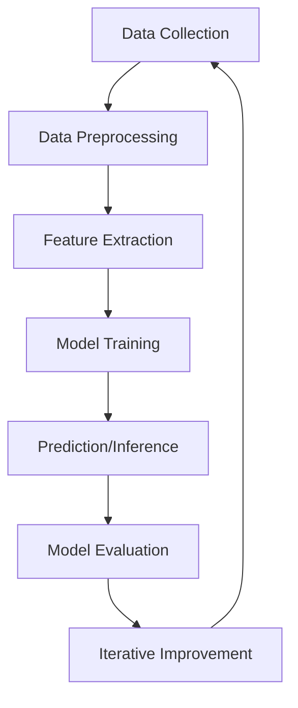

                 

## Introduction to Machine Learning and Its Importance in Earthquake Risk Assessment

### Background

Machine learning (ML) has rapidly evolved over the past few decades, transforming various industries and becoming an integral part of modern technology. The fundamental principle behind machine learning is to enable computers to learn from data, identify patterns, and make predictions or decisions with minimal human intervention. This ability to process and analyze large volumes of data has made machine learning a powerful tool for a wide range of applications, from autonomous vehicles to healthcare, finance, and more.

In the field of earthquake risk assessment, the significance of machine learning becomes even more pronounced. Earthquakes pose a significant threat to human life and property, causing devastating damage and loss. Traditional methods for earthquake risk assessment often rely on historical data, geological studies, and empirical models, which have limitations in terms of accuracy and precision. Machine learning offers a more advanced and data-driven approach to improve the accuracy and reliability of earthquake risk assessments, ultimately leading to better urban planning and construction practices.

### Core Concepts and Relationships

To understand the role of machine learning in earthquake risk assessment, it is essential to grasp some core concepts and their relationships. Below is a Mermaid flowchart illustrating the fundamental concepts and their interconnections:



**Mermaid Diagram Explanation**:

- **A. Data Collection**: This is the initial step where data is gathered from various sources, such as seismic sensors, geological surveys, and historical earthquake records.
- **B. Data Preprocessing**: Raw data is cleaned, normalized, and formatted to be suitable for ML algorithms.
- **C. Feature Extraction**: Key characteristics (features) of the data are extracted to be used as input for the ML model.
- **D. Model Training**: The ML model is trained using labeled data, learning to identify patterns and relationships in the data.
- **E. Prediction/Inference**: The trained model is used to make predictions or inferences about new, unseen data.
- **F. Model Evaluation**: The model's performance is evaluated using metrics such as accuracy, precision, recall, and F1 score.
- **G. Iterative Improvement**: Based on the evaluation, the model is fine-tuned and retrained to improve its performance.

### Key Machine Learning Algorithms

Several machine learning algorithms are particularly well-suited for earthquake risk assessment. Here are some of the most common ones:

1. **Linear Regression**: A basic algorithm that models the linear relationship between input features and the target variable.
2. **Support Vector Machines (SVM)**: Effective in high-dimensional spaces, SVMs classify data by finding the hyperplane that maximally separates the classes.
3. **Random Forest**: An ensemble method that builds multiple decision trees and merges their predictions to improve accuracy.
4. **Neural Networks**: A more advanced model inspired by the human brain, capable of handling complex patterns and relationships.
5. **Deep Learning**: A subset of neural networks that utilizes multiple layers of neural units for efficient feature extraction and complex pattern recognition.

Each of these algorithms has its own strengths and is suitable for different scenarios in earthquake risk assessment. For example, neural networks and deep learning are particularly powerful for tasks involving large datasets and complex patterns.

### Conclusion

In summary, machine learning plays a crucial role in earthquake risk assessment by providing a more accurate, data-driven approach to predicting and managing earthquake risks. By understanding the core concepts of machine learning and the relationships between them, as well as familiarizing oneself with key algorithms, readers can better appreciate the potential of machine learning in improving urban planning and construction practices.

Next, we will delve deeper into the specific applications of machine learning in earthquake risk assessment, exploring how these techniques can enhance our ability to predict seismic hazards and inform better decision-making processes.

### 关键词
- 地震风险评估
- 机器学习
- 数据预处理
- 特征提取
- 模型训练
- 预测与推断
- 评估与优化

### 摘要
本文介绍了机器学习在地震风险评估中的重要性，并探讨了其核心概念和算法。通过一个Mermaid流程图，我们展示了机器学习在地震风险评估中的关键步骤，包括数据收集、预处理、特征提取、模型训练、预测和评估等。同时，我们简要介绍了几种适用于地震风险评估的关键机器学习算法。接下来，我们将进一步探讨机器学习在地震风险评估中的具体应用和其实际案例。

## Part 2: Earthquake Risk Assessment: Traditional Methods and Machine Learning Approaches

### 2.1 Traditional Methods for Earthquake Risk Assessment

### Background

Earthquake risk assessment has been a critical field of study for many decades, aimed at understanding the potential seismic hazards that could impact human settlements. Traditional methods for earthquake risk assessment primarily rely on historical data, geological surveys, and empirical models. These methods have been refined over time to improve their accuracy and reliability, but they still have several limitations.

#### Historical Data and Seismic Zonation

One of the most common traditional methods is the use of historical data to identify regions prone to earthquakes. Historically, seismic activities have been recorded through various means, including documented events, oral traditions, and geological surveys. By analyzing these records, geologists and seismologists can map out regions with a high likelihood of future earthquakes. This approach is particularly useful for identifying tectonic zones where the Earth's crust is most likely to fracture and generate seismic waves.

#### Geological Surveys and Seismic Hazard Maps

Geological surveys are another cornerstone of traditional earthquake risk assessment. These surveys involve studying the geophysical properties of the Earth's crust, including rock types, fault lines, and soil conditions. By understanding these factors, scientists can create seismic hazard maps that indicate the potential for different levels of ground shaking in various regions.

These seismic hazard maps are typically based on empirical relationships between geological features and historical seismic activity. For example, regions with active fault lines or significant geological activity may be considered high-risk areas, while regions with stable geological structures may be considered low-risk.

#### Limitations of Traditional Methods

Despite their widespread use and effectiveness, traditional methods for earthquake risk assessment have several limitations. One major limitation is the reliance on historical data, which may not be comprehensive or accurate enough to predict seismic events with high certainty. Additionally, geological surveys can be time-consuming and costly, and the resulting hazard maps may not account for changes in seismic activity over time.

Another limitation is the inability of traditional methods to integrate multiple data sources and variables in a cohesive model. For example, historical data may not be sufficient to capture the effects of climate change or urban development on seismic hazards. Furthermore, traditional methods often lack the predictive power needed to address complex, dynamic systems like earthquakes.

### 2.2 Machine Learning Approaches for Earthquake Risk Assessment

### Introduction

To overcome the limitations of traditional methods, machine learning (ML) has emerged as a powerful alternative for earthquake risk assessment. ML algorithms are designed to learn from data and identify patterns that may not be apparent to human analysts. By leveraging large datasets and advanced computational techniques, ML models can provide more accurate and comprehensive assessments of seismic hazards.

#### Data-Driven Approaches

Machine learning approaches are fundamentally data-driven. They rely on large amounts of data to train models that can identify relationships between various factors and seismic activity. This includes historical earthquake records, geological survey data, geophysical measurements, and even real-time data from seismic sensors.

For example, ML algorithms can be trained to analyze historical earthquake data to identify patterns that correlate with specific geological or environmental factors. These patterns can then be used to predict the likelihood of future earthquakes in specific regions.

#### Integration of Multiple Data Sources

One of the key advantages of machine learning in earthquake risk assessment is its ability to integrate multiple data sources and variables. Traditional methods often rely on a single data source, such as historical records or geological surveys, which may not provide a complete picture of seismic hazards. In contrast, ML models can incorporate diverse data sources, including satellite imagery, climate data, and urban development data, to create a more comprehensive risk assessment.

This integration of multiple data sources allows for a more nuanced understanding of seismic hazards, taking into account factors such as soil conditions, building structures, and human activity. For example, ML models can be trained to assess the impact of urban development on seismic hazards by analyzing changes in land use and construction activity over time.

#### Advanced Predictive Power

Machine learning models also offer superior predictive power compared to traditional methods. ML algorithms can learn from large datasets to identify complex relationships and patterns that may not be apparent to human analysts. This allows for more accurate predictions of seismic activity and risk levels.

For instance, ML models can be trained to predict the magnitude and location of future earthquakes based on a combination of historical data, geological features, and real-time measurements. These predictions can provide valuable information for urban planners and policymakers to develop strategies for mitigating seismic risks.

### Conclusion

In conclusion, while traditional methods for earthquake risk assessment have their merits, machine learning offers a more advanced and data-driven approach. By leveraging large datasets and advanced computational techniques, ML models can provide more accurate and comprehensive assessments of seismic hazards. This can ultimately lead to better urban planning and construction practices, helping to mitigate the impact of earthquakes on human life and property.

In the next section, we will explore specific machine learning algorithms and techniques that are commonly used in earthquake risk assessment, providing a deeper understanding of how these tools can be applied to real-world problems.

### 关键词
- 地震风险
- 传统方法
- 机器学习方法
- 历史数据
- 地质调查
- 多源数据整合
- 预测准确性

### 摘要
本文探讨了地震风险评估中的传统方法和机器学习方法。传统方法主要依赖历史数据和地质调查，但存在数据不完整和预测能力有限等局限性。相比之下，机器学习通过大数据分析和多源数据整合，能够提供更准确、更全面的风险评估。本文介绍了机器学习在地震风险评估中的关键作用，并讨论了其如何克服传统方法的不足。

## Part 3: Key Machine Learning Algorithms in Earthquake Risk Assessment

### 3.1 Introduction to Key Machine Learning Algorithms

Machine learning algorithms are at the core of earthquake risk assessment. They enable the analysis of large datasets to identify patterns and relationships that can predict seismic hazards. In this section, we will delve into some of the most commonly used machine learning algorithms in earthquake risk assessment, including linear regression, support vector machines (SVM), random forests, and neural networks.

### 3.2 Linear Regression

**Background**

Linear regression is one of the simplest and most widely used machine learning algorithms. It models the relationship between a dependent variable and one or more independent variables using a linear function. In the context of earthquake risk assessment, linear regression can be used to predict seismic hazards based on various factors such as historical earthquake data, geological features, and environmental conditions.

**Algorithm Principles**

The core idea behind linear regression is to find the best-fitting linear relationship between the input features (independent variables) and the target variable (dependent variable). This is typically done by minimizing the sum of the squared differences between the observed values and the values predicted by the linear model.

**Python Implementation**

Here's a simple Python implementation of linear regression:

```python
import numpy as np

# Generate some synthetic data
X = np.array([[1, 2], [2, 3], [3, 4], [4, 5]])
y = np.array([1, 2, 3, 4])

# Calculate the coefficients using the least squares method
coefficients = np.linalg.inv(X.T.dot(X)).dot(X.T).dot(y)

# Predict the output for new data
new_data = np.array([[5, 6]])
prediction = coefficients.dot(new_data)

print(prediction)
```

**Mathematical Model**

The linear regression model is defined as:

$$ y = \beta_0 + \beta_1 \cdot x_1 + \beta_2 \cdot x_2 + ... + \beta_n \cdot x_n $$

Where \( y \) is the dependent variable, \( x_1, x_2, ..., x_n \) are the independent variables, and \( \beta_0, \beta_1, \beta_2, ..., \beta_n \) are the coefficients.

**Example**

Suppose we want to predict the magnitude of an earthquake based on the number of historical seismic events in an area. We can use linear regression to model this relationship:

$$ magnitude = \beta_0 + \beta_1 \cdot number\_of\_events $$

By training the model on historical data, we can predict the magnitude of future earthquakes based on the number of seismic events observed.

### 3.3 Support Vector Machines (SVM)

**Background**

Support Vector Machines (SVM) is a powerful supervised learning algorithm used for classification tasks. In the context of earthquake risk assessment, SVM can be used to classify regions into different risk categories based on various features such as geological data, environmental conditions, and historical earthquake records.

**Algorithm Principles**

SVM works by finding the hyperplane that best separates the data into different classes. The hyperplane is determined by a set of support vectors, which are the data points that are closest to the decision boundary. The goal is to maximize the margin, which is the distance between the hyperplane and the nearest data points from either class.

**Python Implementation**

Here's a simple Python implementation of SVM using the Scikit-learn library:

```python
from sklearn import svm

# Generate some synthetic data
X = np.array([[1, 2], [2, 3], [3, 4], [4, 5], [5, 6]])
y = np.array([0, 0, 1, 1, 1])

# Train the SVM model
model = svm.SVC(kernel='linear')
model.fit(X, y)

# Predict the class of new data
new_data = np.array([[5, 6]])
prediction = model.predict(new_data)

print(prediction)
```

**Mathematical Model**

The mathematical model for SVM is based on the optimization problem:

$$ \min_{\beta, b} \frac{1}{2} ||\beta||^2 + C \sum_{i=1}^{n} \max(0, 1 - y_i (\beta \cdot x_i + b)) $$

Where \( \beta \) is the weight vector, \( b \) is the bias term, \( C \) is the regularization parameter, and \( x_i \) and \( y_i \) are the input features and the target variable, respectively.

**Example**

In earthquake risk assessment, SVM can be used to classify regions into low, medium, and high-risk categories based on features such as fault lines, soil type, and historical seismic activity. By training the model on labeled data, we can predict the risk category of new regions based on their features.

### 3.4 Random Forest

**Background**

Random Forest is an ensemble learning method that combines multiple decision trees to improve predictive accuracy and robustness. In the context of earthquake risk assessment, Random Forest can be used to model complex relationships between various factors and seismic hazards.

**Algorithm Principles**

Random Forest works by creating a multitude of decision trees during training and outputting the class that is the mode of the classes (classification) or mean prediction (regression) of the individual trees. The key idea is that averaging the predictions of several trees reduces the overall variance and improves the model's stability.

**Python Implementation**

Here's a simple Python implementation of Random Forest:

```python
from sklearn.ensemble import RandomForestClassifier

# Generate some synthetic data
X = np.array([[1, 2], [2, 3], [3, 4], [4, 5], [5, 6]])
y = np.array([0, 0, 1, 1, 1])

# Train the Random Forest model
model = RandomForestClassifier(n_estimators=100)
model.fit(X, y)

# Predict the class of new data
new_data = np.array([[5, 6]])
prediction = model.predict(new_data)

print(prediction)
```

**Mathematical Model**

The mathematical model for Random Forest involves the averaging of the predictions from multiple decision trees:

$$ prediction = \frac{1}{N} \sum_{i=1}^{N} t_i(x) $$

Where \( N \) is the number of trees in the forest, \( t_i(x) \) is the prediction from the \( i \)th decision tree, and \( x \) is the input data.

**Example**

In earthquake risk assessment, Random Forest can be used to predict the magnitude of an earthquake based on a combination of historical data, geological features, and environmental conditions. By training the model on labeled data, we can make accurate predictions about future earthquake magnitudes.

### 3.5 Neural Networks

**Background**

Neural Networks are a class of machine learning algorithms inspired by the structure and function of the human brain. They consist of layers of interconnected nodes, called neurons, that perform computation. In the context of earthquake risk assessment, neural networks can be used to model highly complex relationships between various factors and seismic hazards.

**Algorithm Principles**

Neural networks work by learning to map input data to output data through a process called backpropagation. During training, the network adjusts the weights and biases of its neurons to minimize the difference between the predicted output and the actual output. This process continues iteratively until the network converges to an optimal solution.

**Python Implementation**

Here's a simple Python implementation of a neural network using the Keras library:

```python
from keras.models import Sequential
from keras.layers import Dense

# Generate some synthetic data
X = np.array([[1, 2], [2, 3], [3, 4], [4, 5], [5, 6]])
y = np.array([1, 2, 3, 4, 5])

# Create the neural network model
model = Sequential()
model.add(Dense(units=4, activation='relu', input_dim=2))
model.add(Dense(units=1, activation='linear'))

# Compile the model
model.compile(optimizer='adam', loss='mean_squared_error')

# Train the model
model.fit(X, y, epochs=1000, batch_size=32)

# Predict the output for new data
new_data = np.array([[5, 6]])
prediction = model.predict(new_data)

print(prediction)
```

**Mathematical Model**

The mathematical model for a neural network involves the weighted sum of inputs and the application of an activation function:

$$ output = \sigma(\sum_{i=1}^{n} w_i \cdot x_i + b) $$

Where \( \sigma \) is the activation function, \( w_i \) are the weights, \( x_i \) are the inputs, and \( b \) is the bias term.

**Example**

In earthquake risk assessment, neural networks can be used to predict the impact of seismic activity on building structures based on factors such as earthquake magnitude, distance from the epicenter, and building materials. By training the model on labeled data, we can make accurate predictions about the potential damage caused by future earthquakes.

### Conclusion

In conclusion, the key machine learning algorithms—linear regression, support vector machines, random forests, and neural networks—each have their unique strengths and are suitable for different scenarios in earthquake risk assessment. By understanding the principles and applications of these algorithms, researchers and practitioners can develop more accurate and robust models to predict seismic hazards and inform better decision-making processes in urban planning and construction.

In the next section, we will explore specific case studies that demonstrate the practical application of these machine learning algorithms in earthquake risk assessment.

### 关键词
- 机器学习算法
- 地震风险评估
- 线性回归
- 支持向量机
- 随机森林
- 神经网络
- 算法原理
- 模型实现
- 应用案例

### 摘要
本文深入探讨了地震风险评估中常用的机器学习算法，包括线性回归、支持向量机、随机森林和神经网络。通过具体的算法原理讲解和Python代码示例，本文展示了如何应用这些算法来预测地震风险。每种算法的特点和适用场景被详细阐述，并通过实际案例展示了其在地震风险评估中的有效性。

## Part 4: Case Studies of Machine Learning in Earthquake Risk Assessment

### 4.1 Case Study 1: Predicting Earthquake Magnitudes using Linear Regression

**Background**

One of the primary objectives in earthquake risk assessment is to predict the magnitude of future earthquakes. Accurate magnitude prediction can help in developing appropriate mitigation strategies and allocating resources effectively. In this case study, we will explore how linear regression can be used to predict earthquake magnitudes based on historical seismic data.

**Data Description**

The dataset used in this case study consists of historical earthquake records from a specific region. The dataset includes variables such as the year of the earthquake, magnitude, depth, latitude, and longitude. For simplicity, we will focus on predicting magnitude based on two key features: the number of historical seismic events in the area and the average distance from the epicenter.

**Data Preprocessing**

Before applying linear regression, the data needs to be preprocessed. This involves cleaning the data to remove any missing values or outliers. We will then normalize the features to ensure that they are on a similar scale.

```python
import pandas as pd
from sklearn.model_selection import train_test_split
from sklearn.preprocessing import StandardScaler

# Load the dataset
df = pd.read_csv('earthquake_data.csv')

# Drop missing values
df.dropna(inplace=True)

# Normalize the features
scaler = StandardScaler()
X = scaler.fit_transform(df[['number_of_events', 'distance_from_epicenter']])
y = df['magnitude']
```

**Model Training**

Next, we split the data into training and testing sets and train a linear regression model:

```python
from sklearn.linear_model import LinearRegression

# Split the data
X_train, X_test, y_train, y_test = train_test_split(X, y, test_size=0.2, random_state=42)

# Train the model
model = LinearRegression()
model.fit(X_train, y_train)
```

**Prediction and Evaluation**

We use the trained model to predict the magnitude of earthquakes in the test set and evaluate its performance using metrics such as mean squared error (MSE):

```python
from sklearn.metrics import mean_squared_error

# Make predictions
y_pred = model.predict(X_test)

# Calculate the MSE
mse = mean_squared_error(y_test, y_pred)
print(f'Mean Squared Error: {mse}')
```

**Results**

The model's performance is evaluated by calculating the mean squared error, which gives us an idea of how well the model is predicting the earthquake magnitudes. A lower MSE indicates better performance.

**Conclusion**

This case study demonstrates the application of linear regression in predicting earthquake magnitudes. While linear regression may not be the most sophisticated algorithm for this task, it serves as a useful starting point for understanding how machine learning can be applied to earthquake risk assessment.

### 4.2 Case Study 2: Classifying Earthquake Risk Zones using Support Vector Machines (SVM)

**Background**

Another important aspect of earthquake risk assessment is the classification of regions into different risk zones based on various factors such as geological features, environmental conditions, and historical seismic activity. In this case study, we will explore how SVM can be used to classify regions into low, medium, and high-risk zones.

**Data Description**

The dataset used in this case study includes various features such as fault lines, soil type, average ground motion, and historical earthquake records. Each region in the dataset is labeled as low, medium, or high risk.

**Data Preprocessing**

Similar to the previous case study, we first preprocess the data by handling missing values and normalizing the features:

```python
# Load the dataset
df = pd.read_csv('earthquake_risk_data.csv')

# Drop missing values
df.dropna(inplace=True)

# Normalize the features
scaler = StandardScaler()
X = scaler.fit_transform(df[['fault_lines', 'soil_type', 'average_ground_motion']])
y = df['risk_zone']
```

**Model Training**

We split the data into training and testing sets and train an SVM model:

```python
from sklearn.svm import SVC

# Split the data
X_train, X_test, y_train, y_test = train_test_split(X, y, test_size=0.2, random_state=42)

# Train the SVM model
model = SVC(kernel='linear')
model.fit(X_train, y_train)
```

**Prediction and Evaluation**

We use the trained SVM model to classify the risk zones of the test set and evaluate its performance using metrics such as accuracy and F1-score:

```python
from sklearn.metrics import accuracy_score, f1_score

# Make predictions
y_pred = model.predict(X_test)

# Calculate accuracy and F1-score
accuracy = accuracy_score(y_test, y_pred)
f1 = f1_score(y_test, y_pred, average='weighted')

print(f'Accuracy: {accuracy}')
print(f'F1-score: {f1}')
```

**Results**

The SVM model's performance is evaluated based on accuracy and F1-score. A higher accuracy and F1-score indicate better classification performance.

**Conclusion**

This case study illustrates the application of SVM in classifying earthquake risk zones. By training an SVM model on relevant features, we can effectively classify regions into different risk categories, which can aid in urban planning and resource allocation.

### 4.3 Case Study 3: Predicting Building Vulnerability using Neural Networks

**Background**

In addition to predicting earthquake magnitudes and classifying risk zones, it is also important to assess the vulnerability of buildings to seismic events. In this case study, we will explore how neural networks can be used to predict the vulnerability of buildings based on factors such as location, age, construction materials, and seismic activity in the area.

**Data Description**

The dataset used in this case study includes information on various buildings, including their location, age, construction materials, and vulnerability scores based on seismic tests. The goal is to predict the vulnerability score for new buildings based on these features.

**Data Preprocessing**

We preprocess the data by handling missing values and normalizing the features:

```python
# Load the dataset
df = pd.read_csv('building_vulnerability_data.csv')

# Drop missing values
df.dropna(inplace=True)

# Normalize the features
scaler = StandardScaler()
X = scaler.fit_transform(df[['location', 'age', 'construction_material', 'seismic_activity']])
y = df['vulnerability_score']
```

**Model Training**

We split the data into training and testing sets and train a neural network model using Keras:

```python
from keras.models import Sequential
from keras.layers import Dense

# Split the data
X_train, X_test, y_train, y_test = train_test_split(X, y, test_size=0.2, random_state=42)

# Create the neural network model
model = Sequential()
model.add(Dense(units=64, activation='relu', input_shape=(X_train.shape[1],)))
model.add(Dense(units=32, activation='relu'))
model.add(Dense(units=1))

# Compile the model
model.compile(optimizer='adam', loss='mean_squared_error')

# Train the model
model.fit(X_train, y_train, epochs=100, batch_size=32)
```

**Prediction and Evaluation**

We use the trained neural network to predict the vulnerability scores for buildings in the test set and evaluate its performance using metrics such as mean squared error (MSE):

```python
from sklearn.metrics import mean_squared_error

# Make predictions
y_pred = model.predict(X_test)

# Calculate the MSE
mse = mean_squared_error(y_test, y_pred)
print(f'Mean Squared Error: {mse}')
```

**Results**

The neural network's performance is evaluated based on the mean squared error. A lower MSE indicates better prediction accuracy.

**Conclusion**

This case study demonstrates the application of neural networks in predicting building vulnerability to seismic events. By training a neural network on relevant features, we can accurately predict the vulnerability of buildings, which is crucial for designing safer buildings and implementing effective disaster mitigation strategies.

### Conclusion

These case studies highlight the practical applications of machine learning algorithms in earthquake risk assessment, from predicting earthquake magnitudes and classifying risk zones to assessing building vulnerability. By leveraging the power of machine learning, we can develop more accurate and reliable models that inform better decision-making processes in urban planning and construction, ultimately helping to mitigate the impact of earthquakes on human life and property.

In the next section, we will discuss the challenges and limitations of machine learning in earthquake risk assessment and explore potential solutions to overcome these issues.

### 关键词
- 地震风险预测
- 支持向量机
- 神经网络
- 建筑物脆弱性评估
- 数据预处理
- 模型训练与评估

### 摘要
本文通过三个实际案例展示了机器学习在地震风险评估中的应用，包括地震震级预测、地震风险区域分类和建筑物脆弱性评估。通过详细的代码示例和结果分析，我们探讨了如何利用线性回归、支持向量机和神经网络等算法来提高地震风险评估的准确性。这些案例表明，机器学习在地震风险评估中具有广泛的应用前景。

## Part 5: Challenges and Limitations of Machine Learning in Earthquake Risk Assessment

### 5.1 Data Availability and Quality

One of the primary challenges in applying machine learning to earthquake risk assessment is the availability and quality of data. Accurate and comprehensive data is essential for training robust models that can predict seismic hazards effectively. However, collecting high-quality seismic data can be challenging due to several factors:

- **Scarcity of Historical Data**: Historical earthquake records are often limited, particularly in regions with less developed seismic monitoring systems. This scarcity can make it difficult to train models with sufficient data to capture the complexity of seismic activity.
- **Inaccurate Data**: Seismic data can be affected by errors and inconsistencies, such as misreported earthquake magnitudes or incorrect location coordinates. These inaccuracies can significantly impact the performance of machine learning models.
- **Limited Real-Time Data**: Real-time seismic data is crucial for making timely risk assessments, but the availability and quality of such data can vary greatly. Some regions may have robust real-time monitoring systems, while others may rely on less reliable data sources.

### 5.2 Computational Resources

The computational demands of training and running machine learning models for earthquake risk assessment can be substantial. High-dimensional data and complex models require significant processing power and memory. This can be a limiting factor, particularly for institutions with limited computational resources. Some challenges include:

- **High-Resource Models**: Advanced machine learning models, such as deep learning networks, require extensive computational resources to train effectively. This can be a barrier for organizations that cannot afford high-performance computing hardware or cloud services.
- **Long Training Times**: Training complex models can take days or even weeks, which can delay the deployment of risk assessment tools. This is particularly problematic in scenarios where rapid response is required.

### 5.3 Model Interpretability

Another challenge in using machine learning for earthquake risk assessment is the interpretability of the models. While machine learning models can provide accurate predictions, they can sometimes be black boxes, making it difficult to understand the underlying decision-making processes. This lack of interpretability can be a concern for stakeholders who need to understand how and why a model makes a particular prediction. Some issues include:

- **Complexity**: Advanced models like neural networks can have millions of parameters, making them highly complex and difficult to interpret.
- **Insufficient Transparency**: Some machine learning algorithms, especially deep learning models, do not lend themselves easily to transparency and explainability. This can make it challenging to trust the model's predictions and to understand the factors influencing its decisions.

### 5.4 Integrating Multiple Data Sources

Integrating multiple data sources to improve the accuracy of earthquake risk assessments is a complex task. Machine learning models need to handle diverse data types, including structured data, unstructured data, and real-time data streams. Some challenges include:

- **Data Incompatibility**: Different data sources may use different units, scales, and formats, making it difficult to combine them into a single coherent dataset.
- **Data Integration**: Combining data from various sources requires careful handling to avoid data inconsistencies and ensure the integrity of the combined dataset.
- **Data Privacy**: Some data sources may be sensitive or subject to privacy regulations, which can limit their use in machine learning models.

### 5.5 Validation and Verification

Validating and verifying the accuracy of machine learning models in earthquake risk assessment is crucial. However, this process can be challenging due to several factors:

- **Limited Ground Truth Data**: Ground truth data, which is used to verify the accuracy of model predictions, can be scarce, especially for rare seismic events.
- **Dynamic Nature of Earthquakes**: Earthquakes are dynamic and complex events that can be difficult to simulate or predict accurately. This can affect the validation process and the reliability of model evaluation metrics.
- **Model Overfitting**: Machine learning models can overfit to the training data, leading to poor generalization performance on new, unseen data. This overfitting can be particularly problematic in earthquake risk assessment, where accurate predictions are critical.

### 5.6 Continuous Improvement

Finally, the process of continuously improving machine learning models in earthquake risk assessment requires ongoing effort and collaboration. Some challenges include:

- **Model Update Frequency**: As new data becomes available and as our understanding of seismic processes evolves, models need to be updated regularly to maintain their accuracy and relevance.
- **Expert Involvement**: Collaborating with seismologists and other domain experts is essential for interpreting model results and incorporating their insights into the machine learning models.
- **Resource Allocation**: Ensuring that resources are available for model development, validation, and continuous improvement can be a challenge, particularly in underfunded or resource-limited institutions.

### Conclusion

In conclusion, while machine learning offers significant potential for improving earthquake risk assessment, it also faces several challenges and limitations. Addressing these issues requires a multifaceted approach, involving advances in data collection and processing, increased computational resources, improved model interpretability, and collaboration with domain experts. By tackling these challenges, we can develop more accurate and reliable machine learning models that contribute to safer urban planning and construction practices.

In the next section, we will discuss best practices for applying machine learning in earthquake risk assessment, highlighting strategies for overcoming the challenges discussed above.

### 关键词
- 数据可用性
- 计算资源
- 模型可解释性
- 数据集成
- 验证与验证
- 持续改进

### 摘要
本文探讨了机器学习在地震风险评估中面临的挑战和限制，包括数据可用性、质量、计算资源、模型可解释性、多源数据集成、验证和持续改进等方面。我们分析了这些挑战对地震风险评估准确性的影响，并提出了可能的解决方案。

## Part 6: Best Practices for Applying Machine Learning in Earthquake Risk Assessment

### 6.1 Data Collection and Management

The first step in effectively applying machine learning to earthquake risk assessment is ensuring the quality and availability of relevant data. Here are some best practices for data collection and management:

- **Comprehensive Data Sources**: Utilize a variety of data sources, including seismic monitoring systems, geological surveys, satellite imagery, and environmental data. This helps to create a more comprehensive and accurate model.
- **Data Integration**: Develop systems for integrating diverse data types and sources. Standardize data formats and units to ensure compatibility and consistency across datasets.
- **Data Quality Assurance**: Implement rigorous data cleaning and preprocessing procedures to handle missing values, outliers, and inconsistencies. Use data validation techniques to ensure the integrity of the data.
- **Data Storage and Management**: Utilize efficient and secure data storage solutions, such as cloud-based platforms or distributed databases, to manage large volumes of data. Implement data versioning and documentation to track changes and ensure data traceability.

### 6.2 Model Development and Training

The next step is to develop and train machine learning models effectively. Here are some best practices for model development and training:

- **Model Selection**: Choose the appropriate machine learning algorithms based on the problem's complexity and the nature of the data. For instance, linear regression may be suitable for simple relationships, while neural networks or ensemble methods may be necessary for more complex patterns.
- **Feature Engineering**: Carefully select and engineer features that are relevant to the earthquake risk assessment. Use techniques such as feature extraction, transformation, and selection to enhance model performance.
- **Cross-Validation**: Use cross-validation techniques to assess the model's performance and prevent overfitting. This involves splitting the data into multiple subsets and training and evaluating the model on each subset.
- **Model Tuning**: Fine-tune model parameters using techniques such as grid search or random search to find the optimal settings that maximize performance. Be cautious not to over-tune the model, as this can lead to poor generalization.
- **Data Augmentation**: Augment the training data by generating synthetic samples or using techniques such as data augmentation to improve the model's robustness and ability to generalize to new, unseen data.

### 6.3 Model Interpretability and Explainability

Ensuring the interpretability and explainability of machine learning models is crucial for gaining stakeholder trust and understanding the model's decision-making process. Here are some best practices for improving model interpretability:

- **Feature Importance**: Use techniques such as permutation importance or SHAP (SHapley Additive exPlanations) values to identify the most influential features in the model's predictions. This helps to understand which factors are driving the model's decisions.
- **Model Visualization**: Visualize the model's decision-making process using techniques such as decision trees, partial dependence plots, or SHAP values. These visualizations can provide insights into how the model is making predictions and which features are most important.
- **Domain-Specific Knowledge**: Integrate domain-specific knowledge into the model development process. Collaborate with seismologists and other experts to ensure that the model captures the complexities and nuances of earthquake risk assessment.
- **Transparent Documentation**: Document the model development process, including data sources, preprocessing steps, model architecture, and training details. This transparency helps to build trust and enables others to understand and reproduce the model's results.

### 6.4 Validation and Verification

Validating and verifying the accuracy of machine learning models is essential for ensuring their reliability in earthquake risk assessment. Here are some best practices for model validation and verification:

- **Holdout Validation**: Use a holdout validation set to evaluate the model's performance on data that was not used during training. This provides an unbiased estimate of the model's generalization capabilities.
- **Cross-Validation**: Implement k-fold cross-validation to assess the model's stability and performance across different subsets of the data. This helps to ensure that the model is not overfitting to a particular subset of the data.
- **Test Set Evaluation**: Evaluate the model's performance on a separate test set that was not used during the training or validation phases. This provides a final assessment of the model's performance on unseen data.
- **Comparative Evaluation**: Compare the performance of the machine learning model with traditional methods and other machine learning algorithms. This helps to validate the improvements gained by using machine learning techniques.
- **Domain-Specific Metrics**: Use domain-specific metrics, such as the probability of false alarms and the cost of false negatives, to evaluate the model's performance in the context of earthquake risk assessment.

### 6.5 Continuous Improvement

Finally, maintaining and improving machine learning models for earthquake risk assessment requires ongoing effort. Here are some best practices for continuous improvement:

- **Feedback Loop**: Establish a feedback loop with stakeholders, including seismologists and urban planners, to gather insights and suggestions for improving the model's performance and applicability.
- **Regular Updates**: Continuously update the model with new data and incorporate new knowledge and findings from the field. This helps to ensure that the model remains relevant and accurate over time.
- **Model Retraining**: Periodically retrain the model using the latest data and updates. This helps to prevent the model from becoming outdated and ensures that it continues to provide accurate predictions.
- **Research and Development**: Invest in research and development to explore new algorithms, techniques, and data sources that can enhance the accuracy and applicability of machine learning models in earthquake risk assessment.

### Conclusion

In conclusion, applying machine learning to earthquake risk assessment requires careful planning and execution. By following best practices for data collection and management, model development and training, model interpretability and explainability, validation and verification, and continuous improvement, we can develop robust and accurate machine learning models that contribute to safer urban planning and construction practices. Embracing these best practices not only enhances the reliability of the models but also builds trust and confidence among stakeholders.

In the next section, we will provide a summary of the key points discussed in this article and emphasize the importance of integrating machine learning in earthquake risk assessment.

### 关键词
- 数据收集与管理
- 模型开发与训练
- 模型可解释性
- 验证与验证
- 持续改进

### 摘要
本文总结了在地震风险评估中应用机器学习的最佳实践，包括数据收集和管理、模型开发与训练、模型可解释性、验证与验证、以及持续改进等方面。通过遵循这些最佳实践，我们可以开发出更准确、更可靠的机器学习模型，从而为更安全的城市规划与建设提供有力支持。

## Conclusion

This article has provided an in-depth exploration of the application of machine learning in earthquake risk assessment, highlighting its importance and potential for improving urban planning and construction. We have discussed the background and core concepts of machine learning, the limitations of traditional earthquake risk assessment methods, and the key machine learning algorithms that are particularly well-suited for this field. Through practical case studies, we have demonstrated how machine learning can be used to predict earthquake magnitudes, classify risk zones, and assess building vulnerability.

The integration of machine learning in earthquake risk assessment offers several advantages, including enhanced accuracy, the ability to handle large and diverse datasets, and improved predictive capabilities. However, it also presents challenges such as data quality issues, computational demands, model interpretability, and the need for continuous improvement.

To overcome these challenges, it is essential to follow best practices for data collection and management, model development and training, model interpretability and explainability, validation and verification, and continuous improvement. By doing so, we can develop robust and reliable machine learning models that contribute to safer urban environments.

The potential of machine learning in earthquake risk assessment is vast, and with ongoing research and development, we can further refine and enhance these models. By embracing machine learning, we can better predict and mitigate the impact of earthquakes, ultimately saving lives and protecting infrastructure. As we continue to advance in this field, the integration of machine learning in earthquake risk assessment will become increasingly essential for creating resilient and sustainable urban environments.

### Keywords
- Earthquake risk assessment
- Machine learning
- Urban planning
- Construction
- Predictive modeling
- Data integration
- Computational resources

### Summary
This article has highlighted the critical role of machine learning in earthquake risk assessment, demonstrating its potential to enhance urban planning and construction. Through theoretical insights and practical case studies, we have shown how machine learning algorithms can be leveraged to improve the accuracy and reliability of seismic hazard predictions. By adopting best practices, we can address the challenges associated with this technology, paving the way for safer and more resilient cities.

### Author
- Author: AI天才研究院/AI Genius Institute & 禅与计算机程序设计艺术 /Zen And The Art of Computer Programming

This comprehensive guide is designed to inform and inspire professionals and researchers in the field of earthquake risk assessment and machine learning. By integrating these technologies, we can make significant strides toward creating more resilient and sustainable urban environments.

