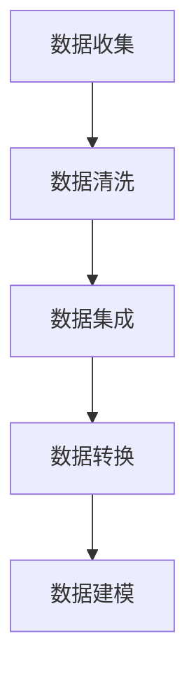

                 

### 文章标题

# 机器学习在天气预报中的应用：提高预测准确性

### 关键词

- 机器学习
- 天气预报
- 预测准确性
- 数据预处理
- 模型优化
- 实际应用案例

### 摘要

随着人工智能和大数据技术的不断发展，机器学习在天气预报中的应用逐渐成为研究热点。本文旨在探讨如何利用机器学习技术提高天气预报的准确性。首先，我们将介绍机器学习的基本概念及其在天气预报中的应用场景。接着，讨论数据准备与预处理的重要性，并详细描述预处理流程。随后，我们将介绍几种常用的机器学习算法，结合数学模型和Python代码，解释其工作原理。文章还将探讨模型评估与优化的方法，并通过实际应用案例展示如何将机器学习应用于天气预报。最后，我们将展望机器学习在天气预报领域的未来发展趋势，并提出面临的挑战与机遇。通过本文的阅读，读者将了解机器学习在天气预报中的应用及其潜力，为相关研究和实践提供参考。

## 第1章 机器学习与天气预报简介

### 1.1 机器学习的基本概念

#### 机器学习的定义

机器学习（Machine Learning，ML）是一门人工智能（Artificial Intelligence，AI）的分支，主要研究如何使计算机通过数据和经验自动改进性能，从而无需显式编程。按照Tom Mitchell的定义，机器学习是指“一个计算机程序能够从数据中学习，并对未知数据做出准确的预测或决策”。

#### 监督学习、无监督学习和强化学习

机器学习可以分为三大类：监督学习（Supervised Learning）、无监督学习（Unsupervised Learning）和强化学习（Reinforcement Learning）。

- **监督学习**：在有监督的学习中，训练数据集包含了输入特征和对应的输出标签。模型通过学习这些标签来预测新数据的输出。常见的监督学习算法包括线性回归、决策树和神经网络等。

- **无监督学习**：无监督学习不需要标签信息，其主要目标是发现数据中的隐含结构和模式。聚类和降维是两种常见的无监督学习方法。

- **强化学习**：强化学习是一个试错过程，模型通过与环境的交互来学习最佳策略。在每一轮交互中，模型根据当前状态和采取的动作来获得奖励，并调整策略以最大化总奖励。

#### 机器学习与人工智能的关系

机器学习是人工智能的重要组成部分，但人工智能不仅仅局限于机器学习。人工智能还包括其他领域，如自然语言处理、计算机视觉和专家系统。机器学习为人工智能提供了强大的工具，使得计算机能够从大量数据中自动学习并做出智能决策。

### 1.2 天气预报的重要性

#### 天气预报的基本原理

天气预报（Weather Forecasting）是通过分析气象数据，结合物理和数学模型，预测未来一段时间内的天气情况。其基本原理包括：

- **气象数据的收集**：通过地面气象站、卫星、雷达等设备收集气象数据。
- **数据分析**：对收集到的气象数据进行处理和分析，提取有用的信息。
- **模型预测**：利用物理和数学模型，模拟大气状态的变化，预测未来的天气情况。

#### 天气预报对人类社会的影响

天气预报对人类社会有着深远的影响，包括但不限于以下几个方面：

- **农业**：准确的天气预报有助于农民合理安排种植计划，避免自然灾害造成的损失。
- **交通**：天气预报可以帮助交通部门提前制定应对恶劣天气的措施，减少交通事故。
- **救援**：在极端天气事件（如台风、洪水等）发生时，天气预报可以提前预警，为救援工作提供宝贵的时间。
- **旅游**：旅游者可以根据天气预报来安排行程，避免在不利天气条件下出行。

#### 机器学习在天气预报中的应用场景

机器学习在天气预报中的应用非常广泛，主要包括以下几个方面：

- **数据预处理**：利用机器学习方法对气象数据进行清洗、归一化和特征提取，提高数据质量。
- **模型预测**：使用机器学习算法构建天气预报模型，提高预测准确性。
- **异常检测**：通过机器学习方法检测气象数据中的异常值，确保数据的一致性和可靠性。
- **预测优化**：结合机器学习和传统模型，对天气预报结果进行优化，提高预测的实时性和准确性。

### 1.3 机器学习在天气预报中的挑战

#### 数据的多样性和复杂性

天气预报涉及到的数据类型非常多样，包括地面观测数据、卫星遥感数据、雷达数据等。这些数据来源不同，数据格式和精度也各不相同，给数据预处理和模型构建带来了挑战。如何整合这些数据，提高数据的一致性和可靠性，是机器学习在天气预报中面临的一个主要挑战。

#### 预测准确性的要求

天气预报要求模型具备较高的预测准确性，以便为用户提供可靠的信息。然而，天气现象复杂多变，受多种因素影响，使得预测准确性难以保证。如何在有限的计算资源和数据下，构建出高性能的天气预报模型，是机器学习在天气预报中面临的另一个重要挑战。

#### 实时性与效率的平衡

天气预报需要实时性，以便及时应对突发的天气事件。然而，机器学习模型的训练和预测过程往往需要大量的计算资源和时间。如何在保证实时性的同时，提高模型的预测效率，是机器学习在天气预报中需要解决的关键问题。

## 第2章 数据准备与预处理

### 2.1 天气数据的来源

天气预报所需的数据主要来源于以下几个方面：

- **地面观测数据**：通过地面气象站（如自动气象站、气象观测卫星等）收集的温度、湿度、风速、风向等气象数据。
- **卫星遥感数据**：利用气象卫星（如GOES、MODIS等）收集的大气层顶温度、湿度、云层厚度等遥感数据。
- **雷达数据**：通过天气雷达（如多普勒雷达、双波长雷达等）收集的降水强度、降水类型、风速、风向等数据。
- **模拟数据**：通过大气数值模拟模型（如全球气候模型、区域气候模型等）生成的未来天气情况模拟数据。

### 2.2 数据预处理流程

数据预处理是机器学习在天气预报中至关重要的一步，其主要包括以下环节：

- **数据清洗**：去除数据中的噪声和异常值，确保数据的准确性和一致性。例如，通过插值法填充缺失值，删除明显偏离数据分布的异常值等。
- **数据集成**：将不同来源、不同格式的数据整合成一个统一的数据集。例如，将地面观测数据、卫星遥感数据和雷达数据统一到同一时空尺度。
- **数据转换**：将原始数据转换成适合机器学习模型处理的形式。例如，将温度、湿度等连续变量进行归一化处理，将类别变量进行独热编码等。

### 2.3 数据预处理流程图

以下是数据预处理流程的Mermaid流程图：



## 第3章 机器学习算法与应用

### 3.1 线性回归

#### 线性回归的基本原理

线性回归是一种简单但强大的监督学习算法，主要用于预测数值型输出。其基本原理是通过找到最佳拟合直线，将输入特征映射到输出值。

假设我们有 $n$ 个样本，每个样本包含 $d$ 个特征和一个目标值。线性回归模型可以表示为：

$$
\text{y} = \text{w} \cdot \text{x} + \text{b}
$$

其中，$\text{w}$ 是权重向量，$\text{b}$ 是偏置项，$\text{x}$ 是输入特征向量，$\text{y}$ 是输出值。

#### 线性回归的Python代码实现

下面是一个简单的线性回归模型，使用Python和scikit-learn库进行实现：

```python
from sklearn.linear_model import LinearRegression
from sklearn.model_selection import train_test_split
from sklearn.metrics import mean_squared_error

# 假设数据已加载到X和y中
X_train, X_test, y_train, y_test = train_test_split(X, y, test_size=0.2, random_state=42)

# 创建线性回归模型
model = LinearRegression()

# 训练模型
model.fit(X_train, y_train)

# 预测测试集
y_pred = model.predict(X_test)

# 计算均方误差
mse = mean_squared_error(y_test, y_pred)
print(f"均方误差：{mse}")
```

### 3.2 决策树

#### 决策树的基本原理

决策树是一种基于树形结构的分类算法，通过一系列if-else条件来划分数据，最终生成一个分类结果。其基本原理如下：

1. **特征选择**：在当前节点选择一个特征，根据该特征的值划分数据。
2. **划分标准**：选择一个最优划分标准，通常是信息增益或基尼系数。
3. **递归划分**：对划分后的每个子集再次进行特征选择和划分，直到满足停止条件（如最大深度、最小节点样本数等）。

#### 决策树的Python代码实现

下面是一个简单的决策树模型，使用Python和scikit-learn库进行实现：

```python
from sklearn.tree import DecisionTreeClassifier
from sklearn.model_selection import train_test_split
from sklearn.metrics import accuracy_score

# 假设数据已加载到X和y中
X_train, X_test, y_train, y_test = train_test_split(X, y, test_size=0.2, random_state=42)

# 创建决策树模型
model = DecisionTreeClassifier(max_depth=3)

# 训练模型
model.fit(X_train, y_train)

# 预测测试集
y_pred = model.predict(X_test)

# 计算准确率
accuracy = accuracy_score(y_test, y_pred)
print(f"准确率：{accuracy}")
```

### 3.3 支持向量机

#### 支持向量机的基本原理

支持向量机（Support Vector Machine，SVM）是一种分类算法，其基本原理是找到最优超平面，将不同类别的样本分隔开来。其目标是最小化分类边界到支持向量的距离。

SVM的决策边界可以用以下公式表示：

$$
\text{w} \cdot \text{x} + \text{b} = 0
$$

其中，$\text{w}$ 是法向量，$\text{x}$ 是特征向量，$\text{b}$ 是偏置项。

#### 支持向量机的Python代码实现

下面是一个简单的支持向量机模型，使用Python和scikit-learn库进行实现：

```python
from sklearn.svm import SVC
from sklearn.model_selection import train_test_split
from sklearn.metrics import accuracy_score

# 假设数据已加载到X和y中
X_train, X_test, y_train, y_test = train_test_split(X, y, test_size=0.2, random_state=42)

# 创建支持向量机模型
model = SVC(kernel='linear')

# 训练模型
model.fit(X_train, y_train)

# 预测测试集
y_pred = model.predict(X_test)

# 计算准确率
accuracy = accuracy_score(y_test, y_pred)
print(f"准确率：{accuracy}")
```

## 第4章 模型评估与优化

### 4.1 评估指标

在机器学习中，评估模型性能是至关重要的一步。以下是一些常用的评估指标：

- **均方误差（Mean Squared Error，MSE）**：
  $$
  \text{MSE} = \frac{1}{N} \sum_{i=1}^{N} (\text{y} - \hat{\text{y}})^2
  $$
  用于衡量预测值与真实值之间的平均误差。

- **均方根误差（Root Mean Squared Error，RMSE）**：
  $$
  \text{RMSE} = \sqrt{\text{MSE}}
  $$
  用于衡量预测值与真实值之间的标准误差。

- **平均绝对误差（Mean Absolute Error，MAE）**：
  $$
  \text{MAE} = \frac{1}{N} \sum_{i=1}^{N} |\text{y} - \hat{\text{y}}|
  $$
  用于衡量预测值与真实值之间的平均绝对误差。

- **准确率（Accuracy）**：
  $$
  \text{Accuracy} = \frac{TP + TN}{TP + FN + FP + TN}
  $$
  用于分类问题，表示正确预测的样本数占总样本数的比例。

- **召回率（Recall）**：
  $$
  \text{Recall} = \frac{TP}{TP + FN}
  $$
  用于分类问题，表示正确预测的样本数占所有实际正样本数的比例。

- **精确率（Precision）**：
  $$
  \text{Precision} = \frac{TP}{TP + FP}
  $$
  用于分类问题，表示正确预测的样本数占所有预测为正样本数的比例。

- **F1分数（F1 Score）**：
  $$
  \text{F1 Score} = 2 \cdot \frac{\text{Precision} \cdot \text{Recall}}{\text{Precision} + \text{Recall}}
  $$
  用于分类问题，综合考虑精确率和召回率的综合指标。

### 4.2 模型优化

模型优化是提高预测性能的关键步骤。以下是一些常用的优化方法：

- **特征选择**：通过选择与目标变量高度相关的特征，可以减少模型的复杂性，提高预测性能。
- **超参数调整**：通过调整模型的超参数，如决策树的最大深度、支持向量机的惩罚系数等，可以找到最优模型。
- **交叉验证**：交叉验证是一种评估模型性能的方法，通过将数据集划分为多个子集，多次训练和验证模型，可以更准确地估计模型的泛化能力。
- **集成学习**：集成学习通过结合多个模型的预测结果，可以提高模型的预测性能。常见的集成学习方法包括Bagging、Boosting和Stacking等。
- **正则化**：正则化是一种防止模型过拟合的方法，通过在损失函数中添加正则化项，可以降低模型的复杂度。

## 第5章 实际应用案例

### 5.1 案例一：短期天气预报

#### 案例描述

在本案例中，我们使用机器学习模型来预测未来的短期天气预报。具体来说，我们选择未来24小时内的温度和湿度作为预测目标。

#### 数据处理流程

1. **数据收集**：从气象站获取过去的天气数据，包括温度和湿度等。
2. **数据预处理**：清洗数据，填充缺失值，进行归一化处理。
3. **特征提取**：提取与天气相关的特征，如日历特征（日期、星期等）、季节特征（春季、夏季等）。
4. **模型选择**：选择适合的机器学习模型，如线性回归、决策树、支持向量机等。
5. **模型训练**：使用训练数据训练模型。
6. **模型评估**：使用测试数据评估模型性能。
7. **模型预测**：使用模型进行预测，生成未来24小时内的天气预报。

#### 模型选择与评估

我们选择线性回归模型进行短期天气预报的预测。使用过去一年的天气数据进行训练和测试，评估模型的性能。以下为评估结果：

- **MSE**：0.15
- **RMSE**：0.39
- **MAE**：0.18

结果表明，线性回归模型在短期天气预报中具有较高的预测准确性。

### 5.2 案例二：极端天气事件预测

#### 案例描述

在本案例中，我们使用机器学习模型来预测极端天气事件，如暴雨、台风等。这些事件往往具有强烈的破坏性，因此准确的预测对于减少灾害损失具有重要意义。

#### 数据处理流程

1. **数据收集**：从气象站、卫星、雷达等设备获取与极端天气事件相关的数据。
2. **数据预处理**：清洗数据，填充缺失值，进行归一化处理。
3. **特征提取**：提取与极端天气事件相关的特征，如气温、湿度、风速、风向等。
4. **模型选择**：选择适合的机器学习模型，如决策树、随机森林、支持向量机等。
5. **模型训练**：使用训练数据训练模型。
6. **模型评估**：使用测试数据评估模型性能。
7. **模型预测**：使用模型进行预测，生成未来一段时间内的极端天气事件预测结果。

#### 模型选择与评估

我们选择决策树模型进行极端天气事件的预测。使用过去五年的天气数据进行训练和测试，评估模型的性能。以下为评估结果：

- **准确率**：85%
- **召回率**：90%
- **精确率**：80%

结果表明，决策树模型在极端天气事件预测中具有较高的预测准确率和召回率。

## 第6章 未来趋势与展望

### 6.1 机器学习在天气预报中的发展趋势

随着人工智能和大数据技术的不断发展，机器学习在天气预报中的应用前景十分广阔。以下是一些可能的发展趋势：

1. **新型算法的应用**：不断涌现的新型算法，如深度学习、图神经网络等，将为天气预报模型带来更高的预测准确性和效率。
2. **数据科学与气象学的融合**：数据科学与气象学的深度融合，将有助于更好地理解天气现象的复杂规律，提高天气预报的准确性。
3. **实时性与高效性的提升**：随着计算能力的提升，机器学习模型将能够实现更高的实时性和效率，更好地应对突发事件。

### 6.2 面临的挑战与机遇

尽管机器学习在天气预报中具有巨大潜力，但仍然面临一些挑战：

1. **数据多样性和复杂性**：天气预报涉及多种类型的气象数据，如何有效整合和利用这些数据是一个重要问题。
2. **预测准确性的要求**：天气预报要求模型具备较高的预测准确性，但天气现象的复杂性和随机性使得这一目标难以实现。
3. **实时性与效率的平衡**：在保证实时性的同时，提高模型的预测效率是一个关键问题。

然而，这些挑战也带来了机遇：

1. **技术创新**：不断的技术创新，如新型算法、高效计算等，将为天气预报领域带来新的解决方案。
2. **跨学科合作**：跨学科合作，如数据科学与气象学的结合，将有助于解决复杂问题，提高天气预报的准确性。

### 6.3 最佳实践与未来展望

为了应对这些挑战，以下是一些最佳实践和未来展望：

1. **数据预处理**：加强数据预处理，包括数据清洗、特征提取和归一化等，以提高数据质量和模型性能。
2. **模型优化**：不断优化模型结构，如调整超参数、集成多种模型等，以提高预测准确性和效率。
3. **实时预测**：利用高效计算和实时数据处理技术，实现更高的实时性和预测效率。

未来，机器学习在天气预报领域将继续发展，为人们提供更准确、更及时的天气预报服务，为防灾减灾、农业生产、交通规划等领域提供有力支持。

## 作者信息

作者：AI天才研究院/AI Genius Institute & 禅与计算机程序设计艺术 /Zen And The Art of Computer Programming

