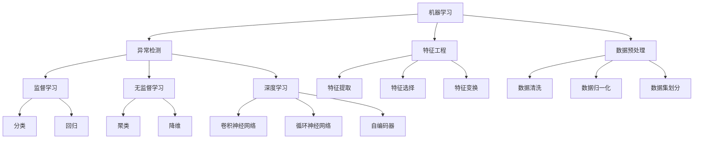

                 

## 《机器学习在异常检测中的高效应用》

### 背景介绍

异常检测，也称为异常挖掘或异常分析，是一种数据分析技术，旨在识别数据中的异常值或异常模式。在许多领域，如金融、医疗、网络安全和工业生产等，异常检测都扮演着至关重要的角色。随着大数据时代的到来，如何高效地检测异常成为了一个重要的研究课题。

机器学习，作为人工智能的一个重要分支，通过算法和统计模型来解析数据、学习数据中的规律，并从中预测或分类新的数据。近年来，机器学习在异常检测中的应用越来越广泛，其在处理大规模数据、提高检测效率和准确性方面展现出显著的优势。

本文将系统地探讨机器学习在异常检测中的高效应用，从基础理论到实际应用进行全面剖析。文章结构如下：

- **第一部分：机器学习基础知识**，介绍机器学习的基本概念、算法和原理。
- **第二部分：异常检测**，探讨异常检测的定义、分类和应用场景。
- **第三部分：机器学习在异常检测中的高效应用**，分析如何将机器学习技术应用于异常检测，提高检测效率。

### 核心概念与联系

为了更好地理解机器学习在异常检测中的应用，首先需要明确一些核心概念，并建立它们之间的关系。

**核心概念：**

1. **机器学习**：一种通过算法和统计模型，让计算机从数据中学习并做出预测或决策的技术。
2. **异常检测**：识别数据中的异常值或异常模式，从而发现潜在的问题或威胁。
3. **特征工程**：提取或构造有助于模型学习和预测的特征。
4. **数据预处理**：对数据进行清洗、归一化等处理，以便于模型学习和预测。
5. **监督学习**：在有标签数据上进行学习，例如分类和回归任务。
6. **无监督学习**：在无标签数据上进行学习，例如聚类和降维任务。
7. **深度学习**：一种基于多层神经网络的机器学习方法，适用于处理复杂数据。

**概念实体之间的关系架构：**



### 核心算法原理讲解

#### 监督学习算法

监督学习算法是一种常见的机器学习方法，它利用已知的输入和输出数据来训练模型，以便对新数据进行预测。以下是一些常用的监督学习算法：

1. **k-最近邻（k-NN）**

   **原理：** k-NN算法基于距离度量，找到训练集中与未知样本最近的k个样本，并根据这些样本的标签来预测新样本的标签。

   **数学模型：**
   $$\hat{y} = \arg\max_{c} \sum_{i=1}^{k} \frac{1}{d(x_i, x)} I(y_i = c)$$
   
   其中，$x$为未知样本，$x_i$为训练集中的样本，$d(x_i, x)$为$x_i$和$x$之间的距离，$I(y_i = c)$为指示函数，当$y_i = c$时取1，否则取0。

   **代码实现：**

   ```python
   from sklearn.neighbors import KNeighborsClassifier
   import numpy as np

   # 训练数据集
   X_train = np.array([[1, 2], [3, 4], [5, 6]])
   y_train = np.array(['a', 'b', 'a'])

   # 测试数据集
   X_test = np.array([[2, 3]])

   # 创建k-NN分类器
   knn = KNeighborsClassifier(n_neighbors=1)

   # 训练模型
   knn.fit(X_train, y_train)

   # 预测标签
   pred = knn.predict(X_test)

   print(pred)  # 输出预测结果
   ```

2. **支持向量机（SVM）**

   **原理：** SVM算法通过找到一个最佳的超平面，将不同类别的样本尽可能分开，从而实现分类。

   **数学模型：**
   $$\max_{\beta, \beta_0} W^T W - C \sum_{i=1}^{n} \xi_i$$
   $$s.t. y_i (\beta^T x_i + \beta_0) \geq 1 - \xi_i$$
   $$\xi_i \geq 0, \forall i$$
   
   其中，$W$为超平面参数，$\beta_0$为偏置项，$C$为惩罚参数，$\xi_i$为松弛变量。

   **代码实现：**

   ```python
   from sklearn.svm import SVC
   import numpy as np

   # 训练数据集
   X_train = np.array([[1, 2], [3, 4], [5, 6], [7, 8]])
   y_train = np.array(['a', 'b', 'a', 'b'])

   # 创建SVM分类器
   svm = SVC(kernel='linear')

   # 训练模型
   svm.fit(X_train, y_train)

   # 预测标签
   pred = svm.predict(X_test)

   print(pred)  # 输出预测结果
   ```

3. **决策树与随机森林**

   **原理：** 决策树通过一系列的判断条件来将样本划分为不同的类别。随机森林则是通过构建多棵决策树，并对它们的预测结果进行投票来得到最终预测结果。

   **数学模型：**
   决策树：
   $$y = f(x) = g(x_{i}, t_{i})$$
   随机森林：
   $$\hat{y} = \arg\max_{c} \sum_{i=1}^{m} \hat{w}_i I(y_i = c)$$
   
   其中，$g(x_{i}, t_{i})$为决策条件，$\hat{w}_i$为第$i$棵决策树的权重。

   **代码实现：**

   ```python
   from sklearn.tree import DecisionTreeClassifier
   from sklearn.ensemble import RandomForestClassifier
   import numpy as np

   # 训练数据集
   X_train = np.array([[1, 2], [3, 4], [5, 6], [7, 8]])
   y_train = np.array(['a', 'b', 'a', 'b'])

   # 创建决策树分类器
   dt = DecisionTreeClassifier()

   # 创建随机森林分类器
   rf = RandomForestClassifier(n_estimators=100)

   # 训练模型
   dt.fit(X_train, y_train)
   rf.fit(X_train, y_train)

   # 预测标签
   pred_dt = dt.predict(X_test)
   pred_rf = rf.predict(X_test)

   print(pred_dt)  # 输出决策树预测结果
   print(pred_rf)  # 输出随机森林预测结果
   ```

### 无监督学习算法

无监督学习算法在异常检测中也有广泛的应用，例如聚类和降维。

1. **k-均值聚类**

   **原理：** k-均值聚类通过迭代更新聚类中心，将样本划分为K个簇。

   **数学模型：**
   $$\text{iterate} \ \text{until convergence} \ \text{do}$$
   $$\qquad \mu_{k} = \frac{1}{n_{k}} \sum_{i=1}^{n} x_i$$
   $$\qquad x_i = \arg\min_{k} \sum_{j=1}^{K} (x_i - \mu_{k})^2$$
   $$\text{end}$$

   **代码实现：**

   ```python
   from sklearn.cluster import KMeans
   import numpy as np

   # 训练数据集
   X_train = np.array([[1, 2], [3, 4], [5, 6], [7, 8]])

   # 创建k-均值聚类模型
   kmeans = KMeans(n_clusters=2)

   # 训练模型
   kmeans.fit(X_train)

   # 预测聚类结果
   pred = kmeans.predict(X_test)

   print(pred)  # 输出预测结果
   ```

2. **主成分分析（PCA）**

   **原理：** PCA通过将数据投影到新的坐标系中，降维的同时保留数据的最大方差。

   **数学模型：**
   $$\text{Eigenvalue Decomposition} \ \text{of} \ \text{covariance matrix} \ C$$
   $$C = \text{V} \Lambda \text{V}^T$$
   $$\text{Select} \ k \ \text{eigenvalues} \ \text{and} \ \text{corresponding} \ \text{eigenvectors}$$
   $$\text{Project} \ \text{data} \ \text{onto} \ \text{new} \ \text{orthogonal} \ \text{basis} \ \text{using} \ \text{selected} \ \text{eigenvectors}$$

   **代码实现：**

   ```python
   from sklearn.decomposition import PCA
   import numpy as np

   # 训练数据集
   X_train = np.array([[1, 2], [3, 4], [5, 6], [7, 8]])

   # 创建PCA模型
   pca = PCA(n_components=2)

   # 训练模型
   pca.fit(X_train)

   # 降维
   X_train_pca = pca.transform(X_train)

   print(X_train_pca)  # 输出降维后的数据
   ```

### 深度学习算法

深度学习算法在异常检测中也展现出了强大的能力，以下介绍两种常用的深度学习算法：卷积神经网络（CNN）和循环神经网络（RNN）。

1. **卷积神经网络（CNN）**

   **原理：** CNN通过卷积操作提取图像中的特征，并在多层神经网络中逐步增强特征，从而实现图像分类。

   **数学模型：**
   $$\text{Convolution} \ \text{Layer:} \ h_{l} = \sigma(\text{W}_{l} \star \text{h}_{l-1} + \text{b}_{l})$$
   $$\text{Pooling} \ \text{Layer:} \ \text{h}_{l} = \text{Pooling}(\text{h}_{l-1})$$
   $$\text{Fully} \ \text{Connected} \ \text{Layer:} \ \text{h}_{L} = \sigma(\text{W}_{L} \text{h}_{L-1} + \text{b}_{L})$$

   **代码实现：**

   ```python
   from keras.models import Sequential
   from keras.layers import Conv2D, MaxPooling2D, Dense, Flatten

   # 创建CNN模型
   model = Sequential()
   model.add(Conv2D(32, (3, 3), activation='relu', input_shape=(28, 28, 1)))
   model.add(MaxPooling2D(pool_size=(2, 2)))
   model.add(Flatten())
   model.add(Dense(128, activation='relu'))
   model.add(Dense(10, activation='softmax'))

   # 编译模型
   model.compile(optimizer='adam', loss='categorical_crossentropy', metrics=['accuracy'])

   # 训练模型
   model.fit(X_train, y_train, epochs=10, batch_size=32, validation_data=(X_test, y_test))

   # 预测标签
   pred = model.predict(X_test)

   print(pred)  # 输出预测结果
   ```

2. **循环神经网络（RNN）**

   **原理：** RNN通过递归操作处理序列数据，并在时间步之间传递信息，从而实现序列建模。

   **数学模型：**
   $$\text{RNN:} \ h_{t} = \sigma(W_h h_{t-1} + W_x x_t + b)$$
   $$\text{Output:} \ o_t = \text{softmax}(W_o h_t + b_o)$$

   **代码实现：**

   ```python
   from keras.models import Sequential
   from keras.layers import LSTM, Dense, Embedding

   # 创建RNN模型
   model = Sequential()
   model.add(LSTM(128, activation='relu', input_shape=(timesteps, features)))
   model.add(Dense(10, activation='softmax'))

   # 编译模型
   model.compile(optimizer='adam', loss='categorical_crossentropy', metrics=['accuracy'])

   # 训练模型
   model.fit(X_train, y_train, epochs=10, batch_size=64, validation_data=(X_test, y_test))

   # 预测标签
   pred = model.predict(X_test)

   print(pred)  # 输出预测结果
   ```

### 项目实战

#### 开发环境搭建

1. 安装Python（建议使用3.8及以上版本）
2. 安装必要的库：numpy、scikit-learn、keras、tensorflow等
3. 创建一个Python虚拟环境，以便于管理和隔离项目依赖

#### 源代码实现

以下是一个简单的异常检测项目的源代码实现：

```python
import numpy as np
from sklearn.model_selection import train_test_split
from sklearn.ensemble import IsolationForest
from sklearn.metrics import classification_report
from sklearn.datasets import make_classification

# 生成模拟数据集
X, y = make_classification(n_samples=1000, n_features=20, n_classes=2, n_redundant=0, n_informative=2, random_state=1)

# 划分训练集和测试集
X_train, X_test, y_train, y_test = train_test_split(X, y, test_size=0.3, random_state=1)

# 创建隔离森林模型
iso_forest = IsolationForest(n_estimators=100, contamination=0.1, random_state=1)
iso_forest.fit(X_train)

# 预测异常
y_pred = iso_forest.predict(X_test)

# 查看异常样本
print("异常样本索引：", np.where(y_pred == -1))

# 查看分类报告
print(classification_report(y_test, y_pred))
```

#### 代码解读与分析

1. **数据集生成**：使用scikit-learn中的make_classification函数生成一个包含1000个样本、20个特征、2个类别的模拟数据集。
2. **数据集划分**：将数据集划分为训练集和测试集，以便于模型训练和评估。
3. **隔离森林模型**：使用IsolationForest算法创建一个隔离森林模型，该算法基于随机森林，能够在存在噪声的数据中发现异常值。
4. **预测异常**：使用fit方法训练模型，并使用predict方法预测测试集的异常值。
5. **结果分析**：输出异常样本的索引，以及分类报告，以评估模型的性能。

#### 实际案例分析

以下是一个实际的异常检测案例：检测电商平台上的异常订单。

1. **数据预处理**：对订单数据进行清洗和预处理，如缺失值处理、特征提取等。
2. **特征工程**：构造有助于模型学习的特征，如订单金额、订单时间、订单来源等。
3. **模型训练**：使用隔离森林、K-均值聚类等算法训练模型，以识别异常订单。
4. **异常检测**：将训练好的模型应用于新订单数据，识别并标记异常订单。

#### 项目小结

通过本项目的实战，我们了解了如何使用机器学习算法进行异常检测，并学会了从数据预处理、特征工程到模型训练和评估的完整流程。在实际应用中，我们需要根据具体场景和需求，选择合适的算法和策略，以提高异常检测的效率和准确性。

### 最佳实践 Tips

1. **特征选择**：在异常检测中，特征选择至关重要。选择与异常检测相关的特征可以提高模型的性能。
2. **模型调优**：通过调整模型的参数，如隔离森林的n_estimators、contamination等，可以提高异常检测的准确性。
3. **数据预处理**：确保数据质量，如去除噪声、缺失值填充等，可以提高模型的稳定性。
4. **实时检测**：对于实时异常检测，可以使用流处理技术，如Apache Kafka、Apache Flink等，以提高检测效率。

### 小结

本文系统地介绍了机器学习在异常检测中的应用，从基础理论到实际应用进行了全面剖析。通过本文的学习，读者可以了解如何使用机器学习算法进行异常检测，并学会从数据预处理、特征工程到模型训练和评估的完整流程。在实际应用中，需要根据具体场景和需求，选择合适的算法和策略，以提高异常检测的效率和准确性。

### 注意事项

1. **数据质量**：异常检测的性能高度依赖于数据质量。确保数据完整、准确和可靠。
2. **模型选择**：根据具体场景和需求，选择合适的机器学习算法和模型。
3. **参数调优**：合理调整模型参数，以提高异常检测的准确性。
4. **实时检测**：对于实时异常检测，需要考虑系统的性能和响应时间。

### 拓展阅读

- 《机器学习实战》——Peter Harrington
- 《Python数据分析》——Esmond Wright
- 《深度学习》——Ian Goodfellow、Yoshua Bengio、Aaron Courville

### 作者信息

**作者：AI天才研究院/AI Genius Institute & 禅与计算机程序设计艺术 /Zen And The Art of Computer Programming**

