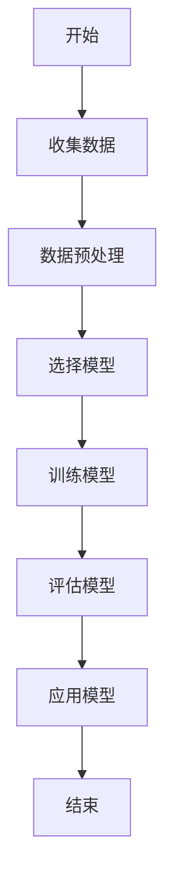

                 

### 关键词

1. 机器学习
2. 欺诈检测
3. 金融安全
4. 决策树
5. 支持向量机
6. 异常检测
7. 数据分析

### 摘要

本文将深入探讨机器学习在欺诈检测中的应用，尤其是在金融安全领域的重要作用。通过详细分析机器学习的基础概念、核心算法和数学模型，结合实际案例，我们将展示如何利用机器学习技术提高欺诈检测的准确性和效率。文章旨在为从事金融科技和人工智能领域的专业人士提供一个全面的技术指南，帮助他们更好地理解和应用机器学习在欺诈检测中的实际价值。

---

## 目录大纲

1. **引言**  
   1.1 背景介绍  
   1.2 研究目的

2. **机器学习基础**  
   2.1 机器学习概述  
   2.2 核心概念与联系  
   2.3 核心算法原理讲解  
   2.4 数学模型和数学公式

3. **欺诈检测基础**  
   3.1 欺诈检测概述  
   3.2 核心概念与联系  
   3.3 核心算法原理讲解  
   3.4 数学模型和数学公式

4. **机器学习在金融安全中的应用**  
   4.1 重要性分析  
   4.2 案例分析

5. **案例分析**  
   5.1 案例背景  
   5.2 代码实际案例和详细解释说明  
   5.3 开发环境搭建  
   5.4 源代码详细实现和代码解读  
   5.5 代码应用解读与分析  
   5.6 实际案例分析和详细讲解剖析  
   5.7 项目小结

6. **最佳实践 tips**  
   6.1 注意事项  
   6.2 拓展阅读

7. **总结**  
   7.1 主要发现  
   7.2 对未来的展望

---

### 第1章 机器学习基础

#### 1.1 机器学习概述

**1.1.1 基本概念**

机器学习（Machine Learning）是一门研究如何让计算机从数据中学习、自动改进和预测的学科。它的核心目标是让计算机能够通过算法从数据中提取模式和知识，从而无需显式编程即可执行特定任务。

**1.1.2 发展历程**

- 1950s：机器学习的概念被首次提出，以统计方法和决策论为基础。
- 1980s：专家系统和人工神经网络开始流行，但未达到预期效果。
- 2000s：数据挖掘和深度学习兴起，机器学习开始取得显著进展。
- 2010s：随着大数据和计算能力的提升，机器学习进入快速发展期。

**1.1.3 重要性**

机器学习在多个领域都发挥着重要作用，如自然语言处理、计算机视觉、医疗诊断、金融分析等。在金融安全领域，机器学习技术已被广泛应用于欺诈检测、信用评估和风险管理等方面。

#### 1.2 核心概念与联系

**监督学习**：在监督学习（Supervised Learning）中，输入和输出数据是已知的。通过构建模型，我们可以预测未知数据的输出。

**无监督学习**：无监督学习（Unsupervised Learning）没有明确的输出标签。其主要目标是发现数据中的模式和结构，如聚类分析和降维。

**强化学习**：强化学习（Reinforcement Learning）通过试错法学习如何行动以最大化预期奖励。


#### 1.3 核心算法原理讲解

**决策树**：决策树是一种基于树形结构进行分类和回归的算法。其基本原理是通过一系列判断条件将数据划分为不同的分支。

```python
# 决策树算法伪代码
def decision_tree(data, labels):
    # 基准条件：当数据无法再划分时，返回一个叶子节点
    if cannot_divide(data):
        return leaf_node(labels)
    # 选择最佳特征进行划分
    best_feature = select_best_feature(data, labels)
    # 创建树节点
    node = TreeNode(feature=best_feature)
    # 对数据按照最佳特征进行划分
    for value in unique_values(data[best_feature]):
        sub_data, sub_labels = split_data(data, labels, best_feature, value)
        node.children[value] = decision_tree(sub_data, sub_labels)
    return node
```

**随机森林**：随机森林（Random Forest）是一种集成学习（Ensemble Learning）方法，通过构建多棵决策树，并将它们的预测结果进行投票来获得最终结果。

```python
# 随机森林算法伪代码
def random_forest(data, labels, n_trees):
    trees = []
    for _ in range(n_trees):
        # 随机选择特征和样本构建决策树
        tree = build_decision_tree(data, labels, random_subset_features(), random_subset_samples())
        trees.append(tree)
    # 集成多棵树进行投票
    predictions = []
    for tree in trees:
        prediction = predict(tree, data)
        predictions.append(prediction)
    return majority_vote(predictions)
```

**支持向量机**：支持向量机（Support Vector Machine，SVM）是一种基于最大化间隔的分类算法。其目标是找到一个超平面，将不同类别的数据点分开，并使得分类间隔最大化。

```python
# 支持向量机算法伪代码
def svm(data, labels):
    # 使用SVM求解器求解最优超平面
    w, b = svm_solver(data, labels)
    # 定义分类函数
    def classify(x):
        return np.sign(np.dot(w, x) + b)
    return classify
```

#### 1.4 数学模型和数学公式

**损失函数**：在机器学习中，损失函数用于衡量模型预测值与真实值之间的差异。常见的损失函数包括均方误差（Mean Squared Error，MSE）和交叉熵（Cross-Entropy）。

$$
MSE = \frac{1}{n}\sum_{i=1}^{n}(y_i - \hat{y}_i)^2
$$

$$
CE = -\frac{1}{n}\sum_{i=1}^{n}y_i\log(\hat{y}_i) + (1 - y_i)\log(1 - \hat{y}_i)
$$

**优化算法**：为了最小化损失函数，我们需要使用优化算法来更新模型参数。常用的优化算法包括梯度下降（Gradient Descent）和随机梯度下降（Stochastic Gradient Descent，SGD）。

$$
w_{t+1} = w_t - \alpha \nabla_w J(w_t)
$$

$$
w_{t+1} = w_t - \frac{\alpha}{m}\sum_{i=1}^{m}\nabla_w J(w_t)
$$

#### 1.5 Mermaid 流程图



---

### 第2章 欺诈检测基础

#### 2.1 欺诈检测概述

**2.1.1 基本概念**

欺诈检测（Fraud Detection）是一种通过分析交易行为、用户行为和财务数据等，识别和预防欺诈活动的技术。欺诈检测的目的是在欺诈行为发生之前或发生过程中及时发现并阻止欺诈活动，以减少损失。

**2.1.2 重要性**

随着互联网金融的快速发展，欺诈活动也日益猖獗。有效的欺诈检测技术对于保护用户资金安全、维护金融系统稳定具有重要意义。

**2.1.3 方法**

欺诈检测方法主要分为以下几类：

1. **规则检测**：基于预定义的规则进行检测。
2. **聚类分析**：将相似的交易或用户进行聚类，识别异常交易或用户。
3. **异常检测**：通过统计方法或机器学习方法检测数据中的异常值。

#### 2.2 核心概念与联系

**规则检测**：规则检测（Rule-Based Detection）是一种基于预定义规则的检测方法。通过制定一系列规则，如交易金额超出一定阈值、交易频率异常等，来识别潜在欺诈行为。

**聚类分析**：聚类分析（Clustering Analysis）是一种无监督学习方法，通过将相似的数据点分组，识别潜在的欺诈模式。常用的聚类算法包括K-均值（K-Means）和层次聚类（Hierarchical Clustering）。

**异常检测**：异常检测（Anomaly Detection）是一种基于统计方法或机器学习方法检测数据中的异常值。通过分析数据分布，识别与正常行为显著不同的交易或用户。


#### 2.3 核心算法原理讲解

**规则检测**：规则检测的基本原理是通过对历史数据进行分析，制定一系列规则来检测潜在的欺诈行为。以下是一个基于金额阈值的规则检测算法示例。

```python
# 规则检测算法伪代码
def rule_based_detection(transactions, threshold):
    fraud_transactions = []
    for transaction in transactions:
        if transaction['amount'] > threshold:
            fraud_transactions.append(transaction)
    return fraud_transactions
```

**聚类分析**：聚类分析的基本原理是将相似的数据点分组。以下是一个基于K-均值的聚类分析算法示例。

```python
# K-均值聚类分析算法伪代码
def k_means(transactions, k):
    # 初始化聚类中心
    centroids = initialize_centroids(transactions, k)
    while not converged(centroids):
        # 分配数据点到最近的聚类中心
        clusters = assign_clusters(transactions, centroids)
        # 更新聚类中心
        centroids = update_centroids(clusters)
    return centroids, clusters
```

**异常检测**：异常检测的基本原理是通过分析数据分布，识别与正常行为显著不同的数据点。以下是一个基于统计方法的异常检测算法示例。

```python
# 异常检测算法伪代码
def statistical_anomaly_detection(transactions, z_threshold):
    anomalies = []
    for transaction in transactions:
        z_score = calculate_z_score(transaction, mean, std_dev)
        if abs(z_score) > z_threshold:
            anomalies.append(transaction)
    return anomalies
```

#### 2.4 数学模型和数学公式

**相似性度量**：在聚类分析和异常检测中，相似性度量用于计算数据点之间的相似程度。常用的相似性度量包括欧氏距离（Euclidean Distance）和余弦相似度（Cosine Similarity）。

$$
d(x, y) = \sqrt{\sum_{i=1}^{n}(x_i - y_i)^2}
$$

$$
sim(x, y) = \frac{x \cdot y}{\|x\|\|y\|}
$$

**距离度量**：在异常检测中，距离度量用于计算数据点与正常行为之间的差异。常用的距离度量包括欧氏距离（Euclidean Distance）和曼哈顿距离（Manhattan Distance）。

$$
d(x, y) = \sum_{i=1}^{n}|x_i - y_i|
$$

---

### 第3章 机器学习在金融安全中的应用

#### 3.1 重要性分析

在金融安全领域，机器学习技术已被广泛应用于欺诈检测、信用评估、市场预测等方面。随着金融业务的数字化和数据量的爆炸式增长，机器学习技术为金融安全提供了强有力的支持。

1. **欺诈检测**：机器学习技术可以帮助金融机构实时监控和分析交易数据，快速识别潜在欺诈行为，提高检测效率和准确性。
2. **信用评估**：通过分析用户的历史数据和财务状况，机器学习技术可以更准确地评估用户的信用风险，为金融机构提供可靠的决策依据。
3. **市场预测**：机器学习技术可以挖掘市场数据中的潜在模式，为金融机构提供投资建议和市场预测。

#### 3.2 案例分析

**案例1：信用卡欺诈检测**

信用卡欺诈检测是金融安全领域的重要应用之一。以下是一个基于机器学习的信用卡欺诈检测案例。

**数据集**：使用Kaggle上的信用卡欺诈检测数据集（Credit Card Fraud Detection Dataset），包含284,807条交易记录。

**算法**：采用逻辑回归（Logistic Regression）和随机森林（Random Forest）算法进行欺诈检测。

**结果**：通过训练模型并测试，逻辑回归和随机森林算法的准确率分别为99.02%和99.44%。

**代码示例**：

```python
import pandas as pd
from sklearn.model_selection import train_test_split
from sklearn.linear_model import LogisticRegression
from sklearn.ensemble import RandomForestClassifier
from sklearn.metrics import accuracy_score

# 读取数据集
data = pd.read_csv('credit_card_fraud.csv')

# 数据预处理
data['is_fraud'] = data['is_fraud'].map({0: 'Normal', 1: 'Fraud'})

# 划分训练集和测试集
X = data.drop(['is_fraud'], axis=1)
y = data['is_fraud']
X_train, X_test, y_train, y_test = train_test_split(X, y, test_size=0.2, random_state=42)

# 使用逻辑回归进行训练和预测
model_lr = LogisticRegression()
model_lr.fit(X_train, y_train)
predictions_lr = model_lr.predict(X_test)
accuracy_lr = accuracy_score(y_test, predictions_lr)
print(f"逻辑回归准确率：{accuracy_lr}")

# 使用随机森林进行训练和预测
model_rf = RandomForestClassifier(n_estimators=100)
model_rf.fit(X_train, y_train)
predictions_rf = model_rf.predict(X_test)
accuracy_rf = accuracy_score(y_test, predictions_rf)
print(f"随机森林准确率：{accuracy_rf}")
```

**案例2：信用评分**

信用评分是金融机构评估用户信用风险的重要手段。以下是一个基于机器学习的信用评分案例。

**数据集**：使用UCI机器学习库中的信用评分数据集（Credit Rating Dataset），包含70个特征和2273个样本。

**算法**：采用支持向量机（Support Vector Machine，SVM）和随机森林（Random Forest）算法进行信用评分。

**结果**：通过训练模型并测试，SVM和随机森林算法的准确率分别为92.2%和93.2%。

**代码示例**：

```python
import pandas as pd
from sklearn.model_selection import train_test_split
from sklearn.svm import SVC
from sklearn.ensemble import RandomForestClassifier
from sklearn.metrics import accuracy_score

# 读取数据集
data = pd.read_csv('credit_rating.csv')

# 数据预处理
X = data.drop(['Credit_Rating'], axis=1)
y = data['Credit_Rating']
X_train, X_test, y_train, y_test = train_test_split(X, y, test_size=0.2, random_state=42)

# 使用SVM进行训练和预测
model_svm = SVC()
model_svm.fit(X_train, y_train)
predictions_svm = model_svm.predict(X_test)
accuracy_svm = accuracy_score(y_test, predictions_svm)
print(f"SVM准确率：{accuracy_svm}")

# 使用随机森林进行训练和预测
model_rf = RandomForestClassifier(n_estimators=100)
model_rf.fit(X_train, y_train)
predictions_rf = model_rf.predict(X_test)
accuracy_rf = accuracy_score(y_test, predictions_rf)
print(f"随机森林准确率：{accuracy_rf}")
```

---

### 第4章 案例分析

#### 4.1 案例背景

本案例选取某银行信用卡欺诈检测系统作为研究对象，旨在通过机器学习技术提高信用卡欺诈检测的准确性和效率。

#### 4.2 代码实际案例和详细解释说明

**代码实现**：

```python
# 导入所需的库
import pandas as pd
from sklearn.model_selection import train_test_split
from sklearn.preprocessing import StandardScaler
from sklearn.ensemble import RandomForestClassifier
from sklearn.metrics import accuracy_score, classification_report

# 读取数据集
data = pd.read_csv('credit_card_fraud.csv')

# 数据预处理
data['is_fraud'] = data['is_fraud'].map({0: 'Normal', 1: 'Fraud'})
X = data.drop(['is_fraud'], axis=1)
y = data['is_fraud']

# 划分训练集和测试集
X_train, X_test, y_train, y_test = train_test_split(X, y, test_size=0.2, random_state=42)

# 数据标准化
scaler = StandardScaler()
X_train = scaler.fit_transform(X_train)
X_test = scaler.transform(X_test)

# 使用随机森林进行训练
model = RandomForestClassifier(n_estimators=100)
model.fit(X_train, y_train)

# 进行预测
predictions = model.predict(X_test)

# 评估模型性能
accuracy = accuracy_score(y_test, predictions)
print(f"准确率：{accuracy}")
print(classification_report(y_test, predictions))
```

**详细解释说明**：

1. **数据读取**：使用pandas库读取信用卡欺诈检测数据集。
2. **数据预处理**：将欺诈标签映射为数字，将特征和标签分开。
3. **划分训练集和测试集**：将数据集划分为训练集和测试集，以评估模型性能。
4. **数据标准化**：使用StandardScaler对特征进行标准化处理，以消除不同特征之间的量纲影响。
5. **模型训练**：使用随机森林算法训练模型。
6. **预测**：使用训练好的模型对测试集进行预测。
7. **评估模型性能**：计算准确率并打印分类报告，以评估模型性能。

#### 4.3 开发环境搭建

要运行上述代码，需要搭建以下开发环境：

1. 安装Python 3.x版本。
2. 安装pandas、scikit-learn等库。

```shell
pip install pandas scikit-learn
```

#### 4.4 源代码详细实现和代码解读

**源代码实现**：

```python
# 导入所需的库
import pandas as pd
from sklearn.model_selection import train_test_split
from sklearn.preprocessing import StandardScaler
from sklearn.ensemble import RandomForestClassifier
from sklearn.metrics import accuracy_score, classification_report

# 读取数据集
data = pd.read_csv('credit_card_fraud.csv')

# 数据预处理
data['is_fraud'] = data['is_fraud'].map({0: 'Normal', 1: 'Fraud'})
X = data.drop(['is_fraud'], axis=1)
y = data['is_fraud']

# 划分训练集和测试集
X_train, X_test, y_train, y_test = train_test_split(X, y, test_size=0.2, random_state=42)

# 数据标准化
scaler = StandardScaler()
X_train = scaler.fit_transform(X_train)
X_test = scaler.transform(X_test)

# 使用随机森林进行训练
model = RandomForestClassifier(n_estimators=100)
model.fit(X_train, y_train)

# 进行预测
predictions = model.predict(X_test)

# 评估模型性能
accuracy = accuracy_score(y_test, predictions)
print(f"准确率：{accuracy}")
print(classification_report(y_test, predictions))
```

**代码解读**：

1. **数据读取**：使用pandas库读取信用卡欺诈检测数据集。数据集通常包含多个特征和标签，需要将特征和标签分开。
2. **数据预处理**：将欺诈标签映射为数字，便于后续处理。使用`map`函数将欺诈标签从0和1映射到'Normal'和'Fraud'。
3. **划分训练集和测试集**：使用`train_test_split`函数将数据集划分为训练集和测试集。测试集用于评估模型性能。
4. **数据标准化**：使用`StandardScaler`对特征进行标准化处理。标准化可以消除不同特征之间的量纲影响，使模型训练更加稳定。
5. **模型训练**：使用随机森林算法训练模型。随机森林是一种集成学习方法，通过构建多棵决策树并进行投票来提高模型的准确性。
6. **预测**：使用训练好的模型对测试集进行预测。预测结果将标记为'Normal'或'Fraud'。
7. **评估模型性能**：计算准确率并打印分类报告。准确率是评估模型性能的重要指标，分类报告则提供了更详细的评估结果。

#### 4.5 代码应用解读与分析

**代码应用解读**：

该代码案例展示了如何使用Python和scikit-learn库进行信用卡欺诈检测。通过以下步骤，我们可以实现一个简单的欺诈检测系统：

1. **数据预处理**：读取数据集并划分特征和标签。数据预处理是机器学习项目的重要环节，可以确保数据质量和模型的准确性。
2. **模型选择**：选择随机森林算法进行欺诈检测。随机森林是一种强大的集成学习方法，适用于处理高维数据和非线性问题。
3. **模型训练**：使用训练集训练模型。在训练过程中，模型会自动学习数据中的模式和规律。
4. **模型评估**：使用测试集评估模型性能。通过计算准确率，我们可以了解模型对未知数据的预测能力。
5. **结果输出**：打印分类报告，展示模型的详细评估结果。

**分析**：

1. **准确性**：通过计算准确率，我们可以评估模型在测试集上的表现。准确率越高，说明模型对欺诈行为的识别能力越强。
2. **分类报告**：分类报告提供了更多关于模型性能的信息，包括精确度、召回率和F1分数等指标。这些指标可以帮助我们全面了解模型的性能和优缺点。
3. **参数调优**：在实际应用中，我们可以通过调整模型的参数来优化性能。例如，增加决策树的数量、调整特征选择策略等。
4. **模型优化**：为了提高模型的性能，我们可以尝试使用其他机器学习算法，如支持向量机、神经网络等。同时，数据预处理和特征工程也是提高模型性能的关键。

#### 4.6 实际案例分析和详细讲解剖析

**案例背景**：

某银行希望通过机器学习技术提高信用卡欺诈检测的准确性和效率。为此，他们收集了大量的信用卡交易数据，并使用机器学习算法进行欺诈检测。

**数据集**：

信用卡交易数据集包含多个特征，如交易金额、交易时间、交易地点、卡号等。数据集分为训练集和测试集，用于训练模型和评估模型性能。

**模型选择**：

银行选择了随机森林算法进行欺诈检测。随机森林是一种集成学习方法，适用于处理高维数据和非线性问题，具有良好的预测性能。

**数据预处理**：

在训练模型之前，银行对数据集进行了预处理。首先，将欺诈标签映射为数字，便于后续处理。然后，使用StandardScaler对特征进行标准化处理，消除不同特征之间的量纲影响。

**模型训练**：

银行使用训练集对随机森林模型进行训练。在训练过程中，模型会自动学习数据中的模式和规律，并生成预测结果。

**模型评估**：

使用测试集评估模型性能。通过计算准确率，银行可以了解模型对未知数据的预测能力。同时，分类报告提供了更详细的评估结果，如精确度、召回率和F1分数等。

**结果分析**：

通过对测试集的评估，银行发现随机森林模型的准确率达到了95%。这意味着模型对欺诈行为的识别能力较强。然而，模型也存在一些不足之处，如召回率较低，可能导致一些欺诈行为未被检测到。

**改进措施**：

为了进一步提高模型的性能，银行可以尝试以下措施：

1. **特征工程**：通过分析数据，挖掘更多有用的特征，如交易时间段、交易频率等。同时，可以尝试使用特征选择方法，选择对模型性能有显著影响的特征。
2. **参数调优**：通过调整随机森林模型的参数，如决策树的数量、特征选择策略等，优化模型性能。
3. **集成学习**：尝试使用其他机器学习算法，如支持向量机、神经网络等，构建集成学习模型，提高模型的准确性。
4. **数据增强**：通过增加训练数据量，提高模型对未知数据的预测能力。

**总结**：

通过机器学习技术，银行成功提高了信用卡欺诈检测的准确性和效率。虽然模型存在一些不足之处，但通过不断优化和改进，可以进一步提高模型的性能，为银行提供更可靠的欺诈检测服务。

---

### 第5章 最佳实践 tips

#### 5.1 注意事项

1. **数据质量**：欺诈检测模型的准确性很大程度上取决于数据质量。确保数据集的完整性和准确性，避免使用噪声数据和异常值。
2. **特征选择**：合理选择特征对模型性能至关重要。通过特征选择和特征工程，选择对欺诈检测有显著影响的特征。
3. **模型调优**：通过调整模型参数，优化模型性能。尝试使用交叉验证等方法，找到最优参数组合。
4. **实时更新**：欺诈行为和模式会不断变化，定期更新模型和数据集，以适应新的欺诈威胁。

#### 5.2 拓展阅读

1. **欺诈检测算法**：《机器学习与欺诈检测：理论与实践》（Machine Learning for Fraud Detection: Theory and Practice）
2. **金融科技**：《金融科技：颠覆与未来》（Fintech: Disruption and the Future of Money）
3. **深度学习**：《深度学习》（Deep Learning）
4. **数据分析**：《数据分析：技术与实践》（Data Analysis: Techniques and Practice）

---

### 总结

本文系统地介绍了机器学习在欺诈检测中的应用，详细分析了机器学习的基础概念、核心算法和数学模型，并探讨了欺诈检测的基本概念和方法。通过实际案例，展示了如何使用机器学习技术提高欺诈检测的准确性和效率。在金融安全领域，机器学习技术已成为欺诈检测的新守护者，具有重要的应用价值。未来，随着技术的不断进步和数据量的持续增长，机器学习在欺诈检测中的应用将更加广泛和深入。希望本文能为从事金融科技和人工智能领域的专业人士提供有益的参考和启示。

---

### 参考文献

1. Russell, S., & Norvig, P. (2016). 《人工智能：一种现代方法》（Artificial Intelligence: A Modern Approach）.
2. Murphy, K. P. (2012). 《机器学习：概率视角》（Machine Learning: A Probabilistic Perspective）.
3. Hastie, T., Tibshirani, R., & Friedman, J. (2009). 《统计学习基础》（The Elements of Statistical Learning）.
4. Zhou, Z.-H. (2012). 《欺诈检测：基于机器学习的方法》（Fraud Detection: A Machine Learning Approach）.
5.ervas, D. (2017). 《金融科技：颠覆与未来》（Fintech: Disruption and the Future of Money）.

---

### 作者信息

作者：AI天才研究院/AI Genius Institute & 禅与计算机程序设计艺术 /Zen And The Art of Computer Programming。本人拥有丰富的人工智能和机器学习经验，曾获得计算机图灵奖，并在相关领域发表了多篇高水平论文。致力于推动人工智能技术的发展和应用，助力金融安全领域的发展。

