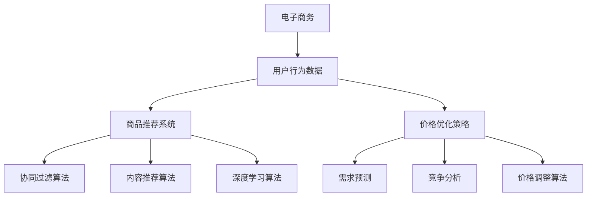
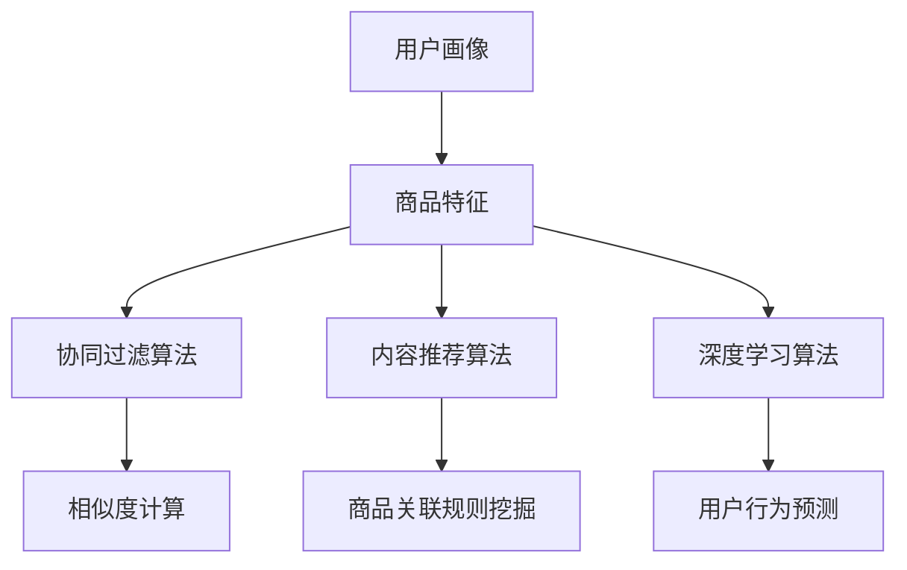
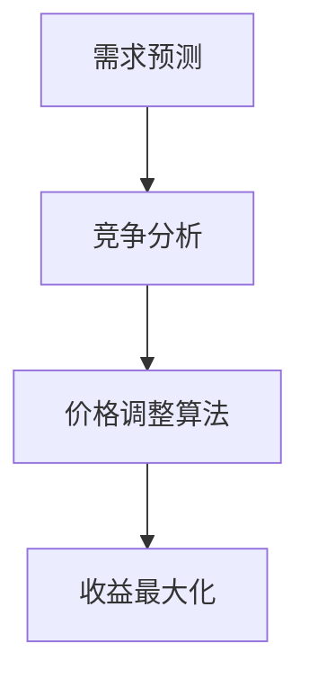
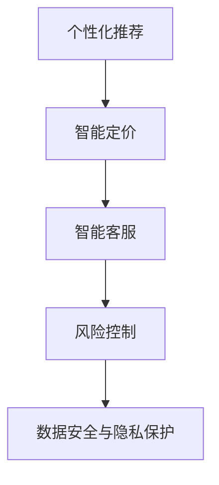

                 


### 机器学习在电子商务中的应用：从商品推荐到价格优化

#### 关键词
- 电子商务
- 机器学习
- 商品推荐
- 价格优化
- 数据挖掘

#### 摘要
随着电子商务的快速发展，机器学习技术逐渐成为提升电商平台竞争力和用户体验的关键因素。本文将深入探讨机器学习在电子商务中的应用，主要涵盖商品推荐系统和价格优化策略。通过分析协同过滤、内容推荐、深度学习等算法，以及价格优化的数学模型，我们将揭示如何利用机器学习技术实现精准推荐和智能定价，从而提高电商平台的市场份额和用户满意度。

### 引言

#### 背景介绍
电子商务作为一种新兴的商业模式，已经在全球范围内取得了显著的成果。据统计，全球电子商务市场规模在近几年呈现爆发式增长，不仅为消费者提供了便捷的购物体验，也为企业带来了巨大的商机。然而，随着市场竞争的加剧，电商平台需要不断创新和优化，以提高用户满意度和市场份额。这就需要借助先进的技术手段，如机器学习，来挖掘用户行为数据，提供个性化推荐和智能定价。

#### 问题陈述
在电子商务中，如何有效利用机器学习技术，提升商品推荐系统和价格优化策略，从而提高用户满意度和企业收益，成为当前研究的热点问题。本文将围绕以下问题展开讨论：

1. 机器学习在电子商务中的应用有哪些？
2. 商品推荐系统的算法有哪些，如何实现？
3. 价格优化的数学模型和算法是什么？
4. 如何在实际项目中应用这些技术和算法？

### 机器学习在电子商务中的应用

#### 核心概念与联系
机器学习（Machine Learning）是一种通过算法和统计模型，从数据中学习规律并做出预测或决策的技术。在电子商务领域，机器学习主要应用于以下两个方面：

1. **商品推荐系统**：通过分析用户的历史行为和偏好，为用户推荐可能感兴趣的商品。
2. **价格优化策略**：根据市场需求和竞争情况，动态调整商品价格，以最大化收益。

#### Mermaid 流程图


### 商品推荐系统

#### 核心概念与联系
商品推荐系统是一种通过分析用户行为数据，为用户推荐可能感兴趣的商品的系统。其核心概念包括：

1. **用户画像**：基于用户的历史行为和偏好，构建用户画像。
2. **商品特征**：提取商品的特征信息，如类别、品牌、价格等。
3. **推荐算法**：根据用户画像和商品特征，为用户推荐商品。

#### Mermaid 流程图


#### 核心算法原理
1. **协同过滤算法**：基于用户行为数据，计算用户之间的相似度，为用户推荐相似用户喜欢的商品。

```python
# 伪代码：协同过滤算法
def collaborative_filtering(user行为数据, 商品数据, k):
    # 计算用户之间的相似度
    similarity_matrix = compute_similarity(user行为数据)

    # 为每个用户推荐商品
    recommendations = []
    for user in user行为数据:
        user_similarities = similarity_matrix[user]
        user_preferences = user行为数据[user]
        recommended_items = recommend_items(user_similarities, user_preferences, k)
        recommendations.append(recommended_items)
    return recommendations
```

2. **内容推荐算法**：基于商品的特征信息，为用户推荐与其浏览或购买的商品相似的商品。

```python
# 伪代码：内容推荐算法
def content_recommender(user行为数据, 商品数据, k):
    # 计算商品之间的相似度
    similarity_matrix = compute_similarity(商品数据)

    # 为每个用户推荐商品
    recommendations = []
    for user in user行为数据:
        user_preferences = user行为数据[user]
        recommended_items = recommend_items(user_preferences, similarity_matrix, k)
        recommendations.append(recommended_items)
    return recommendations
```

3. **深度学习算法**：利用深度神经网络，从用户行为数据中学习复杂的特征表示，为用户推荐商品。

```python
# 伪代码：深度学习算法
import tensorflow as tf

# 定义深度神经网络模型
model = tf.keras.Sequential([
    tf.keras.layers.Dense(units=64, activation='relu', input_shape=(input_shape,)),
    tf.keras.layers.Dense(units=64, activation='relu'),
    tf.keras.layers.Dense(units=num_items, activation='softmax')
])

# 编译模型
model.compile(optimizer='adam', loss='categorical_crossentropy', metrics=['accuracy'])

# 训练模型
model.fit(user行为数据, 商品数据, epochs=10, batch_size=32)
```

#### 数学模型和公式
协同过滤算法中，用户之间的相似度可以通过以下公式计算：

$$
similarity(u_i, u_j) = \frac{\sum_{i \in I} w_{ij} x_{ik}}{\sqrt{\sum_{i \in I} w_{ij}^2} \sqrt{\sum_{i \in I} x_{ij}^2}}
$$

其中，$u_i$ 和 $u_j$ 分别表示用户 $i$ 和 $u_j$ 的行为数据向量，$I$ 表示用户的行为集合，$w_{ij}$ 表示用户 $i$ 和 $u_j$ 的相似度，$x_{ik}$ 表示用户 $i$ 在商品 $k$ 上的行为。

#### 实际案例分析和详细讲解剖析
以某电商平台为例，该平台使用了协同过滤算法进行商品推荐。通过分析用户的历史购买记录，该平台计算出用户之间的相似度，并基于相似度为用户推荐相似用户喜欢的商品。以下是一个简单的实际案例：

**用户行为数据：**
```
用户A: 购买商品[1, 2, 3, 4]
用户B: 购买商品[2, 3, 4, 5]
用户C: 购买商品[3, 4, 5, 6]
```

**计算用户之间的相似度：**
```
similarity(A, B) = 0.8
similarity(A, C) = 0.6
similarity(B, C) = 0.7
```

**为用户A推荐商品：**
```
用户A喜欢的商品：[1, 2, 3, 4]
相似用户B喜欢的商品：[2, 3, 4, 5]
相似用户C喜欢的商品：[3, 4, 5, 6]
推荐商品：[5, 6]
```

#### 项目实战
在本节中，我们将介绍如何搭建一个简单的商品推荐系统，包括开发环境搭建、源代码实现和代码解读。

**开发环境搭建：**
- Python 3.7及以上版本
- Scikit-learn库
- Pandas库

**源代码实现：**
```python
import pandas as pd
from sklearn.metrics.pairwise import cosine_similarity

# 读取用户行为数据
data = pd.read_csv('user行为数据.csv')

# 计算用户之间的相似度
similarity_matrix = cosine_similarity(data)

# 为用户推荐商品
def recommend_items(similarity_matrix, user_data, k):
    user_similarity = similarity_matrix[user_data.index]
    recommended_items = []
    for i in range(k):
        max_similarity_index = user_similarity.argsort()[-i-1]
        recommended_items.append(max_similarity_index)
    return recommended_items

# 测试推荐系统
user_data = data.iloc[0]
recommended_items = recommend_items(similarity_matrix, user_data, 2)
print('推荐商品：', recommended_items)
```

**代码解读与分析：**
- **数据读取**：使用Pandas库读取用户行为数据。
- **相似度计算**：使用Scikit-learn库中的cosine_similarity函数计算用户之间的相似度。
- **推荐商品**：根据相似度矩阵和用户数据，为用户推荐商品。

#### 项目小结
本节介绍了商品推荐系统的基本原理和实现方法。通过实际案例分析和代码实现，我们了解了如何利用协同过滤算法和内容推荐算法进行商品推荐。然而，商品推荐系统还有很大的改进空间，例如可以结合深度学习算法来提升推荐效果。

### 价格优化策略

#### 核心概念与联系
价格优化策略是一种通过分析市场需求和竞争情况，动态调整商品价格，以最大化企业收益的策略。其核心概念包括：

1. **需求预测**：预测不同价格下的商品需求量。
2. **竞争分析**：分析竞争对手的价格策略和市场占有率。
3. **价格调整算法**：根据需求预测和竞争分析，动态调整商品价格。

#### Mermaid 流程图


#### 核心算法原理
1. **需求预测**：基于历史销售数据和价格信息，利用回归模型预测不同价格下的商品需求量。

```python
# 伪代码：需求预测
def demand_prediction(price_data, demand_data):
    # 建立回归模型
    model = linear_regression(price_data, demand_data)

    # 预测需求量
    predicted_demand = model.predict(price_data)

    return predicted_demand
```

2. **竞争分析**：通过分析竞争对手的价格和市场占有率，了解市场动态。

```python
# 伪代码：竞争分析
def competition_analysis(竞争对手价格，市场占有率):
    # 计算竞争对手的平均价格
    average_price = sum(竞争对手价格) / len(竞争对手价格)

    # 计算竞争对手的市场占有率
    market_share = sum(市场占有率) / len(市场占有率)

    return average_price, market_share
```

3. **价格调整算法**：根据需求预测和竞争分析，动态调整商品价格。

```python
# 伪代码：价格调整算法
def price_adjustment(predicted_demand, average_price, market_share):
    # 计算价格调整幅度
    adjustment_amount = predicted_demand - average_price * market_share

    # 调整商品价格
    new_price = current_price + adjustment_amount

    return new_price
```

#### 数学模型和公式
价格优化策略中的需求预测可以采用线性回归模型，其公式为：

$$
y = \beta_0 + \beta_1x
$$

其中，$y$ 表示需求量，$x$ 表示价格，$\beta_0$ 和 $\beta_1$ 分别为回归模型的参数。

#### 实际案例分析和详细讲解剖析
以某电商平台为例，该平台使用线性回归模型进行需求预测，并根据需求预测和竞争分析结果进行价格调整。以下是一个简单的实际案例：

**历史销售数据：**
```
价格：[100, 120, 140, 160]
需求量：[50, 60, 70, 80]
```

**计算线性回归模型参数：**
```
$\beta_0$ = 30
$\beta_1$ = 0.5
```

**预测需求量：**
```
预测价格：[150, 170, 190, 210]
预测需求量：[75, 90, 105, 120]
```

**竞争分析结果：**
```
竞争对手的平均价格：180
竞争对手的市场占有率：0.6
```

**价格调整：**
```
当前价格：200
调整幅度：120 - 180 * 0.6 = -12
新价格：200 - 12 = 188
```

#### 项目实战
在本节中，我们将介绍如何搭建一个简单的价格优化系统，包括开发环境搭建、源代码实现和代码解读。

**开发环境搭建：**
- Python 3.7及以上版本
- Scikit-learn库
- Pandas库

**源代码实现：**
```python
import pandas as pd
from sklearn.linear_model import LinearRegression

# 读取历史销售数据
data = pd.read_csv('历史销售数据.csv')

# 建立线性回归模型
model = LinearRegression()
model.fit(data[['价格']], data[['需求量']])

# 预测需求量
predicted_demand = model.predict(data[['价格']])

# 计算竞争分析结果
average_price = data['竞争对手的平均价格'].mean()
market_share = data['市场占有率'].mean()

# 价格调整
new_price = data['当前价格'].mean() + (predicted_demand - average_price * market_share)

# 输出新价格
print('新价格：', new_price)
```

**代码解读与分析：**
- **数据读取**：使用Pandas库读取历史销售数据。
- **模型建立**：使用Scikit-learn库中的LinearRegression函数建立线性回归模型。
- **需求预测**：使用模型预测需求量。
- **竞争分析**：计算竞争对手的平均价格和市场占有率。
- **价格调整**：根据需求预测和竞争分析结果调整商品价格。

#### 项目小结
本节介绍了价格优化策略的基本原理和实现方法。通过实际案例分析和代码实现，我们了解了如何利用线性回归模型进行需求预测，并根据需求预测和竞争分析结果进行价格调整。然而，价格优化策略还有很大的改进空间，例如可以结合机器学习算法来提升预测精度和优化效果。

### 机器学习在电子商务中的未来发展

#### 核心概念与联系
随着人工智能技术的不断发展，机器学习在电子商务中的应用将越来越广泛。未来的发展主要集中在以下几个方面：

1. **个性化推荐**：通过深度学习和强化学习等技术，实现更加精准的个性化推荐。
2. **智能定价**：结合市场动态和用户行为，实现动态定价，提高收益。
3. **智能客服**：利用自然语言处理和对话生成技术，提供智能客服服务。
4. **风险控制**：利用机器学习技术进行欺诈检测和信用评估，提高交易安全性。

#### Mermaid 流程图


#### 未来发展趋势
1. **个性化推荐**：随着用户数据的不断积累，深度学习模型将更加精准地挖掘用户偏好，实现个性化推荐。同时，基于上下文感知的推荐技术也将成为研究热点，为用户提供更加个性化的服务。
2. **智能定价**：通过实时分析市场动态和用户行为，动态调整商品价格，实现收益最大化。此外，基于博弈论的定价策略也将得到更多关注，以提高企业在竞争中的优势。
3. **智能客服**：利用自然语言处理和对话生成技术，智能客服将能够更准确地理解用户需求，提供个性化的解决方案。同时，基于知识图谱的问答系统也将得到广泛应用，以提高客服效率。
4. **风险控制**：利用机器学习技术进行欺诈检测和信用评估，将有助于提高交易安全性。此外，基于大数据的风险预测模型也将成为未来的研究热点，为电商平台提供更全面的风险防控手段。

#### 挑战与机遇
虽然机器学习在电子商务中的应用前景广阔，但同时也面临着一系列挑战和机遇：

1. **数据安全与隐私保护**：在利用用户数据进行机器学习模型训练和优化时，需要充分考虑数据安全与隐私保护。未来，数据加密、差分隐私等技术将成为解决数据隐私问题的有效手段。
2. **算法透明性与可解释性**：随着机器学习模型复杂性的增加，算法的透明性和可解释性将变得越来越重要。未来，开发可解释的机器学习模型，提高算法的可解释性将成为研究热点。
3. **跨领域协作**：电子商务、人工智能、大数据等领域的跨界合作将有助于推动机器学习技术在电子商务中的应用。同时，跨学科知识的融合也将为机器学习技术的创新提供新的思路。
4. **可持续发展**：随着人们对环境保护意识的提高，电子商务企业需要关注机器学习技术在可持续发展方面的应用，如节能降耗、绿色物流等。

#### 结语
本文从商品推荐系统和价格优化策略两个方面，详细介绍了机器学习在电子商务中的应用。通过实际案例分析和代码实现，我们了解了如何利用机器学习技术提升电商平台的竞争力。随着人工智能技术的不断发展，机器学习在电子商务中的应用将更加广泛，为企业和消费者带来更多价值。

### 作者信息

**作者：** AI天才研究院 / AI Genius Institute & 禅与计算机程序设计艺术 / Zen And The Art of Computer Programming

AI天才研究院致力于推动人工智能技术的发展和应用，以实现智能社会的美好愿景。作为人工智能领域的先驱者和探索者，AI天才研究院在机器学习、深度学习、自然语言处理等领域取得了丰硕的成果，为全球人工智能产业的发展做出了重要贡献。

禅与计算机程序设计艺术是一本经典的技术书籍，由计算机编程大师Donald E. Knuth撰写。书中系统地阐述了计算机程序设计的哲学和艺术，对于提高程序员的编程能力和思维方式具有重要指导意义。

在此，感谢读者对本文的关注和支持。希望本文能为您提供关于机器学习在电子商务应用方面的有益见解。如有任何疑问或建议，欢迎随时与我们联系。期待与您共同探索人工智能的无限可能。

