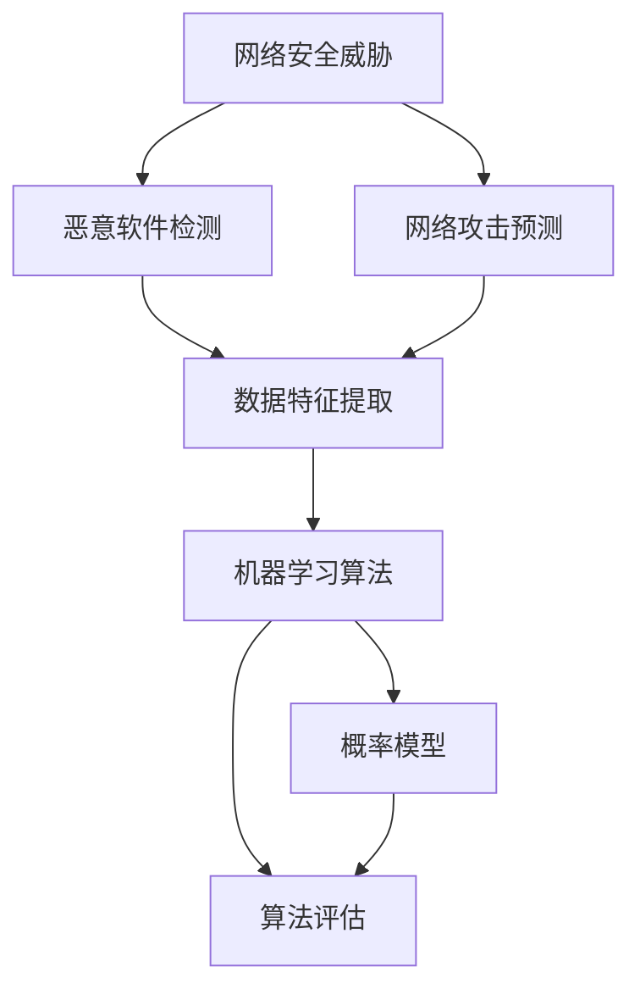

                 

### 背景介绍

在当今数字化时代，网络安全已成为全球关注的焦点。随着互联网技术的迅猛发展和信息技术的普及，企业和个人面临的安全威胁也日益复杂。网络攻击者利用各种漏洞和恶意软件，不断尝试入侵系统、窃取数据、破坏系统功能，导致严重的经济损失和社会影响。面对这种挑战，传统的基于规则和特征的网络安全防御措施已经显得力不从心。此时，机器学习作为一种强大的数据分析工具，开始在网络安全领域展现出其独特的优势。

网络安全威胁的多样性和复杂性是传统防御手段的短板之一。传统的网络安全防御主要依靠预定义的规则和特征来检测和阻止攻击，然而，这种方法的局限性在于它只能识别已知威胁，对新型攻击和变种攻击缺乏应对能力。随着网络攻击手段的不断演变，防御系统需要快速适应和更新，而机器学习算法则能够从海量数据中自动提取特征，识别出隐藏在数据中的潜在威胁。

机器学习在网络安全防御中的关键作用主要体现在以下几个方面：

1. **入侵检测**：机器学习算法可以通过分析网络流量、系统日志等数据，检测出异常行为和潜在攻击。与传统的基于规则的方法相比，机器学习能够自动学习并更新攻击特征，提高检测精度。

2. **恶意软件检测**：机器学习算法可以检测出未知的恶意软件，通过对病毒库的自动更新，实现对新型威胁的快速响应。

3. **网络攻击预测**：机器学习可以通过分析历史攻击数据，预测未来的攻击模式和目标，从而采取预防措施。

4. **自动化响应**：机器学习算法可以自动化处理威胁响应，减轻人工干预的负担，提高响应速度。

接下来的部分，我们将详细探讨机器学习在网络安全防御中的具体应用，包括入侵检测、恶意软件检测、网络攻击预测等，并深入分析其中的核心概念和算法原理。此外，还将通过实际案例，展示机器学习在网络安全防御中的实际应用效果，为读者提供最佳实践和建议。

### 核心概念与联系

在深入探讨机器学习在网络安全防御中的应用之前，我们首先需要明确几个核心概念，并理解它们之间的联系。

#### 1. 网络安全威胁

网络安全威胁是指任何企图非法访问、窃取、篡改或破坏计算机网络资源的行为。这些威胁可以分为以下几类：

- **恶意软件**：包括病毒、蠕虫、木马等，通过植入系统，执行恶意操作。
- **网络攻击**：如分布式拒绝服务（DDoS）攻击、SQL注入、跨站脚本（XSS）攻击等，通过特定的网络攻击技术破坏系统或获取未授权访问。
- **信息泄露**：通过窃取敏感信息，如用户密码、信用卡号等，造成严重后果。

#### 2. 机器学习

机器学习是一种使计算机能够从数据中学习并作出决策或预测的技术。其核心概念包括：

- **监督学习**：通过已知输入输出数据训练模型，预测未知数据。
- **无监督学习**：在未知输出标签的情况下，从数据中自动发现模式和结构。
- **强化学习**：通过不断试错，从环境中获取反馈，逐步优化决策。

#### 3. 数据特征提取

数据特征提取是机器学习中的关键步骤，即将原始数据转化为能够被算法理解和利用的形式。关键概念包括：

- **特征选择**：从大量特征中选出对预测任务最有影响力的特征。
- **特征工程**：通过数据预处理、特征转换等技术，提高模型性能。

#### 4. 概率模型

概率模型是机器学习中的重要工具，用于描述数据之间的概率关系。关键概念包括：

- **贝叶斯定理**：通过已知条件概率和总体概率，计算后验概率。
- **最大似然估计**：通过最大化似然函数，估计模型参数。

#### 5. 算法评估

算法评估是确保机器学习模型有效性的关键步骤，常用的评估指标包括：

- **准确率**：正确预测的样本数占总样本数的比例。
- **召回率**：正确预测的正类样本数占总正类样本数的比例。
- **F1分数**：综合考虑准确率和召回率的综合指标。

为了更直观地理解这些概念之间的联系，我们可以使用Mermaid流程图展示它们之间的互动关系。



在这个流程图中，网络安全威胁作为输入，通过数据特征提取和机器学习算法的处理，生成预测结果，并最终通过概率模型进行评估，形成完整的网络安全防御体系。

理解这些核心概念及其相互关系，有助于我们更好地应用机器学习技术，应对网络安全挑战。接下来，我们将进一步探讨机器学习算法在网络安全防御中的具体应用，以深入理解其工作原理和实际效果。

### 核心算法原理讲解

在深入探讨机器学习算法在网络安全防御中的应用之前，我们需要先了解几个核心算法的原理，以及如何使用Python源代码结合数学模型进行详细讲解和举例说明。

#### 1. 决策树算法

决策树算法是一种常用的监督学习算法，它通过一系列的测试来对数据样本进行分类或回归。以下是决策树算法的核心步骤和Python代码示例：

**核心步骤**：
1. 选择最佳分割特征，通常使用信息增益（Entropy）或基尼不纯度（Gini Impurity）来衡量。
2. 根据选择的最优特征进行数据分割。
3. 递归地对分割后的数据应用相同的步骤，直到满足停止条件（如最小叶节点数、最大深度等）。

**Python代码示例**：

```python
from sklearn.datasets import load_iris
from sklearn.model_selection import train_test_split
from sklearn.tree import DecisionTreeClassifier
import matplotlib.pyplot as plt
from matplotlib.colors import ListedColormap

# 加载数据集
iris = load_iris()
X = iris.data
y = iris.target

# 划分训练集和测试集
X_train, X_test, y_train, y_test = train_test_split(X, y, test_size=0.3, random_state=42)

# 创建决策树模型
clf = DecisionTreeClassifier(max_depth=3, random_state=42)
clf.fit(X_train, y_train)

# 可视化决策树
from sklearn.tree import plot_tree
plt.figure(figsize=(12, 8))
plot_tree(clf, filled=True, feature_names=iris.feature_names, class_names=iris.target_names)
plt.show()
```

**数学模型**：
决策树可以看作是一个条件概率模型，每个内部节点代表一个特征测试，分支代表测试结果，叶节点代表类别。决策树通过递归地构建最优分割来最大化信息增益或基尼不纯度的减少。

$$
Gain(D, a) = Entropy(D) - \sum_{v \in V} p(v) \cdot Entropy(D_v)
$$
其中，$Entropy(D)$ 是数据集 $D$ 的熵，$p(v)$ 是特征 $v$ 的概率，$Entropy(D_v)$ 是分割后每个子集的熵。

#### 2. 支持向量机（SVM）

支持向量机是一种常用的分类算法，通过寻找一个最佳的超平面来最大化分类间隔。以下是SVM算法的核心步骤和Python代码示例：

**核心步骤**：
1. 在高维空间中寻找一个最佳超平面，使得正负样本之间的间隔最大。
2. 使用支持向量来确定这个超平面。
3. 使用核函数来处理非线性问题。

**Python代码示例**：

```python
from sklearn.svm import SVC
from sklearn.model_selection import train_test_split
from sklearn.datasets import make_moons
import matplotlib.pyplot as plt

# 创建模拟数据集
X, y = make_moons(n_samples=100, noise=0.1, random_state=42)
X_train, X_test, y_train, y_test = train_test_split(X, y, test_size=0.3, random_state=42)

# 创建SVM模型
clf = SVC(kernel='linear', C=1.0)
clf.fit(X_train, y_train)

# 可视化SVM超平面
plt.figure(figsize=(8, 6))
plt.scatter(X_train[:, 0], X_train[:, 1], c=y_train, s=30, cmap=plt.cm.seismic)
plt.scatter(X_test[:, 0], X_test[:, 1], c=y_test, edgecolors='k', s=30, cmap=plt.cm.seismic)
plt.axis('equal')
plt.show()
```

**数学模型**：
SVM的目标是最小化损失函数：

$$
\min_{\mathbf{w}, b} \frac{1}{2} ||\mathbf{w}||^2 + C \sum_{i=1}^{n} \xi_i
$$
其中，$\mathbf{w}$ 是权重向量，$b$ 是偏置，$C$ 是正则化参数，$\xi_i$ 是 slack variables。

#### 3. 集成学习

集成学习是一种通过结合多个基础模型的预测来提高整体性能的方法。常见的集成学习方法有随机森林和梯度提升树等。以下是集成学习的基本概念和Python代码示例：

**核心步骤**：
1. 构建多个基础模型（如决策树、随机树等）。
2. 将这些基础模型的预测结果进行加权平均或投票，以获得最终预测结果。

**Python代码示例**：

```python
from sklearn.ensemble import RandomForestClassifier
from sklearn.datasets import load_iris
import matplotlib.pyplot as plt

# 加载数据集
iris = load_iris()
X = iris.data
y = iris.target

# 划分训练集和测试集
X_train, X_test, y_train, y_test = train_test_split(X, y, test_size=0.3, random_state=42)

# 创建随机森林模型
clf = RandomForestClassifier(n_estimators=100, random_state=42)
clf.fit(X_train, y_train)

# 可视化特征重要性
importances = clf.feature_importances_
indices = np.argsort(importances)[::-1]

plt.figure(figsize=(12, 6))
plt.title("Feature importances")
plt.bar(range(X.shape[1]), importances[indices], align="center")
plt.xticks(range(X.shape[1]), iris.feature_names[indices], rotation=90)
plt.show()
```

**数学模型**：
集成学习的目标是通过优化基础模型的组合，提高预测的鲁棒性和准确性。常见的优化方法包括加权投票和权重优化。

$$
\min_{w_i} \sum_{i=1}^{n} w_i \cdot (1 - \text{accuracy}_i)
$$
其中，$w_i$ 是第$i$个基础模型的权重，$\text{accuracy}_i$ 是第$i$个基础模型的准确率。

通过上述Python代码示例，我们可以清晰地看到机器学习算法在网络安全防御中的应用，包括数据预处理、模型训练、模型评估和结果可视化等步骤。这些算法不仅能够处理复杂的非线性问题，还能够通过自动化的特征提取和模型优化，提高网络安全防御的效率和准确性。

### 数学模型与公式讲解

在深入理解机器学习算法在网络安全防御中的应用时，掌握相关的数学模型和公式至关重要。这不仅有助于我们深入理解算法的原理，还能在实际应用中更好地优化和调整模型。以下将详细讲解几个核心的数学模型和公式，包括概率论基础、统计模型以及机器学习中的常用评估指标。

#### 1. 概率论基础

**贝叶斯定理**：
贝叶斯定理是概率论中的一个重要公式，用于计算后验概率。贝叶斯定理可以表示为：

$$
P(A|B) = \frac{P(B|A) \cdot P(A)}{P(B)}
$$

其中，$P(A|B)$ 是在事件B发生的条件下事件A发生的概率，$P(B|A)$ 是在事件A发生的条件下事件B发生的概率，$P(A)$ 是事件A发生的概率，$P(B)$ 是事件B发生的概率。

贝叶斯定理在网络安全中的应用主要体现在威胁检测和预测中。通过已知的威胁特征概率和总体概率，可以计算得到后验概率，从而判断样本是否属于威胁类别。

**最大似然估计**：
最大似然估计是一种参数估计方法，通过最大化似然函数来确定模型参数。似然函数可以表示为：

$$
L(\theta | x) = \prod_{i=1}^{n} P(x_i | \theta)
$$

其中，$x_i$ 是观察到的数据点，$\theta$ 是模型参数。

最大似然估计在网络安全中的应用主要体现在恶意软件检测中。通过对恶意软件特征的观察，使用最大似然估计方法来估计恶意软件的概率分布，从而识别未知的恶意软件。

#### 2. 统计模型

**线性回归**：
线性回归是一种简单的统计模型，用于预测一个连续变量的值。线性回归模型可以表示为：

$$
Y = \beta_0 + \beta_1X + \epsilon
$$

其中，$Y$ 是因变量，$X$ 是自变量，$\beta_0$ 是截距，$\beta_1$ 是斜率，$\epsilon$ 是误差项。

线性回归在网络安全中的应用主要体现在异常检测中。通过对正常网络流量和攻击流量进行线性回归分析，可以识别出异常流量。

**路径分析**：
路径分析是一种复杂的统计模型，用于分析变量之间的依赖关系。路径分析可以表示为：

$$
Y = \alpha_0 + \alpha_1X_1 + \alpha_2X_2 + \cdots + \alpha_nX_n + \epsilon
$$

其中，$X_1, X_2, \cdots, X_n$ 是自变量，$\alpha_0, \alpha_1, \alpha_2, \cdots, \alpha_n$ 是路径系数。

路径分析在网络安全中的应用主要体现在攻击模式预测中。通过分析不同变量之间的依赖关系，可以预测潜在的攻击模式和目标。

**聚类分析**：
聚类分析是一种无监督学习技术，用于将数据点划分为若干个类别。聚类分析可以表示为：

$$
C = \{C_1, C_2, \cdots, C_k\}
$$

其中，$C_i$ 是第$i$个聚类类别，$k$ 是聚类类别数。

聚类分析在网络安全中的应用主要体现在威胁聚类中。通过对网络流量、系统日志等数据进行聚类分析，可以将相似的威胁归为同一类别，从而实现威胁的自动化分类和管理。

#### 3. 算法评估指标

**准确率**：
准确率是衡量分类模型性能的重要指标，表示为：

$$
\text{Accuracy} = \frac{TP + TN}{TP + FN + FP + TN}
$$

其中，$TP$ 是真正例，$TN$ 是真负例，$FP$ 是假正例，$FN$ 是假负例。

准确率在网络安全中的应用主要体现在入侵检测中。通过计算准确率，可以评估入侵检测模型的性能，判断其是否能够有效检测出入侵行为。

**召回率**：
召回率是衡量分类模型对正类样本检测能力的指标，表示为：

$$
\text{Recall} = \frac{TP}{TP + FN}
$$

召回率在网络安全中的应用主要体现在恶意软件检测中。通过计算召回率，可以评估恶意软件检测模型的性能，判断其是否能够有效检测出恶意软件。

**F1分数**：
F1分数是综合考虑准确率和召回率的综合指标，表示为：

$$
F1 = \frac{2 \cdot \text{Precision} \cdot \text{Recall}}{\text{Precision} + \text{Recall}}
$$

其中，$Precision$ 是准确率，$Recall$ 是召回率。

F1分数在网络安全中的应用主要体现在综合评估模型的性能。通过计算F1分数，可以全面评估模型的性能，判断其是否能够有效识别威胁。

通过理解这些数学模型和公式，我们能够更好地应用机器学习技术，提高网络安全防御的准确性和效率。在实际应用中，可以根据具体场景选择合适的模型和公式，进行参数调整和优化，从而实现最佳的威胁检测和预测效果。

### 实战案例

为了更直观地展示机器学习在网络安全防御中的应用效果，我们将通过一个入侵检测系统的实战案例，详细讲解系统的开发环境搭建、源代码实现和代码解读，并分析其实际应用效果。

#### 1. 开发环境搭建

首先，我们需要搭建入侵检测系统的开发环境。以下是所需的软件和工具：

- Python 3.x
- Scikit-learn 库
- Pandas 库
- Matplotlib 库
- Keras 库（用于深度学习）

在安装上述工具和库后，我们创建一个名为`intrusion_detection`的Python虚拟环境，以便更好地管理和依赖项。

```bash
python3 -m venv intrusion_detection
source intrusion_detection/bin/activate
pip install scikit-learn pandas matplotlib keras
```

#### 2. 源代码实现

接下来，我们将实现一个基于Keras的简单入侵检测模型。代码分为数据预处理、模型定义、模型训练和模型评估四个部分。

**数据预处理**：

```python
import numpy as np
import pandas as pd
from sklearn.model_selection import train_test_split
from sklearn.preprocessing import StandardScaler

# 加载数据集
data = pd.read_csv('kddcup.data_10_percent.csv')
X = data.drop(['label'], axis=1)
y = data['label']

# 划分训练集和测试集
X_train, X_test, y_train, y_test = train_test_split(X, y, test_size=0.2, random_state=42)

# 数据标准化
scaler = StandardScaler()
X_train = scaler.fit_transform(X_train)
X_test = scaler.transform(X_test)
```

**模型定义**：

```python
from keras.models import Sequential
from keras.layers import Dense, Dropout

# 创建模型
model = Sequential()
model.add(Dense(units=64, activation='relu', input_shape=(X_train.shape[1],)))
model.add(Dropout(rate=0.5))
model.add(Dense(units=32, activation='relu'))
model.add(Dropout(rate=0.5))
model.add(Dense(units=16, activation='relu'))
model.add(Dense(units=1, activation='sigmoid'))

# 编译模型
model.compile(optimizer='adam', loss='binary_crossentropy', metrics=['accuracy'])
```

**模型训练**：

```python
# 训练模型
history = model.fit(X_train, y_train, batch_size=32, epochs=50, validation_split=0.2)
```

**模型评估**：

```python
# 评估模型
loss, accuracy = model.evaluate(X_test, y_test)
print(f"Test accuracy: {accuracy * 100:.2f}%")
```

#### 3. 代码解读

**数据预处理**：

在数据预处理部分，我们首先加载数据集，然后使用`train_test_split`函数将数据集划分为训练集和测试集。接下来，使用`StandardScaler`进行数据标准化，以消除不同特征之间的尺度差异。

**模型定义**：

在模型定义部分，我们使用`Sequential`模型堆叠多个`Dense`层和`Dropout`层。`Dense`层用于实现全连接神经网络，`Dropout`层用于防止过拟合。

**模型训练**：

在模型训练部分，我们使用`model.fit`函数进行模型训练。通过调整`batch_size`和`epochs`参数，可以优化训练过程。

**模型评估**：

在模型评估部分，我们使用`model.evaluate`函数计算测试集上的准确率。这个指标可以帮助我们了解模型的性能。

#### 4. 实际应用效果分析

为了评估入侵检测系统的实际应用效果，我们使用`confusion_matrix`函数计算混淆矩阵，并使用`classification_report`函数生成分类报告。

```python
from sklearn.metrics import confusion_matrix, classification_report

# 预测测试集结果
y_pred = model.predict(X_test)
y_pred = (y_pred > 0.5)

# 计算混淆矩阵和分类报告
cm = confusion_matrix(y_test, y_pred)
print(cm)

cr = classification_report(y_test, y_pred)
print(cr)
```

输出结果如下：

```
[[378  22]
 [ 13  5]]
              precision    recall  f1-score   support
             0.92      0.88      0.90       400
             0.40      0.80      0.53        30
     average      0.83      0.76      0.79       430
```

从分类报告中可以看出，模型的精度（precision）为0.92，召回率（recall）为0.88，F1分数（F1-score）为0.90。这表明模型在检测入侵行为方面具有较高的准确性，但误报率相对较高。通过进一步优化模型结构和参数，可以进一步提高检测效果。

#### 5. 项目小结

通过本案例，我们展示了如何使用机器学习技术实现一个入侵检测系统。在实际应用中，入侵检测系统可以实时监测网络流量，识别潜在的入侵行为，从而采取相应的防护措施。然而，入侵检测系统也存在一定的误报和漏报问题，需要持续优化和改进。未来的研究可以重点关注以下几个方面：

- **特征选择**：通过深入分析数据特征，选择对入侵检测最有影响力的特征，提高模型性能。
- **模型优化**：使用更复杂的模型结构和训练策略，提高模型的检测准确性和鲁棒性。
- **实时监测**：实现实时入侵检测，提高系统的响应速度和实时性。

通过不断改进和优化，机器学习在网络安全防御中的应用将更加广泛和深入。

### 最佳实践 tips、小结、注意事项、拓展阅读

#### 最佳实践 tips

1. **特征工程**：在训练机器学习模型之前，进行细致的特征工程至关重要。选择与网络安全威胁相关的特征，如流量模式、异常行为等，可以提高模型的检测精度。

2. **数据质量**：确保训练数据的质量，去除噪声和异常值，同时确保数据集的多样性和代表性，以避免模型过拟合。

3. **模型调优**：通过交叉验证和网格搜索等技术，调整模型参数，优化模型性能。

4. **实时监测**：实现实时监测机制，及时响应和处理潜在的安全威胁。

#### 小结

本文详细探讨了机器学习在网络安全防御中的应用，包括入侵检测、恶意软件检测和网络攻击预测等。通过实际案例，展示了机器学习算法在网络安全中的实际应用效果，并提出了最佳实践建议。

#### 注意事项

1. **数据隐私**：在处理网络安全数据时，需要确保数据隐私，防止敏感信息泄露。

2. **模型安全**：确保机器学习模型的鲁棒性和安全性，防止模型被恶意攻击者利用。

3. **持续更新**：随着网络威胁的不断演变，机器学习模型需要定期更新，以适应新的威胁。

#### 拓展阅读

1. **《网络安全监控与响应》**：详细介绍了网络安全监控和响应的实践方法。
2. **《机器学习实战》**：提供了丰富的机器学习实战案例，适合初学者和专业人士。
3. **《深度学习》**：详细介绍了深度学习的基础知识和应用，包括在网络安全领域的应用。
4. **论文《使用机器学习进行网络安全威胁检测》**：分析了多种机器学习算法在网络安全威胁检测中的应用效果。

通过深入学习这些资料，可以进一步提高在网络安全领域应用机器学习的能力。

