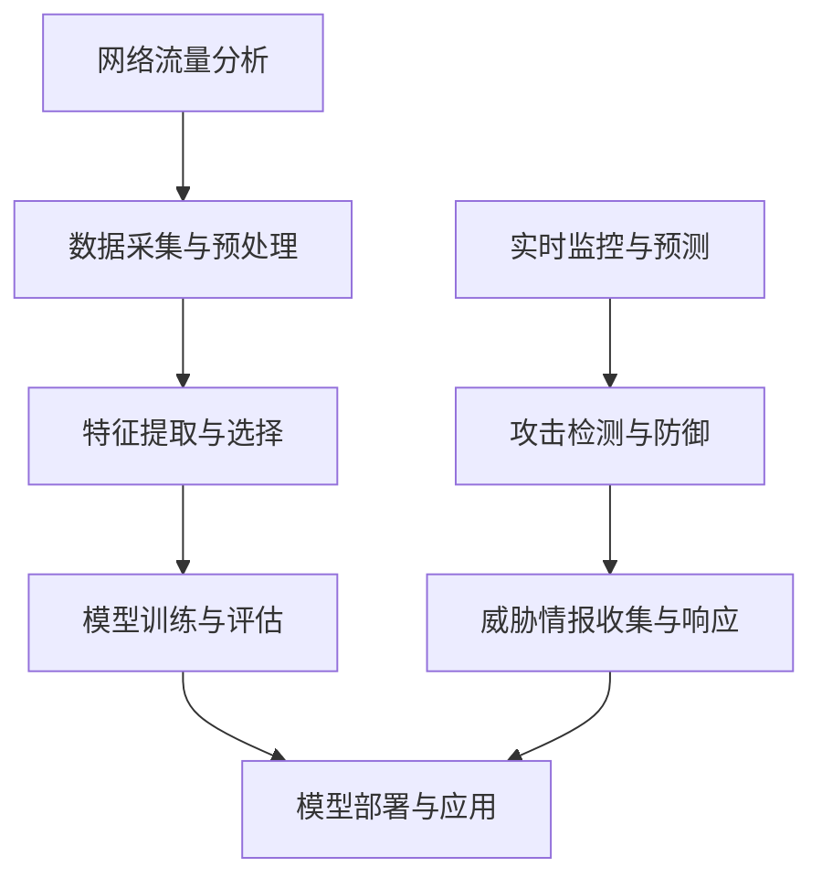

                 

### 关键词
机器学习，网络攻击，模式识别，防御能力，网络安全，监督学习，无监督学习，决策树，K-均值聚类，数据预处理，特征提取，模型训练，模型评估，攻击检测，威胁情报。

### 摘要
本文深入探讨了机器学习在网络攻击模式识别中的应用，旨在提高网络安全防御能力。文章首先介绍了机器学习的基础概念和类型，以及网络攻击模式识别的挑战和重要性。接着，通过具体的监督学习和无监督学习算法原理讲解，展示了机器学习如何应用于网络攻击检测。此外，文章还通过一个实际案例，详细阐述了机器学习在网络攻击模式识别中的实战应用，并对未来的发展方向提出了展望。

---

### 第一部分：核心概念与联系

#### 1.1 机器学习与网络攻击模式识别概述

**1.1.1 机器学习基础**

机器学习（Machine Learning）是人工智能（Artificial Intelligence, AI）的一个分支，主要研究如何让计算机从数据中学习并做出决策或预测。根据学习方式的不同，机器学习可以分为监督学习（Supervised Learning）、无监督学习（Unsupervised Learning）和强化学习（Reinforcement Learning）。

- **监督学习**：在有监督的学习过程中，算法通过训练数据集学习，每个样本都有已知的输出值。这种学习方式类似于老师教导学生，学生通过学习正确的答案来提高自己的表现。

- **无监督学习**：与监督学习相反，无监督学习没有已知的输出值。算法需要从数据中寻找模式和结构，这类似于人类通过观察事物之间的关联来学习。

- **强化学习**：强化学习是一个交互式的学习过程，其中算法通过与环境交互来学习最佳策略。这类似于人类在尝试和错误中不断学习的过程。

**1.1.2 网络攻击模式识别的挑战**

网络攻击模式识别是指使用机器学习技术识别和分类网络攻击行为。随着网络攻击的多样性和复杂性不断增加，网络攻击模式识别面临着诸多挑战：

- **攻击类型的多样性**：网络攻击包括DDoS攻击、SQL注入、跨站脚本攻击（XSS）、恶意软件传播等多种类型。

- **攻击手段的不断更新**：攻击者不断使用新的技术和工具进行攻击，这使得防御系统需要不断更新和改进。

- **网络流量的巨大规模**：网络流量巨大，攻击者可以隐藏在大量正常流量中，这增加了攻击检测的难度。

- **网络安全的重要性**：随着网络攻击对组织和社会的危害日益严重，网络安全已经成为各国政府和企业高度重视的问题。

**1.1.3 机器学习在网络攻击模式识别中的应用**

机器学习在网络攻击模式识别中有着广泛的应用，主要体现在以下几个方面：

- **异常检测**：通过建立正常行为的模型，识别出与正常行为不符的异常行为，从而发现潜在的网络攻击。

- **入侵检测**：使用监督学习算法对网络流量进行分类，识别出恶意流量。

- **恶意软件检测**：通过无监督学习算法识别出新的恶意软件样本。

#### 1.2 机器学习与网络攻击模式识别的联系

为了更好地理解机器学习与网络攻击模式识别之间的联系，我们使用Mermaid流程图展示这两个领域之间的交互过程：

在这个流程图中，数据采集与预处理是机器学习的基础，它为后续的特征提取和模型训练提供支持。网络流量分析是网络攻击模式识别的关键步骤，通过分析网络流量，可以识别出潜在的网络攻击。威胁情报收集与响应则帮助防御系统及时更新和调整防御策略。攻击检测与防御是机器学习在网络攻击模式识别中的核心任务，它通过实时监控与预测来发现和阻止网络攻击。

---

在接下来的章节中，我们将深入探讨机器学习的核心算法原理，以及这些算法在网络攻击模式识别中的应用。通过逐步分析推理，我们将揭示机器学习如何提高网络防御能力。

