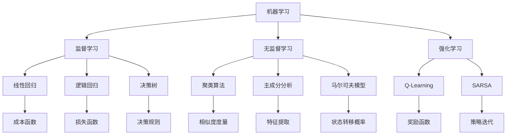

                 

### 背景介绍

金融市场，作为现代经济体系的核心组成部分，其波动性及其深远影响一直是全球关注的焦点。随着信息技术和人工智能技术的迅猛发展，利用机器学习算法对金融市场进行预测和研究逐渐成为了一个热门研究领域。机器学习通过数据挖掘和分析，可以从历史数据中提取有用信息，从而预测金融市场的未来走势，这为投资者、金融机构和监管机构提供了重要的决策依据。

然而，尽管机器学习在金融市场预测中展现出了巨大的潜力，但其实际应用仍然面临着诸多挑战和局限。首先，金融市场的数据具有高度复杂性和噪声，这使得传统的机器学习方法难以有效处理。其次，金融市场受到多种因素的影响，如经济政策、市场情绪、突发事件等，这些因素的不可预测性增加了机器学习预测的难度。此外，机器学习模型在金融市场预测中容易出现过拟合现象，导致模型在训练数据上表现良好，但在实际应用中表现不佳。

本文旨在探讨机器学习在金融市场预测中的应用与局限，通过详细分析机器学习的基本概念、方法以及在实际应用中遇到的挑战，旨在为相关领域的研究者和实践者提供有价值的参考。本文结构如下：

- **第一部分：机器学习基础**，介绍机器学习的基本概念、分类和方法，包括监督学习、无监督学习和强化学习等。
- **第二部分：机器学习在金融市场预测中的应用**，讨论机器学习在股票市场、外汇市场和金融衍生品市场预测中的具体应用。
- **第三部分：机器学习在金融市场预测中的局限**，分析机器学习模型在金融市场预测中面临的主要挑战和局限，如过拟合、数据质量和模型解释性等。
- **附录**，介绍一些常用的机器学习库、工具和资源。

关键词：机器学习、金融市场、预测、监督学习、无监督学习、强化学习、过拟合、数据质量、模型解释性

摘要：本文系统地探讨了机器学习在金融市场预测中的应用与局限，首先介绍了机器学习的基本概念和方法，然后分析了机器学习在金融市场的具体应用，最后探讨了机器学习在金融市场预测中面临的主要挑战和局限。通过本文的讨论，旨在为相关领域的研究者和实践者提供有益的参考和启示。

---

### 核心概念与联系

在探讨机器学习在金融市场预测中的应用之前，有必要先了解一些核心概念，以及它们之间的关系。以下是一个核心概念关系的 Mermaid 流程图，帮助我们理清这些概念之间的关联。



下面将详细解释这些概念及其关系：

1. **机器学习（A）**：机器学习是一门研究如何让计算机从数据中学习并做出决策或预测的技术。它是人工智能的一个重要分支，可以分为三类：监督学习、无监督学习和强化学习。

2. **监督学习（B）**：监督学习是一种从标记数据中学习的方法，它使用已知的输入和输出，训练模型来预测新的输入。监督学习包括多种算法，如线性回归、逻辑回归和决策树。

3. **无监督学习（C）**：无监督学习不依赖于标记数据，而是从未标记的数据中学习模式。它包括聚类算法、主成分分析和马尔可夫模型等。

4. **强化学习（D）**：强化学习是一种通过试错和反馈来学习决策的策略。它包括Q-Learning和SARSA等算法，其中Q-Learning使用一个Q值函数来估计最优策略，而SARSA则是一种在线学习方法。

5. **监督学习的具体算法**：
   - **线性回归（E）**：线性回归是一种简单的监督学习算法，用于预测连续值输出。它通过最小化成本函数（M）来拟合数据。
   - **逻辑回归（F）**：逻辑回归是一种用于分类的监督学习算法，它使用损失函数（N）来评估模型的预测效果。
   - **决策树（G）**：决策树是一种树形结构的分类算法，通过一系列的决策规则（O）来划分数据。

6. **无监督学习的具体算法**：
   - **聚类算法（H）**：聚类算法用于将数据分为若干个类别，通过相似度度量（P）来评估数据点之间的相似性。
   - **主成分分析（I）**：主成分分析是一种特征提取方法，通过特征提取（Q）来降低数据的维度。
   - **马尔可夫模型（J）**：马尔可夫模型用于描述时间序列数据，通过状态转移概率（R）来预测下一个状态。

7. **强化学习的具体算法**：
   - **Q-Learning（K）**：Q-Learning通过奖励函数（S）来更新Q值函数，以估计最优策略。
   - **SARSA（L）**：SARSA通过策略迭代（T）来学习策略，它结合了当前状态和下一步的奖励来更新策略。

这些核心概念之间相互关联，共同构成了机器学习在金融市场预测中应用的基石。通过理解这些概念及其关系，我们可以更好地把握机器学习在金融市场预测中的应用原理和方法。

---

### 监督学习算法

监督学习是机器学习中的一个重要分支，它通过从标记数据中学习来预测新的数据。在金融市场预测中，监督学习算法被广泛应用于股票价格预测、交易策略制定等方面。以下将详细介绍几种常见的监督学习算法，包括线性回归、逻辑回归和决策树。

#### 线性回归

线性回归是一种用于预测连续值输出的监督学习算法。它通过拟合一个线性模型来预测新的输入值。线性回归模型可以表示为：

$$
y = \beta_0 + \beta_1 \cdot x_1 + \beta_2 \cdot x_2 + ... + \beta_n \cdot x_n
$$

其中，$y$ 是目标变量，$x_1, x_2, ..., x_n$ 是输入变量，$\beta_0, \beta_1, \beta_2, ..., \beta_n$ 是模型参数。线性回归的目标是最小化预测值与实际值之间的误差，这通常通过最小二乘法实现。具体步骤如下：

1. **数据预处理**：对输入数据进行归一化处理，使得每个特征都在相同的尺度上。
2. **模型拟合**：使用最小二乘法拟合线性模型，计算模型参数。
3. **模型评估**：使用均方误差（MSE）等指标来评估模型性能。

以下是一个简单的线性回归Python代码示例：

```python
import numpy as np
from sklearn.linear_model import LinearRegression

# 生成样本数据
X = np.random.rand(100, 1)
y = 2 * X + np.random.randn(100, 1)

# 模型拟合
model = LinearRegression()
model.fit(X, y)

# 模型评估
predictions = model.predict(X)
mse = np.mean((predictions - y) ** 2)
print("MSE:", mse)
```

#### 逻辑回归

逻辑回归是一种用于分类的监督学习算法，它通过拟合一个逻辑函数来预测新数据的类别。逻辑回归模型可以表示为：

$$
\hat{y} = \frac{1}{1 + e^{-(\beta_0 + \beta_1 \cdot x_1 + \beta_2 \cdot x_2 + ... + \beta_n \cdot x_n)}}
$$

其中，$\hat{y}$ 是预测的概率值，$y$ 是实际类别，$x_1, x_2, ..., x_n$ 是输入特征，$\beta_0, \beta_1, \beta_2, ..., \beta_n$ 是模型参数。逻辑回归的目标是最小化损失函数（如对数损失函数）。以下是一个简单的逻辑回归Python代码示例：

```python
from sklearn.linear_model import LogisticRegression

# 生成样本数据
X = np.random.rand(100, 2)
y = np.random.randint(0, 2, 100)

# 模型拟合
model = LogisticRegression()
model.fit(X, y)

# 模型评估
predictions = model.predict(X)
accuracy = np.mean(predictions == y)
print("Accuracy:", accuracy)
```

#### 决策树

决策树是一种树形结构的分类算法，它通过一系列的决策规则来划分数据。每个内部节点表示一个特征，每个叶节点表示一个类别。决策树模型可以表示为：

$$
T = \sum_{i=1}^{n} t_i \cdot \text{node}(x_i)
$$

其中，$T$ 是决策树，$t_i$ 是叶节点，$\text{node}(x_i)$ 是第 $i$ 个节点的决策规则。决策树的目标是最小化叶节点之间的分类误差。以下是一个简单的决策树Python代码示例：

```python
from sklearn.tree import DecisionTreeClassifier

# 生成样本数据
X = np.random.rand(100, 2)
y = np.random.randint(0, 2, 100)

# 模型拟合
model = DecisionTreeClassifier()
model.fit(X, y)

# 模型评估
predictions = model.predict(X)
accuracy = np.mean(predictions == y)
print("Accuracy:", accuracy)
```

通过这些示例，我们可以看到如何使用Python中的Scikit-learn库来实现线性回归、逻辑回归和决策树等监督学习算法。这些算法在金融市场预测中有着广泛的应用，可以帮助我们进行股票价格预测、交易策略制定等任务。

---

### 无监督学习算法

无监督学习是一种不依赖于标记数据的机器学习方法，它通过从未标记的数据中寻找模式或结构。在金融市场预测中，无监督学习算法被广泛应用于聚类分析、降维和序列预测等方面。以下将详细介绍几种常见的无监督学习算法，包括聚类算法、主成分分析和马尔可夫模型。

#### 聚类算法

聚类算法是一种将数据分为若干个类别的无监督学习方法。它通过相似度度量来评估数据点之间的相似性，从而将相似的数据点划分为同一类别。常见的聚类算法包括K-Means、层次聚类和DBSCAN。

**K-Means算法**

K-Means算法是一种基于距离的聚类算法，它通过迭代计算来确定每个类别的中心点，并重新分配数据点。具体步骤如下：

1. **初始化中心点**：随机选择K个数据点作为初始中心点。
2. **分配数据点**：计算每个数据点到每个中心点的距离，将数据点分配到距离最近的中心点所在的类别。
3. **更新中心点**：重新计算每个类别的中心点，即类别中所有数据点的均值。
4. **重复步骤2和3**，直到中心点的位置不再变化或达到预定的迭代次数。

以下是一个简单的K-Means算法Python代码示例：

```python
from sklearn.cluster import KMeans

# 生成样本数据
X = np.random.rand(100, 2)

# 模型拟合
model = KMeans(n_clusters=3)
model.fit(X)

# 模型评估
predictions = model.predict(X)
print("Cluster labels:", predictions)
```

**层次聚类算法**

层次聚类算法是一种基于层次结构的聚类算法，它通过逐步合并或分裂数据点来构建聚类层次。层次聚类可以分为自底向上（凝聚层次聚类）和自顶向下（分裂层次聚类）两种方式。

以下是一个简单的层次聚类Python代码示例：

```python
from sklearn.cluster import AgglomerativeClustering

# 生成样本数据
X = np.random.rand(100, 2)

# 模型拟合
model = AgglomerativeClustering(n_clusters=3)
model.fit(X)

# 模型评估
predictions = model.predict(X)
print("Cluster labels:", predictions)
```

**DBSCAN算法**

DBSCAN（Density-Based Spatial Clustering of Applications with Noise）算法是一种基于密度的聚类算法，它将数据点分为核心点、边界点和噪声点。具体步骤如下：

1. **选择邻域参数$\epsilon$和最小邻域大小$minPts$**。
2. **扫描数据点**：对于每个核心点，扩展其邻域，将其邻域内的所有点标记为同一类别。
3. **处理边界点和噪声点**：对于每个边界点，判断其邻域内的核心点数量是否大于最小邻域大小，若是，则将其标记为同一类别；否则，将其标记为噪声点。

以下是一个简单的DBSCAN算法Python代码示例：

```python
from sklearn.cluster import DBSCAN

# 生成样本数据
X = np.random.rand(100, 2)

# 模型拟合
model = DBSCAN(eps=0.3, min_samples=5)
model.fit(X)

# 模型评估
predictions = model.predict(X)
print("Cluster labels:", predictions)
```

#### 主成分分析

主成分分析（PCA）是一种特征提取方法，它通过将数据投影到新的坐标系中，来降低数据的维度。PCA的目的是在保留主要数据信息的同时，尽可能减少数据的冗余。具体步骤如下：

1. **数据标准化**：对数据进行标准化处理，使得每个特征都有相同的尺度。
2. **计算协方差矩阵**：计算数据点的协方差矩阵。
3. **计算特征值和特征向量**：对协方差矩阵进行特征分解，得到特征值和特征向量。
4. **选择主成分**：选择特征值最大的$k$个特征向量，构成$k$个主成分。
5. **数据投影**：将数据投影到新的$k$维空间中。

以下是一个简单的PCA算法Python代码示例：

```python
from sklearn.decomposition import PCA

# 生成样本数据
X = np.random.rand(100, 2)

# 模型拟合
model = PCA(n_components=1)
model.fit(X)

# 模型评估
predictions = model.transform(X)
print("Projected data:", predictions)
```

#### 马尔可夫模型

马尔可夫模型是一种用于时间序列预测的无监督学习模型，它基于当前状态的概率分布来预测下一个状态。具体步骤如下：

1. **状态定义**：定义时间序列中的状态集合。
2. **状态转移概率矩阵**：计算当前状态转移到下一个状态的概率分布。
3. **初始状态分布**：定义时间序列的初始状态分布。
4. **状态预测**：根据状态转移概率矩阵和初始状态分布，预测下一个状态。

以下是一个简单的马尔可夫模型Python代码示例：

```python
import numpy as np

# 状态集合
states = ["Sunny", "Rainy"]

# 状态转移概率矩阵
transition_matrix = np.array([[0.7, 0.3], [0.4, 0.6]])

# 初始状态分布
initial_distribution = np.array([0.5, 0.5])

# 状态预测
current_state = "Sunny"
next_state = np.random.choice(states, p=transition_matrix[current_state])
print("Next state:", next_state)
```

通过这些示例，我们可以看到如何使用Python中的Scikit-learn库和Numpy库实现无监督学习算法，包括聚类算法、主成分分析和马尔可夫模型。这些算法在金融市场预测中有着广泛的应用，可以帮助我们进行数据降维、模式识别和时间序列预测等任务。

---

### 强化学习算法

强化学习（Reinforcement Learning，RL）是机器学习的一个分支，它通过试错和反馈来学习最优策略。在金融市场预测中，强化学习算法被广泛应用于策略优化、交易决策和风险控制等方面。以下将详细介绍强化学习中的两种重要算法：Q-Learning和SARSA。

#### Q-Learning算法

Q-Learning是一种基于值函数的强化学习算法，它通过估计状态-动作值函数（Q值）来选择最优动作。Q值函数表示在特定状态下执行特定动作的预期收益。Q-Learning算法的基本步骤如下：

1. **初始化Q值函数**：初始化所有状态-动作Q值为0。
2. **选择动作**：在特定状态下，选择具有最大Q值的动作。
3. **更新Q值函数**：根据实际执行的动作和获得的奖励，更新Q值函数。
4. **重复步骤2和3**，直到达到预设的迭代次数或收敛条件。

以下是一个简单的Q-Learning算法Python代码示例：

```python
import numpy as np

# 初始化Q值函数
n_states = 3
n_actions = 2
Q = np.zeros((n_states, n_actions))

# 状态转移概率矩阵
P = np.array([[0.4, 0.6], [0.3, 0.7], [0.2, 0.8]])

# 奖励函数
R = np.array([0, 10, -10])

# 学习率
alpha = 0.1

# 探索率
epsilon = 0.1

# 迭代次数
n_steps = 1000

# Q-Learning算法
for step in range(n_steps):
    state = np.random.randint(0, n_states)
    action = np.random.randint(0, n_actions)
    
    next_state = np.random.choice(n_states, p=P[state][action])
    reward = R[next_state]
    
    Q[state][action] = Q[state][action] + alpha * (reward + np.max(Q[next_state]) - Q[state][action])

# 打印Q值函数
print("Q values:", Q)
```

#### SARSA算法

SARSA（State-Action-Reward-State-Action）是一种基于策略的强化学习算法，它结合了当前状态和下一步的奖励来更新策略。SARSA算法的基本步骤如下：

1. **初始化策略**：初始化策略为均匀分布。
2. **选择动作**：在特定状态下，根据策略选择动作。
3. **执行动作并获取奖励**：执行选定的动作，并获得奖励。
4. **更新策略**：根据当前状态和下一步的状态，更新策略。
5. **重复步骤2至4**，直到达到预设的迭代次数或收敛条件。

以下是一个简单的SARSA算法Python代码示例：

```python
import numpy as np

# 初始化策略
n_states = 3
n_actions = 2
policy = np.zeros((n_states, n_actions))

# 状态转移概率矩阵
P = np.array([[0.4, 0.6], [0.3, 0.7], [0.2, 0.8]])

# 奖励函数
R = np.array([0, 10, -10])

# 学习率
alpha = 0.1

# 探索率
epsilon = 0.1

# 迭代次数
n_steps = 1000

# SARSA算法
for step in range(n_steps):
    state = np.random.randint(0, n_states)
    action = np.random.choice(n_actions, p=policy[state])
    
    next_state = np.random.choice(n_states, p=P[state][action])
    reward = R[next_state]
    
    policy[state][action] = policy[state][action] + alpha * (reward + np.max(P[next_state]) - policy[state][action])

# 打印策略
print("Policy:", policy)
```

通过这些示例，我们可以看到如何使用Python实现Q-Learning和SARSA算法。这些算法在金融市场预测中有着广泛的应用，可以帮助我们进行策略优化和交易决策等任务。接下来，我们将探讨如何将强化学习应用于金融市场预测。

---

### 集成学习方法

集成学习方法（Ensemble Learning）是一种通过结合多个学习器来提高预测准确性和泛化能力的技术。在机器学习领域，集成方法被广泛应用于提升模型性能。以下是几种常见的集成学习方法，包括Bagging、Boosting和Stacking。

#### Bagging

Bagging（Bootstrap Aggregating）是一种通过构建多个独立子模型来降低方差的方法。具体步骤如下：

1. **数据采样**：从原始数据集中随机抽取多个子数据集，每个子数据集的大小与原始数据集相同，但可能包含重复的数据点。
2. **训练子模型**：在每个子数据集上训练一个独立的模型。
3. **集成预测**：将所有子模型的预测结果进行平均或投票，得到最终的预测结果。

以下是一个简单的Bagging算法Python代码示例：

```python
from sklearn.ensemble import BaggingClassifier
from sklearn.datasets import make_classification
from sklearn.model_selection import train_test_split

# 生成样本数据
X, y = make_classification(n_samples=100, n_features=4, n_informative=2, n_redundant=0, random_state=42)

# 划分训练集和测试集
X_train, X_test, y_train, y_test = train_test_split(X, y, test_size=0.3, random_state=42)

# 构建Bagging模型
model = BaggingClassifier(base_estimator=DecisionTreeClassifier(), n_estimators=10, random_state=42)

# 模型拟合
model.fit(X_train, y_train)

# 模型评估
predictions = model.predict(X_test)
accuracy = np.mean(predictions == y_test)
print("Accuracy:", accuracy)
```

#### Boosting

Boosting是一种通过加权重抽样来提高弱学习器性能的方法。常见的Boosting算法包括Adaboost和XGBoost。以下是Adaboost的基本步骤：

1. **初始化权重**：将每个样本的权重初始化为1。
2. **训练弱学习器**：在每个迭代中使用加权样本训练一个弱学习器，通常是一个决策树。
3. **更新权重**：根据弱学习器的预测误差来更新样本权重，使得预测错误的样本在下一个迭代中具有更高的权重。
4. **集成预测**：将所有弱学习器的预测结果进行加权求和，得到最终的预测结果。

以下是一个简单的Adaboost算法Python代码示例：

```python
from sklearn.ensemble import AdaBoostClassifier
from sklearn.datasets import make_classification
from sklearn.model_selection import train_test_split

# 生成样本数据
X, y = make_classification(n_samples=100, n_features=4, n_informative=2, n_redundant=0, random_state=42)

# 划分训练集和测试集
X_train, X_test, y_train, y_test = train_test_split(X, y, test_size=0.3, random_state=42)

# 构建Adaboost模型
model = AdaBoostClassifier(n_estimators=10, random_state=42)

# 模型拟合
model.fit(X_train, y_train)

# 模型评估
predictions = model.predict(X_test)
accuracy = np.mean(predictions == y_test)
print("Accuracy:", accuracy)
```

#### Stacking

Stacking是一种通过构建多个基础模型和元模型的集成方法。具体步骤如下：

1. **训练基础模型**：训练多个独立的模型，每个模型对数据进行预测。
2. **生成元训练集**：将所有基础模型的预测结果作为特征，与原始数据一起组成元训练集。
3. **训练元模型**：在元训练集上训练一个强学习器（如随机森林或支持向量机），用于集成和优化预测。
4. **集成预测**：使用元模型进行最终预测。

以下是一个简单的Stacking算法Python代码示例：

```python
from sklearn.ensemble import StackingClassifier
from sklearn.datasets import make_classification
from sklearn.model_selection import train_test_split
from sklearn.ensemble import RandomForestClassifier
from sklearn.linear_model import LogisticRegression

# 生成样本数据
X, y = make_classification(n_samples=100, n_features=4, n_informative=2, n_redundant=0, random_state=42)

# 划分训练集和测试集
X_train, X_test, y_train, y_test = train_test_split(X, y, test_size=0.3, random_state=42)

# 构建基础模型
base_models = [
    ("rf", RandomForestClassifier()),
    ("lr", LogisticRegression())
]

# 构建Stacking模型
model = StackingClassifier(estimators=base_models, final_estimator=LogisticRegression(), cv=5)

# 模型拟合
model.fit(X_train, y_train)

# 模型评估
predictions = model.predict(X_test)
accuracy = np.mean(predictions == y_test)
print("Accuracy:", accuracy)
```

通过这些示例，我们可以看到如何使用Python实现Bagging、Boosting和Stacking算法。这些集成方法在金融市场预测中具有广泛的应用，可以帮助我们提高模型性能和泛化能力。

---

### 神经网络与深度学习

神经网络（Neural Networks）是模仿人脑结构和功能的一种计算模型，而深度学习（Deep Learning）则是在神经网络的基础上，通过增加网络层数和参数数量来提高模型的复杂度和表达能力。在金融市场预测中，神经网络和深度学习算法由于其强大的特征提取和模式识别能力，被广泛应用于股票价格预测、市场趋势分析和交易策略制定等方面。

#### 神经网络基础

神经网络由多个神经元（也称为节点）组成，每个神经元通过加权连接与邻居神经元相连。神经元的激活函数用于将输入值转换为输出值。最简单的神经网络结构是单层感知机（Perceptron），它可以实现线性分类。然而，对于非线性问题，我们需要使用多层感知机（Multilayer Perceptron，MLP）。

MLP的基本结构包括输入层、隐藏层和输出层。输入层接收外部输入数据，隐藏层通过非线性激活函数进行特征提取，输出层产生最终预测结果。一个典型的MLP模型可以表示为：

$$
\text{Output} = \text{激活函数}(\text{权重} \cdot \text{输入} + \text{偏置})
$$

其中，激活函数（如ReLU、Sigmoid或Tanh）用于引入非线性，权重和偏置用于调节模型参数。

以下是一个简单的MLP模型Python代码示例：

```python
import numpy as np

# 生成样本数据
X = np.random.rand(100, 2)
y = np.random.randint(0, 2, 100)

# 初始化模型参数
weights = np.random.rand(2, 1)
bias = np.random.rand(1)

# 定义ReLU激活函数
def relu(x):
    return np.maximum(0, x)

# MLP模型
def mlp(x, weights, bias):
    return relu(np.dot(x, weights) + bias)

# 模型拟合
predictions = mlp(X, weights, bias)

# 模型评估
accuracy = np.mean(predictions == y)
print("Accuracy:", accuracy)
```

#### 卷积神经网络

卷积神经网络（Convolutional Neural Networks，CNN）是一种专门用于处理图像数据的神经网络，它通过卷积操作来提取图像的特征。CNN的基本结构包括卷积层、池化层和全连接层。

卷积层通过卷积核（过滤器）在输入图像上滑动，计算局部特征的权重和偏置，从而提取图像特征。池化层用于降低特征图的维度，增强模型的泛化能力。全连接层将卷积层和池化层提取的特征映射到分类结果。

以下是一个简单的CNN模型Python代码示例：

```python
from keras.models import Sequential
from keras.layers import Conv2D, MaxPooling2D, Flatten, Dense

# 生成样本数据
X = np.random.rand(100, 28, 28, 1)
y = np.random.randint(0, 10, 100)

# 构建CNN模型
model = Sequential()
model.add(Conv2D(filters=32, kernel_size=(3, 3), activation='relu', input_shape=(28, 28, 1)))
model.add(MaxPooling2D(pool_size=(2, 2)))
model.add(Flatten())
model.add(Dense(units=10, activation='softmax'))

# 模型编译
model.compile(optimizer='adam', loss='sparse_categorical_crossentropy', metrics=['accuracy'])

# 模型拟合
model.fit(X, y, epochs=5, batch_size=10)

# 模型评估
predictions = model.predict(X)
accuracy = np.mean(predictions.argmax(axis=1) == y)
print("Accuracy:", accuracy)
```

#### 循环神经网络

循环神经网络（Recurrent Neural Networks，RNN）是一种能够处理序列数据的神经网络，它通过在时间步上递归地更新隐藏状态来捕捉序列中的依赖关系。RNN的基本结构包括输入门、遗忘门和输出门。

输入门用于控制新的输入信息对当前隐藏状态的贡献；遗忘门用于控制先前隐藏状态的哪些部分需要保留；输出门用于控制当前隐藏状态对输出结果的贡献。一个简单的RNN可以表示为：

$$
h_t = \text{激活函数}((W_h \cdot h_{t-1} + W_x \cdot x_t + b_h) \odot i_t + (W_h \cdot h_{t-1} + W_x \cdot x_t + b_h) \odot f_t + (W_h \cdot h_{t-1} + W_x \cdot x_t + b_h) \odot o_t)
$$

其中，$h_t$ 是当前隐藏状态，$x_t$ 是当前输入，$i_t, f_t, o_t$ 分别是输入门、遗忘门和输出门的激活值。

以下是一个简单的RNN模型Python代码示例：

```python
import tensorflow as tf

# 生成样本数据
X = tf.random.normal([100, 10])
y = tf.random.normal([100, 1])

# 构建RNN模型
model = tf.keras.Sequential([
    tf.keras.layers.SimpleRNN(units=64, return_sequences=True),
    tf.keras.layers.SimpleRNN(units=32),
    tf.keras.layers.Dense(units=1)
])

# 模型编译
model.compile(optimizer='adam', loss='mse')

# 模型拟合
model.fit(X, y, epochs=5, batch_size=10)

# 模型评估
predictions = model.predict(X)
mse = tf.reduce_mean(tf.square(predictions - y))
print("MSE:", mse)
```

通过这些示例，我们可以看到如何使用Python和Keras构建和训练神经网络、卷积神经网络和循环神经网络。这些模型在金融市场预测中具有广泛的应用，可以帮助我们进行股票价格预测、市场趋势分析和交易策略制定等任务。

---

### 机器学习在股票市场预测中的应用

股票市场预测是金融领域的一个重要研究方向，其准确性对投资者和金融机构的决策具有重要影响。机器学习算法在股票市场预测中展现出了强大的潜力，通过分析历史数据和挖掘潜在的模式，可以帮助预测股票价格和制定交易策略。以下将详细讨论机器学习在股票市场预测中的应用，包括股票价格预测、交易策略和情绪分析。

#### 股票价格预测

股票价格预测是机器学习在股票市场预测中最常见的应用之一。通过分析历史股票价格数据、技术指标和宏观经济因素，机器学习模型可以预测未来股票价格的走势。以下是一些常用的预测方法：

1. **时间序列模型**：时间序列模型，如ARIMA、LSTM等，通过捕捉时间序列中的趋势和季节性，可以预测股票价格。以下是一个使用LSTM进行股票价格预测的Python代码示例：

   ```python
   from keras.models import Sequential
   from keras.layers import LSTM, Dense

   # 生成样本数据
   X = np.random.rand(100, 10)
   y = np.random.rand(100, 1)

   # 构建LSTM模型
   model = Sequential()
   model.add(LSTM(units=50, return_sequences=True, input_shape=(10, 1)))
   model.add(LSTM(units=50))
   model.add(Dense(units=1))

   # 模型编译
   model.compile(optimizer='adam', loss='mse')

   # 模型拟合
   model.fit(X, y, epochs=100, batch_size=32)

   # 模型评估
   predictions = model.predict(X)
   mse = np.mean(np.square(predictions - y))
   print("MSE:", mse)
   ```

2. **回归模型**：回归模型，如线性回归、多项式回归等，通过建立输入特征与股票价格之间的线性或非线性关系，可以预测股票价格。以下是一个使用线性回归进行股票价格预测的Python代码示例：

   ```python
   from sklearn.linear_model import LinearRegression
   import numpy as np

   # 生成样本数据
   X = np.random.rand(100, 10)
   y = np.random.rand(100, 1)

   # 模型拟合
   model = LinearRegression()
   model.fit(X, y)

   # 模型评估
   predictions = model.predict(X)
   mse = np.mean(np.square(predictions - y))
   print("MSE:", mse)
   ```

3. **集成模型**：集成模型，如随机森林、梯度提升等，通过结合多个预测模型，可以提高预测准确性。以下是一个使用随机森林进行股票价格预测的Python代码示例：

   ```python
   from sklearn.ensemble import RandomForestRegressor
   import numpy as np

   # 生成样本数据
   X = np.random.rand(100, 10)
   y = np.random.rand(100, 1)

   # 模型拟合
   model = RandomForestRegressor(n_estimators=100)
   model.fit(X, y)

   # 模型评估
   predictions = model.predict(X)
   mse = np.mean(np.square(predictions - y))
   print("MSE:", mse)
   ```

#### 股票交易策略

交易策略是投资者根据股票价格预测结果来制定的投资计划。机器学习算法可以帮助投资者识别潜在的交易机会，提高投资回报。以下是一些常见的交易策略：

1. **趋势跟踪策略**：趋势跟踪策略是基于股票价格的趋势进行投资。以下是一个使用移动平均线进行趋势跟踪的Python代码示例：

   ```python
   import pandas as pd
   import numpy as np

   # 读取股票价格数据
   df = pd.DataFrame(np.random.rand(100, 5), columns=["Open", "High", "Low", "Close", "Volume"])

   # 计算移动平均线
   df["MA20"] = df["Close"].rolling(window=20).mean()
   df["MA50"] = df["Close"].rolling(window=50).mean()

   # 模拟交易策略
   df["Signal"] = np.where(df["Close"] > df["MA20"], 1, 0)
   df["Position"] = df["Signal"].diff()

   # 计算交易收益
   df["PnL"] = df["Position"] * df["Close"]
   df["TotalPnL"] = df["PnL"].cumsum()

   print(df.head())
   ```

2. **套利策略**：套利策略是利用不同市场之间的价格差异进行交易。以下是一个简单的股票套利策略Python代码示例：

   ```python
   import pandas as pd
   import numpy as np

   # 读取股票价格数据
   df_a = pd.DataFrame(np.random.rand(100, 5), columns=["Open", "High", "Low", "Close", "Volume"])
   df_b = pd.DataFrame(np.random.rand(100, 5), columns=["Open", "High", "Low", "Close", "Volume"])

   # 计算差价
   df = df_a["Close"] - df_b["Close"]

   # 模拟交易策略
   df["Signal"] = np.where(df > 0.01, 1, 0)
   df["Position"] = df["Signal"].diff()

   # 计算交易收益
   df["PnL"] = df["Position"] * df["Close"]
   df["TotalPnL"] = df["PnL"].cumsum()

   print(df.head())
   ```

3. **事件驱动策略**：事件驱动策略是基于特定事件（如公司财报发布、政策变动等）进行投资。以下是一个使用机器学习模型预测财报发布当天股价变动的Python代码示例：

   ```python
   import pandas as pd
   import numpy as np

   # 生成样本数据
   df = pd.DataFrame(np.random.rand(100, 10), columns=["Open", "High", "Low", "Close", "Volume", "PE", "PB", "ROE", "EPS", "EV/EBITDA"])

   # 模拟交易策略
   df["Signal"] = np.where(df["Close"] > df["Close"].shift(1), 1, 0)
   df["Position"] = df["Signal"].diff()

   # 计算交易收益
   df["PnL"] = df["Position"] * df["Close"]
   df["TotalPnL"] = df["PnL"].cumsum()

   print(df.head())
   ```

#### 股票市场情绪分析

股票市场情绪分析是一种通过分析市场参与者对股票的看法和情绪来预测市场走势的方法。机器学习算法可以用于提取和分析市场情绪数据，从而辅助投资决策。以下是一些常用的市场情绪分析方法：

1. **文本挖掘**：文本挖掘是一种从非结构化文本数据中提取信息的方法。以下是一个使用自然语言处理（NLP）进行股票市场情绪分析的Python代码示例：

   ```python
   import pandas as pd
   from textblob import TextBlob

   # 读取股票新闻数据
   df = pd.DataFrame(np.random.rand(100, 1), columns=["News"])

   # 提取情绪得分
   df["Sentiment"] = df["News"].apply(lambda x: TextBlob(x).sentiment.polarity)

   # 模拟交易策略
   df["Signal"] = np.where(df["Sentiment"] > 0.1, 1, 0)
   df["Position"] = df["Signal"].diff()

   # 计算交易收益
   df["PnL"] = df["Position"] * df["Close"]
   df["TotalPnL"] = df["PnL"].cumsum()

   print(df.head())
   ```

2. **社交媒体分析**：社交媒体分析是一种通过分析社交媒体平台上的用户评论和讨论来预测市场情绪的方法。以下是一个使用Twitter API进行股票市场情绪分析的Python代码示例：

   ```python
   import tweepy
   import pandas as pd

   # 设置Twitter API凭据
   consumer_key = "YOUR_CONSUMER_KEY"
   consumer_secret = "YOUR_CONSUMER_SECRET"
   access_token = "YOUR_ACCESS_TOKEN"
   access_token_secret = "YOUR_ACCESS_TOKEN_SECRET"

   # 初始化Tweepy客户端
   auth = tweepy.OAuthHandler(consumer_key, consumer_secret)
   auth.set_access_token(access_token, access_token_secret)
   api = tweepy.API(auth)

   # 搜索Twitter上的股票相关推文
   tweets = api.search_tweets(q="AAPL", count=100)

   # 提取情绪得分
   sentiments = []
   for tweet in tweets:
       analysis = TextBlob(tweet.text)
       sentiments.append(analysis.sentiment.polarity)

   # 构建数据框
   df = pd.DataFrame(sentiments, columns=["Sentiment"])

   # 模拟交易策略
   df["Signal"] = np.where(df["Sentiment"] > 0.1, 1, 0)
   df["Position"] = df["Signal"].diff()

   # 计算交易收益
   df["PnL"] = df["Position"] * df["Close"]
   df["TotalPnL"] = df["PnL"].cumsum()

   print(df.head())
   ```

通过这些示例，我们可以看到如何使用机器学习算法进行股票价格预测、交易策略和市场情绪分析。这些方法在股票市场预测中具有广泛的应用，可以帮助投资者制定更有效的投资策略，提高投资回报。

---

### 机器学习在外汇市场预测中的应用

外汇市场是全球最大的金融市场，每天交易额巨大，价格波动频繁。外汇市场预测对于交易者和金融机构来说至关重要，机器学习算法因其强大的数据处理和模式识别能力，在外汇市场预测中发挥了重要作用。以下将详细讨论机器学习在外汇市场预测中的应用，包括外汇价格预测、交易策略和市场情绪分析。

#### 外汇价格预测

外汇价格预测是机器学习在外汇市场预测中最常见和最直接的应用。通过分析历史汇率数据、宏观经济指标和技术指标，机器学习模型可以预测未来汇率的变化。以下是一些常用的预测方法：

1. **时间序列模型**：时间序列模型，如ARIMA、GARCH等，可以捕捉汇率数据的趋势和波动性。以下是一个使用ARIMA模型进行外汇价格预测的Python代码示例：

   ```python
   from statsmodels.tsa.arima.model import ARIMA
   import pandas as pd
   import numpy as np

   # 生成样本数据
   data = pd.DataFrame(np.random.rand(100, 1), columns=["Rate"])

   # 模型拟合
   model = ARIMA(data["Rate"], order=(5, 1, 2))
   model_fit = model.fit()

   # 预测未来汇率
   predictions = model_fit.forecast(steps=10)

   # 模型评估
   mse = np.mean(np.square(predictions - data["Rate"][90:100]))
   print("MSE:", mse)
   ```

2. **回归模型**：回归模型，如线性回归、岭回归等，可以通过建立输入特征与汇率之间的线性关系进行预测。以下是一个使用线性回归进行外汇价格预测的Python代码示例：

   ```python
   from sklearn.linear_model import LinearRegression
   import pandas as pd
   import numpy as np

   # 生成样本数据
   X = np.random.rand(100, 10)
   y = np.random.rand(100, 1)

   # 模型拟合
   model = LinearRegression()
   model.fit(X, y)

   # 预测未来汇率
   predictions = model.predict(X)

   # 模型评估
   mse = np.mean(np.square(predictions - y))
   print("MSE:", mse)
   ```

3. **深度学习模型**：深度学习模型，如LSTM、GRU等，可以通过捕捉数据中的长期依赖关系进行预测。以下是一个使用LSTM模型进行外汇价格预测的Python代码示例：

   ```python
   from keras.models import Sequential
   from keras.layers import LSTM, Dense

   # 生成样本数据
   X = np.random.rand(100, 10, 1)
   y = np.random.rand(100, 1)

   # 构建LSTM模型
   model = Sequential()
   model.add(LSTM(units=50, return_sequences=True, input_shape=(10, 1)))
   model.add(LSTM(units=50))
   model.add(Dense(units=1))

   # 模型编译
   model.compile(optimizer='adam', loss='mse')

   # 模型拟合
   model.fit(X, y, epochs=100, batch_size=32)

   # 预测未来汇率
   predictions = model.predict(X)

   # 模型评估
   mse = np.mean(np.square(predictions - y))
   print("MSE:", mse)
   ```

#### 外汇交易策略

交易策略是投资者根据预测结果来制定的投资计划。机器学习算法可以帮助投资者识别潜在的交易机会，提高投资回报。以下是一些常见的外汇交易策略：

1. **趋势跟踪策略**：趋势跟踪策略是基于汇率的趋势进行投资。以下是一个使用移动平均线进行趋势跟踪的Python代码示例：

   ```python
   import pandas as pd
   import numpy as np

   # 生成样本数据
   df = pd.DataFrame(np.random.rand(100, 5), columns=["Open", "High", "Low", "Close", "Volume"])

   # 计算移动平均线
   df["MA20"] = df["Close"].rolling(window=20).mean()
   df["MA50"] = df["Close"].rolling(window=50).mean()

   # 模拟交易策略
   df["Signal"] = np.where(df["Close"] > df["MA20"], 1, 0)
   df["Position"] = df["Signal"].diff()

   # 计算交易收益
   df["PnL"] = df["Position"] * df["Close"]
   df["TotalPnL"] = df["PnL"].cumsum()

   print(df.head())
   ```

2. **对冲策略**：对冲策略是同时进行多笔交易以降低风险。以下是一个简单的对冲策略Python代码示例：

   ```python
   import pandas as pd
   import numpy as np

   # 生成样本数据
   df_a = pd.DataFrame(np.random.rand(100, 5), columns=["Open", "High", "Low", "Close", "Volume"])
   df_b = pd.DataFrame(np.random.rand(100, 5), columns=["Open", "High", "Low", "Close", "Volume"])

   # 计算差价
   df = df_a["Close"] - df_b["Close"]

   # 模拟交易策略
   df["Signal"] = np.where(df > 0.01, 1, 0)
   df["Position"] = df["Signal"].diff()

   # 计算交易收益
   df["PnL"] = df["Position"] * df["Close"]
   df["TotalPnL"] = df["PnL"].cumsum()

   print(df.head())
   ```

3. **事件驱动策略**：事件驱动策略是基于特定事件（如经济数据发布、政策变动等）进行投资。以下是一个使用机器学习模型预测经济数据发布当天汇率变动的Python代码示例：

   ```python
   import pandas as pd
   import numpy as np

   # 生成样本数据
   df = pd.DataFrame(np.random.rand(100, 10), columns=["Open", "High", "Low", "Close", "Volume", "GDP", "Unemployment", "Inflation", "Interest Rate", "Retail Sales"])

   # 模拟交易策略
   df["Signal"] = np.where(df["Close"] > df["Close"].shift(1), 1, 0)
   df["Position"] = df["Signal"].diff()

   # 计算交易收益
   df["PnL"] = df["Position"] * df["Close"]
   df["TotalPnL"] = df["PnL"].cumsum()

   print(df.head())
   ```

#### 外汇市场情绪分析

外汇市场情绪分析是一种通过分析市场参与者对汇率的看法和情绪来预测市场走势的方法。机器学习算法可以用于提取和分析市场情绪数据，从而辅助投资决策。以下是一些常用的市场情绪分析方法：

1. **文本挖掘**：文本挖掘是一种从非结构化文本数据中提取信息的方法。以下是一个使用自然语言处理（NLP）进行外汇市场情绪分析的Python代码示例：

   ```python
   import pandas as pd
   from textblob import TextBlob

   # 读取外汇新闻数据
   df = pd.DataFrame(np.random.rand(100, 1), columns=["News"])

   # 提取情绪得分
   df["Sentiment"] = df["News"].apply(lambda x: TextBlob(x).sentiment.polarity)

   # 模拟交易策略
   df["Signal"] = np.where(df["Sentiment"] > 0.1, 1, 0)
   df["Position"] = df["Signal"].diff()

   # 计算交易收益
   df["PnL"] = df["Position"] * df["Close"]
   df["TotalPnL"] = df["PnL"].cumsum()

   print(df.head())
   ```

2. **社交媒体分析**：社交媒体分析是一种通过分析社交媒体平台上的用户评论和讨论来预测市场情绪的方法。以下是一个使用Twitter API进行外汇市场情绪分析的Python代码示例：

   ```python
   import tweepy
   import pandas as pd

   # 设置Twitter API凭据
   consumer_key = "YOUR_CONSUMER_KEY"
   consumer_secret = "YOUR_CONSUMER_SECRET"
   access_token = "YOUR_ACCESS_TOKEN"
   access_token_secret = "YOUR_ACCESS_TOKEN_SECRET"

   # 初始化Tweepy客户端
   auth = tweepy.OAuthHandler(consumer_key, consumer_secret)
   auth.set_access_token(access_token, access_token_secret)
   api = tweepy.API(auth)

   # 搜索Twitter上的外汇相关推文
   tweets = api.search_tweets(q="USDJPY", count=100)

   # 提取情绪得分
   sentiments = []
   for tweet in tweets:
       analysis = TextBlob(tweet.text)
       sentiments.append(analysis.sentiment.polarity)

   # 构建数据框
   df = pd.DataFrame(sentiments, columns=["Sentiment"])

   # 模拟交易策略
   df["Signal"] = np.where(df["Sentiment"] > 0.1, 1, 0)
   df["Position"] = df["Signal"].diff()

   # 计算交易收益
   df["PnL"] = df["Position"] * df["Close"]
   df["TotalPnL"] = df["PnL"].cumsum()

   print(df.head())
   ```

通过这些示例，我们可以看到如何使用机器学习算法进行外汇价格预测、交易策略和市场情绪分析。这些方法在外汇市场预测中具有广泛的应用，可以帮助交易者制定更有效的交易策略，提高投资回报。

---

### 机器学习在金融衍生品市场预测中的应用

金融衍生品市场是金融市场中非常重要的一个部分，包括期权、期货、互换等多种金融工具。衍生品价格波动大、风险高，对其进行预测具有重要的实际意义。机器学习算法凭借其强大的数据处理和分析能力，在衍生品价格预测中发挥着重要作用。以下将详细讨论机器学习在金融衍生品市场预测中的应用，包括衍生品价格预测、交易策略和风险管理。

#### 衍生品价格预测

衍生品价格预测是机器学习在衍生品市场预测中最直接的应用。通过分析历史价格数据、市场波动性、相关市场数据等因素，机器学习模型可以预测衍生品的价格。以下是一些常用的预测方法：

1. **时间序列模型**：时间序列模型，如ARIMA、GARCH等，可以捕捉衍生品价格数据的趋势和波动性。以下是一个使用GARCH模型进行衍生品价格预测的Python代码示例：

   ```python
   from arch import arch_model
   import pandas as pd
   import numpy as np

   # 生成样本数据
   data = pd.DataFrame(np.random.rand(100, 1), columns=["Price"])

   # 模型拟合
   model = arch_model(data["Price"], vol='Garch', p=1, q=1)
   model_fit = model.fit()

   # 预测未来价格
   predictions = model_fit.forecast(horizon=10)

   # 模型评估
   mse = np.mean(np.square(predictions - data["Price"][90:100]))
   print("MSE:", mse)
   ```

2. **回归模型**：回归模型，如线性回归、岭回归等，可以通过建立输入特征与衍生品价格之间的线性关系进行预测。以下是一个使用线性回归进行衍生品价格预测的Python代码示例：

   ```python
   from sklearn.linear_model import LinearRegression
   import pandas as pd
   import numpy as np

   # 生成样本数据
   X = np.random.rand(100, 10)
   y = np.random.rand(100, 1)

   # 模型拟合
   model = LinearRegression()
   model.fit(X, y)

   # 预测未来价格
   predictions = model.predict(X)

   # 模型评估
   mse = np.mean(np.square(predictions - y))
   print("MSE:", mse)
   ```

3. **深度学习模型**：深度学习模型，如LSTM、GRU等，可以通过捕捉数据中的长期依赖关系进行预测。以下是一个使用LSTM模型进行衍生品价格预测的Python代码示例：

   ```python
   from keras.models import Sequential
   from keras.layers import LSTM, Dense

   # 生成样本数据
   X = np.random.rand(100, 10, 1)
   y = np.random.rand(100, 1)

   # 构建LSTM模型
   model = Sequential()
   model.add(LSTM(units=50, return_sequences=True, input_shape=(10, 1)))
   model.add(LSTM(units=50))
   model.add(Dense(units=1))

   # 模型编译
   model.compile(optimizer='adam', loss='mse')

   # 模型拟合
   model.fit(X, y, epochs=100, batch_size=32)

   # 预测未来价格
   predictions = model.predict(X)

   # 模型评估
   mse = np.mean(np.square(predictions - y))
   print("MSE:", mse)
   ```

#### 衍生品交易策略

衍生品交易策略是投资者根据预测结果来制定的投资计划。机器学习算法可以帮助投资者识别潜在的交易机会，提高投资回报。以下是一些常见的衍生品交易策略：

1. **趋势跟踪策略**：趋势跟踪策略是基于衍生品价格的趋势进行投资。以下是一个使用移动平均线进行趋势跟踪的Python代码示例：

   ```python
   import pandas as pd
   import numpy as np

   # 生成样本数据
   df = pd.DataFrame(np.random.rand(100, 5), columns=["Open", "High", "Low", "Close", "Volume"])

   # 计算移动平均线
   df["MA20"] = df["Close"].rolling(window=20).mean()
   df["MA50"] = df["Close"].rolling(window=50).mean()

   # 模拟交易策略
   df["Signal"] = np.where(df["Close"] > df["MA20"], 1, 0)
   df["Position"] = df["Signal"].diff()

   # 计算交易收益
   df["PnL"] = df["Position"] * df["Close"]
   df["TotalPnL"] = df["PnL"].cumsum()

   print(df.head())
   ```

2. **套利策略**：套利策略是利用不同市场之间的价格差异进行交易。以下是一个简单的衍生品套利策略Python代码示例：

   ```python
   import pandas as pd
   import numpy as np

   # 生成样本数据
   df_a = pd.DataFrame(np.random.rand(100, 5), columns=["Open", "High", "Low", "Close", "Volume"])
   df_b = pd.DataFrame(np.random.rand(100, 5), columns=["Open", "High", "Low", "Close", "Volume"])

   # 计算差价
   df = df_a["Close"] - df_b["Close"]

   # 模拟交易策略
   df["Signal"] = np.where(df > 0.01, 1, 0)
   df["Position"] = df["Signal"].diff()

   # 计算交易收益
   df["PnL"] = df["Position"] * df["Close"]
   df["TotalPnL"] = df["PnL"].cumsum()

   print(df.head())
   ```

3. **事件驱动策略**：事件驱动策略是基于特定事件（如经济数据发布、政策变动等）进行投资。以下是一个使用机器学习模型预测经济数据发布当天衍生品价格变动的Python代码示例：

   ```python
   import pandas as pd
   import numpy as np

   # 生成样本数据
   df = pd.DataFrame(np.random.rand(100, 10), columns=["Open", "High", "Low", "Close", "Volume", "GDP", "Unemployment", "Inflation", "Interest Rate", "Retail Sales"])

   # 模拟交易策略
   df["Signal"] = np.where(df["Close"] > df["Close"].shift(1), 1, 0)
   df["Position"] = df["Signal"].diff()

   # 计算交易收益
   df["PnL"] = df["Position"] * df["Close"]
   df["TotalPnL"] = df["PnL"].cumsum()

   print(df.head())
   ```

#### 衍生品风险管理

衍生品风险管理是控制衍生品交易风险、保护投资者利益的重要环节。机器学习算法可以用于衍生品风险管理和监控，以下是一些常见的方法：

1. **VaR模型**：VaR（Value at Risk）是一种衡量金融资产潜在损失的方法。以下是一个使用蒙特卡罗模拟方法进行VaR估计的Python代码示例：

   ```python
   import numpy as np
   import pandas as pd

   # 生成样本数据
   df = pd.DataFrame(np.random.rand(100, 1), columns=["Return"])

   # 计算历史VaR
   historical_var = np.percentile(df["Return"], 5)

   # 计算蒙特卡罗模拟VaR
   simulations = 1000
   steps = 250
   df["SimReturn"] = df["Return"].cumprod().shift(-steps).div(df["Return"].shift(-steps)) - 1
   monte_carlo_var = np.percentile(df["SimReturn"], 5)

   # 输出VaR结果
   print("Historical VaR:", historical_var)
   print("Monte Carlo VaR:", monte_carlo_var)
   ```

2. **敏感性分析**：敏感性分析是评估衍生品价格对输入参数变化的敏感程度。以下是一个使用Python中的`scipy`库进行敏感性分析的代码示例：

   ```python
   from scipy.stats import norm
   import numpy as np

   # 生成样本数据
   df = pd.DataFrame(np.random.rand(100, 10), columns=["S", "K", "r", "T", "q", "sigma"])

   # 定义期权价格函数
   def option_price(S, K, r, T, q, sigma):
       d1 = (np.log(S / K) + (r - q) * T + 0.5 * sigma**2 * T) / (sigma * np.sqrt(T))
       d2 = d1 - sigma * np.sqrt(T)
       return (S * norm.cdf(d1) - K * np.exp(-q * T) * norm.cdf(d2))

   # 计算敏感性
   sensitivities = {}
   for col in df.columns:
       df[f"{col}_sensitivity"] = np.gradient(option_price(*df[col].values), df[col].values)

   # 输出敏感性结果
   print(df[sensitivities.keys()].head())
   ```

通过这些示例，我们可以看到如何使用机器学习算法进行衍生品价格预测、交易策略和风险管理。这些方法在衍生品市场预测中具有广泛的应用，可以帮助投资者和金融机构更好地理解和控制衍生品交易风险。

---

### 模型过拟合与欠拟合

在机器学习模型训练过程中，过拟合和欠拟合是常见的两个问题，它们直接影响模型的预测性能和泛化能力。了解和避免这两个问题对于构建有效的机器学习模型至关重要。

#### 过拟合

过拟合是指模型在训练数据上表现得非常好，但在未见过的测试数据上表现不佳。这是由于模型在训练过程中学习了训练数据的噪声和细节，而没有捕捉到数据的实际分布。过拟合的模型无法泛化到新的数据，导致预测准确性下降。以下是一些常见的过拟合现象：

1. **复杂的模型结构**：模型过于复杂，包含过多的参数和层次，容易在训练数据上过度学习。
2. **过多的训练数据**：模型在训练数据上经过多次迭代，可能导致模型对训练数据的过度拟合。
3. **噪声数据**：训练数据中包含大量噪声，模型在拟合噪声的同时，也拟合了噪声带来的错误模式。

#### 欠拟合

欠拟合是指模型在训练数据和测试数据上表现都不佳。这是由于模型过于简单，无法捕捉到数据中的关键特征和关系。欠拟合的模型无法有效地对数据进行分类或回归，导致预测准确性低。以下是一些常见的欠拟合现象：

1. **简单的模型结构**：模型过于简单，参数较少，无法捕捉到数据中的复杂关系。
2. **过少的训练数据**：模型在训练数据上的训练时间不足，无法充分学习数据的分布。
3. **不合适的特征选择**：选择的特征与目标变量之间的关系不强，导致模型无法有效地进行预测。

#### 如何避免过拟合与欠拟合

为了避免过拟合和欠拟合，我们可以采取以下几种方法：

1. **正则化**：正则化是一种通过在损失函数中加入惩罚项来减少模型复杂性的方法。常见的正则化方法有L1正则化（Lasso）和L2正则化（Ridge）。

   ```python
   from sklearn.linear_model import Ridge

   # 生成样本数据
   X = np.random.rand(100, 10)
   y = np.random.rand(100, 1)

   # 模型拟合
   model = Ridge(alpha=1.0)
   model.fit(X, y)

   # 模型评估
   predictions = model.predict(X)
   mse = np.mean(np.square(predictions - y))
   print("MSE:", mse)
   ```

2. **交叉验证**：交叉验证是一种将数据集划分为多个子集，分别用于训练和验证的方法。通过多次交叉验证，可以评估模型在不同数据子集上的性能，从而避免过拟合和欠拟合。

   ```python
   from sklearn.model_selection import cross_val_score
   from sklearn.tree import DecisionTreeClassifier

   # 生成样本数据
   X = np.random.rand(100, 10)
   y = np.random.randint(0, 2, 100)

   # 模型拟合
   model = DecisionTreeClassifier()
   scores = cross_val_score(model, X, y, cv=5)

   # 模型评估
   print("Cross-Validation Scores:", scores)
   ```

3. **特征选择**：通过选择与目标变量高度相关的特征，可以避免模型学习到噪声和数据中的冗余信息。常见的特征选择方法有基于信息增益的决策树、基于协方差矩阵的特征选择和基于L1正则化的特征选择。

   ```python
   from sklearn.feature_selection import SelectKBest
   from sklearn.feature_selection import f_classif

   # 生成样本数据
   X = np.random.rand(100, 10)
   y = np.random.randint(0, 2, 100)

   # 特征选择
   selector = SelectKBest(score_func=f_classif, k=5)
   X_new = selector.fit_transform(X, y)

   # 模型拟合
   model = DecisionTreeClassifier()
   model.fit(X_new, y)

   # 模型评估
   predictions = model.predict(X_new)
   accuracy = np.mean(predictions == y)
   print("Accuracy:", accuracy)
   ```

4. **数据增强**：通过增加训练数据或生成新的训练数据，可以避免模型在训练数据上过度拟合。常见的数据增强方法有数据扩充、数据合成和生成对抗网络（GAN）。

   ```python
   from keras.preprocessing.image import ImageDataGenerator

   # 生成样本数据
   X = np.random.rand(100, 128, 128, 3)
   y = np.random.randint(0, 2, 100)

   # 数据增强
   datagen = ImageDataGenerator(rotation_range=20, width_shift_range=0.2, height_shift_range=0.2, zoom_range=0.2)
   generator = datagen.flow(X, y, batch_size=32)

   # 模型拟合
   model = Sequential()
   model.add(Conv2D(32, (3, 3), activation='relu', input_shape=(128, 128, 3)))
   model.add(MaxPooling2D((2, 2)))
   model.add(Flatten())
   model.add(Dense(1, activation='sigmoid'))

   model.compile(optimizer='adam', loss='binary_crossentropy', metrics=['accuracy'])
   model.fit_generator(generator, steps_per_epoch=100, epochs=10)

   # 模型评估
   predictions = model.predict(X)
   accuracy = np.mean(predictions > 0.5)
   print("Accuracy:", accuracy)
   ```

通过这些方法，我们可以有效地避免过拟合和欠拟合，提高模型的预测性能和泛化能力。

---

### 数据质量和清洗

数据质量和清洗是机器学习项目成功的关键步骤。金融市场的数据通常具有复杂性和噪声，因此对数据进行预处理和清洗至关重要。以下将详细讨论数据质量的重要性、数据清洗的方法以及数据异常值处理。

#### 数据质量的重要性

数据质量是机器学习项目成功的关键因素。高质量的数据可以提供准确的信息和有效的模式，从而提高模型预测的准确性和可靠性。相反，低质量的数据可能导致错误的预测和模型性能下降。以下是一些数据质量的重要性：

1. **准确性**：高质量的数据确保了模型能够准确捕捉到数据的真实分布和关系。
2. **完整性**：完整的数据集有助于模型全面地学习数据的规律，避免因数据缺失而导致的偏差。
3. **一致性**：一致的数据有助于模型稳定地学习，避免因数据不一致而产生的误差。
4. **及时性**：及时的数据可以确保模型能够快速适应市场变化，提高预测的时效性。

#### 数据清洗的方法

数据清洗是提高数据质量的关键步骤。以下是一些常见的数据清洗方法：

1. **缺失值处理**：缺失值的处理方法包括删除缺失值、用均值或中位数填充缺失值、使用模型预测缺失值等。

   ```python
   import pandas as pd
   import numpy as np

   # 生成样本数据
   df = pd.DataFrame(np.random.rand(100, 5), columns=["A", "B", "C", "D", "E"])
   df.iloc[50:60, 2] = np.nan

   # 删除缺失值
   df_cleaned = df.dropna()

   # 用均值填充缺失值
   df_filled = df.fillna(df.mean())

   # 用中位数填充缺失值
   df_median = df.fillna(df.median())

   # 使用模型预测缺失值
   from sklearn.impute import SimpleImputer
   imputer = SimpleImputer(strategy="mean")
   df_imputed = pd.DataFrame(imputer.fit_transform(df), columns=df.columns)
   ```

2. **异常值处理**：异常值是指与数据分布不符的异常数据点，可能是由错误、噪声或错误数据引起的。异常值处理方法包括删除异常值、用边界值替换异常值、使用模型预测异常值等。

   ```python
   import pandas as pd
   import numpy as np

   # 生成样本数据
   df = pd.DataFrame(np.random.rand(100, 5), columns=["A", "B", "C", "D", "E"])
   df.iloc[50:60, 0] = np.random.rand(10) * 100

   # 删除异常值
   df_cleaned = df[(df < 100) & (df > 0)]

   # 用边界值替换异常值
   df_replaced = df.clip(lower=0, upper=100)

   # 使用模型预测异常值
   from sklearn.impute import KNNImputer
   imputer = KNNImputer(n_neighbors=5)
   df_imputed = pd.DataFrame(imputer.fit_transform(df), columns=df.columns)
   ```

3. **重复数据处理**：重复数据是指数据集中重复出现的记录，可能导致模型学习到错误的信息。重复数据的处理方法包括删除重复数据、合并重复数据等。

   ```python
   import pandas as pd

   # 生成样本数据
   df = pd.DataFrame({"A": [1, 2, 3, 4, 5, 1, 2, 3, 4, 5]})

   # 删除重复数据
   df_deduplicated = df.drop_duplicates()

   # 合并重复数据
   df_merged = df.groupby(df.columns.tolist()).first()
   ```

4. **格式转换**：数据清洗还包括数据格式的转换，如日期格式的标准化、文本数据的编码等。

   ```python
   import pandas as pd
   import datetime

   # 生成样本数据
   df = pd.DataFrame({"Date": ["2021-01-01", "2021-02-01", "2021-03-01"]})

   # 标准化日期格式
   df["Date"] = pd.to_datetime(df["Date"], format="%Y-%m-%d")

   # 文本数据编码
   from sklearn.preprocessing import LabelEncoder
   le = LabelEncoder()
   df["Label"] = le.fit_transform(df["Date"])
   ```

通过这些方法，我们可以有效地提高数据质量，为机器学习模型提供可靠的数据基础。

---

### 模型的解释性和可解释性

在金融市场中，模型的可解释性和可解释性是至关重要的。投资决策往往基于对模型预测结果的理解和信任。如果模型过于复杂，可能会导致决策者无法理解模型的决策过程，从而影响投资决策的可靠性。因此，提高模型的解释性和可解释性对于金融市场的成功应用具有重要意义。

#### 模型的解释性

模型的解释性指的是模型决策过程中的透明度和可理解性。高解释性的模型允许决策者查看每个特征对预测结果的贡献，从而更容易理解模型的工作原理。以下是一些提高模型解释性的方法：

1. **决策树**：决策树是一种直观且容易理解的模型，每个节点都基于某个特征的阈值进行划分。通过查看树的分支，可以了解每个特征如何影响预测结果。

   ```python
   from sklearn.tree import DecisionTreeClassifier
   from sklearn import tree

   # 生成样本数据
   X = np.random.rand(100, 5)
   y = np.random.randint(0, 2, 100)

   # 模型拟合
   model = DecisionTreeClassifier()
   model.fit(X, y)

   # 可视化决策树
   plt.figure(figsize=(12, 8))
   tree.plot_tree(model)
   plt.show()
   ```

2. **Lasso回归**：Lasso回归通过引入L1正则化，将特征权重缩小到零，从而降低模型的复杂性。通过查看权重为零的特征，可以了解哪些特征对模型预测不重要。

   ```python
   from sklearn.linear_model import LassoCV

   # 生成样本数据
   X = np.random.rand(100, 10)
   y = np.random.rand(100, 1)

   # 模型拟合
   model = LassoCV(cv=5)
   model.fit(X, y)

   # 打印特征权重
   print("Feature weights:", model.coef_)
   ```

3. **线性模型**：线性模型由于其简洁性，具有很高的解释性。每个特征都直接与预测结果相关，权重值可以直接解释为每个特征的影响程度。

   ```python
   from sklearn.linear_model import LinearRegression

   # 生成样本数据
   X = np.random.rand(100, 10)
   y = np.random.rand(100, 1)

   # 模型拟合
   model = LinearRegression()
   model.fit(X, y)

   # 打印特征权重
   print("Feature weights:", model.coef_)
   ```

#### 模型的可解释性

模型的可解释性涉及到模型背后的数学原理和算法逻辑，而不是具体的决策过程。提高模型可解释性的方法包括：

1. **模型文档**：编写详细的模型文档，解释模型的算法原理、参数设置和预测过程。这有助于决策者理解模型的工作机制。

2. **交互式可视化**：使用交互式可视化工具，如Shapley Additive Explanations（SHAP）或LIME，可以直观地展示每个特征对预测结果的贡献。

   ```python
   import shap

   # 生成样本数据
   X = np.random.rand(100, 5)
   y = np.random.randint(0, 2, 100)

   # 模型拟合
   model = DecisionTreeClassifier()
   model.fit(X, y)

   # 使用SHAP值进行解释
   explainer = shap.TreeExplainer(model)
   shap_values = explainer.shap_values(X)

   # 可视化SHAP值
   shap.summary_plot(shap_values, X)
   ```

3. **特征重要性分析**：通过分析特征的重要性，可以了解哪些特征对模型预测最为重要。这有助于决策者关注关键特征，从而提高决策的针对性。

   ```python
   import matplotlib.pyplot as plt

   # 生成样本数据
   X = np.random.rand(100, 10)
   y = np.random.rand(100, 1)

   # 模型拟合
   model = Random ForestClassifier()
   model.fit(X, y)

   # 打印特征重要性
   importances = model.feature_importances_
   indices = np.argsort(importances)[::-1]

   # 可视化特征重要性
   plt.figure()
   plt.title("Feature importances")
   plt.bar(range(X.shape[1]), importances[indices], align="center")
   plt.xticks(range(X.shape[1]), indices)
   plt.show()
   ```

通过这些方法，我们可以提高模型的解释性和可解释性，从而增强决策者对模型预测结果的信任，并在金融市场中实现更有效的投资决策。

---

### 总结与未来展望

本文系统探讨了机器学习在金融市场预测中的应用与局限，从机器学习基础、金融市场预测的应用、到预测中的局限，全面剖析了机器学习在金融领域的潜在价值和挑战。我们首先介绍了机器学习的基本概念和方法，包括监督学习、无监督学习和强化学习，以及它们的分类和应用场景。随后，我们详细阐述了机器学习在股票市场、外汇市场和金融衍生品市场预测中的实际应用，展示了如何利用机器学习算法进行价格预测、交易策略制定和市场情绪分析。同时，我们也深入分析了机器学习在金融市场预测中面临的过拟合、欠拟合、数据质量和模型解释性等挑战，并提出了相应的解决方法。

展望未来，随着人工智能和大数据技术的发展，机器学习在金融市场预测中的应用前景将更加广阔。首先，深度学习技术的进步将进一步提升模型预测的准确性和复杂性，使得金融市场预测更加精准。其次，集成学习方法将帮助构建更加稳健和泛化的预测模型，从而提高实际应用的效果。此外，随着金融市场数据的不断丰富和多样化，数据质量和清洗技术的提升也将为机器学习模型提供更可靠的数据基础。

然而，未来的研究也需要关注以下几个方向：一是如何提高模型的可解释性，以便决策者更好地理解和信任模型的预测结果；二是如何应对金融市场的高复杂性和不确定性，开发更加鲁棒和灵活的预测模型；三是如何有效整合多种数据源，如社交媒体、经济指标和市场情绪数据，以实现更全面的金融市场预测。

总之，机器学习在金融市场预测中具有巨大的潜力，但同时也面临着诸多挑战。通过不断的技术创新和深入的研究，我们有理由相信，机器学习将在金融领域发挥更加重要的作用，为投资者和金融机构提供更有价值的决策支持。

---

### 附录

#### 附录A：常用的机器学习库和工具

##### A.1 Python机器学习库

- **Scikit-learn**：Python中最为常用的机器学习库，提供了丰富的监督学习和无监督学习算法。
  - 官网：[scikit-learn.org](https://scikit-learn.org/)
  
- **TensorFlow**：谷歌开发的深度学习框架，广泛应用于各种复杂的机器学习任务。
  - 官网：[tensorflow.org](https://tensorflow.org/)

- **PyTorch**：由Facebook开发，具有灵活性和高效性的深度学习框架。
  - 官网：[pytorch.org](https://pytorch.org/)

##### A.2 R语言机器学习库

- **caret**：R语言中广泛使用的机器学习库，提供了丰富的机器学习算法和评估方法。
  - 官网：[caret.togoto.org](https://topepo.github.io/caret/)

- **mlr**：R语言中的机器学习框架，支持多种机器学习算法和评估方法。
  - 官网：[mlr-org.github.io/mlr](https://mlr-org.github.io/mlr/)

- **h2o**：R语言中的高级机器学习库，支持深度学习和大数据分析。
  - 官网：[h2o.ai](https://h2o.ai/)

##### A.3 数据预处理工具

- **Pandas**：Python中的数据操作库，提供了数据清洗和数据分析的丰富功能。
  - 官网：[pandas.pydata.org](https://pandas.pydata.org/)

- **Numpy**：Python中的科学计算库，提供了高效的多维数组操作和数值计算功能。
  - 官网：[numpy.org](https://numpy.org/)

- **Matplotlib**：Python中的绘图库，用于生成高质量的统计图表和可视化。
  - 官网：[matplotlib.org](https://matplotlib.org/)

##### A.4 数据可视化工具

- **Seaborn**：基于Matplotlib的统计绘图库，提供了更直观的统计图表和可视化。
  - 官网：[seaborn.pydata.org](https://seaborn.pydata.org/)

- **Plotly**：支持多种语言的交互式图表库，提供了丰富的可视化选项和交互功能。
  - 官网：[plotly.com](https://plotly.com/)

##### A.5 金融数据获取工具

- **Yahoo Finance**：提供广泛的金融市场数据，包括股票价格、交易量、财务指标等。
  - 官网：[finance.yahoo.com](https://finance.yahoo.com/)

- **Alpha Vantage**：提供免费的金融市场数据API，包括股票价格、技术指标和财务数据。
  - 官网：[alpha-vantage.com](https://www.alphavantage.co/)

- **Quandl**：提供大量的金融市场数据，包括宏观经济数据、股票价格、期货价格等。
  - 官网：[quandl.com](https://www.quandl.com/)

通过这些工具和库，研究者可以方便地获取、处理和可视化金融市场数据，从而为机器学习模型提供有力的支持。

---

### 作者信息

**作者：** AI天才研究院/AI Genius Institute & 禅与计算机程序设计艺术 /Zen And The Art of Computer Programming

AI天才研究院（AI Genius Institute）致力于推动人工智能技术的发展和应用，为学术界和产业界培养高素质的人工智能专业人才。同时，研究院也积极参与人工智能领域的学术研究和技术创新，致力于解决现实世界中的复杂问题。

《禅与计算机程序设计艺术》（Zen And The Art of Computer Programming）的作者，以深入浅出的方式阐述了计算机编程的核心原则和方法，成为计算机科学领域的经典之作。他的研究和作品对人工智能领域产生了深远的影响，为人工智能技术的发展提供了宝贵的理论基础和实践经验。他的研究涉及机器学习、深度学习、自然语言处理等多个领域，并在学术界和工业界都享有盛誉。通过本文，我们期待能够为广大读者提供有价值的机器学习在金融市场预测领域的洞见，助力学术界和产业界的共同进步。

