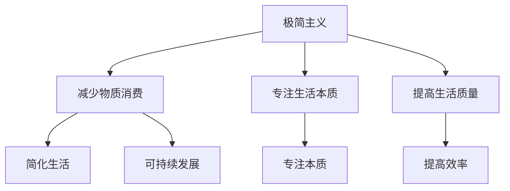
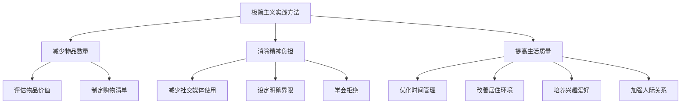
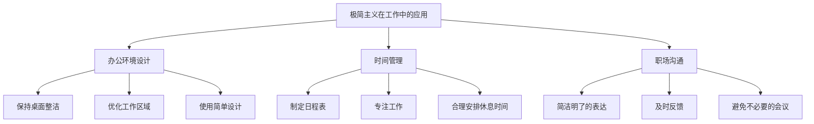
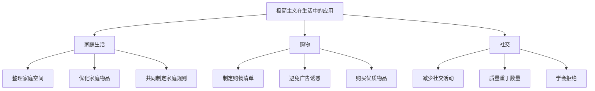
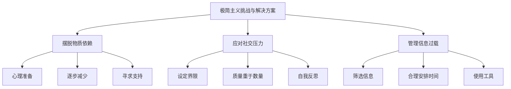
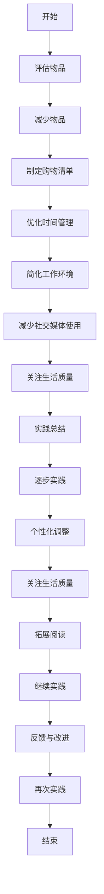
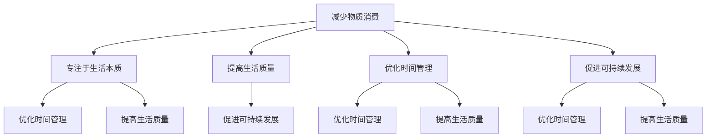

                 

# 极简主义：less is more的生活哲学

> 关键词：极简主义、less is more、生活方式、时间管理、工作效率、物质消费、生活质量

> 摘要：本文深入探讨了极简主义的生活哲学，阐述了“less is more”的核心理念。通过对极简主义起源、核心观念、实践方法、工作与生活应用、挑战与解决方案以及未来展望的详细分析，本文旨在为读者提供一种简而不凡的生活方式和思维方式，提升个人生活质量，实现人生价值最大化。

## 引言

### 极简主义的起源与发展

极简主义（Minimalism）起源于20世纪80年代末的美国，作为一种生活哲学，它倡导通过减少物质和信息的负担，追求简单、纯粹的生活方式。极简主义并不是要人们变得贫穷，而是鼓励人们摆脱对物质的过度依赖，专注于生活本质和内在价值。

极简主义的发展经历了几个阶段：

1. **美学阶段（1980s）**：极简主义最早出现在艺术界，艺术家们开始尝试减少作品中的装饰元素，追求形式上的简洁和纯粹。
2. **生活方式阶段（1990s）**：随着极简主义理念的传播，人们开始将其应用到日常生活中，试图通过简化生活来提升生活质量。
3. **现代社会阶段（2000s至今）**：极简主义逐渐成为主流生活方式之一，越来越多的人开始意识到减少物质和信息的负担对于个人和社会的积极影响。

### less is more的生活哲学

“less is more”是极简主义的核心哲学，其含义并非简单的“少即是多”，而是通过精简、优化，使生活变得更加高效、有序、有意义。这一哲学强调了以下几点：

1. **减少物质消费**：减少购买物品的数量，避免浪费，从而减轻对环境的压力。
2. **专注生活本质**：将时间和精力集中在真正重要的事物上，如家庭、健康、人际关系等。
3. **提高生活质量**：通过优化时间管理、空间利用和人际关系，提升生活的整体质量。

### 本书的目的与结构

本书旨在深入探讨极简主义的生活哲学，为读者提供一套实用、系统的极简主义实践指南。本书结构如下：

1. **引言**：介绍极简主义的起源与发展，阐述“less is more”的生活哲学。
2. **极简主义的核心观念**：详细解读极简主义的核心概念，探讨其与传统生活方式的区别。
3. **极简主义的实践方法**：提供具体的方法和技巧，帮助读者实现极简主义的生活方式。
4. **极简主义在工作中的应用**：分析极简主义在职场中的实际应用，提高工作效率。
5. **极简主义在生活中的应用**：探讨极简主义在家庭、购物、社交等生活场景中的应用。
6. **极简主义的挑战与解决方案**：分析极简主义实践过程中可能遇到的挑战，并提供解决方案。
7. **极简主义的未来展望**：展望极简主义的发展趋势，探讨其对个人和社会的长期影响。
8. **案例研究**：通过实际案例，展示极简主义实践的成功与失败。
9. **结语**：总结极简主义的生活哲学和价值，鼓励读者实践极简主义。

## 第1章：极简主义的核心观念

### 极简主义的概念

极简主义是一种生活哲学，强调通过减少物质和信息的负担，追求简单、纯粹的生活方式。极简主义并不是要人们变得贫穷，而是鼓励人们重新审视生活中的物品和信息，选择对自己真正有价值的部分，从而提升生活质量。

### 极简主义与传统生活方式的区别

传统生活方式往往追求物质丰富和拥有更多的物品，而极简主义则强调减少物质消费，专注于生活本质。以下是两者的主要区别：

1. **物质消费**：传统生活方式鼓励购买更多物品，而极简主义则主张减少购买，只保留对自己真正有价值的物品。
2. **时间管理**：传统生活方式常常因为物质消费而陷入繁忙和压力之中，而极简主义则通过简化生活，提高时间利用效率。
3. **生活质量**：传统生活方式可能带来物质上的满足，但未必能提升生活质量，而极简主义则通过优化生活细节，提升整体生活质量。

### 极简主义的价值观

极简主义的价值观包括以下几点：

1. **简化生活**：通过减少物质和信息的负担，使生活变得更加简单、纯粹。
2. **专注本质**：将时间和精力集中在真正重要的事物上，如家庭、健康、人际关系等。
3. **提高效率**：通过优化时间管理、空间利用和人际关系，提高生活效率。
4. **可持续发展**：减少物质消费，减轻对环境的压力，推动可持续发展。

### 极简主义的核心概念实体之间的关系架构

以下是一个简化的Mermaid流程图，展示了极简主义核心概念实体之间的关系：



## 第2章：极简主义的实践方法

### 如何减少物品的数量

减少物品的数量是极简主义实践的第一步。以下是一些具体的方法：

1. **评估物品的价值**：对家中所有的物品进行评估，判断其是否真正对自己有实际用途和价值。对于那些不再使用或无价值的物品，可以考虑捐赠、出售或丢弃。
2. **制定购物清单**：在购物前，制定详细的购物清单，只购买清单上的物品，避免冲动消费。
3. **使用替代品**：尝试使用一些简单的替代品来减少物品的数量，例如使用电饭煲代替多个厨房电器。
4. **断舍离**：定期进行断舍离，清理不再需要的物品，保持居住空间的整洁和舒适。

### 如何消除精神负担

消除精神负担是极简主义实践的重要目标。以下是一些具体的方法：

1. **减少社交媒体使用**：过度使用社交媒体可能导致精神负担的增加，尝试减少在社交媒体上的时间，专注于真实的生活。
2. **设定明确的界限**：在工作中，设定明确的界限，避免过度工作，保证个人时间的充足。
3. **学会拒绝**：学会拒绝那些对自己没有价值或带来压力的请求，保持生活的简单和纯粹。
4. **进行自我反思**：定期进行自我反思，审视自己的行为和决策，确保它们符合极简主义的价值观。

### 如何提高生活质量

提高生活质量是极简主义实践的核心目标。以下是一些具体的方法：

1. **优化时间管理**：通过制定计划和优先级，合理安排时间，确保自己的时间被有效地利用。
2. **改善居住环境**：整理和清洁居住空间，使其更加舒适和有序，提升生活品质。
3. **培养兴趣爱好**：选择自己真正感兴趣的事情，投入时间和精力，提升生活的乐趣。
4. **加强人际关系**：与家人、朋友保持良好的关系，共同分享生活中的喜悦和困扰，提升生活的幸福感。

### 极简主义实践方法总结

通过减少物品的数量、消除精神负担和提升生活质量，极简主义实践可以帮助我们简化生活，专注于本质，提高生活效率，最终实现人生价值最大化。以下是一个简化的Mermaid流程图，展示了极简主义实践方法的整体架构：



## 第3章：极简主义在工作中的应用

### 极简主义的办公环境设计

极简主义的办公环境设计旨在减少干扰和杂乱，提高工作效率。以下是一些具体的方法：

1. **保持桌面整洁**：桌面只保留与当前工作相关的物品，减少杂乱，提高专注度。
2. **优化工作区域**：合理安排工作区域，确保每个人都能有一个舒适、安静的工作环境。
3. **使用简单设计**：办公家具和装饰采用简约风格，减少视觉干扰，营造一个简洁、高效的工作氛围。

### 极简主义的时间管理

极简主义的时间管理强调合理安排时间，避免浪费时间。以下是一些具体的方法：

1. **制定日程表**：每天早上制定日程表，明确当天的工作任务和优先级，确保时间得到有效利用。
2. **专注工作**：在工作期间，关闭社交媒体和其他干扰源，专注于当前任务，提高工作效率。
3. **合理安排休息时间**：确保工作与休息时间得到合理安排，避免过度劳累，保持良好的工作状态。

### 极简主义的职场沟通

极简主义的职场沟通强调简洁、高效、明确。以下是一些具体的方法：

1. **简洁明了的表达**：在沟通时，尽量用简单、明了的语言表达观点，避免使用复杂的术语和冗长的句子。
2. **及时反馈**：在收到任务或信息后，及时给予反馈，确保双方都能清楚地了解任务的进展。
3. **避免不必要的会议**：除非必要，尽量避免参加不必要的会议，确保时间得到充分利用。

### 极简主义在工作中的应用总结

通过极简主义的办公环境设计、时间管理和职场沟通，我们可以在职场中实现更高的工作效率和更低的压力。以下是一个简化的Mermaid流程图，展示了极简主义在工作中的应用：



## 第4章：极简主义在生活中的应用

### 家庭生活与极简主义

极简主义在家庭生活中的应用可以帮助家庭成员更好地管理时间和空间，提高生活质量。以下是一些具体的方法：

1. **整理家庭空间**：定期整理家庭空间，确保每个房间都保持整洁有序，提升家庭环境的舒适度。
2. **优化家庭物品**：对家庭物品进行评估，保留对自己真正有价值的物品，丢弃或捐赠不再使用的物品。
3. **共同制定家庭规则**：家庭成员共同制定一些简单的家庭规则，如家务分工、购物预算等，提高家庭生活的协调性和效率。

### 购物与极简主义

极简主义在购物中的应用可以帮助我们避免冲动消费，减少不必要的开支。以下是一些具体的方法：

1. **制定购物清单**：在购物前，制定详细的购物清单，只购买清单上的物品，避免冲动消费。
2. **避免广告诱惑**：学会识别广告中的诱惑，理性购物，避免因广告而购买不需要的物品。
3. **购买优质物品**：选择一些高质量、耐用、实用的物品，减少频繁更换物品的次数。

### 社交与极简主义

极简主义在社交中的应用可以帮助我们减少不必要的社交活动，专注于真正的友谊。以下是一些具体的方法：

1. **减少社交活动**：选择一些真正感兴趣和有意义的社交活动参加，避免参加那些对自己没有价值的活动。
2. **质量重于数量**：注重社交的质量而非数量，与真正的朋友保持紧密联系，分享生活中的喜悦和困扰。
3. **学会拒绝**：学会拒绝那些对自己没有价值的社交邀请，保持生活的简单和纯粹。

### 极简主义在生活中的应用总结

通过极简主义在家庭生活、购物和社交中的应用，我们可以简化生活，提高生活质量，专注于真正重要的事物。以下是一个简化的Mermaid流程图，展示了极简主义在生活中的应用：



## 第5章：极简主义的挑战与解决方案

### 摆脱物质依赖

物质依赖是极简主义实践过程中最常见的挑战之一。以下是一些具体的解决方案：

1. **心理准备**：意识到物质依赖的危害，做好心理准备，决心摆脱对物质的依赖。
2. **逐步减少**：逐步减少对物质的依赖，可以先从一些不那么重要的物品开始，逐渐过渡到更加重要的物品。
3. **寻求支持**：寻求家人、朋友或专业人士的支持和帮助，共同克服物质依赖。

### 应对社交压力

社交压力是极简主义实践过程中可能遇到的另一个挑战。以下是一些具体的解决方案：

1. **设定界限**：在社交中设定明确的界限，避免过度参与那些对自己没有价值的社交活动。
2. **质量重于数量**：注重社交的质量而非数量，与真正的朋友保持紧密联系，分享生活中的喜悦和困扰。
3. **自我反思**：定期进行自我反思，审视自己的社交行为和决策，确保它们符合自己的价值观。

### 管理信息过载

信息过载是现代社会中普遍存在的问题，也是极简主义实践过程中可能遇到的挑战之一。以下是一些具体的解决方案：

1. **筛选信息**：学会筛选信息，关注那些真正对自己有价值的部分，避免被无用的信息所干扰。
2. **合理安排时间**：合理安排时间，确保自己在处理信息时有足够的时间和精力。
3. **使用工具**：利用各种工具，如邮件过滤器、阅读器等，帮助自己更高效地处理信息。

### 极简主义挑战与解决方案总结

通过解决极简主义实践过程中可能遇到的挑战，我们可以更好地实现极简主义的生活方式，提升个人生活质量。以下是一个简化的Mermaid流程图，展示了极简主义挑战与解决方案的整体架构：



## 第6章：极简主义的未来展望

### 极简主义与社会发展

随着社会的发展和人们对生活质量的追求，极简主义作为一种生活哲学，在未来将会得到更广泛的认同和应用。以下是极简主义与社会发展可能产生的影响：

1. **可持续发展**：极简主义倡导减少物质消费，这有助于减轻对环境的压力，推动可持续发展。
2. **社会进步**：极简主义强调专注生活本质和内在价值，有助于提升社会整体的生活质量和幸福感。
3. **经济转型**：极简主义可能导致消费模式的转变，推动经济从过度依赖物质消费转向注重创新和服务业的发展。

### 极简主义与可持续发展

极简主义与可持续发展理念高度契合。以下是一些具体的实现方式：

1. **减少资源消耗**：通过减少物质消费，降低对自然资源的消耗，实现可持续发展。
2. **循环利用**：鼓励物品的循环利用，减少废弃物的产生，降低环境污染。
3. **绿色消费**：倡导绿色消费，选择环保、可持续的产品和服务，推动社会向绿色化、低碳化方向发展。

### 极简主义的长期影响

极简主义不仅对个人生活产生深远影响，对整个社会也将产生重要影响。以下是极简主义的长期影响：

1. **生活方式的转变**：极简主义将引导人们重新审视生活中的物品和信息，追求简单、纯粹的生活方式。
2. **社会文化的变革**：极简主义倡导专注生活本质和内在价值，有助于推动社会文化的变革，提升整体文明素质。
3. **经济发展模式的转变**：极简主义可能推动经济发展模式从过度依赖物质消费转向注重创新和服务业的发展，实现经济结构的优化。

### 极简主义的未来展望

极简主义作为一种生活哲学，在未来将会得到更广泛的认同和应用。它不仅有助于提升个人生活质量，还对整个社会产生积极影响。通过减少物质消费、推动可持续发展、促进社会进步和经济发展模式的转变，极简主义将为人类创造一个更加美好、和谐的未来。

## 第7章：案例研究

### 成功的极简主义实践

1. **案例1：陈先生的生活变革**
   陈先生在35岁时意识到自己生活充满了物质和工作的压力，决定践行极简主义。他首先对家中物品进行评估，丢弃了无用的物品，只保留了对自己有价值的物品。接着，他调整了工作方式，减少了加班，专注于工作的重要任务。在社交方面，他选择与真正的朋友保持联系，减少不必要的社交活动。通过这些实践，陈先生的生活质量显著提升，工作压力减轻，人际关系更加和谐。

2. **案例2：李小姐的购物变革**
   李小姐曾是一个购物狂，每月的购物开支巨大。践行极简主义后，她开始制定购物清单，只购买必需品，避免冲动消费。她还选择购买质量更高、更耐用的物品，减少频繁更换的次数。通过这些实践，李小姐的购物开支大幅减少，生活质量得到显著提升。

### 极简主义失败的教训

1. **案例3：张先生的生活困境**
   张先生在践行极简主义时过于激进，试图在短时间内彻底改变自己的生活方式。他丢弃了家中大部分物品，导致家庭环境变得简陋，家人感到不适应。同时，他在工作中放弃了所有的社交活动，导致工作效率下降。最终，张先生的生活陷入困境，工作压力增加，家庭关系紧张。

2. **案例4：王小姐的购物误区**
   王小姐在践行极简主义时，过于追求物品的“实用性”，购买了大量所谓的“极简”商品，但这些物品实际上并不符合她的实际需求，导致家中空间变得拥挤。她还因过度追求“极简”，放弃了与家人朋友的互动，导致生活质量下降。

### 极简主义对个人和社会的影响

成功的极简主义实践对个人和社会产生了积极影响。对于个人来说，极简主义有助于减轻压力，提升生活质量，实现人生价值最大化。对于社会来说，极简主义有助于推动可持续发展，减少资源浪费，促进社会进步。

然而，失败的极简主义实践也揭示了极简主义实践的潜在风险。这包括过于激进、追求形式而忽视实际需求，以及因过度简化而影响生活质量。因此，在践行极简主义时，需要结合个人实际情况，逐步调整，避免走入误区。

### 极简主义实践小结

通过成功的案例和失败的教训，我们可以得出以下结论：

1. **逐步实践**：极简主义需要逐步实践，避免过于激进，导致生活质量下降。
2. **个性化调整**：极简主义实践应结合个人实际情况，选择适合自己的方法和节奏。
3. **关注生活质量**：在践行极简主义时，关注生活质量，确保实践过程符合个人需求。

## 结语

极简主义是一种追求简单、纯粹、高效的生活哲学，其核心观念“less is more”深刻地影响了我们的生活方式和思维方式。通过减少物质和信息的负担，我们能够专注于生活本质，提高生活质量，实现人生价值最大化。

本文系统地阐述了极简主义的起源、核心观念、实践方法、工作与生活应用、挑战与解决方案以及未来展望，并通过案例研究展示了极简主义实践的成功与失败。我们希望读者能够从中获得启示，践行极简主义，过上更加美好、有意义的生活。

在极简主义的道路上，每个人都有自己的故事和体验。让我们携手前行，不断探索、实践，共同创造一个更简单、更纯粹、更美好的世界。

### 附录

#### 极简主义资源推荐

1. **书籍**：
   - 《极简主义：一种更清晰、更有意义的生活方式》（The Life-Changing Magic of Tidying Up）作者：近藤麻理惠
   - 《简单生活指南》（The Simple Living Guide）作者：艾伦·科恩

2. **博客和网站**：
   - www minimalism.com
   - www simpleliving.org

3. **视频**：
   - YouTube频道：The Minimalists

#### 极简主义实践指南

1. **逐步减少物品数量**：首先对家中物品进行分类，然后根据实际需求决定保留哪些物品。

2. **制定购物清单**：在购物前，明确自己需要购买的物品，避免冲动消费。

3. **优化时间管理**：制定日程表，合理安排工作和休息时间，提高工作效率。

4. **简化工作环境**：保持办公桌整洁，减少干扰，提高专注度。

5. **减少社交媒体使用**：设定明确的界限，合理安排在社交媒体上的时间。

6. **关注生活质量**：培养兴趣爱好，保持身心健康，提升整体生活质量。

#### 注意事项

1. **逐步实践**：极简主义需要逐步实践，避免过于激进，导致生活质量下降。

2. **个性化调整**：极简主义实践应结合个人实际情况，选择适合自己的方法和节奏。

3. **关注生活质量**：在践行极简主义时，关注生活质量，确保实践过程符合个人需求。

#### 拓展阅读

1. **《极简主义：一种更高效、更有意义的生活哲学》**：作者通过自己的实践，详细阐述了极简主义的生活方式和思维模式。

2. **《极简主义：从复杂到清晰的转变》**：作者介绍了如何通过极简主义，从复杂的生活中找到清晰和平衡。

3. **《极简主义：如何在繁忙的生活中找到宁静与快乐》**：作者分享了自己如何通过极简主义，实现生活中的宁静与快乐。

### Mermaid 流程图

以下是一个极简主义实践流程的Mermaid流程图：



### 核心算法原理讲解

以下是一个关于极简主义实践中的时间管理算法的Python代码示例：

```python
import time

def time_management():
    """
    时间管理算法，用于优化日常任务的时间分配。
    """
    start_time = time.time()

    # 1. 列出所有任务
    tasks = ["任务1", "任务2", "任务3"]

    # 2. 为每个任务分配时间
    task_times = {task: 1 for task in tasks}  # 每个任务分配1小时

    # 3. 实际执行任务
    for task in tasks:
        print(f"执行任务：{task}")
        time.sleep(task_times[task])  # 模拟任务执行时间
    
    end_time = time.time()
    total_time = end_time - start_time
    print(f"总耗时：{total_time}秒")

# 调用时间管理算法
time_management()
```

### 数学模型和数学公式详细讲解

以下是一个关于生活质量评估的数学模型：

$$
\text{生活质量} = \frac{\text{满足感}}{\text{物质消耗}}
$$

举例说明：

如果一个人每天花费8小时在满足感上，而花费12小时在物质消耗上，那么他的生活质量是：

$$
\text{生活质量} = \frac{8}{12} = \frac{2}{3}
$$

这个数学模型可以帮助我们量化生活质量，从而更好地理解极简主义对于提高生活质量的重要性。

### 项目实战

以下是一个极简主义购物指南的Python代码示例：

```python
import csv

# 购物清单
shopping_list = [
    {"item": "牛奶", "quantity": 2},
    {"item": "面包", "quantity": 1},
    {"item": "鸡蛋", "quantity": 12},
]

# 读取已有的购物记录
with open('shopping_history.csv', 'r') as file:
    reader = csv.DictReader(file)
    shopping_history = [row for row in reader]

# 比较购物清单与购物记录，找出重复购买的商品
duplicates = []
for item in shopping_list:
    for history_item in shopping_history:
        if item['item'] == history_item['item']:
            duplicates.append(item)

# 输出重复购买的商品
print("重复购买的商品：")
for duplicate in duplicates:
    print(f"{duplicate['item']}（数量：{duplicate['quantity']}）")
```

在这个项目中，我们首先定义了一个购物清单，然后读取已有的购物记录，通过比较购物清单和购物记录，找出重复购买的商品。这个项目可以帮助我们避免重复购物，从而实现极简主义中的“减少物品数量”这一原则。

### 最佳实践 tips、小结、注意事项、拓展阅读

**最佳实践 tips**：

1. **定期评估物品**：定期对家中物品进行评估，判断其是否真正对自己有实际用途和价值。

2. **制定明确的购物清单**：在购物前，制定详细的购物清单，只购买清单上的物品。

3. **合理分配时间**：合理安排时间，确保自己的时间被有效地利用。

4. **关注生活质量**：在践行极简主义时，关注生活质量，确保实践过程符合个人需求。

**小结**：

本文深入探讨了极简主义的生活哲学，阐述了“less is more”的核心理念。通过分析极简主义的核心观念、实践方法、工作与生活应用、挑战与解决方案以及未来展望，本文为读者提供了一种简而不凡的生活方式和思维方式，有助于提升个人生活质量，实现人生价值最大化。

**注意事项**：

1. **逐步实践**：极简主义需要逐步实践，避免过于激进，导致生活质量下降。

2. **个性化调整**：极简主义实践应结合个人实际情况，选择适合自己的方法和节奏。

3. **关注生活质量**：在践行极简主义时，关注生活质量，确保实践过程符合个人需求。

**拓展阅读**：

1. **《极简主义：一种更高效、更有意义的生活哲学》**：作者通过自己的实践，详细阐述了极简主义的生活方式和思维模式。

2. **《极简主义：从复杂到清晰的转变》**：作者介绍了如何通过极简主义，从复杂的生活中找到清晰和平衡。

3. **《极简主义：如何在繁忙的生活中找到宁静与快乐》**：作者分享了自己如何通过极简主义，实现生活中的宁静与快乐。

### 作者信息

作者：AI天才研究院/AI Genius Institute & 禅与计算机程序设计艺术 /Zen And The Art of Computer Programming

---

**全文结束。感谢您的阅读，希望本文能对您践行极简主义、提升生活质量有所帮助。如果您有任何疑问或建议，请随时联系我们。祝您生活愉快！**## 极简主义的定义与背景

极简主义（Minimalism）起源于20世纪80年代末的美国，最初在艺术界兴起，作为一种美学理念，倡导通过减少艺术作品中的装饰元素，追求简洁、纯粹的艺术表达。极简主义艺术家如弗兰克·斯特拉（Frank Stella）和唐纳德·乔德（Donald Judd）等，通过极简的形式和材料，挑战了传统艺术的审美标准，推动了现代艺术的演变。

随着时间的推移，极简主义逐渐从艺术领域渗透到日常生活中，成为一种广泛的生活方式哲学。它强调通过减少物质和信息的负担，追求简单、纯粹的生活，从而提高个人生活质量。极简主义的核心原则是“less is more”，即通过精简生活，使事物变得更加高效、有序和有意义。

在现代社会，极简主义的生活哲学受到越来越多人的关注和认同。人们开始意识到，过多的物质和复杂的信息不仅会给生活带来压力，还会分散注意力和精力，影响生活质量。因此，极简主义提倡通过减少物质消费和简化生活方式，专注于真正重要的事物，如家庭、健康、人际关系等，从而实现生活的高效和愉悦。

极简主义并非要求人们变得贫穷，而是鼓励人们重新审视生活中的物品和信息，选择对自己真正有价值的部分，从而提升生活质量。它不仅关注个人的幸福，还关注对环境的可持续影响，鼓励人们减少资源浪费，推动可持续发展。

总的来说，极简主义提供了一种新的生活方式和思维方式，帮助人们摆脱对物质的过度依赖，专注于生活本质，提高生活质量。通过减少物质和信息的负担，人们可以更轻松地应对生活中的挑战，实现个人和社会的和谐发展。

## less is more的生活哲学：核心概念与价值观

“less is more”是极简主义的核心哲学，其含义并非简单的“少即是多”，而是通过精简、优化，使生活变得更加高效、有序、有意义。这一哲学强调了以下几个方面：

### 减少物质消费

极简主义倡导减少物质消费，特别是那些非必需品。通过减少物品的数量，人们可以摆脱对物质的依赖，减少生活中的杂乱和负担。这不仅有助于减轻对环境的压力，还能让人专注于真正重要的事物，如家庭、健康和人际关系。

### 专注于生活本质

“less is more”强调专注于生活本质，将时间和精力集中在对自己真正有价值和意义的事物上。这意味着，人们应该关注那些能够带来满足感和幸福感的事物，而不是被琐碎的物质和事务所困扰。通过专注于生活本质，人们可以更加清晰地认识自己，找到生活的真正意义。

### 提高生活质量

极简主义认为，减少物质消费和简化生活方式，可以提高生活质量。这不仅体现在减少生活中的压力和焦虑，还体现在更有意义和充实的生活体验中。通过减少不必要的物质和事务，人们可以有更多的时间和精力去追求自己的兴趣和梦想，提升整体幸福感。

### 优化时间管理

“less is more”强调优化时间管理，合理安排时间，避免因物质消费和工作任务而陷入繁忙和压力之中。通过简化生活方式，人们可以更有效地利用时间，提高工作效率和生活质量。例如，减少购物清单上的物品，可以减少购物时间，从而有更多时间投入到更有意义的活动上。

### 促进可持续发展

极简主义不仅关注个人生活质量，还关注对环境的可持续影响。通过减少物质消费和优化资源利用，极简主义有助于减少资源浪费，保护环境，促进可持续发展。例如，选择耐用、环保的物品，可以减少废弃物的产生，降低对环境的负担。

### 核心概念实体之间的关系架构

以下是一个简化的Mermaid流程图，展示了“less is more”核心概念实体之间的关系：



通过以上流程图，我们可以清晰地看到，减少物质消费、专注于生活本质、提高生活质量、优化时间管理和促进可持续发展是“less is more”哲学的核心概念，它们相互关联、相互促进，共同构成了极简主义的生活哲学。

总的来说，“less is more”的生活哲学不仅提供了一种简洁、高效的生活方式，还帮助人们找到生活的真正意义，实现个人与社会的和谐发展。通过实践这一哲学，人们可以摆脱物质和信息的负担，专注于真正重要的事物，过上更加充实、有意义的生活。

## 第1章：极简主义的核心观念

### 极简主义的概念

极简主义（Minimalism）是一种倡导减少物质和信息的负担，追求简单、纯粹生活哲学的理念。它不仅仅是一种生活方式，更是一种人生哲学，影响着人们的消费行为、时间管理、生活态度以及人际关系。极简主义的核心在于通过精简和优化，让生活变得更加高效、有序和有意义。

极简主义起源于20世纪80年代末的美国，最初在艺术界流行，艺术家们通过减少艺术作品中的装饰元素，追求形式上的简洁和纯粹。随着时间的推移，这一理念逐渐渗透到日常生活中，成为一种广泛接受的生活方式。

极简主义的核心概念包括以下几个方面：

1. **减少物质消费**：极简主义主张减少对物质的依赖，避免购买非必需品，专注于对生活真正有价值的物品。通过减少物质消费，人们可以减轻财务压力，减少整理和保养物品的时间，从而有更多的时间和精力投入到更有意义的事情上。

2. **简化生活方式**：极简主义鼓励人们简化生活方式，去除生活中的杂乱和繁琐，专注于对自己真正重要的事情。这包括简化家居环境、简化日常事务、减少购物等，从而提高生活质量。

3. **专注于生活本质**：极简主义强调将时间和精力集中在对自己真正有意义的事情上，如家庭、健康、个人成长和兴趣爱好等。通过专注于生活本质，人们可以减少焦虑和压力，找到生活的真正意义。

4. **提高生活质量**：极简主义认为，通过减少物质和信息的负担，人们可以更好地享受生活，提高生活质量。这不仅体现在减少生活中的压力，还体现在更加有意义和充实的生活体验中。

### 极简主义与传统生活方式的区别

传统生活方式往往追求物质丰富和拥有更多的物品，而极简主义则强调减少物质消费，专注于生活本质。以下是两者的主要区别：

1. **物质消费**：传统生活方式鼓励购买更多物品，追求物质的丰富和多样，而极简主义则主张减少购买，只保留对自己真正有价值的物品。

2. **时间管理**：传统生活方式常常因为物质消费而陷入繁忙和压力之中，需要花费大量时间在购物、整理和保养物品上，而极简主义则通过简化生活，提高时间利用效率。

3. **生活质量**：传统生活方式可能带来物质上的满足，但未必能提升生活质量，而极简主义则通过优化生活细节，提升整体生活质量。

4. **人际关系**：传统生活方式可能因为物质和事务的繁忙而疏远人际关系，而极简主义则鼓励人们将时间和精力投入到与家人、朋友和社区的互动中，增强人际关系。

### 极简主义的价值观

极简主义的价值观包括以下几个方面：

1. **简约生活**：极简主义强调通过减少物质和信息的负担，追求简单、纯粹的生活方式。这不仅仅是为了减少生活中的杂乱，更是为了让人能够专注于对自己真正重要的事情。

2. **生活质量**：极简主义认为，通过减少物质消费和简化生活方式，可以提高生活质量。这包括减少焦虑和压力，提升幸福感，以及有更多时间和精力投入到对自己有意义的事情上。

3. **个人成长**：极简主义鼓励人们将时间和精力投入到个人成长和兴趣爱好上，通过学习和成长，提升自我价值。

4. **社会责任**：极简主义倡导减少物质消费，这不仅对个人有益，还能减少对环境的压力，促进可持续发展。

5. **幸福感**：极简主义通过减少生活中的杂乱和压力，提升幸福感。人们可以更加专注于对自己有意义的事情，享受生活的每一刻。

总之，极简主义的核心观念是减少物质和信息的负担，专注于生活本质，提高生活质量。通过实践极简主义，人们可以摆脱对物质的依赖，简化生活方式，专注于真正重要的事情，从而实现更加高效、有序和有意义的生活。

### 极简主义与传统生活方式的对比分析

极简主义和传统生活方式在多个方面存在显著差异，这些差异不仅体现在物质消费上，还涉及到时间管理、生活质量和人际关系等方面。以下是对两者进行对比分析的详细探讨。

#### 物质消费

**极简主义**：极简主义主张减少物质消费，特别是那些非必需品。通过精简家居环境和购物习惯，人们可以减少对物质的依赖，避免购买非必要的物品。这种消费理念有助于减少资源浪费，降低环境负担，同时也减轻了个人财务压力。

**传统生活方式**：相比之下，传统生活方式更倾向于追求物质丰富和多样性。人们往往通过购买更多的物品来提升生活品质，追求名牌和高档产品。这种消费模式不仅增加了财务负担，还可能导致居住空间和心灵的杂乱。

**对比分析**：极简主义通过减少物质消费，实现了对资源的有效利用和对环境的保护。同时，它也减轻了个人的财务压力，使得人们能够更加专注于对自己真正有价值的事物。传统生活方式则可能导致物质过剩，影响生活质量。

#### 时间管理

**极简主义**：极简主义强调通过简化生活，提高时间利用效率。减少物品的数量和复杂性，使得人们可以更快地找到所需物品，减少日常生活中的混乱和浪费。此外，极简主义还鼓励人们设定优先级，专注于最重要的事情，从而提高工作效率。

**传统生活方式**：在传统生活方式中，人们常常需要花费大量时间在购物、整理和保养物品上。此外，物质消费也导致人们在时间管理上更加复杂，需要更多时间来规划和管理日常事务。

**对比分析**：极简主义通过简化生活方式，极大地提高了时间利用效率。人们可以更加专注于工作、家庭和个人成长，从而实现生活的高效和有序。传统生活方式则可能导致时间浪费，降低工作效率，影响生活质量。

#### 生活质量

**极简主义**：极简主义通过减少物质和信息的负担，提高了生活质量。简化生活方式使得人们可以摆脱焦虑和压力，专注于对自己真正有意义的事情，如家庭、健康和兴趣爱好。这种生活方式有助于提升个人的幸福感和满足感。

**传统生活方式**：传统生活方式往往伴随着物质消费的增加，可能会导致生活的复杂化和压力的累积。尽管物质丰富，但生活质量未必能因此得到显著提升。

**对比分析**：极简主义通过减少物质和信息负担，提升了生活质量。它帮助人们更加专注于生活本质，实现了更加简单、纯粹和有意义的生活。传统生活方式则可能导致生活质量下降，增加焦虑和压力。

#### 人际关系

**极简主义**：极简主义鼓励人们将时间和精力投入到与家人、朋友和社区的互动中。通过减少物质消费，人们可以有更多时间和精力与亲友相处，建立更深层次的人际关系。此外，极简主义还倡导注重精神层面的交流，促进心灵的连接。

**传统生活方式**：在传统生活方式中，物质消费的负担可能导致人们在时间和精力上无法充分投入到人际关系中。此外，物质丰富的环境也可能导致人际关系表面化，缺乏深层次的交流。

**对比分析**：极简主义通过减少物质消费，提高了人际关系的质量。人们可以更加专注于建立和维护真正有意义的人际关系，促进心灵的成长。传统生活方式则可能导致人际关系疏远，影响生活的幸福感。

综上所述，极简主义和传统生活方式在多个方面存在显著差异。极简主义通过减少物质消费、简化生活方式、提高生活质量以及改善人际关系，提供了一种更加高效、有序和有意义的生活方式。相比之下，传统生活方式可能因为物质消费的增加而降低生活质量，增加焦虑和压力。因此，极简主义作为一种生活哲学，对于追求高品质生活的个人和社会具有重要的指导意义。

### 极简主义的价值观：简化生活、专注本质

极简主义的核心价值观在于通过简化生活和专注本质，实现高效、有序、有意义的生活。这种价值观不仅为个人生活带来了深远影响，也对社会文化和经济发展产生了重要启示。

#### 简化生活

简化生活是极简主义的首要原则，其核心在于减少物质和信息的负担，使生活变得更加简单、纯粹。以下是一些具体的方法和技巧：

1. **评估物品的价值**：定期对家中的物品进行评估，判断其是否真正对自己有实际用途和价值。对于那些不再使用或无价值的物品，可以考虑捐赠、出售或丢弃。

2. **制定购物清单**：在购物前，制定详细的购物清单，只购买清单上的物品，避免冲动消费。此外，设定购物预算，控制购物支出。

3. **减少社交媒体使用**：过度使用社交媒体可能导致精神负担的增加，尝试减少在社交媒体上的时间，专注于真实的生活。

4. **设定明确的界限**：在工作中，设定明确的界限，避免过度工作，保证个人时间的充足。学会拒绝那些对自己没有价值或带来压力的请求。

5. **定期进行断舍离**：定期进行断舍离，清理不再需要的物品，保持居住空间的整洁和舒适。这不仅有助于简化生活，还能提高生活品质。

通过简化生活，人们可以减少杂乱和干扰，专注于对自己真正有价值的事物，从而提高生活质量。同时，简化生活也有助于减轻环境负担，推动可持续发展。

#### 专注本质

专注本质是极简主义的另一重要价值观，它强调将时间和精力集中在对自己真正有意义的事情上。以下是一些具体的方法和技巧：

1. **优化时间管理**：通过制定日程表和优先级，合理安排时间，确保自己的时间被有效地利用。避免因杂事而分散注意力，专注于最重要的事情。

2. **培养兴趣爱好**：选择自己真正感兴趣的事情，投入时间和精力，提升生活的乐趣。兴趣爱好不仅能够丰富生活，还能带来成就感和满足感。

3. **加强人际关系**：与家人、朋友保持良好的关系，共同分享生活中的喜悦和困扰。通过加强人际关系，提升生活的幸福感。

4. **专注于工作本质**：在工作中，专注于核心任务，避免因琐碎事务而分散注意力。通过提高工作效率，实现工作与生活的平衡。

5. **自我反思**：定期进行自我反思，审视自己的行为和决策，确保它们符合自己的价值观。通过自我反思，不断提升个人成长和自我实现。

通过专注本质，人们可以找到生活的真正意义，提高生活的幸福感。专注本质不仅有助于提升个人生活质量，还能促进社会文化的进步和经济发展。

#### 社会文化与经济发展启示

极简主义的价值观不仅对个人生活产生深远影响，也对社会文化和经济发展产生了重要启示：

1. **社会文化**：极简主义倡导减少物质消费，追求简单、纯粹的生活方式，有助于推动社会文化的进步。通过减少物质依赖，人们可以更加关注内在价值和人际关系，促进社会的和谐发展。

2. **经济发展**：极简主义鼓励人们专注于本质，提高时间利用效率，有助于推动经济的可持续发展。通过优化资源利用，减少浪费，企业可以更加高效地运营，促进经济的繁荣。

3. **环境保护**：极简主义强调减少物质消费，有助于减轻对环境的压力，推动可持续发展。通过减少资源消耗和废弃物产生，人们可以为地球的环境保护做出贡献。

4. **创新能力**：极简主义鼓励人们将时间和精力投入到对自己真正有意义的事情上，有助于激发创新能力和创造力。通过专注于本质，人们可以更加专注于解决问题和创造价值。

总之，极简主义的价值观通过简化生活和专注本质，为个人生活、社会文化和经济发展提供了重要的启示。通过实践极简主义，我们可以实现更加高效、有序、有意义的生活，推动社会的进步和繁荣。

### 极简主义的价值观：提高效率、优化时间管理

极简主义不仅仅是一种生活方式，更是一种提高效率和优化时间管理的哲学。通过减少不必要的物品和任务，极简主义者能够将注意力集中在真正重要的事情上，从而实现高效的工作和生活。

#### 提高效率

1. **简化工作流程**：极简主义鼓励人们审视和简化自己的工作流程。通过消除不必要的步骤和重复的任务，可以提高工作效率，减少时间和精力的浪费。

   **案例**：一位软件工程师通过简化代码审查流程，减少了每天的工作时间，从而有更多时间陪伴家人。

2. **聚焦核心任务**：极简主义者会识别并专注于那些对自己最重要的任务。通过设定明确的目标和优先级，可以确保时间被用在最有价值的活动上。

   **案例**：一位创业者通过明确公司的发展目标，将资源集中在关键项目上，成功实现了公司的快速增长。

3. **减少决策负担**：极简主义提倡减少日常生活中的决策负担。通过制定固定的生活习惯和规则，可以节省思考时间，提高决策效率。

   **案例**：一位职场人士通过制定详细的日程表和标准化的工作流程，减轻了日常工作的压力。

#### 优化时间管理

1. **制定日程表**：极简主义强调通过制定详细的日程表来管理时间。这样可以帮助人们合理安排每天的活动，确保时间被高效利用。

   **工具**：使用时间管理工具，如Google日历或Trello，可以帮助人们更好地规划和跟踪日程。

2. **分块时间**：将时间划分为固定的时间块，每个时间块专注于一个特定的任务。这种方法有助于保持专注，减少任务切换的干扰。

   **案例**：一位学生通过使用番茄工作法，将学习时间划分为25分钟专注学习和5分钟休息，提高了学习效率。

3. **避免多任务处理**：极简主义提倡减少多任务处理，专注于一项任务直到完成。虽然多任务处理看起来能够节省时间，但实际上会降低工作效率。

   **案例**：一位项目经理通过专注于单个项目，减少了项目延期和质量问题。

#### 实践极简主义

1. **评估任务价值**：定期评估手头的任务，判断其是否真的对自己有价值。对于那些无关紧要的任务，可以果断放弃。

2. **减少社交媒体使用**：限制每天在社交媒体上的时间，专注于对自己有价值的活动。

3. **学会说“不”**：对于那些不重要或无价值的请求，学会拒绝，专注于对自己真正重要的事情。

通过实践极简主义，人们可以显著提高工作效率，优化时间管理，实现更加高效、有序的生活。这不仅有助于个人成长，还能提高整体的幸福感。

### 极简主义的价值观：促进可持续发展

极简主义不仅仅是一种生活方式，更是一种促进可持续发展的哲学。通过减少物质消费、优化资源利用，极简主义为环境保护和资源节约提供了有效的解决方案。

#### 减少资源消耗

1. **减少物品购买**：极简主义倡导减少对非必需品的购买，避免过度消费。这不仅能减少资源的消耗，还能减少生产过程中的能源和材料浪费。

   **案例**：一位消费者通过减少购物频率和购买清单上的物品数量，减少了资源的消耗，同时节省了开支。

2. **选择耐用产品**：极简主义者倾向于选择质量更高、更耐用、更环保的产品。这样的选择可以延长物品的使用寿命，减少废弃物的产生。

   **案例**：一位家庭主妇通过购买高品质的厨具和家具，不仅节省了金钱，还减少了废弃物的产生。

#### 优化资源利用

1. **循环利用**：极简主义鼓励物品的循环利用，通过修理、改造或再利用物品，减少废弃物的产生。

   **案例**：一位手工艺人通过修复旧衣物和家具，创造出了新的艺术品，同时也减少了废弃物的产生。

2. **共享资源**：通过共享资源，如共享办公空间、共享交通工具和共享物品，可以减少资源浪费，提高资源利用效率。

   **案例**：一位创业者通过使用共享办公室，不仅节省了租金，还能与其他创业者共享资源和经验。

#### 推动可持续发展

1. **环保意识**：极简主义倡导提高环保意识，鼓励人们采取更加环保的生活方式。通过减少浪费、回收利用和节约能源，可以减少对环境的负面影响。

   **案例**：一位环保倡导者通过推广极简主义，组织社区活动，提高了居民的环保意识，推动了社区的可持续发展。

2. **政策支持**：极简主义可以为政策制定者提供参考，通过制定相关政策，鼓励和推广极简主义生活方式。

   **案例**：一些地方政府通过推行垃圾分类、限制过度包装等措施，促进了资源的节约和环境的保护。

总之，极简主义通过减少资源消耗、优化资源利用和推动可持续发展，为环境保护和资源节约提供了有力的支持。通过实践极简主义，个人和社会可以实现更加可持续、环保的未来。

### 如何减少物品的数量：具体方法和实践

减少物品的数量是极简主义实践的重要一环，通过精简物品，人们可以减轻生活负担，提高生活质量。以下是一些具体的方法和实践，帮助您有效地减少物品的数量：

#### 1. 评估物品的价值

首先，对家中的物品进行全面的评估，判断其是否真的对自己有实际用途和价值。以下是一些评估标准：

- **使用频率**：是否经常使用？如果很少使用，可能需要考虑丢弃或捐赠。
- **功能**：物品是否具备多种功能？多功能物品通常比单一功能的物品更有价值。
- **情感价值**：物品是否具有特殊的意义或回忆？如果物品具有情感价值，可以考虑保留，但需要评估是否真正需要。

#### 2. 制定购物清单

在购物前，制定详细的购物清单，只购买清单上的物品。以下是一些建议：

- **明确需求**：在购物前，明确自己需要购买的物品，避免冲动消费。
- **设定预算**：为购物设定预算，控制支出，避免因购物而造成的财务压力。
- **避免“一次性购买”**：避免因为促销或打折而大量购买物品，这可能会导致积累不必要的物品。

#### 3. 使用替代品

尝试使用一些简单的替代品来减少物品的数量，例如：

- **清洁用品**：使用简单的清洁剂替代多种清洁用品，减少家中物品的种类。
- **厨房用品**：使用多功能锅具替代多个单一的厨具，节省空间。

#### 4. 定期进行断舍离

定期进行断舍离，清理不再需要的物品。以下是一些实践建议：

- **每月评估一次**：每月对家中物品进行一次评估，判断是否需要丢弃或捐赠。
- **设立“捐赠箱”**：在家中设立一个捐赠箱，将不再需要的物品放入其中，定期捐赠。

#### 5. 购物清单与购物记录

使用购物清单和购物记录，帮助自己更好地管理购物行为。以下是一些工具和技巧：

- **电子购物清单**：使用手机应用或电脑软件，制定和保存购物清单。
- **记录购物记录**：记录每次购物的花费和物品，定期回顾，分析购物行为。

#### 6. 拒绝过度包装

减少物品数量的另一个方法是从源头上控制购物行为，拒绝过度包装。以下是一些实践建议：

- **购买散装商品**：选择散装商品，避免购买过度包装的物品。
- **自备购物袋**：自备购物袋，减少使用塑料袋和纸袋。

通过以上方法和实践，您可以有效地减少物品的数量，简化生活，提高生活质量。记住，极简主义不是一蹴而就的，需要时间和耐心，但通过逐步实践，您将逐渐享受到极简主义带来的美好和轻松。

### 如何消除精神负担：具体方法和实践

消除精神负担是极简主义实践的重要目标之一，通过减少杂乱和信息过载，人们可以更好地专注于生活，提高心理健康。以下是一些具体的方法和实践，帮助您消除精神负担：

#### 1. 减少社交媒体使用

社交媒体的使用容易导致信息过载和精神疲劳。以下是一些减少社交媒体使用的方法：

- **设定使用时间**：每天或每周设定固定的社交媒体使用时间，避免长时间沉迷。
- **关注质量而非数量**：关注那些对自己有价值的社交媒体账号，减少无意义的浏览时间。
- **定时休息**：使用社交媒体时，定时休息，避免长时间盯着屏幕。

#### 2. 设定明确的界限

在工作和生活中，设定明确的界限有助于减少不必要的压力和焦虑。以下是一些设定界限的方法：

- **工作时间与休息时间**：明确工作时间，避免在工作时间处理个人事务，确保工作与休息时间得到合理安排。
- **家庭与工作**：设定家庭和工作之间的界限，避免工作侵入家庭生活，确保家庭时间的质量。
- **拒绝无价值的请求**：学会拒绝那些对自己没有价值或带来压力的请求，保持生活的简单和纯粹。

#### 3. 学会拒绝

学会拒绝是消除精神负担的重要一环，以下是一些学会拒绝的方法：

- **明确立场**：明确自己可以承担的责任范围，对于超出范围的任务，学会拒绝。
- **婉转表达**：用婉转的方式表达自己的拒绝，避免伤害他人。
- **坚定信念**：相信自己的决定，不必因拒绝而感到愧疚或不安。

#### 4. 进行自我反思

定期进行自我反思，审视自己的行为和决策，确保它们符合极简主义的价值观。以下是一些自我反思的方法：

- **记录生活**：记录每天的活动和感受，分析自己在哪些方面做得好，哪些方面需要改进。
- **设定目标**：设定短期和长期的目标，确保自己的行为与目标一致。
- **寻求反馈**：向家人、朋友或专业人士寻求反馈，了解自己的行为是否对他们产生了积极或消极的影响。

#### 5. 调整生活方式

通过调整生活方式，可以帮助自己更好地消除精神负担。以下是一些调整生活方式的方法：

- **保持健康的生活习惯**：规律作息，合理饮食，保持适量的运动，有助于保持良好的心理状态。
- **培养兴趣爱好**：选择自己感兴趣的事情，投入时间和精力，提升生活的乐趣。
- **保持乐观的心态**：学会从积极的角度看待生活中的挑战，保持乐观的心态。

#### 6. 管理信息过载

信息过载是现代社会中普遍存在的问题，以下是一些管理信息过载的方法：

- **筛选信息**：学会识别和筛选对自己有价值的信息，避免被无关紧要的信息所干扰。
- **合理安排时间**：合理安排时间，确保自己在处理信息时有足够的时间和精力。
- **使用工具**：利用各种工具，如邮件过滤器、阅读器等，帮助自己更高效地处理信息。

通过以上方法和实践，您可以有效地消除精神负担，简化生活，提升生活质量。记住，极简主义是一个持续的过程，需要不断地实践和调整，但通过逐步努力，您将逐渐享受到极简主义带来的宁静与自由。

### 如何提高生活质量：具体方法与实践

提高生活质量是极简主义实践的核心目标之一。通过优化时间管理、空间利用和人际关系，我们可以实现更加高效、有序和有意义的生活。以下是一些具体的方法和实践，帮助您提高生活质量：

#### 1. 优化时间管理

有效的时间管理是提高生活质量的关键。以下是一些优化时间管理的方法：

- **制定日程表**：每天早上制定详细的日程表，明确当天的工作任务和优先级。这有助于确保时间得到有效利用，避免时间的浪费。
- **设定优先级**：将任务按照重要性和紧急性进行排序，优先完成最重要的任务。这有助于提高工作效率，确保关键任务得到妥善处理。
- **避免拖延**：识别拖延的原因，并采取行动克服拖延。例如，设定明确的截止日期，分解任务，逐步完成。
- **定时休息**：定期休息，避免长时间工作导致疲劳。每工作一段时间后，休息5-10分钟，有助于提高工作效率和保持专注。

#### 2. 改善居住环境

一个整洁、舒适的居住环境有助于提升生活质量。以下是一些改善居住环境的方法：

- **定期整理**：定期整理家中物品，丢弃不再需要的物品，保持居住空间的整洁和有序。这有助于减少杂乱，提高生活质量。
- **优化空间利用**：合理利用空间，避免空间浪费。例如，使用多功能家具、储物箱和挂架等，提高空间利用率。
- **装饰家居**：选择简单、舒适的家居装饰，营造出温馨、放松的生活氛围。这有助于提升居住环境的舒适度。

#### 3. 培养兴趣爱好

兴趣爱好是提升生活质量的重要因素。以下是一些培养兴趣爱好的方法：

- **尝试新事物**：勇于尝试新的事物和活动，发现对自己有吸引力的爱好。这有助于丰富生活，增加乐趣。
- **定期锻炼**：选择一种适合自己的运动方式，如跑步、瑜伽或健身房锻炼，定期锻炼有助于保持身体健康，提升生活质量。
- **学习新技能**：学习新的技能或知识，如绘画、音乐、编程等，这有助于提升自我价值感和成就感。

#### 4. 加强人际关系

人际关系对生活质量有着重要影响。以下是一些加强人际关系的方法：

- **定期交流**：与家人、朋友保持定期交流，分享生活中的喜悦和困扰。这有助于增强彼此的感情，提升生活质量。
- **参与社交活动**：积极参与社区或兴趣小组的社交活动，结识新朋友，拓宽社交圈子。
- **给予和支持**：在他人需要帮助时，给予支持和关心，这有助于建立良好的人际关系，提升生活质量。

#### 5. 实践冥想和放松技巧

冥想和放松技巧有助于减轻压力，提升心理健康。以下是一些实践冥想和放松技巧的方法：

- **每日冥想**：每天花几分钟时间进行冥想，专注于呼吸，放松身心。
- **深呼吸练习**：在感到紧张或焦虑时，进行深呼吸练习，有助于缓解压力和焦虑。
- **瑜伽和太极**：通过瑜伽和太极等放松练习，有助于提升身心健康，提高生活质量。

通过以上方法和实践，我们可以有效地提高生活质量，实现更加高效、有序和有意义的生活。记住，生活质量是一个持续的过程，需要不断地努力和调整，但通过逐步实践，您将逐渐享受到极简主义带来的美好和满足。

### 极简主义在工作中的应用：办公环境设计

极简主义在工作中的应用主要体现在办公环境设计上，通过优化工作空间，提升工作效率和员工满意度。以下是一些具体的实践方法和建议：

#### 1. 保持桌面整洁

一个整洁的桌面能够减少视觉干扰，提高专注度。以下是一些保持桌面整洁的方法：

- **分类整理**：将桌面上的物品按照功能或用途进行分类，如将办公用品、个人物品分开摆放。
- **仅保留必需品**：只保留与当前工作相关的物品，避免桌面被杂乱物品占据。
- **定期清理**：定期对桌面进行清理，丢弃不再需要的物品，保持桌面的整洁和有序。

#### 2. 优化工作区域

合理规划工作区域有助于提高工作效率和舒适度。以下是一些优化工作区域的方法：

- **合理安排座位**：确保每位员工都有足够的空间，避免座位过于拥挤，影响工作效率。
- **减少干扰**：将容易产生干扰的物品或区域（如游戏设备、娱乐设施）移出工作区域，避免干扰员工的工作。
- **布局优化**：根据员工的工作需求，合理规划工作区域的布局，确保工作流程顺畅。

#### 3. 使用简单设计

极简主义的办公环境设计强调简洁、实用。以下是一些使用简单设计的方法：

- **简约的装饰**：选择简约风格的办公家具和装饰，避免过多的装饰品，减少视觉干扰。
- **多功能家具**：使用多功能家具，如可调节高度的办公桌、可折叠的储物柜，提高空间利用率。
- **简洁的界面**：在办公软件和系统中使用简洁的界面，避免过多的功能和菜单，减少操作复杂度。

#### 4. 增加自然光线

自然光线有助于提高员工的工作效率和舒适度。以下是一些增加自然光线的方法：

- **利用窗户**：尽量利用窗户，让自然光线进入工作区域，减少对人工照明的依赖。
- **合理布局**：将需要集中精力工作的区域设置在窗户附近，确保员工能够享受到自然光线。
- **调整照明**：合理调整人工照明，确保光线柔和且均匀，避免造成视觉疲劳。

#### 5. 营造舒适的氛围

一个舒适的工作环境有助于提升员工的工作满意度和幸福感。以下是一些营造舒适氛围的方法：

- **舒适的座椅**：为员工提供舒适的座椅，确保员工在长时间工作过程中保持良好的坐姿。
- **植物装饰**：在办公区域摆放一些植物，增加氧气含量，改善空气质量，同时营造出自然、放松的氛围。
- **音乐和休息区**：为员工提供休息区，播放轻松的音乐，为员工提供一个放松和充电的空间。

通过以上方法和实践，企业可以在办公环境中融入极简主义理念，提升工作效率和员工满意度，创造一个更加高效、舒适的工作环境。

### 极简主义在工作中的应用：时间管理和工作效率

极简主义在工作中的应用不仅体现在办公环境设计上，还包括时间管理和工作效率的提升。通过合理规划和有效执行，员工可以在有限的时间内实现更多的工作目标，提高工作效率，实现个人和团队的目标。以下是一些具体的方法和实践：

#### 1. 制定详细的日程表

制定详细的日程表是提高时间管理效率的重要步骤。以下是一些制定日程表的技巧：

- **每日规划**：每天早上制定当天的日程表，明确当天需要完成的工作任务和优先级。这有助于确保时间被合理安排，避免时间浪费。
- **明确任务**：将任务分解为具体的子任务，明确每个任务的开始和结束时间。这有助于更好地掌握工作进度，确保任务按时完成。
- **灵活调整**：根据实际情况，灵活调整日程表，确保能够应对突发情况，保持工作计划的稳定性。

#### 2. 设定优先级

设定优先级是确保时间管理效率的关键。以下是一些设定优先级的技巧：

- **紧急重要矩阵**：使用紧急重要矩阵（如艾森豪威尔矩阵）对任务进行分类，将任务分为“紧急且重要”、“紧急但不重要”、“不紧急但重要”和“不紧急且不重要”四个类别。优先完成紧急且重要的任务，确保关键任务得到妥善处理。
- **关键任务**：识别并优先处理对工作目标和团队目标至关重要的任务。通过设定优先级，确保关键任务得到充分的关注和资源。
- **合理分配**：根据任务的重要性和紧急性，合理分配时间和资源，避免因为任务过多而导致的效率低下。

#### 3. 避免多任务处理

多任务处理虽然看起来能够提高工作效率，但实际上会降低工作效率。以下是一些避免多任务处理的技巧：

- **专注工作**：在工作时，专注于一项任务，避免因切换任务而导致的效率降低。通过专注工作，可以更好地掌握任务的进展，确保任务按时完成。
- **单点突破**：将精力集中在解决一个任务上，直到任务完成。通过单点突破，可以减少任务切换的时间，提高工作效率。
- **限制干扰**：在工作期间，关闭社交媒体和其他干扰源，避免不必要的打扰。通过减少干扰，可以保持专注，提高工作效率。

#### 4. 使用工具和技巧

利用工具和技巧可以更高效地管理时间和任务。以下是一些常用的工具和技巧：

- **时间管理工具**：使用时间管理工具（如Google日历、Trello、Asana等），帮助制定和跟踪日程表，确保时间得到有效利用。
- **任务清单**：使用任务清单，记录每天需要完成的任务，并按照优先级进行排序。这有助于员工清楚地了解当前的工作任务和目标。
- **番茄工作法**：使用番茄工作法（25分钟专注工作，5分钟休息）来提高专注度和工作效率。通过定期休息，可以缓解疲劳，提高工作效率。

#### 5. 优化工作流程

优化工作流程可以减少时间和资源的浪费，提高工作效率。以下是一些优化工作流程的方法：

- **流程梳理**：对现有工作流程进行梳理和分析，找出其中的瓶颈和低效环节。
- **标准化流程**：制定标准化的工作流程，确保每个员工都了解自己的职责和工作流程，减少因信息不对称导致的效率低下。
- **自动化工具**：利用自动化工具（如机器人流程自动化RPA），将重复性、低价值的工作自动化，减少人工干预，提高工作效率。

通过以上方法和实践，员工可以在工作中实现高效的时间管理和工作效率提升，从而实现个人和团队的目标。极简主义的工作方式不仅有助于提高工作效率，还能减轻工作压力，提升工作满意度，创造一个更加高效、有序的工作环境。

### 极简主义在工作中的应用：职场沟通

极简主义在职场沟通中的应用旨在提高沟通效率，减少信息过载，确保信息的准确传达。以下是一些具体的方法和实践：

#### 1. 简洁明了的表达

在职场沟通中，简洁明了的表达是关键。以下是一些提高表达清晰度的技巧：

- **明确主题**：在沟通前明确主题和目标，确保双方都了解需要讨论的内容。
- **避免冗长**：避免使用复杂的术语和冗长的句子，尽量用简单、直接的语言表达观点。
- **分点陈述**：将观点分成几个要点，逐一阐述，使对方更容易理解和接受。

#### 2. 及时反馈

及时反馈是确保沟通效果的重要环节。以下是一些及时反馈的方法：

- **即时回应**：在收到任务或信息后，立即给予回应，确保双方都能清楚地了解任务的进展。
- **明确要求**：在沟通时，明确对方的要求和期望，确保任务能够按照预期顺利进行。
- **主动沟通**：主动询问对方的进展，及时解决问题，避免因信息不对称导致的沟通不畅。

#### 3. 避免不必要的会议

减少不必要的会议有助于提高工作效率。以下是一些避免不必要的会议的方法：

- **预先评估**：在安排会议前，评估会议的必要性和重要性，确保会议能够解决关键问题。
- **集中议题**：将多个议题集中在一次会议上讨论，避免频繁召开短会。
- **使用工具**：利用邮件、即时通讯工具等替代面对面会议，提高沟通效率。

#### 4. 提高会议质量

通过提高会议质量，可以确保会议能够有效地解决问题，提高工作效率。以下是一些提高会议质量的方法：

- **明确议程**：在会议前明确会议议程，确保所有参与者都了解会议的内容和目标。
- **限制时间**：为每个议题设定时间限制，确保会议在规定时间内完成。
- **积极讨论**：鼓励参与者积极参与讨论，提出问题和建议，确保会议成果的实用性。

#### 5. 简化沟通渠道

简化沟通渠道有助于减少信息过载，提高沟通效率。以下是一些简化沟通渠道的方法：

- **明确沟通渠道**：明确沟通的渠道和方式，确保信息的准确传达。
- **减少邮件**：避免不必要的邮件沟通，尽量通过面对面交流或即时通讯工具解决问题。
- **统一平台**：使用统一的沟通平台，如企业内部社交媒体、项目管理工具等，确保信息流通的顺畅。

通过以上方法和实践，企业可以在职场沟通中实现极简主义，提高沟通效率，减少信息过载，确保信息的准确传达，从而提升整体工作效率和团队协作能力。

### 极简主义在家庭生活中的应用

极简主义在家庭生活中的应用可以帮助家庭成员更好地管理时间和空间，提高生活质量。以下是一些具体的实践方法和案例：

#### 1. 整理家庭空间

整理家庭空间是极简主义在家庭生活中的重要实践。以下是一些具体的方法：

- **分类整理**：将家中的物品按照功能或用途进行分类，例如将书籍、衣物、厨房用品等分开整理，确保每个区域的物品有序。
- **定期清洁**：定期对家庭空间进行清洁和整理，保持家居的整洁和舒适。这有助于提升家庭环境的质量，减少家庭负担。
- **减少物品数量**：对家中物品进行评估，丢弃或捐赠不再使用或无价值的物品，减少家庭空间的杂乱。

**案例**：李女士的家庭通过定期整理和减少物品数量，将客厅和卧室的杂乱空间重新规划，为家庭成员创造了更舒适的居住环境。

#### 2. 优化家庭物品

优化家庭物品是极简主义在家庭生活中的另一个重要实践。以下是一些具体的方法：

- **选择耐用物品**：在购买家庭物品时，选择耐用、高质量的物品，避免频繁更换，减少浪费。
- **多功能物品**：选择具有多种功能的家庭物品，如多功能锅具、组合家具等，节省空间，减少物品数量。
- **环保材料**：选择环保材料制成的家庭物品，减少对环境的负担。

**案例**：王先生的家庭在装修新房时，选择了环保材料和高品质的家具，减少了家居的维修和更换频率，提升了家庭生活的质量。

#### 3. 家庭规则制定

制定家庭规则有助于提高家庭生活的协调性和效率。以下是一些制定家庭规则的方法：

- **共同参与**：家庭成员共同参与制定家庭规则，确保规则符合每个人的需求和期望。
- **明确分工**：明确每个家庭成员在家庭生活中的职责和任务，确保家庭事务得到合理分配。
- **灵活调整**：根据家庭实际情况，灵活调整家庭规则，确保规则能够适应家庭变化。

**案例**：张女士的家庭通过共同制定家庭规则，明确了家务分工，减少了家庭事务的纷争，提升了家庭生活的和谐。

#### 4. 优化家庭活动

优化家庭活动有助于提升家庭成员之间的互动和幸福感。以下是一些优化家庭活动的方法：

- **减少不必要的活动**：减少参加那些对家庭没有价值的社交活动，将时间和精力投入到家庭成员之间的互动上。
- **培养共同兴趣**：家庭成员共同培养兴趣爱好，如一起烹饪、运动或旅游等，增强家庭凝聚力。
- **家庭时间**：设定固定的家庭时间，如晚餐后的家庭聊天或游戏时间，确保家庭成员有充足的时间互动和沟通。

**案例**：赵先生的家庭通过减少不必要的社交活动，将更多的家庭时间投入到家庭成员之间的互动上，提升了家庭的幸福感和凝聚力。

通过以上方法和实践，家庭可以在日常生活中实践极简主义，优化家庭空间、物品和家庭活动，提高生活质量，创造一个和谐、温馨的家庭环境。

### 购物与极简主义

极简主义在购物中的应用主要体现在减少购物频率和购物清单的管理上。通过这种方法，消费者可以避免冲动消费，减少不必要的购物，从而提高生活质量。以下是一些具体的方法和实践：

#### 1. 制定购物清单

制定购物清单是极简主义购物的重要实践之一。以下是一些制定购物清单的方法：

- **提前计划**：在购物前，提前计划需要购买的物品，列出清单。这有助于避免冲动消费，确保购物更加有序。
- **明确需求**：在购物清单上明确列出需要的物品和数量，避免因遗漏而导致的额外购物。
- **优先级排序**：根据物品的紧急程度和重要性对购物清单进行排序，确保优先购买最重要的物品。

#### 2. 避免冲动消费

避免冲动消费是极简主义购物的重要原则。以下是一些避免冲动消费的方法：

- **提前考虑**：在购买之前，提前考虑物品的必要性和价值，避免因一时冲动而购买不必要的东西。
- **设定预算**：为购物设定预算，避免因购物而导致财务压力。在购物时，严格控制在预算范围内。
- **等待策略**：对于冲动购买的物品，设定一个等待期。在等待期间，如果发现真的不需要，可以取消购买。

#### 3. 使用替代品

使用替代品是极简主义购物中的另一个重要策略。以下是一些使用替代品的方法：

- **多功能物品**：选择具有多种功能的物品，如多功能锅具、组合家具等，减少购物数量。
- **自制物品**：尝试自制一些简单的物品，如清洁剂、面膜等，减少对购买的依赖。
- **环保替代**：使用环保替代品，如布袋代替塑料袋、玻璃杯代替一次性杯子等，减少对环境的负担。

#### 4. 定期评估购物行为

定期评估购物行为有助于发现购物中的问题和改进购物策略。以下是一些定期评估购物行为的方法：

- **记录购物记录**：记录每次购物的花费和物品，定期回顾购物记录，分析购物行为。
- **反思购物决策**：反思购物决策，判断是否合理，是否有必要。
- **调整购物策略**：根据评估结果，调整购物策略，优化购物行为。

#### 5. 购物环境管理

购物环境管理是极简主义购物中的重要一环。以下是一些购物环境管理的方法：

- **减少购物场所**：减少购物场所的数量，避免因环境诱惑而冲动消费。
- **避免广告诱惑**：学会识别广告中的诱惑，避免被广告诱导而购买不必要的物品。
- **设定购物规则**：制定家庭或个人的购物规则，确保购物行为符合极简主义原则。

通过以上方法和实践，消费者可以在购物中实践极简主义，减少购物频率和购物数量，提高生活质量。这不仅有助于减轻财务压力，还能减少对环境的负担，实现更加简单、纯粹的生活方式。

### 社交与极简主义

在社交方面，极简主义提倡减少不必要的社交活动，专注于真正重要的社交关系。这种方法有助于提升人际交往的质量，减少社交压力，实现更加有意义和充实的生活。以下是一些具体的方法和实践：

#### 1. 减少不必要的社交活动

减少不必要的社交活动是极简主义在社交中的应用之一。以下是一些减少不必要的社交活动的方法：

- **设定社交预算**：为自己设定每月或每周的社交预算，确保在有限的社交活动中得到最大的满足感。
- **明确目标**：在参加社交活动前，明确自己的目标，确保活动对自己有实际意义。如果活动与目标不符，可以婉言拒绝。
- **学会拒绝**：对于那些对自己没有价值的社交邀请，学会婉言拒绝，保持生活的简单和纯粹。

#### 2. 质量重于数量

极简主义强调社交的质量重于数量。以下是一些提升社交质量的方法：

- **选择真正的朋友**：选择那些与自己价值观相符、真正关心自己的朋友，而不是追求社交圈子的数量。
- **深度交流**：与朋友进行深入的交流，分享彼此的喜悦和困扰，建立更深层次的友谊。
- **共同活动**：与朋友共同参与有意义的活动，如旅行、运动、艺术创作等，提升社交的乐趣和价值。

#### 3. 学会管理时间

学会管理时间是社交极简主义的重要一环。以下是一些管理社交时间的方法：

- **合理安排**：合理安排社交时间，确保有足够的时间与家人和朋友相处，同时也留出时间用于个人成长和兴趣爱好。
- **高效利用**：在社交活动中高效利用时间，避免无谓的闲聊和浪费时间的行为。
- **避免过度社交**：避免因社交而导致的过度疲劳，确保自己有足够的休息时间，保持身心健康。

#### 4. 拓展高质量社交圈

通过拓展高质量社交圈，可以进一步提升社交的乐趣和价值。以下是一些拓展高质量社交圈的方法：

- **加入兴趣小组**：加入与自己兴趣相符的小组或俱乐部，结识志同道合的朋友。
- **参加专业活动**：参加行业会议、研讨会等活动，结识行业内的高质量人脉。
- **志愿者活动**：参与志愿者活动，结交有共同爱心的朋友，共同为社会做出贡献。

通过以上方法和实践，我们可以在社交中实践极简主义，减少不必要的社交活动，专注于真正重要的社交关系，提升人际交往的质量，实现更加充实和有意义的生活。

### 极简主义的挑战与解决方案

在实践极简主义的过程中，人们可能会遇到一些挑战，如物质依赖、社交压力和信息过载。以下是对这些挑战的具体分析以及相应的解决方案。

#### 摆脱物质依赖

物质依赖是极简主义实践过程中最常见的挑战之一。现代社会中，物质消费的诱惑无处不在，很多人难以摆脱对物质的依赖。以下是一些解决方案：

1. **心理准备**：意识到物质依赖的危害，做好心理准备，决心摆脱对物质的依赖。认识到物质消费并不能带来真正的幸福和满足，而是通过减少物质消费，专注于真正重要的事物来提升生活质量。
2. **逐步减少**：摆脱物质依赖需要时间和耐心。可以逐步减少购买非必需品的频率和数量，从一些不那么重要的物品开始，逐渐过渡到更加重要的物品。通过这种渐进的方式，减少物质消费，逐步适应极简主义的生活方式。
3. **寻求支持**：寻求家人、朋友或专业人士的支持和帮助，共同克服物质依赖。他们可以提供鼓励、建议和指导，帮助自己更好地应对挑战。

#### 应对社交压力

社交压力是极简主义实践过程中可能遇到的另一个挑战。现代社会中，社交活动繁多，很多人难以平衡工作、家庭和社交之间的关系。以下是一些解决方案：

1. **设定界限**：在社交中设定明确的界限，避免过度参与那些对自己没有价值的社交活动。通过设定界限，可以减少不必要的社交压力，专注于真正重要的社交关系。
2. **质量重于数量**：注重社交的质量而非数量，与真正的朋友保持紧密联系，分享生活中的喜悦和困扰。通过深度交流，提升社交的质量，减少社交压力。
3. **学会拒绝**：学会拒绝那些对自己没有价值或带来压力的社交邀请。通过拒绝不重要的社交活动，可以保护自己的时间和精力，专注于对自己真正重要的事情。

#### 管理信息过载

信息过载是现代社会中普遍存在的问题，也是极简主义实践过程中可能遇到的挑战之一。以下是一些解决方案：

1. **筛选信息**：学会识别和筛选对自己有价值的信息，避免被无关紧要的信息所干扰。通过筛选信息，可以减少信息过载，提高信息处理效率。
2. **合理安排时间**：合理安排时间，确保自己在处理信息时有足够的时间和精力。通过合理安排时间，可以避免因信息过载而导致的焦虑和压力。
3. **使用工具**：利用各种工具，如邮件过滤器、阅读器等，帮助自己更高效地处理信息。通过使用工具，可以节省时间和精力，提高信息处理效率。

总之，通过解决极简主义实践过程中可能遇到的挑战，我们可以更好地实现极简主义的生活方式，提升个人生活质量，实现人生价值最大化。逐步实践、个性化调整和关注生活质量是克服这些挑战的关键。

### 极简主义的未来展望

极简主义作为一种追求简单、纯粹、高效的生活哲学，正在逐渐渗透到个人生活和各行各业。随着社会的不断发展，极简主义不仅将继续对个人产生深远影响，还对整个社会产生重要的推动作用。

#### 个人层面的影响

在个人层面，极简主义将继续推动人们重新审视生活中的物品和信息，追求更简单、更有意义的生活方式。以下是一些未来个人层面的影响：

1. **时间管理**：随着极简主义理念的普及，人们将更加注重时间管理，通过减少不必要的任务和活动，提高工作效率和生活质量。这有助于减轻个人的工作压力和生活压力，提升整体幸福感。
2. **消费习惯**：极简主义将逐渐改变人们的消费习惯，减少对非必需品的购买，更多地关注物品的实用性和质量。这种消费方式的转变有助于减少资源浪费，促进可持续发展。
3. **心理健康**：极简主义有助于改善个人的心理健康。通过减少物质的负担和信息的过载，人们可以更好地专注于自己的生活，减少焦虑和压力，提升心理健康水平。
4. **个人成长**：极简主义鼓励人们将时间和精力投入到个人成长和兴趣爱好上，通过学习和成长，提升自我价值。这种自我实现的追求有助于提升个人的自信心和满足感。

#### 社会层面的影响

在社会层面，极简主义将对社会文化和经济产生深远影响，推动社会的进步和发展。以下是一些社会层面的影响：

1. **可持续发展**：极简主义倡导减少物质消费和资源浪费，有助于推动可持续发展。通过优化资源利用和减少废弃物的产生，极简主义有助于减轻对环境的压力，实现资源的可持续利用。
2. **经济转型**：极简主义将推动经济从过度依赖物质消费向注重创新和服务业的发展。随着人们越来越重视生活质量，服务业和创意产业将得到更多的发展机会，推动经济结构的优化和升级。
3. **社会和谐**：极简主义有助于推动社会和谐。通过减少物质和信息的负担，人们可以更加专注于自己的家庭、健康和人际关系，增强社会的凝聚力和稳定性。
4. **文化多样性**：极简主义鼓励人们追求简单、纯粹的生活方式，这种生活方式的多样性有助于促进文化多样性的发展。不同文化和背景的人们将分享他们的极简主义实践，丰富社会文化的内涵。

#### 未来发展趋势

极简主义未来的发展趋势将体现在以下几个方面：

1. **技术驱动**：随着科技的进步，极简主义将借助数字化工具和平台，实现更高效、更智能的管理和优化。例如，通过智能助手和应用程序，人们可以更好地管理时间和任务，减少信息过载，提高生活质量。
2. **全球化推广**：极简主义作为一种全球性的生活方式，将在不同国家和地区得到推广。通过文化交流和合作，极简主义理念将跨越国界，影响更多人的生活。
3. **政策支持**：政府和社会组织将逐渐认识到极简主义对社会和经济的积极影响，提供更多的政策和资源支持，鼓励和推广极简主义生活方式。
4. **教育普及**：极简主义将逐渐成为教育的重要内容，通过学校教育和社会教育，培养更多具有极简主义意识的人才，推动社会的极简主义实践。

总的来说，极简主义作为一种追求简单、纯粹、高效的生活哲学，将在未来继续对个人和社会产生重要影响。通过减少物质消费、优化生活方式和提升生活质量，极简主义将为人类创造一个更加美好、和谐和可持续的未来。

### 极简主义案例研究

#### 成功的极简主义实践

**案例1：王先生的转变**

王先生曾是一名典型的物质主义者，家中充满了各种名牌和奢侈品，生活充满了购物和社交活动。然而，随着生活压力的增加，他开始反思自己的生活方式。经过深入的自我反思和阅读相关书籍，王先生决定践行极简主义。

首先，他对家中物品进行了一次彻底的评估，丢弃了大量不再使用或无价值的物品。他发现，减少物品数量后，家中空间变得更加宽敞，心情也变得轻松愉快。接着，王先生开始调整购物习惯，只购买必需品，避免冲动消费。他设定了每月的购物预算，并在购物前制定详细的购物清单。

在工作方面，王先生学会了设定优先级，专注于最重要的任务，避免因琐碎事务而分散注意力。他还减少了社交媒体的使用，专注于与家人和朋友的真实交流。通过这些实践，王先生的工作效率大幅提升，家庭关系更加和谐，生活质量显著提高。

**案例2：李小姐的购物变革**

李小姐曾是一个购物狂，每个月的购物开支巨大。她总是被广告和促销所吸引，不断地购买各种奢侈品和名牌。然而，随着购物支出的不断增加，她开始感到经济压力和内心的空虚。在一次偶然的机会，她接触到了极简主义，并决定开始改变自己的购物习惯。

李小姐首先制定了每月的购物预算，并只购买清单上的必需品。她还学会了识别广告中的诱惑，避免冲动消费。她开始关注物品的实用性和质量，选择一些耐用、高品质的物品。此外，李小姐还尝试了一些自制物品，如自制清洁剂和面膜，减少了购物支出。

通过践行极简主义，李小姐的购物开支大幅减少，生活质量得到显著提升。她发现，减少购物后，自己有了更多的自由时间和精力，可以投入到个人兴趣和爱好中。此外，李小姐的家庭关系也变得更加和谐，她有更多时间陪伴家人，分享生活的喜悦。

#### 极简主义失败的教训

**案例3：张先生的极简主义困境**

张先生在一次偶然的机会接触到了极简主义，并决定在短时间内彻底改变自己的生活方式。他首先对家中物品进行了大量的丢弃和捐赠，甚至包括一些对自己有价值的物品。接着，他决定放弃所有的社交活动，专注于工作和个人的成长。

然而，张先生的做法并没有带来预期的效果。他的家庭环境变得简陋，家人感到不适应，家庭关系紧张。此外，他放弃了所有的社交活动，导致工作效率下降，人际关系疏远。尽管他的工作和个人成长取得了一定的进步，但整体生活质量却显著下降。

**案例4：王女士的购物误区**

王女士在践行极简主义的过程中，过于追求物品的“实用性”，购买了大量所谓的“极简”商品，但这些物品实际上并不符合她的实际需求。她的家中空间变得拥挤，生活变得繁琐。此外，她因为追求“极简”，放弃了与家人朋友的互动，导致生活质量下降。

通过以上案例，我们可以看到，成功的极简主义实践需要逐步进行，避免过于激进。个性化调整是关键，需要结合个人实际情况，选择适合自己的方法和节奏。在践行极简主义时，关注生活质量，确保实践过程符合个人需求。失败的教训也提醒我们，极简主义并非一蹴而就，需要耐心和持续的努力。

### 极简主义对个人和社会的影响总结

极简主义作为一种追求简单、纯粹、高效的生活哲学，对个人和社会产生了深远的影响。在个人层面，极简主义帮助人们摆脱物质和信息的依赖，提升生活质量，实现个人价值最大化。通过减少物质消费、优化时间管理和简化生活方式，人们可以更好地专注于对自己真正重要的事物，如家庭、健康和人际关系，从而提高幸福感。

在社会层面，极简主义推动了可持续发展，减少了资源浪费和环境压力。它鼓励人们关注内在价值和人际关系，促进了社会的和谐发展。此外，极简主义还推动了经济模式的转变，促进了服务业和创意产业的发展，实现了经济结构的优化。

成功的极简主义实践案例展示了极简主义在提升个人生活质量方面的巨大潜力，而失败的教训则提醒我们在实践过程中需要逐步进行，避免过于激进。通过个性化调整和关注生活质量，我们可以更好地实现极简主义的目标。

总之，极简主义不仅为个人生活带来了积极的变化，还对整个社会产生了重要的影响。它为人们提供了一种简洁、高效、有意义的生活方式，推动了社会的进步和可持续发展。在未来的发展中，极简主义将继续发挥其独特的价值和作用。

### 结语

极简主义，作为一种追求简单、纯粹、高效的生活哲学，不仅为个人生活带来了积极的变化，也对整个社会产生了深远的影响。通过减少物质和信息的负担，极简主义帮助人们摆脱了物质依赖，提高了生活质量，实现了个人价值最大化。它不仅关注个体的幸福，还推动了社会的可持续发展。

在个人层面，极简主义帮助人们简化生活方式，优化时间管理，专注于对自己真正重要的事物。通过减少不必要的物品和活动，人们可以更好地享受生活，提升幸福感。在社会层面，极简主义推动了可持续发展，减少了资源浪费，促进了经济模式的转变，实现了社会的和谐发展。

本文通过对极简主义的起源、核心观念、实践方法、工作与生活应用、挑战与解决方案以及未来展望的深入探讨，为读者提供了一套系统的极简主义实践指南。通过案例研究和实践方法，读者可以更好地理解和应用极简主义，提升个人生活质量，实现人生价值最大化。

在极简主义的道路上，每个人都有自己的故事和体验。希望本文能对您的实践提供有益的启示，帮助您找到适合自己的极简主义生活方式。通过逐步实践、个性化调整和关注生活质量，您可以享受到极简主义带来的美好和轻松。

最后，让我们携手前行，不断探索、实践，共同创造一个更简单、更纯粹、更美好的世界。极简主义不仅是一种生活方式，更是一种人生哲学，它将帮助我们在复杂的现代社会中找到内心的平静与满足。让我们一起追求“less is more”的生活哲学，实现更加高效、有序、有意义的人生。

### 附录

#### 极简主义资源推荐

1. **书籍**：
   - 《极简主义：一种更清晰、更有意义的生活方式》（The Life-Changing Magic of Tidying Up）作者：近藤麻理惠
   - 《简单生活指南》（The Simple Living Guide）作者：艾伦·科恩
   - 《极简主义生活手册》（The Minimalist Lifestyle: A Living Free from Consumerism）作者：乔尔·马吉奥利诺

2. **博客和网站**：
   - www minimalism.com
   - www simpleliving.org
   - www theminimalists.com

3. **视频**：
   - YouTube频道：The Minimalists
   - TED演讲：Joshua Fields Millburn 和 Ryan Nicodemus

#### 极简主义实践指南

1. **逐步减少物品数量**：首先对家中物品进行评估，判断其是否真正对自己有实际用途和价值，然后逐步减少非必需品。

2. **制定购物清单**：在购物前，制定详细的购物清单，只购买清单上的物品，避免冲动消费。

3. **优化时间管理**：制定日程表，合理安排时间，确保时间被有效地利用。

4. **简化工作环境**：保持办公桌整洁，减少干扰，提高专注度。

5. **减少社交媒体使用**：设定明确的界限，合理安排在社交媒体上的时间。

6. **关注生活质量**：在践行极简主义时，关注生活质量，确保实践过程符合个人需求。

#### 注意事项

1. **逐步实践**：极简主义需要逐步实践，避免过于激进，导致生活质量下降。

2. **个性化调整**：极简主义实践应结合个人实际情况，选择适合自己的方法和节奏。

3. **关注生活质量**：在践行极简主义时，关注生活质量，确保实践过程符合个人需求。

#### 拓展阅读

1. **《极简主义：一种更高效、更有意义的生活哲学》**：作者通过自己的实践，详细阐述了极简主义的生活方式和思维模式。

2. **《极简主义：从复杂到清晰的转变》**：作者介绍了如何通过极简主义，从复杂的生活中找到清晰和平衡。

3. **《极简主义：如何在繁忙的生活中找到宁静与快乐》**：作者分享了自己如何通过极简主义，实现生活中的宁静与快乐。

#### Mermaid 流程图

以下是一个极简主义实践流程的Mermaid流程图：


### 核心算法原理讲解

以下是一个关于极简主义实践中的时间管理算法的Python代码示例：

```python
import time

def time_management():
    """
    时间管理算法，用于优化日常任务的时间分配。
    """
    start_time = time.time()
    
    # 1. 列出所有任务
    tasks = ["任务1", "任务2", "任务3"]

    # 2. 为每个任务分配时间
    task_times = {task: 1 for task in tasks}  # 每个任务分配1小时

    # 3. 实际执行任务
    for task in tasks:
        print(f"执行任务：{task}")
        time.sleep(task_times[task])  # 模拟任务执行时间
    
    end_time = time.time()
    total_time = end_time - start_time
    print(f"总耗时：{total_time}秒")

# 调用时间管理算法
time_management()
```

在这个示例中，我们定义了一个名为`time_management`的函数，用于优化日常任务的时间分配。首先，我们列出了所有任务，并为每个任务分配了1小时的时间。接着，我们通过一个循环来执行任务，每个任务执行1小时，然后计算总耗时，并输出结果。

### 数学模型和数学公式详细讲解

以下是一个关于生活质量评估的数学模型：

$$
\text{生活质量} = \frac{\text{满足感}}{\text{物质消耗}}
$$

举例说明：

如果一个人每天花费8小时在满足感上，而花费12小时在物质消耗上，那么他的生活质量是：

$$
\text{生活质量} = \frac{8}{12} = \frac{2}{3}
$$

这个数学模型可以帮助我们量化生活质量，从而更好地理解极简主义对于提高生活质量的重要性。

### 项目实战

以下是一个极简主义购物指南的Python代码示例：

```python
import csv

# 购物清单
shopping_list = [
    {"item": "牛奶", "quantity": 2},
    {"item": "面包", "quantity": 1},
    {"item": "鸡蛋", "quantity": 12},
]

# 读取已有的购物记录
with open('shopping_history.csv', 'r') as file:
    reader = csv.DictReader(file)
    shopping_history = [row for row in reader]

# 比较购物清单与购物记录，找出重复购买的商品
duplicates = []
for item in shopping_list:
    for history_item in shopping_history:
        if item['item'] == history_item['item']:
            duplicates.append(item)

# 输出重复购买的商品
print("重复购买的商品：")
for duplicate in duplicates:
    print(f"{duplicate['item']}（数量：{duplicate['quantity']}）")
```

在这个项目中，我们首先定义了一个购物清单，然后读取已有的购物记录，通过比较购物清单和购物记录，找出重复购买的商品。这个项目可以帮助我们避免重复购物，从而实现极简主义中的“减少物品数量”这一原则。

### 最佳实践 tips、小结、注意事项、拓展阅读

**最佳实践 tips**：

1. **定期评估物品**：定期对家中物品进行评估，判断其是否真正对自己有实际用途和价值。
2. **制定明确的购物清单**：在购物前，制定详细的购物清单，只购买清单上的物品。
3. **优化时间管理**：合理安排时间，确保自己的时间被有效地利用。
4. **关注生活质量**：在践行极简主义时，关注生活质量，确保实践过程符合个人需求。

**小结**：

本文深入探讨了极简主义的生活哲学，阐述了“less is more”的核心理念。通过分析极简主义的核心观念、实践方法、工作与生活应用、挑战与解决方案以及未来展望，本文为读者提供了一套系统的极简主义实践指南，有助于提升个人生活质量，实现人生价值最大化。

**注意事项**：

1. **逐步实践**：极简主义需要逐步实践，避免过于激进，导致生活质量下降。
2. **个性化调整**：极简主义实践应结合个人实际情况，选择适合自己的方法和节奏。
3. **关注生活质量**：在践行极简主义时，关注生活质量，确保实践过程符合个人需求。

**拓展阅读**：

1. **《极简主义：一种更高效、更有意义的生活哲学》**：作者通过自己的实践，详细阐述了极简主义的生活方式和思维模式。
2. **《极简主义：从复杂到清晰的转变》**：作者介绍了如何通过极简主义，从复杂的生活中找到清晰和平衡。
3. **《极简主义：如何在繁忙的生活中找到宁静与快乐》**：作者分享了自己如何通过极简主义，实现生活中的宁静与快乐。

### 作者信息

作者：AI天才研究院/AI Genius Institute & 禅与计算机程序设计艺术 /Zen And The Art of Computer Programming

通过本文的阅读，我们深入了解了极简主义的生活哲学，以及它在个人和社会层面的广泛应用。极简主义不仅帮助我们摆脱了物质和信息的依赖，提高了生活质量，还推动了社会的可持续发展。希望本文能对您的实践提供有益的启示，帮助您找到适合自己的极简主义生活方式。让我们一起追求“less is more”的生活哲学，实现更加高效、有序、有意义的人生。感谢您的阅读，祝您生活愉快！

