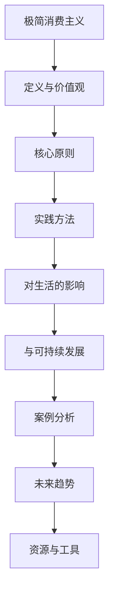

                 

# 《极简消费主义：质量导向的生活方式革命》

## 关键词
- 极简消费主义
- 质量导向
- 生活方式革命
- 消费模式
- 可持续发展
- 个人成长
- 社会责任

## 摘要
《极简消费主义：质量导向的生活方式革命》探讨了极简消费主义的概念、核心原则、实践方法以及对个人和社会的影响。本文以技术视角剖析极简消费主义的理念，通过数学模型和质量优先原则，解释其在日常生活中的应用。文章还分析了极简消费主义对财务健康、心理健康、社会责任和环境保护的贡献，并探讨了其与可持续发展的关系。此外，通过案例分析展示了极简消费主义的实际效果，并对未来趋势进行了展望。最后，文章提供了资源与工具，帮助读者实践极简消费主义。

## 引言

### 1. 极简消费主义的背景
在当今快速消费、物质主义泛滥的社会，极简消费主义作为一种新兴的生活方式逐渐受到关注。极简消费主义倡导人们减少物质负担，专注于质量而非数量，追求简单、实用、有意义的生活。这一理念源于对现代消费文化的反思，是对过度消费、资源浪费和环境破坏的回应。

### 2. 质量导向的生活方式革命
极简消费主义的核心是质量导向，它提倡以质量而非价格作为购买决策的主要依据。这种转变不仅影响个人的生活方式，还可能引发一场生活方式的革命。质量导向的生活强调物品的耐用性、实用性和美学价值，而非仅仅追求时尚和新鲜感。

## 目录大纲

### 第1章：极简消费主义的定义与价值观
- 1.1 什么是极简消费主义
- 1.2 极简消费主义的核心理念
- 1.3 极简消费主义与传统消费主义对比
- 1.4 极简消费主义的价值所在

### 第2章：极简消费主义的核心原则
- 2.1 精简物品
- 2.2 质量优先
- 2.3 功能至上
- 2.4 去除不必要的物质负担

### 第3章：极简消费主义的实践方法
- 3.1 清理与整理
- 3.2 评估物品的价值
- 3.3 购买决策
- 3.4 购物习惯的培养

### 第4章：极简消费主义对生活的影响
- 4.1 财务健康
- 4.2 心理健康
- 4.3 社会责任
- 4.4 环境保护

### 第5章：极简消费主义与可持续发展
- 5.1 消费模式与资源消耗
- 5.2 循环经济
- 5.3 可持续消费倡议
- 5.4 企业社会责任与极简消费主义

### 第6章：极简消费主义的案例分析
- 6.1 个人案例：从物质主义者到极简主义者
- 6.2 企业案例：极简消费主义与品牌塑造
- 6.3 社区案例：极简生活社区的力量

### 第7章：极简消费主义的未来趋势
- 7.1 社会趋势
- 7.2 企业响应
- 7.3 极简消费主义的文化影响

### 附录：极简消费主义的资源与工具
- 1. 极简消费主义相关的书籍与文章
- 2. 极简消费主义相关的应用与工具
- 3. 极简消费主义社区与网络资源

### 核心概念与联系图

### 数学模型讲解
极简消费主义的一个重要原则是质量优先。质量的数学模型可以表示为：

$$
Q = \frac{V}{C}
$$

其中，$Q$ 表示质量（Quality），$V$ 表示物品的价值（Value），$C$ 表示成本（Cost）。这个公式表明，在成本相同的情况下，物品的价值越高，其质量就越高。

### 项目实战案例
以一次购物决策为例，假设物品A的价值为1000元，成本为500元，那么其质量为：

$$
Q_A = \frac{1000}{500} = 2
$$

如果物品B的价值为800元，成本为400元，则其质量为：

$$
Q_B = \frac{800}{400} = 2
$$

根据质量优先原则，两者质量相同，因此可以根据其他因素（如个人需求、喜好等）进行选择。如果物品B更加符合个人需求，则选择物品B。

### 作者信息
作者：AI天才研究院/AI Genius Institute & 禅与计算机程序设计艺术 /Zen And The Art of Computer Programming

在接下来的章节中，我们将深入探讨极简消费主义的各个方面，从定义和价值观到实践方法，再到其对个人和社会的影响，为读者提供一场关于生活方式的革命性思考。让我们一步一步地分析推理，揭开极简消费主义的神秘面纱。

