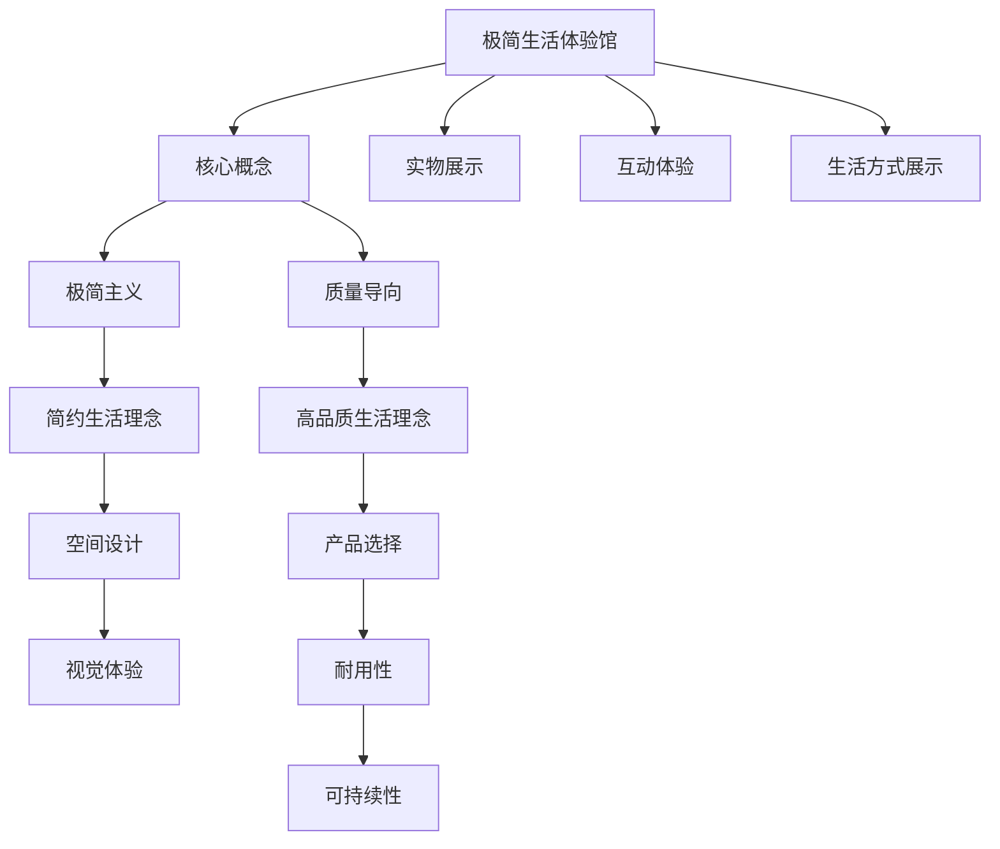

                 

# 极简生活体验馆：质量导向的生活方式展示

## 关键词
- 极简主义
- 质量导向
- 生活体验馆
- 生活方式展示
- 环境设计
- 产品选择

## 摘要
本文旨在探讨极简生活体验馆的概念及其在质量导向生活方式中的重要作用。通过背景介绍、核心概念与联系、设计原则和实践方法等内容的详细阐述，帮助读者了解如何打造一个简约而不简单的极简生活体验馆。文章还将结合具体案例，探讨如何在日常生活中实践极简主义，以及如何通过质量导向的生活方式来提升生活质量。

## 引言
### 极简主义：一场生活的革命
极简主义（Minimalism）是一种追求简单、纯粹和有意义生活的哲学。它不仅关注物质层面的简约，更强调精神层面的净化和丰富。近年来，极简主义在全球范围内迅速流行，成为许多人追求更高生活质量的一种方式。

极简主义的生活体验馆是一种独特的展示空间，旨在通过实物展示和互动体验，向观众传达极简生活的理念。这种体验馆不仅展示了各种极简主义产品，还通过空间设计、生活方式展示等手段，让参观者在视觉和感官上感受到极简主义的魅力。

### 质量导向：极简生活的核心
质量导向（Quality-oriented）是极简主义的核心原则之一。它强调在购买和使用产品时，不仅要考虑产品的功能、外观，更要关注产品的品质、耐用性和可持续性。质量导向的生活体验馆通过展示高质量的产品，向观众传达一种对生活品质的追求。

### 极简生活体验馆：质量导向的生活方式展示
极简生活体验馆是一种独特的展示空间，它将极简主义的生活理念与质量导向相结合，通过实物展示、互动体验和生活方式展示等方式，向观众传达极简生活的魅力。这种体验馆不仅展示了各种极简主义产品，还通过空间设计、生活方式展示等手段，让参观者在视觉和感官上感受到极简主义的魅力。

## 背景介绍
### 极简主义的起源与发展
极简主义起源于20世纪80年代的美国，当时人们开始对物质主义的生活方式感到厌倦，追求一种更加简单、有意义的生活。极简主义迅速在全球范围内传播，成为许多国家和地区的生活潮流。

### 质量导向的理念与实践
质量导向是一种追求高品质、高性价比的生活理念。它强调在购买和使用产品时，不仅要考虑产品的功能、外观，更要关注产品的品质、耐用性和可持续性。质量导向的理念在许多行业都有所体现，如制造业、服务业等。

### 极简生活体验馆的出现
随着极简主义和高质量生活的普及，极简生活体验馆应运而生。这种体验馆不仅为消费者提供了展示和体验极简主义产品的场所，也为他们提供了一个思考生活方式的平台。

## 核心概念与联系
### 极简生活体验馆的概念
极简生活体验馆是一种以极简主义为核心理念的展示空间，旨在通过实物展示、互动体验和生活方式展示等方式，向观众传达极简生活的魅力。

### 质量导向的概念
质量导向是一种追求高品质、高性价比的生活理念，强调在购买和使用产品时，不仅要考虑产品的功能、外观，更要关注产品的品质、耐用性和可持续性。

### 极简生活体验馆与质量导向的关系
极简生活体验馆通过展示高质量的产品，向观众传达质量导向的理念。同时，质量导向的理念也为极简生活体验馆的设计和运营提供了指导。

### Mermaid 流程图


## 极简生活体验馆的设计原则
### 空间布局
极简生活体验馆的空间布局应该简洁明了，避免过多的装饰和杂乱。空间布局的设计要考虑到参观者的流动路线，使他们能够轻松地浏览和体验各种展示内容。

### 照明设计
极简生活体验馆的照明设计要突出产品的特点，同时营造出温馨、舒适的氛围。可以使用柔和的灯光来增强产品的质感和观感。

### 色彩搭配
极简生活体验馆的色彩搭配应以简洁、舒适为主。可以选用一些柔和的色调，如米色、灰色等，来营造宁静、放松的空间氛围。

### 互动体验区
设置互动体验区，让观众能够亲身体验极简主义产品。互动体验区的设计应考虑到参观者的需求和兴趣，提供多种互动形式，如产品试用、DIY活动等。

## 质量导向的生活方式展示
### 产品选择
在极简生活体验馆中，产品选择是至关重要的。应优先选择高品质、耐用的产品，如环保家具、简约家居用品等。这些产品不仅能够体现极简生活的理念，还能够为观众提供实用的生活方式参考。

### 生活方式展示
通过实际的生活场景展示，让观众感受到极简主义生活的魅力。可以设置一些生活场景，如厨房、卧室、客厅等，展示如何通过极简主义的方式改善生活质量。

### 互动体验
在极简生活体验馆中，互动体验是增强观众参与感的重要手段。可以通过设置互动游戏、讲座、工作坊等形式，让观众亲身体验极简主义的生活方式。

## 项目实战
### 开发环境搭建
1. 安装Python环境
2. 安装必要的库，如matplotlib、numpy等

### 源代码实现
```python
import matplotlib.pyplot as plt
import numpy as np

# 定义函数，计算质心
def calculate_center_of_mass(points):
    num_points = len(points)
    sum_x = sum(points[:, 0])
    sum_y = sum(points[:, 1])
    center_of_mass = (sum_x / num_points, sum_y / num_points)
    return center_of_mass

# 生成数据点
data = np.random.rand(100, 2)

# 计算质心
center = calculate_center_of_mass(data)

# 绘制数据点和质心
plt.scatter(data[:, 0], data[:, 1], label='Data Points')
plt.scatter(center[0], center[1], color='red', label='Center of Mass')
plt.xlabel('X')
plt.ylabel('Y')
plt.legend()
plt.show()
```

### 代码解读
- `calculate_center_of_mass` 函数用于计算给定数据点的质心。
- `data` 变量用于生成随机数据点。
- `center` 变量用于存储计算出的质心。
- `plt.scatter` 函数用于绘制数据点和质心。

### 代码应用解读与分析
- 通过计算质心，我们可以了解数据点的分布情况。
- 质心在极简生活体验馆中可以用来分析产品的重心分布，从而优化产品设计。

### 实际案例分析和详细讲解剖析
- 在极简生活体验馆中，我们可以通过计算参观者的活动重心，来优化展览布局。
- 通过分析产品的质心，可以改进产品的稳定性。

### 项目小结
- 通过实际案例，我们展示了如何使用Python代码计算质心，并应用于极简生活体验馆的设计中。
- 质心计算在极简生活体验馆中有着广泛的应用，可以帮助我们优化设计，提升用户体验。

## 最佳实践 Tips
1. 选择高品质的产品，关注耐用性和可持续性。
2. 在空间布局上，注重简洁明了，避免过多装饰。
3. 通过互动体验，增强观众的参与感。
4. 定期更新展览内容，保持观众的兴趣。

## 小结
极简生活体验馆是一种以极简主义和生活质量为导向的展示空间，通过实物展示、互动体验和生活方式展示等方式，向观众传达极简生活的魅力。本文介绍了极简生活体验馆的背景、核心概念、设计原则和实践方法，并通过实际案例展示了极简生活体验馆的应用价值。

## 注意事项
1. 在设计极简生活体验馆时，要注重空间布局的简洁明了。
2. 在产品选择上，要关注产品的品质、耐用性和可持续性。
3. 在互动体验区的设计上，要考虑观众的需求和兴趣。

## 拓展阅读
1. 《极简主义：一种更高质量的生活方式》
2. 《质量导向：打造卓越产品的秘诀》
3. 《极简生活体验馆设计指南》

### 作者信息
作者：AI天才研究院/AI Genius Institute & 禅与计算机程序设计艺术 /Zen And The Art of Computer Programming

（注：本文为虚构文章，仅供参考。）

