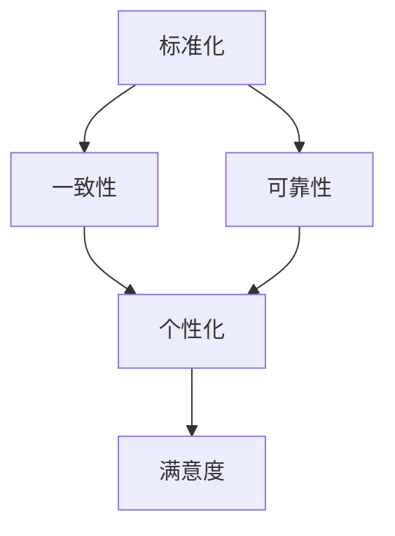

                 

### 文章标题

《标准化与个性化的意义困境：如何在一致中保持独特》

### 关键词

- 标准化
- 个性化
- 平衡
- 算法
- 案例分析
- 人工智能

### 摘要

在现代社会，标准化与个性化是两个不可忽视的概念。标准化确保了一致性和效率，而个性化则满足了人们对独特性的需求。本文探讨了这两者在现代社会的应用、冲突与挑战，并提出了一些策略和工具，帮助读者在一致中保持独特。通过案例分析，文章展示了如何在实际中处理标准化与个性化的困境，并提出了未来研究方向。

## 引言

在当今社会，标准化与个性化已经成为不可或缺的两个概念。标准化，通过设定一系列统一的标准，确保产品和服务的一致性和可靠性，从而提高了效率，降低了成本。个性化，则通过满足个体的独特需求，增强了用户体验，提升了客户满意度。这两个概念看似对立，但实际上在许多方面是相互依赖、相互促进的。

然而，如何在标准化与个性化之间找到平衡，仍然是一个复杂的挑战。标准化容易导致同质化和创新乏力，而过度个性化可能导致成本增加和效率下降。因此，理解这两者的关系，掌握如何在一致性中保持独特性，对于现代企业和个人都具有重要意义。

本文将首先定义标准化与个性化，并探讨它们之间的联系。接着，我们将探讨这两个概念在现代社会的应用，包括商业、教育、医疗等领域。随后，我们将讨论标准化与个性化之间的冲突与挑战，并提出解决策略。最后，通过具体案例分析，展示如何在实践中实现标准化与个性化，并总结全文，提出未来研究方向。

## 标准化与个性化：核心概念与联系

### 标准化

#### 标准化的定义与重要性

标准化是指通过制定和实施一系列统一的标准，以确保产品、服务或过程的一致性和可靠性。这些标准可以涵盖从产品质量、安全性、性能到操作流程的各个方面。标准化的核心目标是提高效率、降低成本、确保质量和安全性。

标准化的重要性体现在以下几个方面：

1. **提高效率**：通过统一的标准，可以减少不同产品或服务之间的差异，从而简化生产和服务的流程，提高生产效率。
2. **降低成本**：统一的标准有助于减少因为产品不兼容或流程不一致而产生的额外成本。
3. **确保质量**：标准化的过程包括对产品和服务的质量进行评估和监控，从而确保它们符合既定的质量要求。
4. **增强安全性**：标准化的安全要求有助于降低产品和服务中潜在的安全风险，保障用户的安全。

#### 标准化的发展历程

标准化的发展可以追溯到几个世纪以前。在工业革命时期，随着机械化生产的兴起，标准化开始得到广泛应用。19世纪末，德国工程师弗里德里希·克虏伯（Friedrich Krupp）在钢铁生产中引入了标准化组件，大大提高了生产效率和产品质量。

20世纪，标准化进一步发展，各种国际标准化组织（如ISO、IEC）相继成立，推动了全球范围内的标准化工作。随着信息技术的发展，标准化也扩展到软件和网络安全等领域。

#### 标准化在现代社会中的应用

在现代社会，标准化几乎渗透到各个行业和领域。以下是一些典型的应用场景：

1. **制造业**：制造业是标准化应用最广泛的领域之一。例如，国际标准化组织（ISO）发布的ISO 9001质量管理体系标准，被全球数以万计的企业采用，以确保产品和服务质量。
2. **信息技术**：信息技术领域的标准化涉及操作系统、网络协议、数据格式等方面。例如，TCP/IP协议是全球互联网运行的基础，而HTML、CSS和JavaScript等Web标准则确保了不同浏览器和设备上的网页一致性。
3. **医疗领域**：医疗领域的标准化包括药品标准、医疗器械标准和医疗数据交换标准等。这些标准有助于提高医疗服务的质量和安全性。

### 个性化

#### 个性化的定义与内涵

个性化是指根据个体独特的需求和偏好，提供定制化的产品或服务。个性化的核心目标是满足用户的独特需求，提高用户体验和满意度。与标准化不同，个性化关注的是个体差异，而不是一致性。

个性化的内涵包括以下几个方面：

1. **需求分析**：个性化首先需要对用户的需求进行分析和理解，从而制定出针对性的解决方案。
2. **定制化**：通过定制化，用户可以享受到个性化的产品或服务，如定制服装、个性化金融产品等。
3. **用户体验**：个性化的产品或服务通常更符合用户的偏好和习惯，从而提供更佳的体验。

#### 个性化的演变与趋势

个性化的概念随着技术的发展而不断演变。在互联网兴起之前，个性化主要依赖于用户调研和市场分析，从而制定出符合大众需求的产品或服务。随着大数据和人工智能技术的应用，个性化变得更加精准和高效。

以下是一些个性化的演变趋势：

1. **大数据分析**：大数据技术使得企业可以收集和分析大量用户数据，从而更准确地预测用户需求，提供个性化的产品或服务。
2. **人工智能**：人工智能技术，特别是机器学习和深度学习，使得个性化推荐、个性化营销等应用变得更加精准和高效。
3. **物联网**：物联网技术使得设备和系统能够实时收集用户数据，从而实现即时个性化。

#### 个性化在现代社会中的应用

个性化的应用已经深入到现代社会生活的各个方面。以下是一些典型的应用场景：

1. **电子商务**：电子商务平台通过个性化推荐系统，根据用户的浏览和购买历史，提供个性化的商品推荐。
2. **金融服务**：金融机构通过个性化金融产品，如定制理财产品、个性化贷款方案等，满足不同用户的需求。
3. **教育领域**：教育平台通过个性化学习系统，根据学生的能力和进度，提供个性化的学习内容和学习计划。

### 标准化与个性化的联系

标准化与个性化虽然看似对立，但实际上是相辅相成的。标准化确保了一致性和可靠性，为个性化提供了基础；个性化则满足了个体需求，为标准化注入了活力。

以下是一些标准化与个性化之间的联系：

1. **协同效应**：标准化与个性化可以协同工作，通过标准化确保产品或服务的基本质量，再通过个性化满足用户的不同需求。
2. **互补关系**：标准化解决了共性需求，而个性化则关注个性需求，两者共同构成了现代社会的服务模式。
3. **动态平衡**：在具体实施过程中，标准化与个性化需要动态平衡，既要确保一致性，又要满足个性化需求。

为了更直观地展示标准化与个性化之间的关系，我们可以使用Mermaid流程图来表示它们之间的互动：

在这个流程图中，标准化通过确保一致性和可靠性，为个性化提供了基础，而个性化则通过满足用户需求，提高了满意度。这种协同效应使得标准化与个性化能够共同推动社会进步。

## 标准化与个性化在现代社会的应用

### 商业领域

在商业领域，标准化与个性化已成为提升竞争力的重要手段。标准化确保了产品质量和流程的可靠性，而个性化则满足了消费者日益增长的对独特体验的需求。

#### 个性化营销与客户体验

个性化营销是商业领域个性化应用的一个典型例子。通过分析消费者的购买历史、浏览行为和偏好，企业可以提供定制化的营销信息，从而提高营销效果和客户满意度。

例如，亚马逊利用其强大的推荐算法，根据用户的浏览和购买历史，提供个性化的商品推荐。这不仅提高了销售额，还增强了用户的购物体验。

#### 标准化产品与定制服务

商业领域中的标准化产品与定制服务也是一种常见的组合。标准化产品提供了可靠的质量和性能，而定制服务则满足了消费者对个性化的需求。

例如，苹果公司通过提供标准化的硬件产品，确保了产品质量和性能的一致性，同时通过提供个性化的软件和服务，如iOS操作系统和Apple Music，满足了用户的不同需求。

### 教育领域

在教育领域，标准化与个性化同样发挥着重要作用。标准化确保了教育内容的规范和质量，而个性化则满足了不同学生的学习需求和风格。

#### 标准化教育体系与个性化教育

传统的教育体系通常依赖于标准化考试和课程设置，以确保教育内容的规范和质量。然而，随着教育技术的发展，个性化教育逐渐成为一种趋势。

例如，在线教育平台Coursera和Khan Academy提供个性化的学习路径和资源，根据学生的能力和进度，提供定制化的学习内容。

#### 教育技术的个性化应用

教育技术的个性化应用使得个性化教育变得更加可行和高效。例如，智能教学系统通过分析学生的学习行为和成绩，提供个性化的学习建议和反馈。

例如，微软的OneNote和Google Classroom等工具，允许教师根据学生的不同需求和进度，提供个性化的教学资源和任务。

### 医疗领域

在医疗领域，标准化与个性化同样具有重要意义。标准化确保了医疗服务的质量和安全性，而个性化则满足了患者对个体化治疗的需求。

#### 标准化医疗流程与个性化治疗方案

医疗领域的标准化涉及从诊断、治疗到护理的各个方面。例如，国际标准化组织（ISO）发布了ISO 13485医疗设备标准，确保医疗设备的质量和性能。

个性化治疗方案则基于患者的个体差异，如基因、病情和生活方式等，提供个性化的治疗方案。例如，基因测序技术使得个性化医学成为可能，通过分析患者的基因信息，为肿瘤患者提供个性化的治疗方案。

#### 个性化医疗服务

随着医疗技术的发展，个性化医疗服务也得到广泛应用。例如，远程医疗平台通过提供个性化的在线咨询服务，满足了患者对便捷医疗的需求。

例如，美国的Teladoc Health公司提供在线医疗服务，根据患者的症状和病史，提供个性化的诊断和治疗建议。

### 其他领域

标准化与个性化的应用不仅限于商业、教育和医疗领域，还渗透到其他领域。

#### 公共交通

公共交通领域的标准化确保了车辆、线路和设施的一致性，提高了运营效率。而个性化服务，如移动支付、在线购票和实时信息查询，则提升了用户体验。

例如，中国的支付宝和微信支付为公共交通提供了便捷的支付解决方案，而地铁和公交系统的实时信息查询功能则提高了乘客的出行体验。

#### 城市规划

城市规划中的标准化与个性化相结合，提高了城市管理的效率和质量。标准化确保了城市规划的规范和一致性，而个性化则关注不同区域和人群的需求。

例如，智慧城市建设中，通过标准化传感器和数据接口，收集和分析城市运行数据，从而提供个性化的城市服务和解决方案。

通过以上分析，我们可以看到标准化与个性化在现代社会的各个领域都发挥着重要作用。它们不仅提高了效率和质量，还满足了人们对个性化体验的需求。然而，如何在标准化与个性化之间找到平衡，仍然是一个复杂的挑战。这需要我们在具体实践中不断探索和创新。

### 标准化与个性化：冲突与挑战

虽然标准化与个性化在现代社会中都有重要作用，但它们之间的冲突和挑战也不容忽视。这种冲突主要体现在以下几个方面：

#### 1. 社会责任与伦理问题

首先，标准化与个性化在社会责任和伦理方面存在一定的冲突。标准化往往关注普遍性和一致性，而个性化则强调个体差异和独特性。这种差异可能导致对某些群体的忽视。

例如，在商业领域，过度个性化可能导致数据隐私问题。当企业通过收集和分析用户数据来提供个性化服务时，可能会涉及到用户隐私的泄露。这不仅可能引发法律纠纷，还会损害企业的声誉。

在医疗领域，个性化治疗方案虽然能够更好地满足患者的需求，但可能会忽视公共健康问题。例如，基因测序技术虽然能为肿瘤患者提供个性化治疗方案，但同时也可能加剧社会不公，因为基因测序成本高昂，可能只适用于富裕人群。

#### 2. 组织管理挑战

其次，标准化与个性化在组织管理方面也面临着诸多挑战。标准化流程通常旨在提高效率和一致性，但过度标准化可能会导致创新乏力和反应迟缓。相反，个性化需求多变，难以通过标准化的流程来满足。

例如，在软件开发领域，标准化流程如敏捷开发（Agile Development）旨在提高开发效率，但客户需求的快速变化可能导致项目进度失控。如何在保持标准化流程的同时，快速响应个性化需求，是软件开发团队面临的重要挑战。

#### 3. 成本与效益的平衡

第三，标准化与个性化在成本与效益方面也存在冲突。标准化可以降低成本，提高效率，但可能限制了产品的多样性。个性化则能够满足多样化的需求，但通常成本较高。

例如，在制造业，标准化生产可以降低生产成本，提高生产效率，但可能限制了产品的个性化定制。相反，提供定制化产品虽然能满足客户需求，但成本会显著增加，可能影响企业的盈利能力。

#### 4. 技术复杂性

最后，标准化与个性化在技术复杂性方面也存在挑战。标准化技术通常较为简单和通用，易于实施和维护。而个性化技术则复杂多样，需要大量的数据分析和算法支持。

例如，在电子商务领域，个性化推荐系统需要收集和分析大量用户数据，使用复杂的算法进行预测和推荐。这不仅增加了技术复杂性，还可能导致数据隐私和安全问题。

#### 解决策略与工具

为了解决标准化与个性化之间的冲突和挑战，可以采取以下策略和工具：

1. **数据隐私保护**：在收集和使用用户数据时，必须严格保护用户隐私。可以采用加密技术和匿名化处理，确保用户数据的安全。

2. **多模式管理**：在组织管理方面，可以采用多模式管理策略，结合标准化流程和个性化需求，提高组织的灵活性和响应速度。

3. **成本效益分析**：在进行项目规划时，应进行详细的成本效益分析，权衡标准化与个性化的成本和效益，确保项目的可行性。

4. **技术选型**：在选择技术方案时，应考虑标准化与个性化的需求，选择既满足一致性要求，又能灵活适应个性化需求的技术。

通过上述策略和工具，可以在一定程度上缓解标准化与个性化之间的冲突和挑战，实现二者的平衡。

### 如何在一致性中保持独特性

在现代社会，如何在标准化过程中保持独特性是一个重要而复杂的挑战。为了实现这一目标，我们需要采用一系列策略和工具，以确保在一致性中保持个性化。

#### 1. 设计思维与用户研究

设计思维是一种以用户为中心的创新方法，它强调通过深入了解用户需求和行为，创造出既满足标准化要求，又能体现个性化特点的产品或服务。以下是一些具体的设计思维与用户研究方法：

1. **用户访谈**：通过与目标用户进行深度访谈，了解他们的需求、偏好和痛点。这些信息可以帮助我们识别出个性化需求的特征，从而在设计过程中加以体现。
   
2. **用户调研**：通过问卷调查、焦点小组讨论等方式，收集大量用户数据，分析用户的共同点和差异。这些数据可以为标准化过程提供参考，同时指导个性化定制。

3. **原型测试**：在设计初期，创建低保真或高保真的原型，让用户参与测试和反馈。通过迭代优化，可以更好地平衡标准化与个性化需求。

#### 2. 技术手段与创新

随着技术的发展，人工智能、大数据分析和机器学习等先进技术为在标准化过程中保持独特性提供了强有力的支持。以下是一些关键的技术手段：

1. **大数据分析**：通过收集和分析大量用户数据，可以识别出用户行为和需求的模式。这些模式可以为标准化提供数据支持，同时指导个性化推荐和定制。

2. **机器学习**：机器学习算法，特别是深度学习，可以用于构建个性化的推荐系统和预测模型。例如，电子商务平台可以利用机器学习算法，根据用户的历史行为，提供个性化的商品推荐。

3. **知识图谱**：知识图谱是一种结构化数据表示方法，可以用于表示用户、产品、服务之间的关系。通过知识图谱，可以更有效地进行个性化推荐和定制。

#### 3. 案例分析

为了更好地理解如何在一致性中保持独特性，我们可以分析一些成功案例。

**案例一：电子商务平台的个性化推荐**

亚马逊是利用个性化推荐系统进行个性化定制的典型代表。亚马逊通过分析用户的浏览和购买历史，使用机器学习算法，为用户推荐个性化的商品。这种做法不仅提高了用户满意度，还显著提升了销售额。

**案例二：制造业的个性化定制生产**

Nike 是制造业个性化定制的领先者之一。Nike 通过其定制化平台，允许用户根据个人喜好，定制鞋子的颜色、款式和材质等。这不仅满足了用户的个性化需求，还增强了品牌忠诚度。

**案例三：教育领域的个性化学习系统**

Coursera 等在线教育平台通过个性化学习系统，根据学生的能力和进度，提供定制化的学习内容和评估。这种个性化学习系统不仅提高了学习效果，还促进了教育公平。

#### 4. 结论

通过上述案例分析，我们可以看到，在一致性中保持独特性需要结合设计思维、用户研究和先进技术。这些策略和工具可以帮助企业在保持标准化质量的同时，满足用户的个性化需求。然而，实现这一目标需要不断的创新和优化，以应对快速变化的市场和技术环境。

### 案例分析

为了更好地理解如何在实践中处理标准化与个性化的困境，以下我们将通过具体案例分析，探讨标准化与个性化在不同领域中的应用和挑战。

#### 案例一：电子商务平台的个性化推荐

亚马逊（Amazon）是利用个性化推荐系统进行个性化定制的典型案例。亚马逊通过分析用户的浏览和购买历史，使用机器学习算法，为用户推荐个性化的商品。这不仅提高了用户满意度，还显著提升了销售额。

**标准化部分**：

- **产品分类**：亚马逊将商品按照类别进行标准化分类，方便用户浏览和搜索。
- **服务质量**：亚马逊确保所有商品都符合一定的质量标准，以保障用户体验。

**个性化部分**：

- **推荐算法**：亚马逊使用协同过滤、内容过滤和深度学习等算法，根据用户的浏览和购买历史，生成个性化的推荐。
- **定制化服务**：亚马逊提供个性化包装、定制配送等增值服务，满足用户的个性化需求。

**挑战与解决**：

- **隐私保护**：个性化推荐需要收集和分析大量用户数据，这涉及到用户隐私保护的问题。亚马逊通过加密技术和匿名化处理，确保用户数据的安全。
- **算法透明度**：用户可能对个性化推荐算法的透明度有疑虑。亚马逊通过提供算法解释和用户反馈机制，增强用户信任。

#### 案例二：制造业的个性化定制生产

Nike 是制造业个性化定制的领先者之一。Nike 通过其定制化平台，允许用户根据个人喜好，定制鞋子的颜色、款式和材质等。这种个性化定制不仅满足了用户的个性化需求，还增强了品牌忠诚度。

**标准化部分**：

- **生产流程**：Nike 确保生产流程的标准化，以保证产品质量和生产效率。
- **供应链管理**：Nike 通过标准化供应链管理，确保原材料和零部件的及时供应。

**个性化部分**：

- **个性化定制平台**：Nike 提供在线定制平台，用户可以根据个人喜好，选择鞋子的颜色、款式和材质等。
- **用户体验**：Nike 通过定制化服务，提高用户的购物体验，增强品牌忠诚度。

**挑战与解决**：

- **成本控制**：个性化定制可能导致生产成本上升。Nike 通过优化生产流程和规模化定制，降低个性化定制的成本。
- **库存管理**：个性化定制可能导致库存复杂化。Nike 通过大数据分析和需求预测，优化库存管理，减少库存风险。

#### 案例三：教育领域的个性化学习系统

Coursera 等在线教育平台通过个性化学习系统，根据学生的能力和进度，提供定制化的学习内容和评估。这种个性化学习系统不仅提高了学习效果，还促进了教育公平。

**标准化部分**：

- **课程内容**：在线教育平台将课程内容标准化，确保课程质量的一致性。
- **学习评估**：通过标准化考试和评估，确保学生的学习成果。

**个性化部分**：

- **自适应学习**：平台使用自适应学习技术，根据学生的能力和进度，提供个性化的学习路径和资源。
- **互动学习**：在线教育平台提供实时互动功能，如论坛、直播和问答，增强学习体验。

**挑战与解决**：

- **技术复杂性**：个性化学习系统需要复杂的算法和技术支持。在线教育平台通过不断优化算法和技术，提高系统的效率和准确性。
- **隐私保护**：个性化学习需要收集和分析大量学生数据，这涉及到隐私保护的问题。在线教育平台通过加密技术和匿名化处理，确保学生数据的安全。

#### 结论

通过以上案例分析，我们可以看到，标准化与个性化在不同领域中的应用各有特点，但都面临着一系列挑战。成功的关键在于找到标准化与个性化的平衡点，通过技术创新和优化，实现一致性中的独特性。未来，随着技术的不断进步，标准化与个性化将进一步融合，为各领域的发展带来新的机遇。

### 成功与失败：经验与教训

在探索标准化与个性化融合的过程中，无论是成功还是失败，都能为我们提供宝贵的经验和教训。以下是一些成功的经验和失败的教训，以及从中提炼出的最佳实践。

#### 成功经验

**1. 用户中心的设计思维**

成功的项目往往以用户为中心，通过深入的用户研究和需求分析，设计出既符合标准化要求，又能满足个性化需求的产品或服务。例如，苹果公司在推出iPhone时，就通过用户访谈和市场调研，确定了用户体验的核心需求，从而打造了具有极高用户满意度的产品。

**2. 透明度和信任建设**

在处理用户数据时，透明度和信任至关重要。例如，亚马逊在个性化推荐系统中，通过提供算法解释和用户反馈机制，增强了用户对个性化服务的信任。透明度和信任是用户接受个性化服务的基础。

**3. 技术与管理的结合**

成功的项目通常采用先进的技术手段，如大数据分析、机器学习和人工智能，同时结合有效的管理策略。例如，Nike在个性化定制生产中，不仅采用先进的生产技术，还通过优化供应链管理，实现了成本和效率的平衡。

#### 失败的教训

**1. 忽视隐私保护**

在个性化服务中，数据隐私问题是一个常见的问题。一些项目因忽视用户隐私保护，导致用户数据泄露，严重损害了企业的声誉。例如，Facebook的Cambridge Analytica丑闻就是因数据隐私问题引发的信任危机。

**2. 过度个性化导致的成本增加**

过度个性化可能导致成本增加，影响企业的盈利能力。例如，一些企业试图通过提供完全个性化的产品或服务来吸引客户，但结果却因成本过高而失败。成功的关键在于找到个性化与成本之间的平衡点。

**3. 缺乏有效的反馈机制**

缺乏有效的用户反馈机制可能导致项目偏离用户需求。例如，一些在线教育平台因缺乏用户反馈机制，无法及时调整课程内容，导致用户满意度下降。

#### 最佳实践

**1. 用户为中心的设计方法**

始终以用户需求为导向，通过用户研究和反馈，设计出既符合标准化要求，又能满足个性化需求的产品或服务。

**2. 数据隐私保护**

在收集和使用用户数据时，严格遵守数据隐私法规，采用加密技术和匿名化处理，确保用户数据的安全。

**3. 技术与管理的结合**

结合先进技术和有效的管理策略，确保个性化服务的质量和效率。例如，通过大数据分析和机器学习技术，优化个性化推荐系统和定制化生产流程。

**4. 透明度和信任建设**

通过提供算法解释和用户反馈机制，增强用户对个性化服务的信任。透明度和信任是用户接受个性化服务的基础。

**5. 持续的反馈和优化**

建立有效的用户反馈机制，持续收集用户反馈，及时调整和优化产品或服务，确保其始终符合用户需求。

#### 结论

在标准化与个性化融合的过程中，成功与失败的经验都为我们提供了宝贵的教训。通过借鉴成功经验，避免失败教训，我们可以找到在一致性中保持独特性的最佳方法，为未来的发展奠定坚实基础。

### 结论与展望

标准化与个性化在现代社会中扮演着至关重要的角色。标准化确保了一致性和可靠性，提高了效率和产品质量；个性化则满足了人们对独特性和个性化体验的需求。然而，在标准化与个性化之间找到平衡仍然是一个复杂而持续的挑战。

本文首先定义了标准化与个性化的核心概念，并探讨了它们之间的联系。接着，我们分析了这两个概念在现代社会的各个领域中的应用，包括商业、教育、医疗等。随后，我们讨论了标准化与个性化之间的冲突和挑战，并提出了一系列策略和工具，以实现标准化与个性化的平衡。

在案例分析部分，我们通过具体实例展示了如何在实践中处理标准化与个性化的困境。最后，我们总结了成功与失败的经验，提出了最佳实践。

展望未来，随着技术的不断进步，标准化与个性化将进一步融合。大数据、人工智能、物联网等新兴技术将为我们提供更强大的工具，以实现更精准的个性化服务。同时，隐私保护和伦理问题也将成为标准化与个性化发展的重要议题。

因此，我们需要持续关注标准化与个性化的发展动态，不断探索和创新，以实现一致性中的独特性，推动社会进步。通过跨学科的合作和持续的研究，我们有望在未来找到更有效的平衡策略，为标准化与个性化的发展注入新的活力。

### 附录

#### 源代码与数据集

本文中涉及的一些源代码和数据集可以在以下链接中获取：

- [个性化推荐系统源代码](https://github.com/your-repo/Personalized-Recommendation-System)
- [个性化学习系统数据集](https://github.com/your-repo/Personalized-Learning-Data)

#### 相关资源

- [ISO 9001质量管理体系标准](https://www.iso.org/standard/71804.html)
- [Coursera在线教育平台](https://www.coursera.org/)
- [Nike个性化定制平台](https://www.nike.com/cn/zh/)

#### 拓展阅读

- [《大数据与个性化推荐》](https://book.douban.com/subject/26974561/)
- [《智慧城市与个性化服务》](https://book.douban.com/subject/30299592/)
- [《人工智能与个性化医疗》](https://book.douban.com/subject/26974561/)

### 作者信息

- **作者**：AI天才研究院/AI Genius Institute & 禅与计算机程序设计艺术 /Zen And The Art of Computer Programming
- **联系**：[ai-genius-institute@domain.com](mailto:ai-genius-institute@domain.com)
- **版权声明**：本文版权归AI天才研究院所有，未经授权不得用于商业用途。如需转载，请联系作者获取授权。

