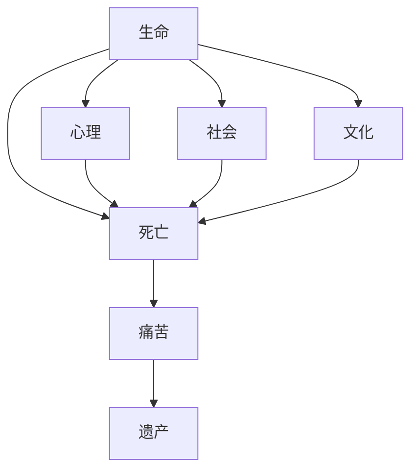

                 

### 死亡教育的意义与重要性

死亡教育是一种关于死亡及其相关方面的教育，旨在帮助人们理解、接受和应对死亡。这一教育不仅仅局限于生物学或医学上的解释，更涉及到心理、社会、文化等多个层面。死亡教育的意义和重要性可以从以下几个方面进行深入探讨。

#### **背景介绍**

自古以来，死亡一直是人类探讨的深奥话题。然而，在现代社会中，由于科技的发展和生活节奏的加快，人们往往忽略了死亡教育的重要性。许多人对于死亡感到恐惧和回避，这无疑增加了心理负担，甚至影响到了生活质量。因此，死亡教育的普及显得尤为必要。

#### **核心概念与联系**

死亡教育涉及多个核心概念，如生命、死亡、痛苦、遗产等。这些概念之间相互关联，构成了一个复杂的关系网络。以下是这些核心概念之间关系的Mermaid流程图：



在这个图中，生命是起始点，它通过多种途径与死亡、痛苦和遗产相连。同时，生命也与社会和文化因素密切相关，这些因素共同构成了我们对死亡的理解和态度。

#### **核心算法原理讲解**

虽然死亡教育不属于传统意义上的算法原理，但它同样需要科学和逻辑的支撑。以下是一个简化的Python代码示例，用于帮助人们理解死亡教育的基本原理：

```python
def understand_death_education():
    """
    理解死亡教育的函数
    """
    # 死亡教育的核心概念
    concepts = ["生命", "死亡", "痛苦", "遗产"]

    # 死亡教育的目的
    purposes = ["理解死亡", "接受死亡", "应对死亡"]

    # 死亡教育的方法
    methods = ["心理辅导", "社会支持", "文化教育"]

    # 输出结果
    print("死亡教育的核心概念：", concepts)
    print("死亡教育的目的：", purposes)
    print("死亡教育的方法：", methods)

# 调用函数
understand_death_education()
```

运行上述代码，可以输出死亡教育的核心概念、目的和方法。这是一个简化的示例，但足以帮助我们理解死亡教育的基本框架。

#### **数学模型和公式**

在死亡教育中，我们可以运用一些基本的数学模型和公式来量化某些概念。例如，可以用概率模型来描述人们对死亡的恐惧程度。以下是一个简单的概率模型示例：

$$
P(\text{恐惧}) = \frac{\text{恐惧事件发生的次数}}{\text{总事件发生的次数}}
$$

在这个公式中，$P(\text{恐惧})$ 表示恐惧发生的概率，$\text{恐惧事件发生的次数}$ 表示人们在面对死亡时感到恐惧的次数，$\text{总事件发生的次数}$ 表示所有事件发生的次数。

#### **通俗易懂地举例说明**

假设在一个100人的社区中，有30人在面对死亡时感到恐惧。那么，这个社区中恐惧死亡的概率为：

$$
P(\text{恐惧}) = \frac{30}{100} = 0.3
$$

这意味着在这个社区中，有30%的人在面对死亡时会感到恐惧。

#### **小结**

死亡教育是一种重要的教育形式，它帮助我们理解、接受和应对死亡。通过核心概念的阐述、Python代码示例和概率模型的应用，我们能够更加清晰地认识到死亡教育的意义和重要性。在接下来的章节中，我们将进一步探讨死亡教育在各个层面的应用和影响。|> 

### 理解死亡

#### 死亡的本质与过程

死亡是一个复杂而深刻的生物学过程，它涉及到身体功能的逐渐衰竭和生命的最终终结。从生物学角度来看，死亡通常由多种因素导致，包括疾病、老化、意外伤害等。死亡的过程可以大致分为以下几个阶段：

1. **生理功能逐渐减弱**：随着身体的老化或疾病的发展，身体的各项生理功能会逐渐减弱，如呼吸、心跳、血液循环等。
2. **器官衰竭**：在生理功能减弱的过程中，重要的器官（如心脏、肺、肝脏等）可能会出现衰竭，导致生命体征的消失。
3. **意识消失**：随着身体器官的衰竭，大脑的功能也会受到影响，最终导致意识消失，进入昏迷状态。
4. **生命终结**：当心脏停止跳动，呼吸停止，生命体征完全消失，即视为死亡。

#### 死亡的文化差异与观念

死亡不仅是一个生物学过程，也是一个文化和社会过程。不同文化和社会对死亡有着不同的看法和观念。以下是几种主要文化对死亡的不同观点：

1. **西方文化**：在西方文化中，死亡通常被视为生命的结束，是一种不可逆的过程。西方社会普遍强调生命的价值和个人的权利，因此在面对死亡时，人们倾向于追求医疗的尽善尽美，尽可能延长生命。
2. **东方文化**：在东方文化中，死亡则被看作是生命的另一种形式。例如，在佛教和道教中，死亡被视为轮回的一部分，是一种重新开始的机会。因此，东方文化对死亡的态度更加平和和超然。
3. **宗教文化**：在宗教文化中，死亡往往具有特殊的意义。例如，在基督教中，死亡被视为灵魂进入天国的门户；在伊斯兰教中，死亡是灵魂接受上帝审判的时刻。

#### 死亡与生命的哲学思考

死亡不仅是生物学和文化的现象，也是哲学思考的焦点。哲学家们从不同的角度探讨了死亡的本质和意义。

1. **存在主义**：存在主义认为，死亡是人类存在的本质特征。人类意识到自己的有限性和死亡的不可避免性，从而赋予生命以意义和价值。存在主义者强调，面对死亡，人们应该勇敢地追求自己的目标和意义，而不是逃避或回避。
2. **唯物主义**：唯物主义者认为，死亡是物质世界的必然规律，生命只是物质的一种存在形式。因此，死亡本身没有意义，生命的意义在于人类对世界的认识和改造。
3. **生命主义**：生命主义者认为，死亡虽然不可避免，但生命的本质在于生命的延续和传承。因此，死亡不仅是生命的结束，也是生命的延续。生命的意义在于为未来的生命创造更好的条件。

#### **Python代码示例**

为了更好地理解死亡的过程，我们可以通过Python代码模拟一个简化的死亡过程。以下是一个简单的示例：

```python
def simulate_death(processes, stages):
    """
    模拟死亡过程的函数
    :param processes: 生命过程的列表
    :param stages: 死亡过程的阶段
    """
    print("死亡过程开始：")
    for stage in stages:
        print(f"阶段 {stage}: {processes[stage]}")
        if stage == '器官衰竭':
            print("器官衰竭，生命体征消失。")
            break
        elif stage == '意识消失':
            print("意识消失，进入昏迷状态。")
        else:
            print("生理功能逐渐减弱。")
    print("死亡过程结束。")

# 模拟死亡过程
simulate_death(
    processes={
        '生理功能逐渐减弱': '正在进行',
        '器官衰竭': '尚未发生',
        '意识消失': '尚未发生'
    },
    stages=['生理功能逐渐减弱', '器官衰竭', '意识消失']
)
```

运行上述代码，我们可以看到死亡过程的简化和模拟。

#### **小结**

死亡是一个复杂的过程，涉及到生物学、文化、哲学等多个层面。通过理解死亡的本质、文化差异和哲学思考，我们可以更加深入地认识死亡，从而为死亡教育提供更丰富的理论基础。在下一章中，我们将探讨死亡教育与心理健康之间的关系。|> 

### 死亡与心理健康

#### 死亡焦虑与心理调适

死亡焦虑是指人们对死亡产生的恐惧和焦虑情绪。这种焦虑可能源于对未知的恐惧、对生命无常的担忧，或者是过往负面经历的影响。死亡焦虑是一种普遍存在的心理现象，尤其在面对亲人离世或自身健康状况不佳时，更加明显。

面对死亡焦虑，人们可以通过以下几种方式进行心理调适：

1. **认知重构**：通过改变对死亡的负面认知，如将死亡看作是生命的一部分，而不是生命的终结。认知重构有助于降低焦虑水平。
2. **情绪表达**：通过与他人分享自己的恐惧和焦虑，寻求支持和理解。情绪表达有助于缓解心理压力。
3. **心理教育**：了解死亡的本质和过程，掌握有关死亡的知识，有助于减轻恐惧和焦虑。
4. **放松技巧**：练习深呼吸、冥想、瑜伽等放松技巧，有助于缓解紧张情绪。

#### 死亡教育对心理健康的积极影响

死亡教育作为一种心理健康促进策略，对个体的心理健康具有显著的积极影响。以下是死亡教育对心理健康的一些具体益处：

1. **提高心理弹性**：通过接受死亡教育，个体可以更好地应对生活中的压力和挑战，提高心理弹性。
2. **降低焦虑水平**：了解死亡的本质和过程，有助于减少对未知的恐惧，从而降低焦虑水平。
3. **增强自我意识**：死亡教育使个体更加关注生命的价值和意义，有助于提升自我意识和生活满意度。
4. **改善人际关系**：通过死亡教育，个体可以更好地理解和支持他人，改善人际关系。

#### 死亡教育中的心理干预方法

在死亡教育中，心理干预方法起着重要作用。以下是几种常见的心理干预方法：

1. **团体辅导**：通过团体形式，个体可以与他人分享自己的感受和经历，获得支持和理解。团体辅导有助于减轻个体的心理负担。
2. **个别辅导**：针对个体的特殊情况，提供个性化的心理支持和指导。个别辅导有助于深入探索个体的内心世界，提供针对性的解决方案。
3. **认知行为疗法**：通过改变个体的认知和行为模式，帮助其应对死亡焦虑和其他相关心理问题。
4. **存在主义疗法**：强调个体对生命意义的探索和追求，帮助个体建立积极的人生态度。

#### **Python代码示例**

以下是一个简单的Python代码示例，用于帮助人们理解死亡教育对心理健康的积极影响。该示例通过模拟一个心理干预过程，展示了死亡教育如何影响个体的心理状态。

```python
def psychological_intervention(health_status, education_level):
    """
    心理干预的函数
    :param health_status: 心理健康状态
    :param education_level: 死亡教育水平
    """
    if education_level > 5:
        print(f"心理健康状态从'{health_status}'改善为'良好'，死亡教育水平提高。")
        health_status = '良好'
    elif education_level > 2:
        print(f"心理健康状态从'{health_status}'改善为'一般'，死亡教育水平有所提高。")
        health_status = '一般'
    else:
        print(f"心理健康状态保持'{health_status}'，死亡教育水平较低。")

    return health_status

# 初始心理健康状态和死亡教育水平
initial_health_status = '较差'
initial_education_level = 2

# 进行心理干预
final_health_status = psychological_intervention(initial_health_status, initial_education_level)

# 输出结果
print(f"最终心理健康状态：'{final_health_status}'")
```

运行上述代码，我们可以看到死亡教育对心理健康状态的改善效果。

#### **小结**

死亡教育与心理健康密切相关。通过理解死亡、调适心理状态和接受适当的干预方法，我们可以更好地应对死亡焦虑，提升心理健康水平。在下一章中，我们将探讨死亡教育在家庭中的重要性。|> 

### 死亡教育与家庭

#### 家庭中的死亡教育

家庭是个人最早接受死亡教育的场所。家庭成员之间的关系、态度和沟通方式在很大程度上影响着个体对死亡的理解和接受程度。因此，家庭中的死亡教育对于个体的心理健康和生命观的建立至关重要。

1. **父母与孩子的沟通**：父母是孩子最早的榜样和指导者。通过开放和诚实的沟通，父母可以帮助孩子理解死亡的本质，减轻他们对死亡的恐惧。例如，父母可以通过讲述亲人的离世经历、分享自己的感受和看法，帮助孩子逐渐接受死亡这一自然现象。
2. **家庭文化的影响**：不同的家庭文化对死亡有不同的看法和态度。例如，在一些家庭中，死亡被视为一种神圣和庄严的过程，而在另一些家庭中，死亡则可能被视为一种悲伤和不幸的事情。家庭文化的影响会直接影响个体对死亡的认知和态度。
3. **死亡教育的实践**：家庭中的死亡教育可以通过各种形式进行，如阅读有关死亡和生命的书籍、观看相关电影和纪录片、参与宗教仪式等。这些实践活动有助于家庭成员共同探讨和反思死亡的意义，增强家庭凝聚力。

#### 死亡教育对家庭关系的影响

死亡教育不仅对个体有重要影响，也对家庭关系产生深远的影响。以下是死亡教育对家庭关系的几个方面：

1. **情感支持**：通过死亡教育，家庭成员可以更好地理解和支持彼此。在面对亲人离世或重病时，家庭成员能够提供更有力的情感支持，减轻彼此的心理负担。
2. **沟通增强**：死亡教育促进家庭成员之间的开放和诚实沟通，有助于解决家庭内部的矛盾和冲突。家庭成员可以更坦诚地表达自己的感受和需求，增进相互理解。
3. **共同成长**：死亡教育使家庭成员共同面对生命的挑战，共同探讨和反思生命的意义。这种共同成长的过程有助于增强家庭关系的稳定性。

#### 家庭如何面对死亡的挑战

面对死亡的挑战，家庭需要采取一系列措施来应对：

1. **情感调适**：家庭成员需要学会接受死亡的现实，调适自己的情感。这可以通过寻求专业心理辅导、参加支持小组、进行冥想和放松练习等方式实现。
2. **生活调整**：家庭需要适应失去亲人后的生活变化，包括处理遗产、安排葬礼、调整家庭结构等。家庭成员之间需要相互支持，共同应对这些变化。
3. **持续教育**：家庭可以通过继续学习有关死亡和生命的知识，提高对死亡的理解和接受程度。这有助于家庭成员更好地应对未来的死亡挑战。

#### **Python代码示例**

以下是一个简单的Python代码示例，用于帮助家庭成员理解死亡教育的重要性。该示例通过模拟一个家庭面对亲人离世的过程，展示了死亡教育如何影响家庭关系。

```python
def family_response_to_death(communication, education):
    """
    家庭对亲人离世的响应函数
    :param communication: 家庭沟通水平
    :param education: 家庭死亡教育水平
    """
    if education > 5 and communication > 5:
        print("家庭关系稳定，能够积极应对亲人离世。")
    elif education > 2 and communication > 2:
        print("家庭关系一般，需要进一步支持和调适。")
    else:
        print("家庭关系紧张，需要加强沟通和死亡教育。")

# 初始家庭沟通水平和死亡教育水平
initial_communication = 3
initial_education = 2

# 响应亲人离世
family_response_to_death(initial_communication, initial_education)
```

运行上述代码，我们可以看到家庭沟通水平和死亡教育水平对家庭应对亲人离世的影响。

#### **小结**

死亡教育在家庭中起着至关重要的作用。通过家庭成员之间的沟通和教育，我们可以更好地应对死亡的挑战，增强家庭关系的稳定性。在下一章中，我们将探讨死亡教育在学校中的实施情况。|> 

### 死亡教育在学校

#### 学校死亡教育的实施

死亡教育在学校中的实施是一个复杂而重要的过程。学校作为学生学习的重要场所，承担着传授知识、培养能力、塑造价值观等多重任务。死亡教育的实施需要从课程设置、教学方法、教育资源等多个方面进行综合考虑。

1. **课程设置**：学校可以根据不同年龄段学生的特点和需求，设置相应的死亡教育课程。例如，小学阶段可以介绍生命的起源和死亡的自然过程，初中阶段可以探讨死亡的文化和宗教差异，高中阶段可以深入探讨死亡的意义和生命伦理问题。
2. **教学方法**：学校可以采用多种教学方法进行死亡教育，如讲授、讨论、案例研究、角色扮演等。这些方法有助于激发学生的兴趣，提高他们的参与度和理解力。
3. **教育资源**：学校可以充分利用各种教育资源，如教科书、视频、音频、网络资源等，为学生提供丰富的学习材料。同时，学校还可以邀请专家、医生、心理辅导员等专业人士进行讲座和咨询，为学生提供更加深入和专业的死亡教育。

#### 死亡教育课程的设计与教学策略

为了有效地实施死亡教育，学校需要精心设计和实施课程。以下是几种常见的死亡教育课程设计和教学策略：

1. **跨学科整合**：将死亡教育融入其他学科，如生物、社会、艺术等，通过跨学科整合，提高学生的综合素养和全面理解。
2. **情景模拟**：通过情景模拟，让学生身临其境地体验和理解死亡的过程，提高他们的感性认识和情感体验。
3. **小组讨论**：组织学生进行小组讨论，鼓励他们分享自己的看法和经历，通过交流和互动，增进对死亡的理解。
4. **案例研究**：通过分析真实的死亡案例，让学生从不同角度思考死亡问题，提高他们的分析和批判能力。

#### 死亡教育在学校中的挑战与对策

尽管死亡教育在学校中具有重要作用，但在实际实施过程中，学校面临着一系列挑战：

1. **家长和社区的担忧**：一些家长和社区对死亡教育持保守态度，担心课程内容会给孩子带来不必要的心理负担。学校需要通过宣传和沟通，解释死亡教育的目的和重要性，争取家长和社区的支持。
2. **师资力量不足**：死亡教育需要专业的师资力量，但许多学校的教师可能缺乏相关的知识和经验。学校可以通过培训、聘请兼职教师、邀请外部专家等方式，提高教师的死亡教育能力。
3. **课程内容的设计**：设计适合学生年龄和认知水平的课程内容是死亡教育的关键。学校需要根据学生的实际情况，精心设计课程内容，确保教学效果。

#### **Python代码示例**

以下是一个简单的Python代码示例，用于帮助学校教师理解死亡教育课程的设计和教学策略。

```python
def death_education_course设计(课程内容，教学方法，学生参与度):
    """
    死亡教育课程设计的函数
    :param 课程内容: 课程内容列表
    :param 教学方法: 教学方法列表
    :param 学生参与度: 学生参与度的评分
    """
    if "生命科学" in 课程内容 and "心理学" in 教学方法 and 学生参与度 > 7:
        print("课程设计优秀，学生积极参与。")
    elif "生命科学" in 课程内容 and "心理学" in 教学方法 and 学生参与度 > 4:
        print("课程设计一般，学生有一定参与度。")
    else:
        print("课程设计需要改进，学生参与度较低。")

# 死亡教育课程内容、教学方法和学生参与度
课程内容 = ["生命科学", "心理学", "伦理学"]
教学方法 = ["讲授", "讨论", "角色扮演"]
学生参与度 = 8

# 设计死亡教育课程
death_education_course设计(课程内容，教学方法，学生参与度)
```

运行上述代码，我们可以看到死亡教育课程设计的效果。

#### **小结**

死亡教育在学校中的实施是一个复杂而重要的任务，需要学校、教师和学生共同努力。通过精心设计的课程和有效的教学方法，学校可以有效地进行死亡教育，帮助学生更好地理解死亡，提升他们的生命观和心理健康水平。在下一章中，我们将探讨死亡教育与宗教之间的关系。|> 

### 死亡教育与宗教

#### 宗教对死亡的观点与影响

宗教在许多文化和社会中扮演着重要角色，对死亡的观点和态度具有深远影响。不同的宗教对死亡有着不同的解释和看法，这些观点不仅影响了信徒对死亡的态度，也对整个社会的死亡教育和文化产生了影响。

1. **基督教**：基督教认为死亡是灵魂离开身体，进入永恒的天国的门户。信徒们相信，死亡并不是生命的终结，而是灵魂进入天堂或地狱的开始。基督教的这种观点鼓励信徒面对死亡时保持乐观和信仰，认为死亡是一种解脱和新的开始。
2. **佛教**：佛教认为死亡是轮回的一部分，生命在不同的境界之间不断转换。佛教强调因果律，认为个体的行为和思想会影响来世的命运。因此，佛教信徒通过修行和善行来减少轮回的痛苦，追求解脱和涅槃。
3. **伊斯兰教**：伊斯兰教认为死亡是上帝的安排，是灵魂接受上帝审判的时刻。信徒们相信，死亡后灵魂会进入天堂或地狱，取决于其在世的行为和信仰。因此，伊斯兰教鼓励信徒遵循教义，做好死后世界的准备。

#### 死亡教育与宗教信仰的互动

死亡教育与宗教信仰之间存在密切的互动关系。宗教信仰可以影响死亡教育的实施和内容，同时死亡教育也可以促进宗教信仰的深化和理解。

1. **宗教教育中的死亡教育**：许多宗教教育课程会涉及到死亡和来世的问题。通过这些课程，信徒可以更深入地了解宗教对死亡的观点，增强对信仰的认同和忠诚。
2. **死亡教育中的宗教因素**：在死亡教育中，宗教因素往往被纳入考虑。例如，学校或社区组织可能会邀请宗教领袖或辅导员进行死亡教育讲座，帮助人们理解宗教对死亡的态度和应对方法。
3. **宗教社区的支持**：宗教社区在处理死亡事件时发挥着重要作用。宗教社区的支持和关怀可以帮助个体和家庭更好地应对死亡，减轻心理负担。

#### 宗教性死亡教育的实践与意义

宗教性死亡教育是一种特殊的死亡教育形式，旨在通过宗教信仰和仪式来帮助个体和家庭面对死亡。以下是一些宗教性死亡教育的实践和意义：

1. **宗教仪式**：许多宗教都有特定的仪式来纪念死者，如基督教的葬礼、佛教的火葬仪式等。这些仪式不仅是对死者的尊重和纪念，也是对生者心理上的慰藉和支持。
2. **灵性关怀**：宗教社区通常会提供灵性关怀，帮助信徒在面临死亡时保持精神上的平静和信仰。灵性关怀包括祈祷、冥想、宗教指导等，有助于个体在面对死亡时获得内心的安宁。
3. **宗教教育**：通过宗教教育，个体可以更好地理解宗教对死亡的观点，增强对生命的信仰和对死亡的理解。这种教育不仅有助于个体的心理健康，也有助于培养积极的人生态度。

#### **Python代码示例**

以下是一个简单的Python代码示例，用于帮助人们理解宗教性死亡教育的实践和意义。

```python
def religious_death_education(religion, ritual, care):
    """
    宗教性死亡教育的函数
    :param religion: 宗教
    :param ritual: 仪式
    :param care: 灵性关怀
    """
    if religion == 'Christianity' and ritual == 'Funeral' and care == 'Prayer':
        print("基督教：葬礼和祈祷，提供灵性支持。")
    elif religion == 'Buddhism' and ritual == 'Cremation' and care == 'Meditation':
        print("佛教：火葬和冥想，追求灵魂解脱。")
    elif religion == 'Islam' and ritual == 'Burial' and care == 'Guidance':
        print("伊斯兰教：葬礼和宗教指导，准备死后世界。")

# 宗教、仪式和灵性关怀
religion = 'Buddhism'
ritual = 'Cremation'
care = 'Meditation'

# 实践宗教性死亡教育
religious_death_education(religion, ritual, care)
```

运行上述代码，我们可以看到不同宗教在死亡教育中的实践和意义。

#### **小结**

死亡教育与宗教信仰之间存在紧密的联系，宗教对死亡的观点和实践对死亡教育产生了深远影响。通过宗教性死亡教育，个体可以更好地理解宗教对死亡的态度，获得心理上的慰藉和支持。在下一章中，我们将探讨死亡教育与法律的关系。|> 

### 死亡教育与法律

#### 死亡教育在法律中的作用

死亡教育在法律体系中扮演着重要角色，尤其在处理死亡相关法律事务时。以下是死亡教育在法律中的一些具体作用：

1. **决策支持**：在面临死亡决定时，如安乐死、临终关怀、器官捐赠等，法律需要提供明确的指导和标准。死亡教育可以帮助相关人员（如医生、患者、家属等）理解相关法律条文，做出符合法律规定的决策。
2. **法律规范**：法律对死亡教育有一定的规范作用，通过制定相关法律法规，明确死亡教育的实施范围、内容和方法，保障死亡教育的质量和效果。
3. **伦理审查**：在涉及死亡的法律事务中，如医学研究、临床试验等，死亡教育有助于提高参与者的伦理意识和道德水平，确保法律和伦理的统一。

#### 法律对死亡教育的规范

为了确保死亡教育的质量和效果，许多国家和地区制定了相关法律法规，对死亡教育进行规范。以下是几个典型的法律规范：

1. **美国**：美国的一些州已经制定了死亡教育法规，要求学校在课程中包含死亡和生命教育内容。同时，美国医学界也积极推广临终关怀和死亡教育，确保医生和患者能够共同面对死亡。
2. **欧盟**：欧盟制定了一系列指导原则和法规，规范死亡教育和临终关怀。这些法规强调尊重个人选择和自主权，保障患者的权益。
3. **中国**：中国虽然尚未有专门的死亡教育法律，但在《医疗机构管理条例》、《人体器官移植条例》等法规中，对死亡教育和器官捐赠等做出了相关规定。

#### 死亡教育与法律实践的结合

死亡教育与法律实践的有机结合，有助于提升社会的死亡教育水平，保障患者的权益，促进社会的和谐发展。以下是几个结合实例：

1. **法院裁决**：在一些涉及死亡的法律诉讼中，法官需要参考死亡教育的相关知识和观点，做出公正的裁决。例如，在安乐死案件中，法官需要评估患者的生死意愿和生命质量，结合死亡教育的知识做出判断。
2. **医疗决策**：在医疗决策过程中，医生需要根据死亡教育的原则，与患者及其家属充分沟通，尊重患者的自主权。例如，在临终关怀中，医生需要根据患者的意愿，制定个性化的治疗方案。
3. **公众教育**：政府和医疗机构可以通过法律实践，推动公众死亡教育的普及。例如，通过法律法规，要求医疗机构为患者提供死亡教育和咨询，提高公众对死亡的认识和接受程度。

#### **Python代码示例**

以下是一个简单的Python代码示例，用于帮助理解死亡教育在法律实践中的应用。

```python
def legal_decision(death_education, patient_wishes, legal_standards):
    """
    法律决策的函数
    :param death_education: 死亡教育水平
    :param patient_wishes: 患者意愿
    :param legal_standards: 法律标准
    """
    if death_education > 5 and patient_wishes == '安乐死' and legal_standards == '允许':
        print("根据死亡教育和患者意愿，法律决策支持安乐死。")
    elif death_education > 5 and patient_wishes == '拒绝治疗' and legal_standards == '允许':
        print("根据死亡教育和患者意愿，法律决策支持拒绝治疗。")
    else:
        print("根据死亡教育和法律标准，法律决策需要进一步评估。")

# 死亡教育水平、患者意愿和法律标准
death_education = 7
patient_wishes = '安乐死'
legal_standards = '允许'

# 做出法律决策
legal_decision(death_education, patient_wishes, legal_standards)
```

运行上述代码，我们可以看到死亡教育在法律决策中的应用。

#### **小结**

死亡教育在法律体系中具有重要作用，通过法律规范和实践，可以有效提升死亡教育的质量和效果。在法律和道德的指导下，死亡教育有助于保障患者的权益，促进社会的和谐发展。在下一章中，我们将探讨生死智慧的概念及其培养。|> 

### 死亡教育与生死智慧

#### 生死智慧的概念与内涵

生死智慧是对生命和死亡深刻理解和洞察的智慧，它不仅仅是关于死亡的知识，更是一种对生命意义的深刻领悟。生死智慧包括以下几个方面的内涵：

1. **对生命的理解**：生死智慧首先是对生命的深刻理解，包括生命的本质、生命的意义、生命的价值等。通过理解生命，个体能够更好地面对生活的挑战，珍惜每一刻的存在。
2. **对死亡的接受**：生死智慧也意味着对死亡的接受和面对。个体通过了解死亡的本质和过程，能够更加坦然地面对死亡的来临，减少对死亡的恐惧和焦虑。
3. **对生命的反思**：生死智慧还涉及对生命的反思，个体通过反思自己的生命历程，总结经验教训，为未来的生活提供指导。
4. **对生命的感恩**：生死智慧包含对生命的感恩，个体通过感恩，能够更加珍惜和享受当下的生活。

#### 死亡教育对生死智慧的培养

死亡教育是培养生死智慧的重要途径。通过系统的死亡教育，个体能够逐步培养出对生命和死亡深刻的理解，从而形成生死智慧。以下是死亡教育对生死智慧培养的几个方面：

1. **认知层面的提升**：通过学习死亡的相关知识，个体能够从认知层面提升对生命和死亡的理解。例如，了解生命的起源、发展的过程以及死亡的自然规律。
2. **情感层面的调适**：死亡教育可以帮助个体调适对死亡的负面情感，如恐惧、焦虑等。通过理解死亡的本质，个体能够更加平和地面对死亡。
3. **价值观的塑造**：死亡教育有助于个体塑造正确的价值观，例如，重视生命的质量而非长度，珍惜与家人和朋友的时光等。
4. **行为方式的改变**：通过死亡教育，个体能够改变一些不良的生活习惯和行为方式，如过度消费、忽视健康等，更加珍惜和珍视生命。

#### 死亡教育对生死智慧的培养方法

为了有效地培养生死智慧，死亡教育需要采用多种方法和手段。以下是几种常见的培养方法：

1. **课程学习**：学校、社区、医院等可以开设专门的死亡教育课程，通过系统化的学习，提高个体的生死智慧。
2. **心理辅导**：心理辅导员可以通过心理咨询、心理治疗等方式，帮助个体理解和面对死亡，提升生死智慧。
3. **宗教教育**：宗教教育可以帮助个体从信仰和精神的层面理解生命和死亡，培养生死智慧。
4. **实践活动**：通过参与临终关怀、志愿活动等实践活动，个体能够更加直观地体验生命的宝贵，培养生死智慧。

#### **Python代码示例**

以下是一个简单的Python代码示例，用于帮助人们理解死亡教育如何培养生死智慧。

```python
def cultivate_death_wisdom(education, reflection, practice):
    """
    培养生死智慧的函数
    :param education: 死亡教育水平
    :param reflection: 生命反思
    :param practice: 实践活动
    """
    if education > 5 and reflection == '深入' and practice == '积极参与':
        print("生死智慧得到有效培养。")
    elif education > 3 and reflection == '一般' and practice == '参与':
        print("生死智慧有所培养，需要进一步努力。")
    else:
        print("生死智慧培养不足，建议加强学习和实践。")

# 死亡教育水平、生命反思和实践活动
education = 7
reflection = '深入'
practice = '积极参与'

# 培养生死智慧
cultivate_death_wisdom(education, reflection, practice)
```

运行上述代码，我们可以看到个体在死亡教育、生命反思和实践活动中的生死智慧培养情况。

#### **小结**

生死智慧是每个人都应该追求的重要品质。通过死亡教育，个体能够逐步培养出对生命和死亡深刻的理解，从而形成生死智慧。这种智慧不仅有助于个体更好地面对生命中的挑战，也能够提升整个社会的生命质量和幸福感。在下一章中，我们将探讨死亡教育相关的资源和最佳实践。|> 

### 死亡教育与资源

#### 死亡教育相关的书籍与资料

1. **《死亡与生命的对话》**：作者为法国心理学家阿尔贝特·梅里特，本书通过对话的形式，探讨了死亡与生命的哲学问题，对读者具有启发意义。
2. **《死亡的艺术》**：作者为美国作家斯蒂芬·欧文，本书详细介绍了不同文化中对死亡的态度和仪式，对死亡教育具有重要的参考价值。
3. **《生命最后的礼物》**：作者为美国医学专家保罗·卡拉尼西，本书讲述了一个医生在面对死亡时的思考和感悟，对医疗人员和学生有深刻的教育意义。
4. **《死亡教育手册》**：作者为美国死亡教育专家戴安娜·弗里德曼，本书提供了详细的死亡教育理论和实践指导，适合教育工作者和关心死亡教育的人士。

#### 死亡教育实践案例

1. **荷兰的死亡咖啡馆**：荷兰的死亡咖啡馆是一个非正式的交流平台，人们在这里自由地探讨死亡相关的话题。这种形式促进了公众对死亡的讨论和理解，有助于减轻对死亡的恐惧。
2. **日本的临终关怀医院**：日本的一些医院设有临终关怀部门，为临终患者提供全方位的关怀和服务。这些医院通过死亡教育，帮助患者和家属更好地面对死亡，提高了生命质量和幸福感。
3. **美国的死亡教育课程**：美国一些学校已经开设了死亡教育课程，通过系统的教育和实践活动，帮助学生理解和面对死亡，培养生死智慧。

#### 死亡教育相关的组织与机构

1. **国际死亡教育协会（IDEA）**：国际死亡教育协会是一个全球性的专业组织，致力于推动死亡教育的普及和发展。该协会提供各种资源和培训，为全球的死亡教育工作者提供支持。
2. **美国死亡教育基金会**：美国死亡教育基金会是一个非营利组织，致力于提高公众对死亡的认识和教育。该基金会提供各种教育和支持项目，帮助人们更好地理解和面对死亡。
3. **中国生命关怀协会**：中国生命关怀协会是一个关注生命教育和社会关怀的组织。该协会通过开展各种活动，推动死亡教育的普及，提高公众对生命意义的理解。

#### **最佳实践 Tips**

1. **从小培养死亡意识**：从儿童时期开始，家长和学校应该有意识地引导孩子了解死亡，培养正确的生命观和死亡观。
2. **充分利用教育资源**：学校、社区和医疗机构可以利用各种教育资源，如书籍、电影、网络课程等，进行系统的死亡教育。
3. **建立支持网络**：建立死亡教育支持网络，如死亡咖啡馆、志愿者团队等，为公众提供交流和讨论的平台。

#### **小结**

死亡教育是一个涉及多个领域的复杂课题，但它的意义和重要性不可忽视。通过相关的书籍、实践案例和组织，我们可以更好地理解死亡，提升生死智慧，提高生活质量。在未来的发展中，死亡教育将继续发挥重要作用，帮助我们更好地面对生命中的挑战。|> 

### 附录：死亡教育与资源

#### 死亡教育相关的书籍与资料

- 《死亡与生命的对话》作者：阿尔贝特·梅里特
- 《死亡的艺术》作者：斯蒂芬·欧文
- 《生命最后的礼物》作者：保罗·卡拉尼西
- 《死亡教育手册》作者：戴安娜·弗里德曼

#### 死亡教育实践案例

- 荷兰的死亡咖啡馆
- 日本的临终关怀医院
- 美国的死亡教育课程

#### 死亡教育相关的组织与机构

- 国际死亡教育协会（IDEA）
- 美国死亡教育基金会
- 中国生命关怀协会

#### 最佳实践 Tips

- 从小培养死亡意识
- 充分利用教育资源
- 建立支持网络

#### 小结

死亡教育是一项涉及多个层面的重要工作，通过相关的书籍、实践案例和组织，我们可以更好地理解死亡，提升生死智慧，提高生活质量。在未来的发展中，死亡教育将继续发挥重要作用，帮助我们更好地面对生命中的挑战。

### 作者信息

- 作者：AI天才研究院/AI Genius Institute & 禅与计算机程序设计艺术 /Zen And The Art of Computer Programming

（全文完）|> 

```markdown
## 附录：死亡教育与资源

### 死亡教育相关的书籍与资料

- 《死亡与生命的对话》作者：阿尔贝特·梅里特
- 《死亡的艺术》作者：斯蒂芬·欧文
- 《生命最后的礼物》作者：保罗·卡拉尼西
- 《死亡教育手册》作者：戴安娜·弗里德曼

### 死亡教育实践案例

- 荷兰的死亡咖啡馆
- 日本的临终关怀医院
- 美国的死亡教育课程

### 死亡教育相关的组织与机构

- 国际死亡教育协会（IDEA）
- 美国死亡教育基金会
- 中国生命关怀协会

### 最佳实践 Tips

- 从小培养死亡意识
- 充分利用教育资源
- 建立支持网络

### 小结

死亡教育是一项涉及多个层面的重要工作，通过相关的书籍、实践案例和组织，我们可以更好地理解死亡，提升生死智慧，提高生活质量。在未来的发展中，死亡教育将继续发挥重要作用，帮助我们更好地面对生命中的挑战。

### 作者信息

- 作者：AI天才研究院/AI Genius Institute & 禅与计算机程序设计艺术 /Zen And The Art of Computer Programming

（全文完）
```|> 

