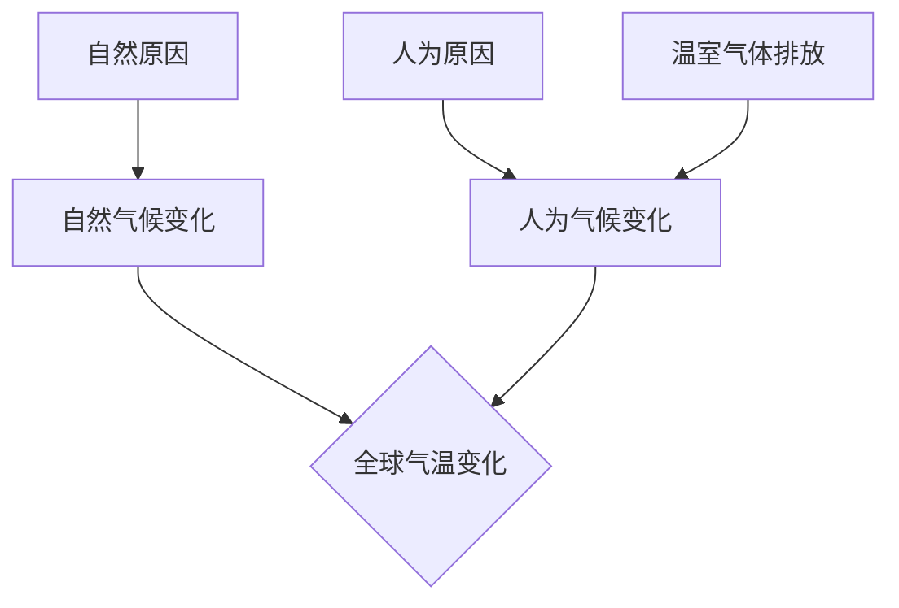

                 

### 引言背景

气候变化，作为当今全球面临的最严峻的环境问题之一，正在对地球的生态系统、人类社会以及经济活动产生深远的影响。其核心特征是气候系统的可变性，特别是平均状态的变化以及对极端气候事件的频率和强度的增加。随着全球温室气体排放量的不断攀升，气候变化的表现形式日益明显，包括极端高温、暴雨、干旱、海平面上升等一系列现象。

#### 全球气候变化的现象

气候变化带来的极端天气事件频发，例如，近年来全球多地经历了极端高温纪录、强烈台风和暴雨事件。这些事件不仅威胁到人类的生命安全，还对农业、水资源和生态系统造成了巨大的破坏。例如，2019年至2020年期间，澳大利亚遭遇了前所未有的干旱和森林大火，导致数百万人受灾。同样，美国在2017年经历了“哈维”和“伊玛”等极端台风事件，引发了大规模的洪水和泥石流。

#### 气候变化的影响

气候变化对全球生态系统的影响也不可忽视。珊瑚礁的白化现象、冰川的迅速消融、北极熊等极地动物的栖息地缩减，都是气候变化带来的典型例子。此外，气候变化还可能导致生物多样性的丧失，影响生态平衡和人类赖以生存的自然资源。

#### 气候变化的经济影响

气候变化对经济活动的影响同样深远。农业生产受极端天气的影响而波动，导致粮食安全受到威胁；旅游业因自然灾害的频发而受到重创；沿海城市面临海平面上升和风暴潮的威胁，可能导致巨额的经济损失。例如，荷兰和孟加拉国等低海拔国家正面临海水倒灌的风险，需要投入大量资源进行海岸线防御工程。

#### 气候变化下的挑战

在气候变化的大背景下，人类面临着诸多生存挑战。资源短缺、生态破坏、极端天气频发、健康问题等，都对人类的生存和发展构成了威胁。这些问题需要全球范围内的合作和协调，以寻找有效的解决方案。

#### 气候变化下的责任

气候变化不仅仅是环境问题，也是社会问题和政治问题。责任的归属涉及多个层面，包括国家、企业和个人。各国政府有责任制定和执行气候变化政策，企业需要采取减排措施，个人则应从日常生活中做起，降低碳足迹。通过这些多层次的措施，共同应对气候变化带来的挑战。

#### 引言总结

总之，气候变化是一个全球性的问题，其影响深远且复杂。了解气候变化的现象、影响以及面临的挑战，是我们在未来寻找解决方案的第一步。在接下来的章节中，我们将进一步探讨气候变化的核心概念与联系，分析应对气候变化的策略与措施，以及探讨在气候变化背景下，如何实现生存与可持续发展。

### 气候变化与生存意义

#### 气候变化对人类生存的挑战

气候变化对人类生存带来的挑战是多方面的，其中最直接的表现就是生存环境的改变。随着全球气候变暖，极端天气事件的频发，人类的居住环境面临着前所未有的威胁。例如，高温和干旱导致水资源短缺，影响农业和居民日常生活；海平面上升威胁沿海城市的居民安全，可能导致大规模的人口迁徙和社会动荡。

##### 资源紧缺

资源紧缺是气候变化对人类生存的另一个重大挑战。气候变化导致的干旱、水资源短缺和土地退化，使得可用水资源变得更加稀缺。这对农业、工业和人类日常生活产生了深远影响。例如，在非洲撒哈拉以南地区，气候变化已经导致许多地方严重缺水，农业生产受到极大影响，粮食安全成为严重问题。

##### 生态破坏

生态系统的破坏也是气候变化对人类生存的重要影响之一。气候变化导致冰川融化、珊瑚礁白化、森林退化等现象，破坏了全球生态平衡。这对依赖自然资源的动植物种群产生了毁灭性的影响，进而影响到人类的食物链和医药资源。例如，北极熊的栖息地因海冰消融而减少，导致其种群数量急剧下降，这对北极地区的生态系统和人类经济活动都带来了巨大挑战。

##### 健康风险增加

气候变化还增加了人类面临健康风险的可能性。极端天气事件如洪水、暴风雨和高温，不仅直接威胁人类生命，还可能导致疾病传播。例如，蚊子繁殖速度加快，导致疟疾和登革热等传染病的发病率上升。此外，气候变化对海洋生态系统的影响，也可能导致海鲜资源的减少，影响人类营养和健康。

##### 社会与经济影响

气候变化对社会和经济的影响同样深远。极端天气事件可能造成巨大的经济损失，如自然灾害导致的财产损失、基础设施破坏等。此外，气候变化可能导致贫困和失业问题加剧，因为许多依赖自然资源和经济活动的地区受到严重影响。例如，印度尼西亚和菲律宾等依赖热带雨林的国家，因森林退化导致的失业问题日益严重。

##### 生存策略的必要性

面对气候变化带来的多重挑战，制定有效的生存策略变得尤为重要。这些策略包括适应和减缓气候变化的措施。适应策略涉及调整农业生产结构、提高建筑能效、改善水资源管理等，以减少气候变化对生活和经济的负面影响。减缓策略则主要集中在减少温室气体排放，采用清洁能源技术，推动绿色经济发展。

##### 个人与集体的责任

在应对气候变化的过程中，个人和集体都扮演着重要角色。个人可以通过节能减排、减少废物产生、选择环保产品等方式降低碳足迹。集体层面，政府、企业和社会组织需要共同努力，制定和实施有效的政策和措施，推动绿色技术的研发和应用，促进社会经济的可持续发展。

#### 生存意义的深刻理解

从更深层次来看，气候变化不仅仅是一个环境问题，更是一个生存问题。它考验着人类对自然界的尊重和保护，也考验着全球社会的团结与合作。通过理解和应对气候变化，人类可以更好地认识到自身在地球生态系统中的位置和责任，从而实现更可持续的生存和发展。

总之，气候变化对人类生存构成了严峻的挑战，但也提供了反思和改进的机会。通过适应和减缓气候变化，人类可以找到更加可持续的生存方式，确保未来世代的生存和发展。

### 气候变化的责任归属

气候变化的责任归属是一个复杂且争议性的话题，涉及多个层面的责任，包括国家、企业和个人。明确和分配责任是制定有效气候政策、推动全球合作的关键步骤。

#### 国家层面的责任

在国家层面，各国政府被广泛认为是应对气候变化的主要责任方。首先，国家需要制定和实施国内气候政策，以减少温室气体排放。例如，许多国家已经签署了《巴黎协定》，承诺到本世纪中叶实现碳中和。此外，国家还应在国际气候谈判中发挥作用，推动全球气候治理的进程。

然而，国家责任的争议点在于责任分配的不平等。发展中国家认为，发达国家应承担更大的责任，因为它们在过去几百年中积累了大量温室气体排放，而发展中国家则在应对气候变化方面资源匮乏。这种不平等导致了全球气候治理中的分歧和谈判难度。因此，国家责任不仅包括减排行动，还应包括提供资金和技术支持，帮助发展中国家应对气候变化。

#### 企业层面的责任

企业在气候变化中扮演着重要角色，因为它们是温室气体排放的主要源头之一。随着全球绿色经济的兴起，企业面临越来越大的压力，要求其采取积极的减排措施。企业可以通过以下几种方式履行其责任：

1. **绿色技术投资**：企业应投资于清洁能源和低碳技术，以减少温室气体排放。
2. **供应链管理**：企业应确保其供应链的绿色化和低碳化，从源头上减少排放。
3. **透明信息披露**：企业应公开其温室气体排放数据，接受公众和投资者的监督。

然而，企业在履行责任时也面临挑战，如技术成本高、市场竞争压力等。因此，政府需要提供支持和激励措施，如税收优惠、补贴和标准制定，以推动企业实现低碳转型。

#### 个人层面的责任

个人在应对气候变化中同样承担着重要责任，尽管个人的影响力相对较小。每个人都可以通过以下方式减少自己的碳足迹：

1. **节能减排**：例如，减少用电和用水、使用节能电器等。
2. **环保出行**：选择公共交通、骑自行车或步行，减少私家车使用。
3. **废物管理**：减少废物产生，进行垃圾分类和回收。

个人责任不仅体现在日常生活中的小行为，还可以通过参与社区和环保组织的活动，提高公众对气候变化的认知和参与度。

#### 责任归属的平衡与协调

要实现有效的气候变化应对，责任归属需要在国家、企业和个人之间找到平衡。各国应通过合作和协商，达成公平的责任分配。例如，可以通过国际气候变化基金，将部分减排责任和经济支持转移到发展中国家。同时，政府和企业应共同推动公众教育和宣传，提高个人参与度。

总之，气候变化的责任归属是一个多层次、多方面的复杂问题。通过国家、企业和个人的共同努力，我们可以更有效地应对气候变化，确保地球的可持续未来。

### 气候变化的核心概念与联系

要深入理解气候变化，我们首先需要明确几个核心概念，并探讨这些概念之间的联系。以下是气候变化中一些关键概念及其相互关系的详细分析。

#### 气候变化定义与原因

**定义**：
气候变化是指长期的大气状态变化，这些变化可能由自然过程或人类活动引起。根据《联合国气候变化框架公约》，气候变化包括自然周期性的气候变化和由于人类活动引起的“人为气候变化”。

**原因**：
1. **自然原因**：如火山爆发、太阳辐射变化、地球轨道变化等。
2. **人为原因**：主要是人类活动产生的温室气体排放，如二氧化碳、甲烷、氟利昂等。这些气体在大气中形成了“温室效应”，导致全球气温上升。

**联系架构 Mermaid 流程图**：

**分析**：
- 自然原因通过影响大气成分，间接引起自然气候变化，而自然气候变化又影响全球气温。
- 人为原因，特别是温室气体排放，直接导致人为气候变化，加剧了全球气温的上升。
- 全球气温变化是自然和人为气候变化共同作用的结果，对生态、经济和社会产生深远影响。

#### 气候变化的主要影响

**影响分析**：

1. **极端天气事件**：全球气温上升导致极端天气事件频发，如高温热浪、暴雨、干旱和台风等。这些事件不仅对人类健康和财产安全造成威胁，还对农业生产和水资源管理产生负面影响。

2. **海平面上升**：冰川和极地冰盖的融化导致海平面上升，威胁沿海城市和岛屿的生存。例如，孟加拉国和太平洋小岛国家正面临海水倒灌和土地丧失的风险。

3. **生态系统破坏**：气候变化导致生态系统失衡，如珊瑚礁白化、森林退化、草原沙漠化等。这些变化破坏了生物多样性，影响生态平衡，威胁到依赖自然资源的物种和人类生活。

4. **水资源短缺**：气候变化导致的降水模式变化和水资源减少，使得许多地区面临水资源短缺问题。这对农业、工业和居民日常生活产生深远影响。

#### 气候变化与生存意义

**生存意义阐述**：

气候变化对人类生存和未来发展的挑战是多方面的。首先，气候变化引发的极端天气事件和资源短缺，威胁到人类的生命安全和健康。例如，高温和干旱导致中暑、脱水和其他健康问题；洪水和台风导致伤亡和财产损失。

其次，气候变化对农业和粮食安全构成威胁。全球气温上升和降水模式变化影响农作物的生长周期和产量，导致粮食短缺和价格波动。这不仅影响贫困地区的居民，还可能引发社会动荡和政治不稳定。

此外，气候变化还加剧了水资源短缺，威胁到人类的日常生活和工业生产。许多地区已经面临严重的水资源危机，供水系统压力巨大，可能导致供水不足和水质恶化。

为了应对这些挑战，我们必须认识到气候变化对人类生存的重要性，并采取有效的应对措施。这包括全球合作、政策制定、技术创新和公众参与。通过这些努力，我们可以减缓气候变化的影响，确保未来世代的生存和发展。

总之，气候变化不仅是一个环境问题，更是一个生存问题。它要求我们重新审视人类与自然的关系，寻找可持续的生存方式。只有通过全球合作和共同努力，我们才能应对气候变化带来的挑战，确保地球的可持续发展。

### 应对气候变化的策略与措施

应对气候变化是一个复杂且紧迫的任务，需要全球范围内的合作和多种策略的综合运用。以下将介绍几种应对气候变化的策略和措施，包括国际合作、技术创新、可持续发展、企业社会责任和个人行动等方面。

#### 国际合作与政策

**国际合作的重要性**：
气候变化是全球性的问题，没有哪个国家可以单独应对。国际合作在应对气候变化中扮演着关键角色。国际社会通过多边协议和合作机制，共同制定和实施应对气候变化的政策和措施。例如，《巴黎协定》是一个全球性的协议，旨在将全球气温上升控制在2摄氏度以内，并努力限制在1.5摄氏度以内。

**国际政策与合作机制**：
1. **《巴黎协定》**：该协定是2015年在联合国气候变化大会上通过的，旨在通过国家自主贡献（NDCs）减少温室气体排放，并加强气候变化的适应和缓解措施。
2. **联合国气候变化框架公约（UNFCCC）**：UNFCCC是1992年通过的一个国际协议，旨在应对全球气候变化问题。每年举行的联合国气候变化大会（COP）为各国提供了一个平台，讨论和协调应对气候变化的行动。
3. **区域性和双边合作**：许多国家和区域组织也在推动本区域内的气候合作。例如，亚太经合组织（APEC）和欧洲联盟（EU）都制定了各自的气候行动计划，以减少温室气体排放并促进绿色能源发展。

**政策分析与实例**：
各国政府制定了不同的政策来应对气候变化，例如：

- **欧盟**：欧盟通过了一系列严格的环保法规，如《欧盟排放交易体系》（EU ETS），对工业排放进行限额交易，以减少温室气体排放。
- **中国**：中国提出了“碳达峰、碳中和”目标，并制定了《国家应对气候变化总体方案》，加强可再生能源开发和碳排放减少。
- **美国**：拜登政府重返《巴黎协定》，并提出了《美国气候法》，旨在实现净零排放目标。

#### 技术创新与可持续发展

**技术创新的重要性**：
技术创新是应对气候变化的关键因素。通过开发和应用新技术，可以大幅减少温室气体排放，提高能源效率，促进可持续发展。以下是一些重要的技术创新领域：

1. **清洁能源技术**：太阳能、风能、地热能和水能等可再生能源技术是减少温室气体排放的重要手段。近年来，这些技术的成本大幅降低，成为全球能源转型的重要驱动力。

2. **碳捕集与封存（CCS）技术**：CCS技术通过捕集工业生产过程中排放的二氧化碳，并将其储存于地下，从而减少大气中的二氧化碳浓度。这项技术对减少工业排放具有重要应用前景。

3. **能源储存技术**：储能技术可以平衡可再生能源的供应和需求，提高电网的稳定性和可靠性。电池储能和氢能技术是当前研究的重点。

**可持续发展框架**：
可持续发展不仅关注环境保护，还涉及经济和社会的均衡发展。联合国提出的“可持续发展目标”（SDGs）中，第13项目标特别关注气候变化行动，强调了减少温室气体排放、提高可再生能源使用和加强气候适应措施的重要性。

**实例分析**：
- **丹麦**：丹麦是可再生能源领域的领导者，通过大力发展风能，丹麦在能源领域实现了高度自给自足，并成为全球绿色能源的典范。
- **特斯拉**：特斯拉在电动汽车和储能技术方面取得了显著成就，推动了全球汽车产业的电气化进程。

#### 社会责任与个人行动

**企业社会责任（CSR）**：
企业作为温室气体排放的主要源头之一，承担着重要的社会责任。越来越多的企业开始关注气候变化问题，并将其纳入企业战略。企业可以通过以下方式履行其社会责任：

1. **减排目标**：设定明确的减排目标和时间表，并定期报告进展情况。
2. **绿色供应链**：确保其供应链的低碳化和可持续性，减少整个价值链的碳排放。
3. **员工培训**：提高员工对气候变化的认知和参与度，推动绿色文化和行为。

**个人行动**：
个人可以通过以下方式参与应对气候变化的行动：

1. **节能减排**：减少家庭用电和用水，选择节能电器和设备，减少不必要的能源消耗。
2. **环保出行**：选择公共交通、骑自行车或步行，减少私家车使用，降低碳足迹。
3. **废物管理**：进行垃圾分类和回收，减少废物产生和污染。

**实例分析**：
- **宜家**：宜家是一家全球家居零售企业，通过推广环保家具和可再生能源使用，减少其碳足迹。
- **比尔与梅琳达·盖茨基金会**：该基金会通过投资和资助气候项目，支持发展中国家的气候变化适应和减排行动。

总之，应对气候变化需要全球范围内的合作和多种策略的综合运用。国际合作、技术创新、可持续发展、企业社会责任和个人行动都是不可或缺的部分。通过共同努力，我们可以减缓气候变化的影响，确保地球的可持续发展。

#### 技术创新在应对气候变化中的应用

技术创新在应对气候变化中扮演着至关重要的角色，通过开发和应用各种先进技术，可以大幅减少温室气体排放，提高能源效率，推动全球可持续发展。以下是一些关键的技术创新领域及其具体应用。

**1. 清洁能源技术**

**太阳能技术**：太阳能是世界上最丰富的可再生能源之一。近年来，太阳能电池技术的进步和成本下降，使得太阳能光伏发电在全球范围内得到广泛应用。太阳能光伏发电系统不仅可以用于家庭和小型商业设施，还可以用于大型电网电站。例如，中国和美国的许多地区已经建成了大规模的太阳能电站，有效减少了煤炭和天然气等化石燃料的使用。

**风能技术**：风能是一种具有巨大潜力的清洁能源。风力发电技术已经发展了数十年，目前成本不断降低，成为许多国家能源结构中的重要组成部分。例如，丹麦在风力发电方面处于全球领先地位，其风能发电量占全国总发电量的近一半。

**生物质能**：生物质能通过利用有机物质（如农作物残留物、林业废弃物和动物粪便）进行发电和供暖，是一种可再生的碳中性能源。生物质能技术不仅可以减少温室气体排放，还可以提供一种可持续的能源解决方案。

**2. 碳捕集与封存（CCS）技术**

碳捕集与封存技术是一种减少工业二氧化碳排放的关键技术。它通过从工业排放源（如火力发电厂和化工厂）捕获二氧化碳，并将其储存在地下，从而防止二氧化碳进入大气。目前，CCS技术主要应用于煤炭和天然气等高碳排放行业。

**3. 能源储存技术**

**电池储能**：电池储能技术可以平衡可再生能源的供应和需求，提高电网的稳定性和可靠性。锂电池是最常见的储能技术，广泛应用于家庭、商业和工业领域。例如，特斯拉的Powerwall储能系统已经成为家庭储能的流行选择。

**氢能技术**：氢能是一种高效的能源储存方式，可以通过电解水产生，然后用于发电和燃料电池。氢能技术具有零碳排放的特点，并且在运输和储能方面具有独特的优势。许多国家正在积极研究和开发氢能技术，以推动能源转型。

**4. 智能电网技术**

智能电网技术通过集成传感器、自动化系统和通信技术，提高了电力系统的效率和可靠性。智能电网可以实时监测和调节电力供需，优化能源分配，减少能源浪费。例如，通过智能电网，家庭用户可以随时调整用电习惯，减少能源消耗。

**实例分析**：

- **挪威**：挪威通过大力推广电动汽车和氢燃料电池汽车，成为全球电动汽车渗透率最高的国家之一。挪威的许多充电站和氢燃料站都是通过智能电网技术实现的，大大提高了能源利用效率。
- **中国**：中国是风能和太阳能技术的领导者，拥有世界上最大的风电和光伏发电装机容量。中国的许多风电场和光伏电站都配备了先进的能量管理技术，实现了高效、稳定的能源供应。
- **特斯拉**：特斯拉不仅生产电动汽车，还通过其能源部门开发太阳能电池板和储能设备。特斯拉的Powerwall和太阳能屋顶系统为家庭和商业用户提供了全面的清洁能源解决方案。

总之，技术创新在应对气候变化中发挥了关键作用。通过持续的研发和应用，我们可以不断降低温室气体排放，提高能源利用效率，推动全球实现可持续发展。这些技术创新不仅有助于应对当前的气候挑战，还为未来提供了可持续的发展路径。

#### 社会责任与个人行动

在应对气候变化的过程中，企业和个人都扮演着至关重要的角色。企业作为经济活动的主要参与者，有责任通过减少温室气体排放、推动可持续发展来减轻气候变化的负面影响。而个人则可以通过日常生活中的小行动，积极参与环保活动，共同为地球的可持续发展贡献力量。

**企业社会责任（CSR）**：

1. **减排目标与行动**：越来越多的企业开始设定明确的温室气体减排目标，并制定详细的行动计划。这些目标通常包括减少能源消耗、提高能源效率、使用清洁能源等。例如，苹果公司承诺到2030年实现其供应链和产品的整体碳中和，并投资数十亿美元用于清洁能源和碳抵消项目。

2. **绿色供应链管理**：企业应确保其供应链的低碳化和可持续性，从源头上减少碳排放。这包括选择低碳供应商、推广绿色运输方式和回收利用材料等。例如，宜家通过推广环保家具和可再生能源使用，减少其碳足迹。

3. **透明信息披露**：企业应公开其温室气体排放数据，接受公众和投资者的监督。这种透明度有助于提高企业的责任感，并促使其他企业也采取类似的行动。例如，全球报告倡议组织（GRI）和碳排放信息披露项目（CDP）等机构为企业提供了一个平台，用于报告和分享其气候相关信息。

**个人行动**：

1. **节能减排**：每个人都可以通过日常生活中的小行动来减少碳足迹。例如，减少家庭用电和用水，使用节能电器和设备，减少不必要的能源消耗。此外，选择低碳出行方式，如公共交通、骑自行车或步行，也可以有效降低碳排放。

2. **环保出行**：个人可以选择环保出行方式，减少私家车使用。例如，可以参加共享单车或电动车项目，减少交通拥堵和空气污染。一些城市还推出了绿色出行奖励计划，鼓励居民采用低碳出行方式。

3. **废物管理**：每个人都可以通过垃圾分类和回收，减少废物产生和环境污染。例如，在家中设置垃圾分类桶，正确分类垃圾，减少塑料和纸张的使用等。此外，可以参与社区环保活动，如植树造林和清洁河流等，共同改善环境。

**实例分析**：

- **苹果公司**：苹果公司在应对气候变化方面采取了多项措施，包括投资数十亿美元用于清洁能源项目，并推出碳中和计划。苹果的供应链管理也非常严格，通过推广绿色生产和回收利用，减少其碳足迹。

- **新加坡**：新加坡政府通过推出一系列环保政策和项目，鼓励居民和企业采取低碳生活方式。例如，政府推出了电动汽车补贴计划，鼓励居民购买低碳汽车；还开展了城市绿化项目，提高城市空气质量。

- **比尔与梅琳达·盖茨基金会**：该基金会不仅关注全球健康和教育问题，还积极参与气候变化项目。基金会通过资助和投资气候项目，支持发展中国家的气候变化适应和减排行动。

总之，企业社会责任和个人行动都是应对气候变化的重要组成部分。通过企业的积极参与和个人的共同努力，我们可以共同减轻气候变化的负面影响，推动地球的可持续发展。

### 气候变化下的适应策略

在全球气候变化的大背景下，适应策略变得尤为重要。这些策略旨在帮助人类社会和生态系统更好地应对和缓解气候变化的负面影响，从而保障生存和可持续发展。以下将详细介绍几种关键的适应策略。

#### 调整农业生产结构

农业生产是气候变化的直接受害者之一，因此调整农业生产结构成为适应策略的重要组成部分。具体措施包括：

1. **作物多样性**：增加农作物的多样性，选择适应不同气候条件的作物，以减少气候变化带来的单一作物减产风险。
2. **种植制度改革**：推广节水灌溉技术，减少水资源浪费。例如，以色列通过滴灌技术，大幅提高了农业生产效率。
3. **农业科技创新**：利用现代生物技术和农业工程，培育耐旱、耐高温、抗病虫害的新型作物品种，提高农作物的适应能力。

#### 提高建筑能效

建筑是能源消耗和温室气体排放的重要来源之一，提高建筑能效是适应气候变化的关键策略。以下是一些具体措施：

1. **绿色建筑设计**：采用节能设计和材料，如高性能隔热材料、自然通风和光照设计，减少建筑能耗。
2. **智能建筑管理系统**：安装智能传感器和控制系统，实时监测和调节建筑内部的能源使用，提高能源利用效率。
3. **可再生能源应用**：在建筑中安装太阳能板、风能设备等可再生能源设施，减少对化石燃料的依赖。

#### 水资源管理

水资源短缺是气候变化带来的另一个重大挑战，有效的水资源管理策略至关重要。以下是一些关键措施：

1. **水资源调配**：通过建设水库、灌溉系统和跨流域调水工程，实现水资源的合理调配，缓解地区性水资源短缺问题。
2. **水资源节约与循环利用**：推广节水技术，减少农业、工业和生活用水中的浪费。同时，通过废水处理和循环利用技术，提高水资源的重复利用率。
3. **水生态修复**：通过植树造林、湿地修复等措施，恢复和保护水生态系统的健康，提高水资源的自然调节能力。

#### 社区共建与互助

社区在应对气候变化中发挥着至关重要的作用，通过社区共建和互助机制，可以增强社区的韧性和适应性。以下是一些具体措施：

1. **社区参与**：鼓励社区居民参与气候变化的应对和适应行动，提高社区的意识和参与度。
2. **应急预案**：制定社区应急预案，应对极端气候事件，如洪水、台风和干旱等。
3. **互助网络**：建立社区互助网络，提供应急物资、技能培训和资源共享，帮助社区居民在危机中相互支持、共同应对。

#### 实例分析

- **荷兰**：荷兰是一个低海拔国家，面临海平面上升和极端天气的威胁。荷兰通过建设围海大堤、实施海堤加固和洪水预警系统，有效抵御了海平面上升和洪水的风险。此外，荷兰还通过建设绿色基础设施，如湿地和绿地，提高城市的水源涵养和气候适应性。
- **哥斯达黎加**：哥斯达黎加通过实施可持续农业和生态旅游项目，提高了农业生产的适应性和社区的经济发展。哥斯达黎加还通过建立国家气候基金，为气候适应项目提供资金支持。
- **澳大利亚**：澳大利亚在应对干旱和水资源短缺方面采取了多项措施，包括推广节水灌溉技术、建设地下水库和恢复河流生态系统。此外，澳大利亚政府还推出了农业保险计划，帮助农民应对气候变化带来的农业风险。

总之，适应气候变化需要多层次、多方面的策略和措施。通过调整农业生产结构、提高建筑能效、管理水资源和加强社区共建，我们可以更好地应对气候变化的挑战，保障社会的可持续发展。

### 气候变化下的生存技能培养

在气候变化日益严峻的背景下，培养应对危机的生存技能变得尤为重要。这不仅是为了应对极端气候事件，更是为了提升整体社会的韧性和适应性。以下将探讨如何在气候变化背景下，培养关键的生存技能。

#### 应急准备技能

**1. 应急预案与应对策略**：首先，个人和组织应制定详细的应急预案，包括应对各种极端气候事件的策略。例如，家庭可以制定洪水、地震、火灾等灾害的应对方案，并定期进行演练。通过演练，家庭成员可以熟悉应急操作步骤，提高应对突发事件的能力。

**2. 生存物资储备**：在家庭和社区中储备必要的生存物资，如食品、水、急救用品和备用电源等，以应对突发事件。特别是对于可能面临长期断电、断水和交通中断的地区，提前储备这些物资尤为重要。

**3. 逃生路线与避难所**：了解所在社区的逃生路线和避难所位置，并在紧急情况下迅速行动。社区可以建立多个避难所，确保每个居民都能在灾难来临时迅速找到安全的地方。

#### 灾害应对技能

**1. 灾害预防与早期预警**：掌握灾害预防知识，如如何避免在暴风雨、洪水和地震等极端天气中受伤。同时，了解如何通过广播、手机应用和其他渠道获取实时气象信息和灾害预警。

**2. 避难与疏散**：在发生极端气候事件时，学会正确避难和疏散。例如，在洪水来临时，应迅速撤离低洼地区，前往高层建筑或避难所。在地震发生时，应迅速找到稳定的避难地点，避免使用电梯和走楼梯。

**3. 灾后自救与互救**：在灾难发生后，学会自救和互救技能，如止血、包扎和急救等。社区可以组织急救培训，提高居民在紧急情况下的应急处理能力。

#### 资源管理与可持续生存

**1. 节能减排**：培养节能减排的生活习惯，如减少用水、用电和废物产生。通过这种方式，不仅可以降低个人碳足迹，还可以减轻气候变化对资源和环境的压力。

**2. 环保出行**：鼓励选择环保出行方式，如骑自行车、步行或使用公共交通，减少私家车使用。此外，可以参与社区自行车共享项目，提高出行的可持续性。

**3. 循环利用与废物管理**：学习如何正确分类和回收废物，推动循环利用。家庭和社区可以设立垃圾分类回收点，鼓励居民积极参与。

#### 社区互助与合作

**1. 建立互助网络**：在社区中建立互助网络，通过志愿者和社区组织，提供应急物资、信息共享和技能培训。在灾难发生时，互助网络可以帮助居民迅速应对，减少损失。

**2. 增强社区凝聚力**：通过组织社区活动，如环保意识讲座、应急演练和互助技能培训，增强社区成员之间的联系和信任，提高社区的凝聚力。

**3. 公众参与**：鼓励居民参与气候变化和环保议题的讨论和决策，提高公众对气候变化的认知和参与度。社区可以设立意见反馈渠道，收集居民的建议和意见，共同制定应对气候变化的策略。

总之，在气候变化的大背景下，培养应对危机的生存技能至关重要。通过应急准备、灾害应对、资源管理和社区互助，我们可以提高社会的韧性和适应性，更好地应对未来的挑战。

### 社区在应对气候变化中的角色和作用

在应对气候变化的挑战中，社区扮演着至关重要的角色。社区不仅是人类生活的重要基础，也是应对气候变化的前沿阵地。通过社区共建和互助机制，可以有效提高社区的气候适应能力，减轻气候变化带来的负面影响。

#### 社区参与的重要性

**1. 提高居民的气候意识**：通过社区活动，如环保讲座、宣传海报和社区媒体，可以增强居民对气候变化的认知和重视。提高居民的气候意识，是推动社区气候行动的第一步。

**2. 促进公众参与**：社区可以建立意见反馈渠道，鼓励居民参与社区气候行动计划的设计和实施。通过公众参与，可以确保行动计划更加贴近居民的需求，提高执行效果。

**3. 强化社区凝聚力**：社区共建活动不仅可以提高居民的气候意识，还可以增强社区的凝聚力。通过共同的目标和行动，居民之间的联系更加紧密，社区的集体应对能力得到提升。

#### 互助机制的作用

**1. 应急响应与资源协调**：社区可以建立应急响应机制，确保在极端气候事件发生时，社区能够迅速响应和有效应对。这包括建立应急物资储备点、制定应急预案和开展应急演练。

**2. 信息共享与传播**：社区可以设立信息共享平台，通过社交媒体、社区网站和会议等方式，及时传播气候变化的相关信息和政策。信息共享有助于居民更好地了解气候变化的动态，制定相应的应对措施。

**3. 技能培训与资源共享**：社区可以组织技能培训，如应急自救、节能减排和废物管理等，提高居民的应对能力。同时，通过社区资源共享，如共享电动车、共享雨水收集系统等，可以降低个人成本，提高资源利用效率。

#### 实例分析

**1. 丹麦社区**：丹麦的许多社区通过推广绿色建筑、可再生能源和循环经济，成为全球气候行动的典范。丹麦社区通过组织环保讲座、开展节能竞赛和推广绿色出行，提高了居民的环保意识和行动力。

**2. 印度班加罗尔**：印度班加罗尔社区通过建立“邻避运动”（Neighborhood Initiatives for Community Empowerment，NICE），推动社区参与气候变化应对行动。NICE组织了一系列社区活动，如环保宣传、废品回收和雨水收集项目，有效提升了社区的气候适应能力。

**3. 澳大利亚墨尔本**：澳大利亚墨尔本的一些社区通过建设社区花园和绿色屋顶，提高了城市绿化水平，减少了城市热岛效应。同时，社区组织了志愿者团队，负责维护和管理这些绿色基础设施，增强了社区的环保意识和合作精神。

总之，社区在应对气候变化中具有不可替代的角色和作用。通过社区参与、互助机制和具体行动，社区不仅可以提高自身的气候适应能力，还可以为全球气候行动树立榜样，共同应对气候变化的挑战。

### 气候变化下的经济转型与可持续发展

在全球气候变化的大背景下，经济转型与可持续发展成为不可或缺的重要议题。为了应对气候变化，各国需要采取一系列措施，实现经济结构的绿色转型，并促进可持续发展。以下将探讨经济转型的路径、可持续发展模式以及面临的挑战和机遇。

#### 经济转型的路径

**1. 转型方向**

经济转型的核心是减少对化石燃料的依赖，增加清洁能源的比重，促进低碳经济发展。具体方向包括：

- **能源结构优化**：逐步减少煤炭、石油和天然气等化石燃料的使用，增加风能、太阳能、水能和生物质能等可再生能源的比重。
- **工业结构升级**：推动高能耗、高污染的传统产业向低碳、高效、绿色产业转型。例如，鼓励钢铁、化工等行业采用节能技术和环保工艺。
- **服务业发展**：大力发展环保服务业、绿色金融和可持续旅游等新兴服务业，促进经济结构的多元化和绿色化。

**2. 转型策略**

实现经济转型需要采取多种策略，以下是一些关键策略：

- **政策支持**：政府应出台一系列政策，包括税收优惠、补贴和财政支持，鼓励企业和个人投资绿色技术和可再生能源项目。
- **市场机制**：通过碳交易市场、绿色债券和绿色投资等市场机制，引导资金流向低碳和绿色项目。
- **国际合作**：积极参与全球气候治理，与其他国家共同制定和实施气候政策，分享技术和经验。

#### 可持续发展模式

**1. 循环经济**

循环经济是一种以资源的高效利用和循环利用为核心的经济发展模式。其核心思想是将经济活动建立在物质循环利用的基础上，减少废物产生和资源消耗。以下是一些关键措施：

- **资源回收利用**：通过建立完善的回收体系，提高废料的再利用率，减少对原材料的需求。
- **设计创新**：在设计阶段考虑产品的可回收性和再利用性，推广模块化设计、易拆卸和可重用产品。
- **废弃物管理**：建立完善的废弃物管理体系，通过分类、回收和处理，实现废弃物的减量和资源化利用。

**2. 绿色金融**

绿色金融是一种以支持环境改善和气候变化应对为目标的金融活动。以下是一些关键措施：

- **绿色债券**：发行绿色债券，为绿色项目和低碳转型提供资金支持。
- **绿色投资**：鼓励金融机构和企业投资绿色产业和项目，如可再生能源、环保技术和绿色交通等。
- **环境风险管理**：加强环境风险评估和监测，确保投资项目的环境可持续性。

#### 面临的挑战

**1. 技术挑战**：虽然清洁能源技术不断发展，但与化石燃料技术相比，许多清洁能源技术仍存在技术成熟度和成本效益问题。此外，绿色技术的研发和推广需要大量的资金投入和时间。

**2. 经济挑战**：经济转型可能会对传统产业造成冲击，导致就业岗位减少和经济增长放缓。如何平衡经济发展和环境保护成为一大挑战。

**3. 政策挑战**：全球气候治理需要各国政府共同参与，但各国在政策制定和执行上存在差异，国际合作和协调难度较大。

#### 机遇

**1. 技术创新**：随着科技的发展，清洁能源技术和绿色技术不断突破，为经济转型提供了新的机遇。例如，太阳能、风能和电动汽车技术的快速发展，为全球能源结构的绿色转型提供了有力支持。

**2. 市场机遇**：全球对低碳产品和服务的需求不断增长，为绿色产业创造了巨大的市场空间。企业可以抓住这一机遇，开发绿色产品和服务，抢占市场先机。

**3. 社会参与**：公众对气候变化的关注日益增加，越来越多的企业和个人积极参与到绿色经济和可持续发展中来，为社会经济转型提供了广泛的社会基础。

#### 结论

气候变化下的经济转型与可持续发展是一个长期而复杂的任务，需要政府、企业和社会各界的共同努力。通过优化能源结构、推广循环经济和绿色金融，我们可以实现经济的绿色转型，促进可持续发展。在转型过程中，尽管面临诸多挑战，但也充满机遇。只有抓住这些机遇，积极应对挑战，我们才能实现经济与环境的双赢，为地球的可持续发展贡献力量。

### 气候变化下的国际合作与外交策略

在全球气候变化的大背景下，国际合作与外交策略成为应对这一全球性挑战的关键。各国之间需要通过合作与协调，共同制定和实施有效的气候政策，以减缓气候变化的影响。以下将探讨国际合作机制、外交策略以及国际合作的案例分析。

#### 国际合作机制

**1. 联合国气候变化框架公约（UNFCCC）**

联合国气候变化框架公约（UNFCCC）是1992年在联合国环境与发展大会上通过的一个国际协议，旨在通过减少温室气体排放和增强气候适应能力，应对气候变化。UNFCCC建立了国际合作的基础，为各国提供了一个平台，用于讨论和协调气候政策。

**2. 巴黎协定**

2015年在联合国气候变化大会上通过的《巴黎协定》是UNFCCC框架下的重要成果。该协定旨在将全球气温升高控制在2摄氏度以内，并努力限制在1.5摄氏度以内。巴黎协定要求各国制定和提交国家自主贡献（NDCs），以减少温室气体排放，并加强气候变化的适应和缓解措施。

**3. 欧洲联盟（EU）**

欧洲联盟在应对气候变化方面发挥了领导作用，通过制定一系列严格的气候政策和法规，推动成员国的减排行动。欧盟还建立了排放交易体系（EU ETS），对工业排放进行限额交易，以减少温室气体排放。

#### 外交策略

**1. 多边谈判与合作**

多边谈判是国际社会应对气候变化的主要外交策略之一。通过多边谈判，各国可以共同制定气候政策，分享减排技术和经验。多边谈判的成果，如巴黎协定，为全球气候治理提供了法律和制度基础。

**2. 双边合作**

双边合作在气候变化外交中同样重要。通过双边协议和合作项目，国家之间可以加强技术交流和资金支持。例如，美国和中国在气候变化方面开展了一系列合作项目，包括可再生能源开发和碳捕集与封存技术。

**3. 国际援助与合作**

发达国家对发展中国家的援助在应对气候变化中具有重要意义。通过提供资金和技术支持，发达国家可以帮助发展中国家提高气候适应能力，减少温室气体排放。国际援助还可以通过国际气候基金和绿色气候基金等渠道实现。

#### 国际合作案例分析

**1. 联合国气候变化大会（COP）**

联合国气候变化大会（COP）是国际社会最重要的气候变化谈判平台之一。历次的COP大会取得了多项重要成果，如《巴黎协定》的通过和《巴黎协定》实施细则的制定。通过这些谈判，国际社会达成了多项共识，推动了全球气候治理的进程。

**2. 中国和美国合作**

中国和美国是世界上最大的温室气体排放国，两国的合作在应对气候变化中具有重要意义。近年来，中美两国在可再生能源开发、碳捕集与封存技术和低碳城市发展等方面开展了多项合作项目。例如，中美两国共同开发了低碳交通项目，推广电动汽车和公共交通系统。

**3. 欧盟和非洲合作**

欧盟和非洲在应对气候变化方面有着密切的合作关系。欧盟通过提供资金和技术支持，帮助非洲国家提高气候适应能力，减少温室气体排放。例如，欧盟资助了非洲多个国家的可再生能源项目，促进了非洲的绿色经济发展。

总之，国际合作与外交策略在应对气候变化中发挥着关键作用。通过多边谈判、双边合作和国际援助，各国可以共同制定和实施有效的气候政策，推动全球气候治理的进程。国际合作的成功案例也为其他国家和地区提供了宝贵的经验和借鉴。

### 气候变化下的教育与科普

在应对气候变化的挑战中，教育和科普起到了至关重要的作用。通过教育和科普，可以提高公众对气候变化的认知，增强个人的环保意识，促进社会的共同参与。以下将探讨教育体系的适应、公众科普与宣传以及教育与可持续发展。

#### 教育体系的适应

**1. 课程设置与教学资源**

教育体系应将气候变化纳入课程设置，成为学生必修的一部分。从小学到大学，不同阶段应设置相应的气候变化课程，使学生从小了解气候变化的基本概念和影响。同时，学校应提供丰富的教学资源，如教材、视频和实验设备，帮助学生更直观地理解气候变化。

**2. 教师培训**

教师是传播气候变化知识的关键媒介，因此教师培训至关重要。教师应接受专业的气候变化培训，了解最新的气候变化研究成果和教学策略。培训内容可以包括气候变化的基本知识、教学方法和技术应用等。

**3. 学校环境建设**

学校应积极创建绿色校园，通过校园绿化、节能设施和可再生能源应用等措施，提高学生的环保意识和实践能力。例如，学校可以设立太阳能电池板和雨水收集系统，让学生亲身体验可再生能源的应用。

#### 公众科普与宣传

**1. 媒体传播**

媒体在气候变化科普中发挥着重要作用。电视、广播、报纸和互联网等媒体可以通过新闻、专题节目、广告和社交媒体等形式，向公众传播气候变化的知识和信息。媒体应注重科学性和客观性，避免误导公众。

**2. 线上与线下活动**

在线上，可以通过微信公众号、微博、抖音等社交媒体平台，发布有关气候变化的科普文章、视频和互动游戏，吸引公众关注。线下活动如讲座、展览和论坛等，则可以面对面地与公众交流，提高科普效果。

**3. 社区参与**

社区是公众科普的重要阵地。社区可以组织各种环保活动，如环保讲座、清洁行动和植树造林等，提高居民的环保意识。社区还可以设立环保宣传栏，定期发布气候变化相关的科普信息。

#### 教育与可持续发展

**1. 可持续发展教育**

可持续发展教育（Sustainable Development Education，SDE）是教育体系的一部分，旨在培养学生的可持续发展意识和能力。SDE可以通过课程、项目和实践活动，使学生了解气候变化、环境保护和可持续发展的重要性。

**2. 公众参与与行动**

通过教育，可以激发公众的环保意识和行动力。学校可以组织学生参与各种环保项目，如垃圾分类、节能减排和绿色出行等，使学生在实际操作中体验可持续发展的理念。同时，公众可以参与社区的环保活动，共同推动可持续发展。

**3. 教育与经济转型**

教育不仅是提高公众环保意识的重要手段，还可以推动经济转型。通过教育，可以培养绿色技术和产业的专门人才，促进绿色经济的发展。例如，培养可再生能源工程师、环保产品和绿色建筑设计等方面的专业人才，推动社会经济的绿色转型。

总之，气候变化下的教育与科普是应对气候变化的重要途径。通过教育体系的适应、公众科普与宣传以及教育与可持续发展，我们可以提高公众的环保意识，促进社会的共同参与，共同应对气候变化的挑战。

### 结论与展望

#### 气候变化下的生存意义与责任

总结而言，气候变化不仅仅是一个环境问题，更是关乎人类生存的重大挑战。它深刻影响着地球的生态系统、经济活动和社会稳定，对人类生存和发展构成了前所未有的威胁。气候变化引发的极端天气事件、资源短缺、生态破坏和健康风险，已经成为全球范围内的现实问题，迫切需要我们采取有效的措施应对。

在应对气候变化的过程中，每个人和每个组织都扮演着重要角色。国家、企业、个人和社会组织需要共同努力，通过国际合作、技术创新、可持续发展、社会责任和公众参与等多种途径，共同应对气候变化的挑战。只有通过全球合作和共同努力，我们才能减缓气候变化的影响，确保地球的可持续发展。

#### 未来展望

展望未来，气候变化将继续深刻影响全球生态和社会。极端天气事件可能会更加频繁和剧烈，导致更严重的灾害和经济损失。因此，我们需要在未来采取更加积极的应对措施：

1. **加强国际合作**：国际合作在应对气候变化中至关重要。未来需要进一步加强全球气候治理，推动各国共同制定和实施更加严格的气候政策，提高全球减排力度。

2. **推动技术创新**：技术创新是应对气候变化的关键驱动力。未来应继续加大对清洁能源、碳捕集与封存、能源储存和智能电网等关键技术的研发和应用，提高能源效率和减排效果。

3. **推进可持续发展**：可持续发展是应对气候变化的长远策略。未来应在经济、社会和环境三方面实现均衡发展，推动循环经济、绿色金融和可持续消费，减少对自然资源的依赖。

4. **提高公众意识**：公众意识是应对气候变化的基础。未来应通过教育和科普活动，提高公众对气候变化的认知和参与度，激发公众的环保行动力。

5. **加强政策支持**：政府应制定和实施更加有力的气候变化政策，包括碳定价、绿色税收、绿色金融和环保法规等，为企业和个人提供明确的减排指导和支持。

总之，未来面对气候变化带来的挑战，我们需要采取综合性的策略，通过国际合作、技术创新、可持续发展和公众参与，共同应对气候变化的挑战，确保地球的可持续发展。只有通过全球合作和共同努力，我们才能为未来世代创造一个更加美好和可持续的地球。

### 附录A：气候变化相关数据与报告

以下列出一些关于气候变化的重要数据和报告，这些数据有助于我们更深入地理解气候变化的现状和趋势。

1. **《联合国气候变化框架公约》秘书处（UNFCCC）**：该组织发布了年度《气候变化现状报告》，详细介绍了全球温室气体排放、气候变化的影响和各国应对气候变化的行动。

   - 访问链接：<https://unfccc.int/process-and-meetings/the-paris-accord/status-of-the-paris-accord>

2. **国际能源署（IEA）**：IEA发布了《世界能源展望》报告，分析了全球能源消费、生产和技术发展，以及能源对气候变化的影响。

   - 访问链接：<https://www.iea.org/reports/world-energy-outlook>

3. **世界资源研究所（WRI）**：WRI发布了《气候行动追踪》报告，跟踪各国履行《巴黎协定》的进展情况，包括温室气体减排目标和行动。

   - 访问链接：<https://www.wri.org/research/climate-action-tracker>

4. **世界气象组织（WMO）**：WMO发布了《全球气候状况》报告，提供了全球气候变化的科学评估和数据。

   - 访问链接：<https://www.wmo.int/en/publications/glossary/climate-change/global-climate-estimates>

5. **国际气候变化专门委员会（IPCC）**：IPCC发布了《气候变化影响、适应和脆弱性》报告，详细分析了气候变化对自然生态系统、人类健康和经济的广泛影响。

   - 访问链接：<https://www.ipcc.ch/site/assets/uploads/2019/09/WGII_Chapter1_LowRes.pdf>

6. **美国国家海洋和大气管理局（NOAA）**：NOAA提供了大量关于气候变化的数据和分析，包括温室气体浓度、全球气温和极端天气事件的监测数据。

   - 访问链接：<https://www.climate.gov/monitoring/activity/climate-change-indicators>

通过这些数据和报告，我们可以更全面地了解气候变化的现状，评估应对措施的成效，并制定更加有效的应对策略。

### 附录B：气候变化相关法律法规与政策文件

为了有效应对气候变化，各国政府制定了大量的法律法规和政策文件，以下列出一些关键的文件：

1. **《巴黎协定》**：2015年通过的国际协议，旨在将全球平均气温升高控制在2摄氏度以内，并努力限制在1.5摄氏度以内。

   - 访问链接：<https://unfccc.int/process-and-meetings/the-paris-accord/the-paris-accord>

2. **《联合国气候变化框架公约》**：1992年通过的国际协议，为全球气候变化治理奠定了法律基础。

   - 访问链接：<https://unfccc.int/process-and-meetings/the-unfccc/the-unfccc>

3. **《京都议定书》**：1997年通过的国际协议，旨在减少工业国家的温室气体排放。

   - 访问链接：<https://unfccc.int/process-and-meetings/the-kyoto-protocol/the-kyoto-protocol>

4. **《中国气候变化国家战略》**：中国政府制定的长期战略，明确了国家在应对气候变化方面的目标和措施。

   - 访问链接：<http://www.mofcom.gov.cn/article/aei/t20190809166227/>

5. **《美国气候法》**：2021年通过的法律，旨在实现美国在《巴黎协定》中的承诺，实现净零排放。

   - 访问链接：<https://www.energy.gov/eere/america-s-clean-energy-future>

6. **《欧洲绿色协议》**：欧盟制定的一系列政策和措施，旨在实现碳中和、保护生态系统和提高能源效率。

   - 访问链接：<https://ec.europa.eu/clima/policies/eu-climate-action_en>

7. **《印度国家气候行动计划》**：印度政府制定的行动计划，旨在减少温室气体排放和增强气候适应能力。

   - 访问链接：<https://www.moef.gov.in/file-manager/Ind-NDC-April-2021.pdf>

这些法律法规和政策文件为全球应对气候变化提供了重要的指导，各国应根据自身情况，结合这些文件制定和实施具体的政策和措施。

### 结语

气候变化是一个复杂且紧迫的全球性挑战，对人类生存和发展构成了深远的影响。本文从多个角度探讨了气候变化的核心概念、应对策略、技术创新、社会责任和公众参与等内容，强调了国际合作和公众意识在应对气候变化中的重要性。

在未来，我们必须采取更加积极和综合的应对措施，通过技术创新、政策支持、公众参与和国际合作，共同努力减缓气候变化的影响，实现可持续发展。只有这样，我们才能为未来世代创造一个更加美好和安全的地球。

最后，感谢各位读者的关注和支持。本文中的数据和报告来源仅供参考，读者如有需要，可以进一步查阅相关文献和资料。让我们携手努力，共同应对气候变化的挑战，为地球的未来贡献力量。

**作者：AI天才研究院/AI Genius Institute & 禅与计算机程序设计艺术 /Zen And The Art of Computer Programming**

