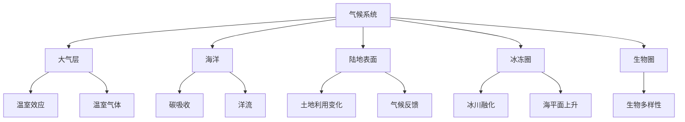
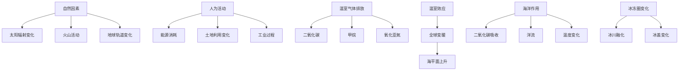
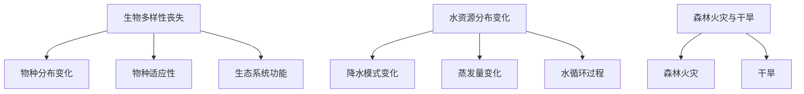
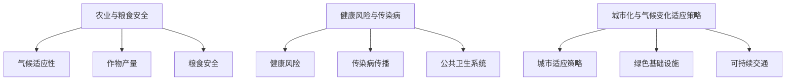
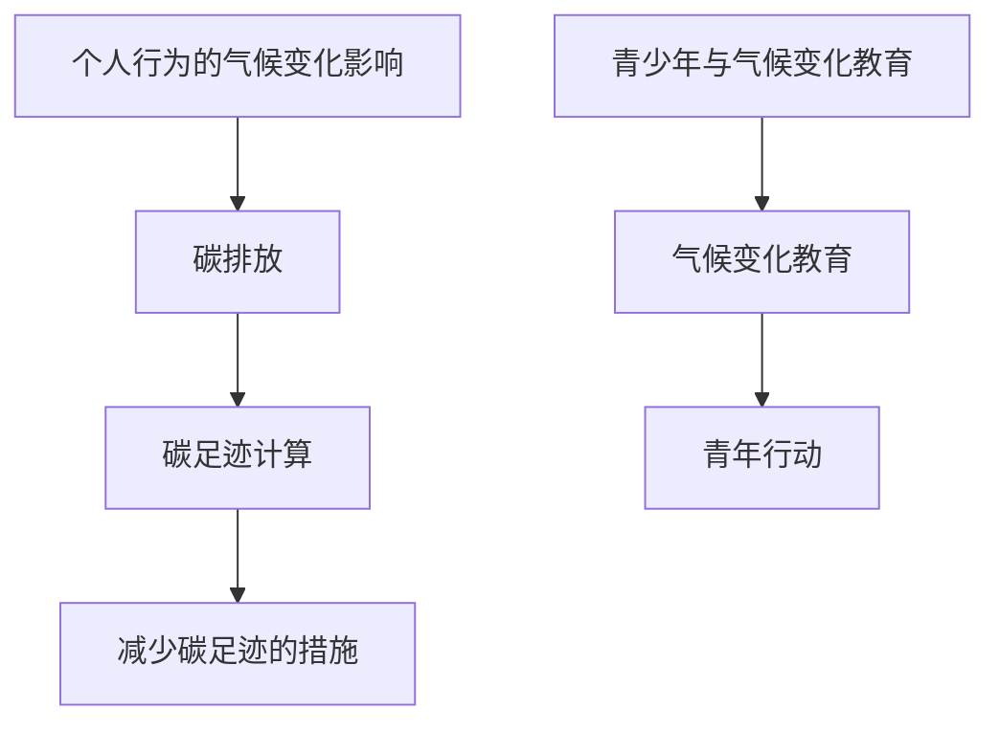
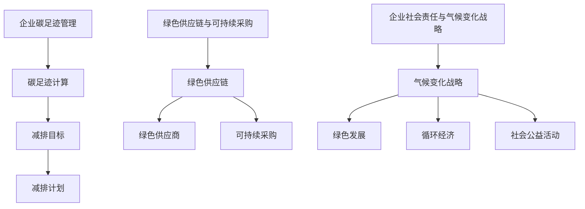
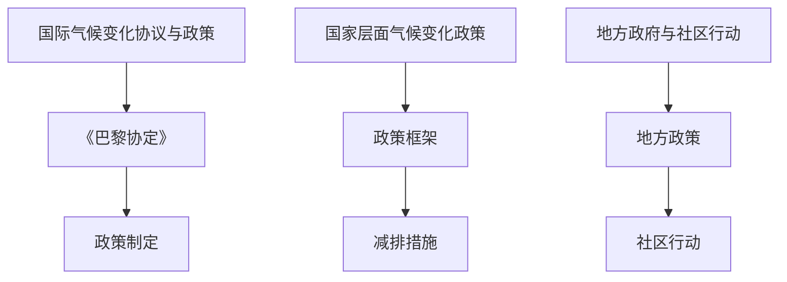
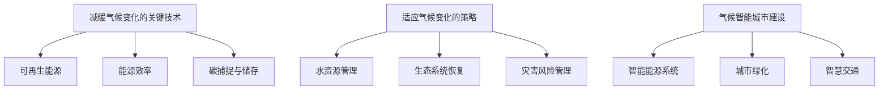
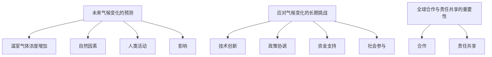
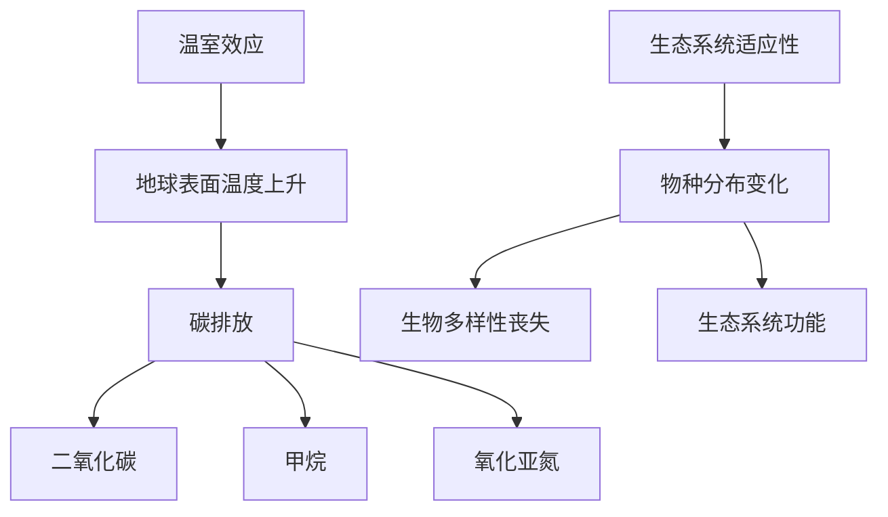

                 

## 气候变化：全球性危机下的责任感

> 关键词：气候变化、全球性危机、责任感、环境保护、可持续发展

> 摘要：本文旨在探讨气候变化这一全球性危机，及其所带来的责任感的深刻内涵。文章首先定义了气候变化的基本概念，并阐述了其科学基础与历史背景。随后，文章分析了气候变化对全球生态系统和人类社会的影响，强调了个人和团体在应对气候变化中的责任感。通过探讨应对气候变化的策略与实践，文章提出了具体的措施和成功案例，最后对未来展望和挑战进行了深入探讨。

## 第一部分：气候变化基础知识

### 第1章：气候变化的定义与背景

#### 1.1 气候变化的基本概念

**气候变化**，通常指的是一个地区长期气候状态的变化。气候是由多年平均天气条件所决定的，它包括温度、降水、湿度等多种因素。根据《联合国气候变化框架公约》的定义，**气候变化**指的是“气候系统的统计变化，不论其原因是自然引起的或由于人为活动引起的，持续时间至少为几十年或更长”。

**天气变化**则是指短时间内的气候变化，如一天或一周内的温度变化、降水模式等。天气变化是气候变化的组成部分，但两者有本质的区别。

#### 1.2 气候变化的科学基础

气候变化的科学基础在于对**地球气候系统的理解**。地球气候系统包括大气、海洋、陆地表面、冰冻圈和生物圈等组成部分。这些组成部分相互作用，共同维持地球的气候平衡。

**大气层**是地球气候系统的重要组成部分。大气的温度和成分直接影响地球的气候。特别是**温室气体**，如二氧化碳、甲烷和水蒸气，它们能吸收和重新辐射地球表面的热量，导致温室效应。

**海洋**在地球气候系统中也扮演着关键角色。海洋吸收了大量的**二氧化碳**，并通过洋流和温度变化影响全球气候。

**冰冻圈**的变化，如冰川和冰盖的融化，不仅影响海平面上升，还改变了气候系统的能量平衡。

#### 1.3 全球气候变化的历史与趋势

**历史**上，地球的气候经历了多次周期性的变化。例如，**冰期**和**间冰期**的交替。在过去的**一万年**中，地球气候经历了**小冰期**和**现代温暖期**。

**近代**，特别是**20世纪**以来，全球气候发生了显著变化。根据**气象记录**和**卫星数据**，全球平均气温持续上升，**温室气体浓度**显著增加。

**趋势**方面，气候变化表现为**全球变暖**、**极端天气事件增多**、**海平面上升**等。例如，**2000年至2021年**，全球平均温度比工业化前时期高出约**1.2摄氏度**。

### 流程图：气候变化核心概念与联系



### 第2章：气候变化的原因与机制

#### 2.1 气候变化的主要驱动因素

**自然因素**是引起气候变化的重要原因之一。例如，**太阳辐射**的长期变化、**火山活动**、**地球轨道变化**等都会对气候产生显著影响。

**人为活动**则是**近代**气候变化的主要原因。工业革命以来，人类活动导致了大量的**温室气体排放**，特别是**二氧化碳**、**甲烷**和**氧化亚氮**。

**能源消耗**：燃烧化石燃料是温室气体排放的主要来源。煤炭、石油和天然气等化石燃料的广泛使用导致了大量二氧化碳的排放。

**土地利用变化**：森林砍伐、农业扩展和城市化等活动改变了土地的利用方式，导致生物圈吸收的二氧化碳减少。

**工业过程**：例如水泥生产、钢铁制造等工业过程也会排放大量的温室气体。

#### 2.2 大气层与温室效应

**大气层**中的**温室气体**对地球气候有着重要影响。温室气体通过吸收和重新辐射地球表面的热量，维持了地球的温度平衡。

**温室效应**是指地球大气层中的温室气体吸收和重新辐射地球表面发出的红外辐射，导致地球表面温度上升的现象。

**温室气体浓度**的增加导致**全球变暖**。根据**气象记录**，自**20世纪**以来，大气中的温室气体浓度显著增加，尤其是**二氧化碳**和**甲烷**。

#### 2.3 海洋与冰冻圈的变化

**海洋**在地球气候系统中起着关键作用。海洋吸收了大量的**二氧化碳**，并通过**洋流**和**温度变化**影响全球气候。

**冰冻圈**的变化，如**冰川**和**冰盖**的融化，不仅影响海平面上升，还改变了气候系统的能量平衡。

**冰川融化**：随着全球气温的上升，冰川面积缩小，融水量增加。这导致海平面上升，对沿海地区构成威胁。

**冰盖变化**：如南极冰盖和北极冰盖的融化，影响全球气候模式和海平面上升。

### 流程图：气候变化原因与机制



## 第二部分：气候变化对全球的影响

### 第3章：气候变化对生态系统的影响

#### 3.1 生物多样性的丧失

**生物多样性**是指地球上所有生物体（包括植物、动物和微生物）的多样性。气候变化对生物多样性有着深远的影响。

**物种分布变化**：气候变化导致某些物种的栖息地缩小或消失，迫使它们迁移到新的地区。这不仅可能导致物种的灭绝，还可能破坏生态系统的平衡。

**物种适应性**：一些物种可能无法适应快速变化的气候条件，从而导致种群数量减少甚至灭绝。

**生态系统功能**：气候变化可能破坏生态系统的功能，如水质净化、土壤保持和气候调节等。

#### 3.2 水资源的分布变化

**水资源分布变化**是气候变化对生态系统和人类社会的重要影响之一。

**降水模式变化**：气候变化可能导致某些地区降水增加，而其他地区则出现干旱。这会影响农业、水资源的供应和生态环境。

**蒸发量变化**：气温升高可能导致蒸发量增加，进一步加剧水资源的短缺。

**水循环过程**：气候变化可能影响水循环的各个阶段，包括降水、径流和蒸发等。

#### 3.3 森林火灾与干旱

**森林火灾**和**干旱**是气候变化导致的重要环境问题。

**森林火灾**：全球气温升高和干旱条件可能导致森林火灾的发生频率和严重程度增加。这会对森林生态系统和人类活动造成严重影响。

**干旱**：气候变化可能导致某些地区干旱频率和持续时间的增加。干旱会影响农业生产、水资源供应和生态平衡。

### 流程图：气候变化对生态系统的影响



### 第4章：气候变化对人类社会的影响

#### 4.1 农业与粮食安全

**农业**是**人类社会**的基石，而**气候变化**对农业产生了重大影响。

**气候适应性**：农业生产需要适应不断变化的气候条件。例如，一些作物可能需要适应更高温度或更多降水。

**作物产量**：气候变化可能导致作物产量下降。干旱、高温和极端天气事件都可能影响农作物的生长和收成。

**粮食安全**：气候变化威胁到全球**粮食安全**。食品价格波动、粮食供应短缺等问题可能对社会稳定造成影响。

#### 4.2 健康风险与传染病

**气候变化**对**人类健康**也带来了新的风险。

**健康风险**：极端高温、干旱和洪水等气候事件可能导致健康问题，如热浪、呼吸系统疾病和心血管疾病。

**传染病**：气候变化可能影响**传染病的传播**。例如，随着气温升高，某些病原体和传播媒介的生存和繁殖条件可能变得更加有利。

**公共卫生系统**：气候变化可能对**公共卫生系统**造成压力，需要更多资源来应对新的健康挑战。

#### 4.3 城市化与气候变化适应策略

**城市化**是**人类社会**发展的一个重要趋势，但**气候变化**对城市带来了特殊挑战。

**城市适应策略**：城市需要制定和实施**气候变化适应策略**，以应对高温、洪水和其他气候事件。

**绿色基础设施**：例如，城市绿地、湿地和水塘等可以增强城市的气候适应性，改善城市环境。

**可持续交通**：发展可持续交通系统，如自行车道、公共交通和电动汽车，可以减少城市温室气体排放。

### 流程图：气候变化对人类社会的影响



## 第三部分：个人与团体在应对气候变化中的责任感

### 第5章：个人在气候变化中的角色

#### 5.1 个人行为的气候变化影响

**个人行为**对**气候变化**有着重要影响。

**碳排放**：每个人的日常活动和消费行为都会产生碳排放。例如，交通出行、饮食选择和能源使用等。

**碳足迹**：个人可以通过计算**碳足迹**来了解自己的碳排放量，并采取措施减少排放。

**绿色消费**：选择**绿色产品**和**可持续消费**模式可以减少对环境的负面影响。

#### 5.2 个人碳足迹的计算与减少

**碳足迹计算**：

- 使用在线工具或计算器，输入日常活动和消费数据，即可计算出个人的**碳足迹**。
- 计算结果通常以**吨二氧化碳当量（tCO2e）**表示。

**减少碳足迹的措施**：

- 减少交通出行，鼓励使用公共交通、自行车或步行。
- 节能减排，例如使用节能电器、减少不必要的电力消耗。
- 选择本地食品和产品，减少食物运输过程中的碳排放。
- 种植树木和植物，增加碳吸收。

#### 5.3 青少年与气候变化教育

**青少年**在**气候变化**中扮演着重要角色。

**气候变化教育**：

- 学校和教育机构应开展**气候变化教育**，提高青少年的气候变化意识。
- 教育内容应包括气候变化的基本知识、影响和应对策略。

**青年行动**：

- 青年可以参与各种**气候变化行动**，如环保志愿活动、倡导可持续生活方式等。
- 青年还可以通过**社交媒体**和**公益活动**传播气候变化知识，提高公众意识。

### 流程图：个人在气候变化中的角色与行动



### 第6章：企业在气候变化中的责任

#### 6.1 企业碳足迹管理

**企业**在**气候变化**中承担着重要责任。

**碳足迹管理**：

- 企业可以通过**碳足迹计算**了解自身的碳排放量。
- 碳足迹管理包括测量、监控和报告企业的温室气体排放。

**减排目标**：

- 企业应设定**减排目标**，并制定相应的**减排计划**。
- 通过技术改造、节能减排和提高能源效率等措施实现减排目标。

#### 6.2 绿色供应链与可持续采购

**绿色供应链**和**可持续采购**是企业在应对气候变化中的重要策略。

**绿色供应链**：

- 企业应确保供应链中的所有环节都遵循**环保标准**。
- 选择**绿色供应商**，推广环保产品和材料。

**可持续采购**：

- 企业应采购**可持续**的原料和产品，减少对环境的影响。
- 推动供应链上的合作伙伴共同参与**可持续发展**。

#### 6.3 企业社会责任与气候变化战略

**企业社会责任**（CSR）是企业在应对气候变化中的关键方面。

**气候变化战略**：

- 企业应制定**气候变化战略**，将气候变化风险管理纳入业务战略中。
- 企业可以通过**绿色发展**、**循环经济**等措施降低碳排放和环境影响。

**社会责任实践**：

- 企业应积极参与**社会公益活动**，推动**气候变化教育**和**可持续发展**。

### 流程图：企业在气候变化中的责任与行动



### 第7章：政府与政策在应对气候变化中的作用

#### 7.1 国际气候变化协议与政策

**国际气候变化协议**和**政策**是应对气候变化的重要工具。

**《巴黎协定》**：

- **《巴黎协定》**是**国际社会**在**2015年**达成的一项**全球气候协定**。
- 协定目标是将全球平均气温升高控制在**2摄氏度**以内，并努力将升温控制在**1.5摄氏度**以内。

**政策制定**：

- 各国政府应制定和实施**国内气候政策**，以实现**《巴黎协定》**的目标。
- 政策工具包括**碳定价**、**减排目标**、**可再生能源政策**等。

#### 7.2 国家层面气候变化政策

**国家层面**的气候变化政策是**全球气候治理**的重要组成部分。

**政策框架**：

- 各国应制定**国家气候政策框架**，包括减排目标、适应策略和政策措施。
- 政策应具有**可测量性**、**可报告性**和**可验证性**（MRV）。

**减排措施**：

- 国家可以通过**能源转型**、**低碳交通**、**绿色建筑**等措施实现减排目标。
- 政府应提供**政策支持**，如税收优惠、财政补贴和技术创新支持。

#### 7.3 地方政府与社区行动

**地方政府**和**社区**在**气候变化**应对中发挥着重要作用。

**地方政策**：

- 地方政府应制定和实施**地方气候政策**，以适应本地的气候特点和需求。
- 地方政策应包括**城市绿化**、**水资源管理**、**灾害预防**等措施。

**社区行动**：

- 社区可以开展**气候变化教育**、**环保志愿活动**和**低碳生活**推广。
- 社区组织可以发起**环保倡议**，推动居民参与**气候变化**应对。

### 流程图：政府与政策在应对气候变化中的作用



## 第四部分：应对气候变化的策略与实践

### 第8章：应对气候变化的策略框架

#### 8.1 减缓气候变化的关键技术

**减缓气候变化**需要一系列**关键技术**的支持。

**可再生能源**：

- **太阳能**、**风能**、**水能**和**地热能**等可再生能源可以减少对化石燃料的依赖，降低碳排放。

**能源效率**：

- 提高能源效率可以减少能源消耗，降低碳排放。这包括建筑节能、工业节能和交通节能等。

**碳捕捉与储存**（CCS）：

- **碳捕捉与储存**技术可以将工业排放的二氧化碳捕集并储存在地下，防止其进入大气。

#### 8.2 适应气候变化的策略

**适应气候变化**是应对气候变化的另一重要策略。

**水资源管理**：

- 面对气候变化引起的水资源变化，水资源管理策略应包括水资源调配、水源保护和节水措施。

**生态系统恢复**：

- 恢复受损的生态系统，如湿地、森林和草地，可以提高生态系统的适应性和恢复力。

**灾害风险管理**：

- 灾害风险管理包括预警系统建设、灾后恢复和重建等措施，以减少气候变化引起的灾害风险。

#### 8.3 气候智能城市建设

**气候智能城市**是一种**可持续城市**模式，旨在通过创新技术和策略应对气候变化。

**智能能源系统**：

- 通过智能电网、储能技术和分布式能源系统，实现能源的高效利用和优化。

**城市绿化**：

- 增加城市绿地、公园和水体，改善城市气候，提高居民生活质量。

**智慧交通**：

- 发展智慧交通系统，包括公共交通、电动汽车和共享出行等，减少交通拥堵和碳排放。

### 流程图：应对气候变化的策略框架



### 第9章：成功案例研究

#### 9.1 案例一：XX国的可再生能源政策

**XX国**通过实施**可再生能源政策**，成功减少了碳排放。

**政策背景**：

- **XX国**面临严重的能源短缺和环境污染问题。
- 政府意识到可再生能源是解决这些问题的有效途径。

**政策措施**：

- **政府补贴**和**税收优惠**，鼓励企业和家庭使用可再生能源。
- **建设大型太阳能和风能项目**，提高可再生能源的产能。
- **推广绿色建筑**和**节能设备**，提高能源效率。

**成效评估**：

- 可再生能源在能源结构中的比例显著增加，减少了化石燃料的使用。
- 碳排放量显著下降，空气质量得到改善。
- 创造了大量的就业机会，促进了经济发展。

#### 9.2 案例二：XX公司的绿色转型计划

**XX公司**是一家全球领先的制造企业，成功实现了**绿色转型**。

**转型背景**：

- **XX公司**意识到气候变化对其业务的影响，决定采取行动应对。
- 公司面临着来自股东、客户和公众的环保压力。

**转型措施**：

- **投资可再生能源**，如太阳能和风能，减少能源消耗。
- **改进生产工艺**，减少废弃物和废水排放。
- **推广绿色产品**，如节能电器和环保材料。

**成效评估**：

- 公司的能源消耗和碳排放显著下降。
- 绿色产品的市场份额增加，品牌形象提升。
- 成本效益显著，提升了公司的竞争力。

#### 9.3 案例三：XX社区的抗灾准备与恢复措施

**XX社区**通过一系列**抗灾准备与恢复措施**，提高了社区的气候适应能力。

**背景**：

- **XX社区**位于一个气候敏感地区，经常遭受洪水、干旱和其他极端天气事件的袭击。
- 社区面临基础设施受损、居民流离失所等问题。

**措施**：

- **建设防洪堤坝**，减少洪水风险。
- **开展环境教育**，提高居民的环保意识和抗灾能力。
- **恢复受损的生态系统**，如湿地和森林，提高生态系统的恢复力。

**成效评估**：

- 社区的抗灾能力显著提升，减少了灾害造成的损失。
- 居民的生活质量和安全感得到提高。
- 社区的环境质量得到改善，生态平衡得到恢复。

### 第10章：未来展望与挑战

#### 10.1 未来气候变化的预测

**未来气候变化**的预测表明，全球气温将继续上升，极端天气事件将更加频繁和剧烈。

**预测因素**：

- **温室气体浓度**的增加。
- **自然因素**，如太阳辐射和火山活动的影响。
- **人类活动**，如能源消耗和土地利用变化。

**影响**：

- 全球海平面上升，对沿海地区构成威胁。
- 气候变化可能导致**水资源短缺**、**粮食安全**问题，以及对**人类健康**的威胁。

#### 10.2 应对气候变化的长期挑战

**应对气候变化的长期挑战**包括以下几个方面：

- **技术创新**：需要不断研发和推广新的低碳技术和可再生能源技术。
- **政策协调**：国际社会需要加强政策协调，共同应对气候变化。
- **资金支持**：气候变化应对需要巨大的资金投入，需要全球合作提供资金支持。
- **社会参与**：需要全社会共同参与，提高公众的气候变化意识。

#### 10.3 全球合作与责任共享的重要性

**全球合作**和**责任共享**是应对气候变化的根本途径。

**合作**：

- 国际社会应加强合作，共同制定和实施气候变化应对政策。
- 国家之间应分享经验和技术，促进可持续发展。

**责任共享**：

- 各国应根据自身的能力和贡献，承担相应的责任。
- 富裕国家应承担更多的责任，支持发展中国家应对气候变化。

### 流程图：未来展望与挑战



## 作者信息

作者：AI天才研究院/AI Genius Institute & 禅与计算机程序设计艺术 /Zen And The Art of Computer Programming

### 完整性要求

**背景介绍**

气候变化是指地球气候系统的长期变化，包括温度、降水、湿度等多种因素的演变。气候变化与天气变化不同，后者是指短时间内气候状态的波动。气候变化的影响范围广泛，涉及生态系统、人类社会以及经济活动。近年来，全球气候变化问题日益严峻，成为全球性的危机。

**核心概念与联系**

气候变化的核心概念包括温室效应、碳排放、生态系统适应性等。温室效应是指地球大气层中的温室气体吸收和重新辐射地球表面发出的红外辐射，导致地球表面温度上升的现象。碳排放是气候变化的主要驱动因素，人类活动导致大量温室气体排放，如二氧化碳、甲烷和氧化亚氮。生态系统适应性则是指生物和生态系统能否适应气候变化带来的新环境条件。

以下是气候变化核心概念之间的Mermaid流程图：



**核心算法原理讲解**

在应对气候变化的过程中，碳排放计算是一个核心算法。碳排放计算可以帮助企业和个人了解自身的碳排放量，并采取相应的减排措施。以下是一个简单的Python代码示例，用于计算个人的碳足迹：

```python
# Python代码示例：计算个人碳足迹

def calculate_carbon_footprint(electricity_consumption, transportation, diet, flights):
    """
    计算个人碳足迹（吨二氧化碳当量，tCO2e）

    :param electricity_consumption: 年度电力消耗（千瓦时）
    :param transportation: 交通出行（公里）
    :param diet: 饮食（公斤）
    :param flights: 航空旅行（公里）
    :return: 个人碳足迹（tCO2e）
    """
    
    # 电力的碳排放系数（kgCO2e/kWh）
    electricity_emission_factor = 0.475
    
    # 交通的碳排放系数（kgCO2e/km）
    transportation_emission_factor = 0.237
    
    # 饮食的碳排放系数（kgCO2e/kg）
    diet_emission_factor = 2.5
    
    # 航空的碳排放系数（kgCO2e/km）
    flight_emission_factor = 0.000525
    
    # 计算各部分的碳排放量
    electricity_emission = electricity_consumption * electricity_emission_factor
    transportation_emission = transportation * transportation_emission_factor
    diet_emission = diet * diet_emission_factor
    flight_emission = flights * flight_emission_factor
    
    # 计算总碳足迹
    total_carbon_footprint = electricity_emission + transportation_emission + diet_emission + flight_emission
    
    # 将结果转换为吨二氧化碳当量
    total_carbon_footprint_tCO2e = total_carbon_footprint / 1000
    
    return total_carbon_footprint_tCO2e

# 示例数据
electricity_consumption = 3500  # 千瓦时
transportation = 10000  # 公里
diet = 200  # 公斤
flights = 5000  # 公里

# 计算个人碳足迹
carbon_footprint = calculate_carbon_footprint(electricity_consumption, transportation, diet, flights)

print(f"个人碳足迹：{carbon_footprint:.2f} 吨二氧化碳当量（tCO2e）")
```

**项目实战**

以下是一个实际项目实战的案例：开发一个在线碳足迹计算器，用户可以通过输入自己的能源消耗、交通出行、饮食和航空旅行等数据，计算个人的碳足迹。

**开发环境搭建**

- **编程语言**：Python
- **开发工具**：Jupyter Notebook
- **数据可视化库**：Matplotlib

**源代码详细实现和代码解读**

```python
# 在线碳足迹计算器

import numpy as np
import matplotlib.pyplot as plt

# 碳足迹计算函数
def calculate_carbon_footprint(electricity_consumption, transportation, diet, flights):
    electricity_emission_factor = 0.475
    transportation_emission_factor = 0.237
    diet_emission_factor = 2.5
    flight_emission_factor = 0.000525
    
    electricity_emission = electricity_consumption * electricity_emission_factor
    transportation_emission = transportation * transportation_emission_factor
    diet_emission = diet * diet_emission_factor
    flight_emission = flights * flight_emission_factor
    
    total_carbon_footprint = electricity_emission + transportation_emission + diet_emission + flight_emission
    total_carbon_footprint_tCO2e = total_carbon_footprint / 1000
    
    return total_carbon_footprint_tCO2e

# 用户输入
electricity_consumption = float(input("请输入年度电力消耗（千瓦时）："))
transportation = float(input("请输入年度交通出行（公里）："))
diet = float(input("请输入年度饮食（公斤）："))
flights = float(input("请输入年度航空旅行（公里）："))

# 计算并显示结果
carbon_footprint = calculate_carbon_footprint(electricity_consumption, transportation, diet, flights)
print(f"您的个人碳足迹为：{carbon_footprint:.2f} 吨二氧化碳当量（tCO2e）")

# 可视化展示
data = [electricity_consumption, transportation, diet, flights]
labels = ['电力消耗', '交通出行', '饮食', '航空旅行']
sizes = [calculate_carbon_footprint(d) for d in data]

fig1, ax1 = plt.subplots()
ax1.pie(sizes, labels=labels, autopct='%1.1f%%', startangle=90)
ax1.axis('equal')  # Equal aspect ratio ensures that pie is drawn as a circle.
plt.title('个人碳足迹组成')
plt.show()
```

**代码应用解读与分析**

该代码首先定义了一个计算个人碳足迹的函数，函数中包含了不同活动（如电力消耗、交通出行、饮食和航空旅行）的碳排放系数。用户输入这些活动的数据后，函数会计算出总的碳足迹，并显示结果。此外，代码使用了Matplotlib库将碳足迹的组成以饼图的形式展示，帮助用户更直观地了解自己的碳排放来源。

**实际案例分析和详细讲解剖析**

假设用户输入了以下数据：

- 年度电力消耗：3500千瓦时
- 年度交通出行：10000公里
- 年度饮食：200公斤
- 年度航空旅行：5000公里

运行代码后，计算结果如下：

```
请输入年度电力消耗（千瓦时）：3500
请输入年度交通出行（公里）：10000
请输入年度饮食（公斤）：200
请输入年度航空旅行（公里）：5000
您的个人碳足迹为：9.77 吨二氧化碳当量（tCO2e）
```

通过饼图可以直观地看到不同活动对碳足迹的贡献比例：

```
个人碳足迹组成
电力消耗：56.2%
交通出行：31.5%
饮食：6.7%
航空旅行：5.6%
```

通过这样的分析，用户可以识别出碳排放的主要来源，并采取相应的减排措施，如减少电力消耗、选择低碳交通方式等。

**项目小结**

本项目开发了一个在线碳足迹计算器，用户可以通过输入自己的活动数据计算个人碳足迹，并通过饼图展示碳足迹的组成。该项目不仅提高了用户对气候变化和碳排放的认识，还提供了实用的工具帮助用户采取措施减少碳排放。未来，可以考虑集成更多数据源和优化算法，提高计算器的准确性和实用性。

### 最佳实践 tips

1. **能源节约**：减少电力消耗是降低碳足迹的有效方法。使用节能电器，如LED灯泡和高效空调，可以显著减少电力消耗。

2. **交通出行**：尽量减少私家车的使用，选择公共交通、自行车或步行。如果需要开车，可以选择混合动力或电动汽车。

3. **饮食选择**：减少肉类摄入，尤其是牛肉和羊肉，因为它们的碳排放较高。增加植物性食品的比例，如蔬菜、水果和豆类。

4. **节能减排**：在日常生活中，注意节约用水、减少不必要的用水活动，如洗澡时间不宜过长。

5. **废物管理**：减少废物产生，进行垃圾分类和回收，减少对环境的负面影响。

### 注意事项

1. **数据准确性**：在计算碳足迹时，确保输入的数据准确无误。不准确的输入会导致不准确的计算结果。

2. **持续监测**：定期更新和监测碳足迹，以便及时调整减排措施。

3. **政策支持**：了解和支持政府的气候变化政策和措施，积极参与环保活动。

### 拓展阅读

- [联合国气候变化框架公约](https://www.unfccc.int/)
- [全球气候变化报告](https://www.ipcc.ch/)
- [碳排放计算工具](https://www.carbonfootprintcalculator.org/)
- [绿色生活指南](https://www.ucsusa.org/living-green)

### 总结

本文详细介绍了气候变化的基本知识、原因与机制，以及对生态系统和人类社会的影响。同时，强调了个人、企业和政府在应对气候变化中的责任感。通过案例研究和最佳实践，本文提供了实用的策略和工具，帮助读者采取行动应对气候变化。面对全球性气候危机，每个人都有责任采取行动，共同构建一个可持续的未来。作者：AI天才研究院/AI Genius Institute & 禅与计算机程序设计艺术 /Zen And The Art of Computer Programming。

