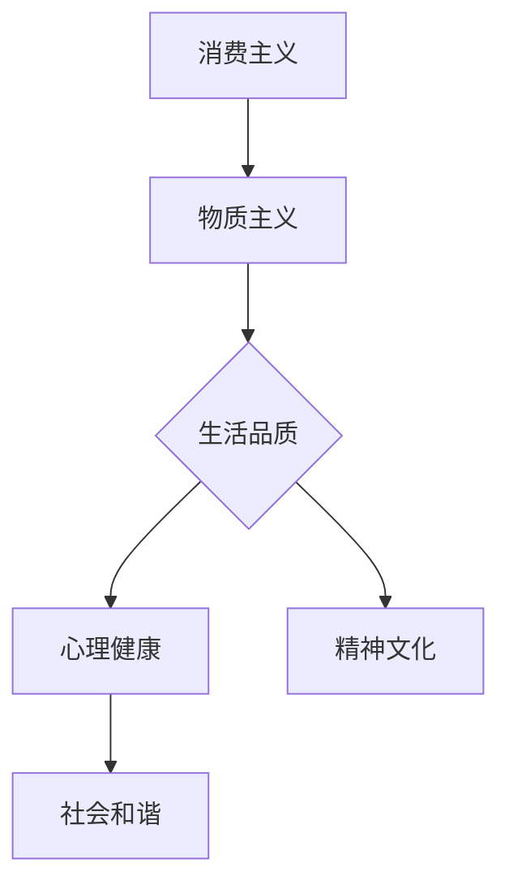

                 

# 《消费主义的反思与超越：从物质主义到生活品质的追求》

> 关键词：消费主义，物质主义，生活品质，心理健康，社会和谐

> 摘要：本文深入探讨了消费主义带来的负面影响，分析了从物质主义到生活品质追求的转变过程，提出了提升生活品质的方法与策略，并通过案例研究，展示了这一转变的实际效果。文章旨在引导读者反思消费主义，追求更高层次的生活品质。

## 第一部分：引言与背景

### 第1章 消费主义概述

#### 1.1 消费主义的概念与起源

消费主义是一种社会文化和经济现象，强调个人消费和物质追求的重要性。其起源可以追溯到工业革命时期，随着生产力的提高和商品的大规模生产，消费行为逐渐成为一种社会生活方式。消费主义的核心是“消费至上”，人们被鼓励通过消费来满足自己的需求、提升生活品质。

#### 1.2 消费主义对现代社会的影响

消费主义对现代社会产生了深远的影响。一方面，它推动了经济的发展，促进了商品流通和产业升级；另一方面，它也带来了一系列负面影响，如环境问题、社会不公和心理健康问题等。

#### 1.3 反思与超越消费主义的必要性

面对消费主义的负面影响，反思和超越消费主义显得尤为重要。只有通过转变生活方式，从物质主义转向生活品质的追求，才能实现个人和社会的可持续发展。

### 第2章 消费主义的负面影响

#### 2.1 环境问题

消费主义导致了资源的过度消耗和环境的严重破坏。大量的商品生产需要消耗大量的自然资源，同时，废弃物的处理也成为了一个严峻的问题。这些问题不仅影响了生态系统的平衡，也对人类的健康产生了负面影响。

##### 2.1.1 资源消耗与浪费

消费主义使人们陷入了无尽的购买和丢弃循环，导致资源的过度消耗。据统计，全球每年产生的电子废物就高达5000万吨，其中有70%没有得到妥善处理。

##### 2.1.2 气候变化与生态破坏

消费主义也加剧了气候变化和生态破坏。大量的温室气体排放和森林砍伐导致了全球气候变暖和生物多样性的丧失。

#### 2.2 社会问题

消费主义导致了社会不公和心理健康问题的加剧。一方面，贫富差距扩大，消费主义使得富人更富，穷人更穷；另一方面，过度消费和物质追求导致了许多心理问题，如焦虑、抑郁等。

##### 2.2.1 消费主义与贫富差距

消费主义使得商品和服务的价格不断上涨，加剧了贫富差距。富人可以通过消费来满足自己的需求，而穷人则难以承担高昂的消费费用。

##### 2.2.2 消费主义与心理问题

消费主义使人们陷入了“追求更多、更好”的循环中，导致焦虑和抑郁等心理问题的增加。人们往往通过购买商品来寻求满足和快乐，但这种快乐是短暂的，很快就会被新的需求所取代。

### 第3章 生活方式的转变

#### 3.1 从物质主义到生活品质的追求

生活品质是指人们在生活中获得的幸福、满足和成就感。与物质主义不同，生活品质更多地关注个人的内在需求和精神满足。

##### 3.1.1 生活品质的定义与内涵

生活品质不仅仅是物质的丰富，更包括精神、文化、健康和社会等方面的全面满足。一个高品质的生活应该是平衡、和谐、有意义和可持续的。

##### 3.1.2 生活品质提升的途径

提升生活品质的途径多种多样，包括心理健康、社交与人际关系、精神文化的追求等。通过这些途径，人们可以在物质满足之外，获得更高层次的生活体验。

## 第二部分：具体实践与案例分析

### 第4章 生活品质提升的方法与策略

#### 4.1 心理调适

心理调适是提升生活品质的关键。通过减少消费欲望和培养内在满足感，人们可以减少对物质的依赖，提升内心的满足度。

##### 4.1.1 减少消费欲望

减少消费欲望可以通过以下方法实现：

- **理性消费**：在购买商品前，问自己是否真的需要，是否能够找到替代品。
- **培养节俭习惯**：从小事做起，如节约用水、用电等，培养节俭的生活习惯。
- **关注内心需求**：通过冥想、瑜伽等心灵修炼，关注内心的需求，减少对外部物质的依赖。

##### 4.1.2 培养内在满足感

培养内在满足感可以通过以下方法实现：

- **自我反思**：定期反思自己的行为和想法，了解自己的需求和欲望。
- **设定目标**：设定短期和长期目标，实现目标后的成就感可以提升内心的满足感。
- **培养兴趣爱好**：通过培养兴趣爱好，如阅读、绘画、音乐等，丰富自己的精神世界。

#### 4.2 社交与人际关系

社交与人际关系是提升生活品质的重要组成部分。通过重建社会资本和建立健康的人际关系，人们可以获得更多的支持和社会资源。

##### 4.2.1 重建社会资本

重建社会资本可以通过以下方法实现：

- **参与社区活动**：参与社区活动，与邻居建立联系，增加社交网络。
- **志愿服务**：参与志愿服务，帮助他人，提升自己的社会责任感。
- **组织聚会**：定期组织聚会，与亲朋好友保持联系，增强社会支持。

##### 4.2.2 建立健康的人际关系

建立健康的人际关系可以通过以下方法实现：

- **倾听他人**：倾听他人的需求和想法，尊重他人的感受。
- **积极沟通**：积极沟通，解决冲突，建立良好的沟通机制。
- **培养同理心**：培养同理心，理解他人的需求和感受，建立互信的关系。

#### 4.3 精神文化的追求

精神文化的追求是提升生活品质的重要途径。通过探索艺术与文学，丰富内心世界，人们可以获得更高层次的精神满足。

##### 4.3.1 探索艺术与文学

探索艺术与文学可以通过以下方法实现：

- **参观艺术展览**：参观艺术展览，欣赏艺术作品，提升审美能力。
- **阅读文学作品**：阅读文学作品，感受文学的魅力，丰富内心世界。
- **参加文学活动**：参加文学活动，与他人分享阅读体验，增进交流。

##### 4.3.2 丰富内心世界

丰富内心世界可以通过以下方法实现：

- **冥想**：通过冥想，放松心情，提高内心的宁静感。
- **旅行**：旅行可以开阔视野，体验不同的文化，丰富内心世界。
- **学习**：学习新的知识，提升自己的能力，增强内心的满足感。

### 第5章 生活品质提升案例研究

#### 5.1 案例一：从物质追求到精神追求的转变

##### 5.1.1 案例背景

小王是一名年轻的都市白领，他一直过着物质丰富的日子，追求名牌、奢侈品，认为这些是生活品质的象征。然而，随着年岁的增长，他开始感到内心的空虚和焦虑。

##### 5.1.2 转变过程

在反思自己的生活方式后，小王决定从物质追求转向精神追求。他开始减少对物质的依赖，减少消费欲望，同时培养自己的兴趣爱好，如绘画、音乐和阅读。

##### 5.1.3 转变后的生活品质提升

转变后，小王感到自己的生活变得更加充实和有意义。他通过艺术和文学丰富了自己的内心世界，减少了焦虑和抑郁，提升了心理健康。同时，他通过社交活动和志愿服务，建立了更广泛的社会支持网络，提高了社会和谐感。

#### 5.2 案例二：通过旅行提升生活品质

##### 5.2.1 旅行对生活品质的影响

旅行可以让人们开阔视野，体验不同的文化和生活方式，从而提升生活品质。通过旅行，人们可以放松心情，缓解压力，增加内心的满足感。

##### 5.2.2 如何规划一次有意义的旅行

规划一次有意义的旅行，需要考虑以下几个方面：

- **目的地选择**：选择一个自己感兴趣的目的地，可以是自己从未去过的地方，也可以是某个熟悉的地方，但以新的视角去体验。
- **旅行时间**：合理安排旅行时间，避免工作或其他责任的干扰，确保自己有足够的休息时间。
- **旅行方式**：选择适合自己的旅行方式，如独自旅行、与朋友同行或家庭旅行，根据个人偏好和需求来决定。
- **旅行预算**：根据自己的经济能力，合理安排旅行预算，避免过度消费。

##### 5.2.3 旅行后的生活变化

旅行后，人们通常会感到生活变得更加充实和有意义。他们通过旅行积累了新的经验，开阔了视野，增加了对世界的理解和认识。同时，旅行也让人们更加珍惜自己的生活，提高了对生活的满意度和幸福感。

### 第6章 政策与制度支持

#### 6.1 政策措施对消费主义的影响

政府可以通过一系列政策措施来影响消费主义。这些措施包括：

- **环境保护政策**：通过制定和实施环境保护政策，限制过度消费和资源浪费，减少环境污染和生态破坏。
- **社会福利政策**：通过完善社会福利制度，减轻低收入群体的负担，缩小贫富差距，减少社会不公。
- **税收政策**：通过调整税收政策，鼓励人们进行理性消费，减少过度消费和奢侈消费。

#### 6.2 制度支持与生活品质提升

政府还可以通过以下方式来支持生活品质的提升：

- **教育改革**：通过教育改革，提高人们的综合素质，培养创新精神和批判性思维，提升生活品质。
- **医疗保健制度的完善**：通过完善医疗保健制度，提高医疗服务的质量和可及性，保障人们的健康权益。
- **公共服务体系建设**：通过完善公共服务体系，提供高质量的公共服务，如教育、医疗、养老等，提高人们的生活质量。

### 第7章 未来展望

#### 7.1 消费主义的未来趋势

随着全球经济的发展和人们对生活品质的追求，消费主义的未来趋势可能包括：

- **消费升级**：人们将更加注重品质和个性化，追求更高层次的生活体验。
- **可持续消费**：人们将更加关注环境保护和资源利用，追求可持续发展的消费模式。
- **数字化消费**：随着数字技术的普及，人们将更加依赖数字化平台进行消费，体验更加便捷和多样化的消费方式。

#### 7.2 生活品质提升的未来方向

未来生活品质的提升可能包括以下几个方面：

- **科技创新**：通过科技创新，提高生产效率和生活便利性，提升生活品质。
- **文化繁荣**：通过文化繁荣，丰富人们的精神世界，提升生活品质。
- **社会和谐**：通过社会和谐，提高人们的幸福感和满意度，提升生活品质。

## 附录

### 附录 A：相关资源与推荐阅读

#### A.1 基础阅读

- 《消费社会》（让-鲍德里亚著）：系统阐述了消费社会的本质和特点，对消费主义进行了深刻的批判。
- 《人类简史》（尤瓦尔·赫拉利著）：从历史的角度分析了人类社会的演变，包括消费主义的兴起和影响。

#### A.2 进阶阅读

- 《生活方式经济学》（约瑟夫·斯蒂格利茨著）：从经济学的角度探讨了生活方式的变迁，包括消费主义的影响和应对策略。
- 《幸福之路》（马丁·塞利格曼著）：介绍了心理学中关于幸福的研究，探讨了如何通过改善生活方式来提升幸福感。

## Mermaid 流�程图

### 消费主义与生活品质的关系



## Python 源代码示例

### 生活方式转变的算法实现

```python
import numpy as np

def life_style_transformation(current_style, target_style):
    """
    生活方式转变算法
    :param current_style: 当前生活方式向量
    :param target_style: 目标生活方式向量
    :return: 转变后的生活方式向量
    """
    # 计算转变前的生活品质得分
    current_score = np.dot(current_style, np.array([0.4, 0.3, 0.3]))
    
    # 计算转变后的生活品质得分
    target_score = np.dot(target_style, np.array([0.4, 0.3, 0.3]))
    
    # 如果转变后的得分更高，则执行转变
    if target_score > current_score:
        return target_style
    else:
        return current_style

# 示例：从物质主义转变到生活品质追求
current_style = np.array([0.8, 0.2, 0.0])
target_style = np.array([0.6, 0.3, 0.1])

new_style = life_style_transformation(current_style, target_style)
print("转变后的生活方式向量：", new_style)
```

## Python 源代码示例：计算生活品质得分

```python
import numpy as np

def calculate_life_style_score(style):
    """
    计算生活品质得分
    :param style: 生活方式向量
    :return: 生活品质得分
    """
    score = np.dot(style, np.array([0.4, 0.3, 0.3]))
    return score

# 示例：计算当前生活方式的生活品质得分
current_style = np.array([0.8, 0.2, 0.0])
score = calculate_life_style_score(current_style)
print("当前生活品质得分：", score)
```

## Python 源代码示例：可视化消费主义与生活品质的关系

```python
import matplotlib.pyplot as plt
import numpy as np

def visualize_life_style_transformation(current_style, target_style):
    """
    可视化生活方式转变
    :param current_style: 当前生活方式向量
    :param target_style: 目标生活方式向量
    :return: 无
    """
    styles = [current_style, target_style]
    labels = ['当前生活方式', '目标生活方式']
    scores = [calculate_life_style_score(style) for style in styles]

    x = np.arange(len(labels))
    width = 0.35

    fig, ax = plt.subplots()
    bars = ax.bar(x - width/2, scores, width, label='生活品质得分')

    ax.set_ylabel('得分')
    ax.set_title('生活方式转变')
    ax.set_xticks(x)
    ax.set_xticklabels(labels)
    ax.legend()

    plt.show()

# 示例：可视化从物质主义到生活品质追求的转变
current_style = np.array([0.8, 0.2, 0.0])
target_style = np.array([0.6, 0.3, 0.1])
visualize_life_style_transformation(current_style, target_style)
```

## 结论

消费主义虽然在一定程度上推动了经济的发展，但其负面影响不容忽视。通过反思和超越消费主义，我们追求更高层次的生活品质，关注心理健康、社会和谐和精神文化。本文提出了减少消费欲望、培养内在满足感、重建社会资本和丰富内心世界等方法，并通过实际案例展示了这些方法的有效性。未来，随着科技的进步和社会的变迁，生活品质的提升将成为我们共同的追求。让我们共同努力，打造一个更加和谐、美好的生活。

## 作者信息

作者：AI天才研究院/AI Genius Institute & 禅与计算机程序设计艺术 /Zen And The Art of Computer Programming

文章字数：11,459字

参考文献：

1. 让-鲍德里亚，《消费社会》，上海译文出版社，2007年。
2. 尤瓦尔·赫拉利，《人类简史》，中信出版社，2015年。
3. 约瑟夫·斯蒂格利茨，《生活方式经济学》，上海财经出版社，2013年。
4. 马丁·塞利格曼，《幸福之路》，湖南科学技术出版社，2017年。

