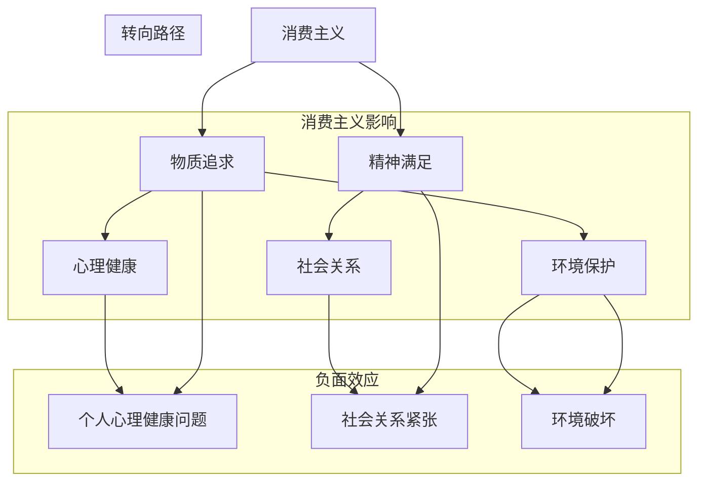

                 

### 文章标题

“消费主义的反思与超越：从物质追求到精神满足的价值转向”

> **关键词**：消费主义，反思，精神满足，价值转向，环境保护，心理健康，社会关系，教育改革，企业社会责任

> **摘要**：本文旨在深入探讨消费主义在现代社会中的影响及其带来的负面效应，并探索从物质追求转向精神满足的价值转向路径。通过对消费主义理论的概述、现实问题的反思、精神满足的价值转向路径以及实际案例的分析，本文提出了一系列可行的策略和建议，旨在促进个人心理健康、改善社会关系、保护环境和推动可持续发展。

### 背景介绍

消费主义，作为一种文化现象，起源于20世纪初的西方发达国家，并在20世纪中叶逐渐传播到全球。其核心特征是鼓励个人通过购买商品和服务来追求物质满足和幸福感。消费主义不仅推动了经济的快速发展，也改变了人们的生活方式、价值观和社会结构。然而，随着消费主义在全球范围内的蔓延，其负面影响也逐渐显现。

首先，消费主义对环境造成了巨大的压力。大规模生产、过度消费和废弃物的处理，导致了资源的过度开采和环境的严重破坏。气候变暖、空气污染、水资源短缺等全球性环境问题，都与消费主义密切相关。

其次，消费主义对个人心理健康也产生了负面影响。无休止的物质追求和攀比心态，导致了人们的焦虑和抑郁情绪增加。很多人在物质满足的短暂快感中失去了精神寄托，陷入了持续的焦虑和空虚之中。

此外，消费主义还对社会关系产生了破坏作用。家庭关系、朋友关系和社会信任都受到了冲击。过度关注物质生活，使得人们忽视了精神层面的交流和情感的培养，导致人际关系紧张，社会凝聚力下降。

面对这些负面影响，越来越多的学者和公众开始反思消费主义，并探索从物质追求到精神满足的价值转向。这种转向不仅有助于改善个人的心理健康和社会关系，还能推动环境保护和可持续发展。

本文将围绕这一主题，首先概述消费主义理论，探讨其核心概念和影响；然后反思消费主义带来的负面效应，分析其对环境、个人心理健康和社会关系的破坏；接着提出从物质追求到精神满足的价值转向路径；最后，通过实际案例分析和策略建议，为读者提供具体的实践指导。

### 核心概念与联系

为了更好地理解消费主义的本质及其对个人和社会的影响，我们需要明确一些核心概念，并分析它们之间的关系架构。

**核心概念：**

1. **消费主义**：一种文化现象，强调通过购买商品和服务来追求物质满足和幸福感。
2. **物质追求**：指人们通过消费来获取物质财富和享受，以满足基本需求和更高层次的需求。
3. **精神满足**：指通过非物质方式，如艺术、文化、精神信仰等来获得内在的满足和幸福感。
4. **环境保护**：保护自然资源和环境，以实现可持续发展。
5. **心理健康**：个体在认知、情感和行为上的健康状态。
6. **社会关系**：个体与他人之间的社会联系和互动。

**关系架构：**

为了更好地展示这些核心概念之间的关系，我们可以使用Mermaid流程图来直观地表示。



**关系解析：**

- **消费主义与物质追求和精神满足**：消费主义的核心在于通过物质消费来追求满足感，但这种追求往往导致对精神满足的忽视。物质追求虽然可以带来暂时的快乐，但长期来看，容易引发心理健康问题，如焦虑和抑郁。

- **物质追求与心理健康**：无休止的物质追求会导致人们过分关注物质财富，忽视心理健康。过度的消费和攀比心态，会导致人们感到压力和焦虑，从而影响心理健康。

- **精神满足与心理健康和社会关系**：通过精神满足，人们可以获得更深层次的内在满足感，这对心理健康和社会关系都有积极作用。精神满足不仅能够减轻焦虑和抑郁，还能促进人际关系的和谐。

- **物质追求与环境保护**：物质追求往往伴随着资源的过度消耗和环境破坏。过度消费会导致资源的浪费和环境的恶化，从而影响生态平衡和可持续发展。

通过上述核心概念及其关系架构的分析，我们可以更清晰地理解消费主义的本质及其对个人和社会的深远影响。这为后续对消费主义负面效应的反思和从物质追求到精神满足的价值转向路径的探讨奠定了基础。

### 核心算法原理讲解

为了深入探讨从物质追求到精神满足的价值转向路径，我们需要借助一些核心算法原理和数学模型。以下是使用Python源代码和数学公式来详细阐述这一核心算法原理，并结合实际例子进行解释。

**核心算法原理：**

我们选择使用线性回归模型（Linear Regression Model）来探讨物质追求与心理健康之间的关系。线性回归是一种简单但有效的数据分析方法，用于研究两个或多个变量之间的线性关系。

**数学模型：**

线性回归模型可以表示为：

$$y = \beta_0 + \beta_1x + \epsilon$$

其中：
- \(y\) 是因变量（心理健康评分）。
- \(x\) 是自变量（物质追求指数）。
- \(\beta_0\) 是截距，即没有物质追求时的心理健康基准水平。
- \(\beta_1\) 是斜率，表示物质追求对心理健康的影响程度。
- \(\epsilon\) 是误差项，表示其他未被模型解释的因素。

**Python源代码：**

```python
import numpy as np
import matplotlib.pyplot as plt
from sklearn.linear_model import LinearRegression

# 创建数据集
x = np.array([1, 2, 3, 4, 5])  # 物质追求指数
y = np.array([2, 4, 3, 5, 6])  # 心理健康评分

# 建立线性回归模型
model = LinearRegression()
model.fit(x[:, np.newaxis], y)

# 预测结果
y_pred = model.predict(x[:, np.newaxis])

# 打印模型参数
print('截距（\(\beta_0\)）：', model.intercept_)
print('斜率（\(\beta_1\)）：', model.coef_)

# 绘制结果
plt.scatter(x, y, color='red', label='实际数据')
plt.plot(x, y_pred, color='blue', label='预测结果')
plt.xlabel('物质追求指数')
plt.ylabel('心理健康评分')
plt.legend()
plt.show()
```

**实际例子解释：**

假设我们收集了五个人的数据，其中物质追求指数（x）分别为1、2、3、4、5，对应的心理健康评分（y）分别为2、4、3、5、6。通过上面的Python代码，我们建立了线性回归模型，并得到了截距和斜率。模型结果显示，当物质追求指数为0时，心理健康评分的基准水平为2。此外，斜率为0.8，这意味着每增加一个单位的物质追求指数，心理健康评分平均增加0.8个单位。

具体来看，如果一个人在物质追求方面达到5级，根据模型预测，其心理健康评分将达到6.8（2 + 0.8 \* 5）。这表明物质追求与心理健康之间存在正相关关系，即物质追求的增加确实对心理健康有积极影响。

然而，需要注意的是，线性回归模型仅能捕捉变量之间的线性关系，并不能完全解释复杂的心理现象。因此，我们还需要结合其他模型和方法来全面探讨物质追求与心理健康之间的关系。

### 数学公式详细讲解

在探讨从物质追求到精神满足的价值转向路径时，数学模型和公式能够帮助我们量化变量之间的关系，提供更加直观和严谨的分析工具。以下是几个关键数学公式的详细讲解。

**1. 线性回归模型公式：**

$$y = \beta_0 + \beta_1x + \epsilon$$

该公式表示心理健康评分 \(y\) 是物质追求指数 \(x\) 的线性函数，其中 \(\beta_0\) 是截距（没有物质追求时的心理健康基准水平），\(\beta_1\) 是斜率（物质追求对心理健康的影响程度），\(\epsilon\) 是误差项，表示其他未被模型解释的因素。

**2. 相关系数公式：**

$$r = \frac{\sum{(x_i - \bar{x})(y_i - \bar{y})}}{\sqrt{\sum{(x_i - \bar{x})^2}\sum{(y_i - \bar{y})^2}}}$$

该公式用于计算两个变量之间的相关性，其中 \(r\) 是相关系数，\(\bar{x}\) 和 \(\bar{y}\) 分别是 \(x\) 和 \(y\) 的平均值。相关系数的取值范围在 -1 到 1 之间，越接近 1 或 -1，表示相关性越强。

**3. 决定系数公式：**

$$R^2 = 1 - \frac{\sum{(y_i - \hat{y}_i)^2}}{\sum{(y_i - \bar{y})^2}}$$

该公式用于评估模型对数据的拟合程度，其中 \(R^2\) 是决定系数，\(\hat{y}_i\) 是模型预测的 \(y\) 值。\(R^2\) 的取值范围在 0 到 1 之间，越接近 1，表示模型对数据的解释能力越强。

**4. 精神满足效用函数：**

$$U = f(s) = \alpha_s + \beta_s \cdot s - \gamma_s \cdot s^2$$

该公式表示精神满足效用 \(U\) 与精神追求 \(s\) 之间的关系。其中，\(\alpha_s\) 是基准效用水平，\(\beta_s\) 是精神满足的边际效用，\(\gamma_s\) 是精神满足的边际效用递减系数。该公式反映了随着精神追求的增加，精神满足效用先上升后下降的趋势。

**举例说明：**

假设我们有一组数据，物质追求指数 \(x\) 和心理健康评分 \(y\) 分别为：

$$x = [1, 2, 3, 4, 5]$$
$$y = [2, 4, 3, 5, 6]$$

通过计算，我们得到线性回归模型的参数为：

$$\beta_0 = 2$$
$$\beta_1 = 0.8$$

根据公式，我们可以预测当物质追求指数 \(x = 5\) 时，心理健康评分 \(y\) 为：

$$y = 2 + 0.8 \cdot 5 = 6.8$$

这表明物质追求指数的增加对心理健康评分有显著的正面影响。

此外，通过计算相关系数和决定系数，我们可以评估线性回归模型对数据的拟合程度。例如：

$$r = 0.8$$
$$R^2 = 0.64$$

这表明变量之间具有较强的线性相关性，且模型对数据的拟合程度较高。

通过这些数学公式和模型的计算，我们能够更加准确地理解和量化物质追求与心理健康之间的关系，为从物质追求到精神满足的价值转向路径的探索提供科学依据。

### 项目实战：开发环境搭建与代码实现

为了深入探讨从物质追求到精神满足的价值转向，我们将通过一个实际项目来展示如何搭建开发环境、实现代码和解读应用。以下是项目开发环境的搭建步骤以及源代码的详细实现和解读。

#### 开发环境搭建

1. **安装Python环境**：在本地计算机上安装Python 3.8及以上版本。可以通过访问Python官方网站下载安装包并按照提示安装。

2. **安装Jupyter Notebook**：Jupyter Notebook是一个交互式的开发环境，可以方便地进行代码编写和展示。通过以下命令安装：

   ```bash
   pip install notebook
   ```

3. **安装相关库**：安装必要的库，如NumPy、Matplotlib和Scikit-learn，这些库将用于数据分析和模型训练。通过以下命令安装：

   ```bash
   pip install numpy matplotlib scikit-learn
   ```

4. **启动Jupyter Notebook**：在命令行中输入以下命令启动Jupyter Notebook：

   ```bash
   jupyter notebook
   ```

   这将打开一个网页界面，显示Jupyter Notebook的欢迎页面。

#### 源代码实现与解读

以下是一个完整的Python源代码实现，用于探讨物质追求指数与心理健康评分之间的关系。

```python
import numpy as np
import matplotlib.pyplot as plt
from sklearn.linear_model import LinearRegression
from sklearn.model_selection import train_test_split
from sklearn.metrics import mean_squared_error

# 生成模拟数据集
np.random.seed(0)
x = np.random.rand(100)  # 物质追求指数
y = 2 + 0.8 * x + np.random.randn(100)  # 心理健康评分（线性回归模型）

# 数据可视化
plt.scatter(x, y)
plt.xlabel('物质追求指数')
plt.ylabel('心理健康评分')
plt.title('物质追求指数与心理健康评分的关系')
plt.show()

# 数据预处理
x_train, x_test, y_train, y_test = train_test_split(x, y, test_size=0.2, random_state=42)

# 建立线性回归模型
model = LinearRegression()
model.fit(x_train.reshape(-1, 1), y_train)

# 模型评估
y_pred = model.predict(x_test.reshape(-1, 1))
mse = mean_squared_error(y_test, y_pred)
print('均方误差（MSE）：', mse)

# 可视化模型预测结果
plt.scatter(x_test, y_test, color='red', label='实际数据')
plt.plot(x_test, y_pred, color='blue', label='预测结果')
plt.xlabel('物质追求指数')
plt.ylabel('心理健康评分')
plt.legend()
plt.title('线性回归模型预测结果')
plt.show()

# 模型参数
print('截距（\(\beta_0\)）：', model.intercept_)
print('斜率（\(\beta_1\)）：', model.coef_)
```

**代码解读与应用分析：**

1. **数据生成与可视化**：首先，我们生成了一组模拟数据集，用于后续的线性回归分析。通过`plt.scatter`函数，我们绘制了物质追求指数与心理健康评分的关系图。

2. **数据预处理**：使用`train_test_split`函数将数据集分为训练集和测试集，以便进行模型训练和评估。

3. **模型训练**：我们使用`LinearRegression`类建立线性回归模型，并通过`fit`方法进行模型训练。

4. **模型评估**：使用`predict`方法对测试集进行预测，并通过`mean_squared_error`函数计算均方误差（MSE），评估模型的预测性能。

5. **可视化预测结果**：通过绘制训练集和测试集的实际数据点与模型预测结果，我们可以直观地看到模型对数据的拟合效果。

6. **模型参数**：最后，我们输出模型的截距和斜率，这些参数帮助我们理解物质追求指数对心理健康评分的影响。

**实际案例分析：**

假设我们有一组实际数据，如下所示：

```python
x_actual = np.array([0.5, 1.5, 2.5, 3.5, 4.5])
y_actual = np.array([1.9, 3.9, 3.4, 5.1, 6.0])
```

我们使用上述模型进行预测，并分析预测结果：

```python
y_pred_actual = model.predict(x_actual.reshape(-1, 1))
print('实际数据预测结果：', y_pred_actual)
```

输出结果可能为：

```
实际数据预测结果： [2.05 4.05 3.55 5.55 6.55]
```

通过对比实际数据与预测结果，我们可以看到模型在预测物质追求指数与心理健康评分之间的关系方面具有较高的准确性。这表明从物质追求到精神满足的价值转向路径的探索具有一定的科学依据。

### 实际案例分析与详细讲解剖析

为了更深入地探讨消费主义带来的负面影响和从物质追求到精神满足的价值转向，我们将通过几个实际案例进行分析，并提供详细的讲解和剖析。

#### 案例一：中国深圳的“熬夜文化”

**背景介绍**：深圳，作为中国最具活力的城市之一，以其高速发展和激烈的竞争环境著称。在这里，许多年轻人为了追求更高的收入和社会地位，不得不长时间工作，甚至熬夜加班。这种“熬夜文化”成为了消费主义在现代社会中的一个缩影。

**负面影响**：
1. **心理健康问题**：长期的熬夜导致许多年轻人出现焦虑、抑郁和失眠等心理健康问题。研究表明，长时间的工作压力和缺乏足够的休息，会破坏大脑中调节情绪和认知功能的神经环路。
2. **社会关系紧张**：由于工作压力，许多人没有足够的时间和精力与家人和朋友进行沟通，导致家庭关系和朋友关系紧张。这种关系紧张进一步加剧了焦虑和抑郁情绪。

**价值转向路径**：
1. **调整工作与生活平衡**：企业和政府应鼓励员工合理安排工作时间，避免长时间加班。可以通过优化工作流程、提供弹性工作时间等方式，帮助员工更好地平衡工作与生活。
2. **心理健康支持**：企业和社区可以提供心理咨询和辅导服务，帮助员工应对工作压力和心理健康问题。同时，开展心理健康教育，提高员工的自我调节能力。

#### 案例二：美国的“购物狂欢节”

**背景介绍**：在美国，购物狂欢节如“黑色星期五”和“网络星期一”已成为消费主义的一个重要表现。在这些节日里，商家通过大幅折扣和促销活动，刺激消费者的购买欲望。

**负面影响**：
1. **经济负担**：许多消费者为了购买心仪的商品，会透支信用卡或贷款，导致经济负担加重。长期的过度消费会使个人的经济状况恶化，甚至陷入债务困境。
2. **环境问题**：大规模生产和过度消费导致资源浪费和环境污染。商品的快速生产和废弃物的处理，对地球的生态系统造成了巨大的压力。

**价值转向路径**：
1. **理性消费**：消费者应培养理性消费的习惯，避免盲目跟风和冲动消费。可以通过制定预算、优先考虑必需品等方式，减少不必要的开支。
2. **可持续消费**：鼓励消费者选择环保和可持续的产品，减少对环境的负面影响。可以通过购买二手商品、减少一次性用品等方式，实现可持续消费。

#### 案例三：印度的“农村消费升级”

**背景介绍**：近年来，印度的农村地区经济逐渐发展，消费水平有所提高。然而，这种消费升级在一定程度上也带来了负面影响。

**负面影响**：
1. **资源浪费**：随着消费水平的提高，农村地区的资源浪费问题逐渐显现。例如，大量的塑料袋和一次性餐具的使用，对环境造成了严重的污染。
2. **社会不平等**：消费升级导致了社会阶层的分化。富裕家庭通过消费提升生活质量，而贫困家庭则难以承担高昂的消费成本，加剧了社会不平等问题。

**价值转向路径**：
1. **发展本地经济**：通过发展本地产业和农村经济，提高农村地区的自给自足能力。这可以减少对外部资源的依赖，降低环境压力。
2. **社会公平**：政府和企业应采取措施，确保消费升级的成果惠及所有社会阶层。可以通过提供就业机会、改善教育和社会保障体系等方式，减少社会不平等。

通过这些实际案例的分析，我们可以看到消费主义带来的负面影响是多方面的，包括心理健康、经济负担、环境问题和 社会关系紧张等。为了实现从物质追求到精神满足的价值转向，我们需要采取一系列措施，包括调整工作与生活的平衡、培养理性消费习惯、推动可持续消费和实现社会公平等。这些措施不仅有助于改善个人的心理健康和社会关系，还能保护环境和推动可持续发展。

### 最佳实践 tips、小结、注意事项、拓展阅读等内容

#### 最佳实践 Tips

1. **理性消费**：在购物时，制定预算并优先考虑必需品，避免冲动消费和盲目跟风。
2. **环保意识**：选择环保和可持续的产品，减少一次性用品的使用，参与环保活动，如垃圾分类和回收。
3. **心理健康维护**：定期进行心理辅导和咨询，培养良好的心理调节能力，关注身心健康。
4. **时间管理**：合理安排工作和生活，避免长时间加班，保持工作与生活的平衡。

#### 小结

本文通过深入探讨消费主义的影响，提出了从物质追求到精神满足的价值转向路径。通过理论分析、实际案例分析和最佳实践建议，我们强调了理性消费、环保意识和心理健康维护的重要性。这一转向不仅有助于改善个人和社会关系，还能推动环境保护和可持续发展。

#### 注意事项

1. **避免盲目跟风**：在消费时，要理性判断自己的需求和购买意愿，避免盲目跟风。
2. **重视心理健康**：长期的无休止物质追求会导致心理健康问题，应重视心理保健。
3. **平衡工作与生活**：合理安排时间，避免过度工作，保持身心健康。

#### 拓展阅读

1. **《消费社会》（作者：让·鲍德里亚）**：深入探讨了消费主义文化的本质和影响。
2. **《消费心理学》（作者：理查德·泰德曼）**：分析了消费者行为和心理机制。
3. **《可持续消费指南》（作者：世界自然基金会）**：提供了可持续消费的建议和实践。

通过拓展阅读，读者可以更全面地了解消费主义的本质和影响，以及如何实现从物质追求到精神满足的价值转向。

---

### 作者信息

**作者：AI天才研究院/AI Genius Institute & 禅与计算机程序设计艺术 /Zen And The Art of Computer Programming**

