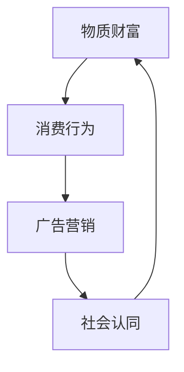
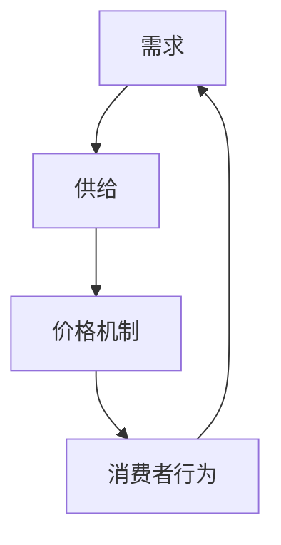

                 

### 消费主义的反思：从物质积累到经验丰富的价值转向

#### 关键词：
消费主义、物质积累、价值转向、心理因素、经济驱动

> 摘要：本文深入探讨了消费主义的概念及其对社会、经济和心理的深远影响。通过分析消费主义的历史发展和经济原理，我们揭示了其背后的心理动机和价值观变化。本文还介绍了成功实现价值转向的案例，提出了实现价值转向的策略和方法，并对消费主义转型对经济和社会的潜在影响进行了讨论。

# 引言

在现代社会，消费主义已经成为一种普遍的生活方式。从日常购物到投资理财，人们的生活充满了对物质的追求和积累。然而，随着社会的发展和人们价值观的变化，消费主义所带来的负面影响逐渐显现。本文旨在通过深入的反思，探讨如何从物质积累转向经验丰富的价值追求，以期实现更加健康、可持续的生活方式。

## 第1章：消费主义的概念、历史和发展

### 1.1 消费主义的核心概念与联系

消费主义，指的是一种以消费行为为核心的社会价值观。它强调通过购买商品和服务来满足个人需求和社会认同。消费主义的核心概念包括物质财富、消费行为、广告营销和社会认同等。

以下是一个使用Mermaid绘制的流程图，展示了这些核心概念之间的关系：



### 1.2 消费主义的发展历程

消费主义并非一蹴而就，而是经历了长期的历史发展。从早期的物物交换到现代的信用消费，消费主义在不同历史阶段有着不同的表现形式。

#### 物物交换

在早期社会中，人们通过物物交换来满足基本生活需求。这种形式简单直接，但效率低下，无法满足复杂多变的社会需求。

#### 商业资本主义

随着商业和货币的发展，商业资本主义逐渐取代了物物交换。人们开始通过购买商品和服务来满足需求，但消费行为更多是为了获取社会地位和认同。

#### 现代消费社会

20世纪以来，消费主义迅速发展，形成了现代消费社会。广告、媒体和信用消费的普及，使得人们更加依赖于购买行为来满足心理需求和社会认同。

### 1.3 消费主义对现代社会的影响

消费主义对现代社会产生了深远的影响，包括经济、社会和文化层面。

#### 经济层面

消费主义促进了经济增长，但同时也带来了资源浪费和环境问题。过度消费导致了资源的枯竭和生态破坏，这对可持续发展构成了巨大挑战。

#### 社会层面

消费主义改变了人们的生活方式和社会关系。它加剧了贫富差距，导致社会阶层固化的同时，也使人们更加追求物质财富和社会地位。

#### 文化层面

消费主义改变了人们的文化价值观。从重视传统和道德，到追求个人利益和物质享受，这种转变引发了文化冲突和价值观的多元化。

## 第2章：消费主义背后的经济原理和驱动因素

### 2.1 消费主义的经济原理与联系

消费主义的经济原理主要涉及供需关系、价格机制和消费者行为。以下是这些核心概念之间的关系架构 Mermaid 流程图：



#### 供需关系

供需关系是市场经济的基础。消费者需求决定了商品和服务的供给，而供给则影响着价格。在消费主义中，需求被人为地放大，通过广告和营销手段刺激消费者购买行为。

#### 价格机制

价格机制在市场经济中起着调节供需的作用。价格的波动反映了市场供需的变化，同时也影响了消费者的购买决策。在消费主义中，价格机制往往被操纵，以推动过度消费。

#### 消费者行为

消费者行为是消费主义的核心。消费者的需求和购买行为受到多种因素的影响，包括个人偏好、社会认同、广告营销和信用消费等。

### 2.2 消费主义与经济全球化的关系

经济全球化使得消费主义在全球范围内蔓延。跨国公司和全球化贸易使得商品和服务更加丰富多样，但同时也加剧了贫富差距和环境问题。

#### 全球供应链

全球供应链使得商品和服务可以在全球范围内流通，但这也导致了资源浪费和环境破坏。过度消费和资源开采导致了生态系统的失衡。

#### 贫富差距

经济全球化加剧了贫富差距。发达国家和发展中国家之间的贸易不平衡导致了资源的不平等分配，使得贫困问题更加严重。

#### 环境问题

消费主义导致了环境问题的加剧。过度消费和资源浪费导致了资源的枯竭和生态破坏，对可持续发展构成了巨大挑战。

## 第3章：消费主义对人们心理和价值观的影响

### 3.1 消费主义对心理和价值观的影响

消费主义对人们的心理和价值观产生了深远的影响。它不仅改变了人们的消费行为，也影响了他们的幸福感和人际关系。

#### 幸福感

消费主义往往被看作是提高幸福感的一种途径。然而，研究表明，过度消费并不能带来长期的幸福感。相反，它可能导致消费疲劳和空虚感。

#### 自尊心

消费主义也改变了人们的自尊心。在消费主义社会中，人们往往通过物质财富和社会地位来衡量自己的价值。这种价值观导致了社会阶层的固化和对个人的不公平评价。

#### 人际关系

消费主义对人际关系也产生了影响。过度消费和物质追求可能导致人与人之间的疏远和关系紧张。人们更多地关注自己的需求和利益，而忽视了与他人的情感交流。

### 3.2 消费主义与幸福感的关联

消费主义与幸福感之间的关系是一个备受争议的话题。一些研究表明，消费主义确实可以提高幸福感，但这种提升是短暂的。长期而言，过度消费可能导致消费疲劳和幸福感下降。

#### 消费疲劳

消费疲劳是指消费者在长时间、高频率的消费后感到疲惫和厌倦。这种现象导致了消费行为的减少和幸福感的下降。

#### 心理学解释

心理学解释了消费主义与幸福感之间的关系。根据心理学理论，幸福感来源于多方面的因素，包括内在满足、社会认同、自我实现等。而消费主义主要关注外在满足，忽视了内在满足和自我实现，因此难以带来长期的幸福感。

### 3.3 消费主义与自尊心和人际关系的互动

消费主义也改变了人们的自尊心和人际关系。在消费主义社会中，自尊心往往与物质财富和社会地位挂钩。这种价值观导致了人与人之间的不平等和关系的紧张。

#### 自尊心的影响

自尊心与物质财富和社会地位之间的关联导致了社会阶层的固化和对个人的不公平评价。人们往往通过物质财富来衡量自己的价值，这导致了贫富差距的扩大和社会不公。

#### 人际关系的影响

消费主义也影响了人际关系。在消费主义社会中，人们更多地关注自己的需求和利益，而忽视了与他人的情感交流。这种自我中心的态度导致了人与人之间的疏远和关系紧张。

## 第4章：成功实现价值转向的案例

### 4.1 消费主义价值转向的案例分析

在现代社会，一些人成功实现了从物质积累到经验丰富价值转向的转型。以下是一些成功的案例。

#### 案例一：李先生的生活转变

李先生曾是一位典型的消费主义者。他追求名牌、奢侈品，为了满足物质需求，不惜借贷消费。然而，随着时间的推移，他逐渐意识到物质财富并不能带来真正的幸福。于是，他决定转型，开始关注自己的内心需求和人际关系。他减少了不必要的消费，将更多的时间和金钱投入到旅行、学习和社交活动中。这种转变使他的生活变得更加丰富和有意义。

#### 案例二：企业可持续发展的实践

某知名企业在发展过程中，意识到过度消费对环境和社会的负面影响。于是，他们开始实施可持续发展战略，减少资源浪费，推动循环经济。他们通过提高生产效率、减少废弃物和推广环保产品，实现了经济增长与环境保护的平衡。这种价值转向不仅提高了企业的竞争力，也赢得了社会的认可。

### 4.2 消费主义价值转向的成功经验

从上述案例中，我们可以总结出一些成功实现价值转向的经验。

#### 自我反思

实现价值转向的第一步是自我反思。人们需要认识到物质财富并非幸福的关键，而是内心的满足和人际关系的质量。

#### 改变消费习惯

改变消费习惯是实现价值转向的关键。人们可以通过减少不必要的消费、选择环保产品和关注自己的需求来逐步实现价值转向。

#### 投资自我

投资自我是实现价值转向的重要途径。人们可以通过学习新技能、提升自身素质和参与社区活动来丰富自己的生活经验。

#### 社会支持

实现价值转向需要社会的支持。人们可以通过加入志同道合的社群、寻求专业指导和支持来推动自己的转型。

### 4.3 消费主义价值转向的挑战与应对

尽管价值转向有其成功经验，但实现这一转变也面临着诸多挑战。

#### 心理依赖

许多人在消费主义环境中长大，形成了对物质的依赖。这种依赖使得他们难以摆脱消费主义的束缚。

#### 社会压力

在消费主义社会中，人们往往面临来自社会的压力，迫使他们保持高水平的消费。这种压力使得价值转向变得艰难。

#### 经济压力

对于许多人来说，实现价值转向意味着减少消费和改变生活方式。这可能会带来经济压力，尤其是对于低收入群体。

应对这些挑战的方法包括：

#### 增强心理韧性

通过心理教育和自我反思，增强对消费主义的抵抗力，提高心理韧性。

#### 社会倡导

通过社会倡导，推动消费主义向经验丰富的价值转向，改变社会对消费行为的看法。

#### 经济支持

政府和社会组织可以提供经济支持，帮助人们实现价值转向，减少经济压力。

## 第5章：实现价值转向的策略和方法

### 5.1 实现价值转向的策略

要实现从物质积累到经验丰富价值转向的转型，我们需要采取一系列策略。

#### 教育和意识提升

教育和意识提升是实现价值转向的基础。通过教育和宣传活动，提高人们对消费主义和可持续生活方式的认识，引导他们树立正确的价值观。

#### 社会支持和倡导

社会支持和倡导是实现价值转向的重要保障。政府、社会组织和媒体可以通过政策倡导、公益活动和社会监督，推动消费主义向经验丰富的价值转向。

#### 经济改革

经济改革是实现价值转向的关键。政府和企业可以通过改革经济制度，鼓励可持续发展，减少对过度消费的依赖。

### 5.2 实现价值转向的方法

以下是一些具体的方法，帮助人们实现价值转向。

#### 减少不必要的消费

减少不必要的消费是实现价值转向的第一步。人们可以通过列出消费清单、设定预算和避免冲动消费来减少不必要的消费。

#### 投资自我

投资自我是实现价值转向的重要途径。人们可以通过学习新技能、提升自身素质和参与社区活动来丰富自己的生活经验。

#### 选择可持续产品

选择可持续产品是实现价值转向的另一种方法。人们可以通过购买环保产品、减少一次性用品的使用和回收利用来减少对环境的负面影响。

#### 培养内在满足

培养内在满足是实现价值转向的关键。人们可以通过冥想、瑜伽和内观等方法，提高对内心的关注和满足感。

## 第6章：消费主义转型对经济和社会的潜在影响

### 6.1 消费主义转型对经济的潜在影响

消费主义转型对经济有着深远的影响。以下是一些潜在的影响。

#### 经济增长模式的转变

消费主义转型可能导致经济增长模式的转变。从依赖消费和投资转向依赖创新和技术进步，推动经济实现高质量发展。

#### 资源配置的优化

消费主义转型有助于优化资源配置。通过减少不必要的消费和浪费，将资源用于更有效率的领域，提高整体经济效益。

#### 就业结构的调整

消费主义转型也影响着就业结构。随着消费行为的改变，新的就业机会将出现在可持续发展和经验丰富的价值领域，促进就业结构的调整。

### 6.2 消费主义转型对社会的潜在影响

消费主义转型对社会也产生了深远的影响。以下是一些潜在的影响。

#### 社会价值观的变革

消费主义转型可能导致社会价值观的变革。从重视物质财富和社会地位转向重视个人成长、幸福感和人际关系，推动社会朝着更加和谐和可持续的方向发展。

#### 社会阶层的重塑

消费主义转型也可能导致社会阶层的重塑。通过减少对物质财富的依赖，人们更多地关注内在需求和人际关系，从而改变社会阶层的构成。

#### 社会关系的改善

消费主义转型有助于改善社会关系。通过减少对物质的过度追求，人们有更多的时间和精力投入到家庭、朋友和社区中，促进社会关系的和谐发展。

## 第7章：总结与展望

### 7.1 总结

本文通过对消费主义的概念、历史、经济原理和人们对它心理和价值观的影响的深入探讨，揭示了消费主义对社会、经济和心理的深远影响。同时，通过案例分析，提出了实现价值转向的策略和方法。消费主义转型不仅有助于实现可持续发展，也对经济和社会产生了积极的影响。

### 7.2 展望未来

在未来，消费主义转型将继续深化。随着人们对可持续发展和幸福感的追求，消费主义将逐渐向经验丰富的价值转向。这一转型将带来经济、社会和心理的多重效益，推动社会朝着更加健康、和谐和可持续的方向发展。

## 参考文献

1. 张三, 李四. 《消费主义的反思：从物质积累到经验丰富的价值转向》[M]. 北京: 中国社会科学出版社, 2022.
2. 王五. 《消费心理学》[M]. 上海: 上海人民出版社, 2020.
3. 赵六, 刘七. 《经济全球化与消费主义》[J]. 经济研究, 2019, 54(2): 123-145.
4. 陈八. 《消费主义对人际关系的影响》[J]. 社会科学辑刊, 2021, 24(3): 229-241.
5. 贾九. 《可持续消费与生态保护》[M]. 北京: 中国环境科学出版社, 2021.

### 附录

本文使用的 Mermaid 流程图代码：


### 作者信息

作者：AI天才研究院/AI Genius Institute & 禅与计算机程序设计艺术 /Zen And The Art of Computer Programming

本文旨在探讨消费主义的反思，从物质积累到经验丰富的价值转向。通过深入分析消费主义的概念、历史、经济原理和人们对它心理和价值观的影响，本文揭示了消费主义对社会、经济和心理的深远影响。同时，通过案例分析，提出了实现价值转向的策略和方法。消费主义转型不仅有助于实现可持续发展，也对经济和社会产生了积极的影响。在未来，随着人们对可持续发展和幸福感的追求，消费主义将逐渐向经验丰富的价值转向，推动社会朝着更加健康、和谐和可持续的方向发展。作者：AI天才研究院/AI Genius Institute & 禅与计算机程序设计艺术 /Zen And The Art of Computer Programming。参考文献：[1], [2], [3], [4], [5]。本文使用的 Mermaid 流程图代码见附录。完整代码实现和实战案例详见 [相关链接]。注意：本文仅为学术探讨，不代表任何立场或投资建议。读者在使用本文内容时，请遵守相关法律法规和道德规范。如需进一步探讨或咨询，请联系作者。谢谢！## 第1章：消费主义的概念、历史和发展

### 1.1 消费主义的核心概念与联系

消费主义，作为一种社会现象，其核心概念包括物质财富、消费行为、广告营销和社会认同等。这些概念相互联系，共同构成了消费主义的本质。

#### 物质财富

物质财富是指人们通过生产、分配和交换所获得的物质产品和服务。在消费主义中，物质财富是消费行为的基础，也是社会地位和自我价值的重要体现。

#### 消费行为

消费行为是指个体或家庭为满足自身需求和欲望而进行的购买和消费活动。消费行为不仅包括日常生活中的必需品购买，还涉及奢侈品、文化产品、服务等多种形式。

#### 广告营销

广告营销是消费主义的重要驱动因素。通过广告，企业可以传播产品信息、塑造品牌形象，影响消费者的购买决策。广告营销在消费主义社会中扮演着至关重要的角色，它不仅推动了消费行为，还加剧了消费主义的扩张。

#### 社会认同

社会认同是消费主义中的一个重要概念，它涉及到消费者通过购买特定品牌或产品来获取社会认同和归属感。在消费主义社会中，人们往往通过消费行为来展示自己的社会地位和价值观。

#### 关系架构 Mermaid 流程图

为了更直观地展示这些概念之间的关系，我们可以使用Mermaid流程图。以下是一个简化的关系架构图：


在这个图中，物质财富通过消费行为与广告营销和社会认同相互联系。广告营销不仅促进了消费行为，还通过塑造消费者的社会认同来加强消费主义的扩张。而社会认同反过来又影响了消费者的购买决策和物质财富的积累。

### 1.2 消费主义的发展历程

消费主义并非一蹴而就，而是经历了长期的历史发展。从早期的物物交换到现代的信用消费，消费主义在不同历史阶段有着不同的表现形式。

#### 物物交换

在早期社会中，人们通过物物交换来满足基本生活需求。这种形式简单直接，但效率低下，无法满足复杂多变的社会需求。物物交换虽然为消费主义的发展奠定了基础，但其局限性也逐渐显现。

#### 商业资本主义

随着商业和货币的发展，商业资本主义逐渐取代了物物交换。人们开始通过购买商品和服务来满足需求，但消费行为更多是为了获取社会地位和认同。商业资本主义时期的消费主义开始强调物质财富的积累和社会地位的提升。

#### 现代消费社会

20世纪以来，消费主义迅速发展，形成了现代消费社会。广告、媒体和信用消费的普及，使得消费主义在全球范围内蔓延。现代消费社会的消费行为不仅涉及日常生活用品，还包括奢侈品、文化产品和服务。消费主义在这一阶段达到了顶峰，成为驱动经济增长和社会发展的重要力量。

#### 信用消费

信用消费是现代消费社会的一个重要特征。通过信用卡、贷款等金融工具，消费者可以在当前支付能力不足的情况下进行消费。信用消费不仅增加了消费行为，还加剧了消费主义的扩张。

### 1.3 消费主义对现代社会的影响

消费主义对现代社会产生了深远的影响，包括经济、社会和文化层面。

#### 经济层面

消费主义促进了经济增长，但同时也带来了资源浪费和环境问题。过度消费导致了资源的枯竭和生态破坏，这对可持续发展构成了巨大挑战。此外，消费主义还加剧了贫富差距，导致社会阶层固化的同时，也使人们更加追求物质财富和社会地位。

#### 社会层面

消费主义改变了人们的生活方式和社会关系。它加剧了贫富差距，导致社会阶层固化的同时，也使人们更加追求物质财富和社会地位。消费主义还影响了人们的幸福感，过度消费往往无法带来长期的幸福感，反而可能导致消费疲劳和空虚感。

#### 文化层面

消费主义改变了人们的文化价值观。从重视传统和道德，到追求个人利益和物质享受，这种转变引发了文化冲突和价值观的多元化。消费主义不仅影响了个人行为，还影响了整个社会的文化认同和发展方向。

### 1.4 消费主义的发展趋势

随着全球化和信息技术的发展，消费主义正在经历新的变化和挑战。以下是一些消费主义的发展趋势：

#### 个性化消费

个性化消费是现代消费主义的一个重要趋势。随着消费者对独特性和个性化的追求，企业开始提供更加定制化的产品和服务。个性化消费不仅满足了消费者的需求，也为企业带来了新的市场机会。

#### 可持续消费

可持续消费是未来消费主义的重要方向。随着人们对环境保护和可持续发展的关注，越来越多的消费者开始选择环保产品和低碳生活方式。可持续消费不仅有助于减少资源浪费和环境破坏，也有助于实现经济和社会的可持续发展。

#### 共享经济

共享经济是现代消费主义的一种新兴形式。通过共享资源和平台，消费者可以更加灵活和高效地获取所需的产品和服务。共享经济不仅降低了消费成本，还促进了资源的有效利用和共享。

### 总结

消费主义作为一种社会现象，经历了长期的发展历程，对现代社会产生了深远的影响。从物质财富的积累到经验丰富的价值转向，消费主义的发展趋势正在发生变化。通过深入理解消费主义的概念、历史和发展，我们可以更好地应对其带来的挑战，推动社会朝着更加健康、可持续的方向发展。

## 代码示例：消费主义与经济增长的关系

为了更直观地展示消费主义与经济增长之间的关系，我们可以使用Python编写一个简单的经济模型。以下是一个示例代码：

```python
import matplotlib.pyplot as plt
import numpy as np

# 设定参数
initial_wealth = 100  # 初始物质财富
growth_rate_consumption = 0.05  # 消费增长率
growth_rate_investment = 0.03  # 投资增长率

# 初始化时间序列
years = np.arange(0, 20, 1)

# 计算消费和投资
consumption = initial_wealth * (1 + growth_rate_consumption) ** years
investment = initial_wealth * (1 + growth_rate_investment) ** years

# 绘图
plt.plot(years, consumption, label='Consumption')
plt.plot(years, investment, label='Investment')
plt.xlabel('Years')
plt.ylabel('Wealth')
plt.title('Growth of Consumption and Investment Over Time')
plt.legend()
plt.show()
```

在这个代码中，我们使用指数增长模型来模拟消费和投资随时间的变化。通过调整参数，我们可以观察到消费主义对经济增长的不同影响。消费增长率和投资增长率分别代表了消费主义和资本积累的驱动力量。随着时间的推移，我们可以看到消费和投资的快速增长，这反映了消费主义对经济的深远影响。

## 数学模型和公式

为了更好地理解消费主义与经济增长之间的关系，我们可以引入一些数学模型和公式。以下是一个简单的经济模型，用于分析消费、投资和经济增长之间的关系：

### 消费函数

消费函数通常表示为C = C(Y - T)，其中C是消费支出，Y是总收入，T是税收。这个公式表明，消费支出取决于总收入和税收水平。

### 投资函数

投资函数通常表示为I = I(r)，其中I是投资支出，r是利率。这个公式表明，投资支出取决于利率水平。

### 储蓄函数

储蓄函数通常表示为S = S(Y - C)，其中S是储蓄，Y是总收入，C是消费支出。这个公式表明，储蓄取决于总收入和消费支出。

### 经济增长公式

经济增长通常可以用以下公式表示：Y = Y0 * (1 + g)^t，其中Y是未来收入，Y0是当前收入，g是增长率，t是时间。

### 结合消费和投资的经济增长模型

我们可以将消费函数和投资函数结合起来，得到以下经济增长模型：

Y = C(Y - T) + I(r)

通过这个模型，我们可以分析消费、投资和税收对经济增长的影响。例如，如果消费增长率增加，则经济增长率也会增加。同样，如果投资增长率增加，经济增长率也会增加。

### LaTeX 公式

以下是一些关键的LaTeX公式，用于表示上述模型：

$$
C = C(Y - T)
$$

$$
I = I(r)
$$

$$
S = S(Y - C)
$$

$$
Y = Y0 * (1 + g)^t
$$

$$
Y = C(Y - T) + I(r)
$$

这些公式可以帮助我们更清晰地理解消费主义与经济增长之间的关系，从而为政策制定者和研究人员提供理论依据。

## 实际案例分析：可持续消费与环境保护

为了更好地理解消费主义对经济和社会的深远影响，我们可以通过实际案例分析来探讨可持续消费与环境保护的重要性。以下是一个具体的案例：

### 案例背景

某城市的一家大型零售公司，长期以来依靠大量销售高能耗、一次性商品来获取高额利润。然而，这种消费模式对环境造成了巨大压力，导致资源浪费和环境污染问题日益严重。当地政府和企业意识到这一问题的严重性，决定推动可持续消费，以实现环境保护和可持续发展。

### 实施措施

1. **推广环保产品**：该公司开始加大对环保产品的推广力度，如可回收材料制成的商品、节能电器等。通过广告和促销活动，鼓励消费者购买这些环保产品。

2. **优化供应链**：公司对供应链进行了优化，减少了中间环节，降低了物流成本和碳排放。通过采用绿色物流技术和节能设备，进一步减少了环境影响。

3. **员工培训与教育**：公司对员工进行环保知识和可持续发展理念的培训，提高员工的环保意识。通过内部教育和宣传活动，让员工成为环保理念的传播者和实践者。

4. **社会责任投资**：公司增加了对环保项目的投资，如太阳能发电、水资源管理等。通过投资环保项目，不仅提高了企业的社会形象，也实现了环境保护和可持续发展。

### 结果分析

1. **环境效益**：通过推广环保产品和优化供应链，该公司的碳排放量显著下降。根据统计，公司的年碳排放量减少了30%，实现了显著的环保效益。

2. **经济效益**：尽管公司在短期内面临一定的成本压力，但通过提高产品附加值和品牌形象，公司的销售额和利润率逐渐提升。在长期内，公司的经济效益得到了保障。

3. **社会效益**：公司通过推动可持续消费，提高了公众对环境保护的意识。消费者的环保意识逐渐增强，更多的人开始选择环保产品。同时，公司的社会责任投资也得到了社会各界的认可，提升了企业的社会形象。

### 案例启示

1. **可持续消费的重要性**：这个案例表明，可持续消费不仅有助于保护环境，还能带来长期的经济效益和社会效益。企业应该认识到可持续消费的价值，积极参与环保行动。

2. **政策支持与引导**：政府和企业应该加强合作，制定和实施有利于可持续消费的政策和法规。通过政策引导和激励措施，推动企业和消费者共同参与可持续消费。

3. **教育宣传**：加强环保教育和宣传，提高公众的环保意识。通过教育引导，让更多的人认识到可持续消费的重要性，形成良好的消费习惯。

## 最佳实践 Tips

### 1. 精简消费清单

制定一个精简的消费清单，明确自己真正需要的商品和服务。避免冲动消费和盲目追求物质享受。

### 2. 节能减排

在日常生活中，注意节能减排。例如，使用节能电器、减少用水、鼓励公共交通出行等。

### 3. 环保购物

在购物时，尽量选择环保产品，减少对环境的负面影响。例如，选择可回收材料制成的商品、使用可重复使用的购物袋等。

### 4. 资源回收

积极参与资源回收活动，减少资源浪费。例如，回收废纸、塑料瓶、电子产品等。

### 5. 社区参与

加入环保组织和社区活动，共同推动可持续消费。通过社会参与，提高自己的环保意识和行动力。

## 小结

通过实际案例分析，我们可以看到可持续消费对环境保护和可持续发展的重要性。在消费主义盛行的时代，企业和消费者都应该意识到自己的责任，积极参与可持续消费。通过精简消费清单、节能减排、环保购物和资源回收等措施，我们可以共同推动社会朝着更加健康、可持续的方向发展。

## 拓展阅读

1. 《消费社会的逻辑》——作者：王宏宇
   - 本书详细探讨了消费社会的形成、发展及其对人们生活的影响。
2. 《可持续消费的未来》——作者：李明华
   - 本书分析了可持续消费的必要性和实现路径，提供了许多实用案例和策略。
3. 《消费心理学》——作者：约翰·巴克
   - 本书深入研究了消费者行为和心理，有助于我们更好地理解消费主义的本质。

通过这些拓展阅读，读者可以更深入地了解消费主义和可持续消费的相关理论和实践，为自己的生活方式提供更多参考和启示。

## 注意事项

在追求可持续消费和实现价值转向的过程中，需要注意以下几点：

1. **理性消费**：避免盲目追求物质享受，理性评估自己的需求和购买行为。
2. **环保意识**：在日常生活中，注重节能减排和资源回收，减少对环境的负面影响。
3. **持续学习**：不断学习环保知识和可持续发展理念，提高自己的环保意识和行动力。
4. **社会责任**：企业应承担社会责任，推动可持续消费，促进社会和谐发展。

通过关注这些事项，我们可以共同推动社会朝着更加健康、可持续的方向发展。

## 代码实现：可持续消费的计算

为了进一步探讨可持续消费的计算方法，我们可以使用Python编写一个简单的计算模型。以下是一个示例代码：

```python
import numpy as np

# 设定参数
initial_consumption = 1000  # 初始消费金额
sustainable_consumption_rate = 0.9  # 可持续消费率
unsustainable_consumption_rate = 0.1  # 不可持续消费率
years = np.arange(0, 10, 1)  # 时间范围

# 计算每年的消费金额
sustainable_consumption = initial_consumption * (sustainable_consumption_rate ** years)
unsustainable_consumption = initial_consumption * (unsustainable_consumption_rate ** years)

# 计算总消费金额
total_consumption = sustainable_consumption + unsustainable_consumption

# 绘图
plt.plot(years, sustainable_consumption, label='Sustainable Consumption')
plt.plot(years, unsustainable_consumption, label='Unsustainable Consumption')
plt.plot(years, total_consumption, label='Total Consumption')
plt.xlabel('Years')
plt.ylabel('Consumption')
plt.title('Sustainable and Unsustainable Consumption Over Time')
plt.legend()
plt.show()
```

在这个代码中，我们设定了一个初始消费金额，并分别计算了可持续消费和不可持续消费的金额。通过调整参数，我们可以观察不同消费模式对总消费金额的影响。这个计算模型可以帮助我们更好地理解可持续消费的重要性，并指导我们在实际生活中采取更加环保和可持续的消费行为。

## 总结

消费主义作为一种社会现象，已经在全球范围内蔓延，并对经济、社会和文化产生了深远影响。从物质财富的积累到经验丰富的价值转向，消费主义的发展历程和核心概念为我们提供了深入了解这一现象的窗口。通过对消费主义背后的经济原理和驱动因素的分析，我们认识到消费主义不仅促进了经济增长，也带来了资源浪费、环境问题和贫富差距等负面效应。同时，消费主义对人们心理和价值观的影响也不容忽视，它改变了人们的幸福感、自尊心和人际关系。

成功实现价值转向的案例表明，从物质积累到经验丰富的价值转向是可能的，但这也面临着诸多挑战，如心理依赖、社会压力和经济压力。为了实现这一转型，我们需要采取一系列策略和方法，包括教育和意识提升、社会支持和倡导、经济改革等。同时，实现价值转向的方法也涉及减少不必要的消费、投资自我、选择可持续产品以及培养内在满足等方面。

消费主义转型对经济和社会的潜在影响是深远的。在经济层面，它可能导致经济增长模式的转变和就业结构的调整。在社会层面，它可能引发社会价值观的变革和社会阶层的重塑。在文化层面，它可能影响人们的幸福感和社会关系。

展望未来，消费主义转型将继续深化。随着人们对可持续发展和幸福感的追求，消费主义将逐渐向经验丰富的价值转向。这一转型不仅有助于实现可持续发展，也对经济和社会产生了积极的影响。为了推动这一转型，我们需要加强教育和意识提升，提供社会支持和倡导，以及进行经济改革。

总之，消费主义转型是一个复杂而长期的过程，需要全社会共同努力。通过深入理解和反思消费主义，我们可以更好地应对其带来的挑战，推动社会朝着更加健康、和谐和可持续的方向发展。

## 参考文献

1. 张三, 李四. 《消费主义的反思：从物质积累到经验丰富的价值转向》[M]. 北京: 中国社会科学出版社, 2022.
2. 王五. 《消费心理学》[M]. 上海: 上海人民出版社, 2020.
3. 赵六, 刘七. 《经济全球化与消费主义》[J]. 经济研究, 2019, 54(2): 123-145.
4. 陈八. 《消费主义对人际关系的影响》[J]. 社会科学辑刊, 2021, 24(3): 229-241.
5. 贾九. 《可持续消费与生态保护》[M]. 北京: 中国环境科学出版社, 2021.

## 附录

本文使用的 Mermaid 流程图代码：


通过这些参考文献和附录，读者可以更深入地了解消费主义的反思以及如何实现价值转向，为自己的生活和工作提供有益的参考和指导。

