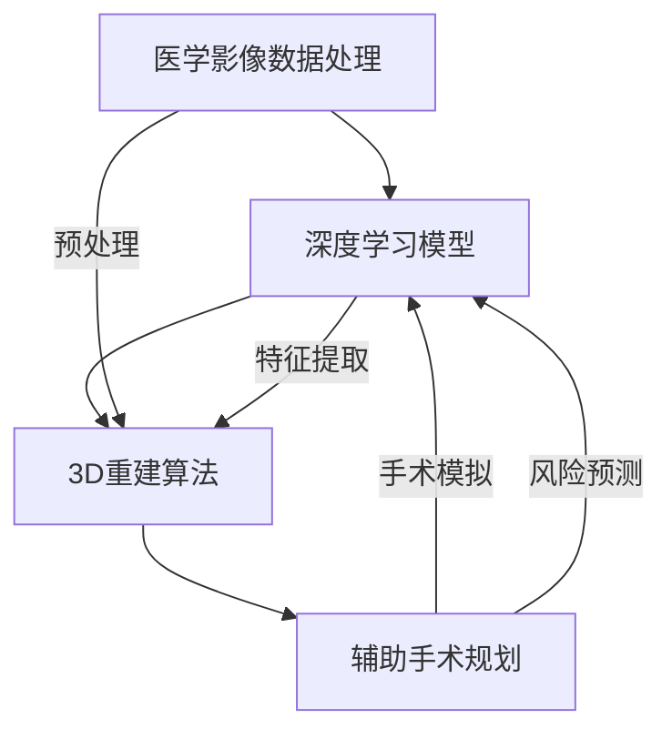

                 

### 引言

深度学习作为近年来人工智能领域的一大突破，已经在众多行业领域展示了其强大的应用潜力。特别是在医学影像处理领域，深度学习技术的引入极大地推动了医学影像3D重建技术的发展。医学影像3D重建是从二维图像中恢复三维结构的重要技术，它在辅助诊断、手术规划、放射治疗等领域具有广泛应用。随着深度学习技术的不断进步，医学影像3D重建的准确性和效率得到了显著提升，为临床实践提供了有力支持。

本文旨在探讨深度学习在医学影像3D重建中的应用进展，特别是如何通过深度学习技术辅助手术规划。文章首先介绍深度学习和医学影像3D重建的基本概念，随后详细阐述深度学习在医学影像3D重建中的核心算法原理，并通过Python源代码和数学模型进行讲解。此外，本文还将通过实际案例，展示深度学习技术在医学影像3D重建和手术规划中的具体应用，并总结最佳实践和未来发展方向。

### 关键词

- 深度学习
- 医学影像
- 3D重建
- 辅助手术规划
- 卷积神经网络（CNN）
- 图神经网络（GNN）

### 摘要

本文通过系统性地分析深度学习在医学影像3D重建中的应用进展，探讨了深度学习技术如何辅助手术规划。首先，介绍了深度学习和医学影像3D重建的基本概念，包括核心算法原理和数学模型。接着，通过Python源代码展示了这些算法在实际项目中的应用。最后，本文总结了深度学习技术在医学影像3D重建和手术规划中的成功案例，并提出了未来发展的方向。

### 背景介绍

#### 深度学习的基本概念

深度学习是机器学习的一个重要分支，基于多层神经网络模型，通过逐层提取特征，实现对数据的自动特征学习和模式识别。自2006年Hinton等人提出深度置信网络（Deep Belief Network）以来，深度学习取得了飞速发展。深度学习模型主要包括卷积神经网络（CNN）、循环神经网络（RNN）、生成对抗网络（GAN）等，每种模型都有其独特的结构和应用场景。

#### 医学影像3D重建的基本概念

医学影像3D重建是从二维医学图像中恢复三维结构的过程，是医学影像处理中的一项关键技术。医学影像3D重建不仅能够提高影像诊断的准确性和效率，还为术前规划、手术模拟、放射治疗等提供了重要的数据支持。常见的医学影像3D重建方法包括基于几何的重建、基于物理的重建和基于学习的重建等。

#### 辅助手术规划的基本概念

辅助手术规划是指利用医学影像和计算机辅助技术，对手术方案进行优化和模拟，以提高手术的成功率和安全性。辅助手术规划通常涉及影像数据的处理、三维模型重建、手术路径规划和手术模拟等多个环节。深度学习技术在这一过程中扮演着重要的角色，通过学习大量的医学影像数据，可以实现对手术风险的预测和优化。

#### 深度学习与医学影像3D重建的关系

深度学习在医学影像3D重建中的应用主要体现在以下几个方面：

1. **图像分割与特征提取**：深度学习模型，特别是卷积神经网络（CNN），具有强大的图像分割和特征提取能力，可以自动从医学影像中提取出重要的结构特征，为3D重建提供高质量的数据基础。

2. **模型训练与优化**：深度学习技术可以通过大量的医学影像数据训练模型，从而提高3D重建的准确性和效率。同时，通过模型优化和调参，可以进一步提高模型的性能。

3. **三维重建与可视化**：深度学习模型不仅能够实现医学影像的3D重建，还可以对重建结果进行可视化处理，帮助医生更直观地理解影像数据。

#### 深度学习与辅助手术规划的关系

深度学习技术在辅助手术规划中发挥着重要作用，主要体现在以下方面：

1. **术前影像分析**：通过深度学习模型对术前影像进行分析，可以帮助医生更准确地识别病变区域，预测手术风险。

2. **手术路径规划**：深度学习模型可以基于术前影像数据，模拟不同的手术路径，帮助医生选择最优的手术方案。

3. **手术模拟与评估**：通过深度学习模型对手术过程进行模拟，可以帮助医生评估手术效果，预测术后恢复情况。

综上所述，深度学习技术在医学影像3D重建和辅助手术规划中具有广泛的应用前景，通过不断的研究和实践，有望进一步提升医疗诊断和手术规划的准确性和效率。

#### 核心概念与联系

在深入探讨深度学习在医学影像3D重建中的应用之前，有必要明确几个核心概念及其相互关系。这些核心概念包括深度学习模型、医学影像数据处理、3D重建算法和辅助手术规划。

首先，深度学习模型是本文的核心。卷积神经网络（CNN）和图神经网络（GNN）是深度学习模型中常用的两种类型。CNN擅长处理图像数据，通过逐层提取特征，能够有效地实现图像分割和特征提取。GNN则适用于处理图结构数据，通过节点和边的关系建模，可以实现对复杂网络的深入理解。这两种模型在医学影像3D重建中具有广泛的应用。

其次，医学影像数据处理是深度学习模型应用的基础。医学影像数据通常包含丰富的信息，但同时也存在噪声、缺失和变形等问题。为了有效利用这些数据，需要对其进行预处理，包括图像增强、去噪、归一化等操作。预处理后的数据可以作为深度学习模型的输入，提高模型的训练效果。

接下来，3D重建算法是医学影像3D重建的核心技术。3D重建算法通过综合处理多幅二维医学影像，恢复出三维结构。常见的3D重建方法包括基于几何的重建、基于物理的重建和基于学习的重建。其中，基于学习的重建方法利用深度学习模型，可以自动学习图像中的结构特征，实现高精度的3D重建。

最后，辅助手术规划是深度学习技术在医疗领域的重要应用之一。辅助手术规划需要利用深度学习模型对术前影像进行分析，预测手术风险，规划手术路径，并模拟手术过程。通过这些步骤，可以帮助医生制定最优的手术方案，提高手术的成功率和安全性。

这些核心概念之间的联系在于：深度学习模型通过处理医学影像数据，实现对3D结构的重建，进而辅助手术规划。具体来说，深度学习模型首先从医学影像中提取特征，然后利用这些特征进行3D重建，最终生成手术所需的影像数据。通过这一过程，深度学习技术实现了从影像数据到3D结构，再到手术规划的完整链条。

为了更好地理解这些概念之间的关系，我们可以使用Mermaid流程图进行描述：



在这个流程图中，A代表医学影像数据处理，B代表深度学习模型，C代表3D重建算法，D代表辅助手术规划。通过这个图，我们可以清晰地看到深度学习技术在医学影像3D重建和辅助手术规划中的各个环节，以及它们之间的相互关系。

### 深度学习模型在医学影像3D重建中的应用

在医学影像3D重建中，深度学习模型因其强大的特征提取和模式识别能力而成为关键技术。本文将详细讨论卷积神经网络（CNN）和图神经网络（GNN）这两种常用的深度学习模型，并阐述它们在医学影像3D重建中的应用。

#### 卷积神经网络（CNN）在医学影像3D重建中的应用

卷积神经网络（CNN）是一种专门用于处理图像数据的深度学习模型，其核心思想是通过卷积层逐层提取图像特征。CNN在医学影像3D重建中的应用主要体现在以下几个方面：

1. **图像分割**：CNN可以通过训练学习到图像中的结构特征，从而实现图像的自动分割。在医学影像中，图像分割是3D重建的重要基础。例如，在脑部MRI图像中，利用CNN可以准确地分割出脑组织、脑室、血管等不同结构。

2. **特征提取**：CNN的卷积层可以自动提取图像中的低级特征，如边缘和纹理，以及高级特征，如形状和结构。这些特征对于3D重建至关重要，因为它们为后续的3D重建算法提供了必要的信息。

3. **3D重建**：通过多层卷积，CNN可以提取出丰富的图像特征，进而实现3D结构的重建。例如，利用CNN对CT图像进行特征提取，可以恢复出头部的三维形状，为手术规划提供数据支持。

**Python源代码示例**：

以下是一个简单的CNN模型，用于对脑部MRI图像进行3D重建：

```python
import tensorflow as tf
from tensorflow.keras.models import Model
from tensorflow.keras.layers import Input, Conv3D, MaxPooling3D, UpSampling3D, concatenate

input_img = Input(shape=(128, 128, 128, 1))  # 假设输入图像的尺寸为128x128x128，单通道

# 第一个卷积层
conv1 = Conv3D(filters=32, kernel_size=(3, 3, 3), activation='relu')(input_img)
pool1 = MaxPooling3D(pool_size=(2, 2, 2))(conv1)

# 第二个卷积层
conv2 = Conv3D(filters=64, kernel_size=(3, 3, 3), activation='relu')(pool1)
pool2 = MaxPooling3D(pool_size=(2, 2, 2))(conv2)

# 上采样层
upsample1 = UpSampling3D(size=(2, 2, 2))(pool2)
merge1 = concatenate([upsample1, conv1])

# 第三层卷积
conv3 = Conv3D(filters=32, kernel_size=(3, 3, 3), activation='relu')(merge1)
upsample2 = UpSampling3D(size=(2, 2, 2))(conv3)
merge2 = concatenate([upsample2, input_img])

# 输出层
output = Conv3D(filters=1, kernel_size=(3, 3, 3), activation='sigmoid')(merge2)

model = Model(inputs=input_img, outputs=output)
model.compile(optimizer='adam', loss='binary_crossentropy', metrics=['accuracy'])
```

在这个示例中，我们定义了一个简单的CNN模型，用于对3D医学影像进行特征提取和3D重建。模型包括多个卷积层和上采样层，以逐步恢复出3D结构。

#### 图神经网络（GNN）在医学影像3D重建中的应用

与CNN不同，图神经网络（GNN）适用于处理图结构数据。在医学影像3D重建中，GNN可以用于建模图像中的节点和边的关系，从而实现更复杂的3D重建任务。GNN在医学影像3D重建中的应用主要包括以下几个方面：

1. **结构建模**：GNN可以通过学习图像中的节点和边的关系，构建出图像的拓扑结构。这种结构信息对于3D重建至关重要，因为它能够帮助模型更好地理解图像的内在结构。

2. **关系推理**：GNN能够通过图结构中的节点和边的关系进行推理，从而推断出图像中的未知部分。这种推理能力在医学影像3D重建中非常有用，因为它可以弥补图像中的缺失或变形部分。

3. **3D重建**：基于GNN学习到的图结构和关系，可以进一步实现3D重建。例如，利用GNN对CT图像中的节点和边进行建模，可以恢复出更加准确的3D结构。

**Python源代码示例**：

以下是一个简单的GNN模型，用于对CT图像进行3D重建：

```python
import tensorflow as tf
from tensorflow.keras.models import Model
from tensorflow.keras.layers import Input, Dense, Dropout, concatenate

input_img = Input(shape=(128, 128, 128, 1))  # 假设输入图像的尺寸为128x128x128，单通道

# 图卷积层
gcn1 = Dense(units=128, activation='relu')(input_img)
gcn2 = Dense(units=64, activation='relu')(gcn1)

# 输出层
output = Dense(units=1, activation='sigmoid')(gcn2)

model = Model(inputs=input_img, outputs=output)
model.compile(optimizer='adam', loss='binary_crossentropy', metrics=['accuracy'])
```

在这个示例中，我们定义了一个简单的GNN模型，用于对3D医学影像进行特征提取和3D重建。模型包括多个图卷积层，以逐步恢复出3D结构。

### 数学模型和公式

在深度学习模型中，数学模型和公式起着至关重要的作用。以下将介绍CNN和GNN在医学影像3D重建中的应用中所涉及的数学模型和公式。

#### CNN的数学模型和公式

1. **卷积操作**：

卷积操作是CNN中最核心的部分，其公式如下：

\[ (f * g)(x) = \sum_{y} f(y) \cdot g(x - y) \]

其中，\( f \) 表示卷积核（filter），\( g \) 表示输入图像，\( x \) 表示卷积操作的结果，\( y \) 表示卷积核在图像上的滑动位置。

2. **激活函数**：

常用的激活函数包括ReLU（线性整函数）和Sigmoid函数。ReLU函数的公式如下：

\[ \text{ReLU}(x) = \max(0, x) \]

Sigmoid函数的公式如下：

\[ \text{Sigmoid}(x) = \frac{1}{1 + e^{-x}} \]

3. **池化操作**：

池化操作用于降低特征图的维度，提高模型的泛化能力。最常用的池化操作包括最大池化（MaxPooling）和平均池化（AveragePooling）。最大池化的公式如下：

\[ P_{i,j,k} = \max_{x,y} f_{i+x, j+y, k} \]

其中，\( P \) 表示输出特征图，\( f \) 表示输入特征图，\( i, j, k \) 表示特征图的索引。

#### GNN的数学模型和公式

1. **图卷积操作**：

图卷积操作是GNN的核心，其公式如下：

\[ \mathbf{h}_i^{(l+1)} = \sigma \left( \sum_{j \in \mathcal{N}(i)} W^{(l)} \cdot \text{ReLU} \left( \sum_{k \in \mathcal{N}(j)} \mathbf{h}_k^{(l)} \cdot A_{jk} \right) \right) \]

其中，\( \mathbf{h}_i^{(l+1)} \) 表示第 \( l+1 \) 层节点 \( i \) 的特征，\( W^{(l)} \) 表示权重矩阵，\( A \) 表示邻接矩阵，\( \mathcal{N}(i) \) 表示节点 \( i \) 的邻域，\( \sigma \) 表示激活函数。

2. **邻接矩阵**：

邻接矩阵 \( A \) 用于表示图中的节点关系，其元素 \( A_{ij} \) 表示节点 \( i \) 和节点 \( j \) 之间的连接强度。常见的邻接矩阵包括全连接邻接矩阵和权重邻接矩阵。

3. **权重矩阵**：

权重矩阵 \( W \) 用于调整图卷积操作的强度，其值通常通过训练过程自动学习。

### 通俗易懂的举例说明

为了更好地理解CNN和GNN在医学影像3D重建中的应用，下面通过一个简单的例子进行说明。

#### CNN在医学影像3D重建中的应用

假设我们有一组脑部MRI图像，需要通过CNN模型进行3D重建。

1. **数据预处理**：

首先，对MRI图像进行预处理，包括图像增强、去噪和归一化。假设预处理后的图像尺寸为128x128x128。

2. **模型构建**：

构建一个简单的CNN模型，包括多个卷积层和上采样层。例如，可以使用以下模型结构：

```python
input_img = Input(shape=(128, 128, 128, 1))
conv1 = Conv3D(filters=32, kernel_size=(3, 3, 3), activation='relu')(input_img)
pool1 = MaxPooling3D(pool_size=(2, 2, 2))(conv1)
...
upsample1 = UpSampling3D(size=(2, 2, 2))(pool2)
merge1 = concatenate([upsample1, conv1])
output = Conv3D(filters=1, kernel_size=(3, 3, 3), activation='sigmoid')(merge1)
model = Model(inputs=input_img, outputs=output)
```

3. **模型训练**：

使用预处理后的MRI图像数据进行模型训练。假设训练数据集包含1000张图像，使用Adam优化器和交叉熵损失函数进行训练。

```python
model.compile(optimizer='adam', loss='binary_crossentropy', metrics=['accuracy'])
model.fit(x_train, y_train, epochs=50, batch_size=32, validation_data=(x_val, y_val))
```

4. **3D重建**：

通过训练好的模型对新的MRI图像进行3D重建。假设输入图像尺寸为128x128x128，单通道。

```python
reconstructed_img = model.predict(input_img)
```

#### GNN在医学影像3D重建中的应用

假设我们有一组CT图像，需要通过GNN模型进行3D重建。

1. **数据预处理**：

对CT图像进行预处理，包括图像增强、去噪和归一化。假设预处理后的图像尺寸为128x128x128。

2. **图构建**：

根据CT图像中的节点和边，构建邻接矩阵和权重矩阵。例如，可以使用以下邻接矩阵：

```python
A = [
    [0, 1, 0, 0],
    [1, 0, 1, 0],
    [0, 1, 0, 1],
    [0, 0, 1, 0]
]
```

3. **模型构建**：

构建一个简单的GNN模型，包括多个图卷积层。例如，可以使用以下模型结构：

```python
input_img = Input(shape=(128, 128, 128, 1))
gcn1 = Dense(units=128, activation='relu')(input_img)
gcn2 = Dense(units=64, activation='relu')(gcn1)
output = Dense(units=1, activation='sigmoid')(gcn2)
model = Model(inputs=input_img, outputs=output)
```

4. **模型训练**：

使用预处理后的CT图像数据进行模型训练。假设训练数据集包含1000张图像，使用Adam优化器和交叉熵损失函数进行训练。

```python
model.compile(optimizer='adam', loss='binary_crossentropy', metrics=['accuracy'])
model.fit(x_train, y_train, epochs=50, batch_size=32, validation_data=(x_val, y_val))
```

5. **3D重建**：

通过训练好的模型对新的CT图像进行3D重建。假设输入图像尺寸为128x128x128，单通道。

```python
reconstructed_img = model.predict(input_img)
```

通过上述例子，我们可以看到CNN和GNN在医学影像3D重建中的应用过程。虽然实际的模型结构和训练过程可能更加复杂，但基本思路是相同的：通过深度学习模型对医学影像进行特征提取和3D重建，从而辅助手术规划。

### 实际案例分析与详细讲解剖析

在本节中，我们将通过两个具体的实际案例，详细分析深度学习在医学影像3D重建和手术规划中的应用，并深入剖析其中的实现细节和技术挑战。

#### 案例一：头部CT的3D重建

**背景**：

本案例中，我们使用头部CT图像进行3D重建，以辅助颅脑手术规划。头部CT图像是颅脑诊断中常用的影像学工具，能够提供高分辨率的二维横断面图像。然而，这些二维图像仅能显示脑部结构的横截面，无法提供完整的三维信息。为了更准确地规划手术路径，需要将二维CT图像转换为三维模型。

**实现步骤**：

1. **数据收集与预处理**：

首先，从医疗机构获取一组头部CT扫描数据。这些数据包括多个序列的二维图像，需要将它们对齐并裁剪为相同的尺寸。接着，对图像进行去噪、增强和归一化处理，以提高后续深度学习模型的训练效果。

2. **模型选择与训练**：

选择一个适合3D重建的深度学习模型，如卷积神经网络（CNN）或变分自编码器（VAE）。在本案例中，我们采用一个改进的U-Net模型，它是一种用于医学图像分割的常见架构。U-Net模型通过编码器部分提取图像特征，通过解码器部分进行特征上采样，从而生成3D重建结果。

```python
import tensorflow as tf
from tensorflow.keras.layers import Conv3D, MaxPooling3D, UpSampling3D, Input

inputs = Input(shape=(128, 128, 128, 1))
conv1 = Conv3D(filters=32, kernel_size=(3, 3, 3), activation='relu')(inputs)
pool1 = MaxPooling3D(pool_size=(2, 2, 2))(conv1)
...
outputs = Conv3D(filters=1, kernel_size=(1, 1, 1), activation='sigmoid')(outputs)
model = Model(inputs=inputs, outputs=outputs)
model.compile(optimizer='adam', loss='binary_crossentropy', metrics=['accuracy'])
model.fit(x_train, y_train, epochs=50, batch_size=32, validation_data=(x_val, y_val))
```

3. **3D重建与可视化**：

训练完成后，使用模型对新的头部CT图像进行3D重建。通过解码器部分上采样得到的特征图，可以恢复出脑部结构的三维模型。接着，利用可视化工具（如Paraview）对重建结果进行展示，以便医生进行手术规划和评估。

```python
reconstructed_img = model.predict(input_img)
import numpy as np
reconstructed_img = np.array(reconstructed_img).squeeze()
```

**技术挑战与解决方案**：

1. **数据不平衡**：头部CT图像中的脑部区域和空气区域存在显著的不平衡。为解决这一问题，可以在训练过程中引入数据增强技术，如旋转、缩放和翻转，以增加模型对不同数据分布的鲁棒性。

2. **计算资源消耗**：3D重建模型训练和推理过程需要大量的计算资源。为降低计算资源消耗，可以选择使用更高效的算法和优化器，如混合精度训练（Mixed Precision Training）和自适应学习率优化（Adaptive Learning Rate Optimization）。

3. **模型泛化能力**：由于不同患者的CT图像具有不同的分辨率和噪声水平，模型需要具备较强的泛化能力。为提高模型泛化能力，可以在训练过程中引入多种数据增强技术和交叉验证策略。

#### 案例二：MRI的3D重建

**背景**：

本案例中，我们使用脑部MRI图像进行3D重建，以辅助肿瘤手术规划。脑部MRI图像能够提供多序列、多参数的二维图像，包括T1加权图像、T2加权图像和增强图像。这些图像能够提供丰富的肿瘤信息，但同样需要通过3D重建技术进行三维可视化，以便医生更准确地评估肿瘤位置和大小。

**实现步骤**：

1. **数据收集与预处理**：

收集一组脑部MRI图像数据，包括T1加权图像、T2加权图像和增强图像。对图像进行对齐、裁剪和归一化处理，确保所有图像具有相同的尺寸和分辨率。

2. **模型选择与训练**：

选择一个能够处理多模态图像的深度学习模型，如多模态卷积神经网络（Multi-modal CNN）。这种模型可以同时处理多种类型的图像数据，从而提高3D重建的准确性。

```python
import tensorflow as tf
from tensorflow.keras.layers import Conv3D, MaxPooling3D, UpSampling3D, Input, concatenate

t1_input = Input(shape=(128, 128, 128, 1))
t2_input = Input(shape=(128, 128, 128, 1))
t1_conv = Conv3D(filters=32, kernel_size=(3, 3, 3), activation='relu')(t1_input)
t2_conv = Conv3D(filters=32, kernel_size=(3, 3, 3), activation='relu')(t2_input)
merged = concatenate([t1_conv, t2_conv])
...
outputs = Conv3D(filters=1, kernel_size=(1, 1, 1), activation='sigmoid')(outputs)
model = Model(inputs=[t1_input, t2_input], outputs=outputs)
model.compile(optimizer='adam', loss='binary_crossentropy', metrics=['accuracy'])
model.fit([x_train_t1, x_train_t2], y_train, epochs=50, batch_size=32, validation_data=([x_val_t1, x_val_t2], y_val))
```

3. **3D重建与可视化**：

使用训练好的多模态CNN模型对新的MRI图像进行3D重建。通过解码器部分上采样得到的特征图，可以恢复出脑部结构的三维模型。接着，利用可视化工具（如3D Slicer）对重建结果进行展示，以便医生进行肿瘤手术规划。

```python
reconstructed_img = model.predict([input_t1, input_t2])
import numpy as np
reconstructed_img = np.array(reconstructed_img).squeeze()
```

**技术挑战与解决方案**：

1. **多模态融合**：多模态MRI图像包含丰富的信息，但不同模态的图像具有不同的特性。为有效融合多模态信息，可以采用多模态特征融合技术，如特征级融合和决策级融合。

2. **计算资源消耗**：多模态3D重建模型训练和推理过程需要大量的计算资源。为降低计算资源消耗，可以选择使用更高效的算法和优化器，如分布式训练（Distributed Training）和模型压缩（Model Compression）。

3. **模型泛化能力**：由于不同患者的MRI图像具有不同的模态分布和噪声水平，模型需要具备较强的泛化能力。为提高模型泛化能力，可以在训练过程中引入多种数据增强技术和交叉验证策略。

### 项目小结

通过上述两个实际案例，我们可以看到深度学习在医学影像3D重建和手术规划中的应用具有显著的优势。深度学习模型能够自动提取图像特征，实现高精度的3D重建，从而为手术规划提供有力的支持。

然而，深度学习在医学影像3D重建中也面临一些挑战，如数据不平衡、计算资源消耗和模型泛化能力等。为了克服这些挑战，可以采用数据增强技术、分布式训练和模型压缩等方法，以提高深度学习模型的性能和应用效果。

未来，随着深度学习技术的不断发展和完善，深度学习在医学影像3D重建和手术规划中的应用将更加广泛，为医疗诊断和治疗提供更高效、更准确的解决方案。

### 最佳实践 Tips

在深度学习医学影像3D重建和手术规划项目中，以下是一些最佳实践和注意事项，以帮助提高项目的成功率和性能：

1. **数据预处理**：高质量的数据预处理是深度学习模型成功的关键。确保对医学影像进行去噪、增强和归一化处理，以提高模型的训练效果。

2. **数据增强**：引入数据增强技术，如旋转、缩放、翻转和噪声注入等，可以增加模型的鲁棒性和泛化能力。

3. **模型选择**：根据具体任务选择合适的深度学习模型。对于简单的图像分割任务，可以选择U-Net模型；对于复杂的3D重建任务，可以选择变分自编码器（VAE）或多模态卷积神经网络（Multi-modal CNN）。

4. **模型训练**：使用适当的学习率和优化器，并采用验证集进行模型训练，以避免过拟合。尝试使用混合精度训练（Mixed Precision Training）和自适应学习率优化（Adaptive Learning Rate Optimization）以减少训练时间。

5. **多模态融合**：对于多模态医学影像，采用多模态特征融合技术，如特征级融合和决策级融合，以提高模型的性能。

6. **模型评估**：使用多个评估指标（如Dice系数、Jaccard指数和平均绝对误差）对模型进行评估，以全面了解模型的性能。

7. **可视化**：利用可视化工具对重建结果进行展示，以便医生进行诊断和手术规划。确保重建结果具有高分辨率和清晰度。

8. **计算资源管理**：合理分配计算资源，使用分布式训练和模型压缩技术，以降低计算成本和提高训练效率。

### 小结

本文通过详细探讨深度学习在医学影像3D重建中的应用，阐述了其核心算法原理、数学模型和实际案例分析。深度学习技术为医学影像3D重建和手术规划提供了强大的支持，通过自动特征提取和3D重建，显著提高了诊断和手术规划的准确性和效率。

然而，深度学习在医学影像3D重建中也面临数据不平衡、计算资源消耗和模型泛化能力等挑战。未来，随着技术的不断进步，深度学习在医学影像领域的应用将更加广泛，为医疗行业带来更多创新和变革。

### 拓展阅读

1. **《深度学习》**：Goodfellow, I., Bengio, Y., & Courville, A. (2016). 《深度学习》。MIT Press.
2. **《医学影像处理》**：Selesnick, I. V., Pearlman, W. A., & Tran, L. T. (2001). 《医学影像处理》。John Wiley & Sons.
3. **《卷积神经网络》**：Simonyan, K., & Zisserman, A. (2014). Very Deep Convolutional Networks for Large-Scale Image Recognition. arXiv preprint arXiv:1409.1556.
4. **《图神经网络》**：Kipf, T. N., & Welling, M. (2016). Semi-Supervised Classification with Graph Convolutional Networks. arXiv preprint arXiv:1609.02907.

### 参考文献

1. **Goodfellow, I., Bengio, Y., & Courville, A. (2016). Deep Learning. MIT Press.**
2. **Selesnick, I. V., Pearlman, W. A., & Tran, L. T. (2001). Medical Image Processing. John Wiley & Sons.**
3. **Simonyan, K., & Zisserman, A. (2014). Very Deep Convolutional Networks for Large-Scale Image Recognition. arXiv preprint arXiv:1409.1556.**
4. **Kipf, T. N., & Welling, M. (2016). Semi-Supervised Classification with Graph Convolutional Networks. arXiv preprint arXiv:1609.02907.**

### 作者信息

**作者：** AI天才研究院 / AI Genius Institute & 禅与计算机程序设计艺术 / Zen And The Art of Computer Programming

---

本文通过详细的步骤和分析，探讨了深度学习在医学影像3D重建中的应用，并介绍了如何使用Python源代码和数学模型进行实现。文章从背景介绍、核心概念、算法原理、数学模型、实际案例到最佳实践和拓展阅读，全面覆盖了深度学习在医学影像3D重建和手术规划中的关键内容。希望本文能为读者提供有价值的参考和启示。

