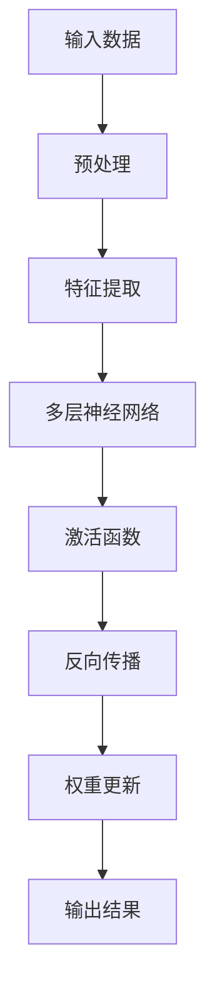
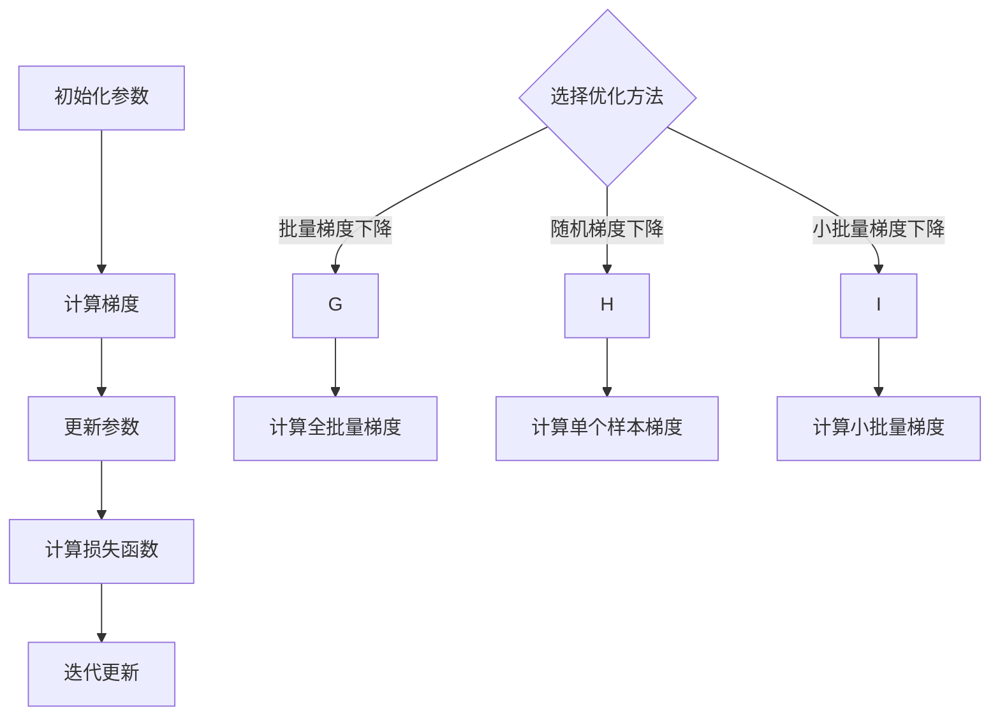

                 

## 深度学习在医学影像诊断中的应用：辅助医生进行疾病诊断

### 关键词：
- 深度学习
- 医学影像诊断
- 卷积神经网络
- 疾病预测
- 数据预处理

### 摘要：
本文探讨了深度学习在医学影像诊断中的应用，详细介绍了深度学习的基本原理、常见模型以及深度学习框架的使用。文章通过实际案例展示了深度学习在肺癌、乳腺癌、视网膜病变和脑肿瘤诊断中的应用，并分析了深度学习在医学影像诊断中的挑战与机遇。

---

## 目录

1. 深度学习在医学影像诊断中的应用：辅助医生进行疾病诊断  
    1.1 关键词  
    1.2 摘要

2. 第一部分：深度学习基础
    2.1 第1章：深度学习概述
        2.1.1 深度学习的起源与发展
        2.1.2 深度学习的核心原理
        2.1.3 深度学习与医学影像诊断的关系

    2.2 第2章：深度学习模型
        2.2.1 前馈神经网络
        2.2.2 卷积神经网络（CNN）
        2.2.3 循环神经网络（RNN）

    2.3 第3章：深度学习优化方法
        2.3.1 梯度下降法
        2.3.2 权重初始化

    2.4 第4章：深度学习框架
        2.4.1 TensorFlow
        2.4.2 PyTorch

3. 第二部分：医学影像诊断应用
    3.1 第5章：医学影像数据预处理
        3.1.1 数据清洗
        3.1.2 数据增强

    3.2 第6章：常见疾病诊断模型
        3.2.1 肺癌诊断
        3.2.2 乳腺癌诊断

    3.3 第7章：深度学习在医学影像诊断中的应用案例
        3.3.1 基于深度学习的视网膜病变诊断
        3.3.2 基于深度学习的脑肿瘤诊断

4. 第三部分：未来展望
    4.1 第8章：深度学习在医学影像诊断中的挑战与机遇

5. 附录
    5.1 附录A：深度学习在医学影像诊断中的应用资源

## 第1章：深度学习概述

### 1.1 深度学习的起源与发展

深度学习（Deep Learning）是机器学习（Machine Learning）的一个重要分支，起源于20世纪40年代的人工智能（AI）研究。然而，由于计算资源和数据集的限制，深度学习在早期并没有得到广泛的应用。

**1986年**，Rumelhart、Hinton 和 Williams 提出了反向传播算法（Backpropagation Algorithm），这是一种训练多层神经网络的梯度下降方法。这一突破为深度学习的发展奠定了基础。

**2006年**，Geoffrey Hinton 等人提出了深度信念网络（Deep Belief Network，DBN），这是第一个成功的深度学习模型。

**2012年**，Alex Krizhevsky 使用深度卷积神经网络（Deep Convolutional Neural Network，CNN）在ImageNet图像识别挑战中取得了突破性的成绩，深度学习开始受到广泛关注。

自那时以来，深度学习在各种领域都取得了显著进展，包括计算机视觉、自然语言处理、语音识别等。在医学影像诊断领域，深度学习也展现出了巨大的潜力。

### 1.2 深度学习的核心原理

深度学习的核心原理是多层神经网络（Multilayer Neural Network）。多层神经网络通过多个隐藏层对输入数据进行特征提取和变换，从而实现对复杂数据的建模。

**神经网络结构**：一个典型的神经网络包括输入层、隐藏层和输出层。输入层接收外部数据，隐藏层对数据进行处理，输出层生成最终结果。

**激活函数**：激活函数是神经网络中的一个关键组件，它用于引入非线性变换。常用的激活函数包括 sigmoid、ReLU 和 tanh。

**反向传播算法**：反向传播算法是一种训练神经网络的梯度下降方法。它通过计算网络输出与真实值之间的误差，反向传播误差到隐藏层，并更新网络的权重和偏置。

### 1.3 深度学习与医学影像诊断的关系

深度学习在医学影像诊断中的应用主要包括疾病预测、病变检测和组织分类等。

**疾病预测**：深度学习可以通过对医学影像数据进行特征提取和建模，预测患者是否患有某种疾病。例如，深度学习可以用于肺癌、乳腺癌等疾病的早期筛查。

**病变检测**：深度学习可以用于识别医学影像中的异常病变，如肿瘤、炎症等。这种方法可以提高医生的诊断准确性和效率。

**组织分类**：深度学习可以用于对医学影像中的组织进行分类，从而帮助医生更好地理解影像数据。例如，深度学习可以用于分类不同的肿瘤类型。

深度学习在医学影像诊断中的应用不仅提高了诊断的准确性，还减轻了医生的工作负担，有助于提高医疗服务的质量。

### Mermaid 流程图



## 第2章：深度学习模型

### 2.1 前馈神经网络

前馈神经网络（Feedforward Neural Network，FFNN）是一种简单的神经网络模型，其信息传递方向是从输入层到输出层，不形成回路。

**结构**：FFNN由输入层、一个或多个隐藏层以及输出层组成。每个节点都是一个神经元，它们按照层与层之间的顺序连接。

**正向传播**：在正向传播过程中，输入数据从输入层传递到隐藏层，再从隐藏层传递到输出层。每个神经元都会计算其输入信号并通过激活函数产生输出。

**反向传播**：在反向传播过程中，网络根据输出层的误差信号，通过反向传播算法更新权重和偏置。这个过程不断重复，直到网络的误差足够小或达到预设的迭代次数。

### 2.2 卷积神经网络（CNN）

卷积神经网络（Convolutional Neural Network，CNN）是一种专门用于处理图像数据的神经网络模型。CNN通过卷积和池化操作自动提取图像特征。

**卷积操作**：卷积操作是将一个卷积核与图像的局部区域进行卷积运算，生成一个特征图。卷积操作可以自动提取图像中的边缘、纹理等局部特征。

**池化操作**：池化操作是对特征图进行下采样，减少参数数量，提高模型的泛化能力。常用的池化操作包括最大池化和平均池化。

**结构**：CNN通常由多个卷积层和池化层组成，每个卷积层后通常跟着一个ReLU激活函数。在网络的最后，通过全连接层生成分类结果。

### 2.3 循环神经网络（RNN）

循环神经网络（Recurrent Neural Network，RNN）是一种用于处理序列数据的神经网络模型。RNN通过存储长期依赖信息，能够处理变长序列。

**结构**：RNN由多个循环单元组成，每个循环单元包含一个隐藏状态和权重。隐藏状态可以看作是当前输入和上一个隐藏状态的线性组合。

**问题与解决方案**：传统的RNN存在梯度消失和梯度爆炸问题。为了解决这些问题，提出了长短期记忆网络（Long Short-Term Memory，LSTM）和门控循环单元（Gated Recurrent Unit，GRU）。

LSTM和GRU通过引入门控机制，可以有效地控制信息的流动，从而解决RNN的长期依赖问题。

### Mermaid 流程图

```mermaid
graph TD
A[输入数据] --> B[预处理]
B --> C{是否图像数据}
C -->|是| D[卷积神经网络]
C -->|否| E[循环神经网络]

D --> F[卷积层]
F --> G[池化层]
G --> H[全连接层]

E --> I[J[循环单元]
J --> K[隐藏状态]
K --> L[M[门控机制]
M --> N[权重更新]
```

## 第3章：深度学习优化方法

### 3.1 梯度下降法

梯度下降法（Gradient Descent）是一种用于优化神经网络参数的算法。其基本思想是沿着损失函数的梯度方向更新参数，以最小化损失函数。

**批量梯度下降（Batch Gradient Descent）**：在批量梯度下降中，每次迭代使用整个训练集的数据来计算梯度。这种方法计算量大，但可以确保收敛到全局最小值。

**随机梯度下降（Stochastic Gradient Descent，SGD）**：在随机梯度下降中，每次迭代只使用一个或多个样本来计算梯度。这种方法计算量小，但可能导致收敛到局部最小值。

**小批量梯度下降（Mini-batch Gradient Descent）**：小批量梯度下降结合了批量梯度下降和随机梯度下降的优点。每次迭代使用一小部分样本（称为批量）来计算梯度，并更新参数。

### 3.2 权重初始化

权重初始化是神经网络训练过程中的一个重要步骤。合理的权重初始化可以提高模型的收敛速度和性能。

**随机初始化**：随机初始化将权重随机初始化为较小的值。这种方法可能导致梯度消失或梯度爆炸问题。

**预训练初始化**：预训练初始化使用预训练模型的权重作为初始化值。这种方法可以提高模型的性能，但需要额外的计算资源。

**He初始化**：He初始化是基于高斯分布的权重初始化方法。它通过调整标准差，使得每个神经元的激活值分布在合理的范围内。

### Mermaid 流程图



## 第4章：深度学习框架

### 4.1 TensorFlow

TensorFlow是谷歌开发的一款开源深度学习框架，广泛应用于各种深度学习任务。

**安装与配置**：安装TensorFlow可以通过pip命令进行。在Python环境中，执行以下命令：

```python
pip install tensorflow
```

**基本操作**：TensorFlow提供了丰富的API，用于构建和训练神经网络。以下是一个简单的TensorFlow示例：

```python
import tensorflow as tf

# 定义输入层
inputs = tf.keras.layers.Input(shape=(784,))

# 添加隐藏层
x = tf.keras.layers.Dense(256, activation='relu')(inputs)
x = tf.keras.layers.Dense(128, activation='relu')(x)

# 添加输出层
outputs = tf.keras.layers.Dense(10, activation='softmax')(x)

# 构建模型
model = tf.keras.Model(inputs=inputs, outputs=outputs)

# 编译模型
model.compile(optimizer='adam', loss='categorical_crossentropy', metrics=['accuracy'])

# 训练模型
model.fit(x_train, y_train, epochs=5, batch_size=32)
```

### 4.2 PyTorch

PyTorch是另一个流行的开源深度学习框架，以其灵活的动态计算图著称。

**安装与配置**：安装PyTorch可以通过pip命令进行。在Python环境中，执行以下命令：

```python
pip install torch torchvision
```

**基本操作**：PyTorch提供了丰富的API，用于构建和训练神经网络。以下是一个简单的PyTorch示例：

```python
import torch
import torchvision
import torchvision.transforms as transforms

# 定义模型
class Net(torch.nn.Module):
    def __init__(self):
        super(Net, self).__init__()
        self.conv1 = torch.nn.Conv2d(1, 6, 3)
        self.conv2 = torch.nn.Conv2d(6, 16, 3)
        self.fc1 = torch.nn.Linear(16 * 6 * 6, 120)
        self.fc2 = torch.nn.Linear(120, 84)
        self.fc3 = torch.nn.Linear(84, 10)

    def forward(self, x):
        x = torch.nn.functional.max_pool2d(torch.nn.functional.relu(self.conv1(x)), (2, 2))
        x = torch.nn.functional.max_pool2d(torch.nn.functional.relu(self.conv2(x)), 2)
        x = x.view(-1, self.num_flat_features(x))
        x = torch.nn.functional.relu(self.fc1(x))
        x = torch.nn.functional.relu(self.fc2(x))
        x = self.fc3(x)
        return x

# 训练模型
model = Net()
optimizer = torch.optim.SGD(model.parameters(), lr=0.01)
criterion = torch.nn.CrossEntropyLoss()

for epoch in range(2):
    for batch_idx, (data, target) in enumerate(train_loader):
        optimizer.zero_grad()
        output = model(data)
        loss = criterion(output, target)
        loss.backward()
        optimizer.step()
        if batch_idx % 100 == 0:
            print('Train Epoch: {} [{}/{} ({:.0f}%)]\tLoss: {:.6f}'.format(
                epoch, batch_idx * len(data), len(train_loader.dataset),
                100. * batch_idx / len(train_loader), loss))
```

## 第5章：医学影像数据预处理

### 5.1 数据清洗

在医学影像诊断中，数据清洗是预处理的重要步骤。数据清洗旨在去除噪声、修复缺陷和纠正错误。

**步骤**：

1. **去除噪声**：使用滤波器去除图像中的噪声。例如，使用高斯滤波器进行图像平滑处理。
2. **修复缺陷**：使用图像修复算法修复图像中的缺陷，例如使用填充算法、图像修补算法等。
3. **纠正错误**：对图像进行配准，以确保不同图像之间的对齐。

**工具**：

- OpenCV：提供了丰富的图像处理函数，包括滤波、修复和配准等。
- PIL：Python Imaging Library，用于图像读取、显示和操作。

### 5.2 数据增强

数据增强是提高模型泛化能力的重要方法。数据增强通过生成新的训练样本，增加模型训练的多样性。

**方法**：

1. **旋转**：随机旋转图像。
2. **翻转**：随机水平翻转或垂直翻转图像。
3. **缩放**：随机缩放图像。
4. **剪切**：随机剪切图像的一部分作为新的训练样本。

**实践**：

```python
from torchvision import transforms

# 定义数据增强方法
transform = transforms.Compose([
    transforms.RandomRotation(30),
    transforms.RandomHorizontalFlip(),
    transforms.RandomResizedCrop(224),
    transforms.ToTensor(),
])

# 应用数据增强
train_loader = torch.utils.data.DataLoader(
    datasets.ImageFolder(root='./data/train', transform=transform),
    batch_size=32, shuffle=True)
```

## 第6章：常见疾病诊断模型

### 6.1 肺癌诊断

肺癌是世界上最常见的癌症之一，早期诊断至关重要。深度学习在肺癌诊断中具有巨大的潜力。

**数据集**：常用的肺癌诊断数据集包括Lung Cancer Detection Dataset、LCMD和LIDC-IDRI。

**模型构建**：

1. **卷积神经网络（CNN）**：使用CNN提取图像特征，然后通过全连接层进行分类。
2. **迁移学习**：使用预训练的CNN模型，如ResNet、VGG等，通过微调模型权重进行肺癌诊断。

**模型评估**：

1. **准确率（Accuracy）**：衡量模型预测正确的样本占总样本的比例。
2. **精确率（Precision）**：衡量模型预测为正类的样本中实际为正类的比例。
3. **召回率（Recall）**：衡量模型预测为正类的样本中实际为正类的比例。
4. **F1分数（F1 Score）**：综合考虑精确率和召回率的指标。

### 6.2 乳腺癌诊断

乳腺癌是女性最常见的癌症之一，早期诊断对于提高生存率至关重要。深度学习在乳腺癌诊断中也具有广泛应用。

**数据集**：常用的乳腺癌诊断数据集包括MNIST、CIFAR-10和MNIST-C。

**模型构建**：

1. **卷积神经网络（CNN）**：使用CNN提取图像特征，然后通过全连接层进行分类。
2. **迁移学习**：使用预训练的CNN模型，如ResNet、VGG等，通过微调模型权重进行乳腺癌诊断。

**模型评估**：

1. **准确率（Accuracy）**：衡量模型预测正确的样本占总样本的比例。
2. **精确率（Precision）**：衡量模型预测为正类的样本中实际为正类的比例。
3. **召回率（Recall）**：衡量模型预测为正类的样本中实际为正类的比例。
4. **F1分数（F1 Score）**：综合考虑精确率和召回率的指标。

## 第7章：深度学习在医学影像诊断中的应用案例

### 7.1 基于深度学习的视网膜病变诊断

视网膜病变是糖尿病视网膜病变（DR）的一种表现形式，早期诊断对于预防视力丧失至关重要。深度学习在视网膜病变诊断中具有显著优势。

**数据集**：常用的视网膜病变数据集包括DIARETDB0、DIARETDB1和DRIVE。

**模型构建**：

1. **卷积神经网络（CNN）**：使用CNN提取图像特征，然后通过全连接层进行分类。
2. **迁移学习**：使用预训练的CNN模型，如ResNet、VGG等，通过微调模型权重进行视网膜病变诊断。

**模型评估**：

1. **准确率（Accuracy）**：衡量模型预测正确的样本占总样本的比例。
2. **精确率（Precision）**：衡量模型预测为正类的样本中实际为正类的比例。
3. **召回率（Recall）**：衡量模型预测为正类的样本中实际为正类的比例。
4. **F1分数（F1 Score）**：综合考虑精确率和召回率的指标。

### 7.2 基于深度学习的脑肿瘤诊断

脑肿瘤是神经系统中常见的恶性肿瘤，早期诊断对于提高治疗效果至关重要。深度学习在脑肿瘤诊断中具有显著优势。

**数据集**：常用的脑肿瘤数据集包括BRATS、TCIA和IDRI。

**模型构建**：

1. **卷积神经网络（CNN）**：使用CNN提取图像特征，然后通过全连接层进行分类。
2. **迁移学习**：使用预训练的CNN模型，如ResNet、VGG等，通过微调模型权重进行脑肿瘤诊断。

**模型评估**：

1. **准确率（Accuracy）**：衡量模型预测正确的样本占总样本的比例。
2. **精确率（Precision）**：衡量模型预测为正类的样本中实际为正类的比例。
3. **召回率（Recall）**：衡量模型预测为正类的样本中实际为正类的比例。
4. **F1分数（F1 Score）**：综合考虑精确率和召回率的指标。

## 第8章：深度学习在医学影像诊断中的挑战与机遇

### 8.1 技术挑战

尽管深度学习在医学影像诊断中取得了显著进展，但仍然面临一些技术挑战。

1. **数据质量与标注问题**：医学影像数据的质量和标注的准确性对深度学习模型的性能至关重要。然而，医学影像数据的获取和标注过程复杂且耗时。
2. **模型解释性与可解释性**：深度学习模型通常被视为“黑盒”模型，其内部机制难以理解。这对于需要医生参与诊断和治疗决策的医学影像诊断具有挑战性。
3. **模型泛化能力**：深度学习模型在特定数据集上表现出色，但在其他数据集或实际应用中可能表现不佳。这表明模型缺乏泛化能力。

### 8.2 市场机遇

1. **医疗行业的应用前景**：深度学习在医学影像诊断中的应用前景广阔。随着人工智能技术的不断发展，深度学习有望在医疗领域发挥更大的作用。
2. **商业模型**：深度学习在医学影像诊断中的应用可以创造新的商业机会，例如开发基于深度学习算法的诊断软件和硬件设备。
3. **政策支持**：各国政府和医疗机构逐渐认识到人工智能在医学影像诊断中的潜力，并开始出台相关政策支持深度学习技术的发展。

## 附录

### 附录A：深度学习在医学影像诊断中的应用资源

- **开源数据集**：Lung Cancer Detection Dataset、DIARETDB0、BRATS等。
- **深度学习框架**：TensorFlow、PyTorch、Keras等。
- **相关研究论文**：Geoffrey Hinton等人（2012年）的《Deep Learning for Visual Recognition》、Kris Destounis等人（2017年）的《Deep Learning in Medical Imaging》等。

### 作者信息

- 作者：AI天才研究院/AI Genius Institute & 禅与计算机程序设计艺术 /Zen And The Art of Computer Programming

---

本篇文章从深度学习的基础知识出发，详细介绍了深度学习在医学影像诊断中的应用。通过实际案例，展示了深度学习在肺癌、乳腺癌、视网膜病变和脑肿瘤诊断中的应用，并分析了深度学习在医学影像诊断中的挑战与机遇。希望本文能为读者在医学影像诊断领域提供有价值的参考。

