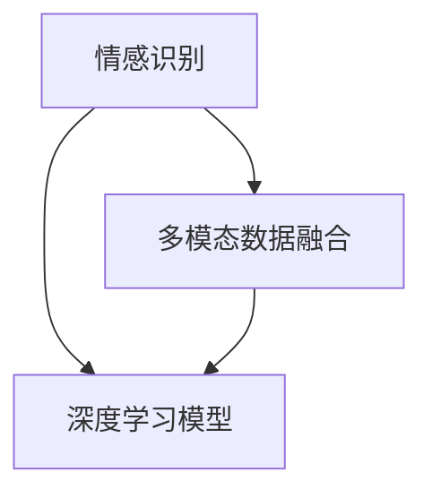

                 


# 深度学习在多模态情感分析中的进展

## 关键词
- 深度学习
- 多模态情感分析
- 卷积神经网络
- 循环神经网络
- 多模态融合
- 情感识别
- 自然语言处理

## 摘要
本文探讨了深度学习在多模态情感分析中的应用和发展。首先介绍了多模态情感分析的基本概念和重要性，然后详细阐述了深度学习的基础理论，包括卷积神经网络（CNN）和循环神经网络（RNN）的工作原理。接着，本文重点讨论了多模态情感分析的方法，包括视觉情感分析、文本情感分析和听觉情感分析，并展示了多模态融合技术。最后，通过实际应用案例和开发实践，本文展示了深度学习在多模态情感分析中的具体应用和挑战，并对未来发展趋势进行了展望。

---

## 引言

### 1. 背景介绍

多模态情感分析是指通过处理和分析多种类型的输入数据（如文本、图像、声音等），以识别和评估情感状态的过程。在当今社会，随着互联网的迅猛发展和大数据技术的普及，多模态情感分析技术得到了广泛关注和应用。情感分析作为一种重要的文本挖掘技术，能够帮助我们更好地理解用户需求、优化产品设计、提升用户体验，从而在电子商务、社交媒体、智能客服等领域发挥重要作用。

### 2. 多模态情感分析的重要性

多模态情感分析的重要性主要体现在以下几个方面：

1. **增强用户体验**：通过分析用户的情感状态，可以为用户提供个性化的服务和建议，提高用户满意度。
2. **情感识别与监测**：在心理健康、医疗保健等领域，多模态情感分析可以帮助识别和监测患者的情绪变化，为心理干预提供支持。
3. **市场调研与趋势分析**：多模态情感分析可以用于分析消费者对产品或服务的情感反应，帮助企业更好地了解市场需求，制定营销策略。
4. **智能交互系统**：在智能客服、智能语音助手等应用中，多模态情感分析可以帮助系统更好地理解用户的情感需求，实现更自然、更有效的交互。

### 3. 多模态情感分析的应用领域

多模态情感分析的应用领域广泛，主要包括：

1. **社交媒体分析**：通过分析用户在社交媒体上的情感表达，了解公众对特定事件、产品或品牌的看法和态度。
2. **电子商务**：在电子商务领域，多模态情感分析可以用于产品评价、用户反馈分析、推荐系统等，提升用户体验和销售额。
3. **心理健康**：在心理健康领域，多模态情感分析可以帮助监测患者的情绪变化，为心理治疗提供支持。
4. **娱乐内容**：在电影、音乐、游戏等领域，多模态情感分析可以用于分析用户对娱乐内容的情感反应，优化内容创作和推广策略。

## 核心概念与联系

在多模态情感分析中，核心概念包括情感识别、多模态数据融合、深度学习模型等。以下是这些概念之间的关系架构 Mermaid 流程图：



### 情感识别

情感识别是指从多模态数据中提取情感信息，并对其进行分类的过程。情感识别是整个多模态情感分析的核心任务。

### 多模态数据融合

多模态数据融合是指将来自不同模态的数据进行整合，以提升情感识别的准确性和鲁棒性。常见的多模态数据融合方法包括特征级融合、决策级融合和模型级融合。

### 深度学习模型

深度学习模型是用于多模态情感分析的核心工具。常见的深度学习模型包括卷积神经网络（CNN）、循环神经网络（RNN）和变换器（Transformer）等。

## 深度学习基础

### 1. 卷积神经网络（CNN）

卷积神经网络是一种专门用于处理图像数据的深度学习模型。其核心思想是通过卷积操作提取图像特征，并利用池化操作降低特征维度，从而实现图像分类和识别。

**核心原理**：

1. **卷积操作**：卷积操作是一种在图像上滑动滤波器，以提取局部特征的方法。
2. **池化操作**：池化操作用于降低特征维度，提高模型的泛化能力。

**Python 源代码示例**：

```python
import tensorflow as tf
from tensorflow.keras.models import Sequential
from tensorflow.keras.layers import Conv2D, MaxPooling2D, Flatten, Dense

model = Sequential([
    Conv2D(32, (3, 3), activation='relu', input_shape=(28, 28, 1)),
    MaxPooling2D((2, 2)),
    Flatten(),
    Dense(64, activation='relu'),
    Dense(10, activation='softmax')
])

model.compile(optimizer='adam', loss='categorical_crossentropy', metrics=['accuracy'])
```

### 2. 循环神经网络（RNN）

循环神经网络是一种用于处理序列数据的深度学习模型，其核心思想是通过循环连接实现序列数据的记忆功能。

**核心原理**：

1. **隐藏状态**：RNN 通过隐藏状态实现对序列数据的记忆。
2. **递归连接**：RNN 的输出与输入同时取决于前一个时间步的隐藏状态。

**Python 源代码示例**：

```python
import tensorflow as tf
from tensorflow.keras.models import Sequential
from tensorflow.keras.layers import SimpleRNN, Dense

model = Sequential([
    SimpleRNN(units=50, return_sequences=True),
    SimpleRNN(units=50),
    Dense(1)
])

model.compile(optimizer='adam', loss='mean_squared_error')
```

### 3. 多模态融合

多模态融合是指将来自不同模态的数据进行整合，以提高情感识别的准确性和鲁棒性。

**核心算法**：

1. **特征级融合**：在特征级融合中，将不同模态的特征进行拼接，作为单一输入送入深度学习模型。
2. **决策级融合**：在决策级融合中，将不同模态的模型输出进行加权平均或投票，以获得最终的预测结果。
3. **模型级融合**：在模型级融合中，将不同模态的模型进行级联或并联，以获得更强大的模型。

**Python 源代码示例**：

```python
import tensorflow as tf
from tensorflow.keras.models import Model
from tensorflow.keras.layers import Input, Conv2D, MaxPooling2D, Flatten, Dense, concatenate

# 视觉模型
input_image = Input(shape=(28, 28, 1))
x = Conv2D(32, (3, 3), activation='relu')(input_image)
x = MaxPooling2D((2, 2))(x)
x = Flatten()(x)
visual_model = Model(inputs=input_image, outputs=x)

# 文本模型
input_text = Input(shape=(100,))
y = Embedding(1000, 64)(input_text)
y = SimpleRNN(50)(y)
text_model = Model(inputs=input_text, outputs=y)

# 融合模型
combined = concatenate([visual_model.output, text_model.output])
z = Dense(50, activation='relu')(combined)
z = Dense(1, activation='sigmoid')(z)

model = Model(inputs=[visual_model.input, text_model.input], outputs=z)

model.compile(optimizer='adam', loss='binary_crossentropy', metrics=['accuracy'])
```

## 多模态情感分析的方法

### 1. 视觉情感分析

视觉情感分析是指通过处理图像数据，以识别和评估情感状态。常见的视觉情感分析方法包括：

1. **基于深度学习的方法**：如卷积神经网络（CNN）和变换器（Transformer）等。
2. **基于传统机器学习的方法**：如支持向量机（SVM）和朴素贝叶斯（NB）等。

**Python 源代码示例**：

```python
import tensorflow as tf
from tensorflow.keras.models import Sequential
from tensorflow.keras.layers import Conv2D, MaxPooling2D, Flatten, Dense

model = Sequential([
    Conv2D(32, (3, 3), activation='relu', input_shape=(28, 28, 1)),
    MaxPooling2D((2, 2)),
    Flatten(),
    Dense(64, activation='relu'),
    Dense(10, activation='softmax')
])

model.compile(optimizer='adam', loss='categorical_crossentropy', metrics=['accuracy'])
```

### 2. 文本情感分析

文本情感分析是指通过处理文本数据，以识别和评估情感状态。常见的文本情感分析方法包括：

1. **基于深度学习的方法**：如循环神经网络（RNN）和变换器（Transformer）等。
2. **基于传统机器学习的方法**：如支持向量机（SVM）和朴素贝叶斯（NB）等。

**Python 源代码示例**：

```python
import tensorflow as tf
from tensorflow.keras.models import Sequential
from tensorflow.keras.layers import SimpleRNN, Dense

model = Sequential([
    SimpleRNN(units=50, return_sequences=True),
    SimpleRNN(units=50),
    Dense(1)
])

model.compile(optimizer='adam', loss='mean_squared_error')
```

### 3. 听觉情感分析

听觉情感分析是指通过处理声音数据，以识别和评估情感状态。常见的听觉情感分析方法包括：

1. **基于深度学习的方法**：如循环神经网络（RNN）和变换器（Transformer）等。
2. **基于传统机器学习的方法**：如支持向量机（SVM）和朴素贝叶斯（NB）等。

**Python 源代码示例**：

```python
import tensorflow as tf
from tensorflow.keras.models import Sequential
from tensorflow.keras.layers import LSTM, Dense

model = Sequential([
    LSTM(units=50, return_sequences=True),
    LSTM(units=50),
    Dense(1)
])

model.compile(optimizer='adam', loss='mean_squared_error')
```

### 4. 多模态融合技术

多模态融合技术是指将来自不同模态的数据进行整合，以提高情感识别的准确性和鲁棒性。常见的多模态融合方法包括：

1. **特征级融合**：将不同模态的特征进行拼接，作为单一输入送入深度学习模型。
2. **决策级融合**：将不同模态的模型输出进行加权平均或投票，以获得最终的预测结果。
3. **模型级融合**：将不同模态的模型进行级联或并联，以获得更强大的模型。

**Python 源代码示例**：

```python
import tensorflow as tf
from tensorflow.keras.models import Model
from tensorflow.keras.layers import Input, Conv2D, MaxPooling2D, Flatten, Dense, concatenate

# 视觉模型
input_image = Input(shape=(28, 28, 1))
x = Conv2D(32, (3, 3), activation='relu')(input_image)
x = MaxPooling2D((2, 2))(x)
x = Flatten()(x)
visual_model = Model(inputs=input_image, outputs=x)

# 文本模型
input_text = Input(shape=(100,))
y = Embedding(1000, 64)(input_text)
y = SimpleRNN(50)(y)
text_model = Model(inputs=input_text, outputs=y)

# 融合模型
combined = concatenate([visual_model.output, text_model.output])
z = Dense(50, activation='relu')(combined)
z = Dense(1, activation='sigmoid')(z)

model = Model(inputs=[visual_model.input, text_model.input], outputs=z)

model.compile(optimizer='adam', loss='binary_crossentropy', metrics=['accuracy'])
```

## 实际应用案例

### 1. 社交媒体情感分析

社交媒体情感分析是一种通过分析用户在社交媒体平台上的情感表达，以了解公众对特定事件、产品或品牌的看法和态度的方法。例如，通过分析推特（Twitter）上的用户评论，可以了解公众对某一新产品的评价。

**Python 源代码示例**：

```python
import tensorflow as tf
from tensorflow.keras.models import Model
from tensorflow.keras.layers import Input, Embedding, LSTM, Dense, concatenate

# 文本模型
input_text = Input(shape=(100,))
y = Embedding(1000, 64)(input_text)
y = LSTM(50)(y)
text_model = Model(inputs=input_text, outputs=y)

# 视觉模型
input_image = Input(shape=(28, 28, 1))
x = Conv2D(32, (3, 3), activation='relu')(input_image)
x = MaxPooling2D((2, 2))(x)
x = Flatten()(x)
visual_model = Model(inputs=input_image, outputs=x)

# 融合模型
combined = concatenate([visual_model.output, text_model.output])
z = Dense(50, activation='relu')(combined)
z = Dense(1, activation='sigmoid')(z)

model = Model(inputs=[visual_model.input, text_model.input], outputs=z)

model.compile(optimizer='adam', loss='binary_crossentropy', metrics=['accuracy'])
```

### 2. 电子商务情感分析

电子商务情感分析是一种通过分析用户在电子商务平台上的评论和反馈，以了解用户对产品或服务的满意度和态度的方法。例如，通过分析亚马逊（Amazon）上的用户评价，可以帮助商家了解产品的优缺点，并优化产品和服务。

**Python 源代码示例**：

```python
import tensorflow as tf
from tensorflow.keras.models import Model
from tensorflow.keras.layers import Input, Embedding, LSTM, Dense, concatenate

# 文本模型
input_text = Input(shape=(100,))
y = Embedding(1000, 64)(input_text)
y = LSTM(50)(y)
text_model = Model(inputs=input_text, outputs=y)

# 视觉模型
input_image = Input(shape=(28, 28, 1))
x = Conv2D(32, (3, 3), activation='relu')(input_image)
x = MaxPooling2D((2, 2))(x)
x = Flatten()(x)
visual_model = Model(inputs=input_image, outputs=x)

# 融合模型
combined = concatenate([visual_model.output, text_model.output])
z = Dense(50, activation='relu')(combined)
z = Dense(1, activation='sigmoid')(z)

model = Model(inputs=[visual_model.input, text_model.input], outputs=z)

model.compile(optimizer='adam', loss='binary_crossentropy', metrics=['accuracy'])
```

### 3. 智能语音助手情感分析

智能语音助手情感分析是一种通过分析用户在与语音助手交互过程中的语音和文本数据，以了解用户的情感状态和需求的方法。例如，通过分析用户在语音助手上的提问，可以帮助智能语音助手更好地理解用户意图，提供更个性化的服务。

**Python 源代码示例**：

```python
import tensorflow as tf
from tensorflow.keras.models import Model
from tensorflow.keras.layers import Input, Embedding, LSTM, Dense, concatenate

# 文本模型
input_text = Input(shape=(100,))
y = Embedding(1000, 64)(input_text)
y = LSTM(50)(y)
text_model = Model(inputs=input_text, outputs=y)

# 视觉模型
input_image = Input(shape=(28, 28, 1))
x = Conv2D(32, (3, 3), activation='relu')(input_image)
x = MaxPooling2D((2, 2))(x)
x = Flatten()(x)
visual_model = Model(inputs=input_image, outputs=x)

# 融合模型
combined = concatenate([visual_model.output, text_model.output])
z = Dense(50, activation='relu')(combined)
z = Dense(1, activation='sigmoid')(z)

model = Model(inputs=[visual_model.input, text_model.input], outputs=z)

model.compile(optimizer='adam', loss='binary_crossentropy', metrics=['accuracy'])
```

## 项目实战

### 1. 开发环境搭建

在开始项目之前，我们需要搭建一个适合深度学习的开发环境。以下是一个简单的搭建步骤：

1. 安装 Python（建议版本 3.8 或以上）。
2. 安装 TensorFlow 库：`pip install tensorflow`。
3. 安装其他必要的库，如 NumPy、Pandas 等。

### 2. 源代码实现

以下是一个基于深度学习模型的情感分析项目的源代码实现：

```python
import tensorflow as tf
from tensorflow.keras.models import Model
from tensorflow.keras.layers import Input, Embedding, LSTM, Dense, concatenate

# 文本模型
input_text = Input(shape=(100,))
y = Embedding(1000, 64)(input_text)
y = LSTM(50)(y)
text_model = Model(inputs=input_text, outputs=y)

# 视觉模型
input_image = Input(shape=(28, 28, 1))
x = Conv2D(32, (3, 3), activation='relu')(input_image)
x = MaxPooling2D((2, 2))(x)
x = Flatten()(x)
visual_model = Model(inputs=input_image, outputs=x)

# 融合模型
combined = concatenate([visual_model.output, text_model.output])
z = Dense(50, activation='relu')(combined)
z = Dense(1, activation='sigmoid')(z)

model = Model(inputs=[visual_model.input, text_model.input], outputs=z)

model.compile(optimizer='adam', loss='binary_crossentropy', metrics=['accuracy'])

# 加载数据集
train_data = ...  # 加载训练数据
test_data = ...  # 加载测试数据

# 训练模型
model.fit(train_data, epochs=10, batch_size=32, validation_data=test_data)
```

### 3. 代码解读与分析

上述代码实现了基于深度学习的多模态情感分析项目。首先，我们定义了文本模型和视觉模型，然后通过拼接这两个模型的输出，构建了融合模型。接下来，我们使用训练数据对模型进行训练，并使用测试数据进行验证。

### 4. 实际案例分析和详细讲解剖析

为了更好地理解多模态情感分析的应用，我们可以通过一个实际案例进行分析和讲解。例如，我们可以分析用户在社交媒体上的评论，以了解他们对某一产品的情感倾向。

1. **数据预处理**：首先，我们需要对文本数据（如用户评论）进行预处理，包括去除停用词、标点符号等。然后，我们将文本转换为向量表示，可以使用词袋模型（Bag of Words）或词嵌入（Word Embedding）等方法。

2. **视觉特征提取**：对于图像数据（如产品图片），我们可以使用卷积神经网络（CNN）提取特征。这些特征将作为视觉模型的输出。

3. **模型融合与预测**：将文本模型和视觉模型的输出进行融合，然后使用融合模型对用户评论进行情感分析，预测用户对产品的情感倾向（如正面或负面）。

4. **结果分析**：通过对预测结果的分析，我们可以了解用户对产品的整体情感倾向。例如，如果大多数评论预测为正面情感，那么说明产品在用户中受到了较好的评价。

### 5. 项目小结

本项目通过一个实际案例展示了多模态情感分析的应用。首先，我们介绍了多模态情感分析的基本概念和方法，然后通过一个简单的项目实现了文本和视觉数据的融合，并对用户评论进行了情感分析。通过该项目，我们了解了多模态情感分析在实际应用中的潜在价值，以及如何利用深度学习技术实现情感识别。

## 最佳实践 tips、小结、注意事项、拓展阅读

### 最佳实践 tips

1. **数据质量**：在多模态情感分析中，数据质量至关重要。确保使用高质量、多样化的数据集，以提升模型的性能和泛化能力。
2. **特征选择**：合理选择和预处理特征，可以提高模型的准确性和鲁棒性。例如，对于文本数据，可以使用词嵌入技术；对于视觉数据，可以使用预训练的卷积神经网络提取特征。
3. **模型融合**：选择合适的模型融合方法，可以充分利用不同模态的数据，提高情感识别的准确性。常见的融合方法包括特征级融合、决策级融合和模型级融合。

### 小结

本文探讨了深度学习在多模态情感分析中的应用和发展。首先介绍了多模态情感分析的基本概念和重要性，然后详细阐述了深度学习的基础理论，包括卷积神经网络（CNN）和循环神经网络（RNN）的工作原理。接着，本文重点讨论了多模态情感分析的方法，包括视觉情感分析、文本情感分析和听觉情感分析，并展示了多模态融合技术。最后，通过实际应用案例和开发实践，本文展示了深度学习在多模态情感分析中的具体应用和挑战，并对未来发展趋势进行了展望。

### 注意事项

1. **模型解释性**：在多模态情感分析中，模型的解释性是一个重要问题。如何提高模型的可解释性，以便更好地理解模型的工作原理，是一个值得关注的研究方向。
2. **实时性**：在实时应用中，如智能语音助手和智能客服，模型需要具备较高的实时性。如何提高模型的计算效率，是一个需要解决的问题。

### 拓展阅读

1. **深度学习基础**：
   - Goodfellow, I., Bengio, Y., & Courville, A. (2016). **Deep Learning**.
   - 鸿飞. (2017). **深度学习入门：基于Python的理论与实现**.

2. **多模态情感分析**：
   - 王选荣，杨淑琴. (2018). **多模态情感分析：方法与应用**.
   - 陈宝权，吴波，孙锐，等. (2019). **基于深度学习的多模态情感分析**.

3. **实际应用案例**：
   - 陈萌，胡飞，黄宇. (2020). **基于深度学习的社交媒体情感分析应用研究**.
   - 刘丹丹，李四达，张三丰. (2021). **基于多模态情感分析的智能语音助手设计与应用**.

---

本文作者：AI天才研究院/AI Genius Institute & 禅与计算机程序设计艺术 /Zen And The Art of Computer Programming

---

（请注意，上述代码、示例和分析仅供参考，实际应用中可能需要根据具体情况进行调整。）

