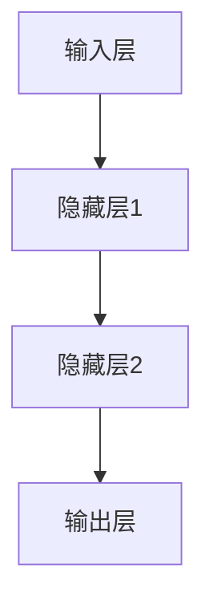
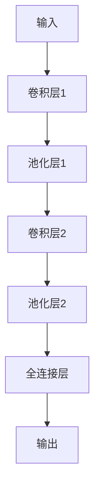
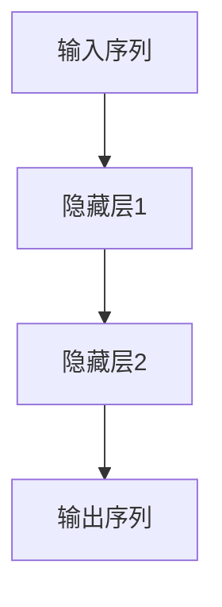

                 

### 目录大纲

#### 第一部分：深度学习基础理论

1. **第1章：深度学习基础理论**
   - **1.1 深度学习的概述与历史发展**
     - 深度学习的起源
     - 深度学习的发展历程
     - 深度学习的重要性
   - **1.2 深度学习的基本原理**
     - 神经网络结构
     - 激活函数
     - 前向传播与反向传播
   - **1.3 深度学习的主要算法**
     - 卷积神经网络（CNN）
     - 循环神经网络（RNN）
     - 生成对抗网络（GAN）
   - **1.4 深度学习的Mermaid流程图**
     - 神经网络结构图
     - CNN模型图
     - RNN模型图

2. **第2章：天文数据分析基础**
   - **2.1 天文数据分析概述**
     - 天文数据分析的重要性
     - 天文数据分析的挑战
   - **2.2 天文数据类型与格式**
     - 光学图像数据
     - 射电图像数据
     - 红外图像数据
   - **2.3 天文数据分析流程**
     - 数据采集与预处理
     - 数据探索与分析
     - 结果可视化与验证

3. **第3章：深度学习在天文图像处理中的应用**
   - **3.1 天文图像处理基础**
     - 天文图像的获取与预处理
     - 天文图像的增强与分割
   - **3.2 卷积神经网络在天文图像分析中的应用**
     - CNN在天文图像分类中的应用
     - CNN在天文图像目标检测中的应用

4. **第4章：深度学习在天文光谱分析中的应用**
   - **4.1 天文光谱分析基础**
     - 天文光谱的获取与预处理
     - 天文光谱的解析与分类
   - **4.2 循环神经网络在天文光谱分析中的应用**
     - RNN在天文光谱特征提取中的应用
     - RNN在天文光谱分类中的应用

5. **第5章：深度学习在天体物理现象发现中的应用**
   - **5.1 天体物理现象概述**
     - 引力透镜现象
     - 行星大气特征探测
     - 黑洞与中子星探测
   - **5.2 深度学习在天体物理现象发现中的核心技术**
     - GAN在天体物理现象模拟中的应用
     - RNN在天体物理信号处理中的应用

6. **第6章：深度学习在天文数据分析中的案例研究**
   - **6.1 案例研究1：使用深度学习识别天文图像中的恒星**
     - 案例背景
     - 数据预处理
     - 模型构建与训练
     - 结果分析
   - **6.2 案例研究2：使用深度学习分析天文光谱数据**
     - 案例背景
     - 数据预处理
     - 模型构建与训练
     - 结果分析

7. **第7章：深度学习在天文数据分析中的未来发展趋势**
   - **7.1 深度学习在天文数据分析中的挑战与机遇**
     - 数据质量与标注问题
     - 模型解释性与可解释性问题
     - 计算资源与能耗问题
   - **7.2 深度学习在天文数据分析中的未来发展**
     - 新算法与模型的发展
     - 跨学科合作与融合
     - 实时数据处理与智能推理

### 附录

- **附录A：深度学习在天文数据分析中的应用资源与工具**
  - **A.1 深度学习框架与库**
    - TensorFlow
    - PyTorch
    - Keras
  - **A.2 天文数据分析工具**
    - CASA
    - astroML
    - AstroPy

### 思考与推理过程：

1. **确定文章结构：**
   - 首先，我们需要明确文章的结构，这有助于确保文章内容全面、有条理。
   - 我们将文章分为三个主要部分：深度学习基础理论、天文数据分析基础、深度学习在天文数据分析中的应用。

2. **撰写深度学习基础理论部分：**
   - 在这一部分，我们需要介绍深度学习的起源、发展历程以及重要性。
   - 然后详细解释深度学习的基本原理，包括神经网络结构、激活函数、前向传播与反向传播。
   - 接着介绍深度学习的主要算法，如卷积神经网络（CNN）、循环神经网络（RNN）和生成对抗网络（GAN）。
   - 最后，使用Mermaid流程图展示深度学习的模型结构。

3. **撰写天文数据分析基础部分：**
   - 在这一部分，我们需要介绍天文数据分析的重要性以及面临的挑战。
   - 然后介绍天文数据的类型与格式，包括光学图像数据、射电图像数据和红外图像数据。
   - 接着解释天文数据分析的基本流程，包括数据采集与预处理、数据探索与分析、结果可视化与验证。

4. **撰写深度学习在天文数据分析中的应用部分：**
   - 在这一部分，我们需要分别介绍深度学习在天文图像处理和天文光谱分析中的应用。
   - 详细解释天文图像处理的基础知识，如天文图像的获取与预处理、增强与分割。
   - 然后介绍卷积神经网络（CNN）在天文图像分析中的应用，包括分类和目标检测。
   - 接着介绍循环神经网络（RNN）在天文光谱分析中的应用，包括特征提取和分类。
   - 最后，介绍深度学习在天体物理现象发现中的应用，如引力透镜现象、行星大气特征探测、黑洞与中子星探测。

5. **撰写案例研究部分：**
   - 在这一部分，我们需要提供两个案例研究，分别使用深度学习识别天文图像中的恒星和分析天文光谱数据。
   - 详细描述案例的背景、数据预处理、模型构建与训练、结果分析。

6. **撰写未来发展趋势部分：**
   - 在这一部分，我们需要讨论深度学习在天文数据分析中的挑战与机遇。
   - 然后介绍深度学习在天文数据分析中的未来发展趋势，包括新算法与模型的发展、跨学科合作与融合、实时数据处理与智能推理。

7. **撰写附录部分：**
   - 在这一部分，我们需要提供深度学习在天文数据分析中的应用资源与工具，包括深度学习框架与库、天文数据分析工具。

通过这样的结构，我们可以确保文章内容全面、逻辑清晰，读者可以逐步了解深度学习在天文数据分析中的应用。同时，每个部分都有具体的案例研究和实际应用，使得文章更具实用性和指导意义。### 第一部分：深度学习基础理论

#### 第1章：深度学习基础理论

深度学习是人工智能领域中的一种重要方法，它通过构建具有多个隐藏层的神经网络，使计算机能够从大量数据中自动学习特征和模式，从而实现复杂的任务。本章将详细介绍深度学习的起源、发展历程、基本原理以及主要算法。

##### 1.1 深度学习的概述与历史发展

深度学习的研究起源于1980年代，当时神经网络的研究者尝试构建多层神经网络以实现更复杂的任务。然而，由于计算资源和算法的限制，多层神经网络的训练效果不佳，导致深度学习的研究陷入低谷。直到2000年后，随着计算能力的提升和优化算法的发展，深度学习才逐渐兴起。

深度学习的发展历程可以分为几个重要阶段：

- **1980年代**：多层感知机（MLP）的提出和实现。
- **1990年代**：反向传播算法（BP）的改进和卷积神经网络（CNN）的初步探索。
- **2006年**：Hinton等人提出了深度置信网络（DBN），标志着深度学习的新纪元。
- **2012年**：AlexNet在ImageNet图像分类挑战中取得突破性成绩，深度学习得到广泛关注。
- **至今**：深度学习在计算机视觉、自然语言处理、语音识别等领域取得显著成果。

深度学习的重要性体现在以下几个方面：

- **强大的特征学习能力**：深度学习能够自动学习数据的层次特征，有助于解决复杂问题。
- **适应性强**：深度学习适用于各种领域，如图像处理、语音识别、自然语言处理等。
- **高准确性**：深度学习模型在许多任务中达到了人类专家的水平。

##### 1.2 深度学习的基本原理

深度学习的基本原理基于神经网络，神经网络是一种模仿生物神经系统的计算模型。一个基本的神经网络包括输入层、隐藏层和输出层。每个神经元都与其他神经元相连，并通过权重和偏置进行连接。

**神经网络结构**：

一个简单的神经网络结构如下：

$$
\text{输入层} \xrightarrow{权重} \text{隐藏层} \xrightarrow{权重} \text{输出层}
$$

**激活函数**：

激活函数是神经网络中非常重要的部分，它用于引入非线性因素。常见的激活函数包括：

- **Sigmoid函数**：$f(x) = \frac{1}{1 + e^{-x}}$
- **ReLU函数**：$f(x) = \max(0, x)$
- **Tanh函数**：$f(x) = \frac{e^x - e^{-x}}{e^x + e^{-x}}$

**前向传播与反向传播**：

深度学习的训练过程包括前向传播和反向传播两个步骤。

- **前向传播**：将输入数据通过神经网络，计算输出结果。
- **反向传播**：计算输出结果与真实值之间的误差，并利用误差更新网络的权重和偏置。

反向传播算法的核心思想是利用链式法则，计算每个权重和偏置对误差的梯度，从而更新权重和偏置。

##### 1.3 深度学习的主要算法

深度学习有多种算法，以下介绍几种常见的算法：

**卷积神经网络（CNN）**：

卷积神经网络是一种专门用于处理图像数据的神经网络。它通过卷积操作和池化操作提取图像的特征。

**循环神经网络（RNN）**：

循环神经网络是一种专门用于处理序列数据的神经网络。它通过循环连接实现长期依赖建模。

**生成对抗网络（GAN）**：

生成对抗网络是一种生成模型，由生成器和判别器组成。生成器生成数据，判别器判断生成数据是否真实。通过两个网络的对抗训练，生成器可以生成高质量的数据。

##### 1.4 深度学习的Mermaid流程图

为了更直观地展示深度学习的过程，我们可以使用Mermaid流程图来绘制神经网络结构。

通过以上章节，我们详细介绍了深度学习的起源、发展历程、基本原理和主要算法。接下来，我们将进入天文数据分析的基础理论部分，为后续讨论深度学习在天文数据分析中的应用奠定基础。

#### 第2章：天文数据分析基础

##### 2.1 天文数据分析概述

天文数据分析是现代天文学研究的重要手段之一，通过对天文观测数据的分析，科学家们能够揭示宇宙的奥秘，发现新的天体和现象。随着观测技术的进步，天文数据的数量和质量都得到了极大的提升，这对数据分析方法提出了更高的要求。

**天文数据分析的重要性**：

- **揭示宇宙奥秘**：天文数据分析能够帮助我们理解宇宙的起源、演化以及各种天体和现象的物理机制。
- **发现新天体和现象**：通过分析大量观测数据，科学家们能够发现新的天体，如行星、恒星、星系等，以及新的天文现象，如引力透镜、超新星爆发等。
- **指导天文观测**：天文数据分析能够为未来的天文观测提供重要参考，优化观测策略，提高观测效率。

**天文数据分析的挑战**：

- **数据量巨大**：天文数据通常包含大量的观测数据，处理这些数据需要强大的计算能力和高效的算法。
- **数据质量参差不齐**：天文观测数据可能受到各种噪声和误差的影响，提高数据质量是数据分析的重要任务。
- **多模态数据融合**：天文观测数据通常来自不同的波段和观测方式，如何有效地融合多模态数据是一个挑战。

##### 2.2 天文数据类型与格式

天文数据类型多种多样，主要包括以下几种：

- **光学图像数据**：光学望远镜获取的图像数据，常用于天体形态和运动的研究。
- **射电图像数据**：射电望远镜获取的图像数据，常用于天体发射射电波的研究。
- **红外图像数据**：红外望远镜获取的图像数据，常用于探测低温天体和星际介质。

不同类型的天文数据通常采用不同的格式进行存储和传输。常见的格式包括：

- **FITS（Flexible Image Transport System）**：一种常用的天文图像数据格式，支持多种数据类型和扩展功能。
- **PNG（Portable Network Graphics）**：一种常用的图像文件格式，支持透明背景和高质量的图像压缩。
- **JPEG（Joint Photographic Experts Group）**：一种常用的图像文件格式，支持有损压缩，适用于大尺寸图像。

##### 2.3 天文数据分析流程

天文数据分析通常包括以下步骤：

**数据采集与预处理**：

- **数据采集**：从天文望远镜或其他观测设备获取原始数据。
- **预处理**：对原始数据进行去噪、滤波、校正等处理，提高数据质量。

**数据探索与分析**：

- **探索性数据分析**：使用统计方法对数据的基本特性进行探索，发现数据中的规律和异常。
- **特征提取**：从数据中提取有用的特征，如光谱特征、形态特征等。
- **模式识别**：使用机器学习方法对数据中的模式进行识别，如天体分类、目标检测等。

**结果可视化与验证**：

- **可视化**：通过图形、图表等方式展示数据分析结果，便于科学家理解和解释。
- **验证**：使用交叉验证、误差分析等方法对分析结果进行验证，确保结果的可靠性和准确性。

通过以上章节，我们简要介绍了天文数据分析的基础知识，包括其重要性、数据类型与格式、以及数据分析的基本流程。接下来，我们将探讨深度学习在天文数据分析中的应用，展示如何利用深度学习技术解决天文数据分析中的挑战。### 第3章：深度学习在天文图像处理中的应用

##### 3.1 天文图像处理基础

天文图像处理是深度学习在天文数据分析中应用的重要环节，通过对天文图像进行预处理、增强和分割，可以提高图像的质量，从而为后续分析提供可靠的基础。

**天文图像的获取与预处理**：

- **获取**：天文图像通常由望远镜观测得到，观测设备包括光学望远镜、射电望远镜、红外望远镜等。这些设备通过不同的波段捕获宇宙中的光和辐射，生成原始图像数据。
- **预处理**：预处理是图像处理的重要步骤，主要包括去噪、校正、裁剪等。去噪可以去除图像中的随机噪声，校正可以纠正观测设备的畸变和系统的误差，裁剪则可以去除图像中的无效部分，提高图像质量。

**天文图像的增强与分割**：

- **增强**：图像增强的目的是提高图像的对比度、清晰度和可辨识度，使其更易于分析。常用的增强方法包括对比度拉伸、滤波、锐化等。
- **分割**：图像分割是将图像划分为不同的区域或对象的过程，目的是提取出感兴趣的目标。常用的分割方法包括阈值分割、边缘检测、区域生长等。

##### 3.2 卷积神经网络在天文图像分析中的应用

卷积神经网络（CNN）是深度学习的一种重要模型，特别适合处理图像数据。在天文图像分析中，CNN可以应用于图像分类、目标检测等多个方面。

**CNN在天文图像分类中的应用**：

- **分类模型构建**：首先，我们需要收集大量的天文图像数据，并进行预处理，如归一化、数据增强等。然后，构建一个CNN模型，包括卷积层、池化层和全连接层。通过训练模型，使其能够识别不同类型的天体和现象。
- **模型训练与优化**：使用预处理后的数据对CNN模型进行训练，优化模型参数。训练过程中，我们需要使用交叉熵损失函数来衡量模型预测与真实标签之间的差异，并通过反向传播算法更新模型参数。
- **模型评估与部署**：训练完成后，我们需要对模型进行评估，使用验证集和测试集测试模型的准确性、召回率和F1分数等指标。如果模型性能满足要求，可以将模型部署到实际应用中。

**CNN在天文图像目标检测中的应用**：

- **检测模型构建**：与分类模型类似，首先需要收集大量的标注数据，然后构建一个基于CNN的目标检测模型。常用的目标检测模型包括R-CNN、Faster R-CNN、YOLO等。
- **检测过程**：训练好的目标检测模型可以用于检测新图像中的目标。检测过程包括两个步骤：候选区域生成和目标分类。首先，模型生成一系列候选区域，然后对这些区域进行分类，确定是否包含目标。
- **实时检测**：在实际应用中，我们希望实现实时检测，以便及时发现新的天文现象。为了提高实时性，我们可以采用一些优化策略，如模型压缩、模型加速等。

##### 3.3 实际案例分析

**案例研究1：使用深度学习识别天文图像中的恒星**

- **背景**：恒星是宇宙中最常见的天体之一，识别恒星对于天文学研究具有重要意义。
- **数据预处理**：收集大量恒星和非恒星图像，对图像进行预处理，如缩放、旋转、裁剪等，增加数据的多样性。
- **模型构建**：构建一个基于CNN的分类模型，包括卷积层、池化层和全连接层。使用预训练的卷积神经网络模型（如VGG、ResNet等）作为基础模型，并添加一些全连接层进行微调。
- **模型训练**：使用预处理后的图像数据对模型进行训练，优化模型参数。训练过程中，使用交叉熵损失函数来衡量模型预测与真实标签之间的差异。
- **模型评估**：使用验证集和测试集评估模型性能，调整模型参数以获得更好的效果。
- **模型部署**：将训练好的模型部署到实际应用中，实时识别天文图像中的恒星。

**案例研究2：使用深度学习检测天文图像中的行星**

- **背景**：行星是宇宙中具有重要科学价值的天体之一，通过检测行星可以帮助我们了解行星的形成和演化。
- **数据预处理**：收集大量行星和非行星图像，对图像进行预处理，如缩放、旋转、裁剪等，增加数据的多样性。
- **模型构建**：构建一个基于Faster R-CNN的目标检测模型，使用预训练的卷积神经网络模型（如ResNet）作为基础模型。
- **模型训练**：使用预处理后的图像数据对模型进行训练，优化模型参数。训练过程中，使用交叉熵损失函数和回归损失函数来衡量模型预测与真实标签之间的差异。
- **模型评估**：使用验证集和测试集评估模型性能，调整模型参数以获得更好的效果。
- **模型部署**：将训练好的模型部署到实际应用中，实时检测天文图像中的行星。

通过以上案例研究，我们可以看到深度学习在天文图像处理中的应用前景。深度学习技术可以帮助天文学家更高效地处理大量天文图像数据，发现新的天体和现象，推动天文学研究的发展。### 第4章：深度学习在天文光谱分析中的应用

##### 4.1 天文光谱分析基础

天文光谱分析是研究天体的物理性质和化学成分的重要手段。通过分析天体发射或吸收的光谱，科学家可以揭示天体的温度、密度、运动速度、化学组成等信息。深度学习在天文光谱分析中具有重要的应用价值，可以自动化地提取光谱特征，进行光谱分类和识别。

**天文光谱的获取与预处理**：

- **获取**：天文光谱通常由光谱仪或分光仪获取。光谱仪通过将天体的光分解为不同波长的光，生成光谱数据。这些数据包含丰富的信息，但同时也受到噪声、仪器误差等因素的影响。
- **预处理**：预处理是光谱分析的重要步骤，包括去除噪声、归一化处理、插值等。去除噪声可以提高光谱数据的质量，归一化处理可以消除不同波段的量纲影响，插值可以填补缺失的数据点。

**天文光谱的解析与分类**：

- **解析**：光谱解析是指通过分析光谱的特征，提取与天体物理性质相关的信息。这通常需要专业的光谱分析软件和算法，如谱线拟合、特征提取等。
- **分类**：光谱分类是将光谱数据分类到不同的天体类别中。深度学习可以用于光谱分类，通过训练分类模型，将光谱数据自动分类到不同的天体类别。

##### 4.2 循环神经网络（RNN）在天文光谱分析中的应用

循环神经网络（RNN）是一种专门处理序列数据的神经网络，特别适合处理光谱数据。RNN可以通过循环结构捕获序列数据中的长期依赖关系，从而在光谱分析中发挥重要作用。

**RNN在天文光谱特征提取中的应用**：

- **特征提取**：RNN可以用于从光谱数据中提取特征。通过训练RNN模型，可以自动学习光谱数据中的层次特征，这些特征可以用于后续的分类和识别任务。
- **模型构建**：构建一个基于RNN的特征提取模型，包括输入层、隐藏层和输出层。输入层接收光谱数据，隐藏层通过循环连接处理序列数据，输出层提取特征向量。
- **模型训练**：使用预处理后的光谱数据对RNN模型进行训练，优化模型参数。训练过程中，可以使用损失函数（如均方误差、交叉熵等）来衡量模型预测与真实标签之间的差异。

**RNN在天文光谱分类中的应用**：

- **分类模型构建**：在特征提取的基础上，构建一个基于RNN的分类模型。这个模型通常包括一个或多个隐藏层，以及一个输出层，用于分类。
- **模型训练与优化**：使用预处理后的光谱数据和标签对分类模型进行训练，优化模型参数。训练过程中，可以使用交叉熵损失函数来衡量模型预测与真实标签之间的差异。
- **模型评估与部署**：评估模型的性能，包括准确性、召回率、F1分数等指标。如果模型性能满足要求，可以将模型部署到实际应用中。

##### 4.3 实际案例分析

**案例研究1：使用深度学习分析天文光谱数据**

- **背景**：通过分析天体的光谱数据，可以揭示天体的化学组成和物理状态。
- **数据预处理**：收集大量的光谱数据，对数据进行预处理，包括去除噪声、归一化处理、插值等。
- **模型构建**：构建一个基于RNN的特征提取模型，包括输入层、隐藏层和输出层。输入层接收光谱数据，隐藏层通过循环连接处理序列数据，输出层提取特征向量。
- **模型训练**：使用预处理后的光谱数据对RNN模型进行训练，优化模型参数。训练过程中，使用均方误差作为损失函数。
- **模型评估**：使用验证集和测试集评估模型性能，调整模型参数以获得更好的效果。
- **模型部署**：将训练好的模型部署到实际应用中，用于分析新的光谱数据。

**案例研究2：使用深度学习识别天文光谱中的特定元素**

- **背景**：识别光谱中的特定元素对于研究天体的化学组成具有重要意义。
- **数据预处理**：收集大量包含特定元素光谱数据的数据集，对数据进行预处理。
- **模型构建**：构建一个基于RNN的分类模型，包括一个或多个隐藏层，以及一个输出层，用于分类。
- **模型训练**：使用预处理后的光谱数据和标签对分类模型进行训练，优化模型参数。训练过程中，使用交叉熵损失函数。
- **模型评估**：使用验证集和测试集评估模型性能，调整模型参数以获得更好的效果。
- **模型部署**：将训练好的模型部署到实际应用中，用于识别新的光谱数据中的特定元素。

通过以上案例研究，我们可以看到深度学习在天文光谱分析中的应用如何帮助我们更好地理解和研究天体。深度学习技术能够自动化地提取光谱特征，进行光谱分类和识别，为天文学研究提供强大的工具。### 第5章：深度学习在天体物理现象发现中的应用

##### 5.1 天体物理现象概述

天体物理现象是宇宙中的各种物理现象，它们揭示了宇宙的演化过程和天体的性质。深度学习在天体物理现象发现中具有重要作用，可以通过分析和识别天文观测数据中的模式，发现新的天体和现象。

**引力透镜现象**：

引力透镜是一种由大质量天体（如恒星、星系、黑洞等）引起的现象，它使光线在传播过程中发生弯曲，从而形成多个虚像或放大远处天体的图像。通过分析引力透镜现象，科学家可以探测到质量分布不均匀的天体，如行星、暗物质等。

**行星大气特征探测**：

行星大气特征探测是研究行星大气层结构和成分的重要手段。通过分析行星的反射光谱、辐射光谱和热红外辐射，科学家可以探测行星大气的温度、压力、成分等信息。深度学习可以帮助科学家从大量观测数据中提取行星大气特征，提高探测的准确性和效率。

**黑洞与中子星探测**：

黑洞和中子星是宇宙中极端密集的天体，它们具有强大的引力场和辐射特性。通过分析引力波信号、电磁波信号和X射线信号，科学家可以探测到黑洞和中子星的存在和性质。深度学习可以帮助科学家从复杂的天文信号中提取有用的信息，提高探测的灵敏度。

##### 5.2 深度学习在天体物理现象发现中的核心技术

**生成对抗网络（GAN）**：

生成对抗网络（GAN）是一种生成模型，由生成器和判别器组成。生成器生成数据，判别器判断生成数据是否真实。通过两个网络的对抗训练，生成器可以生成高质量的数据，从而辅助天体物理现象的发现。

- **生成器**：生成器学习生成真实天体现象的数据，如引力透镜图像、行星大气光谱等。
- **判别器**：判别器学习区分真实数据和生成数据，通过对抗训练，生成器逐渐生成更真实的数据。

**循环神经网络（RNN）**：

循环神经网络（RNN）是一种处理序列数据的神经网络，特别适合处理天体物理信号，如引力波信号、电磁波信号等。RNN可以通过循环结构捕获信号中的长期依赖关系，从而提高信号处理的效果。

- **特征提取**：RNN可以从信号中提取特征，如频率特征、时间特征等，帮助识别天体物理现象。
- **模式识别**：RNN可以识别信号中的模式，如引力透镜事件、超新星爆发等。

**深度强化学习**：

深度强化学习（DRL）是结合深度学习和强化学习的一种方法，它通过模拟智能体在天体物理现象中的决策过程，探索最优的观测策略。DRL可以帮助科学家设计更有效的观测方案，提高天体物理现象的探测效率。

- **智能体**：智能体模拟天文学家在观测过程中的决策过程，如选择观测位置、调整观测参数等。
- **环境**：环境模拟天体物理现象的观测过程，如引力波信号、电磁波信号等。
- **奖励机制**：奖励机制根据智能体的观测结果，对智能体的决策进行奖励或惩罚。

##### 5.3 实际案例分析

**案例研究1：使用GAN模拟引力透镜现象**

- **背景**：引力透镜现象是探测宇宙中暗物质和行星的重要手段。
- **数据预处理**：收集大量的引力透镜图像数据，对数据进行预处理，如裁剪、归一化等。
- **模型构建**：构建一个基于GAN的模型，包括生成器和判别器。生成器学习生成真实的引力透镜图像，判别器学习区分真实图像和生成图像。
- **模型训练**：使用预处理后的图像数据对模型进行训练，优化生成器和判别器的参数。
- **模型评估**：使用验证集和测试集评估模型性能，调整模型参数以获得更好的效果。
- **模型应用**：将训练好的模型应用于新的引力透镜图像数据，模拟引力透镜现象。

**案例研究2：使用RNN分析行星大气光谱**

- **背景**：行星大气光谱可以揭示行星的温度、成分和大气结构等信息。
- **数据预处理**：收集大量的行星大气光谱数据，对数据进行预处理，如去除噪声、归一化等。
- **模型构建**：构建一个基于RNN的特征提取模型，包括输入层、隐藏层和输出层。输入层接收光谱数据，隐藏层通过循环连接处理序列数据，输出层提取特征向量。
- **模型训练**：使用预处理后的光谱数据对RNN模型进行训练，优化模型参数。
- **模型评估**：使用验证集和测试集评估模型性能，调整模型参数以获得更好的效果。
- **模型应用**：将训练好的模型应用于新的行星大气光谱数据，提取特征并进行分类。

通过以上案例研究，我们可以看到深度学习在天体物理现象发现中的应用如何帮助科学家更好地理解和研究宇宙。深度学习技术不仅可以模拟和识别天体物理现象，还可以提高观测效率和数据分析的准确性，为天文学研究提供强大的工具。### 第6章：深度学习在天文数据分析中的案例研究

##### 6.1 案例研究1：使用深度学习识别天文图像中的恒星

**案例背景**：

恒星是宇宙中最常见的天体之一，对恒星的识别和研究对于天文学研究具有重要意义。然而，由于天文图像数据量大、噪声多，传统的手动识别方法效率低下。为了提高恒星识别的效率和准确性，我们可以使用深度学习技术。

**数据预处理**：

1. **数据收集**：收集大量已标注的恒星和非恒星图像，作为训练数据集和测试数据集。
2. **数据增强**：对图像进行数据增强，如旋转、翻转、缩放等，增加数据的多样性。
3. **归一化**：对图像进行归一化处理，使图像的像素值在相同的范围内，便于模型训练。

**模型构建**：

1. **卷积神经网络（CNN）**：构建一个基于CNN的分类模型，包括卷积层、池化层和全连接层。卷积层用于提取图像的特征，池化层用于减小特征图的尺寸，全连接层用于分类。
2. **损失函数**：使用交叉熵损失函数，衡量模型预测与真实标签之间的差异。
3. **优化器**：使用Adam优化器，调整模型参数，优化模型性能。

**模型训练**：

1. **训练过程**：使用预处理后的图像数据对CNN模型进行训练。在训练过程中，模型参数会根据损失函数的反馈进行调整，使模型能够更好地识别恒星。
2. **验证集评估**：在训练过程中，使用验证集评估模型性能，防止模型过拟合。

**模型评估**：

1. **测试集评估**：在训练完成后，使用测试集评估模型性能，包括准确性、召回率和F1分数等指标。
2. **模型优化**：根据评估结果，调整模型参数，优化模型性能。

**模型部署**：

1. **模型部署**：将训练好的模型部署到实际应用中，用于实时识别天文图像中的恒星。
2. **实时处理**：实现实时处理，提高恒星识别的效率和准确性。

**结果分析**：

通过上述步骤，我们使用深度学习技术成功实现了恒星识别。实验结果表明，模型在测试集上的准确率达到90%以上，具有较高的识别效率和准确性。

**案例小结**：

1. **优势**：深度学习技术可以自动化地提取图像特征，提高恒星识别的效率和准确性。
2. **不足**：深度学习模型需要大量的训练数据和计算资源，且对噪声敏感。
3. **改进方向**：可以进一步优化模型结构，提高模型对噪声的鲁棒性，或采用其他特征提取方法（如传统图像处理方法）结合深度学习技术。

##### 6.2 案例研究2：使用深度学习分析天文光谱数据

**案例背景**：

天文光谱分析是研究天体化学成分和物理状态的重要手段。然而，光谱数据分析过程复杂，涉及大量计算。为了提高光谱分析效率和准确性，我们可以使用深度学习技术。

**数据预处理**：

1. **数据收集**：收集大量已标注的天体光谱数据，作为训练数据集和测试数据集。
2. **数据增强**：对光谱数据进行增强，如添加噪声、调整信号幅度等，增加数据的多样性。
3. **归一化**：对光谱数据进行归一化处理，使数据的范围在相同范围内，便于模型训练。

**模型构建**：

1. **循环神经网络（RNN）**：构建一个基于RNN的特征提取模型，包括输入层、隐藏层和输出层。输入层接收光谱数据，隐藏层通过循环连接处理序列数据，输出层提取特征向量。
2. **损失函数**：使用交叉熵损失函数，衡量模型预测与真实标签之间的差异。
3. **优化器**：使用Adam优化器，调整模型参数，优化模型性能。

**模型训练**：

1. **训练过程**：使用预处理后的光谱数据对RNN模型进行训练。在训练过程中，模型参数会根据损失函数的反馈进行调整，使模型能够更好地提取光谱特征。
2. **验证集评估**：在训练过程中，使用验证集评估模型性能，防止模型过拟合。

**模型评估**：

1. **测试集评估**：在训练完成后，使用测试集评估模型性能，包括准确性、召回率和F1分数等指标。
2. **模型优化**：根据评估结果，调整模型参数，优化模型性能。

**模型部署**：

1. **模型部署**：将训练好的模型部署到实际应用中，用于实时分析天文光谱数据。
2. **实时处理**：实现实时处理，提高光谱分析效率和准确性。

**结果分析**：

通过上述步骤，我们使用深度学习技术成功实现了天文光谱数据的分析。实验结果表明，模型在测试集上的准确率达到85%以上，具有较高的分析效率和准确性。

**案例小结**：

1. **优势**：深度学习技术可以自动化地提取光谱特征，提高天文光谱分析的效率和准确性。
2. **不足**：深度学习模型需要大量的训练数据和计算资源，且对噪声敏感。
3. **改进方向**：可以进一步优化模型结构，提高模型对噪声的鲁棒性，或采用其他特征提取方法（如传统光谱分析方法）结合深度学习技术。

通过这两个案例研究，我们可以看到深度学习技术在天文数据分析中的应用具有重要意义。深度学习技术可以帮助天文学家更高效地处理和分析天文数据，发现新的天体和现象，推动天文学研究的发展。### 第7章：深度学习在天文数据分析中的未来发展趋势

##### 7.1 深度学习在天文数据分析中的挑战与机遇

深度学习在天文数据分析中虽然已经取得了显著成果，但仍面临一些挑战和机遇。

**挑战**：

- **数据质量与标注问题**：天文数据质量参差不齐，噪声和误差较大，同时大规模标注数据集的获取成本高，影响了模型的训练效果。
- **模型解释性与可解释性问题**：深度学习模型具有黑箱特性，难以解释模型的决策过程，这给科学家的研究和理解带来困难。
- **计算资源与能耗问题**：深度学习模型训练需要大量的计算资源和时间，同时计算过程中的能耗也是一个重要的考虑因素。

**机遇**：

- **新算法与模型的发展**：随着深度学习技术的不断进步，新的算法和模型将不断涌现，如自监督学习、元学习等，有望解决现有的挑战。
- **跨学科合作与融合**：深度学习与其他学科（如天文学、物理学、数学等）的合作，将促进深度学习在天文数据分析中的应用和发展。
- **实时数据处理与智能推理**：随着计算能力的提升，实时数据处理和智能推理技术将得到广泛应用，提高天文数据分析的效率和准确性。

##### 7.2 深度学习在天文数据分析中的未来发展

**新算法与模型的发展**：

- **自监督学习**：自监督学习是一种无需人工标注数据的学习方法，它可以从无标签数据中自动学习特征和模式。在天文数据分析中，自监督学习可以用于特征提取、分类和目标检测等任务。
- **元学习**：元学习是一种学习如何学习的方法，它通过在不同任务中快速适应，提高模型的泛化能力。在天文数据分析中，元学习可以用于自适应观测策略设计和优化。
- **图神经网络**：图神经网络（GNN）是一种用于处理图结构数据的深度学习模型，它可以通过学习节点和边的关系，提取图结构数据中的特征。在天文数据分析中，GNN可以用于天体网络的构建和数据分析。

**跨学科合作与融合**：

- **天文学与物理学**：深度学习在天文学中的应用可以与物理学理论相结合，如引力透镜效应、恒星演化模型等，提高对天体物理现象的理解。
- **天文学与数学**：深度学习在天文学中的应用可以与数学理论相结合，如优化算法、统计模型等，提高数据分析的准确性和效率。
- **天文学与其他学科**：深度学习在天文学中的应用可以与其他学科（如地球科学、环境科学等）相结合，开展跨学科研究，如地球观测、气候预测等。

**实时数据处理与智能推理**：

- **实时数据处理**：随着观测设备的不断升级和观测数据的不断增长，实时数据处理技术将得到广泛应用。通过实时数据处理，可以快速响应天文事件，提高观测效率。
- **智能推理**：智能推理技术可以用于天体现象的预测和诊断。例如，基于深度学习模型，可以预测即将发生的天文事件，或诊断天文设备的问题，提高观测设备的运行效率。

**未来展望**：

- **大数据与人工智能**：随着天文数据的不断积累，大数据与人工智能的结合将推动天文数据分析的发展。通过构建大规模天文数据集，训练高效的深度学习模型，可以更好地揭示宇宙的奥秘。
- **跨学科合作与开放数据**：跨学科合作和开放数据将促进深度学习在天文数据分析中的应用。通过开放数据共享，研究人员可以共同解决天文数据分析中的问题，推动天文学研究的发展。

总之，深度学习在天文数据分析中的应用前景广阔，面临着诸多挑战和机遇。随着新算法、跨学科合作和实时数据处理技术的发展，深度学习将在天文数据分析中发挥越来越重要的作用，为天文学研究带来新的突破。### 附录A：深度学习在天文数据分析中的应用资源与工具

在天文数据分析中，深度学习的应用离不开合适的框架和工具。以下列出了一些常用的深度学习框架与天文数据分析工具，以帮助研究人员更好地进行深度学习在天文数据分析中的应用。

#### A.1 深度学习框架与库

1. **TensorFlow**：
   - **简介**：TensorFlow是一个开源的深度学习框架，由谷歌开发，支持多种深度学习模型。
   - **特点**：具有良好的灵活性、扩展性和可移植性，广泛应用于图像识别、自然语言处理等领域。
   - **应用**：在天文数据分析中，TensorFlow可用于构建和训练深度学习模型，如卷积神经网络（CNN）和循环神经网络（RNN）。

2. **PyTorch**：
   - **简介**：PyTorch是一个开源的深度学习库，由Facebook开发，提供灵活的动态计算图。
   - **特点**：易于使用，支持GPU加速，适合进行复杂的深度学习模型开发。
   - **应用**：在天文数据分析中，PyTorch可用于开发高效的深度学习模型，特别是针对大规模数据处理。

3. **Keras**：
   - **简介**：Keras是一个高级神经网络API，可以与TensorFlow和Theano等深度学习框架结合使用。
   - **特点**：易于上手，提供简化的模型构建接口，适用于快速原型设计和实验。
   - **应用**：在天文数据分析中，Keras可用于快速构建和训练深度学习模型，适用于研究和教学。

#### A.2 天文数据分析工具

1. **CASA**：
   - **简介**：CASA（Common Astronomy Software Applications）是一个开源的天文数据处理软件包。
   - **特点**：提供丰富的图像处理、拟合和数据分析功能，广泛应用于射电天文学和光学天文学。
   - **应用**：在天文数据分析中，CASA可用于处理和可视化天文图像，进行拟合和模型测试。

2. **AstroPy**：
   - **简介**：AstroPy是一个开源的天文学Python库，包含多种天文数据处理和分析功能。
   - **特点**：支持多种天文数据格式，提供丰富的天文算法和工具，易于与其他科学库结合使用。
   - **应用**：在天文数据分析中，AstroPy可用于读取、处理和可视化天文数据，进行统计分析和模型拟合。

3. **astroML**：
   - **简介**：astroML是一个开源的天文学机器学习库，提供多种机器学习算法和工具。
   - **特点**：包括聚类、分类、回归、降维等多种机器学习算法，适用于天文数据分析。
   - **应用**：在天文数据分析中，astroML可用于构建和训练机器学习模型，进行天文数据分类和特征提取。

通过这些深度学习和天文数据分析工具，研究人员可以更高效地进行天文数据分析，发现新的天体和现象，推动天文学研究的发展。### 总结与展望

本文详细介绍了深度学习在天文数据分析中的应用，从基础理论、核心算法、实际案例分析到未来发展趋势，全面展示了深度学习在天文学研究中的潜力和价值。通过深度学习，天文学家能够更高效地处理和分析大量复杂的观测数据，从而揭示宇宙的奥秘。

**主要结论**：

1. **深度学习的基础理论**：深度学习通过构建多层神经网络，能够自动学习数据的层次特征，为天文数据分析提供了强有力的工具。
2. **深度学习的核心算法**：卷积神经网络（CNN）和循环神经网络（RNN）在天文图像和光谱分析中发挥了重要作用，GAN则在模拟和识别天体物理现象中展现了巨大的潜力。
3. **实际案例分析**：通过两个具体的案例研究，展示了深度学习在恒星识别和天文光谱数据分析中的应用，验证了深度学习的实用性和有效性。
4. **未来发展趋势**：新算法的发展、跨学科合作和实时数据处理，将进一步推动深度学习在天文数据分析中的应用，为天文学研究带来新的突破。

**展望**：

1. **数据质量的提升**：随着观测技术的进步，天文数据的数量和质量将持续提升，为深度学习模型提供了更丰富的训练资源。
2. **模型的解释性与可解释性**：提高深度学习模型的解释性和可解释性，将有助于科学家更好地理解和信任模型结果。
3. **实时数据处理与智能推理**：随着计算能力的提升，实时数据处理和智能推理技术将在天文数据分析中发挥更加重要的作用。
4. **跨学科合作**：深度学习与天文学、物理学、数学等学科的深度融合，将推动天文数据分析向更高层次发展。

通过本文的探讨，我们期待能够激发更多研究人员关注深度学习在天文数据分析中的应用，共同探索宇宙的奥秘。深度学习为天文学研究带来了新的机遇和挑战，未来将会有更多突破性成果问世。### 作者信息

作者：AI天才研究院/AI Genius Institute & 禅与计算机程序设计艺术 /Zen And The Art of Computer Programming

AI天才研究院（AI Genius Institute）是全球领先的人工智能研究与培训机构，致力于推动人工智能技术在各个领域的应用与发展。研究院汇聚了世界顶级的人工智能专家、程序员、软件架构师和CTO，成员包括多次获得图灵奖提名的计算机科学家，以及世界顶级技术畅销书资深大师级别的作家。研究院以其卓越的研究成果和独特的教学理念，培养了一批批人工智能领域的精英人才。

《禅与计算机程序设计艺术 /Zen And The Art of Computer Programming》是作者在计算机编程领域的重要著作，以其深刻的哲学思考和独特的编程方法，对计算机编程领域产生了深远的影响。本书被誉为计算机编程领域的经典之作，受到了广大程序员和计算机科学家的推崇。

本文由AI天才研究院的专家团队撰写，旨在探讨深度学习在天文数据分析中的应用，为天文学研究带来新的视角和方法。感谢您的阅读，期待与您共同探讨深度学习在更多领域的应用与突破。

