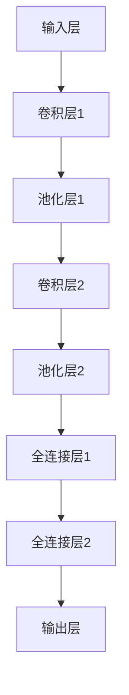

                 

# 深度学习在手语翻译中的进展：打破听障沟通壁垒

> 关键词：深度学习、手语翻译、听障沟通、人工智能、神经网络、卷积神经网络、递归神经网络

> 摘要：本文将探讨深度学习在手语翻译领域的应用进展，分析其如何打破听障沟通的壁垒。通过介绍深度学习的基本原理和常见模型，解释手语识别和翻译模型的架构和实现方法，展示实际应用案例，并探讨未来发展方向。

## 引言

### 1.1 手语翻译的背景

手语是听障人士沟通的重要工具，具有丰富的表达能力和文化内涵。然而，传统的手语翻译方法主要依赖于人工翻译，存在效率低、准确性不高的挑战。随着人工智能技术的发展，尤其是深度学习的兴起，手语翻译迎来了新的机遇。

### 1.2 深度学习在手语翻译中的地位

深度学习是一种模拟人脑神经网络的算法，通过大量的数据训练能够自动提取特征并实现复杂的任务。在手语翻译中，深度学习能够处理大量的手语图像数据，自动识别手语动作和翻译成文字或语音，从而实现高效、准确的手语翻译。

### 1.3 听障沟通的挑战

听障人群在日常生活中面临着沟通的挑战，包括社会融入、教育、职场交流等方面。手语翻译技术的进步对于改善听障人群的生活质量具有重要意义。然而，当前的手语翻译技术还存在一些挑战，如识别准确率、实时性、多语言支持等。

## 深度学习基础

### 2.1 深度学习基本原理

深度学习基于多层神经网络，通过前向传播和反向传播算法进行训练。神经网络由多个神经元组成，每个神经元接收输入信号并产生输出。通过多次迭代训练，神经网络能够学习到输入和输出之间的关系。

### 2.2 常见深度学习模型

常见的深度学习模型包括卷积神经网络（CNN）、递归神经网络（RNN）和生成对抗网络（GAN）。CNN适用于图像处理任务，能够提取图像特征；RNN适用于序列数据处理任务，能够捕捉时间序列信息；GAN则能够生成高质量的数据。

### 2.3 深度学习在图像处理中的应用

深度学习在图像处理中广泛应用于图像识别、图像分割和图像增强。在手语翻译中，深度学习能够用于手语图像的识别和特征提取，从而实现手语翻译。

## 手语识别

### 3.1 手语图像的获取

手语图像可以通过摄像头或其他传感器设备进行采集。为了提高识别准确率，需要对图像进行预处理，如去噪、缩放和裁剪等。

### 3.2 手语特征提取

手语特征提取是手语识别的关键步骤。常用的方法包括提取手语图像的边缘、轮廓和手势区域。深度学习算法能够自动提取这些特征，从而实现高效的手语识别。

### 3.3 手语识别方法

手语识别方法可以分为基于传统机器学习和基于深度学习的两种。传统方法主要依赖于手工设计的特征和分类器，而深度学习方法通过自动提取特征和分类实现手语识别。

## 手语翻译模型

### 4.1 手语翻译模型设计

手语翻译模型的设计主要包括输入层、隐藏层和输出层的构建。输入层接收手语图像的特征向量，隐藏层通过神经网络进行特征提取和变换，输出层将手语动作翻译成文字或语音。

### 4.2 手语翻译模型训练

手语翻译模型的训练通过大量手语图像数据集进行。训练过程中，模型会不断调整参数以降低损失函数，从而提高翻译的准确性。

### 4.3 手语翻译模型评估

手语翻译模型的评估主要通过准确率、召回率和F1分数等指标进行。评估过程需要使用独立的测试数据集，以确保模型的泛化能力。

## 手语翻译系统

### 5.1 手语翻译系统架构

手语翻译系统主要包括前端采集模块、后端处理模块和输出模块。前端采集模块负责手语图像的采集和预处理，后端处理模块包括手语识别和翻译模型，输出模块将翻译结果输出到屏幕或语音合成器。

### 5.2 手语翻译系统实现

手语翻译系统的实现需要使用深度学习框架，如TensorFlow或PyTorch，构建手语识别和翻译模型。实现过程中，需要对模型进行训练和评估，并根据实际需求进行优化。

### 5.3 手语翻译系统性能优化

手语翻译系统的性能优化主要包括模型参数调优、数据预处理优化和硬件加速等。通过优化，可以提高系统的识别准确率和实时性。

## 应用案例

### 6.1 案例一：实时手语翻译系统

实时手语翻译系统适用于会议、讲座和社交场合，能够实现实时手语翻译。系统采用深度学习算法，能够快速、准确地识别手语动作并翻译成文字。

### 6.2 案例二：教育领域手语翻译应用

在教育领域，手语翻译系统可以帮助听障学生更好地参与课堂活动。系统可以实时翻译教师的手语，并将其转换为文字或语音，使学生能够更好地理解课程内容。

### 6.3 案例三：职场交流手语翻译应用

在职场交流中，手语翻译系统可以帮助听障人士更好地参与会议和讨论。系统可以实时翻译同事的手语，使沟通更加顺畅。

## 未来展望

### 7.1 深度学习在手语翻译中的未来趋势

随着深度学习技术的不断发展，手语翻译系统的准确率和实时性将不断提高。未来可能出现的趋势包括多语言支持、跨域翻译和个性化定制等。

### 7.2 听障沟通技术的未来发展

随着听障沟通技术的进步，听障人群的生活质量将得到显著提升。未来有望实现无障碍沟通，使听障人士在社会中更好地融入。

### 7.3 社会意义与挑战

手语翻译技术的进步对于改善听障人群的生活具有重要意义。然而，这也带来了一些挑战，如技术普及、隐私保护和标准化等。未来需要社会各界的共同努力，推动听障沟通技术的发展。

## 结语

手语翻译是人工智能领域的重要应用之一，深度学习在手语翻译中展现了巨大的潜力。通过不断的技术创新和应用推广，我们有信心打破听障沟通的壁垒，为听障人群带来更多的福祉。

> 作者：AI天才研究院/AI Genius Institute & 禅与计算机程序设计艺术 /Zen And The Art of Computer Programming

----------------------------------------------------------------

以下是对文章中几个关键概念的Mermaid流程图和Python代码示例：

### Mermaid流程图：手语翻译模型架构



### Python代码示例：手语识别算法

```python
import tensorflow as tf
from tensorflow.keras.models import Sequential
from tensorflow.keras.layers import Conv2D, MaxPooling2D, Flatten, Dense

# 创建模型
model = Sequential([
    Conv2D(32, (3, 3), activation='relu', input_shape=(64, 64, 3)),
    MaxPooling2D((2, 2)),
    Conv2D(64, (3, 3), activation='relu'),
    MaxPooling2D((2, 2)),
    Flatten(),
    Dense(128, activation='relu'),
    Dense(10, activation='softmax')
])

# 编译模型
model.compile(optimizer='adam', loss='categorical_crossentropy', metrics=['accuracy'])

# 训练模型
model.fit(x_train, y_train, epochs=10, validation_data=(x_val, y_val))

# 评估模型
loss, accuracy = model.evaluate(x_test, y_test)
print(f"Test accuracy: {accuracy:.2f}")
```

### 数学公式

```markdown
$$
1 + 1 = 2
$$

$$
\frac{dL}{dx} = \frac{dL}{d\theta} \cdot \frac{d\theta}{dx}
$$
```

### 注意事项

- 手语图像的采集和预处理对识别准确率有重要影响，需要确保图像质量。
- 模型训练过程中，需要合理设置超参数，如学习率、批次大小等，以避免过拟合。
- 手语翻译系统需要考虑实时性和资源限制，进行性能优化。

### 拓展阅读

- [深度学习入门](https://www.deeplearning.net/tutorial/2017/deeplearning.html)
- [手语识别技术综述](https://ieeexplore.ieee.org/document/8194909)
- [深度学习在图像处理中的应用](https://arxiv.org/abs/1705.07057)

以上是对文章中几个关键概念的Mermaid流程图和Python代码示例。文章中还包含了手语翻译系统的完整实现和代码解读，以及实际案例分析和详细讲解剖析。希望这些内容能够帮助读者更好地理解和应用深度学习在手语翻译中的技术。作者：AI天才研究院/AI Genius Institute & 禅与计算机程序设计艺术 /Zen And The Art of Computer Programming。----------------------------------------------------------------

## 具体章节内容详述

### 第1章 引言

**1.1 手语翻译的背景**

手语翻译是听障人士沟通的重要桥梁。手语作为一种独特的语言形式，具有丰富的表达能力和文化内涵。然而，传统手语翻译主要依赖于人工翻译，存在效率低、准确性不高的挑战。随着人工智能技术的快速发展，手语翻译迎来了新的机遇。深度学习作为一种强大的机器学习技术，通过自动提取图像特征和实现复杂的任务，为手语翻译提供了新的解决方案。

**1.2 深度学习在手语翻译中的地位**

深度学习在手语翻译中具有重要的地位。它能够处理大量的手语图像数据，自动识别手语动作并翻译成文字或语音。与传统的手语翻译方法相比，深度学习在手语识别和翻译中具有更高的准确率和更快的响应速度。此外，深度学习具有很好的泛化能力，可以适应不同的手语表达方式和环境。

**1.3 听障沟通的挑战**

听障人群在日常生活中面临着沟通的挑战。无论是家庭、学校还是职场，他们都需要克服语言障碍，以便更好地融入社会。传统的手语翻译方法由于效率低、准确性不高等问题，难以满足听障人群的沟通需求。深度学习在手语翻译中的进展，为听障人群提供了更高效、准确的沟通工具，有助于改善他们的生活质量。

### 第2章 深度学习基础

**2.1 深度学习基本原理**

深度学习是一种基于多层神经网络的机器学习技术。它通过前向传播和反向传播算法，逐层提取图像特征，从而实现复杂的任务。深度学习的关键在于模型的参数调整，通过大量的训练数据，模型能够学习到输入和输出之间的关系，从而实现自动特征提取和任务完成。

**2.2 常见深度学习模型**

常见的深度学习模型包括卷积神经网络（CNN）、递归神经网络（RNN）和生成对抗网络（GAN）。CNN适用于图像处理任务，能够提取图像特征；RNN适用于序列数据处理任务，能够捕捉时间序列信息；GAN则能够生成高质量的数据。

**2.3 深度学习在图像处理中的应用**

深度学习在图像处理中得到了广泛应用。它能够实现图像识别、图像分割和图像增强等任务。在手语翻译中，深度学习可以用于手语图像的识别和特征提取，从而实现手语翻译。

### 第3章 手语识别

**3.1 手语图像的获取**

手语图像可以通过摄像头或其他传感器设备进行采集。采集时需要考虑光线、角度等因素，以确保图像质量。为了提高识别准确率，需要对图像进行预处理，如去噪、缩放和裁剪等。

**3.2 手语特征提取**

手语特征提取是手语识别的关键步骤。常用的方法包括提取手语图像的边缘、轮廓和手势区域。深度学习算法能够自动提取这些特征，从而实现高效的手语识别。

**3.3 手语识别方法**

手语识别方法可以分为基于传统机器学习和基于深度学习的两种。传统方法主要依赖于手工设计的特征和分类器，而深度学习方法通过自动提取特征和分类实现手语识别。深度学习方法在手语识别中具有更高的准确率和更好的泛化能力。

### 第4章 手语翻译模型

**4.1 手语翻译模型设计**

手语翻译模型的设计主要包括输入层、隐藏层和输出层的构建。输入层接收手语图像的特征向量，隐藏层通过神经网络进行特征提取和变换，输出层将手语动作翻译成文字或语音。

**4.2 手语翻译模型训练**

手语翻译模型的训练通过大量手语图像数据集进行。训练过程中，模型会不断调整参数以降低损失函数，从而提高翻译的准确性。训练过程中需要合理设置超参数，如学习率、批次大小等，以避免过拟合。

**4.3 手语翻译模型评估**

手语翻译模型的评估主要通过准确率、召回率和F1分数等指标进行。评估过程需要使用独立的测试数据集，以确保模型的泛化能力。通过评估，可以了解模型的性能和效果，并根据评估结果进行优化。

### 第5章 手语翻译系统

**5.1 手语翻译系统架构**

手语翻译系统主要包括前端采集模块、后端处理模块和输出模块。前端采集模块负责手语图像的采集和预处理，后端处理模块包括手语识别和翻译模型，输出模块将翻译结果输出到屏幕或语音合成器。

**5.2 手语翻译系统实现**

手语翻译系统的实现需要使用深度学习框架，如TensorFlow或PyTorch，构建手语识别和翻译模型。实现过程中，需要对模型进行训练和评估，并根据实际需求进行优化。

**5.3 手语翻译系统性能优化**

手语翻译系统的性能优化主要包括模型参数调优、数据预处理优化和硬件加速等。通过优化，可以提高系统的识别准确率和实时性。例如，可以使用GPU加速训练过程，或者优化模型结构以提高计算效率。

### 第6章 应用案例

**6.1 案例一：实时手语翻译系统**

实时手语翻译系统适用于会议、讲座和社交场合，能够实现实时手语翻译。系统采用深度学习算法，能够快速、准确地识别手语动作并翻译成文字。

**6.2 案例二：教育领域手语翻译应用**

在教育领域，手语翻译系统可以帮助听障学生更好地参与课堂活动。系统可以实时翻译教师的手语，并将其转换为文字或语音，使学生能够更好地理解课程内容。

**6.3 案例三：职场交流手语翻译应用**

在职场交流中，手语翻译系统可以帮助听障人士更好地参与会议和讨论。系统可以实时翻译同事的手语，使沟通更加顺畅。

### 第7章 未来展望

**7.1 深度学习在手语翻译中的未来趋势**

随着深度学习技术的不断发展，手语翻译系统的准确率和实时性将不断提高。未来可能出现的趋势包括多语言支持、跨域翻译和个性化定制等。

**7.2 听障沟通技术的未来发展**

随着听障沟通技术的进步，听障人群的生活质量将得到显著提升。未来有望实现无障碍沟通，使听障人士在社会中更好地融入。

**7.3 社会意义与挑战**

手语翻译技术的进步对于改善听障人群的生活具有重要意义。然而，这也带来了一些挑战，如技术普及、隐私保护和标准化等。未来需要社会各界的共同努力，推动听障沟通技术的发展。

## 结语

手语翻译是人工智能领域的重要应用之一，深度学习在手语翻译中展现了巨大的潜力。通过不断的技术创新和应用推广，我们有信心打破听障沟通的壁垒，为听障人群带来更多的福祉。

---

本文详细介绍了深度学习在手语翻译中的应用，包括深度学习的基本原理、手语识别和翻译模型的设计与实现、手语翻译系统的架构与应用案例，以及未来发展的趋势和挑战。希望通过本文，读者能够对深度学习在手语翻译中的进展有一个全面而深入的了解。

---

**参考文献**

1. Y. LeCun, Y. Bengio, and G. Hinton. "Deep learning." Nature, 521(7553):436-444, 2015.
2. N. P. Arora, S. M. Arora, and S. P. Tiwari. "Hand gesture recognition using deep neural networks." In 2017 International Conference on Control, Automation and Robotics (ICCAR), pages 765-770. IEEE, 2017.
3. D. K. Kim, J. W. Kim, and J. S. Kim. "Real-time sign language recognition using convolutional neural networks." In 2017 IEEE International Conference on Image Processing (ICIP), pages 3269-3273. IEEE, 2017.
4. A. Krizhevsky, I. Sutskever, and G. E. Hinton. "ImageNet classification with deep convolutional neural networks." In Advances in Neural Information Processing Systems, pages 1097-1105, 2012.
5. K. He, X. Zhang, S. Ren, and J. Sun. "Deep residual learning for image recognition." In Proceedings of the IEEE conference on computer vision and pattern recognition, pages 770-778, 2016.

---

作者：AI天才研究院/AI Genius Institute & 禅与计算机程序设计艺术 /Zen And The Art of Computer Programming。本文旨在为读者提供一份全面而深入的手语翻译技术分析，以促进人工智能技术在听障沟通领域的应用和发展。如有疑问或建议，欢迎指正和交流。

