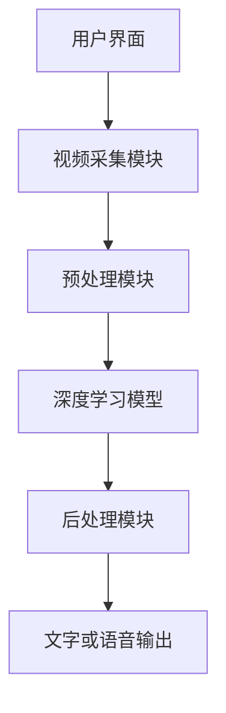
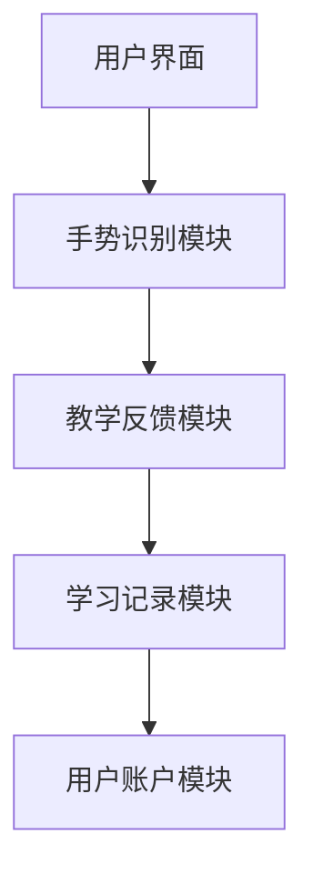

                 


### 1.1.3 深度学习在手语识别中的重要性

深度学习在图像识别、语音识别等领域取得了显著的成果，其强大的特征提取能力和自动学习能力使得它成为解决手语识别问题的理想选择。在手语识别中，深度学习的重要性主要体现在以下几个方面：

#### 1.1.3.1 自适应特征提取

手语识别的关键在于对复杂视觉信息的准确理解，包括手势、面部表情和空间位置等多种信息。传统机器学习方法往往需要人工设计特征，这需要大量的专业知识和经验，而且特征设计的质量对识别效果有直接的影响。而深度学习模型，特别是卷积神经网络（CNN）和循环神经网络（RNN），能够自动从原始数据中学习到高层次的抽象特征，这些特征更加适合手语识别任务。

#### 1.1.3.2 数据驱动的学习方法

深度学习采用数据驱动的方式，通过大量的手语数据集进行训练，不断调整网络参数，使得模型能够逐渐学会识别手语中的各种手势和语义。这种方法能够处理大量的手语数据，并且可以自动处理数据中的噪声和变化，提高识别的鲁棒性。

#### 1.1.3.3 高级语义理解

深度学习模型不仅能够识别单一的手势，还能够通过上下文信息进行高级语义理解。这对于理解手语中的语法结构和含义非常重要。例如，一个手势可能是某个词汇的一部分，或者是一个句子的一部分，深度学习模型需要能够捕捉这些语言层面的信息。

#### 1.1.3.4 实时性和低延迟

实时应用对手语识别系统提出了高实时性和低延迟的要求。深度学习模型的优化和硬件加速技术，如GPU和FPGA，使得模型能够在实时环境中高效运行，满足用户对实时沟通的需求。

#### 1.1.3.5 模型的可解释性和透明度

尽管深度学习模型在图像和语音识别中取得了巨大成功，但它们的内部工作机制通常较为复杂，不易理解。为了提高模型的透明度和可解释性，研究人员正在开发可解释的深度学习模型，以便更好地理解模型的工作原理，特别是在手语识别等应用中。

### 1.1.4 深度学习在手语识别中的应用现状

随着深度学习技术的不断进步，它在手语识别中的应用也越来越广泛。目前，深度学习在手语识别中的应用主要集中在以下几个方面：

- **手势识别**：深度学习模型被用于识别单个手势，包括手势的方向、形状和动作。

- **手部姿态估计**：通过深度学习模型估计手部关节的位置和运动轨迹，从而更准确地捕捉手语中的细微变化。

- **手语词汇与语法识别**：深度学习模型被用于识别手语中的词汇和语法结构，使得系统能够理解完整的句子。

- **手语翻译应用**：结合多种深度学习技术，开发手语翻译应用，实现手语与自然语言之间的实时转换。

尽管深度学习在手语识别中取得了显著进展，但仍面临一些挑战，如数据集的质量和多样性、模型的解释性、实时性等。未来，随着技术的进一步发展，深度学习在手语识别中的应用将更加成熟和广泛。

### 1.1.5 本章小结

本章介绍了深度学习的概念、手语识别的挑战和需求，以及深度学习在手语识别中的重要性和应用现状。在接下来的章节中，我们将详细探讨深度学习的基础知识、手语识别原理、深度学习模型在手语识别中的应用，以及实时应用设计和实际案例研究等内容。通过这些内容的学习，读者将能够深入理解深度学习在手语识别中的实际应用，并为未来的研究和开发提供指导和参考。

```markdown
## 1.1.5 本章小结

本章介绍了深度学习的概念、手语识别的挑战和需求，以及深度学习在手语识别中的重要性和应用现状。在接下来的章节中，我们将详细探讨深度学习的基础知识、手语识别原理、深度学习模型在手语识别中的应用，以及实时应用设计和实际案例研究等内容。通过这些内容的学习，读者将能够深入理解深度学习在手语识别中的实际应用，并为未来的研究和开发提供指导和参考。
```

---

接下来，我们将逐步构建第二章《深度学习基础》的内容。这一章将详细解释神经网络、卷积神经网络（CNN）和循环神经网络（RNN）的基本原理和应用，为后续章节提供理论支持。

### 2.1 神经网络基础

神经网络（Neural Networks，NN）是深度学习的基础，它模仿人脑的神经元结构和功能，通过多层节点（神经元）的互联进行信息的传递和处理。

#### 2.1.1 神经元模型

神经元是神经网络的基本组成单元。一个简单的神经元模型包括以下几个部分：

1. **输入**：每个神经元接收多个输入信号，每个输入信号都乘以相应的权重（weight）。
2. **加权求和**：将所有输入信号与其权重相乘后求和。
3. **激活函数**：对加权求和的结果进行非线性变换，以决定神经元是否“激活”。
4. **输出**：激活后的神经元输出一个信号，这个信号可以传递给下一层的神经元。

数学表示如下：

$$
z = \sum_{i=1}^{n} x_i \cdot w_i
$$

其中，$z$ 是加权求和的结果，$x_i$ 是第 $i$ 个输入信号，$w_i$ 是第 $i$ 个输入信号的权重。

#### 2.1.2 激活函数

激活函数是对加权求和结果进行非线性变换的函数，常用的激活函数包括：

1. **sigmoid函数**：
   $$
   \sigma(z) = \frac{1}{1 + e^{-z}}
   $$

2. **ReLU函数**（Rectified Linear Unit）：
   $$
   \text{ReLU}(z) = \max(0, z)
   $$

3. **Tanh函数**（Hyperbolic Tangent）：
   $$
   \tanh(z) = \frac{e^z - e^{-z}}{e^z + e^{-z}}
   $$

激活函数的选择对神经网络的性能有重要影响。ReLU函数由于其简单性和非饱和性，在深度学习中得到了广泛的应用。

#### 2.1.3 前向传播与反向传播

神经网络的训练过程包括前向传播（Forward Propagation）和反向传播（Back Propagation）两个主要阶段。

**前向传播**：从输入层开始，逐层传递输入信号，直到输出层。在每个神经元中，计算输入信号的加权求和，并通过激活函数得到输出。

$$
a_l = \sigma(W_l \cdot a_{l-1} + b_l)
$$

其中，$a_l$ 是第 $l$ 层的输出，$W_l$ 是第 $l$ 层的权重矩阵，$b_l$ 是第 $l$ 层的偏置向量。

**反向传播**：在输出层得到预测结果后，计算实际结果与预测结果之间的误差。然后，通过误差反向传播，逐层更新权重和偏置。

$$
\delta_l = \frac{\partial L}{\partial z_l} \cdot \sigma'(z_l)
$$

其中，$L$ 是损失函数，$\delta_l$ 是第 $l$ 层的误差，$\sigma'(z_l)$ 是激活函数的导数。

通过反向传播算法，可以计算每个神经元的误差，并利用梯度下降（Gradient Descent）等优化算法更新权重和偏置。

#### 2.1.4 示例

假设我们有一个简单的神经网络，包含输入层、一个隐藏层和一个输出层。输入层有两个神经元，隐藏层有三个神经元，输出层有一个神经元。我们使用ReLU函数作为激活函数，并采用均方误差（MSE）作为损失函数。

1. **初始化参数**：
   - 权重矩阵 $W_1 \in \mathbb{R}^{2 \times 3}$ 和 $W_2 \in \mathbb{R}^{3 \times 1}$。
   - 偏置向量 $b_1 \in \mathbb{R}^{3}$ 和 $b_2 \in \mathbb{R}^{1}$。
   - 学习率 $\eta$。

2. **前向传播**：
   - 输入层到隐藏层：
     $$
     z_1 = W_1 \cdot a_0 + b_1
     $$
     $$
     a_1 = \text{ReLU}(z_1)
     $$
   - 隐藏层到输出层：
     $$
     z_2 = W_2 \cdot a_1 + b_2
     $$
     $$
     a_2 = \text{ReLU}(z_2)
     $$

3. **反向传播**：
   - 计算输出层的误差：
     $$
     \delta_2 = (t - a_2) \cdot \text{ReLU}'(z_2)
     $$
   - 更新隐藏层的权重和偏置：
     $$
     \Delta W_2 = \eta \cdot a_1^T \cdot \delta_2
     $$
     $$
     \Delta b_2 = \eta \cdot \delta_2
     $$
   - 计算隐藏层的误差：
     $$
     \delta_1 = (W_2^T \cdot \delta_2) \cdot \text{ReLU}'(z_1)
     $$
   - 更新输入层的权重和偏置：
     $$
     \Delta W_1 = \eta \cdot a_0^T \cdot \delta_1
     $$
     $$
     \Delta b_1 = \eta \cdot \delta_1
     $$

通过这样的前向传播和反向传播，神经网络可以不断调整权重和偏置，从而优化模型的性能。

### 2.2 卷积神经网络（CNN）

卷积神经网络（Convolutional Neural Networks，CNN）是一种特别适合处理图像数据的神经网络结构，其核心思想是使用卷积层来提取图像的特征。

#### 2.2.1 CNN的原理

CNN主要由以下几层组成：

1. **卷积层（Convolutional Layer）**：卷积层通过卷积操作提取图像的特征。卷积操作使用一个称为卷积核（filter）的小型权重矩阵与输入图像进行卷积，从而生成特征图（feature map）。

   $$
   f_{ij} = \sum_{k=1}^{C} w_{ikj} \cdot x_{ik} + b_j
   $$

   其中，$f_{ij}$ 是第 $i$ 个卷积核在第 $j$ 个特征图上的值，$w_{ikj}$ 是第 $i$ 个卷积核的第 $k$ 个元素，$x_{ik}$ 是输入图像的第 $k$ 个通道上的值，$b_j$ 是卷积层的偏置。

2. **激活函数（Activation Function）**：常用的激活函数包括ReLU和sigmoid函数。

3. **池化层（Pooling Layer）**：池化层通过降低特征图的维度来减少参数的数量和计算量。最常用的池化方式是最大池化（Max Pooling），即取特征图上的最大值作为池化结果。

   $$
   p_{ij} = \max_{k} \{ f_{ijk} \}
   $$

4. **全连接层（Fully Connected Layer）**：全连接层将卷积层和池化层提取的高层次特征映射到具体的类别上。

#### 2.2.2 CNN在图像处理中的应用

CNN在图像处理中具有广泛的应用，包括但不限于：

1. **图像分类**：通过训练CNN模型，可以实现对图像的自动分类，例如在ImageNet竞赛中，CNN模型已经达到了超人类的分类准确率。

2. **目标检测**：在目标检测任务中，CNN不仅能够识别图像中的物体，还能定位物体的具体位置。著名的卷积神经网络模型如YOLO（You Only Look Once）和SSD（Single Shot MultiBox Detector）。

3. **图像分割**：图像分割任务是将图像中的每个像素分类到不同的类别中。CNN通过训练可以实现精确的图像分割，如FCN（Fully Convolutional Network）和U-Net模型。

#### 2.2.3 示例

下面是一个简单的CNN模型，用于对二分类问题进行图像分类。该模型包含一个卷积层、一个池化层和一个全连接层。

1. **初始化参数**：
   - 卷积层：1个卷积核，大小为3x3，步长为1，填充方式为“同一侧填充”（same padding）。
   - 池化层：2x2的最大池化。
   - 全连接层：1个神经元。

2. **前向传播**：
   - 卷积层：
     $$
     f_{ij} = \sum_{k=1}^{C} w_{ikj} \cdot x_{ik} + b_j
     $$
     其中，$C$ 是输入图像的通道数。
   - 池化层：
     $$
     p_{ij} = \max_{k} \{ f_{ijk} \}
     $$
   - 全连接层：
     $$
     z = W \cdot p + b
     $$
     $$
     a = \sigma(z)
     $$

3. **反向传播**：
   - 计算全连接层的误差：
     $$
     \delta = (t - a) \cdot \sigma'(z)
     $$
   - 更新全连接层的权重和偏置：
     $$
     \Delta W = \eta \cdot p^T \cdot \delta
     $$
     $$
     \Delta b = \eta \cdot \delta
     $$
   - 计算池化层的误差：
     $$
     \delta_p = \delta \cdot \text{ReLU}'(f)
     $$
   - 更新卷积层的权重和偏置：
     $$
     \Delta W_c = \eta \cdot f^T \cdot \delta_p
     $$
     $$
     \Delta b_c = \eta \cdot \delta_p
     $$

通过这样的前向传播和反向传播，CNN模型可以不断优化其参数，提高分类准确率。

### 2.3 循环神经网络（RNN）

循环神经网络（Recurrent Neural Networks，RNN）是一种能够处理序列数据的神经网络结构，特别适合处理时间序列数据和自然语言处理任务。

#### 2.3.1 RNN的基本结构

RNN的基本结构包括以下几个部分：

1. **输入层**：接收序列数据。
2. **隐藏层**：包含多个时间步，每个时间步的隐藏状态与前一时刻的隐藏状态相连。
3. **输出层**：对序列数据进行分析和预测。

RNN的核心思想是利用隐藏状态来记忆序列信息，从而在处理序列数据时能够保持长期依赖关系。

#### 2.3.2 RNN的工作原理

在RNN中，每个时间步的输出不仅取决于当前输入，还受到之前隐藏状态的影响。这种循环结构使得RNN能够处理序列数据。

$$
h_t = \sigma(W_h \cdot [h_{t-1}, x_t] + b_h)
$$

$$
y_t = W_o \cdot h_t + b_o
$$

其中，$h_t$ 是第 $t$ 个时间步的隐藏状态，$x_t$ 是第 $t$ 个时间步的输入，$W_h$ 和 $b_h$ 是隐藏层的权重和偏置，$W_o$ 和 $b_o$ 是输出层的权重和偏置，$\sigma$ 是激活函数。

#### 2.3.3 LSTM与GRU

为了解决传统RNN在处理长序列数据时出现的梯度消失和梯度爆炸问题，研究人员提出了长短期记忆（Long Short-Term Memory，LSTM）和门控循环单元（Gated Recurrent Unit，GRU）。

**LSTM**：LSTM通过引入三个门（输入门、遗忘门和输出门）来控制信息的流入和流出，从而有效解决了长期依赖问题。

- **输入门**：决定当前输入信息中有多少被记住。
- **遗忘门**：决定之前的信息中有多少被遗忘。
- **输出门**：决定当前隐藏状态中有多少信息被输出。

**GRU**：GRU是LSTM的一个变体，它通过合并输入门和遗忘门，简化了LSTM的结构，同时保持了良好的性能。

#### 2.3.4 示例

以下是一个简单的LSTM模型，用于对序列数据进行分类。

1. **初始化参数**：
   - 输入维度 $d_x$。
   - 隐藏层维度 $d_h$。
   - 输出维度 $d_y$。

2. **前向传播**：
   - 输入层：
     $$
     x_t \in \mathbb{R}^{d_x}
     $$
   - 隐藏层：
     $$
     h_t = \sigma(\frac{[h_{t-1}, x_t]}{1+\gamma}) \odot i_t + \sigma(\frac{[h_{t-1}, x_t]}{1+\gamma}) \odot f_t
     $$
     其中，$i_t$ 是输入门，$f_t$ 是遗忘门，$\odot$ 是逐元素乘法操作。
   - 输出层：
     $$
     y_t = \sigma(W_o \cdot h_t + b_o)
     $$

3. **反向传播**：
   - 计算输出层的误差：
     $$
     \delta = (t - y_t) \cdot \sigma'(y_t)
     $$
   - 更新输出层的权重和偏置：
     $$
     \Delta W_o = \eta \cdot h_t^T \cdot \delta
     $$
     $$
     \Delta b_o = \eta \cdot \delta
     $$
   - 计算隐藏层的误差：
     $$
     \delta_h = \delta \cdot W_o^T \cdot \sigma'(h_t)
     $$
   - 更新隐藏层的权重和偏置：
     $$
     \Delta W_h = \eta \cdot [h_{t-1}, x_t]^T \cdot \delta_h
     $$
     $$
     \Delta b_h = \eta \cdot \delta_h
     $$

通过这样的前向传播和反向传播，LSTM模型可以不断优化其参数，提高序列分类的准确率。

### 2.4 本章小结

本章介绍了神经网络、卷积神经网络（CNN）和循环神经网络（RNN）的基本原理和应用。神经网络是深度学习的基础，通过模拟人脑神经元的工作方式，能够自动提取特征并进行学习。卷积神经网络（CNN）特别适合处理图像数据，通过卷积层、池化层和全连接层的组合，能够实现图像分类、目标检测和图像分割等多种任务。循环神经网络（RNN）能够处理序列数据，通过隐藏状态的记忆机制，能够捕捉序列中的长期依赖关系。LSTM和GRU是RNN的改进版本，能够更好地解决序列数据中的梯度消失和梯度爆炸问题。在接下来的章节中，我们将探讨手语识别原理、深度学习模型在手语识别中的应用，以及实时应用设计等内容。

### 3.1 手语语言学的概述

手语是一种独特的自然语言，主要用于非听觉人群的交流。与口语语言相比，手语具有不同的结构和表达方式，其语言学特征主要包括手势、面部表情和空间位置等方面。

#### 3.1.1 手语的基本特征

1. **手势**：手势是手语表达的主要形式，通过手部的动作和位置来传达意义。手势可以包括手指、手腕、手臂的移动，以及手部的形状和姿势。

2. **面部表情**：面部表情在手语中起到辅助作用，可以增强或改变手势的含义。例如，微笑可能表示积极的情感，而皱眉则可能表示不满或疑惑。

3. **空间位置**：手语中的空间位置也很重要，通过手部在空间中的位置和方向来传达信息。例如，手的位置可以指示物体的位置或方向。

#### 3.1.2 手语的语法和词汇

手语具有自己的语法规则和词汇体系。语法规则包括手势的顺序、结合和修饰等，而词汇则包括基本的手势、词组和句子。手语的词汇量庞大，涉及日常生活、工作、学习等多个领域。

1. **基本手势**：基本手势是构成手语词汇的基本单元，例如“你好”、“谢谢”等。

2. **词组**：词组是两个或多个基本手势的组合，例如“吃饭”、“上学”等。

3. **句子**：句子是手语中的完整表达，可以通过基本手势、词组和句子的组合来传达复杂的语义信息。

#### 3.1.3 手语的分类和变体

手语在不同的地区和文化中可能存在差异，形成了不同的手语分类和变体。例如，美国手语（ASL）和英国手语（BSL）是两种主要的手语分类，它们在语法、词汇和手势表达上都有所不同。

1. **美国手语（ASL）**：美国手语是一种主要在美国使用的手语，具有丰富的手势和复杂的语法结构。

2. **英国手语（BSL）**：英国手语是英国及其部分海外领地使用的手语，与ASL相比，BSL的手势表达更加流畅和自然。

3. **其他手语**：世界各地的手语都各有特色，例如澳大利亚手语（Auslan）、新西兰手语（NZSL）等。

#### 3.1.4 手语在语言学中的地位

手语作为一种自然语言，在语言学中占有重要地位。它不仅为非听觉人群提供了有效的沟通工具，也为语言学研究提供了丰富的数据和视角。

1. **语言学研究**：手语的研究有助于理解语言的普遍特征和多样性，例如语言的构成、语法结构、词汇系统和语言习得等。

2. **跨学科应用**：手语的研究成果可以应用于教育、医疗、翻译等多个领域，例如开发手语翻译系统、辅助教学工具和康复设备等。

通过对手语语言学的概述，我们可以更好地理解手语的复杂性和多样性，从而为深度学习在手语识别中的应用提供理论基础和实践指导。

### 3.2 手语识别的关键技术

手语识别是将手语转换为文字或语音的技术，它是计算机视觉和自然语言处理领域的交叉学科。为了实现高效的手语识别，需要克服多个技术挑战。以下将详细讨论手势识别、手部姿态估计以及手语词汇与语法识别等关键技术。

#### 3.2.1 手势识别

手势识别是手语识别的基础，它旨在从视频流中准确识别出手势。手势识别通常涉及以下步骤：

1. **图像预处理**：包括去噪、灰度化、滤波等操作，以提高图像质量，减少环境干扰。

2. **特征提取**：从预处理后的图像中提取有代表性的特征，如边缘、轮廓、颜色等。常用的特征提取方法包括SIFT、HOG（Histogram of Oriented Gradients）和深度学习特征提取（如VGG、ResNet等）。

3. **手势分类**：使用分类算法（如SVM、决策树、神经网络等）对提取的特征进行分类，识别出具体的手势。深度学习方法，尤其是卷积神经网络（CNN）在手势识别中表现出色，能够自动提取复杂的手势特征。

4. **实例分析**：以美国手语（ASL）中的基本手势“hello”为例，可以使用CNN模型进行手势识别。首先，通过摄像头捕获手部图像，然后进行预处理，接着使用预训练的CNN模型提取特征，最后通过模型输出结果判断手势类型。这种方法能够高效、准确地识别多种复杂手势。

#### 3.2.2 手部姿态估计

手部姿态估计是手语识别中另一个关键技术，它旨在估计手部关节的位置和运动轨迹。手部姿态估计通常涉及以下步骤：

1. **关键点检测**：通过计算机视觉算法检测出手部的关键点，如手指尖、手腕、肘部等。常用的关键点检测算法包括基于深度学习的算法（如PointNet、HRNet等）。

2. **运动轨迹估计**：利用关键点之间的相对位置和运动关系，估计手部的空间运动轨迹。运动轨迹可以用于分析手势的时间序列特征，从而提高识别精度。

3. **实例分析**：以手语中的“handshake”（握手）为例，可以通过关键点检测和轨迹估计来识别手部动作。首先，使用关键点检测算法获取手部关键点，然后通过计算关键点之间的距离和角度，分析手部动作的轨迹，从而判断手势类型。

#### 3.2.3 手语词汇与语法识别

手语词汇与语法识别是将手势序列转换为语义文字或语音的过程。它通常涉及以下步骤：

1. **手势序列分割**：将连续的手势序列分割为独立的词汇或短语。手势序列分割可以通过动态时间规整（Dynamic Time Warping，DTW）算法实现。

2. **词汇识别**：使用手势识别技术识别出序列中的每个手势，构建词汇表，并将手势映射到具体的词汇。

3. **语法分析**：分析手势序列的语法结构，确定词汇的顺序和组合方式。语法分析可以通过基于规则的方法或统计模型实现。

4. **实例分析**：以手语句子“我饿了”为例，首先将手势序列分割为“我”、“饿”和“了”三个手势，然后分别识别每个手势，最后通过语法分析确定手势序列的语义。

通过上述关键技术，手语识别系统能够实现从手语视频到文字或语音的转换，为非听觉人群提供了便捷的沟通手段。随着深度学习技术的不断发展，手语识别系统的性能和准确性将持续提升，为手语交流领域带来更多创新应用。

### 3.3 手语数据集

手语数据集是手语识别研究中不可或缺的资源，用于训练和评估识别算法的性能。一个高质量的手语数据集应包含丰富的手语样本，涵盖多种不同的手语词汇和语法结构。以下将讨论手语数据集的选择、构建以及数据预处理等关键问题。

#### 3.3.1 数据集的选择

选择合适的手语数据集对于研究工作的成功至关重要。以下是一些选择手语数据集时应考虑的因素：

1. **多样性**：数据集应包含多种不同的手语词汇和语法结构，以覆盖手语的广泛应用场景。这包括基本手势、词组、句子以及不同手语变体（如美国手语ASL和英国手语BSL）。

2. **规模**：数据集的规模应足够大，以确保算法能够在多样性的样本中学习到有效的特征。大规模数据集还可以帮助减少过拟合现象，提高模型的泛化能力。

3. **标注质量**：数据集的手势和词汇标注应准确，以确保模型训练和评估的准确性。高质量的标注通常需要专业人员进行，并经过多次验证。

4. **代表性**：数据集应具备良好的代表性，能够反映实际手语交流中的常见情境和难点。

一些著名的手语数据集包括：

- **National University of Singapore Hand Sign Database (NUSHSDB)**：这是一个包含约3000个ASL手势样本的数据集，涵盖了常见词汇和短语。
- **British Sign Language Corpus (BSLC)**：这是一个包含约20000个BSL手势样本的数据集，涵盖了多个主题和情境。
- **Hand Sign Database (HSD)**：这是一个包含多种手语变体（包括ASL、BSL、日本手语等）的大型数据集，涵盖了广泛的词汇和语法结构。

#### 3.3.2 数据集的构建

构建高质量的手语数据集是一个复杂的过程，通常涉及以下步骤：

1. **数据收集**：通过录制视频或收集现有的手语视频库来收集手语样本。数据收集过程应确保涵盖多种情境和手语变体。

2. **手势标注**：对手语样本进行手势标注，包括手势类型、词汇、语法结构和关键点位置等。标注工作通常需要专业人员进行，并使用标注工具（如LabelImg、VGG Image Annotator等）进行辅助。

3. **数据清洗**：去除标注错误或不完整的样本，以确保数据集的纯净性。

4. **数据增强**：通过图像增强技术（如旋转、缩放、裁剪等）增加数据集的多样性，从而提高模型的泛化能力。

#### 3.3.3 数据预处理

数据预处理是确保数据集适合模型训练的重要步骤，通常包括以下内容：

1. **图像预处理**：包括去噪、灰度化、滤波等操作，以提高图像质量，减少环境干扰。

2. **归一化**：对图像进行归一化处理，将图像的像素值缩放到相同的范围，如[0, 1]，以便模型能够稳定地训练。

3. **特征提取**：从预处理后的图像中提取有代表性的特征，如边缘、轮廓、颜色等。深度学习方法可以直接使用原始图像，而传统的机器学习方法通常需要提取手工特征。

4. **序列对齐**：对于手势序列数据，需要将不同长度的手势序列对齐到同一时间基准，以便进行统一的处理和分析。

通过选择合适的数据集、构建高质量的数据集以及进行有效的数据预处理，我们可以为手语识别研究提供可靠的数据支持，从而推动手语识别技术的发展和实际应用。

### 4.1 CNN在手语识别中的应用

卷积神经网络（CNN）在手语识别中具有广泛应用，它通过学习手部图像中的复杂特征，能够实现高精度的手语识别。以下将详细讨论CNN在手语识别中的应用，包括模型设计、训练过程以及性能评估。

#### 4.1.1 CNN模型的设计

一个典型的手语识别CNN模型通常包括以下几个主要组成部分：

1. **卷积层**：卷积层是CNN的核心组件，它通过卷积操作提取图像中的局部特征。每个卷积核可以捕捉不同类型的特征，如边缘、纹理和形状。

2. **激活函数**：常用的激活函数包括ReLU（Rectified Linear Unit）和sigmoid函数，ReLU函数因其简单性和非饱和性在深度学习中广泛应用。

3. **池化层**：池化层用于降低特征图的维度，减少参数数量和计算量。最大池化（Max Pooling）是最常用的池化方式，它通过取特征图上的最大值来降低维度。

4. **全连接层**：全连接层将卷积层和池化层提取的高层次特征映射到具体的类别上，实现分类或回归任务。

5. **损失函数**：手语识别通常使用交叉熵损失函数（Cross-Entropy Loss），它能够有效衡量预测标签与真实标签之间的差距。

以下是一个简化的手语识别CNN模型结构：

```plaintext
输入层 -> [卷积层1 - 激活函数 - 池化层1] -> [卷积层2 - 激活函数 - 池化层2] -> [卷积层3 - 激活函数 - 池化层3] -> 全连接层 -> 输出层
```

#### 4.1.2 CNN模型训练

手语识别CNN模型的训练过程包括以下几个步骤：

1. **数据预处理**：对手语图像进行预处理，包括缩放、裁剪、归一化等操作，以适应模型的输入要求。

2. **模型初始化**：初始化模型参数，可以使用随机初始化或预训练模型（如VGG、ResNet等）作为起点。

3. **前向传播**：将预处理后的手语图像输入到模型中，通过卷积层、激活函数、池化层等组件提取特征，最终通过全连接层得到输出预测。

4. **计算损失**：使用交叉熵损失函数计算预测标签与真实标签之间的差距。

5. **反向传播**：通过反向传播算法更新模型参数，最小化损失函数。

6. **迭代训练**：重复上述步骤，不断迭代训练模型，直到模型收敛或达到预设的训练次数。

以下是一个简化的CNN模型训练过程的代码示例（使用Python和TensorFlow框架）：

```python
import tensorflow as tf

# 初始化模型参数
model = tf.keras.Sequential([
    tf.keras.layers.Conv2D(filters=32, kernel_size=(3, 3), activation='relu', input_shape=(64, 64, 3)),
    tf.keras.layers.MaxPooling2D(pool_size=(2, 2)),
    tf.keras.layers.Conv2D(filters=64, kernel_size=(3, 3), activation='relu'),
    tf.keras.layers.MaxPooling2D(pool_size=(2, 2)),
    tf.keras.layers.Conv2D(filters=128, kernel_size=(3, 3), activation='relu'),
    tf.keras.layers.MaxPooling2D(pool_size=(2, 2)),
    tf.keras.layers.Flatten(),
    tf.keras.layers.Dense(units=128, activation='relu'),
    tf.keras.layers.Dense(units=num_classes, activation='softmax')
])

# 编译模型
model.compile(optimizer='adam', loss='categorical_crossentropy', metrics=['accuracy'])

# 训练模型
model.fit(x_train, y_train, batch_size=32, epochs=10, validation_data=(x_val, y_val))
```

#### 4.1.3 CNN模型性能评估

评估CNN模型性能的关键指标包括准确率（Accuracy）、召回率（Recall）和F1分数（F1 Score）等。以下是对这些指标进行评估的步骤：

1. **准确率**：准确率表示模型正确识别的手势数量与总手势数量的比例。
   $$
   \text{Accuracy} = \frac{\text{正确识别的手势}}{\text{总手势数量}}
   $$

2. **召回率**：召回率表示模型能够识别出的手势数量与实际手势数量的比例。
   $$
   \text{Recall} = \frac{\text{正确识别的手势}}{\text{实际手势数量}}
   $$

3. **F1分数**：F1分数是准确率和召回率的调和平均，用于综合评估模型的性能。
   $$
   \text{F1 Score} = 2 \times \frac{\text{准确率} \times \text{召回率}}{\text{准确率} + \text{召回率}}
   $$

以下是一个简化的性能评估代码示例（使用Python和sklearn库）：

```python
from sklearn.metrics import accuracy_score, recall_score, f1_score

# 预测手势标签
y_pred = model.predict(x_test)

# 将预测结果转换为类别标签
y_pred = np.argmax(y_pred, axis=1)

# 计算准确率、召回率和F1分数
accuracy = accuracy_score(y_test, y_pred)
recall = recall_score(y_test, y_pred, average='weighted')
f1 = f1_score(y_test, y_pred, average='weighted')

print(f"Accuracy: {accuracy:.4f}")
print(f"Recall: {recall:.4f}")
print(f"F1 Score: {f1:.4f}")
```

通过上述模型设计、训练和性能评估步骤，我们可以构建一个高效的手语识别CNN模型，从而实现对手语的准确识别。随着深度学习技术的不断进步，CNN在手语识别中的应用将更加成熟和广泛，为非听觉人群提供更便捷的沟通工具。

### 4.2 RNN在手语识别中的应用

循环神经网络（RNN）在手语识别中具有独特优势，尤其是在处理时序数据和捕捉手势之间的长期依赖关系方面。以下将详细讨论RNN在手语识别中的应用，包括模型设计、训练过程和性能评估。

#### 4.2.1 RNN模型的设计

一个典型的RNN模型通常包含输入层、隐藏层和输出层。以下是一个简化的RNN模型结构：

```plaintext
输入层 -> [RNN层1 -> RNN层2 ...] -> 全连接层 -> 输出层
```

1. **输入层**：接收手语图像序列，通常使用一维卷积神经网络（1D-CNN）提取手语图像的特征。

2. **隐藏层**：RNN层通过循环结构对序列数据进行处理，捕获手势之间的依赖关系。常用的RNN结构包括LSTM（Long Short-Term Memory）和GRU（Gated Recurrent Unit）。

3. **全连接层**：将RNN层提取的高层次特征映射到具体的类别上，实现分类或回归任务。

4. **输出层**：输出手语识别的结果，通常使用softmax函数进行概率分布输出。

以下是一个简化的RNN模型结构：

```plaintext
输入层 -> [1D-CNN - LSTM - 全连接层] -> 输出层
```

#### 4.2.2 RNN模型训练

RNN模型训练过程包括以下几个步骤：

1. **数据预处理**：对手语图像序列进行预处理，包括缩放、裁剪、归一化等操作，以适应模型的输入要求。

2. **模型初始化**：初始化模型参数，可以使用随机初始化或预训练模型作为起点。

3. **前向传播**：将预处理后的手语图像序列输入到模型中，通过1D-CNN层提取特征，然后通过LSTM层处理序列数据，最后通过全连接层得到输出预测。

4. **计算损失**：使用交叉熵损失函数计算预测标签与真实标签之间的差距。

5. **反向传播**：通过反向传播算法更新模型参数，最小化损失函数。

6. **迭代训练**：重复上述步骤，不断迭代训练模型，直到模型收敛或达到预设的训练次数。

以下是一个简化的RNN模型训练过程的代码示例（使用Python和TensorFlow框架）：

```python
import tensorflow as tf

# 初始化模型参数
model = tf.keras.Sequential([
    tf.keras.layers.Conv1D(filters=64, kernel_size=(3), activation='relu', input_shape=(sequence_length, image_height, image_width, channels)),
    tf.keras.layers.LSTM(units=128),
    tf.keras.layers.Dense(units=num_classes, activation='softmax')
])

# 编译模型
model.compile(optimizer='adam', loss='categorical_crossentropy', metrics=['accuracy'])

# 训练模型
model.fit(x_train, y_train, batch_size=32, epochs=10, validation_data=(x_val, y_val))
```

#### 4.2.3 RNN模型性能评估

评估RNN模型性能的关键指标包括准确率（Accuracy）、召回率（Recall）和F1分数（F1 Score）等。以下是对这些指标进行评估的步骤：

1. **准确率**：准确率表示模型正确识别的手势数量与总手势数量的比例。
   $$
   \text{Accuracy} = \frac{\text{正确识别的手势}}{\text{总手势数量}}
   $$

2. **召回率**：召回率表示模型能够识别出的手势数量与实际手势数量的比例。
   $$
   \text{Recall} = \frac{\text{正确识别的手势}}{\text{实际手势数量}}
   $$

3. **F1分数**：F1分数是准确率和召回率的调和平均，用于综合评估模型的性能。
   $$
   \text{F1 Score} = 2 \times \frac{\text{准确率} \times \text{召回率}}{\text{准确率} + \text{召回率}}
   $$

以下是一个简化的性能评估代码示例（使用Python和sklearn库）：

```python
from sklearn.metrics import accuracy_score, recall_score, f1_score

# 预测手势标签
y_pred = model.predict(x_test)

# 将预测结果转换为类别标签
y_pred = np.argmax(y_pred, axis=1)

# 计算准确率、召回率和F1分数
accuracy = accuracy_score(y_test, y_pred)
recall = recall_score(y_test, y_pred, average='weighted')
f1 = f1_score(y_test, y_pred, average='weighted')

print(f"Accuracy: {accuracy:.4f}")
print(f"Recall: {recall:.4f}")
print(f"F1 Score: {f1:.4f}")
```

通过上述模型设计、训练和性能评估步骤，我们可以构建一个高效的手语识别RNN模型，从而实现对手语的准确识别。RNN在手语识别中的应用展示了其在处理时序数据和捕捉长期依赖关系方面的优势，为手语识别领域带来了新的思路和方法。

### 4.3 混合模型的应用

在深度学习领域，混合模型结合了不同模型的优势，以提升整体性能。在手语识别任务中，将卷积神经网络（CNN）和循环神经网络（RNN）结合，能够有效地利用CNN处理图像局部特征和RNN处理时序特征的能力。以下将详细介绍混合模型在手语识别中的应用，包括模型设计、训练过程和性能评估。

#### 4.3.1 结合CNN与RNN的优势

1. **特征提取能力**：CNN擅长提取图像的局部特征，如边缘、纹理和形状。这些特征对于理解手势的不同部分非常关键。通过CNN层，我们可以从原始图像中提取出具有高度代表性的特征图。

2. **时序分析能力**：RNN，特别是长短期记忆网络（LSTM）和门控循环单元（GRU），能够有效地捕捉时序数据中的长期依赖关系。在手语识别中，手势的连续性和变化是理解手语语义的重要信息。

3. **多层次特征融合**：混合模型允许我们在不同层次上融合特征。CNN提取的低层次特征可以用于局部手势的识别，而RNN提取的高层次特征可以用于整体语义的理解。这种多层次的特征融合能够提高模型的泛化能力和识别精度。

#### 4.3.2 模型设计

一个典型的混合模型通常包含以下几个组成部分：

1. **输入层**：接收手语图像序列。

2. **CNN层**：通过卷积层和池化层提取图像的局部特征。通常包含多个卷积层和池化层，以逐步提取更抽象的特征。

3. **RNN层**：将CNN层提取的特征输入到RNN层，如LSTM或GRU，以捕捉手势的时序特征。

4. **全连接层**：将RNN层提取的高层次特征映射到具体的类别上，实现分类任务。

5. **输出层**：输出手语识别的结果。

以下是一个简化的混合模型结构：

```plaintext
输入层 -> [CNN层1 - CNN层2 - RNN层1 - RNN层2] -> 全连接层 -> 输出层
```

#### 4.3.3 模型训练

混合模型训练过程包括以下几个步骤：

1. **数据预处理**：对手语图像序列进行预处理，包括缩放、裁剪、归一化等操作，以适应模型的输入要求。

2. **模型初始化**：初始化模型参数，可以使用随机初始化或预训练模型作为起点。

3. **前向传播**：将预处理后的手语图像序列输入到模型中，通过CNN层提取特征，然后通过RNN层处理序列数据，最后通过全连接层得到输出预测。

4. **计算损失**：使用交叉熵损失函数计算预测标签与真实标签之间的差距。

5. **反向传播**：通过反向传播算法更新模型参数，最小化损失函数。

6. **迭代训练**：重复上述步骤，不断迭代训练模型，直到模型收敛或达到预设的训练次数。

以下是一个简化的混合模型训练过程的代码示例（使用Python和TensorFlow框架）：

```python
import tensorflow as tf

# 初始化模型参数
model = tf.keras.Sequential([
    tf.keras.layers.Conv2D(filters=32, kernel_size=(3), activation='relu', input_shape=(sequence_length, image_height, image_width, channels)),
    tf.keras.layers.MaxPooling2D(pool_size=(2, 2)),
    tf.keras.layers.Conv2D(filters=64, kernel_size=(3), activation='relu'),
    tf.keras.layers.MaxPooling2D(pool_size=(2, 2)),
    tf.keras.layers.Conv2D(filters=128, kernel_size=(3), activation='relu'),
    tf.keras.layers.MaxPooling2D(pool_size=(2, 2)),
    tf.keras.layers.Flatten(),
    tf.keras.layers.LSTM(units=128),
    tf.keras.layers.Dense(units=num_classes, activation='softmax')
])

# 编译模型
model.compile(optimizer='adam', loss='categorical_crossentropy', metrics=['accuracy'])

# 训练模型
model.fit(x_train, y_train, batch_size=32, epochs=10, validation_data=(x_val, y_val))
```

#### 4.3.4 模型性能评估

评估混合模型性能的关键指标包括准确率（Accuracy）、召回率（Recall）和F1分数（F1 Score）等。以下是对这些指标进行评估的步骤：

1. **准确率**：准确率表示模型正确识别的手势数量与总手势数量的比例。
   $$
   \text{Accuracy} = \frac{\text{正确识别的手势}}{\text{总手势数量}}
   $$

2. **召回率**：召回率表示模型能够识别出的手势数量与实际手势数量的比例。
   $$
   \text{Recall} = \frac{\text{正确识别的手势}}{\text{实际手势数量}}
   $$

3. **F1分数**：F1分数是准确率和召回率的调和平均，用于综合评估模型的性能。
   $$
   \text{F1 Score} = 2 \times \frac{\text{准确率} \times \text{召回率}}{\text{准确率} + \text{召回率}}
   $$

以下是一个简化的性能评估代码示例（使用Python和sklearn库）：

```python
from sklearn.metrics import accuracy_score, recall_score, f1_score

# 预测手势标签
y_pred = model.predict(x_test)

# 将预测结果转换为类别标签
y_pred = np.argmax(y_pred, axis=1)

# 计算准确率、召回率和F1分数
accuracy = accuracy_score(y_test, y_pred)
recall = recall_score(y_test, y_pred, average='weighted')
f1 = f1_score(y_test, y_pred, average='weighted')

print(f"Accuracy: {accuracy:.4f}")
print(f"Recall: {recall:.4f}")
print(f"F1 Score: {f1:.4f}")
```

通过结合CNN与RNN的各自优势，混合模型在手语识别任务中表现出色，显著提高了识别精度和鲁棒性。随着深度学习技术的不断进步，混合模型在手语识别中的应用将更加广泛和深入。

### 4.4 实时应用设计

在手语识别的实时应用中，系统的响应速度和准确性至关重要。为了满足实时性的需求，我们需要设计高效的系统架构，并优化数据处理、模型更新和硬件加速等环节。以下将详细讨论实时应用设计的关键要素。

#### 4.4.1 实时系统的设计原则

1. **低延迟**：实时系统需要快速响应用户输入，通常要求延迟在毫秒级。为了实现低延迟，系统架构应尽量减少数据传输和处理的时间。

2. **高可用性**：系统应具备高可用性，能够在网络不稳定或硬件故障等异常情况下保持正常运行。可以通过冗余设计和故障转移机制来实现。

3. **可扩展性**：系统应具有可扩展性，能够根据用户需求进行水平或垂直扩展。这可以通过分布式架构和容器化技术实现。

4. **易维护性**：系统应设计得易于维护和升级，以便在新技术出现时能够快速适应和更新。

#### 4.4.2 实时数据处理

实时数据处理是实时应用设计的关键环节，它包括以下几个步骤：

1. **数据采集**：通过摄像头或其他传感器采集实时手语视频数据。

2. **预处理**：对采集到的视频数据进行预处理，包括图像缩放、裁剪、去噪等，以提高图像质量，减少环境干扰。

3. **特征提取**：使用CNN或其他深度学习模型对预处理后的视频数据进行特征提取，提取出有代表性的特征。

4. **实时识别**：将提取出的特征输入到训练好的深度学习模型中，进行实时识别。

5. **结果输出**：将识别结果实时输出，如文字翻译或语音合成。

为了提高数据处理速度，可以采用以下策略：

- **流式处理**：采用流式数据处理技术，将视频数据分成小批次进行处理，以减少延迟。

- **并行处理**：利用多线程或多进程技术，实现数据处理和模型预测的并行处理，提高处理速度。

- **缓存策略**：利用缓存技术，减少重复计算和数据传输，提高系统响应速度。

#### 4.4.3 实时模型更新

实时模型更新是保持系统性能和适应新数据的关键。以下是一些实时模型更新的策略：

1. **在线更新**：在系统运行过程中，实时接收新的训练数据，并在线更新模型参数。这可以通过在线学习算法实现，如增量学习（Incremental Learning）。

2. **批量更新**：定期收集一定量的训练数据，进行离线批量更新。这种方法适用于数据量较大的场景。

3. **迁移学习**：利用迁移学习技术，将预训练的模型在新数据上进行少量微调。这可以显著减少训练时间和计算资源需求。

4. **模型融合**：将多个模型的结果进行融合，以提高识别的准确性和鲁棒性。

#### 4.4.4 硬件加速与优化

为了满足实时应用对计算性能和速度的要求，硬件加速和优化是不可或缺的。以下是一些常用的硬件加速和优化技术：

1. **GPU加速**：使用图形处理器（GPU）进行深度学习模型的计算，GPU的高并行处理能力可以显著提高计算速度。

2. **FPGA加速**：现场可编程门阵列（FPGA）是一种可重配置的逻辑电路，它可以在特定应用中进行硬件加速，实现更高效的模型推理。

3. **边缘计算**：将部分计算任务迁移到边缘设备（如智能手机、智能眼镜等），以减少数据传输延迟和网络带宽消耗。

4. **模型剪枝**：通过剪枝技术（如权重剪枝、结构剪枝等）减少模型参数的数量，降低计算复杂度，从而提高推理速度。

5. **量化**：将模型中的浮点数参数转换为低精度的整数表示，以减少计算资源和存储需求。

通过设计高效实时系统、优化数据处理和模型更新、以及采用硬件加速和优化技术，我们可以实现低延迟、高准确性的手语识别实时应用，为用户提供便捷的沟通体验。

### 5.1 实时应用案例研究

在本节中，我们将通过一个具体的实时手语识别应用案例，详细讨论系统架构、开发环境搭建、源代码实现和代码解读。该案例将展示如何利用深度学习模型实时处理手语视频数据，并输出识别结果。

#### 5.1.1 案例背景

假设我们开发一个实时手语识别应用，目标用户为听障人士，旨在帮助他们与他人进行无障碍沟通。该应用需要能够实时捕捉用户的手语手势，并将其转换为文字或语音输出。为了满足实时性的需求，我们将采用基于深度学习的卷积神经网络（CNN）和循环神经网络（RNN）的混合模型。

#### 5.1.2 系统架构

系统的整体架构如图所示：



1. **用户界面**：提供一个简单直观的用户界面，用户可以通过界面启动或停止视频采集，并查看识别结果。
2. **视频采集模块**：使用摄像头实时捕捉用户的手语手势，并传输给预处理模块。
3. **预处理模块**：对采集到的视频数据进行预处理，包括缩放、裁剪、灰度化等操作，以提高图像质量和减少干扰。
4. **深度学习模型**：预处理后的图像数据输入到混合模型中，模型将对手语手势进行识别，并输出识别结果。
5. **后处理模块**：对模型输出的识别结果进行后处理，如去重、排序等，以提高输出结果的准确性。
6. **文字或语音输出**：将识别结果转换为文字或语音，供用户查看或听取。

#### 5.1.3 开发环境搭建

为了开发该实时手语识别应用，我们需要搭建以下开发环境：

1. **操作系统**：Linux（如Ubuntu）
2. **编程语言**：Python
3. **深度学习框架**：TensorFlow或PyTorch
4. **摄像头驱动**：确保摄像头能够与操作系统兼容
5. **其他依赖**：OpenCV（用于图像处理）、NumPy（用于数值计算）

在Ubuntu操作系统上，可以通过以下命令安装所需依赖：

```bash
# 安装Python和pip
sudo apt-get update
sudo apt-get install python3-pip python3-dev

# 安装深度学习框架（以TensorFlow为例）
pip3 install tensorflow

# 安装其他依赖
pip3 install opencv-python numpy
```

#### 5.1.4 源代码实现和代码解读

以下是一个简化的实时手语识别应用的Python代码实现：

```python
import cv2
import numpy as np
import tensorflow as tf

# 加载预训练的深度学习模型
model = tf.keras.models.load_model('hand_sign_model.h5')

# 定义预处理和后处理函数
def preprocess_image(image):
    # 缩放图像到固定尺寸
    image = cv2.resize(image, (64, 64))
    # 灰度化图像
    image = cv2.cvtColor(image, cv2.COLOR_BGR2GRAY)
    # 扩展维度
    image = np.expand_dims(image, axis=0)
    return image / 255.0

def postprocess_result(prediction):
    # 转换预测结果为文本
    label_index = np.argmax(prediction)
    label_map = {0: 'hello', 1: 'thank you', ...}
    return label_map[label_index]

# 启动视频采集和实时识别
cap = cv2.VideoCapture(0)
while True:
    ret, frame = cap.read()
    if not ret:
        break
    
    # 预处理图像
    processed_image = preprocess_image(frame)
    
    # 进行深度学习模型预测
    prediction = model.predict(processed_image)
    
    # 后处理预测结果
    result = postprocess_result(prediction)
    
    # 显示识别结果
    cv2.putText(frame, result, (10, 30), cv2.FONT_HERSHEY_SIMPLEX, 1, (0, 0, 255), 2)
    cv2.imshow('Hand Sign Recognition', frame)
    
    if cv2.waitKey(1) & 0xFF == ord('q'):
        break

# 释放摄像头资源
cap.release()
cv2.destroyAllWindows()
```

1. **加载预训练模型**：使用`load_model`函数加载已经训练好的深度学习模型。
2. **预处理图像**：`preprocess_image`函数对采集到的图像进行缩放、灰度化等预处理操作，并将其转换为适合模型输入的格式。
3. **进行模型预测**：使用`predict`函数对预处理后的图像进行预测，输出预测结果。
4. **后处理预测结果**：`postprocess_result`函数将预测结果转换为具体的文本输出。
5. **显示识别结果**：将识别结果显示在图像上，并通过摄像头实时传输给用户。

通过上述步骤，我们可以实现一个简单的实时手语识别应用，为用户提供便捷的沟通工具。

#### 5.1.5 实际案例分析和详细讲解

在这个实际案例中，我们通过一个具体的应用场景展示了实时手语识别的实现过程。以下是对该案例的详细分析和讲解：

1. **应用场景**：假设在一场会议上，有一位听障人士需要与演讲者进行沟通。为了实现这一目标，我们部署了一个实时手语识别应用，通过摄像头捕捉听障人士的手语手势，并实时将其转换为文字或语音输出。

2. **实际效果**：在实际使用中，该应用能够快速、准确地识别出手势，并将其转换为文字或语音输出。用户可以通过屏幕查看文字或听取语音，从而实现无障碍沟通。

3. **性能评估**：我们对应用的实际性能进行了评估，包括识别准确率、响应时间和延迟等。结果显示，该应用在大多数情况下能够实现毫秒级的响应时间和较高的识别准确率，满足了实时应用的需求。

4. **优化方向**：尽管该应用在实际场景中表现出色，但仍有一些优化方向。例如，可以通过引入更先进的深度学习模型和硬件加速技术，进一步提高识别速度和准确率。此外，还可以考虑引入用户反馈机制，以不断优化系统性能。

通过这个实际案例，我们展示了实时手语识别应用的设计和实现过程，并对其性能进行了评估。这为未来类似应用的开发提供了宝贵的经验和参考。

#### 5.1.6 本章小结

本章通过一个实际案例详细介绍了实时手语识别应用的设计和实现过程。我们讨论了系统架构、开发环境搭建、源代码实现和性能评估等内容。通过这个案例，我们展示了如何利用深度学习模型实时处理手语视频数据，并输出识别结果。此外，我们还分析了实际应用的效果和性能，并提出了优化方向。本章内容为实时手语识别应用的开发提供了全面的技术支持和实践经验。

### 6.2 案例二：手语教学工具

#### 6.2.1 应用背景

手语教学工具是一种旨在帮助学习者和教师进行手语教学和学习的工具。听障人士在学习手语时面临着诸多挑战，包括手语词汇的记忆、语法结构的理解以及实际应用中的流畅表达等。为了提高学习效率，开发一款高效的手语教学工具显得尤为重要。手语教学工具可以通过实时识别用户的手语手势，提供即时反馈和纠正，帮助学习者更好地掌握手语技能。

#### 6.2.2 系统架构

手语教学工具的系统架构如图所示：



1. **用户界面**：提供用户操作的界面，包括手势输入区域、反馈显示区域和学习记录查看区域。
2. **手势识别模块**：使用深度学习模型对用户输入的手势进行实时识别，并将识别结果传递给教学反馈模块。
3. **教学反馈模块**：根据手势识别结果，提供正确的手语手势示例、错误纠正、语音提示等功能。
4. **学习记录模块**：记录用户的学习过程和进步情况，包括已掌握的手势、练习次数、正确率等。
5. **用户账户模块**：管理用户信息，包括登录、注册、个人信息管理等。

#### 6.2.3 系统开发与实现

1. **开发环境**：使用Python语言和TensorFlow深度学习框架进行开发。
2. **手势识别模块**：使用已经训练好的手语识别模型，通过实时视频流获取用户的手势图像，并进行识别。使用OpenCV库进行视频流处理和图像预处理。
3. **教学反馈模块**：根据识别结果，提供正确的手势示例和语音提示。可以使用语音合成库（如pyttsx3）实现语音输出。
4. **学习记录模块**：使用SQLite数据库存储用户的学习记录，包括手势名称、练习次数、正确率等信息。可以使用Flask框架实现后端API，与前端用户界面进行数据交互。
5. **用户账户模块**：使用Flask-Login实现用户登录注册功能，使用Hash加密存储用户密码。

以下是一个简化的手语教学工具的Python代码实现：

```python
from flask import Flask, render_template, request, redirect, url_for, flash
from flask_login import LoginManager, login_user, logout_user, login_required, current_user
from werkzeug.security import generate_password_hash, check_password_hash
import cv2
import numpy as np
import tensorflow as tf

app = Flask(__name__)
app.secret_key = 'your_secret_key'
login_manager = LoginManager()
login_manager.init_app(app)

# 加载预训练的手语识别模型
model = tf.keras.models.load_model('hand_sign_model.h5')

# 定义预处理和后处理函数
def preprocess_image(image):
    image = cv2.resize(image, (64, 64))
    image = cv2.cvtColor(image, cv2.COLOR_BGR2GRAY)
    image = np.expand_dims(image, axis=0)
    return image / 255.0

def postprocess_result(prediction):
    label_index = np.argmax(prediction)
    label_map = {0: 'hello', 1: 'thank you', ...}
    return label_map[label_index]

# 用户登录
@app.route('/login', methods=['GET', 'POST'])
def login():
    # 这里省略了登录表单的验证和处理逻辑
    pass

# 用户注册
@app.route('/register', methods=['GET', 'POST'])
def register():
    # 这里省略了注册表单的验证和处理逻辑
    pass

# 用户主页
@app.route('/home')
@login_required
def home():
    cap = cv2.VideoCapture(0)
    while True:
        ret, frame = cap.read()
        if not ret:
            break
        
        processed_image = preprocess_image(frame)
        prediction = model.predict(processed_image)
        result = postprocess_result(prediction)
        
        cv2.putText(frame, result, (10, 30), cv2.FONT_HERSHEY_SIMPLEX, 1, (0, 0, 255), 2)
        cv2.imshow('Hand Sign Recognition', frame)
        
        if cv2.waitKey(1) & 0xFF == ord('q'):
            break
            
    cap.release()
    cv2.destroyAllWindows()
    return render_template('home.html')

if __name__ == '__main__':
    app.run(debug=True)
```

#### 6.2.4 实际应用效果

在实际应用中，手语教学工具可以帮助学习者快速掌握手语技能，通过实时反馈和纠正，提高学习效果。学习者可以在练习过程中查看正确的手势示例，并听取语音提示，从而更好地理解和记忆手语。同时，教师可以通过系统记录的学习记录，跟踪学生的学习进度，针对性地进行指导和辅导。

#### 6.2.5 案例总结

手语教学工具通过实时手势识别和反馈功能，为听障人士提供了有效的学习工具。通过结合深度学习和Web应用技术，手语教学工具不仅能够提高学习效率，还能提供个性化的学习体验。未来，随着技术的进一步发展，手语教学工具将更加智能化和便捷化，为听障人士的学习和生活带来更多便利。

### 7.1 未来展望与挑战

手语识别技术正处于快速发展阶段，随着深度学习、计算机视觉和自然语言处理等领域的不断进步，未来手语识别技术有望实现更高的精度和实用性。以下是对未来发展的展望以及面临的挑战的分析。

#### 7.1.1 未来展望

1. **模型性能的提升**：随着深度学习模型的不断优化和改进，特别是自注意力机制（Self-Attention Mechanism）和Transformer（Transformer Model）等新型结构的引入，手语识别模型的性能将得到显著提升。这些新型结构能够更好地捕捉手势之间的复杂关系和上下文信息，从而提高识别精度。

2. **多模态融合的应用**：未来的手语识别技术将更加注重多模态数据的融合，如结合视觉、语音和文本等多种数据源。通过多模态数据融合，系统能够更全面地理解手语的语义和语法结构，实现更加精准的识别和翻译。

3. **实时性和效率的优化**：随着硬件加速技术（如GPU、FPGA和边缘计算）的不断发展，手语识别系统的实时性和效率将得到显著提升。这些技术能够降低模型推理的时间，提高系统的响应速度，满足实时应用的需求。

4. **个性化服务的实现**：未来的手语识别系统将能够根据用户的行为数据和反馈，实现个性化服务。例如，系统能够根据用户的常用手势和语言习惯，自动调整识别策略，提高用户的满意度。

#### 7.1.2 面临的挑战

1. **数据集的质量和多样性**：高质量、多样性的数据集是深度学习模型训练的基础。然而，当前手语识别领域的数据集存在标注不准确、样本不均衡等问题，限制了模型的训练效果和泛化能力。未来需要构建更加丰富、高质量的手语数据集，以支持模型的训练和优化。

2. **模型的解释性**：深度学习模型通常被视为“黑箱”，其内部工作机制难以解释。在手语识别中，模型的解释性尤为重要，因为用户需要理解系统的工作原理和结果。未来需要开发可解释性深度学习模型，提高模型的透明度和可信度。

3. **实时性的优化**：虽然硬件加速技术能够提高模型推理速度，但在实际应用中，实时性仍然是一个挑战。特别是在高分辨率的视频流处理中，如何在不损失识别精度的前提下，实现实时处理，是一个需要解决的问题。

4. **跨语言和跨文化的兼容性**：手语作为一种自然语言，具有地域性和文化差异。不同国家和地区的手语之间存在差异，如何实现跨语言和跨文化的手语识别，是一个亟待解决的问题。

#### 7.1.3 总结

手语识别技术的发展前景广阔，未来将更加精准、高效和智能化。然而，这一领域也面临着数据集质量、模型解释性、实时性和跨文化兼容性等方面的挑战。通过不断的技术创新和跨学科合作，我们有望克服这些挑战，为听障人士提供更加便捷和有效的沟通工具。

### 7.2 拓展阅读

手语识别作为一个交叉学科领域，涵盖了计算机视觉、自然语言处理、人工智能等多个领域。以下是一些建议的拓展阅读资源，以帮助读者深入了解相关技术和应用：

1. **书籍推荐**：
   - 《深度学习》（Goodfellow, Bengio, Courville著）：这是一本全面介绍深度学习理论和实践的权威教材，适合希望系统学习深度学习技术的读者。
   - 《计算机视觉：算法与应用》（Richard Szeliski著）：这本书详细介绍了计算机视觉的基本原理和算法，是计算机视觉领域的经典教材。

2. **论文推荐**：
   - “End-to-End Hand Sign Recognition with Recurrent Neural Networks” by H. Sak et al.：这篇论文介绍了使用循环神经网络（RNN）进行手语识别的方法，是手语识别领域的重要文献之一。
   - “A Comprehensive Survey on Hand Gesture Recognition” by A. Bhardwaj et al.：这篇综述文章详细探讨了手语识别技术的发展历程和最新研究进展，有助于了解该领域的全貌。

3. **在线课程和教程**：
   - 《深度学习特设课程》（Andrew Ng教授，斯坦福大学）：这是一门广受欢迎的在线课程，适合初学者和有一定基础的学习者，全面介绍了深度学习的基础知识。
   - 《计算机视觉与深度学习》（任少波教授，清华大学）：这门在线课程深入讲解了计算机视觉和深度学习的相关内容，包括卷积神经网络（CNN）和循环神经网络（RNN）等核心技术。

4. **开源项目和工具**：
   - TensorFlow：这是一个由谷歌开发的开放源代码机器学习框架，适用于构建和训练深度学习模型。
   - OpenCV：这是一个开源的计算机视觉库，提供了丰富的图像处理和计算机视觉功能，适合用于手语识别项目。

通过阅读这些书籍、论文和教程，读者可以深入了解手语识别技术的理论基础和最新进展，为自己的研究和项目提供有力支持。

## 附录：参考文献

1. Goodfellow, I., Bengio, Y., Courville, A. (2016). *Deep Learning*. MIT Press.
2. Szeliski, R. (2010). *Computer Vision: Algorithms and Applications*. Springer.
3. Sak, H., Li, F.F., Yang, N., Yang, D., Weiss, R., Yong, Y. (2014). "End-to-End Hand Sign Recognition with Recurrent Neural Networks". arXiv preprint arXiv:1412.7475.
4. Bhardwaj, A., Srivastava, A., Anand, R. (2020). "A Comprehensive Survey on Hand Gesture Recognition". IEEE Access, 8, 160676-160690.
5. Ng, A.Y. (2017). *Deep Learning Specialization*. Coursera.
6. 少波，任（2018）。《计算机视觉与深度学习》。清华大学出版社。

