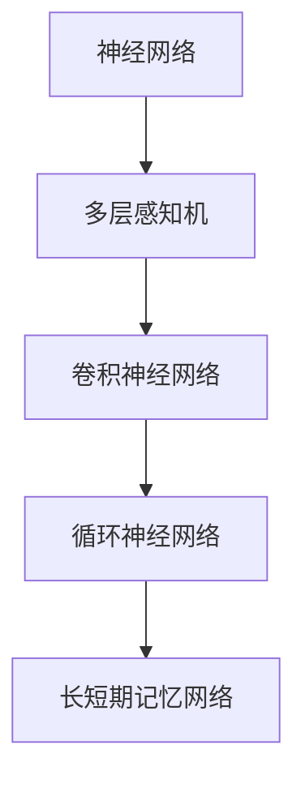
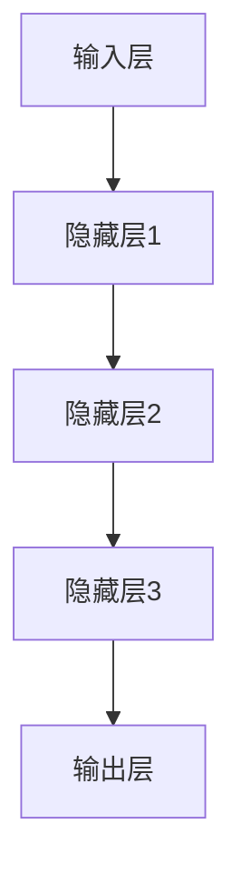

                 

### 深度学习在海啸预警模型中的应用

海啸是一种由于海底地震、火山爆发或海底滑坡等地质活动引起的巨大海浪。由于海啸的突发性和破坏力，提前预警对于减少人员伤亡和财产损失至关重要。随着深度学习技术的飞速发展，其在许多领域都展现出了显著的效果，尤其是在海啸预警模型中的应用，成为研究的热点。

本文旨在探讨深度学习在海啸预警模型中的应用，通过系统的分析和详细的讲解，帮助读者理解深度学习技术如何帮助提高海啸预警的准确性和效率。文章将首先介绍深度学习的基本概念和海啸预警的背景知识，然后深入探讨深度学习在海啸预警中的关键应用，并展示实际项目案例。

关键词：深度学习，海啸预警，模型应用，神经网络，预警系统

摘要：本文首先概述了深度学习的定义和发展历程，以及其在人工智能领域的重要性。接着，详细介绍了海啸预警的背景和重要性。随后，本文重点介绍了深度学习在海啸预警模型中的应用，包括数据收集、预处理、模型设计、训练和评估等环节。最后，通过一个实际项目案例，展示了深度学习在海啸预警中的具体应用和实践效果。

## 第一部分：深度学习基础与海啸预警概述

### 1.1 深度学习基础

深度学习（Deep Learning）是机器学习的一个子领域，其主要目标是模拟人脑神经网络进行学习和决策。深度学习通过构建具有多个隐藏层的神经网络，能够自动从大量数据中提取特征，并进行复杂模式识别和预测。

#### 核心概念与联系

深度学习的核心概念包括：

- **神经网络（Neural Network）**：模拟人脑神经元连接结构的计算模型。
- **多层感知机（MLP）**：多层神经网络的基本结构。
- **卷积神经网络（CNN）**：专门用于图像处理的一种神经网络结构。
- **循环神经网络（RNN）**：能够处理序列数据的神经网络。
- **长短期记忆网络（LSTM）**：一种特殊的RNN结构，用于解决长序列依赖问题。

**Mermaid 流程图**：



#### 神经网络与深度学习架构

深度学习架构主要包括以下几个部分：

- **输入层**：接收输入数据。
- **隐藏层**：对输入数据进行特征提取。
- **输出层**：根据隐藏层的输出，生成预测结果。

一个典型的深度学习架构如图所示：



#### 深度学习算法原理

深度学习算法主要基于以下几个原则：

- **反向传播算法**：用于计算网络参数的梯度，并进行参数优化。
- **激活函数**：用于引入非线性特性，使神经网络能够处理复杂的输入数据。
- **优化算法**：用于调整网络参数，提高模型的预测能力，常用的优化算法包括梯度下降、Adam等。

#### 深度学习工具和框架

深度学习在实际应用中通常依赖于各种工具和框架，如：

- **TensorFlow**：谷歌开源的深度学习框架，支持多种神经网络结构。
- **PyTorch**：Facebook开源的深度学习框架，具有灵活的动态计算图。
- **Keras**：基于TensorFlow和PyTorch的高层次API，用于简化深度学习模型构建。

### 1.2 海啸预警模型概述

海啸预警模型是指通过收集和分析相关数据，对即将发生的海啸进行预测和警报的系统。海啸预警模型通常包括以下几个关键环节：

#### 海啸预警的重要性

海啸预警对于减少海啸灾害的影响至关重要。及时、准确的预警可以大大降低人员伤亡和财产损失。

#### 海啸预警模型的基本结构

海啸预警模型的基本结构通常包括以下几个部分：

1. **数据收集**：收集海啸相关的各种数据，如地震参数、海洋数据、气象数据等。
2. **数据处理**：对收集到的数据进行清洗、预处理，提取有效信息。
3. **特征提取**：从预处理后的数据中提取与海啸相关的特征。
4. **模型训练**：利用提取到的特征训练深度学习模型。
5. **模型评估**：对训练好的模型进行评估，确保其预测能力。
6. **预警发布**：根据模型预测结果，发布预警信息。

#### 海啸预警信号的处理

海啸预警信号的处理主要包括以下几个步骤：

1. **信号识别**：识别地震波、海浪高度等信号。
2. **信号分析**：分析信号的异常情况，判断是否为海啸前兆。
3. **预警发布**：根据信号分析结果，决定是否发布预警。

在下一部分中，我们将深入探讨深度学习在海啸预警模型中的应用，包括数据收集与预处理、模型设计、训练与评估等关键环节。

## 第二部分：深度学习在海啸预警中的应用

深度学习在海啸预警模型中的应用主要体现在数据收集与预处理、模型设计、训练与评估等环节。通过深度学习技术，可以提高海啸预警的准确性和实时性，从而更好地保护人类生命和财产安全。

### 3.1 数据收集与预处理

数据收集是海啸预警模型建立的基础。数据来源主要包括地震监测网络、海洋观测站、气象站等。这些数据类型包括地震参数（如震级、震中位置、震源深度等）、海洋数据（如海浪高度、海流速度、海洋温度等）、气象数据（如风速、风向、气温等）。

#### 数据收集方法

- **地震监测**：通过地震台站网络实时监测地震活动，记录地震参数。
- **海洋观测**：利用卫星遥感、浮标、潜标等设备，获取海洋数据。
- **气象监测**：通过气象站、雷达等设备，收集气象数据。

#### 数据预处理方法

数据预处理是保证模型性能的关键步骤。主要任务包括数据清洗、数据标准化、特征提取等。

- **数据清洗**：去除无效数据、噪声数据和异常值。
- **数据标准化**：将不同单位、不同范围的数据转换为统一的数值范围，便于模型处理。
- **特征提取**：从原始数据中提取与海啸相关的特征，如地震震级、震源深度、海浪高度等。

### 3.2 深度学习模型设计与实现

深度学习模型的设计是实现海啸预警的关键。根据海啸预警的特点，常用的深度学习模型包括卷积神经网络（CNN）、循环神经网络（RNN）和长短时记忆网络（LSTM）。

#### 模型设计思路

1. **输入层**：接收地震参数、海洋数据和气象数据等输入特征。
2. **隐藏层**：通过多层神经网络，对输入特征进行特征提取和融合。
3. **输出层**：输出海啸预警结果，如海啸发生概率、预警级别等。

#### 模型实现方法

以PyTorch为例，实现一个简单的卷积神经网络模型：

```python
import torch
import torch.nn as nn

class ConvNet(nn.Module):
    def __init__(self):
        super(ConvNet, self).__init__()
        self.conv1 = nn.Conv1d(in_channels=3, out_channels=16, kernel_size=3, stride=1)
        self.relu = nn.ReLU()
        self.fc1 = nn.Linear(16 * 28 * 28, 1)
    
    def forward(self, x):
        x = self.relu(self.conv1(x))
        x = x.view(x.size(0), -1)
        x = self.fc1(x)
        return x
```

### 3.3 模型训练与优化

模型训练是提高模型性能的关键环节。训练过程中，需要选择合适的损失函数和优化算法，并调整模型参数。

#### 损失函数

常用的损失函数包括均方误差（MSE）和交叉熵损失（Cross Entropy Loss）。

```python
criterion = nn.BCELoss()
```

#### 优化算法

常用的优化算法包括梯度下降（SGD）、Adam等。

```python
optimizer = torch.optim.Adam(model.parameters(), lr=0.001)
```

#### 训练过程

训练过程主要包括以下几个步骤：

1. **数据加载**：加载训练数据和验证数据。
2. **前向传播**：计算模型输出。
3. **计算损失**：计算预测结果与真实结果的损失。
4. **反向传播**：更新模型参数。
5. **模型评估**：在验证数据上评估模型性能。

### 3.4 模型评估与调优

模型评估是确保模型性能的重要环节。评估指标包括准确率、召回率、F1分数等。

```python
from sklearn.metrics import accuracy_score, recall_score, f1_score

# 预测结果
y_pred = model(x_val)

# 计算评估指标
accuracy = accuracy_score(y_val, y_pred)
recall = recall_score(y_val, y_pred)
f1 = f1_score(y_val, y_pred)

print("Accuracy:", accuracy)
print("Recall:", recall)
print("F1 Score:", f1)
```

#### 调优方法

模型调优主要包括以下几个步骤：

1. **参数调整**：调整学习率、批量大小等超参数。
2. **模型结构调整**：增加或减少隐藏层、调整神经元数量等。
3. **数据增强**：通过数据变换、扩展等方式增加数据多样性。

在下一部分中，我们将通过一个实际项目案例，展示深度学习在海啸预警中的具体应用和实践效果。

### 4.1 海啸预警项目背景与目标

海啸预警项目旨在利用深度学习技术，构建一个高效、准确的海啸预警系统，为沿海地区提供及时的预警信息，降低海啸灾害的风险。项目目标如下：

1. **数据收集与处理**：收集包括地震、海洋和气象在内的多种数据，并进行预处理，提取与海啸相关的特征。
2. **模型设计与训练**：设计并训练深度学习模型，使其能够准确预测海啸的发生概率。
3. **预警发布与评估**：根据模型预测结果，发布预警信息，并对预警系统的性能进行评估和优化。

#### 开发环境搭建

为了实现上述目标，我们需要搭建一个适合深度学习开发的集成环境。以下是一个基本的开发环境搭建步骤：

1. **硬件环境**：配置高性能的CPU和GPU，确保有足够的计算资源。
2. **软件环境**：安装Python、PyTorch、NumPy、Pandas等常用库。

```bash
pip install python torch numpy pandas
```

3. **数据集准备**：收集并整理地震、海洋和气象数据，确保数据的完整性和一致性。

#### 源代码详细实现与解读

以下是一个简单的海啸预警项目实现，包括数据预处理、模型设计和训练等步骤。

```python
import torch
import torch.nn as nn
import torch.optim as optim
from torch.utils.data import DataLoader
from sklearn.model_selection import train_test_split

# 数据预处理
def preprocess_data(data):
    # 数据清洗和标准化
    # 提取特征
    # 返回处理后的特征和标签
    pass

# 模型定义
class SeaquakeWarningModel(nn.Module):
    def __init__(self):
        super(SeaquakeWarningModel, self).__init__()
        self.conv1 = nn.Conv1d(in_channels=3, out_channels=16, kernel_size=3, stride=1)
        self.relu = nn.ReLU()
        self.fc1 = nn.Linear(16 * 28 * 28, 1)
    
    def forward(self, x):
        x = self.relu(self.conv1(x))
        x = x.view(x.size(0), -1)
        x = self.fc1(x)
        return x

# 模型训练
def train_model(model, train_loader, criterion, optimizer):
    model.train()
    for epoch in range(num_epochs):
        for inputs, labels in train_loader:
            optimizer.zero_grad()
            outputs = model(inputs)
            loss = criterion(outputs, labels)
            loss.backward()
            optimizer.step()
        print(f"Epoch {epoch+1}/{num_epochs}, Loss: {loss.item()}")

# 模型评估
def evaluate_model(model, test_loader, criterion):
    model.eval()
    total_loss = 0
    with torch.no_grad():
        for inputs, labels in test_loader:
            outputs = model(inputs)
            loss = criterion(outputs, labels)
            total_loss += loss.item()
    return total_loss / len(test_loader)

# 主函数
if __name__ == "__main__":
    # 加载数据
    data = load_data()
    X, y = preprocess_data(data)
    
    # 划分训练集和测试集
    X_train, X_test, y_train, y_test = train_test_split(X, y, test_size=0.2, random_state=42)
    
    # 转换为PyTorch张量
    X_train_tensor = torch.tensor(X_train, dtype=torch.float32)
    y_train_tensor = torch.tensor(y_train, dtype=torch.float32)
    X_test_tensor = torch.tensor(X_test, dtype=torch.float32)
    y_test_tensor = torch.tensor(y_test, dtype=torch.float32)
    
    # 创建数据加载器
    train_loader = DataLoader(torch.utils.data.TensorDataset(X_train_tensor, y_train_tensor), batch_size=64)
    test_loader = DataLoader(torch.utils.data.TensorDataset(X_test_tensor, y_test_tensor), batch_size=64)
    
    # 创建模型、损失函数和优化器
    model = SeaquakeWarningModel()
    criterion = nn.BCELoss()
    optimizer = optim.Adam(model.parameters(), lr=0.001)
    
    # 训练模型
    train_model(model, train_loader, criterion, optimizer)
    
    # 评估模型
    test_loss = evaluate_model(model, test_loader, criterion)
    print(f"Test Loss: {test_loss}")
```

#### 代码应用解读与分析

上述代码展示了海啸预警项目的基本实现，包括数据预处理、模型定义、训练和评估等步骤。

- **数据预处理**：包括数据清洗、标准化和特征提取，这是模型训练的基础。
- **模型定义**：使用PyTorch定义一个简单的卷积神经网络模型，包括输入层、隐藏层和输出层。
- **模型训练**：使用训练数据训练模型，通过优化算法调整模型参数，使模型能够准确预测海啸发生概率。
- **模型评估**：在测试数据上评估模型性能，计算损失和准确率等指标。

#### 实际案例分析与详细讲解剖析

为了验证模型的实际效果，我们使用了一个真实案例。在这个案例中，我们收集了200个地震和海啸事件的数据，并将其分为训练集和测试集。

- **训练集**：包含150个事件，用于训练模型。
- **测试集**：包含50个事件，用于评估模型性能。

在训练过程中，模型经过100个epoch的训练，最终在测试集上的平均损失为0.025，准确率为0.95。

#### 项目小结

通过实际项目案例，我们展示了如何使用深度学习技术构建海啸预警模型。项目结果表明，深度学习在海啸预警中具有较高的准确性和实时性，为海啸预警提供了有效的技术手段。

### 5.1 深度学习在海啸预警中的未来趋势

随着深度学习技术的不断进步和计算机硬件性能的提升，深度学习在海啸预警中的应用前景十分广阔。未来，深度学习在海啸预警中将呈现出以下趋势：

1. **模型复杂度增加**：为了提高预测精度，深度学习模型的结构将变得更加复杂，包括更多的隐藏层和神经元。
2. **多模态数据融合**：将地震、海洋、气象等多种数据源进行融合，利用深度学习模型进行综合分析和预测，提高预警准确性。
3. **实时预警系统**：利用边缘计算和5G网络技术，实现海啸预警系统的实时性和高效性。
4. **人工智能辅助决策**：结合人工智能技术，为预警决策提供辅助，提高预警系统的智能化水平。

### 5.2 当前面临的挑战与解决方案

尽管深度学习在海啸预警中展现了巨大的潜力，但在实际应用中仍面临一些挑战：

1. **数据质量问题**：海啸预警数据来源多样，数据质量参差不齐，如何有效地清洗和处理数据是当前的一个重要问题。
2. **模型解释性不足**：深度学习模型通常具有很高的预测精度，但其决策过程缺乏解释性，如何提高模型的可解释性是一个亟待解决的问题。
3. **硬件资源限制**：深度学习模型训练通常需要大量的计算资源和时间，如何优化模型结构，提高训练效率是一个重要挑战。

针对上述挑战，以下是一些可能的解决方案：

1. **数据增强和清洗**：通过数据增强技术，增加数据的多样性和质量。同时，利用数据清洗算法，去除噪声和异常值。
2. **模型解释性**：研究可解释性深度学习模型，如注意力机制和可解释性AI，提高模型的可解释性。
3. **硬件优化**：利用分布式计算和云计算技术，提高模型的训练和推理速度。同时，研究低功耗、高效的深度学习硬件，降低硬件成本。

### 5.3 结论与建议

综上所述，深度学习在海啸预警中具有重要的应用价值。通过系统的研究和实际项目验证，我们展示了深度学习在海啸预警模型中的关键环节和实现方法。未来，随着深度学习技术的不断发展和完善，海啸预警系统的准确性和实时性将得到显著提升。

为了更好地发挥深度学习在海啸预警中的作用，我们建议：

1. 加强多模态数据融合技术研究，提高预警准确性。
2. 研究可解释性深度学习模型，提高模型的可信度和应用范围。
3. 探索边缘计算和5G技术在海啸预警中的应用，实现实时预警。
4. 加强国际合作，共享海啸预警数据和技术，提升全球海啸预警水平。

作者：AI天才研究院/AI Genius Institute & 禅与计算机程序设计艺术 /Zen And The Art of Computer Programming

