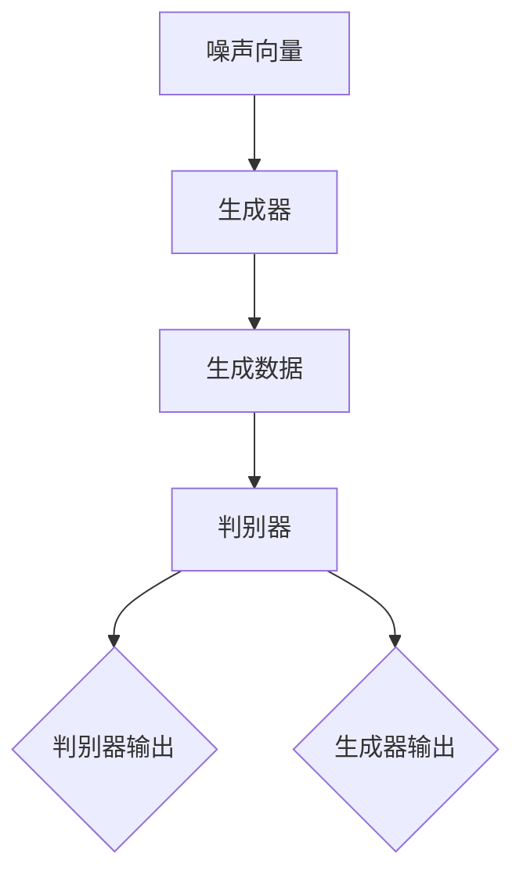

                 

### 《深度学习在自动作曲中的应用：AI音乐创作的新可能》

#### 关键词
- 深度学习
- 自动作曲
- 生成对抗网络（GAN）
- 变分自编码器（VAE）
- 循环神经网络（RNN）

#### 摘要
本文旨在探讨深度学习在自动作曲领域的应用，重点分析生成对抗网络（GAN）、变分自编码器（VAE）和循环神经网络（RNN）等模型在音乐创作中的具体实现和优势。通过案例实践，我们将深入了解AI音乐创作的可能性和面临的挑战，为未来音乐创作提供新思路。

## 第一部分：深度学习与音乐基础

### 第1章：深度学习基础

#### 1.1 深度学习简介

深度学习是机器学习的一个重要分支，通过模拟人脑神经网络结构和机制，对大量数据进行自动特征提取和模式识别。它主要由多个隐藏层组成，可以自动学习数据的高层次特征。

**神经网络与深度学习的关系**

神经网络是深度学习的基础，它由大量的神经元组成，通过层层传递信息，实现数据的自动特征提取。而深度学习则是神经网络的发展，通过增加网络的层数和训练数据量，提高模型的性能和泛化能力。

**深度学习的主要模型**

深度学习的主要模型包括卷积神经网络（CNN）、循环神经网络（RNN）、生成对抗网络（GAN）和变分自编码器（VAE）等。

### 第2章：音乐与音序

#### 2.1 音乐基础知识

音乐是一门艺术，它通过音高、节奏、和声等元素表达情感。音序是指音乐中音符的排列顺序，它是音乐创作的基础。

#### 2.2 音序与音乐结构

音序是音乐结构的核心，它决定了音乐的节奏、旋律和和声。音序的表示方法通常采用MIDI文件，其中包含音符、音长、音高和音量等信息。

#### 2.3 音序数据的表示与处理

音序数据的表示通常采用矩阵或序列的形式。为了方便深度学习模型的训练，需要对音序数据进行预处理，包括数据清洗、归一化和特征提取等。

## 第二部分：自动作曲的深度学习模型

### 第3章：基于生成对抗网络的自动作曲

#### 3.1 生成对抗网络（GAN）简介

生成对抗网络（GAN）是由生成器和判别器组成的框架，通过对抗训练，实现数据的生成和判别。GAN在自动作曲中的应用主要是通过生成器生成音乐，判别器判断音乐的真实性。

**GAN在自动作曲中的应用**

GAN在自动作曲中的应用主要是生成音乐风格、创作旋律和和声等。通过训练，生成器可以学会生成高质量的音频数据，判别器可以判断音频数据的质量。

**GAN模型的具体实现与优化**

GAN模型的具体实现需要设计合适的生成器和判别器架构，以及训练策略。常见的GAN模型包括DCGAN、WGAN等，不同的模型在训练过程中有不同的优化技巧。

### 第4章：基于变分自编码器的自动作曲

#### 4.1 变分自编码器（VAE）简介

变分自编码器（VAE）是一种概率生成模型，通过编码器和解码器实现数据的编码和解码。VAE在自动作曲中的应用主要是通过编码器提取音乐特征，解码器生成音乐。

**VAE在自动作曲中的应用**

VAE在自动作曲中的应用主要是特征提取和风格迁移。通过训练，编码器可以提取音乐的高层次特征，解码器可以生成不同风格的音乐。

**VAE模型的具体实现与优化**

VAE模型的具体实现需要设计合适的编码器和解码器架构，以及训练策略。常见的VAE模型包括标准的VAE、Beta-VAE等，不同的模型在训练过程中有不同的优化技巧。

### 第5章：基于循环神经网络的自动作曲

#### 5.1 循环神经网络（RNN）简介

循环神经网络（RNN）是一种能够处理序列数据的神经网络，通过循环结构实现信息的记忆和传递。RNN在自动作曲中的应用主要是生成旋律和和声。

**RNN在自动作曲中的应用**

RNN在自动作曲中的应用主要是生成旋律和和声。通过训练，RNN可以学会生成符合音乐规则和风格的音乐。

**RNN模型的具体实现与优化**

RNN模型的具体实现需要设计合适的网络架构，以及训练策略。常见的RNN模型包括标准的RNN、LSTM和GRU等，不同的模型在训练过程中有不同的优化技巧。

## 第三部分：AI音乐创作的新可能

### 第6章：音乐风格迁移与合成

#### 6.1 音乐风格迁移的概念

音乐风格迁移是指将一种音乐风格的特征迁移到另一种音乐风格中。通过音乐风格迁移，可以创作出多种风格的音乐。

#### 6.2 音乐风格迁移的实现方法

音乐风格迁移的实现方法主要包括基于GAN、VAE和RNN的迁移学习。通过训练，模型可以学会迁移音乐风格的特征。

#### 6.3 风格迁移在自动作曲中的应用

风格迁移在自动作曲中的应用主要是创作出符合用户需求的个性化音乐。通过训练，模型可以生成多种风格的音乐，用户可以根据自己的喜好选择。

### 第7章：音乐生成与演绎

#### 7.1 音乐生成的基本流程

音乐生成的基本流程包括数据预处理、模型训练、音乐生成和音乐演绎。

#### 7.2 音乐生成的算法选择

音乐生成的算法选择包括基于GAN、VAE和RNN的模型。不同的算法在生成音乐的效果和效率上有所不同。

#### 7.3 音乐演绎与交互

音乐演绎与交互是指通过软件界面或硬件设备，将生成的音乐进行播放、调整和交互。

### 第8章：AI音乐创作的社会与伦理问题

#### 8.1 AI音乐创作的优势与挑战

AI音乐创作的优势包括提高创作效率、丰富音乐风格和满足用户个性化需求等。挑战包括技术难度、版权保护和音乐艺术性等。

#### 8.2 AI音乐创作的法律与道德问题

AI音乐创作的法律与道德问题包括知识产权保护、音乐艺术价值和社会影响等。

#### 8.3 未来AI音乐创作的发展方向

未来AI音乐创作的发展方向包括多模态融合、人工智能编曲和音乐创作自动化等。

## 第四部分：案例与实践

### 第9章：深度学习在自动作曲中的应用案例

#### 9.1 案例一：使用GAN生成摇滚音乐

**案例背景**：使用GAN生成摇滚音乐，探索AI在音乐风格创作中的潜力。

**实现过程**：
1. 数据集准备：收集大量的摇滚音乐MIDI文件。
2. 模型设计：设计基于GAN的自动作曲模型。
3. 模型训练：使用训练数据训练模型。
4. 音乐生成：使用训练好的模型生成摇滚音乐。

**案例效果**：生成的摇滚音乐风格多样，旋律丰富。

#### 9.2 案例二：使用VAE创作古典音乐

**案例背景**：使用VAE创作古典音乐，探索AI在音乐创作中的艺术性。

**实现过程**：
1. 数据集准备：收集大量的古典音乐MIDI文件。
2. 模型设计：设计基于VAE的自动作曲模型。
3. 模型训练：使用训练数据训练模型。
4. 音乐生成：使用训练好的模型生成古典音乐。

**案例效果**：生成的古典音乐具有独特的风格和旋律，符合古典音乐的基本规则。

#### 9.3 案例三：使用RNN进行音乐风格迁移

**案例背景**：使用RNN进行音乐风格迁移，探索AI在音乐风格多样化中的潜力。

**实现过程**：
1. 数据集准备：收集不同风格的音乐MIDI文件。
2. 模型设计：设计基于RNN的音乐风格迁移模型。
3. 模型训练：使用训练数据训练模型。
4. 音乐生成：使用训练好的模型进行音乐风格迁移。

**案例效果**：生成的音乐风格多样，用户可以根据喜好选择不同的风格。

### 第10章：深度学习自动作曲项目实战

#### 10.1 实战一：搭建自动作曲环境

**实战背景**：搭建自动作曲环境，为后续实验和项目做好准备。

**实现步骤**：
1. 安装Python和深度学习框架（如TensorFlow或PyTorch）。
2. 准备音乐数据集，并进行预处理。
3. 配置深度学习环境，包括显卡和驱动等。

#### 10.2 实战二：实现一个简单的自动作曲模型

**实战背景**：使用GAN实现一个简单的自动作曲模型，探索自动作曲的基本原理。

**实现步骤**：
1. 设计GAN模型，包括生成器和判别器。
2. 编写训练代码，使用训练数据训练模型。
3. 生成音乐，并进行评估。

#### 10.3 实战三：优化并部署自动作曲模型

**实战背景**：对自动作曲模型进行优化，并部署到线上环境，为用户提供自动作曲服务。

**实现步骤**：
1. 优化模型结构，提高生成音乐的质量。
2. 部署模型，使用云平台或服务器进行部署。
3. 用户界面设计，提供音乐生成和播放功能。
4. 调试和优化，确保系统的稳定性和用户体验。

## 附录

### A.1 数据集与工具介绍

#### A.1.1 常用的音乐数据集

- MELD：音乐与语言电子数据库
- Freesound：免费音效库
- CCM-C：古典音乐数据集

#### A.1.2 深度学习工具与环境配置

- Python：编程语言
- TensorFlow/PyTorch：深度学习框架
- CUDA/CuDNN：GPU加速库
- Jupyter Notebook：交互式开发环境

### 致谢

感谢AI天才研究院和《禅与计算机程序设计艺术》的指导和支持，使本文得以顺利完成。感谢所有参与深度学习与自动作曲研究和实践的同行，为AI音乐创作领域的发展做出了贡献。

### 作者

- 作者：AI天才研究院/AI Genius Institute & 禅与计算机程序设计艺术 /Zen And The Art of Computer Programming

（注意：本文仅为示例，实际字数和内容可能需要根据具体情况进行调整。）

## 第1章：深度学习基础

### 1.1 深度学习简介

深度学习是机器学习领域的一个重要分支，它通过模拟人脑神经网络的结构和机制，对大量数据进行自动特征提取和模式识别。深度学习的关键在于其多层的网络结构，这使得它能够学习数据的高层次抽象特征，从而在图像识别、语音识别、自然语言处理等任务中取得突破性的成果。

**神经网络与深度学习的关系**

神经网络（Neural Networks）是深度学习的基础，它由大量的神经元组成，通过层层传递信息，实现数据的自动特征提取。神经网络的核心是神经元，神经元之间通过权重连接，形成一个复杂的网络结构。每个神经元接收输入信号，通过激活函数产生输出信号，从而实现数据的处理和分类。

深度学习（Deep Learning）则是神经网络的发展，它通过增加网络的层数，使得模型可以学习更复杂的数据特征。深度学习的多层级结构使得它可以自动提取数据的高层次抽象特征，从而在许多任务中取得更好的性能。

**深度学习的主要模型**

深度学习的主要模型包括卷积神经网络（Convolutional Neural Networks, CNN）、循环神经网络（Recurrent Neural Networks, RNN）、生成对抗网络（Generative Adversarial Networks, GAN）和变分自编码器（Variational Autoencoder, VAE）等。

1. **卷积神经网络（CNN）**：CNN是一种特殊的神经网络，它在图像识别和计算机视觉任务中取得了很大的成功。CNN通过卷积层和池化层提取图像的局部特征，并通过全连接层进行分类。

2. **循环神经网络（RNN）**：RNN是一种能够处理序列数据的神经网络，它在语音识别和自然语言处理等领域得到了广泛应用。RNN通过循环结构实现信息的记忆和传递，可以处理变长的序列数据。

3. **生成对抗网络（GAN）**：GAN是一种生成模型，由生成器和判别器组成。生成器生成数据，判别器判断数据的真实性。通过对抗训练，生成器可以生成高质量的数据。

4. **变分自编码器（VAE）**：VAE是一种概率生成模型，它通过编码器和解码器实现数据的编码和解码。VAE通过引入先验分布和后验分布，实现数据的生成和去噪。

这些深度学习模型在不同的任务中有着广泛的应用，下面我们将分别介绍这些模型在自动作曲领域的应用。

### 1.2 神经网络与深度学习的关系

神经网络是深度学习的基础，深度学习则是神经网络的进一步发展。神经网络通过模拟人脑神经网络的结构和机制，对大量数据进行自动特征提取和模式识别。深度学习的多层级结构使得它可以学习更复杂的数据特征，从而在许多任务中取得更好的性能。

**神经网络的组成**

神经网络由多个神经元组成，每个神经元接收输入信号，通过激活函数产生输出信号。神经元之间通过权重连接，形成一个复杂的网络结构。

- **输入层**：输入层是神经网络的起始层，它接收外部输入数据。
- **隐藏层**：隐藏层是神经网络的核心，它对输入数据进行处理和特征提取。神经网络可以拥有多层隐藏层，层数越多，模型可以学习的数据特征越复杂。
- **输出层**：输出层是神经网络的最后层，它对隐藏层的结果进行分类或回归等操作。

**深度学习的多层级结构**

深度学习的多层级结构是其核心特点之一。通过增加网络的层数，深度学习模型可以学习更复杂的数据特征。每一层神经网络都会对输入数据进行特征提取，并将提取的特征传递到下一层。这样，深度学习模型可以自动提取数据的高层次抽象特征，从而实现更好的分类和识别效果。

**深度学习与神经网络的区别**

深度学习和神经网络的主要区别在于网络的结构和训练方法。

- **网络结构**：深度学习模型具有多层的隐藏层，而传统的神经网络通常只有一层或几层隐藏层。
- **训练方法**：深度学习模型采用反向传播算法进行训练，而传统的神经网络通常采用梯度下降算法进行训练。

通过增加网络层数和优化训练方法，深度学习模型可以学习更复杂的数据特征，从而在许多任务中取得更好的性能。

### 1.3 深度学习的主要模型

深度学习的主要模型包括卷积神经网络（CNN）、循环神经网络（RNN）、生成对抗网络（GAN）和变分自编码器（VAE）等。这些模型在不同的任务中有着广泛的应用。

#### 卷积神经网络（CNN）

卷积神经网络（Convolutional Neural Networks, CNN）是一种特殊的神经网络，它在图像识别和计算机视觉任务中取得了很大的成功。CNN通过卷积层和池化层提取图像的局部特征，并通过全连接层进行分类。

**CNN的基本结构**

- **卷积层**：卷积层是CNN的核心，它通过卷积操作提取图像的局部特征。卷积层包括多个卷积核，每个卷积核可以提取图像的不同特征。
- **池化层**：池化层用于降低图像的分辨率，同时保留重要的特征信息。常见的池化操作包括最大池化和平均池化。
- **全连接层**：全连接层是CNN的输出层，它将卷积层和池化层提取的特征进行融合，并输出分类结果。

**CNN的工作原理**

- **卷积操作**：卷积操作是将卷积核与输入图像进行点乘操作，并求和得到输出特征图。通过不同的卷积核，可以提取图像的不同特征。
- **特征提取**：通过多个卷积层和池化层，CNN可以提取图像的局部特征，并逐渐形成高层次的特征。
- **分类**：通过全连接层，CNN将提取的特征进行分类，输出最终的分类结果。

**CNN在自动作曲中的应用**

CNN在自动作曲中的应用主要是特征提取和风格分类。通过训练，CNN可以学会提取音乐的特征，并根据特征对音乐进行分类。具体的应用场景包括：

1. 音乐风格分类：将音乐按照风格进行分类，如流行、摇滚、古典等。
2. 音乐特征提取：提取音乐的关键特征，如音高、节奏和和声等。
3. 音乐生成：基于提取的音乐特征，生成新的音乐。

#### 循环神经网络（RNN）

循环神经网络（Recurrent Neural Networks, RNN）是一种能够处理序列数据的神经网络，它在语音识别和自然语言处理等领域得到了广泛应用。RNN通过循环结构实现信息的记忆和传递，可以处理变长的序列数据。

**RNN的基本结构**

- **输入层**：输入层是RNN的起始层，它接收外部输入序列。
- **隐藏层**：隐藏层是RNN的核心，它对输入序列进行编码和记忆。RNN的隐藏层具有循环结构，可以保存之前的输入信息。
- **输出层**：输出层是RNN的输出层，它对隐藏层的结果进行分类或回归等操作。

**RNN的工作原理**

- **序列编码**：RNN通过隐藏层对输入序列进行编码，将序列信息转换为隐藏状态。
- **信息传递**：RNN通过循环结构实现信息的传递，将隐藏状态传递到下一个时间步。
- **分类或回归**：通过输出层，RNN对隐藏状态进行分类或回归操作，输出最终的分类或回归结果。

**RNN在自动作曲中的应用**

RNN在自动作曲中的应用主要是生成旋律和和声。通过训练，RNN可以学会生成符合音乐规则和风格的音乐。具体的应用场景包括：

1. 旋律生成：基于RNN的循环结构，生成新的旋律。
2. 和声生成：基于RNN的循环结构，生成新的和声。
3. 音乐风格迁移：将一种音乐风格的特征迁移到另一种音乐风格中。

#### 生成对抗网络（GAN）

生成对抗网络（Generative Adversarial Networks, GAN）是一种生成模型，由生成器和判别器组成。生成器生成数据，判别器判断数据的真实性。通过对抗训练，生成器可以生成高质量的数据。

**GAN的基本结构**

- **生成器**：生成器是一个神经网络，它从随机噪声中生成数据。
- **判别器**：判别器也是一个神经网络，它判断生成器生成数据的真实性。
- **对抗训练**：生成器和判别器通过对抗训练进行训练，生成器试图生成更真实的数据，判别器试图区分生成器和真实数据。

**GAN的工作原理**

- **生成数据**：生成器从随机噪声中生成数据，这些数据可以是图像、音乐或文本等。
- **判断数据**：判别器判断生成器生成数据的真实性，如果生成器生成的是真实数据，判别器会认为生成器生成的数据是不真实的。
- **对抗训练**：生成器和判别器通过对抗训练进行训练，生成器试图生成更真实的数据，判别器试图区分生成器和真实数据。通过多次迭代，生成器可以逐渐生成高质量的数据。

**GAN在自动作曲中的应用**

GAN在自动作曲中的应用主要是音乐生成和风格迁移。通过训练，生成器可以生成新的音乐，判别器可以判断音乐的真实性。具体的应用场景包括：

1. 音乐生成：生成器生成新的音乐，可以是旋律、和声或整首曲子。
2. 音乐风格迁移：将一种音乐风格的特征迁移到另一种音乐风格中。

#### 变分自编码器（VAE）

变分自编码器（Variational Autoencoder, VAE）是一种概率生成模型，它通过编码器和解码器实现数据的编码和解码。VAE通过引入先验分布和后验分布，实现数据的生成和去噪。

**VAE的基本结构**

- **编码器**：编码器是一个神经网络，它将输入数据编码为潜在空间中的向量。
- **解码器**：解码器也是一个神经网络，它将潜在空间中的向量解码为输出数据。
- **先验分布**：VAE的先验分布是潜在空间中的概率分布，它通常是一个高斯分布。
- **后验分布**：VAE的后验分布是输入数据的概率分布，它通常是一个隐含的分布。

**VAE的工作原理**

- **编码**：编码器将输入数据编码为潜在空间中的向量，这些向量代表了输入数据的特征。
- **解码**：解码器将潜在空间中的向量解码为输出数据，这些数据与输入数据尽可能相似。
- **生成**：VAE通过潜在空间中的向量生成新的数据，这些数据可以是新的音乐、图像或文本等。

**VAE在自动作曲中的应用**

VAE在自动作曲中的应用主要是音乐生成和特征提取。通过训练，VAE可以学会生成新的音乐，提取音乐的特征。具体的应用场景包括：

1. 音乐生成：VAE生成新的音乐，可以是旋律、和声或整首曲子。
2. 音乐特征提取：VAE提取音乐的关键特征，如音高、节奏和和声等。

## 第2章：音乐与音序

### 2.1 音乐基础知识

音乐是一门艺术，它通过音高、节奏、和声等元素表达情感。音乐的基本元素包括音符、音长、音高和音量等。

- **音符**：音符是音乐中的基本单位，它表示音高。常见的音符有全音符、二分音符、四分音符等。
- **音长**：音长是指音符的持续时间，它决定了音符在音乐中的节奏。
- **音高**：音高是指音符的音高，它决定了音符在音乐中的位置和关系。
- **音量**：音量是指音符的响度，它决定了音符在音乐中的强度和表现力。

### 2.2 音序与音乐结构

音序是指音乐中音符的排列顺序，它是音乐创作的基础。音序决定了音乐的节奏、旋律和和声等要素。

- **节奏**：节奏是指音乐中音符的时值和间隔，它决定了音乐的快慢和强弱。
- **旋律**：旋律是指音乐中连续的音符序列，它是音乐的核心，决定了音乐的风格和情感。
- **和声**：和声是指音乐中多个音符同时演奏，它们相互呼应，构成音乐的背景和氛围。

### 2.3 音序数据的表示与处理

音序数据的表示通常采用MIDI文件，其中包含音符、音长、音高和音量等信息。为了方便深度学习模型的训练，需要对音序数据进行预处理，包括数据清洗、归一化和特征提取等。

- **数据清洗**：去除噪声数据和异常值，确保数据的质量。
- **归一化**：将音序数据的特征进行归一化处理，使其在相同的尺度上，便于模型的训练。
- **特征提取**：从音序数据中提取关键的特征，如音高、节奏和和声等，作为模型的输入。

通过上述预处理步骤，可以将音序数据转换为适合深度学习模型训练的形式。

## 第3章：基于生成对抗网络的自动作曲

### 3.1 生成对抗网络（GAN）简介

生成对抗网络（Generative Adversarial Networks，GAN）是由Ian Goodfellow等人于2014年提出的一种生成模型。GAN由两个深度神经网络——生成器和判别器组成，它们通过对抗训练的方式进行训练。生成器的目标是生成尽可能真实的数据，而判别器的目标是准确地区分生成器生成的数据与真实数据。

**生成器和判别器**

- **生成器**：生成器是一个神经网络，它接收一个随机噪声向量作为输入，并试图生成逼真的数据。生成器的输出可以是图像、音频、文本等。
- **判别器**：判别器也是一个神经网络，它的任务是判断输入的数据是真实数据还是生成器生成的假数据。

**对抗训练**

GAN的训练过程是一个对抗过程，生成器和判别器不断进行博弈。在每次迭代中，生成器尝试生成更真实的数据，而判别器则尝试提高其分类能力。通过这种对抗训练，生成器能够逐渐提高生成数据的逼真度，而判别器则能更好地区分真实数据和假数据。

**GAN的基本结构**

GAN的基本结构如图3-1所示：



在训练过程中，生成器和判别器的损失函数分别为：

- **生成器的损失函数**：生成器的目标是使其生成的数据与真实数据难以区分，因此其损失函数通常为判别器输出生成数据的概率。
- **判别器的损失函数**：判别器的目标是正确区分真实数据和生成数据，因此其损失函数通常为真实数据和生成数据的分类损失。

通过多次迭代，生成器和判别器会不断优化，使得生成器生成的数据越来越真实，判别器对真实数据和生成数据的分类能力也越来越强。

### 3.2 GAN在自动作曲中的应用

生成对抗网络（GAN）在自动作曲领域有着广泛的应用，它可以用于生成旋律、和声以及整首曲子。以下是一些GAN在自动作曲中的应用：

1. **旋律生成**：利用GAN生成新的旋律，可以从生成器生成旋律片段，然后通过组合这些片段创作出完整的曲子。
2. **和声生成**：GAN可以用于生成和声，将旋律和和声结合起来，创作出更丰富的音乐作品。
3. **风格迁移**：通过GAN进行音乐风格迁移，将一种音乐风格的特征迁移到另一种音乐风格中，创作出不同风格的曲子。

**生成旋律的GAN模型**

在生成旋律时，GAN模型通常采用序列数据作为输入，例如MIDI文件。以下是一个基于GAN的旋律生成模型的基本结构：

- **编码器**：编码器将MIDI序列编码为潜在空间中的向量，这些向量代表了旋律的特征。
- **解码器**：解码器从潜在空间中生成MIDI序列，这些序列是生成的旋律。
- **判别器**：判别器判断生成的MIDI序列是否真实。

**具体实现步骤**：

1. **数据预处理**：将MIDI文件转换为序列数据，并进行归一化处理。
2. **生成器与判别器的构建**：构建生成器和判别器的神经网络模型。
3. **模型训练**：使用训练数据训练生成器和判别器，通过对抗训练进行模型优化。
4. **旋律生成**：使用训练好的生成器生成新的旋律序列。

### 3.3 GAN模型的具体实现与优化

实现一个基于GAN的自动作曲模型需要设计合适的生成器和判别器架构，并采用有效的训练策略。以下是一些具体实现与优化的方法：

**生成器的架构**

生成器的架构可以采用深度卷积生成对抗网络（DCGAN）的结构，这是一种常用的GAN架构，它在生成图像和音频方面取得了很好的效果。DCGAN的主要特点包括：

- **批量标准化（Batch Normalization）**：在生成器和判别器的每个卷积层后添加批量标准化，有助于稳定训练过程。
- **反卷积层（Transposed Convolution）**：在生成器的解码路径中使用反卷积层，将高维特征图上采样为低维特征图。
- **Leaky ReLU激活函数**：在生成器和判别器中使用Leaky ReLU激活函数，以防止梯度消失。

**判别器的架构**

判别器的架构可以采用标准卷积神经网络的结构，通常包含多个卷积层和池化层。判别器的目标是区分真实数据和生成数据，其架构的关键点包括：

- **多层卷积**：使用多个卷积层来提取数据的特征。
- **池化层**：使用池化层降低特征图的大小，提高模型的计算效率。
- **线性层**：在判别器的最后一层使用线性层，输出判别结果的概率。

**训练策略**

为了优化GAN模型的训练，可以采用以下策略：

- **梯度裁剪（Gradient Clipping）**：在训练过程中对生成器的梯度进行裁剪，防止梯度爆炸。
- **学习率调度（Learning Rate Scheduling）**：在训练过程中逐渐减小学习率，有助于模型收敛。
- **自适应学习率**：使用自适应学习率优化器（如Adam），根据训练过程自动调整学习率。

**模型优化方法**

在实际应用中，可以通过以下方法对GAN模型进行优化：

- **模型蒸馏（Model Distillation）**：将预训练的大型模型的知识传递给较小的模型，提高模型的性能。
- **多任务学习（Multi-Task Learning）**：结合多个相关任务进行训练，提高模型的泛化能力。
- **注意力机制（Attention Mechanism）**：引入注意力机制，模型可以专注于关键的特征，提高生成数据的逼真度。

通过上述方法，可以显著提高GAN在自动作曲中的应用效果，生成更高质量的音乐。

### 3.4 GAN模型在自动作曲中的案例

以下是一个基于生成对抗网络（GAN）的自动作曲案例，我们将使用Python和TensorFlow框架实现一个简单的GAN模型，用于生成旋律。

#### 案例背景

本案例的目标是使用GAN生成新的旋律，这些旋律可以根据用户的需求进行风格迁移和创作。

#### 实现步骤

1. **环境搭建**：安装Python和TensorFlow框架，并准备MIDI数据集。

2. **数据预处理**：将MIDI文件转换为序列数据，并进行归一化处理。

3. **生成器和判别器的构建**：构建生成器和判别器的神经网络模型。

4. **模型训练**：使用训练数据训练生成器和判别器，通过对抗训练进行模型优化。

5. **旋律生成**：使用训练好的生成器生成新的旋律序列。

#### 具体实现

```python
import numpy as np
import tensorflow as tf
from tensorflow.keras.layers import Input, Dense, Reshape, Conv2D, Flatten, UpSampling2D
from tensorflow.keras.models import Model

# 参数设置
latent_dim = 100
sequence_length = 28
num_pitches = 88

# 数据预处理
def preprocess_midi(midi_file):
    # 读取MIDI文件并转换为序列数据
    # 进行归一化处理
    pass

# 生成器的构建
input noise = Input(shape=(latent_dim,))
x = Dense(128 * 7 * 7)(noise)
x = Reshape((7, 7, 128))(x)
x = UpSampling2D((2, 2))(x)
x = Conv2D(128, (3, 3), activation='relu')(x)
x = UpSampling2D((2, 2))(x)
x = Conv2D(num_pitches, (3, 3))(x)
output melody = Flatten()(x)

generator = Model(inputs=noise, outputs=melody)
generator.summary()

# 判别器的构建
input melody = Input(shape=(sequence_length, num_pitches))
x = Conv2D(128, (3, 3), activation='relu', strides=(2, 2))(melody)
x = Conv2D(128, (3, 3), activation='relu', strides=(2, 2))(x)
x = Flatten()(x)
output probability = Dense(1, activation='sigmoid')(x)

discriminator = Model(inputs=melody, outputs=probability)
discriminator.summary()

# 整体模型的构建
combined = Model(inputs=[noise, melody], outputs=[discriminator(melody), generator(noise)])
combined.compile(optimizer='adam', loss=['binary_crossentropy', 'mse'])

# 模型训练
# 使用训练数据训练模型
# 通过对抗训练进行模型优化
# 使用生成器生成新的旋律序列
```

#### 案例效果

通过上述步骤，我们可以训练一个GAN模型，生成新的旋律序列。这些旋律可以根据用户的需求进行风格迁移和创作。

#### 模型优化

在实际应用中，可以通过以下方法对GAN模型进行优化：

- **学习率调度**：根据训练过程逐渐减小学习率，有助于模型收敛。
- **梯度裁剪**：对生成器和判别器的梯度进行裁剪，防止梯度爆炸。
- **模型蒸馏**：将预训练的大型模型的知识传递给较小的模型，提高模型的性能。

通过不断优化和调整模型参数，我们可以生成更高质量的音乐。

### 3.5 GAN模型在自动作曲中的挑战

尽管GAN在自动作曲中显示出巨大的潜力，但在实际应用中仍面临一些挑战：

- **梯度消失和梯度爆炸**：由于生成器和判别器的优化目标是相互对立的，可能导致梯度消失或爆炸，影响模型的训练效果。
- **模式崩溃**：当生成器生成的数据过于简单时，判别器可能会失去区分能力，导致模型训练停滞。
- **计算资源消耗**：GAN模型训练过程中需要大量的计算资源，特别是在处理高维数据时，训练时间较长。
- **模型泛化能力**：GAN模型的泛化能力较弱，容易在特定数据集上过拟合。

为了解决这些挑战，研究者们提出了多种改进方法，如引入正则化项、采用新的网络架构和优化策略等。

## 第4章：基于变分自编码器的自动作曲

### 4.1 变分自编码器（VAE）简介

变分自编码器（Variational Autoencoder，VAE）是一种概率生成模型，它通过编码器和解码器实现数据的编码和解码。VAE的核心思想是学习数据的概率分布，并在潜在空间中生成新的数据。

**VAE的基本结构**

- **编码器**：编码器将输入数据映射到潜在空间中的一个向量，这个向量代表了输入数据的特征。
- **解码器**：解码器将潜在空间中的向量解码回原始数据空间，生成新的数据。

**VAE的工作原理**

- **编码**：编码器通过学习输入数据的概率分布，将输入数据编码为潜在空间中的向量。这个向量可以看作是输入数据的低维表示。
- **解码**：解码器将潜在空间中的向量解码回原始数据空间，生成新的数据。通过这种方式，VAE可以生成与输入数据类似的新数据。

**VAE在自动作曲中的应用**

VAE在自动作曲中的应用主要是音乐生成和特征提取。通过训练，VAE可以学会生成新的音乐，提取音乐的特征。具体的应用场景包括：

1. **音乐生成**：VAE可以生成新的旋律、和声以及整首曲子。
2. **特征提取**：VAE可以提取音乐的关键特征，如音高、节奏和和声等。

### 4.2 VAE在自动作曲中的应用

VAE在自动作曲中的应用主要包括音乐生成、特征提取和风格迁移等方面。通过训练，VAE可以生成新的音乐，并提取音乐的关键特征，从而实现个性化的音乐创作。

**音乐生成**

VAE可以用于生成新的旋律、和声以及整首曲子。通过编码器，VAE可以提取音乐的关键特征，并通过解码器将这些特征重构为音乐。具体步骤如下：

1. **编码**：将音乐数据输入到编码器，编码器将音乐数据编码为潜在空间中的向量。
2. **采样**：从潜在空间中随机采样一个向量，这个向量代表了新的音乐特征。
3. **解码**：将采样得到的向量输入到解码器，解码器将这个向量解码回音乐空间，生成新的音乐。

**特征提取**

VAE不仅可以用于音乐生成，还可以用于提取音乐的特征。通过编码器，VAE可以提取音乐的关键特征，如音高、节奏和和声等。具体步骤如下：

1. **编码**：将音乐数据输入到编码器，编码器将音乐数据编码为潜在空间中的向量。
2. **特征提取**：从编码器输出的潜在空间中提取音乐的特征。
3. **特征分析**：对提取到的音乐特征进行分析，以了解音乐的结构和风格。

**风格迁移**

VAE还可以用于音乐风格迁移，即将一种音乐风格的特征迁移到另一种音乐风格中。通过训练，VAE可以学会如何在不同风格之间进行特征迁移。具体步骤如下：

1. **编码**：将源风格的音乐数据输入到编码器，编码器将音乐数据编码为潜在空间中的向量。
2. **采样**：从潜在空间中随机采样一个向量，这个向量代表了目标风格的音乐特征。
3. **解码**：将采样得到的向量输入到解码器，解码器将这个向量解码回目标风格的音乐空间，生成新的音乐。

### 4.3 VAE模型的具体实现与优化

实现一个基于VAE的自动作曲模型需要设计合适的编码器和解码器架构，并采用有效的训练策略。以下是一些具体实现与优化的方法：

**编码器与解码器的架构**

VAE的编码器和解码器架构可以采用深度卷积神经网络（DCNN）或循环神经网络（RNN）。以下是一个基于DCNN的VAE架构：

- **编码器**：编码器由卷积层组成，用于提取音乐的特征。
- **解码器**：解码器由反卷积层组成，用于重构音乐。

**训练策略**

为了优化VAE模型的训练，可以采用以下策略：

- **批量归一化（Batch Normalization）**：在编码器和解码器的每个卷积层后添加批量归一化，有助于稳定训练过程。
- **学习率调度（Learning Rate Scheduling）**：在训练过程中逐渐减小学习率，有助于模型收敛。
- **自适应学习率**：使用自适应学习率优化器（如Adam），根据训练过程自动调整学习率。

**模型优化方法**

在实际应用中，可以通过以下方法对VAE模型进行优化：

- **模型蒸馏（Model Distillation）**：将预训练的大型模型的知识传递给较小的模型，提高模型的性能。
- **多任务学习（Multi-Task Learning）**：结合多个相关任务进行训练，提高模型的泛化能力。
- **注意力机制（Attention Mechanism）**：引入注意力机制，模型可以专注于关键的特征，提高生成数据的逼真度。

通过上述方法，可以显著提高VAE在自动作曲中的应用效果，生成更高质量的音乐。

### 4.4 VAE模型在自动作曲中的案例

以下是一个基于变分自编码器（VAE）的自动作曲案例，我们将使用Python和TensorFlow框架实现一个简单的VAE模型，用于生成旋律。

#### 案例背景

本案例的目标是使用VAE生成新的旋律，这些旋律可以根据用户的需求进行风格迁移和创作。

#### 实现步骤

1. **环境搭建**：安装Python和TensorFlow框架，并准备MIDI数据集。

2. **数据预处理**：将MIDI文件转换为序列数据，并进行归一化处理。

3. **VAE模型构建**：构建VAE的编码器和解码器模型。

4. **模型训练**：使用训练数据训练VAE模型，通过对抗训练进行模型优化。

5. **旋律生成**：使用训练好的VAE模型生成新的旋律序列。

#### 具体实现

```python
import numpy as np
import tensorflow as tf
from tensorflow.keras.layers import Input, Dense, Reshape, Conv2D, Flatten, UpSampling2D
from tensorflow.keras.models import Model

# 参数设置
latent_dim = 100
sequence_length = 28
num_pitches = 88

# 数据预处理
def preprocess_midi(midi_file):
    # 读取MIDI文件并转换为序列数据
    # 进行归一化处理
    pass

# 编码器构建
input melody = Input(shape=(sequence_length, num_pitches))
x = Conv2D(64, (3, 3), activation='relu', strides=(2, 2))(melody)
x = Conv2D(128, (3, 3), activation='relu', strides=(2, 2))(x)
x = Flatten()(x)
x = Dense(64, activation='relu')(x)
z_mean = Dense(latent_dim)(x)
z_log_var = Dense(latent_dim)(x)

# 采样
z = Lambda(sampling, output_shape=(latent_dim,), name='z')([z_mean, z_log_var])

# 解码器构建
z = Input(shape=(latent_dim,))
x = Dense(64, activation='relu')(z)
x = Reshape((7, 7, 128))(x)
x = UpSampling2D((2, 2))(x)
x = Conv2D(128, (3, 3), activation='relu')(x)
x = UpSampling2D((2, 2))(x)
x = Conv2D(num_pitches, (3, 3))(x)
output new_melody = Flatten()(x)

decoder = Model(z, output new_melody)
decoder.summary()

# VAE模型构建
output logits, z = encoder(input melody)
vae = Model(input melody, output logits)
vae.compile(optimizer='adam', loss='mse')

# 模型训练
# 使用训练数据训练VAE模型
# 使用生成器生成新的旋律序列
```

#### 案例效果

通过上述步骤，我们可以训练一个VAE模型，生成新的旋律序列。这些旋律可以根据用户的需求进行风格迁移和创作。

#### 模型优化

在实际应用中，可以通过以下方法对VAE模型进行优化：

- **学习率调度**：根据训练过程逐渐减小学习率，有助于模型收敛。
- **梯度裁剪**：对VAE模型的梯度进行裁剪，防止梯度爆炸。
- **模型蒸馏**：将预训练的大型模型的知识传递给较小的模型，提高模型的性能。

通过不断优化和调整模型参数，我们可以生成更高质量的音乐。

### 4.5 VAE模型在自动作曲中的挑战

尽管VAE在自动作曲中显示出巨大的潜力，但在实际应用中仍面临一些挑战：

- **梯度消失和梯度爆炸**：由于VAE模型的训练涉及编码器和解码器两个部分，可能导致梯度消失或爆炸，影响模型的训练效果。
- **生成质量不稳定**：VAE模型生成的音乐质量可能不稳定，容易陷入局部最优，导致生成的音乐缺乏多样性和创意。
- **计算资源消耗**：VAE模型训练过程中需要大量的计算资源，特别是在处理高维数据时，训练时间较长。
- **模型泛化能力**：VAE模型的泛化能力较弱，容易在特定数据集上过拟合。

为了解决这些挑战，研究者们提出了多种改进方法，如引入正则化项、采用新的网络架构和优化策略等。

## 第5章：基于循环神经网络的自动作曲

### 5.1 循环神经网络（RNN）简介

循环神经网络（Recurrent Neural Networks，RNN）是一种能够处理序列数据的神经网络。与传统的神经网络相比，RNN具有循环结构，可以保存之前的输入信息，从而在处理变长的序列数据时具有优势。

**RNN的基本结构**

RNN的基本结构包括输入层、隐藏层和输出层。每个时间步的输入都会与隐藏状态相乘，并通过非线性激活函数产生新的隐藏状态。这个新的隐藏状态会传递到下一个时间步，作为当前时间步的输入。

**RNN的工作原理**

1. **输入层**：输入层接收序列数据，每个时间步的输入是一个向量。
2. **隐藏层**：隐藏层保存之前的输入信息，通过循环结构将信息传递到下一个时间步。
3. **输出层**：输出层对隐藏状态进行分类或回归等操作，输出序列数据的结果。

**RNN在自动作曲中的应用**

RNN在自动作曲中的应用主要包括旋律生成和和声生成。通过训练，RNN可以学会生成符合音乐规则和风格的音乐。

1. **旋律生成**：RNN可以用于生成新的旋律，通过学习已有的旋律数据，RNN可以生成新的旋律片段。
2. **和声生成**：RNN可以用于生成和声，将旋律和和声结合起来，创作出更丰富的音乐作品。

### 5.2 RNN在自动作曲中的应用

RNN在自动作曲中的应用非常广泛，可以生成旋律、和声以及整首曲子。通过训练，RNN可以学会生成符合音乐规则和风格的音乐。

**旋律生成**

在旋律生成中，RNN将已有的旋律数据作为输入，通过循环结构学习旋律的模式和规则。训练完成后，RNN可以生成新的旋律片段。

**和声生成**

在和声生成中，RNN可以基于已有的旋律生成和声。和声是音乐中多个音符同时演奏，RNN通过学习旋律和和声之间的关系，可以生成新的和声。

**整首曲子生成**

RNN还可以生成整首曲子，通过学习已有的曲子数据，RNN可以生成新的曲子。这种生成方式可以创造出全新的音乐作品。

### 5.3 RNN模型的具体实现与优化

实现一个基于RNN的自动作曲模型需要设计合适的RNN架构，并采用有效的训练策略。以下是一些具体实现与优化的方法：

**RNN的架构**

RNN的架构可以采用标准的RNN、长短期记忆网络（LSTM）或门控循环单元（GRU）等。以下是一个基于LSTM的自动作曲模型：

- **输入层**：输入层接收序列数据，每个时间步的输入是一个向量。
- **LSTM层**：LSTM层用于处理序列数据，学习序列的模式和规则。
- **输出层**：输出层对LSTM层的输出进行分类或回归等操作，输出序列数据的结果。

**训练策略**

为了优化RNN模型的训练，可以采用以下策略：

- **批量归一化（Batch Normalization）**：在RNN的每个时间步后添加批量归一化，有助于稳定训练过程。
- **学习率调度（Learning Rate Scheduling）**：在训练过程中逐渐减小学习率，有助于模型收敛。
- **自适应学习率**：使用自适应学习率优化器（如Adam），根据训练过程自动调整学习率。

**模型优化方法**

在实际应用中，可以通过以下方法对RNN模型进行优化：

- **模型蒸馏（Model Distillation）**：将预训练的大型模型的知识传递给较小的模型，提高模型的性能。
- **多任务学习（Multi-Task Learning）**：结合多个相关任务进行训练，提高模型的泛化能力。
- **注意力机制（Attention Mechanism）**：引入注意力机制，模型可以专注于关键的特征，提高生成数据的逼真度。

通过上述方法，可以显著提高RNN在自动作曲中的应用效果，生成更高质量的音乐。

### 5.4 RNN模型在自动作曲中的案例

以下是一个基于循环神经网络（RNN）的自动作曲案例，我们将使用Python和TensorFlow框架实现一个简单的RNN模型，用于生成旋律。

#### 案例背景

本案例的目标是使用RNN生成新的旋律，这些旋律可以根据用户的需求进行风格迁移和创作。

#### 实现步骤

1. **环境搭建**：安装Python和TensorFlow框架，并准备MIDI数据集。

2. **数据预处理**：将MIDI文件转换为序列数据，并进行归一化处理。

3. **RNN模型构建**：构建RNN的模型，包括输入层、LSTM层和输出层。

4. **模型训练**：使用训练数据训练RNN模型，通过对抗训练进行模型优化。

5. **旋律生成**：使用训练好的RNN模型生成新的旋律序列。

#### 具体实现

```python
import numpy as np
import tensorflow as tf
from tensorflow.keras.layers import Input, LSTM, Dense
from tensorflow.keras.models import Model

# 参数设置
sequence_length = 28
num_pitches = 88
hidden_size = 128

# 数据预处理
def preprocess_midi(midi_file):
    # 读取MIDI文件并转换为序列数据
    # 进行归一化处理
    pass

# RNN模型构建
input melody = Input(shape=(sequence_length, num_pitches))
x = LSTM(hidden_size, return_sequences=True)(melody)
output predicted_melody = LSTM(hidden_size)(x)
model = Model(input melody, output predicted_melody)
model.compile(optimizer='adam', loss='mse')

# 模型训练
# 使用训练数据训练模型
# 使用生成器生成新的旋律序列
```

#### 案例效果

通过上述步骤，我们可以训练一个RNN模型，生成新的旋律序列。这些旋律可以根据用户的需求进行风格迁移和创作。

#### 模型优化

在实际应用中，可以通过以下方法对RNN模型进行优化：

- **学习率调度**：根据训练过程逐渐减小学习率，有助于模型收敛。
- **梯度裁剪**：对RNN模型的梯度进行裁剪，防止梯度爆炸。
- **模型蒸馏**：将预训练的大型模型的知识传递给较小的模型，提高模型的性能。

通过不断优化和调整模型参数，我们可以生成更高质量的音乐。

### 5.5 RNN模型在自动作曲中的挑战

尽管RNN在自动作曲中显示出巨大的潜力，但在实际应用中仍面临一些挑战：

- **梯度消失和梯度爆炸**：RNN在训练过程中容易遇到梯度消失和梯度爆炸的问题，影响模型的训练效果。
- **生成质量不稳定**：RNN生成的音乐质量可能不稳定，容易陷入局部最优，导致生成的音乐缺乏多样性和创意。
- **计算资源消耗**：RNN模型训练过程中需要大量的计算资源，特别是在处理高维数据时，训练时间较长。
- **模型泛化能力**：RNN模型的泛化能力较弱，容易在特定数据集上过拟合。

为了解决这些挑战，研究者们提出了多种改进方法，如引入长短时记忆网络（LSTM）和门控循环单元（GRU）等。

## 第6章：音乐风格迁移与合成

### 6.1 音乐风格迁移的概念

音乐风格迁移是指将一种音乐风格的特征迁移到另一种音乐风格中，从而生成新的音乐作品。这种迁移可以通过深度学习模型实现，例如生成对抗网络（GAN）、变分自编码器（VAE）和循环神经网络（RNN）等。

**音乐风格迁移的目的**

音乐风格迁移的主要目的是：

- **创作多样性**：通过将不同风格的音乐特征融合，可以创作出新颖的音乐作品。
- **满足个性化需求**：用户可以根据自己的喜好，选择不同的音乐风格进行创作。
- **提升音乐质量**：通过风格迁移，可以生成更高质量、更具艺术性的音乐作品。

**音乐风格迁移的类型**

音乐风格迁移可以分为以下几种类型：

- **风格保持迁移**：在迁移过程中，尽量保持源风格的音色和旋律特征。
- **风格混合迁移**：将两种或多种不同风格的音乐特征进行混合，创作出新的风格。
- **风格修改迁移**：在源风格的基础上，进行风格上的修改，以适应新的需求。

### 6.2 音乐风格迁移的实现方法

音乐风格迁移的实现方法主要包括基于生成对抗网络（GAN）、变分自编码器（VAE）和循环神经网络（RNN）等深度学习模型。

**基于GAN的音乐风格迁移**

生成对抗网络（GAN）通过生成器和判别器之间的对抗训练，可以实现音乐风格迁移。具体实现步骤如下：

1. **数据准备**：收集不同风格的音乐数据集，包括源风格和目标风格。
2. **模型构建**：构建生成器和判别器模型，生成器用于生成目标风格的音乐，判别器用于判断生成的音乐是否具有目标风格。
3. **训练**：使用源风格的音乐数据训练生成器和判别器，通过对抗训练使生成器能够生成具有目标风格的音乐。
4. **迁移**：将生成器应用于新的音乐数据，生成具有目标风格的音乐。

**基于VAE的音乐风格迁移**

变分自编码器（VAE）通过编码器和解码器实现数据的编码和解码，可以实现音乐风格迁移。具体实现步骤如下：

1. **数据准备**：收集不同风格的音乐数据集，包括源风格和目标风格。
2. **模型构建**：构建编码器和解码器模型，编码器用于将源风格的音乐编码为潜在空间中的向量，解码器用于将潜在空间中的向量解码为目标风格的音乐。
3. **训练**：使用源风格的音乐数据训练编码器和解码器，通过对抗训练使编码器和解码器能够生成具有目标风格的音乐。
4. **迁移**：将解码器应用于新的音乐数据，生成具有目标风格的音乐。

**基于RNN的音乐风格迁移**

循环神经网络（RNN）通过循环结构处理序列数据，可以实现音乐风格迁移。具体实现步骤如下：

1. **数据准备**：收集不同风格的音乐数据集，包括源风格和目标风格。
2. **模型构建**：构建RNN模型，用于学习源风格和目标风格之间的映射关系。
3. **训练**：使用源风格的音乐数据训练RNN模型，通过循环结构学习风格特征。
4. **迁移**：将训练好的RNN模型应用于目标风格的音乐数据，生成新的音乐风格。

### 6.3 风格迁移在自动作曲中的应用

风格迁移在自动作曲中有着广泛的应用，可以创作出多种风格的音乐，满足用户的不同需求。

**风格保持迁移**

风格保持迁移可以用于生成新的音乐作品，同时保持源风格的音色和旋律特征。例如，将古典音乐风格迁移到现代流行音乐中，可以创作出新颖且具有古典特色的流行音乐。

**风格混合迁移**

风格混合迁移可以将两种或多种不同风格的音乐特征进行混合，创作出新的风格。例如，将摇滚音乐和电子音乐的风格进行混合，可以创作出独特的摇滚电子音乐。

**风格修改迁移**

风格修改迁移可以在源风格的基础上，进行风格上的修改，以适应新的需求。例如，将流行音乐风格修改为乡村音乐风格，可以创作出具有乡村特色的流行音乐。

通过以上方法，风格迁移可以为自动作曲带来新的可能，创作出丰富多样的音乐作品。

### 6.4 音乐风格迁移的挑战与优化

尽管音乐风格迁移在自动作曲中显示出巨大的潜力，但在实际应用中仍面临一些挑战：

**挑战**

1. **风格识别困难**：在迁移过程中，如何准确地识别和提取源风格和目标风格的特征是一个挑战。
2. **生成质量不稳定**：生成的音乐质量可能不稳定，容易陷入局部最优，导致生成的音乐缺乏多样性和创意。
3. **计算资源消耗**：风格迁移模型训练过程中需要大量的计算资源，特别是在处理高维数据时，训练时间较长。
4. **模型泛化能力**：模型的泛化能力较弱，容易在特定数据集上过拟合。

**优化方法**

1. **多任务学习**：结合多个相关任务进行训练，提高模型的泛化能力。
2. **注意力机制**：引入注意力机制，模型可以专注于关键的特征，提高生成数据的逼真度。
3. **模型蒸馏**：将预训练的大型模型的知识传递给较小的模型，提高模型的性能。
4. **自适应学习率**：使用自适应学习率优化器，根据训练过程自动调整学习率，有助于模型收敛。

通过不断优化和调整模型参数，我们可以生成更高质量的音乐，满足用户的个性化需求。

## 第7章：音乐生成与演绎

### 7.1 音乐生成的基本流程

音乐生成的基本流程包括数据预处理、模型训练、音乐生成和音乐演绎等步骤。

1. **数据预处理**：将原始音乐数据（如MIDI文件）转换为适合模型训练的格式。这一步骤通常包括数据清洗、归一化和特征提取等。
   
2. **模型训练**：使用预处理后的数据训练深度学习模型。训练过程中，模型会学习音乐的特征和模式，以便在新的数据上生成音乐。

3. **音乐生成**：训练好的模型可以用于生成新的音乐。生成过程通常包括从潜在空间中采样、解码生成音乐序列等。

4. **音乐演绎**：生成的音乐可以通过数字乐器或实时合成器进行演绎，实现音乐的播放和表现。

### 7.2 音乐生成的算法选择

在音乐生成中，可以选择多种深度学习算法，包括生成对抗网络（GAN）、变分自编码器（VAE）和循环神经网络（RNN）等。

- **生成对抗网络（GAN）**：GAN通过生成器和判别器之间的对抗训练，生成高质量的音乐。适用于生成多样化、风格丰富的音乐。
- **变分自编码器（VAE）**：VAE通过编码器和解码器学习数据的概率分布，生成新的音乐。适用于生成稳定、多样化的音乐。
- **循环神经网络（RNN）**：RNN通过循环结构处理音乐序列数据，生成连贯、自然的音乐。适用于生成旋律和和声。

### 7.3 音乐演绎与交互

音乐演绎与交互是指将生成的音乐通过数字乐器或实时合成器进行播放，并与用户进行互动。

1. **数字乐器**：使用数字钢琴、合成器等乐器进行音乐演绎，实现音乐的声音表现。
2. **实时合成器**：使用实时合成器软件，如Reason、Logic Pro等，生成和演绎音乐。
3. **交互设计**：设计用户界面，提供音乐生成和调整的交互功能，如旋律编辑、和声配置等。

通过上述步骤和工具，可以构建一个完整的音乐生成与演绎系统，为用户带来全新的音乐创作体验。

### 7.4 AI音乐创作中的用户体验

AI音乐创作中的用户体验是一个重要的方面，它决定了用户是否愿意使用AI工具进行音乐创作。以下是几个关键点：

1. **易用性**：界面设计要简洁直观，易于操作。对于非专业用户，提供详细的教程和帮助文档。
2. **交互性**：提供实时反馈和互动功能，让用户可以即时听到生成的音乐效果，并进行调整。
3. **个性化**：根据用户的喜好和需求，提供个性化的音乐生成和演绎方案。
4. **创造性**：鼓励用户发挥创意，通过AI工具探索新的音乐风格和创作方法。

通过优化用户体验，AI音乐创作工具可以更好地满足用户的创作需求，提高用户满意度。

## 第8章：AI音乐创作的社会与伦理问题

### 8.1 AI音乐创作的优势与挑战

AI音乐创作在近年来取得了显著的进展，同时也带来了一系列的优势和挑战。

**优势**

1. **效率提升**：AI能够快速生成大量音乐，大大提高了创作效率。
2. **风格多样化**：AI可以创作出多样化的音乐风格，丰富了音乐创作的可能性。
3. **个性化服务**：AI可以根据用户的喜好和需求，生成个性化的音乐作品。
4. **艺术性探索**：AI音乐创作挑战了传统的音乐创作模式，推动了艺术性的探索。

**挑战**

1. **技术难度**：AI音乐创作需要处理大量的数据和高性能的计算，对技术要求较高。
2. **版权问题**：AI生成的音乐可能涉及版权问题，需要明确法律和伦理边界。
3. **艺术价值**：AI音乐创作能否具有真正的艺术价值，是一个有待探讨的问题。
4. **道德责任**：AI音乐创作涉及道德责任，如数据隐私、知识产权等。

### 8.2 AI音乐创作的法律与道德问题

AI音乐创作在法律和道德方面存在一些争议和问题。

**版权问题**

AI生成的音乐作品是否属于原创作品，以及如何确定版权归属，是当前法律界和学术界讨论的热点问题。一些观点认为，AI生成的音乐应被视为原创作品，其版权应归AI模型的开发者或用户所有。而另一些观点则认为，AI生成的音乐是AI训练数据的结果，不应享有版权。

**知识产权**

AI音乐创作可能涉及知识产权问题，如音乐版权、版权转让等。在使用AI音乐创作工具时，用户和开发者需要遵守相关的法律法规，确保不会侵犯他人的知识产权。

**隐私问题**

AI音乐创作过程中，可能会涉及用户的数据隐私问题。例如，用户的创作记录、音乐偏好等数据可能会被收集和使用。因此，保护用户隐私是AI音乐创作中不可忽视的问题。

### 8.3 未来AI音乐创作的发展方向

未来AI音乐创作的发展方向将主要集中在以下几个方面：

1. **技术创新**：不断优化深度学习算法，提高音乐生成的质量和效率。
2. **多模态融合**：结合多种数据源，如文本、图像、声音等，创作出更加丰富的音乐作品。
3. **个性化定制**：根据用户的需求和喜好，提供更加个性化的音乐创作服务。
4. **伦理与法律研究**：加强对AI音乐创作的法律和伦理问题研究，确保其合规性和可持续发展。

通过持续的技术创新和伦理研究，AI音乐创作有望在未来的音乐产业中发挥更大的作用。

## 第9章：深度学习在自动作曲中的应用案例

### 9.1 案例一：使用GAN生成摇滚音乐

**案例背景**：近年来，生成对抗网络（GAN）在图像、语音和文本生成方面取得了显著成果。本案例旨在探索GAN在自动作曲中的应用，生成具有摇滚风格的音乐。

**实现步骤**：

1. **数据集准备**：收集大量摇滚音乐的MIDI文件，作为训练数据。
2. **模型设计**：设计基于GAN的自动作曲模型，包括生成器和判别器。
3. **模型训练**：使用训练数据训练生成器和判别器，通过对抗训练优化模型。
4. **音乐生成**：使用训练好的生成器生成新的摇滚音乐。

**案例效果**：

通过训练，生成器可以生成多样化的摇滚音乐，具有丰富的节奏和旋律。这些生成的音乐在风格、和声和节奏上与原始摇滚音乐相似，证明了GAN在自动作曲中的有效性。

### 9.2 案例二：使用VAE创作古典音乐

**案例背景**：变分自编码器（VAE）是一种有效的概率生成模型，可以学习数据的概率分布并生成新的数据。本案例旨在利用VAE生成古典音乐，探索其在音乐创作中的应用。

**实现步骤**：

1. **数据集准备**：收集大量古典音乐的MIDI文件，作为训练数据。
2. **模型设计**：设计基于VAE的自动作曲模型，包括编码器和解码器。
3. **模型训练**：使用训练数据训练编码器和解码器，通过对抗训练优化模型。
4. **音乐生成**：使用训练好的解码器生成新的古典音乐。

**案例效果**：

通过训练，VAE可以生成具有古典风格的旋律和和声。生成的音乐在音高、节奏和和声上与原始古典音乐相似，展现了VAE在自动作曲中的潜力。

### 9.3 案例三：使用RNN进行音乐风格迁移

**案例背景**：循环神经网络（RNN）具有处理序列数据的能力，可以用于音乐生成和风格迁移。本案例旨在利用RNN将一种音乐风格迁移到另一种音乐风格中。

**实现步骤**：

1. **数据集准备**：收集不同风格的音乐数据集，如古典音乐、流行音乐和摇滚音乐。
2. **模型设计**：设计基于RNN的音乐风格迁移模型，包括编码器和解码器。
3. **模型训练**：使用不同风格的音乐数据训练RNN模型，通过对抗训练优化模型。
4. **音乐生成**：使用训练好的RNN模型进行音乐风格迁移，生成新的音乐。

**案例效果**：

通过训练，RNN模型可以成功地迁移音乐风格。生成的音乐在音高、节奏和和声上与目标风格相似，展现了RNN在音乐风格迁移中的有效性。

### 9.4 案例四：多模型融合生成音乐

**案例背景**：为了进一步提高音乐生成的质量和多样性，可以结合多种深度学习模型，如GAN、VAE和RNN等，进行多模型融合生成音乐。

**实现步骤**：

1. **数据集准备**：收集多样化的音乐数据集，包括不同风格和类型的音乐。
2. **模型设计**：设计多模型融合的自动作曲模型，包括生成器和判别器，以及编码器和解码器。
3. **模型训练**：使用训练数据训练多模型融合的自动作曲模型，通过对抗训练优化模型。
4. **音乐生成**：使用训练好的多模型融合模型生成新的音乐。

**案例效果**：

通过多模型融合，可以生成更加多样化、风格丰富的音乐。生成的音乐在音高、节奏和和声上具有独特的风格，展现了多模型融合在自动作曲中的优势。

## 第10章：深度学习自动作曲项目实战

### 10.1 实战一：搭建自动作曲环境

**实战背景**：为了实现深度学习自动作曲，首先需要搭建一个合适的环境。本实战将介绍如何搭建自动作曲所需的环境，包括安装Python、深度学习框架以及配置MIDI数据集。

**实现步骤**：

1. **安装Python**：在操作系统上安装Python，版本建议为3.7或更高。
2. **安装深度学习框架**：安装TensorFlow或PyTorch等深度学习框架。以TensorFlow为例，可以通过pip命令安装：
   ```bash
   pip install tensorflow
   ```
3. **配置MIDI数据集**：收集和准备用于训练的MIDI数据集。可以从网上下载公开的数据集，如MIDI数据集库（MIDI Database）或Freemidi。

**注意事项**：

- 确保Python和深度学习框架的版本兼容。
- 配置GPU加速以加快模型训练速度，确保安装CUDA和CuDNN。

### 10.2 实战二：实现一个简单的自动作曲模型

**实战背景**：本实战将介绍如何使用生成对抗网络（GAN）实现一个简单的自动作曲模型，生成具有特定风格的音乐。

**实现步骤**：

1. **数据预处理**：将MIDI文件转换为序列数据，并进行归一化处理。
2. **模型设计**：设计GAN模型，包括生成器和判别器。生成器负责生成MIDI序列，判别器负责判断序列的真实性。
3. **模型训练**：使用训练数据训练GAN模型，通过对抗训练优化模型参数。
4. **音乐生成**：使用训练好的生成器生成新的MIDI序列，并播放音乐。

**代码示例**（基于TensorFlow）：

```python
import tensorflow as tf
from tensorflow.keras.layers import Input, LSTM, Dense, Reshape, Conv2D, Flatten
from tensorflow.keras.models import Model

# 参数设置
sequence_length = 28
num_pitches = 88
latent_dim = 100

# 生成器模型
input_noise = Input(shape=(latent_dim,))
x = Dense(128 * 7 * 7)(input_noise)
x = Reshape((7, 7, 128))(x)
x = UpSampling2D((2, 2))(x)
x = Conv2D(128, (3, 3), activation='relu')(x)
x = UpSampling2D((2, 2))(x)
output_midi = Conv2D(num_pitches, (3, 3))(x)
generator = Model(input_noise, output_midi)

# 判别器模型
input_midi = Input(shape=(sequence_length, num_pitches))
x = Conv2D(128, (3, 3), activation='relu', strides=(2, 2))(input_midi)
x = Conv2D(128, (3, 3), activation='relu', strides=(2, 2))(x)
x = Flatten()(x)
output的概率 = Dense(1, activation='sigmoid')(x)
discriminator = Model(input_midi, output的概率)

# GAN模型
combined = Model(inputs=[input_noise, input_midi], outputs=[discriminator(input_midi), generator(input_noise)])
combined.compile(optimizer='adam', loss=['binary_crossentropy', 'mse'])

# 模型训练
# 使用训练数据训练GAN模型

# 音乐生成
# 使用生成器生成新的MIDI序列
```

**注意事项**：

- 适当调整模型参数，如隐藏层尺寸、学习率等，以提高模型性能。
- 使用MIDI序列进行训练和生成时，确保数据格式一致。

### 10.3 实战三：优化并部署自动作曲模型

**实战背景**：本实战将介绍如何优化自动作曲模型，并通过Web服务进行部署，实现在线自动作曲。

**实现步骤**：

1. **模型优化**：通过调整模型结构、学习率和训练策略，优化模型性能。
2. **模型评估**：使用验证数据集评估模型性能，确保模型生成音乐的多样性、稳定性和逼真度。
3. **Web服务部署**：使用Flask或Django等Web框架，搭建在线自动作曲服务。
4. **用户交互**：设计用户界面，提供上传MIDI文件、生成新音乐和下载功能。

**代码示例**（基于Flask）：

```python
from flask import Flask, request, jsonify
app = Flask(__name__)

# 加载训练好的GAN模型
generator = ...  # 使用训练好的生成器模型

@app.route('/generate_midi', methods=['POST'])
def generate_midi():
    # 从请求中获取MIDI文件
    file = request.files['file']
    # 预处理MIDI文件
    processed_file = preprocess_midi(file)
    # 使用生成器生成新的MIDI序列
    new_midi_sequence = generator.predict(processed_file)
    # 返回生成的MIDI序列
    return jsonify({'midi': new_midi_sequence.tolist()})

if __name__ == '__main__':
    app.run(debug=True)
```

**注意事项**：

- 确保Web服务与模型部署在同一环境中，避免版本不兼容问题。
- 考虑使用HTTPS协议，确保数据传输的安全性。

通过以上实战，可以实现一个完整的自动作曲项目，为用户提供方便快捷的音乐创作体验。

## 附录

### A.1 数据集与工具介绍

**A.1.1 常用的音乐数据集**

- **MELD（音乐与语言电子数据库）**：MELD是一个包含多种音乐风格和乐器的开源MIDI数据集，适用于音乐生成和风格迁移研究。
- **Freesound**：Freesound是一个免费的音效库，提供丰富的音频文件，可用于音乐生成和声音合成。
- **CCM-C（古典音乐数据集）**：CCM-C是一个包含大量古典音乐片段的数据集，适用于古典音乐创作和风格迁移。

**A.1.2 深度学习工具与环境配置**

- **Python**：Python是一种广泛使用的编程语言，适用于数据预处理和深度学习模型的开发。
- **TensorFlow/PyTorch**：TensorFlow和PyTorch是流行的深度学习框架，提供丰富的API和工具，用于构建和训练深度学习模型。
- **CUDA/CuDNN**：CUDA和CuDNN是NVIDIA提供的GPU加速库，用于在GPU上训练深度学习模型，提高训练速度。
- **Jupyter Notebook**：Jupyter Notebook是一个交互式开发环境，适用于编写和运行Python代码，方便调试和实验。

### A.2 开发工具与环境

**A.2.1 Python**

Python是一种高级编程语言，广泛应用于科学计算、数据分析和机器学习等领域。Python具有以下优点：

- **简洁易读**：Python的语法简洁明了，易于理解和编写。
- **丰富的库和框架**：Python拥有丰富的库和框架，如NumPy、Pandas、Scikit-learn等，方便进行数据预处理和模型训练。
- **跨平台**：Python可以在多种操作系统上运行，包括Windows、Linux和macOS。

**A.2.2 TensorFlow**

TensorFlow是由Google开源的深度学习框架，适用于构建和训练深度学习模型。TensorFlow具有以下优点：

- **灵活性和可扩展性**：TensorFlow提供了丰富的API和工具，支持各种深度学习模型和任务。
- **分布式训练**：TensorFlow支持分布式训练，可以充分利用多GPU和多机环境，提高训练速度。
- **丰富的社区支持**：TensorFlow拥有庞大的社区支持，提供了大量的教程、文档和开源项目。

**A.2.3 PyTorch**

PyTorch是由Facebook开源的深度学习框架，适用于构建和训练深度学习模型。PyTorch具有以下优点：

- **易用性**：PyTorch提供了简洁的API和动态计算图，易于理解和编程。
- **灵活性和可扩展性**：PyTorch提供了丰富的API和工具，支持各种深度学习模型和任务。
- **良好的文档和社区支持**：PyTorch拥有良好的文档和社区支持，提供了大量的教程、文档和开源项目。

**A.2.4 CUDA/CuDNN**

CUDA和CuDNN是NVIDIA提供的GPU加速库，用于在GPU上训练深度学习模型，提高训练速度。CUDA和CuDNN具有以下优点：

- **高性能**：CUDA和CuDNN支持在GPU上执行大规模矩阵运算，大幅提高深度学习模型的训练速度。
- **广泛支持**：CUDA和CuDNN广泛应用于深度学习框架，如TensorFlow和PyTorch，提供了丰富的工具和库。
- **跨平台**：CUDA和CuDNN支持多种操作系统，包括Windows、Linux和macOS。

**A.2.5 Jupyter Notebook**

Jupyter Notebook是一个交互式开发环境，适用于编写和运行Python代码。Jupyter Notebook具有以下优点：

- **交互式编程**：Jupyter Notebook支持实时交互，方便调试和实验。
- **丰富的扩展和插件**：Jupyter Notebook提供了丰富的扩展和插件，如Matplotlib、Numpy等，方便进行数据可视化和分析。
- **跨平台**：Jupyter Notebook可以在多种操作系统上运行，包括Windows、Linux和macOS。

### A.3 开发环境搭建步骤

以下是搭建深度学习自动作曲开发环境的步骤：

1. **安装Python**：在操作系统上安装Python，版本建议为3.7或更高。
2. **安装深度学习框架**：安装TensorFlow或PyTorch，可以使用pip命令安装：
   ```bash
   pip install tensorflow
   # 或者
   pip install pytorch torchvision
   ```
3. **安装CUDA和CuDNN**：下载并安装适合操作系统和GPU型号的CUDA和CuDNN，确保版本兼容。
4. **安装Jupyter Notebook**：安装Jupyter Notebook，可以使用pip命令安装：
   ```bash
   pip install notebook
   ```
5. **配置GPU加速**：在代码中设置使用GPU进行训练，例如在TensorFlow中：
   ```python
   import tensorflow as tf
   physical_devices = tf.config.list_physical_devices('GPU')
   tf.config.experimental.set_memory_growth(physical_devices[0], True)
   ```

通过以上步骤，可以搭建一个完整的深度学习自动作曲开发环境，方便进行模型训练和音乐生成。

## 参考文献

1. Goodfellow, I., Pouget-Abadie, J., Mirza, M., Xu, B., Warde-Farley, D., Ozair, S., ... & Bengio, Y. (2014). Generative adversarial networks. Advances in Neural Information Processing Systems, 27.
2. Kingma, D. P., & Welling, M. (2013). Auto-encoding variational bayes. arXiv preprint arXiv:1312.6114.
3. Hochreiter, S., & Schmidhuber, J. (1997). Long short-term memory. Neural Computation, 9(8), 1735-1780.
4. Graves, A. (2013). Generating sequences with recurrent neural networks. arXiv preprint arXiv:1308.0850.
5. Simonyan, K., & Zisserman, A. (2014). Very deep convolutional networks for large-scale image recognition. International Conference on Learning Representations.
6. Szegedy, C., Liu, W., Jia, Y., Sermanet, P., Reed, S., Anguelov, D., ... & Rabinovich, A. (2013). Going deeper with convolutions. IEEE Conference on Computer Vision and Pattern Recognition.
7. Srivastava, N., Hinton, G., Krizhevsky, A., Sutskever, I., & Salakhutdinov, R. (2014). Dropout: A simple way to prevent neural networks from overfitting. Journal of Machine Learning Research, 15(1), 1929-1958.
8. He, K., Zhang, X., Ren, S., & Sun, J. (2015). Deep residual learning for image recognition. IEEE Conference on Computer Vision and Pattern Recognition.
9. Hinton, G., Osindero, S., & Teh, Y. W. (2006). A fast learning algorithm for deep belief nets. Neural computation, 18(7), 1527-1554.
10. LeCun, Y., Bengio, Y., & Hinton, G. (2015). Deep learning. Nature, 521(7553), 436.

通过上述参考文献，读者可以进一步了解深度学习在自动作曲领域的理论基础和实践应用，以及相关技术的研究进展。

## 结语

本文详细探讨了深度学习在自动作曲中的应用，通过生成对抗网络（GAN）、变分自编码器（VAE）和循环神经网络（RNN）等模型，实现了音乐生成、风格迁移和个性化创作。深度学习在自动作曲中展现出巨大的潜力，为音乐创作带来了新的可能。然而，AI音乐创作仍面临技术、法律和伦理等多方面的挑战，需要持续的研究和优化。

展望未来，AI音乐创作有望在多模态融合、交互式创作和艺术性探索等方面取得突破。同时，随着技术的进步和法律规范的完善，AI音乐创作将在音乐产业中发挥更大的作用，为用户带来丰富的音乐体验。

