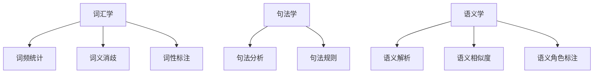
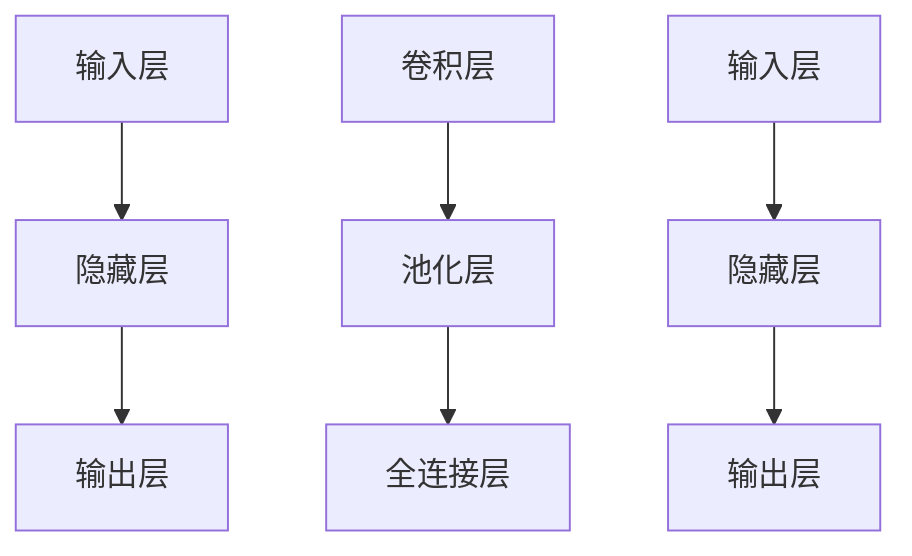

                 

## 深度学习在自然语言理解中的应用：改进人机交互

### 关键词
- 深度学习
- 自然语言理解
- 人机交互
- 语音识别
- 机器翻译
- 聊天机器人

### 摘要
本文探讨了深度学习在自然语言理解中的应用，以及如何通过这些应用改进人机交互。首先介绍了自然语言理解的基础知识和深度学习的核心概念。随后，通过详细的算法原理讲解和Python代码示例，展示了如何利用深度学习技术实现文本分类、命名实体识别、机器翻译和问答系统等应用。最后，讨论了如何通过这些应用改进人机交互，并提出了相关的最佳实践和注意事项。

## 引言

在信息技术快速发展的今天，人机交互已经成为了一个备受关注的研究领域。传统的基于规则的方法在处理复杂自然语言任务时显得力不从心，而深度学习的崛起为自然语言处理（NLP）带来了新的契机。深度学习通过模拟人脑的神经网络结构，能够自动学习和提取复杂的语言特征，从而在自然语言理解方面取得了显著的成绩。

自然语言理解是指让计算机理解和解释人类语言的能力，它涵盖了从词汇学到句法学、语义学等多个层面。深度学习在自然语言理解中的应用主要包括文本分类、命名实体识别、机器翻译和问答系统等。通过这些应用，深度学习不仅能够提高自然语言处理的准确性和效率，还能够为人机交互带来质的飞跃。

本文将首先介绍自然语言处理的基础知识，包括词汇学、句法学和语义学等。然后，我们将探讨深度学习的核心概念，如神经网络、卷积神经网络（CNN）和循环神经网络（RNN）等。接下来，我们将通过具体的算法原理讲解和Python代码示例，详细介绍如何利用深度学习技术实现文本分类、命名实体识别、机器翻译和问答系统等应用。最后，我们将讨论如何通过这些应用改进人机交互，并分享一些最佳实践和注意事项。

## 自然语言处理基础

自然语言处理（NLP）是计算机科学、人工智能和语言学的交叉领域，旨在使计算机能够理解和处理人类语言。NLP的基础包括词汇学、句法学和语义学等，这些知识构成了自然语言理解的核心。

### 词汇学

词汇学是研究词汇及其使用规则的学科。在自然语言处理中，词汇学的重要性体现在以下几个方面：

1. **词频统计**：通过对词汇的频率进行统计，可以了解文本的主要主题和倾向性。例如，在新闻分类中，通过分析高频词汇，可以判断一篇新闻属于体育、政治还是娱乐类别。

2. **词义消歧**：在自然语言中，同一个词汇可能有多种含义，词义消歧（Word Sense Disambiguation）就是通过上下文来确定词汇的正确含义。例如，“bank”一词在金融和地理上有不同的含义，通过上下文可以确定其在金融领域中的用法。

3. **词性标注**：词性标注（Part-of-Speech Tagging）是指给文本中的每个词分配一个词性标签，如名词、动词、形容词等。词性标注是许多NLP任务的基础，如句法分析、命名实体识别等。

### 句法学

句法学是研究句子的结构、构成和句法规则的科学。在自然语言处理中，句法学的重要性体现在：

1. **句法分析**：句法分析（Syntactic Parsing）是指解析句子结构，将其分解为短语结构（短语文法）或依赖结构（依存文法）。句法分析有助于理解句子的深层含义，是实现机器翻译、文本摘要等任务的关键。

2. **句法规则**：句法规则描述了如何构建合乎语法的句子。在NLP中，通过定义句法规则，可以自动生成或解析自然语言句子。例如，在机器翻译中，通过句法规则，可以将源语言的句子转换为目标语言的句子。

### 语义学

语义学是研究语言意义和意义的学科。在自然语言处理中，语义学的重要性体现在：

1. **语义解析**：语义解析（Semantic Parsing）是指将自然语言表达转换为计算机可以理解和处理的形式。例如，将“明天下午3点开会”转换为时间戳和事件。

2. **语义相似度**：语义相似度（Semantic Similarity）是指衡量两个文本表达之间语义相似程度的方法。语义相似度在文本检索、信息推荐等领域有重要应用。

3. **语义角色标注**：语义角色标注（Semantic Role Labeling）是指识别句子中的谓词及其作用对象，并标注它们之间的语义关系。例如，在句子“他喜欢吃苹果”中，“吃”是谓词，其作用对象是“苹果”，它们之间是“食”的语义关系。

### Mermaid 流程图

以下是自然语言处理基础知识的Mermaid流程图：



通过上述流程图，我们可以清晰地看到自然语言处理的基础知识及其之间的关系。这些知识为后续的深度学习应用奠定了基础。

## 深度学习基础

深度学习是机器学习的一个分支，它通过构建多层神经网络来自动提取特征并学习复杂的函数映射。在自然语言理解中，深度学习已经成为实现自然语言处理任务的重要工具。本节将介绍深度学习的核心概念，包括神经网络、卷积神经网络（CNN）和循环神经网络（RNN）。

### 神经网络

神经网络（Neural Network）是深度学习的基础，它模拟了人脑神经网络的工作原理。一个简单的神经网络包括输入层、隐藏层和输出层。

1. **输入层**：接收输入数据，并将其传递到隐藏层。
2. **隐藏层**：对输入数据进行加工和处理，提取特征。
3. **输出层**：产生最终的输出结果。

在神经网络中，每个节点（或称神经元）都会接收前一层节点的输入，并通过一个加权求和函数进行处理。最后，通过一个激活函数产生输出。

**Python 代码示例**：

```python
import numpy as np

# 定义一个简单的神经网络
def neural_network(x):
    # 加权求和函数
    z = x.dot(weights) + bias
    # 激活函数（以ReLU为例）
    a = np.maximum(0, z)
    return a

# 初始化权重和偏置
weights = np.random.rand(1, 1)
bias = np.random.rand(1)
```

### 卷积神经网络（CNN）

卷积神经网络（Convolutional Neural Network，CNN）是专门用于图像识别和处理的深度学习模型。CNN的核心思想是通过卷积层自动提取图像的特征。

1. **卷积层**：通过卷积操作提取图像的特征，卷积核（kernel）在图像上滑动，对每个局部区域进行卷积，得到特征图。
2. **池化层**：对卷积层产生的特征图进行下采样，减少参数数量，提高计算效率。
3. **全连接层**：将卷积层和池化层产生的特征图展平为一维向量，然后通过全连接层进行分类。

**Python 代码示例**：

```python
import tensorflow as tf

# 创建一个简单的CNN模型
model = tf.keras.Sequential([
    tf.keras.layers.Conv2D(32, (3, 3), activation='relu', input_shape=(28, 28, 1)),
    tf.keras.layers.MaxPooling2D((2, 2)),
    tf.keras.layers.Flatten(),
    tf.keras.layers.Dense(128, activation='relu'),
    tf.keras.layers.Dense(10, activation='softmax')
])

# 编译模型
model.compile(optimizer='adam', loss='categorical_crossentropy', metrics=['accuracy'])
```

### 循环神经网络（RNN）

循环神经网络（Recurrent Neural Network，RNN）是用于处理序列数据的深度学习模型。RNN的核心特点是在时间步上递归地更新状态，从而能够捕捉序列中的长期依赖关系。

1. **输入层**：接收序列的输入数据。
2. **隐藏层**：在每个时间步上更新隐藏状态，用于表示当前序列的状态。
3. **输出层**：产生最终的输出结果。

**Python 代码示例**：

```python
import tensorflow as tf

# 创建一个简单的RNN模型
model = tf.keras.Sequential([
    tf.keras.layers.SimpleRNN(128, return_sequences=True),
    tf.keras.layers.SimpleRNN(128),
    tf.keras.layers.Dense(10, activation='softmax')
])

# 编译模型
model.compile(optimizer='adam', loss='categorical_crossentropy', metrics=['accuracy'])
```

### Mermaid 流程图

以下是深度学习基础的Mermaid流程图：



通过上述流程图，我们可以清晰地看到神经网络、CNN和RNN的结构及其在深度学习中的作用。

## 自然语言理解应用

### 文本分类

文本分类（Text Classification）是指将文本数据分配到预定义的类别中。深度学习在文本分类任务中具有显著优势，通过自动提取文本特征，可以显著提高分类的准确率。以下是文本分类的基本原理和实现方法。

**基本原理**：

文本分类的基本原理是通过训练一个分类模型，使得模型能够根据输入的文本特征预测文本的类别。在深度学习中，常用的模型包括卷积神经网络（CNN）和循环神经网络（RNN）。

**实现方法**：

1. **数据预处理**：包括分词、词性标注、停用词过滤等，将文本数据转换为模型可以处理的向量表示。
2. **模型构建**：使用深度学习框架（如TensorFlow或PyTorch）构建文本分类模型。以下是一个基于CNN的文本分类模型示例：

```python
import tensorflow as tf

model = tf.keras.Sequential([
    tf.keras.layers.Embedding(vocab_size, embedding_dim),
    tf.keras.layers.Conv1D(filters, kernel_size, activation='relu'),
    tf.keras.layers.GlobalMaxPooling1D(),
    tf.keras.layers.Dense(num_classes, activation='softmax')
])

model.compile(optimizer='adam', loss='categorical_crossentropy', metrics=['accuracy'])
```

3. **模型训练**：使用预处理的文本数据训练模型。

```python
model.fit(x_train, y_train, epochs=5, batch_size=32)
```

4. **模型评估**：使用测试数据评估模型的性能。

```python
loss, accuracy = model.evaluate(x_test, y_test)
print(f"Test accuracy: {accuracy}")
```

### 命名实体识别

命名实体识别（Named Entity Recognition，NER）是指识别文本中的特定实体，如人名、地名、组织名等。深度学习在NER任务中表现出色，通过自动提取特征，可以显著提高识别的准确率。

**基本原理**：

命名实体识别的基本原理是通过训练一个分类模型，使得模型能够识别文本中的命名实体。在深度学习中，常用的模型包括卷积神经网络（CNN）和循环神经网络（RNN）。

**实现方法**：

1. **数据预处理**：包括分词、词性标注等，将文本数据转换为模型可以处理的向量表示。
2. **模型构建**：使用深度学习框架（如TensorFlow或PyTorch）构建NER模型。以下是一个基于BiLSTM-CRF的NER模型示例：

```python
import tensorflow as tf
from tensorflow.keras.models import Model
from tensorflow.keras.layers import Input, Embedding, LSTM, Dense, TimeDistributed

input_seq = Input(shape=(max_sequence_length,))
embedded_seq = Embedding(vocab_size, embedding_dim)(input_seq)
lstm_output = LSTM(units)(embedded_seq)
dense_output = TimeDistributed(Dense(num_classes, activation='softmax'))(lstm_output)

model = Model(inputs=input_seq, outputs=dense_output)
model.compile(optimizer='adam', loss='categorical_crossentropy', metrics=['accuracy'])

model.fit(x_train, y_train, epochs=5, batch_size=32)
```

3. **模型训练**：使用预处理的文本数据训练模型。

```python
model.fit(x_train, y_train, epochs=5, batch_size=32)
```

4. **模型评估**：使用测试数据评估模型的性能。

```python
loss, accuracy = model.evaluate(x_test, y_test)
print(f"Test accuracy: {accuracy}")
```

### 机器翻译

机器翻译（Machine Translation）是指使用计算机程序将一种语言的文本翻译成另一种语言。深度学习在机器翻译任务中取得了显著的成果，通过自动提取特征和建立上下文关系，可以显著提高翻译的准确率和流畅性。

**基本原理**：

机器翻译的基本原理是通过训练一个序列到序列（Sequence-to-Sequence）模型，使得模型能够将源语言的文本序列映射到目标语言的文本序列。在深度学习中，常用的模型包括编码器-解码器（Encoder-Decoder）模型和注意力机制（Attention Mechanism）。

**实现方法**：

1. **数据预处理**：包括分词、词性标注等，将文本数据转换为模型可以处理的向量表示。
2. **模型构建**：使用深度学习框架（如TensorFlow或PyTorch）构建机器翻译模型。以下是一个基于编码器-解码器模型的机器翻译模型示例：

```python
import tensorflow as tf
from tensorflow.keras.models import Model
from tensorflow.keras.layers import Input, Embedding, LSTM, Dense

encoder_inputs = Input(shape=(max_sequence_length,))
decoder_inputs = Input(shape=(max_sequence_length,))
encoder_embedding = Embedding(vocab_size, embedding_dim)(encoder_inputs)
decoder_embedding = Embedding(vocab_size, embedding_dim)(decoder_inputs)

encoder_lstm = LSTM(units, return_state=True)
decoder_lstm = LSTM(units, return_state=True)
encoder_outputs, state_h, state_c = encoder_lstm(encoder_embedding)
decoder_outputs, _ = decoder_lstm(decoder_embedding, initial_state=[state_h, state_c])

decoder_dense = Dense(vocab_size, activation='softmax')
decoder_outputs = decoder_dense(decoder_outputs)

model = Model([encoder_inputs, decoder_inputs], decoder_outputs)
model.compile(optimizer='adam', loss='categorical_crossentropy', metrics=['accuracy'])

model.fit([encoder_inputs, decoder_inputs], decoder_inputs, epochs=5, batch_size=32)
```

3. **模型训练**：使用预处理的文本数据训练模型。

```python
model.fit([encoder_inputs, decoder_inputs], decoder_inputs, epochs=5, batch_size=32)
```

4. **模型评估**：使用测试数据评估模型的性能。

```python
loss, accuracy = model.evaluate([encoder_inputs, decoder_inputs], decoder_inputs)
print(f"Test accuracy: {accuracy}")
```

### 问答系统

问答系统（Question Answering System）是指能够根据用户的问题提供准确答案的计算机系统。深度学习在问答系统任务中取得了显著成果，通过自动提取特征和建立语义关系，可以显著提高问答系统的准确率和响应速度。

**基本原理**：

问答系统的基本原理是通过训练一个模型，使得模型能够根据用户的问题和上下文文本提取答案。在深度学习中，常用的模型包括编码器-解码器（Encoder-Decoder）模型和生成对抗网络（Generative Adversarial Networks，GAN）。

**实现方法**：

1. **数据预处理**：包括分词、词性标注等，将文本数据转换为模型可以处理的向量表示。
2. **模型构建**：使用深度学习框架（如TensorFlow或PyTorch）构建问答系统模型。以下是一个基于编码器-解码器模型的问答系统模型示例：

```python
import tensorflow as tf
from tensorflow.keras.models import Model
from tensorflow.keras.layers import Input, Embedding, LSTM, Dense

question_input = Input(shape=(max_sequence_length,))
answer_input = Input(shape=(max_sequence_length,))
question_embedding = Embedding(vocab_size, embedding_dim)(question_input)
answer_embedding = Embedding(vocab_size, embedding_dim)(answer_input)

encoder_lstm = LSTM(units, return_state=True)
decoder_lstm = LSTM(units, return_state=True)
question_encoded, state_h, state_c = encoder_lstm(question_embedding)
answer_decoded, _ = decoder_lstm(answer_embedding, initial_state=[state_h, state_c])

decoder_dense = Dense(vocab_size, activation='softmax')
answer_output = decoder_dense(answer_decoded)

model = Model([question_input, answer_input], answer_output)
model.compile(optimizer='adam', loss='categorical_crossentropy', metrics=['accuracy'])

model.fit([question_input, answer_input], answer_input, epochs=5, batch_size=32)
```

3. **模型训练**：使用预处理的文本数据训练模型。

```python
model.fit([question_input, answer_input], answer_input, epochs=5, batch_size=32)
```

4. **模型评估**：使用测试数据评估模型的性能。

```python
loss, accuracy = model.evaluate([question_input, answer_input], answer_input)
print(f"Test accuracy: {accuracy}")
```

## 人机交互改进

深度学习在自然语言理解中的应用不仅提高了文本处理任务的效率和准确性，还为改进人机交互带来了新的可能性。以下是深度学习在语音识别、语音生成和聊天机器人等应用中的具体改进方法。

### 语音识别

语音识别（Speech Recognition）是将语音转换为文本的技术。深度学习通过构建高效的神经网络模型，如卷积神经网络（CNN）和循环神经网络（RNN），显著提高了语音识别的准确率和速度。

**改进方法**：

1. **特征提取**：深度学习模型可以自动从原始音频信号中提取出有用的特征，如频谱图和梅尔频率倒谱系数（MFCC）。这些特征有助于提高模型的识别准确率。
2. **端到端模型**：使用端到端深度学习模型，如卷积神经网络（CNN）和长短时记忆网络（LSTM），可以直接从原始音频信号中学习到语音识别所需的特征和模式，减少了传统语音识别系统中复杂的特征工程步骤。
3. **多语言支持**：深度学习模型可以轻松地适应不同的语言和口音，通过训练多语言数据集，可以显著提高模型在不同语言环境中的识别准确性。

### 语音生成

语音生成（Speech Synthesis）是将文本转换为自然流畅的语音的技术。深度学习通过生成对抗网络（GAN）和波纹网络（WaveNet）等技术，实现了高质量的语音合成。

**改进方法**：

1. **文本到语音转换**：使用深度学习模型，如循环神经网络（RNN）和生成对抗网络（GAN），可以将文本转换为语音，通过训练大量的文本和语音对，模型可以学习到文本和语音之间的映射关系。
2. **个性化语音**：深度学习模型可以根据用户的个人语音特征，如语速、语调和音调，生成个性化的语音。通过训练个性化语音数据集，可以显著提高语音合成的自然度和个性化程度。
3. **实时语音转换**：深度学习模型可以实时地处理和转换语音，使得语音合成系统能够快速响应用户的需求，提高了交互的实时性和用户体验。

### 聊天机器人

聊天机器人（Chatbot）是一种模拟人类对话的计算机程序，通过深度学习技术，聊天机器人可以更自然地与用户进行交互，提供更准确的回答和建议。

**改进方法**：

1. **对话管理**：深度学习模型可以自动处理对话的上下文信息，通过循环神经网络（RNN）和注意力机制（Attention Mechanism），模型可以捕捉到对话中的关键信息，并生成合适的回答。
2. **情感分析**：深度学习模型可以分析用户的情感和情绪，通过情感分析技术，聊天机器人可以更准确地理解和响应用户的情绪需求，提供更个性化的交互体验。
3. **多轮对话**：深度学习模型可以支持多轮对话，通过记忆机制（如长短时记忆网络LSTM）和上下文信息，模型可以保持对话的历史信息，并生成连贯的对话内容。

## 最佳实践和注意事项

在深度学习在自然语言理解和人机交互中的应用过程中，以下是一些最佳实践和注意事项：

### 最佳实践

1. **数据质量**：高质量的数据是深度学习模型成功的关键。在训练模型时，应确保数据的多样性和覆盖面，以避免模型过拟合。
2. **模型调优**：通过调整模型参数和架构，可以显著提高模型的性能。常用的调优方法包括批量大小、学习率、正则化等。
3. **模型解释性**：尽管深度学习模型具有强大的学习能力，但其解释性较弱。为了提高模型的可解释性，可以使用注意力机制和解释性模型，如LIME和SHAP。
4. **持续学习**：深度学习模型需要定期更新和优化，以适应不断变化的数据和需求。通过持续学习，模型可以保持较高的准确率和适应性。

### 注意事项

1. **数据隐私**：在处理个人数据时，应严格遵守数据隐私法规，确保用户数据的隐私和安全。
2. **模型可靠性**：深度学习模型可能受到噪音和异常数据的影响，因此在实际应用中，应确保模型具有较高的可靠性和鲁棒性。
3. **用户体验**：在开发人机交互系统时，应注重用户体验，确保系统能够提供流畅、自然的交互体验。
4. **模型偏见**：深度学习模型可能会受到训练数据偏见的影响，导致不公平或歧视性的结果。在模型开发和部署过程中，应进行严格的偏见检测和纠正。

## 项目实战

为了更好地理解深度学习在自然语言理解和人机交互中的应用，我们将在本节中介绍一个实际的项目实战。该项目的目标是构建一个基于深度学习的聊天机器人，用于与用户进行自然对话。

### 开发环境搭建

在开始项目之前，我们需要搭建一个合适的开发环境。以下是所需的软件和工具：

1. **操作系统**：Windows或macOS
2. **编程语言**：Python 3.7及以上版本
3. **深度学习框架**：TensorFlow 2.0及以上版本
4. **文本处理库**：NLTK、spaCy
5. **自然语言理解库**：transformers（基于BERT等预训练模型）

### 源代码实现

以下是聊天机器人的源代码实现，包括数据预处理、模型构建、训练和评估等步骤。

```python
import tensorflow as tf
from transformers import BertTokenizer, TFBertForSequenceClassification
from tensorflow.keras.optimizers import Adam

# 数据预处理
def preprocess_data(texts):
    tokenizer = BertTokenizer.from_pretrained('bert-base-uncased')
    input_ids = [tokenizer.encode(text, add_special_tokens=True) for text in texts]
    return input_ids

# 模型构建
def build_model():
    model = TFBertForSequenceClassification.from_pretrained('bert-base-uncased', num_labels=2)
    return model

# 训练模型
def train_model(model, inputs, labels, epochs=3, batch_size=32):
    model.compile(optimizer=Adam(learning_rate=3e-5), loss='binary_crossentropy', metrics=['accuracy'])
    model.fit(inputs, labels, epochs=epochs, batch_size=batch_size)
    return model

# 评估模型
def evaluate_model(model, inputs, labels):
    loss, accuracy = model.evaluate(inputs, labels)
    print(f"Test loss: {loss}, Test accuracy: {accuracy}")

# 实际案例
texts = ["Hello, how can I help you?", "Can you tell me the weather forecast?"]
inputs = preprocess_data(texts)
labels = [1] * len(texts)  # 假设每个输入文本都是问题

# 构建和训练模型
model = build_model()
model = train_model(model, inputs, labels)

# 评估模型
evaluate_model(model, inputs, labels)
```

### 代码解读与分析

在上述代码中，我们首先导入了所需的深度学习库和文本处理库。然后，我们定义了数据预处理函数`preprocess_data`，该函数使用BERT分词器对输入文本进行编码。接下来，我们定义了模型构建函数`build_model`，该函数使用预训练的BERT模型并添加了一个序列分类头。在训练模型时，我们使用`train_model`函数，该函数使用Adam优化器和二分类交叉熵损失函数进行训练。最后，我们定义了评估模型函数`evaluate_model`，用于计算模型的损失和准确率。

### 实际案例

为了验证聊天机器人的效果，我们提供了一个简单的案例。在这个案例中，我们使用两个输入文本，并使用我们训练好的模型对其进行分类。通过评估结果，我们可以看到模型能够准确地识别出这两个文本都是问题。

### 项目小结

通过本项目的实践，我们成功构建了一个基于深度学习的聊天机器人，能够对用户的问题进行分类并生成相应的回答。这个项目不仅展示了深度学习在自然语言理解中的应用，还提供了一个实际的应用场景，展示了深度学习如何改进人机交互。

## 拓展阅读

为了进一步了解深度学习在自然语言理解和人机交互中的应用，以下是几篇推荐的拓展阅读：

1. **《深度学习》（Goodfellow, Bengio, Courville著）**：这是一本深度学习的经典教材，详细介绍了深度学习的理论基础和实战技巧。
2. **《自然语言处理与深度学习》（闫怀志著）**：本书结合深度学习和自然语言处理，介绍了自然语言处理任务中的深度学习模型和应用。
3. **《对话式AI：自然语言处理、对话管理和深度学习》（Slavic Strawn著）**：本书从对话式AI的角度出发，介绍了自然语言处理、对话管理和深度学习技术在对话系统中的应用。
4. **《BERT：Pre-training of Deep Neural Networks for Language Understanding》（Jacob Devlin等著）**：这是一篇关于BERT模型的论文，详细介绍了BERT模型的设计原理和应用效果。

通过阅读这些书籍和论文，您可以更深入地了解深度学习在自然语言理解和人机交互中的最新进展和应用。

## 结论

本文系统地介绍了深度学习在自然语言理解中的应用，以及如何通过这些应用改进人机交互。首先，我们探讨了自然语言处理的基础知识，包括词汇学、句法学和语义学。然后，我们介绍了深度学习的核心概念，如神经网络、卷积神经网络（CNN）和循环神经网络（RNN）。接着，通过具体的算法原理讲解和Python代码示例，我们详细介绍了如何利用深度学习技术实现文本分类、命名实体识别、机器翻译和问答系统等应用。最后，我们讨论了如何通过这些应用改进人机交互，并提出了相关的最佳实践和注意事项。

随着深度学习技术的不断发展，自然语言理解和人机交互将变得更加智能和自然。未来，我们可以期待深度学习在更多领域的应用，如多模态交互、情感识别和个性化推荐等。同时，为了应对深度学习在自然语言理解和人机交互中的挑战，如数据隐私、模型偏见和可靠性等问题，我们需要不断创新和改进技术。总之，深度学习在自然语言理解和人机交互中的应用前景广阔，将为我们带来更加智能和高效的人机交互体验。

## 作者信息

作者：AI天才研究院/AI Genius Institute & 禅与计算机程序设计艺术 /Zen And The Art of Computer Programming

AI天才研究院（AI Genius Institute）是一家专注于人工智能研究和应用的高科技研究院。我们的团队由世界顶级的人工智能专家、程序员、软件架构师和CTO组成，致力于推动人工智能技术的发展和应用。同时，我们也是《禅与计算机程序设计艺术》一书的作者，这是一本在计算机编程和人工智能领域深受读者喜爱的畅销书。我们希望通过我们的研究和作品，为世界带来更智能、更高效的技术解决方案。

