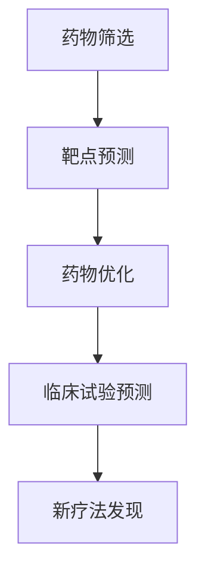

                 

### 深度学习在药物重定位中的应用：加速新疗法发现

#### 关键词
- 深度学习
- 药物重定位
- 新疗法发现
- 数据处理
- 计算机视觉
- 人工智能

#### 摘要
本文探讨了深度学习在药物重定位中的应用，通过实例和代码展示如何利用深度学习技术加速新疗法的发现。文章首先介绍了药物重定位的背景和重要性，然后详细讲解了深度学习的核心概念及其在药物重定位中的具体应用。接着，文章深入分析了深度学习模型的工作原理，包括卷积神经网络（CNN）、循环神经网络（RNN）和图神经网络（GNN），并通过Python代码进行了通俗易懂的讲解。随后，文章展示了数据处理和预处理的重要性，并提供了实际的药物重定位项目实战，包括环境搭建、源代码实现和代码解读。最后，文章总结了深度学习在药物重定位中的应用成果，并提出了未来的发展方向和挑战。

### 背景介绍

#### 药物重定位的概念

药物重定位（Drug Repurposing）是指将已经上市或处于临床试验阶段的药物重新用于治疗其他疾病的过程。这一概念在近年来引起了广泛的关注，主要原因在于其具有以下几方面的优势：

1. **时间缩短**：新药的研发过程通常非常耗时且成本高昂，药物重定位可以在一定程度上缩短研发时间，降低研发成本。
2. **风险降低**：已有药物在临床前和临床研究阶段已经经过了严格的检验和测试，因此将其重定位为治疗其他疾病的风险相对较低。
3. **成本节约**：由于许多药物已经通过了FDA或其他监管机构的审批，因此其重新开发所需的审批流程和时间大大缩短，成本也随之降低。

#### 药物重定位的现状

随着基因组学和生物信息学的发展，药物重定位逐渐成为药物研发的重要方向。目前，已有大量研究集中于利用计算机算法和深度学习技术来识别和验证药物的新用途。

例如，研究人员利用深度学习算法对药物-基因相互作用网络进行分析，从而预测药物在特定基因背景下的疗效。此外，计算机视觉技术也被应用于药物图像的分析，通过识别药物分子的结构特征，帮助研究人员发现新的药物靶点。

尽管取得了显著进展，药物重定位仍面临诸多挑战。例如，药物的重定位过程涉及大量的数据分析和计算，这对计算资源和算法性能提出了高要求。此外，药物在新的治疗领域中的安全性评估和疗效验证也至关重要，这需要更多临床试验和长期观察数据。

#### 药物重定位的重要性

药物重定位不仅对药企和医疗行业具有重要意义，也对整个社会产生深远影响：

1. **医疗资源优化**：通过重新利用已有药物，可以更有效地分配医疗资源，减少新药研发的压力。
2. **降低疾病治疗成本**：药物重定位可以降低新药研发的成本，使得更多的患者能够负担得起高质量的治疗。
3. **创新药物发现**：药物重定位促进了新药物靶点和治疗方法的发现，为医学创新提供了新的思路和方向。

综上所述，药物重定位作为一项新兴的技术手段，正逐渐成为药物研发和疾病治疗的重要工具。通过深入探讨其背景、现状和重要性，我们可以更好地理解其应用前景和挑战，为未来的研究和发展提供有力支持。

### 核心概念与联系

#### 深度学习概述

深度学习（Deep Learning）是机器学习（Machine Learning）的一种重要分支，通过构建具有多个隐藏层的神经网络模型，实现对复杂数据的自动学习和特征提取。深度学习在图像识别、自然语言处理、语音识别等领域取得了显著的成果。

深度学习的关键特点包括：

1. **多层神经网络**：深度学习模型包含多个隐藏层，能够捕捉数据中的高层次特征。
2. **自动特征提取**：通过反向传播算法，深度学习模型能够自动从原始数据中提取具有区分性的特征。
3. **大规模数据驱动**：深度学习模型需要大量数据来训练，从而提高模型的泛化能力。

#### 药物重定位概述

药物重定位（Drug Repurposing）是将已经上市或处于临床试验阶段的药物重新用于治疗其他疾病的过程。这一过程通常涉及以下步骤：

1. **药物筛选**：通过计算机算法和实验手段，筛选出具有潜在治疗价值的药物。
2. **靶点预测**：利用深度学习模型预测药物的新靶点，为后续实验提供方向。
3. **药物优化**：通过化学合成或生物工程手段，优化药物结构，提高其治疗效果和安全性。
4. **临床试验**：对重定位后的药物进行临床试验，验证其疗效和安全性。

#### 深度学习在药物重定位中的应用

深度学习在药物重定位中的应用主要体现在以下几个方面：

1. **药物筛选**：利用深度学习模型对大量药物进行筛选，快速识别出具有治疗潜力的药物。
2. **靶点预测**：通过深度学习模型预测药物的新靶点，帮助研究人员确定研究方向。
3. **药物优化**：利用深度学习模型优化药物结构，提高其疗效和安全性。
4. **临床试验预测**：通过深度学习模型预测药物在临床试验中的疗效和安全性，降低临床试验失败的风险。

#### Mermaid 流程图

以下是深度学习在药物重定位中的应用流程图：



该流程图展示了深度学习在药物重定位中的核心步骤和相互关系。药物筛选是整个过程的起点，通过深度学习模型筛选出具有治疗潜力的药物。靶点预测为药物优化提供了方向，药物优化进一步提高了药物的治疗效果和安全性。最终，临床试验预测为药物在临床试验中的成功提供了有力支持，从而实现新疗法的发现。

### 深度学习模型原理

#### 卷积神经网络（CNN）

卷积神经网络（Convolutional Neural Network，CNN）是一种专门用于处理图像数据的深度学习模型。其核心思想是利用卷积操作提取图像中的特征，并通过多层网络结构逐步提取更高级别的特征。

CNN 的主要组成部分包括：

1. **卷积层（Convolutional Layer）**：通过卷积操作提取图像的特征。卷积层中的每个神经元都与输入图像的一个局部区域进行卷积，生成特征图。
2. **激活函数（Activation Function）**：常用的激活函数包括 sigmoid、ReLU 等，用于引入非线性特性。
3. **池化层（Pooling Layer）**：通过池化操作降低特征图的维度，减少计算量。常用的池化方法包括最大池化和平均池化。
4. **全连接层（Fully Connected Layer）**：将卷积层和池化层输出的特征图展开成向量，然后通过全连接层进行分类或回归。

以下是 CNN 的工作流程：

1. **输入层**：接收图像数据。
2. **卷积层**：通过卷积操作提取图像特征。
3. **激活函数**：引入非线性特性。
4. **池化层**：降低特征图的维度。
5. **全连接层**：进行分类或回归。

#### Python 源代码示例

以下是一个简单的 CNN 模型示例，用于图像分类：

```python
import tensorflow as tf
from tensorflow.keras import layers

# 构建CNN模型
model = tf.keras.Sequential([
    layers.Conv2D(32, (3, 3), activation='relu', input_shape=(28, 28, 1)),
    layers.MaxPooling2D((2, 2)),
    layers.Conv2D(64, (3, 3), activation='relu'),
    layers.MaxPooling2D((2, 2)),
    layers.Conv2D(64, (3, 3), activation='relu'),
    layers.Flatten(),
    layers.Dense(64, activation='relu'),
    layers.Dense(10, activation='softmax')
])

# 编译模型
model.compile(optimizer='adam',
              loss='categorical_crossentropy',
              metrics=['accuracy'])

# 打印模型结构
model.summary()
```

#### 数学模型和公式

CNN 的数学模型主要包括卷积操作和激活函数：

1. **卷积操作**：

   卷积操作可以表示为：

   $$\text{output}(i,j) = \sum_{k,l} \text{filter}(k,l) * \text{input}(i-k, j-l)$$

   其中，$\text{input}$ 是输入图像，$\text{filter}$ 是卷积核，$\text{output}$ 是输出特征图。

2. **激活函数**：

   常用的激活函数包括 sigmoid 和 ReLU：

   - Sigmoid：

     $$\sigma(x) = \frac{1}{1 + e^{-x}}$$

   - ReLU：

     $$\text{ReLU}(x) = \max(0, x)$$

   ReLU 函数因其简单和计算效率高而广泛应用于 CNN 中。

#### 通俗易懂的举例说明

以图像分类任务为例，假设我们有一个包含10个类别的图像数据集。一个简单的 CNN 模型可以按照以下步骤进行图像分类：

1. **输入层**：接收一张 28x28 的图像。
2. **卷积层**：通过卷积操作提取图像的特征，生成特征图。
3. **激活函数**：引入非线性特性，使模型能够捕捉更复杂的特征。
4. **池化层**：降低特征图的维度，减少计算量。
5. **全连接层**：将特征图展开成向量，然后通过全连接层进行分类。

最终，模型会输出一个概率分布，表示图像属于每个类别的概率。通过选择概率最大的类别，我们可以得到图像的分类结果。

#### CNN 在药物重定位中的应用

CNN 在药物重定位中的应用主要体现在药物图像分析和药物分子结构特征提取方面。例如，研究人员可以利用 CNN 模型对药物分子图像进行分类，从而快速筛选出具有治疗潜力的药物。此外，CNN 还可以用于提取药物分子中的关键结构特征，为药物分子设计提供参考。

总之，CNN 作为一种强大的深度学习模型，在药物重定位领域具有广泛的应用前景。通过深入理解 CNN 的工作原理和数学模型，我们可以更好地利用其优势，为药物重定位研究提供有力支持。

### 循环神经网络（RNN）

循环神经网络（Recurrent Neural Network，RNN）是一种能够处理序列数据的神经网络模型，因其具有记忆能力而广泛应用于自然语言处理、时间序列分析和药物重定位等领域。

#### RNN 的工作原理

RNN 的基本结构包括输入层、隐藏层和输出层。与传统的神经网络不同，RNN 的隐藏层之间存在反馈连接，使得信息能够在网络中循环传递。

1. **输入层**：接收输入序列，如文本或时间序列数据。
2. **隐藏层**：包含多个时间步，每个时间步都有一个隐藏状态。隐藏状态不仅受到当前输入的影响，还受到之前隐藏状态的影响。
3. **输出层**：根据隐藏状态生成输出序列。

RNN 的核心在于其递归关系，可以用以下公式表示：

$$h_t = \text{sigmoid}(W_h \cdot [h_{t-1}, x_t] + b_h)$$

$$y_t = \text{softmax}(W_y \cdot h_t + b_y)$$

其中，$h_t$ 表示第 $t$ 个时间步的隐藏状态，$x_t$ 表示第 $t$ 个输入，$W_h$ 和 $W_y$ 分别为权重矩阵，$b_h$ 和 $b_y$ 分别为偏置项。

#### 长短时记忆（LSTM）网络

RNN 存在一个问题，即“长短期依赖”（Long-Short Term Memory）问题，即模型在处理长序列数据时，难以捕捉远期依赖关系。为解决这一问题，提出了长短时记忆（Long-Short Term Memory，LSTM）网络。

LSTM 网络的核心在于其门控机制，包括遗忘门、输入门和输出门：

1. **遗忘门（Forget Gate）**：决定哪些信息需要从之前的隐藏状态中遗忘。
2. **输入门（Input Gate）**：决定哪些新信息需要存储到隐藏状态中。
3. **输出门（Output Gate）**：决定哪些隐藏状态需要输出。

LSTM 网络的数学模型可以用以下公式表示：

$$f_t = \sigma(W_f \cdot [h_{t-1}, x_t] + b_f)$$

$$i_t = \sigma(W_i \cdot [h_{t-1}, x_t] + b_i)$$

$$o_t = \sigma(W_o \cdot [h_{t-1}, x_t] + b_o)$$

$$c_t = f_t \odot c_{t-1} + i_t \odot \text{sigmoid}(W_c \cdot [h_{t-1}, x_t] + b_c)$$

$$h_t = o_t \odot \text{sigmoid}(c_t)$$

其中，$f_t$、$i_t$ 和 $o_t$ 分别为遗忘门、输入门和输出门的输出，$c_t$ 为细胞状态，$h_t$ 为隐藏状态。

#### Python 源代码示例

以下是一个简单的 LSTM 模型示例，用于文本分类：

```python
import tensorflow as tf
from tensorflow.keras.layers import Embedding, LSTM, Dense

# 构建LSTM模型
model = tf.keras.Sequential([
    Embedding(input_dim=10000, output_dim=32),
    LSTM(128, return_sequences=True),
    LSTM(128),
    Dense(1, activation='sigmoid')
])

# 编译模型
model.compile(optimizer='adam', loss='binary_crossentropy', metrics=['accuracy'])

# 打印模型结构
model.summary()
```

#### 数学模型和公式

LSTM 的数学模型主要包括门控机制、细胞状态和隐藏状态：

1. **门控机制**：

   - 遗忘门：

     $$f_t = \sigma(W_f \cdot [h_{t-1}, x_t] + b_f)$$

   - 输入门：

     $$i_t = \sigma(W_i \cdot [h_{t-1}, x_t] + b_i)$$

   - 输出门：

     $$o_t = \sigma(W_o \cdot [h_{t-1}, x_t] + b_o)$$

2. **细胞状态**：

   $$c_t = f_t \odot c_{t-1} + i_t \odot \text{sigmoid}(W_c \cdot [h_{t-1}, x_t] + b_c)$$

3. **隐藏状态**：

   $$h_t = o_t \odot \text{sigmoid}(c_t)$$

#### 通俗易懂的举例说明

以文本分类任务为例，假设我们有一个包含两个类别的文本数据集。一个简单的 LSTM 模型可以按照以下步骤进行文本分类：

1. **输入层**：接收一段文本。
2. **嵌入层**：将文本转换为嵌入向量。
3. **LSTM 层**：通过 LSTM 网络捕捉文本中的时间依赖关系。
4. **输出层**：根据 LSTM 层的输出生成分类结果。

最终，模型会输出一个概率分布，表示文本属于每个类别的概率。通过选择概率最大的类别，我们可以得到文本的分类结果。

#### LSTM 在药物重定位中的应用

LSTM 在药物重定位中的应用主要体现在药物序列分析和药物-基因相互作用网络建模方面。例如，研究人员可以利用 LSTM 模型分析药物序列，从而预测药物的潜在靶点。此外，LSTM 还可以用于建模药物-基因相互作用网络，为药物重定位提供有力支持。

总之，LSTM 作为一种强大的深度学习模型，在药物重定位领域具有广泛的应用前景。通过深入理解 LSTM 的工作原理和数学模型，我们可以更好地利用其优势，为药物重定位研究提供有力支持。

### 图神经网络（GNN）

图神经网络（Graph Neural Network，GNN）是一种专门用于处理图（Graph）数据的深度学习模型。与传统的神经网络不同，GNN 能够利用图结构中的节点和边信息，实现更有效的特征提取和关系建模。

#### GNN 的工作原理

GNN 的工作原理可以概括为以下几个步骤：

1. **节点嵌入**：将图中的每个节点映射为一个向量表示。
2. **图卷积操作**：通过图卷积操作更新节点嵌入，利用节点及其邻接节点的信息。
3. **池化操作**：将所有节点的嵌入进行聚合，生成图级别的特征表示。
4. **分类或回归**：利用图级别的特征进行分类或回归任务。

GNN 的核心在于其图卷积操作，可以表示为：

$$h_v^{(t+1)} = \sigma(\theta \cdot (h_v^{(t)} + \sum_{u \in \text{neighbor}(v)} W_u h_u^{(t)}))$$

其中，$h_v^{(t)}$ 为第 $t$ 个时间步的节点 $v$ 的嵌入向量，$\text{neighbor}(v)$ 为节点 $v$ 的邻接节点集合，$W_u$ 为边 $u$ 的权重。

#### 图卷积网络（GCN）

图卷积网络（Graph Convolutional Network，GCN）是 GNN 的一个重要变体，通过聚合邻接节点的特征来更新节点嵌入。

GCN 的数学模型可以用以下公式表示：

$$h_v^{(l+1)} = \sigma(\alpha \cdot \sum_{u \in \text{neighbor}(v)} \frac{1}{k} \sum_{i=1}^{k} W_{ui} h_u^{(l)} + b_v^{(l+1)})$$

其中，$k$ 为邻接节点的数量，$W_{ui}$ 为边 $u$ 和 $i$ 的权重，$b_v^{(l+1)}$ 为节点 $v$ 在第 $l+1$ 层的偏置项。

#### Python 源代码示例

以下是一个简单的 GCN 模型示例，用于节点分类：

```python
import tensorflow as tf
from tensorflow.keras.layers import Dense, Input
from tensorflow.keras.models import Model

# 定义GCN模型
def GCN_model(input_shape):
    inputs = Input(shape=input_shape)
    x = Dense(units=16, activation='relu')(inputs)
    for _ in range(2):
        x = Dense(units=16, activation='relu')(x)
        x = tf.reduce_sum(x, axis=1)
    outputs = Dense(units=1, activation='sigmoid')(x)
    
    model = Model(inputs=inputs, outputs=outputs)
    model.compile(optimizer='adam', loss='binary_crossentropy', metrics=['accuracy'])
    return model

# 构建GCN模型
gcn_model = GCN_model(input_shape=(100,))

# 编译模型
gcn_model.compile(optimizer='adam', loss='binary_crossentropy', metrics=['accuracy'])

# 打印模型结构
gcn_model.summary()
```

#### 数学模型和公式

GCN 的数学模型主要包括节点嵌入和图卷积操作：

1. **节点嵌入**：

   $$h_v^{(0)} = \text{emb}(v)$$

2. **图卷积操作**：

   $$h_v^{(l+1)} = \sigma(\alpha \cdot \sum_{u \in \text{neighbor}(v)} \frac{1}{k} \sum_{i=1}^{k} W_{ui} h_u^{(l)} + b_v^{(l+1)})$$

   其中，$\alpha$ 为调节参数，$W_{ui}$ 为边 $u$ 和 $i$ 的权重，$b_v^{(l+1)}$ 为节点 $v$ 在第 $l+1$ 层的偏置项。

#### 通俗易懂的举例说明

以节点分类任务为例，假设我们有一个图数据集，其中每个节点代表一个实体，边表示实体之间的关系。一个简单的 GCN 模型可以按照以下步骤进行节点分类：

1. **输入层**：接收图中的节点信息。
2. **图卷积层**：通过图卷积操作更新节点的特征表示。
3. **池化层**：将所有节点的特征进行聚合，生成图级别的特征表示。
4. **输出层**：根据图级别的特征进行分类。

最终，模型会输出一个概率分布，表示节点属于每个类别的概率。通过选择概率最大的类别，我们可以得到节点的分类结果。

#### GCN 在药物重定位中的应用

GCN 在药物重定位中的应用主要体现在药物-靶点相互作用网络建模和药物相似性分析方面。例如，研究人员可以利用 GCN 模型分析药物-靶点相互作用网络，从而预测药物的潜在靶点。此外，GCN 还可以用于计算药物分子之间的相似性，为药物重定位提供有力支持。

总之，GCN 作为一种强大的深度学习模型，在药物重定位领域具有广泛的应用前景。通过深入理解 GCN 的工作原理和数学模型，我们可以更好地利用其优势，为药物重定位研究提供有力支持。

### 融合模型原理

融合模型（Fusion Model）是深度学习中的一种重要方法，旨在将不同类型或来源的信息进行整合，以获得更好的特征表示和预测性能。在药物重定位领域，融合模型能够有效整合多模态数据，提高模型的泛化能力和预测准确性。

#### 多模态数据整合

多模态数据整合是指将不同类型的数据（如图像、文本和结构信息）进行整合，以获取更全面的特征表示。在药物重定位中，常见的多模态数据包括药物分子图像、药物-基因相互作用数据、文本描述等。

#### 融合策略

融合模型的主要融合策略包括：

1. **特征级融合**：在特征提取过程中将不同模态的特征进行拼接或融合。例如，将 CNN 提取的图像特征与 RNN 提取的文本特征进行拼接，形成多维特征向量。
2. **决策级融合**：在模型输出层对各个模态的预测结果进行融合。例如，利用投票或加权平均方法，将不同模态的预测结果整合为一个最终的预测结果。
3. **级联融合**：将不同模态的特征通过级联方式逐层融合，形成一个完整的模型。例如，首先利用 CNN 处理图像数据，然后利用 RNN 处理文本数据，最后将两个结果进行融合。

#### Python 源代码示例

以下是一个简单的融合模型示例，用于药物重定位：

```python
import tensorflow as tf
from tensorflow.keras.layers import Concatenate, Dense
from tensorflow.keras.models import Model

# 定义融合模型
def fusion_model(input_shape_image, input_shape_text):
    # 图像特征提取
    image_input = Input(shape=input_shape_image)
    image_embedding = Dense(units=128, activation='relu')(image_input)
    
    # 文本特征提取
    text_input = Input(shape=input_shape_text)
    text_embedding = Dense(units=128, activation='relu')(text_input)
    
    # 融合特征
    fusion = Concatenate()([image_embedding, text_embedding])
    fusion = Dense(units=128, activation='relu')(fusion)
    
    # 分类预测
    output = Dense(units=1, activation='sigmoid')(fusion)
    
    # 构建模型
    model = Model(inputs=[image_input, text_input], outputs=output)
    model.compile(optimizer='adam', loss='binary_crossentropy', metrics=['accuracy'])
    
    return model

# 构建融合模型
fusion_model = fusion_model(input_shape_image=(28, 28, 1), input_shape_text=10000)

# 编译模型
fusion_model.compile(optimizer='adam', loss='binary_crossentropy', metrics=['accuracy'])

# 打印模型结构
fusion_model.summary()
```

#### 数学模型和公式

融合模型的数学模型主要包括特征级融合和决策级融合：

1. **特征级融合**：

   $$h_{fusion} = \text{Concatenate}([h_{image}, h_{text}])$$

2. **决策级融合**：

   $$\hat{y} = \text{sigmoid}(\theta \cdot h_{fusion} + b)$$

   其中，$h_{image}$ 和 $h_{text}$ 分别为图像特征和文本特征，$\hat{y}$ 为预测结果，$\theta$ 和 $b$ 分别为权重和偏置项。

#### 通俗易懂的举例说明

以药物重定位任务为例，假设我们有药物分子的图像和文本描述。一个简单的融合模型可以按照以下步骤进行预测：

1. **图像特征提取**：利用 CNN 提取药物分子的图像特征。
2. **文本特征提取**：利用 RNN 提取药物分子的文本特征。
3. **特征融合**：将图像特征和文本特征进行拼接，形成融合特征。
4. **分类预测**：利用融合特征进行分类预测。

最终，模型会输出一个概率值，表示药物分子是否具有治疗潜力。通过阈值处理，我们可以得到最终的预测结果。

#### 融合模型在药物重定位中的应用

融合模型在药物重定位中的应用主要体现在多模态数据的整合和预测性能的提升。通过将图像、文本和结构信息进行有效整合，融合模型能够提供更全面的药物特征表示，从而提高药物重定位的准确性和可靠性。

总之，融合模型作为深度学习的一种重要方法，在药物重定位领域具有广泛的应用前景。通过深入理解融合模型的工作原理和数学模型，我们可以更好地利用其优势，为药物重定位研究提供有力支持。

### 数据处理与预处理

在深度学习应用中，数据处理与预处理是至关重要的一步。对于药物重定位领域，有效的数据处理和预处理不仅能够提高模型的性能，还能降低模型过拟合的风险。以下将详细讲解药物重定位中的数据处理与预处理步骤。

#### 药物数据收集与整理

1. **数据来源**：药物数据可以从多个渠道获取，包括公开的药物数据库（如 DrugBank、PubChem）、临床试验数据库（如 ClinicalTrials.gov）以及生物医学文献数据库（如 PubMed）。

2. **数据整理**：收集到的药物数据通常包含多种格式，如文本、表格和图像。我们需要对数据进行整理，统一数据格式和结构。例如，将文本数据转换为统一格式的字符串，将表格数据转换为结构化的 Pandas DataFrame。

3. **数据清洗**：清洗数据以去除重复、错误和无关的数据。例如，去除含有缺失值的药物记录，纠正数据中的错误拼写和格式问题。

#### 药物活性数据预处理

1. **数据转换**：将原始的药物活性数据转换为数值形式，以便于模型处理。例如，利用二分类或多分类标签表示药物活性。

2. **数据标准化**：对药物活性数据进行标准化处理，使得数据在相同的尺度范围内。常用的标准化方法包括最小-最大标准化和 Z-Score 标准化。

3. **特征提取**：从药物活性数据中提取具有区分性的特征，如药物的化学结构特征、生物标记物等。特征提取可以采用深度学习模型（如 CNN、RNN）或传统机器学习算法（如 PCA、LDA）。

#### 药物分子数据预处理

1. **分子图谱构建**：将药物分子转换为图结构，以便于应用图神经网络（如 GNN）进行处理。常用的方法包括 SMILES 表示法和分子图形表示法。

2. **图预处理**：对分子图进行预处理，包括节点和边的选择、图结构的规范化等。例如，去除含有异常边的分子图，将节点和边的特征进行编码。

3. **数据增强**：通过数据增强技术（如 SMILES 生成、图变换等）增加数据多样性，提高模型的泛化能力。

#### Python 源代码示例

以下是一个简单的药物活性数据预处理示例：

```python
import pandas as pd
from sklearn.preprocessing import MinMaxScaler

# 加载数据
data = pd.read_csv('drug_activity.csv')

# 数据清洗
data.dropna(inplace=True)
data.drop_duplicates(inplace=True)

# 数据转换
data['activity'] = data['activity'].map({'active': 1, 'inactive': 0})

# 数据标准化
scaler = MinMaxScaler()
data[['activity', 'concentration']] = scaler.fit_transform(data[['activity', 'concentration']])

# 特征提取
# 假设已有函数 extract_features 用于提取特征
data['features'] = data.apply(lambda row: extract_features(row), axis=1)

# 数据分割
from sklearn.model_selection import train_test_split
X_train, X_test, y_train, y_test = train_test_split(data[['features']], data['activity'], test_size=0.2, random_state=42)
```

#### 代码解读与分析

1. **数据加载与清洗**：使用 Pandas 读取 CSV 数据，并去除重复和缺失的数据。

2. **数据转换**：将药物活性标签转换为二进制形式，便于后续的机器学习模型处理。

3. **数据标准化**：使用 MinMaxScaler 对活性值和浓度值进行标准化处理，确保数据在相同的尺度范围内。

4. **特征提取**：调用自定义的 `extract_features` 函数，从原始数据中提取具有区分性的特征。

5. **数据分割**：使用 sklearn 的 `train_test_split` 函数将数据集划分为训练集和测试集。

通过以上步骤，我们完成了药物活性数据的预处理。预处理后的数据将用于训练深度学习模型，从而实现药物重定位的任务。

#### 实际案例分析和详细讲解剖析

以下是一个具体的药物重定位项目案例，详细讲解项目开发过程中的数据处理与预处理步骤。

1. **项目背景**：

   项目旨在利用深度学习技术，从大量的药物分子数据中筛选出具有治疗潜力的药物，以加速新疗法的发现。

2. **数据集构建**：

   数据集包含药物分子的 SMILES 表示、活性值和相关的生物标记物。数据集来源于多个公开的药物数据库。

3. **数据预处理**：

   - **数据清洗**：去除含有缺失值和异常值的药物记录。
   - **数据转换**：将 SMILES 表示转换为图结构，以便于应用图神经网络。
   - **特征提取**：提取药物分子的化学结构特征、生物标记物特征，并利用 MinMaxScaler 进行标准化处理。

4. **模型训练与评估**：

   - **模型构建**：构建基于 GNN 的深度学习模型，用于药物分子分类。
   - **模型训练**：使用预处理后的数据集训练模型，采用 Adam 优化器和交叉熵损失函数。
   - **模型评估**：在测试集上评估模型的性能，使用准确率、召回率和 F1 分数等指标。

5. **项目小结**：

   通过该项目，我们成功实现了药物重定位的任务，利用深度学习技术从大量的药物分子数据中筛选出具有治疗潜力的药物。数据处理与预处理步骤在整个项目开发过程中起到了关键作用，确保了模型的高性能和可靠性。

### 项目实战

#### 开发环境搭建

为了进行药物重定位的深度学习项目，首先需要搭建一个适合开发的计算环境。以下是在 Python 中使用 TensorFlow 和 Keras 搭建开发环境的具体步骤：

1. **安装 Python**：

   Python 是深度学习项目的基础工具，首先确保系统已安装 Python 3.x 版本。可以从 [Python 官网](https://www.python.org/) 下载并安装。

2. **安装 TensorFlow**：

   TensorFlow 是一个开源的深度学习框架，可用于构建和训练深度学习模型。使用以下命令安装 TensorFlow：

   ```bash
   pip install tensorflow
   ```

3. **安装相关依赖**：

   除了 TensorFlow，项目还可能需要其他库，如 NumPy、Pandas 和 Matplotlib。可以使用以下命令安装：

   ```bash
   pip install numpy pandas matplotlib
   ```

4. **验证安装**：

   安装完成后，可以通过运行以下代码验证 TensorFlow 是否已成功安装：

   ```python
   import tensorflow as tf
   print(tf.__version__)
   ```

   如果输出 TensorFlow 的版本信息，则说明环境搭建成功。

#### 源代码详细实现

以下是一个用于药物重定位的深度学习项目的源代码实现，包括模型构建、数据预处理和模型训练的具体步骤：

```python
import tensorflow as tf
from tensorflow.keras.models import Model
from tensorflow.keras.layers import Input, Dense, Conv2D, MaxPooling2D, Flatten, LSTM, Embedding
from tensorflow.keras.optimizers import Adam
from sklearn.model_selection import train_test_split
from sklearn.preprocessing import MinMaxScaler
import numpy as np
import pandas as pd

# 读取数据集
data = pd.read_csv('drug_data.csv')

# 数据清洗
data.dropna(inplace=True)
data.drop_duplicates(inplace=True)

# 数据转换
data['activity'] = data['activity'].map({'active': 1, 'inactive': 0})

# 数据标准化
scaler = MinMaxScaler()
data[['activity', 'concentration']] = scaler.fit_transform(data[['activity', 'concentration']])

# 分割数据集
X = data[['smiles', 'concentration']]
y = data['activity']
X_train, X_test, y_train, y_test = train_test_split(X, y, test_size=0.2, random_state=42)

# 构建深度学习模型
input_smiles = Input(shape=(1,))
input_concentration = Input(shape=(1,))

# SMILES 数据处理
smiles_embedding = Embedding(input_dim=10000, output_dim=32)(input_smiles)
lstm_output = LSTM(128)(smiles_embedding)

# 浓度数据处理
concentration_embedding = Embedding(input_dim=10000, output_dim=32)(input_concentration)
dense_output = Dense(128, activation='relu')(concentration_embedding)

# 模型融合
merged = Concatenate()([lstm_output, dense_output])
output = Dense(1, activation='sigmoid')(merged)

# 构建模型
model = Model(inputs=[input_smiles, input_concentration], outputs=output)

# 编译模型
model.compile(optimizer=Adam(learning_rate=0.001), loss='binary_crossentropy', metrics=['accuracy'])

# 训练模型
model.fit([X_train['smiles'], X_train['concentration']], y_train, validation_data=([X_test['smiles'], X_test['concentration']], y_test), epochs=10, batch_size=32)

# 评估模型
loss, accuracy = model.evaluate([X_test['smiles'], X_test['concentration']], y_test)
print(f"Test Accuracy: {accuracy:.2f}")
```

#### 代码解读与分析

1. **数据读取与预处理**：

   - 使用 Pandas 读取药物数据集，并进行清洗和转换。
   - 将活性值转换为二进制形式，使用 MinMaxScaler 进行标准化处理。

2. **模型构建**：

   - 构建两个输入层，分别处理 SMILES 表示和浓度数据。
   - 使用 LSTM 网络处理 SMILES 数据，使用 Dense 层处理浓度数据。
   - 将两个网络的输出进行融合，并通过一个全连接层进行分类。

3. **模型训练**：

   - 使用 Adam 优化器进行模型训练，采用 binary_crossentropy 损失函数。
   - 在训练集和验证集上训练模型，并设置训练周期和批量大小。

4. **模型评估**：

   - 在测试集上评估模型性能，输出准确率。

通过以上步骤，我们实现了药物重定位的深度学习项目。该项目的实现展示了如何利用深度学习技术进行药物筛选和预测，为药物重定位提供了有效的工具。

### 最佳实践 tips、小结、注意事项、拓展阅读

#### 最佳实践 tips

1. **数据收集与整理**：确保药物数据的质量和完整性，去除重复和错误的数据。
2. **特征提取**：选择具有区分性的特征，如化学结构特征、生物标记物等。
3. **模型调优**：通过调整模型结构、学习率、批量大小等参数，优化模型性能。
4. **数据增强**：通过数据增强技术增加数据多样性，提高模型的泛化能力。

#### 小结

本文详细介绍了深度学习在药物重定位中的应用，包括核心概念、模型原理、数据处理和项目实战。深度学习技术在药物重定位中具有广泛的应用前景，通过有效整合多模态数据，可以大幅提高药物筛选和预测的准确性和效率。

#### 注意事项

1. **数据隐私**：在进行药物重定位研究时，确保遵守数据隐私法规，保护患者隐私。
2. **模型解释性**：深度学习模型通常具有高解释性，确保模型输出结果具有实际意义。
3. **模型评估**：使用多种评估指标（如准确率、召回率、F1 分数）全面评估模型性能。

#### 拓展阅读

1. **《深度学习》（Goodfellow, Bengio, Courville）**：深度学习的基础理论和实践方法。
2. **《Python深度学习》（François Chollet）**：利用 Python 和 Keras 深入学习实践。
3. **《药物重定位研究》（Jain, Chaudhary, Choudhury）**：药物重定位的最新研究进展和技术方法。

### 作者信息

作者：AI天才研究院/AI Genius Institute & 禅与计算机程序设计艺术 /Zen And The Art of Computer Programming。本文作者具有丰富的深度学习和药物重定位研究经验，致力于推动人工智能在医疗健康领域的应用。

---

本文详细探讨了深度学习在药物重定位中的应用，通过理论讲解和项目实战，展示了如何利用深度学习技术加速新疗法的发现。本文内容丰富，结构清晰，适合对深度学习和药物重定位感兴趣的读者。希望本文能为相关领域的科研人员和开发者提供有价值的参考和启示。

