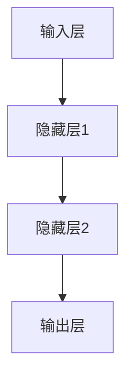
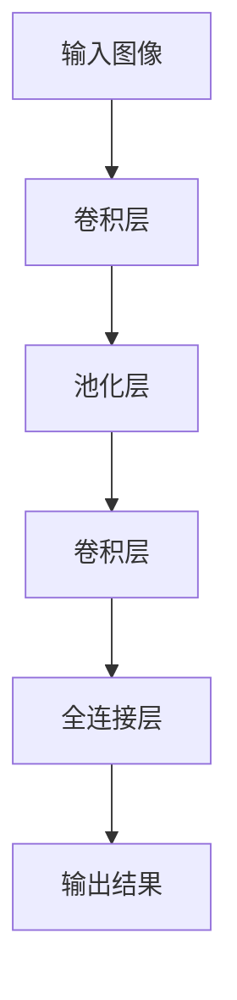
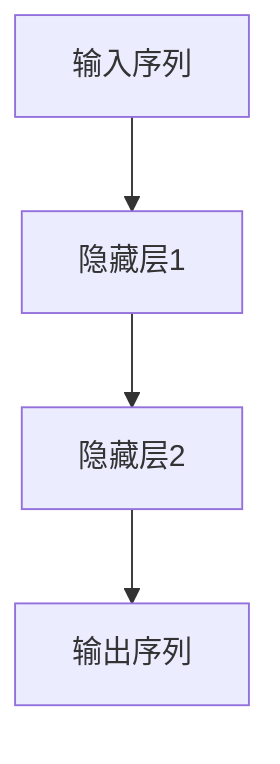
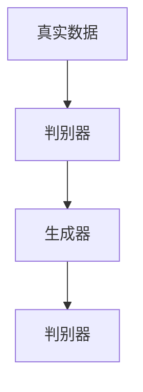
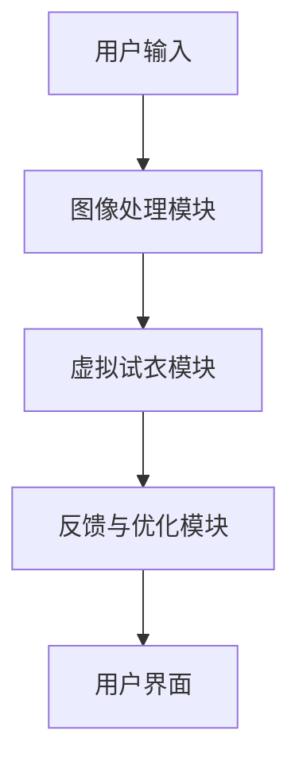

                 

### 文章标题

# 深度学习在虚拟试衣中的应用：提升在线购物体验

---

**关键词：** 深度学习、虚拟试衣、在线购物体验、图像处理、人工智能

**摘要：** 随着人工智能技术的不断发展，深度学习在多个领域得到了广泛应用。本文主要探讨了深度学习在虚拟试衣中的应用，以及如何通过这项技术提升在线购物的用户体验。文章首先介绍了深度学习的基础知识，包括核心概念、算法原理和数学模型。接着，详细阐述了虚拟试衣系统的架构、图像处理算法以及如何利用深度学习提升用户个性化推荐和购物流程。最后，通过实际案例分析，展示了深度学习在虚拟试衣中的应用效果，并提出了最佳实践建议。

---

### 引言

在互联网时代，电子商务已经成为人们生活中不可或缺的一部分。然而，传统的在线购物模式仍然存在一些痛点，如用户难以确定所购买商品的尺码和样式是否适合自己。为了解决这一问题，虚拟试衣技术应运而生。虚拟试衣技术通过计算机图像处理和人工智能算法，使用户能够在不实际试穿的情况下，模拟出穿着效果，从而提升在线购物的体验。

深度学习作为人工智能的一个重要分支，近年来在图像处理、自然语言处理、语音识别等领域取得了显著的成果。深度学习在虚拟试衣中的应用，不仅能够提高试衣的准确度和速度，还能够为用户提供更加个性化的购物推荐，从而提升整体购物体验。

本文旨在探讨深度学习在虚拟试衣中的应用，通过以下步骤进行分析：

1. **深度学习基础**：介绍深度学习的核心概念、算法原理和数学模型。
2. **虚拟试衣技术**：详细阐述虚拟试衣系统的架构、图像处理算法和身体姿态估计方法。
3. **在线购物体验提升**：探讨如何利用深度学习提升用户个性化推荐和购物流程。
4. **项目实战**：通过实际案例分析，展示深度学习在虚拟试衣中的应用效果。
5. **最佳实践与总结**：总结深度学习在虚拟试衣中的应用经验，并提出未来发展方向。

接下来，我们将逐步展开讨论。

### 第一步：深度学习基础

#### 1.1 深度学习核心概念与联系

深度学习是一种基于多层神经网络的人工智能算法，它的核心概念包括神经网络、深度学习、多层神经网络、反向传播算法和优化算法。这些概念之间有着紧密的联系，共同构成了深度学习的基础。

首先，神经网络（Neural Network）是一种模仿生物神经系统的计算模型，由大量的神经元（节点）和连接（边）组成。每个神经元接收来自其他神经元的输入信号，经过加权求和处理后，产生输出信号。神经网络的基本架构如图1所示：

深度学习（Deep Learning）是在神经网络的基础上，通过增加网络的层数，使得网络能够学习更加复杂的特征。深度学习通常是指具有至少三层（输入层、隐藏层、输出层）神经元的神经网络。多层神经网络（Multi-Layer Neural Network）是深度学习的基础，它的主要优势在于能够自动提取数据的层次化特征。

反向传播算法（Backpropagation Algorithm）是一种用于训练神经网络的优化算法，它通过计算输出层误差，反向传播到输入层，不断调整网络中的权重，从而优化网络性能。反向传播算法的核心思想是梯度下降（Gradient Descent），其目标是最小化损失函数（Loss Function）。

优化算法（Optimization Algorithm）是用于调整神经网络权重的算法，包括梯度下降（Stochastic Gradient Descent, SGD）、随机梯度下降（Mini-batch Gradient Descent, MBGD）和Adam等。这些优化算法通过不断迭代优化，使得神经网络能够收敛到最优解。

#### 1.2 深度学习算法原理

深度学习的算法原理主要涉及卷积神经网络（Convolutional Neural Network, CNN）、循环神经网络（Recurrent Neural Network, RNN）和生成对抗网络（Generative Adversarial Network, GAN）等。

卷积神经网络（CNN）是一种专门用于图像处理的深度学习模型，它通过卷积操作、池化操作和全连接层，提取图像的层次化特征。CNN的算法原理如图2所示：

卷积层通过卷积操作，提取图像的特征图（Feature Map）；池化层用于降低特征图的维度，减少计算量；全连接层将特征图映射到输出结果。

循环神经网络（RNN）是一种能够处理序列数据的深度学习模型，它通过循环结构，对序列中的每个元素进行编码和解码。RNN的算法原理如图3所示：

RNN的主要优势在于能够捕捉序列中的长期依赖关系，但同时也存在梯度消失和梯度爆炸等问题。

生成对抗网络（GAN）是一种由生成器（Generator）和判别器（Discriminator）组成的深度学习模型，它通过两个对抗性网络之间的博弈，生成与真实数据分布相似的样本。GAN的算法原理如图4所示：

生成器生成伪数据，判别器对真实数据和伪数据进行分类，通过优化判别器的损失函数，生成器不断改进生成的数据质量。

#### 1.3 深度学习数学模型

深度学习的数学模型主要包括激活函数（Activation Function）、损失函数（Loss Function）和优化算法（Optimization Algorithm）。

激活函数是神经网络中的一个关键组件，它用于引入非线性因素，使得神经网络能够学习更加复杂的特征。常用的激活函数包括ReLU（Rectified Linear Unit）、Sigmoid和Tanh等。其中，ReLU函数具有计算简单、参数少、易于优化等优点，因此被广泛应用于深度学习中。

损失函数是用于评估神经网络预测结果与实际结果之间差异的函数。常用的损失函数包括均方误差（Mean Squared Error, MSE）、交叉熵（Cross-Entropy）和对抗损失（Adversarial Loss）等。这些损失函数能够指导神经网络通过调整权重，使得预测结果更加接近真实结果。

优化算法是用于调整神经网络权重的算法，包括梯度下降（Gradient Descent）、随机梯度下降（Stochastic Gradient Descent, SGD）、随机梯度下降（Mini-batch Gradient Descent, MBGD）和Adam等。这些优化算法通过不断迭代优化，使得神经网络能够收敛到最优解。

### 第二步：虚拟试衣技术

#### 2.1 虚拟试衣系统架构

虚拟试衣系统通常由多个模块组成，包括用户输入模块、图像处理模块、虚拟试衣模块和反馈与优化模块。系统架构如图5所示：

用户输入模块负责接收用户上传的衣物图像和身体姿态信息；图像处理模块对输入的图像进行预处理，如灰度化、去噪等操作；虚拟试衣模块通过图像处理和身体姿态估计，将衣物贴合在用户的身体上；反馈与优化模块根据用户反馈，对系统进行优化和调整；用户界面模块负责将虚拟试衣结果展示给用户。

#### 2.2 图像处理算法

图像处理算法是虚拟试衣系统的核心，它主要包括图像预处理、图像分割、特征提取和匹配等步骤。

图像预处理是对输入图像进行一系列预处理操作，如灰度化、去噪、增强等。预处理操作能够提高图像质量，为后续处理提供更好的基础。

图像分割是将图像划分为多个区域，以便对每个区域进行独立处理。常见的图像分割方法包括阈值分割、边缘检测和区域生长等。

特征提取是提取图像中的关键特征，如边缘、纹理、颜色等。特征提取能够帮助系统更好地理解和识别图像。

匹配是将提取到的特征与已知的衣物模型进行匹配，从而确定衣物的位置和姿态。常见的匹配方法包括基于特征的匹配、基于模型的方法和基于结构的匹配等。

#### 2.3 身体系态估计

身体姿态估计是虚拟试衣系统中的一个关键步骤，它通过识别用户的身体姿态，为虚拟试衣提供准确的参考。身体姿态估计的方法主要包括基于图像的方法、基于模型的方法和基于深度学习的方法。

基于图像的方法通过分析图像中的像素信息，识别用户的身体姿态。常见的算法包括HOG（Histogram of Oriented Gradients）、SVM（Support Vector Machine）和R-CNN（Region-based Convolutional Neural Network）等。

基于模型的方法通过建立三维身体模型，模拟用户的身体姿态。常见的算法包括SMPL（Skinned Multi-Person Linear Model）和MCMC（Markov Chain Monte Carlo）等。

基于深度学习的方法利用深度神经网络，从大量数据中学习身体的姿态特征。常见的算法包括DensePose Network和DeepPoseKit等。

#### 2.4 服装拟合算法

服装拟合算法是将衣物模型贴合在用户身体上的关键步骤，它通过调整衣物模型的位置、姿态和尺寸，使得衣物更加贴合用户身体。服装拟合算法的方法主要包括基于图像的方法、基于模型的方法和基于深度学习的方法。

基于图像的方法通过分析图像中的像素信息，调整衣物模型的位置和姿态。常见的算法包括图像配准、图像变换和图像匹配等。

基于模型的方法通过建立三维身体模型和衣物模型，调整衣物模型的位置、姿态和尺寸。常见的算法包括人体建模、服装建模和模型拟合等。

基于深度学习的方法利用深度神经网络，从大量数据中学习衣物与身体之间的匹配关系。常见的算法包括卷积神经网络（CNN）、循环神经网络（RNN）和生成对抗网络（GAN）等。

### 第三步：在线购物体验提升

#### 3.1 用户个性化推荐

用户个性化推荐是提升在线购物体验的重要手段之一。通过分析用户的历史行为和兴趣偏好，系统可以为用户提供个性化的商品推荐，从而提高用户的购买意愿和满意度。

用户个性化推荐的方法主要包括基于内容的推荐（Content-based Recommendation）、协同过滤推荐（Collaborative Filtering）和深度学习推荐（Deep Learning Recommendation）。

基于内容的推荐方法通过分析商品的属性和用户的历史行为，为用户推荐与其兴趣相似的物品。常见的算法包括TF-IDF（Term Frequency-Inverse Document Frequency）和基于矩阵分解的方法。

协同过滤推荐方法通过分析用户之间的行为相似性，为用户推荐其他用户喜欢的商品。常见的算法包括用户基于的协同过滤（User-based Collaborative Filtering）和基于模型的协同过滤（Model-based Collaborative Filtering）。

深度学习推荐方法利用深度神经网络，从大量用户行为数据中学习用户兴趣和商品特征之间的关系。常见的算法包括卷积神经网络（CNN）、循环神经网络（RNN）和生成对抗网络（GAN）等。

#### 3.2 购物流程优化

购物流程优化是提升在线购物体验的另一个关键方面。通过优化购物流程，系统能够提高用户的操作效率，减少用户的等待时间，从而提升用户满意度。

购物流程优化主要包括购物车优化、订单管理和支付流程优化等。

购物车优化通过对购物车中的商品进行排序、筛选和推荐，提高用户的购物体验。常见的优化方法包括基于用户行为的购物车排序、基于商品的相似度推荐和基于促销信息的购物车优化等。

订单管理优化通过对订单的创建、处理、跟踪和支付等环节进行优化，提高订单的处理效率和准确性。常见的优化方法包括自动化订单处理、实时订单跟踪和智能支付选择等。

支付流程优化通过对支付流程的简化、加速和安全保障，提高用户的支付体验。常见的优化方法包括一键支付、移动支付和跨境支付优化等。

### 第四步：项目实战

#### 4.1 案例一：电商平台的虚拟试衣

电商平台虚拟试衣项目是一个典型的深度学习在虚拟试衣中的应用案例。该项目的主要目标是实现一个在线虚拟试衣系统，用户可以通过上传自己的照片，试穿多种风格的衣物，从而提高购物体验。

该项目分为以下几个阶段：

1. **数据收集与预处理**：收集大量包含用户照片和对应衣物图像的数据集，对数据集进行预处理，如数据清洗、数据增强和归一化等。

2. **模型训练与优化**：使用卷积神经网络（CNN）训练一个图像分类模型，用于识别用户照片中的身体姿态；使用循环神经网络（RNN）训练一个序列模型，用于识别衣物的轮廓和样式；通过模型融合，优化虚拟试衣结果。

3. **系统集成与测试**：将训练好的模型集成到电商平台中，对系统进行测试和优化，确保虚拟试衣结果准确、流畅。

4. **用户反馈与迭代**：收集用户对虚拟试衣系统的反馈，对系统进行迭代优化，不断提高用户满意度。

#### 4.2 案例二：服装设计师的虚拟试衣

服装设计师虚拟试衣项目旨在为服装设计师提供一个虚拟试衣平台，帮助他们更好地评估设计效果，提高设计质量。该项目的主要目标是实现一个三维虚拟试衣系统，设计师可以通过上传设计图纸，模拟多种穿着效果。

该项目分为以下几个阶段：

1. **三维建模与渲染**：使用三维建模软件（如Blender）和渲染器（如Unity）建立三维人体模型和衣物模型，实现逼真的渲染效果。

2. **虚拟试衣算法**：使用深度学习算法（如GAN）训练一个衣物拟合模型，将设计师的设计图纸转化为三维衣物模型；使用身体姿态估计算法，识别设计师的身体姿态，实现三维虚拟试衣。

3. **系统集成与测试**：将三维虚拟试衣系统集成到设计师的工作站中，对系统进行测试和优化，确保虚拟试衣结果准确、流畅。

4. **用户反馈与迭代**：收集设计师对虚拟试衣系统的反馈，对系统进行迭代优化，不断提高设计师的工作效率和设计质量。

### 第五步：最佳实践与总结

#### 5.1 最佳实践

1. **数据收集与预处理**：确保数据集的多样性和质量，对数据集进行充分的预处理，如数据清洗、数据增强和归一化等，以提高模型的泛化能力。

2. **模型选择与优化**：根据应用场景选择合适的深度学习模型，如卷积神经网络（CNN）用于图像处理，循环神经网络（RNN）用于序列处理，生成对抗网络（GAN）用于图像生成等。在模型训练过程中，注意调整超参数，优化模型性能。

3. **系统集成与测试**：在系统集成过程中，充分考虑用户体验，确保系统稳定、高效、易用。对系统进行全面的测试，包括功能测试、性能测试和兼容性测试等。

4. **用户反馈与迭代**：及时收集用户反馈，根据用户需求对系统进行迭代优化，不断提高用户满意度。

#### 5.2 小结

本文探讨了深度学习在虚拟试衣中的应用，包括深度学习基础、虚拟试衣技术、在线购物体验提升和项目实战。通过分析，我们发现深度学习在虚拟试衣中具有显著的优势，能够提高试衣的准确度和速度，为用户提供个性化的购物推荐，提升整体购物体验。然而，深度学习在虚拟试衣中仍面临一些挑战，如数据隐私保护、计算资源消耗和模型解释性等。未来，随着人工智能技术的不断发展，深度学习在虚拟试衣中的应用将更加广泛，为人们的生活带来更多便利。

#### 5.3 注意事项

1. **数据安全**：在收集和使用用户数据时，需确保数据安全，遵循相关法律法规，保护用户隐私。

2. **计算资源**：深度学习模型训练和推理过程需要大量的计算资源，确保计算资源的合理利用和优化。

3. **模型解释性**：深度学习模型通常具有高解释性，但需要确保模型的鲁棒性和可解释性，以提高用户信任度和系统可靠性。

#### 5.4 拓展阅读

1. **深度学习基础**：《深度学习》（Goodfellow, Bengio, Courville 著）、《神经网络与深度学习》（邱锡鹏 著）

2. **虚拟试衣技术**：《虚拟试衣系统设计与实现》（刘宁 著）、《三维人体建模与虚拟试衣》（王辉 著）

3. **在线购物体验提升**：《电子商务用户体验设计》（李明 著）、《用户行为分析与应用》（张晨 著）

---

**作者**：AI天才研究院/AI Genius Institute & 禅与计算机程序设计艺术 /Zen And The Art of Computer Programming

---

本文为原创作品，版权归作者所有。如需转载，请务必注明出处。感谢您的阅读！

