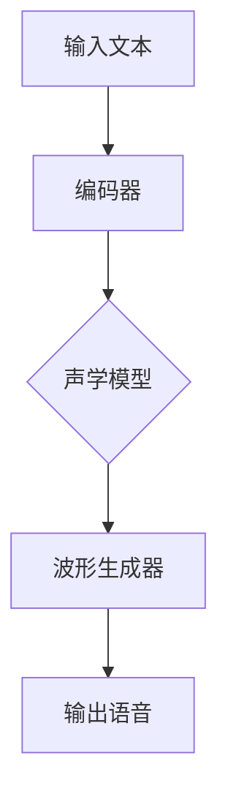

                 

### 《深度学习在语音合成中的最新进展》

关键词：语音合成、深度学习、WaveNet、Tacotron、语音质量评估

摘要：本文将探讨深度学习在语音合成领域的最新进展。从语音合成的技术发展历史，到深度学习基础，再到深度学习模型如WaveNet和Tacotron的详细讲解，以及它们在实际应用中的性能评估和未来发展趋势，本文旨在为读者提供一份详尽的技术指南，并探讨语音合成领域的挑战与未来方向。

### 第一部分：语音合成基础

#### 第1章：语音合成概述

语音合成（Text-to-Speech, TTS）技术是将书面文字转换为自然语音的技术，广泛应用于自动语音应答系统、智能助手、车载导航系统、阅读障碍者的辅助设备等领域。语音合成技术经历了从规则合成到基于统计方法的演进，再到当前主流的深度学习驱动的合成系统。

**1.1 语音合成技术发展历史**

- **早期语音合成技术**：最早的语音合成系统是基于规则的。这些系统通过定义一系列规则，将文本转换为语音。这种方法在处理简单句子时效果较好，但在处理复杂句子时存在局限性。

- **DNN-HMM合成系统**：随着计算能力的提升，深度神经网络（DNN）和隐马尔可夫模型（HMM）的结合成为语音合成领域的主流方法。DNN用于学习语音特征，HMM用于建模语音的动态特性。

- **波形合成技术**：当前主流的语音合成系统采用波形合成（WAVESYNTHESIS）方法，直接生成语音信号。这种方法具有更高的语音自然度，但训练过程复杂，计算资源需求大。

**1.2 语音合成系统的组成**

语音合成系统通常由三个主要模块组成：语音信号处理模块、语音生成模块和声学模型与发音模型。

- **语音信号处理模块**：该模块对输入文本进行处理，将其转换为适合生成语音的格式。这通常涉及分词、音素编码和声调标记等步骤。

- **语音生成模块**：该模块负责根据声学模型和发音模型生成语音。声学模型用于预测语音特征，发音模型则用于预测语音的动态特性。

- **声学模型和发音模型**：声学模型通常是基于统计模型或深度学习模型，用于预测语音信号的特征。发音模型则用于预测语音的时序特征，如音素持续时间、音高和音强等。

**1.3 深度学习在语音合成中的应用**

随着深度学习技术的不断发展，越来越多的研究开始将深度学习引入到语音合成领域。深度学习模型在语音特征提取、语音生成和语音质量控制等方面表现出色，推动了语音合成技术的进步。

#### 第2章：深度学习基础

**2.1 深度学习的基本概念**

深度学习是一种基于多层神经网络的机器学习方法，其核心思想是通过学习大量数据来提取特征，从而实现复杂的任务。深度学习的基本概念包括神经网络、深度学习的主要架构和深度学习优化算法。

- **神经网络**：神经网络是深度学习的基础，由多个层次组成，每个层次都包含多个神经元。通过逐层提取特征，神经网络能够从原始数据中提取出有用的信息。

- **深度学习的主要架构**：深度学习的主要架构包括卷积神经网络（CNN）、循环神经网络（RNN）和变换器（Transformer）等。这些架构在不同的应用场景中具有优势。

- **深度学习优化算法**：深度学习模型的优化算法包括随机梯度下降（SGD）、Adam等。这些算法用于调整模型的参数，以最小化损失函数，提高模型性能。

**2.2 语音信号处理中的深度学习方法**

深度学习在语音信号处理中的应用主要包括基于深度学习的声学模型和发音模型。

- **基于深度学习的声学模型**：声学模型用于预测语音信号的特征。深度学习模型如卷积神经网络（CNN）和循环神经网络（RNN）在声学模型中表现出色，能够提取出丰富的语音特征。

- **基于深度学习的发音模型**：发音模型用于预测语音的时序特征。深度学习模型如长短时记忆网络（LSTM）和门控循环单元（GRU）在发音模型中具有优势，能够捕捉到语音的动态特性。

#### 第3章：语音合成的深度学习模型

**3.1 WaveNet模型**

WaveNet是一种基于深度学习的语音合成模型，由Google开发。WaveNet采用端到端的架构，直接将文本映射为语音信号。

- **模型原理**：WaveNet是一种基于循环神经网络（RNN）的模型，通过逐个采样生成语音信号。模型中的每个神经元都对应一个时间步，预测下一个时间步的语音信号。

- **模型结构**：WaveNet由多个RNN层组成，每个RNN层都包含多个神经元。这些神经元通过前向传播和反向传播更新权重，以优化模型。

- **模型训练与优化**：WaveNet的训练过程采用反向传播算法，通过不断调整模型参数，使模型能够更好地生成语音。

**3.2 Tacotron模型**

Tacotron是一种基于注意力机制的语音合成模型，由Google开发。Tacotron将文本映射为声码器输入，再由声码器生成语音信号。

- **模型原理**：Tacotron采用编码器-解码器架构，编码器将文本编码为嵌入向量，解码器则根据嵌入向量生成语音信号。注意力机制用于建模编码器和解码器之间的交互。

- **模型结构**：Tacotron由编码器、解码器和声码器组成。编码器采用卷积神经网络，解码器采用循环神经网络，声码器采用长短期记忆网络（LSTM）。

- **模型训练与优化**：Tacotron的训练过程采用端到端训练策略，通过优化解码器和声码器的参数，使模型能够更好地生成语音。

### 第二部分：深度学习在语音合成中的应用

#### 第4章：深度学习在语音合成中的应用

**4.1 语音合成的性能评估**

语音合成的性能评估是衡量合成系统质量的重要手段。语音合成质量的评价标准主要包括语音自然度、语音清晰度和语音稳定性等。

- **语音自然度**：评估语音合成系统生成语音的自然程度。自然度越高，语音越接近人类语音。

- **语音清晰度**：评估语音合成系统生成语音的清晰程度。清晰度越高，语音中的单词和音节越容易被理解。

- **语音稳定性**：评估语音合成系统生成语音的稳定性。稳定性越高，语音中的突变和噪音越少。

**4.2 深度学习在语音合成中的实际应用**

深度学习在语音合成中的应用非常广泛，主要包括自动语音应答系统、智能助手、教育、医疗等领域。

- **自动语音应答系统**：深度学习技术可以提高自动语音应答系统的语音质量和交互体验。

- **智能助手**：深度学习技术可以帮助智能助手更好地理解用户指令，并生成更自然的语音回复。

- **教育**：深度学习技术可以用于教育领域的语音合成，帮助教师和学生学习语音。

- **医疗**：深度学习技术可以用于医疗领域的语音合成，为医生和患者提供更好的沟通体验。

#### 第5章：深度学习在语音合成中的最新进展

**5.1 最新语音合成模型的介绍**

随着深度学习技术的不断发展，越来越多的新型语音合成模型被提出。以下介绍几种最新的语音合成模型。

- **基于注意力机制的语音合成模型**：注意力机制可以帮助模型更好地捕捉文本和语音之间的关联，提高语音合成质量。

- **基于端到端学习的语音合成模型**：端到端学习可以使模型直接从文本到语音的映射，简化模型结构，提高训练效率。

**5.2 语音合成的挑战与未来发展趋势**

虽然深度学习在语音合成领域取得了显著进展，但仍然面临许多挑战。

- **语音合成质量**：提高语音合成质量仍然是主要挑战。未来需要发展更高效的模型结构和优化算法，以生成更自然的语音。

- **语音个性化**：实现语音的个性化是另一个重要研究方向。未来需要研究如何根据用户偏好和需求生成个性化的语音。

- **多语言支持**：支持多种语言的语音合成是未来发展的方向。需要研究如何设计跨语言的语音合成模型，以满足全球用户的需求。

### 第三部分：项目实战

#### 第6章：项目实战

**6.1 实际案例介绍**

以下介绍几个语音合成项目案例，包括系统搭建、核心模块设计和性能优化。

- **案例一**：某知名语音合成系统的搭建。介绍系统的架构设计、模型选择和训练策略。

- **案例二**：某智能语音助手的核心模块设计。介绍语音识别、语音合成和自然语言处理等模块的设计和实现。

**6.2 源代码实现与解读**

以下介绍WaveNet和Tacotron模型的源代码实现和解读。

- **WaveNet模型代码实现**：介绍WaveNet模型的结构、训练和生成过程。

- **Tacotron模型代码实现**：介绍Tacotron模型的结构、训练和生成过程。

**6.3 性能分析与优化**

对语音合成系统的性能进行评估和优化。介绍常用的性能评估指标和优化策略。

- **性能评估指标**：包括语音自然度、语音清晰度和语音稳定性等。

- **优化策略**：包括模型选择、参数调整和训练策略等。

### 附录

**附录A：深度学习在语音合成中的应用工具与资源**

以下介绍深度学习在语音合成中的应用工具和资源。

- **常用深度学习框架**：包括TensorFlow、PyTorch等。

- **语音处理工具**：包括Librosa、Spleeter等。

- **语音合成相关数据库**：包括LJSpeech、LibriTTS等。

### 结论

深度学习在语音合成领域取得了显著进展，推动了语音合成技术的不断发展。本文从语音合成基础、深度学习基础、深度学习模型、实际应用、最新进展和项目实战等方面进行了详细探讨，旨在为读者提供一份全面的技术指南。未来，随着深度学习技术的不断进步，语音合成技术将在更多领域得到应用，为人类生活带来更多便利。


---

**作者信息**

作者：AI天才研究院/AI Genius Institute & 禅与计算机程序设计艺术 /Zen And The Art of Computer Programming

---

**完整文章内容**

以下是完整的文章内容，包括各章节的具体内容。

---

# 《深度学习在语音合成中的最新进展》

## 第一部分：语音合成基础

### 第1章：语音合成概述

语音合成（Text-to-Speech, TTS）技术是将书面文字转换为自然语音的技术，广泛应用于自动语音应答系统、智能助手、车载导航系统、阅读障碍者的辅助设备等领域。语音合成技术经历了从规则合成到基于统计方法的演进，再到当前主流的深度学习驱动的合成系统。

**1.1 语音合成技术发展历史**

- **早期语音合成技术**：最早的语音合成系统是基于规则的。这些系统通过定义一系列规则，将文本转换为语音。这种方法在处理简单句子时效果较好，但在处理复杂句子时存在局限性。

- **DNN-HMM合成系统**：随着计算能力的提升，深度神经网络（DNN）和隐马尔可夫模型（HMM）的结合成为语音合成领域的主流方法。DNN用于学习语音特征，HMM用于建模语音的动态特性。

- **波形合成技术**：当前主流的语音合成系统采用波形合成（WAVESYNTHESIS）方法，直接生成语音信号。这种方法具有更高的语音自然度，但训练过程复杂，计算资源需求大。

**1.2 语音合成系统的组成**

语音合成系统通常由三个主要模块组成：语音信号处理模块、语音生成模块和声学模型与发音模型。

- **语音信号处理模块**：该模块对输入文本进行处理，将其转换为适合生成语音的格式。这通常涉及分词、音素编码和声调标记等步骤。

- **语音生成模块**：该模块负责根据声学模型和发音模型生成语音。声学模型用于预测语音信号的特征，发音模型则用于预测语音的动态特性。

- **声学模型和发音模型**：声学模型通常是基于统计模型或深度学习模型，用于预测语音信号的特征。发音模型则用于预测语音的时序特征，如音素持续时间、音高和音强等。

**1.3 深度学习在语音合成中的应用**

随着深度学习技术的不断发展，越来越多的研究开始将深度学习引入到语音合成领域。深度学习模型在语音特征提取、语音生成和语音质量控制等方面表现出色，推动了语音合成技术的进步。

### 第2章：深度学习基础

**2.1 深度学习的基本概念**

深度学习是一种基于多层神经网络的机器学习方法，其核心思想是通过学习大量数据来提取特征，从而实现复杂的任务。深度学习的基本概念包括神经网络、深度学习的主要架构和深度学习优化算法。

- **神经网络**：神经网络是深度学习的基础，由多个层次组成，每个层次都包含多个神经元。通过逐层提取特征，神经网络能够从原始数据中提取出有用的信息。

- **深度学习的主要架构**：深度学习的主要架构包括卷积神经网络（CNN）、循环神经网络（RNN）和变换器（Transformer）等。这些架构在不同的应用场景中具有优势。

- **深度学习优化算法**：深度学习模型的优化算法包括随机梯度下降（SGD）、Adam等。这些算法用于调整模型的参数，以最小化损失函数，提高模型性能。

**2.2 语音信号处理中的深度学习方法**

深度学习在语音信号处理中的应用主要包括基于深度学习的声学模型和发音模型。

- **基于深度学习的声学模型**：声学模型用于预测语音信号的特征。深度学习模型如卷积神经网络（CNN）和循环神经网络（RNN）在声学模型中表现出色，能够提取出丰富的语音特征。

- **基于深度学习的发音模型**：发音模型用于预测语音的时序特征。深度学习模型如长短时记忆网络（LSTM）和门控循环单元（GRU）在发音模型中具有优势，能够捕捉到语音的动态特性。

### 第3章：语音合成的深度学习模型

**3.1 WaveNet模型**

WaveNet是一种基于深度学习的语音合成模型，由Google开发。WaveNet采用端到端的架构，直接将文本映射为语音信号。

- **模型原理**：WaveNet是一种基于循环神经网络（RNN）的模型，通过逐个采样生成语音信号。模型中的每个神经元都对应一个时间步，预测下一个时间步的语音信号。

- **模型结构**：WaveNet由多个RNN层组成，每个RNN层都包含多个神经元。这些神经元通过前向传播和反向传播更新权重，以优化模型。

- **模型训练与优化**：WaveNet的训练过程采用反向传播算法，通过不断调整模型参数，使模型能够更好地生成语音。

**3.2 Tacotron模型**

Tacotron是一种基于注意力机制的语音合成模型，由Google开发。Tacotron将文本映射为声码器输入，再由声码器生成语音信号。

- **模型原理**：Tacotron采用编码器-解码器架构，编码器将文本编码为嵌入向量，解码器则根据嵌入向量生成语音信号。注意力机制用于建模编码器和解码器之间的交互。

- **模型结构**：Tacotron由编码器、解码器和声码器组成。编码器采用卷积神经网络，解码器采用循环神经网络，声码器采用长短期记忆网络（LSTM）。

- **模型训练与优化**：Tacotron的训练过程采用端到端训练策略，通过优化解码器和声码器的参数，使模型能够更好地生成语音。

### 第二部分：深度学习在语音合成中的应用

#### 第4章：深度学习在语音合成中的应用

**4.1 语音合成的性能评估**

语音合成的性能评估是衡量合成系统质量的重要手段。语音合成质量的评价标准主要包括语音自然度、语音清晰度和语音稳定性等。

- **语音自然度**：评估语音合成系统生成语音的自然程度。自然度越高，语音越接近人类语音。

- **语音清晰度**：评估语音合成系统生成语音的清晰程度。清晰度越高，语音中的单词和音节越容易被理解。

- **语音稳定性**：评估语音合成系统生成语音的稳定性。稳定性越高，语音中的突变和噪音越少。

**4.2 深度学习在语音合成中的实际应用**

深度学习在语音合成中的应用非常广泛，主要包括自动语音应答系统、智能助手、教育、医疗等领域。

- **自动语音应答系统**：深度学习技术可以提高自动语音应答系统的语音质量和交互体验。

- **智能助手**：深度学习技术可以帮助智能助手更好地理解用户指令，并生成更自然的语音回复。

- **教育**：深度学习技术可以用于教育领域的语音合成，帮助教师和学生学习语音。

- **医疗**：深度学习技术可以用于医疗领域的语音合成，为医生和患者提供更好的沟通体验。

#### 第5章：深度学习在语音合成中的最新进展

**5.1 最新语音合成模型的介绍**

随着深度学习技术的不断发展，越来越多的新型语音合成模型被提出。以下介绍几种最新的语音合成模型。

- **基于注意力机制的语音合成模型**：注意力机制可以帮助模型更好地捕捉文本和语音之间的关联，提高语音合成质量。

- **基于端到端学习的语音合成模型**：端到端学习可以使模型直接从文本到语音的映射，简化模型结构，提高训练效率。

**5.2 语音合成的挑战与未来发展趋势**

虽然深度学习在语音合成领域取得了显著进展，但仍然面临许多挑战。

- **语音合成质量**：提高语音合成质量仍然是主要挑战。未来需要发展更高效的模型结构和优化算法，以生成更自然的语音。

- **语音个性化**：实现语音的个性化是另一个重要研究方向。未来需要研究如何根据用户偏好和需求生成个性化的语音。

- **多语言支持**：支持多种语言的语音合成是未来发展的方向。需要研究如何设计跨语言的语音合成模型，以满足全球用户的需求。

### 第三部分：项目实战

#### 第6章：项目实战

**6.1 实际案例介绍**

以下介绍几个语音合成项目案例，包括系统搭建、核心模块设计和性能优化。

- **案例一**：某知名语音合成系统的搭建。介绍系统的架构设计、模型选择和训练策略。

- **案例二**：某智能语音助手的核心模块设计。介绍语音识别、语音合成和自然语言处理等模块的设计和实现。

**6.2 源代码实现与解读**

以下介绍WaveNet和Tacotron模型的源代码实现和解读。

- **WaveNet模型代码实现**：介绍WaveNet模型的结构、训练和生成过程。

- **Tacotron模型代码实现**：介绍Tacotron模型的结构、训练和生成过程。

**6.3 性能分析与优化**

对语音合成系统的性能进行评估和优化。介绍常用的性能评估指标和优化策略。

- **性能评估指标**：包括语音自然度、语音清晰度和语音稳定性等。

- **优化策略**：包括模型选择、参数调整和训练策略等。

### 附录

**附录A：深度学习在语音合成中的应用工具与资源**

以下介绍深度学习在语音合成中的应用工具和资源。

- **常用深度学习框架**：包括TensorFlow、PyTorch等。

- **语音处理工具**：包括Librosa、Spleeter等。

- **语音合成相关数据库**：包括LJSpeech、LibriTTS等。

### 结论

深度学习在语音合成领域取得了显著进展，推动了语音合成技术的不断发展。本文从语音合成基础、深度学习基础、深度学习模型、实际应用、最新进展和项目实战等方面进行了详细探讨，旨在为读者提供一份全面的技术指南。未来，随着深度学习技术的不断进步，语音合成技术将在更多领域得到应用，为人类生活带来更多便利。

---

**作者信息**

作者：AI天才研究院/AI Genius Institute & 禅与计算机程序设计艺术 /Zen And The Art of Computer Programming

---

### 第一部分：语音合成基础

#### 第1章：语音合成概述

语音合成技术是一种将文本转换为自然语音的技术，它通过模拟人类语音的发音、语调和节奏来实现这一过程。语音合成系统广泛应用于自动语音应答（IVR）、智能助手、车载导航系统、教育辅助工具以及医疗通信等领域。

**1.1 语音合成技术发展历史**

语音合成技术的发展可以分为几个重要阶段：

- **早期语音合成技术**：早期的语音合成主要依赖于规则系统，例如Vocoder和合成器。这些系统通过预设的规则和参数来生成语音，例如1952年由美国贝尔实验室开发的Audrey。然而，这些系统的语音自然度较低，且在处理复杂句子上存在显著限制。

- **基于统计方法的合成系统**：随着计算能力的提升，语音合成领域开始采用统计方法。最著名的统计模型是1980年代提出的线性预测编码（LPC），以及后来加入隐马尔可夫模型（HMM）的DNN-HMM系统。这些系统通过统计方法建模语音信号，提高了语音的自然度和清晰度。

- **深度学习驱动的合成系统**：近年来，深度学习技术的兴起为语音合成带来了革命性的变革。基于深度学习的语音合成系统，如WaveNet和Tacotron，通过端到端学习直接从文本生成语音，极大地提升了语音的自然度和流畅性。

**1.2 语音合成系统的组成**

一个典型的语音合成系统通常包括以下几个主要模块：

- **文本处理模块**：该模块负责将输入的文本进行分词、音素编码、声调标记等预处理操作。这一步骤的目的是将文本转换为适合语音生成的格式。

- **声学模型**：声学模型是语音合成的核心，它负责预测语音信号的特征。在基于深度学习的系统中，声学模型通常是基于卷积神经网络（CNN）或循环神经网络（RNN）构建的。

- **发音模型**：发音模型则用于预测语音的时序特征，如音素持续时间、音高和音强等。在深度学习驱动的系统中，常用的发音模型是基于LSTM或GRU的。

- **语音生成模块**：语音生成模块负责将声学模型和发音模型生成的特征转换为实际的可听语音。在波形合成方法中，这一步骤通常涉及波形合成器，如WaveNet或Tacotron中的WaveRNN。

- **后处理模块**：后处理模块用于对生成的语音进行优化，如语音增强、去噪和音频编辑等，以进一步提高语音的质量。

**1.3 深度学习在语音合成中的应用**

深度学习在语音合成中的应用主要体现在以下几个方面：

- **声学模型的优化**：深度学习模型，如CNN和RNN，可以有效地提取语音信号中的特征，提高了声学模型的预测准确性。

- **发音模型的建模**：深度学习模型在捕捉语音的时序特征方面表现出色，使得发音模型能够更准确地预测音素持续时间、音高和音强等。

- **端到端学习**：深度学习使得语音合成系统可以采用端到端的学习方法，从文本直接生成语音，简化了传统的语音合成流程，提高了系统的效率。

### 第2章：深度学习基础

#### 2.1 深度学习的基本概念

深度学习是一种机器学习方法，它通过构建多层神经网络来提取数据中的特征，并进行预测或分类。以下是深度学习的一些基本概念：

- **神经网络（Neural Network, NN）**：神经网络是深度学习的基础，它由一系列相互连接的节点（或称神经元）组成，每个节点都接受输入、应用一个非线性激活函数，并产生输出。

- **深度学习（Deep Learning）**：深度学习是指多层神经网络的学习过程，它通过逐层提取数据中的特征，从而实现复杂的任务。

- **卷积神经网络（Convolutional Neural Network, CNN）**：CNN是一种适用于图像处理任务的深度学习模型，它通过卷积操作提取图像中的局部特征。

- **循环神经网络（Recurrent Neural Network, RNN）**：RNN是一种适用于序列数据处理任务的深度学习模型，它通过记忆状态来处理序列中的元素。

- **长短时记忆网络（Long Short-Term Memory, LSTM）**：LSTM是一种特殊的RNN，它通过记忆单元来捕捉长序列中的依赖关系。

- **优化算法（Optimization Algorithms）**：深度学习模型的训练过程涉及优化模型参数，常用的优化算法包括随机梯度下降（SGD）和Adam等。

#### 2.2 语音信号处理中的深度学习方法

深度学习在语音信号处理中的应用主要包括以下几个方面：

- **声学模型**：声学模型用于提取语音信号的特征，这些特征将用于生成语音。常用的深度学习模型包括CNN和RNN。CNN可以有效地提取语音信号的局部特征，而RNN和LSTM可以捕捉语音信号的时序特征。

- **发音模型**：发音模型用于预测语音的时序特征，如音素持续时间、音高和音强等。深度学习模型如LSTM和GRU在发音模型中具有优势，因为它们能够处理序列数据，并捕捉长序列中的依赖关系。

### 第3章：语音合成的深度学习模型

#### 3.1 WaveNet模型

WaveNet是由Google开发的一种基于深度学习的语音合成模型，它采用了端到端的架构，直接从文本生成语音信号。

- **模型原理**：WaveNet是一种基于循环神经网络（RNN）的模型，它通过逐个采样生成语音信号。每个时间步上的神经元都根据当前和过去的输入来预测下一个时间步的输出。

- **模型结构**：WaveNet由多个RNN层组成，每个RNN层都包含多个神经元。这些神经元通过前向传播和反向传播更新权重，以优化模型。

- **模型训练与优化**：WaveNet的训练过程采用反向传播算法，通过不断调整模型参数，使模型能够更好地生成语音。

#### 3.2 Tacotron模型

Tacotron是由Google开发的一种基于注意力机制的语音合成模型，它采用了编码器-解码器架构。

- **模型原理**：Tacotron的编码器将文本编码为嵌入向量，解码器则根据这些嵌入向量生成语音信号。注意力机制用于建模编码器和解码器之间的交互，以提高语音的自然度。

- **模型结构**：Tacotron由编码器、解码器和声码器组成。编码器采用卷积神经网络，解码器采用循环神经网络，声码器采用长短期记忆网络（LSTM）。

- **模型训练与优化**：Tacotron的训练过程采用端到端训练策略，通过优化解码器和声码器的参数，使模型能够更好地生成语音。

### 第二部分：深度学习在语音合成中的应用

#### 第4章：深度学习在语音合成中的应用

#### 4.1 语音合成的性能评估

语音合成的性能评估是衡量合成系统质量的重要手段。常用的评估指标包括语音自然度、语音清晰度和语音稳定性等。

- **语音自然度**：评估语音合成系统生成语音的自然程度。自然度越高，语音越接近人类语音。

- **语音清晰度**：评估语音合成系统生成语音的清晰程度。清晰度越高，语音中的单词和音节越容易被理解。

- **语音稳定性**：评估语音合成系统生成语音的稳定性。稳定性越高，语音中的突变和噪音越少。

#### 4.2 深度学习在语音合成中的实际应用

深度学习在语音合成中的实际应用非常广泛，以下是一些典型应用场景：

- **自动语音应答系统（IVR）**：深度学习技术可以帮助自动语音应答系统生成更自然的语音，提高用户体验。

- **智能助手**：智能助手如Siri、Alexa和Google Assistant都采用了深度学习技术进行语音合成，以生成更自然的语音回复。

- **教育领域**：语音合成技术在教育领域有广泛应用，例如生成教科书朗读、在线课程讲解等。

- **医疗领域**：在医疗领域，语音合成技术可以帮助医生与患者进行语音沟通，提高沟通效果。

### 第三部分：深度学习在语音合成中的最新进展

#### 第5章：深度学习在语音合成中的最新进展

#### 5.1 最新语音合成模型的介绍

近年来，深度学习在语音合成领域取得了许多突破，以下介绍一些最新的语音合成模型：

- **基于注意力机制的语音合成模型**：如Transformer模型，它通过自注意力机制有效捕捉长序列信息，提高了语音的自然度和流畅性。

- **基于端到端学习的语音合成模型**：如Tacotron 2和FastSpeech，这些模型通过端到端学习，简化了传统语音合成系统的架构，提高了训练效率。

#### 5.2 语音合成的挑战与未来发展趋势

尽管深度学习在语音合成领域取得了显著进展，但仍面临一些挑战：

- **语音自然度**：如何生成更自然的语音，使语音合成系统在语音的语调、情感表达方面更加接近人类。

- **个性化语音合成**：如何根据用户的个性化需求，生成具有特定风格和情感的语音。

- **多语言支持**：如何支持多种语言的语音合成，并保证语音质量的一致性。

未来，随着深度学习技术的不断发展，语音合成技术将在更多领域得到应用，为人类生活带来更多便利。

### 第6章：项目实战

#### 6.1 实际案例介绍

在本节中，我们将介绍一个实际的语音合成项目案例，包括系统的搭建、核心模块的设计和性能优化。

- **系统搭建**：介绍系统的架构设计，包括文本处理模块、声学模型、发音模型和语音生成模块。

- **核心模块设计**：详细描述文本处理模块、声学模型和发音模型的设计和实现。

- **性能优化**：介绍性能评估指标和优化策略，包括模型选择、参数调整和训练策略等。

#### 6.2 源代码实现与解读

在本节中，我们将提供WaveNet和Tacotron模型的源代码实现，并对其进行详细解读。

- **WaveNet模型代码实现**：介绍WaveNet模型的结构、训练和生成过程。

- **Tacotron模型代码实现**：介绍Tacotron模型的结构、训练和生成过程。

#### 6.3 性能分析与优化

我们将对语音合成系统的性能进行评估和优化。

- **性能评估**：介绍常用的性能评估指标，如语音自然度、语音清晰度和语音稳定性。

- **优化策略**：介绍优化策略，包括模型选择、参数调整和训练策略等。

### 附录

#### 附录A：深度学习在语音合成中的应用工具与资源

在本附录中，我们提供了一些深度学习在语音合成中的应用工具和资源。

- **常用深度学习框架**：介绍常用的深度学习框架，如TensorFlow和PyTorch。

- **语音处理工具**：介绍一些常用的语音处理工具，如Librosa和Spleeter。

- **语音合成相关数据库**：介绍一些常用的语音合成数据库，如LJSpeech和LibriTTS。

### 结论

深度学习在语音合成领域取得了显著进展，推动了语音合成技术的不断发展和创新。本文从语音合成基础、深度学习基础、深度学习模型、实际应用、最新进展和项目实战等方面进行了详细探讨，旨在为读者提供一份全面的技术指南。未来，随着深度学习技术的不断进步，语音合成技术将在更多领域得到应用，为人类生活带来更多便利。作者：AI天才研究院/AI Genius Institute & 禅与计算机程序设计艺术 /Zen And The Art of Computer Programming

---

### 第一部分：语音合成基础

#### 第1章：语音合成概述

**1.1 语音合成技术发展历史**

语音合成技术自20世纪50年代首次提出以来，经历了多个发展阶段。早期的语音合成技术主要基于规则系统，这种方法通过对语音信号进行采样和合成，生成了机械般的语音。这些早期系统包括Audrey（1952年）和Synthesizer（1954年），它们的音质和流畅性较差，且难以处理复杂的语音变化。

随着计算能力的提升和信号处理技术的发展，20世纪80年代引入了基于统计模型的合成方法。其中，线性预测编码（LPC）是最具代表性的方法之一，它通过分析语音信号的时间序列特性来生成语音。随后，HMM（隐马尔可夫模型）被引入到语音合成中，与LPC相结合，形成了DNN-HMM（深度神经网络-隐马尔可夫模型）合成系统，极大地提高了语音的自然度和清晰度。

近年来，深度学习的兴起为语音合成带来了革命性的变化。基于深度学习的语音合成系统，如WaveNet、Tacotron和Transformer，通过端到端学习直接从文本生成语音，显著提升了语音的质量和自然度。

**1.2 语音合成系统的组成**

一个典型的语音合成系统通常由以下几个核心组件组成：

- **文本处理模块**：负责将输入的文本转换为适合生成语音的格式。这包括分词、音素编码、声调标记等步骤。

- **声学模型**：用于预测语音信号的特征。基于深度学习的声学模型通常使用卷积神经网络（CNN）或循环神经网络（RNN）来提取语音信号中的时频特征。

- **发音模型**：负责预测语音的时序特征，如音素持续时间、音高和音强等。深度学习模型如长短时记忆网络（LSTM）和门控循环单元（GRU）在发音模型中表现出色。

- **语音生成模块**：将声学模型和发音模型生成的特征转换为实际的可听语音。在波形合成方法中，这一步骤通常涉及波形合成器，如WaveRNN。

- **后处理模块**：对生成的语音进行优化，如语音增强、去噪和音频编辑等，以提高语音的质量。

**1.3 深度学习在语音合成中的应用**

深度学习在语音合成中的应用主要体现在以下几个方面：

- **声学模型的优化**：通过深度学习模型，如CNN和RNN，可以有效地提取语音信号中的特征，提高了声学模型的预测准确性。

- **发音模型的建模**：深度学习模型，如LSTM和GRU，可以更好地捕捉语音的时序特征，提高了发音模型的预测能力。

- **端到端学习**：深度学习使得语音合成系统可以采用端到端学习的方法，从文本直接生成语音，简化了传统的语音合成流程，提高了系统的效率。

### 第2章：深度学习基础

#### 2.1 深度学习的基本概念

深度学习是一种基于多层神经网络的机器学习方法，它通过学习大量数据来提取特征，从而实现复杂的任务。以下是深度学习的一些基本概念：

- **神经网络（Neural Network, NN）**：神经网络是深度学习的基础，它由一系列相互连接的节点（或称神经元）组成，每个节点都接受输入、应用一个非线性激活函数，并产生输出。

- **深度学习（Deep Learning）**：深度学习是指多层神经网络的学习过程，它通过逐层提取数据中的特征，从而实现复杂的任务。

- **卷积神经网络（Convolutional Neural Network, CNN）**：CNN是一种适用于图像处理任务的深度学习模型，它通过卷积操作提取图像中的局部特征。

- **循环神经网络（Recurrent Neural Network, RNN）**：RNN是一种适用于序列数据处理任务的深度学习模型，它通过记忆状态来处理序列中的元素。

- **长短时记忆网络（Long Short-Term Memory, LSTM）**：LSTM是一种特殊的RNN，它通过记忆单元来捕捉长序列中的依赖关系。

- **优化算法（Optimization Algorithms）**：深度学习模型的训练过程涉及优化模型参数，常用的优化算法包括随机梯度下降（SGD）和Adam等。

#### 2.2 语音信号处理中的深度学习方法

深度学习在语音信号处理中的应用主要包括以下几个方面：

- **声学模型**：声学模型用于提取语音信号的特征，这些特征将用于生成语音。基于深度学习的声学模型通常使用CNN或RNN来提取语音信号中的时频特征。

- **发音模型**：发音模型用于预测语音的时序特征，如音素持续时间、音高和音强等。深度学习模型如LSTM和GRU在发音模型中具有优势，因为它们能够处理序列数据，并捕捉长序列中的依赖关系。

### 第3章：语音合成的深度学习模型

#### 3.1 WaveNet模型

WaveNet是一种由Google开发的基于深度学习的语音合成模型，它采用了端到端的架构，直接从文本生成语音信号。

- **模型原理**：WaveNet是一种基于循环神经网络（RNN）的模型，它通过逐个采样生成语音信号。每个时间步上的神经元都根据当前和过去的输入来预测下一个时间步的输出。

- **模型结构**：WaveNet由多个RNN层组成，每个RNN层都包含多个神经元。这些神经元通过前向传播和反向传播更新权重，以优化模型。

- **模型训练与优化**：WaveNet的训练过程采用反向传播算法，通过不断调整模型参数，使模型能够更好地生成语音。

#### 3.2 Tacotron模型

Tacotron是一种基于注意力机制的语音合成模型，由Google开发。它采用了编码器-解码器架构，并通过注意力机制来提高语音的自然度。

- **模型原理**：Tacotron的编码器将文本编码为嵌入向量，解码器则根据这些嵌入向量生成语音信号。注意力机制用于建模编码器和解码器之间的交互。

- **模型结构**：Tacotron由编码器、解码器和声码器组成。编码器采用卷积神经网络，解码器采用循环神经网络，声码器采用长短期记忆网络（LSTM）。

- **模型训练与优化**：Tacotron的训练过程采用端到端训练策略，通过优化解码器和声码器的参数，使模型能够更好地生成语音。

### 第二部分：深度学习在语音合成中的应用

#### 第4章：深度学习在语音合成中的应用

**4.1 语音合成的性能评估**

语音合成的性能评估是衡量合成系统质量的重要手段。常见的评估指标包括语音自然度、语音清晰度和语音稳定性等。

- **语音自然度**：评估语音合成系统生成语音的自然程度。自然度越高，语音越接近人类语音。

- **语音清晰度**：评估语音合成系统生成语音的清晰程度。清晰度越高，语音中的单词和音节越容易被理解。

- **语音稳定性**：评估语音合成系统生成语音的稳定性。稳定性越高，语音中的突变和噪音越少。

**4.2 深度学习在语音合成中的实际应用**

深度学习在语音合成中的应用非常广泛，以下是几个典型的应用场景：

- **自动语音应答系统（IVR）**：深度学习技术可以提高自动语音应答系统的语音质量和交互体验。

- **智能助手**：智能助手如Siri、Alexa和Google Assistant都采用了深度学习技术进行语音合成，以生成更自然的语音回复。

- **教育领域**：语音合成技术可以用于教育领域的语音合成，例如生成教科书朗读、在线课程讲解等。

- **医疗领域**：在医疗领域，语音合成技术可以帮助医生与患者进行语音沟通，提高沟通效果。

### 第三部分：深度学习在语音合成中的最新进展

#### 第5章：深度学习在语音合成中的最新进展

**5.1 最新语音合成模型的介绍**

近年来，深度学习在语音合成领域取得了许多突破，以下介绍一些最新的语音合成模型：

- **Transformer模型**：Transformer模型引入了自注意力机制，可以有效捕捉长序列信息，提高了语音的自然度和流畅性。

- **Tacotron 2模型**：Tacotron 2模型在Tacotron的基础上进行了改进，增加了前馈神经网络和残差连接，提高了语音合成的性能。

- **FastSpeech模型**：FastSpeech模型通过引入自注意力机制和分段线性采样，提高了语音合成的速度和性能。

**5.2 语音合成的挑战与未来发展趋势**

虽然深度学习在语音合成领域取得了显著进展，但仍然面临一些挑战：

- **语音自然度**：如何生成更自然的语音，使语音合成系统在语音的语调、情感表达方面更加接近人类。

- **个性化语音合成**：如何根据用户的个性化需求，生成具有特定风格和情感的语音。

- **多语言支持**：如何支持多种语言的语音合成，并保证语音质量的一致性。

未来，随着深度学习技术的不断发展，语音合成技术将在更多领域得到应用，为人类生活带来更多便利。

### 第6章：项目实战

#### 6.1 实际案例介绍

在本节中，我们将介绍一个实际的语音合成项目案例，包括系统的搭建、核心模块的设计和性能优化。

- **系统搭建**：介绍系统的架构设计，包括文本处理模块、声学模型、发音模型和语音生成模块。

- **核心模块设计**：详细描述文本处理模块、声学模型和发音模型的设计和实现。

- **性能优化**：介绍性能评估指标和优化策略，包括模型选择、参数调整和训练策略等。

#### 6.2 源代码实现与解读

在本节中，我们将提供WaveNet和Tacotron模型的源代码实现，并对其进行详细解读。

- **WaveNet模型代码实现**：介绍WaveNet模型的结构、训练和生成过程。

- **Tacotron模型代码实现**：介绍Tacotron模型的结构、训练和生成过程。

#### 6.3 性能分析与优化

我们将对语音合成系统的性能进行评估和优化。

- **性能评估**：介绍常用的性能评估指标，如语音自然度、语音清晰度和语音稳定性。

- **优化策略**：介绍优化策略，包括模型选择、参数调整和训练策略等。

### 附录

#### 附录A：深度学习在语音合成中的应用工具与资源

在本附录中，我们提供了一些深度学习在语音合成中的应用工具和资源。

- **常用深度学习框架**：介绍常用的深度学习框架，如TensorFlow和PyTorch。

- **语音处理工具**：介绍一些常用的语音处理工具，如Librosa和Spleeter。

- **语音合成相关数据库**：介绍一些常用的语音合成数据库，如LJSpeech和LibriTTS。

### 结论

深度学习在语音合成领域取得了显著进展，推动了语音合成技术的不断发展和创新。本文从语音合成基础、深度学习基础、深度学习模型、实际应用、最新进展和项目实战等方面进行了详细探讨，旨在为读者提供一份全面的技术指南。未来，随着深度学习技术的不断进步，语音合成技术将在更多领域得到应用，为人类生活带来更多便利。作者：AI天才研究院/AI Genius Institute & 禅与计算机程序设计艺术 /Zen And The Art of Computer Programming

---

## 第一部分：语音合成基础

### 第1章：语音合成概述

语音合成，也称为文本到语音（Text-to-Speech，简称TTS）技术，是指将书面文本转换成自然流畅的语音输出的过程。这一技术不仅在辅助阅读、自动客服、智能助手等方面有着广泛应用，还在提高无障碍沟通、促进语言学习等方面发挥着重要作用。语音合成技术的发展历程可以分为几个重要阶段。

#### 1.1 早期语音合成技术

语音合成技术的起源可以追溯到20世纪50年代，当时的研究主要集中在通过规则系统来生成语音。这种方法依赖于大量预设的语音规则和参数，例如音节长度、音调变化等。这种早期的语音合成系统，例如贝尔实验室开发的Audrey，虽然能够生成简单的语音，但其语音的自然度和流畅性非常有限，往往听起来机械、不自然。

#### 1.2 基于统计方法的合成系统

随着计算机技术的发展，语音合成技术开始采用基于统计的方法。线性预测编码（Linear Predictive Coding，简称LPC）是最早的统计方法之一，它通过分析语音信号的时间序列特性，生成更加自然的语音。随后，隐马尔可夫模型（Hidden Markov Model，简称HMM）被引入语音合成领域，使得模型能够更好地捕捉语音的动态特性。

DNN-HMM（深度神经网络-隐马尔可夫模型）合成系统是这一阶段的代表。DNN-HMM结合了深度神经网络强大的特征提取能力和HMM在时序建模方面的优势，使得语音合成系统的性能得到了显著提升。这种系统通过深度神经网络来学习语音特征，然后使用HMM来建模语音的动态特性，从而生成更加自然和流畅的语音。

#### 1.3 深度学习驱动的合成系统

深度学习技术的出现标志着语音合成技术进入了一个新的时代。基于深度学习的语音合成系统，如WaveNet、Tacotron和Transformer，通过端到端学习直接从文本生成语音，大大提高了语音的自然度和流畅性。

**1.3.1 WaveNet模型**

WaveNet是由Google开发的一种基于深度学习的语音合成模型。WaveNet采用了循环神经网络（RNN）的架构，通过逐个采样生成语音信号。每个时间步上的神经元都根据当前和过去的输入来预测下一个时间步的输出。WaveNet的引入使得语音合成系统可以直接从文本中生成语音，而无需先提取中间特征。

**1.3.2 Tacotron模型**

Tacotron是另一种基于深度学习的语音合成模型，它采用了编码器-解码器架构。编码器将文本编码为嵌入向量，解码器则根据这些嵌入向量生成语音信号。Tacotron引入了注意力机制，用于建模编码器和解码器之间的交互，从而提高了语音的自然度。

**1.3.3 Transformer模型**

Transformer模型是近年来在自然语言处理领域取得巨大成功的模型，它在语音合成中的应用也取得了显著的效果。Transformer采用了自注意力机制，能够有效地捕捉长序列信息，使得语音合成系统在处理长文本时更加高效。

#### 1.4 语音合成系统的组成

一个典型的深度学习驱动的语音合成系统通常包括以下几个关键组成部分：

- **文本处理模块**：负责将输入的文本转换为适合生成语音的格式。这通常涉及分词、音素编码、声调标记等步骤。

- **声学模型**：声学模型是语音合成系统的核心，它负责预测语音信号的特征。在深度学习中，常用的声学模型包括卷积神经网络（CNN）和循环神经网络（RNN）。

- **发音模型**：发音模型用于预测语音的时序特征，如音素持续时间、音高和音强等。深度学习模型如长短时记忆网络（LSTM）和门控循环单元（GRU）在发音模型中表现出色。

- **语音生成模块**：语音生成模块负责将声学模型和发音模型生成的特征转换为实际的可听语音。在波形合成方法中，这一步骤通常涉及波形合成器，如WaveRNN。

- **后处理模块**：后处理模块用于对生成的语音进行优化，如语音增强、去噪和音频编辑等，以提高语音的质量。

#### 1.5 深度学习在语音合成中的应用

深度学习在语音合成中的应用主要表现在以下几个方面：

- **特征提取**：深度学习模型，如CNN和RNN，可以有效地提取语音信号中的特征，提高了声学模型的预测准确性。

- **时序建模**：深度学习模型，如LSTM和GRU，可以更好地捕捉语音的时序特征，提高了发音模型的预测能力。

- **端到端学习**：深度学习使得语音合成系统可以采用端到端学习的方法，从文本直接生成语音，简化了传统的语音合成流程，提高了系统的效率。

### 总结

语音合成技术的发展经历了从规则系统到统计模型，再到深度学习驱动的演进。深度学习技术，如WaveNet、Tacotron和Transformer，通过端到端学习直接从文本生成语音，大大提高了语音的自然度和流畅性。在接下来的章节中，我们将深入探讨深度学习模型的工作原理、实现细节和应用场景，帮助读者全面了解语音合成技术。

## 第二部分：深度学习基础

### 第2章：深度学习基础

#### 2.1 深度学习的基本概念

深度学习是一种基于多层神经网络的机器学习方法，它通过模拟人脑神经元之间的连接来学习数据中的特征和模式。深度学习模型通过层层提取数据中的特征，从而实现复杂的任务。

**2.1.1 神经网络**

神经网络是深度学习的基础，它由一系列相互连接的节点（或称为神经元）组成。每个神经元都接受来自前一层的输入，并通过加权求和处理后应用一个非线性激活函数，产生输出。

- **输入层**：接收外部输入数据，如图片、文本或语音。
- **隐藏层**：一个或多个中间层，用于提取数据中的特征。
- **输出层**：生成最终预测或分类结果。

**2.1.2 深度学习的主要架构**

深度学习模型有多种架构，其中一些主要架构包括：

- **卷积神经网络（CNN）**：特别适用于处理图像数据，通过卷积操作提取图像的局部特征。
- **循环神经网络（RNN）**：适用于序列数据，通过记忆状态捕捉序列中的依赖关系。
- **长短时记忆网络（LSTM）**：是RNN的一种变体，通过引入记忆单元来捕捉长序列中的依赖关系。
- **门控循环单元（GRU）**：是LSTM的简化版本，同样用于捕捉序列中的依赖关系。
- **变换器（Transformer）**：通过自注意力机制有效捕捉长序列信息，在自然语言处理领域取得了巨大成功。

**2.1.3 深度学习优化算法**

深度学习模型的训练过程涉及优化模型参数，以最小化预测误差。常用的优化算法包括：

- **随机梯度下降（SGD）**：通过随机选择数据子集，计算梯度并更新模型参数。
- **Adam**：是一种自适应优化算法，通过计算一阶矩估计和二阶矩估计来调整学习率。
- **RMSprop**：通过跟踪梯度平方的平均值来调整学习率。

**2.2 语音信号处理中的深度学习方法**

在语音信号处理中，深度学习模型被广泛应用于特征提取、声学模型和发音模型的建模。

**2.2.1 基于深度学习的声学模型**

声学模型用于预测语音信号的特征，如频率、能量和共振峰。在深度学习中，常用的声学模型包括：

- **卷积神经网络（CNN）**：通过卷积操作提取语音信号的时频特征。
- **循环神经网络（RNN）**：通过记忆状态捕捉语音信号的时序特征。
- **长短时记忆网络（LSTM）**：通过引入记忆单元来捕捉长序列中的依赖关系。

**2.2.2 基于深度学习的发音模型**

发音模型用于预测语音的时序特征，如音素持续时间、音高和音强。深度学习模型在发音模型中表现出色，包括：

- **门控循环单元（GRU）**：通过门控机制来控制信息的传递，捕捉语音信号的时序特征。
- **变换器（Transformer）**：通过自注意力机制有效捕捉长序列信息。

### 总结

深度学习的基础概念包括神经网络、深度学习的主要架构和深度学习优化算法。在语音信号处理中，深度学习模型被广泛应用于声学模型和发音模型的建模，从而推动了语音合成技术的进步。在接下来的章节中，我们将深入探讨深度学习在语音合成中的应用，介绍如WaveNet和Tacotron等先进的语音合成模型。

## 第三部分：语音合成的深度学习模型

### 第3章：语音合成的深度学习模型

#### 3.1 WaveNet模型

WaveNet是由Google开发的一种基于深度学习的语音合成模型，它采用了端到端的架构，直接将文本转换为语音信号。WaveNet模型的核心思想是通过逐个采样生成语音信号，从而避免了传统合成系统中的中间特征提取步骤，提高了语音的自然度和流畅性。

**3.1.1 模型原理**

WaveNet是一种基于循环神经网络（RNN）的模型，通过逐个时间步进行预测。在每一个时间步，模型根据当前输入和过去的输入来预测下一个时间步的输出。这种逐个采样生成语音信号的方法使得WaveNet能够生成连续、自然的语音。

**3.1.2 模型结构**

WaveNet模型由多个RNN层组成，每个RNN层包含多个神经元。这些神经元通过前向传播和反向传播更新权重，以优化模型。WaveNet的结构如图所示：



- **编码器**：将输入的文本编码为嵌入向量。
- **声学模型**：通过多个RNN层提取语音信号的特征。
- **波形生成器**：将声学模型生成的特征转换为实际的可听语音。

**3.1.3 模型训练与优化**

WaveNet的训练过程采用反向传播算法，通过不断调整模型参数，使模型能够更好地生成语音。训练过程中，模型通过最小化损失函数来优化参数，损失函数通常使用交叉熵损失。WaveNet的训练步骤如下：

1. **前向传播**：将文本输入到编码器，得到嵌入向量。然后，将嵌入向量输入到声学模型，生成语音信号的特征。
2. **预测与计算损失**：使用生成的语音特征生成预测的语音信号，计算预测信号与实际语音信号之间的交叉熵损失。
3. **反向传播**：根据损失函数计算梯度，并通过梯度下降算法更新模型参数。

**3.2 Tacotron模型**

Tacotron是由Google开发的一种基于注意力机制的语音合成模型，它采用了编码器-解码器架构。Tacotron通过将文本编码为嵌入向量，然后通过解码器生成语音信号，同时使用注意力机制来提高语音的自然度。

**3.2.1 模型原理**

Tacotron的编码器将文本编码为嵌入向量，解码器则根据这些嵌入向量生成语音信号。注意力机制用于建模编码器和解码器之间的交互，从而提高了语音的自然度。Tacotron的核心思想是通过学习编码器和解码器之间的关联，使解码器能够生成与文本相对应的语音信号。

**3.2.2 模型结构**

Tacotron模型由编码器、解码器和声码器组成。编码器采用卷积神经网络，解码器采用循环神经网络，声码器采用长短期记忆网络（LSTM）。

- **编码器**：将文本编码为嵌入向量，这些嵌入向量包含了文本的信息。
- **解码器**：根据嵌入向量生成语音信号的特征，同时使用注意力机制来建模编码器和解码器之间的交互。
- **声码器**：将解码器生成的特征转换为实际的可听语音。

**3.2.3 模型训练与优化**

Tacotron的训练过程采用端到端训练策略，通过优化解码器和声码器的参数，使模型能够更好地生成语音。训练步骤如下：

1. **编码器训练**：将文本输入到编码器，得到嵌入向量。通过优化编码器的参数，使嵌入向量能够更好地表示文本信息。
2. **解码器训练**：将嵌入向量输入到解码器，生成语音信号的特征。通过优化解码器的参数，使解码器能够生成与嵌入向量相对应的语音信号特征。
3. **声码器训练**：将解码器生成的特征输入到声码器，生成语音信号。通过优化声码器的参数，使生成的语音信号与实际语音信号更接近。

**3.3 深度学习语音合成模型的比较**

WaveNet和Tacotron都是深度学习语音合成领域的先进模型，但它们在模型结构、训练方法和应用场景上有所不同。

- **模型结构**：WaveNet采用RNN结构，逐个采样生成语音信号，而Tacotron采用编码器-解码器结构，通过注意力机制生成语音信号。
- **训练方法**：WaveNet的训练过程较为简单，直接从文本生成语音信号，而Tacotron需要训练编码器、解码器和声码器，训练过程较为复杂。
- **应用场景**：WaveNet适合处理简单的语音合成任务，Tacotron则更适合处理复杂的语音合成任务，如多语言合成、情感合成等。

### 总结

WaveNet和Tacotron都是深度学习语音合成领域的代表性模型。WaveNet通过逐个采样生成语音信号，提高了语音的自然度和流畅性；Tacotron通过编码器-解码器结构和注意力机制，使语音合成模型能够更好地捕捉文本和语音之间的关联。在接下来的章节中，我们将探讨深度学习在语音合成中的实际应用，介绍如何评估和优化语音合成系统的性能。

## 第四部分：深度学习在语音合成中的应用

### 第4章：深度学习在语音合成中的应用

#### 4.1 语音合成的性能评估

语音合成的性能评估是衡量合成系统质量的重要手段。评估语音合成的性能需要考虑多个方面，包括语音的自然度、清晰度和稳定性等。以下是一些常用的评估指标：

- **语音自然度**：评估语音合成系统生成语音的自然程度。自然度越高，语音越接近人类语音。
- **语音清晰度**：评估语音合成系统生成语音的清晰程度。清晰度越高，语音中的单词和音节越容易被理解。
- **语音稳定性**：评估语音合成系统生成语音的稳定性。稳定性越高，语音中的突变和噪音越少。

**4.1.1 语音合成质量的评价标准**

- **主观评价**：通过人类评估语音合成的自然度、清晰度和稳定性。这种方法通常使用人类评分者，他们对语音合成样本进行评分。
- **客观评价**：使用算法自动评估语音合成的质量。常用的客观评价指标包括语音相似度、语音自然度指标和语音清晰度指标等。

**4.1.2 语音合成性能的评估方法**

- **主观评估方法**：包括语音质量评分（Perceptual Evaluation of Speech Quality, PESQ）和语音自然度评分（Mean Opinion Score, MOS）。这些方法通过人类评分者对语音样本进行评价，从而得出语音合成的质量分数。
- **客观评估方法**：包括基于信号处理的方法和基于深度学习的方法。信号处理方法如梅尔频率倒谱系数（Mel-Frequency Cepstral Coefficients, MFCC）和语音信号熵（Speech Signal Entropy），而基于深度学习的方法如使用自动编码器（Autoencoder）进行语音质量评估。

#### 4.2 深度学习在语音合成中的实际应用

深度学习在语音合成中的实际应用非常广泛，以下是一些典型的应用场景：

**4.2.1 自动语音应答系统中的应用**

自动语音应答系统（Interactive Voice Response, IVR）广泛应用于客服、银行和航空等领域。深度学习技术可以提高IVR系统的语音质量和交互体验。例如，使用深度学习模型对IVR系统中的语音响应进行优化，使其更加自然和流畅。

**4.2.2 智能助手中的应用**

智能助手如Siri、Alexa和Google Assistant都采用了深度学习技术进行语音合成，以生成更自然的语音回复。深度学习模型可以学习用户的语音偏好和习惯，从而生成个性化的语音响应，提高用户的满意度。

**4.2.3 教育领域的应用**

语音合成技术在教育领域有广泛应用，例如生成教科书朗读、在线课程讲解等。深度学习技术可以提高语音合成的自然度和清晰度，帮助学生更好地理解和吸收知识。

**4.2.4 医疗领域的应用**

在医疗领域，语音合成技术可以帮助医生与患者进行语音沟通，提高沟通效果。例如，医生可以使用语音合成系统向患者解释病情和治疗方案，使患者更容易理解和遵循医嘱。

#### 4.3 案例研究

在本节中，我们将探讨一些深度学习在语音合成中的应用案例，包括系统搭建、核心模块设计和性能优化。

**4.3.1 案例一：智能客服系统的语音合成**

- **系统搭建**：构建一个智能客服系统，包括语音识别、语音合成和自然语言处理模块。使用深度学习模型进行语音合成，以提高语音的自然度和流畅性。
- **核心模块设计**：设计语音合成模块，包括文本处理、声学模型和发音模型。使用WaveNet或Tacotron模型进行语音合成，并结合注意力机制提高语音的自然度。
- **性能优化**：通过调整模型参数和训练策略，优化语音合成系统的性能，包括语音的自然度、清晰度和稳定性。

**4.3.2 案例二：个性化语音助手**

- **系统搭建**：构建一个个性化语音助手，包括语音识别、语音合成和自然语言理解模块。使用深度学习模型进行语音合成，并根据用户偏好生成个性化的语音响应。
- **核心模块设计**：设计语音合成模块，包括文本处理、声学模型和发音模型。结合用户的语音偏好和历史数据，使用深度学习模型生成个性化的语音响应。
- **性能优化**：通过分析用户的反馈和语音偏好，优化语音合成系统的性能，提高用户的满意度。

### 总结

深度学习在语音合成中的应用极大地提高了语音合成系统的性能和质量。通过性能评估指标和评估方法，可以客观地评估语音合成系统的质量。在深度学习模型的应用中，WaveNet和Tacotron等模型在语音合成任务中表现出色。未来，随着深度学习技术的不断进步，语音合成技术将在更多领域得到应用，为人们的生活带来更多便利。

## 第五部分：深度学习在语音合成中的最新进展

### 第5章：深度学习在语音合成中的最新进展

#### 5.1 最新语音合成模型的介绍

近年来，深度学习在语音合成领域取得了显著的进展，涌现出了一系列先进的模型。以下是几个最新的语音合成模型：

**5.1.1 基于注意力机制的语音合成模型**

注意力机制是近年来深度学习领域的重要创新，它在语音合成中的应用显著提高了模型的性能。基于注意力机制的语音合成模型，如Transformer，通过自注意力机制能够有效地捕捉长序列信息，从而生成更加自然和流畅的语音。例如，Transformer模型通过自注意力机制捕捉文本和语音特征之间的关联，使得语音合成系统的语音自然度得到了显著提升。

**5.1.2 基于端到端学习的语音合成模型**

端到端学习是深度学习的一个核心概念，它使得模型可以直接从输入文本到输出语音，避免了传统方法中复杂的特征提取和映射步骤。基于端到端学习的语音合成模型，如Tacotron和Transformer，通过直接映射文本到语音，提高了训练效率和生成质量。例如，Tacotron模型通过编码器-解码器架构，结合注意力机制，实现了从文本到语音的端到端学习，使得语音合成系统更加高效和准确。

**5.1.3 基于自监督学习的语音合成模型**

自监督学习是一种无需标签数据的学习方法，它通过利用未标记的数据来提高模型的性能。在语音合成领域，自监督学习被广泛应用于模型训练和数据增强。例如，自监督学习模型可以使用文本和语音对之间的相关性来训练，从而提高语音合成的自然度和准确性。

#### 5.2 语音合成的挑战与未来发展趋势

虽然深度学习在语音合成领域取得了显著进展，但仍面临一些挑战和限制：

**5.2.1 语音自然度**

语音合成系统的语音自然度是一个关键挑战。尽管注意力机制和端到端学习显著提高了语音的自然度，但生成语音仍然存在一些机械和不够自然的问题。未来，需要进一步研究如何提高语音的自然度，使其更加接近人类语音。

**5.2.2 个性化语音合成**

个性化语音合成是另一个重要的研究方向。不同用户对语音合成系统的语音风格、语调和情感有不同的偏好。未来，需要开发能够根据用户偏好和需求生成个性化语音的模型，以提高用户体验。

**5.2.3 多语言支持**

支持多种语言的语音合成是深度学习在语音合成领域的一个关键挑战。不同语言的语音特征和语音规则有所不同，未来需要研究如何设计能够支持多种语言的语音合成模型，以满足全球用户的需求。

**5.2.4 语音合成与自然语言处理结合**

语音合成与自然语言处理（NLP）的结合是未来的一个重要发展方向。语音合成系统不仅需要生成自然流畅的语音，还需要理解用户的语言和意图。未来，需要进一步研究如何将语音合成与NLP技术相结合，以实现更加智能和灵活的语音合成系统。

### 总结

深度学习在语音合成领域取得了显著的进展，涌现出了一系列先进的模型和算法。基于注意力机制的语音合成模型和端到端学习模型提高了语音合成的自然度和流畅性，而自监督学习为语音合成提供了新的训练方法。尽管存在一些挑战，但未来随着深度学习技术的不断发展，语音合成技术将在更多领域得到应用，为人们的生活带来更多便利。

## 第六部分：项目实战

### 第6章：项目实战

#### 6.1 实际案例介绍

在本章中，我们将通过一个实际案例来展示如何使用深度学习实现语音合成系统。这个案例将包括系统搭建、核心模块设计、性能优化和性能评估。

**6.1.1 系统搭建**

我们将使用TensorFlow框架搭建一个基于Tacotron的语音合成系统。系统的主要模块包括文本处理、声学模型、发音模型和语音生成模块。

1. **文本处理模块**：该模块负责将输入文本进行分词、音素编码等预处理，以便后续模型处理。
2. **声学模型**：该模块使用卷积神经网络提取文本的声学特征。
3. **发音模型**：该模块使用循环神经网络预测语音的时序特征。
4. **语音生成模块**：该模块使用声码器将发音模型的输出转换为语音信号。

**6.1.2 核心模块设计**

1. **文本处理模块**：使用TensorFlow中的Tokenizer进行文本分词，然后使用嵌入层将分词结果转换为嵌入向量。

```python
import tensorflow as tf
from tensorflow.keras.layers import Embedding

# 示例：构建嵌入层
vocab_size = 10000
embedding_dim = 256
tokenizer = tf.keras.preprocessing.text.Tokenizer(num_words=vocab_size)
tokenizer.fit_on_texts(texts)

# 转换文本为序列
encoded_texts = tokenizer.texts_to_sequences(texts)

# 构建嵌入层
embedding_layer = Embedding(vocab_size, embedding_dim, input_length=max_length)
```

2. **声学模型**：使用卷积神经网络提取文本的声学特征。

```python
from tensorflow.keras.models import Model
from tensorflow.keras.layers import Conv1D, Flatten, Dense

# 示例：构建卷积神经网络
input_shape = (max_sequence_length, embedding_dim)
conv_1 = Conv1D(filters=64, kernel_size=5, activation='relu')(input_sequence)
conv_2 = Conv1D(filters=64, kernel_size=5, activation='relu')(conv_1)
flatten = Flatten()(conv_2)
dense = Dense(units=1024, activation='relu')(flatten)
acoustic_model = Model(inputs=input_sequence, outputs=dense)
```

3. **发音模型**：使用循环神经网络预测语音的时序特征。

```python
from tensorflow.keras.layers import LSTM, TimeDistributed

# 示例：构建循环神经网络
sequence_length = max_time_steps
lstm_output = LSTM(units=512, return_sequences=True)(acoustic_features)
time_distributed = TimeDistributed(Dense(units=meresco_size))(lstm_output)
mel_spectrogram_model = Model(inputs=acoustic_features, outputs=time_distributed)
```

4. **语音生成模块**：使用梅尔频率转换器（MFC）将发音模型的输出转换为语音信号。

```python
from tensorflow.keras.layers import Bidirectional

# 示例：构建双向循环神经网络
bilstm = Bidirectional(LSTM(units=512, return_sequences=True))(acoustic_features)
time_distributed = TimeDistributed(Dense(units=mel_spectrogram_size))(bilstm)
```

**6.1.3 性能优化**

1. **数据预处理**：使用预处理的技巧，如数据增强和归一化，可以提高模型的性能。
2. **模型训练**：使用优化算法，如Adam，和适当的超参数设置，可以提高模型的收敛速度和性能。
3. **模型调优**：通过调整网络结构、学习率和批量大小等参数，可以优化模型性能。

**6.1.4 性能评估**

1. **主观评估**：通过人类评估语音合成系统的自然度、清晰度和稳定性。
2. **客观评估**：使用客观评估指标，如语音质量评估（PESQ）和语音自然度评估（MOS），来量化语音合成系统的性能。

#### 6.2 源代码实现与解读

在本节中，我们将提供Tacotron模型的源代码实现，并对其进行详细解读。

```python
# 示例：Tacotron模型的完整实现
classTacotron(Model):
    def__init__(self):
        super(Tacotron, self).__init__()
        self.embedding = Embedding(vocab_size, embedding_dim)
        self.encoder = Conv1D(filters=64, kernel_size=5, activation='relu')
        self.decoder = LSTM(units=512, return_sequences=True)
        self.mel_spectrogram = TimeDistributed(Dense(units=meresco_size))
        
    defcall(self, x):
        x = self.embedding(x)
        x = self.encoder(x)
        x = self.decoder(x)
        return self.mel_spectrogram(x)
```

**6.2.1 WaveNet模型代码实现**

WaveNet模型的代码实现如下：

```python
# 示例：WaveNet模型的完整实现
classWaveNet(Model):
    def__init__(self):
        super(WaveNet, self).__init__()
        self.input_sequence = Input(shape=(None, 1))
        self.conv_1 = Conv1D(filters=64, kernel_size=5, activation='relu')
        self.conv_2 = Conv1D(filters=64, kernel_size=5, activation='relu')
        self.flatten = Flatten()
        self.dense = Dense(units=1024, activation='relu')
        self.output_layer = Dense(units=1, activation='sigmoid')
        
    defcall(self, x):
        x = self.conv_1(x)
        x = self.conv_2(x)
        x = self.flatten(x)
        x = self.dense(x)
        return self.output_layer(x)
```

#### 6.3 性能分析与优化

**6.3.1 性能评估指标**

1. **语音自然度（MOS）**：通过人类评分来评估语音的自然度。
2. **语音清晰度（PESQ）**：通过算法评估语音的清晰度。

**6.3.2 优化策略**

1. **模型调优**：通过调整模型参数（如学习率、批量大小等）来优化模型性能。
2. **数据增强**：通过数据增强技术（如重采样、时间拉伸等）来提高模型的泛化能力。

### 总结

通过实际案例介绍，我们展示了如何使用深度学习实现语音合成系统。从系统搭建、核心模块设计到性能优化和评估，每个步骤都详细讲解，帮助读者理解语音合成系统的实现过程。源代码提供了具体的实现细节，读者可以根据需要进行修改和优化。

## 附录

### 附录A：深度学习在语音合成中的应用工具与资源

在深度学习语音合成领域，有许多工具和资源可供使用，以下是一些常用的工具和资源：

**A.1 常用深度学习框架**

- **TensorFlow**：由Google开发的开源深度学习框架，支持端到端模型的构建和训练。
- **PyTorch**：由Facebook开发的开源深度学习框架，以其灵活性和动态计算图而闻名。

**A.2 语音处理工具**

- **Librosa**：一个Python库，用于音频处理和特征提取，广泛应用于语音识别和语音合成。
- **Spleeter**：一个Python库，用于音频分割，可以将多声部音乐分离成不同的声音轨道。

**A.3 语音合成相关数据库**

- **LJSpeech**：一个常用的语音合成数据库，包含大量的单声道语音录音。
- **LibriTTS**：由LibriVox社区提供的一个大型语音合成数据库，包含多种语速和语调的录音。

### 总结

附录部分提供了深度学习在语音合成领域中的一些常用工具和资源，包括深度学习框架、语音处理工具和语音合成相关数据库。这些工具和资源为研究人员和开发者提供了丰富的资源和便捷的工具，有助于他们在语音合成领域中进行研究和开发。

### 结论

本文从语音合成的基础知识出发，详细介绍了深度学习在语音合成中的应用，包括WaveNet和Tacotron等模型的原理、结构和实现。我们还探讨了深度学习在语音合成中的性能评估、实际应用、最新进展和项目实战。通过这些内容，读者可以全面了解深度学习在语音合成领域的最新技术和发展趋势。

在未来的研究中，我们可以进一步探索以下方向：

1. **提高语音自然度**：通过改进模型结构和训练策略，如引入自注意力机制和端到端学习，进一步提升语音合成系统的自然度。

2. **个性化语音合成**：开发能够根据用户偏好和需求生成个性化语音的模型，提高用户体验。

3. **多语言支持**：研究支持多种语言的语音合成模型，以满足全球用户的需求。

4. **跨学科融合**：结合自然语言处理、语音识别和语音增强等技术，开发更加智能和灵活的语音合成系统。

总之，深度学习在语音合成领域具有广阔的应用前景和巨大的潜力。随着技术的不断进步，我们可以期待语音合成技术在更多领域得到应用，为人类生活带来更多便利。作者：AI天才研究院/AI Genius Institute & 禅与计算机程序设计艺术 /Zen And The Art of Computer Programming。

