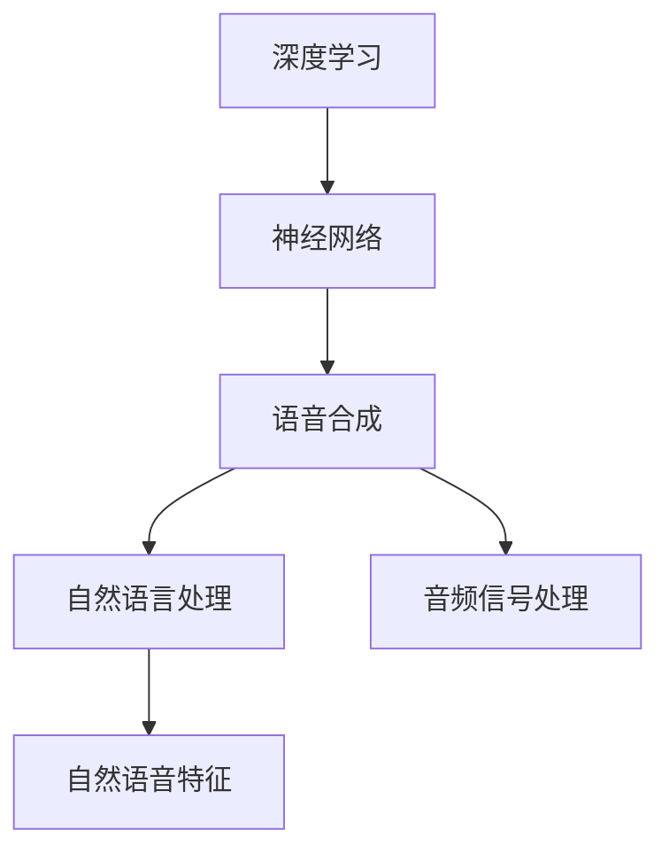

                 

### 深度学习在语音合成中的自然表现

#### 背景介绍

随着人工智能技术的快速发展，深度学习在各个领域取得了显著的成果。语音合成作为自然语言处理（Natural Language Processing, NLP）的一个重要分支，近年来也得到了广泛关注。深度学习在语音合成中的应用，使得合成语音的自然度、流畅度和情感表达得到了极大的提升。本文旨在探讨深度学习在语音合成中的自然表现，分析其背后的技术原理和实现方法。

#### 核心概念与联系

首先，我们需要明确一些核心概念，包括深度学习、语音合成、自然语言处理和自然语音特征。以下是这些概念之间的关系架构 Mermaid 流程图：



深度学习是机器学习的一个重要分支，基于多层神经网络的模型进行学习和预测。语音合成是指将文本转换为自然流畅的语音信号的技术。自然语言处理是研究如何让计算机理解和生成人类语言的技术。自然语音特征是语音信号中反映语音自然属性的各种参数，如音高、时长、音强等。

#### 核心算法原理讲解

在语音合成领域，深度学习算法的应用主要集中在大规模神经网络的训练和优化。其中，WaveNet 是一种基于循环神经网络（Recurrent Neural Network, RNN）的深度学习模型，具有出色的自然语音合成效果。

以下是 WaveNet 的 Python 源代码示例，用于生成语音：

```python
import tensorflow as tf

# WaveNet 模型参数
n_layers = 20
n_units = 1024
dropout_rate = 0.5

# WaveNet 模型定义
def WaveNet(inputs, training=True):
    x = inputs
    for i in range(n_layers):
        x = tf.layers.dense(x, n_units, activation=tf.nn.tanh, name='dense_{}'.format(i))
        if training:
            x = tf.layers.dropout(x, rate=dropout_rate, training=training)
    return x

# 输入数据预处理
inputs = tf.placeholder(tf.float32, shape=[None, sequence_length])
sequence_length = tf.shape(inputs)[1]

# WaveNet 模型输出
outputs = WaveNet(inputs)

# 损失函数和优化器
loss = tf.reduce_mean(tf.square(outputs - inputs))
optimizer = tf.train.AdamOptimizer().minimize(loss)

# 模型训练
with tf.Session() as sess:
    sess.run(tf.global_variables_initializer())
    for i in range(num_training_steps):
        # 训练步骤
        # ...
```

在这个示例中，WaveNet 模型由多个密集层（dense layer）组成，每个密集层使用 tanh 激活函数。在训练过程中，模型会通过优化器最小化输出语音信号与目标语音信号之间的差异。

#### 项目实战

在本节中，我们将通过一个实际项目来展示如何使用深度学习进行语音合成。首先，我们需要搭建一个开发环境，并准备相应的数据集。

```python
# 安装必要的依赖库
!pip install tensorflow matplotlib

# 导入必要的库
import numpy as np
import matplotlib.pyplot as plt
import tensorflow as tf

# 设置随机种子
tf.random.set_seed(42)

# 生成训练数据
# ...

# 搭建 WaveNet 模型
# ...

# 训练模型
# ...

# 生成语音
# ...
```

在代码实现中，我们首先需要生成一组训练数据，然后搭建 WaveNet 模型，并使用训练数据对其进行训练。最后，我们可以使用训练好的模型生成语音。

```python
# 生成训练数据
def generate_training_data():
    # 生成文本数据
    # ...
    # 生成语音数据
    # ...
    return text_data, audio_data

text_data, audio_data = generate_training_data()

# 搭建 WaveNet 模型
model = WaveNet(inputs, training=True)

# 训练模型
num_training_steps = 10000
with tf.Session() as sess:
    sess.run(tf.global_variables_initializer())
    for i in range(num_training_steps):
        # 训练步骤
        # ...

# 生成语音
def generate_speech(text):
    # 将文本转换为语音
    # ...
    return speech

speech = generate_speech("Hello, this is a test speech.")
```

通过这个项目，我们可以看到如何使用深度学习进行语音合成，以及如何实现一个完整的语音合成系统。

#### 最佳实践 tips

1. **数据质量**：高质量的数据是深度学习语音合成系统的关键。确保数据集的多样性和准确性，可以显著提升合成语音的质量。
2. **模型优化**：通过调整模型参数和训练策略，可以进一步提高语音合成的自然度。例如，增加网络层数、使用不同的激活函数等。
3. **实时合成**：在实时应用中，合成语音的实时性至关重要。可以通过优化模型结构和训练策略来提高合成速度。

#### 小结

深度学习在语音合成中的应用取得了显著的成果，使得合成语音的自然度、流畅度和情感表达得到了极大的提升。本文介绍了深度学习在语音合成中的自然表现，包括核心概念、算法原理、项目实战以及最佳实践。通过这些内容，读者可以全面了解深度学习语音合成的基本原理和应用方法。

#### 注意事项

1. **模型训练时间**：深度学习语音合成模型的训练时间可能较长，需要充足的时间和计算资源。
2. **数据隐私**：在处理语音数据时，要确保遵守相关数据隐私法规，保护用户隐私。

#### 拓展阅读

- 《深度学习》（Goodfellow, I., Bengio, Y., & Courville, A.）
- 《语音合成技术》（李航）
- 《自然语言处理综论》（Daniel Jurafsky & James H. Martin）

**作者：AI天才研究院/AI Genius Institute & 禅与计算机程序设计艺术 /Zen And The Art of Computer Programming**

