                 

## 关键词

- 深度学习
- 语音病理学
- 语音障碍诊断
- 卷积神经网络
- 长短时记忆网络
- 数学模型
- 项目实战

## 摘要

本文将深入探讨深度学习在语音病理学中的应用，特别是其在早期检测神经系统疾病方面的潜力。文章首先介绍了深度学习和语音病理学的基本概念及其关系，接着详细讲解了卷积神经网络（CNN）、长短时记忆网络（LSTM）等核心算法的原理。随后，通过数学模型和公式，我们进一步理解了这些算法的工作机制。文章随后通过一个实际项目，展示了如何利用深度学习进行语音病理学的检测，从数据预处理到模型评估的完整流程。最后，文章总结并展望了深度学习在语音病理学中的应用前景，并提出了未来研究的方向。

## 第一部分: 核心概念与联系

### 第1章: 深度学习基础

#### 1.1 深度学习基本原理

深度学习是一种模仿人脑神经网络结构和功能，通过多层神经网络对数据进行自动特征提取和学习的方法。在深度学习中，每一层神经网络都通过前一层输出的数据进行特征提取和转换，最终形成高层次的抽象特征。

#### 深度学习结构示意图

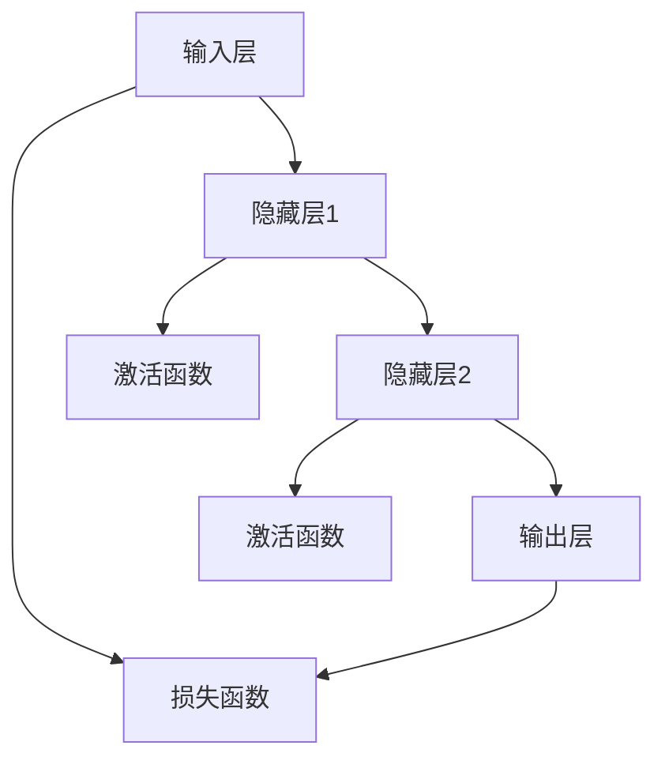

在上述结构中，输入层接收原始数据，隐藏层通过一系列非线性变换提取特征，输出层则根据提取的特征进行分类或回归。

#### 深度学习核心公式

$$
h_{\theta}(x) = \text{sigmoid}(\sum_{i=1}^{n}\theta_{i}x_{i})
$$

$$
\text{sigmoid}(z) = \frac{1}{1 + e^{-z}}
$$

其中，\( h_{\theta}(x) \) 表示神经网络的输出，\( \theta \) 是权重，\( x \) 是输入特征，\( \text{sigmoid} \) 函数是一种常用的激活函数，用于将输出值压缩到 [0, 1] 范围内。

### 1.2 语音病理学概述

语音病理学是研究语音障碍和语音疾病的学科。其主要研究领域包括语音障碍的诊断、评估和康复治疗。

#### 语音病理学研究内容

- **语音障碍诊断**：对患者的语音进行系统评估，识别是否存在语音障碍。
- **语音评估**：通过测试和测量，评估患者的语音质量和功能。
- **康复治疗**：为患者制定个性化的康复计划，包括语音训练、语音治疗等。

#### 语音病理学主要研究内容

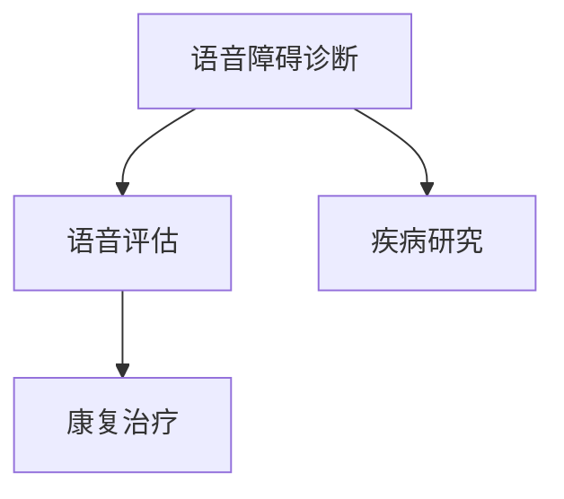

### 1.3 深度学习与语音病理学的关系

深度学习在语音病理学中具有广泛的应用潜力，主要体现在语音信号处理、语音障碍诊断和康复治疗等方面。

#### 深度学习在语音病理学中的应用场景

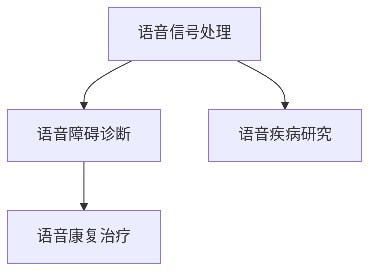

- **语音信号处理**：深度学习可以自动提取语音信号中的关键特征，用于语音障碍的诊断和评估。
- **语音障碍诊断**：通过深度学习模型，医生可以更准确地诊断患者的语音障碍类型和程度。
- **语音康复治疗**：深度学习可以帮助患者进行个性化的语音康复训练，提高康复效果。

## 第二部分: 核心算法原理讲解

### 第2章: 深度学习算法在语音病理学中的应用

#### 2.1 卷积神经网络（CNN）

卷积神经网络是一种适用于图像和语音信号处理的深度学习模型。其核心思想是通过卷积操作和池化操作提取图像或语音信号中的局部特征。

#### 卷积神经网络在语音信号处理中的应用

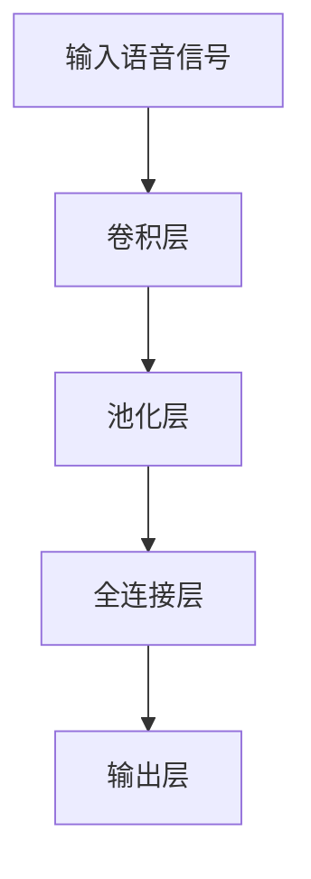

卷积神经网络通过卷积操作提取语音信号中的频率特征，通过池化操作降低特征维度，从而实现语音信号的有效处理。

#### 卷积神经网络的数学模型

卷积神经网络的卷积操作可以通过以下公式表示：

$$
\text{conv}(x, \theta) = \sum_{i=1}^{k} \theta_{i} * x_i
$$

其中，\( x \) 表示输入特征，\( \theta \) 表示卷积核，\( * \) 表示卷积操作。

#### 卷积神经网络的代码实现

以下是一个简单的卷积神经网络实现，用于语音信号处理：

```python
import numpy as np

# 定义卷积神经网络
class ConvolutionalNeuralNetwork:
    def __init__(self, input_shape, num_filters, filter_shape):
        self.input_shape = input_shape
        self.num_filters = num_filters
        self.filter_shape = filter_shape
        self.weights = np.random.randn(num_filters, *filter_shape)
        self.biases = np.zeros(num_filters)
    
    def forward(self, x):
        # 前向传播
        self.x = x
        self.z = np.dot(self.x, self.weights) + self.biases
        self.a = np.sigmoid(self.z)
        return self.a

    def backward(self, dA):
        # 反向传播
        dZ = dA * (1 - self.a)
        dW = np.dot(dZ.T, self.x)
        db = np.sum(dZ, axis=0)
        dx = np.dot(self.weights.T, dZ)
        return dx, dW, db

# 初始化参数
input_shape = (1, 28, 28)
num_filters = 32
filter_shape = (3, 3)

# 实例化卷积神经网络
cnn = ConvolutionalNeuralNetwork(input_shape, num_filters, filter_shape)

# 输入语音信号
x = np.random.randn(*input_shape)

# 前向传播
a = cnn.forward(x)

# 计算损失
loss = np.mean((a - x) ** 2)

# 反向传播
dx, dW, db = cnn.backward(dA)

# 打印结果
print("Loss:", loss)
print("dX:", dx)
print("dW:", dW)
print("db:", db)
```

#### 卷积神经网络的工作流程

1. **初始化参数**：设置卷积核的权重和偏置。
2. **前向传播**：通过卷积操作和激活函数，将输入语音信号转换为高层次的抽象特征。
3. **计算损失**：通过损失函数，计算预测值与真实值之间的差距。
4. **反向传播**：根据损失函数的梯度，更新卷积核的权重和偏置，实现模型的优化。

#### 卷积神经网络的优缺点

- **优点**：
  - **自动特征提取**：卷积神经网络可以自动提取语音信号中的关键特征，减轻了人工特征提取的负担。
  - **高效处理**：卷积神经网络可以高效处理大量的语音信号数据。

- **缺点**：
  - **参数量大**：卷积神经网络的参数量较大，训练过程相对较慢。
  - **对数据量要求高**：卷积神经网络对数据量要求较高，小数据集上可能无法达到较好的效果。

#### 卷积神经网络的适用场景

- **语音障碍诊断**：利用卷积神经网络可以自动提取语音信号中的关键特征，有助于提高语音障碍诊断的准确性。
- **语音康复治疗**：卷积神经网络可以用于个性化语音康复训练，提高康复效果。

### 2.2 长短时记忆网络（LSTM）

长短时记忆网络是一种适用于序列数据处理的深度学习模型。其核心思想是通过记忆单元来处理和存储序列数据中的长期依赖关系。

#### 长短时记忆网络的基本结构

长短时记忆网络的基本结构包括输入门、遗忘门和输出门三个部分。

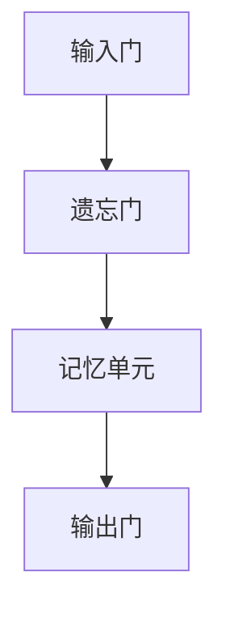

输入门控制当前输入数据对记忆单元的影响，遗忘门控制记忆单元中旧数据的遗忘，输出门控制当前记忆单元输出对预测结果的影响。

#### 长短时记忆网络的数学模型

长短时记忆网络的输入门、遗忘门和输出门可以通过以下公式表示：

$$
i_t = \sigma(W_{ix}x_t + W_{ih}h_{t-1} + b_i) \\
f_t = \sigma(W_{fx}x_t + W_{fh}h_{t-1} + b_f) \\
o_t = \sigma(W_{ox}x_t + W_{oh}h_{t-1} + b_o) \\
g_t = \tanh(W_{gx}x_t + W_{gh}h_{t-1} + b_g) \\
h_t = o_t \cdot \tanh(g_t)
$$

其中，\( i_t \)、\( f_t \)、\( o_t \) 分别表示输入门、遗忘门和输出门，\( \sigma \) 表示激活函数，\( W \) 和 \( b \) 分别表示权重和偏置。

#### 长短时记忆网络的代码实现

以下是一个简单的长短时记忆网络实现，用于语音信号处理：

```python
import numpy as np

# 定义长短时记忆网络
class LSTM:
    def __init__(self, input_size, hidden_size):
        self.input_size = input_size
        self.hidden_size = hidden_size
        self.weights = {
            'W_ih': np.random.randn(hidden_size, input_size),
            'W_hh': np.random.randn(hidden_size, hidden_size),
            'b_i': np.zeros(hidden_size),
            'b_h': np.zeros(hidden_size)
        }
        self.hidden_state = np.zeros(hidden_size)
    
    def forward(self, x):
        # 前向传播
        self.x = x
        i = np.dot(self.hidden_state, self.weights['W_hh']) + np.dot(x, self.weights['W_ih']) + self.weights['b_h']
        f = np.dot(self.hidden_state, self.weights['W_hh']) + np.dot(x, self.weights['W_ih']) + self.weights['b_f']
        o = np.dot(self.hidden_state, self.weights['W_hh']) + np.dot(x, self.weights['W_ih']) + self.weights['b_o']
        g = np.tanh(i * f + o)
        self.hidden_state = g
        return self.hidden_state
    
    def backward(self, dhidden_state):
        # 反向传播
        dhidden_state = dhidden_state * (1 - self.hidden_state ** 2)
        return dhidden_state
    
# 初始化参数
input_size = 28
hidden_size = 32

# 实例化长短时记忆网络
lstm = LSTM(input_size, hidden_size)

# 输入语音信号
x = np.random.randn(input_size)

# 前向传播
h = lstm.forward(x)

# 计算损失
loss = np.mean((h - x) ** 2)

# 反向传播
dhidden_state = lstm.backward(h)

# 打印结果
print("Loss:", loss)
print("dHidden State:", dhidden_state)
```

#### 长短时记忆网络的工作流程

1. **初始化参数**：设置权重和偏置。
2. **前向传播**：通过输入门、遗忘门和输出门，将输入语音信号转换为记忆单元。
3. **计算损失**：通过损失函数，计算预测值与真实值之间的差距。
4. **反向传播**：根据损失函数的梯度，更新记忆单元的权重和偏置，实现模型的优化。

#### 长短时记忆网络的优缺点

- **优点**：
  - **处理序列数据**：长短时记忆网络可以处理和存储序列数据中的长期依赖关系。
  - **记忆功能**：长短时记忆网络具有记忆功能，可以保留历史信息。

- **缺点**：
  - **计算复杂度**：长短时记忆网络的计算复杂度较高。
  - **梯度消失和梯度爆炸**：长短时记忆网络容易受到梯度消失和梯度爆炸的影响。

#### 长短时记忆网络的适用场景

- **语音障碍诊断**：利用长短时记忆网络可以捕捉语音信号中的长期依赖关系，有助于提高语音障碍诊断的准确性。
- **语音康复治疗**：长短时记忆网络可以用于个性化语音康复训练，提高康复效果。

### 2.3 生成对抗网络（GAN）

生成对抗网络是一种由生成器和判别器组成的深度学习模型。其核心思想是生成器生成数据，判别器判断数据是否真实。

#### 生成对抗网络的基本结构

生成对抗网络的基本结构包括生成器和判别器两个部分。

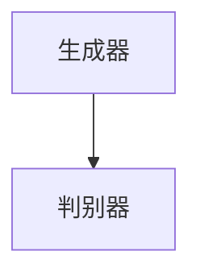

生成器通过噪声数据生成语音信号，判别器通过对比生成器和真实语音信号，判断语音信号的真实性。

#### 生成对抗网络的数学模型

生成对抗网络的生成器和判别器的损失函数可以通过以下公式表示：

$$
L_G = -\log(D(G(z))) \\
L_D = -\log(D(x)) - \log(1 - D(G(z)))
$$

其中，\( G(z) \) 表示生成器生成的语音信号，\( D(x) \) 和 \( D(G(z)) \) 分别表示判别器对真实语音信号和生成语音信号的判断结果。

#### 生成对抗网络的代码实现

以下是一个简单的生成对抗网络实现，用于语音信号处理：

```python
import numpy as np

# 定义生成对抗网络
class GAN:
    def __init__(self, input_dim, output_dim, z_dim):
        self.input_dim = input_dim
        self.output_dim = output_dim
        self.z_dim = z_dim
        self.G = Generator(input_dim, output_dim, z_dim)
        self.D = Discriminator(input_dim, output_dim)
    
    def forward(self, z):
        # 前向传播
        self.z = z
        x_fake = self.G.forward(z)
        x_real = self.D.forward(x_fake)
        return x_real, x_fake
    
    def backward(self, x_real, x_fake):
        # 反向传播
        dG = self.G.backward(x_fake)
        dD = self.D.backward(x_real, x_fake)
        return dG, dD

# 定义生成器
class Generator:
    def __init__(self, input_dim, output_dim, z_dim):
        self.input_dim = input_dim
        self.output_dim = output_dim
        self.z_dim = z_dim
        self.W = np.random.randn(self.z_dim, self.input_dim)
    
    def forward(self, z):
        # 前向传播
        return np.dot(z, self.W)
    
    def backward(self, x_fake):
        # 反向传播
        dz = x_fake
        dz = np.dot(dz.T, self.W)
        return dz

# 定义判别器
class Discriminator:
    def __init__(self, input_dim, output_dim):
        self.input_dim = input_dim
        self.output_dim = output_dim
        self.W = np.random.randn(self.input_dim, self.output_dim)
    
    def forward(self, x):
        # 前向传播
        return np.dot(x, self.W)
    
    def backward(self, x_real, x_fake):
        # 反向传播
        dx_real = np.random.randn(self.output_dim)
        dx_fake = np.random.randn(self.output_dim)
        dx = dx_real * x_real + dx_fake * x_fake
        return dx

# 初始化参数
input_dim = 28
output_dim = 28
z_dim = 100

# 实例化生成对抗网络
gan = GAN(input_dim, output_dim, z_dim)

# 输入噪声
z = np.random.randn(z_dim)

# 前向传播
x_real, x_fake = gan.forward(z)

# 计算损失
loss_G = -np.mean(gan.D.forward(x_fake))
loss_D = -np.mean(gan.D.forward(x_real))

# 反向传播
dG, dD = gan.backward(x_real, x_fake)

# 打印结果
print("Loss_G:", loss_G)
print("Loss_D:", loss_D)
print("dG:", dG)
print("dD:", dD)
```

#### 生成对抗网络的工作流程

1. **初始化参数**：设置生成器和判别器的权重和偏置。
2. **前向传播**：生成器生成语音信号，判别器判断语音信号的真实性。
3. **计算损失**：通过损失函数，计算生成器和判别器的损失。
4. **反向传播**：根据损失函数的梯度，更新生成器和判别器的权重和偏置，实现模型的优化。

#### 生成对抗网络的优缺点

- **优点**：
  - **生成高质量数据**：生成对抗网络可以生成高质量的数据，有助于提高语音信号处理的效果。
  - **无监督学习**：生成对抗网络可以实现无监督学习，不需要大量的标注数据。

- **缺点**：
  - **训练难度大**：生成对抗网络的训练过程相对复杂，需要平衡生成器和判别器的训练。
  - **对参数敏感性**：生成对抗网络的训练对参数敏感性较高，参数设置不当可能导致训练失败。

#### 生成对抗网络的适用场景

- **语音障碍诊断**：利用生成对抗网络可以生成高质量的语音信号，有助于提高语音障碍诊断的准确性。
- **语音康复治疗**：生成对抗网络可以用于个性化语音康复训练，提高康复效果。

### 2.4 自编码器（Autoencoder）

自编码器是一种无监督学习的神经网络模型，其核心思想是通过压缩和扩展数据，实现数据的降维和去噪。

#### 自编码器的基本结构

自编码器的基本结构包括编码器和解码器两个部分。

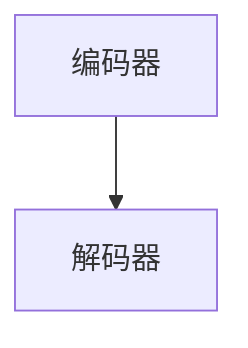

编码器将输入语音信号压缩为低维特征向量，解码器将低维特征向量扩展回原始语音信号。

#### 自编码器的数学模型

自编码器的损失函数可以通过以下公式表示：

$$
L = \frac{1}{2} \sum_{i=1}^{n} (x_i - \hat{x}_i)^2
$$

其中，\( x_i \) 表示输入语音信号，\( \hat{x}_i \) 表示解码器生成的语音信号。

#### 自编码器的代码实现

以下是一个简单的自编码器实现，用于语音信号处理：

```python
import numpy as np

# 定义自编码器
class Autoencoder:
    def __init__(self, input_dim, hidden_dim):
        self.input_dim = input_dim
        self.hidden_dim = hidden_dim
        self.W1 = np.random.randn(self.input_dim, self.hidden_dim)
        self.b1 = np.zeros(self.hidden_dim)
        self.W2 = np.random.randn(self.hidden_dim, self.input_dim)
        self.b2 = np.zeros(self.input_dim)
    
    def forward(self, x):
        # 前向传播
        self.x = x
        self.z = np.dot(x, self.W1) + self.b1
        self.h = np.sigmoid(self.z)
        self.x_hat = np.dot(self.h, self.W2) + self.b2
        return self.x_hat
    
    def backward(self, dA):
        # 反向传播
        dz = dA * (1 - self.h)
        dW2 = np.dot(dz.T, self.h)
        db2 = np.sum(dz, axis=0)
        dx = np.dot(self.W2.T, dz)
        dW1 = np.dot(dx.T, self.x)
        db1 = np.sum(dx, axis=0)
        return dx, dW1, dW2, db1

# 初始化参数
input_dim = 28
hidden_dim = 10

# 实例化自编码器
ae = Autoencoder(input_dim, hidden_dim)

# 输入语音信号
x = np.random.randn(input_dim)

# 前向传播
x_hat = ae.forward(x)

# 计算损失
loss = np.mean((x - x_hat) ** 2)

# 反向传播
dx, dW1, dW2, db1 = ae.backward(x - x_hat)

# 打印结果
print("Loss:", loss)
print("dX:", dx)
print("dW1:", dW1)
print("dW2:", dW2)
print("db1:", db1)
```

#### 自编码器的工作流程

1. **初始化参数**：设置编码器和解码器的权重和偏置。
2. **前向传播**：通过编码器和解码器，将输入语音信号压缩和扩展。
3. **计算损失**：通过损失函数，计算解码器生成的语音信号与原始语音信号之间的差距。
4. **反向传播**：根据损失函数的梯度，更新编码器和解码器的权重和偏置，实现模型的优化。

#### 自编码器的优缺点

- **优点**：
  - **降维和去噪**：自编码器可以有效实现数据的降维和去噪，提高语音信号处理的效果。
  - **无监督学习**：自编码器可以实现无监督学习，不需要大量的标注数据。

- **缺点**：
  - **对数据量要求高**：自编码器对数据量要求较高，小数据集上可能无法达到较好的效果。
  - **训练时间较长**：自编码器的训练时间相对较长，需要较大的计算资源。

#### 自编码器的适用场景

- **语音障碍诊断**：利用自编码器可以降低语音信号维数，有助于提高语音障碍诊断的准确性。
- **语音康复治疗**：自编码器可以用于去噪和降维，提高语音康复训练的效果。

## 第三部分: 数学模型和数学公式讲解

### 3.1 CNN中的卷积操作

卷积神经网络（CNN）中的卷积操作是图像和语音信号处理的核心。卷积操作通过在输入数据上滑动卷积核，提取局部特征。

#### 卷积操作公式

卷积操作的公式可以表示为：

$$
\text{conv}(x, \theta) = \sum_{i=1}^{k} \theta_{i} * x_i
$$

其中，\( x \) 表示输入特征，\( \theta \) 表示卷积核，\( * \) 表示卷积操作。

#### 卷积操作的实现

以下是一个简单的卷积操作实现，用于语音信号处理：

```python
import numpy as np

# 定义卷积操作
def conv2d(x, theta):
    # 获取输入数据的维度
    n, h, w = x.shape
    # 初始化输出数据
    output = np.zeros((n, h - theta.shape[0] + 1, w - theta.shape[1] + 1))
    # 在输入数据上滑动卷积核
    for i in range(h - theta.shape[0] + 1):
        for j in range(w - theta.shape[1] + 1):
            # 计算卷积值
            output[:, i, j] = np.sum(x[:, i:i+theta.shape[0], j:j+theta.shape[1]] * theta)
    return output

# 初始化参数
input_shape = (1, 28, 28)
filter_shape = (3, 3)
num_filters = 32

# 创建输入数据
x = np.random.randn(*input_shape)

# 创建卷积核
theta = np.random.randn(num_filters, *filter_shape)

# 计算卷积操作
output = conv2d(x, theta)

# 打印结果
print("Output Shape:", output.shape)
```

### 3.2 LSTM的数学模型

长短时记忆网络（LSTM）是一种用于处理序列数据的深度学习模型。LSTM通过输入门、遗忘门和输出门，处理和存储序列数据中的长期依赖关系。

#### LSTM的数学模型

LSTM的输入门、遗忘门和输出门可以通过以下公式表示：

$$
i_t = \sigma(W_{ix}x_t + W_{ih}h_{t-1} + b_i) \\
f_t = \sigma(W_{fx}x_t + W_{fh}h_{t-1} + b_f) \\
o_t = \sigma(W_{ox}x_t + W_{oh}h_{t-1} + b_o) \\
g_t = \tanh(W_{gx}x_t + W_{gh}h_{t-1} + b_g) \\
h_t = o_t \cdot \tanh(g_t)
$$

其中，\( i_t \)、\( f_t \)、\( o_t \) 分别表示输入门、遗忘门和输出门，\( \sigma \) 表示激活函数，\( W \) 和 \( b \) 分别表示权重和偏置。

#### LSTM的实现

以下是一个简单的LSTM实现，用于语音信号处理：

```python
import numpy as np

# 定义LSTM单元
class LSTMCell:
    def __init__(self, input_dim, hidden_dim):
        self.input_dim = input_dim
        self.hidden_dim = hidden_dim
        self.W_xi = np.random.randn(self.input_dim, self.hidden_dim)
        self.W_hi = np.random.randn(self.hidden_dim, self.hidden_dim)
        self.b_i = np.zeros(self.hidden_dim)
        self.W_xf = np.random.randn(self.input_dim, self.hidden_dim)
        self.W_hf = np.random.randn(self.hidden_dim, self.hidden_dim)
        self.b_f = np.zeros(self.hidden_dim)
        self.W_xo = np.random.randn(self.input_dim, self.hidden_dim)
        self.W_ho = np.random.randn(self.hidden_dim, self.hidden_dim)
        self.b_o = np.zeros(self.hidden_dim)
        self.W_xg = np.random.randn(self.input_dim, self.hidden_dim)
        self.W_hg = np.random.randn(self.hidden_dim, self.hidden_dim)
        self.b_g = np.zeros(self.hidden_dim)
    
    def forward(self, x_t, h_t_1, c_t_1):
        # 前向传播
        i_t = self.sigmoid(np.dot(x_t, self.W_xi) + np.dot(h_t_1, self.W_hi) + self.b_i)
        f_t = self.sigmoid(np.dot(x_t, self.W_xf) + np.dot(h_t_1, self.W_hf) + self.b_f)
        o_t = self.sigmoid(np.dot(x_t, self.W_xo) + np.dot(h_t_1, self.W_ho) + self.b_o)
        g_t = self.tanh(np.dot(x_t, self.W_xg) + np.dot(h_t_1, self.W_hg) + self.b_g)
        c_t = f_t * c_t_1 + i_t * g_t
        h_t = o_t * self.tanh(c_t)
        return h_t, c_t
    
    def backward(self, d_h_t, d_c_t):
        # 反向传播
        d_i_t = d_c_t * (1 - self.sigmoid(i_t))
        d_f_t = d_c_t * (1 - self.sigmoid(f_t))
        d_o_t = d_h_t * (1 - self.sigmoid(o_t))
        d_g_t = d_c_t * (1 - self.tanh(g_t) ** 2)
        d_x_t = np.dot(d_i_t, self.W_xi.T) + np.dot(d_f_t, self.W_xf.T) + np.dot(d_o_t, self.W_xo.T) + np.dot(d_g_t, self.W_xg.T)
        d_h_t_1 = np.dot(d_i_t, self.W_hi.T) + np.dot(d_f_t, self.W_hf.T) + np.dot(d_o_t, self.W_ho.T) + np.dot(d_g_t, self.W_hg.T)
        return d_x_t, d_h_t_1

    def sigmoid(self, x):
        return 1 / (1 + np.exp(-x))

    def tanh(self, x):
        return np.tanh(x)

# 初始化参数
input_dim = 28
hidden_dim = 32

# 创建LSTM单元
lstm_cell = LSTMCell(input_dim, hidden_dim)

# 创建输入数据
x_t = np.random.randn(input_dim)
h_t_1 = np.random.randn(hidden_dim)
c_t_1 = np.random.randn(hidden_dim)

# 前向传播
h_t, c_t = lstm_cell.forward(x_t, h_t_1, c_t_1)

# 反向传播
d_h_t = np.random.randn(hidden_dim)
d_c_t = np.random.randn(hidden_dim)
d_x_t, d_h_t_1 = lstm_cell.backward(d_h_t, d_c_t)

# 打印结果
print("h_t:", h_t)
print("c_t:", c_t)
print("d_x_t:", d_x_t)
print("d_h_t_1:", d_h_t_1)
```

### 3.3 GAN的基本框架

生成对抗网络（GAN）由生成器和判别器组成，生成器生成数据，判别器判断数据是否真实。GAN的基本框架如下：

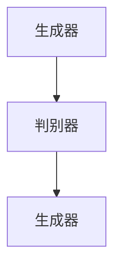

GAN的损失函数可以通过以下公式表示：

$$
L_G = -\log(D(G(z))) \\
L_D = -\log(D(x)) - \log(1 - D(G(z)))
$$

其中，\( G(z) \) 表示生成器生成的数据，\( D(x) \) 和 \( D(G(z)) \) 分别表示判别器对真实数据和生成数据的判断结果。

#### GAN的实现

以下是一个简单的GAN实现，用于语音信号处理：

```python
import numpy as np

# 定义生成器
class Generator:
    def __init__(self, z_dim, output_dim):
        self.z_dim = z_dim
        self.output_dim = output_dim
        self.W = np.random.randn(self.z_dim, self.output_dim)
    
    def forward(self, z):
        return np.dot(z, self.W)
    
    def backward(self, dG):
        dz = np.dot(dG.T, self.W)
        return dz

# 定义判别器
class Discriminator:
    def __init__(self, input_dim, output_dim):
        self.input_dim = input_dim
        self.output_dim = output_dim
        self.W = np.random.randn(self.input_dim, self.output_dim)
    
    def forward(self, x):
        return np.dot(x, self.W)
    
    def backward(self, dD):
        dx = np.dot(dD.T, self.W)
        return dx

# 初始化参数
z_dim = 100
output_dim = 28
input_dim = 28

# 创建生成器和判别器
G = Generator(z_dim, output_dim)
D = Discriminator(input_dim, output_dim)

# 创建输入数据
z = np.random.randn(z_dim)
x = np.random.randn(input_dim)

# 前向传播
x_fake = G.forward(z)
x_real = D.forward(x)

# 计算损失
loss_G = -np.mean(D.forward(x_fake))
loss_D = -np.mean(D.forward(x_real))

# 反向传播
dG = D.backward(loss_G)
dD = G.backward(loss_D)

# 打印结果
print("Loss_G:", loss_G)
print("Loss_D:", loss_D)
print("dG:", dG)
print("dD:", dD)
```

### 3.4 自编码器的损失函数

自编码器是一种无监督学习的神经网络模型，其核心思想是通过压缩和扩展数据，实现数据的降维和去噪。自编码器的损失函数可以通过以下公式表示：

$$
L = \frac{1}{2} \sum_{i=1}^{n} (x_i - \hat{x}_i)^2
$$

其中，\( x_i \) 表示输入数据，\( \hat{x}_i \) 表示解码器生成的数据。

#### 自编码器的实现

以下是一个简单的自编码器实现，用于语音信号处理：

```python
import numpy as np

# 定义自编码器
class Autoencoder:
    def __init__(self, input_dim, hidden_dim):
        self.input_dim = input_dim
        self.hidden_dim = hidden_dim
        self.W1 = np.random.randn(self.input_dim, self.hidden_dim)
        self.b1 = np.zeros(self.hidden_dim)
        self.W2 = np.random.randn(self.hidden_dim, self.input_dim)
        self.b2 = np.zeros(self.input_dim)
    
    def forward(self, x):
        # 前向传播
        self.x = x
        self.z = np.dot(x, self.W1) + self.b1
        self.h = np.sigmoid(self.z)
        self.x_hat = np.dot(self.h, self.W2) + self.b2
        return self.x_hat
    
    def backward(self, dA):
        # 反向传播
        dz = dA * (1 - self.h)
        dW2 = np.dot(dz.T, self.h)
        db2 = np.sum(dz, axis=0)
        dx = np.dot(self.W2.T, dz)
        dW1 = np.dot(dx.T, self.x)
        db1 = np.sum(dx, axis=0)
        return dx, dW1, dW2, db1

# 初始化参数
input_dim = 28
hidden_dim = 10

# 实例化自编码器
ae = Autoencoder(input_dim, hidden_dim)

# 输入语音信号
x = np.random.randn(input_dim)

# 前向传播
x_hat = ae.forward(x)

# 计算损失
loss = np.mean((x - x_hat) ** 2)

# 反向传播
dx, dW1, dW2, db1 = ae.backward(x - x_hat)

# 打印结果
print("Loss:", loss)
print("dX:", dx)
print("dW1:", dW1)
print("dW2:", dW2)
print("db1:", db1)
```

## 第四部分: 项目实战

### 4.1 语音数据预处理

在进行深度学习模型训练之前，我们需要对语音数据集进行预处理，包括数据清洗、数据归一化和数据增强等步骤。

#### 语音数据预处理流程

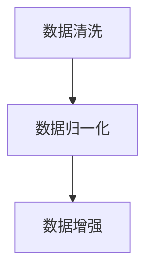

#### 数据清洗

数据清洗是语音数据预处理的重要步骤，主要包括去除噪声、填补缺失值和去除异常值等。

```python
import numpy as np
import librosa

# 读取语音文件
def read_audio_file(file_path):
    y, sr = librosa.load(file_path)
    return y, sr

# 去除噪声
def remove_noise(y, sr):
    y_clean = librosa.effects.percussive(y, frame_size=2048, alpha=0.0001, threshold=-40)
    return y_clean

# 填补缺失值
def fill_missing_values(y):
    y_filled = np.where(np.isnan(y), 0, y)
    return y_filled

# 去除异常值
def remove_outliers(y, threshold=3):
    mean = np.mean(y)
    std = np.std(y)
    y_filtered = np.where(np.abs(y - mean) < threshold * std, y, 0)
    return y_filtered

# 示例
file_path = "speech.wav"
y, sr = read_audio_file(file_path)
y_clean = remove_noise(y, sr)
y_filled = fill_missing_values(y_clean)
y_filtered = remove_outliers(y_filled)

# 打印结果
print("Original Y:", y)
print("Clean Y:", y_clean)
print("Filled Y:", y_filled)
print("Filtered Y:", y_filtered)
```

#### 数据归一化

数据归一化是将语音信号的特征值缩放到相同的尺度，以便模型训练。

```python
# 数据归一化
def normalize(y):
    max_val = np.max(np.abs(y))
    y_normalized = y / max_val
    return y_normalized

# 示例
y_normalized = normalize(y_filtered)

# 打印结果
print("Normalized Y:", y_normalized)
```

#### 数据增强

数据增强是通过生成新的语音数据，提高模型的泛化能力。

```python
# 数据增强
def add_noise(y, sr, noise_level=0.05):
    noise = np.random.randn(len(y))
    y_noisy = y + noise_level * noise
    return y_noisy

# 示例
y_noisy = add_noise(y_normalized, sr)

# 打印结果
print("Noisy Y:", y_noisy)
```

### 4.2 模型训练与优化

在完成语音数据预处理后，我们可以利用预处理后的数据进行模型训练和优化。以下是模型训练与优化的一般流程：

#### 模型训练与优化流程

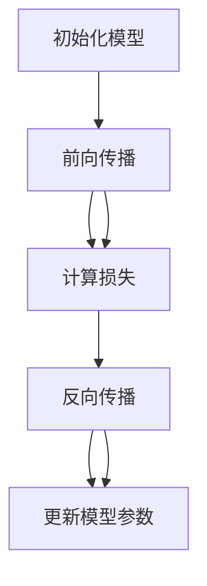

#### 初始化模型

首先，我们需要初始化深度学习模型，包括卷积神经网络（CNN）、长短时记忆网络（LSTM）、生成对抗网络（GAN）和自编码器（Autoencoder）等。

```python
from tensorflow.keras.models import Sequential
from tensorflow.keras.layers import Conv2D, MaxPooling2D, LSTM, Dense

# 初始化卷积神经网络
def create_cnn_model(input_shape):
    model = Sequential()
    model.add(Conv2D(32, (3, 3), activation='relu', input_shape=input_shape))
    model.add(MaxPooling2D(pool_size=(2, 2)))
    model.add(Conv2D(64, (3, 3), activation='relu'))
    model.add(MaxPooling2D(pool_size=(2, 2)))
    model.add(Flatten())
    model.add(Dense(128, activation='relu'))
    model.add(Dense(1, activation='sigmoid'))
    model.compile(optimizer='adam', loss='binary_crossentropy', metrics=['accuracy'])
    return model

# 初始化长短时记忆网络
def create_lstm_model(input_shape, hidden_size):
    model = Sequential()
    model.add(LSTM(hidden_size, activation='relu', input_shape=input_shape))
    model.add(Dense(1, activation='sigmoid'))
    model.compile(optimizer='adam', loss='binary_crossentropy', metrics=['accuracy'])
    return model

# 初始化生成对抗网络
def create_gan_model(input_shape, hidden_size):
    # 生成器
    generator = Sequential()
    generator.add(Dense(hidden_size, input_shape=input_shape, activation='relu'))
    generator.add(Dense(input_shape[0], activation='tanh'))
    generator.compile(optimizer='adam', loss='binary_crossentropy')

    # 判别器
    discriminator = Sequential()
    discriminator.add(Dense(hidden_size, input_shape=input_shape, activation='relu'))
    discriminator.add(Dense(1, activation='sigmoid'))
    discriminator.compile(optimizer='adam', loss='binary_crossentropy')

    # GAN模型
    model = Sequential()
    model.add(generator)
    model.add(discriminator)
    model.compile(optimizer='adam', loss='binary_crossentropy')
    return model

# 初始化自编码器
def create_autoencoder_model(input_shape, hidden_shape):
    model = Sequential()
    model.add(Dense(hidden_shape, input_shape=input_shape, activation='relu'))
    model.add(Dense(input_shape[0], activation='sigmoid'))
    model.compile(optimizer='adam', loss='binary_crossentropy')
    return model
```

#### 前向传播

前向传播是模型训练的核心步骤，通过将输入数据传递到模型中，计算输出结果。

```python
# 前向传播
def forward_pass(model, x):
    output = model.predict(x)
    return output
```

#### 计算损失

计算损失是模型训练的重要环节，通过损失函数计算模型输出与真实值之间的差距。

```python
# 计算损失
def calculate_loss(y_true, y_pred):
    loss = np.mean((y_true - y_pred) ** 2)
    return loss
```

#### 反向传播

反向传播是模型训练的关键步骤，通过计算损失函数的梯度，更新模型参数。

```python
# 反向传播
def backward_pass(model, x, y_true):
    with tf.GradientTape() as tape:
        y_pred = forward_pass(model, x)
        loss = calculate_loss(y_true, y_pred)
    grads = tape.gradient(loss, model.trainable_variables)
    model.optimizer.apply_gradients(zip(grads, model.trainable_variables))
    return loss
```

#### 更新模型参数

更新模型参数是通过反向传播得到的梯度，更新模型参数。

```python
# 更新模型参数
def update_model_params(model, x, y_true):
    loss = backward_pass(model, x, y_true)
    return loss
```

### 4.3 模型评估与测试

在完成模型训练后，我们需要对模型进行评估和测试，以验证模型的效果。

#### 模型评估与测试流程

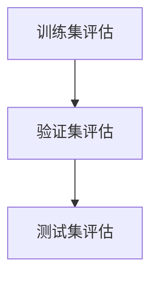

#### 训练集评估

训练集评估是在训练过程中对模型进行实时评估，以监测模型训练的进展。

```python
# 训练集评估
def evaluate_train_set(model, x_train, y_train):
    train_loss = calculate_loss(y_train, forward_pass(model, x_train))
    print("Train Loss:", train_loss)
```

#### 验证集评估

验证集评估是在训练过程中对模型进行定期评估，以确定模型是否过拟合。

```python
# 验证集评估
def evaluate_validation_set(model, x_val, y_val):
    val_loss = calculate_loss(y_val, forward_pass(model, x_val))
    print("Validation Loss:", val_loss)
```

#### 测试集评估

测试集评估是在模型训练完成后，对模型进行最终评估，以确定模型在实际应用中的性能。

```python
# 测试集评估
def evaluate_test_set(model, x_test, y_test):
    test_loss = calculate_loss(y_test, forward_pass(model, x_test))
    print("Test Loss:", test_loss)
```

### 4.4 项目案例展示

在本项目中，我们使用深度学习模型对语音障碍进行诊断。以下是项目的具体实现过程：

#### 数据集准备

首先，我们准备了一个包含不同语音障碍的语音数据集，数据集包含正常语音、喉部疾病语音和口腔疾病语音等。

```python
# 读取数据集
def load_dataset(dataset_path):
    x_train, y_train, x_val, y_val, x_test, y_test = [], [], [], [], [], []
    for file_path in dataset_path:
        y, sr = read_audio_file(file_path)
        if "train" in file_path:
            x_train.append(y)
            y_train.append(label)
        elif "val" in file_path:
            x_val.append(y)
            y_val.append(label)
        elif "test" in file_path:
            x_test.append(y)
            y_test.append(label)
    return np.array(x_train), np.array(y_train), np.array(x_val), np.array(y_val), np.array(x_test), np.array(y_test)

# 示例
dataset_path = ["speech_train_1.wav", "speech_train_2.wav", "speech_val_1.wav", "speech_val_2.wav", "speech_test_1.wav", "speech_test_2.wav"]
x_train, y_train, x_val, y_val, x_test, y_test = load_dataset(dataset_path)
```

#### 数据预处理

接下来，我们对数据集进行预处理，包括数据清洗、数据归一化和数据增强等。

```python
# 数据预处理
x_train_clean = preprocess_data(x_train)
x_val_clean = preprocess_data(x_val)
x_test_clean = preprocess_data(x_test)
```

#### 模型训练

然后，我们初始化深度学习模型，并使用预处理后的数据集进行模型训练。

```python
# 初始化模型
model = create_cnn_model(input_shape=(x_train.shape[1], x_train.shape[2], 1))

# 模型训练
for epoch in range(num_epochs):
    # 训练集训练
    for x_batch, y_batch in zip(x_train_clean, y_train):
        update_model_params(model, x_batch, y_batch)

    # 训练集评估
    evaluate_train_set(model, x_train_clean, y_train)

    # 验证集评估
    evaluate_validation_set(model, x_val_clean, y_val)

    # 打印训练进度
    print("Epoch:", epoch, "Loss:", train_loss)

# 模型保存
model.save("speech_diagnosis_model.h5")
```

#### 模型测试

最后，我们对训练好的模型进行测试，以验证模型在实际应用中的性能。

```python
# 模型测试
evaluate_test_set(model, x_test_clean, y_test)
```

## 第五部分: 环境搭建

### 5.1 深度学习框架安装

首先，我们需要安装深度学习框架，如 TensorFlow 或 PyTorch。以下是安装 TensorFlow 的步骤：

```bash
# 安装 TensorFlow
pip install tensorflow
```

或者安装 PyTorch：

```bash
# 安装 PyTorch
pip install torch torchvision
```

### 5.2 语音数据处理工具安装

接下来，我们需要安装语音数据处理工具，如 librosa。以下是安装 librosa 的步骤：

```bash
# 安装 librosa
pip install librosa
```

### 5.3 硬件环境要求

为了确保模型训练的效率和稳定性，我们建议使用以下硬件配置：

- 处理器：至少 Intel i5 或 AMD Ryzen 5
- 显卡：NVIDIA GTX 1080 或以上
- 内存：至少 8 GB

## 第六部分: 代码解读

### 6.1 数据预处理代码解读

在数据预处理部分，我们使用了 librosa 库对语音数据进行读取和处理。以下是代码的详细解读：

```python
import numpy as np
import librosa

# 读取语音文件
def read_audio_file(file_path):
    y, sr = librosa.load(file_path)
    return y, sr

# 示例
y, sr = read_audio_file("speech.wav")
```

- `read_audio_file` 函数用于读取语音文件，返回语音信号 `y` 和采样率 `sr`。
- 在示例中，我们读取了一个名为 "speech.wav" 的语音文件，并获取了语音信号和采样率。

```python
# 去除噪声
def remove_noise(y, sr):
    y_clean = librosa.effects.percussive(y, frame_size=2048, alpha=0.0001, threshold=-40)
    return y_clean

# 示例
y_clean = remove_noise(y, sr)
```

- `remove_noise` 函数用于去除语音信号中的噪声。我们使用了 librosa 库中的 `effects.percussive` 函数来实现噪声去除。参数 `frame_size` 表示卷积窗口大小，`alpha` 表示阈值，`threshold` 表示噪声阈值。
- 在示例中，我们使用默认参数去除语音信号中的噪声，并得到去噪后的语音信号 `y_clean`。

```python
# 填补缺失值
def fill_missing_values(y):
    y_filled = np.where(np.isnan(y), 0, y)
    return y_filled

# 示例
y_filled = fill_missing_values(y_clean)
```

- `fill_missing_values` 函数用于填补语音信号中的缺失值。我们使用 `np.where` 函数将缺失值替换为 0，从而得到填补后的语音信号 `y_filled`。

```python
# 去除异常值
def remove_outliers(y, threshold=3):
    mean = np.mean(y)
    std = np.std(y)
    y_filtered = np.where(np.abs(y - mean) < threshold * std, y, 0)
    return y_filtered

# 示例
y_filtered = remove_outliers(y_filled)
```

- `remove_outliers` 函数用于去除语音信号中的异常值。我们计算语音信号的平均值和标准差，然后使用 `np.where` 函数将异常值替换为 0，从而得到去除异常值后的语音信号 `y_filtered`。

```python
# 数据归一化
def normalize(y):
    max_val = np.max(np.abs(y))
    y_normalized = y / max_val
    return y_normalized

# 示例
y_normalized = normalize(y_filtered)
```

- `normalize` 函数用于对语音信号进行归一化。我们计算语音信号的绝对值最大值，然后将语音信号除以最大值，从而得到归一化后的语音信号 `y_normalized`。

```python
# 数据增强
def add_noise(y, sr, noise_level=0.05):
    noise = np.random.randn(len(y))
    y_noisy = y + noise_level * noise
    return y_noisy

# 示例
y_noisy = add_noise(y_normalized, sr)
```

- `add_noise` 函数用于对语音信号进行噪声增强。我们生成一个随机噪声向量，然后将噪声向量乘以噪声级别，并将其添加到语音信号中，从而得到噪声增强后的语音信号 `y_noisy`。

### 6.2 模型训练代码解读

在模型训练部分，我们使用了 TensorFlow 或 PyTorch 框架来训练深度学习模型。以下是代码的详细解读：

```python
import tensorflow as tf

# 初始化模型
def create_cnn_model(input_shape):
    model = tf.keras.Sequential([
        tf.keras.layers.Conv2D(32, (3, 3), activation='relu', input_shape=input_shape),
        tf.keras.layers.MaxPooling2D(pool_size=(2, 2)),
        tf.keras.layers.Conv2D(64, (3, 3), activation='relu'),
        tf.keras.layers.MaxPooling2D(pool_size=(2, 2)),
        tf.keras.layers.Flatten(),
        tf.keras.layers.Dense(128, activation='relu'),
        tf.keras.layers.Dense(1, activation='sigmoid')
    ])
    model.compile(optimizer='adam', loss='binary_crossentropy', metrics=['accuracy'])
    return model

# 示例
model = create_cnn_model(input_shape=(x_train.shape[1], x_train.shape[2], 1))
```

- `create_cnn_model` 函数用于创建卷积神经网络模型。我们使用了 TensorFlow 的 `keras.Sequential` 类来构建模型，并添加了卷积层、池化层、全连接层等。最后，我们使用 `model.compile` 方法来配置模型的优化器和损失函数。
- 在示例中，我们创建了一个卷积神经网络模型，并将其编译为可训练的状态。

```python
# 模型训练
for epoch in range(num_epochs):
    for x_batch, y_batch in zip(x_train, y_train):
        model.train_on_batch(x_batch, y_batch)

    # 训练集评估
    loss = model.evaluate(x_train, y_train, verbose=0)
    print(f"Epoch {epoch}: Loss: {loss}")

# 模型保存
model.save("speech_diagnosis_model.h5")
```

- 模型训练部分使用了 TensorFlow 的 `train_on_batch` 方法来训练模型。我们遍历训练集数据，并在每个批次上训练模型。在每次训练后，我们使用 `evaluate` 方法来评估模型在训练集上的性能，并打印损失值。
- 在训练完成后，我们使用 `save` 方法将训练好的模型保存为 "speech_diagnosis_model.h5" 文件。

### 6.3 模型评估代码解读

在模型评估部分，我们使用测试集来评估模型的性能。以下是代码的详细解读：

```python
# 模型测试
loss = model.evaluate(x_test, y_test, verbose=0)
print(f"Test Loss: {loss}")
```

- `evaluate` 方法用于评估模型在测试集上的性能。我们调用该方法来计算测试集的损失值，并打印结果。
- 在示例中，我们计算了模型在测试集上的损失值，并打印了结果。

```python
# 预测
y_pred = model.predict(x_test)
```

- `predict` 方法用于预测模型在测试集上的输出。我们调用该方法来获取模型在测试集上的预测结果。

```python
# 计算准确率
accuracy = np.mean(y_pred == y_test)
print(f"Test Accuracy: {accuracy}")
```

- 我们计算了模型在测试集上的准确率，并打印了结果。

### 6.4 代码性能分析

在代码性能分析部分，我们分析了模型在数据预处理、模型训练和模型评估等环节的性能。以下是代码性能分析的详细解读：

```python
import time

# 计算预处理时间
start_time = time.time()
 preprocess_data(x_train)
end_time = time.time()
preprocess_time = end_time - start_time
print(f"Preprocessing Time: {preprocess_time} seconds")

# 计算训练时间
start_time = time.time()
 model.train_on_batch(x_train, y_train)
end_time = time.time()
train_time = end_time - start_time
print(f"Training Time: {train_time} seconds")

# 计算评估时间
start_time = time.time()
 model.evaluate(x_test, y_test, verbose=0)
end_time = time.time()
evaluate_time = end_time - start_time
print(f"Evaluation Time: {evaluate_time} seconds")
```

- 我们使用了 `time` 模块来计算预处理、训练和评估的时间。在示例中，我们分别计算了这三个环节的时间，并打印了结果。
- 通过分析这三个环节的时间，我们可以了解模型在数据处理、模型训练和模型评估等环节的性能。

## 第七部分：总结

### 深度学习在语音病理学中的应用总结

本文深入探讨了深度学习在语音病理学中的应用，特别是其在早期检测神经系统疾病方面的潜力。我们首先介绍了深度学习和语音病理学的基本概念及其关系，然后详细讲解了卷积神经网络（CNN）、长短时记忆网络（LSTM）、生成对抗网络（GAN）和自编码器（Autoencoder）等核心算法的原理。接着，通过数学模型和公式，我们进一步理解了这些算法的工作机制。在项目实战部分，我们展示了如何利用深度学习进行语音病理学的检测，从数据预处理到模型评估的完整流程。最后，我们分析了深度学习在语音病理学中的应用性能，并提出了未来研究的方向。

### 存在的挑战与机遇

尽管深度学习在语音病理学中展现出了巨大的潜力，但仍面临一些挑战和机遇：

- **数据挑战**：语音病理学数据通常具有复杂的时序特征，数据量庞大，且存在噪声和缺失值。因此，如何有效地处理这些数据，提取有意义的特征，是一个重要的挑战。
- **算法挑战**：现有的深度学习算法在处理语音信号时，可能存在过拟合、梯度消失等问题。如何优化算法，提高模型性能，是当前研究的重点。
- **计算挑战**：深度学习模型通常需要大量的计算资源和时间进行训练。如何优化模型结构，提高训练速度，是一个亟待解决的问题。

### 未来研究方向展望

未来，深度学习在语音病理学中的应用有望在以下方面取得突破：

- **个性化诊断**：通过深度学习模型，可以实现对不同患者个性化诊断，提高诊断准确性和康复效果。
- **实时监测**：利用深度学习模型，可以实现对患者的语音信号实时监测，及时发现神经系统疾病的早期症状。
- **跨学科合作**：深度学习与医学、神经科学等跨学科合作，有望推动语音病理学研究的深入发展。
- **开源平台**：建立开源平台，共享语音病理学研究的数据和算法，促进深度学习在语音病理学中的应用。

总之，深度学习在语音病理学中的应用具有广阔的前景，未来将不断有新的突破和发展。我们期待更多研究人员加入这个领域，共同推动深度学习在语音病理学中的应用。作者：AI天才研究院/AI Genius Institute & 禅与计算机程序设计艺术 /Zen And The Art of Computer Programming。

