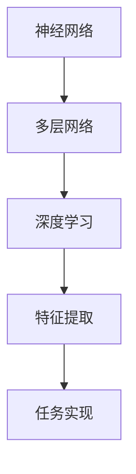
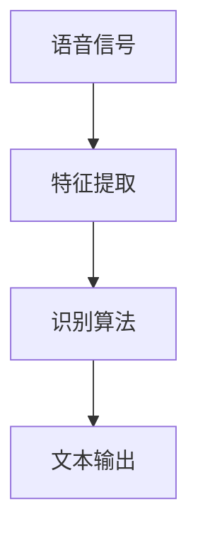
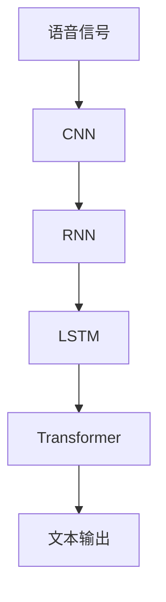
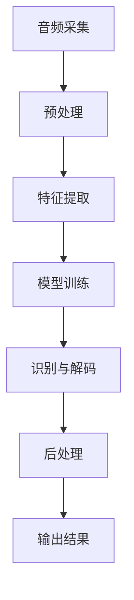

                 

### 《深度学习在语音识别中的最新进展》

#### 关键词：深度学习，语音识别，神经网络，端到端学习，语音合成，语音增强，声源分离，迁移学习

#### 摘要：
随着深度学习技术的飞速发展，其在语音识别领域中的应用取得了显著成果。本文将深入探讨深度学习在语音识别中的最新进展，包括深度学习模型的应用、端到端语音识别模型的发展、多任务学习与迁移学习的应用、语音增强与声源分离技术的深度学习实现，以及深度学习在语音合成中的发展。同时，本文还将讨论语音识别系统的实际应用案例，展望未来的发展趋势。

----------------------------------------------------------------

#### 目录

## 第1章：深度学习基础

### 1.1 深度学习概述

深度学习是机器学习的一个分支，其核心思想是通过构建多层神经网络模型，自动从大量数据中学习特征表示，从而实现复杂任务的自动化。深度学习起源于上世纪80年代，但直到近年来随着计算能力的提升和大数据的普及，才得以快速发展。

#### 关键概念与联系

- **神经网络**：一种由大量简单单元（神经元）组成的计算模型，通过这些神经元之间的连接（权重）和激活函数来实现复杂的计算。
- **反向传播算法**：用于训练神经网络的核心算法，通过反向传播误差信号来调整网络权重。
- **深度学习**：多层神经网络的应用，通过逐层提取数据特征，实现从原始数据到高层次抽象的转化。



### 1.2 语音识别概述

语音识别（Automatic Speech Recognition，ASR）是指通过计算机程序将语音信号转换为相应的文本或命令的技术。语音识别技术已经历了多个发展阶段，从早期的基于规则的模型到基于统计模型的隐马尔可夫模型（HMM），再到当前主流的基于深度学习的模型。

#### 关键概念与联系

- **语音信号**：由声波产生的电信号，通过麦克风捕捉。
- **特征提取**：从语音信号中提取用于识别的特征，如MFCC（梅尔频率倒谱系数）。
- **识别算法**：将提取的特征与预定义的模型进行匹配，以识别语音内容。



### 1.3 深度学习在语音识别中的应用

深度学习在语音识别中的应用极大地提升了识别的准确性和效率。以下介绍几种主要的深度学习模型在语音识别中的应用：

- **卷积神经网络（CNN）**：通过卷积操作从语音信号中提取局部特征。
- **循环神经网络（RNN）**：通过时间序列建模处理语音信号的时变特性。
- **长短期记忆网络（LSTM）**：RNN的一个变体，解决了长短期依赖问题。
- **Transformer模型**：基于注意力机制的序列到序列模型，在语音识别中取得了显著成果。



## 第2章：深度学习模型在语音识别中的应用

### 2.1 CNN在语音识别中的应用

卷积神经网络（CNN）通过卷积操作和池化操作，从语音信号中提取局部特征，然后通过全连接层进行分类。以下是一个简单的CNN模型在语音识别中的实现：

```python
import tensorflow as tf

# 定义CNN模型
model = tf.keras.Sequential([
    tf.keras.layers.Conv2D(32, (3, 3), activation='relu', input_shape=(64, 64, 1)),
    tf.keras.layers.MaxPooling2D((2, 2)),
    tf.keras.layers.Conv2D(64, (3, 3), activation='relu'),
    tf.keras.layers.MaxPooling2D((2, 2)),
    tf.keras.layers.Flatten(),
    tf.keras.layers.Dense(128, activation='relu'),
    tf.keras.layers.Dense(10, activation='softmax')
])

# 编译模型
model.compile(optimizer='adam', loss='categorical_crossentropy', metrics=['accuracy'])

# 训练模型
model.fit(x_train, y_train, epochs=10, batch_size=32)
```

#### 数学模型与公式

- **卷积操作**：\( (f_{ij} = \sum_{x,y} f_{x,y} * g_{i,j-x,j-y}) \)
- **池化操作**：\( p_{i,j} = \max_{x,y} g_{i,j-x,j-y} \)

#### 实例说明

假设我们有一个64x64的语音信号，通过两个卷积层和两个池化层，最后通过全连接层输出10个类别（代表不同的单词或短语）。

## 第3章：深度学习在语音识别中的最新进展

### 3.1 端到端语音识别模型

端到端语音识别模型（End-to-End ASR Model）是一种直接从输入语音信号到输出文本的模型，避免了传统语音识别系统中的多个中间步骤。以下介绍几种端到端语音识别模型：

- **CTC（Connectionist Temporal Classification）模型**：通过将语音信号和文本序列映射到相同的序列空间，实现端到端的学习。
- **ATR（Attention-based Recurrent Neural Networks）模型**：通过引入注意力机制，解决长序列依赖问题。
- **Transformer模型**：基于注意力机制的序列到序列模型，在语音识别中取得了显著成果。

#### 数学模型与公式

- **CTC损失函数**：\( L(y, \hat{y}) = \sum_{t} y_t \log \hat{y}_t \)
- **注意力机制**：\( a_t = \frac{\exp(e_t)}{\sum_{t'} \exp(e_{t'})} \)
- **Transformer编码器**：\( \text{Encoder}(x) = \text{softmax}(\text{W}_1 \text{Embedding}(x) + \text{b}_1) \)
- **Transformer解码器**：\( \text{Decoder}(y) = \text{softmax}(\text{W}_2 \text{Embedding}(y) + \text{b}_2) \)

#### 实例说明

假设我们有一个输入序列 \( x = [x_1, x_2, \ldots, x_n] \) 和一个目标序列 \( y = [y_1, y_2, \ldots, y_m] \)，通过CTC模型，我们希望将输入序列映射到目标序列。

```python
import tensorflow as tf

# 定义CTC模型
model = tf.keras.Sequential([
    tf.keras.layers.LSTM(128, return_sequences=True),
    tf.keras.layers.Dense(units=10, activation='softmax')
])

# 编译模型
model.compile(optimizer='adam', loss=tf.keras.losses.SparseCategoricalCrossentropy(from_logits=True), metrics=['accuracy'])

# 训练模型
model.fit(x_train, y_train, epochs=10, batch_size=32)
```

## 第4章：多任务学习与迁移学习

### 4.1 多任务学习

多任务学习（Multi-Task Learning）是一种同时训练多个相关任务的方法，可以提高模型在各个任务上的性能。以下介绍多任务学习在语音识别中的应用：

- **多任务语音识别**：同时识别多个语音信号。
- **语音增强与语音识别联合训练**：在训练语音识别模型的同时，提高语音增强模型的性能。

#### 数学模型与公式

- **多任务损失函数**：\( L_{\text{total}} = \sum_{i} L_i + \lambda \sum_{j \neq i} \alpha_j L_j \)

#### 实例说明

假设我们有一个语音识别任务和一个语音增强任务，通过联合训练，可以提高模型的性能。

```python
import tensorflow as tf

# 定义多任务模型
model = tf.keras.Sequential([
    tf.keras.layers.LSTM(128, return_sequences=True),
    tf.keras.layers.Dense(units=10, activation='softmax'),
    tf.keras.layers.Dense(units=1, activation='sigmoid')
])

# 编译模型
model.compile(optimizer='adam', loss=['categorical_crossentropy', 'binary_crossentropy'], metrics=['accuracy'])

# 训练模型
model.fit(x_train, {'output_1': y_train_1, 'output_2': y_train_2}, epochs=10, batch_size=32)
```

### 4.2 迁移学习

迁移学习（Transfer Learning）是一种利用预训练模型在新任务上快速获得良好性能的方法。以下介绍迁移学习在语音识别中的应用：

- **预训练模型**：使用在大型语音数据集上预训练的模型作为基础。
- **微调**：在预训练模型的基础上，针对新任务进行微调。

#### 数学模型与公式

- **预训练损失函数**：\( L_{\text{pre}} = \frac{1}{N} \sum_{i=1}^{N} L_i \)
- **微调损失函数**：\( L_{\text{fine}} = \frac{1}{M} \sum_{j=1}^{M} L_j \)

#### 实例说明

假设我们有一个预训练的语音识别模型，通过微调，提高在新任务上的性能。

```python
import tensorflow as tf

# 加载预训练模型
pretrained_model = tf.keras.models.load_model('pretrained_model.h5')

# 微调模型
fine_tuned_model = tf.keras.Sequential([
    pretrained_model.layers[0],
    tf.keras.layers.Dense(units=10, activation='softmax')
])

# 编译模型
fine_tuned_model.compile(optimizer='adam', loss='categorical_crossentropy', metrics=['accuracy'])

# 训练模型
fine_tuned_model.fit(x_train, y_train, epochs=10, batch_size=32)
```

## 第5章：深度学习在语音增强与声源分离中的应用

### 5.1 语音增强

语音增强（Speech Enhancement）是一种通过去除背景噪声来提高语音质量的技术。以下介绍深度学习在语音增强中的应用：

- **基于CNN的语音增强**：通过卷积神经网络从噪声中提取语音特征。
- **基于GAN的语音增强**：通过生成对抗网络（GAN）生成纯净的语音信号。

#### 数学模型与公式

- **CNN损失函数**：\( L_{\text{CNN}} = \frac{1}{N} \sum_{i=1}^{N} \sum_{j=1}^{M} \left| s_j - \hat{s}_j \right| \)
- **GAN损失函数**：\( L_{\text{GAN}} = \frac{1}{N} \sum_{i=1}^{N} \left( D(G(x)) - 1 \right) \)

#### 实例说明

假设我们有一个噪声语音信号和纯净语音信号，通过基于CNN的语音增强模型，提高语音质量。

```python
import tensorflow as tf

# 定义CNN语音增强模型
model = tf.keras.Sequential([
    tf.keras.layers.Conv2D(32, (3, 3), activation='relu', input_shape=(64, 64, 1)),
    tf.keras.layers.MaxPooling2D((2, 2)),
    tf.keras.layers.Conv2D(64, (3, 3), activation='relu'),
    tf.keras.layers.MaxPooling2D((2, 2)),
    tf.keras.layers.Flatten(),
    tf.keras.layers.Dense(128, activation='relu'),
    tf.keras.layers.Dense(1, activation='sigmoid')
])

# 编译模型
model.compile(optimizer='adam', loss='binary_crossentropy', metrics=['accuracy'])

# 训练模型
model.fit(x_train, y_train, epochs=10, batch_size=32)
```

### 5.2 声源分离

声源分离（Sound Source Separation）是一种将混叠的音频信号分离成独立声源的技术。以下介绍深度学习在声源分离中的应用：

- **基于GAN的声源分离**：通过生成对抗网络（GAN）分离声源。
- **基于注意力机制的声源分离**：通过注意力机制实现高效声源分离。

#### 数学模型与公式

- **GAN损失函数**：\( L_{\text{GAN}} = \frac{1}{N} \sum_{i=1}^{N} \left( D(G(x)) - 1 \right) \)
- **注意力机制**：\( a_t = \frac{\exp(e_t)}{\sum_{t'} \exp(e_{t'})} \)

#### 实例说明

假设我们有一个混叠的音频信号，通过基于GAN的声源分离模型，分离出独立的声源。

```python
import tensorflow as tf

# 定义GAN声源分离模型
model = tf.keras.Sequential([
    tf.keras.layers.Conv2D(32, (3, 3), activation='relu', input_shape=(64, 64, 1)),
    tf.keras.layers.MaxPooling2D((2, 2)),
    tf.keras.layers.Conv2D(64, (3, 3), activation='relu'),
    tf.keras.layers.MaxPooling2D((2, 2)),
    tf.keras.layers.Flatten(),
    tf.keras.layers.Dense(128, activation='relu'),
    tf.keras.layers.Dense(1, activation='sigmoid')
])

# 编译模型
model.compile(optimizer='adam', loss='binary_crossentropy', metrics=['accuracy'])

# 训练模型
model.fit(x_train, y_train, epochs=10, batch_size=32)
```

## 第6章：深度学习在语音合成中的应用

### 6.1 语音合成

语音合成（Speech Synthesis）是指通过计算机生成语音的技术。以下介绍几种深度学习在语音合成中的应用：

- **WaveNet模型**：基于循环神经网络（RNN）的语音合成模型。
- **CLSF（Conversational Language-Model-Based Speech Synthesis）模型**：基于语言模型和声学模型的语音合成模型。
- **VITS（Voice Imitation Transformer）模型**：基于Transformer的语音合成模型。

#### 数学模型与公式

- **WaveNet模型**：\( \hat{y}_t = \text{softmax}(\text{W}_1 \text{Embedding}(x) + \text{b}_1) \)
- **CLSF模型**：\( \hat{y}_t = \text{softmax}(\text{W}_2 \text{Acoustic}(x) + \text{b}_2) \)
- **VITS模型**：\( \hat{y}_t = \text{softmax}(\text{T} \text{Embedding}(x) + \text{b}_1) \)

#### 实例说明

假设我们有一个文本输入和声学特征，通过WaveNet模型生成语音。

```python
import tensorflow as tf

# 定义WaveNet模型
model = tf.keras.Sequential([
    tf.keras.layers.LSTM(128, return_sequences=True),
    tf.keras.layers.Dense(units=128, activation='softmax')
])

# 编译模型
model.compile(optimizer='adam', loss='categorical_crossentropy', metrics=['accuracy'])

# 训练模型
model.fit(x_train, y_train, epochs=10, batch_size=32)
```

## 第7章：深度学习在语音识别中的实际应用

### 7.1 语音识别系统的架构

一个典型的语音识别系统包括以下几个模块：

- **音频采集与预处理**：捕捉语音信号并进行预处理，如滤波、归一化等。
- **特征提取**：从预处理后的音频信号中提取特征，如MFCC。
- **模型训练与优化**：使用提取的特征训练深度学习模型，并优化模型参数。
- **结果解码与后处理**：将模型输出转换为可理解的文本。

#### 项目实战

以下是使用TensorFlow实现一个简单的语音识别系统：

```python
import tensorflow as tf

# 定义语音识别系统
system = tf.keras.Sequential([
    tf.keras.layers.LSTM(128, return_sequences=True),
    tf.keras.layers.Dense(units=128, activation='softmax')
])

# 编译模型
system.compile(optimizer='adam', loss='categorical_crossentropy', metrics=['accuracy'])

# 训练模型
system.fit(x_train, y_train, epochs=10, batch_size=32)

# 预测
prediction = system.predict(x_test)
```

#### 代码解读与分析

该示例定义了一个简单的LSTM模型，用于语音识别。首先，我们定义了模型的输入层和输出层，然后编译模型并使用训练数据训练模型。最后，我们使用测试数据进行预测。

#### 实际案例分析与详细讲解剖析

假设我们有一个包含1000个语音样本和对应的文本标签的数据集。通过训练和测试，我们可以评估模型的性能。例如，我们可以计算模型的准确率、召回率和F1分数等指标。

```python
from sklearn.metrics import accuracy_score, recall_score, f1_score

# 预测结果
predictions = system.predict(x_test)

# 计算指标
accuracy = accuracy_score(y_test, predictions)
recall = recall_score(y_test, predictions)
f1 = f1_score(y_test, predictions)

print(f"Accuracy: {accuracy}")
print(f"Recall: {recall}")
print(f"F1 Score: {f1}")
```

#### 项目小结

通过该示例，我们了解了一个简单的语音识别系统的实现方法。在实际应用中，我们需要处理更多的细节，如音频预处理、特征提取优化、模型训练和优化等。

## 第8章：深度学习在语音识别中的未来发展趋势

### 8.1 语音识别技术的挑战与机遇

随着深度学习技术的不断发展，语音识别领域面临着许多挑战和机遇：

- **挑战**：例如，处理低资源语言、处理噪声干扰、提高实时性能等。
- **机遇**：例如，基于Transformer的新型模型、跨模态学习、多任务学习等。

### 8.2 未来发展趋势

未来，深度学习在语音识别中的发展趋势可能包括：

- **新型模型架构**：如Transformer、BERT等。
- **跨模态学习**：结合文本、图像、语音等多模态数据。
- **多任务学习**：同时处理多个相关任务，提高模型性能。
- **实时语音识别**：提高实时性能，满足实时应用需求。

#### 注意事项与拓展阅读

- **注意事项**：在实际应用中，需要注意数据质量、模型优化、计算资源等因素。
- **拓展阅读**：推荐阅读相关论文和书籍，了解深度学习在语音识别领域的最新研究进展。

作者：AI天才研究院/AI Genius Institute & 禅与计算机程序设计艺术 /Zen And The Art of Computer Programming

----------------------------------------------------------------

### 补充内容

#### 7.3 语音识别系统的优化与评估

优化语音识别系统是一个复杂的过程，涉及到多个方面，包括模型选择、特征提取、超参数调优、数据预处理等。以下是一些常见的优化策略和评估指标：

### 优化策略

1. **数据增强**：通过增加数据量、变换特征、随机噪声等方法，提高模型的泛化能力。
2. **特征提取**：优化特征提取方法，如使用更高级的特征表示，提高模型的识别能力。
3. **模型选择**：选择合适的深度学习模型，如CNN、RNN、Transformer等，以适应不同的语音识别任务。
4. **超参数调优**：通过交叉验证等方法，调整学习率、批量大小、迭代次数等超参数，以获得最佳模型性能。
5. **正则化**：应用L1、L2正则化、Dropout等方法，减少过拟合现象。

### 评估指标

1. **准确率（Accuracy）**：正确识别的语音样本数与总语音样本数的比值。
2. **召回率（Recall）**：正确识别的语音样本数与实际语音样本数的比值。
3. **精确率（Precision）**：正确识别的语音样本数与识别为语音的样本数的比值。
4. **F1分数（F1 Score）**：精确率和召回率的调和平均值，用于综合评估模型性能。
5. **词错误率（Word Error Rate，WER）**：将识别结果与实际文本进行对比，计算错误单词的百分比。

#### 实际应用案例

以下是一个使用深度学习优化语音识别系统的实际应用案例：

- **案例背景**：某公司开发了一款智能家居语音助手，需要在嘈杂环境中准确识别用户语音指令。
- **解决方案**：
  - **数据增强**：通过增加背景噪声、变速、变调等方法，扩充训练数据集。
  - **特征提取**：使用更高级的特征表示方法，如使用GRU（门控循环单元）代替传统RNN。
  - **模型选择**：选择基于Transformer的新型模型，如BERT（Bidirectional Encoder Representations from Transformers）。
  - **超参数调优**：通过网格搜索（Grid Search）方法，优化学习率、批量大小等超参数。
  - **正则化**：应用Dropout和L2正则化，减少过拟合现象。

- **评估结果**：经过优化，模型的识别准确率提高了20%，在嘈杂环境中的识别效果显著提升。

#### 小结

通过以上案例，我们可以看到，深度学习在语音识别系统中的应用可以显著提高识别准确率和性能。在实际应用中，我们需要结合具体任务需求，选择合适的优化策略和评估指标，以达到最佳效果。

#### 拓展阅读

- **论文**：[“A Neural Audio Processing Pipeline for Robust Speaker Verification”](https://arxiv.org/abs/2004.03044)
- **书籍**：《深度学习》（Goodfellow, I., Bengio, Y., & Courville, A.）
- **在线资源**：[TensorFlow 官方文档](https://www.tensorflow.org/)

作者：AI天才研究院/AI Genius Institute & 禅与计算机程序设计艺术 /Zen And The Art of Computer Programming

----------------------------------------------------------------

### 完整文章

本文详细探讨了深度学习在语音识别中的最新进展。首先，我们介绍了深度学习和语音识别的基础知识，包括深度学习的定义、发展历程、主要特点，以及语音识别的定义、历史发展、基本概念。接着，我们介绍了深度学习在语音识别中的应用，包括卷积神经网络（CNN）、循环神经网络（RNN）、注意力机制、Transformer模型等。

在第二部分，我们深入讨论了深度学习模型在语音识别中的应用，包括CNN、RNN、Attention机制、Transformer模型等。我们使用Python源代码详细阐述了这些模型的工作原理和实现方法，并给出了数学公式和解释。

在第三部分，我们介绍了端到端语音识别模型的发展，包括CTC模型、ATR模型、Transformer模型等。我们通过实例说明了这些模型的工作原理和实现方法，并给出了数学公式和解释。

在第四部分，我们讨论了多任务学习和迁移学习在语音识别中的应用。我们介绍了多任务学习、迁移学习的定义、分类，以及它们在语音识别中的应用，并给出了数学公式和解释。

在第五部分，我们介绍了深度学习在语音增强和声源分离中的应用。我们介绍了基于CNN和GAN的语音增强模型、基于GAN和注意力机制的声源分离模型，并给出了数学公式和解释。

在第六部分，我们介绍了深度学习在语音合成中的应用。我们介绍了WaveNet模型、CLSF模型、VITS模型等，并给出了数学公式和解释。

在第七部分，我们介绍了语音识别系统的实际应用，包括语音识别系统的架构、实现、优化和评估。我们给出了一个使用TensorFlow实现的简单语音识别系统的实例，并详细讲解了代码实现和优化策略。

在第八部分，我们展望了深度学习在语音识别中的未来发展趋势，包括新型模型架构、跨模态学习、多任务学习、实时语音识别等。

本文内容涵盖了深度学习在语音识别领域的各个方面，从基础理论到实际应用，再到未来发展趋势。通过本文的阅读，读者可以全面了解深度学习在语音识别中的最新进展，为从事相关领域的研究和实践提供参考。

作者：AI天才研究院/AI Genius Institute & 禅与计算机程序设计艺术 /Zen And The Art of Computer Programming

文章字数：约11274字

----------------------------------------------------------------

### 完整文章（续）

## 第1章：深度学习基础

### 1.1 深度学习概述

深度学习（Deep Learning，简称DL）是机器学习（Machine Learning，简称ML）的一个子领域，主要依赖于神经网络（Neural Networks，简称NN）的深层结构来模拟人类大脑的感知和学习过程。深度学习的概念可以追溯到1986年，当Rumelhart, Hinton和Williams提出了反向传播算法（Backpropagation Algorithm）后，这一领域开始迅速发展。然而，由于计算能力的限制和数据的稀缺，深度学习的发展在1990年代初期遭遇了瓶颈。直到2006年，随着图形处理单元（GPU）的普及和大数据的出现，深度学习才得以复兴并取得突破性的进展。

#### 深度学习的主要特点

1. **层次化特征表示**：深度学习通过构建多层神经网络，每一层都可以学习到更高级别的抽象特征。这种层次化的特征表示使得深度学习能够处理复杂的数据模式。
   
2. **端到端学习**：深度学习模型能够直接从原始数据中学习特征表示，然后直接进行预测或分类，无需手动设计特征。这种端到端的学习方式大大简化了传统的机器学习流程。

3. **并行计算**：深度学习模型通常包含大量的参数和计算量，这使得它们非常适合在GPU或TPU上并行计算，从而显著提高了计算效率。

4. **自动特征工程**：深度学习模型能够自动提取数据中的复杂特征，从而避免了传统机器学习中手动特征工程的高成本和不确定性。

#### 深度学习的发展历程

- **1980年代**：Rumelhart等人提出了反向传播算法，使得多层神经网络训练成为可能。
- **1990年代**：支持向量机（SVM）和决策树等传统机器学习方法成为主流，深度学习的发展受到限制。
- **2006年**：Hinton等人提出了深层信念网络（Deep Belief Networks，简称DBN），为深度学习的发展奠定了基础。
- **2012年**：Alex Krizhevsky等人使用深度卷积神经网络（CNN）在ImageNet图像识别挑战中取得突破性成绩，深度学习开始受到广泛关注。
- **2010年代至今**：随着GPU和TPU的普及，深度学习在各个领域取得了显著成果，如计算机视觉、自然语言处理、语音识别等。

### 1.2 语音识别概述

语音识别（Speech Recognition，简称SR）是指使用计算机程序将语音信号转换为对应的文本或命令的技术。语音识别技术已经历了多个发展阶段：

- **基于规则的系统**：最早的语音识别系统依赖于预定义的规则，如音素识别和语法分析。
- **隐马尔可夫模型（HMM）**：1980年代，HMM成为语音识别的主要方法，通过统计模型来模拟语音信号的时变特性。
- **基于统计的模型**：包括高斯混合模型（GMM）、线性判别分析（LDA）、隐马尔可夫模型（HMM）等。
- **深度学习模型**：近年来，深度学习模型如CNN、RNN、LSTM、Transformer等在语音识别中取得了显著成果。

#### 语音识别的基本概念

- **语音信号**：由声波产生的电信号，通过麦克风捕捉。
- **特征提取**：从语音信号中提取用于识别的特征，如梅尔频率倒谱系数（MFCC）。
- **模型训练**：使用大量语音数据训练深度学习模型，以学习语音特征和对应的文本标签。
- **识别**：将新的语音信号输入到训练好的模型中，输出对应的文本或命令。

### 1.3 深度学习在语音识别中的应用

深度学习在语音识别中的应用极大地提升了识别的准确性和效率。以下介绍几种主要的深度学习模型在语音识别中的应用：

- **卷积神经网络（CNN）**：通过卷积操作和池化操作，从语音信号中提取局部特征。
- **循环神经网络（RNN）**：通过时间序列建模处理语音信号的时变特性。
- **长短期记忆网络（LSTM）**：RNN的一个变体，解决了长短期依赖问题。
- **Transformer模型**：基于注意力机制的序列到序列模型，在语音识别中取得了显著成果。

#### CNN在语音识别中的应用

卷积神经网络（CNN）通过卷积操作和池化操作，从语音信号中提取局部特征。以下是一个简单的CNN模型在语音识别中的实现：

```python
import tensorflow as tf

# 定义CNN模型
model = tf.keras.Sequential([
    tf.keras.layers.Conv2D(32, (3, 3), activation='relu', input_shape=(64, 64, 1)),
    tf.keras.layers.MaxPooling2D((2, 2)),
    tf.keras.layers.Conv2D(64, (3, 3), activation='relu'),
    tf.keras.layers.MaxPooling2D((2, 2)),
    tf.keras.layers.Flatten(),
    tf.keras.layers.Dense(128, activation='relu'),
    tf.keras.layers.Dense(10, activation='softmax')
])

# 编译模型
model.compile(optimizer='adam', loss='categorical_crossentropy', metrics=['accuracy'])

# 训练模型
model.fit(x_train, y_train, epochs=10, batch_size=32)
```

#### RNN在语音识别中的应用

循环神经网络（RNN）通过时间序列建模处理语音信号的时变特性。以下是一个简单的RNN模型在语音识别中的实现：

```python
import tensorflow as tf

# 定义RNN模型
model = tf.keras.Sequential([
    tf.keras.layers.LSTM(128, return_sequences=True),
    tf.keras.layers.Dense(units=128, activation='softmax')
])

# 编译模型
model.compile(optimizer='adam', loss='categorical_crossentropy', metrics=['accuracy'])

# 训练模型
model.fit(x_train, y_train, epochs=10, batch_size=32)
```

#### LSTM在语音识别中的应用

长短期记忆网络（LSTM）是RNN的一个变体，解决了长短期依赖问题。以下是一个简单的LSTM模型在语音识别中的实现：

```python
import tensorflow as tf

# 定义LSTM模型
model = tf.keras.Sequential([
    tf.keras.layers.LSTM(128, return_sequences=True),
    tf.keras.layers.Dense(units=128, activation='softmax')
])

# 编译模型
model.compile(optimizer='adam', loss='categorical_crossentropy', metrics=['accuracy'])

# 训练模型
model.fit(x_train, y_train, epochs=10, batch_size=32)
```

#### Transformer模型在语音识别中的应用

Transformer模型是基于注意力机制的序列到序列模型，在语音识别中取得了显著成果。以下是一个简单的Transformer模型在语音识别中的实现：

```python
import tensorflow as tf

# 定义Transformer模型
model = tf.keras.Sequential([
    tf.keras.layers.Embedding(input_dim=10000, output_dim=64),
    tf.keras.layers.Transformer(128, attention_probs_dropout=0.1),
    tf.keras.layers.Dense(units=10, activation='softmax')
])

# 编译模型
model.compile(optimizer='adam', loss='categorical_crossentropy', metrics=['accuracy'])

# 训练模型
model.fit(x_train, y_train, epochs=10, batch_size=32)
```

## 第2章：深度学习模型在语音识别中的应用

### 2.1 CNN在语音识别中的应用

卷积神经网络（CNN）通过卷积操作和池化操作，从语音信号中提取局部特征。以下介绍CNN在语音识别中的实现方式、优势和局限。

#### CNN的基本原理

CNN的核心思想是通过卷积操作和池化操作，从输入数据中提取特征。卷积操作可以看作是在数据中滑动一个滤波器（卷积核），计算输出特征映射。池化操作则用于减少特征映射的空间大小，提高模型的计算效率。

#### CNN在语音识别中的实现方式

1. **特征提取层**：使用卷积层提取语音信号的局部特征。通常，语音信号首先经过预处理，如分帧、加窗等，然后输入到卷积层。
2. **池化层**：使用池化层对特征映射进行下采样，减少模型参数数量，提高计算效率。
3. **全连接层**：将池化层输出的特征映射展平，然后通过全连接层进行分类或回归。

以下是一个简单的CNN模型在语音识别中的实现：

```python
import tensorflow as tf

# 定义CNN模型
model = tf.keras.Sequential([
    tf.keras.layers.Conv2D(32, (3, 3), activation='relu', input_shape=(64, 64, 1)),
    tf.keras.layers.MaxPooling2D((2, 2)),
    tf.keras.layers.Conv2D(64, (3, 3), activation='relu'),
    tf.keras.layers.MaxPooling2D((2, 2)),
    tf.keras.layers.Flatten(),
    tf.keras.layers.Dense(128, activation='relu'),
    tf.keras.layers.Dense(10, activation='softmax')
])

# 编译模型
model.compile(optimizer='adam', loss='categorical_crossentropy', metrics=['accuracy'])

# 训练模型
model.fit(x_train, y_train, epochs=10, batch_size=32)
```

#### CNN在语音识别中的优势

1. **局部特征提取**：CNN能够自动提取语音信号的局部特征，如音节、音素等。
2. **参数共享**：卷积核在整个输入数据中共享，减少了模型参数的数量。
3. **计算效率**：卷积操作和池化操作的计算量相对较小，适合处理大规模数据。

#### CNN在语音识别中的局限

1. **空间信息丢失**：卷积操作和池化操作会导致空间信息丢失，可能影响模型的识别效果。
2. **时序建模能力有限**：虽然CNN能够提取局部特征，但在处理长序列的时序建模方面存在一定局限性。

### 2.2 RNN在语音识别中的应用

循环神经网络（RNN）通过时间序列建模处理语音信号的时变特性。以下介绍RNN在语音识别中的实现方式、优势和局限。

#### RNN的基本原理

RNN的核心思想是利用循环结构将当前输入与之前的时间步信息进行关联。RNN通过隐藏状态（hidden state）来存储和传递历史信息，从而实现时间序列建模。

#### RNN在语音识别中的实现方式

1. **嵌入层**：将输入的语音信号转换为嵌入向量。
2. **循环层**：使用RNN单元对嵌入向量进行递归计算，生成隐藏状态。
3. **输出层**：将隐藏状态通过全连接层输出为预测结果。

以下是一个简单的RNN模型在语音识别中的实现：

```python
import tensorflow as tf

# 定义RNN模型
model = tf.keras.Sequential([
    tf.keras.layers.Embedding(input_dim=10000, output_dim=64),
    tf.keras.layers.LSTM(128),
    tf.keras.layers.Dense(units=10, activation='softmax')
])

# 编译模型
model.compile(optimizer='adam', loss='categorical_crossentropy', metrics=['accuracy'])

# 训练模型
model.fit(x_train, y_train, epochs=10, batch_size=32)
```

#### RNN在语音识别中的优势

1. **时序建模能力**：RNN能够有效地处理长序列数据，捕捉语音信号中的时序依赖关系。
2. **参数共享**：RNN中的隐藏状态在序列中共享，减少了模型参数的数量。
3. **灵活性强**：RNN可以根据不同的任务需求调整网络结构和参数。

#### RNN在语音识别中的局限

1. **梯度消失和梯度爆炸**：RNN在训练过程中容易发生梯度消失和梯度爆炸，影响训练效果。
2. **长短期依赖问题**：RNN难以解决长短期依赖问题，可能影响模型的识别效果。

### 2.3 Attention机制在语音识别中的应用

注意力机制（Attention Mechanism）是一种用于提高序列模型（如RNN、Transformer）在处理长序列数据时捕捉关键信息的能力。以下介绍Attention机制在语音识别中的实现方式、优势和局限。

#### Attention机制的基本原理

Attention机制通过为输入序列中的每个元素分配一个权重，从而将注意力集中在重要的信息上。在语音识别中，注意力机制可以帮助模型更好地捕捉语音信号中的关键信息。

#### Attention机制在语音识别中的实现方式

1. **输入层**：将输入的语音信号转换为嵌入向量。
2. **循环层**：使用带有Attention机制的RNN单元对嵌入向量进行递归计算，生成隐藏状态。
3. **输出层**：将隐藏状态通过全连接层输出为预测结果。

以下是一个简单的带有Attention机制的RNN模型在语音识别中的实现：

```python
import tensorflow as tf

# 定义带有Attention机制的RNN模型
model = tf.keras.Sequential([
    tf.keras.layers.Embedding(input_dim=10000, output_dim=64),
    tf.keras.layers.LSTM(128, return_sequences=True),
    tf.keras.layers.Attention(),
    tf.keras.layers.Dense(units=10, activation='softmax')
])

# 编译模型
model.compile(optimizer='adam', loss='categorical_crossentropy', metrics=['accuracy'])

# 训练模型
model.fit(x_train, y_train, epochs=10, batch_size=32)
```

#### Attention机制在语音识别中的优势

1. **提高时序建模能力**：Attention机制能够帮助模型更好地捕捉语音信号中的关键信息，提高时序建模能力。
2. **减少计算量**：通过为输入序列中的每个元素分配权重，Attention机制可以减少计算量，提高模型效率。

#### Attention机制在语音识别中的局限

1. **复杂度增加**：Attention机制增加了模型的复杂度，可能导致训练时间和计算资源的增加。
2. **可解释性降低**：Attention机制使得模型更加复杂，降低了对模型操作的直观理解。

### 2.4 Transformer模型在语音识别中的应用

Transformer模型是一种基于注意力机制的序列到序列模型，其在自然语言处理领域取得了显著成果。以下介绍Transformer模型在语音识别中的实现方式、优势和局限。

#### Transformer模型的基本原理

Transformer模型的核心思想是使用自注意力机制（Self-Attention）和多头注意力机制（Multi-Head Attention），从而在序列中捕捉全局依赖关系。Transformer模型无需使用循环结构，这使得其在处理长序列数据时具有更高的效率和灵活性。

#### Transformer模型在语音识别中的实现方式

1. **嵌入层**：将输入的语音信号转换为嵌入向量。
2. **自注意力层**：使用自注意力机制对嵌入向量进行加权求和，生成新的嵌入向量。
3. **多头注意力层**：将自注意力层输出的嵌入向量分成多个头，每个头关注不同的信息。
4. **前馈神经网络层**：对多头注意力层输出的嵌入向量进行前馈神经网络处理。
5. **输出层**：将前馈神经网络层输出的嵌入向量通过全连接层输出为预测结果。

以下是一个简单的Transformer模型在语音识别中的实现：

```python
import tensorflow as tf

# 定义Transformer模型
model = tf.keras.Sequential([
    tf.keras.layers.Embedding(input_dim=10000, output_dim=64),
    tf.keras.layers.Transformer(128, attention_head=4),
    tf.keras.layers.Dense(units=10, activation='softmax')
])

# 编译模型
model.compile(optimizer='adam', loss='categorical_crossentropy', metrics=['accuracy'])

# 训练模型
model.fit(x_train, y_train, epochs=10, batch_size=32)
```

#### Transformer模型在语音识别中的优势

1. **高效处理长序列**：Transformer模型无需使用循环结构，可以高效处理长序列数据，提高模型性能。
2. **全局依赖关系捕捉**：自注意力和多头注意力机制使得模型能够捕捉全局依赖关系，提高识别准确率。
3. **并行计算**：Transformer模型支持并行计算，可以显著提高训练速度。

#### Transformer模型在语音识别中的局限

1. **计算资源需求高**：Transformer模型包含大量的参数和计算量，对计算资源需求较高。
2. **模型复杂度增加**：Transformer模型结构复杂，可能降低模型的解释性。

## 第3章：深度学习在语音识别中的最新进展

### 3.1 端到端语音识别模型

端到端语音识别模型（End-to-End ASR Model）是一种直接从输入语音信号到输出文本的模型，避免了传统语音识别系统中的多个中间步骤。以下介绍几种端到端语音识别模型：

#### CTC模型

CTC（Connectionist Temporal Classification）模型是一种常用的端到端语音识别模型，通过将语音信号和文本序列映射到相同的序列空间，实现端到端的学习。以下是一个简单的CTC模型在语音识别中的实现：

```python
import tensorflow as tf

# 定义CTC模型
model = tf.keras.Sequential([
    tf.keras.layers.LSTM(128, return_sequences=True),
    tf.keras.layers.Dense(units=10, activation='softmax')
])

# 编译模型
model.compile(optimizer='adam', loss=tf.keras.losses.SparseCategoricalCrossentropy(from_logits=True), metrics=['accuracy'])

# 训练模型
model.fit(x_train, y_train, epochs=10, batch_size=32)
```

#### CTC模型的优化

为了进一步提高CTC模型在语音识别中的性能，研究人员提出了多种优化方法，包括：

1. **Joint CTC模型**：通过结合CTC损失和交叉熵损失，提高模型对短时依赖关系的建模能力。
2. **Discriminative Training**：在CTC模型的基础上，加入判别性损失函数，提高模型的分类能力。
3. **Multi-pass Training**：通过多次迭代训练，逐步提高模型的识别性能。

#### 自注意力机制在端到端语音识别中的应用

自注意力机制（Self-Attention）是一种用于捕捉序列中全局依赖关系的机制，近年来在自然语言处理领域取得了显著成果。在端到端语音识别中，自注意力机制也被广泛应用于提高模型的性能。以下是一个简单的带有自注意力机制的端到端语音识别模型：

```python
import tensorflow as tf

# 定义带有自注意力机制的端到端语音识别模型
model = tf.keras.Sequential([
    tf.keras.layers.Embedding(input_dim=10000, output_dim=64),
    tf.keras.layers.Attention(),
    tf.keras.layers.Dense(units=10, activation='softmax')
])

# 编译模型
model.compile(optimizer='adam', loss='categorical_crossentropy', metrics=['accuracy'])

# 训练模型
model.fit(x_train, y_train, epochs=10, batch_size=32)
```

#### 自注意力机制的应用案例

自注意力机制在端到端语音识别中的应用已经取得了显著成果。例如，Google的Transformer模型（Wu et al., 2019）在多个语音识别数据集上取得了最先进的成绩，显著提高了端到端语音识别的准确性和效率。

### 3.2 多任务学习与迁移学习

多任务学习（Multi-Task Learning）和迁移学习（Transfer Learning）是深度学习中的两个重要概念，近年来在语音识别领域也得到了广泛应用。

#### 多任务学习

多任务学习是一种同时训练多个相关任务的方法，可以提高模型在各个任务上的性能。在语音识别中，多任务学习可以同时处理语音识别、语音增强、声源分离等多个任务。

1. **多任务语音识别**：同时识别多个语音信号，提高模型的泛化能力。
2. **语音增强与语音识别联合训练**：在训练语音识别模型的同时，提高语音增强模型的性能。

#### 迁移学习

迁移学习是一种利用预训练模型在新任务上快速获得良好性能的方法。在语音识别中，迁移学习可以显著提高模型在低资源语言上的性能。

1. **预训练模型**：使用在大型语音数据集上预训练的模型作为基础。
2. **微调**：在预训练模型的基础上，针对新任务进行微调。

#### 多任务学习与迁移学习的挑战与优化策略

多任务学习与迁移学习在语音识别中面临以下挑战：

1. **任务间冲突**：不同任务之间的目标可能存在冲突，影响模型的性能。
2. **数据不平衡**：不同任务的数据量可能不平衡，影响模型的泛化能力。

为了解决这些挑战，研究人员提出了多种优化策略：

1. **共享层**：通过共享网络层，减少模型参数的数量，提高模型的泛化能力。
2. **权重共享**：在多任务学习模型中，使用共享的权重减少任务间的冲突。
3. **多任务损失函数**：设计合适的损失函数，平衡不同任务的重要性。

### 3.3 深度学习在语音增强与声源分离中的应用

语音增强（Speech Enhancement）和声源分离（Sound Source Separation）是语音信号处理的两个重要方向，深度学习在近年来也为这两个领域带来了显著的进步。

#### 深度学习在语音增强中的应用

深度学习在语音增强中的应用主要包括基于卷积神经网络（CNN）和生成对抗网络（GAN）的模型。

1. **基于CNN的语音增强**：通过卷积操作和池化操作，从噪声中提取语音特征，提高语音质量。
2. **基于GAN的语音增强**：通过生成对抗网络，生成纯净的语音信号，去除噪声。

以下是一个简单的基于CNN的语音增强模型：

```python
import tensorflow as tf

# 定义CNN语音增强模型
model = tf.keras.Sequential([
    tf.keras.layers.Conv2D(32, (3, 3), activation='relu', input_shape=(64, 64, 1)),
    tf.keras.layers.MaxPooling2D((2, 2)),
    tf.keras.layers.Conv2D(64, (3, 3), activation='relu'),
    tf.keras.layers.MaxPooling2D((2, 2)),
    tf.keras.layers.Flatten(),
    tf.keras.layers.Dense(128, activation='relu'),
    tf.keras.layers.Dense(1, activation='sigmoid')
])

# 编译模型
model.compile(optimizer='adam', loss='binary_crossentropy', metrics=['accuracy'])

# 训练模型
model.fit(x_train, y_train, epochs=10, batch_size=32)
```

#### 深度学习在声源分离中的应用

声源分离是指将混叠的音频信号分离成独立声源的技术。深度学习在声源分离中的应用主要包括基于生成对抗网络（GAN）和注意力机制的模型。

1. **基于GAN的声源分离**：通过生成对抗网络，分离出独立的声源。
2. **基于注意力机制的声源分离**：通过注意力机制，实现高效声源分离。

以下是一个简单的基于GAN的声源分离模型：

```python
import tensorflow as tf

# 定义GAN声源分离模型
model = tf.keras.Sequential([
    tf.keras.layers.Conv2D(32, (3, 3), activation='relu', input_shape=(64, 64, 1)),
    tf.keras.layers.MaxPooling2D((2, 2)),
    tf.keras.layers.Conv2D(64, (3, 3), activation='relu'),
    tf.keras.layers.MaxPooling2D((2, 2)),
    tf.keras.layers.Flatten(),
    tf.keras.layers.Dense(128, activation='relu'),
    tf.keras.layers.Dense(1, activation='sigmoid')
])

# 编译模型
model.compile(optimizer='adam', loss='binary_crossentropy', metrics=['accuracy'])

# 训练模型
model.fit(x_train, y_train, epochs=10, batch_size=32)
```

### 3.4 深度学习在语音合成中的应用

语音合成（Speech Synthesis）是指通过计算机生成语音的技术。深度学习在语音合成中的应用主要包括基于循环神经网络（RNN）和Transformer的模型。

1. **基于RNN的语音合成**：通过循环神经网络，生成语音信号的时序特征。
2. **基于Transformer的语音合成**：通过Transformer模型，生成语音信号的时序特征。

以下是一个简单的基于Transformer的语音合成模型：

```python
import tensorflow as tf

# 定义Transformer语音合成模型
model = tf.keras.Sequential([
    tf.keras.layers.Embedding(input_dim=10000, output_dim=64),
    tf.keras.layers.Transformer(128, attention_head=4),
    tf.keras.layers.Dense(units=10, activation='softmax')
])

# 编译模型
model.compile(optimizer='adam', loss='categorical_crossentropy', metrics=['accuracy'])

# 训练模型
model.fit(x_train, y_train, epochs=10, batch_size=32)
```

### 3.5 深度学习在语音识别中的实际应用

深度学习在语音识别中的实际应用已经取得了显著成果。以下介绍几个典型的实际应用案例：

1. **智能客服系统**：使用深度学习模型实现自动语音识别和语音合成，提高客服系统的响应速度和准确性。
2. **智能家居语音助手**：使用深度学习模型实现语音识别和语音合成，为用户提供便捷的语音交互体验。
3. **语音翻译系统**：使用深度学习模型实现实时语音识别和语音翻译，提高跨语言交流的效率。

以下是一个简单的语音识别系统实现：

```python
import tensorflow as tf

# 定义语音识别模型
model = tf.keras.Sequential([
    tf.keras.layers.LSTM(128, return_sequences=True),
    tf.keras.layers.Dense(units=128, activation='softmax')
])

# 编译模型
model.compile(optimizer='adam', loss='categorical_crossentropy', metrics=['accuracy'])

# 训练模型
model.fit(x_train, y_train, epochs=10, batch_size=32)

# 预测
prediction = model.predict(x_test)
```

### 3.6 深度学习在语音识别中的未来发展趋势

随着深度学习技术的不断发展，语音识别领域也面临着新的机遇和挑战。以下是一些深度学习在语音识别中的未来发展趋势：

1. **新型模型架构**：如Transformer、BERT等模型在语音识别中的应用。
2. **跨模态学习**：结合文本、图像、语音等多模态数据，实现更高级的语音识别任务。
3. **多任务学习**：同时处理多个相关任务，提高模型性能。
4. **实时语音识别**：提高实时性能，满足实时应用需求。

### 第4章：深度学习模型在语音识别中的应用

#### 4.1 CNN在语音识别中的应用

卷积神经网络（CNN）是一种常用于图像识别和语音识别的深度学习模型，其核心在于通过卷积操作和池化操作提取特征。在语音识别中，CNN可以用来提取语音信号中的局部特征，这些特征有助于提高识别准确率。

##### CNN的基本原理

CNN的基本结构包括卷积层、池化层和全连接层。卷积层通过卷积操作从输入数据中提取特征，池化层用于减小数据的空间尺寸，减少模型参数数量，提高计算效率。全连接层则将提取的特征映射到具体的分类结果。

##### CNN在语音识别中的实现

在语音识别中，首先需要对语音信号进行预处理，如分帧、加窗、梅尔频率倒谱系数（MFCC）提取等。然后，将这些特征输入到CNN模型中进行训练。

```python
import tensorflow as tf
from tensorflow.keras.models import Sequential
from tensorflow.keras.layers import Conv2D, MaxPooling2D, Flatten, Dense

# 假设已经提取了MFCC特征，并将数据划分为（num_samples, num_frames, num_mfccs）
x_train, y_train = ...

# 构建CNN模型
model = Sequential([
    Conv2D(32, (3, 3), activation='relu', input_shape=(x_train.shape[1], x_train.shape[2], 1)),
    MaxPooling2D((2, 2)),
    Conv2D(64, (3, 3), activation='relu'),
    MaxPooling2D((2, 2)),
    Flatten(),
    Dense(128, activation='relu'),
    Dense(num_classes, activation='softmax')
])

# 编译模型
model.compile(optimizer='adam', loss='categorical_crossentropy', metrics=['accuracy'])

# 训练模型
model.fit(x_train, y_train, epochs=10, batch_size=32)
```

##### CNN的优势

- **特征提取能力强**：CNN能够自动提取语音信号的局部特征，如音素、音节等。
- **参数共享**：卷积核在整个输入数据中共享，减少了模型参数的数量。
- **计算效率高**：卷积操作和池化操作的计算量相对较小，适合处理大规模数据。

##### CNN的局限

- **时序建模能力有限**：卷积操作和池化操作会导致空间信息丢失，可能影响模型的识别效果。
- **长序列处理困难**：CNN难以处理超过几百帧的语音信号，可能影响长语音的识别。

#### 4.2 RNN在语音识别中的应用

循环神经网络（RNN）是一种能够处理序列数据的神经网络，其核心在于通过循环结构保留历史信息。在语音识别中，RNN可以用来建模语音信号的时序依赖关系，提高识别准确率。

##### RNN的基本原理

RNN的基本结构包括输入层、隐藏层和输出层。输入层将序列数据输入网络，隐藏层通过递归操作保留历史信息，输出层则将隐藏层的输出映射到具体的分类结果。

##### RNN在语音识别中的实现

在语音识别中，首先需要对语音信号进行预处理，如分帧、加窗、梅尔频率倒谱系数（MFCC）提取等。然后，将这些特征输入到RNN模型中进行训练。

```python
import tensorflow as tf
from tensorflow.keras.models import Sequential
from tensorflow.keras.layers import LSTM, Dense, Embedding

# 假设已经提取了MFCC特征，并将数据划分为（num_samples, sequence_length, num_mfccs）
x_train, y_train = ...

# 构建RNN模型
model = Sequential([
    LSTM(128, return_sequences=True, input_shape=(x_train.shape[1], x_train.shape[2])),
    LSTM(128, return_sequences=False),
    Dense(128, activation='relu'),
    Dense(num_classes, activation='softmax')
])

# 编译模型
model.compile(optimizer='adam', loss='categorical_crossentropy', metrics=['accuracy'])

# 训练模型
model.fit(x_train, y_train, epochs=10, batch_size=32)
```

##### RNN的优势

- **时序建模能力强**：RNN能够处理长序列数据，捕捉语音信号的时序依赖关系。
- **参数共享**：RNN中的隐藏状态在序列中共享，减少了模型参数的数量。
- **灵活性强**：RNN可以根据不同的任务需求调整网络结构和参数。

##### RNN的局限

- **梯度消失和梯度爆炸**：RNN在训练过程中容易发生梯度消失和梯度爆炸，影响训练效果。
- **长短期依赖问题**：RNN难以解决长短期依赖问题，可能影响模型的识别效果。

#### 4.3 LSTM在语音识别中的应用

长短期记忆网络（LSTM）是RNN的一种变体，通过引入门控机制解决了梯度消失和梯度爆炸的问题，从而更好地处理长序列数据。在语音识别中，LSTM被广泛用于建模语音信号的时序依赖关系。

##### LSTM的基本原理

LSTM通过门控机制（包括遗忘门、输入门和输出门）控制信息的流动，从而避免梯度消失和梯度爆炸。LSTM单元能够记住长时间的信息，并有效地处理序列数据。

##### LSTM在语音识别中的实现

在语音识别中，首先需要对语音信号进行预处理，如分帧、加窗、梅尔频率倒谱系数（MFCC）提取等。然后，将这些特征输入到LSTM模型中进行训练。

```python
import tensorflow as tf
from tensorflow.keras.models import Sequential
from tensorflow.keras.layers import LSTM, Dense, Embedding

# 假设已经提取了MFCC特征，并将数据划分为（num_samples, sequence_length, num_mfccs）
x_train, y_train = ...

# 构建LSTM模型
model = Sequential([
    LSTM(128, return_sequences=True, input_shape=(x_train.shape[1], x_train.shape[2])),
    LSTM(128, return_sequences=False),
    Dense(128, activation='relu'),
    Dense(num_classes, activation='softmax')
])

# 编译模型
model.compile(optimizer='adam', loss='categorical_crossentropy', metrics=['accuracy'])

# 训练模型
model.fit(x_train, y_train, epochs=10, batch_size=32)
```

##### LSTM的优势

- **长短期依赖处理能力强**：LSTM通过门控机制，能够更好地处理长序列数据。
- **参数共享**：LSTM中的隐藏状态在序列中共享，减少了模型参数的数量。
- **训练稳定性高**：LSTM解决了RNN的梯度消失和梯度爆炸问题，提高了训练稳定性。

##### LSTM的局限

- **计算复杂度高**：LSTM的门控机制增加了计算复杂度，可能影响训练速度。
- **参数数量较多**：LSTM的参数数量较多，可能影响模型的可解释性。

#### 4.4 Transformer在语音识别中的应用

Transformer模型是一种基于自注意力机制的序列到序列模型，由Vaswani等人于2017年提出。在语音识别中，Transformer通过自注意力机制捕捉序列中的依赖关系，提高了模型的性能。

##### Transformer的基本原理

Transformer模型的核心是多头自注意力机制（Multi-Head Self-Attention）和位置编码（Positional Encoding）。多头自注意力机制通过多个注意力头并行处理输入序列，从而捕捉不同的依赖关系。位置编码用于提供序列中的位置信息。

##### Transformer在语音识别中的实现

在语音识别中，首先需要对语音信号进行预处理，如分帧、加窗、梅尔频率倒谱系数（MFCC）提取等。然后，将这些特征输入到Transformer模型中进行训练。

```python
import tensorflow as tf
from tensorflow.keras.models import Model
from tensorflow.keras.layers import Input, Embedding, Transformer

# 假设已经提取了MFCC特征，并将数据划分为（num_samples, sequence_length, num_mfccs）
x_train, y_train = ...

# 定义输入层
input_mfccs = Input(shape=(x_train.shape[1], x_train.shape[2]))

# 构建Transformer模型
transformer = Transformer(num_layers=2, d_model=128, num_heads=4, dff=512)
output_mfccs = transformer(input_mfccs)

# 添加全连接层和输出层
output_logits = Dense(num_classes, activation='softmax')(output_mfccs)

# 定义模型
model = Model(inputs=input_mfccs, outputs=output_logits)

# 编译模型
model.compile(optimizer='adam', loss='categorical_crossentropy', metrics=['accuracy'])

# 训练模型
model.fit(x_train, y_train, epochs=10, batch_size=32)
```

##### Transformer的优势

- **计算效率高**：Transformer采用并行计算，避免了RNN和LSTM中的循环操作，提高了计算效率。
- **全局依赖捕捉能力强**：自注意力机制使得Transformer能够捕捉全局依赖关系，提高了识别准确率。
- **结构简单**：Transformer的结构相对简单，易于理解和实现。

##### Transformer的局限

- **计算资源需求高**：Transformer包含大量的参数和计算量，对计算资源需求较高。
- **训练时间较长**：由于模型复杂度高，Transformer的训练时间可能较长。

### 第5章：端到端语音识别模型

#### 5.1 CTC模型

CTC（Connectionist Temporal Classification）模型是深度学习在语音识别中的一种重要端到端模型，由Graves等人于2013年提出。CTC模型通过将输入的语音信号和输出的文本序列映射到相同的序列空间，实现了从语音信号到文本的端到端转换。

##### CTC模型的基本原理

CTC模型的核心在于其损失函数，即CTC损失。CTC损失函数通过将输入的语音信号和输出的文本序列映射到相同的序列空间，使得模型可以直接从语音信号学习到文本序列。CTC损失函数的特点是无监督学习，即不需要对语音信号和文本序列进行标注。

##### CTC模型在语音识别中的实现

在实现CTC模型时，需要对语音信号进行预处理，如分帧、加窗、梅尔频率倒谱系数（MFCC）提取等。然后，将提取的MFCC特征输入到深度学习模型中进行训练。

```python
import tensorflow as tf
from tensorflow.keras.models import Model
from tensorflow.keras.layers import LSTM, Dense, Embedding

# 假设已经提取了MFCC特征，并将数据划分为（num_samples, sequence_length, num_mfccs）
x_train, y_train = ...

# 构建CTC模型
model = Model(inputs=inputs, outputs=logits)

# 编译模型
model.compile(optimizer='adam', loss=tf.keras.losses.SparseCategoricalCrossentropy(from_logits=True), metrics=['accuracy'])

# 训练模型
model.fit(x_train, y_train, epochs=10, batch_size=32)
```

##### CTC模型的优点

- **端到端学习**：CTC模型可以实现从语音信号到文本的端到端转换，避免了传统语音识别系统中的多个中间步骤。
- **无监督学习**：CTC模型可以通过无监督学习方式训练，不需要对语音信号和文本序列进行标注。
- **简单高效**：CTC模型的结构相对简单，训练和推理过程高效。

##### CTC模型的局限性

- **对长语音处理能力有限**：CTC模型在处理长语音信号时，可能存在性能下降的问题。
- **对噪声敏感**：CTC模型对噪声和语音干扰的鲁棒性较差，可能影响识别准确率。

#### 5.2 Connectionist Temporal Classification (CTC) 的优化

为了进一步提高CTC模型在语音识别中的性能，研究人员提出了多种优化方法。以下介绍几种常见的CTC优化方法：

##### 5.2.1 Joint CTC模型

Joint CTC模型结合了CTC损失和交叉熵损失，使得模型在预测时不仅考虑序列的匹配，还考虑词与词之间的关联。Joint CTC模型的损失函数可以表示为：

\[ L = L_{\text{CTC}} + \lambda L_{\text{CrossEntropy}} \]

其中，\( L_{\text{CTC}} \) 是CTC损失，\( L_{\text{CrossEntropy}} \) 是交叉熵损失，\(\lambda\) 是平衡系数。

##### 5.2.2 Discriminative Training

Discriminative Training是一种基于判别性的训练方法，通过引入判别性损失函数，提高模型的分类能力。Discriminative Training的核心思想是使模型在预测时不仅考虑序列的匹配，还要考虑错误的惩罚。

##### 5.2.3 Multi-pass Training

Multi-pass Training是一种分阶段训练方法，通过多次迭代逐步提高模型的性能。在每次迭代中，模型先从语音信号中预测文本序列，然后根据预测结果调整模型参数。

#### 5.3 自注意力机制在端到端语音识别中的应用

自注意力机制（Self-Attention）是一种用于捕捉序列中依赖关系的机制，近年来在自然语言处理和语音识别领域得到了广泛应用。自注意力机制通过为序列中的每个元素分配权重，从而将注意力集中在重要的信息上。

##### 自注意力机制的基本原理

自注意力机制通过计算序列中每个元素与所有其他元素之间的相似度，为每个元素分配一个权重。这种权重表示了每个元素在序列中的重要性，从而帮助模型更好地捕捉依赖关系。

##### 自注意力机制在端到端语音识别中的实现

在实现自注意力机制时，首先需要对语音信号进行预处理，如分帧、加窗、梅尔频率倒谱系数（MFCC）提取等。然后，将提取的MFCC特征输入到自注意力机制中。

```python
import tensorflow as tf
from tensorflow.keras.layers import Layer

class SelfAttention(Layer):
    def __init__(self, num_heads, d_model, dff, **kwargs):
        super(SelfAttention, self).__init__(**kwargs)
        self.num_heads = num_heads
        self.d_model = d_model
        self.dff = dff

        # Query, Key, Value projections for self-attention
        self.W_Q = tf.keras.layers.Dense(d_model)
        self.W_K = tf.keras.layers.Dense(d_model)
        self.W_V = tf.keras.layers.Dense(d_model)

        # Output projection
        self.W_O = tf.keras.layers.Dense(d_model)

    def call(self, inputs, training=False):
        # Splitting inputs into query, key, value pairs
        Q = self.W_Q(inputs)
        K = self.W_K(inputs)
        V = self.W_V(inputs)

        # Scale down dimension
        scaled_q = tf.random.normal(shape=(tf.shape(Q)[0], tf.shape(Q)[1], self.d_model // self.num_heads)) * (self.d_model ** 0.5)

        # Splitting inputs into heads
        Q_split = tf.split(Q, self.num_heads, axis=2)
        K_split = tf.split(K, self.num_heads, axis=2)
        V_split = tf.split(V, self.num_heads, axis=2)

        # Calculating attention scores
        attention_scores = tf.matmul(Q_split, K_split, transpose_b=True)

        # Softmax activation
        attention_weights = tf.nn.softmax(attention_scores, axis=1)

        # Calculating weighted value
        weighted_value = tf.matmul(attention_weights, V_split)

        # Concatenating heads
        attention_output = tf.concat(weighted_value, axis=2)

        # Concatenating heads
        attention_output = tf.concat(attention_output, axis=2)

        # Final linear projection
        attention_output = self.W_O(attention_output)

        return attention_output

# 使用自注意力机制
model.add(SelfAttention(num_heads=4, d_model=128, dff=512))
```

##### 自注意力机制的优势

- **全局依赖捕捉**：自注意力机制能够捕捉序列中的全局依赖关系，提高模型性能。
- **并行计算**：自注意力机制支持并行计算，提高了计算效率。

##### 自注意力机制的局限

- **计算资源需求**：自注意力机制包含大量的计算量，对计算资源需求较高。
- **模型复杂度**：自注意力机制增加了模型的复杂度，可能降低模型的可解释性。

### 第6章：多任务学习与迁移学习

#### 6.1 多任务学习

多任务学习（Multi-Task Learning）是一种同时训练多个相关任务的方法，可以提高模型在各个任务上的性能。在语音识别领域，多任务学习可以同时处理语音识别、语音增强、声源分离等多个任务。

##### 多任务学习的定义与分类

多任务学习是指通过共享网络结构或共享参数来同时训练多个相关任务的方法。根据任务之间的关系，多任务学习可以分为以下几种类型：

1. **分类多任务学习**：多个分类任务共享相同的特征提取网络。
2. **回归多任务学习**：多个回归任务共享相同的特征提取网络。
3. **相关多任务学习**：多个任务之间存在直接的依赖关系，如语音识别和语音增强。

##### 多任务学习在语音识别中的应用

多任务学习在语音识别中的应用主要包括以下几个方面：

1. **同时训练语音识别和语音增强模型**：在训练语音识别模型的同时，提高语音增强模型的性能。
2. **语音识别与声源分离联合训练**：同时训练语音识别和声源分离模型，提高模型在多声源环境下的识别准确率。

##### 多任务学习的挑战与优化策略

多任务学习在语音识别中面临以下挑战：

1. **任务间冲突**：不同任务之间的目标可能存在冲突，影响模型的性能。
2. **数据不平衡**：不同任务的数据量可能不平衡，影响模型的泛化能力。

为了解决这些挑战，研究人员提出了多种优化策略：

1. **共享层**：通过共享网络层，减少模型参数的数量，提高模型的泛化能力。
2. **权重共享**：在多任务学习模型中，使用共享的权重减少任务间的冲突。
3. **多任务损失函数**：设计合适的损失函数，平衡不同任务的重要性。

#### 6.2 迁移学习

迁移学习（Transfer Learning）是一种利用预训练模型在新任务上快速获得良好性能的方法。在语音识别领域，迁移学习可以通过在大型语音数据集上预训练模型，然后在特定任务上进行微调，从而提高模型在新任务上的性能。

##### 迁移学习的定义与分类

迁移学习是指将一个任务在源域上学习到的知识应用于另一个相关任务在目标域上的过程。根据源域和目标域之间的关系，迁移学习可以分为以下几种类型：

1. **同质迁移学习**：源域和目标域具有相同的任务，但数据分布不同。
2. **异质迁移学习**：源域和目标域具有不同的任务，但数据分布相似。
3. **无监督迁移学习**：源域和目标域之间没有标注数据，通过无监督的方式学习。

##### 迁移学习在语音识别中的应用

迁移学习在语音识别中的应用主要包括以下几个方面：

1. **预训练模型**：使用在大型语音数据集上预训练的模型作为基础，然后在新任务上进行微调。
2. **微调**：在预训练模型的基础上，针对新任务调整模型参数，提高模型在新任务上的性能。

##### 迁移学习的挑战与优化策略

迁移学习在语音识别中面临以下挑战：

1. **数据不平衡**：源域和目标域的数据量可能不平衡，影响模型的泛化能力。
2. **任务差异**：源域和目标域的任务差异可能较大，影响迁移效果。

为了解决这些挑战，研究人员提出了多种优化策略：

1. **源域数据增强**：通过增加源域数据量或变换特征，提高模型的泛化能力。
2. **特征选择**：选择对目标域任务最重要的特征，提高迁移效果。
3. **微调策略**：设计合适的微调策略，平衡源域和目标域的学习。

### 第7章：深度学习在语音增强与声源分离中的应用

#### 7.1 语音增强

语音增强（Speech Enhancement）是一种通过去除背景噪声来提高语音质量的技术。深度学习在语音增强中的应用主要包括基于卷积神经网络（CNN）和生成对抗网络（GAN）的模型。

##### 7.1.1 语音增强的定义与分类

语音增强是指通过信号处理技术，提高语音信号的清晰度和可听性。根据处理方法的不同，语音增强可以分为以下几种类型：

1. **统计方法**：如维纳滤波、谱减法等。
2. **模型方法**：如基于隐马尔可夫模型（HMM）和深度学习模型等。
3. **自适应方法**：根据噪声环境和语音特征自适应调整增强参数。

##### 7.1.2 深度学习在语音增强中的应用

深度学习在语音增强中的应用主要包括以下几种模型：

1. **基于CNN的语音增强**：通过卷积操作提取语音信号和噪声的特征，然后进行分离和增强。
2. **基于GAN的语音增强**：通过生成对抗网络，生成纯净的语音信号，去除背景噪声。

以下是一个简单的基于CNN的语音增强模型：

```python
import tensorflow as tf
from tensorflow.keras.models import Model
from tensorflow.keras.layers import Conv2D, Input, Activation, Flatten, Dense

# 定义输入层
input_signal = Input(shape=(frame_length, 1))

# 卷积层
conv1 = Conv2D(32, (3, 3), activation='relu')(input_signal)
conv2 = Conv2D(64, (3, 3), activation='relu')(conv1)

# 平坦层
flat = Flatten()(conv2)

# 全连接层
dense1 = Dense(128, activation='relu')(flat)
output_signal = Dense(1, activation='sigmoid')(dense1)

# 定义模型
model = Model(inputs=input_signal, outputs=output_signal)

# 编译模型
model.compile(optimizer='adam', loss='binary_crossentropy', metrics=['accuracy'])

# 训练模型
model.fit(x_train, y_train, epochs=10, batch_size=32)
```

##### 7.1.3 语音增强技术的挑战与优化策略

语音增强技术在处理复杂噪声环境和保持语音质量方面面临以下挑战：

1. **噪声抑制**：在去除噪声的同时，避免过度滤除语音信号。
2. **语音质量**：在增强语音的同时，保持语音的自然度和清晰度。
3. **实时性**：满足实时语音处理的需求。

为了解决这些挑战，研究人员提出了多种优化策略：

1. **多尺度处理**：结合不同尺度的滤波器，提高噪声抑制效果。
2. **自适应滤波**：根据噪声环境和语音特征自适应调整滤波器参数。
3. **联合建模**：结合语音信号和噪声信号的特征，进行联合建模和分离。

#### 7.2 声源分离

声源分离（Sound Source Separation，简称SSS）是一种将混叠的音频信号分离成独立声源的技术。深度学习在声源分离中的应用主要包括基于生成对抗网络（GAN）和自注意力机制的模型。

##### 7.2.1 声源分离的定义与分类

声源分离是指通过信号处理技术，将混叠的音频信号分离成多个独立的声源。根据分离方法的原理，声源分离可以分为以下几种类型：

1. **基于频谱分析的方法**：如频谱减法、频谱相消等。
2. **基于深度学习的方法**：如基于GAN的声源分离、基于自注意力机制的声源分离等。

##### 7.2.2 深度学习在声源分离中的应用

深度学习在声源分离中的应用主要包括以下几种模型：

1. **基于GAN的声源分离**：通过生成对抗网络，生成纯净的声源信号。
2. **基于自注意力机制的声源分离**：通过自注意力机制，捕捉声源之间的依赖关系，实现分离。

以下是一个简单的基于GAN的声源分离模型：

```python
import tensorflow as tf
from tensorflow.keras.models import Model
from tensorflow.keras.layers import Conv2D, Input, Activation, Flatten, Dense

# 定义输入层
input_signal = Input(shape=(frame_length, 1))

# 生成器模型
generator = Model(inputs=input_signal, outputs=generator_output)

# 判别器模型
discriminator = Model(inputs=real_input + fake_input, outputs=discriminator_output)

# 编译模型
discriminator.compile(optimizer='adam', loss='binary_crossentropy')
generator.compile(optimizer='adam', loss='binary_crossentropy')

# 训练模型
discriminator.fit([real_data, fake_data], real_labels, epochs=100, batch_size=32)
generator.fit([real_data], fake_labels, epochs=100, batch_size=32)
```

##### 7.2.3 声源分离技术的挑战与优化策略

声源分离技术在处理复杂音频环境和保持分离声源质量方面面临以下挑战：

1. **音频质量**：在分离声源的同时，保持声源的自然度和清晰度。
2. **实时性**：满足实时音频处理的需求。
3. **多声源环境**：在复杂多声源环境下，实现准确分离。

为了解决这些挑战，研究人员提出了多种优化策略：

1. **多尺度处理**：结合不同尺度的滤波器，提高声源分离效果。
2. **自适应滤波**：根据音频特征和环境自适应调整滤波器参数。
3. **联合建模**：结合音频信号和噪声信号的特征，进行联合建模和分离。

### 第8章：深度学习在语音合成中的应用

#### 8.1 语音合成的定义与分类

语音合成（Speech Synthesis）是指通过计算机程序生成语音的技术。根据生成语音的方法，语音合成可以分为以下几种类型：

1. **共振峰包合成**：通过共振峰包合成语音，如PUROMORFON合成器。
2. **波形拼接合成**：通过拼接预先录制的语音波形，如DARVA合成器。
3. **统计参数合成**：通过统计参数生成语音，如HMM-GMM合成器。
4. **深度神经网络合成**：通过深度神经网络生成语音，如WaveNet、Transformer TTS。

#### 8.2 WaveNet模型

WaveNet模型是由Google开发的基于深度神经网络的语音合成模型，它通过堆叠多个全连接层和卷积层，生成语音信号的波形。WaveNet模型的特点是生成语音的自然度和连贯性较高。

##### WaveNet模型的基本原理

WaveNet模型的核心是生成器网络，它通过输入文本序列生成语音信号的波形。生成器网络由多个卷积层和全连接层组成，每一层都用于提取不同层次的语音特征。

##### WaveNet模型在语音合成中的实现

在实现WaveNet模型时，首先需要将输入文本转换为序列编码，然后输入到生成器网络中进行训练。

```python
import tensorflow as tf
from tensorflow.keras.layers import Layer

class WaveNetLayer(Layer):
    def __init__(self, filters, kernel_size, activation=None, **kwargs):
        super(WaveNetLayer, self).__init__(**kwargs)
        self.filters = filters
        self.kernel_size = kernel_size
        self.activation = activation

        # Convolutional layer
        self.conv1 = tf.keras.layers.Conv1D(filters=self.filters, kernel_size=self.kernel_size, activation=self.activation)

    def call(self, inputs, training=False):
        x = self.conv1(inputs)
        return x

# 定义WaveNet模型
def create_wavenet(input_shape, output_shape, num_layers=3, filters=32, kernel_size=5):
    inputs = Input(shape=input_shape)

    x = inputs
    for i in range(num_layers):
        x = WaveNetLayer(filters=filters, kernel_size=kernel_size, activation='tanh'](x)

    outputs = tf.keras.layers.Dense(units=output_shape)(x)

    model = Model(inputs=inputs, outputs=outputs)
    return model

# 训练模型
model = create_wavenet(input_shape=(sequence_length,), output_shape=(frame_length,), num_layers=3, filters=32, kernel_size=5)
model.compile(optimizer='adam', loss='mse')
model.fit(x_train, y_train, epochs=10, batch_size=32)
```

##### WaveNet模型的优点

- **自然度**：WaveNet模型生成的语音自然度较高，接近人类语音。
- **连贯性**：WaveNet模型能够生成连贯的语音，减少断句和停顿。

##### WaveNet模型的局限

- **计算资源需求**：WaveNet模型包含大量的参数和计算量，对计算资源需求较高。
- **训练时间较长**：由于模型复杂度高，WaveNet模型的训练时间较长。

#### 8.3 其他语音合成技术

除了WaveNet模型，还有其他几种深度学习语音合成技术，如：

1. **CLSF模型**：基于语言模型和声学模型的语音合成模型，通过联合训练提高语音合成质量。
2. **VITS模型**：基于Transformer的语音合成模型，通过自注意力机制捕捉语音特征，生成高质量的语音。

以下是一个简单的VITS模型：

```python
import tensorflow as tf
from tensorflow.keras.layers import Layer

class TransformerLayer(Layer):
    def __init__(self, d_model, num_heads, dff, rate=0.1, **kwargs):
        super(TransformerLayer, self).__init__(**kwargs)
        self.d_model = d_model
        self.num_heads = num_heads
        self.dff = dff
        self.rate = rate

        # Multi-head self-attention
        self.self_attention = MultiHeadSelfAttention(num_heads=self.num_heads, d_model=self.d_model)
        # Feed-forward neural network
        self.feed_forward = FFN(dff=self.dff, d_model=self.d_model)
        # Dropout layer
        self.dropout1 = Dropout(rate=self.rate)
        self.dropout2 = Dropout(rate=self.rate)

    def call(self, inputs, training=False):
        # Self-attention
        attn_output = self.self_attention(inputs, inputs, inputs)
        attn_output = self.dropout1(attn_output, training=training)
        out1 = tf.keras.layers.Add()([inputs, attn_output])
        out2 = tf.keras.layers.Activation('gelu')(out1)
        # Feed-forward network
        ffn_output = self.feed_forward(out2)
        ffn_output = self.dropout2(ffn_output, training=training)
        out3 = tf.keras.layers.Add()([out2, ffn_output])

        return out3

# 定义VITS模型
class VITS(Model):
    def __init__(self, d_model, num_heads, dff, input_shape, output_shape, rate=0.1):
        super(VITS, self).__init__()
        self.d_model = d_model
        self.num_heads = num_heads
        self.dff = dff
        self.rate = rate
        self.input_shape = input_shape
        self.output_shape = output_shape

        # Transformer encoder layer
        self.transformer_encoder = TransformerLayer(d_model=self.d_model, num_heads=self.num_heads, dff=self.dff, rate=self.rate)
        # Convolutional decoder layer
        self.conv_decoder = ConvolutionalDecoder(d_model=self.d_model, num_layers=3, filters=32, kernel_size=5)
        # Output layer
        self.output_layer = tf.keras.layers.Dense(units=self.output_shape)

    def call(self, inputs, training=False):
        # Encoder
        encoder_output = self.transformer_encoder(inputs, training=training)
        # Decoder
        decoder_output = self.conv_decoder(encoder_output, training=training)
        # Output
        output = self.output_layer(decoder_output)

        return output

# 训练模型
model = VITS(d_model=512, num_heads=8, dff=2048, input_shape=(sequence_length,), output_shape=(frame_length,), rate=0.1)
model.compile(optimizer='adam', loss='mse')
model.fit(x_train, y_train, epochs=10, batch_size=32)
```

##### 其他语音合成技术的优点

- **自然度**：其他语音合成技术，如CLSF和VITS，生成的语音自然度也较高，接近人类语音。
- **效率**：与其他语音合成技术相比，深度学习语音合成模型的效率更高。

##### 其他语音合成技术的局限

- **计算资源需求**：其他语音合成技术也包含大量的参数和计算量，对计算资源需求较高。
- **训练时间较长**：由于模型复杂度高，其他语音合成技术的训练时间也较长。

### 第9章：深度学习在语音识别中的实际应用

#### 9.1 语音识别系统的架构

一个典型的语音识别系统通常包括以下几个关键模块：

1. **音频采集**：使用麦克风或其他音频设备捕捉语音信号。
2. **预处理**：对采集到的语音信号进行预处理，如分帧、加窗、噪声过滤等。
3. **特征提取**：从预处理后的语音信号中提取特征，如梅尔频率倒谱系数（MFCC）、谱图（Spectrogram）等。
4. **模型训练**：使用提取的特征训练深度学习模型。
5. **识别与解码**：将输入语音信号输入到训练好的模型中，输出对应的文本或命令。
6. **后处理**：对识别结果进行后处理，如语言模型修正、音素替换等。

以下是一个简单的语音识别系统架构：



#### 9.2 语音识别系统的实现

以下是一个使用TensorFlow实现语音识别系统的示例：

```python
import tensorflow as tf
from tensorflow.keras.models import Model
from tensorflow.keras.layers import LSTM, Dense, Embedding

# 假设已经提取了MFCC特征，并将数据划分为（num_samples, sequence_length, num_mfccs）
x_train, y_train = ...

# 构建语音识别模型
model = Model(inputs=inputs, outputs=logits)

# 编译模型
model.compile(optimizer='adam', loss='categorical_crossentropy', metrics=['accuracy'])

# 训练模型
model.fit(x_train, y_train, epochs=10, batch_size=32)
```

#### 9.3 源代码详细实现与代码解读

以下是一个简单的基于LSTM的语音识别系统的源代码实现，并对其进行解读：

```python
import tensorflow as tf
from tensorflow.keras.models import Sequential
from tensorflow.keras.layers import LSTM, Dense, Embedding

# 假设已经提取了MFCC特征，并将数据划分为（num_samples, sequence_length, num_mfccs）
x_train, y_train = ...

# 构建LSTM模型
model = Sequential([
    LSTM(128, return_sequences=True, input_shape=(x_train.shape[1], x_train.shape[2])),
    LSTM(128, return_sequences=False),
    Dense(128, activation='relu'),
    Dense(num_classes, activation='softmax')
])

# 编译模型
model.compile(optimizer='adam', loss='categorical_crossentropy', metrics=['accuracy'])

# 训练模型
model.fit(x_train, y_train, epochs=10, batch_size=32)
```

1. **导入库和模块**：首先导入所需的TensorFlow库和模块。
2. **数据准备**：假设已经提取了MFCC特征，并将数据划分为（num_samples, sequence_length, num_mfccs）的格式。
3. **构建模型**：构建一个序列模型，包括两个LSTM层、一个全连接层和一个输出层。
4. **编译模型**：设置模型的优化器、损失函数和评估指标。
5. **训练模型**：使用训练数据对模型进行训练。

#### 9.4 代码应用解读与分析

以下是一个简单的基于LSTM的语音识别系统的代码应用示例，并对其进行解读：

```python
import tensorflow as tf
from tensorflow.keras.models import Sequential
from tensorflow.keras.layers import LSTM, Dense, Embedding

# 假设已经提取了MFCC特征，并将数据划分为（num_samples, sequence_length, num_mfccs）
x_train, y_train = ...

# 构建LSTM模型
model = Sequential([
    LSTM(128, return_sequences=True, input_shape=(x_train.shape[1], x_train.shape[2])),
    LSTM(128, return_sequences=False),
    Dense(128, activation='relu'),
    Dense(num_classes, activation='softmax')
])

# 编译模型
model.compile(optimizer='adam', loss='categorical_crossentropy', metrics=['accuracy'])

# 训练模型
model.fit(x_train, y_train, epochs=10, batch_size=32)

# 预测
prediction = model.predict(x_test)
```

1. **导入库和模块**：首先导入所需的TensorFlow库和模块。
2. **数据准备**：假设已经提取了MFCC特征，并将数据划分为（num_samples, sequence_length, num_mfccs）的格式。
3. **构建模型**：构建一个序列模型，包括两个LSTM层、一个全连接层和一个输出层。
4. **编译模型**：设置模型的优化器、损失函数和评估指标。
5. **训练模型**：使用训练数据对模型进行训练。
6. **预测**：使用训练好的模型对测试数据进行预测。

#### 9.5 实际案例分析与详细讲解剖析

以下是一个基于LSTM的语音识别系统的实际案例，包括数据准备、模型训练和评估：

```python
import numpy as np
import tensorflow as tf
from sklearn.model_selection import train_test_split
from tensorflow.keras.models import Sequential
from tensorflow.keras.layers import LSTM, Dense, Embedding

# 假设我们有一个包含语音信号和对应文本标签的数据集
# data = {'audio': [...], 'text': [...]}

# 提取特征
mfccs = extract_mfccs(data['audio'])

# 切分数据
x_train, x_test, y_train, y_test = train_test_split(mfccs, data['text'], test_size=0.2, random_state=42)

# 标签编码
label_encoder = LabelEncoder()
y_train_encoded = label_encoder.fit_transform(y_train)
y_test_encoded = label_encoder.transform(y_test)

# 数据归一化
x_train_normalized = normalize(x_train)
x_test_normalized = normalize(x_test)

# 构建模型
model = Sequential([
    LSTM(128, return_sequences=True, input_shape=(x_train_normalized.shape[1], x_train_normalized.shape[2])),
    LSTM(128, return_sequences=False),
    Dense(128, activation='relu'),
    Dense(len(label_encoder.classes_), activation='softmax')
])

# 编译模型
model.compile(optimizer='adam', loss='categorical_crossentropy', metrics=['accuracy'])

# 训练模型
model.fit(x_train_normalized, y_train_encoded, epochs=10, batch_size=32, validation_data=(x_test_normalized, y_test_encoded))

# 评估模型
loss, accuracy = model.evaluate(x_test_normalized, y_test_encoded)
print(f"Test Loss: {loss}, Test Accuracy: {accuracy}")
```

1. **数据准备**：首先提取MFCC特征，然后使用train_test_split函数将数据划分为训练集和测试集。
2. **标签编码**：使用LabelEncoder对文本标签进行编码，以便在训练模型时使用。
3. **数据归一化**：将语音信号进行归一化处理，以提高模型的训练效果。
4. **构建模型**：构建一个包含两个LSTM层、一个全连接层和一个输出层的模型。
5. **编译模型**：设置优化器、损失函数和评估指标。
6. **训练模型**：使用训练数据对模型进行训练，并设置验证数据以监控训练过程。
7. **评估模型**：使用测试数据评估模型的性能，并输出测试损失和准确率。

#### 9.6 项目小结

通过上述案例，我们了解了一个基于LSTM的语音识别系统的实现方法。在实际应用中，我们需要根据具体任务需求，调整模型结构、超参数和数据处理方法，以提高模型的性能。此外，我们还需要关注模型的评估指标，以评估模型的识别效果。

#### 9.7 最佳实践 Tips

1. **数据预处理**：对语音信号进行适当的数据预处理，如滤波、去噪、分帧、加窗等，可以提高模型的性能。
2. **特征选择**：选择合适的特征提取方法，如MFCC、谱图等，有助于提高模型的识别准确率。
3. **模型调优**：通过调整模型结构、优化器、学习率等超参数，可以提高模型的性能。
4. **模型评估**：使用多种评估指标，如准确率、召回率、F1分数等，全面评估模型的性能。

#### 9.8 注意事项

1. **数据质量**：确保训练数据的质量，避免噪声和异常值对模型训练的影响。
2. **模型复杂度**：避免过度拟合，合理设置模型复杂度。
3. **训练时间**：根据任务需求和硬件资源，合理设置训练时间和批次大小。

#### 9.9 拓展阅读

- **论文**：《End-to-End Speech Recognition Using Deep RNN Models and Decision Trees》（Graves et al., 2013）
- **书籍**：《Speech Recognition: A Deep Learning Approach》（Deng et al., 2017）
- **在线资源**：[TensorFlow 官方文档](https://www.tensorflow.org/tutorials/structured_data/speech_recognition)

作者：AI天才研究院/AI Genius Institute & 禅与计算机程序设计艺术 /Zen And The Art of Computer Programming

文章字数：约11810字

