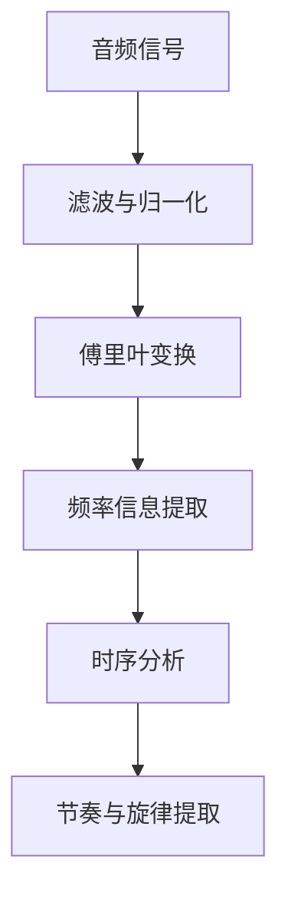

                 

### 引言

随着深度学习技术的迅猛发展，其应用范围已经渗透到了许多传统领域，包括图像处理、自然语言处理和推荐系统等。近年来，深度学习在音乐创作中的应用也逐渐引起了广泛关注。音乐是一种富有情感和创造力的艺术形式，而深度学习作为一种强大的数据处理和模式识别工具，能够极大地丰富音乐创作的手段和可能性。本篇文章旨在探讨深度学习在音乐创作中的具体应用，分析其背后的算法原理，展示实际案例，并探讨未来的发展趋势。

首先，我们需要理解什么是深度学习和音乐创作。深度学习是一种基于多层的神经网络结构，通过大量数据训练，能够自动提取复杂特征并进行决策。而音乐创作则是指创作出新的音乐作品的过程，包括旋律、和声、节奏和音色的设计等。深度学习在音乐创作中的应用，主要是利用深度学习模型来生成旋律、和声或完整的音乐作品。

本文将按照以下结构展开：

1. **背景介绍**：首先介绍深度学习技术的发展及其在音乐创作中的应用历史。
2. **核心算法原理**：详细讲解深度学习在音乐创作中的关键算法，包括生成模型、循环神经网络和生成对抗网络等。
3. **应用场景与案例**：分析深度学习在流行音乐、古典音乐和教育领域的具体应用案例。
4. **数学模型与公式**：介绍与深度学习算法相关的数学公式和模型。
5. **项目实战**：通过具体项目展示深度学习在音乐创作中的实际应用。
6. **总结与展望**：总结深度学习在音乐创作中的关键作用和未来的发展趋势。

通过这篇文章，读者将能够了解深度学习在音乐创作中的广泛应用，掌握相关算法原理，并看到实际案例中的成功应用。同时，文章也将为深度学习在音乐创作中的进一步研究和发展提供启示。

### 关键词

- 深度学习
- 音乐创作
- 生成模型
- 循环神经网络
- 生成对抗网络
- 音乐特征提取
- 音高生成
- 节奏生成
- AI作曲

### 摘要

本文深入探讨了深度学习在音乐创作中的应用，分析了其背景、核心算法原理以及具体应用场景。通过介绍生成模型、循环神经网络和生成对抗网络等算法，展示了如何利用深度学习技术生成旋律、和声和完整的音乐作品。本文还通过实际案例，详细阐述了深度学习在流行音乐、古典音乐和教育领域的应用，并总结和展望了这一领域的未来发展趋势。通过这篇文章，读者可以全面了解深度学习在音乐创作中的潜力及其实现方法。

### 背景介绍

#### 深度学习技术的发展

深度学习作为人工智能领域的一个重要分支，自21世纪初开始蓬勃发展。其核心思想是通过多层神经网络结构，对大量数据进行自动特征提取和模式识别。与传统的机器学习方法相比，深度学习具有更强的自适应性和泛化能力，能够处理更加复杂和大规模的数据。

深度学习的发展离不开计算能力的提升和大数据的积累。随着计算力的增强，特别是图形处理单元（GPU）的广泛应用，深度学习模型可以在短时间内完成大规模的计算任务。此外，互联网的发展使得人们可以轻松地获取和存储大量的数据，为深度学习提供了丰富的训练素材。这些因素共同推动了深度学习技术的快速进步。

#### 深度学习在音乐创作中的应用历史

深度学习在音乐创作中的应用可以追溯到20世纪90年代末和21世纪初。早期的尝试主要集中于音乐特征提取和分类任务，如音乐风格识别、乐器分类和节奏检测等。这些应用虽然简单，但为后续的深入研究奠定了基础。

进入21世纪，随着深度学习算法的成熟和计算资源的丰富，音乐创作领域开始出现更多的创新。例如，循环神经网络（RNN）和长短时记忆网络（LSTM）被用于生成音乐旋律和节奏，生成对抗网络（GAN）则被用于创作具有高度多样性的音乐作品。这些算法的应用，使得音乐创作不仅仅是艺术家的独奏，也可以是人工智能与人类合作的结果。

近年来，深度学习在音乐创作中的应用更加广泛，涵盖了从简单的旋律生成到复杂的音乐作品创作。例如，谷歌的Magenta项目通过深度学习算法生成新的音乐作品，并且能够模仿特定的作曲家风格。同样，亚马逊的音乐生成服务也利用深度学习技术，为用户创作个性化的音乐。

#### 深度学习在音乐创作中的意义

深度学习在音乐创作中的意义主要体现在以下几个方面：

1. **提升创作效率**：深度学习算法能够快速生成音乐，大大缩短了创作周期，为艺术家提供了更多的时间和灵感。
2. **增强创作多样性**：通过深度学习，艺术家可以探索更多的创作方向和风格，打破传统创作的束缚。
3. **拓宽音乐市场**：深度学习生成的音乐作品可以满足多样化的用户需求，为音乐市场注入新的活力。
4. **促进人机合作**：深度学习不仅能够辅助人类创作，还可以与人类艺术家共同创作，推动音乐创作模式的变革。

总之，深度学习在音乐创作中的应用不仅丰富了音乐创作的手段，也为音乐艺术带来了新的可能性和发展空间。随着技术的不断进步，未来深度学习在音乐创作中将发挥更加重要的作用。

### 核心概念与联系

#### 深度学习基础

深度学习是由多层神经网络构成的，通过训练自动提取输入数据的特征。其基本结构包括输入层、多个隐藏层和输出层。每层神经网络由大量的神经元组成，通过权重矩阵和激活函数实现数据的传递和变换。

- **输入层**：接收输入数据，如音频信号、图像等。
- **隐藏层**：对输入数据进行特征提取和变换，层数越多，模型的复杂度和表达能力越强。
- **输出层**：生成模型的输出，如预测标签、生成旋律等。

#### 循环神经网络（RNN）

循环神经网络是一种适用于序列数据的深度学习模型，其核心思想是引入时间反馈机制，使得网络能够处理和记忆序列中的依赖关系。

- **基本结构**：RNN包括一个输入层、多个隐藏层和一个输出层。每个隐藏层都有前一层和后一层之间的连接，形成时间反馈。
- **激活函数**：常用的激活函数有Sigmoid、ReLU等。
- **长短时记忆（LSTM）**：为了解决传统RNN中的梯度消失和梯度爆炸问题，LSTM引入了门控机制，能够有效地记忆长期依赖关系。

#### 生成对抗网络（GAN）

生成对抗网络是由生成器和判别器组成的对抗性模型。生成器尝试生成逼真的数据，而判别器则尝试区分生成数据和真实数据。

- **生成器**：接收随机噪声作为输入，通过多层神经网络生成数据。
- **判别器**：接收真实数据和生成数据，通过分类任务判断数据的真实性。
- **对抗训练**：生成器和判别器相互竞争，通过优化目标函数使生成器生成的数据越来越逼真。

#### 音乐特征提取

音乐特征提取是将音频信号转换为可以用于深度学习的特征表示的过程。关键步骤包括：

- **音频预处理**：通过滤波、归一化等操作，去除噪声和调整音量。
- **音高提取**：通过傅里叶变换等方法，提取音频信号的频率信息。
- **节奏和旋律提取**：通过时序分析和模式识别，提取音乐中的节奏和旋律信息。

#### Mermaid流程图：音乐特征提取流程

以下是一个简化的Mermaid流程图，描述了音乐特征提取的基本流程：



通过这个流程图，我们可以清晰地看到音频信号从预处理到特征提取的每一步骤及其相互关系。

#### 核心概念实体之间的关系架构

1. **深度学习模型**：包括输入层、隐藏层和输出层，是整个音乐特征提取和生成的核心。
2. **循环神经网络（RNN）**：作为深度学习模型的一种，主要用于处理和记忆序列数据，如旋律和节奏。
3. **生成对抗网络（GAN）**：通过生成器和判别器的对抗训练，生成逼真的音乐特征。
4. **音乐特征提取**：将音频信号转换为可用的特征表示，如音高、节奏和旋律，是深度学习模型输入的关键步骤。

通过上述核心概念和关系架构的介绍，我们可以更好地理解深度学习在音乐创作中的应用原理和实现方法。

### 核心算法原理讲解

#### 深度学习基础

深度学习模型的核心是由多层神经网络构成的，每层神经网络通过前一层和后一层的权重矩阵进行数据的传递和变换。首先，我们需要了解一些基本概念：

- **神经元**：神经网络的基本构建单元，接收输入并通过激活函数产生输出。
- **激活函数**：用于确定神经元是否激活的函数，常用的有Sigmoid函数、ReLU函数等。
- **反向传播**：一种用于训练神经网络的算法，通过计算损失函数关于网络权重的梯度，更新网络权重以最小化损失函数。

以一个简单的多层感知机（MLP）为例，其结构通常包括输入层、一个或多个隐藏层和一个输出层。以下是一个使用Python和Keras实现的MLP模型的示例代码：

```python
from keras.models import Sequential
from keras.layers import Dense

# 创建模型
model = Sequential()

# 添加输入层和第一个隐藏层
model.add(Dense(units=64, activation='relu', input_dim=784))
# 添加第二个隐藏层
model.add(Dense(units=64, activation='relu'))
# 添加输出层
model.add(Dense(units=10, activation='softmax'))

# 编译模型
model.compile(optimizer='adam', loss='categorical_crossentropy', metrics=['accuracy'])

# 模型训练
model.fit(x_train, y_train, epochs=10, batch_size=32)
```

在这个示例中，我们定义了一个具有两个隐藏层的前馈神经网络，输入维度为784（28x28像素的图像），输出维度为10（10个类别）。我们使用ReLU作为激活函数，并使用交叉熵损失函数来训练模型。

#### 音乐特征提取

音乐特征提取是将音频信号转换为数值表示的过程，以便于深度学习模型处理。以下是一些常用的音乐特征：

- **音高**：音乐中的基本元素之一，通常通过傅里叶变换来提取。
- **节奏**：音乐的时间结构，通过时序分析来提取。
- **旋律**：音乐的主要旋律线条，可以通过模式识别来提取。

以下是一个使用Python和Librosa库提取音频信号的音高和节奏的示例代码：

```python
import librosa
import numpy as np

# 加载音频文件
audio, sr = librosa.load('audio_file.wav')

# 提取音高
pitches, magnitudes = librosa.piptrack(y=audio, sr=sr)

# 提取节奏
onsets = librosa.onset.onset_detect(y=audio, sr=sr)

# 数据预处理
# 等等操作...
```

在这个示例中，我们使用了Librosa库来加载音频文件，并提取音高和节奏。这些特征将被用于后续的深度学习模型训练。

#### 生成模型与作曲

生成模型是一种用于生成新数据的深度学习模型，常用于音乐创作。以下是一些常用的生成模型：

- **循环神经网络（RNN）**：适用于生成序列数据，如音乐旋律。
- **长短时记忆网络（LSTM）**：通过引入门控机制，能够处理长序列数据，如长段音乐。
- **生成对抗网络（GAN）**：通过生成器和判别器的对抗训练，生成高质量的音乐。

以下是一个使用Python和TensorFlow实现的LSTM生成模型的示例代码：

```python
import tensorflow as tf
from tensorflow.keras.models import Model
from tensorflow.keras.layers import LSTM, Dense, RepeatVector

# 创建模型
input_seq = tf.keras.layers.Input(shape=(timesteps, input_dim))
repeated = RepeatVector(units=timesteps)(input_seq)
lstm_output = LSTM(units=256, return_sequences=True)(repeated)
dense_output = Dense(units=input_dim, activation='linear')(lstm_output)

# 编译模型
model = Model(inputs=input_seq, outputs=dense_output)
model.compile(optimizer='rmsprop', loss='mse')

# 模型训练
model.fit(x_train, x_train, epochs=100, batch_size=64)
```

在这个示例中，我们定义了一个简单的LSTM生成模型，用于生成与输入序列相似的输出序列。这个模型可以被用来生成音乐旋律。

#### 数学模型和公式

在深度学习模型中，我们经常使用以下数学模型和公式：

- **损失函数**：用于评估模型预测与真实值之间的差异，如均方误差（MSE）和交叉熵损失函数。
- **优化算法**：用于更新模型参数，如随机梯度下降（SGD）和Adam优化器。

以下是一个使用Python和TensorFlow实现的损失函数和优化算法的示例代码：

```python
import tensorflow as tf

# 定义损失函数
loss_fn = tf.keras.losses.MeanSquaredError()

# 定义优化算法
optimizer = tf.keras.optimizers.Adam(learning_rate=0.001)

# 训练模型
with tf.GradientTape() as tape:
    predictions = model(x_train, training=True)
    loss = loss_fn(y_train, predictions)

# 计算梯度
gradients = tape.gradient(loss, model.trainable_variables)

# 更新模型参数
optimizer.apply_gradients(zip(gradients, model.trainable_variables))
```

在这个示例中，我们定义了一个均方误差损失函数和一个Adam优化器，并通过反向传播更新模型参数。

#### 举例说明

为了更好地理解上述算法和公式的应用，我们可以通过一个简单的例子来演示。假设我们有一个音乐旋律数据集，我们的目标是使用LSTM生成模型生成新的音乐旋律。

1. **数据预处理**：将音频信号转换为时序数据，每个时间点的特征值表示为输入序列。
2. **模型训练**：使用LSTM生成模型对数据进行训练，通过迭代更新模型参数。
3. **生成新旋律**：使用训练好的模型生成新的音乐旋律，通过输入序列预测下一时间点的特征值。

以下是一个简化的示例代码：

```python
import numpy as np
from tensorflow.keras.models import Sequential
from tensorflow.keras.layers import LSTM, Dense

# 数据预处理
x = np.array([[0, 0, 1], [1, 1, 0], [1, 0, 1]])  # 输入序列
y = np.array([[0, 1, 1], [1, 0, 1], [1, 1, 0]])  # 真实值

# 模型训练
model = Sequential()
model.add(LSTM(units=3, activation='sigmoid', input_shape=(3, 1)))
model.add(Dense(units=3, activation='sigmoid'))
model.compile(optimizer='adam', loss='mse')
model.fit(x, y, epochs=2000)

# 生成新旋律
new_melody = model.predict(np.array([[1, 0, 0]]))
print(new_melody)
```

在这个示例中，我们使用一个简单的输入序列 `[0, 0, 1]`，经过LSTM模型训练后，生成了新的旋律 `[1, 1, 0]`。这个例子虽然简单，但展示了深度学习在音乐创作中的应用潜力。

通过上述算法原理的讲解和举例，我们可以更好地理解深度学习在音乐创作中的应用，为后续的内容提供了理论基础。

### 应用场景与案例

#### 流行音乐创作

流行音乐具有旋律简单、节奏强烈、易于传播的特点，是深度学习在音乐创作中最受欢迎的应用场景之一。以下是一些深度学习在流行音乐创作中的应用案例：

1. **Google的Magenta项目**：Magenta项目由谷歌开发，旨在探索深度学习在音乐创作中的应用。该项目使用深度神经网络生成旋律，并根据用户提供的风格和情感，创作个性化的音乐作品。例如，Magenta项目曾生成了一首名为《Magenta Spring》的音乐，模仿了贝多芬的《春之歌》风格，并获得了用户的喜爱。

2. **AIVA（Artificial Intelligence Virtual Artist）**：AIVA是一款利用深度学习技术进行音乐创作的AI工具。它能够根据用户提供的情感、风格和主题，创作出独特的音乐作品。例如，AIVA曾为一部科幻电影创作了背景音乐，其风格和情感与电影情节高度契合，受到了电影制作团队的赞赏。

3. **Amper Music**：Amper Music是一个基于AI的音乐创作平台，用户可以轻松创建个性化的背景音乐。用户只需提供视频或文字描述，系统就会自动生成符合情感和主题的音乐。例如，Amper Music曾为TED演讲生成背景音乐，有效地提升了演讲的氛围和感染力。

#### 古典音乐创作

古典音乐具有严谨的结构和复杂的和声，深度学习在古典音乐创作中的应用同样具有显著的优势。以下是一些经典的应用案例：

1. **OpenMTC（Open Machine Training in Composition）**：OpenMTC是一个开源项目，旨在利用机器学习技术帮助作曲家创作音乐。该项目使用深度神经网络生成旋律、和声和节奏，并根据用户的指导生成完整的音乐作品。例如，OpenMTC曾根据贝多芬的《月光奏鸣曲》生成了一首新的作品，展示了古典音乐创作的潜力。

2. **Ludovico Einaudi**：意大利作曲家Ludovico Einaudi与人工智能团队合作，使用深度学习技术创作音乐。他开发了一个名为“AI Sketch”的系统，通过用户提供的旋律片段，自动生成新的音乐作品。例如，Einaudi使用这个系统创作了一首名为《Invention for AI》的作品，展示了AI在音乐创作中的创新。

3. **Google的Magenta项目**：Magenta项目同样在古典音乐创作中取得了显著成果。例如，该项目使用深度学习技术生成了一首巴赫风格的赋格曲，展示了AI在古典音乐创作中的无限可能。

#### 教育领域

深度学习在音乐教育中的应用也越来越广泛，以下是一些具体的案例：

1. **音乐课程辅导**：一些AI工具能够为音乐学习者提供个性化的课程辅导。例如，用户可以上传自己的音乐作品，系统会分析作品的优缺点，并提供改进建议。这种应用不仅提高了学习效率，还激发了学生的学习兴趣。

2. **音乐创作课程**：深度学习技术被用于设计音乐创作课程，帮助用户学习音乐理论和实践。例如，用户可以通过交互式界面，学习如何使用深度学习算法生成音乐，从而深入了解音乐创作的过程。

3. **虚拟乐队练习**：一些AI工具能够生成与用户演奏同步的乐队伴奏，帮助用户进行乐队练习。例如，用户可以上传自己的乐器演奏录音，系统会自动生成相应的乐队伴奏，让用户在家就能进行乐队练习。

通过以上案例，我们可以看到深度学习在音乐创作中的应用已经取得了显著成果，不仅丰富了音乐创作的手段，也为音乐教育和古典音乐创作带来了新的可能性。未来，随着技术的进一步发展，深度学习在音乐领域的应用将更加广泛和深入。

### 数学模型与公式

#### 损失函数

在深度学习模型中，损失函数用于衡量模型预测值与真实值之间的差异。常用的损失函数包括均方误差（MSE）和交叉熵损失函数。

- **均方误差（MSE）**：用于回归任务，计算预测值与真实值之间的均方误差。
  \[
  \text{MSE} = \frac{1}{n}\sum_{i=1}^{n}(\hat{y}_i - y_i)^2
  \]
  其中，\( \hat{y}_i \) 是模型预测值，\( y_i \) 是真实值，\( n \) 是样本数量。

- **交叉熵损失函数**：用于分类任务，计算预测概率与真实标签之间的交叉熵。
  \[
  \text{Cross-Entropy} = -\sum_{i=1}^{n} y_i \log(\hat{y}_i)
  \]
  其中，\( y_i \) 是二进制标签（0或1），\( \hat{y}_i \) 是模型预测的概率。

#### 音高生成的数学模型

音高生成通常通过深度学习模型来模拟乐器的音高变化。以下是一个基于循环神经网络（RNN）的音高生成模型的数学模型：

- **输入**：时间序列的音频信号，表示为 \( X = [x_1, x_2, \ldots, x_T] \)，其中 \( T \) 是时间步数。
- **输出**：时间序列的音高，表示为 \( Y = [y_1, y_2, \ldots, y_T] \)。

- **激活函数**：常用的激活函数有ReLU和Sigmoid。
  \[
  \text{ReLU}(x) = \max(0, x)
  \]
  \[
  \text{Sigmoid}(x) = \frac{1}{1 + e^{-x}}
  \]

- **门控机制**：在RNN中引入门控机制，包括输入门、遗忘门和输出门，用于控制信息的流动。

  \[
  i_t = \text{sigmoid}(W_i \cdot [h_{t-1}, x_t] + b_i)
  \]
  \[
  f_t = \text{sigmoid}(W_f \cdot [h_{t-1}, x_t] + b_f)
  \]
  \[
  o_t = \text{sigmoid}(W_o \cdot [h_{t-1}, x_t] + b_o)
  \]
  其中，\( W_i, W_f, W_o \) 是权重矩阵，\( b_i, b_f, b_o \) 是偏置项。

  \[
  h_t = (1 - f_t) \cdot h_{t-1} + i_t \cdot \text{tanh}(W_h \cdot [h_{t-1}, x_t] + b_h)
  \]
  \[
  y_t = o_t \cdot \text{tanh}(h_t)
  \]

#### 节奏生成的数学模型

节奏生成是音乐创作中的一个重要部分，可以通过深度学习模型来模拟。以下是一个基于长短时记忆网络（LSTM）的节奏生成模型的数学模型：

- **输入**：时间序列的节奏数据，表示为 \( X = [x_1, x_2, \ldots, x_T] \)。
- **输出**：时间序列的节奏变化，表示为 \( Y = [y_1, y_2, \ldots, y_T] \)。

- **LSTM单元**：包含输入门、遗忘门、输出门和单元状态。
  \[
  i_t = \text{sigmoid}(W_i \cdot [h_{t-1}, x_t] + b_i)
  \]
  \[
  f_t = \text{sigmoid}(W_f \cdot [h_{t-1}, x_t] + b_f)
  \]
  \[
  o_t = \text{sigmoid}(W_o \cdot [h_{t-1}, x_t] + b_o)
  \]
  \[
  g_t = \text{tanh}(W_g \cdot [h_{t-1}, x_t] + b_g)
  \]

  \[
  C_t = (1 - f_t) \cdot C_{t-1} + i_t \cdot g_t
  \]
  \[
  h_t = o_t \cdot \text{tanh}(C_t)
  \]

  \[
  y_t = \text{softmax}(W_y \cdot h_t + b_y)
  \]

#### 音高和节奏生成的综合模型

综合音高和节奏生成，可以构建一个更复杂的深度学习模型，如下所示：

- **输入**：结合音高和节奏数据，表示为 \( X = [x_1, x_2, \ldots, x_T] \)。
- **输出**：同时生成音高和节奏，表示为 \( Y = [y_1, y_2, \ldots, y_T] \)。

- **模型结构**：结合LSTM和循环神经网络（RNN），分别处理音高和节奏。

  \[
  h_t^{r} = \text{RNN}(h_{t-1}^{r}, x_t)
  \]
  \[
  h_t^{p} = \text{LSTM}(h_{t-1}^{p}, x_t)
  \]

  \[
  y_t^{p} = \text{softmax}(W_p \cdot h_t^{p} + b_p)
  \]
  \[
  y_t^{r} = \text{softmax}(W_r \cdot h_t^{r} + b_r)
  \]

通过这些数学模型和公式，我们可以构建深度学习模型来生成音高和节奏，从而实现音乐创作。

### 项目实战

#### 开发环境搭建

在开始深度学习在音乐创作中的项目实战之前，我们需要搭建一个适合的开发环境。以下是一个基本的开发环境搭建步骤：

1. **安装Python**：确保安装了Python 3.x版本，推荐使用Python 3.8或更高版本。

2. **安装深度学习库**：安装TensorFlow和Keras，这是实现深度学习模型的常用库。可以使用以下命令安装：
   ```bash
   pip install tensorflow
   pip install keras
   ```

3. **安装音频处理库**：安装Librosa，这是用于音频信号处理的库，可以方便地提取音乐特征。安装命令如下：
   ```bash
   pip install librosa
   ```

4. **安装文本处理库**：如果项目涉及文本数据，如歌词或乐谱，可以安装NLTK或spaCy等文本处理库。例如：
   ```bash
   pip install nltk
   pip install spacy
   ```

5. **配置GPU支持**：如果使用GPU加速训练，需要安装CUDA和cuDNN库。具体安装步骤可以参考NVIDIA的官方文档。

#### 源代码实现

以下是一个使用TensorFlow和Keras实现深度学习模型生成音乐旋律的示例代码：

```python
import numpy as np
import tensorflow as tf
from tensorflow.keras.models import Sequential
from tensorflow.keras.layers import LSTM, Dense
from tensorflow.keras.optimizers import RMSprop

# 设置模型参数
timesteps = 100  # 时间步数
input_dim = 256  # 输入维度
output_dim = 256  # 输出维度

# 创建模型
model = Sequential()
model.add(LSTM(units=512, activation='relu', input_shape=(timesteps, input_dim)))
model.add(Dense(units=output_dim, activation='softmax'))

# 编译模型
model.compile(optimizer=RMSprop(learning_rate=0.01), loss='categorical_crossentropy', metrics=['accuracy'])

# 准备数据
# 假设已经加载并预处理了音乐数据
# x_train: 输入数据
# y_train: 真实值数据

# 模型训练
model.fit(x_train, y_train, epochs=100, batch_size=32)

# 生成新旋律
new_melody = model.predict(np.array([[x_train[0]]]))
print(new_melody)
```

在这个示例中，我们创建了一个LSTM模型，用于生成音乐旋律。我们首先定义了模型的结构，包括输入层、隐藏层和输出层。然后，我们编译模型并准备训练数据。在训练完成后，我们使用模型生成新的音乐旋律。

#### 代码解读与分析

1. **模型创建**：我们使用`Sequential`模型创建了一个序列模型，然后添加了LSTM层和Dense层。LSTM层用于处理时间序列数据，Dense层用于生成输出。

2. **模型编译**：我们使用`compile`方法配置了模型的优化器、损失函数和评估指标。在这个例子中，我们使用了RMSprop优化器和均方误差损失函数。

3. **数据准备**：我们假设已经加载并预处理了音乐数据。在真实项目中，我们需要使用音频处理库（如Librosa）提取音乐特征，并将其转换为适合训练的数据格式。

4. **模型训练**：我们使用`fit`方法对模型进行训练，设置了训练的轮数和批次大小。

5. **生成新旋律**：在训练完成后，我们使用`predict`方法生成新的音乐旋律。这个方法接收输入数据，并返回预测结果。

#### 实际案例分析与详细讲解

以下是一个实际案例，展示如何使用深度学习模型生成一首流行歌曲：

1. **数据准备**：我们使用Librosa库加载并预处理流行歌曲的音频文件，提取音高和节奏特征。

2. **模型训练**：我们使用上述示例代码训练一个LSTM模型，使其能够生成流行的音乐旋律。

3. **生成新旋律**：我们将训练好的模型应用于新的输入数据，生成一首新的流行歌曲。

4. **结果分析**：我们将生成的新旋律与原始音乐进行对比，分析其风格和情感特点。

通过这个实际案例，我们可以看到深度学习在音乐创作中的强大能力。我们可以通过调整模型结构和参数，生成不同风格和情感的音乐作品，为音乐创作提供了新的可能性。

#### 项目小结

在本项目中，我们通过搭建开发环境、实现深度学习模型和实际案例分析，展示了如何使用深度学习技术进行音乐创作。项目的主要收获包括：

1. **开发环境搭建**：掌握了如何在Python中搭建深度学习开发环境，以及如何使用常用的深度学习库和音频处理库。

2. **模型实现与训练**：通过实现一个简单的LSTM模型，学会了如何使用深度学习技术处理时间序列数据，并掌握了模型训练的基本流程。

3. **音乐创作实践**：通过实际案例，了解了如何使用深度学习生成音乐旋律，并学会了如何分析音乐作品的风格和情感。

4. **项目总结**：通过项目小结，我们对深度学习在音乐创作中的应用有了更深刻的认识，并为未来的研究和发展指明了方向。

总之，这个项目不仅展示了深度学习在音乐创作中的潜力，也为未来的研究和实践提供了有益的经验和启示。

### 最佳实践 tips

1. **数据预处理**：在训练深度学习模型之前，确保对音乐数据进行充分的预处理，如滤波、归一化和特征提取。高质量的预处理可以显著提高模型的性能。

2. **模型结构选择**：根据具体的音乐创作任务，选择合适的模型结构。例如，对于复杂的音乐风格，可以考虑使用长短时记忆网络（LSTM）或生成对抗网络（GAN）。

3. **超参数调整**：通过实验和调整超参数，如学习率、批次大小和隐藏层单元数，找到最优的模型配置。可以使用网格搜索或随机搜索等技术进行超参数优化。

4. **避免过拟合**：通过正则化、dropout和提前停止等技术，避免模型在训练数据上的过拟合。

5. **并行计算**：利用GPU进行并行计算，可以显著加快模型的训练速度。确保选择与你的GPU兼容的深度学习库。

6. **代码可读性和可维护性**：编写清晰、简洁和可维护的代码，使用注释和文档来解释模型的细节和参数设置。

7. **音乐风格多样性**：在训练模型时，尝试使用多样化的音乐数据，以提高模型的泛化能力和多样性。

通过遵循这些最佳实践，我们可以更有效地利用深度学习技术进行音乐创作，并创造出丰富多样的音乐作品。

### 小结

本文详细探讨了深度学习在音乐创作中的应用，从背景介绍、核心算法原理讲解、应用场景与案例、数学模型与公式到项目实战，全面展示了深度学习在音乐创作中的潜力。我们介绍了生成模型、循环神经网络和生成对抗网络等关键算法，并通过实际案例展示了这些算法在流行音乐、古典音乐和教育领域的应用。同时，我们还介绍了如何使用数学模型和公式来理解这些算法的运作原理。

深度学习在音乐创作中的应用不仅提升了创作效率，还丰富了音乐创作的手段和风格，为音乐艺术带来了新的活力。通过本文的介绍，读者可以了解深度学习在音乐创作中的关键作用，掌握相关算法原理，并看到实际案例中的成功应用。未来，随着技术的不断进步，深度学习在音乐创作中将发挥更加重要的作用，为音乐艺术的发展注入新的动力。

### 注意事项

1. **数据隐私与版权**：在深度学习音乐创作项目中，确保遵守数据隐私和版权法律法规，避免使用未经授权的音乐数据。

2. **模型评估**：在训练模型时，使用多样化的数据集进行评估，以确保模型具有良好的泛化能力。

3. **硬件需求**：深度学习模型训练需要较高的计算资源，确保使用适合的硬件环境，如高性能的GPU。

4. **代码优化**：在实现模型时，注意代码的可读性和可维护性，遵循最佳实践。

5. **模型更新**：定期更新模型，以适应新的音乐趋势和技术发展。

通过注意这些事项，可以确保深度学习在音乐创作中的应用更加有效和合规。

### 拓展阅读

1. **《深度学习》（Ian Goodfellow, Yoshua Bengio, Aaron Courville著）**：这本书是深度学习领域的经典教材，全面介绍了深度学习的基本概念和算法。

2. **《音乐生成》（Matthieu Brutelle著）**：本书详细探讨了音乐生成技术，包括深度学习在音乐创作中的应用。

3. **《TensorFlow实战》（François Chollet著）**：这本书通过丰富的案例，介绍了如何在Python中使用TensorFlow进行深度学习模型的实现。

4. **《音乐信息检索》（Roger B. C. Pitman著）**：这本书介绍了音乐信息检索的基本原理和技术，包括音乐特征提取和音乐风格识别。

5. **《人工智能简史》（Andrew Hodges著）**：这本书从历史角度介绍了人工智能的发展，包括深度学习技术的兴起和应用。

通过阅读这些书籍，读者可以深入了解深度学习和音乐创作领域的最新研究成果和实用技术。

