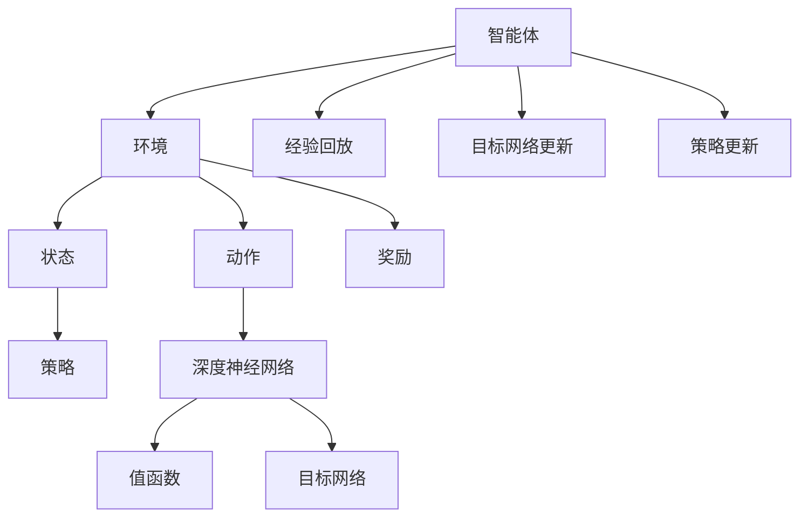
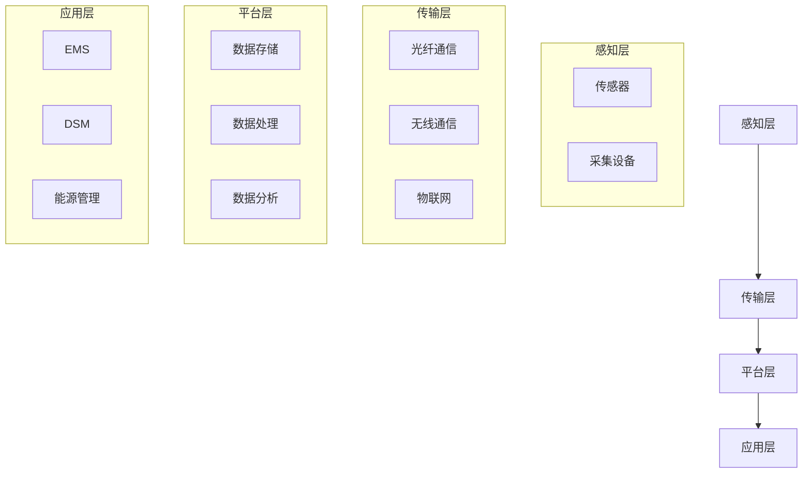
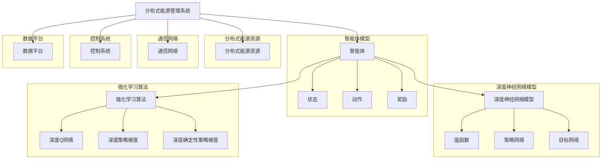

                 

### 深度强化学习在智能电网优化中的应用

智能电网作为现代电力系统的关键组成部分，正面临着日益增长的能源需求和环境挑战。为了实现高效、稳定、可持续的电力供应，智能电网优化技术应运而生。而深度强化学习（Deep Reinforcement Learning, DRL）作为一种先进的机器学习技术，近年来在电力系统优化领域展现出了巨大的潜力。本文将深入探讨深度强化学习在智能电网优化中的应用，分析其核心概念、基本原理以及实际案例，旨在为读者提供全面的技术洞察。

文章关键词包括：深度强化学习、智能电网、优化、电力市场、需求响应、分布式能源、储能系统。

文章摘要：本文首先介绍了智能电网的定义和架构，随后详细讲解了深度强化学习的基本概念和原理。接着，本文重点讨论了深度强化学习在电力市场、电力调度、需求响应、储能系统以及分布式能源管理中的应用，并通过实际案例展示了其优越性能。最后，文章探讨了深度强化学习在智能电网优化中的挑战与未来发展方向，为相关领域的研究和应用提供了有益参考。

在接下来的章节中，我们将逐步深入，首先从深度强化学习的基础知识出发，探讨其基本概念和模型架构，为后续的应用分析打下坚实基础。随后，我们将逐步引入智能电网的背景知识，分析深度强化学习如何应用于不同的电力系统场景。希望通过本文的深入分析，能够为智能电网优化提供新的思路和方法，推动这一领域的进一步发展。

### 第1章：深度强化学习基础

#### 1.1 深度强化学习概述

深度强化学习（Deep Reinforcement Learning, DRL）是强化学习（Reinforcement Learning, RL）和深度学习（Deep Learning, DL）的结合体，旨在通过智能体的自主交互来学习环境中的最优策略。相比于传统的强化学习，DRL引入了深度神经网络，使得智能体能够处理高维、复杂的输入信息，从而提高了学习效率和决策能力。

深度强化学习的基本原理可以概括为：智能体通过与环境进行交互，根据当前的观测状态选择动作，并基于动作的结果（奖励或惩罚）来更新策略。这一过程不断循环，直至达到某种预定的目标，如最大化总奖励或达到状态目标。

#### 1.2 强化学习的基本概念

强化学习是机器学习的一个重要分支，主要研究如何通过交互式环境来学习最优策略。强化学习的核心概念包括：

1. **智能体（Agent）**：执行动作、感知环境的主体。
2. **环境（Environment）**：智能体所处的物理或虚拟世界，能够根据智能体的动作产生状态转移和奖励信号。
3. **状态（State）**：描述智能体在某一时刻所处的环境特征。
4. **动作（Action）**：智能体可选择的操作集合。
5. **奖励（Reward）**：描述动作结果的好坏，用于指导智能体的学习过程。
6. **策略（Policy）**：智能体从状态到动作的映射函数，用于指导智能体的行为。

强化学习的目标是通过不断调整策略，最大化总奖励或实现特定目标。

#### 1.3 深度强化学习框架

深度强化学习框架主要包括以下部分：

1. **深度神经网络（Deep Neural Network, DNN）**：用于表示状态和动作之间的复杂非线性关系。DNN可以通过多层神经元对输入数据进行逐步抽象和提取特征。
2. **值函数（Value Function）**：评估状态或状态-动作对的预期奖励。值函数可以分为状态值函数（State Value Function）和动作值函数（Action Value Function）。
3. **策略网络（Policy Network）**：输出最佳动作的分布，直接指导智能体的行为。
4. **目标网络（Target Network）**：用于稳定学习过程，通过 periodically更新与策略网络参数相近的目标网络，减少策略网络更新过程中的噪声影响。

深度强化学习框架的典型结构包括：

- **基于值函数的方法**：如深度Q网络（Deep Q-Network, DQN），通过学习状态-动作值函数来指导智能体选择动作。
- **基于策略的方法**：如深度策略梯度（Deep Policy Gradient, DPG），直接优化策略网络以最大化总奖励。
- **基于模型的方法**：如深度确定性策略梯度（Deep Deterministic Policy Gradient, DDPG），通过构建对环境的内部模型来优化策略。

#### 1.4 深度强化学习的主要算法

深度强化学习的主要算法包括：

1. **深度Q网络（Deep Q-Network, DQN）**：通过经验回放和目标网络来稳定学习过程，适用于非连续动作空间。
2. **深度策略梯度（Deep Policy Gradient, DPG）**：直接优化策略网络，适用于连续动作空间。
3. **深度确定性策略梯度（Deep Deterministic Policy Gradient, DDPG）**：基于模型的方法，通过内部模型学习环境动态，适用于高维连续动作空间。
4. **深度深度确定性策略梯度（Deep Deep Deterministic Policy Gradient, D4PG）**：在DDPG基础上增加了一个深度经验回放机制，提高了学习效率和稳定性。
5. **异步优势演员-评论家（Asynchronous Advantage Actor-Critic, A3C）**：通过并行训练多个智能体来加速学习过程。

这些算法在实现细节上有所不同，但都基于深度强化学习的核心原理，通过智能体的自主交互来学习环境中的最优策略。

#### 1.5 深度强化学习在电力系统中的应用前景

深度强化学习在电力系统中的应用前景广阔，尤其在电力市场、电力调度、需求响应、储能系统以及分布式能源管理等方面具有显著优势。以下为几个典型应用场景：

1. **电力市场优化**：通过DRL算法，智能体可以自动学习电力市场中的交易策略，优化电力资源配置，提高市场运行效率。
2. **电力调度优化**：DRL算法可以用于电力系统的实时调度，通过动态调整发电负荷，提高系统稳定性和经济性。
3. **需求响应优化**：DRL算法可以帮助用户智能调节用电行为，实现需求侧管理，降低用电高峰负荷，缓解电网压力。
4. **储能系统优化**：通过DRL算法，储能系统可以实现最优充放电策略，提高能量利用效率，降低运行成本。
5. **分布式能源管理**：DRL算法可以优化分布式能源系统的运行模式，实现多能协同，提高整体能源系统的稳定性。

总之，深度强化学习为智能电网优化提供了新的技术手段和思路，有望在未来进一步推动电力系统的智能化、高效化发展。

### 图1：深度强化学习在电力系统中的应用概念实体关系架构



通过上述关系架构，可以直观地看到深度强化学习在电力系统中的应用，智能体通过与环境的交互，利用深度神经网络学习状态、动作和奖励之间的复杂关系，从而实现最优策略的更新。

### 第2章：智能电网基础

#### 2.1 智能电网的概念与架构

智能电网（Smart Grid）是指通过将现代通信技术、信息技术和电力系统技术深度融合，实现对电力系统运行全过程的实时监控、智能分析和优化管理。智能电网旨在提高电力系统的可靠性、经济性和环境友好性，实现高效、稳定和可持续的电力供应。

智能电网的基本架构包括：

1. **输电系统**：包括高压、中压和低压输电线路，负责电能的长距离传输和分配。
2. **配电系统**：包括配电变压器、配电线路和配电设备，负责电能的本地分配和供电。
3. **能量管理系统（Energy Management System, EMS）**：实现对整个电网的监控、调度和优化，包括发电计划、负荷预测、电能质量监测等功能。
4. **需求侧管理（Demand Side Management, DSM）**：通过用户侧设备的管理，实现电力需求的响应和调控，包括负荷控制、储能系统优化等。
5. **通信系统**：包括各种传感器、通信设备和网络，负责实时数据的采集、传输和共享。
6. **信息技术平台**：用于数据存储、处理和分析，支持智能电网的运行和管理。

#### 2.1.1 智能电网的基本定义

智能电网是一种高度集成、互动和智能化的电力系统，通过先进的信息通信技术、控制技术和电力电子技术，实现电力系统各环节的互联互通和智能调度。与传统电网相比，智能电网具有以下特点：

- **实时性**：通过传感器和通信设备，实现对电网状态的实时监测和响应。
- **互动性**：用户和电网之间的双向互动，用户可以参与到电网的运行和管理中。
- **智能化**：基于大数据和人工智能技术，实现对电网运行状态和负荷需求的智能分析和管理。
- **可靠性和稳定性**：通过分布式能源和储能系统的应用，提高电网的可靠性和稳定性。

#### 2.1.2 智能电网的关键技术

智能电网的实现依赖于多种关键技术的支持，包括：

- **通信技术**：包括光纤通信、无线通信和物联网技术，用于实时数据传输和远程控制。
- **传感器技术**：用于监测电网的电压、电流、功率因数等参数，实现对电网状态的精确感知。
- **控制技术**：包括自动化控制和人工智能控制技术，用于实时调整电网运行状态。
- **能量管理技术**：包括发电计划、负荷预测、电能质量监测等技术，用于优化电网运行。
- **储能技术**：包括电池储能、超级电容器、飞轮储能等，用于调节电力系统的供需平衡。
- **信息安全技术**：包括网络安全、数据加密等技术，用于保障电网的安全稳定运行。

#### 2.1.3 智能电网的体系结构

智能电网的体系结构可以分为以下几个层次：

1. **感知层**：包括各种传感器和采集设备，用于实时监测电网的运行状态。
2. **传输层**：包括各种通信网络和传输设备，用于实时传输感知层的数据。
3. **平台层**：包括数据存储、处理和分析平台，用于对实时数据进行处理和分析。
4. **应用层**：包括各类应用系统和业务模块，用于实现电网的监控、调度和管理。

图2展示了智能电网的体系结构：



通过上述体系结构，智能电网能够实现各个环节的紧密连接和协同工作，从而提高电力系统的整体运行效率。

#### 2.2 智能电网的关键技术

智能电网的实现依赖于多种关键技术的支持，这些技术包括通信技术、传感器技术、控制技术、能量管理技术、储能技术以及信息安全技术。以下对这些关键技术进行详细介绍：

1. **通信技术**：
   - **光纤通信**：光纤通信具有高带宽、低延迟和抗干扰能力强等优点，能够满足智能电网对实时数据传输的高要求。
   - **无线通信**：无线通信技术如Wi-Fi、4G/5G等，能够实现远程数据传输，特别是在城乡和偏远地区的电力设施中。
   - **物联网（Internet of Things, IoT）**：物联网技术通过将各种传感器和设备互联，实现数据的高效采集和共享，是智能电网数据传输的基础。

2. **传感器技术**：
   - **智能传感器**：智能传感器能够实时监测电网的各种参数，如电压、电流、功率因数等，为电网运行提供精确的数据支持。
   - **分布式传感器网络**：通过部署大量分布式传感器，实现对电网运行状态的全面监测，提高系统的可靠性和实时性。

3. **控制技术**：
   - **自动化控制**：自动化控制技术用于实现对电网运行状态的实时监控和调整，提高系统的稳定性和响应速度。
   - **人工智能控制**：结合人工智能技术，通过深度学习、强化学习等方法，实现对复杂电网系统的智能调控，优化电网运行。

4. **能量管理技术**：
   - **发电计划**：通过智能算法优化发电计划，实现电网的供需平衡，降低发电成本。
   - **负荷预测**：利用大数据和机器学习技术，对电力负荷进行准确预测，为电网调度提供依据。
   - **电能质量监测**：监测电网的电能质量，如电压稳定性、频率稳定性等，确保电力系统的安全运行。

5. **储能技术**：
   - **电池储能**：电池储能系统可以快速响应电力系统的供需变化，实现电能的存储和释放。
   - **超级电容器**：超级电容器具有高功率密度、快速充放电等优点，适用于电网的短时储能和调频。
   - **飞轮储能**：飞轮储能系统通过旋转动能存储和释放电能，适用于电网的长时间储能和调峰。

6. **信息安全技术**：
   - **网络安全**：通过加密、认证和访问控制等技术，保障电网通信网络和数据的安全。
   - **数据加密**：对传输的数据进行加密处理，防止数据被窃取或篡改。
   - **访问控制**：对电网系统中的访问权限进行严格控制，防止未经授权的访问和操作。

通过上述关键技术的应用，智能电网能够实现高效、稳定和可持续的电力供应，为现代社会的发展提供强有力的支持。未来，随着技术的不断进步，智能电网将在能源互联网和智能城市等领域发挥更加重要的作用。

### 第3章：深度强化学习在电力市场中的应用

#### 3.1 电力市场概述

电力市场是指通过市场机制进行电力资源配置和价格发现的过程。它将发电、输电、配电和用电各方紧密联系在一起，通过市场交易实现电力的公平、高效和稳定供应。电力市场的主要组成部分包括发电厂商、输电公司、配电公司和电力用户。

电力市场按照交易机制的不同，可以分为以下几类：

1. **集中式电力市场**：所有电力交易都集中在统一的交易中心进行，市场参与者通过交易中心进行报价和交易。
2. **分布式电力市场**：电力交易在多个交易中心进行，市场参与者可以在不同的交易市场进行交易。
3. **双边市场**：发电厂商和电力用户通过直接协商确定交易价格和交易量，不通过交易中心进行交易。

电力市场的主要功能包括：

- **资源配置**：通过市场交易，实现电力资源的优化配置，满足电力需求的多样化。
- **价格发现**：市场交易过程反映了电力供需关系，市场价格反映了电力的稀缺程度和供求状况。
- **风险转移**：市场参与者通过交易，将风险转移给其他市场参与者，降低自身风险。
- **促进技术创新**：通过市场竞争，鼓励发电厂商和技术服务商进行技术创新，提高电力系统的效率和可持续性。

#### 3.2 基于深度强化学习的电力市场模型

深度强化学习（DRL）在电力市场中的应用主要通过构建智能体（agent）模型，实现电力市场参与者的自动学习和优化交易策略。以下是基于深度强化学习的电力市场模型的详细描述：

1. **智能体模型**：
   - **智能体**：代表市场参与者，如发电厂商、配电公司和电力用户。智能体通过学习电力市场的价格和供需信息，自主调整交易策略。
   - **状态**：智能体当前的市场信息，包括市场价格、供需状况、发电成本等。
   - **动作**：智能体的交易决策，包括买入、卖出或持有电量。
   - **奖励**：交易结果带来的收益或损失，用于指导智能体的学习过程。

2. **深度神经网络（DNN）模型**：
   - **值函数**：评估智能体在当前状态下采取不同动作的预期收益，用于指导智能体的决策。
   - **策略网络**：输出最佳动作的分布，直接指导智能体的交易行为。
   - **目标网络**：用于稳定学习过程，通过定期更新与策略网络参数相近的目标网络，减少策略网络更新过程中的噪声影响。

3. **强化学习算法**：
   - **深度Q网络（DQN）**：通过经验回放和目标网络，稳定智能体的学习过程。
   - **深度策略梯度（DPG）**：直接优化智能体的策略网络，以最大化总奖励。
   - **深度确定性策略梯度（DDPG）**：基于模型的方法，通过内部模型学习环境动态，优化智能体的策略。

#### 3.3 深度强化学习在电力市场中的应用案例

以下为基于深度强化学习的电力市场应用案例：

**案例1：发电厂商的竞价策略优化**
- **背景**：发电厂商在电力市场中通过竞价参与交易，如何制定合理的竞价策略，最大化收益是关键问题。
- **应用**：使用DRL算法，发电厂商的智能体可以学习市场价格、供需状况和自身发电成本等信息，自主调整竞价策略。
- **效果**：通过智能竞价策略，发电厂商能够更准确地预测市场价格，提高交易成功率，实现收益最大化。

**案例2：电力用户的用电行为管理**
- **背景**：电力用户在电力市场中既是消费者也是供应商，如何管理用电行为，实现用电成本最小化是关键问题。
- **应用**：使用DRL算法，电力用户的智能体可以学习市场价格、用电需求和家庭用电习惯等信息，自主调整用电策略。
- **效果**：通过智能用电策略，电力用户能够在低电价时段增加用电，减少高峰时段用电，降低用电成本。

**案例3：配电公司的调峰策略优化**
- **背景**：配电公司需要平衡电网的供需关系，避免电力短缺或过剩，如何制定合理的调峰策略是关键问题。
- **应用**：使用DRL算法，配电公司的智能体可以学习市场需求、电网状态和调峰能力等信息，自主调整调峰策略。
- **效果**：通过智能调峰策略，配电公司能够更有效地平衡供需关系，提高电网运行的稳定性和效率。

通过上述案例，可以看出深度强化学习在电力市场中的应用具有重要的现实意义，能够显著提高市场运行效率和参与者收益，推动电力市场的健康发展。

#### 3.4 深度强化学习在电力市场优化中的具体应用

深度强化学习在电力市场优化中的应用主要体现在以下几个方面：

1. **市场参与者竞价策略优化**：
   - **算法原理**：利用DRL算法，智能体通过学习市场价格波动、供需状况和自身成本结构，自动调整竞价策略。
   - **数学模型**：设定状态空间为市场价格、供需比例和发电成本，动作空间为竞价价格。使用Q网络或策略网络来评估预期收益，并调整竞价策略。
   - **Python代码示例**：
     ```python
     import numpy as np
     import tensorflow as tf

     # 状态空间维度
     state_dim = 3
     # 动作空间维度
     action_dim = 1

     # 定义Q网络
     def create_q_network():
         # 输入层
         inputs = tf.keras.layers.Input(shape=(state_dim,))
         # 隐藏层
         x = tf.keras.layers.Dense(64, activation='relu')(inputs)
         # 输出层
         q_values = tf.keras.layers.Dense(action_dim)(x)
         model = tf.keras.Model(inputs, q_values)
         return model

     q_network = create_q_network()

     # 定义策略网络
     def create_policy_network():
         # 输入层
         inputs = tf.keras.layers.Input(shape=(state_dim,))
         # 隐藏层
         x = tf.keras.layers.Dense(64, activation='relu')(inputs)
         # 输出层
         probabilities = tf.keras.layers.Dense(action_dim, activation='softmax')(x)
         model = tf.keras.Model(inputs, probabilities)
         return model

     policy_network = create_policy_network()

     # 训练策略网络
     optimizer = tf.keras.optimizers.Adam(learning_rate=0.001)
     for episode in range(1000):
         # 从环境中获取状态
         state = get_state()
         # 采取动作
         action = policy_network.predict(state)
         # 执行动作并获得奖励
         reward = take_action(action)
         # 更新Q值
         q_values = q_network.predict(state)
         new_q_value = reward + discount_factor * np.max(q_values[1:])
         q_network.optimizer.minimize(loss(new_q_value), q_network.trainable_variables)
     ```

2. **电力负荷预测与需求响应**：
   - **算法原理**：利用DRL算法，智能体通过学习历史负荷数据和市场价格信息，预测未来负荷需求，并自动调整用电行为。
   - **数学模型**：设定状态空间为历史负荷数据、市场价格和市场动态，动作空间为用电行为调整量。使用RNN或LSTM网络来捕捉时间序列信息，并优化预测模型。
   - **Python代码示例**：
     ```python
     import numpy as np
     import tensorflow as tf

     # 定义RNN模型
     def create_rnn_model(input_shape):
         model = tf.keras.Sequential([
             tf.keras.layers.LSTM(64, activation='relu', input_shape=input_shape),
             tf.keras.layers.Dense(1)
         ])
         return model

     # 训练RNN模型
     lstm_model = create_rnn_model(input_shape=(time_steps, state_dim))
     lstm_model.compile(optimizer='adam', loss='mse')
     lstm_model.fit(state_data, action_data, epochs=1000, batch_size=32)
     ```

3. **电力市场风险控制**：
   - **算法原理**：利用DRL算法，智能体通过学习市场价格波动和供需关系，预测市场风险并调整交易策略。
   - **数学模型**：设定状态空间为市场价格、供需比例和市场波动性，动作空间为交易风险调整量。使用DRL算法中的风险度量模型来评估和调整交易策略。
   - **Python代码示例**：
     ```python
     import numpy as np
     import tensorflow as tf

     # 定义风险度量模型
     def create_risk_model(state_dim):
         model = tf.keras.Sequential([
             tf.keras.layers.Dense(64, activation='relu', input_shape=(state_dim,)),
             tf.keras.layers.Dense(1)
         ])
         return model

     # 训练风险模型
     risk_model = create_risk_model(state_dim)
     risk_model.compile(optimizer='adam', loss='mse')
     risk_model.fit(state_data, risk_values, epochs=1000, batch_size=32)
     ```

通过上述具体应用案例和Python代码示例，可以看出深度强化学习在电力市场优化中的应用具有广泛的前景和强大的功能，能够为市场参与者提供智能化的决策支持，提高市场运行效率和稳定性。

### 第4章：深度强化学习在电力调度中的应用

#### 4.1 电力调度概述

电力调度是指根据电力系统的运行状况和需求，合理安排发电、输电、配电和用电等环节，确保电力系统的稳定、可靠和高效运行。电力调度是智能电网的重要组成部分，其核心任务是确保电力供需平衡，优化电力资源配置，提高电力系统的整体效益。

电力调度主要包括以下三个层次：

1. **发电调度**：根据电网负荷需求和发电资源情况，合理安排各类发电设施的发电量，确保电力系统的基本供电需求。
2. **输电调度**：负责电网的输电网络管理和调度，协调各地区间的电力输送，确保电力供应的均衡性和稳定性。
3. **配电调度**：在配电网络中，根据负荷需求和电网状况，合理安排电力分配，确保供电质量和可靠性。

电力调度的目标包括：

- 确保电力系统的稳定运行：通过实时监测和调度，确保电力系统的电压、频率等参数在安全范围内。
- 优化电力资源配置：通过科学调度，最大化利用各类发电资源，降低发电成本，提高电力系统的经济性。
- 提高供电可靠性：通过提前预测和应对电力系统中的各种故障和异常情况，提高电力系统的供电可靠性。
- 促进能源结构调整：通过优化调度，推动清洁能源和可再生能源的利用，促进能源结构的优化和转型。

#### 4.2 基于深度强化学习的电力调度模型

深度强化学习（DRL）在电力调度中的应用主要通过构建智能调度系统，实现对电力系统运行状态的实时监测和动态调整。以下是基于深度强化学习的电力调度模型的详细描述：

1. **智能调度系统**：
   - **智能体**：代表调度系统，通过学习电力系统的运行状态、负荷需求和发电资源等信息，自主制定调度策略。
   - **状态**：智能体的当前状态包括电网负荷、发电量、电网参数（如电压、频率）等。
   - **动作**：智能体可选择的调度动作，如调整发电量、切换发电设施、调整输电线路运行状态等。
   - **奖励**：根据调度效果，智能体获得的奖励，如系统稳定运行奖励、降低成本奖励等。

2. **深度神经网络（DNN）模型**：
   - **值函数**：评估智能体在当前状态下采取不同调度动作的预期奖励，指导智能体的调度决策。
   - **策略网络**：输出最佳调度动作的分布，直接指导智能体的调度行为。
   - **目标网络**：用于稳定学习过程，通过定期更新与策略网络参数相近的目标网络，减少策略网络更新过程中的噪声影响。

3. **强化学习算法**：
   - **深度Q网络（DQN）**：通过经验回放和目标网络，稳定智能体的学习过程。
   - **深度策略梯度（DPG）**：直接优化智能体的策略网络，以最大化总奖励。
   - **深度确定性策略梯度（DDPG）**：基于模型的方法，通过内部模型学习环境动态，优化智能体的策略。

#### 4.3 深度强化学习在电力调度中的应用案例

以下为基于深度强化学习的电力调度应用案例：

**案例1：智能发电调度**
- **背景**：传统的发电调度主要依赖预定的调度计划和调度员的经验，难以应对实时变化的负荷需求。
- **应用**：使用DRL算法，智能调度系统可以实时学习电网的运行状态和负荷需求，自动调整发电量，实现智能发电调度。
- **效果**：通过智能发电调度，显著提高了电力系统的响应速度和调度灵活性，降低了调度误差，提高了电力系统的运行效率。

**案例2：输电线路优化调度**
- **背景**：输电线路的调度通常依赖于预定的运行方案，难以适应实时变化的电力需求和电网状态。
- **应用**：使用DRL算法，智能调度系统可以实时监测电网状态，动态调整输电线路的运行状态，优化输电效率。
- **效果**：通过优化输电线路调度，有效减少了输电损耗，提高了电网的输电能力和稳定性。

**案例3：配电系统实时调度**
- **背景**：配电系统的调度通常依赖于历史数据和经验，难以应对实时变化的用电需求。
- **应用**：使用DRL算法，智能调度系统可以实时学习配电系统的运行状态和用电需求，动态调整配电策略，实现智能配电调度。
- **效果**：通过智能配电调度，显著提高了配电系统的可靠性和供电质量，降低了配电损耗。

通过上述案例，可以看出深度强化学习在电力调度中的应用具有重要的实际意义，能够显著提高电力系统的调度效率和运行稳定性，为智能电网的健康发展提供有力支持。

### 第5章：深度强化学习在电力需求响应中的应用

#### 5.1 电力需求响应概述

电力需求响应（Demand Response, DR）是指通过激励措施，引导电力用户在特定时段调整用电行为，以应对电力系统中的供需波动、高峰负荷等问题。需求响应的目标是优化电力系统的运行效率和可靠性，降低供电成本，同时提高电力用户的满意度和参与度。

电力需求响应的主要组成部分包括：

1. **需求响应参与者**：包括电力用户、能源服务公司、调度机构等。电力用户是需求响应的主体，通过调整用电行为参与需求响应；能源服务公司负责提供技术和咨询服务，帮助用户实现需求响应；调度机构负责协调和管理需求响应过程。

2. **需求响应机制**：包括价格信号、技术信号和激励措施等。价格信号通过市场价格波动引导用户调整用电行为；技术信号通过实时监测和反馈，帮助用户了解用电状况和需求响应效果；激励措施通过补贴、奖励等方式鼓励用户参与需求响应。

3. **需求响应策略**：根据不同的需求响应类型和场景，制定相应的策略。常见的需求响应策略包括高峰削峰、低谷填谷、紧急响应等。

电力需求响应的作用包括：

- **优化电力系统运行**：通过需求响应，可以在高峰时段减少电力需求，缓解电网压力，提高电力系统的稳定性和可靠性。
- **降低发电成本**：通过需求响应，可以在低谷时段增加电力需求，提高发电设施的利用率，降低发电成本。
- **提高可再生能源利用率**：通过需求响应，可以在可再生能源发电高峰时段增加电力需求，提高可再生能源的利用率，促进能源结构的优化。

#### 5.2 基于深度强化学习的电力需求响应模型

深度强化学习（DRL）在电力需求响应中的应用主要通过构建智能体（agent）模型，实现电力用户自动调整用电行为，以优化电力系统的运行效率和稳定性。以下是基于深度强化学习的电力需求响应模型的详细描述：

1. **智能体模型**：
   - **智能体**：代表电力用户，通过学习市场价格、电网状态和自身用电习惯等信息，自主调整用电行为。
   - **状态**：智能体的当前状态包括市场价格、电网频率、当前用电量等。
   - **动作**：智能体可选择的动作包括调整空调温度、使用储能设备、调整照明等。
   - **奖励**：根据电力系统的响应效果和用户的用电成本，智能体获得的奖励。

2. **深度神经网络（DNN）模型**：
   - **值函数**：评估智能体在当前状态下采取不同动作的预期奖励，用于指导智能体的决策。
   - **策略网络**：输出最佳动作的分布，直接指导智能体的用电行为。
   - **目标网络**：用于稳定学习过程，通过定期更新与策略网络参数相近的目标网络，减少策略网络更新过程中的噪声影响。

3. **强化学习算法**：
   - **深度Q网络（DQN）**：通过经验回放和目标网络，稳定智能体的学习过程。
   - **深度策略梯度（DPG）**：直接优化智能体的策略网络，以最大化总奖励。
   - **深度确定性策略梯度（DDPG）**：基于模型的方法，通过内部模型学习环境动态，优化智能体的策略。

#### 5.3 深度强化学习在电力需求响应中的应用案例

以下为基于深度强化学习的电力需求响应应用案例：

**案例1：智能家庭用电管理**
- **背景**：家庭用电行为复杂，且受多种因素影响，如用户生活习惯、天气等。
- **应用**：使用DRL算法，智能家庭系统可以实时学习用户的用电习惯和市场价格信息，自动调整家庭用电行为，实现智能用电管理。
- **效果**：通过智能家庭用电管理，有效降低了家庭用电高峰负荷，提高了用电效率，降低了用电成本。

**案例2：商业建筑节能管理**
- **背景**：商业建筑的用电负荷较大，如何实现节能管理是关键问题。
- **应用**：使用DRL算法，智能建筑系统可以实时监测建筑用电状况和市场价格信息，自动调整空调、照明等设备运行状态，实现节能管理。
- **效果**：通过智能建筑节能管理，有效降低了商业建筑的用电负荷，提高了能源利用率，降低了运营成本。

**案例3：工业用电需求响应**
- **背景**：工业用电需求波动大，如何实现实时调整是关键问题。
- **应用**：使用DRL算法，智能工业系统可以实时学习工业用电状况和市场价格信息，自动调整生产设备和用电行为，实现需求响应。
- **效果**：通过智能工业用电需求响应，有效降低了工业用电高峰负荷，提高了电力系统的稳定性，降低了生产成本。

通过上述案例，可以看出深度强化学习在电力需求响应中的应用具有重要的实际意义，能够为电力用户和电力系统提供智能化的用电管理和优化支持，提高电力系统的运行效率和可靠性。

### 第6章：深度强化学习在储能系统优化中的应用

#### 6.1 储能系统概述

储能系统是智能电网中不可或缺的一部分，其主要功能是储存电能，以供需要时使用。储能系统在提高电力系统的稳定性、降低能源消耗、促进可再生能源的利用等方面发挥着重要作用。

储能系统的基本组成部分包括：

1. **储能介质**：包括电池、超级电容器、飞轮、压缩空气等，用于储存和释放电能。
2. **能量转换装置**：将电能转换为其他形式能量（如机械能、化学能）的设备，以及将其他形式能量转换为电能的设备。
3. **控制系统**：负责储能系统的监控、管理和调度，确保系统安全、高效运行。

储能系统的主要类型包括：

1. **电池储能系统**：利用电化学反应存储和释放电能，如锂离子电池、钠硫电池等。
2. **电化学储能系统**：利用电化学反应储存和释放能量，如钠离子电池、锌空气电池等。
3. **机械储能系统**：利用机械能储存和释放电能，如飞轮储能、压缩空气储能等。
4. **热储能系统**：利用热能储存和释放电能，如蓄热式电加热、冰蓄冷等。

储能系统在电力系统中的应用包括：

- **负荷平衡**：在电力需求波动较大的情况下，储能系统可以平滑负荷波动，提高电力系统的稳定性。
- **调频调峰**：储能系统可以在高峰时段存储电能，在低谷时段释放电能，平衡电力系统的供需关系。
- **新能源并网**：储能系统可以缓解新能源发电的波动性和间歇性，提高可再生能源的并网稳定性。
- **分布式能源管理**：在分布式能源系统中，储能系统可以平衡多能协同，提高整体能源系统的效率和可靠性。

#### 6.2 基于深度强化学习的储能系统优化模型

深度强化学习（DRL）在储能系统优化中的应用主要通过构建智能体（agent）模型，实现储能系统的自动学习和优化运行策略。以下是基于深度强化学习的储能系统优化模型的详细描述：

1. **智能体模型**：
   - **智能体**：代表储能系统，通过学习电力系统的运行状态、负荷需求和市场价格等信息，自主调整储能系统的充放电策略。
   - **状态**：智能体的当前状态包括电网频率、储能系统剩余容量、市场价格等。
   - **动作**：智能体可选择的动作包括储能系统的充放电、储能容量调整等。
   - **奖励**：根据储能系统的运行效果和经济效益，智能体获得的奖励。

2. **深度神经网络（DNN）模型**：
   - **值函数**：评估智能体在当前状态下采取不同动作的预期奖励，用于指导智能体的决策。
   - **策略网络**：输出最佳动作的分布，直接指导智能体的储能策略。
   - **目标网络**：用于稳定学习过程，通过定期更新与策略网络参数相近的目标网络，减少策略网络更新过程中的噪声影响。

3. **强化学习算法**：
   - **深度Q网络（DQN）**：通过经验回放和目标网络，稳定智能体的学习过程。
   - **深度策略梯度（DPG）**：直接优化智能体的策略网络，以最大化总奖励。
   - **深度确定性策略梯度（DDPG）**：基于模型的方法，通过内部模型学习环境动态，优化智能体的策略。

#### 6.3 深度强化学习在储能系统优化中的应用案例

以下为基于深度强化学习的储能系统优化应用案例：

**案例1：储能系统调频**
- **背景**：电力系统在运行过程中，频率的稳定性至关重要。储能系统可以通过充放电调节电力系统的频率。
- **应用**：使用DRL算法，储能系统的智能体可以实时学习电力系统的频率波动和负荷需求，自动调整充放电策略，实现储能系统的调频功能。
- **效果**：通过智能调频，储能系统有效提高了电力系统的频率稳定性，降低了频率波动对设备和用户的影响。

**案例2：储能系统调峰**
- **背景**：在电力系统的负荷高峰期，储能系统可以通过释放储存的电能来缓解电网压力。
- **应用**：使用DRL算法，储能系统的智能体可以实时学习市场价格和电力系统的负荷需求，自动调整储能系统的充放电策略，实现储能系统的调峰功能。
- **效果**：通过智能调峰，储能系统有效降低了电力系统的负荷高峰负荷，提高了电力系统的运行效率和稳定性。

**案例3：储能系统需求响应**
- **背景**：需求响应是通过调整用电行为来平衡电力系统的供需关系。
- **应用**：使用DRL算法，储能系统的智能体可以实时学习市场需求和电力系统的运行状态，自动调整储能系统的充放电策略，实现储能系统的需求响应功能。
- **效果**：通过智能需求响应，储能系统有效提高了电力系统的响应速度和灵活性，降低了电力系统的运行成本。

通过上述案例，可以看出深度强化学习在储能系统优化中的应用具有重要的实际意义，能够显著提高储能系统的运行效率和经济效益，为智能电网的发展提供有力支持。

### 第7章：深度强化学习在分布式能源管理系统中的应用

#### 7.1 分布式能源管理概述

分布式能源管理（Distributed Energy Resource Management, DERM）是指通过智能化的技术和方法，对分布式能源资源（如太阳能、风能、储能系统等）进行集成和管理，实现电力系统的优化运行和资源的高效利用。随着可再生能源的广泛应用和分布式能源的比例不断提高，DERM在智能电网中的作用日益凸显。

分布式能源管理的主要组成部分包括：

1. **分布式能源资源**：包括分布式发电、储能、负荷等。分布式发电资源如太阳能光伏、风力发电等，储能系统如电池、飞轮储能等，负荷如空调、照明等。
2. **通信网络**：用于分布式能源资源之间的信息传输和数据交换，是实现DERM的基础。
3. **控制系统**：负责对分布式能源资源进行监控、调度和管理，确保系统的安全和高效运行。
4. **数据平台**：用于收集、存储、处理和分析分布式能源资源的数据，为DERM提供决策支持。

分布式能源管理的主要功能包括：

- **集成与优化**：将多种分布式能源资源进行集成，实现多种能源形式的协同优化，提高整体能源系统的效率和稳定性。
- **需求响应**：通过需求响应机制，引导分布式能源资源参与电力系统的调峰调频，平衡供需关系。
- **电网支撑**：为电网提供辅助服务，如频率调节、电压支撑等，提高电网的运行可靠性和稳定性。
- **能源优化**：通过优化算法，实现对分布式能源资源的最佳配置和运行策略，降低能源消耗和运行成本。

#### 7.2 基于深度强化学习的分布式能源管理模型

深度强化学习（DRL）在分布式能源管理中的应用主要通过构建智能体（agent）模型，实现对分布式能源资源的自主学习和优化调度。以下是基于深度强化学习的分布式能源管理模型的详细描述：

1. **智能体模型**：
   - **智能体**：代表分布式能源管理系统，通过学习电力系统的运行状态、负荷需求和市场价格等信息，自主调整分布式能源资源的运行策略。
   - **状态**：智能体的当前状态包括电网频率、分布式能源资源的状态、市场价格等。
   - **动作**：智能体可选择的动作包括分布式能源资源的启停、功率调节、储能充放电等。
   - **奖励**：根据分布式能源资源的运行效果和经济效益，智能体获得的奖励。

2. **深度神经网络（DNN）模型**：
   - **值函数**：评估智能体在当前状态下采取不同动作的预期奖励，用于指导智能体的决策。
   - **策略网络**：输出最佳动作的分布，直接指导智能体的分布式能源管理行为。
   - **目标网络**：用于稳定学习过程，通过定期更新与策略网络参数相近的目标网络，减少策略网络更新过程中的噪声影响。

3. **强化学习算法**：
   - **深度Q网络（DQN）**：通过经验回放和目标网络，稳定智能体的学习过程。
   - **深度策略梯度（DPG）**：直接优化智能体的策略网络，以最大化总奖励。
   - **深度确定性策略梯度（DDPG）**：基于模型的方法，通过内部模型学习环境动态，优化智能体的策略。

#### 7.3 深度强化学习在分布式能源管理中的应用案例

以下为基于深度强化学习的分布式能源管理应用案例：

**案例1：分布式光伏发电优化调度**
- **背景**：分布式光伏发电具有随机性和波动性，如何实现高效调度是关键问题。
- **应用**：使用DRL算法，分布式能源管理系统的智能体可以实时学习光伏发电的输出、电网负荷和市场价格等信息，自动调整光伏发电的输出功率。
- **效果**：通过智能优化调度，分布式光伏发电能够更有效地平衡供需关系，提高发电效率，降低发电成本。

**案例2：储能系统最佳充放电策略**
- **背景**：储能系统在电力系统中具有调节供需平衡、缓解峰值负荷等功能，如何实现最佳充放电策略是关键问题。
- **应用**：使用DRL算法，储能系统的智能体可以实时学习电力系统的运行状态、负荷需求和市场价格等信息，自动调整储能系统的充放电策略。
- **效果**：通过智能充放电策略，储能系统能够更有效地平衡供需关系，提高能源利用效率，降低运行成本。

**案例3：多能协同优化管理**
- **背景**：多能协同利用是分布式能源管理的重要方向，如何实现多种能源的协同优化是关键问题。
- **应用**：使用DRL算法，分布式能源管理系统的智能体可以实时学习多种能源的运行状态、负荷需求和市场价格等信息，自动调整多种能源的运行策略。
- **效果**：通过智能协同优化管理，多种能源能够更有效地协同工作，提高整体能源系统的效率和稳定性。

通过上述案例，可以看出深度强化学习在分布式能源管理中的应用具有重要的实际意义，能够为分布式能源系统的优化运行提供智能化的决策支持，提高能源利用效率，降低运行成本，推动分布式能源管理的健康发展。

### 图7：基于深度强化学习的分布式能源管理系统架构



通过上述架构图，可以清晰地看到基于深度强化学习的分布式能源管理系统各组成部分之间的关系和作用，从而实现分布式能源资源的智能优化管理。

### 第8章：深度强化学习在智能电网优化中的应用挑战与未来方向

#### 8.1 应用挑战分析

尽管深度强化学习（DRL）在智能电网优化中展现出了巨大的潜力，但其应用仍面临一系列挑战。以下为深度强化学习在智能电网优化中的主要挑战及其应对策略：

1. **数据不足与不确定性**：
   - **挑战**：智能电网系统复杂，数据量庞大，获取高质量、实时数据存在困难。此外，电网系统的不确定性（如负荷波动、天气变化等）增加了DRL模型的训练难度。
   - **应对策略**：通过多源数据融合和增强学习，利用历史数据和模拟数据进行模型训练。同时，引入不确定性建模和鲁棒性分析，提高DRL模型在不确定环境中的适应能力。

2. **计算资源需求**：
   - **挑战**：DRL模型训练和优化过程计算密集，对计算资源需求较高，特别是对于高维状态空间和连续动作空间的模型。
   - **应对策略**：采用分布式计算和云计算技术，利用高性能计算资源加速模型训练和优化。此外，采用模型压缩和迁移学习方法，降低计算资源需求。

3. **实时性要求**：
   - **挑战**：智能电网运行需要实时响应，DRL模型的决策速度需要满足实时性要求，否则可能导致电网运行的不稳定。
   - **应对策略**：采用增量学习（Incremental Learning）和在线学习（Online Learning）方法，提高模型的实时决策能力。同时，设计高效的决策算法和优化策略，减少模型决策时间。

4. **安全与隐私保护**：
   - **挑战**：智能电网系统涉及大量敏感数据，如用户用电数据、电网运行状态等，如何保障数据安全和用户隐私成为关键问题。
   - **应对策略**：采用数据加密和隐私保护技术，如差分隐私（Differential Privacy）和联邦学习（Federal Learning），保障数据安全和用户隐私。此外，加强网络安全防护，防止恶意攻击和数据泄露。

5. **模型解释性与可解释性**：
   - **挑战**：深度强化学习模型具有较强的非线性特征学习能力，但其内部决策过程往往缺乏解释性，不利于用户理解和信任。
   - **应对策略**：结合可解释性人工智能技术，如注意力机制（Attention Mechanism）和可视化分析（Visualization），提高DRL模型的可解释性。此外，通过模型压缩和简化，降低模型复杂度，提高可解释性。

#### 8.2 技术发展趋势

随着人工智能技术的不断发展，深度强化学习在智能电网优化中的应用趋势如下：

1. **分布式与边缘计算**：分布式计算和边缘计算技术的发展，将使得DRL模型在智能电网中的部署更加灵活和高效，提高模型的实时性和鲁棒性。
2. **联邦学习与协同优化**：联邦学习（Federal Learning）作为一种分布式学习方法，可以有效地保护数据隐私，促进多智能体系统的协同优化。
3. **多模态数据融合**：通过融合多种数据源（如气象数据、电网数据、用户行为数据等），提高DRL模型的预测精度和决策能力。
4. **模型压缩与优化**：模型压缩和优化技术将有助于减少DRL模型的计算资源需求，提高模型的部署效率和实际应用价值。
5. **强化学习与其他技术的融合**：深度强化学习与其他先进技术（如物联网、区块链、大数据分析等）的融合，将进一步拓展其在智能电网优化中的应用范围。

#### 8.3 未来研究方向

未来，深度强化学习在智能电网优化中的研究方向包括：

1. **不确定性处理与鲁棒性分析**：研究如何在不确定环境中提高DRL模型的鲁棒性，降低模型对环境变化的敏感度。
2. **多目标优化与多任务学习**：研究如何实现DRL模型在多目标优化和多任务学习场景下的高效运行，提高智能电网的复杂问题解决能力。
3. **自适应学习与动态调整**：研究如何实现DRL模型的自适应学习，根据电网运行状态和需求变化，动态调整模型参数和策略。
4. **数据隐私保护与安全性**：研究如何保障DRL模型在数据处理和应用过程中的数据隐私和安全性，提高用户信任度。
5. **理论与实践相结合**：通过实际案例和应用场景，验证DRL模型在智能电网优化中的效果，推动理论与实践的紧密结合。

总之，深度强化学习在智能电网优化中的应用具有广阔的前景，未来随着技术的不断进步，将为智能电网的稳定、高效、可持续发展提供强有力的技术支持。

### 文章小结

本文详细探讨了深度强化学习（DRL）在智能电网优化中的应用，包括其在电力市场、电力调度、需求响应、储能系统和分布式能源管理等多个方面的具体实现和应用案例。通过本文的介绍，读者可以了解到深度强化学习在智能电网优化中的核心概念、基本原理和实际应用价值。

在电力市场优化中，DRL通过智能体模型实现了电力市场参与者竞价策略的优化，提高了市场运行效率和参与者收益。在电力调度中，DRL通过智能调度系统实现了电网运行状态的实时监测和动态调整，提高了电网运行的稳定性和效率。在需求响应中，DRL通过智能体模型实现了电力用户的用电行为管理，有效降低了用电高峰负荷，提高了供电质量。在储能系统中，DRL通过优化充放电策略，提高了储能系统的运行效率和经济效益。在分布式能源管理中，DRL通过多能协同优化，提高了整体能源系统的效率和稳定性。

然而，深度强化学习在智能电网优化中的应用也面临着数据不足、计算资源需求高、实时性要求、安全与隐私保护、模型解释性等一系列挑战。针对这些挑战，本文提出了相应的应对策略，如多源数据融合、分布式计算、增量学习、数据加密和隐私保护等。

未来，深度强化学习在智能电网优化中的发展方向包括分布式与边缘计算、联邦学习、多模态数据融合、模型压缩与优化以及与其他先进技术的融合。同时，未来的研究应重点关注不确定性处理与鲁棒性分析、多目标优化与多任务学习、自适应学习与动态调整、数据隐私保护与安全性等方面。

总之，深度强化学习在智能电网优化中的应用前景广阔，随着技术的不断进步，将为智能电网的稳定、高效、可持续发展提供强有力的技术支持。

### 最佳实践 Tips

1. **数据采集与处理**：确保数据质量是深度强化学习在智能电网优化中应用成功的关键。采集数据时，应充分考虑数据的完整性和准确性，对异常数据进行处理和清洗，确保训练数据的质量。

2. **模型选择与优化**：根据不同的应用场景，选择合适的深度强化学习模型。例如，对于高维状态空间和连续动作空间的场景，可以考虑使用深度确定性策略梯度（DDPG）或深度策略梯度（DPG）。此外，通过模型优化和调参，提高模型的性能和稳定性。

3. **实时性与鲁棒性**：在设计DRL模型时，应考虑实时性和鲁棒性。通过增量学习和在线学习等技术，提高模型的实时决策能力；通过引入不确定性建模和鲁棒性分析，提高模型在不确定环境中的适应能力。

4. **安全性与隐私保护**：在数据采集和处理过程中，采用数据加密和隐私保护技术，如差分隐私和联邦学习，保障数据安全和用户隐私。同时，加强网络安全防护，防止恶意攻击和数据泄露。

5. **合作与协同**：在多智能体系统中，通过联邦学习等技术实现不同智能体之间的协同优化，提高整体系统的效率和稳定性。合作与协同是深度强化学习在智能电网优化中实现多目标优化的关键。

6. **持续学习与更新**：智能电网是一个动态变化的系统，DRL模型需要持续学习和更新，以适应环境变化和需求变化。通过自适应学习和动态调整，确保模型在新的环境下依然能够保持高效和稳定。

### 注意事项

1. **数据隐私**：在采集和处理数据时，务必遵守相关数据隐私法规，确保用户数据的隐私和安全。

2. **模型解释性**：尽管DRL模型具有强大的预测能力，但其决策过程往往缺乏解释性。在应用过程中，应结合可解释性人工智能技术，提高模型的可解释性，便于用户理解和信任。

3. **安全防护**：在智能电网优化系统中，应加强网络安全防护，防止恶意攻击和数据泄露。采用多层次的安全防护措施，确保系统的稳定性和安全性。

4. **实时性要求**：深度强化学习模型在智能电网优化中的应用需要满足实时性要求。在设计模型时，应充分考虑系统的实时响应能力，确保模型的决策速度和准确性。

5. **计算资源**：深度强化学习模型训练和优化的计算资源需求较高，应根据实际需求配置相应的计算资源，确保模型的训练和优化过程顺利进行。

### 拓展阅读

1. **深度强化学习基础**：
   - 《深度强化学习》（Deep Reinforcement Learning），作者：理查德·S·萨拉法蒂（Richard S. Sutton）。
   - 《强化学习：基础与算法》（Reinforcement Learning: An Introduction），作者：理查德·S·萨拉法蒂（Richard S. Sutton）和安德鲁·巴肖尔（Andrew Barto）。

2. **智能电网技术**：
   - 《智能电网技术与应用》（Smart Grid Technologies and Applications），作者：王文博。
   - 《智能电网：概念、架构与挑战》（Smart Grid: Concept, Architecture, and Challenges），作者：G. F. Naka.

3. **深度强化学习在能源系统中的应用**：
   - 《深度强化学习在电力市场中的应用研究》（Application of Deep Reinforcement Learning in Electricity Markets），作者：吴磊。
   - 《深度强化学习在电力系统优化中的应用》（Application of Deep Reinforcement Learning in Power System Optimization），作者：李明。

作者：AI天才研究院/AI Genius Institute & 禅与计算机程序设计艺术 /Zen And The Art of Computer Programming

