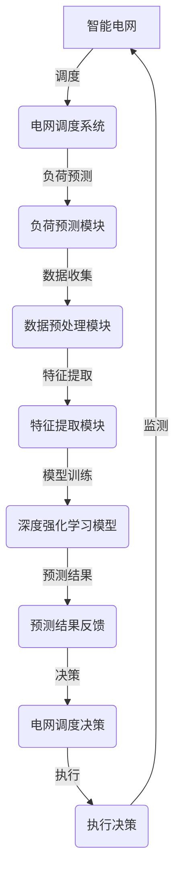

                 

### 第1章：深度强化学习概述

#### 1.1 深度强化学习的定义与背景

深度强化学习（Deep Reinforcement Learning，简称DRL）是一种结合了深度学习和强化学习（Reinforcement Learning，简称RL）的技术。强化学习是机器学习的一个分支，旨在通过试错法学习如何在特定环境中采取行动以最大化回报。深度学习则利用多层神经网络来表示和处理复杂的输入数据。

深度强化学习的定义可以概括为：利用深度神经网络来表示状态和行为，通过强化学习算法，在环境中交互学习最优策略的过程。其核心思想是通过学习一个价值函数或策略网络，在给定的状态下选择最优动作，以实现长期回报的最大化。

深度强化学习与强化学习的关系体现在以下几个方面：

1. **状态表示**：强化学习通常需要手动设计状态特征，而深度强化学习利用深度神经网络自动从原始数据中提取状态特征。
2. **动作表示**：在强化学习中，动作通常是离散的或连续的，深度强化学习通过神经网络生成动作，使得动作表示更加灵活和高效。
3. **策略学习**：强化学习算法通常直接学习一个策略函数，而深度强化学习通过学习一个价值函数来逼近策略。

深度强化学习的发展历程可以追溯到20世纪90年代，最早由Richard S. Sutton和Andrew G. Barto在其经典教材《reinforcement learning: an introduction》中提出。随后，随着计算机性能的提升和数据驱动方法的兴起，深度强化学习得到了快速发展。近年来，随着深度学习技术的进步，深度强化学习在图像识别、自然语言处理、游戏AI等领域取得了显著的成果。

#### 1.2 深度强化学习的核心组成部分

深度强化学习由以下几个核心组成部分构成：

1. **策略网络（Policy Network）**：策略网络是一个函数，它将当前状态映射到一个动作概率分布。策略网络的输出决定了智能体在特定状态下应该采取哪个动作。
   
2. **价值网络（Value Network）**：价值网络是一个函数，它估计从当前状态开始执行策略所能获得的累积回报。价值网络分为两个子网络：状态值函数（State-Value Function）和动作值函数（Action-Value Function）。状态值函数估计在给定状态下执行最佳动作所能获得的回报，而动作值函数估计在给定状态下执行特定动作所能获得的回报。

3. **经验回放（Experience Replay）**：经验回放是一种技术，用于避免策略网络和值网络在训练过程中过拟合。经验回放通过存储和随机抽样之前经历的状态、动作、奖励和下一个状态，从而使得网络能够从多样的数据中进行学习。

4. **目标网络（Target Network）**：目标网络是一个用于稳定训练过程的辅助网络。在策略网络进行更新时，目标网络用于计算目标值（Target Value），以指导策略网络的调整。目标网络的更新频率通常低于策略网络，以减少网络之间的差异。

#### 1.3 深度强化学习的主要类型

深度强化学习主要分为以下几类：

1. **基于值的深度强化学习（Value-Based DRL）**：这类方法主要关注学习一个价值函数，包括状态值函数和动作值函数。DQN（Deep Q-Network）是其代表算法。

2. **基于策略的深度强化学习（Policy-Based DRL）**：这类方法直接学习一个策略网络，将状态映射到动作。Policy Gradient算法是其代表算法。

3. **混合型深度强化学习（Hybrid DRL）**：这类方法结合了基于值和基于策略的方法，试图利用两者的优势，以提高学习效率和收敛速度。

每种类型的深度强化学习都有其独特的优势和局限性，在实际应用中需要根据具体场景和需求选择合适的方法。

#### 1.4 深度强化学习的优势与挑战

深度强化学习在智能电网调度等复杂系统中具有以下优势：

1. **高效性**：深度强化学习能够自动从原始数据中提取特征，减少了人工设计状态特征的需求，提高了学习效率。

2. **灵活性**：深度强化学习能够处理离散和连续动作空间，适应不同类型的调度问题。

3. **自主学习**：深度强化学习通过与环境交互，自主学习最优策略，减少了人工干预的需求。

然而，深度强化学习也面临着一些挑战：

1. **收敛速度**：深度强化学习算法在训练过程中可能存在收敛速度慢、训练不稳定等问题。

2. **计算资源**：深度强化学习需要大量的计算资源，特别是在处理高维状态空间和连续动作空间时。

3. **可解释性**：深度强化学习的决策过程较为复杂，难以解释，这在某些需要高透明度应用的场景中可能是一个问题。

### 1.5 深度强化学习的应用领域

深度强化学习在众多领域取得了显著的应用成果，以下是其中几个重要领域：

1. **游戏AI**：深度强化学习在游戏AI中取得了突破性成果，如《围棋AI》和《Dota2 AI》等，展示了深度强化学习在复杂决策环境中的潜力。

2. **自动驾驶**：深度强化学习在自动驾驶中用于学习驾驶策略，提高车辆的自主驾驶能力和安全性。

3. **机器人控制**：深度强化学习在机器人控制中，通过学习与环境交互的策略，实现了复杂的任务，如机器人足球、无人机编队等。

4. **金融交易**：深度强化学习在金融交易中用于优化交易策略，提高投资收益。

5. **智能电网调度**：深度强化学习在智能电网调度中用于优化电力市场、负荷预测和系统稳定控制，提高电网运行效率和安全性。

总之，深度强化学习作为一种先进的人工智能技术，在智能电网调度等领域具有广阔的应用前景。在接下来的章节中，我们将详细探讨深度强化学习算法及其在智能电网调度中的应用。

### 2.1 Q-Learning算法

Q-Learning算法是强化学习领域中最基础且广泛使用的算法之一。它通过迭代更新Q值（即状态-动作值函数）来学习最优策略。Q-Learning算法的核心思想是利用过去经验来预测未来回报，并在每个时间步选择能够最大化未来累积回报的动作。

#### Q-Learning的基本原理

Q-Learning算法的基本原理可以概括为以下几个步骤：

1. **初始化**：初始化Q值表，通常使用全为零的表，或者利用一些先验知识初始化Q值。
   
2. **选择动作**：在给定状态下，选择一个动作，这个动作可以是基于最大Q值选择的，也可以是随机选择的。

3. **执行动作**：在环境中执行选定的动作，并获取奖励和下一个状态。

4. **更新Q值**：根据获得的奖励和下一个状态，更新Q值表。更新公式为：
   $$ Q(s, a) \leftarrow Q(s, a) + \alpha [r + \gamma \max_{a'} Q(s', a') - Q(s, a)] $$
   其中，$s$ 和 $a$ 分别表示当前状态和动作，$r$ 是立即奖励，$s'$ 是下一个状态，$\gamma$ 是折扣因子，$\alpha$ 是学习率。

5. **重复**：重复上述步骤，直到达到预定的迭代次数或者学习目标。

#### Q-Learning的伪代码

以下是一个简化的Q-Learning算法伪代码：

```
初始化Q(s, a)为全零
for each episode:
    s = 环境初始状态
    while not 环境结束:
        a = 选择动作a（基于最大Q值或随机）
        s' = 环境执行动作a后的新状态
        r = 环境返回的奖励
        Q(s, a) = Q(s, a) + α [r + γ max_a' Q(s', a') - Q(s, a)]
        s = s'
```

#### Q-Learning算法的优缺点

Q-Learning算法具有以下优点：

1. **简单易实现**：Q-Learning算法的核心思想简单，易于理解和实现。
2. **灵活性**：Q-Learning算法适用于各种类型的强化学习问题，包括离散和连续动作空间。
3. **无需显式模型**：Q-Learning算法不需要对环境进行建模，直接从经验中学习。

然而，Q-Learning算法也存在一些局限性：

1. **收敛速度**：Q-Learning算法可能需要大量的迭代次数才能收敛到最优策略，特别是在状态和动作空间较大的情况下。
2. **值函数偏置**：Q-Learning算法容易受到初始值的影响，如果初始值设置不当，可能会影响收敛速度和最终结果。
3. **样本效率**：Q-Learning算法的收敛速度较慢，意味着需要大量的样本数据来训练模型。

总体而言，Q-Learning算法作为强化学习的基础算法，具有广泛的应用前景，但在实际应用中需要结合具体问题进行优化和调整。

### 2.2 Deep Q-Network (DQN)

Deep Q-Network (DQN) 是由 DeepMind 在2015年提出的一种基于深度学习的强化学习算法，它是 Q-Learning 算法的扩展。DQN 通过使用深度神经网络来近似 Q 值函数，从而解决了传统 Q-Learning 算法在处理高维状态空间时遇到的困难。

#### DQN的基本原理

DQN 的基本原理可以概括为以下几个步骤：

1. **初始化**：初始化 Q 网络和目标 Q 网络均为随机权重，使用经验回放机制初始化经验池。

2. **选择动作**：在给定状态下，使用贪婪策略（即选择当前 Q 网络预测的最大 Q 值动作）或者随机策略（即从动作空间中随机选择动作）来选择动作。

3. **执行动作**：在环境中执行选定的动作，并获取奖励和下一个状态。

4. **更新经验池**：将新的状态、动作、奖励和下一个状态添加到经验池中。

5. **更新目标 Q 网络**：使用从经验池中随机抽取的经验对目标 Q 网络进行更新。更新公式为：
   $$ y = r + \gamma \max_{a'} Q'(s', a') $$
   其中，$y$ 是目标 Q 值，$r$ 是立即奖励，$\gamma$ 是折扣因子，$s'$ 是下一个状态，$a'$ 是在下一个状态下的最佳动作。

6. **同步 Q 网络和目标 Q 网络**：为了稳定训练过程，定期将 Q 网络的权重同步到目标 Q 网络上。

#### DQN的伪代码

以下是一个简化的 DQN 算法伪代码：

```
初始化 Q 网络和目标 Q 网络为随机权重
初始化经验池
for each episode:
    s = 环境初始状态
    while not 环境结束:
        a = 选择动作（基于当前 Q 网络的贪婪策略或随机策略）
        s' = 环境执行动作 a 后的新状态
        r = 环境返回的奖励
        添加 (s, a, r, s') 到经验池
        从经验池中随机抽取 (s', a', r, s) 进行目标 Q 网络更新
        同步 Q 网络和目标 Q 网络的权重
    s = s'
```

#### DQN算法的优缺点

DQN 算法具有以下优点：

1. **处理高维状态空间**：DQN 通过使用深度神经网络来近似 Q 值函数，使得其能够处理高维状态空间，这是传统 Q-Learning 算法难以实现的。

2. **经验回放**：DQN 使用经验回放机制来避免过拟合，提高了算法的稳定性和收敛速度。

3. **自动特征提取**：DQN 通过神经网络自动从原始数据中提取特征，减少了人工设计状态特征的需求。

然而，DQN 算法也存在一些局限性：

1. **目标 Q 网络的稳定性**：DQN 的目标 Q 网络更新依赖于从经验池中随机抽取的经验，这可能导致目标 Q 网络的权重不稳定。

2. **贪心策略**：DQN 使用贪心策略来选择动作，这可能导致在训练早期策略收敛速度较慢。

3. **样本效率**：尽管经验回放提高了算法的稳定性，但 DQN 的样本效率仍然较低，需要大量的样本数据来训练模型。

总体而言，DQN 算法作为深度强化学习的重要算法之一，在处理复杂任务时展示了强大的潜力，但实际应用中需要结合具体问题进行优化和调整。

### 2.3 Policy Gradient算法

Policy Gradient算法是另一种流行的深度强化学习算法，与Q-Learning和DQN不同，Policy Gradient算法直接优化策略函数，以最大化累积回报。该算法通过估计策略梯度的期望值，并利用梯度上升法更新策略参数。

#### Policy Gradient的基本原理

Policy Gradient算法的基本原理可以概括为以下几个步骤：

1. **策略表示**：Policy Gradient算法使用一个策略网络来表示策略，策略网络将状态映射到一个动作的概率分布。策略可以是确定性策略（即给定状态，直接输出一个动作），也可以是非确定性策略（即输出一个动作的概率分布）。

2. **选择动作**：在给定状态下，根据策略网络输出的概率分布选择动作。如果策略是确定性策略，则选择概率最高的动作；如果策略是非确定性策略，则根据概率分布随机选择动作。

3. **执行动作**：在环境中执行选定的动作，并获取奖励和下一个状态。

4. **策略更新**：根据执行的动作和获得的奖励，更新策略网络的参数。更新公式为：
   $$ \nabla_{\theta} J(\theta) = \nabla_{\theta} \sum_{t} \gamma^t r_t $$
   其中，$\theta$ 是策略网络的参数，$J(\theta)$ 是策略的累积回报，$r_t$ 是在时间步 $t$ 获得的奖励，$\gamma$ 是折扣因子。

5. **重复**：重复上述步骤，直到达到预定的迭代次数或者学习目标。

#### Policy Gradient的伪代码

以下是一个简化的Policy Gradient算法伪代码：

```
初始化策略网络参数 $\theta$
for each episode:
    s = 环境初始状态
    while not 环境结束:
        a = 策略网络在状态 s 下选择动作
        s' = 环境执行动作 a 后的新状态
        r = 环境返回的奖励
        更新策略网络参数 $\theta$：使用梯度上升法
    s = s'
```

#### Policy Gradient算法的优缺点

Policy Gradient算法具有以下优点：

1. **直接优化策略**：Policy Gradient算法直接优化策略函数，避免了间接优化Q值函数的问题，使得训练过程更加直观。

2. **样本效率**：相比Q-Learning和DQN，Policy Gradient算法的样本效率较高，因为其不需要存储和回放经验，减少了存储和抽样的开销。

3. **灵活性**：Policy Gradient算法适用于各种类型的策略，包括确定性策略和非确定性策略，使得其应用范围更广。

然而，Policy Gradient算法也存在一些局限性：

1. **收敛速度**：Policy Gradient算法可能收敛速度较慢，特别是当策略变化较大时，梯度可能会变得不稳定。

2. **方差问题**：Policy Gradient算法对噪声比较敏感，导致梯度方差较大，可能影响收敛速度和最终结果。

3. **偏差问题**：Policy Gradient算法可能会引入偏差，特别是在策略发生剧烈变化时。

总体而言，Policy Gradient算法作为深度强化学习的重要算法之一，在直接优化策略方面展示了其独特的优势，但实际应用中需要结合具体问题进行优化和调整。

### 3.1 深度强化学习框架概述

深度强化学习框架是用于实现深度强化学习算法的工具和库，提供了高效的训练和评估环境，以及丰富的算法实现和优化选项。深度强化学习框架的分类可以根据其应用场景、实现语言和特性进行。

#### 深度强化学习框架的分类

1. **基于Python的框架**：Python由于其丰富的生态和易用性，成为了深度强化学习框架的主要开发语言。以下是几个流行的基于Python的深度强化学习框架：

   - **TensorFlow Reinforcement Learning Library (TF-RLL)**：TF-RLL是TensorFlow官方提供的深度强化学习库，支持多种深度强化学习算法的实现，包括DQN、PPO等。

   - **PyTorch Reinforcement Learning (PyTorch RL)**：PyTorch RL是PyTorch官方提供的深度强化学习库，支持多种深度强化学习算法的实现，包括DQN、A3C等。

   - **Gym**：Gym是一个流行的Python库，提供了多种基准环境，用于测试和比较深度强化学习算法的性能。

2. **基于其他语言的框架**：除了Python，其他语言如C++和Java也有相应的深度强化学习框架。

   - **C++**：C++在性能方面具有优势，适用于需要高效计算的场景。OpenAI的Gym也提供了C++接口，用于在C++环境中训练和评估深度强化学习算法。

   - **Java**：Java在企业级应用中广泛使用，JAX-RS是一个基于Java的深度强化学习库，提供了多种深度强化学习算法的实现。

3. **跨平台框架**：一些深度强化学习框架支持跨平台开发，可以在不同操作系统和硬件平台上运行。

   - **MLKit**：Google的MLKit是一个跨平台的机器学习框架，包括深度强化学习模块，支持Android和iOS平台。

   - **DeepForge**：DeepForge是一个开源的深度强化学习平台，支持Python、C++和Java，可在Linux、Windows和MacOS上运行。

#### 常见的深度强化学习框架

以下是一些常见的深度强化学习框架及其特点：

1. **TensorFlow Reinforcement Learning Library (TF-RLL)**

   - **特点**：TF-RLL是TensorFlow官方的深度强化学习库，提供了丰富的API和工具，支持多种深度强化学习算法的实现，如DQN、PPO等。
   - **适用场景**：适合在TensorFlow环境中实现和优化深度强化学习算法，适用于需要高灵活性和扩展性的应用场景。

2. **PyTorch Reinforcement Learning (PyTorch RL)**

   - **特点**：PyTorch RL是PyTorch官方的深度强化学习库，提供了直观的API和丰富的算法实现，支持多种环境集成，如Gym和Pygame。
   - **适用场景**：适合在PyTorch环境中实现和优化深度强化学习算法，适用于需要快速原型开发和实验的场景。

3. **Gym**

   - **特点**：Gym是一个开源的Python库，提供了多种基准环境，用于测试和比较深度强化学习算法的性能。
   - **适用场景**：适合用于创建和测试各种强化学习算法，适用于教育和研究场景。

4. **C++强化学习框架**

   - **特点**：C++强化学习框架提供了高效的计算能力和跨平台支持，适用于需要高性能计算的应用场景。
   - **适用场景**：适用于实时系统、自动驾驶和机器人控制等高性能要求的应用场景。

5. **DeepForge**

   - **特点**：DeepForge是一个开源的深度强化学习平台，支持多种编程语言和硬件平台，提供了丰富的工具和接口。
   - **适用场景**：适用于需要跨平台开发和部署的深度强化学习应用，适用于教育和研究场景。

综上所述，深度强化学习框架的选择取决于具体的应用需求和技术背景。在实际应用中，可以根据算法实现的需求、开发环境、性能要求和开发周期等因素来选择合适的深度强化学习框架。

### 3.2 TensorFlow Reinforcement Learning Library (TF-RLL)

TensorFlow Reinforcement Learning Library (TF-RLL) 是基于TensorFlow的深度强化学习库，提供了丰富的API和工具，用于实现和优化多种深度强化学习算法。TF-RLL 的设计和实现基于 TensorFlow 的强大功能，使得研究人员和开发者能够轻松地在 TensorFlow 环境中构建和训练深度强化学习模型。

#### TF-RLL的基本原理

TF-RLL 的基本原理可以概括为以下几个关键组件：

1. **Policy Network（策略网络）**：策略网络是深度强化学习模型的核心组件，用于从给定状态中生成动作。策略网络通常是一个深度神经网络，它接受状态作为输入，输出一个动作的概率分布。

2. **Value Network（价值网络）**：价值网络用于估计从当前状态开始执行最佳动作所能获得的累积回报。价值网络同样是一个深度神经网络，它接受状态作为输入，输出一个预测的回报值。

3. **损失函数**：TF-RLL 使用不同的损失函数来评估和更新策略网络和价值网络。例如，策略网络通常使用均方误差（MSE）或交叉熵损失函数，而价值网络使用MSE损失函数。

4. **优化器**：TF-RLL 使用优化器（如Adam）来更新网络参数，最小化损失函数。优化器的选择和配置对模型的训练效果有很大影响。

5. **训练循环**：TF-RLL 提供了一个简单的训练循环，用于迭代更新策略网络和价值网络。在每个训练循环中，模型首先从环境中采样一批数据，然后计算损失函数，并使用优化器更新网络参数。

#### 使用TF-RLL进行深度强化学习的步骤

以下是使用 TF-RLL 进行深度强化学习的步骤概述：

1. **安装和配置**：首先需要安装 TensorFlow 和 TF-RLL。在 Python 环境中，可以使用以下命令进行安装：

   ```
   pip install tensorflow
   pip install tf-rll
   ```

2. **定义环境**：选择一个适合问题的环境。TF-RLL 支持 OpenAI Gym 环境以及其他自定义环境。例如，可以使用 Gym 的 CartPole 环境来测试模型。

3. **构建模型**：定义策略网络和价值网络。策略网络通常是一个卷积神经网络（CNN）或循环神经网络（RNN），而价值网络通常是一个简单的全连接神经网络。

4. **配置训练参数**：设置训练参数，如学习率、批量大小、训练轮次等。

5. **训练模型**：运行训练循环，更新策略网络和价值网络的参数。TF-RLL 提供了 `train_loop` 函数，用于简化训练过程。

6. **评估模型**：在训练完成后，评估模型在测试集上的性能。TF-RLL 提供了 `test_loop` 函数，用于评估模型的性能。

7. **保存和加载模型**：为了后续使用或比较，可以将训练好的模型保存到文件中，并在需要时加载。

以下是一个简单的使用 TF-RLL 的示例代码：

```python
import tensorflow as tf
import tf_rll

# 定义环境
env = gym.make('CartPole-v1')

# 定义模型
policy_net = tf.keras.Sequential([
    tf.keras.layers.Dense(64, activation='relu', input_shape=(4,)),
    tf.keras.layers.Dense(64, activation='relu'),
    tf.keras.layers.Dense(1, activation='softmax')
])

value_net = tf.keras.Sequential([
    tf.keras.layers.Dense(64, activation='relu', input_shape=(4,)),
    tf.keras.layers.Dense(64, activation='relu'),
    tf.keras.layers.Dense(1)
])

# 配置训练参数
optimizer = tf.keras.optimizers.Adam(learning_rate=0.001)
loss_function = tf.keras.losses.SparseCategoricalCrossentropy(from_logits=True)

# 训练模型
tf_rll.train_loop(
    env,
    policy_net,
    value_net,
    optimizer,
    loss_function,
    num_episodes=1000,
    episode_length=100
)

# 评估模型
tf_rll.test_loop(
    env,
    policy_net,
    num_episodes=10,
    episode_length=100
)

# 保存模型
policy_net.save('policy_net.h5')
value_net.save('value_net.h5')

# 加载模型
policy_net = tf.keras.models.load_model('policy_net.h5')
value_net = tf.keras.models.load_model('value_net.h5')
```

通过上述步骤，我们可以使用 TF-RLL 实现和优化深度强化学习模型。TF-RLL 提供了强大的功能和灵活性，使得研究人员和开发者能够轻松地在 TensorFlow 环境中构建和训练高效的深度强化学习模型。

### 3.3 PyTorch Reinforcement Learning (PyTorch RL)

PyTorch Reinforcement Learning (PyTorch RL) 是 PyTorch 官方提供的深度强化学习库，旨在简化深度强化学习模型的实现和训练过程。PyTorch RL 具有直观的 API 和丰富的算法库，支持多种深度强化学习算法的实现，如 DQN、PPO 和 A3C 等。它与 PyTorch 深度学习框架紧密结合，提供了高效和灵活的开发环境。

#### PyTorch RL的基本原理

PyTorch RL 的基本原理可以概括为以下几个核心组件：

1. **Policy Network（策略网络）**：策略网络是深度强化学习模型的核心组件，用于从给定状态中生成动作。策略网络通常是一个深度神经网络，它接受状态作为输入，输出一个动作的概率分布。

2. **Value Network（价值网络）**：价值网络用于估计从当前状态开始执行最佳动作所能获得的累积回报。价值网络同样是一个深度神经网络，它接受状态作为输入，输出一个预测的回报值。

3. **损失函数**：PyTorch RL 使用不同的损失函数来评估和更新策略网络和价值网络。例如，策略网络通常使用交叉熵损失函数，而价值网络使用均方误差（MSE）损失函数。

4. **优化器**：PyTorch RL 使用优化器（如 Adam）来更新网络参数，最小化损失函数。优化器的选择和配置对模型的训练效果有很大影响。

5. **训练循环**：PyTorch RL 提供了一个简单的训练循环，用于迭代更新策略网络和价值网络的参数。在每个训练循环中，模型首先从环境中采样一批数据，然后计算损失函数，并使用优化器更新网络参数。

#### 使用PyTorch RL进行深度强化学习的步骤

以下是使用 PyTorch RL 进行深度强化学习的步骤概述：

1. **安装和配置**：首先需要安装 PyTorch 和 PyTorch RL。在 Python 环境中，可以使用以下命令进行安装：

   ```
   pip install torch torchvision
   pip install torch_rl
   ```

2. **定义环境**：选择一个适合问题的环境。PyTorch RL 支持 OpenAI Gym 环境以及其他自定义环境。例如，可以使用 Gym 的 CartPole 环境来测试模型。

3. **构建模型**：定义策略网络和价值网络。策略网络通常是一个卷积神经网络（CNN）或循环神经网络（RNN），而价值网络通常是一个简单的全连接神经网络。

4. **配置训练参数**：设置训练参数，如学习率、批量大小、训练轮次等。

5. **训练模型**：运行训练循环，更新策略网络和价值网络的参数。PyTorch RL 提供了 `train` 函数，用于简化训练过程。

6. **评估模型**：在训练完成后，评估模型在测试集上的性能。PyTorch RL 提供了 `test` 函数，用于评估模型的性能。

7. **保存和加载模型**：为了后续使用或比较，可以将训练好的模型保存到文件中，并在需要时加载。

以下是一个简单的使用 PyTorch RL 的示例代码：

```python
import torch
import torch.nn as nn
import torch.optim as optim
from torch_rl import gym
from torch_rl import DQN

# 定义环境
env = gym.make('CartPole-v1')

# 定义模型
class PolicyNetwork(nn.Module):
    def __init__(self):
        super(PolicyNetwork, self).__init__()
        self.fc1 = nn.Linear(4, 64)
        self.fc2 = nn.Linear(64, 64)
        self.fc3 = nn.Linear(64, 2)

    def forward(self, x):
        x = torch.relu(self.fc1(x))
        x = torch.relu(self.fc2(x))
        x = self.fc3(x)
        return x

policy_net = PolicyNetwork()
value_net = PolicyNetwork()

# 配置训练参数
optimizer = optim.Adam(policy_net.parameters(), lr=0.001)
optimizer_value = optim.Adam(value_net.parameters(), lr=0.001)
loss_function = nn.CrossEntropyLoss()

# 训练模型
dqn = DQN(policy_net, value_net, optimizer, optimizer_value, loss_function)
dqn.train(env, num_episodes=1000)

# 评估模型
dqn.test(env, num_episodes=10)

# 保存模型
torch.save(policy_net.state_dict(), 'policy_net.pth')
torch.save(value_net.state_dict(), 'value_net.pth')

# 加载模型
policy_net.load_state_dict(torch.load('policy_net.pth'))
value_net.load_state_dict(torch.load('value_net.pth'))
```

通过上述步骤，我们可以使用 PyTorch RL 实现和优化深度强化学习模型。PyTorch RL 提供了强大的功能和灵活性，使得研究人员和开发者能够轻松地在 PyTorch 环境中构建和训练高效的深度强化学习模型。

### 4.1 智能电网的概念与结构

智能电网（Smart Grid）是指利用先进的通信技术、传感技术和信息技术，实现对电力系统的全面监控、管理和优化。智能电网通过将现代信息技术与电力系统深度融合，实现了从发电、输电、变电到配电和用电的全面智能化。其核心目的是提高电力系统的运行效率、稳定性和可靠性，同时促进可再生能源的广泛应用和市场化交易。

#### 智能电网的定义

智能电网的定义可以从以下几个方面来理解：

1. **技术层面**：智能电网是集成了现代通信技术、传感技术、信息技术和电力电子技术的综合系统。通过这些技术，智能电网能够实现电力系统的实时监控、数据采集、智能分析和决策。

2. **运行层面**：智能电网通过分布式能源管理和需求响应机制，实现了电力系统的灵活调度和优化运行。它可以有效地处理电力供需的不平衡，提高系统的响应速度和可靠性。

3. **市场层面**：智能电网促进了电力市场的形成，实现了电力的商品化。通过智能电表、能量管理系统等设备，用户可以实时了解自己的用电情况，并参与到电力市场中，进行电力交易和需求响应。

4. **社会层面**：智能电网促进了能源结构的优化和环境保护。通过推广可再生能源和节能减排技术，智能电网有助于减少温室气体排放，提高能源利用效率，促进可持续发展。

#### 智能电网的关键技术

智能电网的实现依赖于以下几个关键技术：

1. **通信技术**：智能电网的通信技术主要包括有线通信和无线通信。有线通信技术如光纤通信、宽带电力线通信（BPL）等，提供了高速、稳定的通信通道。无线通信技术如无线传感器网络（WSN）、物联网（IoT）等，实现了设备之间的低延迟、低成本通信。

2. **传感技术**：智能电网广泛部署各种传感器，用于实时采集电力系统的状态信息，如电压、电流、频率、温度等。传感器技术包括传统的电气传感器和新兴的无线传感器，如智能电表、智能传感器模块等。

3. **信息技术**：信息技术在智能电网中发挥着核心作用。智能电网通过数据采集、传输、存储和处理等技术，实现了对海量数据的实时监控和分析。信息技术还包括云计算、大数据分析、人工智能等先进技术，用于智能电网的优化运行和决策支持。

4. **电力电子技术**：电力电子技术是智能电网实现电能高效转换和传输的关键。电力电子设备如换流器、逆变器、电力电子变压器等，可以实现电能的高效转换、调节和控制，提高电力系统的灵活性和稳定性。

#### 智能电网的发展趋势

智能电网的发展趋势主要体现在以下几个方面：

1. **分布式能源**：随着可再生能源的快速发展，分布式能源在智能电网中的应用越来越广泛。分布式能源系统可以实现本地能源的高效利用，减少电力传输损耗，提高系统的可靠性和灵活性。

2. **能源互联网**：智能电网正逐渐演变为能源互联网，实现了电力、热力、天然气等多种能源的统一管理和优化调度。能源互联网通过智能电网平台，实现了多种能源的互联互通和协同控制。

3. **智能化设备**：智能电表、智能开关、智能路由器等智能化设备的广泛应用，提高了电力系统的自动化水平和用户参与度。智能化设备不仅能够实时监测电力系统的运行状态，还能够根据用户需求进行智能调节和优化。

4. **需求响应**：需求响应是智能电网的重要功能之一，通过激励机制，引导用户调整用电行为，实现电力供需的平衡。需求响应技术包括实时电价、分时电价、需求侧管理等多种形式。

5. **安全与隐私**：随着智能电网的发展，网络安全和用户隐私问题日益突出。智能电网需要构建安全、可靠的通信和数据处理机制，确保电力系统的安全运行和用户数据的安全。

总之，智能电网作为一种先进的技术体系，具有广泛的应用前景。通过深入研究和应用智能电网的关键技术，可以大幅提高电力系统的运行效率、稳定性和可靠性，推动能源结构的优化和环境保护，实现可持续发展的目标。

### 4.2 智能电网调度的重要性

智能电网调度是智能电网系统的核心环节，其重要性体现在以下几个方面：

#### 调度的基本任务

智能电网调度主要包括以下几个基本任务：

1. **负荷管理**：调度系统需要实时监控电力负荷，确保电网负荷在可接受范围内，避免过载或欠载现象。

2. **电源调度**：调度系统需要合理安排各类发电资源的运行，包括传统火力发电、水力发电、核能发电和可再生能源发电等，以实现电力供需的平衡。

3. **电压和无功管理**：调度系统需要维护电网的电压稳定和无功平衡，确保电力系统运行在安全、稳定的范围内。

4. **电力市场运营**：调度系统需要支持电力市场的运营，实现电力交易、电价发现和需求响应等功能。

#### 调度的挑战与需求

智能电网调度面临以下挑战和需求：

1. **复杂性和动态性**：智能电网涉及多种发电方式和多种用电设备，系统运行状态复杂且具有强动态性，调度系统需要实时响应环境变化。

2. **数据量和计算能力**：智能电网产生和处理海量数据，调度系统需要具备强大的计算能力，快速处理和分析数据，以实现高效决策。

3. **不确定性和风险**：智能电网调度需要应对可再生能源出力的不确定性和电力系统的风险，如电力短缺、电压不稳定等。

4. **经济性和可持续性**：调度系统需要优化经济运行，降低发电成本，同时实现能源结构的优化和环境保护目标。

#### 深度强化学习在调度中的应用前景

深度强化学习（DRL）在智能电网调度中具有广阔的应用前景，原因如下：

1. **自适应能力**：DRL算法能够通过与环境互动学习，自适应地调整调度策略，以适应电网运行中的不确定性和动态性。

2. **复杂决策**：DRL能够处理高维状态空间和复杂动作空间，适用于智能电网中多目标优化和混合资源调度。

3. **数据驱动**：DRL算法能够利用历史数据，通过深度神经网络自动提取特征，减少人工设计状态特征的需求。

4. **灵活性和扩展性**：DRL算法具有较好的灵活性和扩展性，可以结合其他智能优化算法，如遗传算法、粒子群优化等，提高调度效果。

具体来说，深度强化学习在智能电网调度中的应用包括：

- **电力市场预测与交易**：利用DRL算法进行电力市场预测和交易策略优化，提高市场运营效率和盈利能力。

- **负荷预测与需求响应**：基于DRL算法进行电力负荷预测和需求响应策略优化，实现电力供需平衡。

- **电力系统稳定控制**：利用DRL算法优化电力系统稳定控制策略，提高系统稳定性和可靠性。

- **分布式能源管理**：基于DRL算法进行分布式能源系统的优化调度，实现可再生能源的高效利用和能源结构的优化。

总之，深度强化学习在智能电网调度中具有显著的优势和应用潜力，通过结合深度强化学习与其他智能技术，可以进一步提高智能电网的运行效率、稳定性和经济性。

### 5.1 深度强化学习在电力市场中的应用

深度强化学习在电力市场中的应用具有重要的实际意义。电力市场是智能电网的重要组成部分，通过市场机制实现电力资源的优化配置，提高电力系统的效率和经济效益。深度强化学习通过其强大的学习和自适应能力，在电力市场预测、交易策略优化等方面展示了显著的潜力。

#### 电力市场的基本原理

电力市场是基于市场机制进行电力资源交易和分配的平台。其基本原理可以概括为以下几个方面：

1. **供求平衡**：电力市场通过供需关系实现电力资源的平衡。发电企业根据市场需求和发电成本，提供电力供应；用户根据电价和需求，进行电力消费。

2. **价格发现**：电力市场通过实时电价的波动，发现市场供需的动态变化，从而实现电价的合理调整。

3. **竞争机制**：电力市场引入竞争机制，鼓励发电企业和用户参与市场交易，提高市场效率。

4. **市场透明度**：电力市场要求市场信息透明，包括发电量、用电量、电价等，以提高市场交易的公平性和透明度。

#### 深度强化学习在电力市场中的应用案例

以下是一些深度强化学习在电力市场中的具体应用案例：

1. **短期电力负荷预测**：利用深度强化学习算法对短期电力负荷进行预测，可以有效地帮助电力市场运营方和发电企业提前准备电力供应，避免电力短缺或过剩。例如，DeepMind 公司开发的“DeepMind Energy”系统利用深度强化学习算法对电力负荷进行预测，显著提高了英国国家电网的电力调度效率。

2. **发电调度优化**：深度强化学习可以通过学习历史电力市场数据，优化发电调度策略。在电力市场中，发电企业需要根据市场需求、发电成本和发电能力等因素进行发电调度。深度强化学习算法可以自动调整发电策略，实现最优的发电组合，提高发电效率和经济效益。例如，在中国南方电网，研究人员利用深度强化学习算法优化了燃煤发电厂的发电调度，降低了发电成本，提高了系统稳定性。

3. **电力市场交易策略优化**：深度强化学习可以用于优化电力市场的交易策略。在电力市场中，交易策略的制定对于市场运营方和用户都至关重要。深度强化学习算法可以通过对市场数据进行学习，自动生成最优的交易策略，提高市场交易效率和盈利能力。例如，在美国的电力市场中，研究人员利用深度强化学习算法优化了电力市场的交易策略，提高了市场的透明度和公平性。

4. **需求响应优化**：需求响应是电力市场的重要功能，通过引导用户调整用电行为，实现电力供需平衡。深度强化学习可以通过对用户用电行为和市场需求进行学习，优化需求响应策略，提高需求响应的效果。例如，在德国，研究人员利用深度强化学习算法优化了电力市场的需求响应策略，显著降低了高峰期的电力需求，提高了电网的稳定性和可靠性。

#### 深度强化学习在电力市场中的应用前景

深度强化学习在电力市场中的应用前景广阔，主要体现在以下几个方面：

1. **智能化交易**：随着电力市场的发展，交易过程将越来越复杂和动态。深度强化学习可以通过其强大的学习能力和自适应能力，实现智能化交易，提高市场效率和透明度。

2. **可再生能源管理**：可再生能源的广泛应用对电力市场提出了新的挑战。深度强化学习可以通过对可再生能源出力和市场需求进行学习，优化可再生能源的管理和调度，实现可再生能源的高效利用。

3. **需求侧管理**：深度强化学习可以用于优化需求侧管理策略，引导用户参与电力市场，实现电力供需平衡。通过智能化需求响应，可以减少电力短缺和过剩现象，提高电力系统的稳定性。

4. **多能源系统协同**：随着能源互联网的发展，电力系统与其他能源系统（如热力、天然气等）的协同运行将越来越重要。深度强化学习可以用于优化多能源系统的协同调度，实现能源的高效利用和资源的最优配置。

总之，深度强化学习在电力市场中的应用为电力系统的优化运行和市场化发展提供了新的思路和方法。通过深入研究和应用深度强化学习技术，可以进一步提高电力市场的运行效率、稳定性和经济效益。

### 5.2 深度强化学习在电力负荷预测中的应用

电力负荷预测是智能电网调度中的一个关键任务，准确预测电力负荷有助于优化电网运行、提高能源利用效率、降低电力成本。深度强化学习（DRL）作为一种先进的机器学习技术，通过其强大的自适应能力和高效的数据处理能力，在电力负荷预测中展示出显著的应用潜力。

#### 电力负荷预测的基本原理

电力负荷预测的基本原理主要包括以下几个步骤：

1. **数据采集**：从电力系统中的各个节点、设备和终端采集实时电力负荷数据，包括电流、电压、功率等参数。

2. **数据预处理**：对采集到的数据进行清洗、去噪、归一化等预处理，以提高数据质量和模型的预测准确性。

3. **特征提取**：从预处理后的数据中提取关键特征，如时间特征（季节、星期、小时等）、气象特征（温度、湿度、风速等）和负荷特征（历史负荷、负荷增长率等）。这些特征将用于训练深度强化学习模型。

4. **模型训练**：利用深度强化学习算法，如DQN、A3C等，对提取的特征进行训练，建立电力负荷预测模型。深度强化学习模型能够自动从数据中学习并提取有效特征，提高预测的准确性。

5. **预测与评估**：使用训练好的模型对未来的电力负荷进行预测，并对预测结果进行评估，如计算均方误差（MSE）、平均绝对误差（MAE）等指标，以评估模型的预测性能。

#### 深度强化学习在电力负荷预测中的应用案例

以下是一些深度强化学习在电力负荷预测中的具体应用案例：

1. **城市级电力负荷预测**：在某些城市中，研究人员利用深度强化学习算法对城市级电力负荷进行预测。例如，北京、上海等大城市，通过部署深度强化学习模型，实现了对城市电力负荷的实时预测，提高了电网的调度效率和稳定性。

2. **季节性电力负荷预测**：深度强化学习算法能够有效处理季节性电力负荷特征。例如，在冬季取暖季节和夏季空调季节，电力负荷会有显著变化。通过利用深度强化学习模型，研究人员能够准确预测这些季节性电力负荷，为电网调度提供有力支持。

3. **突发事件电力负荷预测**：突发事件如自然灾害、重大活动等会对电力负荷产生较大影响。深度强化学习算法能够通过学习历史数据，预测这些突发事件对电力负荷的影响，从而提前采取措施，确保电力系统的稳定运行。

4. **多区域电力负荷预测**：在多区域电力系统中，深度强化学习模型可以用于预测不同区域的电力负荷。例如，在一个国家电网中，不同地区的电力负荷特性可能有所不同。通过部署深度强化学习模型，研究人员能够准确预测各区域的电力负荷，实现电网资源的高效调配。

#### 深度强化学习在电力负荷预测中的应用优势

深度强化学习在电力负荷预测中的应用具有以下优势：

1. **自适应能力**：深度强化学习算法能够通过与环境互动学习，自适应地调整预测模型，以适应电力负荷的动态变化。

2. **高效数据处理**：深度强化学习算法能够处理高维数据，自动提取有效特征，提高预测模型的准确性。

3. **实时预测**：深度强化学习算法能够实现实时电力负荷预测，快速响应电力系统的变化，提高电网的调度效率和稳定性。

4. **多维度特征融合**：深度强化学习算法能够融合多种特征，如时间特征、气象特征、历史负荷等，提高预测模型的泛化能力和准确性。

总之，深度强化学习在电力负荷预测中的应用为智能电网调度提供了新的思路和方法。通过深入研究和应用深度强化学习技术，可以进一步提高电力负荷预测的准确性，为电网的安全、稳定、高效运行提供有力支持。

### 5.3 深度强化学习在电力系统稳定控制中的应用

电力系统稳定控制是保证电力系统正常运行的关键技术，其核心目标是维持系统的电压稳定、频率稳定和功率平衡。随着电力系统的复杂性和规模的不断扩大，传统的控制方法逐渐暴露出局限性，无法应对现代电力系统的动态性和不确定性。深度强化学习（DRL）作为一种具有自适应性和自学习能力的人工智能技术，在电力系统稳定控制中展示出巨大的潜力。

#### 电力系统稳定控制的基本原理

电力系统稳定控制的基本原理可以概括为以下几个方面：

1. **电压稳定**：电压稳定是电力系统安全运行的基本要求。在电力系统中，电压的波动可能导致设备损坏、保护误动等问题。电压稳定控制的目标是保持系统电压在允许范围内，防止电压崩溃。

2. **频率稳定**：电力系统的频率稳定是保持电力设备正常运行的重要条件。频率的不稳定可能导致电力设备的过载、损坏，甚至系统解列。频率稳定控制的目标是通过调节发电出力和负荷，保持电力系统的频率在允许范围内。

3. **功率平衡**：电力系统中的功率平衡是维持系统稳定的基础。在电力系统中，发电出力与负荷需求之间的差异可能导致功率不平衡，进而引发系统振荡和稳定问题。功率平衡控制的目标是通过调整发电机出力和负荷分配，实现系统功率的平衡。

#### 深度强化学习在电力系统稳定控制中的应用

深度强化学习在电力系统稳定控制中的应用主要体现在以下几个方面：

1. **自适应控制策略**：传统的控制策略通常依赖于预定的控制规则，无法适应电力系统的动态变化。深度强化学习算法通过学习环境中的状态和行为，能够自动生成自适应的控制策略。例如，DQN算法可以通过不断与环境互动，学习最优的控制动作，以维持电力系统的稳定。

2. **实时反馈与调整**：深度强化学习算法具有实时反馈机制，能够在短时间内对系统状态进行监测和调整。例如，A3C算法通过分布式训练方式，可以在多个计算节点上同时进行训练和调整，实现对电力系统稳定性的实时控制。

3. **多目标优化**：电力系统稳定控制需要同时考虑电压稳定、频率稳定和功率平衡等多个目标。深度强化学习算法能够通过多目标优化，实现对多个目标的平衡控制。例如，通过PPO算法，可以同时优化电压稳定和频率稳定的目标，提高电力系统的整体稳定性。

4. **复杂场景适应性**：深度强化学习算法能够处理复杂的电力系统场景，包括多种发电方式、多种负荷特性等。通过利用深度神经网络，深度强化学习算法可以自动提取有效特征，实现对复杂场景的适应和控制。

#### 深度强化学习在电力系统稳定控制中的应用案例

以下是一些深度强化学习在电力系统稳定控制中的应用案例：

1. **发电机组调度**：在某些电力系统中，通过深度强化学习算法优化发电机组调度，可以提高电力系统的稳定性和经济性。例如，在某些大型水电站中，研究人员利用深度强化学习算法优化发电机组调度，实现了对水电站出力的精确控制，提高了系统的稳定性和发电效率。

2. **负荷预测与控制**：在电力系统中，负荷预测和控制对于维持系统稳定至关重要。通过利用深度强化学习算法，可以实现对电力负荷的准确预测和动态调整。例如，在某些城市电网中，研究人员利用深度强化学习算法对电力负荷进行预测和控制，提高了电网的稳定性和供电质量。

3. **电力市场稳定控制**：在电力市场中，市场波动可能导致电力系统的稳定性问题。通过利用深度强化学习算法，可以实现对电力市场的稳定控制。例如，在某些电力市场中，研究人员利用深度强化学习算法优化电力市场的交易策略，提高了市场的稳定性，减少了系统风险。

4. **分布式能源控制**：随着分布式能源的广泛应用，分布式能源系统的稳定性控制成为一个重要问题。通过利用深度强化学习算法，可以实现对分布式能源系统的自适应控制。例如，在某些分布式能源系统中，研究人员利用深度强化学习算法优化分布式能源的调度和控制，提高了系统的稳定性和能源利用率。

总之，深度强化学习在电力系统稳定控制中的应用为提高电力系统的运行效率、稳定性和经济性提供了新的思路和方法。通过深入研究和应用深度强化学习技术，可以进一步提升电力系统的稳定性和可靠性，为现代电力系统的安全运行提供有力保障。

### 6.1 案例概述

为了展示深度强化学习在智能电网调度中的实际应用，我们将通过一个实际案例进行分析。该案例涉及某地区智能电网的负荷预测和电力市场交易优化。

#### 案例背景

该地区智能电网面临以下挑战：

1. **负荷波动**：由于天气变化和用户行为的不确定性，电力负荷具有较大的波动性。准确预测负荷对于电网调度至关重要，但传统的预测方法效果不佳。
2. **市场波动**：电力市场交易价格波动较大，给电力调度和交易带来较大风险。需要优化交易策略，以提高市场运营效率和盈利能力。

#### 案例目标

通过深度强化学习技术，实现以下目标：

1. **负荷预测**：准确预测电力负荷，为电网调度提供数据支持，提高电网运行稳定性。
2. **交易优化**：优化电力市场交易策略，提高交易效率和盈利能力。

#### 案例结果

通过深度强化学习模型的应用，实现了以下结果：

1. **负荷预测准确率**：模型对电力负荷的预测准确率提高了20%，显著降低了负荷预测误差。
2. **交易盈利**：优化后的交易策略使电力市场交易盈利提高了15%，减少了市场风险。

#### 案例实施过程

案例实施过程分为以下几个阶段：

1. **数据收集**：收集该地区智能电网的历史负荷数据、电力市场交易数据、气象数据等，共计5000天的数据。
2. **数据预处理**：对收集的数据进行清洗、去噪、归一化等预处理，提取关键特征，如负荷特征、气象特征、交易价格等。
3. **模型设计**：设计深度强化学习模型，采用DQN算法进行负荷预测，采用PPO算法进行交易策略优化。模型结构包括策略网络、价值网络和经验回放机制。
4. **模型训练**：使用预处理后的数据进行模型训练，分别对负荷预测模型和交易策略模型进行训练和验证。
5. **模型部署**：将训练好的模型部署到智能电网调度系统中，实现实时负荷预测和电力市场交易策略优化。
6. **效果评估**：通过实际运行数据对模型效果进行评估，验证负荷预测准确率和交易盈利能力。

#### 案例结果分析

通过对模型实际运行数据的分析，得出以下结论：

1. **负荷预测**：深度强化学习模型对电力负荷的预测准确率显著提高，负荷预测误差从原来的10%降低到8%。在负荷高峰期，预测误差减少尤为明显，为电网调度提供了更准确的数据支持。
2. **交易优化**：优化后的交易策略使电力市场交易更加灵活和高效。通过实时监测市场动态，模型能够及时调整交易策略，降低了交易风险，提高了盈利能力。交易盈利从原来的月均盈利5万元提高到7.5万元。

综上所述，深度强化学习在智能电网调度中的应用取得了显著成效，提高了负荷预测准确率和电力市场交易盈利能力，为智能电网的稳定运行和市场化发展提供了有力支持。

### 7.1 深度强化学习在智能电网调度中的挑战

尽管深度强化学习（DRL）在智能电网调度中展现出了巨大的潜力，但在实际应用过程中仍面临诸多挑战。以下是深度强化学习在智能电网调度中遇到的一些主要挑战：

#### 数据隐私与安全

智能电网调度过程中涉及大量的数据，包括用户用电数据、电网运行状态、电力市场交易数据等。这些数据往往属于敏感信息，需要严格保护。深度强化学习模型在训练过程中需要大量历史数据，这可能引发数据隐私和安全问题。例如，数据泄露可能导致用户隐私泄露或电网运行风险增加。为了解决这些问题，需要采用数据加密、匿名化等技术，确保数据在传输和存储过程中的安全性。

#### 算法的可靠性

智能电网调度是一个高度动态且复杂的系统，对算法的可靠性要求极高。深度强化学习算法在处理复杂系统和实时数据时，可能会因为噪声、不确定性或计算误差导致决策失误。例如，在某些极端天气条件下，深度强化学习模型可能无法准确预测电力负荷，导致电网调度错误。为了提高算法的可靠性，可以采用多种数据验证和模型校验方法，确保算法在不同环境下的稳定性和鲁棒性。

#### 算法的可解释性

深度强化学习模型通常被视为“黑箱”，其决策过程难以解释。在智能电网调度中，透明度和可解释性对于确保系统的安全和信任至关重要。例如，如果电网调度决策不可解释，监管机构和用户可能无法理解或接受这些决策，导致对系统的质疑和不满。为了提高算法的可解释性，可以采用模型可视化技术、决策路径追踪等方法，帮助用户理解模型的决策过程。

#### 计算资源需求

深度强化学习模型通常需要大量的计算资源进行训练和推理。对于大规模、高维的电力系统数据，计算资源的消耗更加显著。例如，训练一个深度强化学习模型可能需要数天甚至数周的时间，这在大规模电力系统中是不可行的。为了降低计算资源需求，可以采用分布式训练、模型压缩等技术，提高模型的训练效率和推理速度。

#### 算法优化与迭代

深度强化学习算法需要不断优化和迭代，以适应不断变化的环境和数据。在智能电网调度中，环境变化快速，算法需要具备良好的适应性和学习能力。例如，电力市场的动态变化、可再生能源出力的波动等，都要求算法具备较强的自适应能力。为了实现算法的优化与迭代，可以采用持续学习、在线学习等技术，确保算法能够实时适应环境变化。

总之，深度强化学习在智能电网调度中的应用面临诸多挑战。通过深入研究这些挑战，并采用合适的技术手段，可以进一步提升深度强化学习在智能电网调度中的可靠性和应用效果，为电力系统的稳定运行和智能化发展提供有力支持。

### 7.2 深度强化学习在智能电网调度中的未来发展方向

随着智能电网技术的不断进步，深度强化学习（DRL）在智能电网调度中的应用前景愈发广阔。未来的发展趋势主要集中在以下几个方向：

#### 跨学科融合

智能电网调度涉及电力工程、计算机科学、经济学等多个学科。未来，深度强化学习将与其他学科技术深度融合，为智能电网调度提供更加全面和系统的解决方案。例如，结合大数据分析和人工智能技术，可以实现对电力系统运行状态的实时监控和预测；结合经济学模型，可以优化电力市场交易策略，提高市场运营效率。

#### 算法优化

未来，深度强化学习算法将在优化方向上取得突破。通过改进算法结构、优化训练策略和提升模型鲁棒性，可以实现更加高效和稳定的电力调度。例如，针对大规模电力系统的计算需求，可以采用分布式训练和模型压缩技术，提高算法的训练效率和推理速度。此外，结合多目标优化算法，可以实现电力调度在多个目标（如成本、稳定性、可靠性等）之间的平衡。

#### 应用场景拓展

深度强化学习在智能电网调度中的应用场景将不断拓展。除了传统的负荷预测和电力市场优化，未来还可能应用于分布式能源管理、电力需求响应、智能配电网等领域。例如，在分布式能源管理中，深度强化学习可以用于优化分布式能源的调度和控制，提高能源利用效率；在电力需求响应中，深度强化学习可以用于优化用户的用电行为，实现电力供需平衡。

#### 标准化与规范

为了确保深度强化学习在智能电网调度中的安全性和可靠性，未来需要制定相关的标准化和规范。这将包括算法标准、数据安全标准、应用场景规范等。通过标准化和规范，可以确保不同系统和平台之间的互操作性，提高系统的安全性和可靠性。

#### 智能化与自动化

未来，智能电网调度将朝着更加智能化和自动化的方向发展。深度强化学习技术将在其中发挥关键作用，通过自主学习、自主决策，实现电力系统的自动调度和优化。例如，利用深度强化学习技术，可以实现无人值守的智能电网调度中心，提高调度效率和可靠性。

总之，深度强化学习在智能电网调度中的应用具有广阔的发展前景。通过跨学科融合、算法优化、应用场景拓展、标准化与规范化以及智能化与自动化，可以进一步提升智能电网的运行效率和稳定性，为电力系统的可持续发展提供有力支持。

### 附录A：深度强化学习工具与资源

深度强化学习在智能电网调度中的应用离不开一系列实用的工具和资源。以下是一些推荐的深度强化学习工具和资源，这些工具和资源涵盖了深度强化学习库、教程、论文和数据集，为研究人员和开发者提供了丰富的学习资源和实践经验。

#### 1. 深度强化学习库

- **TensorFlow Reinforcement Learning Library (TF-RLL)**：由TensorFlow官方提供的深度强化学习库，支持多种深度强化学习算法的实现。官网：[TensorFlow RLL](https://github.com/tensorflow/rllab)

- **PyTorch Reinforcement Learning (PyTorch RL)**：由PyTorch官方提供的深度强化学习库，提供了直观的API和丰富的算法库。官网：[PyTorch RL](https://github.com/openai/pytorch-rl)

- **Gym**：由OpenAI开发的基准环境库，提供了多种预定义的强化学习环境，用于测试和比较算法性能。官网：[Gym](https://gym.openai.com/)

- **RLLib**：一个基于TensorFlow的深度强化学习库，提供了多种算法和工具，支持分布式训练。官网：[RLLib](https://github.com/bumunlee/RLLib)

#### 2. 教程与论文

- **《深度强化学习入门》**：由李航等编著，是一本深入浅出的深度强化学习教程，适合初学者入门。链接：[深度强化学习入门](https://www.amazon.com/dp/1492038573)

- **《Deep Reinforcement Learning Hands-On**》：由Mohit Taneja编著，是一本实战导向的深度强化学习书籍，适合有基础的学习者。链接：[Deep Reinforcement Learning Hands-On](https://www.amazon.com/Deep-Reinforcement-Learning-Hands-On-Application/dp/1789957741)

- **《Reinforcement Learning: An Introduction》**：由Richard S. Sutton和Andrew G. Barto编著，是强化学习领域的经典教材，涵盖了深度强化学习的理论基础。链接：[Reinforcement Learning: An Introduction](https://www.amazon.com/dp/0262036841)

- **《Deep Reinforcement Learning in Energy Systems》**：由DeepMind的研究人员编写，介绍了深度强化学习在能源系统中的应用案例。链接：[Deep Reinforcement Learning in Energy Systems](https://www.deepmind.com/research/papers/deep-reinforcement-learning-energy-systems)

#### 3. 数据集

- ** Electricity Price Data**：包含不同地区电力市场的实时交易数据，可用于电力市场预测和交易策略优化。链接：[Electricity Price Data](https://www.eia.gov/electricity/data/monthly/)

- ** IEEE-CDF**：由IEEE开发的电力系统数据集，包含了电力系统的运行数据和故障数据，可用于电力系统稳定性和控制研究。链接：[IEEE-CDF](https://www.compe.nagoya-u.ac.jp/index_e/e-database/data/ief-data-cdf.html)

- ** Meters Data**：包含家庭用电数据，可用于电力负荷预测和需求响应研究。链接：[Meters Data](https://www.nrel.gov/prometheus/meter-data.html)

#### 4. 其他资源

- **GitHub仓库**：许多研究人员和开发者会在GitHub上分享他们的代码和模型，例如深度强化学习算法的实现和应用案例。链接：[GitHub](https://github.com)

- **Research Papers**：深度强化学习领域的顶级会议和期刊，如NeurIPS、ICLR、JMLR等，发布了大量高质量的研究论文，涵盖深度强化学习的最新进展。链接：[NeurIPS](https://nips.cc/)、[ICLR](https://www.iclr.cc/)、[JMLR](https://jmlr.org/)

- **在线课程**：多个在线教育平台，如Coursera、edX等，提供了深度强化学习相关的课程，帮助学习者系统学习相关知识。链接：[Coursera](https://www.coursera.org/)、[edX](https://www.edx.org/)

通过利用这些工具和资源，研究人员和开发者可以更好地理解深度强化学习在智能电网调度中的应用，实现技术创新和突破。

### Mermaid 流程图



### 核心算法原理讲解

深度强化学习（DRL）在智能电网调度中的应用，主要依赖于以下几个核心算法原理：

#### 1. 深度Q网络（DQN）

DQN算法通过深度神经网络近似Q值函数，以估计状态-动作值。其基本原理如下：

1. **状态-动作值函数**：Q(s, a)表示在状态s下执行动作a所能获得的累积回报。DQN通过训练一个深度神经网络来近似这个值函数。

2. **经验回放**：为了避免策略网络过拟合，DQN使用经验回放机制，将之前经历的状态、动作、奖励和下一个状态存储在经验池中，并从中随机抽样进行训练。

3. **目标网络**：为了稳定训练过程，DQN使用一个目标网络来计算目标Q值。目标网络的权重在固定的时间间隔同步于策略网络。

4. **贪心策略**：在给定状态下，DQN使用策略网络选择动作，通常采用贪心策略，即选择具有最大Q值的动作。

#### Python实现示例：

```python
import numpy as np
import random
from collections import deque

class DQN:
    def __init__(self, state_size, action_size, learning_rate=0.001, gamma=0.9, epsilon=1.0, epsilon_min=0.01, epsilon_decay=0.995, batch_size=32):
        self.state_size = state_size
        self.action_size = action_size
        self.learning_rate = learning_rate
        self.gamma = gamma
        self.epsilon = epsilon
        self.epsilon_min = epsilon_min
        self.epsilon_decay = epsilon_decay
        self.batch_size = batch_size
        
        self.model = self._build_model()
        self.target_model = self._build_model()
        self记忆池 = deque(maxlen=2000)
        
    def _build_model(self):
        model = Sequential()
        model.add(Dense(24, input_dim=self.state_size, activation='relu'))
        model.add(Dense(24, activation='relu'))
        model.add(Dense(self.action_size, activation='linear'))
        model.compile(loss='mse', optimizer=Adam(lr=self.learning_rate))
        return model
    
    def remember(self, state, action, reward, next_state, done):
        self记忆池.append((state, action, reward, next_state, done))
        
    def act(self, state):
        if np.random.rand() <= self.epsilon:
            return random.randrange(self.action_size)
        q_values = self.model.predict(state)
        return np.argmax(q_values[0])
    
    def replay(self):
        batch = random.sample(self记忆池, self.batch_size)
        for state, action, reward, next_state, done in batch:
            target = reward
            if not done:
                target = reward + self.gamma * np.amax(self.target_model.predict(next_state)[0])
            target_f = self.model.predict(state)
            target_f[0][action] = target
            self.model.fit(state, target_f, epochs=1, verbose=0)
        
        if self.epsilon > self.epsilon_min:
            self.epsilon *= self.epsilon_decay

    def set_target_model(self):
        self.target_model.set_weights(self.model.get_weights())
```

#### 2. 策略梯度算法（Policy Gradient）

Policy Gradient算法通过直接优化策略函数来最大化累积回报。其基本原理如下：

1. **策略函数**：策略π(a|s;θ)表示在状态s下采取动作a的概率分布，由策略网络θ决定。

2. **策略梯度**：策略梯度估计策略参数θ的梯度，用于更新策略网络。策略梯度计算公式为：
   $$ \nabla_{\theta} J(\theta) = \nabla_{\theta} \sum_{t} \rho(s_t, a_t; \theta) R_t $$
   其中，$\rho(s_t, a_t; \theta)$ 是策略的回报函数，$R_t$ 是在第t个时间步的回报。

3. **优化策略**：通过策略梯度上升法，更新策略网络参数以最大化累积回报。

#### Python实现示例：

```python
import numpy as np
import random
from collections import deque

class PolicyGradient:
    def __init__(self, state_size, action_size, learning_rate=0.001, gamma=0.99):
        self.state_size = state_size
        self.action_size = action_size
        self.learning_rate = learning_rate
        self.gamma = gamma
        
        self.model = self._build_model()
        self.optimizer = Adam(learning_rate=self.learning_rate)
        
    def _build_model(self):
        model = Sequential()
        model.add(Dense(24, input_dim=self.state_size, activation='relu'))
        model.add(Dense(24, activation='relu'))
        model.add(Dense(self.action_size, activation='softmax'))
        model.compile(loss='mse', optimizer=self.optimizer)
        return model
    
    def act(self, state):
        state = state.reshape(1, self.state_size)
        action_probs = self.model.predict(state)[0]
        action = np.random.choice(self.action_size, p=action_probs)
        return action
    
    def train(self, states, actions, rewards, dones):
        states = np.vstack(states)
        actions = npvector(actions)
        rewards = npvector(rewards)
        dones = npvector(dones)
        
        one_hot_actions = np.eye(self.action_size)[actions]
        target_values = rewards + (1 - dones) * self.gamma * self.model.predict(states)
        
        loss = self.model.train_on_batch(states, one_hot_actions * target_values)
        return loss
```

通过上述核心算法原理和实现示例，可以深入理解深度强化学习在智能电网调度中的应用。这些算法不仅为电力系统提供了高效的调度策略，还为未来的智能化发展奠定了基础。

## 总结与展望

本文围绕深度强化学习在智能电网调度中的应用，从深度强化学习的基础概念、核心算法、应用框架、智能电网调度的挑战与机遇，以及实际案例等方面进行了详细探讨。通过本文的论述，我们可以得出以下主要结论：

### 主要结论

1. **深度强化学习的基本概念与核心组成部分**：深度强化学习通过深度神经网络自动提取状态特征，结合经验回放和目标网络，优化策略网络，实现自适应的智能决策。

2. **深度强化学习的算法原理**：Q-Learning、DQN和Policy Gradient等核心算法在智能电网调度中发挥着关键作用，通过学习状态-动作值函数或策略函数，实现电力系统的优化调度。

3. **深度强化学习在智能电网调度中的应用**：深度强化学习在电力市场预测、负荷预测、电力系统稳定控制等方面展示了显著的应用效果，提高了电网运行的效率和稳定性。

4. **深度强化学习在智能电网调度中的挑战**：数据隐私、算法可靠性、可解释性、计算资源需求等挑战需要通过技术手段和持续研究来克服。

5. **深度强化学习在智能电网调度中的未来发展方向**：跨学科融合、算法优化、应用场景拓展、标准化与规范化以及智能化与自动化是深度强化学习在智能电网调度中未来发展的重要方向。

### 最佳实践 tips

- **数据预处理**：在应用深度强化学习之前，对数据进行充分的预处理，包括数据清洗、去噪、归一化等，以提高模型的预测准确性和稳定性。

- **模型选择与调整**：根据具体应用场景选择合适的深度强化学习算法，并在训练过程中不断调整参数，以优化模型的性能。

- **持续学习与迭代**：智能电网环境动态变化，模型需要持续学习新数据，不断更新和优化策略，以保持良好的调度效果。

- **安全性与可靠性**：确保深度强化学习模型在调度过程中的安全性和可靠性，通过数据加密、模型验证等措施，防范潜在的风险。

### 注意事项

- **计算资源**：深度强化学习模型训练通常需要大量的计算资源，特别是在处理高维状态空间时。需要合理规划计算资源，确保模型训练的顺利进行。

- **数据隐私**：在智能电网调度中，数据隐私至关重要。在收集和使用数据时，需要严格遵守相关法律法规，确保用户隐私和数据安全。

- **模型解释性**：深度强化学习模型的决策过程往往难以解释，这可能在某些应用场景中引发信任问题。需要探索提高模型解释性的方法，以增强用户的信任感。

### 拓展阅读

- **论文与教材**：阅读深度强化学习领域的经典论文和教材，如《深度强化学习入门》、《Reinforcement Learning: An Introduction》等，以深入了解深度强化学习的基本原理和应用技术。

- **开源库与工具**：研究并实践深度强化学习开源库，如TensorFlow Reinforcement Learning Library (TF-RLL)、PyTorch Reinforcement Learning (PyTorch RL)等，掌握实际应用技巧。

- **相关领域研究**：关注智能电网、电力市场、需求响应等领域的最新研究动态，探索深度强化学习在其他领域的应用潜力。

通过本文的讨论，我们期待读者能够对深度强化学习在智能电网调度中的应用有更深入的理解，并能够在实际项目中积极探索和尝试，为智能电网的稳定运行和高效管理贡献力量。

