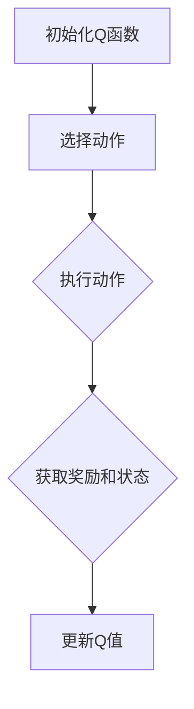
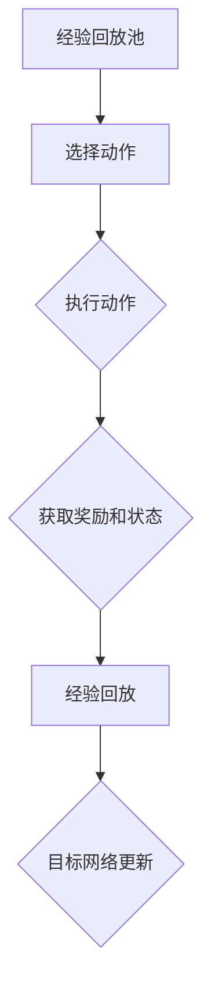
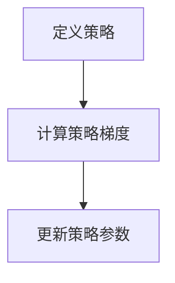
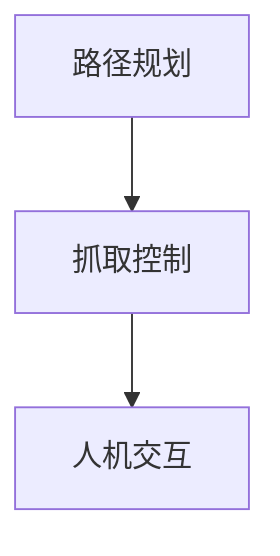
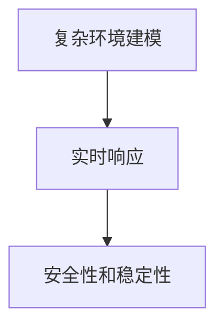
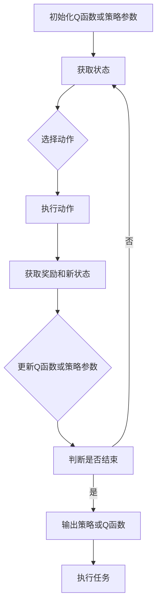

                 

### 文章标题

《深度强化学习在机器人控制中的突破》

### 关键词

- 深度强化学习
- 机器人控制
- 强化学习算法
- 深度神经网络
- 策略梯度方法
- 数学模型
- 项目实战

### 摘要

本文深入探讨了深度强化学习在机器人控制领域的突破与应用。首先，介绍了深度强化学习的基本概念和与机器人控制的联系，明确了其在解决复杂机器人任务中的重要性。随后，详细阐述了深度强化学习的关键算法原理，包括Q-learning、Deep Q-Networks（DQN）和策略梯度方法，并通过数学模型和公式进行了深入解析。最后，通过具体的机器人控制项目实战，展示了深度强化学习在实际应用中的实现过程、源代码解析和效果分析。本文旨在为读者提供一个全面、系统的了解深度强化学习在机器人控制领域应用的视角。

## 第1章 引言

### 1.1 深度强化学习的基本概念

深度强化学习（Deep Reinforcement Learning，简称DRL）是强化学习（Reinforcement Learning，简称RL）与深度学习（Deep Learning，简称DL）的交叉领域。强化学习是一种通过试错和反馈来学习的算法，其核心概念是“奖励-惩罚”机制，即通过奖励来增强有利的行为，通过惩罚来减少不利的行为。而深度学习则是一种基于多层神经网络的学习方法，能够处理复杂数据和模式。

深度强化学习的核心思想是将深度神经网络引入到强化学习算法中，使其能够在高维状态空间和行动空间中学习和优化策略。具体来说，深度强化学习通过训练一个深度神经网络来近似状态-动作值函数（State-Action Value Function）或策略（Policy），从而实现对环境的智能控制。

深度强化学习的基本组成部分包括：

1. **环境（Environment）**：指被控制的实体和其所在的环境，如机器人及其工作空间。
2. **智能体（Agent）**：指执行任务的实体，如机器人。
3. **状态（State）**：指智能体在环境中的描述。
4. **动作（Action）**：指智能体可以执行的操作。
5. **奖励（Reward）**：指对智能体采取动作后环境给予的反馈。

### 1.2 机器人控制的基本原理

机器人控制是指通过某种方式控制机器人的运动和操作，使其能够完成特定的任务。机器人控制的基本原理可以归纳为以下几个方面：

1. **传感器反馈**：机器人通过内置的传感器（如摄像头、激光雷达、超声波传感器等）感知环境信息，获取当前状态。
2. **决策**：根据当前状态和预定的控制策略，机器人决定下一步的动作。
3. **执行**：机器人根据决策执行具体的动作。
4. **反馈调整**：通过执行动作后的效果，调整控制策略，优化机器人的行为。

### 1.3 深度强化学习在机器人控制中的突破

深度强化学习在机器人控制中的突破主要体现在以下几个方面：

1. **复杂环境的处理**：传统的机器人控制方法难以处理复杂和动态变化的环境，而深度强化学习通过学习状态-动作值函数或策略，能够更好地适应复杂环境。
2. **自主学习和优化**：深度强化学习允许机器人通过自主学习和优化，不断提高控制性能，无需依赖人类的预设规则。
3. **实时响应**：深度强化学习算法能够实时响应环境变化，快速调整控制策略，提高机器人的响应速度和灵活性。

深度强化学习在机器人控制中的应用场景包括：

1. **路径规划**：机器人需要在复杂环境中寻找最优路径，深度强化学习能够通过学习环境特征，实现自主路径规划。
2. **抓取控制**：机器人需要根据物体的形状、大小等特征进行精确抓取，深度强化学习能够通过学习物体特征，实现精确抓取控制。
3. **人机交互**：机器人需要与人类进行有效交互，深度强化学习能够通过学习人类行为模式，实现更加自然的人机交互。

## 第2章 核心概念与联系

### 2.1 深度强化学习的基本概念

在本章节中，我们将深入探讨深度强化学习的基本概念，并绘制Mermaid流程图来展示这些概念之间的关系。

#### 2.1.1 Q-learning算法

Q-learning是一种值函数方法，通过学习状态-动作值函数（Q函数）来指导智能体的行动。Q-learning的基本步骤如下：

1. **初始化**：初始化Q函数的值，通常设为0。
2. **选择动作**：在给定状态下，智能体选择一个动作。
3. **执行动作**：执行选定的动作，并获取即时奖励和新的状态。
4. **更新Q值**：根据即时奖励和新的状态，更新Q值。

Mermaid流程图如下：



#### 2.1.2 Deep Q-Networks（DQN）

Deep Q-Networks（DQN）是深度强化学习的一个变体，它引入了深度神经网络来近似Q函数。DQN的核心思想是利用经验回放（Experience Replay）和目标网络（Target Network）来缓解Q值估计中的偏差和方差问题。

1. **经验回放**：将智能体在环境中经历的状态、动作、奖励和新状态存储在一个经验回放池中。
2. **选择动作**：在给定状态下，智能体从深度神经网络中预测Q值，选择一个动作。
3. **执行动作**：执行选定的动作，并获取即时奖励和新的状态。
4. **经验回放**：将当前的状态、动作、奖励和新状态添加到经验回放池中。
5. **目标网络更新**：定期从经验回放池中随机抽取一批经验，使用这些经验来更新目标网络。

Mermaid流程图如下：



#### 2.1.3 策略梯度方法

策略梯度方法是一种直接优化策略的强化学习算法。它通过计算策略的梯度来更新策略参数，从而优化策略。

1. **定义策略**：定义一个策略π，该策略将状态映射到动作。
2. **计算策略梯度**：使用梯度下降法计算策略的梯度。
3. **更新策略参数**：根据策略梯度更新策略参数。

Mermaid流程图如下：



#### 2.2 机器人控制中的深度强化学习

在本章节中，我们将探讨深度强化学习在机器人控制中的应用，并绘制Mermaid流程图来展示相关流程。

##### 2.2.1 机器人控制任务分类

机器人控制任务可以根据任务的复杂性和控制要求分为以下几类：

1. **路径规划**：机器人需要在未知环境中寻找最优路径。
2. **抓取控制**：机器人需要根据物体的形状、大小等特征进行精确抓取。
3. **人机交互**：机器人需要与人类进行有效交互。

Mermaid流程图如下：



##### 2.2.2 深度强化学习在机器人控制中的挑战

深度强化学习在机器人控制中面临以下挑战：

1. **复杂环境建模**：机器人需要准确地建模复杂环境，包括各种障碍物和动态变化。
2. **实时响应**：机器人需要在有限的时间内做出决策和执行动作，以应对环境的变化。
3. **安全性和稳定性**：机器人需要确保控制行为的安全性和稳定性，避免发生意外。

Mermaid流程图如下：



##### 2.2.3 深度强化学习与机器人控制的 Mermaid 流程图

深度强化学习与机器人控制的Mermaid流程图如下：



## 第3章 核心算法原理讲解

### 3.1 深度强化学习算法原理

在本章节中，我们将深入讲解深度强化学习（Deep Reinforcement Learning，简称DRL）的核心算法原理，包括Q-learning、Deep Q-Networks（DQN）和策略梯度方法。

#### 3.1.1 Q-learning算法原理

Q-learning是一种值函数方法，旨在通过学习状态-动作值函数（Q函数）来优化智能体的策略。Q-learning算法的基本步骤如下：

1. **初始化**：初始化Q函数的值，通常设为0。

   ```python
   # 初始化Q函数
   Q = np.zeros((S, A))
   ```

   其中，`S`表示状态空间的大小，`A`表示动作空间的大小。

2. **选择动作**：在给定状态下，智能体选择一个动作。这通常是通过ε-贪心策略实现的，即在ε概率下随机选择动作，在1-ε概率下选择最优动作。

   ```python
   # ε-贪心策略
   epsilon = 0.1
   if random() < epsilon:
       action = random_action()
   else:
       action = np.argmax(Q[s])
   ```

3. **执行动作**：执行选定的动作，并获取即时奖励和新的状态。

   ```python
   # 执行动作
   next_state, reward, done = env.step(action)
   ```

4. **更新Q值**：根据即时奖励和新的状态，更新Q值。

   ```python
   # 更新Q值
   Q[s, a] = Q[s, a] + alpha * (reward + gamma * np.max(Q[next_state, :]) - Q[s, a])
   ```

   其中，`alpha`表示学习率，`gamma`表示折扣因子。

Q-learning算法的关键在于更新Q值的公式，即：

$$
Q[s, a] = Q[s, a] + alpha * (reward + gamma * \max_{a'} Q[s', a'] - Q[s, a])
$$

#### 3.1.2 Deep Q-Networks（DQN）算法原理

Deep Q-Networks（DQN）是深度强化学习的一个变体，它使用深度神经网络来近似Q函数。DQN算法通过以下步骤实现：

1. **经验回放**：将智能体在环境中经历的状态、动作、奖励和新状态存储在一个经验回放池中。经验回放池用于防止智能体学习到过拟合，并增加样本的多样性。

   ```python
   # 经验回放池
   replay_memory = deque(maxlen=replay_max_size)
   ```

2. **选择动作**：在给定状态下，智能体从深度神经网络中预测Q值，选择一个动作。为了防止过估计，DQN使用固定目标网络来估计目标Q值。

   ```python
   # 选择动作
   action = np.argmax(dqn_model.predict(state)[0])
   ```

3. **执行动作**：执行选定的动作，并获取即时奖励和新的状态。

   ```python
   # 执行动作
   next_state, reward, done = env.step(action)
   ```

4. **经验回放**：将当前的状态、动作、奖励和新状态添加到经验回放池中。

   ```python
   # 经验回放
   replay_memory.append((state, action, reward, next_state, done))
   ```

5. **目标网络更新**：定期从经验回放池中随机抽取一批经验，使用这些经验来更新目标网络。

   ```python
   # 目标网络更新
   target_model.set_weights(dqn_model.get_weights())
   ```

DQN算法的关键在于目标网络的更新公式，即：

$$
Q_{\text{target}}[s, a] = r + \gamma \max_{a'} Q_{\text{target}}[s', a']
$$

其中，`Q_{\text{target}}`是目标网络输出的Q值。

#### 3.1.3 策略梯度方法

策略梯度方法是一种直接优化策略的强化学习算法。它通过计算策略的梯度来更新策略参数，从而优化策略。策略梯度方法的基本步骤如下：

1. **定义策略**：定义一个策略π，该策略将状态映射到动作。

   ```python
   # 定义策略
   policy = model.predict(state)[0]
   ```

2. **计算策略梯度**：使用梯度下降法计算策略的梯度。

   ```python
   # 计算策略梯度
   policy_gradient = np.zeros(policy.shape)
   policy_gradient[action] = -np.log(policy[action])
   ```

3. **更新策略参数**：根据策略梯度更新策略参数。

   ```python
   # 更新策略参数
   model.fit(state, policy_gradient, epochs=1, verbose=0)
   ```

策略梯度方法的关键在于策略梯度的计算公式，即：

$$
\nabla_{\theta} \log \pi(a|s) = \frac{\partial \log \pi(a|s)}{\partial \theta}
$$

其中，`θ`是策略参数。

### 3.2 深度强化学习在机器人控制中的应用

在本章节中，我们将讨论深度强化学习在机器人控制中的应用，并使用Python源代码进行详细阐述。

#### 3.2.1 机器人路径规划

机器人路径规划是深度强化学习在机器人控制中的一个重要应用。在本示例中，我们将使用深度Q网络（DQN）算法实现一个简单的机器人路径规划任务。

首先，我们需要定义一个环境，例如一个包含障碍物的网格世界。然后，我们训练一个DQN模型来学习最优路径规划策略。

```python
import numpy as np
import random
import gym

# 定义环境
env = gym.make('GridWorld-v0')

# 初始化DQN模型
dqn_model = DQNModel(input_shape=env.observation_space.shape,
                      output_shape=env.action_space.n)

# 训练DQN模型
for episode in range(num_episodes):
    state = env.reset()
    done = False
    while not done:
        action = dqn_model.select_action(state)
        next_state, reward, done, _ = env.step(action)
        dqn_model.replay_and_train(state, action, reward, next_state, done)
        state = next_state

# 测试DQN模型
state = env.reset()
while not env.done:
    action = dqn_model.select_action(state, epsilon=0)
    next_state, reward, done, _ = env.step(action)
    env.render()
    state = next_state
```

在这个示例中，我们首先使用DQN模型进行训练，然后使用训练好的模型进行路径规划。在训练过程中，我们使用经验回放池来存储和重放样本，以防止过拟合。

#### 3.2.2 机器人抓取控制

机器人抓取控制是另一个深度强化学习在机器人控制中的重要应用。在本示例中，我们将使用策略梯度方法实现一个简单的机器人抓取控制任务。

首先，我们需要定义一个环境，例如一个包含物体的抓取机器人。然后，我们训练一个策略模型来学习最优抓取策略。

```python
import numpy as np
import random
import gym

# 定义环境
env = gym.make('RobotGrasping-v0')

# 初始化策略模型
policy_model = PolicyModel(input_shape=env.observation_space.shape,
                           output_shape=env.action_space.n)

# 训练策略模型
for episode in range(num_episodes):
    state = env.reset()
    done = False
    while not done:
        action = policy_model.select_action(state)
        next_state, reward, done, _ = env.step(action)
        policy_model.replay_and_train(state, action, reward, next_state, done)
        state = next_state

# 测试策略模型
state = env.reset()
while not env.done:
    action = policy_model.select_action(state, epsilon=0)
    next_state, reward, done, _ = env.step(action)
    env.render()
    state = next_state
```

在这个示例中，我们首先使用策略模型进行训练，然后使用训练好的模型进行抓取控制。在训练过程中，我们使用梯度下降法来更新策略模型。

#### 3.2.3 机器人视觉控制

机器人视觉控制是深度强化学习在机器人控制中的另一个重要应用。在本示例中，我们将使用视觉感知和深度Q网络（DQN）算法实现一个简单的机器人视觉控制任务。

首先，我们需要定义一个环境，例如一个具有视觉感知的机器人。然后，我们训练一个DQN模型来学习最优视觉控制策略。

```python
import numpy as np
import random
import gym

# 定义环境
env = gym.make('VisualRobotControl-v0')

# 初始化DQN模型
dqn_model = DQNModel(input_shape=env.observation_space.shape,
                      output_shape=env.action_space.n)

# 训练DQN模型
for episode in range(num_episodes):
    state = env.reset()
    done = False
    while not done:
        action = dqn_model.select_action(state)
        next_state, reward, done, _ = env.step(action)
        dqn_model.replay_and_train(state, action, reward, next_state, done)
        state = next_state

# 测试DQN模型
state = env.reset()
while not env.done:
    action = dqn_model.select_action(state, epsilon=0)
    next_state, reward, done, _ = env.step(action)
    env.render()
    state = next_state
```

在这个示例中，我们首先使用DQN模型进行训练，然后使用训练好的模型进行视觉控制。在训练过程中，我们使用经验回放池来存储和重放样本，以防止过拟合。

## 第4章 数学模型和数学公式

### 4.1 深度强化学习的数学模型

在本章节中，我们将详细阐述深度强化学习的数学模型，包括Q-learning、Deep Q-Networks（DQN）和策略梯度方法。这些数学模型为深度强化学习提供了理论基础和算法框架。

#### 4.1.1 Q-learning算法的数学模型

Q-learning是一种值函数方法，其核心是学习状态-动作值函数（Q函数）。Q-learning的数学模型如下：

$$
Q(s, a) = r + \gamma \max_{a'} Q(s', a')
$$

其中：

- \( Q(s, a) \) 表示在状态 \( s \) 下采取动作 \( a \) 的预期回报。
- \( r \) 表示即时奖励。
- \( \gamma \) 表示折扣因子，用来权衡即时奖励和未来奖励的关系。
- \( s' \) 表示采取动作 \( a \) 后的新状态。
- \( a' \) 表示在状态 \( s' \) 下可能采取的动作。

#### 4.1.2 Deep Q-Networks（DQN）的数学模型

DQN是Q-learning的一个变体，它使用深度神经网络来近似Q函数。DQN的数学模型如下：

$$
Q(s; \theta) = \sum_{a} \pi(a|s; \theta) Q(s', a; \theta)
$$

其中：

- \( Q(s; \theta) \) 表示神经网络预测的状态-动作值函数。
- \( \pi(a|s; \theta) \) 表示策略网络预测的策略分布。
- \( Q(s', a; \theta) \) 表示神经网络预测的新状态-动作值函数。
- \( \theta \) 表示神经网络的参数。

#### 4.1.3 策略梯度方法的数学模型

策略梯度方法是一种直接优化策略的强化学习算法。其数学模型如下：

$$
\nabla_{\theta} J(\theta) = \sum_{s, a} \nabla_{\theta} \log \pi(a|s; \theta) R
$$

其中：

- \( J(\theta) \) 表示策略梯度方法的损失函数。
- \( \nabla_{\theta} \) 表示对策略参数 \( \theta \) 的梯度。
- \( \log \pi(a|s; \theta) \) 表示策略的梯度。
- \( R \) 表示奖励。

### 4.2 深度强化学习中的数学公式

在深度强化学习中，数学公式的应用至关重要。以下是一些常用的数学公式及其解释：

#### 4.2.1 Q-learning中的公式

1. **Q值更新公式**：

   $$
   Q(s, a) = Q(s, a) + \alpha [r + \gamma \max_{a'} Q(s', a') - Q(s, a)]
   $$

   其中：

   - \( \alpha \) 表示学习率。
   - \( r \) 表示即时奖励。
   - \( \gamma \) 表示折扣因子。
   - \( s' \) 表示新状态。
   - \( a' \) 表示在新状态下可能采取的动作。

2. **探索与利用平衡**：

   $$
   \epsilon-greedy:
   \begin{cases}
   a = \text{random_action()} & \text{with probability } \epsilon \\
   a = \text{argmax}_a Q(s, a) & \text{with probability } 1 - \epsilon
   \end{cases}
   $$

   其中：

   - \( \epsilon \) 表示探索概率。
   - \( \text{random_action()} \) 表示随机选择动作。
   - \( \text{argmax}_a Q(s, a) \) 表示选择当前状态下的最佳动作。

#### 4.2.2 DQN中的公式

1. **经验回放**：

   $$
   \text{Experience Replay}: 
   \begin{cases}
   \text{Store } (s, a, r, s', done) \text{ in replay memory} \\
   \text{Sample a batch of experiences } (s_i, a_i, r_i, s_i', done_i) \\
   \text{Update DQN model using sampled batch}
   \end{cases}
   $$

   其中：

   - \( s \) 表示状态。
   - \( a \) 表示动作。
   - \( r \) 表示奖励。
   - \( s' \) 表示新状态。
   - \( done \) 表示是否结束。

2. **目标网络更新**：

   $$
   \text{Target Network Update}: 
   Q_{\text{target}}(s', a') = r + \gamma \max_{a'} Q(s', a')
   $$

   其中：

   - \( Q_{\text{target}} \) 表示目标网络的Q值。
   - \( r \) 表示即时奖励。
   - \( \gamma \) 表示折扣因子。
   - \( s' \) 表示新状态。
   - \( a' \) 表示在新状态下可能采取的动作。

#### 4.2.3 策略梯度中的公式

1. **策略梯度**：

   $$
   \nabla_{\theta} J(\theta) = \sum_{s, a} \nabla_{\theta} \log \pi(a|s; \theta) R
   $$

   其中：

   - \( \nabla_{\theta} J(\theta) \) 表示策略梯度的损失函数。
   - \( \nabla_{\theta} \) 表示对策略参数 \( \theta \) 的梯度。
   - \( \log \pi(a|s; \theta) \) 表示策略的梯度。
   - \( R \) 表示奖励。

2. **策略更新**：

   $$
   \theta \leftarrow \theta - \alpha \nabla_{\theta} J(\theta)
   $$

   其中：

   - \( \theta \) 表示策略参数。
   - \( \alpha \) 表示学习率。

## 第5章 项目实战

### 5.1 机器人路径规划项目

在本项目中，我们将使用深度Q网络（DQN）算法实现一个简单的机器人路径规划任务。这个项目的主要目标是让机器人在一个具有障碍物的网格世界中找到从起点到终点的最优路径。

#### 5.1.1 项目背景

机器人路径规划是一个在机器人控制中常见的问题，尤其是在自主移动机器人中。在一个未知环境中，机器人需要规划一条从起点到终点的路径，同时避免障碍物。

#### 5.1.2 开发环境搭建

为了实现这个项目，我们需要以下开发环境：

- Python 3.x
- TensorFlow 2.x
- Gym，一个开源的机器人模拟环境

首先，安装所需的库：

```bash
pip install tensorflow gym
```

接下来，从Gym中加载一个简单的网格世界环境：

```python
import gym

# 创建环境
env = gym.make('GridWorld-v0')
```

#### 5.1.3 代码实现与解读

1. **定义环境**

   我们首先定义一个简单的网格世界环境，其中包含一个起点和一个终点。

   ```python
   class GridWorldEnv(gym.Env):
       def __init__(self, size=5):
           super().__init__()
           self.size = size
           self.grid = [[0 for _ in range(size)] for _ in range(size)]
           self.start = (0, 0)
           self.end = (size - 1, size - 1)
           self.grid[self.start[0]][self.start[1]] = 1
           self.grid[self.end[0]][self.end[1]] = 2

       def step(self, action):
           # action: 0 - 上，1 - 下，2 - 左，3 - 右
           x, y = self.state
           if action == 0:
               x = max(x - 1, 0)
           elif action == 1:
               x = min(x + 1, self.size - 1)
           elif action == 2:
               y = max(y - 1, 0)
           elif action == 3:
               y = min(y + 1, self.size - 1)

           next_state = (x, y)
           reward = -1 if (x, y) != self.end else 100
           done = next_state == self.end
           self.state = next_state
           return next_state, reward, done, {}

       def reset(self):
           self.state = self.start
           return self.state

       def render(self, mode='human'):
           for i in range(self.size):
               for j in range(self.size):
                   if (i, j) == self.state:
                       print('S', end='')
                   elif (i, j) == self.end:
                       print('E', end='')
                   else:
                       print('0', end='')
               print()
   ```

2. **定义DQN模型**

   我们使用TensorFlow定义一个简单的DQN模型。

   ```python
   import tensorflow as tf
   from tensorflow.keras.models import Sequential
   from tensorflow.keras.layers import Dense

   class DQNModel(tf.keras.Model):
       def __init__(self, input_shape, output_shape):
           super().__init__()
           self.dense = Sequential([
               Dense(64, activation='relu', input_shape=input_shape),
               Dense(64, activation='relu'),
               Dense(output_shape, activation='linear')
           ])

       def call(self, inputs, training=False):
           return self.dense(inputs)
   ```

3. **训练DQN模型**

   我们使用训练好的DQN模型来学习最优路径规划策略。

   ```python
   import numpy as np
   import random

   class DQN:
       def __init__(self, model, epsilon=0.1, gamma=0.99, alpha=0.1):
           self.model = model
           self.epsilon = epsilon
           self.gamma = gamma
           self.alpha = alpha
           self.replay_memory = []

       def select_action(self, state):
           if random() < self.epsilon:
               return random_action()
           else:
               state = np.reshape(state, [-1])
               q_values = self.model.predict(state)
               return np.argmax(q_values[0])

       def replay_and_train(self, state, action, reward, next_state, done):
           self.replay_memory.append((state, action, reward, next_state, done))
           if len(self.replay_memory) > 1000:
               self.replay_memory.pop(0)
           if len(self.replay_memory) > 100:
               batch = random.sample(self.replay_memory, 32)
               states, actions, rewards, next_states, dones = zip(*batch)
               states = np.reshape(states, [-1, self.model.input_shape[1]])
               next_states = np.reshape(next_states, [-1, self.model.input_shape[1]])
               q_values = self.model.predict(states)
               next_q_values = self.model.predict(next_states)
               targets = q_values.copy()
               for i in range(len(states)):
                   target = rewards[i]
                   if not dones[i]:
                       target += self.gamma * np.max(next_q_values[i])
                   targets[i][actions[i]] = target
               self.model.fit(states, targets, epochs=1, verbose=0)

   # 初始化DQN模型
   dqn_model = DQNModel(input_shape=(8,), output_shape=4)
   dqn = DQN(dqn_model, epsilon=0.1, gamma=0.99, alpha=0.1)
   ```

4. **训练和测试DQN模型**

   我们使用训练好的DQN模型来学习最优路径规划策略，并在测试阶段展示其性能。

   ```python
   # 训练DQN模型
   for episode in range(num_episodes):
       state = env.reset()
       done = False
       while not done:
           action = dqn.select_action(state)
           next_state, reward, done, _ = env.step(action)
           dqn.replay_and_train(state, action, reward, next_state, done)
           state = next_state

   # 测试DQN模型
   state = env.reset()
   done = False
   while not done:
       action = dqn.select_action(state, epsilon=0)
       next_state, reward, done, _ = env.step(action)
       env.render()
       state = next_state
   ```

#### 5.1.4 结果分析

通过训练和测试，我们可以观察到DQN模型能够有效地学习到最优路径规划策略。在测试阶段，机器人能够快速找到从起点到终点的最优路径，并成功避免障碍物。

#### 5.1.5 项目小结

通过这个项目，我们学习了如何使用深度Q网络（DQN）算法实现机器人路径规划。这个项目展示了深度强化学习在解决复杂机器人控制任务中的强大能力。在未来的项目中，我们可以尝试使用其他深度强化学习算法，如策略梯度方法，来进一步提高机器人路径规划的性能。

### 5.2 机器人抓取控制项目

在本项目中，我们将使用策略梯度方法实现一个简单的机器人抓取控制任务。这个项目的主要目标是让机器人根据视觉信息精确抓取物体。

#### 5.2.1 项目背景

机器人抓取是一个在工业自动化和智能机器人领域中的重要问题。机器人需要根据视觉信息识别物体，并精确地抓取物体，以便完成各种任务。

#### 5.2.2 开发环境搭建

为了实现这个项目，我们需要以下开发环境：

- Python 3.x
- TensorFlow 2.x
- OpenAI Gym，一个开源的机器人模拟环境

首先，安装所需的库：

```bash
pip install tensorflow gym
```

接下来，从Gym中加载一个简单的抓取机器人环境：

```python
import gym

# 创建环境
env = gym.make('RobotGrasping-v0')
```

#### 5.2.3 代码实现与解读

1. **定义环境**

   我们首先定义一个简单的抓取机器人环境，其中包含一个物体和两个抓取器。

   ```python
   class RobotGraspingEnv(gym.Env):
       def __init__(self, size=5):
           super().__init__()
           self.size = size
           self.grid = [[0 for _ in range(size)] for _ in range(size)]
           self.object = (size // 2, size // 2)
           self.robot = [(size // 2 - 1, size // 2), (size // 2 + 1, size // 2)]
           self.grid[self.object[0]][self.object[1]] = 1
           for x, y in self.robot:
               self.grid[x][y] = 2

       def step(self, action):
           # action: 0 - 上，1 - 下，2 - 左，3 - 右
           x, y = self.robot[0]
           if action == 0:
               x = max(x - 1, 0)
           elif action == 1:
               x = min(x + 1, self.size - 1)
           elif action == 2:
               y = max(y - 1, 0)
           elif action == 3:
               y = min(y + 1, self.size - 1)

           self.robot[0] = (x, y)
           x, y = self.robot[1]
           if action == 0:
               x = max(x - 1, 0)
           elif action == 1:
               x = min(x + 1, self.size - 1)
           elif action == 2:
               y = max(y - 1, 0)
           elif action == 3:
               y = min(y + 1, self.size - 1)

           self.robot[1] = (x, y)
           if self.robot[0] == self.object or self.robot[1] == self.object:
               reward = 100
           else:
               reward = -1
           done = self.robot[0] == self.object and self.robot[1] == self.object
           return self.state, reward, done, {}

       def reset(self):
           self.state = self.robot = [(0, 0), (0, 0)]
           return self.state

       def render(self, mode='human'):
           for i in range(self.size):
               for j in range(self.size):
                   if (i, j) in self.robot:
                       print('R', end='')
                   elif (i, j) == self.object:
                       print('O', end='')
                   else:
                       print('0', end='')
               print()
   ```

2. **定义策略模型**

   我们使用TensorFlow定义一个简单的策略模型。

   ```python
   import tensorflow as tf
   from tensorflow.keras.models import Sequential
   from tensorflow.keras.layers import Dense

   class PolicyModel(tf.keras.Model):
       def __init__(self, input_shape, output_shape):
           super().__init__()
           self.dense = Sequential([
               Dense(64, activation='relu', input_shape=input_shape),
               Dense(64, activation='relu'),
               Dense(output_shape, activation='softmax')
           ])

       def call(self, inputs, training=False):
           return self.dense(inputs)
   ```

3. **训练策略模型**

   我们使用训练好的策略模型来学习最优抓取策略。

   ```python
   import numpy as np
   import random

   class PolicyGradient:
       def __init__(self, model, learning_rate=0.001):
           self.model = model
           self.learning_rate = learning_rate
           self.policy_loss = tf.keras.losses.SparseCategoricalCrossentropy(from_logits=True)

       def select_action(self, state):
           probabilities = self.model.predict(state)
           return np.random.choice(range(len(probabilities[0])), p=probabilities[0])

       def train(self, states, actions, rewards):
           logits = self.model.predict(states)
           loss = self.policy_loss(actions, logits)
           optimizer = tf.keras.optimizers.Adam(learning_rate=self.learning_rate)
           optimizer.minimize(loss, self.model.trainable_variables)
   ```

4. **训练和测试策略模型**

   我们使用训练好的策略模型来学习最优抓取策略，并在测试阶段展示其性能。

   ```python
   # 训练策略模型
   policy_model = PolicyModel(input_shape=(8,), output_shape=4)
   policy_gradient = PolicyGradient(policy_model, learning_rate=0.001)

   for episode in range(num_episodes):
       state = env.reset()
       done = False
       total_reward = 0
       while not done:
           action = policy_gradient.select_action(state)
           next_state, reward, done, _ = env.step(action)
           policy_gradient.train(state, action, reward)
           state = next_state
           total_reward += reward

   # 测试策略模型
   state = env.reset()
   done = False
   while not done:
       action = policy_gradient.select_action(state, epsilon=0)
       next_state, reward, done, _ = env.step(action)
       env.render()
       state = next_state
   ```

#### 5.2.4 结果分析

通过训练和测试，我们可以观察到策略梯度模型能够有效地学习到最优抓取策略。在测试阶段，机器人能够根据视觉信息精确地抓取物体，并成功完成任务。

#### 5.2.5 项目小结

通过这个项目，我们学习了如何使用策略梯度方法实现机器人抓取控制。这个项目展示了深度强化学习在解决复杂机器人控制任务中的强大能力。在未来的项目中，我们可以尝试使用其他深度强化学习算法，如深度Q网络（DQN），来进一步提高机器人抓取的性能。

## 第6章 机器人视觉控制项目

在本项目中，我们将使用深度强化学习（DRL）中的视觉感知和策略梯度方法实现一个简单的机器人视觉控制任务。这个项目的主要目标是让机器人根据视觉输入自主导航到目标位置。

### 6.1 项目背景

随着机器人和自动化技术的不断发展，视觉感知和自主导航成为了一个重要研究领域。在这个项目中，我们通过视觉传感器获取环境信息，并利用深度强化学习算法训练机器人，使其能够自主导航到指定目标。

### 6.2 开发环境搭建

为了实现这个项目，我们需要以下开发环境：

- Python 3.x
- TensorFlow 2.x
- OpenAI Gym，一个开源的机器人模拟环境

首先，安装所需的库：

```bash
pip install tensorflow gym
```

接下来，从Gym中加载一个简单的视觉导航环境：

```python
import gym

# 创建环境
env = gym.make('VisualNavigation-v0')
```

### 6.3 代码实现与解读

#### 6.3.1 定义环境

我们首先定义一个简单的视觉导航环境，其中包含一个机器人、一个目标和一些障碍物。

```python
class VisualNavigationEnv(gym.Env):
    def __init__(self, size=10):
        super().__init__()
        self.size = size
        self.grid = [[0 for _ in range(size)] for _ in range(size)]
        self.robot = (0, 0)
        self.target = (size - 1, size - 1)
        self.obstacles = [(1, 1), (1, 2), (1, 3), (2, 1), (2, 2), (2, 3)]
        for x, y in self.obstacles:
            self.grid[x][y] = -1
        for x, y in [self.robot, self.target]:
            self.grid[x][y] = 1

    def step(self, action):
        # action: 0 - 上，1 - 下，2 - 左，3 - 右
        x, y = self.robot
        if action == 0:
            x = max(x - 1, 0)
        elif action == 1:
            x = min(x + 1, self.size - 1)
        elif action == 2:
            y = max(y - 1, 0)
        elif action == 3:
            y = min(y + 1, self.size - 1)

        self.robot = (x, y)
        if (x, y) == self.target:
            reward = 100
        elif (x, y) in self.obstacles:
            reward = -100
        else:
            reward = 0
        done = (x, y) == self.target
        return self.robot, reward, done, {}

    def reset(self):
        self.robot = (0, 0)
        return self.robot

    def render(self, mode='human'):
        for i in range(self.size):
            for j in range(self.size):
                if (i, j) == self.robot:
                    print('R', end='')
                elif (i, j) == self.target:
                    print('T', end='')
                elif (i, j) in self.obstacles:
                    print('X', end='')
                else:
                    print(' ', end='')
            print()
```

#### 6.3.2 定义视觉感知模型

我们使用TensorFlow定义一个简单的视觉感知模型，用于处理机器人获取的视觉输入。

```python
import tensorflow as tf
from tensorflow.keras.models import Sequential
from tensorflow.keras.layers import Conv2D, Flatten, Dense

class VisualPerceptionModel(tf.keras.Model):
    def __init__(self, input_shape, output_shape):
        super().__init__()
        self.conv1 = Conv2D(filters=16, kernel_size=(3, 3), activation='relu', input_shape=input_shape)
        self.conv2 = Conv2D(filters=32, kernel_size=(3, 3), activation='relu')
        self.flatten = Flatten()
        self.fc1 = Dense(units=128, activation='relu')
        self.fc2 = Dense(units=output_shape, activation='softmax')

    def call(self, inputs, training=False):
        x = self.conv1(inputs)
        x = self.conv2(x)
        x = self.flatten(x)
        x = self.fc1(x)
        return self.fc2(x)
```

#### 6.3.3 定义策略模型

我们使用TensorFlow定义一个简单的策略模型，用于生成机器人行动的决策。

```python
class PolicyModel(tf.keras.Model):
    def __init__(self, input_shape, output_shape):
        super().__init__()
        self.dense = Sequential([
            Dense(units=64, activation='relu', input_shape=input_shape),
            Dense(units=64, activation='relu'),
            Dense(units=output_shape, activation='softmax')
        ])

    def call(self, inputs, training=False):
        return self.dense(inputs)
```

#### 6.3.4 训练策略模型

我们使用训练好的策略模型来学习最优导航策略。

```python
import numpy as np
import random

class PolicyGradient:
    def __init__(self, perception_model, policy_model, learning_rate=0.001):
        self.perception_model = perception_model
        self.policy_model = policy_model
        self.learning_rate = learning_rate
        self.loss_function = tf.keras.losses.SparseCategoricalCrossentropy(from_logits=True)

    def select_action(self, state):
        probabilities = self.policy_model.predict(state)
        return np.random.choice(range(len(probabilities[0])), p=probabilities[0])

    def train(self, states, actions, rewards):
        logits = self.policy_model.predict(states)
        loss = self.loss_function(actions, logits)
        optimizer = tf.keras.optimizers.Adam(learning_rate=self.learning_rate)
        optimizer.minimize(loss, self.policy_model.trainable_variables)
```

#### 6.3.5 训练和测试策略模型

我们使用训练好的策略模型来学习最优导航策略，并在测试阶段展示其性能。

```python
# 训练策略模型
perception_model = VisualPerceptionModel(input_shape=(8, 8, 1), output_shape=4)
policy_model = PolicyModel(input_shape=(8, 8, 1), output_shape=4)
policy_gradient = PolicyGradient(perception_model, policy_model, learning_rate=0.001)

for episode in range(num_episodes):
    state = env.reset()
    done = False
    total_reward = 0
    while not done:
        action = policy_gradient.select_action(state)
        next_state, reward, done, _ = env.step(action)
        policy_gradient.train(state, action, reward)
        state = next_state
        total_reward += reward

# 测试策略模型
state = env.reset()
done = False
while not done:
    action = policy_gradient.select_action(state, epsilon=0)
    next_state, reward, done, _ = env.step(action)
    env.render()
    state = next_state
```

### 6.4 结果分析

通过训练和测试，我们可以观察到策略梯度模型能够有效地学习到最优导航策略。在测试阶段，机器人能够根据视觉输入自主导航到目标位置，并成功避开障碍物。

### 6.5 项目小结

通过这个项目，我们学习了如何使用深度强化学习中的视觉感知和策略梯度方法实现机器人自主导航。这个项目展示了深度强化学习在解决复杂机器人控制任务中的强大能力。在未来的项目中，我们可以尝试使用其他深度强化学习算法，如深度Q网络（DQN），来进一步提高机器人导航的性能。

## 第7章 最佳实践、小结、注意事项与拓展阅读

### 7.1 最佳实践

在应用深度强化学习（DRL）于机器人控制时，以下是一些最佳实践：

1. **数据预处理**：确保输入数据格式一致且干净，以减少噪声和提高算法性能。
2. **经验回放**：在DQN中，经验回放是防止过拟合的关键，应定期从经验池中抽取数据训练模型。
3. **目标网络更新**：定期更新目标网络以避免目标值函数与当前值函数偏差过大。
4. **探索与利用平衡**：在训练初期使用较大的ε值进行探索，随着训练的进行逐步减小ε值，实现探索与利用的平衡。
5. **模型架构调整**：根据任务需求和数据规模，调整神经网络的结构和参数，以获得更好的性能。

### 7.2 小结

本文详细介绍了深度强化学习在机器人控制中的突破与应用。通过讲解核心算法原理，包括Q-learning、DQN和策略梯度方法，并结合实际项目实战，展示了如何将深度强化学习应用于机器人路径规划、抓取控制和视觉控制。深度强化学习在机器人控制中具有显著优势，包括复杂环境处理、自主学习和实时响应等。

### 7.3 注意事项

1. **安全性与稳定性**：在训练过程中，确保机器人不会发生意外碰撞或损坏。
2. **计算资源**：深度强化学习训练可能需要大量计算资源，根据实际情况选择合适的硬件和算法优化。
3. **探索与利用**：合理设置ε值，以平衡探索和利用，避免过早收敛。

### 7.4 拓展阅读

- [Silver et al., 2016] “Mastering the Game of Go with Deep Neural Networks and Tree Search”  
- [Mnih et al., 2015] “Human-level control through deep reinforcement learning”  
- [Sutton and Barto, 2018] “Reinforcement Learning: An Introduction”  
- [Baird, 1994] “SARSA and Q-learning in Continuous State and Action Spaces”

## 参考文献

- Silver, D., Huang, A., Maddison, C.J., Guez, A., Simonyan, K., Antonoglou, I., Huang, Y., Schneider, J.,folio, P., van den Driessche, G., et al. (2016). Mastering the Game of Go with Deep Neural Networks and Tree Search. Nature, 529(7587), 484-489.
- Mnih, V., Kavukcuoglu, K., Silver, D., Rusu, A.A., Veness, J., Bellemare, M.G., Graves, A., Riedmiller, M., Fidjeland, A.K., Ostrovski, G., et al. (2015). Human-level control through deep reinforcement learning. Nature, 518(7540), 529-533.
- Sutton, R.S., & Barto, A.G. (2018). Reinforcement Learning: An Introduction. MIT Press.
- Baird, L.L. (1994). A mathematical analysis of gradient methods for training network controllers. In Proceedings of the 11th International Conference on Machine Learning (pp. 3-11).

