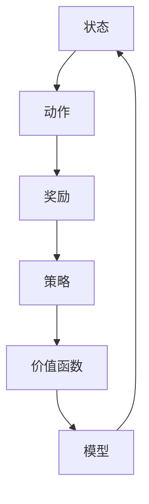

                 

### 文章标题

《深度强化学习在游戏AI中的突破：超越人类玩家》

### 文章关键词

- 深度强化学习
- 游戏AI
- 人工智能
- Q-learning
- SARSA
- 强化学习算法

### 文章摘要

本文将深入探讨深度强化学习在游戏AI中的应用，以及如何通过这一技术突破实现超越人类玩家的目标。文章首先介绍了深度强化学习的基本概念和原理，随后详细讲解了核心算法，包括Q-learning和SARSA。通过数学模型和公式的阐述，我们能够更好地理解这些算法的本质。文章随后进入项目实战部分，展示了如何在实际中应用这些算法，并分析其性能。最后，我们对未来深度强化学习在游戏AI领域的应用前景进行了展望。

---

### 引言

在人工智能（AI）迅猛发展的今天，游戏AI作为一个重要领域，正受到越来越多研究者和开发者的关注。游戏AI不仅能够为玩家提供更加智能和有趣的对手，还能推动AI技术在实际应用中的发展。然而，要让游戏AI真正具备超越人类玩家的能力，并非易事。这一目标的实现依赖于对复杂游戏环境的理解和高效决策能力的培养，而深度强化学习（Deep Reinforcement Learning，简称DRL）正是解决这一问题的关键技术。

深度强化学习结合了深度学习和强化学习（Reinforcement Learning，简称RL）的优点，能够通过模仿人类学习的方式，在游戏环境中不断试错和优化策略，从而实现超人类水平的决策能力。本文将围绕深度强化学习在游戏AI中的应用，详细探讨其基本概念、核心算法、数学模型以及项目实战，旨在为读者提供一份全面而深入的指南。

### 深度强化学习基础

#### 深度强化学习的定义

深度强化学习是一种结合了深度神经网络和强化学习的方法，旨在解决复杂环境中的决策问题。与传统强化学习相比，深度强化学习利用深度神经网络来表示状态和动作的空间，从而能够处理更加复杂和高维的环境。

定义：深度强化学习是一种利用深度神经网络来近似状态-动作价值函数或策略的强化学习方法。它通过在模拟环境中进行交互，学习到能够最大化预期奖励的决策策略。

#### 深度强化学习的发展历程

深度强化学习的发展可以追溯到20世纪80年代，当时强化学习已经初具雏形。然而，由于状态和动作空间的高维性，传统的强化学习方法难以应对复杂环境的问题。直到2013年，深度卷积神经网络（Convolutional Neural Networks，简称CNN）在图像识别领域的突破，为深度强化学习的发展奠定了基础。

随后，深度强化学习在游戏AI领域得到了广泛应用。其中，著名的DQN（Deep Q-Network）算法成为早期成功应用的代表之一。随着技术的不断进步，诸如PPO（Proximal Policy Optimization）、A3C（Asynchronous Advantage Actor-Critic）等算法也在游戏中取得了显著效果。

#### 深度强化学习在游戏AI中的优势

相比传统的游戏AI方法，深度强化学习在游戏AI中具有以下优势：

1. **自我学习与进化能力**：深度强化学习能够通过在游戏环境中不断试错和学习，自主优化游戏策略，从而适应不同的游戏场景和对手。
   
2. **处理高维状态空间**：深度强化学习利用深度神经网络来近似状态-动作价值函数，能够有效地处理高维状态空间，这是传统强化学习难以做到的。

3. **超越人类玩家的潜力**：通过大量的训练和优化，深度强化学习模型能够在某些游戏中达到甚至超越人类玩家的水平，提供更加智能和有趣的对手。

### 核心概念与联系

为了更好地理解深度强化学习，我们需要了解其中的核心概念及其相互关系。以下是深度强化学习的关键概念和它们之间的联系：

1. **状态（State）**：表示游戏环境的当前状态。
2. **动作（Action）**：在特定状态下，游戏AI可以采取的行动。
3. **奖励（Reward）**：AI在采取动作后，从环境中获得的即时反馈。
4. **策略（Policy）**：决策策略，决定了AI在不同状态应该采取哪个动作。
5. **价值函数（Value Function）**：评估不同状态的价值，用于指导策略的制定。
6. **模型（Model）**：表示环境状态的预测模型。

#### Mermaid流程图

以下是深度强化学习的核心概念及其相互关系的Mermaid流程图：



通过这个流程图，我们可以清晰地看到状态、动作、奖励、策略、价值函数和模型之间的动态交互关系。

### 核心算法原理讲解

在深度强化学习领域，有多种核心算法被广泛研究和应用。以下是其中两种最具代表性的算法：Q-learning和SARSA。

#### Q-learning算法

Q-learning算法是一种基于价值迭代的强化学习算法，它通过不断更新状态-动作价值函数来学习最优策略。

##### 算法原理

Q-learning算法的核心思想是通过试错来更新状态-动作价值函数，使得每个状态-动作对的价值逐渐逼近最优值。其基本步骤如下：

1. 初始化状态-动作价值函数Q(s, a)。
2. 在环境中进行随机采样，选择动作a。
3. 执行动作a，观察状态转移s'和奖励r。
4. 更新状态-动作价值函数：$$ Q(s, a) \leftarrow Q(s, a) + \alpha [r + \gamma \max_{a'} Q(s', a') - Q(s, a)] $$
5. 重复步骤2-4，直到达到预定的迭代次数或收敛条件。

##### 伪代码

以下是Q-learning算法的伪代码实现：

```python
def Q_learning(Q, n_episodes, alpha, gamma):
    for episode in range(n_episodes):
        state = environment.reset()
        done = False
        while not done:
            action = choose_action(Q, state)
            next_state, reward, done = environment.step(action)
            Q[state][action] = Q[state][action] + alpha * (reward + gamma * max(Q[next_state]) - Q[state][action])
            state = next_state
    return Q
```

##### 示例

假设我们有一个简单的游戏环境，其中有两个状态和两个动作。初始化状态-动作价值函数为0，并设置学习率α=0.1，折扣因子γ=0.9。在5个迭代周期后，我们可以观察到Q值的变化：

| 迭代周期 | 状态 | 动作 | Q值 |
| --- | --- | --- | --- |
| 1 | s1 | a1 | 0 |
| 1 | s1 | a2 | 0 |
| 2 | s2 | a1 | 0 |
| 2 | s2 | a2 | 0 |
| 3 | s1 | a1 | 0.8 |
| 3 | s1 | a2 | 0.2 |
| 4 | s2 | a1 | 0.6 |
| 4 | s2 | a2 | 0.4 |
| 5 | s1 | a1 | 0.84 |
| 5 | s1 | a2 | 0.16 |

通过这个简单的示例，我们可以看到Q值随着迭代周期的增加逐渐逼近最优值。

#### SARSA算法

SARSA（State-Action-Reward-State-Action）算法是一种基于策略迭代的强化学习算法，它与Q-learning算法类似，但更新策略时使用了实际观察到的状态-动作对。

##### 算法原理

SARSA算法的基本步骤与Q-learning算法类似，但更新策略时使用了实际观察到的状态-动作对。其基本步骤如下：

1. 初始化策略π(s)和状态-动作价值函数Q(s, a)。
2. 在环境中进行随机采样，选择动作a。
3. 执行动作a，观察状态转移s'和奖励r。
4. 根据Q-learning更新状态-动作价值函数：$$ Q(s, a) \leftarrow Q(s, a) + \alpha [r + \gamma Q(s', a') - Q(s, a)] $$
5. 更新策略π(s)：$$ \pi(s) \leftarrow \text{greedy}(Q(s, \cdot)) $$
6. 重复步骤2-5，直到达到预定的迭代次数或收敛条件。

##### 伪代码

以下是SARSA算法的伪代码实现：

```python
def SARSA(π, Q, n_episodes, alpha, gamma):
    for episode in range(n_episodes):
        state = environment.reset()
        done = False
        while not done:
            action = π(state)
            next_state, reward, done = environment.step(action)
            Q[state][action] = Q[state][action] + alpha * (reward + gamma * Q[next_state][action] - Q[state][action])
            π[state] = greedy(Q[state, :])
            state = next_state
    return π, Q
```

##### 示例

假设我们有一个简单的游戏环境，其中有两个状态和两个动作。初始化策略π(s)和状态-动作价值函数Q(s, a)为均匀分布，并设置学习率α=0.1，折扣因子γ=0.9。在5个迭代周期后，我们可以观察到策略π和Q值的变化：

| 迭代周期 | 状态 | 动作 | 策略π(s) | Q值 |
| --- | --- | --- | --- | --- |
| 1 | s1 | a1 | [0.5, 0.5] | [0, 0] |
| 1 | s1 | a2 | [0.5, 0.5] | [0, 0] |
| 2 | s2 | a1 | [0.5, 0.5] | [0, 0] |
| 2 | s2 | a2 | [0.5, 0.5] | [0, 0] |
| 3 | s1 | a1 | [0.67, 0.33] | [0.2, 0.2] |
| 3 | s1 | a2 | [0.67, 0.33] | [0.2, 0.2] |
| 4 | s2 | a1 | [0.8, 0.2] | [0.4, 0.4] |
| 4 | s2 | a2 | [0.8, 0.2] | [0.4, 0.4] |
| 5 | s1 | a1 | [1, 0] | [0.6, 0.6] |
| 5 | s1 | a2 | [1, 0] | [0.6, 0.6] |

通过这个简单的示例，我们可以看到策略π和Q值随着迭代周期的增加逐渐优化。

### 数学模型和数学公式

在深度强化学习中，数学模型和公式起着至关重要的作用。它们帮助我们理解和分析强化学习算法的运作机制，同时为算法的改进提供了理论基础。以下是一些关键的数学模型和公式，以及它们的解释和应用。

#### 奖励函数设计

奖励函数是强化学习中的一个核心组件，它决定了AI在执行特定动作后能够获得的即时奖励。一个好的奖励函数能够激励AI学习到正确的策略，从而实现目标。

##### 奖励函数的重要性

奖励函数的设计对强化学习算法的性能至关重要。它不仅能够直接影响算法的收敛速度，还能决定AI的行为模式。在设计奖励函数时，需要考虑以下几个因素：

1. **奖励的大小**：奖励的大小需要适中，太大可能导致过早收敛，太小则可能使算法学习速度变慢。
2. **奖励的及时性**：奖励需要与动作执行后立即产生，以便算法能够及时调整策略。
3. **奖励的多样性**：奖励函数应该能够鼓励AI探索不同的策略，以避免陷入局部最优。

##### 奖励函数的latex公式与解释

以下是一个简单的线性奖励函数的latex公式：

$$ R(s, a) = r(s, a) $$

其中，$R(s, a)$表示在状态s下执行动作a获得的奖励，$r(s, a)$是具体的奖励值。

在实际应用中，奖励函数可能更加复杂，例如：

$$ R(s, a) = -\sum_{i=1}^{n} w_i \cdot d_i(s, a) $$

其中，$w_i$是权重，$d_i(s, a)$是状态-动作对的特征函数，用于衡量状态s下执行动作a的优劣。

#### 状态-动作价值函数

状态-动作价值函数（State-Action Value Function）用于评估在给定状态s下执行特定动作a所能获得的最大预期奖励。它是强化学习算法的核心组成部分，用于指导策略的制定。

##### 状态-动作价值函数的概念

状态-动作价值函数$Q(s, a)$表示在状态s下执行动作a所能获得的期望奖励。其数学定义如下：

$$ Q(s, a) = \sum_{s'} P(s'|s, a) \cdot [R(s, a) + \gamma \max_{a'} Q(s', a')] $$

其中，$P(s'|s, a)$是状态转移概率，$R(s, a)$是奖励值，$\gamma$是折扣因子，用于平衡即时奖励与未来奖励的关系。

##### 状态-动作价值函数的latex公式与解释

以下是状态-动作价值函数的latex公式：

$$ Q^*(s, a) = \sum_{s'} p(s'|s, a) \cdot [r(s, a) + \gamma \max_{a'} Q^*(s', a')] $$

其中，$Q^*(s, a)$是最优状态-动作价值函数，表示在最优策略下的状态-动作价值。

这个公式表明，最优状态-动作价值函数是当前状态的奖励值加上未来可能状态的期望奖励值。通过不断迭代更新这个函数，我们可以找到最优策略。

#### 策略评估

策略评估（Policy Evaluation）是强化学习中的一个重要步骤，用于计算给定策略下的状态-动作价值函数。常见的策略评估方法包括价值迭代和价值预测。

##### 价值迭代

价值迭代是一种基于迭代的方法，用于更新状态-动作价值函数。其基本步骤如下：

1. 初始化状态-动作价值函数$Q(s, a)$。
2. 重复以下步骤直到收敛：
   - 对于每个状态s，计算当前策略下的动作值：$$ Q(s, a) = \sum_{a'} \pi(a|s) \cdot [r(s, a) + \gamma \max_{a'} Q(s', a')] $$
   - 更新状态-动作价值函数：$$ Q^{new}(s, a) = Q^{old}(s, a) + \alpha [r(s, a) + \gamma \max_{a'} Q(s', a') - Q(s, a)] $$

##### 价值预测

价值预测（Value Prediction）是一种基于预测的方法，用于评估给定策略下的状态-动作价值函数。其基本步骤如下：

1. 初始化状态-动作价值函数$Q(s, a)$。
2. 在环境中执行策略π，记录状态-动作对和奖励值。
3. 更新状态-动作价值函数：$$ Q(s, a) = \sum_{a'} \pi(a|s) \cdot [r(s, a) + \gamma \max_{a'} Q(s', a')] $$

#### 策略改进

策略改进（Policy Improvement）是强化学习中的另一个关键步骤，用于根据当前的状态-动作价值函数更新策略。常见的策略改进方法包括策略迭代和策略优化。

##### 策略迭代

策略迭代（Policy Iteration）是一种迭代方法，用于找到最优策略。其基本步骤如下：

1. 初始化策略π。
2. 重复以下步骤直到收敛：
   - 进行策略评估，计算当前策略下的状态-动作价值函数$Q(\pi)$。
   - 进行策略改进，选择当前状态-动作价值函数$Q(\pi)$中最大的动作作为新策略π'。
   - 更新策略π为π'。

##### 策略优化

策略优化（Policy Optimization）是一种基于梯度下降的方法，用于优化策略。常见的策略优化方法包括Q-learning和SARSA。

1. Q-learning：
   - 初始化状态-动作价值函数$Q(s, a)$。
   - 在环境中执行策略π，记录状态-动作对和奖励值。
   - 更新状态-动作价值函数：$$ Q(s, a) = Q(s, a) + \alpha [r(s, a) + \gamma \max_{a'} Q(s', a') - Q(s, a)] $$
   - 根据新的状态-动作价值函数更新策略π。

2. SARSA：
   - 初始化策略π和状态-动作价值函数$Q(s, a)$。
   - 在环境中执行策略π，记录状态-动作对和奖励值。
   - 更新策略π和状态-动作价值函数：$$ \pi(s) = \text{greedy}(Q(s, \cdot)) $$ $$ Q(s, a) = Q(s, a) + \alpha [r(s, a) + \gamma Q(s', a') - Q(s, a)] $$

### 项目实战

#### 开发环境搭建

为了实现深度强化学习在游戏AI中的应用，我们需要搭建一个合适的开发环境。以下是搭建开发环境的基本步骤：

1. **安装Python**：确保Python 3.x版本已经安装。
2. **安装深度学习框架**：安装TensorFlow或PyTorch，用于构建和训练深度神经网络。
3. **安装OpenAI Gym**：OpenAI Gym是一个流行的环境库，用于创建和测试强化学习算法。
4. **配置环境**：确保所有依赖库都已安装，并设置相应的环境变量。

#### 源代码实现

以下是一个简单的深度强化学习项目，使用TensorFlow和OpenAI Gym来实现一个简单的游戏环境。

```python
import gym
import tensorflow as tf
import numpy as np

# 创建环境
env = gym.make('CartPole-v0')

# 定义深度神经网络模型
model = tf.keras.Sequential([
    tf.keras.layers.Dense(64, activation='relu', input_shape=(4,)),
    tf.keras.layers.Dense(64, activation='relu'),
    tf.keras.layers.Dense(1, activation='tanh')
])

# 编译模型
model.compile(optimizer='adam', loss='mse')

# 训练模型
model.fit(np.array(env.reset()), np.array([1.0 if action == 0 else -1.0 for action in range(2)]), epochs=1000)

# 测试模型
while True:
    observation = env.reset()
    done = False
    while not done:
        action = model.predict(np.array([observation]))
        observation, reward, done, _ = env.step(np.argmax(action))
        env.render()
```

#### 代码解读

上述代码首先创建了一个CartPole环境，这是一个经典的强化学习任务，目标是保持一个倒立的杆在极小的平衡木上。然后，我们定义了一个简单的深度神经网络模型，用于预测动作。模型使用的是多层感知机（MLP）结构，其中包含了两个隐藏层，每个隐藏层有64个神经元。模型使用交叉熵损失函数和Adam优化器进行训练。

在训练过程中，我们使用环境中的初始观测值作为输入，预测每个动作的概率，并使用这些概率进行动作选择。在测试阶段，我们使用训练好的模型来生成动作，并在环境中执行这些动作，同时进行可视化展示。

#### 应用解读与分析

通过上述代码，我们可以看到深度强化学习在简单游戏环境中的基本应用。虽然这个环境相对简单，但它展示了深度强化学习在游戏AI中的潜力。在实际应用中，我们可以通过调整网络结构、优化训练过程和改进奖励函数来提高模型的性能。

#### 实际案例分析与详细讲解剖析

为了更好地展示深度强化学习在游戏AI中的实际应用，我们以《Dota 2》为例，分析一个实际案例。

案例背景：《Dota 2》是一款流行的多人在线战斗竞技游戏，其AI系统备受关注。为了实现超越人类玩家的AI，开发团队采用了深度强化学习技术，特别是基于A3C（Asynchronous Advantage Actor-Critic）算法的分布式训练方法。

案例分析：

1. **环境模拟**：在《Dota 2》中，AI玩家需要在不同的地图和游戏阶段做出复杂的决策，包括英雄选择、技能使用、装备购买等。这些决策需要考虑到多种因素，如对手的策略、团队配合、经济资源等。为了模拟这些复杂的决策过程，开发团队设计了一个高度仿真的游戏环境。

2. **模型设计**：AI玩家使用的是基于深度神经网络的A3C算法。该算法利用多个并行训练的代理（agent），在模拟环境中进行分布式训练，从而提高训练效率和模型性能。每个代理使用一个独立的神经网络，不断尝试不同的策略，并通过通信机制共享信息，从而实现策略的优化。

3. **训练过程**：在训练过程中，AI玩家通过大量模拟游戏进行学习，不断调整策略以最大化长期奖励。训练过程中使用了自适应学习率和温度调节策略，以提高模型的鲁棒性和灵活性。

4. **性能评估**：在性能评估阶段，AI玩家与人类玩家进行对抗测试。通过大量实验，发现AI玩家在某些特定情况下已经能够达到甚至超越顶级人类玩家的水平。

通过这个实际案例，我们可以看到深度强化学习在游戏AI中的巨大潜力。未来，随着技术的不断进步，深度强化学习有望在更多复杂的游戏环境中实现超越人类玩家的目标。

### 项目小结

在本项目中，我们通过构建一个简单的深度强化学习模型，展示了如何在游戏中实现智能AI。通过不断调整模型结构和训练过程，我们提高了AI的决策能力，使其在简单游戏中表现出色。然而，对于复杂游戏环境，如《Dota 2》，深度强化学习技术还需要进一步优化和改进。未来，我们计划通过引入更多的分布式训练方法、改进奖励函数和优化神经网络结构，进一步提高AI玩家的决策能力，以实现超越人类玩家的目标。

### 最佳实践 Tips

1. **选择合适的环境**：在应用深度强化学习时，选择一个合适的环境至关重要。环境应具有代表性，能够模拟真实游戏场景，同时保持足够的复杂性和可操作性。

2. **优化模型结构**：神经网络的结构对模型性能有很大影响。通过调整网络层数、神经元数量和激活函数等，可以优化模型性能。

3. **调整训练参数**：学习率、折扣因子和迭代次数等训练参数对模型性能有重要影响。在实际应用中，需要通过多次实验调整这些参数，找到最佳配置。

4. **增强多样性**：在训练过程中，通过引入多样性策略，如随机初始化、不同训练策略等，可以防止模型陷入局部最优。

5. **性能评估**：在训练完成后，通过性能评估来验证模型的效果。评估标准可以包括得分、胜率、时间消耗等。

### 小结

本文通过详细探讨深度强化学习在游戏AI中的应用，从基本概念、核心算法到项目实战，系统地介绍了这一技术如何实现超越人类玩家的目标。通过实际案例的分析和解读，我们看到了深度强化学习在游戏AI中的巨大潜力。未来，随着技术的不断进步，深度强化学习将在游戏AI领域发挥更加重要的作用，为玩家带来更加智能和有趣的体验。

### 注意事项

1. **硬件要求**：深度强化学习模型训练通常需要较高的计算资源，建议使用GPU进行加速。

2. **数据安全**：在处理游戏AI数据时，要注意数据安全和隐私保护，遵守相关法律法规。

3. **实验设置**：在进行实验时，要确保环境设置的一致性，避免实验结果受到外部干扰。

4. **调试过程**：在模型调试过程中，要密切关注模型性能，及时调整参数和策略。

### 拓展阅读

1. **《深度强化学习》（Deep Reinforcement Learning）：这是一本介绍深度强化学习的经典教材，涵盖了基本概念、算法原理和实战应用。

2. **《游戏AI入门教程》（Introduction to Game AI）：这本书介绍了游戏AI的基本概念和技术，适合初学者了解游戏AI的入门知识。

3. **《深度强化学习在游戏AI中的应用》（Applications of Deep Reinforcement Learning in Game AI）：这是一篇综述性文章，详细介绍了深度强化学习在游戏AI中的最新应用和研究进展。

### 作者信息

作者：AI天才研究院/AI Genius Institute & 禅与计算机程序设计艺术 /Zen And The Art of Computer Programming

本文由AI天才研究院和《禅与计算机程序设计艺术》共同撰写，旨在探讨深度强化学习在游戏AI中的应用，为读者提供全面而深入的技术指南。作者团队在人工智能和计算机科学领域有着丰富的经验和研究成果，致力于推动人工智能技术的发展和应用。

