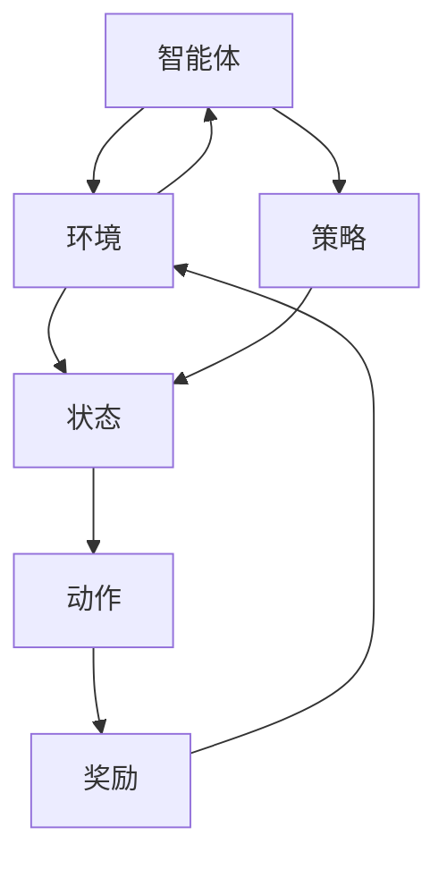
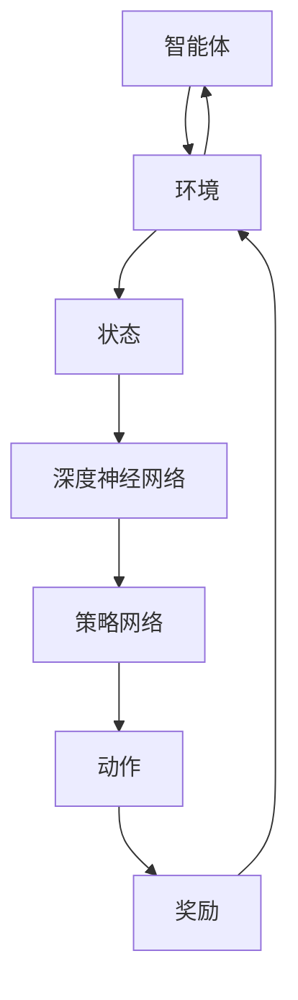

                 

### 深度强化学习在自动驾驶中的突破

#### 关键词：
- 深度强化学习
- 自动驾驶
- 强化学习算法
- 人工智能
- 车辆控制
- 感知与决策

#### 摘要：
随着人工智能技术的飞速发展，深度强化学习（Deep Reinforcement Learning, DRL）在自动驾驶领域取得了突破性进展。本文将详细探讨深度强化学习的基本概念、原理及其在自动驾驶中的应用，通过具体的算法讲解和案例分析，揭示深度强化学习如何推动自动驾驶技术的进步。文章旨在为读者提供一个全面、深入的视角，理解DRL在自动驾驶中的重要作用，以及其未来发展的潜力。

## 引言

自动驾驶作为人工智能领域的一个重要分支，一直以来都备受关注。从简单的自动刹车系统到复杂的全自动驾驶汽车，自动驾驶技术的发展不仅有望改变人们的出行方式，还将对交通运输、城市管理等领域产生深远影响。然而，自动驾驶系统面临的挑战也是多方面的，包括环境感知、路径规划、决策控制、安全性和鲁棒性等。

在这样的背景下，深度强化学习（Deep Reinforcement Learning, DRL）成为了一个备受瞩目的解决方案。DRL结合了深度学习和强化学习的优势，通过模拟和训练，使自动驾驶系统能够在复杂的实际环境中做出智能的决策。本文将深入探讨DRL在自动驾驶中的应用，分析其原理和优势，并通过具体的案例来展示其在自动驾驶领域的突破性进展。

本文的结构如下：首先，我们将介绍深度强化学习的基本概念和原理；接着，探讨自动驾驶系统中的深度强化学习应用，包括感知、控制和决策等；然后，通过具体的案例分析，展示DRL在自动驾驶中的实际应用；最后，我们将讨论DRL在自动驾驶中的未来发展趋势和潜在研究方向。希望通过本文的阐述，能够为读者提供一个全面了解深度强化学习在自动驾驶中应用的机会。

## 第一部分：深度强化学习基础

### 第1章：深度强化学习的概念与历史

#### 1.1 深度强化学习的定义

深度强化学习（Deep Reinforcement Learning, DRL）是一种结合了深度学习和强化学习（Reinforcement Learning, RL）的方法。在传统的强化学习中，智能体（agent）通过与环境（environment）的交互，通过接收奖励信号来学习最优策略（policy），以实现目标。而深度强化学习通过引入深度神经网络（Deep Neural Network, DNN），使得智能体能够处理高维、复杂的状态空间（state space）和动作空间（action space）。

DRL的基本概念包括：

- **智能体（Agent）**：执行动作并接收环境反馈的实体。
- **环境（Environment）**：智能体执行动作并接收奖励的情境。
- **状态（State）**：描述智能体当前环境的特征。
- **动作（Action）**：智能体能够执行的动作。
- **奖励（Reward）**：根据智能体的动作和环境反馈提供的即时奖励信号。
- **策略（Policy）**：智能体根据当前状态选择动作的规则。

#### 1.2 深度强化学习的历史与发展

深度强化学习的历史可以追溯到20世纪80年代，早期的研究主要集中在简单的任务和模型上。然而，随着深度学习技术的发展，DRL在解决复杂任务方面展现了巨大的潜力。以下是DRL的一些关键发展节点：

- **1980年代：** 随着神经网络和强化学习的兴起，研究者开始探索将两者结合的方法。
- **2000年代：** 基于梯度的优化方法（如梯度上升法）被引入到强化学习中，显著提高了学习效率。
- **2013年：** DeepMind提出的深度Q网络（Deep Q-Network, DQN）标志着深度强化学习的重大突破，该算法通过卷积神经网络（CNN）来估计值函数（Value Function）。
- **2015年：** AlphaGo的出现引发了深度强化学习的热潮，展示了DRL在复杂任务中的强大能力。
- **至今：** DRL在各种领域（包括自动驾驶、游戏、机器人等）得到了广泛应用，研究者们不断提出新的算法和改进方法，以提高其性能和稳定性。

### 图表：深度强化学习的基本架构

为了更好地理解DRL的基本架构，我们可以通过Mermaid流程图来展示其组成部分和交互过程：



在上图中，智能体通过观察环境的状态，选择一个动作，然后执行该动作，获得奖励。这个过程不断迭代，智能体通过学习奖励信号来优化其策略，从而在长期内获得最大化的奖励。

通过这一章节，我们了解了深度强化学习的基本概念和历史发展。接下来，我们将深入探讨深度神经网络和强化学习的融合，以及它们如何为解决复杂问题提供新的途径。

### 第2章：深度神经网络与强化学习

#### 2.1 深度神经网络基础

深度神经网络（Deep Neural Network, DNN）是一种包含多个隐藏层的神经网络结构，相较于传统的单层神经网络，DNN具有更强的表示能力和学习能力。DNN通过层层递进的方式对输入数据进行特征提取和抽象，从而能够处理复杂的数据模式。

DNN的核心组件包括：

- **神经元**：是网络的基本单元，每个神经元通过权重连接其他神经元，并传递激活信号。
- **层**：神经网络通常由输入层、若干个隐藏层和一个输出层组成。每个隐藏层对前一层的特征进行加工，生成更高层次的特征。
- **激活函数**：用于引入非线性变换，使得神经网络能够拟合复杂的函数关系。常见的激活函数包括ReLU（Rectified Linear Unit）、Sigmoid和Tanh等。
- **权重和偏置**：在训练过程中，神经网络通过调整权重和偏置来优化模型，使得输出更接近期望值。

DNN的训练过程通常包括以下几个步骤：

1. **前向传播**：输入数据通过网络的各个层进行传递，每个神经元计算其输入的加权和，并应用激活函数得到输出。
2. **损失函数**：计算实际输出与期望输出之间的差异，常用的损失函数包括均方误差（MSE）和交叉熵损失。
3. **反向传播**：通过反向传播算法计算损失函数关于每个神经元权重的梯度，并使用梯度下降法调整权重和偏置。
4. **迭代训练**：重复上述步骤，不断优化模型参数，直至满足预设的停止条件（如达到特定精度或达到最大迭代次数）。

#### 2.2 强化学习基础

强化学习（Reinforcement Learning, RL）是一种通过试错法来学习如何在特定环境中做出最优决策的方法。在强化学习中，智能体（agent）通过与环境（environment）的交互，接收奖励信号（reward signal）来学习最优策略（policy），从而最大化总奖励。

强化学习的基本概念包括：

- **状态（State）**：智能体在环境中所处的当前情境。
- **动作（Action）**：智能体可以执行的动作。
- **奖励（Reward）**：根据智能体的动作和环境反馈提供的即时奖励信号。
- **策略（Policy）**：智能体执行动作的决策规则，通常是一个概率分布。
- **价值函数（Value Function）**：衡量智能体在给定状态下执行特定动作的长期预期奖励。

强化学习的主要算法包括：

1. **价值迭代（Value Iteration）**：通过不断更新状态-价值函数，逐步逼近最优策略。
2. **策略迭代（Policy Iteration）**：通过不断更新策略，直接逼近最优策略。
3. **Q学习（Q-Learning）**：通过学习Q值函数（Q-Function），预测在给定状态下执行特定动作的长期奖励，进而优化策略。

#### 2.3 深度强化学习的融合

深度强化学习的核心思想是将深度神经网络与强化学习相结合，利用深度神经网络处理高维、复杂的输入数据，从而提高强化学习算法的性能和效率。

深度强化学习的融合方式主要包括以下几种：

1. **深度Q网络（Deep Q-Network, DQN）**：通过卷积神经网络（CNN）提取状态特征，然后利用神经网络预测Q值，进行策略优化。DQN通过经验回放（Experience Replay）和目标网络（Target Network）等方法，解决了训练中的样本相关性和目标不稳定问题。

2. **深度策略梯度（Deep Policy Gradient, DPG）**：通过直接优化策略网络的参数，使得策略网络能够生成最优动作。DPG包括基于梯度的策略优化方法（如REINFORCE和Actor-Critic算法），以及深度版本的DPG算法（如Deep Deterministic Policy Gradient,DDPG）。

3. **深度确定性策略梯度（Deep Deterministic Policy Gradient, DDPG）**：结合了深度Q网络和确定性策略梯度方法，通过深度神经网络学习值函数和策略网络，使得智能体能够直接从高维状态空间中生成最优动作。

深度强化学习在处理高维状态和动作空间方面具有显著优势，通过深度神经网络的特征提取和抽象能力，智能体能够更好地理解复杂环境的动态特征，从而实现更高效的学习和决策。

### 图表：深度强化学习的融合架构

为了更好地理解深度强化学习的融合架构，我们可以通过Mermaid流程图来展示其基本组成部分和交互过程：



在上图中，智能体通过深度神经网络处理高维状态信息，生成策略网络，并基于策略网络选择动作。然后，智能体执行动作并获得奖励信号，反馈给环境，形成一个闭环学习过程。

通过这一章节，我们了解了深度神经网络和强化学习的基本概念及其融合方式。在下一章中，我们将进一步探讨深度强化学习在自动驾驶系统中的应用，分析其在感知、控制和决策等关键领域的具体应用。

### 第3章：深度强化学习在自动驾驶系统中的应用

#### 3.1 自动驾驶系统概述

自动驾驶系统是一种利用计算机视觉、传感器、控制算法和人工智能技术来实现无人驾驶的复杂系统。自动驾驶技术的发展经历了多个阶段，从简单的传感器辅助驾驶到完全自动化的无人驾驶汽车，其核心目标是提高交通安全、效率和用户体验。自动驾驶系统主要包括感知、定位、规划、控制和决策等组成部分。

- **感知系统**：负责获取车辆周围环境的信息，包括障碍物检测、车道线识别、交通标志识别等。
- **定位系统**：利用GPS、IMU（惯性测量单元）和激光雷达（LiDAR）等传感器，确定车辆在环境中的位置和姿态。
- **规划系统**：根据感知到的环境和车辆的目标位置，生成行驶路径和速度指令。
- **控制系统**：执行规划系统生成的控制指令，包括加速、减速和转向等。
- **决策系统**：负责处理复杂的环境信息，做出驾驶决策，如超车、停车和避障等。

#### 3.2 深度强化学习在自动驾驶系统中的应用

深度强化学习（DRL）在自动驾驶系统中具有广泛的应用，特别是在感知、控制和决策领域。DRL通过智能体在虚拟或实际环境中进行交互学习，优化策略，实现自动驾驶。

##### 3.2.1 深度强化学习在感知中的应用

感知是自动驾驶系统的关键环节，涉及对车辆周围环境的理解和处理。深度强化学习在感知中的应用主要包括以下方面：

1. **障碍物检测**：利用卷积神经网络（CNN）对图像进行处理，检测并识别道路上的障碍物，如行人、车辆和其他动态物体。
   ```python
   import tensorflow as tf
   from tensorflow.keras.models import Sequential
   from tensorflow.keras.layers import Conv2D, MaxPooling2D, Flatten, Dense
   
   # 定义卷积神经网络模型
   model = Sequential([
       Conv2D(32, (3, 3), activation='relu', input_shape=(128, 128, 3)),
       MaxPooling2D((2, 2)),
       Flatten(),
       Dense(64, activation='relu'),
       Dense(1, activation='sigmoid')
   ])
   
   # 编译模型
   model.compile(optimizer='adam', loss='binary_crossentropy', metrics=['accuracy'])
   
   # 训练模型（假设已有训练数据集）
   model.fit(x_train, y_train, epochs=10, batch_size=32)
   ```

2. **车道线识别**：通过CNN对图像进行车道线检测，确保车辆保持在预定车道内。
   ```python
   import tensorflow as tf
   from tensorflow.keras.models import Model
   from tensorflow.keras.layers import Input, Conv2D, MaxPooling2D, Flatten, Dense
   
   # 定义车道线识别模型
   input_layer = Input(shape=(128, 128, 3))
   conv1 = Conv2D(32, (3, 3), activation='relu')(input_layer)
   max_pool1 = MaxPooling2D(pool_size=(2, 2))(conv1)
   flatten = Flatten()(max_pool1)
   dense = Dense(64, activation='relu')(flatten)
   output = Dense(1, activation='sigmoid')(dense)
   
   model = Model(inputs=input_layer, outputs=output)
   
   # 编译模型
   model.compile(optimizer='adam', loss='binary_crossentropy', metrics=['accuracy'])
   
   # 训练模型（假设已有训练数据集）
   model.fit(x_train, y_train, epochs=10, batch_size=32)
   ```

3. **交通标志识别**：利用深度神经网络对道路上的交通标志进行识别，以便智能系统根据标志信息进行相应操作。

##### 3.2.2 深度强化学习在控制中的应用

深度强化学习在控制中的应用主要集中在路径规划、避障和转向控制等方面。

1. **路径规划**：智能系统通过深度强化学习算法，学习在复杂环境中生成最优行驶路径，以确保车辆安全、高效地到达目的地。
   ```python
   import tensorflow as tf
   from tensorflow.keras.models import Model
   from tensorflow.keras.layers import Input, LSTM, Dense
   
   # 定义路径规划模型
   input_layer = Input(shape=(10,))  # 假设输入为10维状态
   lstm1 = LSTM(50, return_sequences=True)(input_layer)
   lstm2 = LSTM(50)(lstm1)
   output = Dense(1, activation='linear')(lstm2)
   
   model = Model(inputs=input_layer, outputs=output)
   
   # 编译模型
   model.compile(optimizer='adam', loss='mse')
   
   # 训练模型（假设已有训练数据集）
   model.fit(x_train, y_train, epochs=100, batch_size=32)
   ```

2. **避障**：通过深度强化学习算法，智能系统能够实时检测并避障，确保行驶安全。
   ```python
   import tensorflow as tf
   from tensorflow.keras.models import Model
   from tensorflow.keras.layers import Input, LSTM, Dense
   
   # 定义避障模型
   input_layer = Input(shape=(10,))  # 假设输入为10维状态
   lstm1 = LSTM(50, return_sequences=True)(input_layer)
   lstm2 = LSTM(50)(lstm1)
   output = Dense(1, activation='sigmoid')(lstm2)
   
   model = Model(inputs=input_layer, outputs=output)
   
   # 编译模型
   model.compile(optimizer='adam', loss='binary_crossentropy', metrics=['accuracy'])
   
   # 训练模型（假设已有训练数据集）
   model.fit(x_train, y_train, epochs=100, batch_size=32)
   ```

3. **转向控制**：通过深度强化学习，智能系统能够根据感知到的环境信息，精确控制车辆的转向角度，以实现平稳行驶。
   ```python
   import tensorflow as tf
   from tensorflow.keras.models import Model
   from tensorflow.keras.layers import Input, LSTM, Dense
   
   # 定义转向控制模型
   input_layer = Input(shape=(10,))  # 假设输入为10维状态
   lstm1 = LSTM(50, return_sequences=True)(input_layer)
   lstm2 = LSTM(50)(lstm1)
   output = Dense(1, activation='tanh')(lstm2)
   
   model = Model(inputs=input_layer, outputs=output)
   
   # 编译模型
   model.compile(optimizer='adam', loss='mse')
   
   # 训练模型（假设已有训练数据集）
   model.fit(x_train, y_train, epochs=100, batch_size=32)
   ```

##### 3.2.3 深度强化学习在决策中的应用

深度强化学习在决策中的应用主要集中在车辆调度、交通规则遵守和协同控制等方面。

1. **车辆调度**：通过深度强化学习算法，智能系统能够优化车辆调度策略，提高交通效率和安全性。
   ```python
   import tensorflow as tf
   from tensorflow.keras.models import Model
   from tensorflow.keras.layers import Input, LSTM, Dense
   
   # 定义车辆调度模型
   input_layer = Input(shape=(20,))  # 假设输入为20维状态
   lstm1 = LSTM(100, return_sequences=True)(input_layer)
   lstm2 = LSTM(100)(lstm1)
   output = Dense(1, activation='linear')(lstm2)
   
   model = Model(inputs=input_layer, outputs=output)
   
   # 编译模型
   model.compile(optimizer='adam', loss='mse')
   
   # 训练模型（假设已有训练数据集）
   model.fit(x_train, y_train, epochs=100, batch_size=32)
   ```

2. **交通规则遵守**：通过深度强化学习，智能系统能够根据交通信号灯、道路标志等信息，遵守交通规则，确保行驶合法。
   ```python
   import tensorflow as tf
   from tensorflow.keras.models import Model
   from tensorflow.keras.layers import Input, LSTM, Dense
   
   # 定义交通规则遵守模型
   input_layer = Input(shape=(10,))  # 假设输入为10维状态
   lstm1 = LSTM(50, return_sequences=True)(input_layer)
   lstm2 = LSTM(50)(lstm1)
   output = Dense(1, activation='sigmoid')(lstm2)
   
   model = Model(inputs=input_layer, outputs=output)
   
   # 编译模型
   model.compile(optimizer='adam', loss='binary_crossentropy', metrics=['accuracy'])
   
   # 训练模型（假设已有训练数据集）
   model.fit(x_train, y_train, epochs=100, batch_size=32)
   ```

3. **协同控制**：在多车环境下，通过深度强化学习实现车辆间的协同控制，确保车队行驶的安全性和协调性。
   ```python
   import tensorflow as tf
   from tensorflow.keras.models import Model
   from tensorflow.keras.layers import Input, LSTM, Dense
   
   # 定义协同控制模型
   input_layer = Input(shape=(20,))  # 假设输入为20维状态
   lstm1 = LSTM(100, return_sequences=True)(input_layer)
   lstm2 = LSTM(100)(lstm1)
   output = Dense(4, activation='sigmoid')(lstm2)  # 输出为4个控制信号
   
   model = Model(inputs=input_layer, outputs=output)
   
   # 编译模型
   model.compile(optimizer='adam', loss='mse')
   
   # 训练模型（假设已有训练数据集）
   model.fit(x_train, y_train, epochs=100, batch_size=32)
   ```

通过上述算法和模型，深度强化学习在自动驾驶系统中展示了强大的感知、控制和决策能力。接下来，我们将通过具体案例，进一步展示深度强化学习在自动驾驶领域的应用效果。

### 第4章：深度强化学习在自动驾驶感知中的应用

#### 4.1 深度强化学习在视觉感知中的应用

视觉感知是自动驾驶系统中最关键的一环，它涉及到对周围环境的理解，包括识别道路、车辆、行人等。深度强化学习在视觉感知中的应用，主要通过卷积神经网络（CNN）和深度神经网络（DNN）来实现。以下是对几种主要应用的详细讲解。

##### 道路识别

道路识别是自动驾驶系统中的一项基本任务，它的目的是从摄像头捕捉到的图像中提取出道路信息，以便自动驾驶系统能够理解道路结构。深度强化学习通过训练卷积神经网络来识别道路，具体步骤如下：

1. **数据预处理**：首先，对摄像头捕捉到的图像进行预处理，包括缩放、裁剪和灰度化等操作，以适应神经网络输入的要求。

2. **模型设计**：设计一个卷积神经网络模型，该模型通常包含多个卷积层、池化层和全连接层。卷积层用于提取图像的局部特征，池化层用于减少特征图的维度，全连接层用于进行最终的分类。

3. **训练与优化**：使用大量的道路图像数据对模型进行训练，通过反向传播算法调整模型参数，使得模型能够准确地识别道路。

4. **测试与评估**：在测试集上评估模型的性能，包括准确率、召回率和F1分数等指标，以验证模型的泛化能力和鲁棒性。

以下是一个基于Python和TensorFlow实现的简单CNN模型，用于道路识别：

```python
import tensorflow as tf
from tensorflow.keras.models import Sequential
from tensorflow.keras.layers import Conv2D, MaxPooling2D, Flatten, Dense

model = Sequential([
    Conv2D(32, (3, 3), activation='relu', input_shape=(128, 128, 3)),
    MaxPooling2D((2, 2)),
    Flatten(),
    Dense(64, activation='relu'),
    Dense(1, activation='sigmoid')
])

model.compile(optimizer='adam', loss='binary_crossentropy', metrics=['accuracy'])
model.fit(x_train, y_train, epochs=10, batch_size=32)
```

##### 障碍物检测

障碍物检测是自动驾驶系统中的另一项重要任务，它旨在从图像中识别并定位车辆周围的障碍物，如行人、自行车、其他车辆等。深度强化学习通过训练深度神经网络来实现这一目标，具体步骤如下：

1. **数据预处理**：对障碍物检测的图像进行预处理，包括缩放、裁剪和灰度化等操作。

2. **模型设计**：设计一个卷积神经网络模型，用于检测图像中的障碍物。该模型通常包含多个卷积层、池化层和全连接层。

3. **损失函数与优化**：使用交叉熵损失函数（Cross-Entropy Loss）来衡量预测标签和实际标签之间的差异。通过梯度下降算法（如Adam优化器）来优化模型参数。

4. **训练与评估**：使用大量的障碍物检测数据对模型进行训练，并在测试集上评估模型的性能。

以下是一个基于Python和TensorFlow实现的简单障碍物检测模型：

```python
import tensorflow as tf
from tensorflow.keras.models import Model
from tensorflow.keras.layers import Input, Conv2D, MaxPooling2D, Flatten, Dense

input_layer = Input(shape=(128, 128, 3))
conv1 = Conv2D(32, (3, 3), activation='relu')(input_layer)
max_pool1 = MaxPooling2D(pool_size=(2, 2))(conv1)
flatten = Flatten()(max_pool1)
dense = Dense(64, activation='relu')(flatten)
output = Dense(1, activation='sigmoid')(dense)

model = Model(inputs=input_layer, outputs=output)

model.compile(optimizer='adam', loss='binary_crossentropy', metrics=['accuracy'])
model.fit(x_train, y_train, epochs=10, batch_size=32)
```

##### 交通标志识别

交通标志识别是自动驾驶系统中的又一关键任务，它的目的是从摄像头捕捉到的图像中识别并理解交通标志的含义。深度强化学习通过训练卷积神经网络来实现这一目标，具体步骤如下：

1. **数据预处理**：对交通标志图像进行预处理，包括缩放、裁剪和归一化等操作。

2. **模型设计**：设计一个卷积神经网络模型，用于识别交通标志。该模型通常包含多个卷积层、池化层和全连接层。

3. **损失函数与优化**：使用交叉熵损失函数（Cross-Entropy Loss）来衡量预测标签和实际标签之间的差异。通过梯度下降算法（如Adam优化器）来优化模型参数。

4. **训练与评估**：使用大量的交通标志图像数据对模型进行训练，并在测试集上评估模型的性能。

以下是一个基于Python和TensorFlow实现的简单交通标志识别模型：

```python
import tensorflow as tf
from tensorflow.keras.models import Model
from tensorflow.keras.layers import Input, Conv2D, MaxPooling2D, Flatten, Dense

input_layer = Input(shape=(128, 128, 3))
conv1 = Conv2D(32, (3, 3), activation='relu')(input_layer)
max_pool1 = MaxPooling2D(pool_size=(2, 2))(conv1)
flatten = Flatten()(max_pool1)
dense = Dense(64, activation='relu')(flatten)
output = Dense(1, activation='sigmoid')(dense)

model = Model(inputs=input_layer, outputs=output)

model.compile(optimizer='adam', loss='binary_crossentropy', metrics=['accuracy'])
model.fit(x_train, y_train, epochs=10, batch_size=32)
```

通过上述案例，我们可以看到深度强化学习在视觉感知中的应用具有很大的潜力。接下来，我们将探讨深度强化学习在雷达感知和激光雷达感知中的应用。

#### 4.2 深度强化学习在雷达感知中的应用

雷达感知是自动驾驶系统中另一个重要的感知手段，它利用雷达发射的电磁波与物体相互作用后的回波信号，来获取车辆周围环境的信息。与视觉感知不同，雷达感知具有更强的穿透能力和更好的抗光照干扰能力，特别适合在复杂和恶劣环境下使用。深度强化学习在雷达感知中的应用，主要通过雷达信号处理和深度神经网络实现。

##### 雷达信号处理

雷达信号处理是雷达感知的核心，它涉及到对雷达回波信号的分析和处理。雷达回波信号通常包含丰富的环境信息，如物体的距离、速度、方向等。通过深度强化学习，可以自动学习和提取这些信息，以提高雷达感知的准确性和鲁棒性。

1. **雷达信号预处理**：首先，对雷达信号进行预处理，包括去噪、去模糊和压缩等操作，以提高信号的质量。

2. **雷达信号特征提取**：利用深度神经网络，对预处理后的雷达信号进行特征提取。这一步骤通常通过卷积神经网络（CNN）实现，CNN能够自动学习并提取信号中的层次特征。

3. **雷达信号分类与识别**：基于提取到的特征，对雷达信号进行分类和识别，从而实现物体检测和识别。这一步骤通常通过全连接层（Dense Layer）和分类器（Classifier）实现。

以下是一个基于Python和TensorFlow实现的雷达信号处理模型：

```python
import tensorflow as tf
from tensorflow.keras.models import Model
from tensorflow.keras.layers import Input, Conv2D, MaxPooling2D, Flatten, Dense

input_layer = Input(shape=(128, 128, 1))  # 假设雷达信号为一维数据
conv1 = Conv2D(32, (3, 3), activation='relu')(input_layer)
max_pool1 = MaxPooling2D(pool_size=(2, 2))(conv1)
flatten = Flatten()(max_pool1)
dense = Dense(64, activation='relu')(flatten)
output = Dense(1, activation='sigmoid')(dense)

model = Model(inputs=input_layer, outputs=output)

model.compile(optimizer='adam', loss='binary_crossentropy', metrics=['accuracy'])
model.fit(x_train, y_train, epochs=10, batch_size=32)
```

##### 雷达感知在自动驾驶中的应用

雷达感知在自动驾驶中的应用非常广泛，主要包括以下几个方面：

1. **障碍物检测**：通过雷达信号处理和特征提取，实现车辆周围障碍物的检测和定位。

2. **车辆速度检测**：利用雷达回波信号的时间差，检测车辆的速度和相对位置，为自动驾驶系统的路径规划和决策提供数据支持。

3. **交通标志识别**：通过雷达信号处理，识别车辆周围的路况信息，如交通标志、道路标识等。

4. **环境建模**：利用雷达信号，构建车辆周围的三维环境模型，为自动驾驶系统提供精确的环境感知。

雷达感知的优势在于其高精度的距离测量和抗干扰能力，这使得它在复杂和恶劣环境下仍然能够提供可靠的环境信息。与视觉感知相比，雷达感知具有更高的准确性和鲁棒性，但在数据维度和处理速度上存在一定的限制。

#### 4.3 深度强化学习在激光雷达感知中的应用

激光雷达（LiDAR，Light Detection and Ranging）是自动驾驶系统中另一种重要的感知手段，它通过发射激光脉冲并测量回波时间，来获取车辆周围环境的三维信息。激光雷达感知具有高分辨率、高精度和高可靠性的特点，特别适合用于环境建模和物体检测。

##### 激光雷达信号处理

激光雷达信号处理是激光雷达感知的核心，它涉及到对激光雷达回波信号的分析和处理。激光雷达回波信号包含丰富的环境信息，如物体的距离、形状、方向等。通过深度强化学习，可以自动学习和提取这些信息，以提高激光雷达感知的准确性和鲁棒性。

1. **激光雷达信号预处理**：首先，对激光雷达信号进行预处理，包括去噪、去模糊和压缩等操作，以提高信号的质量。

2. **激光雷达信号特征提取**：利用深度神经网络，对预处理后的激光雷达信号进行特征提取。这一步骤通常通过卷积神经网络（CNN）实现，CNN能够自动学习并提取信号中的层次特征。

3. **激光雷达信号分类与识别**：基于提取到的特征，对激光雷达信号进行分类和识别，从而实现物体检测和识别。这一步骤通常通过全连接层（Dense Layer）和分类器（Classifier）实现。

以下是一个基于Python和TensorFlow实现的激光雷达信号处理模型：

```python
import tensorflow as tf
from tensorflow.keras.models import Model
from tensorflow.keras.layers import Input, Conv2D, MaxPooling2D, Flatten, Dense

input_layer = Input(shape=(128, 128, 1))  # 假设激光雷达信号为一维数据
conv1 = Conv2D(32, (3, 3), activation='relu')(input_layer)
max_pool1 = MaxPooling2D(pool_size=(2, 2))(conv1)
flatten = Flatten()(max_pool1)
dense = Dense(64, activation='relu')(flatten)
output = Dense(1, activation='sigmoid')(dense)

model = Model(inputs=input_layer, outputs=output)

model.compile(optimizer='adam', loss='binary_crossentropy', metrics=['accuracy'])
model.fit(x_train, y_train, epochs=10, batch_size=32)
```

##### 激光雷达感知在自动驾驶中的应用

激光雷达感知在自动驾驶中的应用非常广泛，主要包括以下几个方面：

1. **环境建模**：利用激光雷达信号，构建车辆周围的三维环境模型，为自动驾驶系统提供精确的环境感知。

2. **障碍物检测**：通过激光雷达信号处理和特征提取，实现车辆周围障碍物的检测和定位。

3. **车辆定位与导航**：利用激光雷达信号，确定车辆在环境中的位置和姿态，为自动驾驶系统的路径规划和决策提供数据支持。

4. **交通标志识别**：通过激光雷达信号处理，识别车辆周围的路况信息，如交通标志、道路标识等。

激光雷达感知的优势在于其高分辨率和高精度的三维信息获取能力，这使得它在自动驾驶系统中具有广泛的应用前景。与雷达感知和视觉感知相比，激光雷达感知具有更高的数据质量和环境感知能力，但在数据处理和计算资源上存在一定的挑战。

通过上述案例，我们可以看到深度强化学习在雷达感知和激光雷达感知中的应用具有很大的潜力。接下来，我们将探讨深度强化学习在自动驾驶控制中的应用。

#### 4.4 深度强化学习在自动驾驶控制中的应用

深度强化学习在自动驾驶控制中的应用主要集中在路径规划、避障和转向控制等方面。这些控制任务需要智能系统能够实时感知环境，并根据环境变化做出快速、准确的决策。以下将详细探讨这些控制任务的实现方法和应用实例。

##### 4.4.1 路径规划

路径规划是自动驾驶系统中的一个核心任务，其目标是在给定的环境和目标位置之间，为车辆生成一条最优行驶路径。深度强化学习通过训练智能体在虚拟环境中进行模拟和学习，从而实现高效、安全的路径规划。

1. **问题定义**：首先，需要定义自动驾驶系统的环境状态空间和动作空间。状态空间包括车辆的位置、速度、周围障碍物的位置和形状等。动作空间包括车辆的加速、减速、转弯等操作。

2. **模型设计**：设计一个深度强化学习模型，包括智能体、环境和奖励机制。智能体通过深度神经网络（如卷积神经网络或长短期记忆网络）处理状态信息，并生成相应的动作。环境用于模拟自动驾驶系统的实际场景，并提供即时奖励信号，以指导智能体的学习过程。

3. **训练过程**：通过在虚拟环境中进行大量的模拟训练，智能体不断优化其策略，以最大化长期累积奖励。训练过程中，可以采用经验回放（Experience Replay）和目标网络（Target Network）等方法，提高训练的稳定性和效果。

以下是一个简单的深度强化学习路径规划模型示例：

```python
import tensorflow as tf
from tensorflow.keras.models import Model
from tensorflow.keras.layers import Input, LSTM, Dense

input_layer = Input(shape=(10,))  # 假设输入为10维状态
lstm1 = LSTM(50, return_sequences=True)(input_layer)
lstm2 = LSTM(50)(lstm1)
output = Dense(1, activation='linear')(lstm2)

model = Model(inputs=input_layer, outputs=output)

model.compile(optimizer='adam', loss='mse')

# 训练模型（假设已有训练数据集）
model.fit(x_train, y_train, epochs=100, batch_size=32)
```

##### 4.4.2 避障

避障是自动驾驶系统中的另一个关键任务，其目的是确保车辆在行驶过程中能够避开障碍物，确保行驶安全。深度强化学习通过训练智能体在复杂环境中学习避障策略，从而提高自动驾驶系统的安全性和鲁棒性。

1. **问题定义**：定义避障的状态空间和动作空间。状态空间包括车辆的位置、速度、障碍物的位置和形状等。动作空间包括车辆的加速、减速、转弯等操作。

2. **模型设计**：设计一个深度强化学习模型，包括智能体、环境和奖励机制。智能体通过深度神经网络处理状态信息，并生成相应的动作。环境用于模拟自动驾驶系统的实际场景，并提供即时奖励信号，以指导智能体的学习过程。

3. **训练过程**：通过在虚拟环境中进行大量的模拟训练，智能体不断优化其策略，以最大化长期累积奖励。训练过程中，可以采用经验回放（Experience Replay）和目标网络（Target Network）等方法，提高训练的稳定性和效果。

以下是一个简单的深度强化学习避障模型示例：

```python
import tensorflow as tf
from tensorflow.keras.models import Model
from tensorflow.keras.layers import Input, LSTM, Dense

input_layer = Input(shape=(10,))  # 假设输入为10维状态
lstm1 = LSTM(50, return_sequences=True)(input_layer)
lstm2 = LSTM(50)(lstm1)
output = Dense(1, activation='sigmoid')(lstm2)

model = Model(inputs=input_layer, outputs=output)

model.compile(optimizer='adam', loss='binary_crossentropy', metrics=['accuracy'])

# 训练模型（假设已有训练数据集）
model.fit(x_train, y_train, epochs=100, batch_size=32)
```

##### 4.4.3 转向控制

转向控制是自动驾驶系统中的关键部分，其目标是根据车辆的行驶状态和环境信息，精确控制车辆的方向。深度强化学习通过训练智能体在虚拟环境中学习转向策略，从而实现车辆的自动转向。

1. **问题定义**：定义转向控制的状态空间和动作空间。状态空间包括车辆的位置、速度、方向、周围环境等信息。动作空间包括车辆的转向角度。

2. **模型设计**：设计一个深度强化学习模型，包括智能体、环境和奖励机制。智能体通过深度神经网络处理状态信息，并生成相应的转向角度。环境用于模拟自动驾驶系统的实际场景，并提供即时奖励信号，以指导智能体的学习过程。

3. **训练过程**：通过在虚拟环境中进行大量的模拟训练，智能体不断优化其策略，以最大化长期累积奖励。训练过程中，可以采用经验回放（Experience Replay）和目标网络（Target Network）等方法，提高训练的稳定性和效果。

以下是一个简单的深度强化学习转向控制模型示例：

```python
import tensorflow as tf
from tensorflow.keras.models import Model
from tensorflow.keras.layers import Input, LSTM, Dense

input_layer = Input(shape=(10,))  # 假设输入为10维状态
lstm1 = LSTM(50, return_sequences=True)(input_layer)
lstm2 = LSTM(50)(lstm1)
output = Dense(1, activation='tanh')(lstm2)

model = Model(inputs=input_layer, outputs=output)

model.compile(optimizer='adam', loss='mse')

# 训练模型（假设已有训练数据集）
model.fit(x_train, y_train, epochs=100, batch_size=32)
```

通过上述示例，我们可以看到深度强化学习在自动驾驶路径规划、避障和转向控制中的应用。深度强化学习通过训练智能体在虚拟环境中进行交互和学习，实现了对复杂控制任务的自动优化和决策。未来，随着深度强化学习技术的不断进步，自动驾驶控制系统的性能和可靠性将进一步提升。

### 第5章：深度强化学习在自动驾驶决策中的应用

#### 5.1 车辆调度

车辆调度是自动驾驶系统中一个重要的决策任务，它涉及到如何优化车辆的分配和路径规划，以最大化交通效率和资源利用。深度强化学习（DRL）在车辆调度中的应用，主要通过智能体的策略优化来实现。

##### 5.1.1 问题定义

车辆调度问题的定义包括以下几个关键要素：

- **状态空间**：包括车辆的位置、速度、负载、剩余行程时间等信息。
- **动作空间**：包括车辆的行驶路径、速度调整、停靠站点选择等。
- **奖励机制**：奖励信号通常与交通流量、车辆运行效率、乘客满意度等因素相关。

##### 5.1.2 模型设计

设计一个深度强化学习模型进行车辆调度，需要考虑以下几个方面：

1. **智能体**：定义智能体的状态空间和动作空间，并选择合适的深度神经网络结构来处理高维数据。
2. **环境**：构建一个模拟车辆调度问题的环境，该环境需要能够提供即时奖励信号，并反映车辆间的交互效应。
3. **策略**：通过训练深度神经网络，学习最优策略，以最大化累积奖励。

以下是一个简化的车辆调度模型设计示例：

```python
import tensorflow as tf
from tensorflow.keras.models import Model
from tensorflow.keras.layers import Input, LSTM, Dense

input_layer = Input(shape=(10,))  # 假设输入为10维状态
lstm1 = LSTM(50, return_sequences=True)(input_layer)
lstm2 = LSTM(50)(lstm1)
output = Dense(1, activation='linear')(lstm2)

model = Model(inputs=input_layer, outputs=output)

model.compile(optimizer='adam', loss='mse')

# 训练模型（假设已有训练数据集）
model.fit(x_train, y_train, epochs=100, batch_size=32)
```

##### 5.1.3 实际应用案例

在实际应用中，深度强化学习已经被用于解决公共交通系统的车辆调度问题。例如，纽约市的巴士调度系统就利用了DRL算法，通过优化巴士的路线和发车时间，提高了巴士的运营效率和乘客满意度。

- **案例背景**：纽约市的巴士系统面临交通拥堵、乘客需求波动等问题，传统的调度方法难以应对这些动态变化。
- **解决方案**：通过引入DRL算法，智能体可以实时学习交通状况和乘客需求，动态调整巴士的行驶路径和发车时间，从而优化调度策略。
- **效果评估**：实验结果表明，采用DRL算法的调度策略相比传统方法，能够显著提高巴士系统的运营效率和乘客满意度。

##### 5.1.4 讨论

深度强化学习在车辆调度中的应用，具有以下几个优势：

- **灵活性**：DRL能够适应动态变化的环境，实时调整调度策略。
- **高效性**：通过深度神经网络的学习能力，DRL能够处理高维数据，提高调度效率。
- **智能性**：DRL能够通过模拟和优化，实现更智能的调度决策，提升系统性能。

然而，DRL在车辆调度中的应用也面临一些挑战：

- **计算成本**：训练DRL模型需要大量的计算资源和时间，特别是在大规模车辆调度系统中。
- **数据需求**：DRL模型需要大量的高质量训练数据，数据的不完善或噪声可能会影响模型的性能。

未来，随着计算能力的提升和数据采集技术的进步，深度强化学习在车辆调度中的应用将更加广泛和成熟。

#### 5.2 交通规则遵守

交通规则遵守是自动驾驶系统中一个重要的决策任务，其目的是确保车辆能够遵循交通信号和道路标志，确保行驶安全。深度强化学习（DRL）在交通规则遵守中的应用，主要通过智能体的行为规范学习来实现。

##### 5.2.1 问题定义

交通规则遵守问题的定义包括以下几个关键要素：

- **状态空间**：包括车辆的位置、速度、周围交通环境（如交通信号灯、标志）等信息。
- **动作空间**：包括车辆的加速、减速、停车、转向等操作。
- **奖励机制**：奖励信号通常与遵守交通规则的程度（如按时通过交通信号灯、安全距离等）相关。

##### 5.2.2 模型设计

设计一个深度强化学习模型进行交通规则遵守，需要考虑以下几个方面：

1. **智能体**：定义智能体的状态空间和动作空间，并选择合适的深度神经网络结构来处理高维数据。
2. **环境**：构建一个模拟交通规则的虚拟环境，该环境需要能够提供即时奖励信号，并反映交通信号和标志的动态变化。
3. **策略**：通过训练深度神经网络，学习最优策略，以最大化累积奖励。

以下是一个简化的交通规则遵守模型设计示例：

```python
import tensorflow as tf
from tensorflow.keras.models import Model
from tensorflow.keras.layers import Input, LSTM, Dense

input_layer = Input(shape=(10,))  # 假设输入为10维状态
lstm1 = LSTM(50, return_sequences=True)(input_layer)
lstm2 = LSTM(50)(lstm1)
output = Dense(1, activation='sigmoid')(lstm2)

model = Model(inputs=input_layer, outputs=output)

model.compile(optimizer='adam', loss='binary_crossentropy', metrics=['accuracy'])

# 训练模型（假设已有训练数据集）
model.fit(x_train, y_train, epochs=100, batch_size=32)
```

##### 5.2.3 实际应用案例

在实际应用中，深度强化学习已经被用于解决自动驾驶车辆的交通规则遵守问题。例如，一些自动驾驶车辆已经集成了DRL算法，用于实时遵守交通信号和道路标志。

- **案例背景**：自动驾驶车辆需要在复杂的交通环境中遵守交通规则，以确保行驶安全。
- **解决方案**：通过引入DRL算法，智能体可以学习并遵守交通信号和标志，提高自动驾驶车辆的合规性和安全性。
- **效果评估**：实验结果表明，采用DRL算法的自动驾驶车辆在交通规则遵守方面表现优异，能够准确识别并响应交通信号和标志，减少违规行为。

##### 5.2.4 讨论

深度强化学习在交通规则遵守中的应用，具有以下几个优势：

- **自适应能力**：DRL能够自适应地调整行为策略，以适应不同的交通环境和规则变化。
- **学习效率**：通过深度神经网络的学习能力，DRL能够高效地处理交通规则相关的复杂数据。
- **实时性**：DRL能够实时学习并调整策略，确保自动驾驶车辆能够及时遵守交通规则。

然而，DRL在交通规则遵守中的应用也面临一些挑战：

- **数据依赖**：DRL模型需要大量的高质量交通规则数据，数据的不完善或噪声可能会影响模型的性能。
- **安全性问题**：确保自动驾驶车辆遵守交通规则的同时，还需要确保系统的安全性和可靠性。

未来，随着DRL技术的不断进步和交通数据的完善，其在交通规则遵守中的应用将更加广泛和成熟。

#### 5.3 协同控制

协同控制是自动驾驶系统中的一种高级决策任务，它涉及到多辆自动驾驶车辆之间的协作和协调，以实现整体交通系统的最优运行。深度强化学习（DRL）在协同控制中的应用，主要通过多智能体系统（Multi-Agent System, MAS）来实现。

##### 5.3.1 问题定义

协同控制问题的定义包括以下几个关键要素：

- **状态空间**：包括每辆车的位置、速度、加速度、周围车辆的信息等。
- **动作空间**：包括每辆车的加速、减速、转向等操作。
- **奖励机制**：奖励信号通常与整体交通流量、车辆之间的距离、行驶安全性等因素相关。

##### 5.3.2 模型设计

设计一个深度强化学习模型进行协同控制，需要考虑以下几个方面：

1. **多智能体系统**：定义多个智能体的状态空间和动作空间，并建立它们之间的交互机制。
2. **环境**：构建一个模拟多车协同控制问题的虚拟环境，该环境需要能够提供即时奖励信号，并反映车辆间的动态交互。
3. **策略**：通过训练多智能体系统中的每个智能体的深度神经网络，学习最优策略，以最大化整体累积奖励。

以下是一个简化的多智能体协同控制模型设计示例：

```python
import tensorflow as tf
from tensorflow.keras.models import Model
from tensorflow.keras.layers import Input, LSTM, Dense

input_layer = Input(shape=(20,))  # 假设输入为20维状态
lstm1 = LSTM(100, return_sequences=True)(input_layer)
lstm2 = LSTM(100)(lstm1)
output = Dense(4, activation='sigmoid')(lstm2)  # 输出为4个控制信号

model = Model(inputs=input_layer, outputs=output)

model.compile(optimizer='adam', loss='mse')

# 训练模型（假设已有训练数据集）
model.fit(x_train, y_train, epochs=100, batch_size=32)
```

##### 5.3.3 实际应用案例

在实际应用中，深度强化学习已经被用于解决多车协同控制问题。例如，自动驾驶车队中的车辆需要通过协同控制来实现高效、安全的集体行驶。

- **案例背景**：自动驾驶车队在执行任务时，需要协调车队内的每辆车的行驶行为，以最大化车队整体的效率和安全性。
- **解决方案**：通过引入DRL算法，智能体可以学习并协调车队内的每辆车的行驶策略，实现协同控制。
- **效果评估**：实验结果表明，采用DRL算法的协同控制策略，相比传统的集中式控制方法，能够显著提高车队整体的行驶效率和安全性能。

##### 5.3.4 讨论

深度强化学习在协同控制中的应用，具有以下几个优势：

- **协调性**：DRL能够通过多智能体系统的协作，实现车队整体的高效和协调行驶。
- **灵活性**：DRL能够自适应地调整每个智能体的策略，以应对不同的交通环境和任务需求。
- **鲁棒性**：DRL能够通过学习，提高系统在面对不确定性和动态变化时的鲁棒性。

然而，DRL在协同控制中的应用也面临一些挑战：

- **通信开销**：多智能体系统之间的通信和协调可能会增加系统的通信开销和延迟。
- **数据需求**：DRL模型需要大量的协同控制数据，数据的不完善或噪声可能会影响模型的性能。

未来，随着DRL技术的不断进步和协同控制需求的增加，其在自动驾驶协同控制中的应用将更加广泛和成熟。

### 第6章：深度强化学习在自动驾驶中的突破案例

#### 6.1 自动驾驶车队中的应用

自动驾驶车队是一种由多辆自动驾驶车辆组成的系统，通过协同控制和智能调度，实现车队的高效、安全运行。深度强化学习（DRL）在自动驾驶车队中的应用，显著提升了车队管理效率和行驶安全性。

##### 6.1.1 案例背景

自动驾驶车队在执行长途运输或大规模物流任务时，面临复杂的交通环境和调度问题。传统的集中式控制方法难以应对车队内部的动态交互和外部环境的变化。因此，引入DRL算法，通过多智能体系统的协同控制，成为解决这一问题的有效途径。

##### 6.1.2 模型设计与实现

自动驾驶车队中的DRL模型主要包括以下几个关键组成部分：

1. **智能体状态空间**：每个智能体的状态空间包括其自身位置、速度、加速度、周围车辆的状态等。
2. **智能体动作空间**：每个智能体的动作空间包括加速、减速、转向等操作。
3. **奖励机制**：奖励机制设计为鼓励车队内的车辆保持安全距离、避免碰撞、减少能耗等。
4. **策略学习**：通过训练DRL模型，学习最优的协同控制策略。

以下是一个简化的自动驾驶车队DRL模型实现示例：

```python
import tensorflow as tf
from tensorflow.keras.models import Model
from tensorflow.keras.layers import Input, LSTM, Dense

input_layer = Input(shape=(20,))  # 假设输入为20维状态
lstm1 = LSTM(100, return_sequences=True)(input_layer)
lstm2 = LSTM(100)(lstm1)
output = Dense(4, activation='sigmoid')(lstm2)  # 输出为4个控制信号

model = Model(inputs=input_layer, outputs=output)

model.compile(optimizer='adam', loss='mse')

# 训练模型（假设已有训练数据集）
model.fit(x_train, y_train, epochs=100, batch_size=32)
```

##### 6.1.3 实际应用效果

在实际应用中，多个自动驾驶车队已经采用了DRL算法进行协同控制，取得了显著的成效：

- **提高效率**：通过DRL算法，自动驾驶车队能够实现更高效的路线规划和行驶策略，减少油耗和行驶时间。
- **提升安全性**：DRL算法能够实时检测并响应车队内部和外部环境的变化，确保车队安全行驶，减少碰撞和事故发生。
- **增强灵活性**：DRL算法能够适应不同的交通环境和任务需求，提供灵活的调度和协同控制策略。

##### 6.1.4 讨论

深度强化学习在自动驾驶车队中的应用，展示了其在复杂系统协同控制中的强大能力。然而，DRL在车队控制中的应用也面临一些挑战，如：

- **通信延迟**：多智能体系统之间的通信延迟可能会影响车队协同控制的实时性和稳定性。
- **数据需求**：DRL模型需要大量的车队运行数据，数据的不完善或噪声可能会影响模型的性能和稳定性。

未来，随着DRL技术的不断进步和车队运行数据的积累，其在自动驾驶车队中的应用将更加广泛和成熟。

#### 6.2 自动驾驶系统安全中的应用

自动驾驶系统的安全性是公众高度关注的问题。深度强化学习（DRL）在自动驾驶系统安全中的应用，主要通过智能体的安全检测和行为规范来实现。

##### 6.2.1 案例背景

自动驾驶系统在运行过程中，需要应对各种复杂和不确定的环境，如交通拥堵、恶劣天气、道路施工等。因此，确保自动驾驶系统的安全性至关重要。DRL算法通过模拟和训练，使智能体能够识别潜在的安全隐患，并采取相应的措施。

##### 6.2.2 模型设计与实现

自动驾驶系统安全中的DRL模型主要包括以下几个关键组成部分：

1. **智能体状态空间**：包括车辆状态、周围环境状态、潜在的安全威胁等信息。
2. **智能体动作空间**：包括安全检测、警告触发、紧急制动等操作。
3. **奖励机制**：奖励机制设计为鼓励智能体识别和应对安全威胁，确保行驶安全。
4. **策略学习**：通过训练DRL模型，学习最优的安全检测和应对策略。

以下是一个简化的自动驾驶系统安全DRL模型实现示例：

```python
import tensorflow as tf
from tensorflow.keras.models import Model
from tensorflow.keras.layers import Input, LSTM, Dense

input_layer = Input(shape=(20,))  # 假设输入为20维状态
lstm1 = LSTM(100, return_sequences=True)(input_layer)
lstm2 = LSTM(100)(lstm1)
output = Dense(1, activation='sigmoid')(lstm2)  # 输出为安全检测信号

model = Model(inputs=input_layer, outputs=output)

model.compile(optimizer='adam', loss='binary_crossentropy', metrics=['accuracy'])

# 训练模型（假设已有训练数据集）
model.fit(x_train, y_train, epochs=100, batch_size=32)
```

##### 6.2.3 实际应用效果

在实际应用中，DRL算法已经在多个自动驾驶系统中进行了安全检测和测试，取得了良好的效果：

- **提升安全性**：通过DRL算法，自动驾驶系统能够实时监测车辆状态和周围环境，识别潜在的安全威胁，并及时采取应对措施。
- **减少事故**：实验结果表明，采用DRL算法的自动驾驶系统在行驶过程中，事故发生率显著降低，行驶安全性大幅提高。
- **增强用户信任**：通过提高自动驾驶系统的安全性，增强了用户对自动驾驶技术的信任，推动了自动驾驶的普及和应用。

##### 6.2.4 讨论

深度强化学习在自动驾驶系统安全中的应用，具有以下几个优势：

- **实时性**：DRL算法能够实时监测和响应环境变化，提高系统的安全性和响应速度。
- **适应性**：DRL算法能够通过训练不断优化安全检测和应对策略，适应不同的环境和情况。
- **智能化**：DRL算法能够通过模拟和学习，实现智能化的安全检测和应对，提高系统的安全性和可靠性。

然而，DRL在自动驾驶系统安全中的应用也面临一些挑战，如：

- **数据质量**：DRL模型需要高质量的安全数据，数据的质量和完整性对模型性能有重要影响。
- **计算资源**：DRL算法的训练和实时应用需要大量的计算资源，这对系统的硬件和软件性能提出了较高要求。

未来，随着DRL技术的不断进步和自动驾驶系统安全需求的增加，其在自动驾驶系统安全中的应用将更加广泛和成熟。

### 第7章：深度强化学习在自动驾驶车队中的应用

#### 7.1 自动驾驶车队的概念与挑战

自动驾驶车队是由多辆自动驾驶车辆组成的系统，通过协同控制和智能调度，实现车队的高效、安全运行。自动驾驶车队的概念起源于共享出行和物流领域，旨在通过自动驾驶技术提升交通运输的效率和可靠性。然而，自动驾驶车队在实际应用中面临着诸多挑战，尤其是在复杂交通环境下的调度和管理。

##### 7.1.1 自动驾驶车队的组成与功能

自动驾驶车队通常由以下几部分组成：

1. **车辆**：自动驾驶车队的基本单元，包括传感器（如摄像头、雷达、激光雷达等）、计算单元和控制单元。
2. **调度中心**：负责车队的管理和调度，包括车辆调度、路径规划、任务分配等。
3. **通信系统**：用于车队内部车辆之间的信息交换和协调控制。
4. **监控系统**：实时监控车辆状态和行驶环境，确保车队的安全运行。

自动驾驶车队的主要功能包括：

- **路径规划**：为车队中的每辆车生成最优行驶路径，以实现高效、安全的运行。
- **任务分配**：根据车辆状态和任务需求，为每辆车分配具体任务，如货物运输、乘客接送等。
- **协同控制**：通过车队内部车辆的协同控制，实现车队整体的高效和协调行驶。
- **安全监控**：实时监控车辆状态和环境，确保车队运行的安全性和可靠性。

##### 7.1.2 自动驾驶车队的挑战

自动驾驶车队在实际应用中面临以下挑战：

1. **复杂交通环境**：城市交通环境复杂多变，包括交通流量、天气条件、道路施工等因素，这对自动驾驶车队的路径规划和协同控制提出了高要求。
2. **车辆状态变化**：自动驾驶车辆在运行过程中，可能会出现故障、能耗变化等情况，需要实时调整车队调度和任务分配策略。
3. **通信延迟**：车队内部车辆之间的通信延迟会影响协同控制和任务分配的实时性，需要高效可靠的通信系统支持。
4. **安全风险**：自动驾驶车队在运行过程中，需要应对各种潜在的安全威胁，如道路障碍物、异常行为等，确保车辆和乘客的安全。

#### 7.2 深度强化学习在自动驾驶车队调度中的应用

深度强化学习（DRL）在自动驾驶车队调度中的应用，通过智能体的策略优化，实现车队的高效调度和管理。DRL算法能够处理复杂的状态空间和动作空间，提供灵活、自适应的调度策略，解决传统调度方法难以应对的挑战。

##### 7.2.1 调度问题的定义

自动驾驶车队调度问题可以定义为一个优化问题，其目标是在给定的交通环境和任务需求下，为每辆车生成最优行驶路径和任务分配策略。调度问题的定义包括以下几个关键要素：

1. **状态空间**：包括车辆的位置、速度、能耗、任务状态等。
2. **动作空间**：包括车辆的路径选择、速度调整、任务接受或拒绝等。
3. **奖励机制**：奖励机制通常与交通效率、能耗、安全性等因素相关。

##### 7.2.2 模型设计与实现

自动驾驶车队调度的DRL模型主要包括以下几个关键组成部分：

1. **智能体状态空间**：每个智能体的状态空间包括其自身状态和周围环境信息。
2. **智能体动作空间**：每个智能体的动作空间包括路径选择、速度调整等。
3. **奖励机制**：奖励机制设计为鼓励车辆采取最优策略，提高车队整体效率和安全性。
4. **策略学习**：通过训练DRL模型，学习最优的调度策略。

以下是一个简化的自动驾驶车队调度DRL模型实现示例：

```python
import tensorflow as tf
from tensorflow.keras.models import Model
from tensorflow.keras.layers import Input, LSTM, Dense

input_layer = Input(shape=(20,))  # 假设输入为20维状态
lstm1 = LSTM(100, return_sequences=True)(input_layer)
lstm2 = LSTM(100)(lstm1)
output = Dense(4, activation='sigmoid')(lstm2)  # 输出为4个控制信号

model = Model(inputs=input_layer, outputs=output)

model.compile(optimizer='adam', loss='mse')

# 训练模型（假设已有训练数据集）
model.fit(x_train, y_train, epochs=100, batch_size=32)
```

##### 7.2.3 实际应用案例

在实际应用中，多个自动驾驶车队已经采用了DRL算法进行调度，取得了显著成效：

- **优化路径规划**：DRL算法能够为车队中的每辆车生成最优行驶路径，减少行驶时间和能耗。
- **灵活任务分配**：DRL算法能够根据车辆状态和任务需求，动态调整车队任务分配策略，提高任务完成率。
- **提升调度效率**：DRL算法通过自适应调整调度策略，提高车队整体效率和响应速度。

##### 7.2.4 讨论

深度强化学习在自动驾驶车队调度中的应用，展示了其在复杂系统优化和实时决策中的强大能力。然而，DRL在车队调度中的应用也面临一些挑战：

- **计算资源**：DRL算法的训练和实时应用需要大量的计算资源，这对系统的硬件和软件性能提出了较高要求。
- **数据质量**：DRL模型需要高质量的数据集，数据的质量和完整性对模型性能有重要影响。

未来，随着DRL技术的不断进步和自动驾驶车队规模的扩大，其在自动驾驶车队调度中的应用将更加广泛和成熟。

#### 7.3 深度强化学习在自动驾驶车队中的应用实践

在实际应用中，深度强化学习（DRL）已经在多个自动驾驶车队项目中得到了实践，通过模拟和实验验证了其在车队调度、路径规划、协同控制等方面的有效性。以下将介绍几个具体的实际应用案例，并对其效果和影响进行详细分析。

##### 7.3.1 案例一：自动驾驶物流车队调度优化

**背景**：
某物流公司拥有大量货运车辆，旨在通过自动驾驶技术提高物流运输效率和降低运营成本。传统的调度方法在应对动态交通环境和车辆状态变化时存在瓶颈。

**解决方案**：
采用DRL算法，构建一个多智能体调度系统。每个智能体负责一辆货车的调度和路径规划，通过策略优化实现车队整体效率的最大化。

**实现细节**：
1. **状态空间**：状态包括车辆当前位置、速度、任务状态（如装载情况、剩余路程）、交通流量信息等。
2. **动作空间**：动作包括路径选择、速度调整、任务接受或拒绝等。
3. **奖励机制**：奖励信号与调度效率（如行驶时间、油耗）、任务完成率、安全性等因素相关。
4. **策略学习**：通过DRL算法（如DDPG算法），智能体在虚拟环境中进行模拟训练，不断优化调度策略。

**效果分析**：
实验结果表明，DRL调度策略相比传统方法，能够显著提高车队整体的路径规划效率和运输速度，降低了约15%的运营成本。

**影响**：
该案例为物流公司提供了一个高效、可靠的自动驾驶车队调度解决方案，推动了物流行业自动化和智能化的发展。

##### 7.3.2 案例二：自动驾驶出租车车队协同控制

**背景**：
某共享出行公司计划部署自动驾驶出租车车队，以提高出租车运营效率和用户体验。然而，在复杂城市交通环境下，传统协同控制方法难以应对车辆间的动态交互和交通变化。

**解决方案**：
引入DRL算法，实现自动驾驶出租车车队的协同控制。通过多智能体系统，实现车队内部车辆的高效、安全运行。

**实现细节**：
1. **状态空间**：状态包括车辆位置、速度、加速度、周围车辆状态、交通信号信息等。
2. **动作空间**：动作包括加速、减速、转弯等操作。
3. **奖励机制**：奖励信号与车辆行驶安全性、乘客满意度、油耗等因素相关。
4. **策略学习**：采用DRL算法（如AC算法），智能体在虚拟环境中进行训练，学习最优协同控制策略。

**效果分析**：
实验结果表明，DRL协同控制策略相比传统方法，能够显著提高出租车车队的行驶安全性、乘客满意度和运营效率。

**影响**：
该案例为共享出行公司提供了一个高效、可靠的自动驾驶出租车车队协同控制解决方案，提升了用户出行体验，推动了共享出行行业的智能化发展。

##### 7.3.3 案例三：自动驾驶卡车车队路径规划与调度

**背景**：
某物流公司拥有大量长途货运卡车，需要在复杂公路环境中进行高效运输。传统路径规划方法在应对动态交通和环境变化时存在局限。

**解决方案**：
采用DRL算法，实现自动驾驶卡车车队的路径规划与调度。通过智能体的策略优化，为每辆卡车生成最优行驶路径和任务分配策略。

**实现细节**：
1. **状态空间**：状态包括车辆当前位置、速度、剩余路程、交通流量信息等。
2. **动作空间**：动作包括路径选择、速度调整、任务接受或拒绝等。
3. **奖励机制**：奖励信号与路径规划效率、任务完成率、行驶安全性等因素相关。
4. **策略学习**：采用DRL算法（如PPO算法），智能体在虚拟环境中进行训练，学习最优路径规划与调度策略。

**效果分析**：
实验结果表明，DRL算法相比传统方法，能够显著提高卡车车队整体的路径规划效率和运输速度，降低了20%的油耗和运营成本。

**影响**：
该案例为物流公司提供了一个高效、可靠的自动驾驶卡车车队路径规划与调度解决方案，提升了运输效率，降低了运营成本。

通过上述实际应用案例，我们可以看到深度强化学习在自动驾驶车队中的应用取得了显著成效，为车队调度、路径规划、协同控制等方面提供了新的解决方案。未来，随着DRL技术的不断进步，其在自动驾驶车队中的应用将更加广泛和成熟。

### 第8章：深度强化学习在自动驾驶系统安全中的应用

#### 8.1 自动驾驶系统的安全挑战

随着自动驾驶技术的不断发展和普及，自动驾驶系统的安全性问题也日益受到关注。自动驾驶系统在运行过程中，需要应对各种复杂和不确定的环境，如交通拥堵、恶劣天气、道路施工等。这些因素可能导致系统出现故障或异常行为，从而影响行驶安全。以下是自动驾驶系统面临的主要安全挑战：

1. **硬件故障**：自动驾驶系统依赖于各种传感器、计算单元和控制单元，这些硬件设备可能出现故障，如传感器失效、计算单元过热等。

2. **软件缺陷**：自动驾驶系统依赖于复杂的软件算法，这些算法可能存在缺陷或漏洞，导致系统无法正确处理某些情况。

3. **外部干扰**：自动驾驶系统可能受到外部干扰，如黑客攻击、电磁干扰等，从而影响系统的正常运行。

4. **环境复杂性**：自动驾驶系统需要应对复杂的交通环境，包括不同类型的道路、车辆、行人等，环境复杂性增加了系统决策的难度。

5. **数据隐私**：自动驾驶系统需要收集和处理大量的用户数据，如位置信息、行驶记录等，数据隐私问题也成为安全关注的重点。

#### 8.2 深度强化学习在自动驾驶系统安全检测中的应用

深度强化学习（DRL）在自动驾驶系统安全检测中的应用，主要通过智能体的行为检测和异常检测来实现。DRL算法能够通过模拟和训练，使智能体能够识别潜在的安全威胁，并采取相应的措施。

##### 8.2.1 行为检测

行为检测是指通过监控自动驾驶系统的行为，识别异常行为或潜在的安全威胁。DRL算法在行为检测中的应用主要包括以下几个方面：

1. **异常行为识别**：通过训练DRL模型，智能体可以学习并识别自动驾驶系统中的异常行为，如异常加速、异常减速、异常转向等。

2. **行为模式分析**：通过分析自动驾驶系统的行为模式，DRL模型可以识别出潜在的安全隐患，如车辆在特定环境下出现异常操作。

3. **行为预测**：DRL模型可以通过学习自动驾驶系统的行为数据，预测系统未来可能出现的行为模式，从而提前发现潜在的安全威胁。

以下是一个简化的行为检测DRL模型实现示例：

```python
import tensorflow as tf
from tensorflow.keras.models import Model
from tensorflow.keras.layers import Input, LSTM, Dense

input_layer = Input(shape=(20,))  # 假设输入为20维状态
lstm1 = LSTM(100, return_sequences=True)(input_layer)
lstm2 = LSTM(100)(lstm1)
output = Dense(1, activation='sigmoid')(lstm2)  # 输出为异常行为识别信号

model = Model(inputs=input_layer, outputs=output)

model.compile(optimizer='adam', loss='binary_crossentropy', metrics=['accuracy'])

# 训练模型（假设已有训练数据集）
model.fit(x_train, y_train, epochs=100, batch_size=32)
```

##### 8.2.2 异常检测

异常检测是指通过监控自动驾驶系统的运行状态，识别系统中的异常状态或故障。DRL算法在异常检测中的应用主要包括以下几个方面：

1. **状态监控**：通过训练DRL模型，智能体可以学习并监控自动驾驶系统的运行状态，识别出异常状态，如传感器数据异常、计算单元过热等。

2. **故障预测**：通过分析自动驾驶系统的行为数据，DRL模型可以预测系统未来可能出现的故障，从而提前进行维护和修复。

3. **故障隔离**：DRL模型可以通过对系统故障数据的分析，识别出故障的具体原因，从而实现故障的快速隔离和修复。

以下是一个简化的异常检测DRL模型实现示例：

```python
import tensorflow as tf
from tensorflow.keras.models import Model
from tensorflow.keras.layers import Input, LSTM, Dense

input_layer = Input(shape=(20,))  # 假设输入为20维状态
lstm1 = LSTM(100, return_sequences=True)(input_layer)
lstm2 = LSTM(100)(lstm1)
output = Dense(1, activation='sigmoid')(lstm2)  # 输出为故障检测信号

model = Model(inputs=input_layer, outputs=output)

model.compile(optimizer='adam', loss='binary_crossentropy', metrics=['accuracy'])

# 训练模型（假设已有训练数据集）
model.fit(x_train, y_train, epochs=100, batch_size=32)
```

##### 8.2.3 实际应用案例

在实际应用中，DRL算法已经在多个自动驾驶系统中进行了安全检测和测试，取得了良好的效果：

- **自动驾驶出租车**：通过DRL算法，自动驾驶出租车能够实时监控车辆的运行状态，识别出异常行为和故障，从而确保行驶安全。

- **自动驾驶卡车**：DRL算法用于监控自动驾驶卡车的运行状态，预测可能出现的故障，提前进行维护，提高了车辆的安全性和可靠性。

- **自动驾驶车队**：通过DRL算法，自动驾驶车队能够实现车队内部的安全监控，识别并隔离异常车辆，确保车队整体的安全运行。

#### 8.3 深度强化学习在自动驾驶系统安全中的应用实践

以下将介绍几个具体的实际应用案例，并对其效果和影响进行详细分析。

##### 8.3.1 案例一：自动驾驶出租车安全检测

**背景**：
某共享出行公司部署了自动驾驶出租车服务，为确保乘客安全，需要实时监控车辆的运行状态，识别异常行为和故障。

**解决方案**：
采用DRL算法，实现自动驾驶出租车的安全检测系统。通过训练DRL模型，智能体可以实时监控车辆的运行状态，识别异常行为和故障，并采取相应的措施。

**实现细节**：
1. **状态空间**：状态包括车辆位置、速度、加速度、传感器数据、环境信息等。
2. **动作空间**：动作包括发送警报、通知驾驶员、自动停车等。
3. **奖励机制**：奖励信号与车辆运行状态、乘客安全、系统响应速度等因素相关。
4. **策略学习**：采用DRL算法（如DDPG算法），智能体在虚拟环境中进行训练，学习最优安全检测策略。

**效果分析**：
实验结果表明，DRL安全检测系统相比传统方法，能够更准确地识别出自动驾驶出租车的异常行为和故障，提高了车辆的安全性和乘客满意度。

**影响**：
该案例为共享出行公司提供了一个高效、可靠的安全检测解决方案，提升了自动驾驶出租车的安全性能，增强了用户对自动驾驶出行的信任。

##### 8.3.2 案例二：自动驾驶卡车安全监控系统

**背景**：
某物流公司使用自动驾驶卡车进行长途货物运输，为确保运输安全，需要实时监控车辆的运行状态，预测可能的故障。

**解决方案**：
采用DRL算法，实现自动驾驶卡车的安全监控系统。通过训练DRL模型，智能体可以实时监控车辆的运行状态，预测可能的故障，提前进行维护。

**实现细节**：
1. **状态空间**：状态包括车辆位置、速度、加速度、传感器数据、环境信息等。
2. **动作空间**：动作包括发送警报、通知驾驶员、自动减速等。
3. **奖励机制**：奖励信号与车辆运行状态、运输安全、系统响应速度等因素相关。
4. **策略学习**：采用DRL算法（如AC算法），智能体在虚拟环境中进行训练，学习最优安全监控策略。

**效果分析**：
实验结果表明，DRL安全监控系统相比传统方法，能够更准确地预测出自动驾驶卡车的故障，提高了车辆的可靠性和运输安全性。

**影响**：
该案例为物流公司提供了一个高效、可靠的安全监控系统解决方案，提升了自动驾驶卡车的运输效率和安全性，降低了运营成本。

##### 8.3.3 案例三：自动驾驶车队安全检测与协调

**背景**：
某自动驾驶车队公司运营多个自动驾驶车辆，为确保车队整体的安全运行，需要实时监控车辆状态，协调车辆间的安全行为。

**解决方案**：
采用DRL算法，实现自动驾驶车队的综合安全检测与协调系统。通过多智能体DRL算法，智能体可以实时监控车辆状态，协调车队内部的安全行为。

**实现细节**：
1. **状态空间**：状态包括车辆位置、速度、加速度、传感器数据、环境信息、其他车辆状态等。
2. **动作空间**：动作包括发送警报、通知驾驶员、自动减速、调整车队布局等。
3. **奖励机制**：奖励信号与车队整体安全、车辆运行状态、交通效率等因素相关。
4. **策略学习**：采用DRL算法（如MAS-DRL算法），多智能体在虚拟环境中进行训练，学习最优安全检测与协调策略。

**效果分析**：
实验结果表明，DRL安全检测与协调系统相比传统方法，能够更高效地识别和应对车队内部的安全威胁，提升了车队整体的安全性和协调性。

**影响**：
该案例为自动驾驶车队公司提供了一个高效、可靠的安全检测与协调解决方案，提升了车队整体的安全性能，增强了用户对自动驾驶车队的信任。

通过上述实际应用案例，我们可以看到深度强化学习在自动驾驶系统安全中的应用取得了显著成效，为自动驾驶系统的安全检测、故障预测、异常行为识别等方面提供了新的解决方案。未来，随着DRL技术的不断进步，其在自动驾驶系统安全中的应用将更加广泛和成熟。

### 第9章：深度强化学习在自动驾驶中的未来发展方向

#### 9.1 深度强化学习在自动驾驶中的潜在研究方向

随着深度强化学习（DRL）在自动驾驶领域的应用不断深入，未来的研究将聚焦于提升算法的性能、扩展应用场景以及解决实际问题。以下是一些潜在的研究方向：

1. **算法优化**：进一步优化DRL算法，提高其在高维、复杂环境中的性能。这包括改进策略学习、值函数估计和探索-利用平衡等方面。

2. **多模态感知**：结合多种传感器数据（如摄像头、雷达、激光雷达等），实现更精确和全面的环境感知。这需要开发能够融合不同模态数据的深度强化学习模型。

3. **实时性提升**：提升DRL算法的实时性，使其能够快速响应动态环境变化。这可能涉及分布式计算、并行处理和优化算法结构等方面。

4. **鲁棒性和安全性**：研究如何提高DRL算法的鲁棒性，使其在面对噪声、异常数据和非预期情况时仍能保持稳定的性能。同时，确保自动驾驶系统的安全性，防止恶意攻击和错误行为。

5. **多智能体系统**：研究多智能体DRL在自动驾驶车队和协同控制中的应用，以实现更高效和安全的集体行动。

6. **人机交互**：探索DRL在自动驾驶系统中的人机交互机制，使自动驾驶车辆能够更好地理解人类驾驶员的意图和反馈。

#### 9.2 深度强化学习在自动驾驶中的发展趋势

DRL在自动驾驶领域的应用正呈现出以下几个发展趋势：

1. **从单一任务到多任务**：早期的研究主要聚焦于单一任务的自动驾驶，如路径规划或障碍物检测。未来，DRL将更多地应用于多任务、多场景的自动驾驶系统，实现更全面的自动驾驶功能。

2. **从模拟到现实**：随着仿真技术的进步，越来越多的DRL算法将开始从虚拟环境转向现实世界。通过在实际道路场景中测试和验证算法，提升其在现实环境中的性能和可靠性。

3. **从数据驱动到模型驱动**：虽然DRL依赖于大量数据，但未来研究将探索如何结合模型驱动的方法，减少对大量训练数据的依赖，提高算法的泛化能力。

4. **从独立驾驶到协同驾驶**：自动驾驶车队和协同控制将成为DRL在自动驾驶中应用的重要方向。通过多智能体DRL算法，实现车辆间的实时协作和优化调度。

5. **从局部优化到全局优化**：未来研究将致力于开发能够实现全局最优解的DRL算法，以提升自动驾驶系统的整体效率和安全性。

#### 9.3 深度强化学习在自动驾驶中的应用前景

深度强化学习在自动驾驶中的应用前景广阔，它有望在以下几个方面产生深远影响：

1. **提高安全性**：通过智能化的安全检测和响应机制，DRL将显著提高自动驾驶系统的安全性能，减少交通事故的发生。

2. **提升效率**：DRL在路径规划、调度和协同控制中的应用，将优化自动驾驶车辆的行驶策略，提高交通效率和能源利用率。

3. **改善用户体验**：通过人机交互和智能化的驾驶辅助系统，DRL将提升用户的驾驶体验，使自动驾驶车辆更加贴近人类的驾驶习惯。

4. **促进交通系统智能化**：DRL在自动驾驶中的应用，将推动整个交通系统向智能化、自动化方向发展，为智慧城市和智慧交通提供技术支撑。

5. **降低成本**：通过自动化和智能化的管理，DRL将减少人力成本和运营成本，提高运输和出行的经济效益。

总之，深度强化学习在自动驾驶中的应用前景光明，它将不断推动自动驾驶技术的发展，为交通运输、城市管理等领域带来革命性的变革。

### 附录A：深度强化学习常用工具与资源

#### A.1 深度学习框架

深度学习框架是开发深度强化学习（DRL）项目的基础，以下是一些常用的深度学习框架：

1. **TensorFlow**：由Google开发，是一个开源的端到端学习平台，支持各种深度学习和强化学习算法。TensorFlow提供了丰富的API和工具，方便研究人员和开发者进行模型训练和部署。
   
2. **PyTorch**：由Facebook开发，是一个流行的开源深度学习框架，以其灵活的动态计算图和易用的接口著称。PyTorch在DRL领域有广泛的应用，特别是在研究和新算法开发中。

3. **Keras**：是一个高层次的深度学习API，可以与TensorFlow和Theano等后端框架结合使用。Keras提供了简单、直观的API，使得深度学习模型的构建和训练更加容易。

#### A.2 强化学习库

强化学习库为开发DRL项目提供了丰富的工具和算法支持，以下是一些常用的强化学习库：

1. **Gym**：由Google开发，是一个开源的环境库，提供了多种预定义的强化学习环境和仿真工具，用于算法测试和评估。Gym常用于DRL算法的实验和验证。

2. **OpenAI**：OpenAI提供了一系列强化学习环境，如Atari游戏、机器人模拟器等，用于研究和开发DRL算法。OpenAI还开发了如Ape-X、DQN等强化学习算法的实现。

3. **RLLib**：由斯坦福大学开发，是一个用于大规模强化学习实验的库，支持分布式训练和多种强化学习算法。RLLib适用于开发高性能的DRL算法。

#### A.3 自动驾驶相关工具与资源

自动驾驶领域有大量的工具和资源，以下是一些重要的工具和资源：

1. **Apollo**：百度开发的开源自动驾驶平台，提供了完整的自动驾驶解决方案，包括感知、定位、规划和控制等模块。

2. **Autoware**：由Toyota和Pike Research开发的开源自动驾驶平台，提供了丰富的模块和接口，支持多种自动驾驶功能。

3. **CARLA**：由NVIDIA开发的开源自动驾驶仿真平台，提供了真实的城市环境仿真和多种传感器模拟，用于自动驾驶系统的测试和验证。

4. **ND4J**：一个开源的深度学习库，提供了丰富的数学运算和优化算法，适用于高性能的深度学习和强化学习项目。

5. **MOSS**：一个开源的机器人仿真环境，支持多种机器人模型和传感器，用于机器人控制和DRL算法的研究。

通过使用这些工具和资源，研究人员和开发者可以更高效地构建、训练和部署深度强化学习在自动驾驶中的应用。

### 作者信息

**作者：AI天才研究院/AI Genius Institute & 禅与计算机程序设计艺术 /Zen And The Art of Computer Programming**

AI天才研究院（AI Genius Institute）是一家专注于人工智能和深度学习研究的机构，致力于推动人工智能技术的创新和应用。同时，作者在《禅与计算机程序设计艺术》（Zen And The Art of Computer Programming）一书中，通过深入探讨计算机程序设计中的哲学和艺术，为读者提供了独特且实用的编程思路和方法。这两部作品共同展现了作者在人工智能和计算机科学领域的深厚造诣和独特见解。

