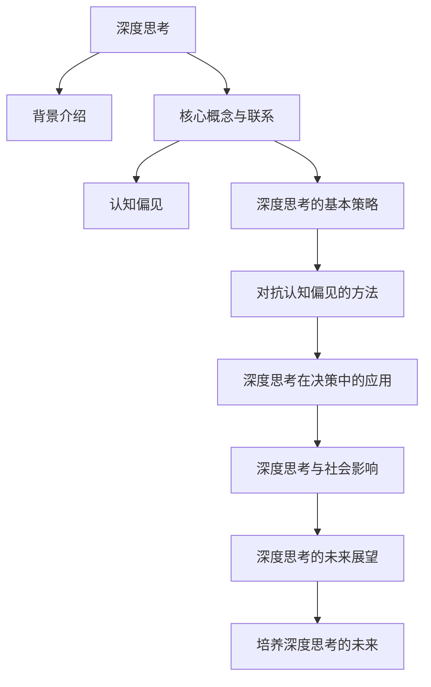

                 

### 《深度思考训练营：对抗认知偏见的思维课程》

> 关键词：认知偏见、深度思考、批判性思维、决策、教育、社会影响、未来趋势

> 摘要：本文旨在探讨如何通过深度思考训练营，对抗认知偏见，提升个体的批判性思维和决策能力。文章首先介绍了认知偏见的概念和类型，然后阐述了深度思考的基本策略，并通过具体案例和实践方法展示了如何在实际生活中运用深度思考。此外，文章还讨论了深度思考在决策中的应用、对社会的影响以及未来发展趋势。通过本文的阅读，读者可以更好地理解深度思考的重要性，学会如何在面对复杂问题时进行深度分析和思考。

## 第一部分：深度思考的基础

### 第1章：深度思考的引论

#### 1.1 深度思考的重要性

在信息技术飞速发展的今天，深度思考能力的重要性日益凸显。深度思考不仅仅是一种思维方式，更是我们在面对复杂问题时，能够迅速找到解决方案的关键。深度思考能够帮助我们摆脱认知偏见的束缚，以更加客观、全面的角度看待问题。对于从事IT行业的专业人士来说，深度思考更是不可或缺的能力。它能够帮助我们更好地理解技术原理，分析问题本质，从而设计出更加高效、可靠的系统。

#### 1.2 认知偏见概述

认知偏见，又称认知偏差，是指人们在信息处理过程中，由于各种心理和社会因素的影响，导致其判断和决策出现偏差的现象。认知偏见广泛存在于我们的日常生活中，影响着我们的决策和行为。常见的认知偏见包括确认偏见、锚定效应、代表性偏差等。这些偏见容易使我们在面对复杂问题时，陷入思维的陷阱，难以做出客观、理性的判断。

#### 1.3 深度思考与认知偏见的关系

深度思考与认知偏见之间存在着密切的关系。一方面，深度思考有助于我们识别和对抗认知偏见。通过深入分析问题，我们可以发现偏见的存在，从而有针对性地进行调整和纠正。另一方面，认知偏见也会对深度思考产生影响。如果我们受到认知偏见的影响，可能会导致我们在深度思考过程中，出现偏差和误解。因此，要提升深度思考能力，我们首先要了解和识别认知偏见，并学会如何克服它们。

### 第2章：认知偏见的概念与类型

#### 2.1 认知偏见的定义

认知偏见，是指人们在信息处理过程中，由于心理和社会因素的影响，导致其判断和决策出现偏差的现象。认知偏见并非有意为之，而是人们在大脑处理信息时的自然倾向。这些偏见会影响我们的感知、记忆、推理和判断，使我们在面对复杂问题时，难以做出客观、理性的决策。

#### 2.2 常见认知偏见类型

常见的认知偏见类型包括：

1. **确认偏见**：人们在已有观点的基础上，倾向于寻找和接受支持自己观点的信息，而忽视或贬低反对自己观点的信息。
   
2. **锚定效应**：人们在做出判断时，会受到初始信息（锚点）的影响，而忽视其他相关信息。
   
3. **代表性偏差**：人们倾向于根据事物的表面特征来判断其代表性，而忽视概率信息。

4. **可得性偏差**：人们倾向于根据最近或最容易获得的信息来判断概率。

5. **情感偏差**：情绪和情感会影响人们的判断和决策。

6. **群体偏见**：人们往往容易受到群体行为和观点的影响，从而导致认知偏见。

#### 2.3 认知偏见的影响

认知偏见会对我们的决策产生深远的影响，主要表现在以下几个方面：

1. **影响判断和决策**：认知偏见容易使人们在面对复杂问题时，做出错误或非理性的决策。

2. **阻碍创新和进步**：认知偏见会使人们难以接受新观点和新方法，从而阻碍创新和进步。

3. **影响人际关系**：认知偏见可能导致人与人之间的误解和冲突，影响人际关系。

4. **影响社会公正**：认知偏见会影响社会的公正性和公平性，导致资源分配不均。

### 第3章：深度思考的基本策略

#### 3.1 深度思考的方法

要克服认知偏见，提升深度思考能力，我们需要掌握以下几种方法：

1. **多角度分析**：在面对问题时，从多个角度进行思考，全面了解问题的各个方面。

2. **批判性思维**：对所接收到的信息进行批判性分析，判断其真实性和可靠性。

3. **逻辑推理**：运用逻辑推理，确保思考过程的合理性和严谨性。

4. **数据支持**：借助数据和事实，支持我们的观点和结论。

5. **反思和总结**：在思考过程中，不断反思和总结，发现并纠正自己的偏见和错误。

#### 3.2 增强批判性思维

增强批判性思维，是提升深度思考能力的重要途径。以下是一些建议：

1. **学会提问**：对所接收到的信息，要敢于提问，不轻易接受。

2. **寻找证据**：在提出观点时，要寻找充分的证据支持。

3. **思考原因**：分析问题的根本原因，而非表面现象。

4. **多角度思考**：从不同的角度看待问题，避免陷入思维定势。

5. **反思和总结**：在思考过程中，不断反思和总结，提升自己的思考能力。

#### 3.3 避免落入认知偏见的陷阱

要避免落入认知偏见的陷阱，我们需要：

1. **保持开放心态**：对不同的观点和意见持开放态度，不轻易否定。

2. **保持怀疑精神**：对所接收到的信息保持怀疑，不盲目接受。

3. **多渠道获取信息**：通过多种渠道获取信息，确保信息的全面性和准确性。

4. **与他人交流**：与他人交流，听取不同的意见和建议。

5. **定期反思**：定期对自己的思考过程和结论进行反思，发现并纠正认知偏见。

## 第二部分：具体实践

### 第4章：对抗认知偏见的方法

#### 4.1 事实核查

事实核查是克服认知偏见的重要方法之一。通过核实信息来源、验证事实真实性，我们可以避免受到虚假信息的误导。以下是一些建议：

1. **识别信息来源**：关注信息的来源，优先考虑权威、可靠的信息来源。

2. **验证事实**：对于关键信息，要通过多种渠道验证其真实性。

3. **保持怀疑态度**：对所接收到的信息保持怀疑，不轻易接受。

4. **学会识别谣言**：了解常见的谣言特征，学会识别谣言。

#### 4.2 多角度思考

多角度思考有助于我们全面了解问题，避免陷入认知偏见的陷阱。以下是一些建议：

1. **分析背景**：了解问题的背景，掌握相关历史和现状。

2. **考虑不同观点**：尊重不同的观点和意见，考虑各种可能的情况。

3. **分析逻辑**：运用逻辑思维，分析问题的内在逻辑和因果关系。

4. **求证证据**：通过数据、事实和证据，支持我们的观点和结论。

#### 4.3 寻求外部反馈

寻求外部反馈，是提升深度思考能力的重要方法。以下是一些建议：

1. **与他人交流**：与他人分享我们的思考和观点，听取他人的意见和建议。

2. **请教专家**：向领域内的专家请教，获取专业的指导和反馈。

3. **参与讨论**：积极参与讨论和辩论，锻炼我们的批判性思维和表达能力。

4. **反思和总结**：在获取外部反馈后，反思和总结我们的思考过程和结论。

### 第5章：深度思考的训练与实践

#### 5.1 深度思考的实践策略

为了提升深度思考能力，我们需要制定一套有效的实践策略。以下是一些建议：

1. **设定目标**：明确自己的思考和目标，有针对性地进行实践。

2. **持续学习**：不断学习新的知识和技能，提升自己的认知能力。

3. **反思总结**：在思考和实践中，不断反思和总结，发现并纠正自己的认知偏见。

4. **练习批判性思维**：通过练习，提升自己的批判性思维能力。

5. **积极参与**：积极参与讨论和辩论，锻炼自己的表达和思考能力。

#### 5.2 经典案例分析

通过分析经典案例，我们可以了解深度思考在实际应用中的效果和方法。以下是一个经典案例：

**案例：谷歌的“OKR”方法**

谷歌采用了“OKR”方法（目标与关键结果），这是一种旨在提高深度思考和目标达成的管理工具。通过设定明确的目标和关键结果，员工可以更加聚焦于关键任务，避免陷入琐碎的工作，从而提高工作效率和质量。

**案例分析：**

1. **设定目标**：谷歌的每个团队都会设定一个明确的目标，如提高用户满意度、优化产品功能等。

2. **分解目标**：将目标分解为关键结果，如增加用户数量、提高用户活跃度等。

3. **持续跟踪**：通过定期的检查和反馈，确保关键结果的实现。

4. **反思和调整**：在实施过程中，团队会不断反思和调整，确保目标的实现。

**案例启示：**

通过谷歌的“OKR”方法，我们可以看到深度思考在实践中的应用。明确的目标、分解的关键结果、持续的跟踪和反思，都是深度思考的重要体现。通过这个案例，我们可以了解到如何在实际工作中，运用深度思考提升工作效率和质量。

#### 5.3 深度思考训练计划

为了提升深度思考能力，我们可以制定一个系统的训练计划。以下是一个简单的训练计划：

**第一阶段：基础训练**

1. **学习批判性思维**：通过阅读相关书籍和文章，了解批判性思维的基本原理和方法。

2. **练习逻辑推理**：通过做逻辑推理题目，提升自己的逻辑思维能力。

3. **分析案例**：分析经典案例，了解深度思考在实际应用中的效果和方法。

**第二阶段：实践训练**

1. **设定目标**：明确自己的思考和目标，有针对性地进行实践。

2. **反思总结**：在思考和实践中，不断反思和总结，发现并纠正自己的认知偏见。

3. **分享交流**：与他人分享自己的思考和观点，听取他人的意见和建议。

4. **实践应用**：将深度思考应用于实际工作和生活中，提升自己的认知能力。

**第三阶段：进阶训练**

1. **学习高级批判性思维**：通过深入学习，掌握更高级的批判性思维方法。

2. **解决复杂问题**：尝试解决复杂的问题，锻炼自己的深度思考能力。

3. **培养专业素养**：在专业领域内，提升自己的认知能力，成为行业专家。

通过这个训练计划，我们可以逐步提升自己的深度思考能力，从而更好地应对复杂问题，提升工作效率和质量。

### 第6章：深度思考在决策中的应用

#### 6.1 决策过程中的认知偏见

在决策过程中，认知偏见会严重影响我们的判断和决策。以下是一些常见的认知偏见：

1. **确认偏见**：在已有观点的基础上，倾向于寻找和接受支持自己观点的信息，而忽视或贬低反对自己观点的信息。

2. **锚定效应**：在做出判断时，会受到初始信息（锚点）的影响，而忽视其他相关信息。

3. **代表性偏差**：根据事物的表面特征来判断其代表性，而忽视概率信息。

4. **可得性偏差**：根据最近或最容易获得的信息来判断概率。

5. **情感偏差**：情绪和情感会影响我们的判断和决策。

#### 6.2 提高决策质量的深度思考

为了提高决策质量，我们需要运用深度思考，克服认知偏见。以下是一些建议：

1. **多角度分析**：从多个角度分析问题，全面了解问题的各个方面。

2. **数据支持**：运用数据和事实，支持我们的观点和结论。

3. **逻辑推理**：运用逻辑推理，确保思考过程的合理性和严谨性。

4. **反思总结**：在决策过程中，不断反思和总结，发现并纠正自己的认知偏见。

#### 6.3 案例分析：深度思考在商业决策中的应用

**案例：苹果公司的产品策略**

苹果公司以其独特的产品设计和创新技术，成为了全球最具价值的科技公司之一。在苹果公司的产品策略中，深度思考发挥了至关重要的作用。

**案例分析：**

1. **市场调研**：苹果公司在推出新产品前，会进行详细的市场调研，了解消费者的需求和偏好。

2. **多角度分析**：苹果公司从技术、设计、用户体验等多个角度分析问题，确保产品的综合竞争力。

3. **数据支持**：苹果公司会运用大量的数据支持产品决策，如用户反馈、市场趋势等。

4. **逻辑推理**：苹果公司在产品决策过程中，运用逻辑推理，确保决策的合理性和严谨性。

5. **反思总结**：在产品发布后，苹果公司会不断反思和总结，发现并纠正自己的认知偏见，以便不断改进产品。

**案例启示：**

通过苹果公司的案例，我们可以看到深度思考在商业决策中的应用。从市场调研、多角度分析、数据支持到逻辑推理和反思总结，这些都是深度思考的重要体现。通过深度思考，苹果公司成功地制定了具有竞争力的产品策略，成为了全球科技领域的领军企业。

### 第7章：深度思考与社会影响

#### 7.1 深度思考与公共事务

深度思考在公共事务中具有重要作用。通过深度思考，我们可以更好地理解社会问题，提出有效的解决方案。以下是一些建议：

1. **分析社会问题**：从多个角度分析社会问题，了解其背后的原因和影响。

2. **数据支持**：运用数据和事实，支持我们的观点和结论。

3. **逻辑推理**：运用逻辑推理，确保思考过程的合理性和严谨性。

4. **公众参与**：鼓励公众参与讨论和决策，提高决策的透明度和公正性。

#### 7.2 深度思考在科学决策中的应用

深度思考在科学决策中具有重要意义。通过深度思考，科学家可以更好地理解科学问题，提出创新的解决方案。以下是一些建议：

1. **多学科融合**：跨学科合作，运用不同领域的知识和方法，解决复杂的科学问题。

2. **数据支持**：运用数据和事实，支持科学研究和决策。

3. **逻辑推理**：运用逻辑推理，确保科学决策的合理性和严谨性。

4. **科学验证**：对科学决策进行科学验证，确保其有效性和可靠性。

#### 7.3 深度思考对社会正义的贡献

深度思考对社会正义具有深远的影响。通过深度思考，我们可以更好地理解社会正义问题，提出有效的解决方案。以下是一些建议：

1. **公平公正**：在决策过程中，坚持公平公正的原则，确保资源分配的合理性。

2. **消除偏见**：通过深度思考，识别和消除社会中的不公平现象。

3. **关注弱势群体**：关注弱势群体的权益，提出有效的解决方案。

4. **倡导正义**：倡导社会正义，推动社会的进步和发展。

### 第8章：深度思考的未来展望

#### 8.1 计算技术在深度思考中的应用

随着计算技术的不断发展，计算技术在深度思考中的应用越来越广泛。以下是一些应用场景：

1. **人工智能**：利用人工智能技术，可以自动识别和纠正认知偏见。

2. **数据挖掘**：通过数据挖掘技术，分析大量数据，发现隐藏的规律和趋势。

3. **机器学习**：利用机器学习技术，可以自动化深度思考的过程，提高思考效率。

#### 8.2 深度思考在教育中的作用

深度思考在教育中具有重要作用。通过深度思考，学生可以更好地理解和掌握知识，提高学习效果。以下是一些建议：

1. **教学设计**：在教学中，运用深度思考的原则和方法，提高教学效果。

2. **自主学习**：鼓励学生进行深度思考，培养其自主学习能力。

3. **跨学科教育**：跨学科教育有助于培养学生从多个角度思考问题的能力。

#### 8.3 深度思考与人工智能的关系

深度思考与人工智能密切相关。通过深度思考，人工智能可以更好地理解和处理复杂问题。以下是一些建议：

1. **人工智能算法**：运用深度思考的原则和方法，优化人工智能算法。

2. **人工智能应用**：将深度思考应用于人工智能领域，解决复杂的实际问题。

3. **人工智能伦理**：关注人工智能伦理问题，确保人工智能的发展符合伦理要求。

### 第9章：培养深度思考的未来

#### 9.1 深度思考能力的培养策略

为了培养深度思考能力，我们需要采取一系列策略。以下是一些建议：

1. **早期教育**：在儿童早期教育中，重视批判性思维的培养。

2. **终身学习**：终身学习有助于提升深度思考能力。

3. **跨学科学习**：跨学科学习有助于拓宽思维视野。

4. **实践应用**：通过实践应用，提升深度思考能力。

#### 9.2 深度思考与职业发展

深度思考能力在职业发展中具有重要地位。以下是一些建议：

1. **创新能力**：深度思考有助于提升创新能力。

2. **决策能力**：深度思考有助于做出更加明智的决策。

3. **团队协作**：深度思考有助于团队协作，提高工作效率。

#### 9.3 深度思考在全球化时代的意义

在全球化时代，深度思考具有重要意义。以下是一些建议：

1. **文化多样性**：深度思考有助于理解和尊重文化多样性。

2. **国际合作**：深度思考有助于推动国际合作。

3. **全球治理**：深度思考有助于构建更加公正、公平的全球治理体系。

## 附录

### 附录A：深度思考资源与工具

#### A.1 深度思考相关的书籍推荐

1. 《思考，快与慢》—— 丹尼尔·卡尼曼
2. 《批判性思维工具》——理查德·萨勒斯
3. 《深度工作》——卡尔·纽波特

#### A.2 在线深度思考训练课程推荐

1. Coursera上的《批判性思维与论证》课程
2. edX上的《深度学习：掌握核心技术》课程
3. Udemy上的《深度思考与决策训练》课程

#### A.3 深度思考相关的APP推荐

1. **Heurist**：一款帮助用户进行深度思考的APP，提供多种思维工具和训练方法。
2. **Flowstate**：一款专注力训练APP，帮助用户提高深度思考的效率。
3. **MarginNote**：一款笔记和思维导图APP，支持用户进行深度思考和知识管理。

### 附录B：深度思考流程图

### 附录C：深度思考案例

**案例：谷歌的“OKR”方法**

谷歌采用了“OKR”方法（目标与关键结果），这种方法旨在提高员工的深度思考和目标达成能力。以下是“OKR”方法的详细流程：

1. **设定目标**：每个团队在开始新项目时，会设定一个明确的目标，如提高用户满意度、优化产品功能等。

2. **分解目标**：将目标分解为关键结果，如增加用户数量、提高用户活跃度等。

3. **实施计划**：根据关键结果，制定具体的实施计划，包括任务分配、时间表等。

4. **持续跟踪**：通过定期的检查和反馈，确保关键结果的实现。

5. **反思总结**：在项目结束后，团队会进行反思总结，发现并纠正认知偏见，以便不断改进。

### 附录D：深度思考公式

$$
\text{深度思考} = \text{认知能力} \times \text{批判性思维} \times \text{实践经验}
$$

### 附录E：深度思考实践技巧

1. **设定明确目标**：在思考和实践中，设定明确的目标有助于提高深度思考的效率。
2. **多角度分析**：从多个角度分析问题，有助于全面了解问题的各个方面。
3. **数据支持**：运用数据和事实，支持我们的观点和结论。
4. **反思总结**：在思考和实践中，不断反思和总结，发现并纠正自己的认知偏见。

### 附录F：深度思考拓展阅读

1. 《深度学习》—— 伊恩·古德费洛
2. 《人类简史》—— 尤瓦尔·赫拉利
3. 《文明之光》—— 吴军

### 附录G：深度思考注意事项

1. **保持好奇心**：好奇心是深度思考的源泉，要保持对未知领域的好奇心。
2. **避免陷入思维定势**：要勇于跳出思维定势，从不同角度思考问题。
3. **持续学习**：终身学习是提升深度思考能力的关键。

### 附录H：深度思考结语

深度思考是一种重要的思维方式，对于我们在面对复杂问题时，能够迅速找到解决方案至关重要。通过本文的阅读，我们了解了认知偏见的概念和类型，深度思考的基本策略，以及深度思考在决策、社会影响、未来展望等方面的应用。希望本文能帮助读者更好地理解深度思考的重要性，学会如何在实际生活中运用深度思考，提升自己的认知能力和决策水平。

### 作者信息

作者：AI天才研究院/AI Genius Institute & 禅与计算机程序设计艺术 /Zen And The Art of Computer Programming

AI天才研究院致力于推动人工智能技术的发展，培养未来科技人才。禅与计算机程序设计艺术则专注于探讨计算机科学中的哲学思考，旨在帮助读者更好地理解计算机科学的本质和精髓。两位作者均具备丰富的计算机科学和人工智能领域的研究和教学经验，希望本文能为读者带来启发和帮助。

