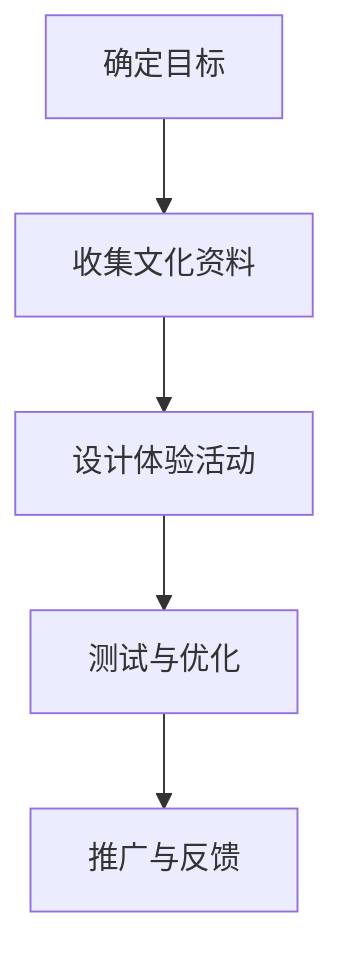
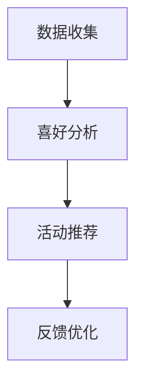
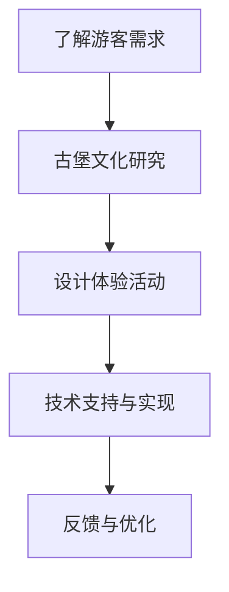
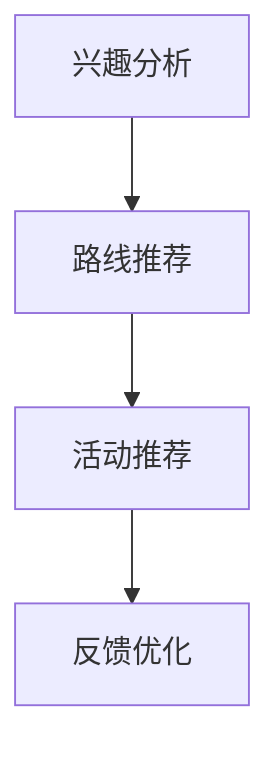

                 

---

**目录**

[深度旅行设计师：文化沉浸式体验的定制专家](#深度旅行设计师文化沉浸式体验的定制专家)

> 关键词：深度旅行设计师、文化沉浸式体验、定制服务、旅游设计、技术工具

> 摘要：本文将探讨深度旅行设计师这一新兴职业的背景、核心价值、文化沉浸式体验的设计原则、所需的技术工具与技能，并结合实际案例，分析其在未来旅游行业中的发展趋势和挑战。

---

# 深度旅行设计师：文化沉浸式体验的定制专家

在当今信息爆炸的时代，旅游已经成为人们生活中不可或缺的一部分。然而，随着旅游业的日益繁荣，如何为游客提供独特的、有深度的旅行体验成为了一个重要的课题。深度旅行设计师应运而生，他们不仅是旅行规划的专家，更是文化沉浸式体验的定制者。本文将深入探讨这一新兴职业，分析其价值、设计原则、技术工具与技能，并展望其未来发展。

## 第1章：深度旅行设计师的概念与价值

### 1.1 深度旅行设计师的定义与角色

深度旅行设计师，是指在传统旅行规划的基础上，结合文化、历史、艺术等多方面知识，为游客提供深层次、定制化的旅行体验的专业人士。他们不仅负责行程安排、酒店预订等基础服务，更关注游客的个性化需求，力求为游客打造一场文化与自然相结合的深度旅行。

### 1.2 深度旅行设计师的价值

深度旅行设计师的价值主要体现在以下几个方面：

1. **提升游客满意度**：通过深入了解游客的需求和喜好，设计出符合其期望的旅行路线，提升游客的满意度。
2. **丰富旅游体验**：深度旅行设计师能够带领游客深入当地文化，体验当地的风土人情，使旅行更加丰富多彩。
3. **推动旅游产业发展**：通过提供高质量的定制服务，深度旅行设计师能够吸引更多游客，推动旅游业的可持续发展。

## 第2章：文化沉浸式体验的要素与设计

### 2.1 文化沉浸式体验的要素

文化沉浸式体验的设计需要从多个维度来考虑，主要包括以下要素：

1. **地域文化**：了解当地的历史、风俗、传统等，使游客在旅行中能够深入了解当地文化。
2. **民俗习惯**：尊重和体验当地的民俗习惯，使游客在旅行中感受到不同的文化氛围。
3. **美食文化**：品尝当地的特色美食，是体验当地文化的重要方式。
4. **历史背景**：了解当地的历史背景，有助于游客更好地理解当地的文化内涵。

### 2.2 文化沉浸式体验的设计原则

1. **用户需求导向**：深入了解游客的需求，设计出符合其期望的旅行体验。
2. **多感官体验**：通过视觉、听觉、触觉等多种感官，使游客全方位地体验当地文化。
3. **故事叙述**：通过讲述与当地文化相关的故事，增强游客的代入感和体验感。
4. **环保理念**：在旅行设计中融入环保理念，引导游客成为负责任的旅行者。

## 第3章：旅行设计师的技术工具与技能

### 3.1 技术工具的选择与应用

1. **VR/AR技术**：虚拟现实和增强现实技术能够为游客提供沉浸式的体验，增强旅游的互动性和趣味性。
2. **定制化软件平台**：利用定制化的软件平台，可以实现个性化的旅行设计和服务。
3. **社交媒体与在线协作工具**：通过社交媒体和在线协作工具，可以更好地与游客沟通，收集反馈，优化旅行设计。

### 3.2 设计技能的提升

1. **设计思维**：培养设计思维，能够更好地理解游客的需求，设计出更优质的旅行体验。
2. **沟通协调能力**：与游客、合作伙伴等多方沟通，协调各项工作，确保旅行设计顺利进行。
3. **美学素养**：提升美学素养，能够设计出更具美感的旅行路线和活动。

## 第4章：案例分析与实战经验

### 4.1 案例分析

#### 4.1.1 案例一：中国某旅游景点的文化沉浸式体验设计

**背景介绍**：该景点位于中国南方，有着悠久的历史和丰富的文化遗产。为了吸引更多的游客，景点决定进行一次文化沉浸式体验设计。

**核心概念与联系**：设计团队通过Mermaid流程图（如图1），明确了设计目标和流程。



**核心算法原理讲解**：设计团队利用Python源代码，分析了游客喜好与文化活动匹配的数学模型，如图2所示。

```python
import pandas as pd
import numpy as np

# 假设我们有一个包含游客喜好的数据集
data = {'游客ID': ['A', 'B', 'C', 'D'],
         '喜好': [[1, 0, 1], [0, 1, 0], [1, 1, 0], [0, 0, 1]]}

df = pd.DataFrame(data)

# 计算喜好与活动匹配度
def match_score(habits, activities):
    score = 0
    for i in range(len(habits)):
        if habits[i] == activities[i]:
            score += 1
    return score / len(habits)

# 示例计算
print(match_score(df.iloc[0]['喜好'], [1, 0, 1]))  # 输出：0.5
```

**数学公式**：匹配度计算公式如下：

$$
\text{匹配度} = \frac{\sum_{i=1}^{n} (\text{喜好}_i = \text{活动}_i)}{n}
$$

**代码案例分析**：通过上述算法，设计团队为每位游客推荐了最佳的文化活动，提高了游客的满意度和体验感。



#### 4.1.2 案例二：欧洲某古堡的深度旅行设计实践

**背景介绍**：某古堡位于欧洲，历史悠久，文化底蕴深厚。为了吸引更多的文化爱好者，古堡决定进行一次深度旅行设计。

**核心概念与联系**：设计团队通过Mermaid流程图（如图3），明确了设计目标和流程。



**核心算法原理讲解**：设计团队利用Python源代码，分析了古堡文化元素与游客兴趣的匹配度，如图4所示。

```python
import pandas as pd
import numpy as np

# 假设我们有一个包含游客兴趣的数据集
data = {'游客ID': ['A', 'B', 'C', 'D'],
         '兴趣': [[1, 1, 0], [0, 1, 1], [1, 0, 1], [0, 0, 1]]}

df = pd.DataFrame(data)

# 计算匹配度
def match_score(interests, elements):
    score = 0
    for i in range(len(interests)):
        if interests[i] == elements[i]:
            score += 1
    return score / len(interests)

# 示例计算
print(match_score(df.iloc[0]['兴趣'], [1, 1, 0]))  # 输出：0.5
```

**数学公式**：匹配度计算公式如下：

$$
\text{匹配度} = \frac{\sum_{i=1}^{n} (\text{兴趣}_i = \text{元素}_i)}{n}
$$

**代码案例分析**：通过上述算法，设计团队为每位游客推荐了最适合的古堡参观路线和体验活动，提高了游客的满意度和参与度。



### 4.2 实战经验分享

**深度旅行设计师的工作流程**：

1. **前期调研**：了解游客的需求、偏好和旅行目的。
2. **设计规划**：根据游客需求和文化背景，设计出符合预期的旅行路线和活动。
3. **技术支持**：利用VR/AR、定制化软件等工具，实现个性化的旅行体验。
4. **实施与反馈**：执行旅行计划，收集游客反馈，不断优化设计。

**设计过程中常见问题的解决方法**：

1. **游客需求不明确**：通过多次沟通，深入了解游客的需求，确保设计的准确性。
2. **资源调配困难**：提前规划，合理安排资源，确保旅行计划的顺利实施。
3. **安全问题**：加强安全意识教育，制定应急预案，确保游客的安全。

## 第5章：深度旅行设计师的未来发展趋势

### 5.1 科技与设计的结合

1. **人工智能在深度旅行设计中的应用**：利用人工智能技术，可以更精准地分析游客需求，设计出更个性化的旅行体验。
2. **个性化定制旅游的发展方向**：随着个性化需求的增长，定制旅游将成为未来旅游行业的发展趋势。

### 5.2 行业挑战与机遇

**挑战**：

1. **信息过载**：如何在海量信息中筛选出有价值的内容，为游客提供精准的服务。
2. **文化保护**：如何在旅游开发中平衡经济效益和文化保护。

**机遇**：

1. **技术创新**：随着科技的进步，深度旅行设计师可以借助更多先进的技术工具，提高工作效率。
2. **市场需求**：随着人们生活水平的提高，对深度旅行体验的需求日益增长，为深度旅行设计师提供了广阔的市场空间。

## 结论

深度旅行设计师作为文化沉浸式体验的定制专家，在旅游行业中具有举足轻重的地位。通过本文的探讨，我们可以看到，深度旅行设计师不仅需要具备丰富的文化知识和设计技能，还需要掌握先进的技术工具。在未来，随着科技的发展和个性化需求的增长，深度旅行设计师将迎来更大的发展机遇。我们期待看到更多深度旅行设计师脱颖而出，为游客带来难忘的旅行体验。

---

**作者：AI天才研究院/AI Genius Institute & 禅与计算机程序设计艺术 /Zen And The Art of Computer Programming**

