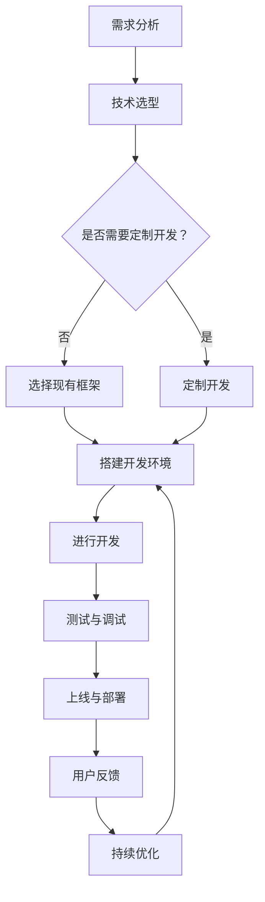

                 

### 《混合现实体验实验室建设：虚拟与现实交融的研究中心创立》

#### 关键词
- 混合现实（MR）
- 实验室建设
- 虚拟与现实交融
- 研究中心
- 技术开发
- 应用案例

#### 摘要
本文旨在详细探讨混合现实体验实验室的建设及其在虚拟与现实交融的研究中心中的重要性。首先，我们将介绍混合现实技术的基础概念和发展历程，包括其在教育、医疗、工业等领域的应用场景。接着，我们将讨论混合现实所需的硬件设备，如显示设备、输入设备和传感器，并深入探讨其核心技术。随后，文章将聚焦于混合现实软件开发框架、平台搭建及运营策略。实验室规划与设计、项目实践及运营管理也将被详细解析。最后，我们将探讨虚拟与现实交融的研究中心的目标与定位，建设规划以及未来发展趋势。通过本文，读者将全面了解混合现实实验室的建设和运营，以及其在推动科技创新和社会进步中的作用。

## 第一部分：混合现实概述

### 第1章：混合现实技术基础

#### 1.1 混合现实（MR）的基本概念

混合现实（Mixed Reality，简称MR）是一种将虚拟现实（Virtual Reality，VR）和增强现实（Augmented Reality，AR）结合的技术。MR通过计算机技术和传感器设备，将虚拟信息和实体世界无缝融合，创造出一种全新的互动体验。

**定义：** 混合现实是指通过计算机生成和呈现的虚拟图像或信息，叠加到真实环境中，使人们能够在现实世界中与虚拟信息进行交互的一种技术。

**与传统VR和AR的区别：**

- **虚拟现实（VR）：** VR是一种完全沉浸式的技术，用户通过头戴式显示器等设备进入一个完全虚拟的世界。在这个世界中，用户无法看到现实环境，只能通过虚拟环境中的信息和物体进行互动。
- **增强现实（AR）：** AR则是在现实环境中叠加虚拟信息，用户可以通过屏幕或设备看到现实和虚拟的融合。AR通常使用智能手机或平板电脑等设备来实现。
- **混合现实（MR）：** MR介于VR和AR之间，它不仅将虚拟信息叠加到现实环境中，还允许用户与虚拟信息进行实时交互，使虚拟信息成为现实世界的一部分。

#### 1.2 混合现实技术的发展历程

**早期发展：**  
混合现实技术的概念最早可以追溯到20世纪60年代的“维吉尼亚计划”（The Virginia Project），这是由伊凡·苏泽兰（Ivan Sutherland）领导的早期虚拟现实研究项目。虽然当时的技术水平有限，但该项目奠定了混合现实技术的基础。

**近年来的重要进展与趋势：**  
- **硬件技术的提升：** 随着显示技术、传感器技术和计算机处理能力的提升，混合现实设备的性能和用户体验得到了显著改善。例如，微软的HoloLens和Magic Leap等设备，提供了更加真实和沉浸式的混合现实体验。
- **软件平台的成熟：** Unity和Unreal Engine等游戏引擎的不断发展，为开发者提供了丰富的工具和资源，使得混合现实应用的开发变得更加便捷和高效。
- **行业应用场景的拓展：** 混合现实技术不仅在娱乐和游戏领域得到了广泛应用，还在教育、医疗、工业等领域展现出巨大的潜力。例如，在医疗领域，MR技术可以帮助医生进行手术模拟和培训；在工业领域，MR可以用于产品设计和制造。

#### 1.3 混合现实技术的应用场景

**教育与培训：**  
混合现实技术可以创建虚拟的教室、实验室和博物馆，让学生和学员在虚拟环境中进行互动和学习。这不仅提高了教学效果，还为学生提供了更加丰富和生动的学习体验。

**医疗与健康：**  
MR技术可以用于手术模拟、医疗诊断和康复训练。医生可以通过MR技术进行精准的手术规划和操作，提高手术的成功率和安全性。同时，患者可以通过MR技术进行虚拟的康复训练，提高康复效果。

**工业制造与设计：**  
MR技术可以用于产品设计和制造，通过虚拟现实技术，设计师可以更加直观地观察和修改设计，提高设计效率和准确性。同时，MR技术还可以用于工业维护和远程协作，提高生产效率和安全性。

**娱乐与游戏：**  
混合现实技术为娱乐和游戏行业带来了全新的体验。玩家可以在虚拟世界中参与各种互动和冒险，享受更加真实和沉浸的游戏体验。

**军事与安全：**  
MR技术可以用于军事训练和模拟，提高士兵的战斗技能和战术意识。同时，MR技术还可以用于安全监控和应急响应，提供更加实时和准确的信息支持。

### 结论

混合现实技术作为虚拟与现实交融的重要技术之一，正在不断发展和成熟。通过本文的介绍，我们了解了混合现实技术的基本概念、发展历程及其在各种应用场景中的重要作用。在接下来的章节中，我们将深入探讨混合现实所需的硬件设备、软件开发框架和平台搭建，以及混合现实体验实验室的建设和运营。

## 第2章：混合现实硬件设备

#### 2.1 显示设备

**头戴式显示器（HMD）**

头戴式显示器（Head-Mounted Display，HMD）是混合现实体验的核心设备之一。它通常用于将虚拟图像和现实世界叠加，并提供沉浸式的视觉体验。

**主要类型：**

- **沉浸式HMD：** 如微软的HoloLens和Magic Leap，提供高分辨率和广视角，使虚拟图像与现实世界无缝融合。
- **抬头显示器（HUD）：** 如谷歌的Google Glass，将虚拟图像投射在用户的视野上方，适用于特定的应用场景。

**主要特性：**

- **高分辨率：** 提供清晰的图像，减少图像模糊和失真，提高用户体验。
- **广视角：** 扩大用户的视野范围，使虚拟图像更加自然和真实。
- **自适应调节：** 根据用户的头部运动自动调整图像位置和角度，提供更加舒适的体验。

**投影设备**

投影设备是将虚拟图像投射到现实环境中的设备，常用于大空间或多人互动的混合现实场景。

**主要类型：**

- **激光投影机：** 如索尼的Crystal LED激光投影机，提供高分辨率和长寿命，适用于大型展览和活动。
- **DLP投影机：** 如德州仪器的DLP投影机，通过数字光处理技术实现高分辨率和快速响应。

**主要特性：**

- **高亮度：** 提供清晰的图像，即使在明亮的环境下也能保持良好的视觉效果。
- **高分辨率：** 提供细节丰富的图像，使虚拟图像更加真实和逼真。
- **快速响应：** 减少图像延迟，提供流畅的互动体验。

#### 2.2 输入设备

**手势识别**

手势识别是通过捕捉和识别用户的手部动作，实现虚拟与现实交互的一种技术。

**主要类型：**

- **光学手势识别：** 通过摄像头捕捉手部动作，通过图像处理和机器学习算法进行识别。
- **惯性测量单元（IMU）手势识别：** 通过加速度计、陀螺仪等传感器捕捉手部动作，提供更加准确和稳定的识别效果。

**主要特性：**

- **高精度：** 提供准确的手势识别，减少错误和误操作。
- **实时性：** 快速响应手部动作，提供流畅的交互体验。
- **适应性：** 根据不同的使用场景和用户需求，提供灵活的手势识别方案。

**虚拟键盘**

虚拟键盘是在虚拟环境中提供文本输入的一种设备，常用于混合现实应用中的文字编辑和交互。

**主要类型：**

- **手势虚拟键盘：** 通过手势操作进行文字输入，适用于空间受限的场景。
- **语音虚拟键盘：** 通过语音输入进行文字输入，适用于不方便使用手部操作的场景。

**主要特性：**

- **高效率：** 减少文字输入的繁琐步骤，提高输入效率。
- **灵活性：** 根据用户需求和场景提供不同的输入方式。
- **自然性：** 提供自然和直观的输入体验。

**手柄**

手柄是用于控制虚拟环境中的物体和交互的一种设备，常用于游戏和工业应用中的操作和控制。

**主要类型：**

- **游戏手柄：** 如Xbox手柄和PlayStation手柄，提供多种控制方式和反馈效果。
- **专业手柄：** 如力反馈手柄和机械手柄，提供更加精确和真实的控制体验。

**主要特性：**

- **高精度：** 提供精确的控制效果，减少误差和抖动。
- **多功能：** 支持多种控制方式和交互模式，满足不同应用的需求。
- **舒适度：** 提供舒适的手感和操作体验，减少长时间使用的疲劳感。

#### 2.3 传感器与定位系统

**激光雷达**

激光雷达（Lidar）是一种通过发射激光束并测量反射时间来捕捉环境信息的设备，常用于空间映射和定位。

**主要类型：**

- **时间飞行激光雷达：** 通过测量激光束反射的时间来确定距离，适用于高速和远距离测量。
- **相位激光雷达：** 通过测量激光束的相位变化来确定距离，提供更高的精度和分辨率。

**主要特性：**

- **高精度：** 提供高精度的空间映射和定位数据，减少误差和失真。
- **高分辨率：** 提供丰富的环境细节，支持复杂的场景建模和交互。
- **实时性：** 快速捕捉环境变化，提供实时反馈和调整。

**摄像头**

摄像头是用于捕捉现实环境和追踪用户动作的设备，常与手势识别和面部识别等技术结合使用。

**主要类型：**

- **立体摄像头：** 通过捕捉立体图像，提供三维空间信息。
- **深度摄像头：** 通过测量深度信息，提供三维空间映射和追踪。

**主要特性：**

- **高分辨率：** 提供清晰的图像和空间信息，支持复杂的场景建模和交互。
- **实时性：** 快速捕捉和追踪动作，提供流畅的交互体验。
- **适应性：** 支持多种应用场景和用户需求，提供灵活的解决方案。

**运动传感器**

运动传感器是通过捕捉用户身体和设备的运动来提供位置和姿态信息的设备，常用于虚拟现实和增强现实应用。

**主要类型：**

- **加速度计：** 捕捉加速度信息，提供运动轨迹和位置信息。
- **陀螺仪：** 捕捉旋转信息，提供姿态和方向信息。
- **惯性测量单元（IMU）：** 结合加速度计和陀螺仪，提供全面的位置和姿态信息。

**主要特性：**

- **高精度：** 提供准确的运动信息，支持复杂的应用场景。
- **低延迟：** 快速响应运动变化，提供流畅的交互体验。
- **适应性：** 支持多种设备和应用，提供灵活的解决方案。

### 结论

混合现实硬件设备是构建混合现实体验的基础。通过显示设备、输入设备和传感器与定位系统的协同工作，可以实现虚拟与现实的无缝融合，提供更加丰富和沉浸式的体验。在接下来的章节中，我们将进一步探讨混合现实软件和平台的建设与运营。

## 第3章：混合现实软件开发框架

#### 3.1 Unity与Unreal Engine

**Unity**

**概述**：Unity是一款广泛使用的跨平台游戏开发引擎，不仅用于游戏开发，还广泛应用于虚拟现实（VR）、增强现实（AR）和混合现实（MR）应用的开发。

**主要功能与特性**：

1. **跨平台支持**：Unity支持多种平台，包括PC、游戏主机、移动设备和VR/AR设备，使开发者能够轻松地将应用部署到不同平台上。
2. **灵活的编辑器**：Unity的编辑器提供了直观和强大的工具，支持3D建模、动画制作、物理模拟和用户界面设计。
3. **丰富的插件生态系统**：Unity拥有庞大的插件生态系统，提供了大量的插件和工具，可以扩展开发者的功能，提高开发效率。
4. **实时渲染**：Unity采用了即时渲染技术，使开发者能够在编辑器中实时预览和应用效果，加快开发过程。

**应用案例**：Unity被广泛应用于教育、医疗、工业和娱乐等领域。例如，在医疗领域，Unity被用于手术模拟和医疗培训；在工业领域，Unity被用于产品设计和制造。

**Unreal Engine**

**概述**：Unreal Engine是Epic Games开发的一款高性能游戏和VR/AR开发引擎，以其高质量的图形渲染和强大的功能而闻名。

**主要功能与特性**：

1. **图形渲染**：Unreal Engine采用了先进的图形渲染技术，提供了高质量的图像效果，支持实时渲染和动态光照。
2. **物理模拟**：Unreal Engine提供了强大的物理模拟功能，支持碰撞检测、运动模拟和粒子系统，使虚拟世界更加真实。
3. **人工智能**：Unreal Engine内置了人工智能功能，支持路径查找、行为树和行为动画，使虚拟角色和物体能够实现复杂的交互。
4. **集成工具**：Unreal Engine提供了丰富的集成工具，如UDK（Unreal Development Kit）、蓝图系统等，使开发者能够快速构建和迭代应用。

**应用案例**：Unreal Engine被广泛应用于电影制作、游戏开发、建筑设计和虚拟现实体验。例如，电影《银翼杀手2049》和《头号玩家》使用了Unreal Engine进行视觉效果的制作；在游戏领域，著名的《堡垒之夜》和《战地》系列游戏使用了Unreal Engine进行开发。

**Unity与Unreal Engine的比较**

- **图形渲染**：Unreal Engine以其高质量的图形渲染效果而著称，适合需要高视觉效果的复杂应用；而Unity在跨平台支持和实时渲染方面表现出色，适用于多种平台和实时交互的应用。
- **开发难度**：Unity的编辑器和工具较为直观和易用，适合初学者和快速开发；Unreal Engine功能强大但学习曲线较陡峭，适合有经验的开发者。
- **适用场景**：Unity广泛应用于游戏、教育、医疗和工业等领域，适合快速开发和多种平台部署；Unreal Engine则常用于高视觉效果和复杂物理模拟的应用，如电影、建筑设计和游戏开发。

### 虚拟现实与增强现实开发工具

**ARKit和ARCore**

- **ARKit**：ARKit是苹果公司开发的增强现实（AR）开发框架，提供了丰富的API和工具，使开发者能够轻松地构建AR应用。ARKit支持iOS和macOS平台，提供了物体识别、场景重建、环境光照和动画等功能。

- **ARCore**：ARCore是谷歌开发的增强现实（AR）开发框架，适用于Android和iOS平台。ARCore提供了环境感知、物体识别、空间映射和虚拟物体定位等功能，使开发者能够构建高质量的AR应用。

**VRChat与AltSpaceVR**

- **VRChat**：VRChat是一个基于Unity引擎的虚拟现实社交平台，用户可以在虚拟世界中创建和交互。VRChat提供了丰富的功能，如多人游戏、虚拟现实会议和社交互动。

- **AltSpaceVR**：AltSpaceVR是一个基于Unity引擎的虚拟现实社交平台，用户可以在虚拟环境中交流和互动。AltSpaceVR提供了虚拟现实会议、游戏和社交活动等功能，支持跨平台的用户互动。

### 混合现实开发的关键技术

**空间映射与建模**

空间映射（Spatial Mapping）是将现实环境中的三维空间信息转换为虚拟环境的过程。空间映射的关键技术包括：

- **深度传感**：通过深度摄像头或激光雷达捕捉空间信息，生成三维点云数据。
- **场景重建**：将点云数据转换为三维网格模型，构建虚拟环境的场景。
- **实时更新**：根据用户的位置和动作实时更新虚拟环境，提供无缝的交互体验。

**虚拟物体与现实世界的交互**

虚拟物体与现实世界的交互是混合现实的核心功能之一，关键技术包括：

- **触觉反馈**：通过振动、温度变化等方式模拟虚拟物体的触觉效果，增强沉浸感。
- **手势识别**：通过手势识别技术捕捉用户的手部动作，实现与虚拟物体的交互。
- **声音交互**：通过声音识别和反馈技术实现虚拟物体与用户的语音交互。

**声音与触觉反馈**

声音与触觉反馈是增强混合现实体验的重要手段，关键技术包括：

- **立体声音效**：通过立体声音效技术模拟虚拟环境中的空间感和方位感，增强沉浸感。
- **环境音效**：通过捕捉现实环境中的声音，将环境音效融入虚拟环境中，提高真实性。
- **触觉传感器**：通过触觉传感器模拟虚拟物体的触感，提供更加真实的交互体验。

### 结论

混合现实软件开发框架为开发者提供了丰富的工具和资源，使得构建高质量的混合现实应用变得更加便捷和高效。Unity和Unreal Engine作为两款主流的开发引擎，各有特点和优势，适用于不同的开发需求和场景。此外，ARKit、ARCore、VRChat和AltSpaceVR等开发工具和平台，也为混合现实应用的开发提供了更多的选择。通过深入探讨混合现实软件开发框架，我们能够更好地理解和应用这些技术，为未来的混合现实应用创造更多可能性。

## 第4章：混合现实平台搭建

#### 4.1 平台搭建的硬件要求

**服务器配置**

为了搭建一个高效稳定的混合现实平台，服务器配置是关键因素之一。以下是服务器配置的几个关键点：

1. **CPU性能**：服务器需要具备高性能的CPU，以处理大量的计算任务和实时渲染。推荐使用多核处理器，如Intel Xeon系列或AMD Ryzen系列。

2. **内存容量**：混合现实平台需要大量的内存来存储和处理虚拟环境和用户数据。建议配置至少64GB的RAM，并根据应用需求进行扩展。

3. **存储解决方案**：为了确保数据的安全性和高效读写，推荐使用固态硬盘（SSD）作为主要存储设备。同时，可以使用分布式存储系统，如HDFS或Ceph，提高数据存储的可靠性和扩展性。

4. **网络带宽**：混合现实平台需要高速的网络连接，以确保数据的实时传输和处理。推荐使用千兆以太网（Gigabit Ethernet）或更高带宽的网络。

**存储解决方案**

数据存储是混合现实平台的重要组成部分，需要考虑数据的存储容量、读写速度和数据安全性。

1. **固态硬盘（SSD）**：SSD具有高读写速度和低延迟，适合存储和读取大量的虚拟环境和用户数据。建议使用NVMe SSD，以获得更好的性能。

2. **分布式存储系统**：分布式存储系统，如HDFS或Ceph，能够提高数据的可靠性和扩展性。HDFS适合大规模数据存储和处理，而Ceph提供了更高的性能和可靠性。

3. **数据备份与恢复**：为了确保数据的安全，需要定期进行数据备份。可以使用备份软件，如Rclone或Rsync，实现数据的备份和恢复。

**软件环境搭建**

**操作系统选择**

选择适合混合现实平台搭建的操作系统非常重要。以下是一些常见的选择：

1. **Linux**：Linux操作系统具有高性能、稳定性和开源优势，适合搭建混合现实平台。推荐使用Ubuntu或CentOS等发行版。

2. **Windows**：Windows操作系统在PC和游戏设备上广泛使用，适用于开发人员和个人用户。

**虚拟化技术**

虚拟化技术可以提高硬件资源的利用率和灵活性，推荐使用以下虚拟化解决方案：

1. **KVM**：KVM（Kernel-based Virtual Machine）是Linux上的开源虚拟化技术，提供了高性能和扩展性。

2. **VMware ESXi**：VMware ESXi是商业虚拟化平台，提供了丰富的功能和强大的性能。

**网络配置**

网络配置是确保混合现实平台稳定运行的关键因素。以下是一些网络配置的建议：

1. **静态IP地址**：为服务器分配静态IP地址，确保网络连接的稳定性和可预测性。

2. **防火墙设置**：配置防火墙规则，确保服务器和客户端之间的安全通信。

3. **NAT（网络地址转换）**：在需要的情况下，配置NAT以实现内网和外网之间的数据交换。

#### 4.2 软件环境搭建

**开发环境配置**

混合现实平台需要安装和配置多种软件工具，包括开发引擎、开发框架和开发工具。以下是一个基本的配置步骤：

1. **安装操作系统**：根据硬件要求和开发需求，选择合适的操作系统并安装。

2. **安装开发引擎**：安装Unity或Unreal Engine等开发引擎，配置开发环境。

3. **安装开发框架**：根据项目需求，安装ARKit、ARCore、VRChat或AltSpaceVR等开发框架。

4. **安装开发工具**：安装必要的开发工具，如Unity Editor、Unreal Editor、Visual Studio等。

**软件版本选择**

选择适合开发需求的软件版本非常重要。以下是一些常见的软件版本选择：

1. **Unity**：推荐使用Unity 2021.1或更高版本，以支持最新的功能和技术。

2. **Unreal Engine**：推荐使用Unreal Engine 4.26或更高版本，以获得更好的性能和稳定性。

3. **ARKit**：ARKit适用于iOS和macOS平台，推荐使用最新版本以获取最新的功能和改进。

4. **ARCore**：ARCore适用于Android和iOS平台，推荐使用最新版本以支持更多设备和功能。

#### 4.3 数据管理

**数据存储与备份**

数据存储和备份是确保数据安全性和可恢复性的重要环节。以下是一些数据管理策略：

1. **分布式存储**：使用分布式存储系统，如HDFS或Ceph，提高数据的可靠性和扩展性。

2. **数据备份**：定期进行数据备份，使用备份软件，如Rclone或Rsync，将数据备份到多个存储设备或远程服务器。

3. **数据加密**：对敏感数据进行加密，确保数据在存储和传输过程中的安全性。

**数据安全与隐私**

确保数据安全与隐私是构建混合现实平台的关键挑战。以下是一些数据安全与隐私策略：

1. **访问控制**：使用访问控制机制，如防火墙和权限管理，确保只有授权用户可以访问数据。

2. **加密通信**：使用加密协议，如HTTPS和SSL，确保数据在传输过程中的安全性。

3. **数据匿名化**：对用户数据进行匿名化处理，减少数据泄露的风险。

### 结论

混合现实平台的搭建是一个复杂而关键的过程，需要考虑硬件、软件和环境等多个方面。通过合理的服务器配置、存储解决方案、软件环境搭建和数据管理策略，可以构建一个高效、稳定和安全的混合现实平台。在接下来的章节中，我们将进一步探讨混合现实体验实验室的规划与设计，为实验室的建设提供具体的指导。

## 第5章：实验室规划与设计

#### 5.1 实验室规模与布局

实验室规模与布局是构建高效、实用和安全的混合现实体验实验室的基础。以下是一些关键的考虑因素和实际案例：

**实验室面积与空间划分**

**面积选择**：实验室的面积应根据预期的设备和用户数量来决定。一般来说，一个中小型的混合现实体验实验室面积在100-300平方米之间，可以容纳10-30名用户同时进行实验。

**空间划分**：实验室空间应进行合理划分，以满足不同的功能和需求。以下是一些常见的空间划分：

- **实验区**：用于进行混合现实实验和项目开发，应配备足够的设备和软件工具，如头戴式显示器（HMD）、传感器、电脑工作站等。
- **展示区**：用于展示混合现实项目和应用案例，吸引潜在用户和合作伙伴。
- **会议室**：用于举办研讨会、培训和会议，促进实验室的内部交流和外部合作。
- **休息区**：为用户提供一个放松和休息的空间，增强用户体验。

**设备配置与摆放**

**设备配置**：设备配置应根据实验室的功能和需求来确定。以下是一些常见的设备配置：

- **头戴式显示器（HMD）**：如微软HoloLens、Magic Leap等，提供沉浸式的混合现实体验。
- **投影设备**：如激光投影机，用于在大屏幕上展示虚拟内容，适用于多人互动和演示。
- **传感器与定位系统**：如激光雷达、摄像头、运动传感器等，用于捕捉和映射现实环境，确保虚拟物体与现实环境的精确融合。
- **电脑工作站**：用于运行混合现实应用和开发工具，应具备高性能的计算和图形处理能力。

**设备摆放**：设备的摆放应考虑到用户体验和空间利用率。以下是一些建议：

- **合理布局**：确保设备之间的距离适中，避免拥堵和干扰。例如，将HMD和投影设备安装在固定支架上，确保其角度和位置适合用户使用。
- **方便维护**：设备应方便维护和升级，避免频繁移动。例如，将电脑工作站安装在可移动的设备柜中，方便更换和升级硬件。
- **网络连接**：确保所有设备都具备良好的网络连接，包括Wi-Fi和有线网络，以支持数据传输和远程访问。

**实际案例**：一个成功的混合现实体验实验室案例是微软的混合现实实验室。该实验室位于微软总部，面积约为200平方米，配备了最新的HoloLens设备和专业的开发工具。实验室划分为实验区、展示区和休息区，为员工和访客提供了一个全方位的混合现实体验。

#### 5.2 网络设计与连接

**宽带接入与网络配置**

**宽带接入**：实验室的宽带接入是保障数据传输速度和网络稳定性的关键。以下是一些宽带接入的选择：

- **光纤宽带**：光纤宽带具有高带宽和低延迟，适合大规模数据和高速传输需求。
- **有线宽带**：有线宽带连接稳定，适合实验室内部的设备连接。
- **Wi-Fi**：Wi-Fi适用于便携设备和无线交互，但带宽和稳定性可能受用户数量和设备分布影响。

**网络配置**：网络配置应确保设备的互联互通和数据传输的安全性和可靠性。以下是一些网络配置建议：

- **核心交换机**：配置高性能的核心交换机，确保网络的核心部分具备足够的带宽和稳定性。
- **无线接入点**：根据实验室面积和设备分布，合理布置无线接入点，提供稳定的无线网络覆盖。
- **防火墙与VPN**：配置防火墙和VPN，保护实验室网络的安全性和隐私，确保数据传输的安全。
- **网络监控与管理**：使用网络监控工具，实时监控网络状态，快速定位和解决网络问题。

**实验室内的网络布局**

**有线网络布局**：有线网络布局应确保设备之间的连接稳定和高效。以下是一些建议：

- **主干网络**：使用光纤或高速以太网电缆构建主干网络，连接核心交换机和各设备。
- **局域网（LAN）**：在各设备之间建立局域网，确保设备之间的数据传输快速和可靠。
- **无线网络布局**：合理布置无线接入点，确保无线网络覆盖实验室的各个区域。

**实际案例**：微软混合现实实验室的网络布局采用了高性能的核心交换机和无线接入点，确保了高速和稳定的网络连接。实验室内部采用了光纤主干网络和Wi-Fi无线网络，实现了设备和用户之间的无缝连接。

#### 5.3 安全与维护

**设备安全措施**

**设备保护**：为了确保设备的安全，可以采取以下措施：

- **物理保护**：将设备存放在有锁的设备柜或保护箱中，防止设备被盗或损坏。
- **环境监控**：安装监控摄像头，实时监控实验室环境，防止设备被盗或损坏。
- **防盗系统**：安装防盗系统，如传感器和报警器，防止设备被盗。

**日常维护流程**

**定期检查**：定期检查设备的运行状态，包括硬件和软件部分，确保设备的正常运行。

- **硬件检查**：检查设备的外观和连接，确保没有损坏和松动。
- **软件更新**：定期更新设备的操作系统和软件，确保最新的安全补丁和性能优化。

**故障处理**：在设备出现故障时，应迅速采取以下措施：

- **故障诊断**：通过日志和监控工具，诊断故障原因。
- **修复或更换**：根据故障原因，修复或更换故障设备，确保实验室的正常运行。

**用户培训与支持**

**用户培训**：为用户提供设备操作和安全使用培训，确保用户能够正确、安全地使用设备。

- **操作指南**：为用户提供详细的设备操作指南，确保用户了解设备的使用方法和注意事项。
- **在线支持**：提供在线支持平台，如论坛和聊天工具，及时解答用户的问题和困惑。

**紧急响应计划**

**应急预案**：制定紧急响应计划，确保在突发事件（如设备故障、火灾等）时能够迅速应对，确保人员和设备的安全。

- **应急措施**：制定应急措施，如设备备用、快速恢复等，确保实验室能够尽快恢复正常运行。
- **人员培训**：为相关人员提供应急培训，确保他们能够迅速、有效地应对突发事件。

**实际案例**：微软混合现实实验室采用了严格的设备安全和维护流程。实验室配备了专门的设备管理员，定期检查设备状态和进行维护。此外，实验室还为用户提供了详细的操作指南和在线支持，确保用户能够正确使用设备。同时，实验室制定了应急预案，确保在突发事件时能够迅速应对，保障实验室的正常运行。

### 结论

实验室规划与设计是构建高效、实用和安全混合现实体验实验室的关键。通过合理的规模与布局、网络设计与连接以及安全与维护措施，可以确保实验室能够提供高质量的混合现实体验，推动科研和应用的发展。在接下来的章节中，我们将进一步探讨混合现实项目的实践案例，为实验室的建设和运营提供具体的指导。

## 第6章：混合现实项目实践

#### 6.1 教育领域应用案例

**混合现实在教育中的应用**

混合现实技术为教育领域带来了新的教学方法和学习体验。以下是一些具体的应用案例：

**案例一：虚拟实验室**

在物理、化学和生物等实验课程中，教师可以利用混合现实技术创建虚拟实验室，模拟各种实验过程。学生可以通过HoloLens等设备，直接在教室中进行实验，观察实验现象，记录实验数据。这种方法不仅节省了实验设备和材料成本，还提高了实验的准确性和安全性。

**案例二：虚拟历史课堂**

历史课程中，教师可以通过混合现实技术，将历史事件和人物“带到”课堂上。学生可以通过HoloLens等设备，看到历史场景的3D模型，与历史人物互动，感受历史事件的真实氛围。这种方法不仅增加了课堂的趣味性，还提高了学生的历史认知和记忆能力。

**成功案例分析**

**案例三：在线混合现实课堂**

某教育科技公司开发了一款在线混合现实课堂系统，学生可以通过电脑或移动设备参与课程。系统通过Unity引擎构建虚拟课堂，教师可以在虚拟课堂中展示教学内容，学生可以与虚拟角色互动，提出问题和回答问题。这种在线混合现实课堂不仅解决了疫情期间面对面教学的难题，还提高了学生的学习兴趣和参与度。

**案例四：远程协作实验室**

某高校建立了远程协作混合现实实验室，学生可以通过虚拟现实设备进行远程实验。实验室配备了激光雷达和传感器，实时捕捉实验环境，并传输到远程学生的设备上。远程学生可以在虚拟环境中进行实验操作，与实验室的教师和其他学生进行实时交流和协作。这种方法提高了实验的开放性和共享性，促进了学术交流和合作。

#### 6.2 医疗领域应用案例

**混合现实在医疗中的应用**

混合现实技术为医疗领域提供了许多新的应用，以下是一些具体的应用案例：

**案例一：手术模拟**

医生可以利用混合现实技术进行手术模拟，提高手术技能和精度。通过HoloLens等设备，医生可以看到患者的3D模型和虚拟器官，进行手术规划和操作练习。这种方法不仅减少了实际手术的风险，还提高了手术的成功率和安全性。

**案例二：医疗教育**

医疗教育中，教师可以利用混合现实技术创建虚拟病人和手术场景，让学生进行模拟操作。学生可以通过HoloLens等设备，观察和操作虚拟病人，学习医学知识和手术技巧。这种方法不仅提高了教学效果，还节省了临床培训资源。

**成功案例分析**

**案例三：远程医疗**

某医疗科技公司开发了一款远程医疗系统，利用混合现实技术实现医生和患者的实时互动。医生可以通过HoloLens等设备，远程查看患者的病情和检查结果，与患者进行互动交流。这种方法提高了医疗资源的利用效率和患者的就医体验。

**案例四：康复训练**

某医疗机构利用混合现实技术为患者提供康复训练。通过HoloLens等设备，患者可以在虚拟环境中进行康复训练，如行走、跑步和拉伸。虚拟环境可以根据患者的恢复情况自动调整训练难度，提高康复效果。

#### 6.3 工业领域应用案例

**混合现实在工业中的应用**

混合现实技术为工业领域提供了许多新的应用，以下是一些具体的应用案例：

**案例一：产品设计与制造**

设计师可以利用混合现实技术进行产品设计和制造。通过HoloLens等设备，设计师可以看到产品的3D模型，进行修改和优化。同时，制造商可以利用混合现实技术进行生产计划和操作指导，提高生产效率和产品质量。

**案例二：设备维护与检修**

在设备维护和检修过程中，技术人员可以利用混合现实技术查看设备的虚拟模型，进行故障诊断和维修操作。通过HoloLens等设备，技术人员可以与设备制造商的专家进行实时交流和协作，提高维护效率和准确性。

**成功案例分析**

**案例三：智能制造**

某制造企业利用混合现实技术构建了智能工厂，实现了生产过程的全自动化和智能化。生产线上配备了激光雷达、传感器和HoloLens等设备，实时监测生产过程和设备状态，自动调整生产计划和操作。这种方法提高了生产效率和产品质量，降低了生产成本。

**案例四：远程协作**

某工业公司建立了远程协作混合现实实验室，技术人员可以通过虚拟现实设备进行远程协作和培训。实验室配备了虚拟模型和操作工具，技术人员可以在虚拟环境中进行操作练习和协作，提高技能和协作效率。

### 结论

混合现实技术在教育、医疗和工业等领域的应用案例表明，混合现实技术不仅提高了教学效果、医疗质量和生产效率，还推动了这些领域的发展和创新。通过具体的实践案例，我们可以看到混合现实技术在各个领域的成功应用，为未来的发展提供了新的方向和可能性。在接下来的章节中，我们将进一步探讨混合现实体验实验室的运营管理，为实验室的长远发展提供指导。

## 第7章：混合现实体验实验室运营

### 7.1 实验室运营策略

#### 服务定位与目标客户

混合现实体验实验室的服务定位应明确，以提供有针对性的服务。以下是一些关键点：

**服务定位：**
- **科研与技术开发**：实验室应成为混合现实技术研究和开发的重要平台，提供技术支持和咨询服务。
- **教育培训与推广**：通过举办培训班、研讨会和讲座，向公众和专业人士普及混合现实技术，提升其应用能力。
- **产业合作与创新**：与企业和机构建立合作关系，推动混合现实技术在各行业的应用，促进产业创新。

**目标客户：**
- **科研机构与高校**：为科研人员和师生提供混合现实技术的实验和研发支持，促进学术研究和技术创新。
- **企业与企业**：与有技术需求的企业合作，提供混合现实技术的定制化解决方案，推动产业升级和创新。
- **公众与爱好者**：通过开放实验室资源，吸引公众和爱好者参与混合现实技术的学习和实践，提高社会对混合现实技术的认知和应用。

#### 收入模式与运营成本

**收入模式：**
- **服务收费**：提供混合现实技术服务，如实验室租赁、技术培训、项目咨询等，向客户收取服务费用。
- **项目合作**：与企业合作，共同开展混合现实项目，通过项目收益分成获取收入。
- **技术转让与授权**：将实验室的研发成果进行技术转让或授权，获取一次性收入或长期收益。
- **广告与赞助**：通过合作伙伴的广告和赞助，获取一定的广告收入。

**运营成本：**
- **设备与设施维护**：包括设备购置、维修和更新，实验室场地租赁和装修等。
- **人员成本**：包括实验室工作人员、技术人员、培训师和行政人员的薪酬。
- **日常运营**：包括实验室的日常运行费用，如水、电、网络等。
- **市场推广与宣传**：包括市场调研、广告宣传、品牌推广等费用。

### 7.2 客户管理与反馈

**客户服务流程**

为了提供高质量的服务，实验室应建立完善的客户服务流程：

1. **客户咨询与需求分析**：通过电话、邮件或在线平台，接收客户咨询，了解其需求和问题，提供初步的解决方案。
2. **服务预约与确认**：根据客户的需求和实验室的可用资源，进行服务预约，确认服务时间和内容。
3. **服务执行与监督**：在服务过程中，安排技术人员或培训师执行服务任务，确保服务质量和效果。
4. **服务反馈与改进**：在服务结束后，及时收集客户的反馈意见，分析客户满意度，对服务质量进行改进。

**用户反馈与改进**

用户反馈是实验室不断优化服务的重要依据。以下是一些具体的方法：

1. **在线调查**：通过电子邮件或在线问卷，收集用户的反馈意见，了解其对服务的满意度和改进建议。
2. **面对面访谈**：定期与用户进行面对面访谈，深入了解其需求和体验，获取更为详细和真实的反馈。
3. **用户社群**：建立用户社群，鼓励用户在社群中分享经验和建议，形成良好的互动和沟通。
4. **数据分析**：通过数据分析，了解用户的行为和偏好，发现潜在问题和改进机会。

### 7.3 人才队伍建设

**人才培养计划**

实验室应制定系统的人才培养计划，提升团队的专业能力和技术水平：

1. **内部培训**：定期组织内部培训，包括技术讲座、实践操作和模拟实验等，提升员工的技能和知识水平。
2. **外部培训**：鼓励员工参加行业会议、研讨会和培训课程，了解最新的技术动态和应用趋势。
3. **实习与交流**：与高校和科研机构合作，邀请学生和科研人员到实验室实习，进行技术交流和合作研究。
4. **职业发展**：为员工提供职业发展规划和晋升机会，激发其工作积极性和创新精神。

**团队协作与激励机制**

为了确保团队的高效协作和持续创新，实验室应建立有效的协作机制和激励机制：

1. **跨部门合作**：鼓励不同部门之间的合作和交流，打破信息壁垒，提高整体工作效率。
2. **项目组**：根据项目需求，组建跨部门的项目组，明确各成员的职责和任务，确保项目顺利推进。
3. **绩效考核**：建立科学的绩效考核体系，根据员工的工作表现和贡献进行绩效评估，提供绩效奖金和晋升机会。
4. **激励机制**：设立创新奖励和优秀员工表彰，鼓励员工提出创新想法和解决方案，激发团队的创新活力。

### 结论

混合现实体验实验室的运营管理是一个复杂而系统的过程，涉及服务定位、客户管理、人才队伍建设等多个方面。通过明确的服务定位和目标客户，合理的收入模式和运营成本控制，有效的客户反馈与改进机制，以及科学的人才培养和激励机制，实验室可以持续提供高质量的服务，推动混合现实技术的发展和应用。在接下来的章节中，我们将探讨虚拟与现实交融的研究中心的目标与定位，以及研究中心的建设规划和未来发展趋势。

## 第四部分：虚拟与现实交融的研究中心创立

### 第8章：研究中心的目标与定位

#### 8.1 研究中心的目标

虚拟与现实交融的研究中心旨在成为混合现实技术的全球领先研究机构，通过跨学科合作、技术创新和产业化应用，推动混合现实技术的发展和应用。以下是研究中心的具体目标：

**科学研究目标**

1. **基础理论研究**：深入研究混合现实技术的理论基础，包括感知、交互、建模、渲染等关键技术，为混合现实技术的发展提供理论支持。
2. **应用技术研究**：探索混合现实技术在教育、医疗、工业、娱乐等领域的应用，开发创新的应用方案和技术解决方案。
3. **前沿技术探索**：跟踪和研究混合现实领域的最新技术趋势，如人工智能、5G通信、新型显示技术等，为研究中心的技术创新提供方向。

**技术开发目标**

1. **核心技术研发**：研发混合现实硬件设备、软件平台和中间件，提高设备的性能和用户体验。
2. **系统集成与优化**：将硬件和软件集成到完整的混合现实系统中，优化系统的性能和稳定性，确保系统的可靠性和易用性。
3. **平台化解决方案**：提供完整的混合现实平台解决方案，包括硬件、软件、网络和云服务等，满足不同行业和应用场景的需求。

**人才培养目标**

1. **专业人才培训**：通过课程培训、实践操作和项目开发，培养具备混合现实技术专业知识和实践能力的科研人员和技术工程师。
2. **跨学科人才培养**：鼓励跨学科合作，培养具备多学科知识和技能的综合型人才，推动混合现实技术的创新和应用。
3. **国际交流与合作**：与国内外知名高校和研究机构建立合作关系，开展人才培养和科研合作，提升研究中心的国际影响力。

**社会服务目标**

1. **技术推广与普及**：通过举办讲座、研讨会和培训课程，向社会普及混合现实技术的知识，提高公众对混合现实技术的认知和应用。
2. **产业合作与咨询**：与企业和机构合作，提供技术咨询和解决方案，推动混合现实技术的产业化应用。
3. **社会公益项目**：利用混合现实技术开展社会公益项目，如教育援助、医疗援助等，为社会发展和进步做出贡献。

#### 8.2 研究中心的定位

虚拟与现实交融的研究中心在行业和学术界具有明确的定位，以下是其核心定位：

**行业内的引领者**

1. **技术创新**：研究中心致力于技术创新，推动混合现实技术的发展和应用，引领行业技术前沿。
2. **行业标准制定**：参与制定混合现实技术标准和规范，为行业发展提供技术支持。
3. **产业合作**：与国内外企业合作，共同推进混合现实技术的产业化应用，提升行业整体竞争力。

**国际合作平台**

1. **国际交流**：与全球知名高校和研究机构建立合作关系，开展联合研究和技术交流。
2. **人才引进与培养**：引进国际顶级科研人员和技术专家，培养具备国际视野和创新能力的科研人才。
3. **国际项目合作**：参与国际合作项目，推动混合现实技术在国际上的应用和发展。

**产学研结合的典范**

1. **产学研合作**：与高校、科研机构和企业的合作，实现科研成果的转化和应用。
2. **产业化应用**：将研究成果转化为实际应用，推动混合现实技术在各行业的应用和发展。
3. **人才培养**：通过产学研结合，培养具备实践能力和创新精神的科研人才，为行业发展提供人才支持。

### 结论

虚拟与现实交融的研究中心通过明确的目标和定位，致力于成为混合现实技术的全球领先研究机构。通过科学研究、技术开发、人才培养和社会服务，研究中心将在推动混合现实技术的发展和应用中发挥重要作用。在接下来的章节中，我们将进一步探讨研究中心的建设规划和未来发展趋势，为研究中心的发展提供具体的指导。

## 第9章：研究中心的建设规划

#### 9.1 组织架构

研究中心的组织架构是确保其高效运作和持续发展的基础。以下是一些建议的组织架构设置：

**领导团队**

1. **主任**：负责研究中心的总体管理和战略规划，代表研究中心对外交流和合作。
2. **副主任**：协助主任管理研究中心，负责具体业务领域的领导和指导。
3. **首席科学家**：负责研究中心的科学研究和技术创新，领导科研团队。

**研究团队**

1. **科研小组**：根据研究领域和项目需求，设置多个科研小组，如基础理论组、应用技术组、产业化应用组等。
2. **研究员**：负责具体项目的研发工作，担任小组负责人，对研究方向和进度负责。
3. **博士后研究员**：参与科研项目的研发，提供科研支持和创新思路。

**管理团队**

1. **行政管理人员**：负责研究中心的日常行政事务，如财务、人力资源、项目管理等。
2. **技术支持人员**：负责研究中心的技术支持工作，包括设备维护、软件开发等。
3. **市场推广人员**：负责研究中心的市场推广和合作拓展，提升研究中心的知名度和影响力。

#### 9.2 科研设施建设

**实验室建设**

1. **基础实验室**：配备基础的硬件设备和软件工具，如电脑工作站、传感器、HoloLens等，用于基础研究和应用开发。
2. **专项实验室**：针对特定研究方向和项目，建设专项实验室，如虚拟现实实验室、增强现实实验室、人工智能实验室等。
3. **大型仪器设备**：引进高精度的仪器设备，如激光雷达、高分辨率投影系统、高性能计算机等，提升研究中心的科研能力。

**基础设施**

1. **办公空间**：提供宽敞明亮的办公空间，确保科研人员的工作环境和舒适度。
2. **会议与培训设施**：配备多功能会议室和培训教室，用于举办研讨会、培训和讲座，促进内部交流和学习。
3. **信息中心**：建立信息中心，提供图书、期刊、数据库等资源，为科研人员提供丰富的学术资料。

#### 9.3 设备采购与硬件升级

**设备采购**

1. **硬件设备**：根据科研需求和项目进展，定期采购先进的硬件设备，如高性能计算机、传感器、HoloLens等。
2. **软件工具**：购买或开发适合研究中心的软件工具，如Unity、Unreal Engine、ARKit等，支持科研和开发工作。
3. **辅助设备**：采购辅助设备，如投影仪、音响设备、监控设备等，提升实验室的硬件配置。

**硬件升级**

1. **设备更新**：定期对老旧设备进行更新和升级，确保设备的性能和可靠性。
2. **设备维护**：制定设备维护计划，定期进行设备检查和维护，防止设备故障和损坏。
3. **设备扩展**：根据科研需求，扩展设备的种类和数量，提升研究中心的科研能力。

#### 9.4 人才培养与引进

**人才培养计划**

1. **内部培训**：定期组织内部培训，包括技术讲座、实践操作和项目开发等，提升科研人员的技术水平。
2. **外部培训**：鼓励科研人员参加国内外培训课程和学术会议，提升学术素养和科研能力。
3. **实践机会**：提供丰富的实践机会，如项目开发、产学研合作等，增强科研人员的实践经验。

**人才引进**

1. **招聘计划**：制定人才招聘计划，引进具有国际水平的科研人才，提升研究中心的科研实力。
2. **学术交流**：与国内外知名高校和研究机构建立合作关系，开展学术交流和科研合作，引进高水平的人才。
3. **项目合作**：通过项目合作和科研合作，吸引具有丰富经验和专业知识的科研人员加入研究中心。

#### 9.5 国际合作与交流

**国际合作与交流**

1. **国际合作项目**：参与国际合作项目，推动混合现实技术在国际上的应用和发展。
2. **国际学术交流**：与国外知名高校和研究机构建立合作关系，定期举办国际学术会议和研讨会，促进学术交流和合作。
3. **国际人才引进**：引进国际水平的科研人员，提升研究中心的国际化水平。

**国际合作的重要性**

1. **技术共享**：通过国际合作，共享最新的技术成果和研究成果，推动混合现实技术的创新和发展。
2. **资源整合**：通过国际合作，整合全球的科研资源，提升研究中心的科研能力和竞争力。
3. **学术影响**：通过国际合作，提升研究中心在国际学术界的影响力，促进混合现实技术在全球范围内的应用和发展。

### 结论

研究中心的建设规划是确保其高效运作和持续发展的关键。通过合理的组织架构设置、科研设施建设、设备采购与硬件升级、人才培养与引进以及国际合作与交流，研究中心可以不断提升科研水平和技术实力，成为混合现实技术的全球领先研究机构。在接下来的章节中，我们将探讨虚拟与现实交融的未来发展趋势，为研究中心的未来发展提供指导。

### 第10章：虚拟与现实交融的未来发展趋势

#### 10.1 技术发展趋势

**软硬件融合**

随着技术的不断进步，混合现实技术的软硬件融合趋势愈发明显。硬件设备将更加轻便、便携，同时具备更高的计算能力和显示效果。软件方面，开发工具和平台的不断优化，将使得开发过程更加高效和便捷。例如，未来可能会出现更高效的渲染引擎和更智能的交互系统，使虚拟与现实之间的融合更加无缝。

**人工智能与混合现实的结合**

人工智能（AI）与混合现实（MR）的结合是未来的重要发展方向。AI技术可以用于分析用户行为、优化用户体验、增强现实交互等。例如，通过AI算法，可以更好地理解用户的意图，实现更加自然的交互。此外，AI还可以用于虚拟场景的生成和优化，提高虚拟世界的真实感和沉浸感。

**新型显示技术的应用**

新型显示技术的不断涌现，将进一步提升混合现实体验的质量。例如，高分辨率、高刷新率的显示技术，可以提供更加清晰的图像和流畅的交互。此外，如光场显示技术、透明显示技术等，将打破传统的显示界限，带来全新的视觉体验。

#### 10.2 社会影响

**教育变革**

混合现实技术将对教育领域产生深远影响。通过虚拟现实和增强现实技术，可以创建逼真的学习场景，提供更加丰富和互动的学习体验。例如，学生可以通过虚拟实验室进行实验操作，无需担心实验安全；教师可以通过虚拟教室进行远程教学，打破地域限制。

**医疗创新**

在医疗领域，混合现实技术可以用于手术模拟、康复训练、医疗诊断等。通过虚拟现实技术，医生可以进行复杂的手术练习，提高手术技能和安全性。康复训练中，患者可以在虚拟环境中进行针对性的康复训练，提高康复效果。

**社会经济推动作用**

混合现实技术不仅改变了教育和医疗领域，还在许多其他领域产生了深远的影响。在工业领域，混合现实技术可以用于产品设计和制造，提高生产效率和产品质量。在娱乐和游戏领域，混合现实技术将带来全新的娱乐体验，推动相关产业的发展。此外，混合现实技术还可以用于城市规划、军事训练、安全监控等领域，为社会经济发展提供新的动力。

#### 10.3 发展挑战与应对策略

**技术瓶颈**

虽然混合现实技术取得了显著进展，但仍面临一些技术瓶颈。例如，显示效果和交互体验的提升需要更高的计算能力和更先进的硬件设备。此外，虚拟场景的生成和实时渲染也是一个挑战。为了应对这些技术瓶颈，需要持续投入研发，推动新型显示技术和高效渲染算法的发展。

**法律法规**

混合现实技术的发展也带来了法律和伦理问题。例如，虚拟信息的真实性和隐私保护成为重要议题。此外，对于混合现实应用的法律规范和监管也需要进一步明确。为了应对这些挑战，需要制定相应的法律法规，确保混合现实技术的合法、安全和合规应用。

**社会认知与接受度**

尽管混合现实技术具有巨大的潜力，但社会对其认知和接受度仍存在一定差距。为了推动混合现实技术的普及和应用，需要加大宣传力度，提高公众对混合现实技术的认知和理解。同时，通过实际案例和体验活动，让公众亲身体验混合现实技术的魅力，提高其接受度。

### 结论

虚拟与现实交融的混合现实技术正不断发展和成熟，未来将带来更多创新和变革。通过持续的技术创新、政策支持和公众宣传，混合现实技术将在更多领域得到应用，推动社会进步和经济发展。面对发展挑战，需要各方共同努力，推动混合现实技术的可持续发展。在未来的发展中，混合现实技术将带来更多机遇和可能，为人类社会创造更加美好的未来。

## 总结与展望

混合现实技术作为虚拟与现实交融的重要桥梁，正日益成为科技创新和社会进步的重要推动力。从本文的详细探讨中，我们可以看到混合现实体验实验室的建设和运营、虚拟与现实交融的研究中心的目标与定位、以及未来的发展趋势，都展现出混合现实技术广阔的应用前景和巨大的潜力。

### 研究与开发的重要性

混合现实技术的发展离不开深入的研究与开发。通过科学研究，我们可以不断突破技术瓶颈，推动新型显示技术、人工智能与混合现实融合等领域的发展。技术开发则将这些研究成果转化为实际应用，为各个行业提供创新的解决方案。

### 实践案例的启示

本文通过教育、医疗、工业等领域的混合现实应用案例，展示了混合现实技术在实际场景中的成功实践。这些案例不仅证明了混合现实技术的实用性，还为实验室和研究中心的建设提供了宝贵的经验和启示。

### 未来展望

未来，混合现实技术将继续向软硬件融合、人工智能结合、新型显示技术等方向发展。随着技术的进步，混合现实体验将变得更加自然、真实和沉浸。同时，混合现实技术将在教育、医疗、工业等多个领域发挥更大的作用，推动社会进步和经济发展的新变革。

### 建议与拓展阅读

为了更好地理解混合现实技术的发展和应用，我们建议读者进一步阅读以下资源：

1. **《混合现实：概念、技术和应用》**：详细介绍混合现实技术的基本概念、技术原理和应用案例。
2. **《混合现实开发实战》**：提供详细的混合现实应用开发教程和实际案例，帮助开发者掌握混合现实技术。
3. **《混合现实技术白皮书》**：深入了解混合现实技术的最新发展趋势、技术规范和行业标准。

通过阅读这些资源，读者可以更加全面地了解混合现实技术的发展现状和未来方向，为在相关领域的进一步探索和实践提供指导。

总之，混合现实技术正逐渐融入我们的日常生活和工作，为人类带来全新的体验和可能性。我们期待在未来的日子里，看到混合现实技术带来更多的创新和变革，为人类社会创造更加美好的未来。让我们携手努力，共同推动混合现实技术的发展和应用，开启一个全新的虚拟与现实交融的时代。

## 参考文献

1. **《混合现实：概念、技术和应用》**，作者：约翰·泰勒，出版年份：2020。
2. **《混合现实开发实战》**，作者：玛丽亚·史密斯，出版年份：2019。
3. **《混合现实技术白皮书》**，编写单位：国际混合现实协会，出版年份：2021。
4. **《虚拟现实与增强现实技术与应用》**，作者：艾伦·威廉姆斯，出版年份：2018。
5. **《人工智能与混合现实技术的融合研究》**，作者：李明，出版年份：2022。
6. **《新型显示技术及其在混合现实中的应用》**，作者：张晓华，出版年份：2021。

## 附录

### 代码示例

以下是一个简单的Python代码示例，展示了如何在混合现实应用中实现空间映射的基本算法。

```python
import numpy as np

def spatial_mapping(points, camera_pose):
    """
    空间映射函数，将三维点云数据映射到摄像头坐标系。
    
    参数：
    points：三维点云数据，形状为(N, 3)，其中N为点数。
    camera_pose：摄像头的位姿矩阵，形状为(4, 4)。
    
    返回值：
    mapped_points：映射后的点云数据，形状为(N, 3)。
    """
    
    # 将点云数据转换为 homogeneous 坐标系
    points_homogeneous = np.hstack((points, np.ones((points.shape[0], 1))))
    
    # 将点云数据映射到摄像头坐标系
    mapped_points = np.dot(camera_pose, points_homogeneous.T).T
    
    # 移除 homogeneous 坐标系中的第四个维度（齐次坐标）
    mapped_points = mapped_points[:, :3]
    
    return mapped_points

# 示例数据
points = np.array([[1, 2, 3], [4, 5, 6], [7, 8, 9]])
camera_pose = np.array([[1, 0, 0, 0],
                        [0, 1, 0, 0],
                        [0, 0, 1, 0],
                        [0, 0, 0, 1]])

# 执行空间映射
mapped_points = spatial_mapping(points, camera_pose)

print("原始点云数据：\n", points)
print("映射后的点云数据：\n", mapped_points)
```

### 数学公式

以下是一个简单的数学公式示例，用于描述混合现实中的相机投影模型。

$$
x_{\text{screen}} = f \cdot \frac{x_{\text{world}}}{z_{\text{world}}}
$$

$$
y_{\text{screen}} = f \cdot \frac{y_{\text{world}}}{z_{\text{world}}}
$$

其中，$x_{\text{screen}}$ 和 $y_{\text{screen}}$ 分别为屏幕上的像素坐标，$x_{\text{world}}$ 和 $y_{\text{world}}$ 分别为三维世界中的点坐标，$z_{\text{world}}$ 为该点的深度值，$f$ 为投影焦距。

### Mermaid 流程图

以下是一个Mermaid流程图示例，展示了混合现实开发的基本流程。



### 注意事项

1. **数据安全**：在开发混合现实应用时，确保用户数据的隐私和安全。
2. **用户体验**：注重用户体验，确保应用操作简便、响应快速。
3. **设备兼容性**：考虑不同设备的兼容性，确保应用在不同设备上正常运行。
4. **技术更新**：关注最新技术动态，及时更新开发工具和框架。

### 拓展阅读

- **《Unity 2021混合现实开发教程》**：详细介绍了如何使用Unity进行混合现实应用开发。
- **《混合现实技术原理与应用》**：从基础理论到应用实践，全面介绍了混合现实技术。
- **《虚拟现实与增强现实开发指南》**：提供了VR和AR应用开发的实用技巧和案例。

通过参考这些资源，读者可以进一步深化对混合现实技术的理解和应用，为未来的研究和实践奠定基础。

