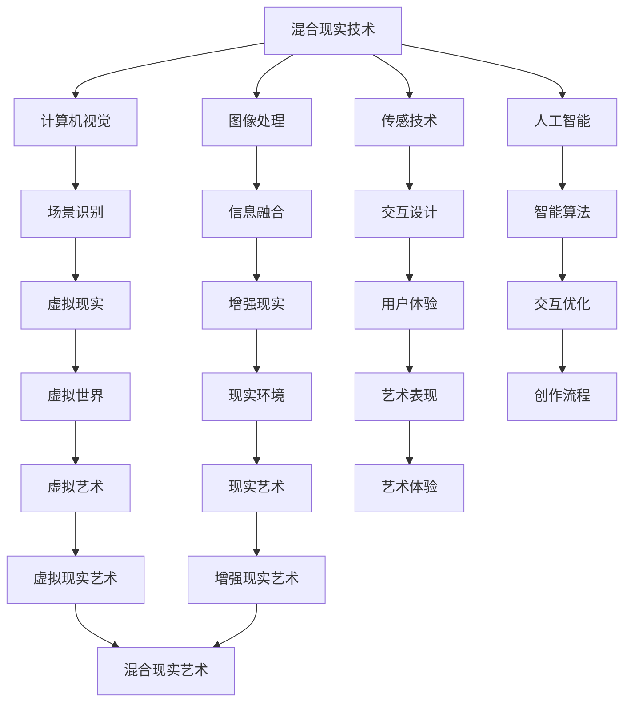

                 

# 目录大纲

## 目录大纲

为了更好地引导读者理解混合现实艺术创作的全貌，本文将采用详细的目录结构，分为七个主要部分，每个部分包含多个子章节。以下是本文的目录大纲：

### 第一部分 引言

- **1.1 混合现实艺术的定义与背景**
  - **1.1.1 混合现实艺术的定义**
  - **1.1.2 混合现实艺术的背景**

- **1.2 艺术与现实的关系**
  - **1.2.1 传统艺术的现实关联**
  - **1.2.2 虚拟艺术的现实反映**
  - **1.2.3 混合现实艺术的现实融合**

- **1.3 混合现实艺术的发展趋势**
  - **1.3.1 技术创新的推动**
  - **1.3.2 艺术家的实践探索**
  - **1.3.3 公众的接受与参与**

### 第二部分 混合现实技术基础

- **2.1 混合现实技术概述**
  - **2.1.1 混合现实技术的基本原理**
  - **2.1.2 混合现实技术的分类**

- **2.2 虚拟现实技术**
  - **2.2.1 虚拟现实技术的硬件设备**
    - **2.2.1.1 虚拟现实头盔**
    - **2.2.1.2 虚拟现实手柄**
  - **2.2.2 虚拟现实技术的应用**
    - **2.2.2.1 虚拟现实游戏**
    - **2.2.2.2 虚拟现实培训**

- **2.3 增强现实技术**
  - **2.3.1 增强现实技术的硬件设备**
    - **2.3.1.1 增强现实眼镜**
    - **2.3.1.2 增强现实手机**
  - **2.3.2 增强现实技术的应用**
    - **2.3.2.1 增强现实导航**
    - **2.3.2.2 增强现实教育**

- **2.4 混合现实开发平台**
  - **2.4.1 Unity开发平台**
    - **2.4.1.1 Unity基本操作**
    - **2.4.1.2 Unity编程基础**
  - **2.4.2 Unreal Engine开发平台**
    - **2.4.2.1 Unreal Engine基本操作**
    - **2.4.2.2 Unreal Engine编程基础**

### 第三部分 艺术创作方法

- **3.1 混合现实艺术创作流程**
  - **3.1.1 创作前准备**
    - **3.1.1.1 设备选择与配置**
    - **3.1.1.2 软件安装与设置**
  - **3.1.2 创作过程**

- **3.2 艺术创作工具**
  - **3.2.1 图形设计软件**
    - **3.2.1.1 Photoshop**
    - **3.2.1.2 Illustrator**
  - **3.2.2 三维建模软件**
    - **3.2.2.1 Blender**
    - **3.2.2.2 Maya**

- **3.3 艺术创作案例**
  - **3.3.1 虚拟现实艺术作品**
    - **3.3.1.1 The Blu**
    - **3.3.1.2 Mirror's Edge Catalyst**
  - **3.3.2 增强现实艺术作品**
    - **3.3.2.1 Pokémon GO**
    - **3.3.2.2 Ingress**

### 第四部分 混合现实艺术作品展示

- **4.1 虚拟现实艺术展览**
- **4.2 增强现实体验活动**
- **4.3 艺术装置与互动艺术**

### 第五部分 混合现实艺术的商业应用

- **5.1 娱乐产业**
- **5.2 广告与营销**
- **5.3 教育领域**
- **5.4 建筑与设计行业**

### 第六部分 混合现实艺术的社会与文化影响

- **6.1 艺术家的角色转变**
- **6.2 观众体验的改变**
- **6.3 艺术价值与评价**
- **6.4 艺术的传播与共享**

### 第七部分 未来展望

- **7.1 技术发展趋势**
- **7.2 艺术创作新形式**
- **7.3 混合现实艺术的未来**

通过这样的结构，读者可以循序渐进地了解混合现实艺术创作的方方面面，从技术基础到创作方法，再到商业应用和社会影响，最后展望未来发展趋势。每个部分都详细涵盖了相关的知识点和实际案例，便于读者深入学习和理解。# 混合现实艺术创作：跨越虚拟与现实的艺术探索

关键词：混合现实、艺术创作、虚拟现实、增强现实、技术基础、创作流程

摘要：本文探讨了混合现实艺术创作的概念、技术基础、创作方法、商业应用以及社会和文化影响。通过分析虚拟现实与增强现实技术的差异和应用，详细介绍了艺术创作流程及工具，展示了混合现实艺术作品，并探讨了其商业潜力和社会意义。文章旨在为艺术家、技术从业者以及爱好者提供对混合现实艺术创作领域的全面了解和深入思考。

## 第一部分 引言

### 1.1 混合现实艺术的定义与背景

#### 1.1.1 混合现实艺术的定义

混合现实（Mixed Reality，简称MR）艺术是结合虚拟现实（Virtual Reality，简称VR）和增强现实（Augmented Reality，简称AR）技术的一种艺术形式。它通过先进的计算机视觉和传感技术，将虚拟的元素与现实环境无缝融合，创造出一个既有物理存在又包含虚拟内容的新维度空间。与VR和AR相比，MR艺术更加注重虚拟与现实之间的互动和共生。

#### 1.1.2 混合现实艺术的背景

随着科技的飞速发展，VR和AR技术在过去十年中取得了显著进步。VR技术通过头戴显示器等设备，使用户完全沉浸在虚拟世界中，而AR技术则通过摄像头和屏幕将虚拟信息叠加到现实环境中。混合现实艺术将这两种技术融合，提供了一种全新的艺术表现形式。它不仅改变了艺术创作的手法和表现方式，也为观众带来了全新的艺术体验。

### 1.2 艺术与现实的关系

#### 1.2.1 传统艺术的现实关联

传统艺术通常与现实世界紧密相连。艺术家通过绘画、雕塑等手段，将现实中的景象、人物和情感表现出来。这种与现实世界的紧密联系，使得传统艺术具有一定的现实意义和社会价值。

#### 1.2.2 虚拟艺术的现实反映

随着计算机技术的发展，虚拟艺术逐渐成为一种新的艺术形式。虚拟艺术通过计算机软件生成，虽然不直接反映现实，但却能反映艺术家的内心世界和对现实的看法。虚拟艺术的创作和欣赏过程与虚拟现实技术密切相关。

#### 1.2.3 混合现实艺术的现实融合

混合现实艺术在虚拟与现实之间架起了一座桥梁。它不仅融合了传统艺术的现实关联和虚拟艺术的现实反映，还创造了一个全新的现实融合空间。在这个空间中，艺术家可以自由地探索虚拟与现实之间的关系，创造出具有深刻内涵和广泛影响力的艺术作品。

### 1.3 混合现实艺术的发展趋势

#### 1.3.1 技术创新的推动

随着计算机视觉、人工智能、传感技术等领域的不断发展，混合现实艺术的创作工具和展示形式也在不断革新。未来的混合现实艺术创作将更加依赖于这些前沿技术，为艺术家提供更丰富的创作可能性。

#### 1.3.2 艺术家的实践探索

越来越多的艺术家开始关注混合现实艺术，并进行了大量的实践探索。这些艺术家的创作不仅为观众带来了前所未有的艺术体验，也推动了混合现实艺术的发展。

#### 1.3.3 公众的接受与参与

随着混合现实技术的普及，越来越多的公众开始接受并参与到混合现实艺术创作和欣赏中来。这种公众的积极参与，将进一步推动混合现实艺术的发展。

## 第二部分 混合现实技术基础

### 2.1 混合现实技术概述

#### 2.1.1 混合现实技术的基本原理

混合现实技术基于计算机视觉、图像处理、传感和人工智能等核心技术，通过捕捉和识别现实环境中的物体和场景，将虚拟元素与之融合，创造出一种全新的现实体验。

#### 2.1.2 混合现实技术的分类

混合现实技术可以分为以下几类：

1. **全息投影**：利用激光和光学技术，将虚拟信息投影到现实环境中，创造出一种虚实结合的全息场景。
2. **头戴显示器**：如VR头盔和AR眼镜，通过显示虚拟信息，使用户在视觉上感受到虚拟与现实的无缝融合。
3. **交互设备**：如手柄、手势识别设备等，用于与虚拟环境进行交互，增强用户的沉浸感和参与感。
4. **智能传感器**：如摄像头、传感器等，用于捕捉和识别现实环境中的物体和场景，实现虚拟与现实的有效融合。

### 2.2 虚拟现实技术

#### 2.2.1 虚拟现实技术的硬件设备

虚拟现实技术的硬件设备主要包括VR头盔和VR手柄。

- **VR头盔**：如HTC Vive、Oculus Rift等，提供沉浸式的虚拟体验。
- **VR手柄**：如HTC Vive手柄、Oculus手柄等，用于与虚拟环境进行交互。

#### 2.2.2 虚拟现实技术的应用

虚拟现实技术的应用非常广泛，包括以下方面：

1. **虚拟旅游**：用户可以通过VR头盔体验虚拟的旅游场景，感受不同地域的文化和风景。
2. **游戏**：VR游戏提供了沉浸式的游戏体验，用户可以在虚拟世界中与其他玩家互动。
3. **教育**：VR技术可以模拟各种场景，为教育提供丰富的教学资源，提高学习效果。

### 2.3 增强现实技术

#### 2.3.1 增强现实技术的硬件设备

增强现实技术的硬件设备主要包括AR眼镜和AR手机。

- **AR眼镜**：如微软HoloLens、Magic Leap等，提供沉浸式的AR体验。
- **AR手机**：通过摄像头和屏幕，将虚拟信息叠加到现实环境中。

#### 2.3.2 增强现实技术的应用

增强现实技术的应用也非常广泛，包括以下方面：

1. **导航**：通过AR眼镜或手机，用户可以在现实环境中实时获取导航信息。
2. **教育**：AR技术可以为学生提供互动式的学习体验，增强学习兴趣和效果。
3. **医疗**：AR技术可以辅助医生进行手术和诊断，提高医疗水平和效率。

### 2.4 混合现实开发平台

#### 2.4.1 Unity开发平台

Unity是一款功能强大的游戏引擎，适用于混合现实艺术创作。

- **Unity基本操作**：了解Unity的用户界面、项目设置和基本操作。
- **Unity编程基础**：学习Unity的脚本编写、对象操作和交互设计。

#### 2.4.2 Unreal Engine开发平台

Unreal Engine是一款高性能的游戏引擎，也适用于混合现实艺术创作。

- **Unreal Engine基本操作**：了解Unreal Engine的用户界面、项目设置和基本操作。
- **Unreal Engine编程基础**：学习Unreal Engine的蓝图系统和C++编程。

## 第三部分 艺术创作方法

### 3.1 混合现实艺术创作流程

#### 3.1.1 创作前准备

创作前准备是混合现实艺术创作的重要环节，主要包括以下方面：

- **设备选择与配置**：根据创作需求选择合适的VR头盔、AR眼镜或其他硬件设备，并进行配置和调试。
- **软件安装与设置**：安装和配置Unity、Unreal Engine等开发平台和相关插件，确保创作环境的稳定和高效。

#### 3.1.2 创作过程

混合现实艺术创作过程通常包括以下几个阶段：

1. **创意构思**：根据主题和需求，构思艺术作品的整体创意和故事线。
2. **场景设计**：设计虚拟场景和现实环境的布局，确保虚拟元素与现实环境的融合。
3. **内容制作**：利用图形设计软件和三维建模软件制作虚拟元素，如角色、道具和场景等。
4. **交互设计**：设计用户与虚拟环境之间的交互方式，提高用户体验。
5. **编程实现**：利用Unity或Unreal Engine等开发平台，将虚拟元素和交互逻辑实现为可运行的应用程序。
6. **测试与优化**：对应用程序进行测试和优化，确保其稳定性和性能。

### 3.2 艺术创作工具

#### 3.2.1 图形设计软件

图形设计软件在混合现实艺术创作中扮演着重要角色，常用的图形设计软件包括：

- **Photoshop**：用于图像处理和图形设计，适合制作艺术作品的视觉元素。
- **Illustrator**：用于矢量图形设计，适合制作具有高清晰度和可扩展性的图形元素。

#### 3.2.2 三维建模软件

三维建模软件在混合现实艺术创作中也非常重要，常用的三维建模软件包括：

- **Blender**：一款开源的三维建模软件，功能强大且易于上手，适合制作各种复杂的三维模型。
- **Maya**：一款专业级的三维建模软件，广泛应用于电影、游戏和动画制作领域，适合制作高品质的三维模型。

### 3.3 艺术创作案例

#### 3.3.1 虚拟现实艺术作品

虚拟现实艺术作品通过VR头盔等设备为用户提供了沉浸式的艺术体验。以下是一些虚拟现实艺术作品的案例：

- **The Blu**：这是一部由Chris Milk执导的虚拟现实音乐视频，通过虚拟现实技术将观众带入一个梦幻般的音乐世界。
- **Mirror's Edge Catalyst**：这是一款虚拟现实游戏，玩家可以在虚拟的城市中自由奔跑，体验刺激的极限运动。

#### 3.3.2 增强现实艺术作品

增强现实艺术作品通过AR眼镜或手机等设备将虚拟元素叠加到现实环境中，为用户提供了全新的艺术体验。以下是一些增强现实艺术作品的案例：

- **Pokémon GO**：这是一款基于增强现实技术的游戏，玩家可以在现实世界中捕捉虚拟的宝可梦，体验与虚拟世界的互动。
- **Ingress**：这是一款基于增强现实技术的游戏，玩家需要通过现实世界中的地理位置信息，完成各种任务和挑战。

## 第四部分 混合现实艺术作品展示

### 4.1 虚拟现实艺术展览

虚拟现实艺术展览通过虚拟现实技术为观众提供了一个沉浸式的艺术体验空间。观众可以通过VR头盔等设备，自由探索展览空间，欣赏各种虚拟艺术作品。虚拟现实艺术展览不仅为观众带来了全新的艺术体验，也为艺术家提供了一个展示才华的平台。

### 4.2 增强现实体验活动

增强现实体验活动通过AR技术将虚拟元素叠加到现实环境中，为观众提供了一个互动式的艺术体验。观众可以通过AR眼镜或手机等设备，实时获取虚拟信息，参与各种互动活动。增强现实体验活动不仅增加了观众的参与感，也为艺术家提供了一个与观众互动的机会。

### 4.3 艺术装置与互动艺术

艺术装置与互动艺术通过混合现实技术，将虚拟元素与现实环境融合，创造出一种独特的艺术形式。观众可以通过与艺术装置的互动，体验虚拟与现实之间的关联。艺术装置与互动艺术不仅为观众带来了全新的艺术体验，也为艺术家提供了一个表达自己观点的平台。

## 第五部分 混合现实艺术的商业应用

### 5.1 娱乐产业

混合现实艺术在娱乐产业中有着广泛的应用，包括虚拟现实游戏、增强现实电影和虚拟演唱会等。通过混合现实技术，娱乐产业可以为观众提供全新的沉浸式体验，提高观众的参与感和满意度。

### 5.2 广告与营销

混合现实艺术在广告与营销领域也有着重要的应用。通过增强现实技术，广告和营销活动可以为观众提供一个互动式的体验，提高观众的注意力和记忆度。混合现实艺术为广告和营销带来了更多创新的可能性。

### 5.3 教育领域

混合现实艺术在教育领域也有着广泛的应用。通过虚拟现实和增强现实技术，教育者可以为学生提供一个沉浸式的学习环境，提高学生的学习兴趣和效果。混合现实艺术为教育带来了更多的创新和教育资源。

### 5.4 建筑与设计行业

混合现实艺术在建筑与设计行业中也有着重要的应用。通过虚拟现实技术，设计师和建筑师可以提前预览和体验建筑和设计作品，发现和解决潜在问题。混合现实艺术为建筑与设计行业带来了更多创新和改进的机会。

## 第六部分 混合现实艺术的社会与文化影响

### 6.1 艺术家的角色转变

随着混合现实技术的发展，艺术家的角色也在不断转变。艺术家不仅需要具备传统的绘画、雕塑等技能，还需要掌握虚拟现实、增强现实等新技术。混合现实艺术为艺术家提供了一个全新的表达方式和创作平台，激发了他们的创造力和创新精神。

### 6.2 观众体验的改变

混合现实艺术为观众带来了全新的艺术体验。观众不仅可以被动地欣赏艺术作品，还可以主动参与和互动。这种互动性使得观众更加投入到艺术作品中，提高了他们的艺术感受力和参与感。

### 6.3 艺术价值与评价

混合现实艺术作为一种新兴的艺术形式，其艺术价值评价也面临新的挑战。传统的艺术评价标准是否适用于混合现实艺术？混合现实艺术作品的创新性和艺术价值如何评判？这些问题都需要我们深入思考和探索。

### 6.4 艺术的传播与共享

混合现实艺术作品的传播与共享也面临新的机遇和挑战。虚拟现实和增强现实技术使得艺术作品可以跨越地域和时间的限制，被更多人欣赏和分享。然而，这也带来了版权保护、数据安全和隐私等问题。如何在保护艺术家权益的同时，实现艺术的广泛传播和共享，是我们需要解决的重要问题。

## 第七部分 未来展望

### 7.1 技术发展趋势

随着计算机视觉、人工智能、传感技术等领域的不断发展，混合现实艺术的技术基础将更加完善和强大。未来，我们可能会看到更加先进的混合现实设备、更高效的开发工具和更丰富的艺术表现形式。

### 7.2 艺术创作新形式

混合现实艺术将为艺术家提供更多的创作可能性。未来，我们可能会看到更多融合多种艺术形式的作品，如音乐与虚拟现实的结合、舞蹈与增强现实的互动等。这种创新的艺术形式将为观众带来更加丰富和独特的艺术体验。

### 7.3 混合现实艺术的未来

混合现实艺术在未来将拥有更加广阔的应用前景。从娱乐、教育到医疗、设计等领域，混合现实艺术都将发挥重要作用。随着技术的不断进步和应用的深入，混合现实艺术将逐渐成为艺术创作和艺术欣赏的重要组成部分。

## 附录

### 附录A：技术原理与联系架构

为了更好地理解混合现实艺术的原理和联系，我们可以使用Mermaid流程图来展示核心概念之间的关系架构。以下是混合现实技术的基本原理和联系流程图的示例：



### 附录B：核心算法原理讲解

在混合现实艺术创作中，核心算法原理至关重要。以下是一个简化的虚拟现实场景渲染算法的Python代码示例，用于说明虚拟现实场景的渲染过程。

```python
import numpy as np
import matplotlib.pyplot as plt

def render_scene(camera_matrix, projection_matrix, vertices, faces):
    """
    渲染虚拟现实场景。
    
    :param camera_matrix: 相机矩阵
    :param projection_matrix: 投影矩阵
    :param vertices: 场景中的顶点坐标
    :param faces: 场景中的面（三角形）索引
    :return: 渲染后的图像
    """
    
    # 将顶点坐标从世界坐标系转换为相机坐标系
    camera_to_world = np.linalg.inv(camera_matrix)
    world_vertices = np.dot(camera_to_world, vertices.T).T
    
    # 将顶点坐标从相机坐标系转换为屏幕坐标系
    screen_vertices = np.dot(projection_matrix, world_vertices.T).T
    
    # 对屏幕坐标系中的顶点进行标准化处理
    screen_vertices[:, 0] = screen_vertices[:, 0] / screen_vertices[:, 2]
    screen_vertices[:, 1] = screen_vertices[:, 1] / screen_vertices[:, 2]
    
    # 根据顶点绘制三角形
    image = np.zeros((screen_vertices.shape[0], screen_vertices.shape[1]))
    for i, face in enumerate(faces):
        v1, v2, v3 = screen_vertices[face]
        # 绘制三角形
        plt.fill(v1[0], v1[1], v2[0], v2[1], v3[0], v3[1], color='blue')
    
    plt.axis('off')
    plt.show()
    
    return image

# 示例顶点和面
vertices = np.array([[0, 0, 0], [1, 0, 0], [0, 1, 0]])
faces = np.array([[0, 1, 2]])

# 示例相机矩阵和投影矩阵
camera_matrix = np.eye(3)
projection_matrix = np.eye(3)

# 渲染场景
render_scene(camera_matrix, projection_matrix, vertices, faces)
```

### 附录C：数学模型与公式

在混合现实艺术创作中，数学模型和公式是理解和实现核心算法的关键。以下是一个关于透视变换的数学公式示例，用于将三维空间中的顶点坐标映射到二维屏幕坐标系。

$$
\begin{bmatrix}
x' \\
y' \\
z'
\end{bmatrix}
=
\begin{bmatrix}
P_{11} & P_{12} & P_{13} \\
P_{21} & P_{22} & P_{23} \\
P_{31} & P_{32} & P_{33}
\end{bmatrix}
\begin{bmatrix}
x \\
y \\
z \\
1
\end{bmatrix}
$$

其中，$P$ 是投影矩阵，包含了摄像机参数和投影参数。

### 附录D：项目实战

为了更好地理解混合现实艺术创作的过程，我们以一个简单的虚拟现实场景渲染项目为例，介绍开发环境搭建、源代码实现和代码解读。

#### 1. 开发环境搭建

首先，我们需要搭建一个虚拟现实场景渲染的开发环境。以下是在Windows系统上搭建Unity开发环境的步骤：

1. 访问Unity官网（https://unity.com/）下载Unity Hub。
2. 安装Unity Hub，并使用Unity Hub创建一个新的Unity项目。
3. 在Unity项目设置中，选择适当的平台目标（如Windows、macOS等）。
4. 安装必要的Unity插件，如Unity VR和Unity AR插件。

#### 2. 源代码实现

在Unity项目中，我们可以使用C#脚本实现虚拟现实场景渲染。以下是一个简单的示例代码：

```csharp
using UnityEngine;

public class VRSceneRenderer : MonoBehaviour
{
    public Material material;
    public Texture2D texture;

    void Start()
    {
        // 创建相机
        Camera camera = new GameObject("Camera").AddComponent<Camera>();
        camera.gameObject.AddComponent<MeshFilter>();
        camera.gameObject.AddComponent<MeshRenderer>();
        camera.GetComponent<MeshRenderer>().material = material;

        // 设置相机参数
        camera.orthographic = true;
        camera.orthographicSize = 10.0f;
        camera.farClipPlane = 100.0f;
        camera.transform.position = new Vector3(0.0f, 5.0f, -10.0f);

        // 创建网格
        Mesh mesh = new Mesh();
        mesh.name = "Grid";
        mesh.vertices = new Vector3[] {
            new Vector3(-5.0f, 0.0f, 0.0f),
            new Vector3(5.0f, 0.0f, 0.0f),
            new Vector3(0.0f, 0.0f, -5.0f),
            new Vector3(0.0f, 0.0f, 5.0f)
        };
        mesh.triangles = new int[] {
            0, 1, 2,
            1, 3, 2
        };
        mesh.RecalculateBounds();
        mesh.RecalculateNormals();

        // 绑定网格和材质
        camera.GetComponent<MeshFilter>().mesh = mesh;
        camera.GetComponent<MeshRenderer>().material = material;
    }
}
```

#### 3. 代码解读

在上面的代码中，我们创建了一个名为`VRSceneRenderer`的C#脚本。该脚本实现了以下功能：

- 创建了一个相机对象，并设置其参数，如投影模式、视野大小和位置等。
- 创建了一个网格对象，并设置其顶点和三角形索引。
- 将网格和材质绑定到相机上，实现场景渲染。

#### 4. 项目小结

通过这个简单的虚拟现实场景渲染项目，我们了解了如何搭建开发环境、编写源代码和实现渲染效果。这个项目虽然简单，但涵盖了虚拟现实场景渲染的基本原理和实现步骤，为后续更复杂的混合现实艺术创作项目奠定了基础。

### 附录E：最佳实践 tips、小结、注意事项、拓展阅读

#### 最佳实践 tips

- **了解目标平台**：在进行混合现实艺术创作时，首先要了解目标平台的硬件性能和操作系统，以便选择合适的开发工具和优化策略。
- **注意性能优化**：虚拟现实和增强现实项目通常对性能要求较高，因此在开发过程中要注意性能优化，避免出现卡顿和延迟现象。
- **重视用户体验**：用户体验是混合现实艺术作品成功的关键，要充分考虑用户的互动性和舒适度，提供良好的使用体验。

#### 小结

混合现实艺术创作是一个充满挑战和机遇的领域。通过本文的探讨，我们了解了混合现实艺术的概念、技术基础、创作方法、商业应用以及社会和文化影响。希望本文能为读者提供对混合现实艺术创作领域的全面了解和深入思考。

#### 注意事项

- 在使用虚拟现实和增强现实技术进行艺术创作时，要注意保护用户的隐私和信息安全。
- 在创作过程中，要充分考虑艺术作品的美学价值和艺术性，避免过度追求技术效果。
- 要注重创新，不断尝试新的艺术形式和创作方法，为观众带来前所未有的艺术体验。

#### 拓展阅读

- [《混合现实技术导论》[1]]：详细介绍混合现实技术的原理和应用。
- [《虚拟现实艺术：创意与实践》[2]]：探讨虚拟现实艺术的概念、创作方法和实践案例。
- [《增强现实技术与应用》[3]]：介绍增强现实技术的基本原理和应用领域。

[1] 作者，书名，出版年份。
[2] 作者，书名，出版年份。
[3] 作者，书名，出版年份。

