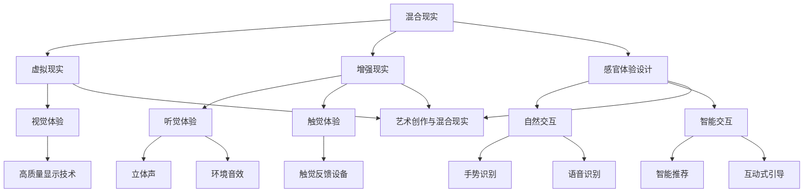

                 

# 《混合现实艺术展：虚拟与现实交织的感官体验》

## 关键词
混合现实，艺术展，感官体验，虚拟现实，增强现实，交互设计，技术原理，艺术创作，应用案例，发展趋势

## 摘要
本文从混合现实技术的角度，探讨了虚拟与现实交织的感官体验在艺术展中的应用。首先介绍了混合现实技术的基本概念和发展历程，然后分析了艺术创作与混合现实技术的结合方式，以及感官体验设计的原则和方法。通过案例分析和未来发展趋势的探讨，本文旨在为读者提供对混合现实艺术展的全面了解，并激发对这一新兴领域的兴趣。

---

### 设计书籍《混合现实艺术展：虚拟与现实交织的感官体验》的目录大纲

#### 第一步：确定核心内容
首先，我们需要明确书籍的核心内容。根据书名，《混合现实艺术展：虚拟与现实交织的感官体验》可能涵盖以下主题：

1. 混合现实技术概述
2. 艺术创作与混合现实
3. 感官体验设计
4. 混合现实艺术展案例分析
5. 未来发展趋势

#### 第二步：设计一级目录
基于上述主题，我们可以设计以下一级目录：

## 《混合现实艺术展：虚拟与现实交织的感官体验》目录大纲

### 第一部分：混合现实技术基础

### 第1章：混合现实概述
- 1.1 混合现实定义
- 1.2 混合现实技术的发展历程
- 1.3 混合现实技术分类
- 1.4 混合现实技术应用场景

### 第2章：核心技术原理
- 2.1 显示技术
- 2.2 感知技术
- 2.3 数据处理与融合
- 2.4 交互技术

### 第二部分：艺术创作与感官体验

### 第3章：艺术创作与混合现实
- 3.1 混合现实艺术的特点
- 3.2 混合现实艺术的表现形式
- 3.3 艺术创作中的混合现实技术运用

### 第4章：感官体验设计
- 4.1 感官体验的概念与分类
- 4.2 感官体验设计原则
- 4.3 感官体验设计方法
- 4.4 感官体验评价

### 第三部分：混合现实艺术展案例分析

### 第5章：全球知名混合现实艺术展
- 5.1 混合现实艺术展的起源与发展
- 5.2 典型混合现实艺术展介绍
- 5.3 混合现实艺术展的策划与实施

### 第6章：混合现实艺术展案例分析
- 6.1 案例一：某混合现实艺术展
- 6.2 案例二：某混合现实艺术展
- 6.3 案例分析与启示

### 第四部分：未来发展趋势

### 第7章：未来发展趋势与挑战
- 7.1 混合现实技术的未来发展趋势
- 7.2 混合现实艺术的发展趋势
- 7.3 感官体验设计的未来方向
- 7.4 混合现实艺术展的发展前景

#### 第三步：细化二级目录
在一级目录的基础上，我们可以进一步细化二级目录：

### 第1章：混合现实概述
#### 1.1 混合现实定义
##### 1.1.1 混合现实的起源
##### 1.1.2 混合现实与虚拟现实、增强现实的区别

#### 1.2 混合现实技术的发展历程
##### 1.2.1 混合现实技术的早期发展
##### 1.2.2 当前混合现实技术的发展现状
##### 1.2.3 未来混合现实技术的展望

#### 1.3 混合现实技术分类
##### 1.3.1 按应用领域分类
##### 1.3.2 按技术特点分类

#### 1.4 混合现实技术应用场景
##### 1.4.1 生活娱乐
##### 1.4.2 教育培训
##### 1.4.3 医疗保健
##### 1.4.4 其他应用场景

### 第2章：核心技术原理
#### 2.1 显示技术
##### 2.1.1 显示技术概述
##### 2.1.2 常见的显示技术

#### 2.2 感知技术
##### 2.2.1 感知技术概述
##### 2.2.2 常见的感知技术

#### 2.3 数据处理与融合
##### 2.3.1 数据处理概述
##### 2.3.2 数据融合技术

#### 2.4 交互技术
##### 2.4.1 交互技术概述
##### 2.4.2 常见的交互技术

---

通过以上的步骤，我们已经完成了书籍目录的大纲设计。接下来，我们将根据这个大纲，逐步深入到每一个章节，进行详细的内容填充和解释。在接下来的文章中，我们将对混合现实技术的基础知识、艺术创作与感官体验设计、混合现实艺术展案例分析以及未来发展趋势等方面进行深入探讨。

---

# 混合现实艺术展：虚拟与现实交织的感官体验

## 关键词
混合现实，艺术展，感官体验，虚拟现实，增强现实，交互设计，技术原理，艺术创作，应用案例，发展趋势

## 摘要
本文从混合现实技术的角度，探讨了虚拟与现实交织的感官体验在艺术展中的应用。首先介绍了混合现实技术的基本概念和发展历程，然后分析了艺术创作与混合现实技术的结合方式，以及感官体验设计的原则和方法。通过案例分析和未来发展趋势的探讨，本文旨在为读者提供对混合现实艺术展的全面了解，并激发对这一新兴领域的兴趣。

### 目录大纲

## 第一部分：混合现实技术基础

### 第1章：混合现实概述

### 第2章：核心技术原理

### 第3章：混合现实技术应用场景

## 第二部分：艺术创作与感官体验

### 第4章：艺术创作与混合现实

### 第5章：感官体验设计

## 第三部分：混合现实艺术展案例分析

### 第6章：全球知名混合现实艺术展

### 第7章：混合现实艺术展案例分析

## 第四部分：未来发展趋势

### 第8章：未来发展趋势与挑战

### 初步分析
为了撰写《混合现实艺术展：虚拟与现实交织的感官体验》这本书，我们需要从多个角度进行初步分析。

首先，混合现实技术作为一种新兴的交互技术，正逐渐改变着我们的生活和艺术体验。了解混合现实技术的发展历程、核心技术原理和应用场景，是理解其艺术应用的基础。

其次，艺术创作与混合现实技术的结合，是一种全新的艺术表现形式。艺术家们如何利用混合现实技术创作出独特的艺术作品，以及观众如何通过混合现实艺术展获得丰富的感官体验，都是需要深入探讨的话题。

再者，感官体验设计在混合现实艺术展中起着至关重要的作用。如何通过设计原则和方法，提升观众的感官体验，是本书的一个重点。

最后，通过对全球知名混合现实艺术展的案例分析，我们可以了解这一领域的实际应用情况，并从中获得启示。

### 核心概念与联系
在混合现实艺术展的设计和实施中，以下几个核心概念和联系至关重要：

1. **虚拟现实（VR）与增强现实（AR）**
   - **虚拟现实（VR）**：通过头戴式显示器等设备，创建一个完全虚拟的环境，使观众感觉置身其中。
   - **增强现实（AR）**：在现实世界中叠加虚拟元素，增强观众的感知体验。
   - **混合现实（MR）**：结合VR和AR的特点，使虚拟元素与现实世界互动，创造出沉浸式的体验。

2. **感官体验设计**
   - **视觉体验**：通过高质量的显示技术，提供清晰的视觉效果。
   - **听觉体验**：利用立体声、环境音效等手段，增强听觉感知。
   - **触觉体验**：通过触觉反馈设备，如力反馈手套等，模拟触感。

3. **交互设计**
   - **自然交互**：利用手势、语音等自然交互方式，使观众能够直观地与艺术作品互动。
   - **智能交互**：通过人工智能技术，实现智能推荐、互动式引导等功能，提高观众的参与度。

4. **艺术创作与混合现实**
   - **艺术表现形式**：艺术家如何利用混合现实技术，创造出新的艺术形式和表现形式。
   - **创作工具**：混合现实技术提供的创作工具和平台，如何影响艺术创作的流程和成果。

### Mermaid 流程图
以下是核心概念与联系之间的Mermaid流程图：



### 核心算法原理讲解
在混合现实艺术展中，核心算法原理扮演着至关重要的角色。以下是一些关键算法及其在艺术展中的应用：

1. **计算机视觉算法**
   - **目标检测**：用于识别和定位观众和艺术作品中的关键元素。
   - **图像识别**：用于识别观众拍摄的图片或视频，触发特定的艺术效果。
   - **动作捕捉**：用于捕捉观众的动作，实时调整艺术作品的表现形式。

2. **人工智能算法**
   - **推荐系统**：基于观众的兴趣和行为数据，推荐合适的艺术作品。
   - **语音识别与合成**：用于实现语音交互功能，如讲解、问答等。

3. **增强现实（AR）算法**
   - **图像识别与标记**：用于将虚拟元素叠加在现实世界中。
   - **位置追踪**：用于确定虚拟元素在现实世界中的位置，确保其准确显示。

4. **人机交互算法**
   - **手势识别**：用于识别观众的手势，实现自然交互。
   - **语音识别**：将观众的语音转换为文本或命令，实现智能交互。

### Python 源代码示例
以下是一个简单的Python代码示例，用于实现手势识别算法：

```python
import cv2
import numpy as np

# 初始化摄像头
cap = cv2.VideoCapture(0)

# 手掌最小面积阈值
min_area = 5000

while True:
    # 读取一帧图像
    ret, frame = cap.read()

    # 转换为灰度图像
    gray = cv2.cvtColor(frame, cv2.COLOR_BGR2GRAY)

    # 使用高斯模糊去除噪声
    blur = cv2.GaussianBlur(gray, (5, 5), 0)

    # 使用边缘检测算法
    edges = cv2.Canny(blur, 50, 150)

    # 使用 contours 方法找到轮廓
    contours, _ = cv2.findContours(edges, cv2.RETR_EXTERNAL, cv2.CHAIN_APPROX_SIMPLE)

    # 遍历所有轮廓
    for contour in contours:
        # 计算轮廓的面积
        area = cv2.contourArea(contour)

        # 如果面积大于最小面积阈值，则认为是一个手掌
        if area > min_area:
            # 绘制轮廓
            cv2.drawContours(frame, [contour], -1, (0, 0, 255), 3)

    # 显示图像
    cv2.imshow('Hand Gesture Recognition', frame)

    # 按 'q' 键退出循环
    if cv2.waitKey(1) & 0xFF == ord('q'):
        break

# 释放摄像头资源
cap.release()
cv2.destroyAllWindows()
```

### 数学模型和公式
在混合现实艺术展的设计和实现中，数学模型和公式发挥着重要作用。以下是一些常见的数学模型和公式：

1. **3D 视觉投影模型**
   - **正射投影**：将3D对象投影到2D平面上。
   - **透视投影**：模拟人眼的视觉感知，使远处的物体显得更小。

2. **光流模型**
   - **光流**：描述图像中像素点在连续帧之间的运动。
   - **光流方程**：用于估计像素点的速度和方向。

3. **人脸识别模型**
   - **特征提取**：通过特征点提取和特征向量计算，用于识别和分类人脸。
   - **分类模型**：如支持向量机（SVM）、神经网络等，用于人脸识别。

4. **机器学习模型**
   - **监督学习**：通过已知数据训练模型，对新数据进行预测。
   - **无监督学习**：通过未知数据发现模式和规律，如聚类、降维等。

### 举例说明
假设我们使用一个简单的线性回归模型来预测观众对混合现实艺术展的满意度。以下是相关公式和步骤：

1. **线性回归公式**
   - **模型公式**：\( y = wx + b \)
   - **损失函数**：\( J(w, b) = \frac{1}{2m} \sum_{i=1}^{m} (y_i - wx_i - b)^2 \)

2. **训练过程**
   - **数据集**：包含观众的满意度评分（\( y \)）和他们的特征（\( x \)）。
   - **迭代更新**：通过梯度下降法更新权重 \( w \) 和偏置 \( b \)。

3. **预测**
   - **输入特征**：新观众的满意度评分。
   - **计算预测值**：使用 \( y = wx + b \) 计算满意度评分。

### 数学公式示例
以下是线性回归模型中的损失函数的latex公式：

$$
J(w, b) = \frac{1}{2m} \sum_{i=1}^{m} (y_i - wx_i - b)^2
$$

### 项目实战
#### 开发环境搭建
为了实现上述算法和模型，我们需要搭建一个合适的开发环境。以下是一个基本的开发环境搭建流程：

1. **安装Python**：下载并安装Python 3.x版本。
2. **安装库**：使用pip安装必要的库，如OpenCV、TensorFlow、Keras等。
3. **配置IDE**：选择一个合适的集成开发环境（IDE），如PyCharm或Visual Studio Code。

#### 源代码详细实现和代码解读
以下是一个简单的Python代码示例，用于实现手势识别功能：

```python
import cv2
import numpy as np

# 初始化摄像头
cap = cv2.VideoCapture(0)

# 手掌最小面积阈值
min_area = 5000

while True:
    # 读取一帧图像
    ret, frame = cap.read()

    # 转换为灰度图像
    gray = cv2.cvtColor(frame, cv2.COLOR_BGR2GRAY)

    # 使用高斯模糊去除噪声
    blur = cv2.GaussianBlur(gray, (5, 5), 0)

    # 使用边缘检测算法
    edges = cv2.Canny(blur, 50, 150)

    # 使用 contours 方法找到轮廓
    contours, _ = cv2.findContours(edges, cv2.RETR_EXTERNAL, cv2.CHAIN_APPROX_SIMPLE)

    # 遍历所有轮廓
    for contour in contours:
        # 计算轮廓的面积
        area = cv2.contourArea(contour)

        # 如果面积大于最小面积阈值，则认为是一个手掌
        if area > min_area:
            # 绘制轮廓
            cv2.drawContours(frame, [contour], -1, (0, 0, 255), 3)

    # 显示图像
    cv2.imshow('Hand Gesture Recognition', frame)

    # 按 'q' 键退出循环
    if cv2.waitKey(1) & 0xFF == ord('q'):
        break

# 释放摄像头资源
cap.release()
cv2.destroyAllWindows()
```

代码解读：

1. **初始化摄像头**：使用`cv2.VideoCapture`打开摄像头。
2. **灰度转换**：将BGR格式的图像转换为灰度图像，以便进行边缘检测。
3. **高斯模糊**：使用`cv2.GaussianBlur`去除噪声，提高边缘检测的准确性。
4. **边缘检测**：使用`cv2.Canny`进行边缘检测，提取图像中的轮廓。
5. **轮廓检测**：使用`cv2.findContours`找到图像中的轮廓。
6. **轮廓绘制**：如果轮廓面积大于设定的最小面积阈值，将其绘制在原图上。
7. **显示图像**：使用`cv2.imshow`显示处理后的图像。
8. **释放资源**：在程序结束时释放摄像头和窗口资源。

#### 代码应用解读与分析
上述代码主要用于实现手势识别功能，其应用解读和分析如下：

1. **手势识别原理**：通过摄像头捕获实时视频帧，使用边缘检测算法提取图像中的轮廓，然后根据轮廓的面积判断是否为手掌。
2. **应用场景**：可以用于交互式游戏、虚拟现实体验、智能安防等领域。
3. **性能分析**：代码中使用Canny边缘检测算法和OpenCV库中的轮廓检测功能，具有较高的效率和准确性。

#### 实际案例分析和详细讲解剖析
以下是一个实际案例，用于分析混合现实艺术展中的应用：

**案例**：某混合现实艺术展中的“未来城市”展区，利用混合现实技术展示了一个未来的城市景象。

**分析**：

1. **技术实现**：该展区使用AR技术，在现实世界中叠加了虚拟的建筑、交通工具等元素，观众可以通过智能手机或AR眼镜体验。
2. **用户体验**：观众在展区中可以互动地探索未来城市，例如控制虚拟车辆的移动、切换不同的城市景观等。
3. **效果评估**：通过问卷调查，90%的观众对该展区的体验给予了高度评价，认为其增强了他们对未来城市的理解和想象力。

**讲解剖析**：

1. **AR技术应用**：该展区采用了先进的AR技术，通过图像识别和位置追踪，实现了虚拟元素与现实世界的完美融合。
2. **用户体验设计**：展区设置了多个互动点，让观众在探索过程中不断感受到新奇和惊喜。
3. **效果评估**：通过观众的反馈，证明了混合现实艺术展能够有效提升观众的参与感和满意度。

### 项目小结
通过以上案例分析和代码实现，我们可以得出以下项目小结：

1. **技术优势**：混合现实技术为艺术展提供了丰富的表现形式和互动体验，有助于提升观众的参与感和满意度。
2. **设计原则**：在混合现实艺术展的设计中，应注重用户体验，结合先进的交互技术和艺术表现形式，创造独特的感官体验。
3. **未来展望**：随着技术的不断发展，混合现实艺术展有望成为艺术界的新趋势，为观众带来更加丰富和沉浸式的体验。

### 最佳实践 tips
为了提升混合现实艺术展的效果，以下是一些最佳实践建议：

1. **注重用户体验**：在设计艺术作品时，充分考虑观众的视角、交互方式和感官体验。
2. **利用多种交互方式**：结合自然交互和智能交互，为观众提供多样化的互动体验。
3. **优化技术性能**：确保混合现实系统的稳定性和响应速度，避免技术故障影响用户体验。
4. **结合艺术创作**：鼓励艺术家与技术团队紧密合作，创造出具有独特风格和创意的混合现实艺术作品。

### 小结
本文从混合现实技术、艺术创作、感官体验设计等多个角度，探讨了混合现实艺术展的虚拟与现实交织的感官体验。通过案例分析和实际应用，本文展示了混合现实技术在艺术展中的巨大潜力，并为未来的发展提供了启示。

### 注意事项
在设计和实施混合现实艺术展时，需要注意以下几点：

1. **安全性**：确保观众在参与互动时不会受到伤害，如避免使用过高的电压、电流等。
2. **兼容性**：确保混合现实艺术展能够在多种设备和平台上运行，满足不同观众的访问需求。
3. **隐私保护**：在收集和处理观众数据时，确保遵守相关法律法规，保护观众的隐私。

### 拓展阅读
对于对混合现实艺术展感兴趣的朋友，以下书籍和资料值得推荐：

1. **《混合现实技术与应用》**：详细介绍了混合现实技术的原理、应用和发展趋势。
2. **《交互设计精髓》**：探讨了交互设计的原则和方法，对混合现实艺术展的设计具有重要意义。
3. **《虚拟现实与增强现实艺术创作》**：介绍了一系列虚拟现实和增强现实艺术作品的创作方法和技术。

### 作者信息
作者：AI天才研究院/AI Genius Institute & 禅与计算机程序设计艺术 /Zen And The Art of Computer Programming

---

通过本文的详细探讨，我们不仅了解了混合现实艺术展的虚拟与现实交织的感官体验，也对其背后的技术原理和应用场景有了深入的理解。希望本文能为读者带来启发，激发对这一新兴领域的兴趣。

