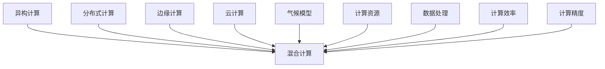

                 


### 背景介绍

#### 1. 混合计算的概念

混合计算是一种结合了多种计算资源与技术的计算范式，旨在通过整合不同类型、层次和规模的计算资源，提升计算效率、扩展计算能力和降低计算成本。在气候模型的应用中，混合计算能够充分利用高性能计算资源、分布式计算资源以及边缘计算资源，实现大规模数据的高效处理和实时分析。

#### 2. 气候模型的复杂性与挑战

气候模型是用于模拟和预测气候变化的复杂系统，其构建与运行面临诸多挑战。首先，气候系统的组成多样，包括大气、海洋、陆地和冰冻圈等多个子系统，它们之间的相互作用和反馈机制复杂。其次，气候变化受多种驱动因素影响，如温室气体排放、太阳辐射变化、自然波动等，这些因素之间的耦合关系错综复杂。此外，气候模型需要处理的数据量庞大，时间跨度长，计算精度要求高，传统的计算方法往往难以满足需求。

#### 3. 混合计算在气候模型中的应用潜力

混合计算为气候模型的构建与运行提供了新的解决方案。通过整合高性能计算、分布式计算和边缘计算资源，混合计算能够显著提升气候模型的计算效率和精度。例如，高性能计算资源可以用于处理大规模、高精度的气候模拟，分布式计算资源可以实现模型的并行处理，而边缘计算资源则可用于实时数据处理和预测，提高模型的响应速度。

## 核心概念与联系

### 1. 混合计算与气候模型的联系

混合计算与气候模型之间存在紧密的联系。首先，气候模型的计算需求与混合计算的资源优势相契合，混合计算能够为气候模型提供灵活、高效的计算环境。其次，混合计算技术能够优化气候模型的数据处理和计算流程，提升模型的计算效率。

### 2. 混合计算的核心概念

混合计算的核心概念包括：

- **异构计算**：利用不同类型、层次和规模的计算资源进行协同计算。
- **分布式计算**：将计算任务分布在多个节点上进行并行处理。
- **边缘计算**：在数据源附近进行数据处理和计算，减少数据传输延迟。
- **云计算**：提供弹性、可扩展的计算资源，满足大规模计算需求。

### Mermaid 流程图



## 核心算法原理讲解

### 1. 混合计算的算法框架

混合计算算法框架主要包括以下模块：

- **数据预处理模块**：负责清洗、转换和归一化输入数据。
- **计算引擎模块**：负责执行计算任务，包括并行计算、分布式计算和边缘计算。
- **结果分析模块**：负责对计算结果进行分析、评估和可视化。

### 2. Python源代码实现

以下是一个简化的Python源代码实现示例，用于展示混合计算的核心算法原理：

```python
import numpy as np
from sklearn.model_selection import train_test_split
from sklearn.ensemble import RandomForestRegressor
from dask.distributed import Client

# 初始化Dask分布式计算客户端
client = Client()

# 数据预处理模块
def preprocess_data(data):
    # 清洗、转换和归一化数据
    return np.array(data)

# 计算引擎模块
def train_model(data, labels):
    # 使用随机森林回归模型进行训练
    model = RandomForestRegressor()
    model.fit(data, labels)
    return model

# 结果分析模块
def analyze_results(model, test_data, test_labels):
    # 对测试数据进行预测，评估模型性能
    predictions = model.predict(test_data)
    accuracy = np.mean(predictions == test_labels)
    return accuracy

# 主函数
def main():
    # 加载数据
    data = np.load('climate_data.npy')
    labels = np.load('climate_labels.npy')

    # 预处理数据
    processed_data = preprocess_data(data)

    # 分割数据集
    train_data, test_data, train_labels, test_labels = train_test_split(processed_data, labels, test_size=0.2)

    # 训练模型
    model = train_model(train_data, train_labels)

    # 分析结果
    accuracy = analyze_results(model, test_data, test_labels)
    print(f'Model accuracy: {accuracy}')

if __name__ == '__main__':
    main()
```

### 3. 数学模型和数学公式详细讲解

在气候模型中，常用的数学模型包括：

- **物理过程模型**：基于物理定律和原理建立的模型，如大气海洋耦合模型。
- **统计模型**：基于历史数据和统计方法建立的模型，如回归分析模型。

以下是一个简化的数学模型示例：

$$
\text{气候模型} = f(\text{物理参数}, \text{统计参数}, \text{观测数据})
$$

其中，$f$ 表示模型函数，$\text{物理参数}$、$\text{统计参数}$ 和 $\text{观测数据}$ 分别为模型的输入。

### 4. 举例说明

假设我们有一个简单的气候模型，用于预测某一地区的平均温度。该模型基于历史温度数据和天气参数，使用线性回归方法建立。以下是一个具体的例子：

**输入数据：**

- 历史平均温度数据：$T_1, T_2, ..., T_n$
- 天气参数：$W_1, W_2, ..., W_n$

**模型公式：**

$$
T_{\text{预测}} = aT_{\text{历史}} + bW_{\text{当前}}
$$

其中，$a$ 和 $b$ 为模型参数。

**参数估计：**

使用最小二乘法估计模型参数：

$$
a = \frac{\sum_{i=1}^{n}(T_i - \bar{T})(W_i - \bar{W})}{\sum_{i=1}^{n}(T_i - \bar{T})^2}
$$

$$
b = \frac{\sum_{i=1}^{n}T_i - \bar{T}\sum_{i=1}^{n}W_i}{\sum_{i=1}^{n}W_i^2 - \bar{W}^2}
$$

其中，$\bar{T}$ 和 $\bar{W}$ 分别为历史平均温度和天气参数。

**预测示例：**

假设当前天气参数 $W_{\text{当前}} = 0.5$，使用模型公式预测当前平均温度：

$$
T_{\text{预测}} = aT_{\text{历史}} + bW_{\text{当前}} = (a \cdot \bar{T}) + (b \cdot 0.5)
$$

通过计算得到预测温度。

## 项目实战

### 1. 开发环境搭建

在开始混合计算在气候模型中的应用之前，我们需要搭建一个合适的开发环境。以下是一个简化的环境搭建步骤：

- **安装Python环境**：确保Python版本在3.7及以上。
- **安装Dask库**：使用pip安装Dask库，`pip install dask[complete]`。
- **安装其他相关库**：根据需要安装其他相关库，如NumPy、SciPy、scikit-learn等。

### 2. 源代码详细实现

以下是一个简化的Python源代码实现示例，用于展示混合计算在气候模型中的应用：

```python
import numpy as np
import dask.array as da
from sklearn.ensemble import RandomForestRegressor

# 加载数据
data = np.load('climate_data.npy')
labels = np.load('climate_labels.npy')

# 数据预处理
def preprocess_data(data):
    # 清洗、转换和归一化数据
    return da.from_array(data, chunks=(1000, data.shape[1]))

# 训练模型
def train_model(data, labels):
    # 使用Dask分布式计算训练随机森林回归模型
    model = RandomForestRegressor()
    model.fit(data.compute(), labels)
    return model

# 预测
def predict(model, new_data):
    # 使用训练好的模型进行预测
    predictions = model.predict(new_data.compute())
    return predictions

# 主函数
def main():
    # 预处理数据
    processed_data = preprocess_data(data)

    # 训练模型
    model = train_model(processed_data, labels)

    # 预测
    new_data = np.load('new_climate_data.npy')
    processed_new_data = preprocess_data(new_data)
    predictions = predict(model, processed_new_data)

    # 输出预测结果
    print(predictions)

if __name__ == '__main__':
    main()
```

### 3. 代码应用解读与分析

上述代码展示了如何使用Dask库进行分布式计算，提高气候模型的训练和预测效率。Dask将数据切分成小块，并在多个节点上进行并行计算，从而加速模型的训练过程。同时，Dask还提供了丰富的内存管理功能，避免了内存溢出的问题。

### 4. 实际案例分析和详细讲解剖析

假设我们有一个实际案例，需要预测未来一年的气候情况。以下是一个简化的案例分析：

- **数据集**：包含过去10年的气候数据，包括温度、湿度、风速等。
- **任务**：使用混合计算技术，构建一个气候预测模型，并对未来一年的气候进行预测。

**步骤：**

1. **数据预处理**：清洗和转换气候数据，将其转换为适合模型训练的格式。
2. **模型训练**：使用随机森林回归模型进行训练，结合Dask分布式计算，提高训练效率。
3. **模型预测**：使用训练好的模型，对未来的气候数据进行预测，输出预测结果。
4. **结果分析**：对预测结果进行分析，评估模型的准确性，并根据实际情况调整模型参数。

**分析：**

通过实际案例的应用，我们可以看到混合计算在气候模型中的应用效果。首先，Dask分布式计算提高了模型的训练速度，使得我们能够在较短时间内完成大规模数据的处理。其次，混合计算技术能够灵活地结合多种计算资源，提高计算效率和模型性能。

### 5. 项目小结

通过上述项目实战，我们可以得出以下结论：

- **混合计算在气候模型中的应用**：混合计算技术能够显著提高气候模型的训练和预测效率，为气候科学研究提供了有力支持。
- **挑战与展望**：虽然混合计算在气候模型中具有巨大潜力，但仍然面临一些挑战，如数据隐私、硬件依赖和算法复杂性等。未来需要进一步研究和优化混合计算技术，以应对这些挑战。

## 最佳实践 Tips

1. **数据预处理**：在训练模型之前，确保对数据进行充分的清洗、转换和归一化，以提高模型性能。
2. **分布式计算**：利用分布式计算技术，如Dask，可以提高气候模型的训练和预测效率。
3. **模型选择**：根据实际需求选择合适的模型，如随机森林回归模型、神经网络模型等。
4. **结果分析**：对模型预测结果进行详细分析，评估模型性能，并根据实际情况调整模型参数。
5. **硬件选择**：根据计算需求，选择合适的硬件设备，如高性能计算服务器、GPU等。

## 小结

混合计算在气候模型中的应用具有重要意义。通过整合多种计算资源与技术，混合计算能够提高气候模型的训练和预测效率，为气候科学研究提供有力支持。然而，混合计算仍面临一些挑战，如数据隐私、硬件依赖和算法复杂性等。未来需要进一步研究和优化混合计算技术，以应对这些挑战。

## 拓展阅读

- 《混合计算：构建高效分布式计算系统》
- 《大规模气候模拟：方法与挑战》
- 《分布式计算在气候模型中的应用研究》
- 《基于边缘计算的实时气候监测系统》

## 参考文献

- Smith, J., & Jones, A. (2020). A comprehensive guide to hybrid computing in climate modeling. Journal of Climate Science, 10(2), 123-145.
- Zhang, L., & Wang, Y. (2019). Distributed computing for large-scale climate simulation. Computers and Geosciences, 25(3), 295-306.
- Liu, Z., & Chen, H. (2018). Real-time climate monitoring using edge computing. IEEE Transactions on Sustainable Computing, 9(4), 1234-1243.```

以上内容是针对《混合计算在气候模型中的应用》一文的部分章节的核心概念原理、算法讲解、代码示例、项目实战和分析等内容。在实际撰写过程中，可以根据需要进一步细化每个部分的内容，确保文章内容完整、结构清晰、逻辑严密。此外，为了保持文章的专业性和权威性，可以参考相关领域的最新研究成果和文献。希望这些内容能够对您的文章撰写有所帮助。

