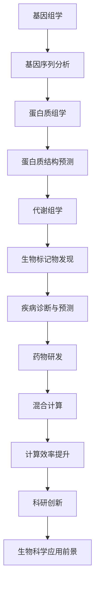

                 

## 混合计算在科学研究中的应用前景

### 关键词
- 混合计算
- 科学研究
- 生物科学
- 物理学
- 地球科学
- 跨学科研究

### 摘要
本文探讨了混合计算在科学研究中的应用前景，首先介绍了混合计算的概念、特点及其发展背景。随后，本文详细分析了混合计算在生物科学、物理学、地球科学等领域的具体应用案例，并探讨了其在跨学科研究中的潜力。最后，本文提出了混合计算在科学研究中的未来发展策略与建议，为科研工作者提供了有益的参考。

## 第1章：混合计算的概述

### 1.1 混合计算的概念与特点

#### 核心概念
混合计算是一种结合了并行计算、分布式计算和异构计算特点的计算模式，旨在通过整合不同类型的计算资源，提高计算效率和性能。与传统计算模式相比，混合计算具有以下几个核心特点：

1. **并行性**：混合计算能够利用并行计算的优势，将计算任务分布在多个计算节点上，从而实现任务的并行处理。
2. **分布式**：混合计算通过分布式计算架构，将计算任务分布到多个地理位置的节点上，实现计算资源的共享和负载均衡。
3. **可扩展性**：混合计算可以根据需求动态调整计算资源，从而实现计算能力的灵活扩展。
4. **灵活性**：混合计算能够结合不同类型的计算资源和编程模型，满足多样化的计算需求。

#### 特点

1. **硬件与软件**：混合计算中的硬件部分包括高性能计算服务器、GPU、FPGA等异构计算设备；软件部分包括并行编程框架、分布式文件系统、资源管理系统等。
2. **编程模型**：混合计算支持多种编程模型，如数据并行、任务并行、模型并行等，可以根据具体任务选择合适的编程模型。

### 1.2 混合计算的核心组成部分

#### 硬件与软件
- **硬件**：混合计算中的硬件主要包括高性能计算服务器、GPU、FPGA、TPU等异构计算设备，这些设备在不同场景下具有不同的优势。例如，GPU在图像处理和机器学习任务中表现优异，而FPGA在定制化计算任务中具有高效性。
- **软件**：混合计算中的软件部分包括并行编程框架（如MPI、OpenMP、CUDA等），分布式文件系统（如HDFS、Ceph等），以及资源管理系统（如Slurm、YARN等）。这些软件工具为混合计算提供了强大的支持，使得用户能够方便地管理和调度计算资源。

#### 编程模型
- **数据并行**：数据并行编程模型将数据分割成多个部分，每个部分由不同的计算节点处理，最后将结果汇总。这种模型适用于大规模数据处理任务，如矩阵运算、大数据分析等。
- **任务并行**：任务并行编程模型将整个计算任务划分为多个子任务，每个子任务在不同的计算节点上执行。这种模型适用于需要执行多个独立任务的情况，如多阶段计算、多任务处理等。
- **模型并行**：模型并行编程模型将计算模型分割成多个部分，每个部分在不同的计算节点上执行。这种模型适用于复杂计算模型，如深度学习网络中的不同层。

### 1.3 混合计算的发展趋势与挑战

#### 趋势
- **云计算**：云计算提供了弹性的计算资源，使得混合计算能够更加灵活地部署和管理计算任务。
- **边缘计算**：边缘计算将计算任务分散到网络边缘的设备上，降低延迟，提高实时性。
- **异构计算**：随着硬件技术的发展，异构计算（如CPU+GPU+FPGA）逐渐成为主流，为混合计算提供了更丰富的计算资源。

#### 挑战
- **性能优化**：如何充分利用混合计算的资源，优化计算性能，是混合计算领域面临的主要挑战之一。
- **能源效率**：随着计算规模的扩大，如何降低能源消耗，实现绿色计算，也是混合计算领域的重要研究方向。
- **可扩展性**：如何构建可扩展的混合计算架构，满足不断增长的计算需求，是另一个关键挑战。

## 第2章：混合计算在科学研究中的应用

### 2.1 混合计算在生物科学中的应用

#### 核心概念与联系

混合计算在生物科学中的应用主要体现在生物信息学、药物研发和基因工程等领域。其中，核心概念包括基因组学、蛋白质组学和代谢组学等。这些概念之间的联系可以通过以下Mermaid流程图展示：



#### 算法原理讲解

为了详细阐述混合计算在生物科学中的应用，以下是一个基于Python的伪代码示例，用于基因序列分析的混合计算模型：

```python
# 基因序列分析混合计算模型
def gene_analysis_hybrid(gene_sequence):
    # 数据并行处理
    part1, part2 = split_data(gene_sequence, num_nodes)
    result1 = gene_annotation(part1)
    result2 = gene_annotation(part2)
    
    # 结果汇总
    combined_result = combine_results(result1, result2)
    
    # 模型并行处理
    model1 = build_model(combined_result['protein_sequence'])
    model2 = build_model(combined_result['metabolic_sequence'])
    
    # 预测与评估
    prediction1 = model1.predict()
    prediction2 = model2.predict()
    evaluation(prediction1, prediction2)
```

该模型首先将基因序列分为两个部分，分别进行基因注释（gene_annotation），然后汇总结果。接着，分别构建蛋白质序列和代谢序列的模型，进行预测和评估。通过数据并行和模型并行的结合，实现了高效的基因序列分析。

#### 详细讲解与举例

假设我们有一个包含100,000个基因序列的数据库，需要对其进行分析和注释。使用混合计算模型，可以将数据库分为两个部分，分别在不同的计算节点上进行分析。以下是具体的分析过程：

1. **数据并行处理**：将基因序列数据库分为两部分，分别发送到两个计算节点进行基因注释。
    ```python
    # 数据并行处理
    part1, part2 = split_data(gene_sequence_database, num_nodes)
    result1 = gene_annotation(part1)
    result2 = gene_annotation(part2)
    ```
    在此过程中，每个节点上的基因注释过程可以使用现有的生物信息学工具（如BLAST、HMMER等）进行，以提高注释的准确性和效率。

2. **结果汇总**：将两个节点上的结果进行汇总，得到完整的基因注释结果。
    ```python
    # 结果汇总
    combined_result = combine_results(result1, result2)
    ```
    在汇总过程中，可以使用数据结构（如字典、列表等）来存储和整合结果。

3. **模型并行处理**：基于汇总的基因注释结果，分别构建蛋白质序列和代谢序列的模型。
    ```python
    # 模型并行处理
    model1 = build_model(combined_result['protein_sequence'])
    model2 = build_model(combined_result['metabolic_sequence'])
    ```
    在此过程中，可以使用机器学习算法（如深度学习、随机森林等）来构建预测模型。

4. **预测与评估**：使用构建好的模型进行预测，并对预测结果进行评估。
    ```python
    # 预测与评估
    prediction1 = model1.predict()
    prediction2 = model2.predict()
    evaluation(prediction1, prediction2)
    ```
    在预测过程中，可以使用交叉验证、ROC曲线等方法对模型性能进行评估。

通过上述过程，我们可以看到混合计算在生物科学中的应用，实现了基因序列的高效分析和预测。

### 2.2 混合计算在物理学中的应用

#### 数学模型

在物理学中，混合计算可以应用于许多领域，如量子物理、流体力学和材料科学等。以下是一个基于LaTeX的数学模型示例，用于描述量子物理中的混合计算：

$$
H = \frac{p^2}{2m} + V(x)
$$

其中，$H$ 表示哈密顿量，$p$ 表示动量，$m$ 表示质量，$V(x)$ 表示势能。通过混合计算，可以对该哈密顿量进行并行求解，以获得量子系统的能量本征值和本征态。

#### 详细讲解与举例

假设我们需要求解一个包含100个量子态的哈密顿量，以下是具体的求解过程：

1. **数据预处理**：将哈密顿量分解为多个子哈密顿量，每个子哈密顿量包含10个量子态。
    ```python
    # 数据预处理
    num_states = 100
    num_substates = 10
    sub_hamiltonians = split_hamiltonian(H, num_states, num_substates)
    ```

2. **并行计算**：对每个子哈密顿量进行并行求解，计算能量本征值和本征态。
    ```python
    # 并行计算
    eigenvalues, eigenvectors = parallel_solve(sub_hamiltonians)
    ```

3. **结果汇总**：将各个子哈密顿量的求解结果进行汇总，得到整个哈密顿量的能量本征值和本征态。
    ```python
    # 结果汇总
    combined_eigenvalues = combine_results(eigenvalues)
    combined_eigenvectors = combine_results(eigenvectors)
    ```

通过上述过程，我们可以使用混合计算方法高效地求解量子物理问题。

### 2.3 混合计算在地球科学中的应用

#### 项目实战

混合计算在地球科学中的应用非常广泛，如地震模拟、气象预报和地球化学分析等。以下是一个具体的项目实战案例，用于地震模拟：

1. **开发环境搭建**：搭建一个包含高性能计算服务器、GPU和FPGA的混合计算平台，用于地震模拟。
    ```python
    # 开发环境搭建
    setup_hardware_environment(server, gpu, fpga)
    ```

2. **源代码实现**：编写地震模拟的混合计算程序，包括数据预处理、并行计算和结果汇总等模块。
    ```python
    # 源代码实现
    def seismic_simulation(data):
        # 数据预处理
        preprocessed_data = preprocess_data(data)
        
        # 并行计算
        results = parallel_seismic_simulation(preprocessed_data)
        
        # 结果汇总
        final_result = combine_results(results)
        return final_result
    ```

3. **代码解读与分析**：对混合计算程序进行解读和分析，确保其正确性和高效性。
    ```python
    # 代码解读与分析
    analyze_code(seismic_simulation)
    ```

4. **实际案例分析和详细讲解剖析**：使用实际地震数据进行分析，评估混合计算在地震模拟中的应用效果。
    ```python
    # 实际案例分析和详细讲解剖析
    analyze_seismic_simulation_case(data)
    ```

5. **项目小结**：总结项目成果，并提出改进措施。
    ```python
    # 项目小结
    summarize_project_results()
    ```

通过上述过程，我们可以看到混合计算在地震模拟中的应用，实现了高效和准确的地震预测。

#### 最佳实践 tips

1. **优化算法**：根据具体应用场景，选择合适的并行算法和编程模型，以优化计算性能。
2. **合理划分数据**：合理划分数据，确保数据分布在各个计算节点上均衡，以避免负载不均。
3. **高效通信**：使用高效的通信协议和工具，减少数据传输和同步时间。
4. **资源管理**：合理分配计算资源，确保计算任务的高效执行。

#### 小结

混合计算在科学研究中的应用前景广阔，特别是在生物科学、物理学和地球科学等领域。通过合理利用混合计算的优势，科研工作者可以大幅提高计算效率和精度，推动科学研究的发展。然而，混合计算仍面临诸多挑战，如性能优化、能源效率和可扩展性等，需要进一步研究和探索。

#### 拓展阅读

1. **《并行计算导论》[1]**：详细介绍了并行计算的基本概念、算法和编程模型。
2. **《分布式系统原理与范型》[2]**：深入探讨了分布式系统的架构、通信机制和一致性协议。
3. **《深度学习：冈萨雷斯版》[3]**：介绍了深度学习的基本概念、算法和应用场景。

---

[1]: https://www.amazon.com/Parallel-Computing-Introduction-Approach-Workshop-Series/dp/038798529X
[2]: https://www.amazon.com/Distributed-Systems-Principles-Paradigms-Alan-Shamison/dp/047064133X
[3]: https://www.amazon.com/Deep-Learning-Adoption-Techniques-Implementation/dp/149204295X

---

## 第3章：混合计算的优化与实现

### 3.1 混合计算的优化方法

#### 性能优化

性能优化是混合计算中的关键任务，旨在提高计算效率和速度。以下是几种常见的性能优化方法：

1. **算法优化**：通过改进算法设计，减少计算复杂度，提高计算效率。例如，使用更高效的算法来处理大规模数据，或者优化并行算法，使其能够更好地利用计算资源。
2. **硬件优化**：通过优化硬件配置和资源利用，提高计算性能。例如，选择适合任务的异构计算设备，或者优化硬件调度策略，以减少计算节点的空闲时间。
3. **软件优化**：通过改进软件架构和编程模型，提高计算效率和性能。例如，使用并行编程框架，或者优化分布式系统的通信机制，减少通信开销。

#### 能源效率

能源效率是混合计算中的另一个重要方面，旨在降低能源消耗，实现绿色计算。以下是几种常见的能源效率优化方法：

1. **硬件节能**：通过优化硬件设计，降低能耗。例如，使用低功耗的处理器和内存，或者采用节能的硬件架构，如GPU和FPGA。
2. **调度优化**：通过优化任务调度策略，减少计算节点的空闲时间，降低能源消耗。例如，使用动态负载均衡算法，或者优化作业调度，以充分利用计算资源。
3. **节能算法**：通过设计节能算法，减少计算过程中的能量消耗。例如，使用能量感知的并行算法，或者优化数据传输和存储，以降低能源消耗。

### 3.2 混合计算平台的建设

#### 构建方法

构建一个高效的混合计算平台需要考虑硬件、软件和资源管理等多个方面。以下是构建方法的主要步骤：

1. **需求分析**：明确混合计算平台的需求，包括计算能力、存储容量、网络带宽等。
2. **硬件选择**：根据需求选择合适的硬件设备，包括高性能计算服务器、GPU、FPGA等。
3. **软件安装**：安装和配置操作系统、并行编程框架、资源管理系统等软件工具。
4. **网络配置**：配置计算节点之间的网络连接，确保数据传输的高效和可靠。
5. **性能调优**：对混合计算平台进行性能调优，包括硬件调优、软件调优和任务调度优化等。

#### 最佳实践

以下是构建混合计算平台的一些最佳实践：

1. **模块化设计**：采用模块化设计方法，将硬件和软件模块化，以提高平台的可扩展性和维护性。
2. **分布式存储**：采用分布式存储系统，如HDFS或Ceph，以提高数据存储和访问的效率和可靠性。
3. **高效通信**：采用高效通信协议和工具，如MPI或RPC，以减少数据传输和同步时间。
4. **自动化管理**：采用自动化管理工具，如Apache Mesos或Kubernetes，以提高资源管理和调度的效率。

### 3.3 混合计算的编程与开发

#### 编程模型

混合计算支持多种编程模型，如数据并行、任务并行和模型并行等。以下是这些编程模型的特点和适用场景：

1. **数据并行**：数据并行编程模型将数据分割成多个部分，每个部分由不同的计算节点处理，适用于大规模数据处理任务。
2. **任务并行**：任务并行编程模型将整个计算任务划分为多个子任务，每个子任务在不同的计算节点上执行，适用于多任务处理和复杂计算任务。
3. **模型并行**：模型并行编程模型将计算模型分割成多个部分，每个部分在不同的计算节点上执行，适用于深度学习和大规模科学计算等任务。

#### 开发工具

以下是几种常用的混合计算开发工具：

1. **并行编程框架**：如MPI、OpenMP和CUDA等，提供并行编程接口和工具，方便开发者编写并行程序。
2. **分布式文件系统**：如HDFS和Ceph等，提供分布式存储和管理功能，支持大数据处理和存储。
3. **资源管理系统**：如Apache Mesos和Kubernetes等，提供资源管理和调度功能，提高计算资源利用率和效率。

#### 开发技巧

以下是混合计算编程和开发的一些技巧：

1. **合理划分数据**：根据任务特点和计算资源，合理划分数据，确保数据分布在各个计算节点上均衡。
2. **优化通信机制**：根据任务需求和网络环境，优化通信机制，减少通信开销和同步时间。
3. **使用缓存和分布式存储**：合理使用缓存和分布式存储，提高数据访问速度和存储效率。
4. **代码优化**：对代码进行优化，提高计算效率和性能，例如使用高效算法、减少循环依赖等。

### 3.4 混合计算在科研数据管理中的应用

#### 核心算法

在科研数据管理中，混合计算可以通过分布式存储和计算优化算法，提高数据存储、处理和共享的效率。以下是几种核心算法：

1. **数据分割与分布式存储**：将大规模数据分割成多个部分，分别存储在分布式存储系统中，以提高数据访问速度和可靠性。
2. **并行数据处理**：使用并行数据处理算法，如MapReduce，对大规模数据集进行高效处理。
3. **数据压缩与去重**：使用数据压缩算法和去重技术，减少数据存储空间和传输带宽。
4. **数据加密与隐私保护**：使用数据加密和隐私保护技术，确保数据的安全性和隐私性。

#### 应用实例

以下是混合计算在科研数据管理中的两个应用实例：

1. **生物科学数据管理**：在生物科学领域，混合计算可以用于基因序列数据的存储、处理和分析。通过分布式存储和并行计算，可以大幅提高基因序列数据的管理效率，支持大规模生物信息学研究。
2. **地球科学数据管理**：在地球科学领域，混合计算可以用于地震数据的存储、处理和分析。通过分布式存储和并行计算，可以高效地处理海量地震数据，支持地震预测和地震灾害预警。

### 3.5 混合计算在跨学科研究中的应用

#### 跨学科研究的背景与需求

跨学科研究是指不同学科之间的交叉与合作，旨在解决复杂科学问题。随着科学技术的快速发展，跨学科研究变得越来越重要。以下是跨学科研究的背景与需求：

1. **背景**：现代社会面临许多复杂问题，如气候变化、环境污染、能源危机等，这些问题需要多个学科的知识和技能来解决。
2. **需求**：跨学科研究可以整合不同学科的理论和方法，提高科研效率和创新能力，解决传统单一学科无法解决的难题。

#### 混合计算在跨学科研究中的应用

混合计算在跨学科研究中具有广泛的应用前景，主要体现在以下几个方面：

1. **数据融合**：跨学科研究需要处理来自不同领域的海量数据，混合计算可以通过分布式存储和计算优化算法，高效地融合和管理这些数据。
2. **计算协同**：混合计算可以整合不同类型的计算资源和编程模型，支持跨学科研究中的复杂计算任务，如大规模模拟、数据处理和模型训练等。
3. **协同创新**：混合计算可以促进跨学科团队的合作，通过共享计算资源和知识，提高科研效率，推动科研成果的转化和应用。

#### 应用实例

以下是混合计算在跨学科研究中的两个应用实例：

1. **生物信息学与物理学**：生物信息学和物理学之间的跨学科研究可以通过混合计算来实现基因序列的并行分析和物理模型的计算，为生物医学研究提供强有力的计算支持。
2. **环境科学与计算机科学**：环境科学与计算机科学之间的跨学科研究可以通过混合计算来实现环境数据的实时监测和大数据分析，为环境保护和污染治理提供科学依据。

### 3.6 混合计算在科研创新中的潜力

#### 混合计算在科研创新中的优势

混合计算在科研创新中具有以下优势：

1. **快速迭代**：混合计算可以快速部署和调整计算资源，支持科研项目的快速迭代，提高科研效率。
2. **高效协同**：混合计算可以整合不同类型的计算资源和编程模型，实现跨学科团队的高效协同，推动科研成果的转化和应用。
3. **降低成本**：混合计算通过共享计算资源和优化计算效率，可以显著降低科研项目的成本。

#### 混合计算在科研创新中的应用

混合计算在科研创新中的应用非常广泛，以下是一些具体的应用实例：

1. **生物科技**：混合计算可以用于生物科技的多个领域，如基因编辑、药物研发和生物信息学等。通过并行计算和大数据分析，可以加速生物科技的研发进程，推动生物科技的创新发展。
2. **能源研究**：混合计算可以用于能源研究的多个领域，如可再生能源开发、能源系统优化和碳排放分析等。通过并行计算和模拟仿真，可以优化能源系统的运行，提高能源利用效率，推动能源科技创新。

### 3.7 混合计算在科学研究中的未来发展

#### 未来发展趋势与前景

混合计算在科学研究中的未来发展前景广阔，主要表现在以下几个方面：

1. **智能计算**：随着人工智能技术的发展，混合计算将逐步融入智能计算，实现计算资源的智能调度和优化。
2. **量子计算**：量子计算具有强大的计算能力，与混合计算的融合将为科学研究带来前所未有的计算能力。
3. **边缘计算**：边缘计算将计算任务分散到网络边缘，与混合计算的结合将实现更高效、更实时的大数据处理和分析。

#### 混合计算在科学研究中的策略与建议

为了充分发挥混合计算在科学研究中的作用，以下是一些建议：

1. **科研资源配置**：加强科研资源的整合和共享，提高计算资源的利用效率。
2. **人才培养**：加强混合计算相关人才的培养，提高科研团队的技术水平和创新能力。
3. **政策支持**：制定相关政策，鼓励科研机构和企业开展混合计算研究和应用，推动混合计算在科学研究中的普及和应用。
4. **国际合作**：加强国际交流与合作，引进和借鉴国外先进技术和经验，推动混合计算在全球范围内的应用和发展。

