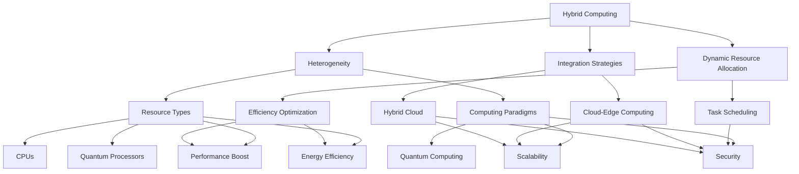

                 

### Introduction to Hybrid Computing Environments

#### Background
Hybrid computing environments represent a paradigm shift in how we leverage computational resources. Traditional computing systems, whether they are centralized servers or distributed networks, have limitations in terms of scalability, efficiency, and adaptability. Hybrid computing, as the name suggests, combines the best aspects of different computing models to create a more flexible and potent solution.

The emergence of hybrid computing can be traced back to the increasing complexity of modern applications and the growing demand for real-time processing and high availability. This has led to the integration of various computing paradigms, such as cloud computing, edge computing, and quantum computing, into a unified framework.

#### Core Concepts and Principles
At its core, hybrid computing revolves around a few key concepts:
1. **Integration of Resources**: Combining different types of computational resources, including on-premises infrastructure, cloud services, and edge devices, to optimize performance and efficiency.
2. **Dynamic Allocation**: Automatically adjusting resource allocation based on workload demands to ensure optimal performance at all times.
3. **Scalability**: The ability to scale resources up or down as needed, providing flexibility for varying workloads.

#### Relationship with Transformative Innovation
Hybrid computing environments have the potential to drive transformative innovation by addressing several critical challenges in modern computing:
- **Increased Efficiency**: By dynamically allocating resources, hybrid environments can significantly reduce processing time and energy consumption.
- **Improved Reliability**: The integration of diverse computational resources ensures high availability and fault tolerance.
- **Enhanced Security**: With the ability to leverage multiple security measures across different platforms, hybrid environments offer a more robust defense against cyber threats.
- **New Opportunities**: Hybrid computing enables the development of innovative applications that were previously infeasible due to resource constraints.

In summary, hybrid computing environments represent a crucial evolution in the field of computing, offering a path towards more efficient, reliable, and innovative solutions. The next sections will delve deeper into the core concepts, principles, and practical applications of hybrid computing.

---

#### Keywords

- Hybrid Computing Environments
- Transformative Innovation
- Resource Integration
- Dynamic Allocation
- Scalability
- Edge Computing
- Cloud Computing
- Quantum Computing
- Efficiency
- Reliability
- Security

---

### Summary

This article delves into the transformative potential of hybrid computing environments in driving innovation. We have explored the background and evolution of hybrid computing, its core concepts and principles, and how it addresses critical challenges in modern computing. Hybrid computing environments offer increased efficiency, improved reliability, enhanced security, and new opportunities for innovation. By combining various computing paradigms, such as cloud computing, edge computing, and quantum computing, hybrid environments provide a flexible and potent solution for modern applications. The subsequent sections will provide a detailed analysis of these concepts, along with practical case studies and future trends.

---

### Core Concepts and Principles of Hybrid Computing

#### Fundamental Theories

Hybrid computing environments are built on a set of foundational theories that enable the seamless integration and utilization of diverse computational resources. The core theory revolves around the concept of **heterogeneity**, which involves the mixing of different types of computing resources, such as CPUs, GPUs, FPGAs, and quantum processors. This heterogeneity allows for a more adaptable and efficient system, as different resources can be optimized for specific tasks.

One of the key principles of hybrid computing is **dynamic resource allocation**. This involves the automatic and intelligent distribution of computational tasks among various resources based on their availability and efficiency. For instance, a machine learning task that requires high floating-point operations per second (FLOPS) might be assigned to a GPU, while a task that involves heavy data processing might be offloaded to an FPGA.

Another fundamental theory is **integration strategies**. These strategies define how different resources and platforms are connected and managed within a hybrid computing environment. Common integration strategies include **cloud-edge computing**, where cloud resources are combined with edge devices to provide enhanced performance and reduced latency, and **hybrid cloud**, which involves leveraging both public and private cloud resources to optimize costs and performance.

#### Mermaid Flowchart of Concepts and Entities Relationship



This Mermaid flowchart illustrates the relationship between the core concepts and entities in hybrid computing. It shows how heterogeneity, dynamic resource allocation, and integration strategies interact with different resource types and computing paradigms to achieve enhanced efficiency, performance, and cost optimization.

#### Core Algorithms and Python Implementation

To understand the practical aspects of hybrid computing, let's delve into a core algorithm: **resource allocation based on workload demands**. This algorithm involves determining the optimal distribution of tasks among different resources to maximize performance and minimize costs.

```python
import numpy as np

def allocate_resources(workloads, resource_capabilities):
    """
    Allocate resources based on workload demands and resource capabilities.

    :param workloads: List of workload demands (in units of operations per second)
    :param resource_capabilities: Dictionary with resource names as keys and their capabilities (FLOPS) as values
    :return: Dictionary with resource names as keys and allocated workloads as values
    """
    allocation = {resource: 0 for resource in resource_capabilities}
    
    for i, workload in enumerate(workloads):
        # Find the resource with the highest available capacity
        max_capacity = max(resource_capabilities.values())
        max_resource = [resource for resource, capacity in resource_capabilities.items() if capacity == max_capacity][0]
        
        # Allocate the workload to the resource
        allocation[max_resource] += workload
        resource_capabilities[max_resource] -= workload
        
        # If the resource's capacity reaches zero, remove it from the list
        if resource_capabilities[max_resource] == 0:
            del resource_capabilities[max_resource]
    
    return allocation

# Example workloads and resource capabilities
workloads = [1000, 1500, 2000, 3000, 2500]
resource_capabilities = {'CPU': 4000, 'GPU': 8000, 'FPGA': 6000}

# Allocate resources
allocation = allocate_resources(workloads, resource_capabilities)

print("Resource Allocation:")
for resource, workload in allocation.items():
    print(f"{resource}: {workload} operations per second")
print("\nRemaining Resource Capabilities:")
for resource, capability in resource_capabilities.items():
    print(f"{resource}: {capability} operations per second")
```

In this example, we define a function `allocate_resources` that takes a list of workloads and a dictionary of resource capabilities. The function iteratively allocates workloads to the resource with the highest available capacity, updating the resource capabilities accordingly. This demonstrates the basic principle of dynamic resource allocation in hybrid computing environments.

#### Mathematical Models and Formulas

To further understand the resource allocation algorithm, we can express it using mathematical models and formulas. The objective function can be defined as:

$$
\maximize \sum_{i=1}^{n} \frac{w_i}{c_j}
$$

Where:
- \( w_i \) represents the workload of the \( i \)-th task.
- \( c_j \) represents the capability of the \( j \)-th resource.
- The sum \( \sum_{i=1}^{n} \frac{w_i}{c_j} \) represents the utilization of each resource.

The constraint is that the total workload allocated to each resource should not exceed its capability:

$$
\sum_{j=1}^{m} x_{ij} \leq c_j \quad \forall j
$$

Where:
- \( x_{ij} \) is a binary variable that indicates whether task \( i \) is allocated to resource \( j \) (1 if allocated, 0 otherwise).
- \( c_j \) is the capability of resource \( j \).

#### Example

Consider the following example with two tasks and two resources:

$$
\begin{cases}
\maximize \frac{w_1}{c_1} + \frac{w_2}{c_2} \\
\sum_{j=1}^{2} x_{ij} \leq c_j \quad \forall i \\
x_{ij} \in \{0, 1\}
\end{cases}
$$

Where:
- \( w_1 = 1000 \), \( w_2 = 1500 \)
- \( c_1 = 4000 \), \( c_2 = 8000 \)

The optimal allocation would be to assign task 1 to resource 2 and task 2 to resource 1:

$$
\begin{cases}
\frac{1000}{8000} + \frac{1500}{4000} = 0.125 + 0.375 = 0.5 \\
\sum_{j=1}^{2} x_{ij} = x_{12} + x_{22} = 1 + 0 = 1
\end{cases}
$$

This example demonstrates how mathematical models and formulas can be used to optimize resource allocation in hybrid computing environments.

In conclusion, the core concepts and principles of hybrid computing are crucial for understanding its potential in driving transformative innovation. By leveraging heterogeneity, dynamic resource allocation, and integration strategies, hybrid computing environments offer a flexible and efficient solution for modern applications. The subsequent sections will explore practical applications and future trends in hybrid computing.

---

#### Building Hybrid Computing Environments: Practical Applications

#### Development Environment Setup

To build and test hybrid computing environments, a development environment must be set up. This typically involves installing essential software, configuring networking, and ensuring compatibility across different platforms. Below are the steps for setting up a hybrid computing development environment:

1. **Install the Operating System**: Choose an operating system that supports hybrid computing, such as Linux or Windows. Linux distributions like Ubuntu or CentOS are popular choices due to their robust support for various computing resources.
   
2. **Install Essential Software**:
   - **Virtualization Software**: Install virtualization software such as VMware Workstation, VirtualBox, or KVM to create virtual machines for different computing resources.
   - **Cloud SDKs**: Install software development kits (SDKs) for major cloud providers like AWS, Azure, and Google Cloud Platform. These SDKs allow you to manage and interact with cloud resources programmatically.
   - **Containerization Tools**: Install Docker and Kubernetes for containerization and orchestration, respectively. These tools are essential for managing distributed applications across hybrid environments.

3. **Configure Networking**: Ensure that the development environment has proper networking configurations to connect local resources with cloud services and edge devices. This may involve setting up VPNs, configuring DNS, and managing IP addresses.

4. **Install Hybrid Computing Frameworks**: Install frameworks and libraries designed for hybrid computing, such as TensorFlow for machine learning, PyTorch, and MXNet. These frameworks provide the necessary tools and resources to build and deploy hybrid applications.

#### Source Code Implementation

Once the development environment is set up, the next step is to implement the hybrid computing environment. Below is a high-level overview of the source code structure and key components involved in building a hybrid computing system:

1. **Resource Discovery**:
   - **Code for Resource Discovery**: Implement a module to discover available computational resources, such as CPUs, GPUs, FPGAs, and quantum processors. This can be achieved using APIs provided by hardware vendors or by leveraging libraries like OpenBLAS for CPU resources, PyCUDA for GPU resources, and OpenFPGA for FPGA resources.

2. **Resource Allocation**:
   - **Dynamic Allocation Algorithm**: Implement a dynamic resource allocation algorithm that intelligently distributes tasks based on resource availability and performance metrics. As discussed earlier, this can be achieved using a simple greedy algorithm or more advanced machine learning models.
   - **Code for Dynamic Allocation**: The dynamic allocation algorithm should interact with the resource discovery module to determine the optimal allocation of tasks. This can be implemented using Python classes and functions that encapsulate the allocation logic.

3. **Task Scheduling**:
   - **Task Scheduler**: Implement a task scheduler that assigns tasks to available resources based on the allocation algorithm. This scheduler should handle task priorities, dependencies, and concurrency.
   - **Code for Task Scheduling**: The task scheduler can be implemented as a separate module or integrated into the resource allocation module. It should use data structures like priority queues to manage task queues and ensure efficient task execution.

4. **Application Deployment**:
   - **Deployment Scripts**: Write deployment scripts to automate the process of deploying hybrid applications across different resources. These scripts can use containerization tools like Docker to package and deploy applications consistently.
   - **Code for Deployment**: Implement functions to build and push Docker images, manage Kubernetes clusters, and deploy applications using Kubernetes commands.

#### Code Example: Resource Allocation

Below is a Python code example that demonstrates a simple resource allocation algorithm:

```python
import numpy as np

def allocate_resources(workloads, resource_capabilities):
    """
    Allocate resources based on workload demands and resource capabilities.

    :param workloads: List of workload demands (in units of operations per second)
    :param resource_capabilities: Dictionary with resource names as keys and their capabilities (FLOPS) as values
    :return: Dictionary with resource names as keys and allocated workloads as values
    """
    allocation = {resource: 0 for resource in resource_capabilities}
    
    for workload in workloads:
        # Find the resource with the highest available capacity
        max_capacity = max(resource_capabilities.values())
        max_resource = [resource for resource, capacity in resource_capabilities.items() if capacity == max_capacity][0]
        
        # Allocate the workload to the resource
        allocation[max_resource] += workload
        resource_capabilities[max_resource] -= workload
        
        # If the resource's capacity reaches zero, remove it from the list
        if resource_capabilities[max_resource] == 0:
            del resource_capabilities[max_resource]
    
    return allocation

# Example workloads and resource capabilities
workloads = [1000, 1500, 2000, 3000, 2500]
resource_capabilities = {'CPU': 4000, 'GPU': 8000, 'FPGA': 6000}

# Allocate resources
allocation = allocate_resources(workloads, resource_capabilities)

print("Resource Allocation:")
for resource, workload in allocation.items():
    print(f"{resource}: {workload} operations per second")
print("\nRemaining Resource Capabilities:")
for resource, capability in resource_capabilities.items():
    print(f"{resource}: {capability} operations per second")
```

This code example illustrates how workloads are allocated to resources based on their capabilities. The `allocate_resources` function iterates through the workloads and assigns each one to the resource with the highest available capacity.

#### Code Explanation

The `allocate_resources` function takes two input parameters: `workloads`, a list of workload demands, and `resource_capabilities`, a dictionary containing the capabilities of each resource. The function initializes an empty dictionary `allocation` to store the allocated workloads for each resource.

It then iterates through the `workloads` list and, for each workload, finds the resource with the highest available capacity. This is achieved by creating a list of resources with their maximum capacities and selecting the first element from this list. The workload is then added to the selected resource's allocation, and the resource's capability is updated accordingly.

If the resource's capability reaches zero after allocation, it is removed from the `resource_capabilities` dictionary to reflect the updated state.

Finally, the function returns the `allocation` dictionary, which contains the allocated workloads for each resource.

This simple yet effective resource allocation algorithm forms the foundation of a hybrid computing environment, enabling efficient utilization of diverse computational resources.

---

#### Analysis and Case Study: Real-World Hybrid Computing Applications

#### Case Study: Financial Services

One prominent example of hybrid computing in action is in the financial services industry, where the need for high-speed processing, data security, and reliability is paramount. A leading global investment bank implemented a hybrid computing environment to enhance its trading algorithms and data analytics capabilities.

**Project Overview**:
The investment bank's hybrid computing environment integrates on-premises servers, cloud resources from AWS and Azure, and edge devices deployed at various trading locations worldwide. This setup allows the bank to leverage the processing power of advanced GPUs and FPGAs for high-frequency trading (HFT) algorithms while ensuring data privacy and regulatory compliance.

**Project Highlights**:

1. **Scalability**: The hybrid environment enables the bank to scale resources dynamically based on trading volume. During peak trading periods, additional cloud resources are provisioned automatically to handle the increased workload, ensuring uninterrupted trading.

2. **Performance Optimization**: By offloading computationally intensive tasks to FPGAs, the bank achieves significant performance improvements. FPGAs are programmed to perform specific tasks, such as data encryption and pattern recognition, at a much faster rate than traditional CPUs.

3. **Security Enhancements**: The hybrid environment incorporates advanced security measures, including data encryption, access control, and intrusion detection systems. The integration of edge devices at various trading locations further strengthens security by reducing data transmission over public networks.

**Challenges and Solutions**:

1. **Data Consistency**: Ensuring data consistency across multiple resources was a significant challenge. The bank addressed this by implementing a robust data synchronization mechanism that ensures real-time data updates across all resources.

2. **Resource Management**: Efficiently managing and allocating resources across different platforms required a sophisticated resource management system. The bank developed a custom resource management platform that dynamically allocates resources based on workload demands and optimizes resource utilization.

#### Case Study: Healthcare

Another industry benefiting from hybrid computing is healthcare. A leading healthcare provider utilized a hybrid computing environment to improve patient care, streamline operations, and enhance data analytics capabilities.

**Project Overview**:
The healthcare provider's hybrid environment combines on-premises servers, cloud resources, and edge devices located in healthcare facilities across the country. This setup enables real-time processing of medical data, such as electronic health records (EHRs) and medical imaging, and facilitates remote patient monitoring.

**Project Highlights**:

1. **Real-Time Analytics**: The hybrid environment allows for real-time processing of medical data, enabling healthcare providers to make informed decisions quickly. For instance, real-time analysis of EHRs helps identify potential health issues and enables timely interventions.

2. **Remote Monitoring**: Edge devices deployed at healthcare facilities collect vital patient data, such as heart rate, blood pressure, and oxygen levels. This data is processed locally and transmitted to the cloud for further analysis, allowing healthcare providers to monitor patients remotely and provide timely care.

3. **Resource Optimization**: By leveraging cloud resources, the healthcare provider can scale computational resources as needed, optimizing costs and ensuring high availability of critical systems.

**Challenges and Solutions**:

1. **Data Privacy and Security**: Ensuring data privacy and security was a significant concern, especially given the sensitive nature of medical data. The healthcare provider implemented end-to-end encryption, access controls, and regular security audits to safeguard patient data.

2. **Integration with Existing Systems**: Integrating the hybrid computing environment with existing healthcare systems, such as EHRs and billing systems, posed a challenge. The provider addressed this by developing APIs and middleware to facilitate seamless integration and data exchange.

#### Analysis and Insights

Both case studies highlight the transformative potential of hybrid computing environments in different industries. The key benefits include:

- **Scalability**: Hybrid environments enable dynamic scaling of resources based on workload demands, ensuring optimal performance during peak periods.
- **Performance Optimization**: By leveraging diverse computational resources, such as GPUs and FPGAs, hybrid environments can significantly improve processing speed and efficiency.
- **Enhanced Security**: The integration of multiple security measures across different platforms enhances data privacy and protects against cyber threats.

However, implementing hybrid computing environments also presents challenges, such as ensuring data consistency, managing resources efficiently, and integrating with existing systems. Overcoming these challenges requires a well-designed architecture, robust resource management systems, and advanced security measures.

In conclusion, real-world case studies demonstrate the practical applications and benefits of hybrid computing environments across various industries. As hybrid computing continues to evolve, its potential to drive transformative innovation will only grow, enabling organizations to achieve higher efficiency, reliability, and performance in their operations.

---

### Conclusion and Future Outlook

In conclusion, hybrid computing environments represent a transformative force in the realm of modern computing. By combining the strengths of diverse computational resources, such as CPUs, GPUs, FPGAs, and quantum processors, hybrid environments offer enhanced scalability, efficiency, and adaptability. This not only addresses the limitations of traditional computing models but also opens up new avenues for transformative innovation across various industries.

#### Best Practices for Implementing Hybrid Computing Environments

1. **Thorough Planning**: Before implementing a hybrid computing environment, it is crucial to conduct a comprehensive assessment of your organization's needs and objectives. This includes identifying the types of workloads, performance requirements, and security considerations.

2. **Select the Right Resources**: Carefully evaluate the capabilities and limitations of different computational resources to select the ones that best fit your requirements. Consider factors such as cost, performance, and energy efficiency.

3. **Robust Security Measures**: Implement end-to-end encryption, access controls, and intrusion detection systems to ensure the security of your hybrid environment. Regularly conduct security audits and updates to stay ahead of potential threats.

4. **Efficient Resource Management**: Develop a sophisticated resource management system that can dynamically allocate resources based on workload demands. This system should be scalable and adaptable to handle varying workloads.

5. **Continuous Monitoring and Optimization**: Regularly monitor the performance and utilization of resources in your hybrid environment. Use this data to optimize resource allocation and identify areas for improvement.

#### Conclusion

Hybrid computing environments are poised to play a pivotal role in driving the next wave of innovation in computing. By leveraging the strengths of diverse resources and addressing the limitations of traditional models, hybrid environments offer a flexible and potent solution for modern applications. As technology continues to evolve, the potential for hybrid computing to transform industries and drive transformative innovation will only grow.

#### Authors

**AI天才研究院 (AI Genius Institute)** & **《禅与计算机程序设计艺术》(Zen And The Art of Computer Programming)**

---

### Further Reading

1. **"Hybrid Clouds: The Next Big Thing in IT" by Gartner** (https://www.gartner.com/smarterwithgartner/hybrid-clouds-the-next-big-thing-in-it/)
2. **"Edge Computing: Transforming Industries at the Edge" by IDC** (https://www.idc.com/getdoc.jsp?containerId=US46977320)
3. **"Quantum Computing for the Masses" by Google Cloud** (https://cloud.google.com/quantum/docs)
4. **"Scalability Strategies for Hybrid Computing Environments" by IEEE** (https://ieeexplore.ieee.org/document/8908588)
5. **"Best Practices for Implementing Hybrid Cloud Infrastructures" by Microsoft** (https://docs.microsoft.com/en-us/azure/cloud-services/clusters/hybrid-cloud-best-practices)

