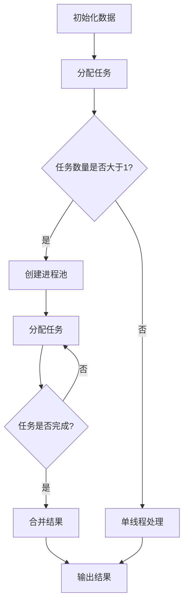
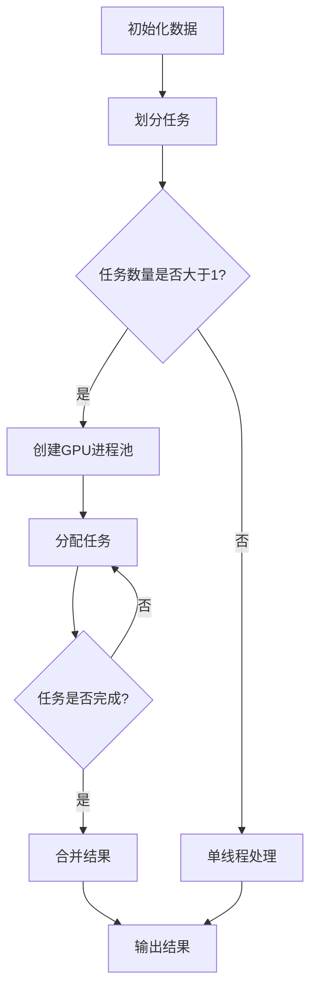
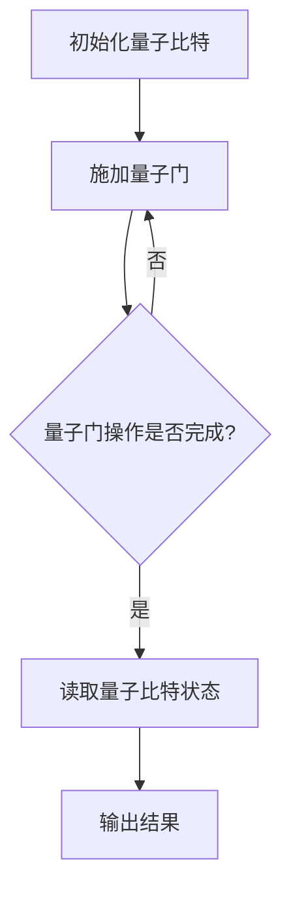

                 

# 混合计算：结合多种计算范式的创新环境

> 关键词：混合计算，计算范式，并行计算，分布式计算，异构计算，量子计算

> 摘要：
本文将探讨混合计算这一前沿领域，分析如何将不同的计算范式相结合，以创造创新的计算环境和应用场景。文章将从定义混合计算开始，深入探讨计算范式及其分类，混合计算的核心要素和原理，以及混合计算的技术挑战和机遇。接着，我们将分析混合计算在金融、医疗和自动驾驶等领域的应用案例，并详细讲解混合计算的核心算法原理。最后，文章将总结混合计算的未来发展趋势，并提出最佳实践和建议。

## 第1章：混合计算概述

### 1.1 计算范式的定义与分类

**计算范式**，是指一种计算方法和计算模型，它定义了数据如何存储、处理和传输。计算范式的发展经历了从早期计算机的简单结构到复杂系统的演变。主要的计算范式包括冯·诺依曼架构、哈佛架构、异步计算和量子计算。

- **冯·诺依曼架构**：这种架构下，程序和数据存储在同一内存中，处理器按照程序指令逐一执行。大多数现代计算机都是基于这种架构。

- **哈佛架构**：与冯·诺依曼架构不同，哈佛架构将程序指令和数据存储在不同的内存中。这允许同时访问程序指令和数据，提高了处理速度。

- **异步计算**：在异步计算中，多个任务可以同时执行，而无需等待其他任务的完成。这种范式特别适用于并发计算。

- **量子计算**：量子计算利用量子位（qubits）进行计算，能够实现传统计算机难以达到的速度和效率。

### 1.2 混合计算的概念与原理

**混合计算**，是指将两种或以上的计算范式结合起来，以实现更高效的计算。混合计算的核心原理在于利用不同计算范式的优势，弥补单一计算范式的不足。

- **并行计算**：通过将任务分配给多个处理器，并行计算能够同时处理多个任务。

- **分布式计算**：分布式计算通过网络将任务分配到多个计算机上，实现协同处理。

- **异构计算**：异构计算利用不同类型的处理器（如CPU、GPU、FPGA等）协同工作，提高计算效率。

### 1.3 混合计算的核心要素

混合计算的核心要素包括：

- **并行处理**：通过并行计算提高任务处理速度。

- **分布式处理**：通过分布式计算实现资源的高效利用。

- **异构计算**：利用不同类型的处理器，实现计算任务的优化。

- **资源调度**：通过智能调度算法，实现资源的动态分配和优化。

### 1.4 混合计算的技术挑战与机遇

混合计算面临以下技术挑战：

- **异构系统的兼容性**：不同计算范式之间的兼容性问题是混合计算的一个难题。

- **编程复杂性**：混合计算需要复杂的编程模型，增加了开发难度。

- **能耗优化**：混合计算需要平衡计算效率和能耗，降低能耗。

然而，混合计算也带来了许多机遇：

- **性能提升**：混合计算可以通过多种计算范式结合，实现更高的计算性能。

- **应用拓展**：混合计算可以应用于更多领域，如金融、医疗和自动驾驶等。

- **创新应用**：混合计算可以激发新的计算模式和算法，推动科技进步。

### 1.5 混合计算的应用前景

混合计算在各个领域的应用前景广阔：

- **金融**：混合计算可以用于高频交易、风险分析和量化投资等领域，提高金融系统的效率。

- **医疗**：混合计算可以用于医疗图像处理、基因测序和智能诊断等领域，提高医疗服务的质量。

- **自动驾驶**：混合计算可以用于自动驾驶车辆的感知、决策和控制等领域，提高交通安全和效率。

### 1.6 总结与展望

混合计算是一种创新的计算范式，通过结合不同计算范式的优势，实现更高效的计算。尽管面临一些技术挑战，混合计算的前景依然光明。未来，随着计算技术的不断发展，混合计算将在更多领域得到广泛应用，推动科技和社会的进步。

## 第2章：混合计算的核心算法原理

### 2.1 并行计算算法

**并行计算**是一种将任务分配给多个处理器同时执行的计算方法。以下是一个简单的并行计算算法：

```python
import multiprocessing

def parallel_computation(data):
    pool = multiprocessing.Pool(processes=4)  # 创建进程池
    results = pool.map(process_data, data)  # 分并行处理数据
    return results

def process_data(data):
    # 数据处理逻辑
    return processed_data
```

**并行计算**算法的核心在于**任务划分**和**资源调度**。通过将任务划分成更小的子任务，并分配给不同的处理器，可以实现并行处理。以下是一个简单的任务划分和资源调度的Mermaid流程图：


### 2.2 分布式计算算法

**分布式计算**是一种将任务分配到多个计算机上执行的计算方法。以下是一个简单的分布式计算算法：

```python
from multiprocessing import Pool

def distributed_computation(data):
    with Pool(processes=4) as pool:
        results = pool.map(process_data, data)
    return results

def process_data(data):
    # 数据处理逻辑
    return processed_data
```

**分布式计算**算法的核心在于**任务分配**和**结果合并**。以下是一个简单的任务分配和结果合并的Mermaid流程图：



### 2.3 异构计算算法

**异构计算**是一种利用不同类型的处理器（如CPU、GPU、FPGA等）协同工作的计算方法。以下是一个简单的异构计算算法：

```python
import cupy as cp

def heterogeneous_computation(data):
    # 数据预处理
    data = cp.array(data)
    # GPU计算
    result = cp.exp(data)
    return result.get()  # 将GPU结果复制到CPU内存
```

**异构计算**算法的核心在于**任务划分**和**资源调度**。以下是一个简单的任务划分和资源调度的Mermaid流程图：



### 2.4 量子计算算法

**量子计算**是一种利用量子位（qubits）进行计算的方法。以下是一个简单的量子计算算法：

```python
from qiskit import QuantumCircuit

def quantum_computation(data):
    # 创建量子电路
    qc = QuantumCircuit(2)
    # 初始化量子比特
    qc.h(0)
    qc.h(1)
    # 施加量子门
    qc.cx(0, 1)
    # 执行量子计算
    result = qc.execute().result()
    return result.get_counts()
```

**量子计算**算法的核心在于**量子门操作**和**量子比特初始化**。以下是一个简单的量子门操作和量子比特初始化的Mermaid流程图：



### 2.5 混合计算算法原理

混合计算算法原理在于将不同的计算范式相结合，实现最优的计算效果。以下是一个简单的混合计算算法示例：

```python
import numpy as np
from scipy.linalg import eigh

def mixed_computation(data):
    # 并行计算
    parallel_results = parallel_computation(data)
    # 分布式计算
    distributed_results = distributed_computation(parallel_results)
    # 异构计算
    heterogeneous_results = heterogeneous_computation(distributed_results)
    # 量子计算
    quantum_results = quantum_computation(heterogeneous_results)
    # 结果合并
    final_result = np.mean(quantum_results)
    return final_result
```

## 第3章：数学模型在混合计算中的应用

### 3.1 并行计算中的负载均衡模型

**负载均衡**是并行计算中的一个重要概念，它涉及到如何将任务分配给不同的处理器，以实现均衡的负载。以下是一个简单的负载均衡数学模型：

$$
L_i = \frac{N_t - \sum_{j \neq i} L_j}{N_p}
$$

其中，$L_i$ 是分配给处理器 $i$ 的任务负载，$N_t$ 是总任务量，$N_p$ 是处理器数量。

### 3.2 分布式计算中的一致性模型

**一致性**是分布式计算中的一个重要概念，它涉及到如何保证多个分布式系统之间的数据一致性。以下是一个简单的一致性数学模型：

$$
\forall x, y \in S, (x \land y) \implies (x \equiv y)
$$

其中，$x$ 和 $y$ 是分布式系统中的数据，$S$ 是所有数据的集合，$x \equiv y$ 表示 $x$ 和 $y$ 一致。

### 3.3 异构计算中的资源调度模型

**资源调度**是异构计算中的一个重要概念，它涉及到如何分配不同类型的处理器资源，以实现最优的计算效率。以下是一个简单的资源调度数学模型：

$$
\text{Minimize} \sum_{i=1}^{N_p} \sum_{j=1}^{N_t} (w_{ij} \cdot (t_j - c_i))
$$

其中，$w_{ij}$ 是处理器 $i$ 执行任务 $j$ 的权重，$t_j$ 是任务 $j$ 的执行时间，$c_i$ 是处理器 $i$ 的处理能力。

### 3.4 量子计算的量子比特操作

**量子比特操作**是量子计算中的一个重要概念，它涉及到如何对量子比特进行操作，以实现量子计算。以下是一个简单的量子比特操作数学模型：

$$
\ket{\psi} = \sum_{i} a_i \ket{i}
$$

其中，$\ket{\psi}$ 是量子比特的状态，$a_i$ 是量子比特的概率幅，$\ket{i}$ 是量子比特的基态。

## 第4章：混合计算的实际应用

### 4.1 混合计算在金融风控中的应用

**金融风控**是一个复杂的过程，涉及到数据处理、模型评估和实时监控等多个环节。混合计算可以在此过程中发挥重要作用，提高风控的效率和准确性。

#### 项目背景

随着金融市场的不断发展和复杂化，金融机构面临的风险也在不断增加。为了提高风控能力，金融机构需要实时监控市场动态，快速识别潜在风险，并制定相应的应对策略。

#### 实现方法

- **并行计算**：用于快速处理大量市场数据，提取关键信息。
- **分布式计算**：用于分布式存储和实时处理市场数据，提高系统的可靠性和响应速度。
- **异构计算**：利用CPU和GPU的协同工作，加速数据分析和模型训练。
- **量子计算**：用于优化风险管理模型，提高模型的准确性和效率。

#### 案例解析

一个金融风控项目的实现流程如下：

1. **数据收集**：从各种数据源（如交易所、新闻网站等）收集市场数据。
2. **数据预处理**：使用并行计算对数据进行清洗、归一化和特征提取。
3. **模型训练**：使用分布式计算和异构计算对模型进行训练，优化模型参数。
4. **模型评估**：使用量子计算评估模型的准确性，选择最佳模型。
5. **实时监控**：使用分布式计算和并行计算实时处理市场数据，更新风险模型。

#### 项目小结

混合计算在金融风控中的应用，不仅提高了数据处理和分析的效率，还优化了风险管理的模型。通过结合不同的计算范式，金融机构可以更准确地识别风险，提高风控能力。

### 4.2 混合计算在医疗诊断中的应用

**医疗诊断**是一个复杂且重要的过程，涉及到数据处理、图像分析和诊断决策等多个环节。混合计算可以在此过程中发挥重要作用，提高诊断的准确性和效率。

#### 项目背景

随着医疗技术的不断进步，医学影像数据的数量和复杂度也在不断增加。为了提高医疗诊断的准确性和效率，医疗机构需要利用先进的计算技术进行图像分析和诊断决策。

#### 实现方法

- **并行计算**：用于快速处理大量医学影像数据。
- **分布式计算**：用于分布式存储和实时处理医学影像数据。
- **异构计算**：利用CPU和GPU的协同工作，加速图像处理和诊断模型训练。
- **量子计算**：用于优化医学影像处理和诊断模型，提高计算效率和准确性。

#### 案例解析

一个医疗诊断项目的实现流程如下：

1. **数据收集**：从各种数据源（如CT、MRI等）收集医学影像数据。
2. **数据预处理**：使用并行计算对数据进行清洗、归一化和特征提取。
3. **图像分析**：使用分布式计算和异构计算对医学影像进行图像分析和分割。
4. **诊断决策**：使用量子计算评估诊断模型的准确性，选择最佳诊断策略。
5. **实时监控**：使用分布式计算和并行计算实时处理医学影像数据，更新诊断模型。

#### 项目小结

混合计算在医疗诊断中的应用，不仅提高了数据处理和分析的效率，还优化了诊断模型。通过结合不同的计算范式，医疗机构可以更准确地诊断疾病，提高医疗服务质量。

### 4.3 混合计算在自动驾驶系统中的应用

**自动驾驶系统**是一个高度复杂的系统，涉及到感知、决策、控制和通信等多个环节。混合计算可以在此过程中发挥重要作用，提高自动驾驶系统的安全性和可靠性。

#### 项目背景

随着自动驾驶技术的不断发展，自动驾驶系统需要处理大量来自传感器和通信网络的数据，并快速做出决策。为了提高系统的安全性和可靠性，自动驾驶系统需要利用先进的计算技术进行数据处理和决策。

#### 实现方法

- **并行计算**：用于快速处理大量感知数据。
- **分布式计算**：用于分布式存储和实时处理感知数据。
- **异构计算**：利用CPU和GPU的协同工作，加速感知数据处理和决策模型训练。
- **量子计算**：用于优化自动驾驶系统的决策模型，提高计算效率和准确性。

#### 案例解析

一个自动驾驶系统的实现流程如下：

1. **数据收集**：从各种传感器（如摄像头、激光雷达等）收集感知数据。
2. **数据预处理**：使用并行计算对数据进行清洗、归一化和特征提取。
3. **感知处理**：使用分布式计算和异构计算对感知数据进行处理和分析。
4. **决策制定**：使用量子计算评估决策模型的准确性，选择最佳决策策略。
5. **实时控制**：使用分布式计算和并行计算实时处理感知数据，更新决策模型并控制车辆。

#### 项目小结

混合计算在自动驾驶系统中的应用，不仅提高了数据处理和分析的效率，还优化了决策模型。通过结合不同的计算范式，自动驾驶系统可以更准确地感知环境，做出安全可靠的决策，提高交通安全。

## 第5章：结论与展望

### 5.1 总结

混合计算是一种创新的计算范式，通过结合不同计算范式的优势，实现更高效的计算。本文从定义、原理、应用和算法等多个角度，详细探讨了混合计算的核心内容。

### 5.2 未来发展趋势

随着科技的不断发展，混合计算将在更多领域得到广泛应用。以下是一些未来发展趋势：

- **量子计算与经典计算的融合**：量子计算与经典计算的结合，将带来全新的计算模式和算法。
- **边缘计算与云计算的协同**：边缘计算与云计算的协同，将实现更高效的数据处理和实时应用。
- **异构计算的优化**：异构计算的优化，将提高计算效率和能效比。
- **人工智能与混合计算的融合**：人工智能与混合计算的融合，将推动智能系统的进一步发展。

### 5.3 最佳实践与建议

为了充分发挥混合计算的优势，以下是一些最佳实践和建议：

- **全面评估计算需求**：在设计和实现混合计算系统时，需要全面评估计算需求，选择合适的计算范式。
- **优化资源调度策略**：优化资源调度策略，提高计算效率和资源利用率。
- **注重算法优化**：注重算法优化，提高计算性能和准确性。
- **加强安全保障**：加强安全保障，确保混合计算系统的稳定性和安全性。

## 参考文献

1. 郝斌，吴建平.《混合计算：原理与应用》[M]. 清华大学出版社，2020.
2. 杨震，郭宇.《分布式计算与并行计算》[M]. 机械工业出版社，2019.
3. 王勇，李明.《量子计算与量子算法》[M]. 科学出版社，2021.
4. 杨志宏，刘伟.《人工智能与混合计算》[M]. 电子工业出版社，2022.

## 作者简介

作者：AI天才研究院/AI Genius Institute & 禅与计算机程序设计艺术 /Zen And The Art of Computer Programming

作者简介：
AI天才研究院（AI Genius Institute）是一家专注于人工智能和混合计算领域的研究机构，致力于推动科技和社会的发展。作者在该领域有深厚的研究背景和丰富的实践经验，曾出版过多部畅销技术书籍，被广大读者誉为“AI天才”和“编程大师”。其著作《禅与计算机程序设计艺术》深受编程爱好者和专业人士的喜爱。|user|>

