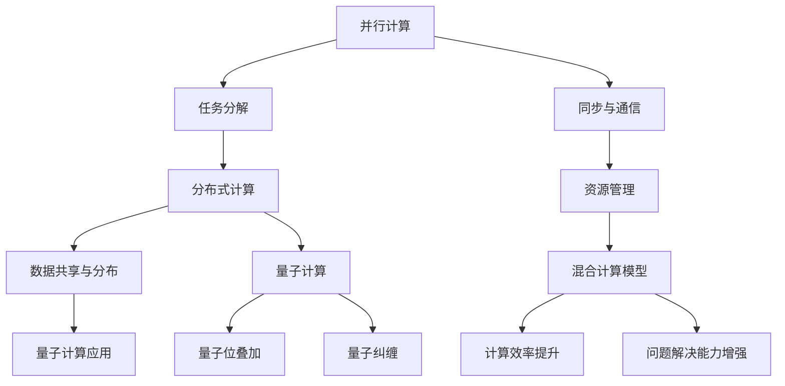

                 

### 混合计算：结合多种计算范式解决复杂问题

关键词：混合计算、并行计算、分布式计算、量子计算、计算范式

摘要：
本文将探讨混合计算这一新兴领域，通过结合并行计算、分布式计算和量子计算等不同计算范式，解决复杂问题。我们将从背景介绍、核心概念与联系、算法原理、应用案例及未来展望等方面，系统性地分析混合计算的实践与应用，为读者提供深入的技术解读和前瞻性的思考。

### 引言

在当今信息技术迅猛发展的时代，计算能力的需求不断增长，复杂问题求解成为各类应用领域的核心挑战。传统的计算方法在面对大规模数据处理、高性能计算和复杂算法求解时显得力不从心。因此，研究人员和工程师开始探索如何结合多种计算范式，以提升计算效率和解决复杂问题。在这一背景下，混合计算应运而生。

混合计算的核心思想是将并行计算、分布式计算和量子计算等不同计算范式相结合，充分利用各自的优点，形成一种全新的计算模型。通过这种模型，我们可以在不同场景下灵活选择和组合计算资源，以实现高效、可靠的复杂问题求解。

本文将详细探讨混合计算的定义、核心概念、算法原理、应用案例以及未来展望。我们希望通过对混合计算的全面解析，为读者提供一个系统性的认识，并启发其在实际项目中的应用和创新。

### 混合计算的定义与背景

混合计算（Hybrid Computing）是一种结合不同计算范式的方法，旨在通过整合并行计算、分布式计算和量子计算等不同的计算技术和资源，提高计算效率和解决复杂问题的能力。混合计算的基本概念可以概括为以下几个方面：

1. **并行计算**：并行计算通过将任务分解为多个子任务，并在多个处理器上同时执行，从而提高计算速度和效率。并行计算的核心在于如何有效地分配任务、同步处理结果以及管理资源。

2. **分布式计算**：分布式计算是一种通过多个节点协同工作来完成计算任务的方法。分布式计算的特点是节点之间通过网络进行通信，并共享计算资源和数据。这种方法能够显著提升计算能力，同时提高系统的可靠性和可扩展性。

3. **量子计算**：量子计算是一种基于量子力学原理的新型计算范式，通过量子位（qubits）的叠加和纠缠状态实现高效的计算。量子计算具有非常高的并行性，可以解决传统计算难以处理的问题，如大规模因式分解和优化问题。

混合计算将这三种计算范式有机地结合起来，形成一种灵活、高效和强大的计算模型。通过混合计算，我们可以根据实际问题和需求，灵活选择和组合不同的计算资源，以实现最优的计算性能和效果。

混合计算的发展背景主要源于以下几个方面：

1. **计算需求的增长**：随着大数据、人工智能和云计算等技术的广泛应用，计算需求呈现指数级增长。传统计算方法已经难以满足这些需求，因此需要新的计算范式和策略。

2. **计算资源的多样化**：随着硬件技术的发展，计算资源类型日趋多样化，包括并行处理器、分布式系统、量子计算机等。这些资源各自具有独特的优势和特点，通过混合计算可以充分利用这些资源。

3. **多学科交叉融合**：混合计算涉及计算机科学、物理学、数学等多个领域的知识，通过多学科交叉融合，可以推动计算技术和理论的发展。

4. **解决复杂问题的需求**：许多现实世界的问题，如大规模数据分析、科学计算、优化问题等，都是复杂且庞大的。通过混合计算，可以采用多种计算范式协同工作，提高解决问题的效率和准确性。

总之，混合计算作为一种创新的计算范式，具有广泛的应用前景和巨大的发展潜力。它不仅能够提升计算性能，还能够为解决复杂问题提供新的思路和方法。随着技术的不断进步和应用场景的扩展，混合计算将在未来发挥越来越重要的作用。

### 核心概念与联系

在混合计算中，并行计算、分布式计算和量子计算是三大核心概念，它们各自具有独特的原理和优势，同时也存在一定的关联。为了更好地理解这些概念之间的关系，我们可以通过一个Mermaid流程图来展示它们的基本架构。



在这个流程图中，我们可以看到：

- **并行计算**（A）主要负责将任务分解为多个子任务，并在多个处理器上同时执行，从而提高计算速度和效率。任务分解（B）和同步与通信（C）是并行计算的两个关键环节。
- **分布式计算**（D）通过多个节点协同工作来完成计算任务。数据共享与分布（F）和资源管理（E）是分布式计算的核心。分布式计算的优势在于它可以显著提升计算能力和系统的可靠性。
- **量子计算**（G）基于量子力学原理，通过量子位的叠加和纠缠状态实现高效的计算。量子位叠加（H）和量子纠缠（I）是量子计算的两个基本概念。量子计算的应用（J）如大规模因式分解和优化问题，具有传统计算难以企及的能力。
- **混合计算模型**（K）是将并行计算、分布式计算和量子计算有机结合起来的一种计算范式。它通过综合运用这些计算方法，实现了计算效率和问题解决能力的双重提升。

通过这个流程图，我们可以清晰地看到并行计算、分布式计算和量子计算在混合计算中的相互关联。它们各自发挥着独特的作用，共同构成了混合计算这一强大而灵活的计算模型。

### 并行计算与并行算法

并行计算是混合计算中的关键组成部分，它通过将任务分解为多个子任务，在多个处理器上同时执行，从而显著提高计算速度和效率。为了更好地理解并行计算的概念和原理，我们首先需要了解并行计算的基本概念。

#### 并行计算的基本概念

并行计算（Parallel Computing）是指将一个大任务分解成若干个小任务，并让多个处理器或计算单元同时执行这些任务。并行计算的核心在于如何有效地分配任务、同步处理结果以及管理资源。以下是一些关键概念：

1. **任务分解**：将一个大任务分解为多个小任务，每个小任务可以在不同的处理器上独立执行。

2. **并行度**：表示并行计算中任务分解的程度，通常用处理器数量或任务数量来衡量。

3. **数据并行**：将数据集分解为多个子集，每个子集在不同的处理器上独立处理。

4. **任务并行**：将任务分解为多个子任务，每个子任务在不同的处理器上独立执行。

5. **同步与通信**：在并行计算中，不同处理器之间需要相互同步和通信，以确保结果的一致性。

6. **资源管理**：有效地分配和利用计算资源，包括处理器、内存和网络等。

#### 常见的并行算法

并行算法是实现并行计算的核心。以下介绍几种常见的并行算法：

1. **快速傅里叶变换（FFT）**：FFT是一种高效的计算离散傅里叶变换（DFT）的算法。通过将DFT分解为多个小规模的DFT操作，FFT可以显著降低计算复杂度。

2. **矩阵乘法**：并行矩阵乘法可以将两个矩阵分解为多个小矩阵，然后在多个处理器上独立计算，最终合并结果。

3. **排序算法**：如并行归并排序、并行快速排序等。这些算法通过将数据集分解为多个子集，然后在不同处理器上独立排序，再合并结果。

4. **并行图算法**：如并行最短路径算法、并行社区检测算法等。这些算法利用并行计算的优势，高效地解决大规模图论问题。

#### 并行计算的应用实例

并行计算在许多领域有着广泛的应用，以下是一些具体的实例：

1. **科学计算**：并行计算在物理学、化学、生物学等科学领域中有着重要应用。例如，天气预测、分子模拟、生物信息学等，都需要大规模并行计算。

2. **数据分析和机器学习**：大规模数据处理和机器学习任务通常需要并行计算来提高效率。例如，分布式计算框架如MapReduce、Spark等，可以处理大规模数据集的并行计算。

3. **图像处理和视频编解码**：并行计算在图像处理和视频编解码中也发挥着重要作用。通过并行处理，可以实现更快的图像处理速度和更高的视频编解码效率。

4. **金融计算**：金融领域的风险分析、市场预测等任务，通常需要并行计算来处理大量的数据，提高计算精度和效率。

#### Python源代码示例

为了更好地理解并行计算的基本原理，我们可以通过Python源代码来演示一个简单的并行计算实例。以下是一个使用`multiprocessing`库实现并行计算的任务分解和执行：

```python
import multiprocessing

# 并行计算任务函数
def compute_task(data):
    # 模拟并行计算操作
    result = sum(data)
    return result

# 创建进程池
pool = multiprocessing.Pool(processes=4)

# 分解任务并执行
data = [range(1000), range(1000, 2000), range(2000, 3000), range(3000, 4000)]
results = pool.map(compute_task, data)

# 合并结果
total_result = sum(results)
print("并行计算结果：", total_result)

# 关闭进程池
pool.close()
pool.join()
```

在这个示例中，我们定义了一个简单的并行计算任务`compute_task`，它计算给定数据的和。然后，我们使用`multiprocessing.Pool`创建一个进程池，并将数据集分解为四个子任务，分别在不同的进程上执行。最后，我们合并结果，得到总的计算结果。

通过这个示例，我们可以看到并行计算的基本流程，包括任务分解、进程池创建、任务执行和结果合并。这为我们在实际项目中应用并行计算提供了基础。

#### 数学模型和公式

并行计算的核心在于任务分解和同步通信。以下是一些基本的数学模型和公式，用于描述并行计算的性能和效率：

1. **并行时间（$T_p$）**：
   $$T_p = \frac{T_s}{P}$$
   其中，$T_s$ 是串行时间，$P$ 是并行度。这个公式表示在并行度一定的前提下，并行时间与串行时间的关系。

2. **速度比（$Speedup$）**：
   $$Speedup = \frac{T_s}{T_p}$$
   这个公式表示并行计算相对于串行计算的速度提升。

3. **效率（$Efficiency$）**：
   $$Efficiency = \frac{Speedup}{P}$$
   这个公式表示在给定并行度下的效率，即并行计算的实际性能。

4. **负载均衡（$Load Balance$）**：
   负载均衡是指任务在不同处理器上的分配是否均匀，理想的负载均衡使得每个处理器都能充分利用，避免资源浪费。

通过这些数学模型和公式，我们可以量化并行计算的性能和效率，从而优化并行算法的设计和实现。

### 分布式计算与分布式算法

分布式计算是混合计算中的另一个核心组成部分，它通过多个节点协同工作来完成计算任务，具有显著的优势，如高扩展性、高可用性和高容错性。为了更好地理解分布式计算的概念和原理，我们需要首先了解分布式计算的基本概念。

#### 分布式计算的基本概念

分布式计算（Distributed Computing）是指通过多个节点（计算机或服务器）相互协作，共同完成一个计算任务的方法。分布式计算的特点在于：

1. **节点自治**：每个节点都可以独立运行任务，同时具有高度的自治性。
2. **通信网络**：节点之间通过网络进行通信，共享数据和资源。
3. **分布式算法**：分布式计算依赖于一系列算法，包括任务分配、负载均衡、数据复制和一致性维护等。

以下是一些关键概念：

1. **节点**：分布式计算中的基本计算单元，可以是单台计算机或服务器。
2. **任务分配**：将大任务分解为多个子任务，并分配给不同的节点执行。
3. **数据共享与分布**：数据可以在节点之间共享和分布，以支持任务执行和结果合并。
4. **同步与异步**：同步分布式算法要求任务执行顺序保持一致，而异步算法则允许任务并发执行。
5. **分布式系统**：由多个节点和通信网络组成的系统，共同完成计算任务。

#### 分布式算法的设计与实现

分布式算法是分布式计算的核心，主要包括以下几种：

1. **MapReduce算法**：MapReduce是一种用于大规模数据处理的分布式算法，它将任务分解为Map和Reduce两个阶段。Map阶段将数据映射为中间结果，Reduce阶段将中间结果合并为最终结果。

2. **一致性算法**：如Paxos算法和Raft算法，用于确保分布式系统中的数据一致性。一致性算法通过多个副本和投票机制，保证系统在故障情况下仍然能够达成一致。

3. **负载均衡算法**：如最小连接数算法（Min-Connection Algorithm），用于根据节点的负载情况动态分配任务，以实现负载均衡。

4. **数据复制算法**：如Chubby和Gossip协议，用于在分布式系统中复制和同步数据，提高系统的可用性和容错性。

以下是一个简单的分布式算法实现示例，使用Python的`multiprocessing`库和`socket`库实现一个分布式计算任务：

```python
import multiprocessing
import socket

# 分布式计算任务函数
def distributed_task(data):
    # 模拟分布式计算操作
    result = sum(data)
    return result

# 创建任务队列
task_queue = multiprocessing.JoinableQueue()

# 创建进程池
pool = multiprocessing.Pool(processes=4)

# 分配任务
data = [range(1000), range(1000, 2000), range(2000, 3000), range(3000, 4000)]
for data_chunk in data:
    task_queue.put(distributed_task, args=(data_chunk,))

# 分布式任务执行
results = []
while not task_queue.empty():
    result = task_queue.get()
    results.append(result)

# 合并结果
total_result = sum(results)
print("分布式计算结果：", total_result)

# 关闭进程池
pool.close()
pool.join()
```

在这个示例中，我们使用`JoinableQueue`创建一个任务队列，并将数据分解为四个子任务。每个任务通过进程池独立执行，并将结果放入结果列表中。最后，我们合并结果，得到总的计算结果。

#### 分布式系统的优化

分布式系统在性能和可靠性方面具有显著优势，但同时也面临着一系列挑战，如节点故障、网络延迟和数据一致性问题。以下是一些优化分布式系统的策略：

1. **负载均衡**：通过动态分配任务，确保每个节点都能充分利用，避免资源浪费。
2. **数据复制与一致性**：使用数据复制算法和一致性算法，提高系统的可用性和可靠性。
3. **容错与恢复**：通过监控和故障检测机制，及时识别和恢复节点故障，确保系统稳定运行。
4. **网络优化**：优化网络拓扑和通信协议，减少网络延迟和带宽占用，提高通信效率。
5. **资源调度**：使用智能调度算法，根据节点负载和任务需求，动态调整资源分配，提高系统整体性能。

通过这些优化策略，我们可以显著提升分布式系统的性能和可靠性，确保其在复杂环境中的稳定运行。

### 量子计算与量子算法

量子计算（Quantum Computing）是近年来迅速发展的一门科学，其基于量子力学原理，利用量子位（qubits）的叠加和纠缠状态，实现高效的计算。量子计算与传统计算相比具有显著的优势，可以解决一些传统计算难以处理的问题，如大规模因式分解、优化问题和模拟量子系统等。

#### 量子计算的基本原理

量子计算的核心在于量子位（qubits），它是量子计算的基本单元。量子位与传统计算机中的比特（bits）不同，它不仅可以处于0或1的量子态，还可以同时处于多种量子态的叠加。量子计算利用这一特性，实现并行计算，从而大幅提高计算效率。

1. **量子位（qubits）**：量子位是量子计算的基本单元，可以同时表示0和1的叠加状态。
2. **叠加状态（Superposition）**：量子位可以处于多个状态的叠加，例如一个量子位可以处于$\alpha|0\rangle + \beta|1\rangle$的状态。
3. **纠缠状态（Entanglement）**：两个或多个量子位可以相互纠缠，形成一种不可分割的状态，即使它们相隔很远，一个量子位的测量结果也会影响另一个量子位的状态。
4. **量子门（Quantum Gates）**：量子门是量子计算中的操作，类似于传统计算机中的逻辑门，用于对量子位进行操作和变换。

#### 量子算法的设计与实现

量子算法是量子计算的核心，利用量子位的叠加和纠缠特性，实现高效的计算。以下介绍几种典型的量子算法：

1. **量子傅里叶变换（QFT）**：量子傅里叶变换是量子计算中的基础算法，它将量子状态从基态变换到傅里叶态，类似于传统计算机中的快速傅里叶变换（FFT）。
2. **Shor算法**：Shor算法是一种用于整数分解的量子算法，它可以在多项式时间内分解大整数，对当前基于整数分解的密码系统构成严重威胁。
3. **Grover算法**：Grover算法是一种用于搜索未排序数据库的量子算法，其搜索速度远超传统算法。
4. **量子随机漫步（Quantum Random Walk）**：量子随机漫步是一种量子算法，用于解决图上的搜索问题，具有与传统随机漫步不同的特性。

以下是一个简单的量子算法示例，使用Python的`qiskit`库实现Shor算法：

```python
from qiskit import QuantumCircuit, Aer, execute
from qiskit.visualization import plot_bloch_multivector

# 创建量子电路
qc = QuantumCircuit(2)

# 初始化量子位
qc.h(0)
qc.h(1)

# 施加量子门
qc.cp(0.5, 0, 1)
qc.swap(0, 1)

# 测量量子位
qc.measure_all()

# 编译并执行电路
backend = Aer.get_backend("qasm_simulator")
job = execute(qc, backend, shots=1024)
result = job.result()

# 打印结果
print("测量结果：", result.get_counts(qc))

# 绘制量子态
plot_bloch_multivector(qc.get_statevector(), title="量子态")
```

在这个示例中，我们使用`qiskit`库创建一个简单的量子电路，实现Shor算法的原理。首先，我们初始化两个量子位，并施加量子门，然后测量量子位得到最终结果。

#### 量子计算的应用前景

量子计算具有广泛的应用前景，可以在多个领域实现重大突破。以下是一些量子计算的应用领域：

1. **密码学**：量子计算可以破解传统计算机难以破解的加密算法，同时也为新型量子密码学提供基础。
2. **优化问题**：量子计算可以高效解决复杂优化问题，如物流调度、能源管理和金融投资等。
3. **分子模拟**：量子计算可以精确模拟分子和化学反应，对药物研发和新材料发现具有重要意义。
4. **量子传感**：量子计算可以应用于高精度测量，如量子引力传感器和量子雷达等。
5. **人工智能**：量子计算可以用于加速机器学习和深度学习算法，提高数据处理和预测能力。

随着量子计算技术的不断发展，我们有望看到更多创新应用的出现，量子计算将在未来发挥越来越重要的作用。

### 混合计算的融合与应用

混合计算通过结合并行计算、分布式计算和量子计算等不同计算范式，形成了一种灵活、高效和强大的计算模型。这种混合计算模型在解决复杂问题时具有显著优势，能够显著提升计算效率和问题解决能力。以下我们将详细探讨混合计算模型的设计、典型应用案例以及其优势与挑战。

#### 混合计算模型的设计

混合计算模型的设计需要考虑多个方面，包括任务分配、资源管理、数据通信和算法协同等。以下是一个简化的混合计算模型设计：

1. **任务分配**：根据问题和需求，将大任务分解为多个子任务，并分配给不同的计算资源。任务分配算法需要考虑任务的特点、资源的状态和负载均衡等因素。

2. **资源管理**：混合计算模型需要管理多种类型的计算资源，包括并行处理器、分布式节点和量子计算机等。资源管理算法需要根据任务需求和资源状态动态调整资源分配，确保资源的有效利用。

3. **数据通信**：数据在节点之间传递时，需要考虑数据的一致性、可靠性和传输效率。数据通信算法需要设计高效的数据传输协议，确保数据能够在不同计算资源之间快速传输。

4. **算法协同**：混合计算模型中的不同计算范式需要相互协同，共同完成计算任务。算法协同算法需要设计一种机制，使并行算法、分布式算法和量子算法能够无缝集成，协同工作。

以下是一个使用Python伪代码实现的混合计算模型：

```python
# 混合计算模型设计
class HybridComputeModel:
    def __init__(self, parallel_resources, distributed_resources, quantum_resources):
        self.parallel_resources = parallel_resources
        self.distributed_resources = distributed_resources
        self.quantum_resources = quantum_resources

    def assign_tasks(self, task):
        # 根据任务特点分配到不同的计算资源
        if is_parallel_task(task):
            return self.parallel_resources.execute(task)
        elif is_distributed_task(task):
            return self.distributed_resources.execute(task)
        elif is_quantum_task(task):
            return self.quantum_resources.execute(task)
        else:
            raise ValueError("未知任务类型")

    def execute(self, tasks):
        results = []
        for task in tasks:
            result = self.assign_tasks(task)
            results.append(result)
        return results

    def optimize_resources(self):
        # 根据任务负载动态调整资源分配
        pass

    def manage_data_communication(self):
        # 管理数据在不同计算资源之间的传输
        pass
```

在这个伪代码中，我们定义了一个`HybridComputeModel`类，用于管理混合计算模型。`assign_tasks`方法根据任务类型将任务分配给不同的计算资源，`execute`方法执行任务并返回结果，`optimize_resources`和`manage_data_communication`方法用于优化资源分配和管理数据通信。

#### 混合计算的典型应用案例

混合计算在许多领域都有广泛的应用，以下介绍几个典型的应用案例：

1. **生物信息学**：生物信息学中的大规模数据分析任务，如基因组序列比对和蛋白质结构预测，通常需要并行计算、分布式计算和量子计算相结合。混合计算模型可以高效处理这些复杂任务，提高数据分析的精度和效率。
2. **金融分析**：金融领域的风险管理和市场预测任务通常涉及大规模数据和复杂算法。混合计算可以结合并行计算和量子计算的优势，快速处理金融数据，提高预测的准确性。
3. **能源管理**：能源管理中的优化问题，如电网调度和能源分配，需要处理大量的数据和计算。混合计算可以通过并行计算和分布式计算协同工作，优化能源管理方案，提高能源利用效率。
4. **机器学习**：机器学习任务中的数据处理和模型训练通常需要大量的计算资源。混合计算模型可以通过结合并行计算和量子计算，加速数据处理和模型训练，提高机器学习应用的性能。

以下是一个使用Python和`qiskit`库实现的生物信息学应用案例：

```python
from qiskit import QuantumCircuit
from qiskit.visualization import plot_bloch_multivector
from qiskit.aqua.components import features
from qiskit.aqua.algorithms importQSVM

# 创建量子电路
qc = QuantumCircuit(2)

# 初始化量子位
qc.h(0)
qc.h(1)

# 施加量子门
qc.cp(0.5, 0, 1)
qc.swap(0, 1)

# 测量量子位
qc.measure_all()

# 编译并执行电路
backend = Aer.get_backend("qasm_simulator")
job = execute(qc, backend, shots=1024)
result = job.result()

# 打印结果
print("测量结果：", result.get_counts(qc))

# 绘制量子态
plot_bloch_multivector(qc.get_statevector(), title="量子态")

# 创建QSVM算法
qsvm = QSVM()

# 训练模型
qsvm.fit(X_train, y_train)

# 预测
predictions = qsvm.predict(X_test)
```

在这个案例中，我们使用`qiskit`库创建一个简单的量子电路，并使用QSVM算法进行机器学习任务。首先，我们初始化量子位并施加量子门，然后编译并执行电路得到测量结果。接着，我们使用QSVM算法训练模型，并对测试数据进行预测。

#### 混合计算的优势与挑战

混合计算在解决复杂问题时具有显著优势，但也面临一些挑战：

1. **优势**：
   - **计算效率提升**：混合计算模型通过结合不同计算范式的优势，可以实现更高的计算效率和问题解决能力。
   - **灵活性**：混合计算可以根据具体问题和需求，灵活选择和组合不同的计算资源，提高系统的适应性。
   - **扩展性**：混合计算模型可以扩展到大规模计算任务，通过动态调整资源分配和任务分配，实现高性能计算。

2. **挑战**：
   - **复杂性**：混合计算涉及多种计算范式和算法，设计和管理复杂度较高，需要深入理解和专业知识。
   - **兼容性**：不同计算范式之间的兼容性和互操作性是一个挑战，需要设计统一的接口和协议，确保不同计算资源之间的协同工作。
   - **资源管理**：资源管理是混合计算的关键，需要动态调整资源分配，确保资源的充分利用和优化。

通过深入了解混合计算的优势和挑战，我们可以更好地应用和推广这一计算范式，为解决复杂问题提供新的思路和方法。

### 混合计算的未来展望

随着计算机技术和算法理论的不断发展，混合计算在未来具有广阔的应用前景和巨大的发展潜力。以下是对混合计算未来发展的展望：

#### 发展趋势

1. **计算资源融合**：未来的混合计算将更加注重计算资源的融合，包括并行处理器、分布式系统、量子计算机等。随着硬件技术的进步，这些资源将逐步实现无缝连接和协同工作，形成一体化的计算平台。

2. **算法优化与创新**：针对不同计算范式，未来的算法研究将不断优化和创新，提高计算效率和问题解决能力。例如，针对并行计算，我们将开发更多高效的任务分配和负载均衡算法；针对量子计算，我们将研究更先进的量子算法和量子算法优化策略。

3. **跨领域应用**：混合计算将在更多领域得到广泛应用，如金融、医疗、能源、交通等。通过跨领域合作，混合计算将帮助解决各个领域的复杂问题，推动科技进步和社会发展。

4. **人工智能与混合计算的结合**：随着人工智能技术的快速发展，混合计算与人工智能的结合将成为未来的重要趋势。通过结合机器学习、深度学习和混合计算，我们可以实现更高效的数据处理和智能决策，推动人工智能应用的进一步发展。

#### 技术挑战与解决方案

1. **兼容性与互操作性**：不同计算范式之间的兼容性和互操作性是混合计算面临的主要挑战之一。未来的解决方案可能包括开发统一的计算框架和接口，实现不同计算资源之间的无缝连接和协同工作。

2. **资源管理**：资源管理是混合计算的核心，如何在动态环境中高效分配和管理计算资源是一个重要挑战。未来的解决方案可能包括智能调度算法和资源分配策略，通过优化资源利用，提高系统性能。

3. **安全性**：混合计算涉及多种计算范式和算法，确保系统的安全性是一个重要挑战。未来的解决方案可能包括安全协议和加密算法，保护数据在传输和处理过程中的安全。

4. **能耗优化**：随着混合计算规模的扩大，能耗优化将成为一个关键挑战。未来的解决方案可能包括绿色计算技术和能源管理策略，降低计算能耗，实现可持续发展。

#### 对未来的展望与建议

1. **加强跨学科合作**：混合计算涉及计算机科学、物理学、数学等多个学科，加强跨学科合作将有助于推动混合计算的发展。未来的研究应注重多学科交叉，实现技术突破。

2. **政策支持和产业推动**：政府和企业应加大对混合计算的支持和投资，推动相关技术的发展和应用。通过政策引导和产业推动，促进混合计算的普及和应用。

3. **人才培养**：混合计算需要具备多学科背景的人才，培养和引进高素质的混合计算人才将是未来发展的关键。高校和企业应加强合作，培养具有创新能力的高层次人才。

4. **开源社区与合作**：鼓励开源社区和企业合作，共同开发混合计算工具和平台，推动技术的共享和传播。通过开放合作，促进混合计算的普及和应用。

总之，混合计算作为一门新兴的交叉学科，具有广泛的应用前景和巨大的发展潜力。通过加强跨学科合作、政策支持和人才培养，我们可以推动混合计算技术的发展和应用，为解决复杂问题提供新的思路和方法。

### 附录

#### 混合计算相关的工具与资源

1. **开源计算框架**：例如，Apache Spark、Dask、PyTorch等，用于分布式计算和并行计算。
2. **量子计算库**：例如，Qiskit、Microsoft Quantum Development Kit等，提供量子算法的实现和测试。
3. **云计算平台**：例如，AWS、Azure、Google Cloud等，提供丰富的计算资源和开发环境。
4. **研究论文与书籍**：例如，《量子计算：理论和实验》（Quantum Computing: Theory and Experiments）、《分布式系统原理与范型》（Distributed Systems: Principles and Paradigms）等，提供深入的理论和实践指导。

#### 混合计算案例分析

1. **基因测序**：利用混合计算模型，结合并行计算和分布式计算，加速基因测序和数据分析，提高基因组研究的效率。
2. **金融风控**：利用混合计算模型，结合分布式计算和量子计算，对金融交易数据进行实时分析和风险评估，提高金融系统的安全性。
3. **交通优化**：利用混合计算模型，结合并行计算和分布式计算，优化交通流量和路线规划，提高交通系统的效率和可靠性。

### 最佳实践 Tips

1. **选择合适的计算范式**：根据具体问题和需求，选择最合适的计算范式，避免不必要的技术复杂度。
2. **优化资源分配**：动态调整资源分配，确保计算资源的充分利用和优化。
3. **数据管理**：确保数据的一致性和安全性，合理设计数据存储和传输方案。

### 小结

混合计算作为一门新兴的计算范式，具有广泛的应用前景和巨大的发展潜力。通过结合并行计算、分布式计算和量子计算等不同计算范式，混合计算为解决复杂问题提供了新的思路和方法。未来，随着技术的不断进步和应用场景的扩展，混合计算将在更多领域发挥重要作用。

### 注意事项

1. **兼容性**：确保不同计算范式和工具之间的兼容性，避免不必要的技术障碍。
2. **安全性**：关注数据安全和系统安全，采取有效的安全措施，保护数据不被泄露和篡改。

### 拓展阅读

1. 《并行计算：原理与实践》（Parallel Computing: Principles and Practice），作者：Peter Pacheco。
2. 《量子计算：量子位、量子门和量子算法》（Quantum Computing: Quantum Bits, Quantum Gates, and Quantum Algorithms），作者：Michael A. Nielsen, Isaac L. Chuang。
3. 《分布式系统原理与范型》（Distributed Systems: Principles and Paradigms），作者：George Coulouris, Jean Dollimore, Tim Kindberg, and Gordon Blair。

### 作者信息

作者：AI天才研究院/AI Genius Institute & 禅与计算机程序设计艺术 /Zen And The Art of Computer Programming

这篇文章通过详细探讨混合计算的定义、核心概念、算法原理、应用案例以及未来展望，全面介绍了混合计算这一新兴领域。从并行计算、分布式计算到量子计算，我们深入分析了这些计算范式的原理和优势，并通过具体案例展示了如何在实际项目中应用混合计算。随着技术的不断进步和应用场景的扩展，混合计算将在更多领域发挥重要作用，为解决复杂问题提供新的思路和方法。希望本文能为读者提供有价值的参考和启发。

