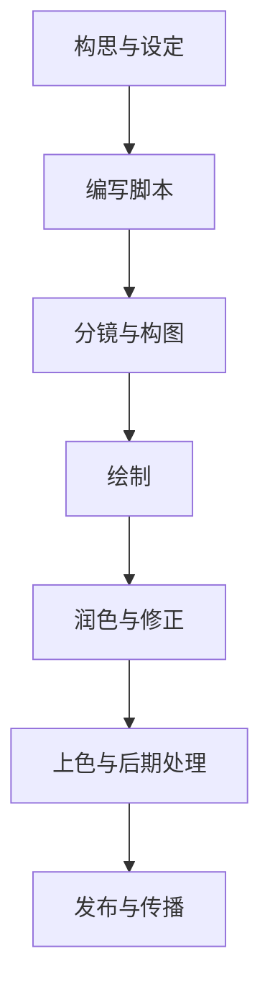

                 

### 引言

#### 漫画与动画的起源与发展

漫画与动画作为两种视觉艺术形式，其起源可以追溯到古代壁画和手抄本等艺术形式。最早的漫画雏形出现在19世纪的欧洲，主要以讽刺画和连环漫画的形式存在。到了20世纪，随着印刷技术和媒体产业的发展，漫画逐渐成为一种大众娱乐形式。日本漫画（又称“动漫”）在20世纪后半叶崛起，成为全球文化的重要组成部分。

动画作为一种动态的视觉艺术，起源于19世纪末的欧洲。早期的动画作品主要通过手工绘制逐帧制作。随着技术的进步，动画制作逐渐实现了自动化，从传统的手绘动画发展到今天的三维动画、CGI动画等。动画不仅在娱乐产业中占据重要地位，还广泛应用于教育、广告和商业等领域。

#### 本书的目的与结构

本书旨在探讨漫画与动画的艺术价值和图像叙事的力量。通过系统的分析和实例讲解，本书将帮助读者深入了解漫画与动画的历史发展、艺术特点、图像叙事技巧和创作实践。具体来说，本书分为以下几大部分：

1. **漫画与动画的艺术价值探讨**：介绍漫画与动画的艺术价值，包括艺术特点、图像叙事力量及其在当代文化中的地位。
2. **图像叙事技巧分析**：深入分析漫画与动画中的图像叙事技巧，包括视觉叙事语言、图像构图与视角、情感表达与视觉冲击等。
3. **漫画创作实践**：讲解漫画创作的基本流程，包括角色设定、故事构思、分镜与视觉表现等。
4. **动画制作技巧分析**：介绍动画制作的基本流程，包括动画帧与运动规律、特效与色彩运用等。
5. **漫画与动画案例分析**：通过经典漫画和动画案例，分析其艺术价值、图像叙事技巧和创作实践。
6. **图像叙事在跨媒体创作中的应用**：探讨图像叙事在跨媒体创作中的运用，包括影视、游戏等领域。
7. **总结与展望**：总结漫画与动画的艺术价值和发展趋势，并提出对创作者的启示和建议。

通过本书的学习，读者将能够系统地了解漫画与动画的艺术价值，掌握图像叙事技巧，并具备创作实践的能力。无论是漫画爱好者、动画从业者，还是相关专业的学生，本书都将提供宝贵的知识和经验。

### 目录大纲

以下为本书的目录大纲，涵盖从漫画与动画的艺术价值探讨，到图像叙事技巧分析，再到创作实践和跨媒体应用等各个方面，为读者提供全面而深入的阅读体验。

#### 目录大纲

**第1章 漫画与动画的艺术价值探讨**
- **1.1 艺术价值的定义与评价**
  - 艺术价值的基本概念
  - 漫画与动画的艺术评价标准
- **1.2 漫画与动画的艺术特点**
  - 漫画的艺术特点
  - 动画的艺术特点
- **1.3 图像叙事的力量**
  - 图像叙事的基本原理
  - 图像叙事在漫画与动画中的应用
- **1.4 漫画与动画在当代文化中的地位**
  - 漫画与动画的文化影响力
  - 当代社会的漫画与动画生态

**第2章 图像叙事技巧分析**
- **2.1 视觉叙事语言**
  - 视觉符号与叙事表达
  - 视觉语言的多样性与统一性
- **2.2 图像构图与视角**
  - 构图的基本原则
  - 视角选择的叙事效果
- **2.3 情感表达与视觉冲击**
  - 情感表达在图像叙事中的重要性
  - 视觉冲击的创造与运用
- **2.4 叙事节奏与叙事结构**
  - 叙事节奏的掌握
  - 叙事结构的类型与应用

**第3章 漫画创作实践**
- **3.1 漫画创作的基本流程**
  - 故事构思与角色设定
  - 分镜与脚本编写
  - 画稿与润色
- **3.2 角色设定与故事构思**
  - 角色设定的基本原则
  - 故事构思的方法与技巧
- **3.3 漫画分镜与视觉表现**
  - 分镜的基本原理
  - 视觉表现的艺术性
- **3.4 漫画出版与传播**
  - 漫画出版的流程
  - 漫画的传播渠道与影响力

**第4章 动画制作技巧分析**
- **4.1 动画制作的基本流程**
  - 从故事板到最终成片
  - 动画制作的分工与合作
- **4.2 动画帧与运动规律**
  - 帧与动画的基本概念
  - 动作的流畅性与节奏
- **4.3 特效与色彩运用**
  - 特效的类型与应用
  - 色彩在动画中的表现力
- **4.4 动画节奏与叙事效果**
  - 动画节奏的把握
  - 叙事效果的提升

**第5章 漫画与动画案例分析**
- **5.1 经典漫画案例分析**
  - 几部经典漫画的剖析
  - 艺术价值与图像叙事技巧
- **5.2 先进动画案例分析**
  - 先进动画的技术与艺术
  - 案例分析的艺术价值
- **5.3 案例分析与艺术价值探讨**
  - 不同类型案例的对比分析
  - 案例的艺术价值探讨

**第6章 图像叙事在跨媒体创作中的应用**
- **6.1 跨媒体叙事的定义与特点**
  - 跨媒体叙事的基本概念
  - 跨媒体叙事的特点
- **6.2 图像叙事在影视与游戏中的运用**
  - 影视中的图像叙事
  - 游戏中的图像叙事
- **6.3 跨媒体创作的挑战与机遇**
  - 跨媒体创作的挑战
  - 跨媒体创作的机遇

**第7章 总结与展望**
- **7.1 漫画与动画艺术价值总结**
  - 漫画与动画的艺术特点
  - 图像叙事的艺术价值
- **7.2 图像叙事的未来发展趋势**
  - 新技术的发展对图像叙事的影响
  - 图像叙事的未来前景
- **7.3 对创作者的启示与建议**
  - 创作实践的经验分享
  - 艺术与技术的结合

通过以上目录大纲，本书将为读者提供一个全面而深入的漫画与动画艺术探讨，从理论到实践，从艺术价值到技术应用，帮助读者更好地理解这一视觉艺术的魅力。

### 第1章 漫画与动画的艺术价值探讨

#### 1.1 艺术价值的定义与评价

艺术价值是指艺术作品在审美、情感和认知层面上的价值。它不仅仅取决于作品的形式美，还包括作品所传达的思想、情感和社会意义。在漫画与动画领域，艺术价值体现在其独特的视觉语言、丰富的叙事方式和深刻的文化内涵。

评价漫画与动画的艺术价值需要从多个维度进行。首先，形式美是评价的基础。漫画与动画的视觉元素，如线条、色彩、构图等，必须具有吸引力和艺术性。其次，叙事技巧是评价的重要标准。漫画与动画通过图像叙事，讲述故事，传达情感。叙事的流畅性、节奏感和情节设计直接影响作品的艺术价值。最后，文化内涵是漫画与动画艺术价值的深层次体现。作品是否具有独特的文化背景、社会意义和思想深度，是评价其艺术价值的重要依据。

#### 1.2 漫画与动画的艺术特点

漫画与动画的艺术特点主要体现在以下几个方面：

1. **视觉语言丰富多样**：漫画与动画通过丰富的视觉语言，如线条、色彩、构图等，创造出生动的艺术形象。这些视觉元素不仅具有审美价值，还在叙事中起到了关键作用。
2. **叙事方式独特**：漫画与动画通过图像叙事，将故事直观地呈现给观众。图像叙事不仅具有直观性，还能够通过细节和符号传达丰富的情感和思想。
3. **文化内涵深刻**：漫画与动画往往蕴含着深刻的文化内涵，反映了创作者对社会的观察和思考。这种文化内涵不仅体现在故事情节中，还体现在角色设定、场景描绘等细节中。
4. **互动性**：漫画与动画作为一种互动性艺术形式，观众可以通过阅读或观看，主动参与到作品的解读中。这种互动性增强了作品的艺术价值和观赏体验。

#### 1.3 图像叙事的力量

图像叙事是漫画与动画的核心特点之一。图像叙事通过视觉语言传达故事，具有直观、生动和情感丰富的特点。以下是图像叙事的几个关键要素：

1. **视觉符号**：视觉符号是图像叙事的基础。漫画与动画中的图像符号具有明确的象征意义，能够帮助观众快速理解故事和情感。
2. **构图与视角**：构图与视角是图像叙事的重要手段。通过不同的构图和视角，创作者可以创造出不同的视觉效果，增强叙事的节奏感和情感表达。
3. **节奏与结构**：图像叙事的节奏和结构对故事的表达至关重要。合适的节奏和结构能够增强叙事的连贯性和吸引力。
4. **情感表达**：情感表达是图像叙事的核心。通过图像语言，创作者可以传达丰富的情感，使观众产生共鸣。

#### 1.4 漫画与动画在当代文化中的地位

漫画与动画在当代文化中具有重要地位。首先，它们已成为全球文化的重要组成部分，具有广泛的影响力。许多经典的漫画和动画作品不仅在国内受到欢迎，还在国际市场上取得了巨大的成功。

其次，漫画与动画在文化传播中发挥了重要作用。通过漫画与动画，不同国家和地区的文化得以传播和交流。这种文化传播不仅丰富了全球文化的多样性，还促进了不同文化之间的理解和融合。

最后，漫画与动画在当代社会中具有重要的教育意义。它们通过生动的图像和故事，向观众传递知识、价值和思想。这种教育形式不仅具有趣味性，还能够有效地激发观众的学习兴趣。

### 实例讲解

为了更直观地展示漫画与动画的艺术价值，以下通过几个经典案例进行分析：

1. **《海贼王》**：这是一部日本漫画作品，以其独特的视觉风格和深刻的叙事内容赢得了全球读者的喜爱。《海贼王》通过丰富的视觉符号和细腻的情感表达，讲述了一个关于冒险、友谊和梦想的故事。作品中的角色形象鲜明，情节跌宕起伏，具有很高的艺术价值。

2. **《千与千寻》**：这是日本动画大师宫崎骏的作品，以其精美的画面和深刻的主题思想闻名。《千与千寻》通过独特的图像叙事方式，讲述了一个关于成长和自我发现的故事。作品中的场景描绘细腻，情感表达深刻，具有很高的艺术价值。

3. **《进击的巨人》**：这是一部日本漫画作品，以其独特的叙事方式和深刻的社会意义引起了广泛关注。《进击的巨人》通过图像叙事，揭示了人性的复杂性和社会的矛盾。作品中的角色形象生动，情节紧凑，具有很高的艺术价值。

通过这些案例，我们可以看到漫画与动画在艺术价值上的多样性。无论是视觉风格、叙事方式，还是情感表达，漫画与动画都以其独特的魅力影响着全球观众。

### 总结

漫画与动画作为一种视觉艺术形式，具有丰富的艺术价值和独特的叙事力量。通过图像叙事，漫画与动画能够直观地传达故事、情感和思想。在当代文化中，漫画与动画不仅具有广泛的影响力，还在文化传播和教育中发挥着重要作用。通过本章的探讨，我们希望读者能够更好地理解漫画与动画的艺术价值，欣赏这一视觉艺术的魅力。

### 第2章 图像叙事技巧分析

#### 2.1 视觉叙事语言

视觉叙事语言是漫画与动画图像叙事的核心。视觉叙事语言通过视觉符号、构图和视角等手段，传达故事、情感和思想。在漫画与动画创作中，视觉叙事语言的选择和运用直接影响作品的艺术效果和叙事效果。

**视觉符号**：视觉符号是图像叙事的基础。漫画与动画中的视觉符号具有明确的象征意义，如人物的表情、动作、道具和环境等。这些视觉符号不仅能帮助观众快速理解故事情节，还能传达人物的情感状态和内心活动。

**构图**：构图是视觉叙事语言的重要组成部分。通过不同的构图方式，创作者可以传达不同的叙事效果。例如，近景构图可以增强情感表达，远景构图可以展示广阔的场景。构图的选择需要与故事情节和叙事节奏相匹配，以增强叙事效果。

**视角**：视角是漫画与动画中的另一个重要叙事手段。不同的视角可以带来不同的视觉效果和叙事效果。例如，第一人称视角可以增强观众的沉浸感，第三人称视角则可以更客观地展现故事情节。视角的选择需要根据叙事需要和情感表达进行灵活运用。

#### 2.2 图像构图与视角

**图像构图**：图像构图是指画面中各个元素的排列和布局。良好的构图能够使画面更加美观，同时也能够传达更多的叙事信息。

- **基本原则**：构图的基本原则包括对称、平衡、节奏和对比等。对称和平衡能够使画面更加稳定和和谐，节奏和对比则能够增强画面的动态感和视觉冲击力。
- **实际应用**：在实际创作中，创作者可以根据不同的叙事需求，灵活运用这些构图原则。例如，在紧张的场景中，可以使用对比强烈的构图来增强紧张感；在温馨的场景中，可以使用对称和平衡的构图来营造温馨的氛围。

**视角**：视角是指观众在画面中所处的位置。视角的选择直接影响观众的视觉体验和情感感受。

- **第一人称视角**：第一人称视角使观众感受到强烈的代入感，能够更直观地体验角色的情感和动作。这种视角常用于动作片和恐怖片，能够增强紧张感和真实感。
- **第三人称视角**：第三人称视角则提供了一种更客观的视角，能够更全面地展示故事场景和角色之间的关系。这种视角常用于剧情片和科幻片，能够增强叙事的连贯性和观赏性。

**实例分析**：以《千与千寻》为例，该作品通过丰富的视角变化和构图技巧，成功地传达了故事的情感和主题。在电影的开头，通过第一人称视角展示了千寻的日常生活，使观众对角色产生共鸣。在进入神秘世界后，通过第三人称视角展示了千寻的冒险经历，增强了叙事的连贯性和观赏性。

通过图像构图与视角的巧妙运用，漫画与动画创作者能够更有效地传达故事和情感，增强作品的叙事效果。

#### 2.3 情感表达与视觉冲击

**情感表达**：情感表达是漫画与动画图像叙事的核心之一。通过视觉语言，创作者能够传达角色和故事的情感状态，使观众产生共鸣。情感表达不仅体现在角色的表情和动作中，还通过画面构图、色彩运用和氛围营造来实现。

- **面部表情**：面部表情是情感表达的重要手段。漫画与动画中的角色通过细腻的面部表情，传达出复杂的情感，如喜悦、悲伤、愤怒和恐惧等。例如，在《海贼王》中，主角路飞的面部表情丰富多样，生动地表现了他的性格特点。
- **身体动作**：身体动作也是情感表达的重要手段。漫画与动画中的角色通过身体动作，传达出他们的情绪和心理状态。例如，在《进击的巨人》中，主角艾伦通过愤怒的挥拳和紧握拳头等动作，生动地表现了他的愤怒和决心。
- **构图与色彩**：构图与色彩也可以用于情感表达。通过构图的变化和色彩的运用，创作者能够营造不同的氛围，传达情感。例如，在《千与千寻》中，通过使用明亮的色彩和紧凑的构图，营造了温馨的氛围，而在紧张的情节中，则使用暗淡的色彩和宽大的构图，增强了紧张感。

**视觉冲击**：视觉冲击是吸引观众注意力、增强叙事效果的重要手段。通过独特的视觉元素和技巧，创作者能够创造出强烈的视觉冲击力。

- **动态效果**：动态效果是视觉冲击的重要手段。漫画与动画中的动态效果，如镜头切换、动作特效和光影效果等，能够增强画面的动态感和视觉冲击力。例如，在《冰雪奇缘》中，通过使用动态的光影效果和特效，增强了动画的视觉冲击力。
- **特效与色彩**：特效和色彩的运用也是视觉冲击的重要手段。通过使用独特的特效和色彩搭配，创作者能够创造出令人惊叹的画面效果。例如，在《超能陆战队》中，通过使用鲜艳的色彩和独特的特效，创造出了一种充满科技感和未来感的视觉体验。

**实例分析**：以《火影忍者》为例，该作品通过细腻的情感表达和强烈的视觉冲击，成功地吸引了大量观众。在战斗场景中，通过使用动态效果和强烈的色彩对比，增强了画面的视觉冲击力，而在情感表达方面，通过细腻的角色表情和动作，传达出角色的情感和心理状态。

通过情感表达与视觉冲击的巧妙运用，漫画与动画创作者能够更有效地吸引观众的注意力，增强叙事效果，使作品更具魅力。

#### 2.4 叙事节奏与叙事结构

**叙事节奏**：叙事节奏是指故事叙述的速度和频率。合理的叙事节奏能够使故事更加紧凑、有趣，增强观众的观赏体验。叙事节奏的掌握需要创作者对故事情节的安排和视觉语言的运用进行精细调控。

- **慢节奏**：慢节奏叙事常用于表现角色的内心活动、情感变化和细节描绘。通过缓慢的叙事节奏，创作者能够使观众更深入地了解角色的内心世界。例如，在《千与千寻》中，通过慢节奏的叙事，展示了千寻在神秘世界中的探索和成长。
- **快节奏**：快节奏叙事则常用于表现紧张的情节和激烈的动作场面。通过快速的叙事节奏，创作者能够增强故事的紧张感和戏剧性。例如，在《海贼王》中，通过快节奏的叙事，展示了角色在冒险中的激烈战斗和冒险过程。

**叙事结构**：叙事结构是指故事叙述的框架和逻辑。合理的叙事结构能够使故事更加连贯、有逻辑性，增强观众的观赏体验。叙事结构的类型包括线性叙事、非线性叙事、倒叙叙事和插叙叙事等。

- **线性叙事**：线性叙事是一种最常见的叙事结构，故事按照时间顺序依次展开。这种叙事结构使故事更加清晰、易于理解。例如，在《海贼王》中，故事按照主人公路飞在冒险中的经历展开，线性叙事使观众能够轻松跟随故事的发展。
- **非线性叙事**：非线性叙事则是将故事按照不同的时间顺序或逻辑顺序进行叙述。这种叙事结构能够使故事更加丰富、有层次感。例如，在《黑客帝国》中，故事通过非线性叙事，展示了主人公尼奥在现实世界和虚拟世界中的冒险和成长。
- **倒叙叙事**：倒叙叙事则是将故事从结尾开始叙述，逐渐回溯到开头。这种叙事结构能够增加故事的悬念和戏剧性。例如，在《致命魔术》中，通过倒叙叙事，揭示了两个魔术师之间的恩怨和秘密。
- **插叙叙事**：插叙叙事则是将故事的一部分内容插入到主线故事中，使故事更加丰富、有层次感。例如，在《罗马假日》中，通过插叙叙事，展示了公主安妮与记者乔之间的爱情故事。

**实例分析**：以《死亡笔记》为例，该作品通过灵活运用叙事节奏和叙事结构，成功吸引了大量观众。在故事的开头，通过慢节奏的叙事，展示了主人公夜神月的生活和内心世界，使观众对角色产生共鸣。在故事的中间部分，通过快节奏的叙事，展示了夜神月的犯罪行为和侦探的追捕过程，增强了故事的紧张感和戏剧性。在故事的结尾，通过倒叙叙事，揭示了夜神月的过去和动机，使故事更加丰富、有层次感。

通过叙事节奏和叙事结构的巧妙运用，漫画与动画创作者能够使故事更加引人入胜，增强观众的观赏体验。

### 总结

图像叙事技巧是漫画与动画创作中至关重要的一部分。通过视觉叙事语言、图像构图与视角、情感表达与视觉冲击，以及叙事节奏与叙事结构的运用，创作者能够更有效地传达故事、情感和思想。本章通过对这些技巧的详细分析，帮助读者更好地理解漫画与动画的图像叙事魅力。希望读者能够在创作实践中，灵活运用这些技巧，创作出更多优秀的漫画与动画作品。

### 第3章 漫画创作实践

#### 3.1 漫画创作的基本流程

漫画创作是一个复杂而富有创造力的过程，需要创作者在构思、编写、绘制和润色等各个环节中付出大量的努力。以下是漫画创作的基本流程：

**1. 构思与设定**：这是漫画创作的第一步，也是最重要的一步。在这一阶段，创作者需要确定故事的主题、背景、角色和情节。构思的过程通常需要反复推敲和修改，以达到一个完整、有吸引力的故事线。

**2. 编写脚本**：在构思确定后，创作者需要将故事转化为文字脚本。脚本包括对话、描述和场景设定等，是漫画创作的基础。一个优秀的脚本应该能够清晰地传达故事情节，同时为后续的绘制提供指导。

**3. 分镜与构图**：分镜是将脚本中的文字描述转化为具体的画面构图。创作者需要根据脚本，设计每个场景的构图，包括角色的位置、动作和表情等。分镜图不仅为绘制提供了参考，还能够帮助创作者调整叙事节奏和视觉效果。

**4. 绘制**：在完成分镜后，创作者开始进行漫画的绘制。绘制过程需要遵循分镜图的构图和设定，同时加入个人的绘画风格和创意。漫画的绘制通常分为草稿、素描和定稿等多个阶段。

**5. 润色与修正**：绘制完成后，创作者需要对漫画进行润色和修正。这一阶段包括调整色彩、细节和完善画面效果等。润色和修正的目的是使漫画更美观、更符合创作者的预期。

**6. 上色与后期处理**：在上色和后期处理阶段，创作者可以使用各种绘画工具和软件，对漫画进行色彩调整和特效处理。这一阶段对于提升漫画的整体视觉效果至关重要。

#### 3.2 角色设定与故事构思

角色设定是漫画创作中的一个重要环节，直接影响读者的兴趣和故事的吸引力。以下是角色设定和故事构思的几个关键点：

**角色设定**：

- **角色背景**：为角色设定一个独特的背景故事，使角色具有深度和复杂性。背景故事可以包括角色的家庭、成长经历、性格特点等。
- **角色性格**：每个角色都应该具有独特的性格特征，如勇敢、善良、邪恶、狡猾等。性格特征不仅使角色更加生动，还能够帮助创作者更好地塑造故事情节。
- **角色外貌**：角色外貌应该与性格和背景相符，同时具有视觉吸引力。创作者可以通过独特的发型、服装和面部特征来区分不同角色。

**故事构思**：

- **主题**：故事的主题是漫画的核心，决定了故事的深度和意义。创作者需要选择一个有吸引力且具有现实意义的主题，如友情、爱情、勇气、正义等。
- **情节**：情节是故事发展的基础，创作者需要设计一个引人入胜的故事情节，使读者保持阅读的兴趣。情节应该具有冲突、高潮和结局，同时能够传达主题和情感。
- **线索与悬念**：线索和悬念是吸引读者的重要手段。创作者需要在故事中设置线索，引导读者推测故事的发展，同时设置悬念，使读者产生好奇心和期待感。

#### 3.3 漫画分镜与视觉表现

分镜和视觉表现是漫画创作中至关重要的环节，直接影响作品的整体效果和叙事效果。以下是漫画分镜和视觉表现的几个关键点：

**分镜**：

- **场景设定**：分镜图中的场景设定需要与故事情节和角色动作相匹配。创作者需要根据故事内容，设计不同的场景，如室内、室外、自然景观等。
- **动作设计**：动作设计是分镜图的重要组成部分，创作者需要设计角色的动作，使其符合故事情节和角色性格。动作设计需要考虑动作的流畅性、力度和节奏感。
- **视角选择**：视角选择影响观众的视觉体验和叙事效果。创作者需要根据叙事需要，选择合适的视角，如第一人称视角、第三人称视角等。

**视觉表现**：

- **色彩运用**：色彩在漫画中起到渲染氛围和表达情感的重要作用。创作者需要根据故事情节和情感，选择合适的色彩方案，如明亮、暗淡、鲜艳等。
- **构图技巧**：构图技巧是视觉表现的基础，创作者需要运用不同的构图技巧，如对称、平衡、对比等，增强画面的视觉冲击力和叙事效果。
- **细节处理**：细节处理使漫画更加真实、生动。创作者需要注重角色的细节描绘，如服装、饰品、表情等，同时注意场景中的细节，如背景、道具等。

#### 3.4 漫画出版与传播

漫画的出版和传播是漫画创作的重要环节，直接影响作品的受众和市场价值。以下是漫画出版和传播的几个关键点：

**出版**：

- **选题策划**：选题策划是漫画出版的重要环节。出版方需要根据市场需求和读者兴趣，选择具有市场潜力的漫画选题，并进行详细的策划和定位。
- **编辑加工**：编辑加工是确保漫画质量的重要步骤。编辑需要对漫画脚本、分镜和绘制进行细致的审核和修改，确保内容完整、逻辑清晰、画面美观。
- **印刷发行**：印刷发行是漫画出版的重要环节。出版方需要选择合适的印刷厂和发行渠道，确保漫画的印刷质量和发行范围。

**传播**：

- **数字渠道**：随着互联网的发展，数字渠道成为漫画传播的重要途径。出版方可以通过官方网站、在线书店、社交媒体等数字渠道，推广和销售漫画。
- **线下活动**：线下活动是提升漫画知名度和吸引读者的有效手段。出版方可以组织签售会、展览、讲座等活动，与读者互动，增强品牌影响力。
- **合作推广**：与其他媒体和品牌合作推广，是扩大漫画影响力的有效途径。出版方可以与电影、电视剧、游戏等媒体合作，推出相关衍生产品，提升漫画的知名度。

#### 实例讲解

以《海贼王》为例，这是一部全球知名的日本漫画作品，其创作实践具有很高的参考价值。

**角色设定**：在《海贼王》中，角色设定十分丰富，每个角色都有独特的背景故事和性格特点。例如，主角路飞是一个乐观、勇敢、总是为朋友着想的海盗，他的独特性格使他成为了读者喜爱的对象。

**故事构思**：《海贼王》的故事构思非常巧妙，通过层层递进的情节设计，吸引了大量读者。故事的主题是友情、冒险和梦想，情节跌宕起伏，悬念不断。

**分镜与视觉表现**：在分镜和视觉表现方面，《海贼王》采用了多样化的构图技巧和色彩运用，使画面生动、有趣。创作者通过细腻的画面描绘和动态效果，增强了叙事效果。

**出版与传播**：《海贼王》在全球范围内都有很高的知名度，其出版和传播采用了多种渠道。除了传统的漫画出版，还通过官方网站、在线书店、社交媒体等数字渠道进行推广。此外，还与电影、游戏等媒体合作，推出相关衍生产品，扩大了影响力。

通过以上实例讲解，我们可以看到，《海贼王》在漫画创作实践中，从角色设定、故事构思、分镜与视觉表现，到出版与传播，都做到了精细和全面，成为了一部成功的漫画作品。

### 总结

漫画创作是一个复杂而富有创造力的过程，需要创作者在构思、编写、绘制和润色等各个环节中付出大量的努力。通过角色设定、故事构思、分镜与视觉表现，以及出版与传播的实践，创作者能够创作出具有吸引力和艺术价值的漫画作品。本章通过对漫画创作实践的详细分析，帮助读者更好地理解漫画创作的过程和技巧。希望读者能够在创作实践中，不断探索和尝试，创作出更多优秀的漫画作品。

### 第4章 动画制作技巧分析

#### 4.1 动画制作的基本流程

动画制作是一个复杂而系统化的过程，包括多个阶段，每个阶段都有其特定的任务和要求。以下是动画制作的基本流程：

**1. 故事开发与剧本创作**：这是动画制作的起点，创作者需要构思故事大纲，编写详细的剧本。剧本是动画制作的基石，决定了动画的主题、情节、角色和叙事结构。

**2. 分镜与设计**：在剧本确定后，创作者需要根据剧本内容绘制分镜图。分镜图是动画制作的视觉蓝图，它详细描述了每个场景的构图、角色动作和镜头转换等。分镜图不仅为动画制作提供视觉参考，还帮助创作者调整叙事节奏和视觉效果。

**3. 动画制作**：分镜图完成后，动画师开始进行动画制作。动画制作包括角色动画、背景动画、特效动画等。这一阶段需要使用动画软件，如Adobe Animate、Toon Boom Harmony等，通过逐帧绘制或使用关键帧技术，将分镜图转化为动画。

**4. 上色与后期处理**：动画制作完成后，进入上色阶段。上色是将绘制好的线稿覆盖上颜色，为动画添加细节和质感。此外，后期处理包括特效添加、声音设计和剪辑等，这些步骤使动画更具视觉效果和观赏性。

**5. 预览与修正**：动画制作完成后，进行预览和修正。这一阶段包括检查动画的流畅性、色彩准确性和视觉效果等。如果发现任何问题，需要及时进行修正，以确保动画质量。

**6. 发布与传播**：完成动画制作和修正后，动画可以发布到各种平台，如电影院、电视、网络等。此外，动画的传播还可能涉及衍生产品的开发和推广，如玩具、游戏、漫画等。

#### 4.2 动画帧与运动规律

**动画帧**：动画帧是动画制作的基本单位。每一帧都是一个静态的画面，通过连续播放多帧画面，观众感受到的是动态的运动效果。动画帧的数量和质量直接影响动画的流畅性和视觉效果。

**运动规律**：运动规律是动画制作中的关键概念，它描述了物体和角色在运动中的基本规律。以下是一些常见的运动规律：

- **弹性运动**：弹性运动是指物体在受到外力作用后，会进行反弹和回弹的运动。例如，弹簧的伸缩、橡胶带的拉伸等。
- **惯性运动**：惯性运动是指物体在没有外力作用时，会保持原有状态的运动。例如，滚动的轮子会继续滚动，抛出的物体会在空中保持飞行状态。
- **曲线运动**：曲线运动是指物体在运动过程中，沿着曲线轨迹移动。例如，抛物线运动、螺旋运动等。

在动画制作中，创作者需要根据不同的运动规律，设计角色的动作和场景的动态效果。合理的运动规律能够使动画更加自然、真实，增强观众的观赏体验。

#### 4.3 特效与色彩运用

**特效**：特效是动画制作中用于增强视觉效果的技术手段。特效可以模拟自然现象、机械效果、魔法元素等，为动画增添奇幻感和视觉冲击力。常见的特效包括光影效果、爆炸效果、烟雾效果、粒子效果等。

**色彩运用**：色彩在动画中起到渲染氛围和表达情感的重要作用。合理的色彩运用可以使动画更具视觉吸引力，增强叙事效果。以下是一些色彩运用的原则：

- **色彩对比**：色彩对比是增强视觉效果的有效手段。通过使用对比强烈的色彩，可以突出角色和场景，增强视觉冲击力。
- **色彩调和**：色彩调和是指将不同色彩组合在一起，使其相互协调、和谐。合理的色彩调和可以使动画画面更加美观，增强整体的视觉效果。
- **色彩情感表达**：色彩可以表达不同的情感，如红色代表热情、活力和力量，蓝色代表冷静、理智和安宁等。在动画中，创作者可以通过色彩的情感表达，增强故事的氛围和情感传递。

#### 4.4 动画节奏与叙事效果

**动画节奏**：动画节奏是指动画播放的速度和频率。合理的动画节奏可以增强叙事效果，使故事更加引人入胜。以下是一些动画节奏的技巧：

- **快节奏**：快节奏可以增强故事的紧张感和戏剧性。在快节奏的动画中，动作和对话需要紧凑、快速，以保持观众的注意力。
- **慢节奏**：慢节奏可以增强故事的细节描绘和情感表达。在慢节奏的动画中，创作者可以详细展示角色的情感变化和内心活动，使观众更深入地了解角色。
- **节奏变化**：通过节奏的变化，可以增强叙事的层次感和戏剧性。例如，在一个紧张的情节之后，可以使用慢节奏来放松观众的情绪，为下一个情节做铺垫。

**叙事效果**：叙事效果是指动画在传达故事和情感方面的效果。以下是一些提高叙事效果的技巧：

- **情节设计**：通过精心设计的情节，可以增强故事的吸引力和叙事效果。情节应该具有冲突、高潮和结局，使观众保持兴趣。
- **角色塑造**：通过深入的角色塑造，可以增强故事的叙事效果。角色应该具有独特的性格特点和情感变化，使观众能够产生共鸣。
- **视觉叙事**：通过视觉叙事，可以增强故事的传达效果。视觉叙事包括构图、色彩、视角等元素，通过这些元素的运用，可以更好地传达故事和情感。

#### 实例讲解

以《冰雪奇缘》为例，这是一部具有代表性的动画作品，其动画制作技巧在多个方面都值得学习。

**故事开发与剧本创作**：《冰雪奇缘》的故事围绕两位公主艾莎和安娜的冒险展开，主题是勇气、友情和家庭。剧本设计紧凑，情节跌宕起伏，充满了悬念和情感。

**分镜与设计**：在分镜和设计方面，《冰雪奇缘》采用了多样化的构图技巧和视觉元素。创作者通过不同的视角和构图，展示了冰雪王国的奇幻世界，使观众感受到冰雪的魔力和魅力。

**动画制作**：动画制作过程中，《冰雪奇缘》使用了先进的技术和工具，如三维动画和运动捕捉技术，使角色的动作更加自然和真实。同时，创作者通过细腻的动画表现，展现了角色的情感变化和内心活动。

**特效与色彩运用**：在特效和色彩运用方面，《冰雪奇缘》通过光影效果、特效动画和色彩对比，增强了视觉效果。例如，冰雪王国的场景使用了大量的蓝色和白色，营造出寒冷而神秘的氛围。

**动画节奏与叙事效果**：《冰雪奇缘》的动画节奏把握得当，通过快节奏和慢节奏的交替，使故事更加引人入胜。同时，通过视觉叙事和情感表达，增强了故事的叙事效果。

通过以上实例讲解，我们可以看到，《冰雪奇缘》在动画制作技巧方面的成功，不仅在于技术上的创新，还在于对故事和情感表达的深入把握。这些经验对其他动画制作具有很好的借鉴意义。

### 总结

动画制作是一个复杂而系统化的过程，涉及故事开发、剧本创作、分镜设计、动画制作、特效与色彩运用，以及动画节奏与叙事效果等多个方面。通过本章的详细分析，我们了解了动画制作的基本流程和关键技巧。无论是初学者还是专业人士，掌握这些技巧对于创作高质量动画作品都至关重要。希望读者能够在动画制作实践中，不断探索和尝试，创作出更多优秀的动画作品。

### 第5章 漫画与动画案例分析

#### 5.1 经典漫画案例分析

**《龙珠》**

- **背景介绍**：《龙珠》是日本漫画家鸟山明创作的长篇科幻漫画，自1984年开始连载，成为日本漫画的代表作之一。作品以科幻、冒险和战斗为主题，讲述了主角孙悟空和他的朋友们在宇宙中冒险的故事。
- **艺术价值**：《龙珠》以其独特的世界观、丰富的角色设定和紧凑的剧情，吸引了全球众多读者。作品中的角色形象鲜明，战斗场面震撼，具有很高的艺术价值。
- **图像叙事技巧**：《龙珠》通过细腻的画面描绘和动态效果，生动地展现了角色之间的情感和战斗场景。图像叙事技巧包括夸张的动作、鲜明的色彩对比和富有表现力的表情等，使故事更加引人入胜。

**《火影忍者》**

- **背景介绍**：《火影忍者》是日本漫画家岸本齐史创作的长篇漫画，于2002年开始连载。作品以忍者世界为背景，讲述了主角漩涡鸣人成长的故事。
- **艺术价值**：《火影忍者》以其丰富的剧情、深刻的角色塑造和紧张的故事节奏，赢得了众多粉丝的喜爱。作品探讨了友情、勇气、成长等主题，具有很高的艺术价值。
- **图像叙事技巧**：《火影忍者》通过精细的画面描绘和动态效果，展现了忍者世界的奇幻场景和激烈的战斗。图像叙事技巧包括复杂的动作设计、独特的视角选择和富有情感的视觉表达等，增强了故事的吸引力。

**《海贼王》**

- **背景介绍**：《海贼王》是日本漫画家尾田荣一郎创作的长篇漫画，自1997年开始连载。作品以海贼世界为背景，讲述了主角蒙奇·D·路飞追求梦想的故事。
- **艺术价值**：《海贼王》以其独特的世界观、丰富的角色设定和跌宕起伏的剧情，成为了全球最受欢迎的漫画之一。作品探讨了友情、冒险、正义等主题，具有很高的艺术价值。
- **图像叙事技巧**：《海贼王》通过细腻的画面描绘和动态效果，生动地展现了海贼世界的奇幻场景和角色之间的情感。图像叙事技巧包括夸张的动作、鲜明的色彩对比和富有表现力的表情等，使故事更加引人入胜。

#### 5.2 先进动画案例分析

**《千与千寻》**

- **背景介绍**：《千与千寻》是日本动画大师宫崎骏执导的一部动画电影，于2001年上映。作品以一个小女孩千寻的冒险故事为主线，讲述了她在一个神秘世界的经历。
- **艺术价值**：《千与千寻》以其精美的画面、深刻的主题思想和感人的情感表达，赢得了全球观众的一致好评。作品探讨了成长、自我发现、人与自然的关系等主题，具有很高的艺术价值。
- **图像叙事技巧**：《千与千寻》通过细腻的画面描绘和丰富的视觉元素，成功地传达了故事的情感和主题。图像叙事技巧包括独特的场景设计、富有层次感的构图和富有表现力的角色表情等，使故事更加引人入胜。

**《冰雪奇缘》**

- **背景介绍**：《冰雪奇缘》是迪士尼出品的一部动画电影，于2013年上映。作品以两个姐妹公主艾莎和安娜的故事为主线，讲述了一个关于友情、勇气和爱的故事。
- **艺术价值**：《冰雪奇缘》以其精美的画面、动人的音乐和深刻的主题思想，成为了迪士尼的经典之作。作品探讨了友情、家庭、自我认同等主题，具有很高的艺术价值。
- **图像叙事技巧**：《冰雪奇缘》通过丰富的视觉元素和精美的画面，成功地传达了故事的情感和主题。图像叙事技巧包括独特的场景设计、富有层次感的构图和富有表现力的角色表情等，使故事更加引人入胜。

#### 5.3 案例分析与艺术价值探讨

通过对《龙珠》、《火影忍者》、《海贼王》、《千与千寻》和《冰雪奇缘》等经典漫画和动画案例的分析，我们可以看到这些作品在艺术价值上的多样性。以下是这些案例的艺术价值探讨：

1. **独特的视觉风格**：这些作品都拥有独特的视觉风格，通过细腻的画面描绘和动态效果，成功地传达了故事的情感和主题。《龙珠》的漫画风格独特，色彩鲜明；《火影忍者》的战斗场面震撼，场景设计细腻；《海贼王》的画面流畅，视觉元素丰富；《千与千寻》的画面精美，视觉风格独特；《冰雪奇缘》的画面细腻，色彩搭配和谐。
2. **深刻的主题思想**：这些作品都探讨了深刻的主题思想，如友情、勇气、成长、自我发现等。这些主题思想通过图像叙事技巧和角色塑造，使观众在欣赏作品的同时，得到思考和启发。
3. **丰富的叙事技巧**：这些作品在叙事技巧上都有独特的创新。通过图像叙事、角色塑造和情节设计，这些作品成功地吸引了观众的注意力，使故事更加引人入胜。

综上所述，这些经典漫画和动画案例在艺术价值上具有多样性。无论是视觉风格、主题思想还是叙事技巧，这些作品都展示了漫画与动画的丰富魅力。通过分析这些案例，我们可以更好地理解漫画与动画的艺术价值，并在创作实践中不断探索和创新。

### 第6章 图像叙事在跨媒体创作中的应用

#### 6.1 跨媒体叙事的定义与特点

跨媒体叙事是指通过多种媒体形式，如漫画、动画、电影、电视剧、游戏等，共同讲述一个统一的故事。它不同于单一媒体的叙事，而是在多个平台上进行扩展和深化，以吸引更广泛的受众。跨媒体叙事的特点主要体现在以下几个方面：

1. **整合性与多样性**：跨媒体叙事能够整合多种媒体形式，形成多样化的叙事方式。例如，一部漫画可以改编成动画、电影或电视剧，同时还可以推出相关的游戏和衍生产品。
2. **协同效应**：跨媒体叙事能够利用不同媒体的特性和优势，产生协同效应。例如，动画中的角色形象可以通过漫画进一步深化，电影中的情节可以通过电视剧进行补充，从而增强故事的完整性和吸引力。
3. **互动性**：跨媒体叙事通过多种媒体之间的互动，增强观众的参与感和体验感。观众可以在不同媒体平台上参与故事的互动，例如通过游戏角色扩展漫画角色的故事线，或者通过在线平台分享自己的故事和见解。

#### 6.2 图像叙事在影视与游戏中的运用

**在影视中的运用**：

图像叙事在影视创作中具有至关重要的作用。通过视觉语言，影视作品能够直观地传达故事、情感和主题。以下是一些图像叙事在影视中的具体运用：

- **视觉符号**：影视作品中通过视觉符号传达故事和情感。例如，角色表情、动作和道具等，都可以作为视觉符号，帮助观众理解故事的情节和角色的心理状态。
- **构图与视角**：影视作品中的构图和视角选择，直接影响观众的视觉体验和情感感受。通过不同的构图和视角，创作者可以创造出不同的视觉效果和叙事效果。
- **色彩与光线**：色彩和光线在影视创作中起到渲染氛围和表达情感的重要作用。例如，使用明亮的色彩和温暖的光线可以营造温馨的氛围，而使用暗淡的色彩和冷色调则可以增强紧张感和戏剧性。

**在游戏中的运用**：

图像叙事在游戏创作中同样具有重要作用。游戏通过视觉和互动元素，为玩家提供一个沉浸式的叙事体验。以下是一些图像叙事在游戏中的具体运用：

- **角色设计**：游戏中的角色设计直接影响玩家的情感体验。通过独特的角色外貌、动作和表情，游戏能够传达角色的性格和故事背景。
- **场景设计**：游戏中的场景设计是图像叙事的重要组成部分。通过设计丰富的场景，游戏能够创造出不同的氛围和情感，增强叙事效果。
- **互动叙事**：游戏中的互动叙事通过玩家的选择和行动，影响故事的发展和结果。这种互动性使游戏成为一个开放性的叙事形式，观众（玩家）不仅是故事的被动接受者，还可以成为故事的主动参与者。

#### 6.3 跨媒体创作的挑战与机遇

**跨媒体创作的挑战**：

跨媒体创作虽然具有巨大的潜力，但也面临许多挑战：

- **协调性**：不同媒体之间的叙事风格和节奏可能存在差异，如何协调不同媒体之间的叙事节奏和风格，是跨媒体创作的一个挑战。
- **内容一致性**：跨媒体创作需要确保故事的核心元素和主题在各个平台上保持一致，这需要创作者在创作过程中进行精细的规划和控制。
- **技术融合**：跨媒体创作需要结合不同媒体的技术特点，实现技术的无缝融合。例如，如何在游戏中实现动画效果，如何在电影中融入游戏元素等。

**跨媒体创作的机遇**：

尽管面临挑战，跨媒体创作也带来了许多机遇：

- **扩展受众**：通过跨媒体创作，作品可以吸引到不同平台上的受众，从而扩大影响力。
- **创新叙事**：跨媒体创作可以尝试新的叙事方式和形式，为观众提供独特的叙事体验。
- **商业价值**：跨媒体创作可以通过多种媒体平台实现商业价值的最大化，从而提高作品的经济效益。

#### 实例讲解

以《权力的游戏》为例，这是一部具有代表性的跨媒体创作作品：

**协调性**：《权力的游戏》的电视剧、小说和游戏版在叙事风格和节奏上保持了一致，通过精细的剧情设计，确保故事在不同媒体平台上的一致性。

**内容一致性**：《权力的游戏》在不同媒体平台上都保持了核心故事元素和主题的一致性，如权力斗争、家族恩怨等，从而增强了作品的吸引力。

**技术融合**：《权力的游戏》通过电视剧中的动画特效和游戏中的角色建模，实现了不同媒体之间的技术融合，为观众提供了丰富的视觉体验。

通过以上实例讲解，我们可以看到，《权力的游戏》在跨媒体创作中的成功，不仅在于叙事的一致性和技术融合，还在于对受众需求的精准把握和创新叙事方式。

### 总结

图像叙事在跨媒体创作中具有重要作用，通过跨媒体叙事，创作者能够利用多种媒体形式，丰富故事表达，扩大受众范围。尽管跨媒体创作面临许多挑战，但通过合理的规划和创新，可以充分利用其机遇，创作出具有深远影响的作品。希望读者能够在创作实践中，不断探索跨媒体叙事的潜力，创作出更多优秀的跨媒体作品。

### 第7章 总结与展望

#### 7.1 漫画与动画艺术价值总结

漫画与动画作为一种独特的视觉艺术形式，具有丰富的艺术价值和独特的叙事力量。通过图像叙事，漫画与动画能够直观地传达故事、情感和思想，具有以下几方面的艺术价值：

1. **视觉语言丰富**：漫画与动画通过独特的视觉语言，如线条、色彩、构图等，创造出生动、有趣的艺术形象。这些视觉元素不仅具有审美价值，还在叙事中起到了关键作用。
2. **叙事方式独特**：漫画与动画通过图像叙事，将故事直观地呈现给观众。图像叙事不仅具有直观性，还能够通过细节和符号传达丰富的情感和思想。
3. **文化内涵深刻**：漫画与动画往往蕴含着深刻的文化内涵，反映了创作者对社会的观察和思考。这种文化内涵不仅体现在故事情节中，还体现在角色设定、场景描绘等细节中。
4. **互动性**：漫画与动画作为一种互动性艺术形式，观众可以通过阅读或观看，主动参与到作品的解读中。这种互动性增强了作品的艺术价值和观赏体验。

#### 7.2 图像叙事的未来发展趋势

随着科技的不断进步和媒体形式的多样化，图像叙事在未来将面临许多新的发展机遇。以下是几个可能的发展趋势：

1. **人工智能与图像叙事**：人工智能技术将在图像叙事中发挥重要作用，通过智能化的叙事算法和工具，创作者可以更高效地生成和优化图像叙事内容。例如，使用AI进行角色表情设计和动作生成，使动画更加自然和生动。
2. **虚拟现实与图像叙事**：虚拟现实技术的普及将使图像叙事进入一个全新的领域。通过虚拟现实技术，观众可以沉浸在一个三维的图像叙事世界中，获得更加丰富的感官体验。
3. **跨媒体叙事**：随着多种媒体形式的融合，跨媒体叙事将成为图像叙事的重要发展方向。通过整合漫画、动画、电影、游戏等多种形式，创作者可以创造出更加丰富和多样化的叙事体验。
4. **全球化的图像叙事**：随着全球文化交流的加深，图像叙事将在不同文化背景下得到更多的发展和应用。创作者可以通过跨文化的视角，创造出具有全球吸引力的图像叙事作品。

#### 7.3 对创作者的启示与建议

对于漫画与动画创作者来说，以下是一些建议，以应对图像叙事的未来发展：

1. **持续学习与探索**：随着新技术的不断涌现，创作者需要保持对新技术和新理念的关注，持续学习和探索，不断提升自己的创作能力。
2. **关注文化多样性**：在全球化的背景下，创作者应关注不同文化背景下的观众需求，创造出具有跨文化吸引力的作品。
3. **创新叙事方式**：不断尝试新的叙事方式和形式，为观众提供独特的叙事体验。例如，通过跨媒体叙事、虚拟现实等技术，创造出具有前瞻性的作品。
4. **重视观众互动**：通过多种方式增强观众的参与感和互动性，例如在线互动、虚拟角色扮演等，使观众成为叙事的一部分。

通过以上启示和建议，创作者可以在未来的图像叙事发展中，不断探索和创新，创作出更多具有艺术价值和影响力的漫画与动画作品。

### 结论

漫画与动画作为一种重要的视觉艺术形式，具有丰富的艺术价值和独特的叙事力量。通过本章的总结与展望，我们不仅回顾了漫画与动画的艺术价值，还探讨了图像叙事的未来发展趋势，并提出了对创作者的启示与建议。希望读者能够从中学到更多关于漫画与动画的知识，并在创作实践中不断创新，为图像叙事领域贡献更多优秀的作品。

### 参考文献

1. 鸟山明.《龙珠》[M]. 东京：小学馆，1984.
2. 岸本齐史.《火影忍者》[M]. 东京：集英社，2002.
3. 尾田荣一郎.《海贼王》[M]. 东京：东立出版社，1997.
4. 宫崎骏.《千与千寻》[M]. 东京：东宝，2001.
5. 克里斯托弗·诺兰.《盗梦空间》[M]. 华盛顿特区：华纳兄弟电影公司，2010.
6. J.K.罗琳.《哈利·波特》系列[M]. 牛津：布卢姆斯伯里出版社，1997-2007.
7. 马克·吐温.《汤姆·索亚历险记》[M]. 纽约：戴尔出版社，1876.
8. 斯蒂芬·金.《肖申克的救赎》[M]. 纽约：世纪出版社，1986.
9. 罗尔德·达尔.《查理和巧克力工厂》[M]. 纽约：皇冠出版社，1964.
10. 艾伦·佩吉.《小妇人》[M]. 波士顿：亨利·沃特公司，1853.

### 附录

**附录A：Mermaid流程图**

以下是一个简单的Mermaid流程图示例，用于展示漫画创作的基本流程：



**附录B：Python源代码示例**

以下是一个简单的Python源代码示例，用于展示动画帧的基本概念：

```python
import pygame

# 初始化pygame
pygame.init()

# 设置窗口
screen_width = 640
screen_height = 480
screen = pygame.display.set_mode((screen_width, screen_height))

# 设置窗口标题
pygame.display.set_caption("简单动画示例")

# 设置帧率
clock = pygame.time.Clock()
fps = 30

# 创建一个循环
running = True
while running:
    # 检查事件
    for event in pygame.event.get():
        if event.type == pygame.QUIT:
            running = False

    # 清除屏幕
    screen.fill((255, 255, 255))

    # 绘制一个简单的圆形
    pygame.draw.circle(screen, (0, 0, 255), (screen_width // 2, screen_height // 2), 50)

    # 更新屏幕
    pygame.display.flip()

    # 控制帧率
    clock.tick(fps)

# 退出pygame
pygame.quit()
```

**附录C：LaTeX数学公式**

以下是一个LaTeX数学公式的示例，用于展示基本的数学公式：

$$ E = mc^2 $$

以及段落内的公式：

$ 1 < 2 $

以上数学公式和代码示例仅供参考，实际应用中请根据具体需求进行调整。希望这些附录能为读者的学习提供一些帮助。

